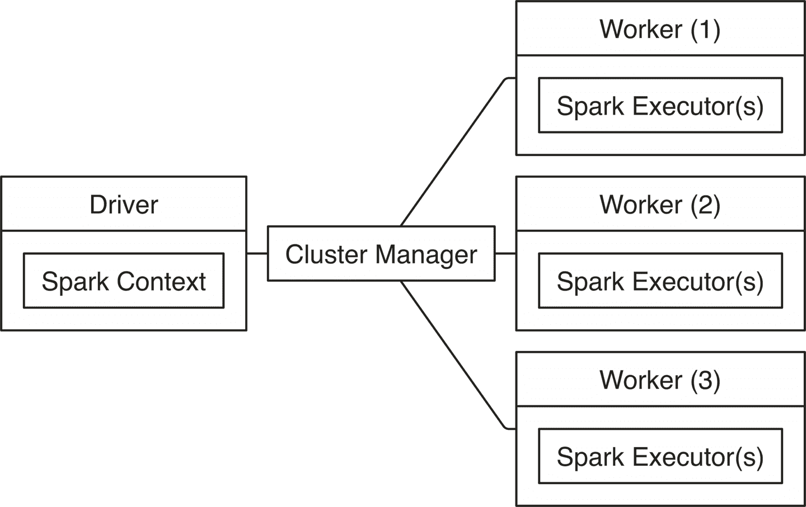
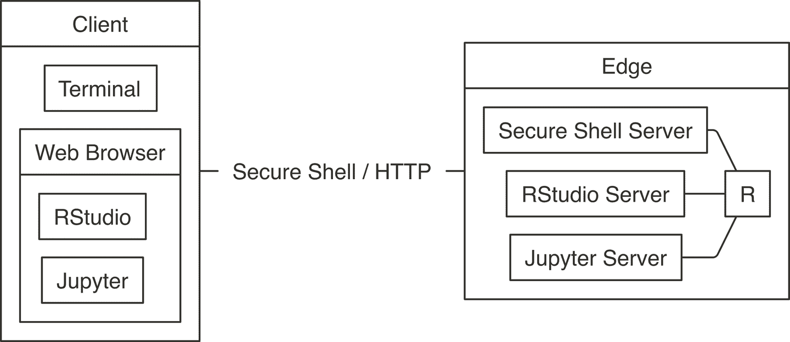
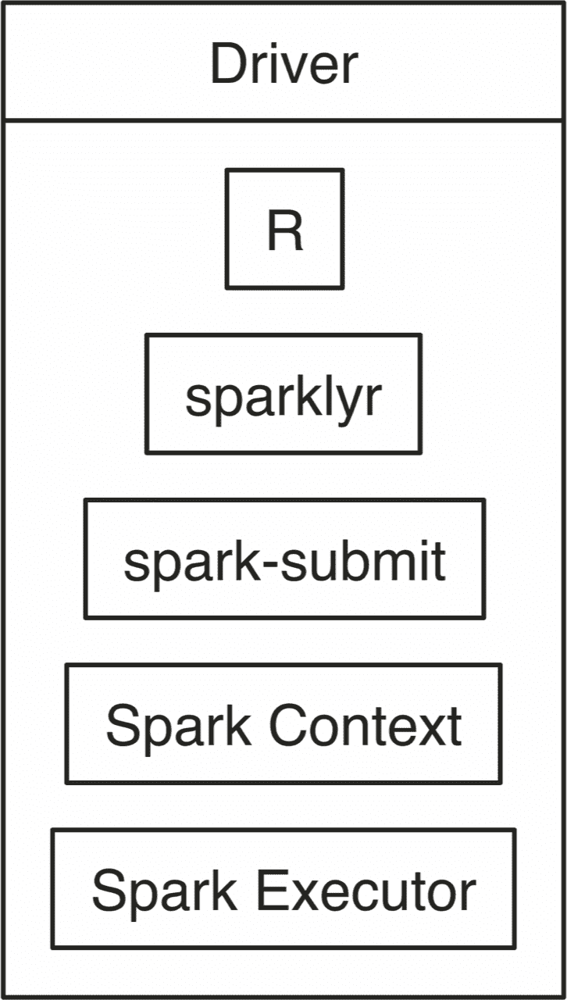
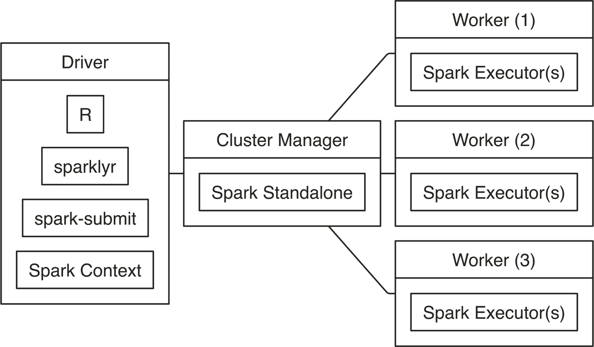
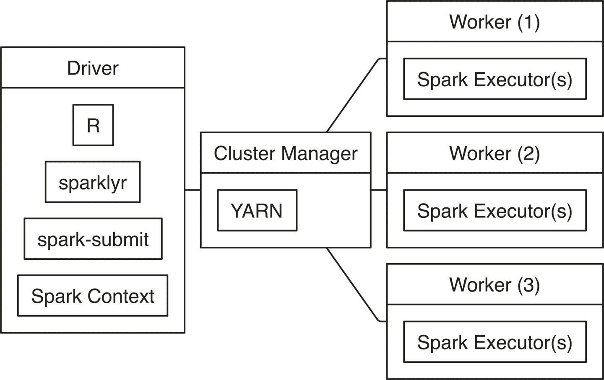
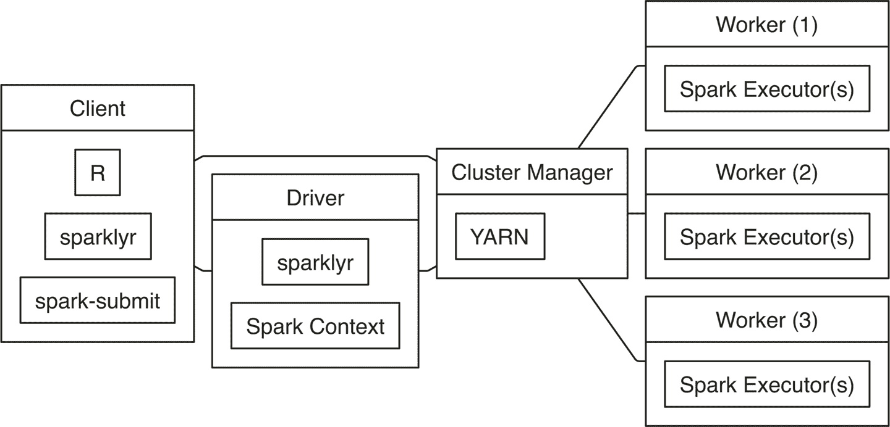
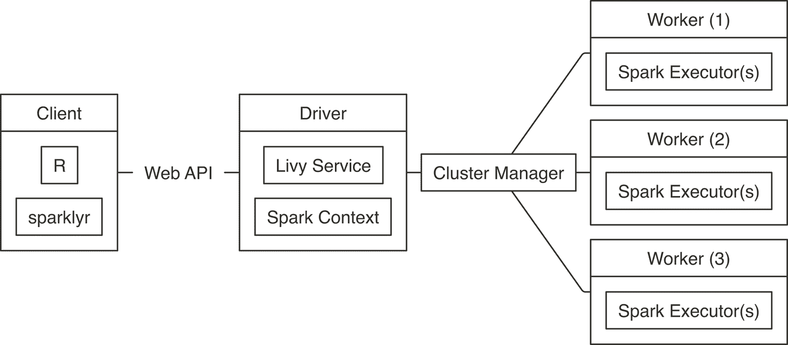
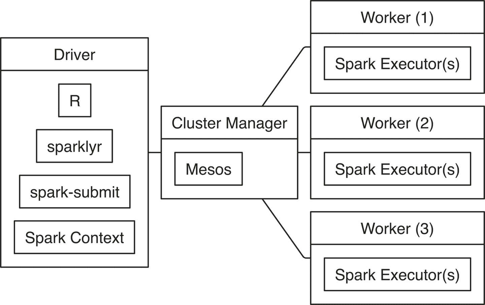
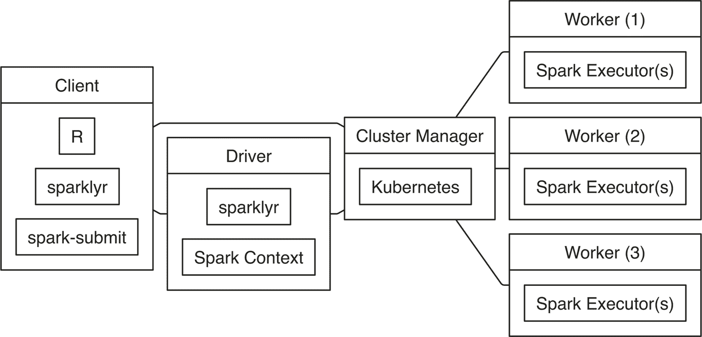

# 第七章：连接

> 他们没有选择权。
> 
> —丹妮莉丝·坦格利安

第六章 展示了主要的集群计算趋势、集群管理器、分发和云服务提供商，帮助您选择最适合您需求的 Spark 集群。相比之下，本章介绍了 Spark 集群的内部组件以及如何连接到特定的 Spark 集群。

在阅读本章时，请不要尝试执行每一行代码；这将非常困难，因为您需要准备不同的 Spark 环境。相反，如果您已经有了 Spark 集群，或者前一章激发了您注册按需集群的兴趣，现在是学习如何连接的时候了。本章帮助您连接到您已经选择的集群。如果没有集群，我们建议您先学习这些概念，然后再回来执行代码。

此外，本章提供了各种故障排除连接技术。虽然希望您不需要使用它们，但本章将您准备好使用它们作为解决连接问题的有效技术。

虽然本章可能会让人感到有些枯燥——连接和故障排除连接显然不是大规模计算中最令人兴奋的部分——它介绍了 Apache Spark 的组件以及它们如何交互，通常被称为 Apache Spark 的*架构*。本章与第八章和第九章一起，将详细介绍 Spark 的工作原理，帮助您成为能够真正理解使用 Apache Spark 进行分布式计算的中级用户。

# 概览

Spark 集群的整体连接架构由三种类型的计算实例组成：*驱动节点*、*工作节点*和*集群管理器*。集群管理器是一个允许 Spark 在集群中执行的服务；这在 “管理器” 中有详细说明。工作节点（也称为*执行者*）执行分区数据上的计算任务，并与其他工作节点或驱动节点交换中间结果。驱动节点负责将工作委派给工作节点，同时汇总它们的结果并控制计算流程。在大多数情况下，聚合发生在工作节点中；然而，即使在节点聚合数据之后，驱动节点通常也需要收集工作节点的结果。因此，驱动节点通常至少具有，但通常比工作节点拥有更多的计算资源（内存、CPU、本地存储等）。

严格来说，驱动节点和工作节点只是赋予特定角色机器的名称，而驱动节点中的实际计算由*Spark 上下文*执行。Spark 上下文是 Spark 功能的主要入口点，负责调度任务、管理存储、跟踪执行状态、指定访问配置设置、取消作业等。在工作节点中，实际计算是由*Spark executor*执行的，它是负责针对特定数据分区执行子任务的 Spark 组件。

图 7-1 说明了这一概念，驱动节点通过集群管理器协调工作节点的工作。



###### 图 7-1\. Apache Spark 连接架构

如果您的组织中已经有了 Spark 集群，您应该向集群管理员请求连接到该集群的连接信息，仔细阅读其使用政策，并遵循其建议。由于一个集群可以被多个用户共享，您希望确保仅请求您所需的计算资源。我们在第 9 章中介绍了如何请求资源。系统管理员将指定集群是*本地*还是*云*集群，使用的集群管理器，支持的*连接*和支持的*工具*。您可以使用这些信息直接跳转到适合您情况的 Local、Standalone、YARN、Mesos、Livy 或 Kubernetes。

###### 注意

使用 `spark_connect()` 连接后，您可以使用 `sc` 连接使用前面章节中介绍的所有技术；例如，您可以使用相同代码进行数据分析或建模。

## 边缘节点

计算集群配置为在节点之间实现高带宽和快速网络连接。为了优化网络连接，集群中的节点被配置为相互信任并禁用安全功能。这样可以提高性能，但需要关闭所有外部网络通信，使整个集群在整体上变得安全，除了一些仔细配置为接受外部连接的集群机器之外；从概念上讲，这些机器位于集群的“边缘”，称为*边缘节点*。

因此，在连接到 Apache Spark 之前，您可能需要先连接到集群中的一个边缘节点。有两种方法可以连接：

终端

使用计算机终端应用程序，您可以使用[安全外壳](http://bit.ly/2TE8cY9)建立到集群的远程连接；连接到集群后，您可以启动 R 然后使用`sparklyr`。然而，对于一些任务，比如探索性数据分析，终端可能不太方便，因此通常仅在配置集群或解决问题时使用。

Web 浏览器

虽然可以从终端使用`sparklyr`，但通常在边缘节点上安装*Web 服务器*更具生产力，该服务器提供通过 Web 浏览器运行带有`sparklyr`的 R 的访问。大多数情况下，您可能希望考虑使用 RStudio 或 Jupyter 而不是从终端连接。

图 7-2 通过可视化方式解释了这些概念。左边的块通常是您的 Web 浏览器，右边的块是边缘节点。在使用 Web 浏览器时，客户端和边缘节点通过 HTTP 进行通信；在使用终端时，通过安全外壳（SSH）进行通信。



###### 图 7-2\. 连接到 Spark 的边缘节点

## Spark 主页

连接到边缘节点后的下一步是确定 Spark 安装的位置，这个位置称为`SPARK_HOME`。在大多数情况下，您的集群管理员将已经设置了`SPARK_HOME`环境变量以指向正确的安装路径。如果没有，则必须获取正确的*SPARK_HOME*路径，并在运行`spark_connect()`时使用`spark_home`参数显式指定。

如果您的集群提供程序或集群管理员已为您提供了`SPARK_HOME`，则以下代码应返回路径而不是空字符串：

```
Sys.getenv("SPARK_HOME")
```

如果此代码返回空字符串，则意味着您的集群中未设置`SPARK_HOME`环境变量，因此您需要在使用`spark_connect()`时指定`SPARK_HOME`，如下所示：

```
sc <- spark_connect(master = "master", spark_home = "local/path/to/spark")
```

在这个示例中，`master`被设置为 Spark Standalone，YARN，Mesos，Kubernetes，或 Livy 的正确集群管理器主节点。

# 本地

当您连接到本地模式的 Spark 时，Spark 会启动一个单进程，该进程运行大部分集群组件，如 Spark 上下文和单个执行器。这非常适合学习 Spark、离线工作、故障排除问题或在运行大型计算集群之前测试代码。图 7-3 展示了连接到 Spark 的本地连接。



###### 图 7-3\. 本地连接图表

注意，在本地模式下，既没有集群管理器也没有工作进程，因为一切都在驱动应用程序内部运行。值得注意的是，`sparklyr`通过`spark-submit`启动 Spark 上下文，这是每个 Spark 安装中都有的脚本，允许用户提交自定义应用程序到 Spark。如果你感兴趣，第十三章解释了在`sparklyr`中提交此应用程序并从 R 正确连接时发生的内部流程。

要执行此本地连接，我们可以使用前几章节中熟悉的代码：

```
# Connect to local Spark instance
sc <- spark_connect(master = "local")
```

# 独立模式

连接到 Spark 独立集群需要集群管理器主实例的位置，您可以在集群管理器 Web 界面上找到它，如“独立”章节所述。您可以通过查找以`spark://`开头的 URL 来找到此位置。

在独立模式下的连接始于`sparklyr`，它启动`spark-submit`，然后提交`sparklyr`应用程序并创建 Spark 上下文，该上下文请求来自指定`master`地址下运行的 Spark 独立实例的执行器。

图 7-4 说明了这个过程，它与图 7-1 中的整体连接架构非常相似，但包含了针对独立集群和`sparklyr`的特定细节。



###### 图 7-4. Spark 独立连接图解

要连接，请在`spark_connect()`中使用`master = "spark://hostname:port"`，如下所示：

```
sc <- spark_connect(master = "spark://hostname:port")
```

# YARN

Hadoop YARN 是来自 Hadoop 项目的集群管理器。它是最常见的集群管理器，您可能会在以 Hadoop 集群为基础的集群中找到，包括 Cloudera、Hortonworks 和 MapR 发行版，以及在使用 Amazon EMR 时。YARN 支持两种连接模式：YARN 客户端和 YARN 集群。然而，与 YARN 集群相比，YARN 客户端模式更为常见，因为它更高效且更容易设置。

## YARN 客户端

当你以 YARN 客户端模式连接时，驱动实例运行 R、`sparklyr`和 Spark 上下文，它请求 YARN 从 YARN 获取工作节点以运行 Spark 执行器，如图 7-5 所示。



###### 图 7-5. YARN 客户端连接图解

要连接，只需运行`master = "yarn"`，如下所示：

```
sc <- spark_connect(master = "yarn")
```

在幕后，当你以 YARN 客户端模式运行时，集群管理器会执行你期望集群管理器执行的操作：从集群分配资源并将它们分配给你的 Spark 应用程序，由 Spark 上下文为您管理。在“YARN”中需要注意的重要部分是，Spark 上下文驻留在您运行 R 代码的同一台机器上；而在集群模式下运行 YARN 时则不同。

## YARN 集群

在集群模式和客户端模式下运行 YARN 的主要区别在于，在集群模式下，驱动节点不需要是运行 R 和 `sparklyr` 的节点；相反，驱动节点仍然是指定的驱动节点，通常是运行 R 的边缘节点的不同节点。当边缘节点具有过多并发用户、缺乏计算资源或需要独立管理工具（如 RStudio 或 Jupyter）时，考虑使用集群模式可能会有所帮助。

图 7-6 显示了在集群模式下运行时不同组件如何解耦。请注意，仍然存在一条连接线将客户端与集群管理器连接在一起；但是，在分配资源后，客户端直接与驱动节点通信，驱动节点再与工作节点通信。从 图 7-6 可以看出，集群模式看起来比客户端模式复杂得多——这种评估是正确的；因此，如果可能的话，最好避免使用集群模式，因为它会增加额外的配置开销。



###### 图 7-6\. YARN 集群连接图示

要在 YARN 集群模式下连接，只需运行以下命令：

```
sc <- spark_connect(master = "yarn-cluster")
```

集群模式假设运行 `spark_connect()` 的节点已经正确配置，即 `yarn-site.xml` 存在并且 `YARN_CONF_DIR` 环境变量已经正确设置。当使用 Hadoop 作为文件系统时，您还需要正确配置 `HADOOP_CONF_DIR` 环境变量。此外，您需要确保客户端和驱动节点之间的网络连接良好——不仅仅是两台机器可以相互访问，还要确保它们之间有足够的带宽。通常情况下，这些配置由系统管理员提供，不是您需要手动配置的内容。

# Livy

与需要在集群中使用边缘节点的其他连接方法相反，Livy 提供了一个 *web API*，可以从集群外访问 Spark 集群，并且不需要在客户端安装 Spark。通过 web API 连接后，*Livy 服务* 通过向集群管理器请求资源并像往常一样分发工作来启动 Spark 上下文。图 7-7 展示了一个 Livy 连接示例；请注意，客户端通过 web API 远程连接到驱动节点。



###### 图 7-7\. Livy 连接图示

通过 Livy 连接需要 Livy 服务的 URL，类似于 `https://hostname:port/livy`。由于允许远程连接，连接通常至少需要基本认证：

```
sc <- spark_connect(
  master = "https://hostname:port/livy",
  method = "livy", config = livy_config(
    spark_version = "2.3.1",
    username = "<username>",
    password = "<password>"
  ))
```

要在本地机器上尝试 Livy，您可以安装和运行 Livy 服务，如“Livy”章节所述，然后按以下方式连接：

```
sc <- spark_connect(
  master = "http://localhost:8998",
  method = "livy",
  version = "2.3.1")
```

连接通过 Livy 后，您可以使用任何`sparklyr`功能；但是，Livy 不适合探索性数据分析，因为执行命令会有显著的性能成本。尽管如此，在运行长时间计算时，这种开销可能被认为是不重要的。总的来说，您应该尽量避免使用 Livy，并直接在集群的边缘节点上工作；当不可行时，使用 Livy 可能是一个合理的方法。

###### 注意

通过`spark_version`参数指定 Spark 版本是可选的；但是，当指定版本时，通过部署与给定版本兼容的预编译 Java 二进制文件，可以显著提高性能。因此，连接到 Spark 使用 Livy 时最佳实践是指定 Spark 版本。

# Mesos

与 YARN 类似，Mesos 支持客户端模式和集群模式；但是，`sparklyr`目前仅支持 Mesos 下的客户端模式。因此，图 7-8 所示的图表与仅将集群管理器从 YARN 更改为 Mesos 的 YARN 客户端图表相当。



###### 图 7-8\. Mesos 连接图

连接需要 Mesos 主节点的地址，通常形式为`mesos://host:port`或者对于使用 ZooKeeper 的 Mesos 为`mesos://zk://host1:2181,host2:2181,host3:2181/mesos`：

```
sc <- spark_connect(master = "mesos://host:port")
```

当您在本地机器上运行 Mesos 时，需要由系统管理员或手动设置`MESOS_NATIVE_JAVA_LIBRARY`环境变量。例如，在 macOS 上，您可以从终端安装和初始化 Mesos，然后手动设置`mesos`库并使用`spark_connect()`连接：

```
brew install mesos
/usr/local/Cellar/mesos/1.6.1/sbin/mesos-master --registry=in_memory
  --ip=127.0.0.1 MESOS_WORK_DIR=. /usr/local/Cellar/mesos/1.6.1/sbin/mesos-slave
  --master=127.0.0.1:5050
```

```
Sys.setenv(MESOS_NATIVE_JAVA_LIBRARY =
             "/usr/local/Cellar/mesos/1.6.1/lib/libmesos.dylib")

sc <- spark_connect(master = "mesos://localhost:5050",
                    spark_home = spark_home_dir())
```

# Kubernetes

Kubernetes 集群不支持像 Mesos 或 YARN 那样的客户端模式；相反，连接模型类似于 YARN 集群，其中由 Kubernetes 分配驱动节点，如图 7-9 所示。



###### 图 7-9\. Kubernetes 连接图

要使用 Kubernetes，您需要准备一个安装了 Spark 并正确配置的虚拟机；但是，本书不涵盖如何创建虚拟机的范围。一旦创建，连接到 Kubernetes 的工作方式如下：

```
library(sparklyr)
sc <- spark_connect(config = spark_config_kubernetes(
  "k8s://https://<apiserver-host>:<apiserver-port>",
  account = "default",
  image = "docker.io/owner/repo:version",
  version = "2.3.1"))
```

如果您的计算机已配置为使用 Kubernetes 集群，您可以使用以下命令查找`apiserver-host`和`apiserver-port`：

```
system2("kubectl", "cluster-info")
```

# 云端

当您使用云服务提供商时，有几点连接差异。例如，从 Databricks 连接需要以下连接方法：

```
sc <- spark_connect(method = "databricks")
```

由于 Amazon EMR 使用 YARN，您可以使用`master = "yarn"`连接：

```
sc <- spark_connect(master = "yarn")
```

当使用 IBM 的 Watson Studio 连接到 Spark 时，需要通过 IBM 提供的 `load_spark_kernels()` 函数检索配置对象：

```
kernels <- load_spark_kernels()
sc <- spark_connect(config = kernels[2])
```

在 Microsoft Azure HDInsights 和使用 ML 服务（R Server）时，Spark 连接初始化如下：

```
library(RevoScaleR)
cc <- rxSparkConnect(reset = TRUE, interop = "sparklyr")
sc <- rxGetSparklyrConnection(cc)
```

从 Qubole 连接需要使用 `qubole` 连接方法：

```
sc <- spark_connect(method = "qubole")
```

如果需要帮助，请参考您的云服务提供商的文档和支持渠道。

# 批处理

大部分时间，您会交互式地使用 `sparklyr`；也就是说，您会明确使用 `spark_connect()` 进行连接，然后执行命令来分析和建模大规模数据。然而，您也可以通过调度使用 `sparklyr` 的 Spark 作业来自动化流程。Spark 并没有提供调度数据处理任务的工具；相反，您可以使用其他工作流管理工具。这对于在夜间转换数据、准备模型和得分数据或通过其他系统利用 Spark 非常有用。

例如，您可以创建一个名为 `batch.R` 的文件，其内容如下：

```
library(sparklyr)

sc <- spark_connect(master = "local")

sdf_len(sc, 10) %>% spark_write_csv("batch.csv")

spark_disconnect(sc)
```

您随后可以使用 `spark_submit()` 将此应用程序以批处理模式提交到 Spark；`master` 参数应适当设置：

```
spark_submit(master = "local", "batch.R")
```

您还可以直接从 shell 中通过以下方式调用 `spark-submit`：

```
/spark-home-path/spark-submit
  --class sparklyr.Shell '/spark-jars-path/sparklyr-2.3-2.11.jar'
  8880 12345 --batch /path/to/batch.R
```

最后的参数表示端口号 `8880` 和会话号 `12345`，您可以将其设置为任何唯一的数值标识符。您可以使用以下 R 代码获取正确的路径：

```
# Retrieve spark-home-path
spark_home_dir()

# Retrieve spark-jars-path
system.file("java", package = "sparklyr")
```

您可以通过向 `spark-submit` 传递额外的命令行参数来自定义脚本，然后在 R 中使用 `commandArgs()` 读取这些参数。

# 工具

当使用像 Jupyter 和 RStudio 这样的工具连接到 Spark 集群时，您可以运行本章中提供的相同连接参数。然而，由于许多云提供商使用 Web 代理来保护 Spark 的 Web 界面，要使用 `spark_web()` 或 RStudio Connections 窗格扩展，您需要正确配置 `sparklyr.web.spark` 设置，然后通过 `config` 参数传递给 `spark_config()`。

例如，在使用 Amazon EMR 时，您可以通过动态检索 YARN 应用程序和构建 EMR 代理 URL 来配置 `sparklyr.web.spark` 和 `sparklyr.web.yarn`：

```
domain <- "http://ec2-12-345-678-9.us-west-2.compute.amazonaws.com"
config <- spark_config()
config$sparklyr.web.spark <- ~paste0(
  domain, ":20888/proxy/", invoke(spark_context(sc), "applicationId"))
config$sparklyr.web.yarn <- paste0(domain, ":8088")

sc <- spark_connect(master = "yarn", config = config)
```

# 多连接

通常只需一次连接到 Spark。但是，您也可以通过连接到不同的集群或指定 `app_name` 参数来打开多个连接到 Spark。这对于比较 Spark 版本或在提交到集群之前验证分析结果非常有帮助。以下示例打开到 Spark 1.6.3、2.3.0 和 Spark Standalone 的连接：

```
# Connect to local Spark 1.6.3
sc_16 <- spark_connect(master = "local", version = "1.6")

# Connect to local Spark 2.3.0
sc_23 <- spark_connect(master = "local", version = "2.3", appName = "Spark23")

# Connect to local Spark Standalone
sc_standalone <- spark_connect(master = "spark://host:port")
```

最后，您可以断开每个连接：

```
spark_disconnect(sc_1_6_3)
spark_disconnect(sc_2_3_0)
spark_disconnect(sc_standalone)
```

或者，您也可以一次断开所有连接：

```
spark_disconnect_all()
```

# 故障排除

最后但同样重要的是，我们介绍以下排查技术：*日志记录*、*Spark 提交*和*Windows*。当对如何开始感到犹豫不决时，请从使用 Windows 系统的 Windows 部分开始，然后是日志记录，最后是 Spark 提交。在使用`spark_connect()`时失败并显示错误消息时，这些技术非常有用。

## 日志记录

排查连接问题的第一技术是直接将 Spark 日志打印到控制台，以帮助您发现额外的错误消息：

```
sc <- spark_connect(master = "local", log = "console")
```

此外，当连接时，您可以通过将`sparklyr.verbose`选项设置为`TRUE`来启用详细日志记录：

```
sc <- spark_connect(master = "local", log = "console",
                    config = list(sparklyr.verbose = TRUE))
```

## 提交 Spark 作业

您可以通过运行示例作业通过`spark-submit`来诊断连接问题是否特定于 R 或 Spark：

```
# Find the spark directory using an environment variable
spark_home <- Sys.getenv("SPARK_HOME")

# Or by getting the local spark installation
spark_home <- sparklyr::spark_home_dir()
```

然后，通过将`"local"`替换为您正在排查的正确主节点参数，执行样本计算 Pi 示例：

```
# Launching a sample application to compute Pi
system2(
  file.path(spark_home, "bin", "spark-submit"),
  c(
    "--master", "local",
    "--class", "org.apache.spark.examples.SparkPi",
    dir(file.path(spark_home, "examples", "jars"),
        pattern = "spark-examples", full.names = TRUE),
    100),
  stderr = FALSE
)
```

```
Pi is roughly 3.1415503141550314
```

如果未显示前述消息，则需要调查您的 Spark 集群为何未正确配置，这超出了本书的范围。作为开始，重新运行 Pi 示例但删除`stderr = FALSE`；这会将错误打印到控制台，您可以使用这些错误来调查可能出现的问题。在使用云提供商或 Spark 分发时，您可以联系其支持团队以帮助您进一步排查；否则，Stack Overflow 是一个很好的起点。

如果您看到该消息，则表示您的 Spark 集群已正确配置，但某种方式 R 无法使用 Spark，因此您需要详细排查问题，如我们将在接下来解释的那样。

### 详细排查

要详细排查连接过程，您可以手动复制两步连接过程，这通常非常有助于诊断连接问题。首先，从 R 触发`spark-submit`，将应用程序提交到 Spark；其次，R 连接到运行中的 Spark 应用程序。

首先，确定 Spark 安装目录和运行以下命令来查找正确的`sparklyr*.jar`文件的路径：

```
dir(system.file("java", package = "sparklyr"),
    pattern = "sparklyr", full.names = T)
```

确保您识别与您的 Spark 集群匹配的正确版本，例如，适用于 Spark 2.1 的`sparklyr-2.1-2.11.jar`。

然后，从终端运行以下命令：

```
$SPARK_HOME/bin/spark-submit --class sparklyr.Shell $PATH_TO_SPARKLYR_JAR 8880 42
```

```
18/06/11 12:13:53 INFO sparklyr: Session (42) found port 8880 is available
18/06/11 12:13:53 INFO sparklyr: Gateway (42) is waiting for sparklyr client
                                 to connect to port 8880
```

参数`8880`代表在`sparklyr`中使用的默认端口，而 42 是会话号码，它是由`sparklyr`生成的密码安全数字，但出于排查目的可以简单地是`42`。

如果此第一连接步骤失败，则表示集群无法接受该应用程序。这通常意味着资源不足或存在权限限制。

第二步是从 R 连接如下（请注意，有一个 60 秒的超时，因此您需要在运行终端命令后运行 R 命令；如果需要，您可以按照第九章中描述的配置此超时）：

```
library(sparklyr)
sc <- spark_connect(master = "sparklyr://localhost:8880/42", version = "2.3")
```

如果第二次连接尝试失败，通常意味着 R 和驱动节点之间存在连接问题。你可以尝试使用不同的连接端口。

## Windows

在大多数情况下，从 Windows 连接与从 Linux 和 macOS 连接一样简单。但是，有一些常见的连接问题需要注意：

+   防火墙和防病毒软件可能会阻止连接端口。`sparklyr` 使用的默认端口是 `8880`；请确保此端口未被阻止。

+   长路径名可能会导致问题，特别是在像 Windows 7 这样的旧系统中。当使用这些系统时，尝试使用最多八个字符且名称中不包含空格的所有文件夹安装的 Spark 进行连接。

# 小结

本章概述了 Spark 的架构、连接概念，并提供了在本地模式、独立模式、YARN、Mesos、Kubernetes 和 Livy 连接的示例。还介绍了边缘节点及其在连接到 Spark 集群时的角色。这些信息应足以帮助你成功连接到任何 Apache Spark 集群。

若要解决本章未描述的连接问题，请建议在 Stack Overflow、[`sparklyr` 问题 GitHub 页面](http://bit.ly/2Z72XWa)，以及必要时在 [新的 `sparklyr` GitHub 问题](http://bit.ly/2HasCmq) 中进一步协助。

在 第八章 中，我们介绍了如何使用 Spark 从各种数据源和格式读取和写入数据，这使得您在添加新数据源进行数据分析时更加灵活。过去可能需要花费几天、几周甚至几个月的工作，现在可以在几小时内完成。
