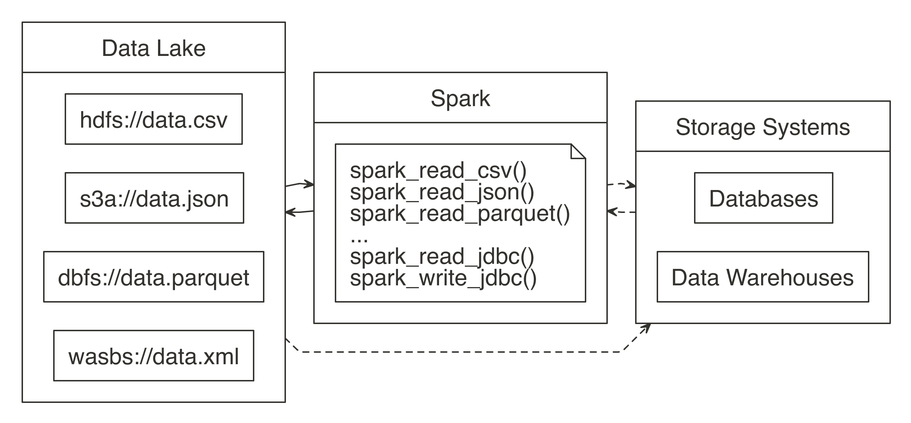
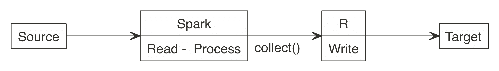
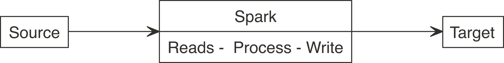
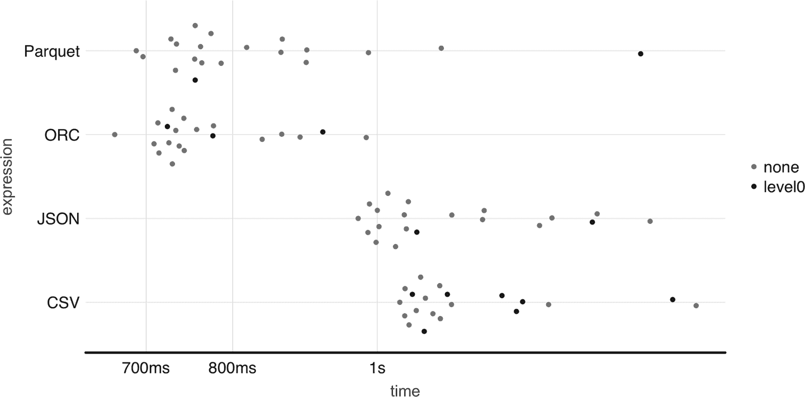

# 第八章：数据

> 你有没有想过她可能并不是一个可靠的信息来源？
> 
> —琼恩·雪诺

借助前几章所学，你现在具备了开始规模化分析和建模的知识！然而，到目前为止，我们还没有详细解释如何将数据读入 Spark。我们探讨了如何使用`copy_to()`上传小数据集或者像`spark_read_csv()`或`spark_write_csv()`这样的函数，但并没有详细解释其具体操作和原因。

所以，你即将学习如何使用 Spark 读取和写入数据。而且，虽然这本身很重要，但本章还将向你介绍*数据湖*——一个以其自然或原始格式存储数据的仓库，相比现有的存储架构，它提供了各种好处。例如，你可以轻松地集成来自外部系统的数据，而无需将其转换为通用格式，也无需假设这些来源与你内部数据源一样可靠。

此外，我们还将讨论如何扩展 Spark 的能力，以处理默认情况下无法访问的数据，并提出几条关于优化读写数据性能的建议。要读取大型数据集通常需要微调你的 Spark 集群配置，但这是第九章的主题。

# 概述

在第一章中，你了解到除了大数据和大计算之外，你还可以使用 Spark 来提高数据任务中的速度、多样性和真实性。虽然你可以将本章的学习应用于任何需要加载和存储数据的任务，但将本章放在处理多种数据源的背景下尤为有趣。要理解原因，我们首先应该快速了解一下当前许多组织如何处理数据。

多年来，将大型数据集存储在关系型*数据库*中已经成为一种常见做法，这个系统最早由 Edgar F. Codd 在 1970 年提出。¹ 你可以将数据库视为一个相互关联的表集合，每个表都精心设计以容纳特定的数据类型和与其他表的关系。大多数关系型数据库系统使用*结构化查询语言*（SQL）进行查询和维护数据库。数据库至今仍然被广泛使用，理由很充分：它们可靠而一致地存储数据；事实上，你的银行可能正是将账户余额存储在数据库中，这是一个良好的实践。

然而，数据库还被用来存储来自其他应用程序和系统的信息。例如，您的银行还可能存储其他银行产生的数据，如进账支票。为了完成这个任务，外部数据需要从外部系统中提取出来，转换为适合当前数据库的形式，最后加载到其中。这被称为*提取、转换和加载*（ETL），这是将数据从一个或多个源复制到表示与源数据不同的目标系统的一般过程。ETL 过程在 1970 年代变得流行起来。

除了数据库外，数据通常还加载到*数据仓库*中，这是用于报告和数据分析的系统。数据通常以增加数据分析速度的格式存储和索引，但通常不适合建模或运行定制分布式代码。挑战在于改变数据库和数据仓库通常是一个漫长而微妙的过程，因为需要重新索引数据，并且来自多个数据源的数据需要小心地转换为在所有数据源之间共享的单一表格。

而不是试图将所有数据源转换为通用格式，您可以在*数据湖*中接受这种多样化的数据源，即一种以其自然格式存储的数据系统或数据存储库（参见图 8-1）。由于数据湖使数据以其原始格式可用，因此无需事先仔细转换它；任何人都可以用它进行分析，这增加了与 ETL 相比的显著灵活性。然后，您可以使用 Spark 通过一个可在所有这些数据源上扩展的单一接口统一来自数据湖、数据库和数据仓库的数据处理。一些组织还使用 Spark 替换其现有的 ETL 过程；然而，这超出了本书的范围，我们在图 8-1 中用虚线来说明这一点。



###### 图 8-1\. Spark 处理来自数据湖、数据库和数据仓库的原始数据

为了支持广泛的数据源，Spark 需要能够读取和写入多种不同的文件格式（CSV、JSON、Parquet 等），并且在存储在多个文件系统中的数据（HDFS、S3、DBFS 等）中访问它们，并且可能与其他存储系统（数据库、数据仓库等）进行互操作。我们会讲到所有这些内容，但首先，我们将开始介绍如何使用 Spark 读取、写入和复制数据。

# 读取数据

如果您是 Spark 的新手，在开始处理大型数据集之前，强烈建议您先审查本节内容。我们将介绍几种提高读取数据速度和效率的技术。每个子节都介绍了利用 Spark 读取文件的特定方法，例如能够将整个文件夹视为数据集以及能够描述它们以在 Spark 中更快地读取数据集。

## 路径

在分析数据时，将多个文件加载到单个数据对象中是一种常见情况。在 R 中，我们通常使用循环或函数式编程指令来完成这个任务。这是因为 R 必须将每个文件单独加载到您的 R 会话中。让我们先在一个文件夹中创建几个 CSV 文件，然后用 R 读取它们：

```
letters <- data.frame(x = letters, y = 1:length(letters))

dir.create("data-csv")
write.csv(letters[1:3, ], "data-csv/letters1.csv", row.names = FALSE)
write.csv(letters[1:3, ], "data-csv/letters2.csv", row.names = FALSE)

do.call("rbind", lapply(dir("data-csv", full.names = TRUE), read.csv))
```

```
  x y
1 a 1
2 b 2
3 c 3
4 a 1
5 b 2
6 c 3
```

在 Spark 中，有一个将文件夹视为数据集的概念。而不是枚举每个文件，只需传递包含所有文件的路径。Spark 假定该文件夹中的每个文件都是同一个数据集的一部分。这意味着目标文件夹应仅用于数据目的。这一点尤为重要，因为像 HDFS 这样的存储系统会将文件存储在多台机器上，但从概念上讲，它们存储在同一个文件夹中；当 Spark 从此文件夹读取文件时，实际上是在执行分布式代码以在每台机器上读取每个文件 —— 在分布式文件读取时，不会在机器之间传输数据：

```
library(sparklyr)
sc <- spark_connect(master = "local", version = "2.3")

spark_read_csv(sc, "data-csv/")
```

```
# Source: spark<datacsv> [?? x 2]
   x         y
   <chr> <int>
 1 a         1
 2 b         2
 3 c         3
 4 d         4
 5 e         5
 6 a         1
 7 b         2
 8 c         3
 9 d         4
10 e         5
```

“文件夹作为表格”的想法在其他开源技术中也可以找到。在底层，Hive 表的工作方式相同。当您查询 Hive 表时，映射是在同一文件夹中的多个文件上完成的。该文件夹的名称通常与用户可见的表格名称相匹配。

接下来，我们将介绍一种技术，允许 Spark 更快地读取文件，并通过提前描述数据集的结构来减少读取失败的情况。

## 模式

在读取数据时，Spark 能够确定数据源的列名和列类型，也称为*模式*。然而，猜测模式会带来成本；Spark 需要对数据进行初始扫描来猜测数据类型。对于大型数据集，这可能会为数据摄取过程增加显著的时间成本，即使对于中等大小的数据集也是如此。对于反复读取的文件，额外的读取时间会随着时间的推移累积。

为了避免这种情况，Spark 允许您通过提供 `columns` 参数来定义列，描述您的数据集。您可以通过自己取样原始文件的一个小部分来创建这个模式：

```
spec_with_r <- sapply(read.csv("data-csv/letters1.csv", nrows = 10), class)
spec_with_r
```

```
        x         y
 "factor" "integer"
```

或者，您可以将列规范设置为包含显式列类型的向量。向量的值被命名以匹配字段名称：

```
spec_explicit <- c(x = "character", y = "numeric")
spec_explicit
```

```
          x           y
"character"   "numeric"
```

接受的变量类型包括：`integer`、`character`、`logical`、`double`、`numeric`、`factor`、`Date` 和 `POSIXct`。

然后，在使用`spark_read_csv()`读取时，可以将`spec_with_r`传递给`columns`参数，以匹配原始文件的名称和类型。这有助于提高性能，因为 Spark 无需确定列类型。

```
spark_read_csv(sc, "data-csv/", columns = spec_with_r)
```

```
# Source: spark<datacsv> [?? x 2]
  x         y
  <chr> <int>
1 a         1
2 b         2
3 c         3
4 a         1
5 b         2
6 c         3
```

下面的示例显示如何将字段类型设置为不同的内容。但是，新字段类型必须是原始数据集中的兼容类型。例如，您不能将`character`字段设置为`numeric`。如果使用不兼容的类型，文件读取将失败并显示错误。此外，以下示例还更改了原始字段的名称：

```
spec_compatible <- c(my_letter = "character", my_number = "character")

spark_read_csv(sc, "data-csv/", columns = spec_compatible)
```

```
# Source: spark<datacsv> [?? x 2]
  my_letter my_number
  <chr>     <chr>
1 a         1
2 b         2
3 c         3
4 a         1
5 b         2
6 c         3
```

在 Spark 中，格式错误的条目可能会在读取时引发错误，特别是对于非字符字段。为了避免这种错误，我们可以使用一个文件规范，将它们导入为字符，然后使用`dplyr`将字段强制转换为所需的类型。

本小节回顾了如何更快地读取文件并减少失败，这使我们能够更快地开始分析。加速分析的另一种方法是将更少的数据加载到 Spark 内存中，这将在下一节中进行探讨。

## 内存

默认情况下，在使用 R 语言与 Spark 时，当您读取数据时，数据会被复制到 Spark 的分布式内存中，使得数据分析和其他操作非常快速。有些情况下，比如数据量太大时，加载所有数据可能并不切实际，甚至是不必要的。对于这些情况，Spark 可以只是“映射”文件，而不将数据复制到内存中。

映射在 Spark 中创建了一种虚拟表。其含义是，当针对该表运行查询时，Spark 需要在那时从文件中读取数据。之后的任何连续读取也将执行相同操作。实际上，Spark 成为数据的传递。该方法的优点是几乎没有“读取”文件的前期时间成本；映射非常快速。缺点是实际提取数据的查询将需要更长时间。

这由读取函数的`memory`参数控制。将其设置为`FALSE`可以防止数据复制（默认为`TRUE`）：

```
mapped_csv <- spark_read_csv(sc, "data-csv/", memory = FALSE)
```

这种方法有很好的使用案例，其中之一是当不需要表的所有列时。例如，假设有一个包含许多列的非常大的文件。假设这不是您第一次与这些数据互动，您将知道分析所需的列。当您知道需要哪些列时，可以使用`memory = FALSE`读取文件，然后使用`dplyr`选择所需的列。然后可以将生成的`dplyr`变量缓存到内存中，使用`compute()`函数。这将使 Spark 查询文件（们），提取所选字段，并仅将该数据复制到内存中。结果是一个内存中的表，相对较少的时间用于摄入：

```
mapped_csv %>%
  dplyr::select(y) %>%
  dplyr::compute("test")
```

下一节介绍了一个简短的技术，使得更容易携带导入数据的原始字段名称。

## 列

Spark 1.6 要求列名进行过滤，所以 R 默认会这样做。也许有些情况下你希望保留原始的列名，或者在使用 Spark 2.0 或更高版本时。要实现这一点，将 `sparklyr.sanitize.column.names` 选项设置为 `FALSE`：

```
options(sparklyr.sanitize.column.names = FALSE)
copy_to(sc, iris, overwrite = TRUE)
```

```
# Source:   table<iris> [?? x 5]
# Database: spark_connection
   Sepal.Length Sepal.Width Petal.Length Petal.Width Species
          <dbl>       <dbl>        <dbl>       <dbl> <chr>
 1          5.1         3.5          1.4         0.2 setosa
 2          4.9         3            1.4         0.2 setosa
 3          4.7         3.2          1.3         0.2 setosa
 4          4.6         3.1          1.5         0.2 setosa
 5          5           3.6          1.4         0.2 setosa
 6          5.4         3.9          1.7         0.4 setosa
 7          4.6         3.4          1.4         0.3 setosa
 8          5           3.4          1.5         0.2 setosa
 9          4.4         2.9          1.4         0.2 setosa
10          4.9         3.1          1.5         0.1 setosa
# ... with more rows
```

在这次对如何将数据读入 Spark 进行回顾之后，我们继续探讨如何从 Spark 会话中写入数据。

# 写入数据

一些项目要求在 Spark 中生成的新数据被写回到远程源。例如，数据可能是由 Spark 模型返回的新预测值。作业处理了大量的预测生成，但接下来需要存储这些预测结果。本节重点讨论了如何使用 Spark 将数据从 Spark 移动到外部目的地。

许多新用户开始通过下载 Spark 数据到 R，然后再上传到目标位置，如 图 8-2 所示。这对较小的数据集有效，但对于较大的数据集则效率低下。数据通常会增长到无法让 R 成为中间环节的规模。



###### 图 8-2\. 在写入大型数据集时误用 Spark

应尽一切努力让 Spark 连接到目标位置。这样一来，读取、处理和写入就都在同一个 Spark 会话中完成。

如 图 8-3 所示，一个更好的方法是使用 Spark 来读取、处理和写入目标位置。这种方法能够扩展到 Spark 集群允许的规模，并且避免了 R 成为瓶颈。



###### 图 8-3\. 在写入大型数据集时正确使用 Spark

考虑以下情景：一个 Spark 作业刚刚处理了一个大型数据集的预测结果，生成了大量的预测值。选择如何写入结果将取决于你所工作的技术基础设施。更具体地说，它将取决于 Spark 和目标是否在同一个集群中运行。

回到我们的情景，我们有一个需要保存的大型 Spark 数据集。当 Spark 和目标位于同一个集群中时，复制结果并不成问题；数据传输可以在同一集群的内存和磁盘之间高效地进行或通过高带宽连接进行有效的洗牌。

但是如果目标不在 Spark 集群内怎么办？有两个选择，选择其中一个将取决于数据的大小和网络速度：

Spark 传输

在这种情况下，Spark 连接到远程目标位置并复制新数据。如果这是在同一个数据中心或云服务提供商内完成的，数据传输可能足够快，以便让 Spark 直接写入数据。

外部传输和其他

Spark 可以将结果写入磁盘，并通过第三方应用程序传输它们。Spark 将结果写入文件，然后单独的作业将文件复制过去。在目标位置，你将使用单独的进程将数据转移到目标位置。

最好认识到 Spark、R 和其他技术都只是工具。没有工具可以做到所有事情，也不应该期望它可以。接下来我们描述如何将数据复制到 Spark 或收集不适合内存的大型数据集，这可以用于跨集群传输数据或帮助初始化分布式数据集。

# 复制数据

之前的章节使用 `copy_to()` 作为一个方便的辅助工具将数据复制到 Spark 中；然而，你只能使用 `copy_to()` 来传输已加载到内存中的内存数据集。这些数据集通常比你想要复制到 Spark 中的数据集小得多。

例如，假设我们有一个生成的 3 GB 数据集：

```
dir.create("largefile.txt")
write.table(matrix(rnorm(10 * 10⁶), ncol = 10), "largefile.txt/1",
            append = T, col.names = F, row.names = F)
for (i in 2:30)
  file.copy("largefile.txt/1", paste("largefile.txt/", i))
```

如果驱动节点只有 2 GB 内存，我们将无法使用 `copy_to()` 将这个 3 GB 文件加载到内存中。相反，当在你的集群中使用 HDFS 作为存储时，你可以使用 `hadoop` 命令行工具从终端将文件从磁盘复制到 Spark 中。请注意，以下代码仅在使用 HDFS 的集群中有效，而不适用于本地环境。

```
hadoop fs -copyFromLocal largefile.txt largefile.txt
```

然后，你可以按照 “文件格式” 部分中描述的方式读取上传的文件；对于文本文件，你可以运行：

```
spark_read_text(sc, "largefile.txt", memory = FALSE)
```

```
# Source: spark<largefile> [?? x 1]
   line
   <chr>
 1 0.0982531064914565 -0.577567317599452 -1.66433938237253 -0.20095089489…
 2 -1.08322304504007 1.05962389624635 1.1852771207729 -0.230934710049462 …
 3 -0.398079835552421 0.293643382374479 0.727994248743204 -1.571547990532…
 4 0.418899768227183 0.534037617828835 0.921680317620166 -1.6623094393911…
 5 -0.204409401553028 -0.0376212693728992 -1.13012269711811 0.56149527218…
 6 1.41192628218417 -0.580413572014808 0.727722566256326 0.5746066486689 …
 7 -0.313975036262443 -0.0166426329807508 -0.188906975208319 -0.986203251…
 8 -0.571574679637623 0.513472254005066 0.139050812059352 -0.822738334753…
 9 1.39983023148955 -1.08723592838627 1.02517804413913 -0.412680186313667…
10 0.6318328148434 -1.08741784644221 -0.550575696474202 0.971967251067794…
# … with more rows
```

`collect()` 存在一个类似的限制，即它只能收集适合驱动器内存的数据集；然而，如果你需要从 Spark 中通过驱动节点提取大型数据集，可以使用分布式存储提供的专用工具。对于 HDFS，你可以运行以下命令：

```
hadoop fs -copyToLocal largefile.txt largefile.txt
```

或者，你也可以通过向 `collect()` 提供回调来收集不适合内存的数据集。回调只是一个将在每个 Spark 分区上调用的 R 函数。然后你可以将这些数据集写入磁盘或通过网络推送到其他集群。

即使驱动节点收集此数据集的内存少于 3 GB，你仍然可以使用以下代码收集 3 GB 数据。尽管如此，正如第三章所解释的那样，应避免将大型数据集收集到单台机器上，因为这会导致显著的性能瓶颈。为了简洁起见，我们只收集前一百万行；如果你有几分钟可以花费，可以删除 `head(10⁶)`：

```
dir.create("large")
spark_read_text(sc, "largefile.txt", memory = FALSE) %>%
  head(10⁶) %>%
  collect(callback = function(df, idx) {
    writeLines(df$line, paste0("large/large-", idx, ".txt"))
  })
```

确保清理这些大文件并清空回收站：

```
unlink("largefile.txt", recursive = TRUE)
unlink("large", recursive = TRUE)
```

在大多数情况下，数据已经存储在集群中，因此你不需要担心复制大型数据集；相反，你通常可以专注于读取和写入不同的文件格式，我们接下来会描述。

# 文件格式

Spark 可以直接与多种文件格式交互，如 CSV、JSON、LIBSVM、ORC 和 Parquet。表 8-1 将文件格式映射到应在 Spark 中使用的函数。

表 8-1\. Spark 读写文件格式的函数

| 格式 | 读取 | 写入 |
| --- | --- | --- |
| CSV | `spark_read_csv()` | `spark_write_csv()` |
| JSON | `spark_read_json()` | `spark_write_json()` |
| LIBSVM | `spark_read_libsvm()` | `spark_write_libsvm()` |
| ORC | `spark_read_orc()` | `spark_write_orc()` |
| Apache Parquet | `spark_read_parquet()` | `spark_write_parquet()` |
| 文本 | `spark_read_text()` | `spark_write_text()` |

下面的部分将描述特定于每种文件格式的特殊考虑事项，以及一些流行文件格式的优缺点，从广为人知的 CSV 文件格式开始。

## CSV

CSV 格式可能是当今最常用的文件类型。它由一个文本文件组成，以给定字符分隔，通常是逗号。读取 CSV 文件应该相当简单；然而，值得一提的是一些可以帮助您处理不完全符合规范的 CSV 文件的技术。Spark 提供了以下处理解析问题的模式：

宽容模式

插入 NULL 值以代替缺失的令牌

放弃格式不正确的行

删除格式不正确的行

快速失败

如果遇到任何格式不正确的行则中止

在`sparklyr`中，您可以通过将它们传递给`options`参数来使用这些。以下示例创建了一个带有损坏条目的文件。然后展示了如何将其读入 Spark：

```
## Creates bad test file
writeLines(c("bad", 1, 2, 3, "broken"), "bad.csv")

spark_read_csv(
  sc,
  "bad3",
  "bad.csv",
  columns = list(foo = "integer"),
  options = list(mode = "DROPMALFORMED"))
```

```
# Source: spark<bad3> [?? x 1]
    foo
  <int>
1     1
2     2
3     3
```

Spark 提供了一个默认隐藏的问题追踪列。要启用它，请将`_corrupt_record`添加到`columns`列表中。您可以将其与使用`PERMISSIVE`模式结合使用。所有行将被导入，无效条目将接收`NA`，并在`_corrupt_record`列中跟踪问题：

```
spark_read_csv(
  sc,
  "bad2",
  "bad.csv",
  columns = list(foo = "integer", "_corrupt_record" = "character"),
  options = list(mode = "PERMISSIVE")
)
```

```
# Source: spark<bad2> [?? x 2]
    foo `_corrupt_record`
  <int> <chr>
1     1 NA
2     2 NA
3     3 NA
4    NA broken
```

将数据读取和存储为 CSV 文件是相当常见的，并且在大多数系统中都得到支持。对于表格数据集，这仍然是一个流行的选项，但对于包含嵌套结构和非表格数据的数据集，通常更喜欢使用 JSON。

## JSON

JSON 是最初源自 JavaScript 并因其灵活性和普遍支持而变得与语言无关且非常流行的文件格式。读写 JSON 文件非常简单：

```
writeLines("{'a':1, 'b': {'f1': 2, 'f3': 3}}", "data.json")
simple_json <- spark_read_json(sc, "data.json")
simple_json
```

```
# Source: spark<data> [?? x 2]
      a b
  <dbl> <list>
1     1 <list [2]>
```

然而，当处理包含像这个例子中那样的嵌套字段的数据集时，值得指出如何提取嵌套字段。一种方法是使用 JSON 路径，这是一种常用的领域特定语法，用于提取和查询 JSON 文件。您可以使用`get_json_object()`和`to_json()`的组合来指定您感兴趣的 JSON 路径。要提取`f1`，您可以运行以下转换：

```
simple_json %>% dplyr::transmute(z = get_json_object(to_json(b), '$.f1'))
```

```
# Source: spark<?> [?? x 3]
      a b          z
  <dbl> <list>     <chr>
1     1 <list [2]> 2
```

另一种方法是从 CRAN 安装`sparklyr.nested`，然后使用`sdf_unnest()`展开嵌套数据：

```
sparklyr.nested::sdf_unnest(simple_json, "b")
```

```
# Source: spark<?> [?? x 3]
      a    f1    f3
  <dbl> <dbl> <dbl>
1     1     2     3
```

虽然 JSON 和 CSV 非常简单且多用途，但它们并非针对性能优化；相比之下，ORC、AVRO 和 Parquet 等其他格式则是。

## Parquet

Apache Parquet、Apache ORC 和 Apache AVRO 都是专为性能设计的文件格式。Parquet 和 ORC 以列格式存储数据，而 AVRO 是基于行的。它们都是二进制文件格式，可以减少存储空间并提高性能。这样做的代价是它们在外部系统和库中读取时可能稍微复杂一些；但在 Spark 中用作中间数据存储时通常不会成为问题。

为了说明这一点，图 8-4 展示了使用 `bench` 包运行的百万行写入速度基准测试结果；在决定哪种格式最适合您的需求时，请随意使用您自己的基准测试数据集：

```
numeric <- copy_to(sc, data.frame(nums = runif(10⁶)))
bench::mark(
  CSV = spark_write_csv(numeric, "data.csv", mode = "overwrite"),
  JSON = spark_write_json(numeric, "data.json", mode = "overwrite"),
  Parquet = spark_write_parquet(numeric, "data.parquet", mode = "overwrite"),
  ORC = spark_write_parquet(numeric, "data.orc", mode = "overwrite"),
  iterations = 20
) %>% ggplot2::autoplot()
```

从现在开始，每当我们出现新的 `spark_connect()` 命令时，请务必断开与 Spark 的连接：

```
spark_disconnect(sc)
```

这就结束了对一些内置支持的文件格式的介绍。接下来，我们描述需要外部包和定制化处理的格式的处理方法。



###### 图 8-4\. CSV、JSON、Parquet 和 ORC 之间的百万行写入基准测试

## 其他

Spark 是一个非常灵活的计算平台。通过使用称为包的扩展程序，它可以添加功能。您可以通过使用适当的包来访问新的数据源类型或文件系统。

包在连接时需要加载到 Spark 中。要加载包，Spark 需要知道其位置，可以是集群内部、文件共享或互联网上的位置。

在 `sparklyr` 中，包位置通过 `spark_connect()` 传递。所有包应列在连接配置的 `sparklyr.connect.packages` 项中。

可以访问我们之前未列出的数据源类型。加载 Spark 的适当默认包是两个步骤中的第一步。第二步是实际读取或写入数据。`spark_read_source()` 和 `spark_write_source()` 函数就是这样做的。它们是通用函数，可以使用默认包导入的库。

例如，我们可以如下读取 XML 文件：

```
sc <- spark_connect(master = "local", version = "2.3", config = list(
  sparklyr.connect.packages = "com.databricks:spark-xml_2.11:0.5.0"))

writeLines("<ROWS><ROW><text>Hello World</text></ROW>", "simple.xml")
spark_read_source(sc, "simple_xml", "simple.xml", "xml")
```

```
# Source: spark<data> [?? x 1]
  text
  <chr>
1 Hello World
```

您也可以轻松地将数据写回 XML，如下所示：

```
tbl(sc, "simple_xml") %>%
  spark_write_source("xml", options = list(path = "data.xml"))
```

此外，R 社区还开发了一些扩展来加载额外的文件格式，例如用于嵌套数据的`sparklyr.nested`，用于从 SAS 读取数据的`spark.sas7bdat`，用于 AVRO 格式数据的`sparkavro`，以及用于读取 WARC 文件的`sparkwarc`，这些都使用了第十章中引入的可扩展机制。第十一章介绍了使用 R 包加载额外文件格式的技术，而第十三章介绍了使用 Java 库进一步补充这一点的技术。但首先，让我们探讨如何从几种不同的文件系统中检索和存储文件。

# 文件系统

Spark 默认使用当前运行的文件系统。在 YARN 管理的集群中，默认文件系统将是 HDFS。例如路径*/home/user/file.csv*将从集群的 HDFS 文件夹中读取，而不是 Linux 文件夹。操作系统的文件系统将用于其他部署，如独立部署和`sparklyr`的本地部署。

在读取或写入时可以更改文件系统协议。您可以通过`sparklyr`函数的`path`参数来实现这一点。例如，完整路径*file://home/user/file.csv*将强制使用本地操作系统的文件系统。

还有许多其他的文件系统协议，如用于 Databricks 文件系统的`_dbfs://_`，用于 Amazon S3 服务的`_s3a://_`，用于 Microsoft Azure 存储的`_wasb://_`，以及用于 Google 存储的`_gs://_`。

Spark 并没有直接提供对所有这些功能的支持；相反，它们根据需要进行配置。例如，访问“s3a”协议需要将一个包添加到`sparklyr.connect.packages`配置设置中，而连接和指定适当的凭据可能需要使用`AWS_ACCESS_KEY_ID`和`AWS_SECRET_ACCESS_KEY`环境变量。

```
Sys.setenv(AWS_ACCESS_KEY_ID = my_key_id)
Sys.setenv(AWS_SECRET_ACCESS_KEY = my_secret_key)

sc <- spark_connect(master = "local", version = "2.3", config = list(
  sparklyr.connect.packages = "org.apache.hadoop:hadoop-aws:2.7.7"))

my_file <- spark_read_csv(sc, "my-file", path =  "s3a://my-bucket/my-file.csv")
```

访问其他文件协议需要加载不同的包，虽然在某些情况下，提供 Spark 环境的供应商可能会为您加载这些包。请参考您供应商的文档以了解是否适用。

# 存储系统

数据湖和 Spark 通常是密切相关的，可选择访问诸如数据库和数据仓库之类的存储系统。展示所有不同的存储系统并提供适当的示例将非常耗时，因此我们选择展示一些常用的存储系统。

作为一个开始，Apache *Hive* 是一个数据仓库软件，利用 SQL 方便地读取、写入和管理分布式存储中的大型数据集。事实上，Spark 直接内置了来自 Hive 的组件。在安装了 Spark 或 Hive 并存的情况下非常常见，所以我们将从介绍 Hive 开始，接着是 Cassandra，最后看一下 JDBC 连接。

## Hive

在 YARN 管理的集群中，Spark 与 Apache Hive 有更深入的集成。在打开 Spark 连接后，可以轻松访问 Hive 表。

使用`DBI`引用 SQL 语句中的 Hive 表数据：

```
sc <- spark_connect(master = "local", version = "2.3")
spark_read_csv(sc, "test", "data-csv/", memory = FALSE)

DBI::dbGetQuery(sc, "SELECT * FROM test limit 10")
```

另一种引用表的方式是使用`dplyr`的`tbl()`函数，该函数检索表的引用：

```
dplyr::tbl(sc, "test")
```

强调重要的是，不会将任何数据导入 R；`tbl()`函数仅创建引用。然后，您可以在`tbl()`命令之后使用更多的`dplyr`动词：

```
dplyr::tbl(sc, "test") %>%
  dplyr::group_by(y) %>%
  dplyr::summarise(totals = sum(y))
```

Hive 表引用假定默认的数据库源。通常，所需的表位于元数据存储中的不同数据库中。要通过 SQL 访问它，请在表前缀数据库名称。使用一个句点将它们分开，如本例所示：

```
DBI::dbSendQuery(sc, "SELECT * FROM databasename.table")
```

在`dplyr`中，可以使用`in_schema()`函数。该函数用于`tbl()`调用内部：

```
tbl(sc, dbplyr::in_schema("databasename", "table"))
```

您还可以使用`tbl_change_db()`函数来设置当前会话的默认数据库。随后通过`DBI`或`dplyr`调用将使用所选名称作为默认数据库：

```
tbl_change_db(sc, "databasename")
```

以下示例需要额外的 Spark 包和数据库，可能难以理解，除非您恰好可以访问 JDBC 驱动程序或 Cassandra 数据库。

接下来，我们探索一个不那么结构化的存储系统，通常称为*NoSQL 数据库*。

## Cassandra

Apache *Cassandra*是一个免费开源的分布式宽列存储 NoSQL 数据库管理系统，设计用于处理大量数据，跨多个廉价服务器。虽然除了 Cassandra 之外还有许多其他数据库系统，但快速了解如何从 Spark 使用 Cassandra 将使您了解如何利用其他数据库和存储系统，如 Solr、Redshift、Delta Lake 等。

以下示例代码展示了如何使用`datastax:spark-cassandra-connector`包从 Cassandra 读取数据。关键是使用`org.apache.spark.sql.cassandra`库作为`source`参数。它提供了 Spark 可以用来理解数据源的映射。除非你有一个 Cassandra 数据库，否则请跳过执行以下语句：

```
sc <- spark_connect(master = "local", version = "2.3", config = list(
  sparklyr.connect.packages = "datastax:spark-cassandra-connector:2.3.1-s_2.11"))

spark_read_source(
  sc,
  name = "emp",
  source = "org.apache.spark.sql.cassandra",
  options = list(keyspace = "dev", table = "emp"),
  memory = FALSE)
```

处理外部数据库和数据仓库时，Spark 的一个最有用的功能是它可以将计算推送到数据库，这一功能称为*推送谓词*。简而言之，推送谓词通过向远程数据库提出智能问题来提高性能。当您对通过`spark_read_source()`引用的远程表执行包含`filter(age > 20)`表达式的查询时，而不是将整个表带入 Spark 内存中，它将被传递到远程数据库，并且仅检索远程表的子集。

尽管理想情况下是找到支持远程存储系统的 Spark 包，但有时会没有可用的包，您需要考虑供应商的 JDBC 驱动程序。

## JDBC

当没有 Spark 包可用以提供连接时，您可以考虑使用 JDBC 连接。JDBC 是 Java 编程语言的接口，定义了客户端如何访问数据库。

使用`spark_read_jdbc()`和`spark_write_jdbc()`连接到远程数据库非常简单；只要您有适当的 JDBC 驱动程序访问权限，有时是微不足道的，有时则是一次相当的冒险。为了保持简单，我们可以简要考虑如何连接到远程 MySQL 数据库。

首先，您需要从 MySQL 的开发者门户网站下载适当的 JDBC 驱动程序，并将此附加驱动程序指定为`sparklyr.shell.driver-class-path`连接选项。由于 JDBC 驱动程序是基于 Java 的，代码包含在一个*JAR*（Java ARchive）文件中。一旦使用适当的驱动程序连接到 Spark，您就可以使用*jdbc://*协议访问特定的驱动程序和数据库。除非您愿意自行下载和配置 MySQL，否则请跳过执行以下语句：

```
sc <- spark_connect(master = "local", version = "2.3", config = list(
  "sparklyr.shell.driver-class-path" =
    "~/Downloads/mysql-connector-java-5.1.41/mysql-connector-java-5.1.41-bin.jar"
))

spark_read_jdbc(sc, "person_jdbc",  options = list(
  url = "jdbc:mysql://localhost:3306/sparklyr",
  user = "root", password = "<password>",
  dbtable = "person"))
```

如果您是特定数据库供应商的客户，则利用供应商提供的资源通常是开始寻找适当驱动程序的最佳方式。

# 总结

本章详细介绍了使用 Spark 连接和处理各种数据源的方法及其原因，通过称为数据湖的新数据存储模型——这种存储模式比标准 ETL 过程提供了更大的灵活性，使您能够使用原始数据集，可能具有更多信息来丰富数据分析和建模。

我们还提出了有关在 Spark 中读取、写入和复制数据的最佳实践。然后，我们回顾了数据湖的组成部分：文件格式和文件系统，前者表示数据存储方式，后者表示数据存储位置。然后，您学习了如何处理需要额外 Spark 包的文件格式和存储系统，审查了不同文件格式之间的性能权衡，并学习了在 Spark 中使用存储系统（数据库和数据仓库）所需的概念。

虽然阅读和写入数据集对您来说应该是自然而然的，但在读写大型数据集时，您可能仍会遇到资源限制。为了处理这些情况，第九章向您展示了 Spark 如何跨多台机器管理任务和数据，从而进一步提高分析和建模任务的性能。

¹ Codd EF（1970）。"大型共享数据库的数据关系模型。"
