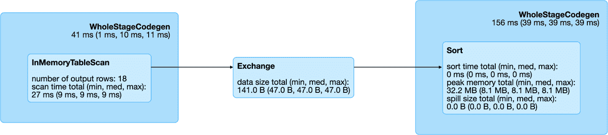
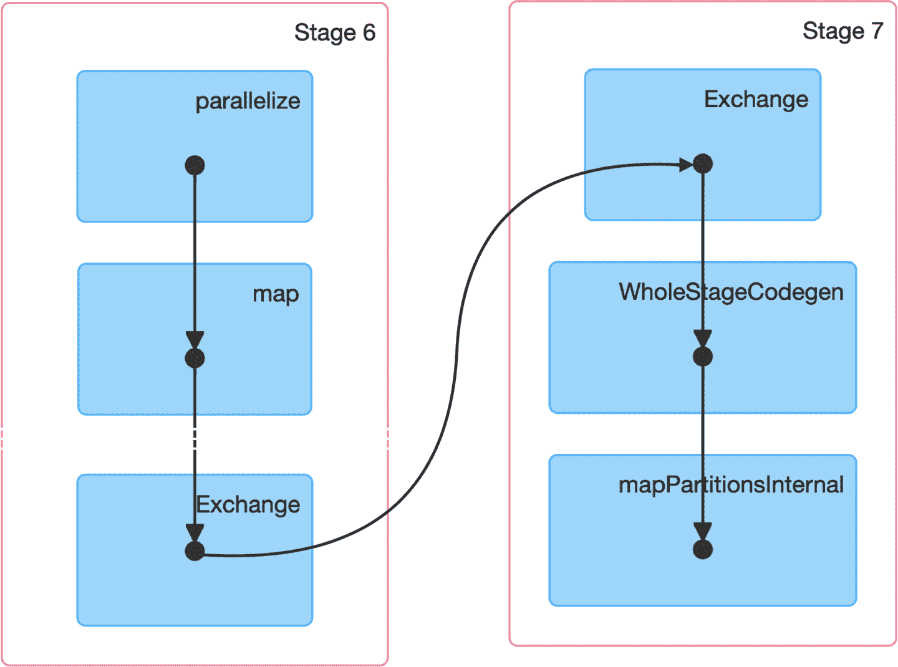
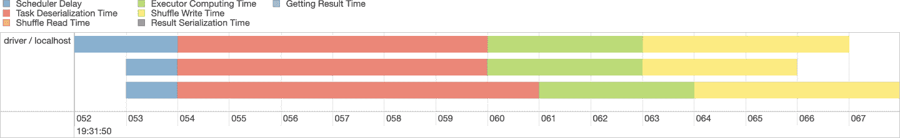
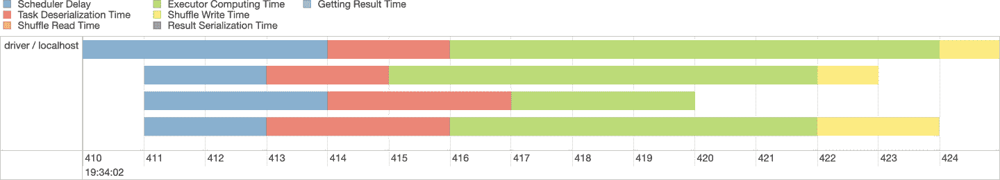
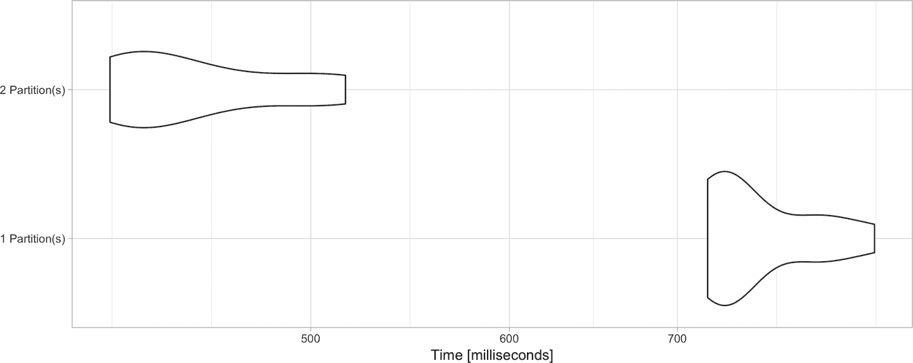
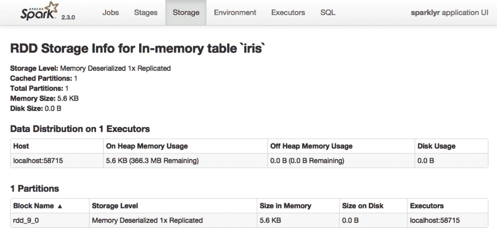

# 第九章：调优

> 混乱不是一个坑。混乱是一把梯子。
> 
> — 佩蒂尔·贝利希

在之前的章节中，我们假设 Spark 集群内的计算效率高。虽然在某些情况下这是正确的，但通常需要对 Spark 内部运行的操作有所了解，以微调配置设置，使计算能够高效运行。本章解释了 Spark 如何处理大数据集的数据计算，并提供了优化操作的详细信息。

例如，在本章中，您将学习如何请求更多的计算节点和增加内存量，这些内容您可以从 第二章 中了解，默认情况下在本地实例中仅为 2 GB。您将了解到 Spark 如何通过分区、洗牌和缓存统一计算。正如几章前提到的，这是描述 Spark 内部的最后一章；在您完成本章之后，我们相信您将具备使用 Spark 所需的中级技能。

在第 10–12 章中，我们探讨了处理特定建模、扩展和计算问题的激动人心的技术。然而，我们必须首先了解 Spark 如何执行内部计算，我们可以控制哪些部分，以及原因。

# 概述

Spark 通过配置、分区、执行、洗牌、缓存和序列化数据、任务和资源在多台机器上执行分布式计算：

+   *配置* 请求集群管理器获取资源：总机器数、内存等。

+   *分区* 将数据分割到各种机器中。分区可以是隐式的也可以是显式的。

+   *执行* 意味着对每个分区运行任意转换。

+   *洗牌* 重新分配数据到正确的机器上。

+   *缓存* 在不同的计算周期中保留内存中的数据。

+   *序列化* 将数据转换为可以发送到其他工作节点或返回到驱动节点的网络数据。

为了说明每个概念，让我们创建三个包含无序整数的分区，然后使用 `arrange()` 进行排序：

```
data <- copy_to(sc,
  data.frame(id = c(4, 9, 1, 8, 2, 3, 5, 7, 6)),
  repartition = 3)

data %>% arrange(id) %>% collect()
```

图 9-1 显示了这个排序 *作业* 在一个机器集群中如何概念上运行。首先，Spark 将 *配置* 集群以使用三台工作机器。在本例中，数字 `1` 到 `9` 被分区到三个存储实例中。由于 *数据* 已经被分区，每个工作节点加载这个隐式 *分区*；例如，第一个工作节点加载了 `4`、`9` 和 `1`。然后，一个 *任务* 被分发到每个工作节点，以在每个工作节点中的每个数据分区应用一个转换；这个任务用 `f(x)` 表示。在这个例子中，`f(x)` *执行* 了一个排序操作在一个分区内。由于 Spark 是通用的，对分区的执行可以根据需要简单或复杂。

理解给定操作（例如排序）的 Spark 计算图的最佳方法是在 Spark 的 Web 界面 的 SQL 选项卡上打开最后 *完成的查询*。 图 9-2 显示了此排序操作的结果图，其中包含以下操作：

最后，一小部分结果通过连接集群机器的网络 *串行化*，返回到驱动节点，以预览此排序示例。

注意，虽然 图 9-1 描述了一个排序操作，但类似的方法也适用于过滤或连接数据集，并在规模上进行数据分析和建模。Spark 提供支持来执行自定义分区、自定义洗牌等操作，但这些较低级别的操作大多数不会通过 `sparklyr` 暴露出来；相反，`sparklyr` 通过数据 分析 工具如 `dplyr` 或 `DBI`，建模以及使用许多 扩展，使这些操作可通过更高级别的命令使用。

要有效地调整 Spark，我们将首先熟悉 Spark 的计算 *图* 和 Spark 的事件 *时间线*。这两者都可以通过 Spark 的 Web 界面 访问。

然后将结果 *洗牌* 到正确的机器上完成整个数据集的排序操作，这完成了一个阶段。一个 *阶段* 是 Spark 可以在不同机器之间传输数据的一组操作。在数据在集群中排序之后，可以选择将排序后的结果 *缓存* 在内存中，以避免多次运行此计算。

###### 图 9-1\. 使用 Apache Spark 对分布式数据进行排序

## 图

Spark 使用有向无环图（DAG）描述所有计算步骤，这意味着 Spark 中的所有计算都向前推进，不会重复之前的步骤，这有助于 Spark 有效优化计算。

对于可能需要实现低级别操作的少数情况，最好使用 Spark 的 Scala API 通过 `sparklyr` 扩展或运行自定义 分布式 R 代码。

`WholeStageCodegen`

该块指定它包含的操作用于生成有效转换为字节码的计算机代码。通常，将操作转换为字节码会有一些小成本，但这是值得付出的代价，因为此后可以从 Spark 更快地执行这些操作。一般情况下，您可以忽略此块，并专注于其中包含的操作。

`InMemoryTableScan`

这意味着原始数据集 `data` 被存储在内存中，并且逐行遍历了一次。

`Exchange`

分区被交换—也就是在集群中的执行器之间进行了洗牌。

`Sort`

在记录到达适当的执行器后，它们在最终阶段进行了排序。



###### 图 9-2\. 用于排序查询的 Spark 图

从查询详细信息中，您可以打开最后一个到达作业详情页面的 Spark 作业，使用“DAG 可视化”扩展以创建类似于 图 9-3 的图表。此图显示了一些额外的细节和本作业中的阶段。请注意，没有箭头指向前面的步骤，因为 Spark 使用无环图。



###### 图 9-3\. 用于排序作业的 Spark 图

接下来，我们深入了解 Spark 阶段并探索其事件时间轴。

## 时间轴

*事件时间轴* 是 Spark 如何在每个阶段花费计算周期的一个很好的总结。理想情况下，您希望看到这个时间轴主要由 CPU 使用组成，因为其他任务可以被视为开销。您还希望看到 Spark 在您可用的所有集群节点上使用所有 CPU。

选择当前作业中的第一个阶段，并展开事件时间轴，其结果应该类似于 图 9-4。请注意，我们明确请求了三个分区，这在可视化中用三条通道表示。



###### 图 9-4\. Spark 事件时间轴

由于我们的机器配备了四个 CPU，我们可以通过显式重新分区数据使用 `sdf_repartition()` 进一步并行化这个计算，其结果显示在 图 9-5 中：

```
data %>% sdf_repartition(4) %>% arrange(id) %>% collect()
```



###### 图 9-5\. 具有额外分区的 Spark 事件时间轴

图 9-5 现在显示了四条执行通道，大部分时间都在执行器计算时间下，这表明该特定操作更好地利用了我们的计算资源。当您在集群上工作时，从集群请求更多计算节点应该能缩短计算时间。相反，对于显示出大量时间用于洗牌的时间轴，请求更多计算节点可能不会缩短时间，实际上可能会使一切变慢。优化阶段没有具体的规则可供遵循；然而，随着您在多个操作中理解此时间轴的经验增加，您将会对如何正确优化 Spark 操作有更深刻的见解。

# 配置

在调优 Spark 应用程序时，最常见的配置资源是内存和核心数，具体包括:

驱动节点中的内存

驱动节点所需的内存量

每个工作节点的内存

工作节点上所需的内存量

每个工作节点的核心数

工作节点上所需的 CPU 数量

工作节点数

本次会话所需的工作节点数量

###### 注意

建议请求的驱动程序内存显著多于每个工作节点可用的内存。在大多数情况下，您将希望为每个工作节点请求一个核心。

在本地模式下没有工作节点，但我们仍然可以通过以下方式配置内存和核心：

```
# Initialize configuration with defaults
config <- spark_config()

# Memory
config["sparklyr.shell.driver-memory"] <- "2g"

# Cores
config["sparklyr.connect.cores.local"] <- 2

# Connect to local cluster with custom configuration
sc <- spark_connect(master = "local", config = config)
```

在使用 Spark Standalone 和 Mesos 集群管理器时，默认情况下会分配所有可用的内存和核心；因此，除非要限制资源以允许多个用户共享此集群，否则不需要进行其他配置更改。在这种情况下，您可以使用`total-executor-cores`来限制请求的总执行者。[*Spark Standalone*](http://bit.ly/307YtM6)和[*Spark on Mesos*](http://bit.ly/31H4LCT)指南提供了有关共享集群的额外信息。

在运行 YARN 客户端时，您可以按以下方式配置内存和核心：

```
# Memory in driver
config["sparklyr.shell.driver-memory"] <- "2g"

# Memory per worker
config["sparklyr.shell.executor-memory"] <- "2g"

# Cores per worker
config["sparklyr.shell.executor-cores"] <- 1

# Number of workers
config["sparklyr.shell.num-executors"] <- 3
```

在使用 YARN 集群模式时，您可以使用`sparklyr.shell.driver-cores`来配置驱动程序节点中请求的总核心数。[Spark on YARN](http://bit.ly/306WsQx)指南提供了可以使您受益的额外配置设置。

有几种类型的配置设置：

*连接*

这些设置是作为参数传递给`spark_connect()`。它们是在连接时使用的常见设置。

*提交*

这些设置是在通过`spark-submit`向 Spark 提交`sparklyr`时设置的；其中一些取决于正在使用的集群管理器。

*运行时*

这些设置在创建 Spark 会话时配置 Spark。它们与集群管理器无关，特定于 Spark。

*sparklyr*

使用这些配置`sparklyr`行为。这些设置与集群管理器无关，特定于 R 语言。

以下小节详细列出了所有可用设置的广泛列表。在调整 Spark 时，并不需要完全理解它们，但浏览可能在将来解决问题时有用。如果愿意，您可以跳过这些小节，并根据需要将其用作参考材料。

## 连接设置

您可以使用在表 9-1 中列出的参数与`spark_connect()`。它们配置了定义连接方法、Spark 安装路径和要使用的 Spark 版本的高级设置。

表 9-1\. 连接到 Spark 时使用的参数

| 名称 | 值 |
| --- | --- |
| `master` | Spark 集群的 URL 以连接到。使用`"local"`以连接到通过`spark_install()`安装的本地 Spark 实例。 |
| `SPARK_HOME` | Spark 安装路径。默认为由`SPARK_HOME`环境变量提供的路径。如果定义了`SPARK_HOME`，则始终会使用它，除非通过指定版本参数来强制使用本地安装版本。 |
| `method` | 用于连接到 Spark 的方法。默认连接方法为 `"shell"`，使用 `spark-submit` 进行连接。使用 `"livy"` 进行使用 HTTP 进行远程连接，或者在使用 Databricks 集群时使用 `"databricks"`，或者在使用 Qubole 集群时使用 `"qubole"`。 |
| `app_name` | 在 Spark 集群中运行时使用的应用程序名称。 |
| `version` | 要使用的 Spark 版本。这仅适用于 `"local"` 和 `"livy"` 连接。 |
| `config` | 生成的 Spark 连接的自定义配置。详见 `spark_config`。 |

您可以通过在 `config` 参数中指定一个列表来配置额外的设置。现在让我们看看这些设置可以是什么。

## 提交设置

当运行 `spark-submit`（启动 Spark 的终端应用程序）时，必须指定某些设置。例如，由于 `spark-submit` 启动作为 Java 实例运行的驱动节点，需要指定分配多少内存作为 `spark-submit` 的参数。

您可以通过运行以下命令列出所有可用的 `spark-submit` 参数：

```
spark_home_dir() %>% file.path("bin", "spark-submit") %>% system2()
```

为了方便阅读，我们已经在 表 9-2 中提供了此命令的输出，将 `spark-submit` 参数替换为适当的 `spark_config()` 设置，并删除不适用或已在本章中介绍的参数。

表 9-2\. 可用于配置 spark-submit 的设置

| Name | Value |
| --- | --- |
| `sparklyr.shell.jars` | 在 `spark_connect()` 中指定为 `jars` 参数。 |
| `sparklyr.shell.packages` | 包含在驱动程序和执行程序类路径中的 JAR 文件的 Maven 坐标的逗号分隔列表。将搜索本地 Maven 仓库，然后搜索 Maven 中心和 `sparklyr.shell.repositories` 给出的任何附加远程仓库。坐标的格式应为 *`groupId:artifactId:version`*。 |
| `sparklyr.shell.exclude-packages` | 逗号分隔的 *`groupId:artifactId`* 列表，用于解析 `sparklyr.shell.packages` 中提供的依赖项时排除依赖冲突。 |
| `sparklyr.shell.repositories` | 逗号分隔的附加远程仓库列表，用于搜索 `sparklyr.shell.packages` 提供的 Maven 坐标。 |
| `sparklyr.shell.files` | 要放置在每个执行器的工作目录中的文件的逗号分隔列表。通过 `SparkFiles.get(fileName)` 可以访问这些文件在执行器中的文件路径。 |
| `sparklyr.shell.conf` | 设置为 `PROP=VALUE` 的任意 Spark 配置属性。 |
| `sparklyr.shell.properties-file` | 要加载额外属性的文件路径。如果未指定，则将查找 *conf/spark-defaults.conf*。 |
| `sparklyr.shell.driver-java-options` | 传递给驱动程序的额外 Java 选项。 |
| `sparklyr.shell.driver-library-path` | 传递给驱动程序的额外库路径条目。 |
| `sparklyr.shell.driver-class-path` | 传递给驱动程序的额外类路径条目。请注意，使用 `sparklyr.shell.jars` 添加的 JAR 包会自动包含在类路径中。 |
| `sparklyr.shell.proxy-user` | 提交应用程序时要模拟的用户。此参数不适用于 `sparklyr.shell.principal`/ `sparklyr.shell.keytab`。 |
| `sparklyr.shell.verbose` | 打印额外的调试输出。 |

剩余的设置如 Table 9-3 所示，专门针对 YARN。

Table 9-3\. 在使用 YARN 时配置 spark-submit 的设置

| Name | Value |
| --- | --- |
| `sparklyr.shell.queue` | 提交到的 YARN 队列（默认：“default”）。 |
| --- | --- |
| `sparklyr.shell.archives` | 要提取到每个执行者工作目录的归档文件的逗号分隔列表。 |
| --- | --- |
| `sparklyr.shell.principal` | 在运行安全 HDFS 时用于登录 KDC 的主体。 |
| --- | --- |
| `sparklyr.shell.keytab` | 包含刚才指定的主体的 keytab 文件的完整路径。此 keytab 将通过安全分布式缓存（Secure Distributed Cache）复制到运行应用程序主节点的节点，以定期更新登录票据和委托令牌。 |
| --- | --- |

通常情况下，任何 `spark-submit` 设置都是通过 `sparklyr.shell.X` 配置的，其中 X 是 `spark-submit` 参数的名称，不包含 `--` 前缀。

## 运行时设置

如前所述，某些 Spark 设置配置会话运行时。运行时设置是给定的 submit settings 的超集，即使不能更改设置，通常也有助于检索当前配置。

要列出当前 Spark 会话中设置的 Spark 设置，可以运行以下命令：

```
spark_session_config(sc)
```

Table 9-4 描述了运行时设置。

Table 9-4\. 配置 Spark 会话的可用设置

| Name | Value |
| --- | --- |
| `spark.master` | `local[4]` |
| `spark.sql.shuffle.partitions` | `4` |
| `spark.driver.port` | `62314` |
| `spark.submit.deployMode` | `client` |
| `spark.executor.id` | `driver` |
| `spark.jars` | */Library/…/sparklyr/java/sparklyr-2.3-2.11.jar* |
| `spark.app.id` | `local-1545518234395` |
| `spark.env.SPARK_LOCAL_IP` | `127.0.0.1` |
| `spark.sql.catalogImplementation` | `hive` |
| `spark.spark.port.maxRetries` | `128` |
| `spark.app.name` | `sparklyr` |
| `spark.home` | */Users/…/spark/spark-2.3.2-bin-hadoop2.7* |
| `spark.driver.host` | `localhost` |

然而，在 [*Spark Configuration*](http://bit.ly/2P0Yalf) 指南中描述的 Spark 中还有许多其他配置设置。本书无法详细描述所有设置，因此，如果可能的话，请花些时间找出那些可能与您特定用例相关的设置。

## sparklyr 设置

除了 Spark 设置外，还有一些特定于`sparklyr`的设置。在调整 Spark 时，通常不使用这些设置；相反，在从 R 中解决 Spark 问题时会很有帮助。例如，您可以使用`sparklyr.log.console = TRUE`将 Spark 日志输出到 R 控制台；这在故障排除时是理想的，但在其他情况下会太吵。以下是如何列出这些设置（结果在表 9-5 中呈现）：

```
spark_config_settings()
```

表 9-5。可用于配置 sparklyr 包的设置

| 名称 | 描述 |
| --- | --- |
| `sparklyr.apply.packages` | 配置`spark_apply()`中 packages 参数的默认值。 |
| `sparklyr.apply.rlang` | 实验性特性。打开`spark_apply()`的改进序列化。 |
| `sparklyr.apply.serializer` | 配置`spark_apply()`用于序列化闭包的版本。 |
| `sparklyr.apply.schema.infer` | 在`spark_apply()`中指定列类型时，用于推断模式的收集行数。 |
| `sparklyr.arrow` | 使用 Apache Arrow 序列化数据？ |
| `sparklyr.backend.interval` | `sparklyr`检查后端操作的总秒数。 |
| `sparklyr.backend.timeout` | 在`sparklyr`放弃等待后端操作完成之前的总秒数。 |
| `sparklyr.collect.batch` | 使用批量收集时要收集的总行数；默认为 100,000。 |
| `sparklyr.cancellable` | R 会话中断时取消 Spark 作业？ |
| `sparklyr.connect.aftersubmit` | 在`spark-submit`执行后调用的 R 函数。 |
| `sparklyr.connect.app.jar` | 在`spark_connect()`中使用的`sparklyr` JAR 的路径。 |
| `sparklyr.connect.cores.local` | 在`spark_connect(master = "local")`中使用的核心数，默认为`parallel::detectCores()`。 |
| `sparklyr.connect.csv.embedded` | 与需要包扩展支持 CSV 的 Spark 版本匹配的常规表达式。 |
| `sparklyr.connect.csv.scala11` | 在使用嵌入式 CSV JARS 时，使用 Scala 2.11 JARs 在 Spark 1.6.X 中。 |
| `sparklyr.connect.jars` | 提交应用程序到 Spark 时要包含的附加 JARs。 |
| `sparklyr.connect.master` | 作为`spark_connect()`主参数的集群主机；通常首选`spark.master`设置。 |
| `sparklyr.connect.packages` | 连接到 Spark 时要包含的 Spark 包。 |
| `sparklyr.connect.ondisconnect` | `spark_disconnect()`后调用的 R 函数。 |
| `sparklyr.connect.sparksubmit` | 在连接时执行的命令，而不是`spark-submit`。 |
| `sparklyr.connect.timeout` | 在初始化时连接到`sparklyr`网关之前的总秒数。 |
| `sparklyr.dplyr.period.splits` | `dplyr`是否应将列名拆分为数据库和表？ |
| `sparklyr.extensions.catalog` | 扩展 JAR 所在的目录路径。默认为`TRUE`；`FALSE`为禁用。 |
| `sparklyr.gateway.address` | 驱动机器的地址。 |
| `sparklyr.gateway.config.retries` | 从配置中检索端口和地址的重试次数；在 Kubernetes 中使用函数查询端口或地址时很有用。 |
| `sparklyr.gateway.interval` | `sparkyr`将检查网关连接的总秒数。 |
| `sparklyr.gateway.port` | `sparklyr`网关在驱动程序机器上使用的端口。 |
| `sparklyr.gateway.remote` | `sparklyr`网关是否允许远程连接？在 YARN 集群模式下是必需的。 |
| `sparklyr.gateway.routing` | `sparklyr`网关服务是否应路由到其他会话？在 Kubernetes 中考虑禁用。 |
| `sparklyr.gateway.service` | `sparklyr`网关是否应作为服务运行，而不在最后一个连接断开时关闭？ |
| `sparklyr.gateway.timeout` | 在初始化后连接到`sparklyr`网关之前等待的总秒数。 |
| `sparklyr.gateway.wait` | 在重新尝试联系`sparklyr`网关之前等待的总秒数。 |
| `sparklyr.livy.auth` | Livy 连接的身份验证方法。 |
| `sparklyr.livy.headers` | Livy 连接的额外 HTTP 头部。 |
| `sparklyr.livy.sources` | 连接时是否应加载`sparklyr`源？如果为 false，则需要手动注册`sparklyr` JAR 包。 |
| `sparklyr.log.invoke` | 是否应该将每次调用`invoke()`打印到控制台？可以设置为`callstack`以记录调用堆栈。 |
| `sparklyr.log.console` | 是否应将驱动程序日志打印到控制台？ |
| `sparklyr.progress` | 是否应向 RStudio 报告作业进度？ |
| `sparklyr.progress.interval` | 在尝试检索 Spark 作业进度之前等待的总秒数。 |
| `sparklyr.sanitize.column.names` | 是否应清理部分不受支持的列名？ |
| `sparklyr.stream.collect.timeout` | 在`sdf_collect_stream()`中停止收集流样本之前的总秒数。 |
| `sparklyr.stream.validate.timeout` | 在创建过程中检查流是否有错误之前等待的总秒数。 |
| `sparklyr.verbose` | 是否在所有`sparklyr`操作中使用详细日志记录？ |
| `sparklyr.verbose.na` | 在处理 NA 时是否使用详细日志记录？ |
| `sparklyr.verbose.sanitize` | 在清理列和其他对象时是否使用详细日志记录？ |
| `sparklyr.web.spark` | Spark 的 Web 界面 URL。 |
| `sparklyr.web.yarn` | YARN 的 Web 界面 URL。 |
| `sparklyr.worker.gateway.address` | 工作机器的地址，很可能是`localhost`。 |
| `sparklyr.worker.gateway.port` | `sparklyr`网关在驱动程序机器上使用的端口。 |
| `sparklyr.yarn.cluster.accepted.timeout` | 在 YARN 集群模式下等待集群资源被接受之前的总秒数。 |
| `sparklyr.yarn.cluster.hostaddress.timeout` | 在 YARN 集群模式下等待集群分配主机地址之前的总秒数。 |
| `sparklyr.yarn.cluster.lookup.byname` | 在搜索已提交作业时是否应使用当前用户名来过滤 YARN 集群作业？ |
| `sparklyr.yarn.cluster.lookup.prefix` | 用于在搜索已提交的 YARN 集群作业时过滤应用程序名称前缀。 |
| `sparklyr.yarn.cluster.lookup.username` | 在搜索已提交的 YARN 集群作业时用于过滤 YARN 集群作业的用户名。 |
| `sparklyr.yarn.cluster.start.timeout` | 在放弃等待 YARN 集群应用程序注册之前的总秒数。 |

# 分区

如 第一章 所述，MapReduce 和 Spark 的设计目的是对存储在多台机器上的数据执行计算。每个计算实例可用于计算的数据子集称为 *分区*。

默认情况下，Spark 在每个现有 *隐式* 分区上进行计算，因为在数据已经位于的位置运行计算更有效。然而，有些情况下，您需要设置 *显式* 分区以帮助 Spark 更有效地利用您的集群资源。

## 隐式分区

如 第八章 所述，Spark 可以读取存储在许多格式和不同存储系统中的数据；然而，由于数据洗牌是一项昂贵的操作，Spark 在执行任务时重用存储系统中的分区。因此，这些分区对于 Spark 来说是隐式的，因为它们已经被定义并且重排是昂贵的。

对于 Spark 的每个计算，总是有一个由分布式存储系统定义的隐式分区，即使对于您不希望创建分区的操作，比如 `copy_to()`。

你可以通过使用 `sdf_num_partitions()` 来探索计算所需的分区数量：

```
sdf_len(sc, 10) %>% sdf_num_partitions()
```

```
[1] 2
```

尽管在大多数情况下，默认分区工作正常，但有些情况下，您需要明确选择分区。

## 显式分区

有时您的计算实例数量比数据分区多得多或少得多。在这两种情况下，通过重新分区数据来匹配您的集群资源可能会有所帮助。

各种 数据 函数，如 `spark_read_csv()`，已支持 `repartition` 参数，以请求 Spark 适当地重新分区数据。例如，我们可以按照以下方式创建一个由 10 个数字分区为 10 的序列：

```
sdf_len(sc, 10, repartition = 10) %>% sdf_num_partitions()
```

```
[1] 10
```

对于已分区的数据集，我们还可以使用 `sdf_repartition()`：

```
sdf_len(sc, 10, repartition = 10) %>%
  sdf_repartition(4) %>%
  sdf_num_partitions()
```

```
[1] 4
```

分区数量通常显著改变速度和使用的资源；例如，以下示例计算了在不同分区大小下的 1000 万行的均值：

```
library(microbenchmark)
library(ggplot2)

microbenchmark(
    "1 Partition(s)" = sdf_len(sc, 10⁷, repartition = 1) %>%
      summarise(mean(id)) %>% collect(),
    "2 Partition(s)" = sdf_len(sc, 10⁷, repartition = 2) %>%
      summarise(mean(id)) %>% collect(),
    times = 10
) %>% autoplot() + theme_light()
```

图 9-6 显示，使用两个分区对数据进行排序几乎快了一倍。这是因为两个 CPU 可以用于执行此操作。然而，并不一定高分区产生更快的计算结果；相反，数据分区是特定于您的计算集群和正在执行的数据分析操作的。



###### 图 9-6\. 使用额外显式分区的计算速度

# 缓存

从第一章中回忆起，Spark 的设计目的是通过使用内存而不是磁盘来存储数据来比其前身更快。这在正式上被称为 Spark *弹性分布式数据集*（RDD）。RDD 在许多机器上分发相同数据的副本，因此如果一台机器失败，其他机器可以完成任务，因此称为“弹性”。在分布式系统中，弹性是很重要的，因为尽管一台机器通常会正常工作，但在数千台机器上运行时，发生故障的可能性要高得多。发生故障时，最好是具有容错性，以避免丢失所有其他机器的工作。RDD 通过跟踪数据血统信息，在故障时自动重建丢失的数据来实现这一点。

在`sparklyr`中，您可以使用`tbl_cache()`和`tbl_uncache()`控制 RDD 何时从内存中加载或卸载。

大多数`sparklyr`操作检索 Spark DataFrame 并将结果缓存在内存中。例如，运行`spark_read_parquet()`或`copy_to()`将提供一个已经缓存在内存中的 Spark DataFrame。作为 Spark DataFrame，该对象可以在大多数`sparklyr`函数中使用，包括使用`dplyr`进行数据分析或机器学习：

```
library(sparklyr)
sc <- spark_connect(master = "local")
```

```
iris_tbl <- copy_to(sc, iris, overwrite = TRUE)
```

您可以通过导航到 Spark UI 使用`spark_web(sc)`，点击存储选项卡，然后点击特定的 RDD 来检查哪些表被缓存，如图 9-7 所示。



###### 图 9-7\. 在 Spark Web 界面中缓存的 RDD

当 R 会话终止时，加载到内存中的数据将被释放，无论是显式还是隐式的，通过重启或断开连接；但是，为了释放资源，您可以使用`tbl_uncache()`：

```
tbl_uncache(sc, "iris")
```

## 检查点

检查点是一种稍有不同的缓存类型；虽然它也保存数据，但它还会打破计算图血统。例如，如果缓存的分区丢失，则可以从计算图中计算，这在检查点中是不可能的，因为计算来源已丢失。

在执行创建昂贵计算图的操作时，通过检查点来保存和打破计算血统可能是有意义的，以帮助 Spark 减少图计算资源的使用；否则，Spark 可能会尝试优化一个实际上并不需要优化的计算图。

您可以通过保存为 CSV、Parquet 和其他文件格式显式进行检查点，或者使用`sparklyr`中的`sdf_checkpoint()`让 Spark 为您检查点，如下所示：

```
# set checkpoint path
spark_set_checkpoint_dir(sc, getwd())

# checkpoint the iris dataset
iris_tbl %>% sdf_checkpoint()
```

注意，检查点会截断计算血统图，如果多次使用相同的中间结果，可以加快性能。

## 内存

Spark 中的内存分为*保留*、*用户*、*执行*或*存储*：

保留

保留内存是 Spark 运行所需的内存，因此是必需的开销，不应该进行配置。此值默认为 300 MB。

用户

用户内存是用于执行自定义代码的内存。 `sparklyr` 在执行 `dplyr` 表达式或对数据集建模时间接使用这些内存。

执行

执行内存主要用于由 Spark 执行代码，大多用于处理来自分区的结果和执行洗牌。

存储

存储内存用于缓存 RDD，例如在使用 `sparklyr` 的 `compute()` 时。

作为执行调优的一部分，您可以考虑通过创建具有与 Spark 提供的默认值不同的值的 Spark 连接来调整为用户、执行和存储分配的内存量：

```
config <- spark_config()

# define memory available for storage and execution
config$spark.memory.fraction <- 0.75

# define memory available for storage
config$spark.memory.storageFraction <- 0.5
```

例如，如果希望使用 Spark 在内存中存储大量数据，以便快速过滤和检索子集，您可以预期 Spark 使用的执行或用户内存很少。因此，为了最大化存储内存，可以调整 Spark 如下：

```
config <- spark_config()

# define memory available for storage and execution
config$spark.memory.fraction <- 0.90

# define memory available for storage
config$spark.memory.storageFraction <- 0.90
```

然而，请注意，如果需要且可能的话，Spark 将从存储中借用执行内存，反之亦然；因此，实际上应该很少需要调整内存设置。

# 洗牌

洗牌是将数据重新分布到各台机器的操作；通常昂贵，因此应尽量减少。您可以通过查看 事件时间线 来轻松识别是否花费了大量时间在洗牌上。通过重新构架数据分析问题或适当提示 Spark，可以减少洗牌。

例如，在连接大小显著不同的 DataFrame（即一个数据集比另一个小几个数量级）时会变得相关；您可以考虑使用 `sdf_broadcast()` 将一个 DataFrame 标记为足够小，以便在广播连接中将一个较小的 DataFrame 推送到每个工作节点，从而减少大 DataFrame 的洗牌。以下是 `sdf_broadcast()` 的一个示例：

```
sdf_len(sc, 10000) %>%
    sdf_broadcast() %>%
    left_join(sdf_len(sc, 100))
```

# 序列化

序列化是将数据和任务转换为可以在机器之间传输并在接收端重建的格式的过程。

在调优 Spark 时，通常不需要调整序列化；然而，值得一提的是，存在替代序列化模块，如 [Kryo Serializer](https://oreil.ly/TRbNh)，它可以比默认的 [Java Serializer](https://oreil.ly/0DMsd) 提供性能改进。

您可以通过以下方法在 `sparklyr` 中启用 Kryo Serializer：

```
config <- spark_config()

config$spark.serializer <- "org.apache.spark.serializer.KryoSerializer"
sc <- spark_connect(master = "local", config = config)
```

# 配置文件

在连接之前配置 `spark_config()` 设置是调优 Spark 最常见的方法。然而，在识别连接中的参数后，您应考虑切换到使用配置文件，因为它会消除连接代码中的混乱，并允许您在项目和同事之间共享配置设置。

例如，而不是像这样连接到 Spark：

```
config <- spark_config()
config["sparklyr.shell.driver-memory"] <- "2G"
sc <- spark_connect(master = "local", config = config)
```

您可以定义一个名为*config.yml*的文件，其中包含所需的设置。该文件应位于当前工作目录或父目录中。例如，您可以创建以下*config.yml*文件以修改默认驱动程序内存：

```
default:
  sparklyr.shell.driver-memory: 2G
```

然后，通过使用如下更清晰的相同配置设置进行连接：

```
sc <- spark_connect(master = "local")
```

您还可以通过在`spark_config()`中设置`file`参数来指定替代配置文件名或位置。使用配置文件的另一个好处是系统管理员可以通过更改`R_CONFIG_ACTIVE`环境变量的值来更改默认配置。有关更多信息，请参阅 GitHub 的[rstudio/config](https://oreil.ly/74jIL)存储库。

# 总结

本章提供了关于 Spark 内部结构的广泛概述和详细的配置设置，帮助您加快计算速度并支持高计算负载。它为理解瓶颈提供了基础，并提供了常见配置考虑的指导。然而，精细调整 Spark 是一个广泛的主题，需要更多章节来全面覆盖。因此，在调试 Spark 的性能和可伸缩性时，经常需要在网上搜索并咨询在线社区，还需要根据您特定的环境进行精细调整。

第十章介绍了在 R 中可用的 Spark 扩展生态系统。大多数扩展都非常专业化，但在特定情况下和特定需求的读者中，它们将证明极其有用。例如，它们可以处理嵌套数据，执行图分析，并使用来自 H20 的不同建模库，如`rsparkling`。此外，接下来的几章介绍了许多高级数据分析和建模主题，这些主题对于掌握 R 中的大规模计算是必要的。
