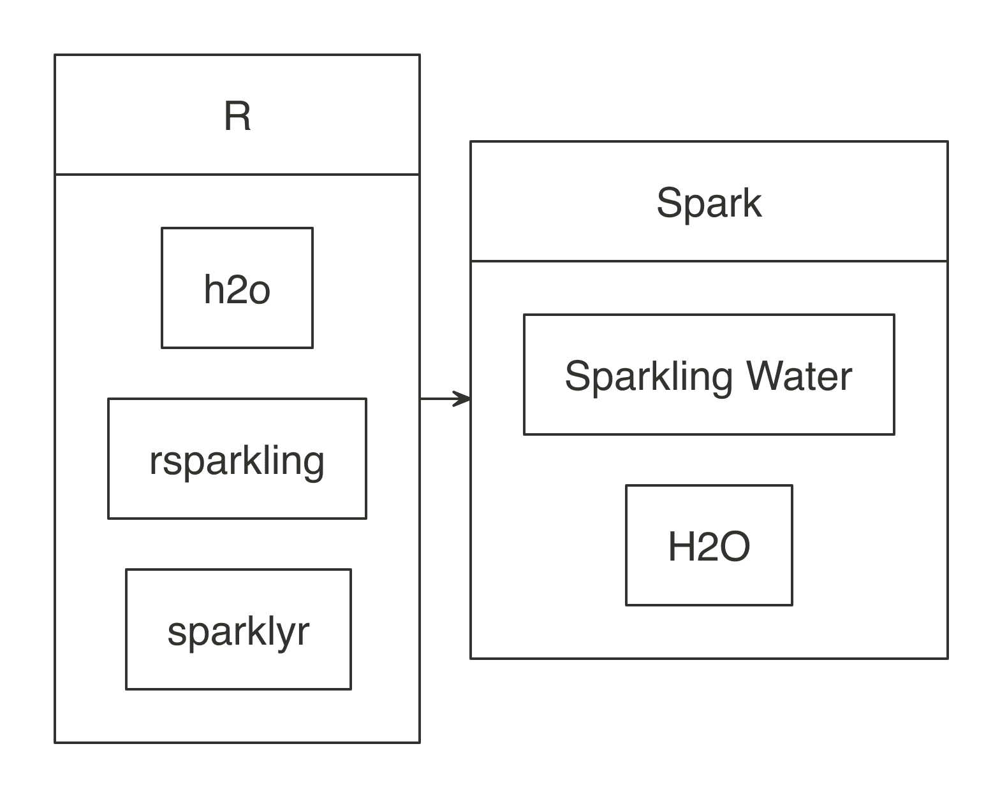
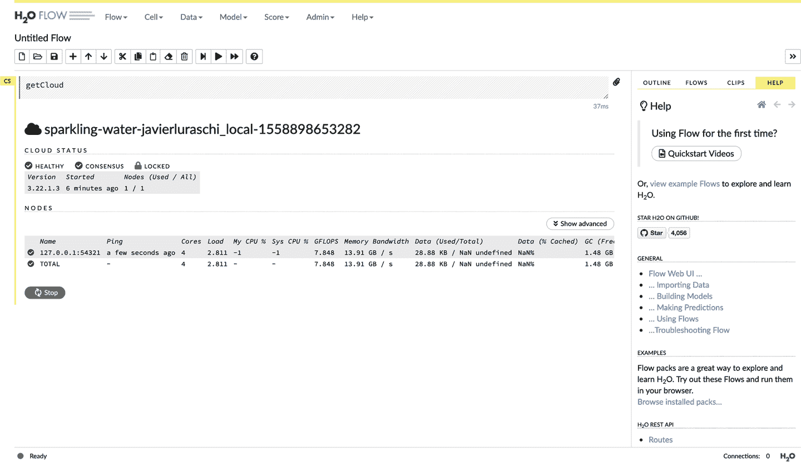
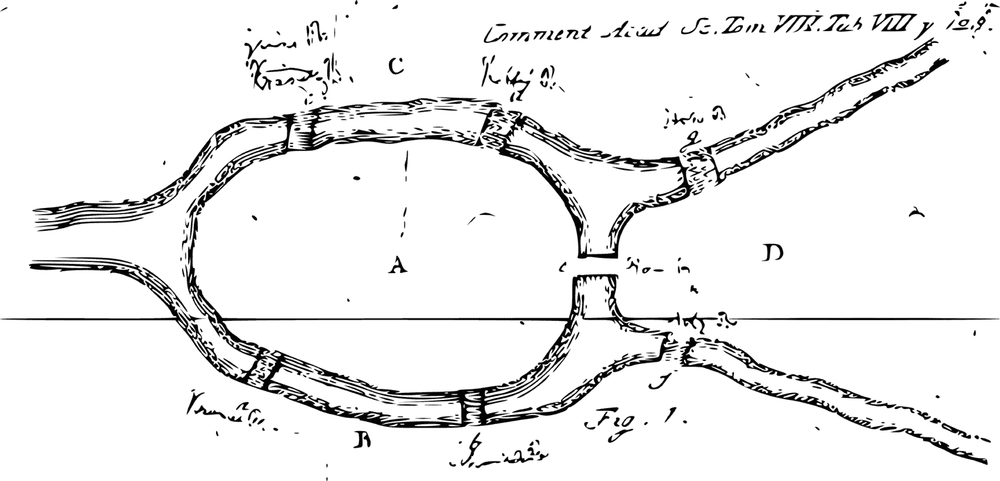
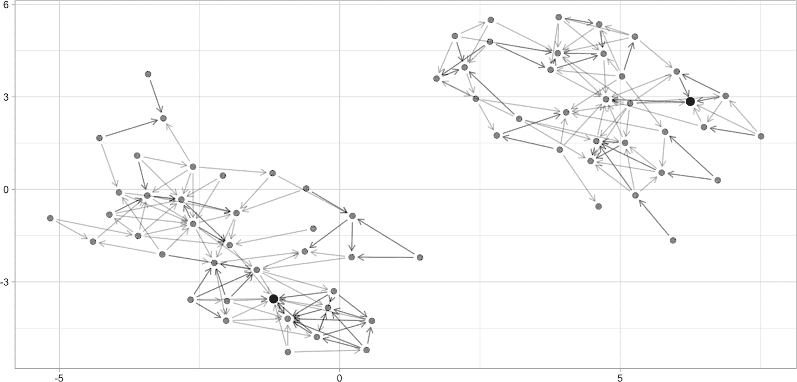
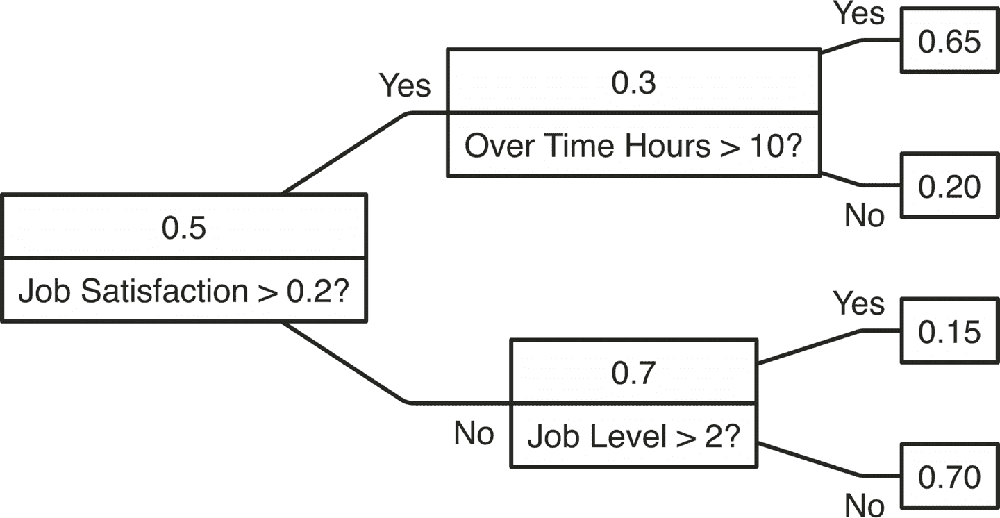
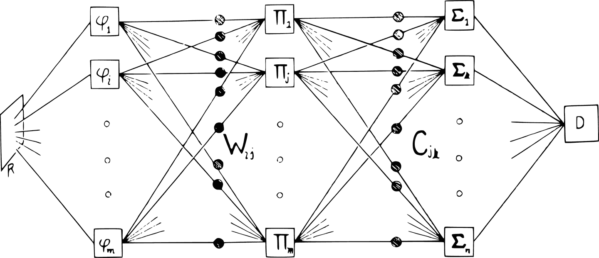
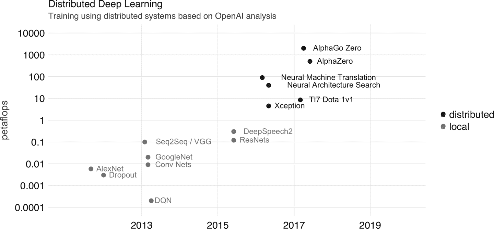
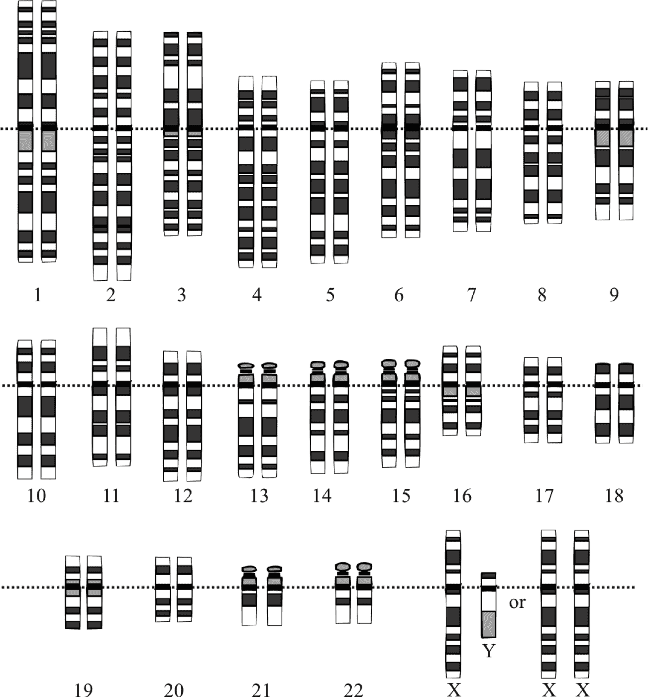
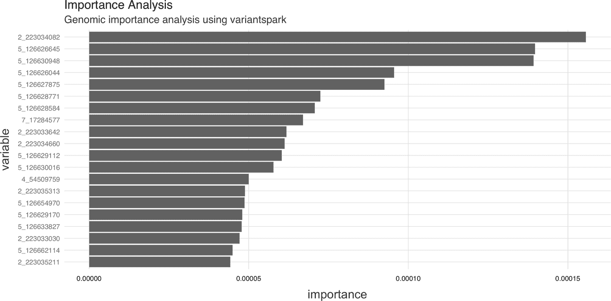
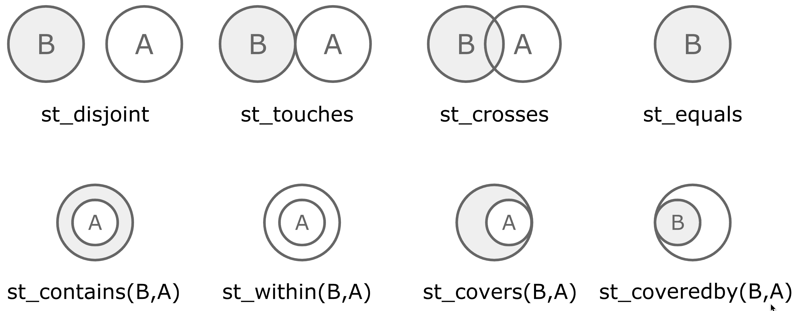

# 第十章：扩展

> 我尽量认识尽可能多的人。你永远不知道哪一个你会需要。
> 
> ——泰利昂·兰尼斯特

在 第九章 中，您学习了 Spark 如何通过允许用户配置集群资源、隐式或显式分区数据、在分布式计算节点上执行命令、在需要时在它们之间进行数据洗牌、缓存数据以提高性能以及高效地在网络上序列化数据来处理大规模数据。您还学习了如何配置连接、提交作业和运行应用程序时使用的不同 Spark 设置，以及仅适用于 R 和 R 扩展的特定设置，在本章中我们将介绍。

第 3、4 和 8 章提供了阅读和理解大多数数据集的基础。然而，所呈现的功能范围仅限于 Spark 的内置功能和表格数据集。本章将超越表格数据，探讨如何通过图处理分析和建模网络中相互连接的对象，分析基因组数据集，为深度学习准备数据，分析地理数据集，并使用像 H2O 和 XGBoost 这样的高级建模库处理大规模数据集。

在前几章介绍的所有内容应该可以满足大多数您的大规模计算需求。然而，对于仍然缺乏功能的少数用例，以下章节提供了通过自定义 R 转换、自定义 Scala 代码或 Spark 中的最新执行模式来扩展 Spark 的工具，该模式使得能够分析实时数据集。但在重新发明轮子之前，让我们先看看 Spark 中可用的一些扩展。

# 概述

在 第一章 中，我们将 R 社区描述为一个充满活力的个体群体，通过多种方式相互合作，例如通过创建您可以从 CRAN 安装的 R 包来推动开放科学。类似地，尽管规模小得多，但 R 社区也贡献了增强最初在 Spark 和 R 中支持的功能的扩展。Spark 本身还支持创建 Spark 扩展，实际上，许多 R 扩展使用了 Spark 扩展。

扩展不断被创建，所以这部分内容在某个时刻可能会过时。此外，我们可能甚至不知道许多 Spark 和 R 的扩展。然而，至少我们可以通过查看在 [CRAN 中 `sparklyr` 的“反向导入”](http://bit.ly/2Z568xz) 来追踪 CRAN 中可用的扩展。在 CRAN 中发布的扩展和 R 包通常是最稳定的，因为当一个包在 CRAN 中发布时，它经过了审查流程，提高了贡献的整体质量。

尽管我们希望能够呈现所有扩展，但我们将此章节范围限定在应该对您最有趣的扩展上。您可以在 [github.com/r-spark](https://github.com/r-spark) 组织或通过使用 `sparklyr` 标签在 GitHub 上搜索仓库中找到其他扩展。

`rsparkling`

`rsparkling` 扩展允许您从 R 中使用 H2O 和 Spark。这个扩展是我们认为在 Spark 中进行高级建模的一部分。虽然 Spark 的内置建模库 Spark MLlib 在许多情况下非常有用，但 H2O 的建模能力可以计算额外的统计指标，并且在性能和可扩展性上比 Spark MLlib 有所提升。我们没有进行 MLlib 和 H2O 之间的详细比较或基准测试；这是您需要自行研究的内容，以形成何时使用 H2O 能力的完整图景。

`graphframes`

`graphframes` 扩展增加了在 Spark 中处理图形的支持。图是一种描述一组对象的结构，其中某些对象对在某种意义上相关。正如您在第一章中所学到的，排名网页是开发以 MapReduce 为基础的 Spark 前身的早期动机；如果将页面之间的链接视为页面对之间的关系，网页恰好形成图形。在网页搜索和社交网络中，计算诸如 PageRank 等操作在图形上可以非常有用。

`sparktf`

`sparktf` 扩展提供了在 Spark 中编写 TensorFlow 记录的支持。TensorFlow 是领先的深度学习框架之一，通常与大量数值数据一起使用，这些数据表示为 TensorFlow 记录，这是一种针对 TensorFlow 优化的文件格式。Spark 经常用于将非结构化和大规模数据集处理为可以轻松适应 GPU 的较小数值数据集。您可以使用此扩展来保存 TensorFlow 记录文件格式的数据集。

`xgboost`

`xgboost` 扩展将著名的 XGBoost 建模库引入到大规模计算的世界中。XGBoost 是一个可扩展、便携和分布式的梯度提升库。在[希格斯玻色子机器学习挑战赛](http://bit.ly/2YPE2qO)中使用后，它在机器学习竞赛圈中广为人知，并且自那时以来在其他 Kaggle 竞赛中仍然很受欢迎。

`variantspark`

`variantspark` 扩展提供了使用 Variant Spark 的接口，这是一个用于全基因组关联研究（GWAS）的可扩展工具包。它目前提供了构建随机森林模型、估计变量重要性和读取变异调用格式（VCF）文件的功能。虽然 Spark 中有其他随机森林实现，但大多数并未经过优化，不能处理通常带有数千个样本和数百万个变量的 GWAS 数据集。

`geospark`

`geospark`扩展使我们能够加载和查询大规模地理数据集。通常，包含纬度和经度点或复杂区域的数据集以 Well-Known Text（WKT）格式定义，这是一种在地图上表示矢量几何对象的文本标记语言。

在您学习如何以及何时使用每个扩展之前，我们应该首先简要解释如何在 R 和 Spark 中使用扩展。

首先，Spark 扩展只是一个意识到 Spark 的 R 包。与任何其他 R 包一样，您首先需要安装该扩展。安装完成后，重要的是要知道，在可以使用扩展之前，您需要重新连接到 Spark。因此，一般而言，您应该遵循以下模式：

```
library(sparkextension)
library(sparklyr)

sc <- spark_connect(master = "<master>")
```

注意，在扩展注册之前加载`sparklyr`，以确保扩展能够正确注册。如果您需要安装和加载新的扩展，首先需要使用`spark_disconnect(sc)`断开连接，重新启动 R 会话，然后使用新的扩展重复前述步骤。

从 R 中安装和使用 Spark 扩展并不困难；然而，每个扩展都可能是一个独立的世界，因此大多数情况下，您需要花时间了解扩展是什么、何时使用以及如何正确使用。您将首先了解的第一个扩展是`rsparkling`扩展，它使您能够在 Spark 中使用 H2O 与 R。

# H2O

[H2O](https://www.h2o.ai/)由 H2O.ai 创建，是用于大规模建模的开源软件，允许您在发现数据模式的过程中拟合成千上万个潜在模型。您可以考虑使用 H2O 来补充或替换 Spark 的默认建模算法。通常在 Spark 的算法不足或需要高级功能（如额外的建模指标或自动模型选择）时，会使用 H2O。

我们无法在一段话中充分展示 H2O 强大的建模能力；要适当地解释 H2O，需要一本专著。我们建议阅读 Darren Cook 的[*Practical Machine Learning with H2O*](https://oreil.ly/l5RHI)（O'Reilly），深入探索 H2O 的建模算法和功能。同时，您可以使用本节作为开始在 Spark 中使用 H2O 与 R 的简要指南。

要在 Spark 中使用 H2O，了解涉及的四个组件非常重要：H2O，Sparkling Water，[`rsparkling`](http://bit.ly/2MlFxqa)，和 Spark。Sparkling Water 允许用户将 H2O 的快速可扩展的机器学习算法与 Spark 的功能结合起来。您可以将 Sparkling Water 视为将 Spark 与 H2O 桥接的组件，`rsparkling`是 Sparkling Water 的 R 前端，如图 10-1 所示。



###### 图 10-1\. H2O 组件与 Spark 和 R

首先，按照[`rsparkling`文档网站](http://bit.ly/2Z78MD0)上的说明安装`rsparkling`和`h2o`。

```
install.packages("h2o", type = "source",
  repos = "http://h2o-release.s3.amazonaws.com/h2o/rel-yates/5/R")
install.packages("rsparkling", type = "source",
  repos = "http://h2o-release.s3.amazonaws.com/sparkling-water/rel-2.3/31/R")
```

需要注意的是，你需要按照它们的文档使用兼容版本的 Spark、Sparkling Water 和 H2O；我们提供了适用于 Spark 2.3 的说明，但使用不同版本的 Spark 将需要安装不同版本。因此，让我们从运行以下检查 H2O 版本开始：

```
packageVersion("h2o")
```

```
## [1] '3.24.0.5'
```

```
packageVersion("rsparkling")
```

```
## [1] '2.3.31'
```

然后，我们可以按照支持的 Spark 版本进行连接（你需要根据你的特定集群调整`master`参数）：

```
library(rsparkling)
library(sparklyr)
library(h2o)

sc <- spark_connect(master = "local", version = "2.3",
                    config = list(sparklyr.connect.timeout = 3 * 60))

cars <- copy_to(sc, mtcars)
```

H2O 提供了一个 Web 界面，可以帮助你监控训练并访问 H2O 的许多功能。你可以通过`h2o_flow(sc)`访问 Web 界面（称为 H2O Flow），如图 10-2 所示。

当使用 H2O 时，你需要通过`as_h2o_frame`将你的 Spark DataFrame 转换为 H2O DataFrame：

```
cars_h2o <- as_h2o_frame(sc, cars)
cars_h2o
```

```
   mpg cyl disp  hp drat    wt  qsec vs am gear carb
1 21.0   6  160 110 3.90 2.620 16.46  0  1    4    4
2 21.0   6  160 110 3.90 2.875 17.02  0  1    4    4
3 22.8   4  108  93 3.85 2.320 18.61  1  1    4    1
4 21.4   6  258 110 3.08 3.215 19.44  1  0    3    1
5 18.7   8  360 175 3.15 3.440 17.02  0  0    3    2
6 18.1   6  225 105 2.76 3.460 20.22  1  0    3    1

[32 rows x 11 columns]
```



###### 图 10-2. 使用 Spark 和 R 的 H2O Flow 界面

然后，你可以轻松使用`h2o`包中提供的许多建模功能。例如，我们可以轻松拟合广义线性模型：

```
model <- h2o.glm(x = c("wt", "cyl"),
                 y = "mpg",
                 training_frame = cars_h2o,
                 lambda_search = TRUE)
```

H2O 提供了额外的度量标准，这些度量标准在 Spark 的建模算法中可能不一定可用。我们刚刚拟合的模型，`残差偏差`，在模型中提供了，而在使用 Spark MLlib 时，这不是标准度量标准。

```
model
```

```
...
MSE:  6.017684
RMSE:  2.453097
MAE:  1.940985
RMSLE:  0.1114801
Mean Residual Deviance :  6.017684
R² :  0.8289895
Null Deviance :1126.047
Null D.o.F. :31
Residual Deviance :192.5659
Residual D.o.F. :29
AIC :156.2425
```

然后，你可以运行广义线性模型（GLM）的预测。对于 H2O 中可用的许多其他模型，类似的方法也适用：

```
predictions <- as_h2o_frame(sc, copy_to(sc, data.frame(wt = 2, cyl = 6)))
h2o.predict(model, predictions)
```

```
   predict
1 24.05984

[1 row x 1 column]
```

你也可以使用 H2O 执行许多模型的自动训练和调优，这意味着 H2O 可以选择为你使用哪个模型，使用[AutoML](https://oreil.ly/Ck9Ao)：

```
automl <- h2o.automl(x = c("wt", "cyl"), y = "mpg",
                     training_frame = cars_h2o,
                     max_models = 20,
                     seed = 1)
```

对于这个特定的数据集，H2O 确定深度学习模型比 GLM 更适合。¹ 具体来说，H2O 的 AutoML 探索了使用 XGBoost、深度学习、GLM 和堆叠集成模型： 

```
automl@leaderboard
```

```
model_id              mean_residual_dev…     rmse      mse      mae     rmsle
1 DeepLearning_…                6.541322 2.557601 6.541322 2.192295 0.1242028
2 XGBoost_grid_1…               6.958945 2.637981 6.958945 2.129421 0.1347795
3 XGBoost_grid_1_…              6.969577 2.639996 6.969577 2.178845 0.1336290
4 XGBoost_grid_1_…              7.266691 2.695680 7.266691 2.167930 0.1331849
5 StackedEnsemble…              7.304556 2.702694 7.304556 1.938982 0.1304792
6 XGBoost_3_…                   7.313948 2.704431 7.313948 2.088791 0.1348819
```

与其使用排行榜，你可以通过`automl@leader`专注于最佳模型；例如，你可以查看以下深度学习模型的特定参数：

```
tibble::tibble(parameter = names(automl@leader@parameters),
               value = as.character(automl@leader@parameters))
```

```
# A tibble: 20 x 2
   parameter                         values
   <chr>                             <chr>
 1 model_id                          DeepLearning_grid_1_AutoML…
 2 training_frame                    automl_training_frame_rdd…
 3 nfolds                            5
 4 keep_cross_validation_models      FALSE
 5 keep_cross_validation_predictions TRUE
 6 fold_assignment                   Modulo
 7 overwrite_with_best_model         FALSE
 8 activation                        RectifierWithDropout
 9 hidden                            200
10 epochs                            10003.6618461538
11 seed                              1
12 rho                               0.95
13 epsilon                           1e-06
14 input_dropout_ratio               0.2
15 hidden_dropout_ratios             0.4
16 stopping_rounds                   0
17 stopping_metric                   deviance
18 stopping_tolerance                0.05
19 x                                 c("cyl", "wt")
20 y                                 mpg
```

然后，你可以像下面这样使用领导者进行预测：

```
h2o.predict(automl@leader, predictions)
```

```
   predict
1 30.74639

[1 row x 1 column]
```

还有许多其他示例可以[查看](http://bit.ly/2NdTIwX)，你也可以从官方[GitHub 代码库](http://bit.ly/2MlFxqa)获取`rsparkling`包的帮助。

接下来的扩展，`graphframes`，允许你处理大规模关系数据集。在开始使用之前，请确保使用`spark_disconnect(sc)`断开连接并重新启动你的 R 会话，因为使用不同的扩展需要重新连接到 Spark 并重新加载`sparklyr`。

# 图表

图论史上的第一篇论文是由莱昂哈德·欧拉于 1736 年在康斯堡七桥上写的。问题是设计一条穿过城市的路线，每座桥只过一次且仅一次。图 10-3 展示了原始图表。



###### 图 10-3\. 来自欧拉档案的康斯贝格七桥

如今，图被定义为一个有序对 <math><mrow><mi>G</mi> <mo>=</mo> <mo>(</mo> <mi>V</mi> <mo>,</mo> <mi>E</mi> <mo>)</mo></mrow></math>，其中 <math><mi>V</mi></math> 是顶点（节点或点）的集合，<math><mrow><mi>E</mi> <mo>⊆</mo> <mo>{</mo> <mrow><mo>{</mo> <mi>x</mi> <mo>,</mo> <mi>y</mi> <mo>}</mo></mrow> <mo>|</mo> <mrow><mo>(</mo> <mi>x</mi> <mo>,</mo> <mi>y</mi> <mo>)</mo></mrow> <mo>∈</mo> <msup><mi mathvariant="normal">V</mi> <mn>2</mn></msup> <mo>∧</mo> <mi>x</mi> <mo>≠</mo> <mi>y</mi> <mo>}</mo></mrow></math> 是边（链接或线）的集合，它们可以是无序对（用于 *无向图*）或有序对（用于 *有向图*）。前者描述的是方向无关的链接，而后者描述的是方向相关的链接。

作为一个简单的例子，我们可以使用 `ggraph` 包中的 `highschool` 数据集，该数据集跟踪高中男孩之间的友谊关系。在这个数据集中，顶点是学生，边描述的是在特定年份中成为朋友的学生对：

```
install.packages("ggraph")
install.packages("igraph")
```

```
ggraph::highschool
```

```
# A tibble: 506 x 3
    from    to  year
   <dbl> <dbl> <dbl>
 1     1    14  1957
 2     1    15  1957
 3     1    21  1957
 4     1    54  1957
 5     1    55  1957
 6     2    21  1957
 7     2    22  1957
 8     3     9  1957
 9     3    15  1957
10     4     5  1957
# … with 496 more rows
```

虽然高中数据集可以在 R 中轻松处理，但即使是中等规模的图数据集，如果没有将工作分布到机器群集中进行处理，也可能难以处理，而 Spark 正是为此而设计的。Spark 支持通过 [`graphframes`](http://bit.ly/2Z5hVYB) 扩展来处理图，该扩展进而使用 [GraphX](http://bit.ly/30cbKU6) Spark 组件。GraphX 是 Apache Spark 的图形和图并行计算 API，其性能可与最快的专业图处理系统相媲美，并提供一个日益丰富的图算法库。

Spark 中的图也被表示为边和顶点的 DataFrame；然而，我们的格式稍有不同，因为我们需要构建一个顶点的 DataFrame。让我们首先安装 [`graphframes`](http://bit.ly/2Z5hVYB) 扩展：

```
install.packages("graphframes")
```

接下来，我们需要连接，复制 `highschool` 数据集并转换为此扩展所期望的格式。在这里，我们将数据集范围限定为 1957 年的友谊关系：

```
library(graphframes)
library(sparklyr)
library(dplyr)

sc <- spark_connect(master = "local", version = "2.3")
highschool_tbl <- copy_to(sc, ggraph::highschool, "highschool") %>%
  filter(year == 1957) %>%
  transmute(from = as.character(as.integer(from)),
            to = as.character(as.integer(to)))

from_tbl <- highschool_tbl %>% distinct(from) %>% transmute(id = from)
to_tbl <- highschool_tbl %>% distinct(to) %>% transmute(id = to)

vertices_tbl <- distinct(sdf_bind_rows(from_tbl, to_tbl))
edges_tbl <- highschool_tbl %>% transmute(src = from, dst = to)
```

`vertices_tbl` 表预期只包含一个 `id` 列：

```
vertices_tbl
```

```
# Source: spark<?> [?? x 1]
   id
   <chr>
 1 1
 2 34
 3 37
 4 43
 5 44
 6 45
 7 56
 8 57
 9 65
10 71
# … with more rows
```

`edges_tbl` 应包含 `src` 和 `dst` 列：

```
edges_tbl
```

```
# Source: spark<?> [?? x 2]
   src   dst
   <chr> <chr>
 1 1     14
 2 1     15
 3 1     21
 4 1     54
 5 1     55
 6 2     21
 7 2     22
 8 3     9
 9 3     15
10 4     5
# … with more rows
```

现在可以创建一个 GraphFrame：

```
graph <- gf_graphframe(vertices_tbl, edges_tbl)
```

现在我们可以使用这个图来开始分析这个数据集。例如，我们将找出每个男孩平均有多少朋友，这被称为 *顶点* 的 *度* 或 *价值*：

```
gf_degrees(graph) %>% summarise(friends = mean(degree))
```

```
# Source: spark<?> [?? x 1]
  friends
    <dbl>
1    6.94
```

然后我们可以找到到某个特定顶点（对于此数据集为一个男孩）的最短路径。由于数据是匿名化的，我们只能选择被标识为 `33` 的男孩，并查找他们之间存在多少个分离度：

```
gf_shortest_paths(graph, 33) %>%
  filter(size(distances) > 0) %>%
  mutate(distance = explode(map_values(distances))) %>%
  select(id, distance)
```

```
# Source: spark<?> [?? x 2]
   id    distance
   <chr>    <int>
 1 19           5
 2 5            4
 3 27           6
 4 4            4
 5 11           6
 6 23           4
 7 36           1
 8 26           2
 9 33           0
10 18           5
# … with more rows
```

最后，我们还可以计算这个图上的 PageRank，这在 第一章 中讨论了 Google 页面排名算法的部分：

```
gf_graphframe(vertices_tbl, edges_tbl) %>%
  gf_pagerank(reset_prob = 0.15, max_iter = 10L)
```

```
GraphFrame
Vertices:
  Database: spark_connection
  $ id       <dbl> 12, 12, 14, 14, 27, 27, 55, 55, 64, 64, 41, 41, 47, 47, 6…
  $ pagerank <dbl> 0.3573460, 0.3573460, 0.3893665, 0.3893665, 0.2362396, 0.…
Edges:
  Database: spark_connection
  $ src    <dbl> 7, 7, 7, 7, 7, 7, 7, 7, 7, 7, 7, 7, 7, 7, 7, 7, 12, 12, 12,…
  $ dst    <dbl> 17, 17, 17, 17, 17, 17, 17, 17, 17, 17, 17, 17, 17, 17, 17,…
  $ weight <dbl> 0.25000000, 0.25000000, 0.25000000, 0.25000000, 0.25000000,…
```

为了让您对这个数据集有些见解，图 10-4 使用`ggraph`绘制了此图表，并突出显示了以下数据集的最高 PageRank 分数：

```
highschool_tbl %>%
  igraph::graph_from_data_frame(directed = FALSE) %>%
  ggraph(layout = 'kk') +
    geom_edge_link(alpha = 0.2,
                   arrow = arrow(length = unit(2, 'mm')),
                   end_cap = circle(2, 'mm'),
                   start_cap = circle(2, 'mm')) +
    geom_node_point(size = 2, alpha = 0.4)
```



###### 图 10-4\. 高中 ggraph 数据集中最高 PageRank 被突出显示

在`graphframes`中提供了许多图算法，例如广度优先搜索、连通组件、用于检测社区的标签传播、强连通分量和三角形计数。有关此扩展的问题，请参阅官方[GitHub 仓库](http://bit.ly/2Z5hVYB)。现在我们介绍一个流行的梯度增强框架——确保在尝试下一个扩展之前断开并重新启动。

# XGBoost

*决策树*是一种类似流程图的结构，其中每个内部节点表示对属性的测试，每个分支表示测试的结果，每个叶节点表示一个类标签。例如，图 10-5 显示了一个决策树，该决策树可以帮助分类员工是否有可能离开，给定诸如工作满意度和加班情况等因素。当决策树用于预测连续变量而不是离散结果时——比如，某人离开公司的可能性——它被称为*回归树*。



###### 图 10-5\. 基于已知因素预测工作流失的决策树

决策树表示法虽然易于理解和解释，但要找出树中的决策则需要像*梯度下降*这样的数学技术来寻找局部最小值。梯度下降是指按当前点的负梯度方向前进的步骤。梯度由<math><mi>∇</mi></math>表示，学习率由<math><mi>γ</mi></math>表示。你从给定状态<math><msub><mi>a</mi> <mi>n</mi></msub></math>开始，并通过以下梯度方向计算下一个迭代<math><msub><mi>a</mi> <mrow><mi>n</mi><mo>+</mo><mn>1</mn></mrow></msub></math>：

<math><mrow><msub><mi>a</mi> <mrow><mi>n</mi><mo>+</mo><mn>1</mn></mrow></msub> <mo>=</mo> <msub><mi>a</mi> <mi>n</mi></msub> <mo>-</mo> <mi>γ</mi> <mi>∇</mi> <mi>F</mi> <mrow><mo>(</mo> <msub><mi>a</mi> <mi>n</mi></msub> <mo>)</mo></mrow></mrow></math>

XGBoost 是一个开源软件库，提供梯度增强框架。其目标是为训练梯度增强决策树（GBDT）和梯度增强回归树（GBRT）提供可伸缩、可移植和分布式支持。梯度增强意味着 XGBoost 使用梯度下降和增强技术，这是一种依次选择每个预测器的技术。

`sparkxgb`是一个扩展，您可以使用它在 Spark 中训练 XGBoost 模型；然而，请注意，目前不支持 Windows。要使用此扩展，请首先从 CRAN 安装它：

```
install.packages("sparkxgb")
```

然后，您需要导入`sparkxgb`扩展，然后是您通常的 Spark 连接代码，根据需要调整`master`：

```
library(sparkxgb)
library(sparklyr)
library(dplyr)

sc <- spark_connect(master = "local", version = "2.3")
```

对于此示例，我们使用`rsample`包中的`attrition`数据集，您需要通过`install.packages("rsample")`安装该包。这是 IBM 数据科学家创建的一个虚构数据集，旨在揭示导致员工离职的因素：

```
attrition <- copy_to(sc, rsample::attrition)
attrition
```

```
# Source: spark<?> [?? x 31]
     Age Attrition BusinessTravel DailyRate Department DistanceFromHome
   <int> <chr>     <chr>              <int> <chr>                 <int>
 1    41 Yes       Travel_Rarely       1102 Sales                     1
 2    49 No        Travel_Freque…       279 Research_…                8
 3    37 Yes       Travel_Rarely       1373 Research_…                2
 4    33 No        Travel_Freque…      1392 Research_…                3
 5    27 No        Travel_Rarely        591 Research_…                2
 6    32 No        Travel_Freque…      1005 Research_…                2
 7    59 No        Travel_Rarely       1324 Research_…                3
 8    30 No        Travel_Rarely       1358 Research_…               24
 9    38 No        Travel_Freque…       216 Research_…               23
10    36 No        Travel_Rarely       1299 Research_…               27
# … with more rows, and 25 more variables: Education <chr>,
#   EducationField <chr>, EnvironmentSatisfaction <chr>, Gender <chr>,
#   HourlyRate <int>, JobInvolvement <chr>, JobLevel <int>, JobRole <chr>,
#   JobSatisfaction <chr>, MaritalStatus <chr>, MonthlyIncome <int>,
#   MonthlyRate <int>, NumCompaniesWorked <int>, OverTime <chr>,
#   PercentSalaryHike <int>, PerformanceRating <chr>,
#   RelationshipSatisfaction <chr>, StockOptionLevel <int>,
#   TotalWorkingYears <int>, TrainingTimesLastYear <int>,
#   WorkLifeBalance <chr>, YearsAtCompany <int>, YearsInCurrentRole <int>,
#   YearsSinceLastPromotion <int>, YearsWithCurrManager <int>
```

要在 Spark 中构建 XGBoost 模型，请使用`xgboost_classifier()`。我们将使用`Attrition ~ .`公式计算所有其他特征对离职的影响，并指定`2`作为类别数量，因为离职属性仅跟踪员工是否离职。然后，您可以使用`ml_predict()`来预测大规模数据集：

```
xgb_model <- xgboost_classifier(attrition,
                                Attrition ~ .,
                                num_class = 2,
                                num_round = 50,
                                max_depth = 4)

xgb_model %>%
  ml_predict(attrition) %>%
  select(Attrition, predicted_label, starts_with("probability_")) %>%
  glimpse()
```

```
Observations: ??
Variables: 4
Database: spark_connection
$ Attrition       <chr> "Yes", "No", "Yes", "No", "No", "No", "No", "No", "No", …
$ predicted_label <chr> "No", "Yes", "No", "Yes", "Yes", "Yes", "Yes", "Yes", "Y…
$ probability_No  <dbl> 0.753938094, 0.024780750, 0.915146366, 0.143568754, 0.07…
$ probability_Yes <dbl> 0.24606191, 0.97521925, 0.08485363, 0.85643125, 0.927375…
```

在 Higgs 机器学习挑战的获胜解决方案中使用后，XGBoost 在竞赛界变得广为人知，该挑战使用 ATLAS 实验来识别希格斯玻色子。从那时起，它已成为一种流行的模型，并用于大量的 Kaggle 竞赛。然而，决策树可能会在非表格数据（如图像、音频和文本）的数据集中受限，您可以通过深度学习模型更好地处理这些数据—我们需要提醒您断开并重新启动吗？

# 深度学习

一个*感知器*是由 Frank Rosenblatt 引入的数学模型，²他将其发展为一个假设的神经系统理论。感知器将刺激映射到数字输入，这些输入被加权到一个阈值函数中，只有在足够的刺激存在时才会激活，数学上表达为：

<math><mrow><mi>f</mi> <mrow><mo>(</mo> <mi>x</mi> <mo>)</mo></mrow> <mo>=</mo> <mfenced close="" open="{" separators=""><mtable><mtr><mtd columnalign="left"><mn>1</mn></mtd> <mtd columnalign="left"><mrow><msubsup><mo>∑</mo> <mrow><mi>i</mi><mo>=</mo><mn>1</mn></mrow> <mi>m</mi></msubsup> <msub><mi>w</mi> <mi>i</mi></msub> <msub><mi>x</mi> <mi>i</mi></msub> <mo>+</mo> <mi>b</mi> <mo>></mo> <mn>0</mn></mrow></mtd></mtr> <mtr><mtd columnalign="left"><mn>0</mn></mtd> <mtd columnalign="left"><mtext>否则</mtext></mtd></mtr></mtable></mfenced></mrow></math>

Minsky 和 Papert 发现单个感知器只能分类线性可分的数据集；然而，在他们的书《感知器》中，他们还揭示了层叠感知器会带来额外的分类能力。³ 图 10-6 展示了原始图表，展示了多层感知器。



###### 图 10-6\. 分层感知器，如《感知器》书中所示

在我们开始之前，让我们先安装所有即将使用的包：

```
install.packages("sparktf")
install.packages("tfdatasets")
```

使用 Spark，我们可以创建一个多层感知器分类器，使用`ml_multilayer_perceptron_classifier()`和梯度下降来对大型数据集进行分类和预测。梯度下降是由 Geoff Hinton 在分层感知器中引入的。⁴

```
library(sparktf)
library(sparklyr)

sc <- spark_connect(master = "local", version = "2.3")

attrition <- copy_to(sc, rsample::attrition)

nn_model <- ml_multilayer_perceptron_classifier(
  attrition,
  Attrition ~ Age + DailyRate + DistanceFromHome + MonthlyIncome,
  layers = c(4, 3, 2),
  solver = "gd")

nn_model %>%
  ml_predict(attrition) %>%
  select(Attrition, predicted_label, starts_with("probability_")) %>%
  glimpse()
```

```
Observations: ??
Variables: 4
Database: spark_connection
$ Attrition       <chr> "Yes", "No", "Yes", "No", "No", "No", "No", "No", "No"…
$ predicted_label <chr> "No", "No", "No", "No", "No", "No", "No", "No", "No", …
$ probability_No  <dbl> 0.8439275, 0.8439275, 0.8439275, 0.8439275, 0.8439275,…
$ probability_Yes <dbl> 0.1560725, 0.1560725, 0.1560725, 0.1560725, 0.1560725,…
```

注意，列必须是数值的，因此你需要使用第四章中介绍的特征转换技术手动转换它们。尝试添加更多层来分类更复杂的数据集是很自然的；然而，添加太多层会导致梯度消失，需要使用这些深层网络的其他技术，也称为*深度学习模型*。

深度学习模型通过使用特殊的激活函数、dropout、数据增强和 GPU 来解决梯度消失问题。你可以使用 Spark 从大型数据集中检索和预处理成只含数值的数据集，这些数据集可以适应 GPU 进行深度学习训练。TensorFlow 是最流行的深度学习框架之一。正如之前提到的，它支持一种称为 TensorFlow 记录的二进制格式。

你可以使用`sparktf`在 Spark 中编写 TensorFlow 记录，然后可以准备在 GPU 实例中处理，使用像 Keras 或 TensorFlow 这样的库。

你可以在 Spark 中预处理大型数据集，然后使用`spark_write_tf()`将它们写为 TensorFlow 记录：

```
copy_to(sc, iris) %>%
  ft_string_indexer_model(
    "Species", "label",
    labels = c("setosa", "versicolor", "virginica")
  ) %>%
  spark_write_tfrecord(path = "tfrecord")
```

在使用 Keras 或 TensorFlow 训练数据集后，你可以使用`tfdatasets`包来加载它。你还需要使用`install_tensorflow()`安装 TensorFlow 运行时，并自行安装 Python。要了解更多关于使用 Keras 训练深度学习模型的信息，我们建议阅读《深度学习与 R》。⁵

```
tensorflow::install_tensorflow()
tfdatasets::tfrecord_dataset("tfrecord/part-r-00000")
```

```
<DatasetV1Adapter shapes: (), types: tf.string>
```

对于大多数应用程序来说，在单个本地节点上使用一个或多个 GPU 训练深度学习模型通常已经足够了；然而，最新的深度学习模型通常使用像 Apache Spark 这样的分布式计算框架进行训练。分布式计算框架用于实现每天训练这些模型所需的更高的 petaflops。[OpenAI](http://bit.ly/2HawofQ)分析了人工智能（AI）和集群计算领域的趋势（见图 10-7）。从图中可以明显看出，近年来使用分布式计算框架的趋势日益明显。



###### 图 10-7。使用 OpenAI 分析基于分布式系统进行训练

使用 Horovod 等框架可以在 Spark 和 TensorFlow 中训练大规模深度学习模型。今天，通过`reticulate`包从 R 使用 Horovod 与 Spark 结合使用是可能的，因为 Horovod 需要 Python 和 Open MPI，这超出了本书的范围。接下来，我们将介绍基因组学领域中不同的 Spark 扩展。

# 基因组学

[人类基因组](http://bit.ly/2z2gMqn) 由 23 对染色体内大约 30 亿个碱基对的两份拷贝组成。图 10-8（#extensions-genomics-diagram）显示了染色体的基因组组织。DNA 链由核苷酸组成，每个核苷酸包含四种含氮碱基之一：胞嘧啶（C）、鸟嘌呤（G）、腺嘌呤（A）或胸腺嘧啶（T）。由于所有人类的 DNA 几乎相同，我们只需要以变异调用格式（VCF）文件的形式存储与参考基因组的差异。



###### 图 10-8\. 理想化的人类二倍体核型显示染色体的基因组组织

`variantspark` 是基于 Scala 和 Spark 的框架，用于分析基因组数据集。它由澳大利亚 CSIRO 生物信息团队开发。`variantspark` 在包含 80 百万特征的 3,000 个样本数据集上进行了测试，可以进行无监督聚类或监督分类和回归等应用。`variantspark` 可以读取 VCF 文件并在使用熟悉的 Spark DataFrames 时运行分析。

要开始，请从 CRAN 安装`variantspark`，连接到 Spark，并获取到`variantspark`的`vsc`连接：

```
library(variantspark)
library(sparklyr)

sc <- spark_connect(master = "local", version = "2.3",
                    config = list(sparklyr.connect.timeout = 3 * 60))

vsc <- vs_connect(sc)
```

我们可以通过加载 VCF 文件开始：

```
vsc_data <- system.file("extdata/", package = "variantspark")

hipster_vcf <- vs_read_vcf(vsc, file.path(vsc_data, "hipster.vcf.bz2"))
hipster_labels <- vs_read_csv(vsc, file.path(vsc_data, "hipster_labels.txt"))
labels <- vs_read_labels(vsc, file.path(vsc_data, "hipster_labels.txt"))
```

`variantspark` 使用随机森林为每个测试变体分配重要性评分，反映其与感兴趣表型的关联。具有较高重要性评分的变体意味着其与感兴趣表型的关联更强。您可以计算重要性并将其转换为 Spark 表，如下所示：

```
importance_tbl <- vs_importance_analysis(vsc, hipster_vcf,
                                         labels, n_trees = 100) %>%
  importance_tbl()

importance_tbl
```

```
# Source: spark<?> [?? x 2]
   variable    importance
   <chr>            <dbl>
 1 2_109511398 0
 2 2_109511454 0
 3 2_109511463 0.00000164
 4 2_109511467 0.00000309
 5 2_109511478 0
 6 2_109511497 0
 7 2_109511525 0
 8 2_109511527 0
 9 2_109511532 0
10 2_109511579 0
# … with more rows
```

然后，您可以使用`dplyr`和`ggplot2`转换输出并进行可视化（参见 Figure 10-9）：

```
library(dplyr)
library(ggplot2)

importance_df <- importance_tbl %>%
  arrange(-importance) %>%
  head(20) %>%
  collect()

ggplot(importance_df) +
  aes(x = variable, y = importance) +
  geom_bar(stat = 'identity') +
  scale_x_discrete(limits =
    importance_df[order(importance_df$importance), 1]$variable) +
  coord_flip()
```



###### 图 10-9\. 使用 variantspark 进行基因组重要性分析

这就结束了对使用`variantspark`扩展进行基因组分析的简要介绍。接下来，我们将从微观基因转向包含世界各地地理位置的宏观数据集。

# 空间

[`geospark`](http://bit.ly/2zbTEW8) 支持使用与[`dplyr`](http://bit.ly/2KYKOAC) 和 [`sf`](http://bit.ly/2ZerAwb) 兼容的语法进行分布式地理空间计算，提供了一套用于处理地理空间向量的工具。

您可以按照以下步骤从 CRAN 安装`geospark`：

```
install.packages("geospark")
```

然后，初始化`geospark`扩展并连接到 Spark：

```
library(geospark)
library(sparklyr)

sc <- spark_connect(master = "local", version = "2.3")
```

接下来，我们加载包含多边形和点的空间数据集：

```
polygons <- system.file("examples/polygons.txt", package="geospark") %>%
  read.table(sep="|", col.names = c("area", "geom"))

points <- system.file("examples/points.txt", package="geospark") %>%
  read.table(sep = "|", col.names = c("city", "state", "geom"))

polygons_wkt <- copy_to(sc, polygons)
points_wkt <- copy_to(sc, points)
```

在`geospark`中定义了各种空间操作，如图 10-10（#extensions-geospark-operations）所示。这些操作允许您根据重叠、交集、不相交集等来查询地理空间数据应如何处理。



###### 图 10-10\. Geospark 中可用的空间操作

例如，我们可以使用这些操作来查找包含给定点集的多边形，使用 `st_contains()`：

```
library(dplyr)
polygons_wkt <- mutate(polygons_wkt, y = st_geomfromwkt(geom))
points_wkt <- mutate(points_wkt, x = st_geomfromwkt(geom))

inner_join(polygons_wkt,
           points_wkt,
           sql_on = sql("st_contains(y,x)")) %>%
  group_by(area, state) %>%
  summarise(cnt = n())
```

```
# Source: spark<?> [?? x 3]
# Groups: area
  area            state   cnt
  <chr>           <chr> <dbl>
1 california area CA       10
2 new york area   NY        9
3 dakota area     ND       10
4 texas area      TX       10
5 dakota area     SD        1
```

您还可以通过在收集它们之前在 Spark 中收集整个数据集的子集或聚合几何图形来绘制这些数据集。您应该查看的一个包是 `sf`。

我们通过介绍适用于所有扩展的几种故障排除技术来结束本章。

# 故障排除

当您第一次使用新扩展时，我们建议增加连接超时时间（因为 Spark 通常需要下载扩展依赖项）并将日志级别更改为详细，以帮助您在下载过程未完成时进行故障排除：

```
config <- spark_config()
config$sparklyr.connect.timeout <- 3 * 60
config$sparklyr.log.console = TRUE

sc <- spark_connect(master = "local", config = config)
```

此外，您应该知道 [Apache IVY](http://ant.apache.org/ivy) 是一个专注于灵活性和简易性的流行依赖管理器，被 Apache Spark 用于安装扩展。当您使用扩展时连接失败时，考虑通过运行以下命令清除您的 [IVY cache](http://bit.ly/2Zcubun)：

```
unlink("~/.ivy2", recursive = TRUE)
```

此外，您还可以考虑从以下扩展存储库中开启 GitHub 问题以获得扩展作者的帮助：

+   [`rsparkling`](http://bit.ly/2KUAx8M)

+   [`sparkxgb`](http://bit.ly/30hG9Ar)

+   [`sparktf`](http://bit.ly/2z7qNCv)

+   [`variantspark`](http://bit.ly/2NfjdxX)

+   [`geospark`](http://bit.ly/2HcgD82)

# 总结

本章简要介绍了在 R 中使用一些 Spark 扩展的概述，这与安装软件包一样简单。然后您学习了如何使用 `rsparkling` 扩展，该扩展提供了在 Spark 中访问 H2O 的能力，进而提供了增强的模型功能，如增强指标和自动选择模型。接着我们转向 `graphframes`，这是一个帮助您处理形式上称为图的关系数据集的扩展。您还学习了如何计算简单的连接度指标或运行像 PageRank 这样的复杂算法。

XGBoost 和深度学习部分提供了使用梯度下降的备选建模技术：前者是决策树，后者是深度多层感知器，其中我们可以使用 Spark 将数据集预处理为稍后可以通过 `sparktf` 扩展由 TensorFlow 和 Keras 消耗的记录。最后两节介绍了通过 `variantspark` 和 `geospark` 扩展处理基因组和空间数据集。

这些扩展及更多内容提供了一个高级功能的全面库，结合所介绍的分析和建模技术，应该可以涵盖大多数在计算集群中运行所需的任务。然而，当功能不足时，您可以考虑编写自己的扩展，这是我们在第十三章中讨论的内容，或者您可以使用 R 代码在每个分区上应用自定义转换，正如我们在第十一章中描述的那样。

¹ 注意，AutoML 使用了交叉验证，而我们在 GLM 中没有使用。

² Rosenblatt F (1958). “感知器：大脑中信息存储和组织的概率模型。” *心理评论*。

³ Minsky M, Papert SA (2017). *感知机：计算几何导论*. MIT 出版社。

⁴ Ackley DH, Hinton GE, Sejnowski TJ (1985). “Boltzmann 机的学习算法。” *认知科学*。

⁵ Chollet F, Allaire J (2018). *Deep Learning with R*. Manning 出版社。
