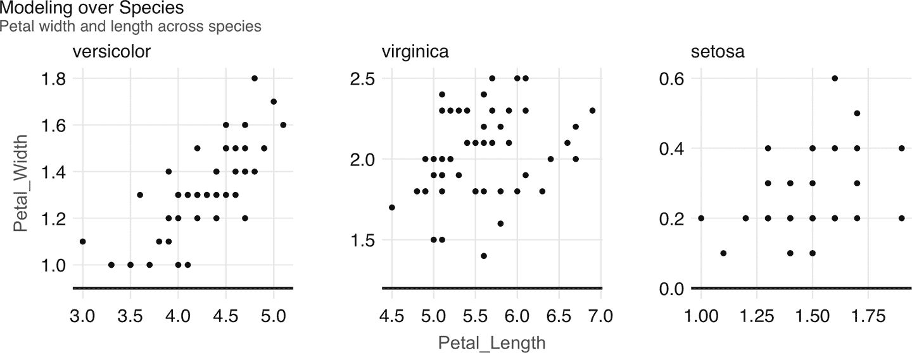
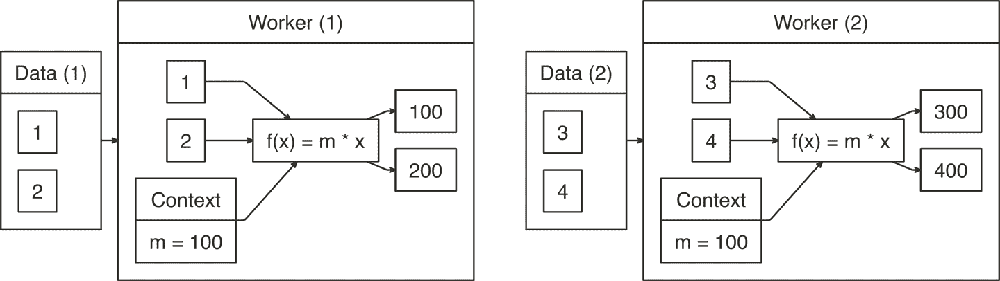
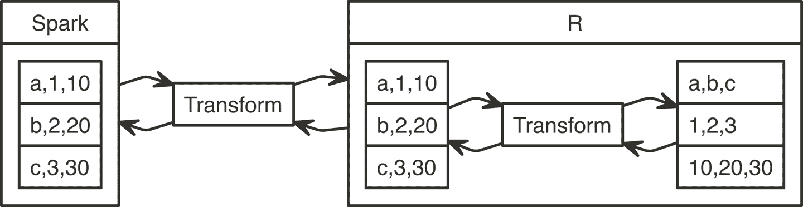
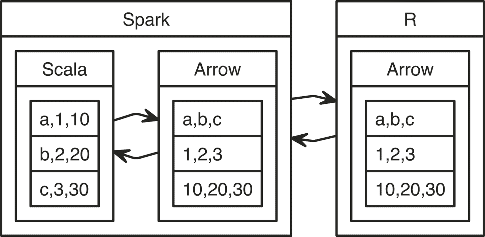

# 第十一章：分布式 R

> 不像这样。不像这样。不像这样。
> 
> —瑟曦·兰尼斯特

在之前的章节中，您学习了如何在本地 Spark 实例和适当的 Spark 集群中进行数据分析和建模。具体来说，在 第十章 中，我们讨论了如何利用 Spark 和 R 社区提供的额外功能。在大多数情况下，Spark 功能和扩展的组合已经足以执行几乎任何计算。然而，对于那些 Spark 和它们的扩展功能不足的情况，您可以考虑将 R 计算分发到工作节点。

您可以在每个工作节点上运行任意的 R 代码来执行任何计算 — 比如运行模拟、从网络上爬取内容、转换数据等。此外，您还可以使用 CRAN 中可用的任何包和您组织中可用的私有包，这样可以减少您需要编写的代码量，帮助您保持高效率。

如果您已经熟悉 R，您可能会倾向于将这种方法用于所有 Spark 操作；然而，这并不是推荐使用 `spark_apply()` 的方式。之前的章节提供了更高效的技术和工具来解决已知问题；相比之下，`spark_apply()` 引入了额外的认知负担、额外的故障排除步骤、性能折衷，以及一般上要避免的额外复杂性。并不是说 `spark_apply()` 绝对不能使用；而是说，`spark_apply()` 专门用于支持之前工具和技术无法满足的用例。

# 概述

第一章 引入了作为处理大规模数据集技术的 MapReduce。还描述了 Apache Spark 提供了一组操作的超集，以便更轻松和更有效地执行 MapReduce 计算。第九章 通过在分布式数据集的每个分区上应用自定义转换来展示 Spark 的工作原理。例如，如果我们将分布式数值数据集的每个元素乘以 10，则 Spark 将通过多个工作节点对每个分区应用映射操作。这个过程的概念视图如 图 11-1 所示。


###### 图 11-1\. 乘以十的映射操作

本章介绍如何使用 `spark_apply()` 定义自定义 `f(x)` 映射操作；对于前面的示例，`spark_apply()` 支持定义 `10 * x`，如下所示：

```
sdf_len(sc, 3) %>% spark_apply(~ 10 * .x)
```

```
# Source: spark<?> [?? x 1]
     id
* <dbl>
1    10
2    20
3    30
```

注意 `~ 10 * .x` 是在所有工作节点上执行的普通 R 代码。`~` 运算符定义在 `rlang` 包中，提供了一个相当于 `function(.x) 10 * .x` 的紧凑函数定义；这种紧凑形式也被称为*匿名函数*或*lambda 表达式*。

`f(x)` 函数必须接受 R DataFrame（或可以自动转换为其的内容）作为输入，并且必须输出 R DataFrame，如 图 11-2 所示。


###### 图 11-2\. spark_apply() 映射中预期的函数签名

我们可以回顾来自 第一章 的原始 MapReduce 示例，其中定义了将句子拆分为单词并将总唯一单词计数为减少操作。

在 R 中，我们可以使用 `tidytext` R 包中的 `unnest_tokens()` 函数，在连接到 Spark 之前需要从 CRAN 安装此包。然后，您可以使用 `spark_apply()` 将这些句子标记为单词表：

```
sentences <- copy_to(sc, data_frame(text = c("I like apples", "I like bananas")))

sentences %>%
  spark_apply(~tidytext::unnest_tokens(.x, word, text))
```

```
# Source: spark<?> [?? x 1]
  word
* <chr>
1 i
2 like
3 apples
4 i
5 like
6 bananas
```

我们可以通过使用 `dplyr` 完成 MapReduce 示例中的减少操作，如下所示：

```
sentences %>%
  spark_apply(~tidytext::unnest_tokens(., word, text)) %>%
  group_by(word) %>%
  summarise(count = count())
```

```
# Source: spark<?> [?? x 2]
  word    count
* <chr>   <dbl>
1 i           2
2 apples      1
3 like        2
4 bananas     1
```

本章的其余部分将详细解释在定义通过 `spark_apply()` 进行自定义映射时所需的用例、特性、注意事项、考虑因素和故障排除技术。

###### 注意

之前的句子标记化示例可以通过前几章的概念更有效地实现，具体来说是通过 `sentences %>% ft_tokenizer("text", "words") %>% transmute(word = explode(words))`。

# Use Cases

现在我们已经介绍了一个示例，帮助您理解 `spark_apply()` 的工作原理，接下来我们将讨论几个它的实际用例：

导入

您可以考虑使用 R 从外部数据源和格式导入数据。例如，当 Spark 或其扩展中未本地支持文件格式时，您可以考虑使用 R 代码来实现使用 R 包的分布式 *自定义解析器*。

模型

利用已经在 R 中可用的丰富建模功能与 Spark 是很自然的事情。在大多数情况下，R 模型无法跨大数据使用；然而，我们将介绍两个特定的用例，展示 R 模型在大规模情况下的有用性。例如，当数据适合单台机器时，您可以使用 *网格搜索* 并行优化其参数。在数据可以分区以创建多个模型来跨数据子集进行计算的情况下，您可以使用 R 中的 *分区建模* 来计算跨分区的模型。

转换

您可以使用 R 丰富的数据转换能力来补充 Spark。我们将呈现一个通过 *web API* 调用外部系统评估数据的用例。

计算

当您需要在 R 中执行大规模计算，或者如 第一章 中所述的 *大型计算* 时，Spark 是分布此计算的理想选择。我们将展示 *模拟* 作为 R 中大规模计算的一个特定用例。

现在我们将详细探讨每个用例，并提供一个工作示例，帮助您有效地使用 `spark_apply()`。

## 自定义解析器

尽管 Spark 及其各种扩展支持许多文件格式（CSV、JSON、Parquet、AVRO 等），您可能需要其他格式以便规模化使用。您可以使用 `spark_apply()` 和许多现有的 R 包解析这些额外的格式。在本节中，我们将看一下如何解析日志文件，虽然可以按照类似的方法解析其他文件格式。

使用 Spark 分析日志文件是很常见的，例如来自 Amazon S3 跟踪下载数据的日志。 `webreadr` 包可以通过支持加载存储在 Amazon S3、Squid 和常见日志格式的日志来简化解析日志的过程。在连接到 Spark 之前，您应该从 CRAN 安装 `webreadr` 。

例如，Amazon S3 日志如下所示：

```
#Version: 1.0
#Fields: date time x-edge-location sc-bytes c-ip cs-method cs(Host) cs-uri-stem
  sc-status cs(Referer) cs(User-Agent) cs-uri-query cs(Cookie) x-edge-result-type
  x-edge-request-id x-host-header cs-protocol cs-bytes time-taken

2014-05-23  01:13:11    FRA2    182 192.0.2.10  GET d111111abcdef8.cloudfront.net
  /view/my/file.html    200 www.displaymyfiles.com  Mozilla/4.0%20
  (compatible;%20MSIE%205.0b1;%20Mac_PowerPC)   -   zip=98101   RefreshHit
  MRVMF7KydIvxMWfJIglgwHQwZsbG2IhRJ07sn9AkKUFSHS9EXAMPLE==
  d111111abcdef8.cloudfront.net http    -   0.001
```

这可以通过 `read_aws()` 轻松解析，如下所示：

```
aws_log <- system.file("extdata/log.aws", package = "webreadr")
webreadr::read_aws(aws_log)
```

```
# A tibble: 2 x 18
  date                edge_location bytes_sent ip_address http_method host  path
  <dttm>              <chr>              <int> <chr>      <chr>       <chr> <chr>
1 2014-05-23 01:13:11 FRA2                 182 192.0.2.10 GET         d111… /vie…
2 2014-05-23 01:13:12 LAX1             2390282 192.0.2.2… GET         d111… /sou…
# ... with 11 more variables: status_code <int>, referer <chr>, user_agent <chr>,
#   query <chr>, cookie <chr>, result_type <chr>, request_id <chr>,
#   host_header <chr>, protocol <chr>, bytes_received <chr>, time_elapsed <dbl>
```

为了扩展此操作，我们可以使用 `spark_apply()` 使用 `read_aws()`：

```
spark_read_text(sc, "logs", aws_log, overwrite = TRUE, whole = TRUE) %>%
  spark_apply(~webreadr::read_aws(.x$contents))
```

```
# Source: spark<?> [?? x 18]
  date                edge_location bytes_sent ip_address http_method host  path
* <dttm>              <chr>              <int> <chr>      <chr>       <chr> <chr>
1 2014-05-23 01:13:11 FRA2                 182 192.0.2.10 GET         d111… /vie…
2 2014-05-23 01:13:12 LAX1             2390282 192.0.2.2… GET         d111… /sou…
# ... with 11 more variables: status_code <int>, referer <chr>, user_agent <chr>,
#   query <chr>, cookie <chr>, result_type <chr>, request_id <chr>,
#   host_header <chr>, protocol <chr>, bytes_received <chr>, time_elapsed <dbl>
```

纯 R 和 `spark_apply()` 使用的代码类似；但是，使用 `spark_apply()`，日志会在集群中所有可用的工作节点上并行解析。

这结束了自定义解析器讨论；您可以遵循类似的方法从 R 中扩展解析许多其他文件格式。接下来，我们将看一下分区*建模*作为另一个重点在多个数据集之间并行建模的用例。

## 分区建模

R 中有许多建模包也可以通过将数据分区为适合单台计算机资源的可管理组来运行。

例如，假设您有一个跨多个城市的 1 TB 销售数据集，并且您的任务是在每个城市上创建销售预测。对于这种情况，您可以考虑按城市对原始数据集进行分区，比如每个城市 10 GB 的数据，可以由单个计算实例管理。对于这种可分区数据集，您还可以考虑使用 `spark_apply()`，通过在每个城市上训练每个模型来训练。

作为分区建模的一个简单示例，我们可以使用 `iris` 数据集按物种分区运行线性回归：

```
iris <- copy_to(sc, datasets::iris)

iris %>%
  spark_apply(nrow, group_by = "Species")
```

```
# Source: spark<?> [?? x 2]
  Species    result
  <chr>       <int>
1 versicolor     50
2 virginica      50
3 setosa         50
```

然后，你可以使用 `spark_apply()` 对每个物种运行线性回归：

```
iris %>%
  spark_apply(
    function(e) summary(lm(Petal_Length ~ Petal_Width, e))$r.squared,
    names = "r.squared",
    group_by = "Species")
```

```
# Source: spark<?> [?? x 2]
  Species    r.squared
  <chr>          <dbl>
1 versicolor     0.619
2 virginica      0.104
3 setosa         0.110
```

如您从 `r.squared` 结果和直觉上在 图 11-3 中看到的，对于 `versicolor`，线性模型更适合回归线：

```
purrr::map(c("versicolor", "virginica", "setosa"),
  ~dplyr::filter(datasets::iris, Species == !!.x) %>%
    ggplot2::ggplot(ggplot2::aes(x = Petal.Length, y = Petal.Width)) +
    ggplot2::geom_point())
```



###### 图 11-3。在 iris 数据集中对物种建模

这结束了我们关于如何在几个不同的可分区数据集上执行建模的简要概述。可以应用类似的技术来在相同数据集上使用不同的建模参数执行建模，接下来我们将介绍。

## 网格搜索

许多 R 包提供需要定义多个参数来配置和优化的模型。当这些参数的值未知时，我们可以将此未知参数列表分发到一组机器中，以找到最佳参数组合。如果列表包含多个要优化的参数，则通常会针对参数 A 和参数 B 之间的所有组合进行测试，创建一个参数网格。在这个参数网格上搜索最佳参数的过程通常称为 *网格搜索*。

例如，我们可以定义一个参数网格来优化决策树模型，如下所示：

```
grid <- list(minsplit = c(2, 5, 10), maxdepth = c(1, 3, 8)) %>%
  purrr:::cross_df() %>%
  copy_to(sc, ., repartition = 9)
grid
```

```
# Source: spark<?> [?? x 2]
  minsplit maxdepth
     <dbl>    <dbl>
1        2        1
2        5        1
3       10        1
4        2        3
5        5        3
6       10        3
7        2        8
8        5        8
9       10        8
```

使用 `repartition = 9` 将网格数据集复制，以确保每个分区都包含在一个机器中，因为网格也有九行。现在，假设原始数据集适合每台机器，我们可以将此数据集分发到多台机器，并进行参数搜索，以找到最适合此数据的模型：

```
spark_apply(
  grid,
  function(grid, cars) {
    model <- rpart::rpart(
      am ~ hp + mpg,
      data = cars,
      control = rpart::rpart.control(minsplit = grid$minsplit,
                                     maxdepth = grid$maxdepth)
    )
    dplyr::mutate(
      grid,
      accuracy = mean(round(predict(model, dplyr::select(cars, -am))) == cars$am)
    )
  },
  context = mtcars)
```

```
# Source: spark<?> [?? x 3]
  minsplit maxdepth accuracy
     <dbl>    <dbl>    <dbl>
1        2        1    0.812
2        5        1    0.812
3       10        1    0.812
4        2        3    0.938
5        5        3    0.938
6       10        3    0.812
7        2        8    1
8        5        8    0.938
9       10        8    0.812
```

对于此模型，`minsplit = 2` 和 `maxdepth = 8` 生成了最准确的结果。现在，你可以使用这个特定的参数组合来正确训练你的模型。

## Web API

Web API 是通过 Web 接口提供有用功能的程序，其他程序可以重用它们。例如，像 Twitter 这样的服务提供 Web API，允许你在使用 R 和其他编程语言编写的程序中自动读取推文。你可以通过使用 `spark_apply()` 发送 R 代码来利用 Web API。

例如，Google 提供了一个 Web API 来使用深度学习技术对图像进行标注；你可以从 R 中使用此 API，但对于较大的数据集，你需要从 Spark 访问其 API。你可以使用 Spark 准备数据以供 Web API 使用，然后使用 `spark_apply()` 调用并在 Spark 中处理所有传入的结果。

下一个示例利用 `googleAuthR` 包对 Google Cloud 进行身份验证，使用 `RoogleVision` 包在 Google Vision API 上执行标注，并使用 `spark_apply()` 在 Spark 和 Google 的深度学习服务之间进行交互。要运行以下示例，首先需要断开与 Spark 的连接，并从 Google 开发者门户下载你的 *`cloudml.json`* 文件：

```
sc <- spark_connect(
  master = "local",
  config = list(sparklyr.shell.files = "cloudml.json"))

images <- copy_to(sc, data.frame(
  image = "http://pbs.twimg.com/media/DwzcM88XgAINkg-.jpg"
))

spark_apply(images, function(df) {
  googleAuthR::gar_auth_service(
    scope = "https://www.googleapis.com/auth/cloud-platform",
    json_file = "cloudml.json")

  RoogleVision::getGoogleVisionResponse(
    df$image,
    download = FALSE)
})
```

```
# Source: spark<?> [?? x 4]
  mid       description score topicality
  <chr>     <chr>       <dbl>      <dbl>
1 /m/04rky  Mammal      0.973      0.973
2 /m/0bt9lr Dog         0.958      0.958
3 /m/01z5f  Canidae     0.956      0.956
4 /m/0kpmf  Dog breed   0.909      0.909
5 /m/05mqq3 Snout       0.891      0.891
```

要成功地在 Web API 上运行大规模的分布式计算，API 需要能够扩展以支持来自所有 Spark 执行器的负载。我们可以相信主要服务提供商可能支持来自你的集群的所有请求。但当你调用内部 Web API 时，请确保 API 能够处理负载。此外，当你使用第三方服务时，考虑在你的集群中的所有执行器上调用其 API 的成本，以避免潜在的昂贵和意外的费用。

接下来，我们将描述一个使用案例，其中 R 用于执行分布式渲染。

## 模拟

您可以结合使用 R 和 Spark 进行大规模计算。我们在这里探讨的用例是使用 `rayrender` 软件包渲染计算密集型图像，该软件包使用光线追踪技术，这是电影制作中常用的一种逼真技术。

让我们使用这个软件包来渲染一个包含几个球体的简单场景（见 Figure 11-4），这些球体使用 *lambertian material*，一种漫反射材料或“哑光”。首先，使用 `install.packages("rayrender")` 安装 `rayrender`。然后，确保您已断开并重新连接 Spark：

```
library(rayrender)

scene <- generate_ground(material = lambertian()) %>%
  add_object(sphere(material = metal(color="orange"), z = -2)) %>%
  add_object(sphere(material = metal(color="orange"), z = +2)) %>%
  add_object(sphere(material = metal(color="orange"), x = -2))

render_scene(scene, lookfrom = c(10, 5, 0), parallel = TRUE)
```


###### 图 11-4\. 在 Spark 中使用 R 和 rayrender 进行光线追踪

在更高的分辨率下，比如 1920 x 1080，之前的例子需要几分钟来渲染来自 Figure 11-4 的单帧；以每秒 30 帧的速度渲染几秒钟将在单台机器上花费数小时。然而，我们可以通过在多台机器上并行计算来减少这个时间。例如，使用相同数量的 CPU 的 10 台机器将减少渲染时间十倍：

```
system2("hadoop", args = c("fs", "-mkdir", "/rendering"))

sdf_len(sc, 628, repartition = 628) %>%
  spark_apply(function(idx, scene) {
    render <- sprintf("%04d.png", idx$id)
    rayrender::render_scene(scene, width = 1920, height = 1080,
                            lookfrom = c(12 * sin(idx$id/100),
                                         5, 12 * cos(idx$id/100)),
                            filename = render)

    system2("hadoop", args = c("fs", "-put", render, "/user/hadoop/rendering/"))
  }, context = scene, columns = list()) %>% collect()
```

渲染所有图像之后，最后一步是从 HDFS 中收集它们，并使用 `ffmpeg` 这样的工具将单独的图像转换为动画：

```
hadoop fs -get rendering/
ffmpeg -s 1920x1080 -i rendering/%d.png -vcodec libx264 -crf 25
       -pix_fmt yuv420p rendering.mp4
```

###### 注意

此示例假设 HDFS 用作 Spark 的存储技术，并且以 `hadoop` 用户身份运行，您需要根据您的特定存储或用户进行调整。

我们已经涵盖了一些 `spark_apply()` 的常见用例，但您当然可以找到其他符合您特定需求的用例。接下来的章节将介绍您需要理解的技术概念，以创建额外的用例并有效地使用 `spark_apply()`。

# 分区

大多数使用 `dplyr` 分析数据或者使用 MLlib 建模的 Spark 操作不需要理解 Spark 如何分区数据；它们会自动运行。然而，对于分布式 R 计算来说并非如此。对于这些操作，您需要学习和理解 Spark 如何分区您的数据，并提供与之兼容的转换。这是因为 `spark_apply()` 接收每个分区并允许您执行任何转换，而不是整个数据集。您可以通过 Chapter 9 中的图表和示例刷新分区和转换的概念。

要帮助您理解 `spark_apply()` 中如何表示分区，请考虑以下代码：

```
sdf_len(sc, 10) %>%
  spark_apply(~nrow(.x))
```

```
# Source: spark<?> [?? x 1]
  result
*  <int>
1      5
2      5
```

我们应该期望输出是总行数吗？从结果中可以看出，一般来说答案是否定的；Spark 假设数据将分布在多台机器上，因此即使是小数据集，你通常也会发现它已经被分区。因为我们不应该期望 `spark_apply()` 在单个分区上操作，让我们找出 `sdf_len(sc, 10)` 包含多少个分区：

```
sdf_len(sc, 10) %>% sdf_num_partitions()
```

```
[1] 2
```

这解释了为什么在`spark_apply()`下通过`nrow()`计算行数会检索到两行，因为有两个分区，而不是一个。`spark_apply()`正在检索每个分区中的行数计数，每个分区包含 5 行，而不是总共 10 行，这可能是您所期望的。

对于这个特定的示例，我们可以通过重新分区并进行累加来进一步聚合这些分区——这将类似于使用`spark_apply()`进行简单的 MapReduce 操作：

```
sdf_len(sc, 10) %>%
  spark_apply(~nrow(.x)) %>%
  sdf_repartition(1) %>%
  spark_apply(~sum(.x))
```

```
# Source: spark<?> [?? x 1]
  result
*  <int>
1     10
```

现在您已了解如何使用`spark_apply()`处理分区，我们将转而使用`group_by`来控制分区。

# 分组

当使用`spark_apply()`时，我们可以要求 Spark 从生成的 DataFrame 中获取显式分区。例如，如果我们需要在一个分区中处理小于四的数字，而在第二个分区中处理剩余的数字，我们可以显式创建这些组，然后请求`spark_apply()`使用它们：

```
sdf_len(sc, 10) %>%
  transmute(groups = id < 4) %>%
  spark_apply(~nrow(.x), group_by = "groups")
```

```
# Source: spark<?> [?? x 2]
  groups result
* <lgl>   <int>
1 TRUE        3
2 FALSE       7
```

注意，`spark_apply()`仍在处理两个分区，但在这种情况下，我们期望这些分区，因为我们在`spark_apply()`中明确请求了它们；因此，您可以安全地解释结果为“有三个小于四的整数”。

###### 注意

您只能按照适合单台机器的分区对数据进行分组；如果其中一个分组过大，将抛出异常。为了在超出单个节点资源的组上执行操作，您可以考虑将其分区为较小单元，或者使用`dplyr::do`，它目前针对大分区进行了优化。

本节的要点是在处理`spark_apply()`时始终考虑分区。接下来，我们将深入研究`spark_apply()`，以了解列的解释方式。

# 列

默认情况下，`spark_apply()`会自动检查正在生成的 DataFrame 以学习列名和类型。例如：

```
sdf_len(sc, 1) %>%
  spark_apply(~ data.frame(numbers = 1, names = "abc"))
```

```
# Source: spark<?> [?? x 2]
  numbers names
*   <dbl> <chr>
1       1 abc
```

然而，这样做效率低下，因为`spark_apply()`需要运行两次：首先通过计算所有数据的子集来找到列，然后计算实际所需的值。

为了提高性能，可以通过`columns`参数显式指定列。此参数接受一个命名列表，列出预期在生成的 DataFrame 中的类型。我们可以通过为`numbers`列指定正确的类型，重写之前的示例以仅运行一次：

```
sdf_len(sc, 1) %>%
  spark_apply(
    ~ data.frame(numbers = 1, names = "abc"),
    columns = list(numbers = "double", names = "character"))
```

```
# Source: spark<?> [?? x 2]
  numbers names
*   <dbl> <chr>
1       1 abc
```

现在我们已经介绍了行和列如何与`spark_apply()`交互，让我们继续利用处理分布式数据集时有时需要的上下文信息。

# 上下文

要使用`spark_apply()`处理分区，可能需要包含足够小以适应每个节点的辅助数据。这在网格搜索用例中是成立的，数据集传递到所有分区并保持不分区。

我们可以修改本章中初始的`f(x) = 10 * x`示例以自定义乘数。它最初设置为`10`，但我们可以通过将其指定为`context`参数来使其可配置：

```
sdf_len(sc, 4) %>%
  spark_apply(
    function(data, context) context * data,
    context = 100
  )
```

```
# Source: spark<?> [?? x 1]
     id
  <dbl>
1   100
2   200
3   300
4   400
```

图 11-5 从概念上说明了这个例子。请注意，数据分区仍然是可变的；但是，上下文参数分发到所有节点。



###### 图 11-5\. 在乘以上下文时的映射操作

网格搜索示例使用此参数将 DataFrame 传递给每个工作节点；但是，由于上下文参数被序列化为 R 对象，它可以包含任何内容。例如，如果需要传递多个值——甚至多个数据集——可以传递一个包含值的列表。

下面的示例定义了一个`f(x) = m * x + b`函数，并运行`m = 10`和`b = 2`：

```
sdf_len(sc, 4) %>%
  spark_apply(
    ~.y$m * .x + .y$b,
    context = list(b = 2, m = 10)
  )
```

```
# Source: spark<?> [?? x 1]
     id
  <dbl>
1    12
2    22
3    32
4    42
```

请注意，我们已将`context`重命名为`.y`以缩短变量名。这是有效的，因为`spark_apply()`假设上下文是函数和表达式中的第二个参数。

您会发现`context`参数非常有用；例如，下一节将介绍如何正确构建函数，而高级用例中使用`context`来构建依赖于其他函数的函数。

# 函数

之前我们介绍了`spark_apply()`作为执行自定义转换的操作，使用函数或表达式。在编程文献中，具有上下文的函数也被称为*闭包*。

表达式可用于定义短转换，如`~ 10 * .x`。对于表达式，`.x`包含一个分区，`.y`包含上下文（如果有）。但是，对于跨多行的复杂代码，定义表达式可能很困难。对于这些情况，函数更为合适。

函数使复杂且多行的转换成为可能，并被定义为`function(data, context) {}`，您可以在`{}`中提供任意代码。在使用 Google Cloud 将图像转换为图像标题时，我们在前面的部分中看到了它们。

传递给`spark_apply()`的函数使用`serialize()`进行序列化，该函数被描述为“用于序列化到连接的简单低级接口”。`serialize()`当前的限制之一是，它不会序列化在其环境外引用的对象。例如，由于闭包引用了`external_value`，因此以下函数会报错：

```
external_value <- 1
spark_apply(iris, function(e) e + external_value)
```

作为解决此限制的变通方法，您可以将闭包所需的函数添加到`context`中，然后将这些函数分配给全局环境：

```
func_a <- function() 40
func_b <- function() func_a() + 1
func_c <- function() func_b() + 1

sdf_len(sc, 1) %>% spark_apply(function(df, context) {
  for (name in names(context)) assign(name, context[[name]], envir = .GlobalEnv)
  func_c()
}, context = list(
  func_a = func_a,
  func_b = func_b,
  func_c = func_c
))
```

```
# Source: spark<?> [?? x 1]
  result
   <dbl>
1     42
```

当这不可行时，您还可以创建自己的 R 包，其中包含您需要的功能，然后在`spark_apply()`中使用您的包。

您已经学会了`spark_apply()`中提供的所有功能，使用纯 R 代码。在下一节中，我们将介绍在分布计算中使用包时的方法。当您创建有用的转换时，R 包至关重要。

# 包

使用`spark_apply()`，您可以在 Spark 内部使用任何 R 包。例如，您可以使用`broom`包从线性回归输出中创建整洁的 DataFrame：

```
spark_apply(
  iris,
  function(e) broom::tidy(lm(Petal_Length ~ Petal_Width, e)),
  names = c("term", "estimate", "std.error", "statistic", "p.value"),
  group_by = "Species")
```

```
# Source: spark<?> [?? x 6]
  Species    term        estimate std.error statistic  p.value
  <chr>      <chr>          <dbl>     <dbl>     <dbl>    <dbl>
1 versicolor (Intercept)    1.78     0.284       6.28 9.48e- 8
2 versicolor Petal_Width    1.87     0.212       8.83 1.27e-11
3 virginica  (Intercept)    4.24     0.561       7.56 1.04e- 9
4 virginica  Petal_Width    0.647    0.275       2.36 2.25e- 2
5 setosa     (Intercept)    1.33     0.0600     22.1  7.68e-27
6 setosa     Petal_Width    0.546    0.224       2.44 1.86e- 2
```

第一次调用 `spark_apply()` 时，将会复制您本地 `.libPaths()` 中的所有内容（其中包含所有 R 包）到每个 Spark 工作节点中。包只会复制一次，并在连接保持打开状态时持续存在。R 库的大小可能会达到数千兆字节，因此在复制 R 包到 Spark 集群期间需要一次性的时间和资源。您可以通过设置 `packages = FALSE` 来禁用包分发。

###### 注意

因为包只在 `spark_connect()` 连接期间复制一次，所以在连接活跃时不支持安装额外的包。因此，如果需要安装新包，需先 `spark_disconnect()` 断开连接，修改包，然后重新连接。此外，在本地模式下不会复制 R 包，因为这些包已经存在于本地系统中。

虽然本节内容简短，但使用分布式 R 代码的包打开了许多有趣的用例。本章介绍了一些这些用例，但通过查看当今可用的丰富 R 包生态系统，您会发现更多。

本节完成了我们讨论分发 R 代码所需功能的部分。现在我们将介绍一些您的集群需要满足以使用 `spark_apply()` 的要求。

# 集群要求

在之前的章节中介绍的功能不需要对 Spark 集群进行特殊配置，只要您的 Spark 集群正确配置，就可以使用 R。然而，对于此处介绍的功能，您的集群管理员、云提供商或您将不得不通过安装以下内容来配置您的集群：

+   在整个集群中的每个节点都需要安装 R，以便在您的集群中执行 R 代码。

+   在使用 Spark 2.3 或更高版本时，每个节点都需要安装 Apache Arrow（Arrow 提供的性能改进使得分布式 R 代码更接近本地 Scala 代码）。

让我们逐个审视每个要求，确保您正确考虑到它们提供的权衡或好处。

## 安装 R

从第一个要求开始，期望在集群的*每个*节点预先安装 R 运行时；这是 `spark_apply()` 特定的要求。

如果未在每个节点安装 R，则在尝试使用 `spark_apply()` 时将触发 `Cannot run program, no such file or directory` 错误。

请联系您的集群管理员，考虑让 R 运行时在整个集群中可用。如果 R 已安装，您可以指定安装路径以供 `spark.r.command` 配置设置使用，如下所示：

```
config <- spark_config()
config["spark.r.command"] <- "<path-to-r-version>"

sc <- spark_connect(master = "local", config = config)
sdf_len(sc, 10) %>% spark_apply(function(e) e)
```

*同质集群*是必需的，因为驱动节点分发并可能编译包到工作节点。例如，驱动程序和工作节点必须具有相同的处理器架构、系统库等。对于大多数集群来说，这通常是符合条件的，但对您的集群可能不一定成立。

不同的集群管理器、Spark 分布和云提供商支持安装额外软件（如 R）在集群的每个节点上；在安装 R 时，请遵循相应的说明。以下是一些示例：

Spark Standalone

需要连接到每台机器并安装 R；像`pssh`这样的工具允许您对多台机器运行单个安装命令。

Cloudera

提供一个 R 包（参见 Cloudera 博客文章[“如何使用 sparklyr 和 Cloudera 数据科学工作台分发您的 R 代码”](http://bit.ly/33JAfu4)），它允许在每个工作节点上使用 R。

Amazon EMR

当提到“Amazon”时，启动 EMR 集群时预安装 R。

微软 HDInsight

当启动 EMR 集群时，R 是预安装的，不需要额外的步骤。

Livy

Livy 连接*不支持*分发软件包，因为客户机（预编译库的位置）可能与集群机器具有不同的处理器架构或操作系统。

严格来说，这完成了集群的最后一个要求。然而，我们强烈建议您使用`spark_apply()`与 Apache Arrow 支持大规模计算，以减少额外开销。

## Apache Arrow

在介绍 Apache Arrow 之前，我们将讨论数据在 Spark 和 R 之间是如何存储和传输的。由于 R 从一开始就设计用于执行快速的数值计算，因此找出存储数据的最佳方式非常重要。

一些计算系统将数据内部存储为行；但是，大多数有趣的数值操作需要按列处理数据。例如，计算列的平均值需要单独处理每一列，而不是整行。Spark 默认按行存储数据，因为它更容易分区；相比之下，R 按列存储数据。因此，在数据在 Spark 和 R 之间传输时，需要某种方式转换这两种表示，如图 11-6 所示。



###### 图 11-6\. Spark 和 R 之间的数据转换

每个分区都需要进行从行到列的转换。此外，数据还必须从 Scala 的内部表示转换为 R 的内部表示。Apache Arrow 减少了这些浪费大量 CPU 周期的转换过程。

Apache Arrow 是一个跨语言的内存数据开发平台。在 Spark 中，它通过定义与许多编程语言兼容的通用数据格式来加快 Scala 和 R 之间数据传输的速度。不必转换 Scala 的内部表示和 R 的，可以同时使用两种语言相同的结构。此外，将数据从基于行的存储转换为列存储是在 Spark 中并行进行的，可以通过使用第八章中介绍的列存储格式进一步优化。改进的转换如图 11-7 所示（#distributed-r-using-arrow）。



###### 图 11-7。使用 Apache Arrow 在 Spark 和 R 之间进行数据转换

在使用`spark_apply()`时，虽然不需要 Apache Arrow，但强烈推荐使用。自 Spark 2.3.0 起已经可用，但需要系统管理员在每个节点上安装 Apache Arrow 运行时（参见[*http://arrow.apache.org/install/)*](http://arrow.apache.org/install/)）。

此外，要在`sparklyr`中使用 Apache Arrow，还需要安装`arrow`包：

```
install.packages("arrow")
```

在使用`arrow`之前，让我们进行一次测量以验证：

```
system.time(
  sdf_len(sc, 10⁴) %>% spark_apply(nrow) %>% collect()
)
```

```
   user  system elapsed
  0.240   0.020   7.957
```

在我们的特定系统中，处理 10,000 行大约需要 8 秒钟。要启用 Arrow，只需包含该库并像往常一样使用`spark_apply()`。我们来测量一下`spark_apply()`处理 100 万行所需的时间：

```
library(arrow)
system.time(
  sdf_len(sc, 10⁶) %>% spark_apply(nrow) %>% collect()
)
```

```
   user  system elapsed
  0.317   0.021   3.922
```

在我们的系统中，Apache Arrow 可以在半时间内处理 100 倍数据：仅需 4 秒。

大多数`arrow`功能只需在后台运行，改善性能和数据序列化；但是，有一个设置你应该注意。`spark.sql.execution.arrow.maxRecordsPerBatch`配置设置了每个 Arrow 数据传输的默认大小。它与其他 Spark 组件共享，默认为 10,000 行：

```
library(arrow)
sdf_len(sc, 2 * 10⁴) %>% spark_apply(nrow)
```

```
# Source: spark<?> [?? x 1]
  result
   <int>
1  10000
2  10000
```

你可能需要根据系统处理能力调整此数字，对于大数据集可能需要减少，对于需要一起处理记录的操作可能需要增加。我们可以将此设置更改为 5,000 行，并验证分区是否相应更改：

```
config <- spark_config()
config$spark.sql.execution.arrow.maxRecordsPerBatch <- 5 * 10³

sc <- spark_connect(master = "local", config = config)
sdf_len(sc, 2 * 10⁴) %>% spark_apply(nrow)
```

```
# Source: spark<?> [?? x 1]
  result
   <int>
1   5000
2   5000
3   5000
4   5000
```

到目前为止，我们已经介绍了用例、主要操作和集群要求。现在我们将讨论在分发 R 代码时有用的故障排除技术。

# 故障排除

自定义转换可能因多种原因而失败。要了解如何排除错误，请通过触发错误来模拟一个问题：

```
sdf_len(sc, 1) %>% spark_apply(~stop("force an error"))
```

```
Error in force(code) :
  sparklyr worker rscript failure, check worker logs for details
    Log: wm_bx4cn70s6h0r5vgsldm0000gn/T/Rtmpob83LD/file2aac1a6188_spark.log

---- Output Log ----
19/03/11 14:12:24 INFO sparklyr: Worker (1) completed wait using lock for RScript
```

请注意，错误消息提到检查日志。在本地模式下运行时，您可以简单地运行以下命令：

```
spark_log(sc, filter = "terminated unexpectedly")
```

```
19/03/11 14:12:24 ERROR sparklyr: RScript (1) terminated unexpectedly:
                                              force an error
```

这指向我们提到的人为`stop("force an error")`错误。但是，如果您不是在本地模式下工作，则需要从集群管理器中检索工作节点日志。由于这可能很麻烦，一个替代方法是重新运行`spark_apply()`，但返回自己的错误消息：

```
sdf_len(sc, 1) %>% spark_apply(~tryCatch(
    stop("force an error"),
    error = function(e) e$message
))
```

```
# Source: spark<?> [?? x 1]
  result
  <chr>
1 force an error
```

在适用于`spark_apply()`的其他更高级故障排除技术中，以下部分按顺序介绍了这些技术。您应该首先尝试使用工作节点日志来进行故障排除，然后识别分区错误，最后尝试调试工作节点。

## 工作节点日志

每当执行`spark_apply()`时，会在每个工作节点上写入有关执行的信息。您可以使用此日志编写自定义消息来帮助诊断和微调您的代码。

例如，假设我们不知道`df`的第一列名称是什么。我们可以使用`worker_log()`从工作节点编写自定义日志消息如下：

```
sdf_len(sc, 1) %>% spark_apply(function(df) {
  worker_log("the first column in the data frame is named ", names(df)[[1]])
  df
})
```

```
# Source: spark<?> [?? x 1]
     id
* <int>
1     1
```

在本地运行时，我们可以按以下方式筛选工作节点的日志条目：

```
spark_log(sc, filter = "sparklyr: RScript")
```

```
18/12/18 11:33:47 INFO sparklyr: RScript (3513) the first column in
the dataframe is named id
18/12/18 11:33:47 INFO sparklyr: RScript (3513) computed closure
18/12/18 11:33:47 INFO sparklyr: RScript (3513) updating 1 rows
18/12/18 11:33:47 INFO sparklyr: RScript (3513) updated 1 rows
18/12/18 11:33:47 INFO sparklyr: RScript (3513) finished apply
18/12/18 11:33:47 INFO sparklyr: RScript (3513) finished
```

请注意，日志打印出我们的自定义日志条目，显示`id`是给定 DataFrame 中第一列的名称。

此功能在故障排除时非常有用；例如，如果我们使用`stop()`函数强制引发错误：

```
sdf_len(sc, 1) %>% spark_apply(function(df) {
  stop("force an error")
})
```

我们将收到类似以下的错误：

```
 Error in force(code) :
  sparklyr worker rscript failure, check worker logs for details
```

正如错误建议的那样，我们可以查看工作节点日志以获取具体的错误信息，如下所示：

```
spark_log(sc)
```

这将显示一个包含错误和调用堆栈的条目：

```
18/12/18 11:26:47 INFO sparklyr: RScript (1860) computing closure
18/12/18 11:26:47 ERROR sparklyr: RScript (1860) terminated unexpectedly:
                                                 force an error
18/12/18 11:26:47 ERROR sparklyr: RScript (1860) collected callstack:
11: stop("force and error")
10: (function (df)
{
    stop("force and error")
})(structure(list(id = 1L), class = "data.frame", row.names = c(NA,
-1L)))
```

请注意，只有在使用本地集群时，`spark_log(sc)`才会检索到工作节点的日志。在具有多台机器的正式集群中运行时，您必须使用集群管理器提供的工具和用户界面来查找这些日志条目。

## 解决超时问题

当您使用数百个执行器运行时，某些任务无限期挂起的可能性增加。在这种情况下，您的作业中大多数任务会成功完成，但其中少数任务仍在运行且未失败或成功。

假设您需要计算许多网页的大小。您可以使用类似以下内容的`spark_apply()`：

```
sdf_len(sc, 3, repartition = 3) %>%
  spark_apply(~ download.file("https://google.com", "index.html") +
                file.size("index.html"))
```

有些网页可能不存在或下载时间过长。在这种情况下，大多数任务会成功，但少数任务会挂起。为了防止这些少数任务阻塞所有计算，可以使用`spark.speculation` Spark 设置。启用此设置后，当所有任务成功完成的比例达到 75%时，Spark 会查找执行时间超过中位数的任务并进行重试。可以使用`spark.speculation.multiplier`设置来配置用于确定任务运行缓慢的时间倍增器。

因此，在本例中，您可以配置 Spark 以按照四倍于中位数时间的任务进行重试，如下所示：

```
config <- spark_config()
config["spark.speculation"] <- TRUE
config["spark.speculation.multiplier"] <- 4
```

## 检查分区

如果特定分区失败，您可以通过计算摘要来检测损坏的分区，然后检索该特定分区。通常情况下，您可以在连接到 Spark 之前从 CRAN 安装`digest`：

```
sdf_len(sc, 3) %>% spark_apply(function(x) {
    worker_log("processing ", digest::digest(x), " partition")
    # your code
    x
})
```

这将添加类似以下条目：

```
18/11/03 14:48:32 INFO sparklyr: RScript (2566)
  processing f35b1c321df0162e3f914adfb70b5416 partition
```

在集群中执行此操作时，请查看未完成任务的日志。一旦获取了该摘要，您可以取消作业。然后，您可以使用该摘要从 R 中检索特定的 DataFrame，如下所示：

```
sdf_len(sc, 3) %>% spark_apply(function(x) {
    if (identical(digest::digest(x),
                  "f35b1c321df0162e3f914adfb70b5416")) x else x[0,]
}) %>% collect()
```

```
# A tibble: 1 x 1
  result
   <int>
1      1
```

然后，您可以在 R 中运行此命令以进一步进行故障排除。

## 调试工作节点

调试器是一个工具，允许您逐行执行代码；您可以使用此工具来调试本地连接的`spark_apply()`。您可以通过使用`debug`参数启动调试模式，然后按照以下说明操作：

```
sdf_len(sc, 1) %>% spark_apply(function() {
  stop("Error!")
}, debug = TRUE)
```

```
Debugging spark_apply(), connect to worker debugging session as follows:
  1\. Find the workers <sessionid> and <port> in the worker logs, from RStudio
     click 'Log' under the connection, look for the last entry with contents:
     'Session (<sessionid>) is waiting for sparklyr client to connect to
      port <port>'
  2\. From a new R session run:
     debugonce(sparklyr:::spark_worker_main)
     sparklyr:::spark_worker_main(<sessionid>, <port>)
```

正如这些说明所示，您需要从不同的 R 会话中连接“作为工作节点”，然后逐步执行代码。这种方法比以前的方法更不直接，因为您还需要逐行查看一些`sparklyr`代码；因此，我们仅建议作为最后的手段使用。（您也可以尝试第二章中描述的在线资源。）

现在让我们通过简要回顾本章节所呈现的功能来总结本章节。

# 回顾

本章介绍了`spark_apply()`作为一种高级技术，您可以用它来填补 Spark 或其许多扩展功能中的空白。我们展示了`spark_apply()`的示例用例，用于解析数据、并行建模多个小数据集、执行网格搜索和调用 Web API。您了解了分区如何与`spark_apply()`相关联，以及如何创建自定义组，将上下文信息分发到所有节点，并解决问题、限制和集群配置注意事项。

我们还强烈建议在使用 Spark 与 R 时使用 Apache Arrow 作为库，并介绍了您应该注意的安装、用例和注意事项。

到目前为止，我们仅使用静态数据的大型数据集进行了工作，这些数据不会随时间而变化，在我们分析、建模和可视化它们时保持不变。在第十二章中，我们将介绍处理数据集的技术，这些数据集不仅大，而且以类似信息流的方式增长。
