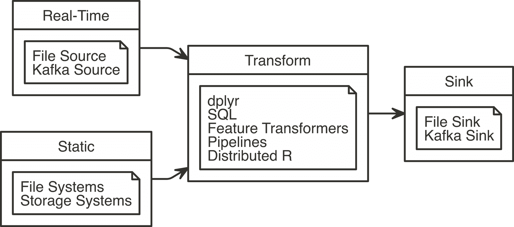
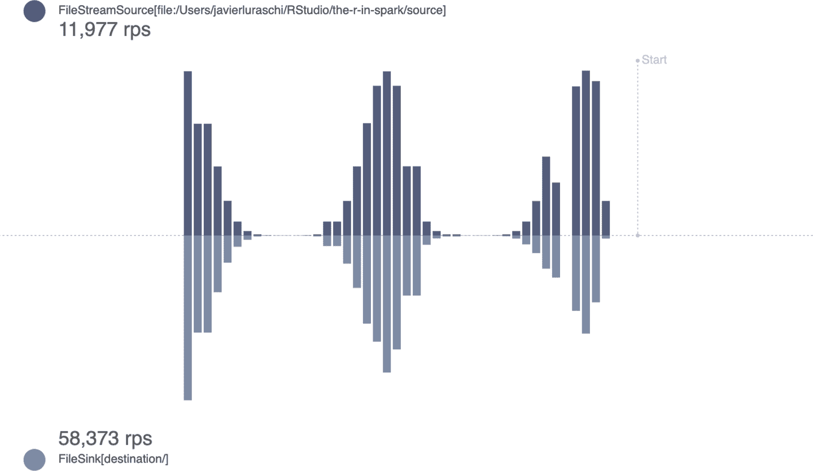
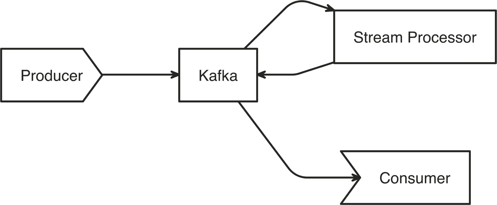
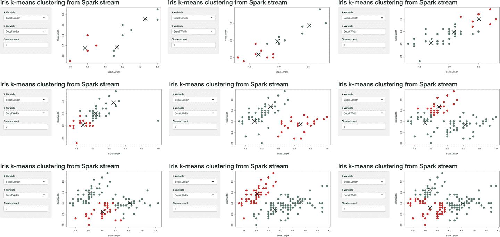

# 第十二章：流处理

> 我们的故事还没有结束。
> 
> —艾亚·史塔克

回顾之前的章节，我们已经涵盖了很多内容，但并非所有内容。我们分析了表格数据集，在原始文本上执行了无监督学习，分析了图形和地理数据集，甚至使用自定义 R 代码转换了数据！现在怎么办呢？

虽然我们没有明确提到，但到目前为止，我们假设您的数据是静态的，并且随时间不变。但是假设你的工作是分析交通模式以向交通部门提供建议。一个合理的方法是分析历史数据，然后设计能够在夜间计算预测的预测模型。过夜？这非常有用，但交通模式每小时甚至每分钟都在变化。您可以尝试预处理并更快地进行预测，但最终这种模型会崩溃——您无法加载大规模数据集、转换它们、评分它们、卸载它们，然后每秒重复这个过程。

相反，我们需要引入一种不同类型的数据集——一种不是静态而是动态的，一种像表格但不断增长的数据集。我们将这种数据集称为*流*。

# 概述

我们知道如何处理大规模静态数据集，但如何处理大规模实时数据集呢？具有无限条目的数据集被称为*流*。

对于静态数据集，如果我们使用预先训练的主题模型进行实时评分，条目将是文本行；对于实时数据集，我们将在无限数量的文本行上执行相同的评分。现实中，您永远不会处理无限数量的记录。最终您会停止流——或者这个宇宙可能会结束，看哪个先到。不管怎样，将数据集视为无限使得推理更容易。

当处理实时数据时，流最相关——例如分析 Twitter 动态或股票价格。这两个示例都有明确定义的列，如“推文”或“价格”，但总会有新的数据行需要分析。

*Spark Streaming* 提供了可伸缩和容错的数据处理，适用于数据流。这意味着您可以使用多台机器处理多个数据流源，与其他流或静态源进行连接，并通过至少一次保证从故障中恢复（确保每条消息被传递，但可能会多次传递）。

在 Spark 中，您通过定义*源*、*转换*和*汇*来创建流；您可以将这些步骤视为读取、转换和写入流，如图 12-1 所示。



###### 图 12-1\. 使用 Spark Streaming

让我们仔细看看每一个：

阅读

流使用任何`stream_read_*()`函数读取数据；读操作定义了流的*源*。您可以定义一个或多个要读取的源。

转换

流可以使用`dplyr`、`SQL`、特征转换器、评分管道或分布式 R 代码执行一个或多个转换。转换不仅可以应用于一个或多个流，还可以使用流和静态数据源的组合；例如，使用`spark_read_()`函数加载到 Spark 中——这意味着您可以轻松地结合静态数据和实时数据源。

写入

写操作使用`stream_write_*()`函数系列执行，而读操作则定义了流的接收端。您可以指定一个或多个接收端来写入数据。

您可以在多种不同的文件格式（如 CSV、JSON、Parquet、优化行列式（ORC）和文本）中读取和写入流；另请参阅表 12-1。您还可以从 Kafka 读取和写入数据，我们稍后将介绍。

表 12-1\. 用于读取和写入流的 Spark 函数

| 格式 | 读取 | 写入 |
| --- | --- | --- |
| CSV | `stream_read_csv` | `stream_write_csv` |
| JSON | `stream_read_json` | `stream_write_json` |
| Kafka | `stream_read_kafka` | `stream_write_kafka` |
| ORC | `stream_read_orc` | `stream_write_orc` |
| Parquet | `stream_read_parquet` | `stream_write_parquet` |
| 文本 | `stream_read_text` | `stream_write_text` |
| 内存 |  | `stream_write_memory` |

由于转换步骤是可选的，我们可以定义的最简单的流是一个持续复制文本文件的流，从源到目的地。

首先，使用`install.packages("future")`安装`future`包并连接到 Spark。

由于流需要存在的源，创建一个`_source_`文件夹：

```
dir.create("source")
```

现在我们准备定义我们的第一个流！

```
stream <- stream_read_text(sc, "source/") %>%
  stream_write_text("destination/")
```

流使用`stream_write_*()`开始运行；执行后，流将监视*`source`*路径，并在数据到达时将数据处理到*`destination /`*路径。

我们可以使用`stream_generate_test()`每秒生成一个文件，其中包含遵循给定分布的文本行；您可以在附录 A 中详细了解。在实践中，您将连接到现有的源，而不必人工生成数据。然后，我们可以使用`view_stream()`来跟踪在源和目的地中每秒处理的行数（rps）及其随时间变化的最新值：

```
future::future(stream_generate_test(interval = 0.5))
```

```
stream_view(stream)
```

结果显示在图 12-2 中。



###### 图 12-2\. 监控生成符合二项分布的行的流

注意目标流中的 rps 速率高于源流中的速率。这是预期且希望的，因为 Spark 会测量从源流接收的入站速率，同时还会测量目标流中的实际行处理时间。例如，如果每秒写入`source/`路径的行数为 10 行，则入站速率为 10 rps。但是，如果 Spark 仅花费 0.01 秒就可以写完这 10 行，则输出速率为 100 rps。

使用`stream_stop()`来正确停止从此流程中处理数据：

```
stream_stop(stream)
```

本练习介绍了如何轻松启动一个 Spark 流，根据模拟流读取和写入数据。让我们做些比仅仅复制数据更有趣的事情，进行适当的转换。

# 转换

在实际情况中，从流中接收的数据不会直接写入输出。Spark Streaming 作业将对数据进行转换，然后写入转换后的数据。

可以使用`dplyr`、SQL 查询、ML 管道或 R 代码对流进行转换。可以像对 Spark DataFrames 进行转换一样，使用任意数量的转换。

转换的源可以是流或 DataFrame，但输出始终是流。如果需要，可以从目标流中获取快照，然后将输出保存为 DataFrame。如果未指定目标流，则`sparklyr`将为您完成这一操作。

以下各小节涵盖了由`sparklyr`提供的选项，用于对流进行转换。

## 分析

您可以使用`dplyr`动词和使用`DBI`的 SQL 来分析流。作为一个快速示例，我们将在流上过滤行并添加列。我们不会显式调用`stream_generate_test()`，但如果您感到有必要验证数据是否持续处理，可以通过`later`包自行调用它：

```
library(dplyr)

stream_read_csv(sc, "source") %>%
  filter(x > 700) %>%
  mutate(y = round(x / 100))
```

```
# Source: spark<?> [inf x 2]
       x     y
   <int> <dbl>
 1   701     7
 2   702     7
 3   703     7
 4   704     7
 5   705     7
 6   706     7
 7   707     7
 8   708     7
 9   709     7
10   710     7
# … with more rows
```

也可以对流的整个历史执行聚合。历史可以进行过滤或不进行过滤：

```
stream_read_csv(sc, "source") %>%
  filter(x > 700) %>%
  mutate(y = round(x / 100)) %>%
  count(y)
```

```
# Source: spark<?> [inf x 2]
      y     n
  <dbl> <dbl>
1     8 25902
2     9 25902
3    10 13210
4     7 12692
```

流中最新数据的分组聚合需要一个时间戳。时间戳会记录读取函数（在本例中是`stream_read_csv()`）第一次“看到”该特定记录的时间。在 Spark Streaming 术语中，时间戳被称为*水印*。`spark_watermark()`函数会添加这个时间戳。在这个例子中，由于这五个文件是在流读取它们创建后被读取的，因此所有记录的水印都是相同的。请注意，只有 Kafka 和内存*输出*支持水印：

```
stream_read_csv(sc, "source") %>%
  stream_watermark()
```

```
# Source: spark<?> [inf x 2]
       x timestamp
   <int> <dttm>
 1   276 2019-06-30 07:14:21
 2   277 2019-06-30 07:14:21
 3   278 2019-06-30 07:14:21
 4   279 2019-06-30 07:14:21
 5   280 2019-06-30 07:14:21
 6   281 2019-06-30 07:14:21
 7   282 2019-06-30 07:14:21
 8   283 2019-06-30 07:14:21
 9   284 2019-06-30 07:14:21
10   285 2019-06-30 07:14:21
# … with more rows
```

创建了水印之后，可以在`group_by()`动词中使用它。然后可以将其输入到`summarise()`函数中以获取流的一些统计信息：

```
stream_read_csv(sc, "source") %>%
  stream_watermark() %>%
  group_by(timestamp) %>%
  summarise(
    max_x = max(x, na.rm = TRUE),
    min_x = min(x, na.rm = TRUE),
    count = n()
  )
```

```
# Source: spark<?> [inf x 4]
  timestamp           max_x min_x  count
  <dttm>              <int> <int>  <dbl>
1 2019-06-30 07:14:55  1000     1 259332
```

## 建模

目前 Spark 流不支持在实时数据集上进行训练。除了技术上的挑战之外，即使可能，训练模型也将是相当困难的，因为模型本身需要随时间而适应。作为*在线学习*的一种形式，这可能是 Spark 未来将支持的内容。

话虽如此，我们可以利用流使用其他建模概念，比如特征转换器和评分。让我们尝试在流中使用一个特征转换器，并且将评分留到下一节，因为我们需要训练一个模型。

下一个示例使用`ft_bucketizer()`特征转换器修改流，然后使用常规的`dplyr`函数，您可以像处理静态数据集一样使用它们：

```
stream_read_csv(sc, "source") %>%
  mutate(x = as.numeric(x)) %>%
  ft_bucketizer("x", "buckets", splits = 0:10 * 100) %>%
  count(buckets)  %>%
  arrange(buckets)
```

```
# Source:     spark<?> [inf x 2]
# Ordered by: buckets
   buckets     n
     <dbl> <dbl>
 1       0 25747
 2       1 26008
 3       2 25992
 4       3 25908
 5       4 25905
 6       5 25903
 7       6 25904
 8       7 25901
 9       8 25902
10       9 26162
```

## 流水线

Spark 流水线可以用于对流进行评分，但不能用于在流数据上进行训练。前者得到了完全支持，而后者是 Spark 社区正在积极开发的功能。

要对流进行评分，首先需要创建我们的模型。因此，让我们构建、拟合并保存一个简单的流水线：

```
cars <- copy_to(sc, mtcars)

model <- ml_pipeline(sc) %>%
  ft_binarizer("mpg", "over_30", 30) %>%
  ft_r_formula(over_30 ~ wt) %>%
  ml_logistic_regression() %>%
  ml_fit(cars)
```

###### 提示

如果您选择，可以利用第五章中介绍的其他概念，如通过`ml_save()`和`ml_load()`保存和重新加载流水线，然后对流进行评分。

我们可以使用`stream_generate_test()`基于`mtcars`生成流，并使用`ml_transform()`对模型进行评分：

```
future::future(stream_generate_test(mtcars, "cars-stream", iterations = 5))

ml_transform(model, stream_read_csv(sc, "cars-stream"))
```

```
# Source: spark<?> [inf x 17]
     mpg   cyl  disp    hp  drat    wt  qsec    vs    am  gear  carb over_30
   <dbl> <int> <dbl> <int> <dbl> <dbl> <dbl> <int> <int> <int> <int>   <dbl>
 1  15.5     8 318     150  2.76  3.52  16.9     0     0     3     2       0
 2  15.2     8 304     150  3.15  3.44  17.3     0     0     3     2       0
 3  13.3     8 350     245  3.73  3.84  15.4     0     0     3     4       0
 4  19.2     8 400     175  3.08  3.84  17.0     0     0     3     2       0
 5  27.3     4  79      66  4.08  1.94  18.9     1     1     4     1       0
 6  26       4 120\.     91  4.43  2.14  16.7     0     1     5     2       0
 7  30.4     4  95.1   113  3.77  1.51  16.9     1     1     5     2       1
 8  15.8     8 351     264  4.22  3.17  14.5     0     1     5     4       0
 9  19.7     6 145     175  3.62  2.77  15.5     0     1     5     6       0
10  15       8 301     335  3.54  3.57  14.6     0     1     5     8       0
# … with more rows, and 5 more variables: features <list>, label <dbl>,
#   rawPrediction <list>, probability <list>, prediction <dbl>
```

尽管这个例子只用了几行代码，但我们刚刚完成的实际上相当令人印象深刻。您复制数据到 Spark 中，进行特征工程，训练了一个模型，并对实时数据集进行了评分，仅仅用了七行代码！现在让我们尝试使用自定义转换，实时进行。

## 分布式 R

还可以使用任意的 R 代码来使用`spark_apply()`对流进行转换。这种方法遵循了在第十一章中讨论的相同原则，其中`spark_apply()`在可用数据的集群中的每个执行程序上运行 R 代码。这使得可以处理高吞吐量的流，并满足低延迟的要求：

```
stream_read_csv(sc, "cars-stream") %>%
  select(mpg) %>%
  spark_apply(~ round(.x), mpg = "integer") %>%
  stream_write_csv("cars-round")
```

正如您期望的那样，通过运行自定义的`round()` R 函数，它从`cars-stream`处理数据到`cars-round`。让我们窥探一下输出的目标：

```
spark_read_csv(sc, "cars-round")
```

```
# Source: spark<carsround> [?? x 1]
     mpg
   <dbl>
 1    16
 2    15
 3    13
 4    19
 5    27
 6    26
 7    30
 8    16
 9    20
10    15
# … with more rows
```

再次确保在使用流时应用您已经了解的`spark_apply()`的概念；例如，您应该考虑使用`arrow`来显著提高性能。在我们继续之前，断开与 Spark 的连接：

```
spark_disconnect(sc)
```

这是我们对流的最后一个转换。现在我们将学习如何使用 Spark Streaming 与 Kafka。

# Kafka

Apache Kafka 是由 LinkedIn 开发并捐赠给 Apache 软件基金会的开源流处理软件平台。它用 Scala 和 Java 编写。用类比来描述它，Kafka 对于实时存储来说就像 Hadoop 对于静态存储一样。

Kafka 将流存储为记录，记录由键、值和时间戳组成。它可以处理包含不同信息的多个流，通过主题对它们进行分类。Kafka 通常用于连接多个实时应用程序。*生产者*是将数据流入 Kafka 的应用程序，而*消费者*则是从 Kafka 读取数据的应用程序；在 Kafka 术语中，消费者应用程序*订阅*主题。因此，我们可以通过 Kafka 实现的最基本的工作流程是一个具有单一生产者和单一消费者的工作流程；这在图 12-3 中有所说明。


###### 图 12-3\. 基本 Kafka 工作流程

如果你是 Kafka 的新手，我们不建议你从本节运行代码。但是，如果你真的有兴趣跟随，你首先需要按照附录 A 中的说明安装 Kafka 或在你的集群中部署它。

使用 Kafka 还需要在连接到 Spark 时具备 Kafka 包。确保在你的连接`config`中指定了这一点：

```
library(sparklyr)
library(dplyr)

sc <- spark_connect(master = "local",version = "2.3", config = list(
  sparklyr.shell.packages = "org.apache.spark:spark-sql-kafka-0-10_2.11:2.3.1"
))
```

一旦连接成功，从流中读取数据就非常简单：

```
stream_read_kafka(
  sc,
  options = list(
    kafka.bootstrap.server = "host1:9092, host2:9092",
    subscribe = "<topic-name>"
    )
  )
```

请注意，你需要正确配置`options`列表；`kafka.bootstrap.server`需要 Kafka 主机的列表，而`topic`和`subscribe`分别定义了在写入或从 Kafka 读取时应该使用的主题。

虽然我们开始时介绍了一个简单的单一生产者和单一消费者的用例，但 Kafka 也允许更复杂的交互。接下来，我们将从一个主题中读取数据，处理其数据，然后将结果写入到另一个主题。从同一个主题生产者和消费者的系统被称为*流处理器*。在图 12-4 中，流处理器读取主题 A，然后将结果写入主题 B。这允许给定的消费者应用程序读取结果而不是“原始”提要数据。



###### 图 12-4\. 使用流处理器的 Kafka 工作流程

处理 Kafka 流时，Spark 提供了三种模式：*`complete`*，*`update`*和*`append`*。`complete`模式在每次有新批次时为每个组提供总计；`update`仅为最新批次中有更新的组提供总计；而`append`则将原始记录添加到目标主题。`append`模式不适用于聚合，但对于将过滤后的子集传递到目标主题非常有效。

在我们的下一个示例中，生产者将随机字母流入`letters`主题的 Kafka。然后，Spark 将作为流处理器，读取`letters`主题并计算唯一字母，然后将其写回到`totals`主题的 Kafka。我们将在写回到 Kafka 时使用`update`模式；也就是说，仅发送变化的总计到 Kafka。这些变化是在每个`letters`主题的批次之后确定的。

```
hosts  <- "localhost:9092"

read_options <- list(kafka.bootstrap.servers = hosts, subscribe = "letters")
write_options <- list(kafka.bootstrap.servers = hosts, topic = "totals")

stream_read_kafka(sc, options = read_options) %>%
  mutate(value = as.character(value)) %>%         # coerce into a character
  count(value) %>%                                # group and count letters
  mutate(value = paste0(value, "=", n)) %>%       # kafka expects a value field
  stream_write_kafka(mode = "update",
                     options = write_options)
```

你可以通过从 Kafka 中读取来快速查看总计：

```
stream_read_kafka(sc, options = totals_options)
```

使用新的终端会话，使用 Kafka 的命令行工具手动将单个字母添加到`letters`主题：

```
kafka-console-producer.sh --broker-list localhost:9092 --topic letters
>A
>B
>C
```

您输入的字母被推送到 Kafka，由 Spark 读取，在 Spark 内聚合，然后再次推送回 Kafka，最后由 Spark 消费，向您展示`totals`主题的一瞥。这确实是一个相当复杂的设置，但也是实时处理项目中常见的现实配置。

接下来，我们将使用 Shiny 框架实时可视化流！

# Shiny

Shiny 的响应式框架非常适合支持流信息，您可以使用它来显示来自 Spark 的实时数据，使用`reactiveSpark()`。关于 Shiny，我们这里可能呈现的内容远远不止这些。然而，如果您已经熟悉 Shiny，这个例子应该很容易理解。

我们有一个修改过的*k*-means Shiny 示例，不是从静态`iris`数据集获取数据，而是使用`stream_generate_test()`生成数据，由 Spark 消费，通过`reactiveSpark()`检索到 Shiny，并显示如图 12-5 所示：

要运行此示例，请将以下 Shiny 应用程序存储在`shiny/shiny-stream.R`下：

```
library(sparklyr)
library(shiny)

unlink("shiny-stream", recursive = TRUE)
dir.create("shiny-stream", showWarnings = FALSE)

sc <- spark_connect(
  master = "local", version = "2.3",
  config = list(sparklyr.sanitize.column.names = FALSE))

ui <- pageWithSidebar(
  headerPanel('Iris k-means clustering from Spark stream'),
  sidebarPanel(
    selectInput('xcol', 'X Variable', names(iris)),
    selectInput('ycol', 'Y Variable', names(iris),
                selected=names(iris)[[2]]),
    numericInput('clusters', 'Cluster count', 3,
                 min = 1, max = 9)
  ),
  mainPanel(plotOutput('plot1'))
)

server <- function(input, output, session) {
  iris <- stream_read_csv(sc, "shiny-stream",
                          columns = sapply(datasets::iris, class)) %>%
    reactiveSpark()

  selectedData <- reactive(iris()[, c(input$xcol, input$ycol)])
  clusters <- reactive(kmeans(selectedData(), input$clusters))

  output$plot1 <- renderPlot({
    par(mar = c(5.1, 4.1, 0, 1))
    plot(selectedData(), col = clusters()$cluster, pch = 20, cex = 3)
    points(clusters()$centers, pch = 4, cex = 4, lwd = 4)
  })
}

shinyApp(ui, server)
```

然后可以使用`runApp()`启动这个 Shiny 应用程序：

```
shiny::runApp("shiny/shiny-stream.R")
```

在 Shiny 应用程序运行时，从同一目录启动一个新的 R 会话，并使用`stream_generate_test()`创建一个测试流。这将生成一系列连续数据，Spark 可以处理，并且 Shiny 可以可视化（如图 12-5 所示）：

```
sparklyr::stream_generate_test(datasets::iris, "shiny/shiny-stream",
                               rep(5, 10³))
```



###### 图 12-5\. Spark 响应式加载数据进入 Shiny 应用程序的进展

在本节中，您学习了创建一个可以用于监控和仪表板等多种不同目的的 Shiny 应用程序是多么容易。

在更复杂的实现中，源更可能是一个 Kafka 流。

在过渡之前，断开与 Spark 的连接并清除我们使用的文件夹：

```
spark_disconnect(sc)

unlink(c("source", "destination", "cars-stream",
         "car-round", "shiny/shiny-stream"), recursive = TRUE)
```

# 总结

从静态数据集到实时数据集，您真正掌握了许多大规模计算技术。特别是在本章中，您学习了如果将静态数据想象为无限表格，可以将其泛化到实时数据。然后，我们能够创建一个简单的流，不进行任何数据转换，仅将数据从 A 点复制到 B 点。

当您了解到可以应用于流数据的几种不同转换时，从使用`dplyr`和`DBI`包进行数据分析转换，到在建模时引入的特征转换器，再到能够进行实时评分的完整管道，最后再到使用自定义 R 代码转换数据集，这些都是需要消化的大量内容。

接着，我们介绍了 Apache Kafka 作为实时数据可靠且可扩展的解决方案。我们向您展示了如何通过介绍消费者、生产者和主题来构建实时系统。当这些要素正确结合时，它们可以创建强大的抽象来处理实时数据。

接着我们“樱桃在冰淇淋上”的结尾：展示如何在 Shiny 中使用 Spark Streaming。由于流可以转换为响应式（这是响应性世界的通用语言），这种方法的简易性让人感到惊喜。

现在是时候进入我们的最后一个（而且相当简短的）章节了，第十三章；在那里，我们将试图说服您利用您新获得的知识造福于 Spark 和 R 社区。
