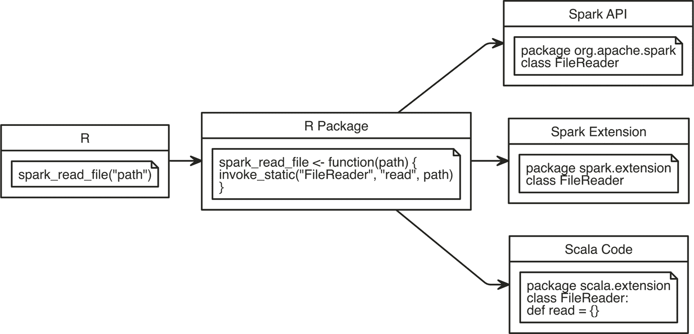
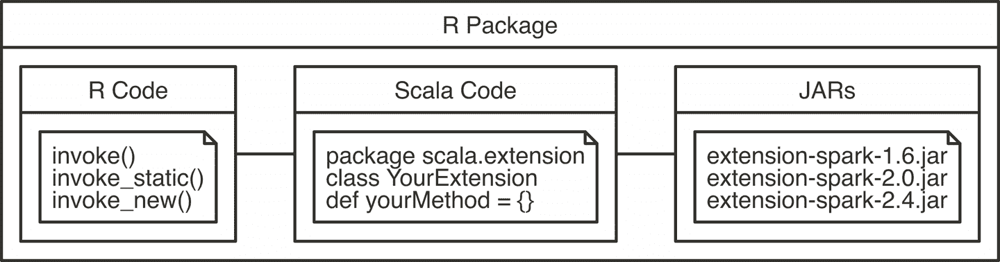
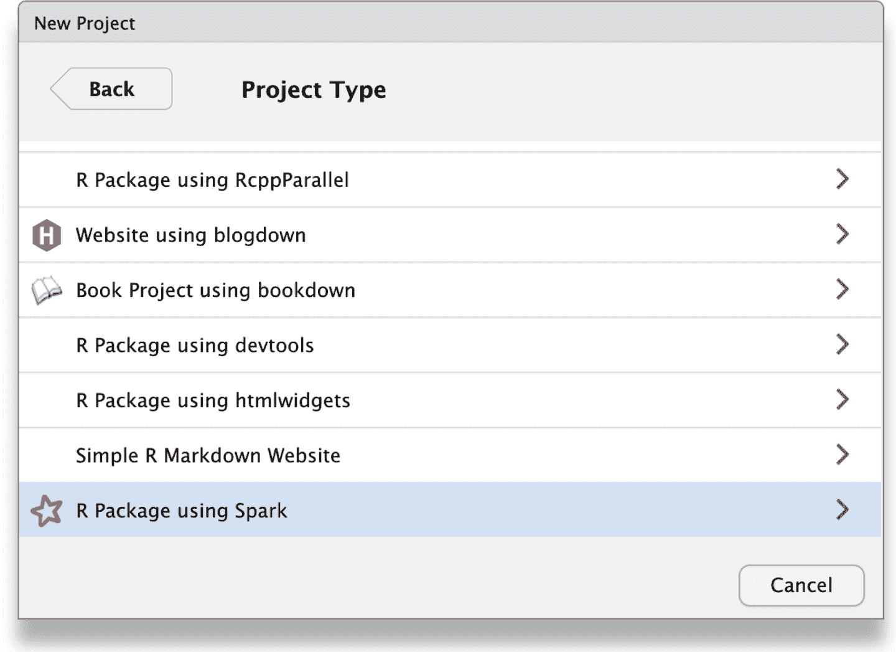

# 第十三章：贡献

> 留住门，留住门。
> 
> —霍德尔

在第十二章中，我们为您提供了使用 R 在 Spark 中处理大规模和实时数据的工具。在这最后一章中，我们不再专注于学习，而是更多地回馈给 Spark 和 R 社区，或者您职业生涯中的同事。要让这一切持续下去，真的需要整个社区的参与，所以我们期待您的加入！

有许多方式可以贡献，从帮助社区成员和开放 GitHub 问题到为您自己、同事或 R 和 Spark 社区提供新功能。然而，我们将在这里重点介绍编写和共享扩展 Spark 的代码，以帮助其他人使用您可以作为 Spark 扩展作者提供的新功能。具体来说，您将学习什么是扩展，可以构建哪些类型的扩展，可用的构建工具，以及从头开始构建扩展的时间和方式。

您还将学习如何利用 Spark 中的数百个扩展和 Java 中的数百万组件，这些组件可以轻松在 R 中使用。我们还将介绍如何在 Scala 中创建原生的利用 Spark 的代码。您可能知道，R 是一个很好的语言，可以与其他语言（如 C++、SQL、Python 等）进行接口操作。因此，与 R 一起使用 Scala 将遵循使 R 成为理想选择的类似实践，提供易于使用的接口，使数据处理高效且受到许多人喜爱。

# 概述

当您考虑回馈您更大的编码社区时，您可以询问关于您编写的任何代码的最重要的问题是：这段代码对其他人有用吗？

让我们从考虑本书中呈现的第一行最简单的代码之一开始。这段代码用于加载一个简单的 CSV 文件：

```
spark_read_csv(sc, "cars.csv")
```

这种基础的代码可能对其他人没有用处。然而，您可以将同样的例子调整为生成更多兴趣的内容，也许是以下内容：

```
spark_read_csv(sc, "/path/that/is/hard/to/remember/data.csv")
```

这段代码与第一个非常相似。但是，如果您与正在使用这个数据集的其他人一起工作，关于有用性的问题的答案将是肯定的——这很可能对其他人有用！

这很令人惊讶，因为这意味着并不是所有有用的代码都需要高级或复杂。但是，为了对其他人有用，它确实需要以易于消费的格式进行打包、呈现和分享。

首先尝试将其保存为*`teamdata.R`*文件，并编写一个包装它的函数：

```
load_team_data <- function() {
  spark_read_text(sc, "/path/that/is/hard/to/remember/data.csv")
}
```

这是一个进步，但它将要求用户一遍又一遍地手动共享这个文件。幸运的是，这个问题在 R 中很容易解决，通过*R 包*。

一个 R 包包含了 R 代码，可以通过函数 `install.packages()` 进行安装。一个例子是 `sparklyr`。还有许多其他的 R 包可用；你也可以创建自己的包。对于那些刚开始创建包的人，我们鼓励你阅读 Hadley Wickham 的书，[*R Packages*](http://shop.oreilly.com/product/0636920034421.do)（O’Reilly）。创建一个 R 包允许你通过在组织中分享包文件轻松地与其他人分享你的函数。

一旦创建了一个包，有许多方法可以与同事或全世界分享它。例如，对于要保密的包，考虑使用 [Drat](http://bit.ly/2N8J1f7) 或像 [RStudio Package Manager](http://bit.ly/2H5k807) 这样的产品。用于公共消费的 R 包可以在 [CRAN](https://cran.r-project.org/)（全面的 R 存档网络）中向 R 社区提供。

这些 R 包的存储库允许用户通过 `install.packages("teamdata")` 安装包，而不必担心从哪里下载包。它还允许其他包重用你的包。

除了使用像 `sparklyr`、`dplyr`、`broom` 等 R 包创建扩展 Spark 的新 R 包外，还可以使用 Spark API 或 Spark 扩展的所有功能，或编写自定义 Scala 代码。

例如，假设有一种类似 CSV 但不完全相同的新文件格式。我们可能想编写一个名为 `spark_read_file()` 的函数，该函数将获取到这种新文件类型的路径并在 Spark 中读取它。一种方法是使用 `dplyr` 处理每行文本或任何其他 R 库使用 `spark_apply()`。另一种方法是使用 Spark API 访问 Spark 提供的方法。第三种方法是检查 Spark 社区中是否已经提供了支持这种新文件格式的 Spark 扩展。最后但并非最不重要的是，你可以编写自定义的 Scala 代码，其中包括使用任何 Java 库，包括 Spark 及其扩展。这在 图 13-1 中显示。



###### 图 13-1\. 使用 Spark API 或 Spark 扩展，或编写 Scala 代码扩展 Spark

我们将首先专注于使用 Spark API 扩展 Spark，因为调用 Spark API 所需的技术在调用 Spark 扩展或自定义 Scala 代码时也是适用的。

# Spark API

在介绍 Spark API 之前，让我们考虑一个简单而又众所周知的问题。假设我们想要计算一个分布式且可能很大的文本文件中行数的问题，比如说，*`cars.csv`*，我们初始化如下：

```
library(sparklyr)
library(dplyr)
sc <- spark_connect(master = "local")

cars <- copy_to(sc, mtcars)
spark_write_csv(cars, "cars.csv")
```

现在，要计算此文件中有多少行，我们可以运行以下命令：

```
spark_read_text(sc, "cars.csv") %>% count()
```

```
# Source: spark<?> [?? x 1]
      n
  <dbl>
1    33
```

很简单：我们使用 `spark_read_text()` 读取整个文本文件，然后使用 `dplyr` 的 `count()` 来计算行数。现在，假设你既不能使用 `spark_read_text()`，也不能使用 `dplyr` 或任何其他 Spark 功能，你将如何要求 Spark 统计 *`cars.csv`* 中的行数？

如果您在 Scala 中这样做，您会发现在 Spark 文档中，通过使用 Spark API，可以像下面这样计算文件中的行数：

```
val textFile = spark.read.textFile("cars.csv")
textFile.count()
```

因此，要从 R 中使用类似 `spark.read.textFile` 的 Spark API 功能，可以使用 `invoke()`、`invoke_static()` 或 `invoke_new()`。 （正如它们的名称所示，第一个从对象中调用方法，第二个从静态对象中调用方法，第三个创建一个新对象。）然后，我们使用这些函数调用 Spark 的 API 并执行类似 Scala 中提供的代码：

```
spark_context(sc) %>%
  invoke("textFile", "cars.csv", 1L) %>%
  invoke("count")
```

```
[1] 33
```

虽然 `invoke()` 函数最初设计用于调用 Spark 代码，但也可以调用 Java 中的任何可用代码。例如，我们可以使用以下代码创建一个 Java 的 `BigInteger`：

```
invoke_new(sc, "java.math.BigInteger", "1000000000")
```

```
<jobj[225]>
  java.math.BigInteger
  1000000000
```

正如您所见，创建的对象不是 R 对象，而是一个真正的 Java 对象。在 R 中，这个 Java 对象由 `spark_jobj` 表示。这些对象可以与 `invoke()` 函数或 `spark_dataframe()` 和 `spark_connection()` 一起使用。`spark_dataframe()` 将 `spark_jobj` 转换为 Spark DataFrame（如果可能的话），而 `spark_connect()` 则检索原始的 Spark 连接对象，这对于避免在函数间传递 `sc` 对象很有用。

虽然在某些情况下调用 Spark API 可以很有用，但 Spark 中大部分功能已经在 `sparklyr` 中支持。因此，扩展 Spark 的一个更有趣的方法是使用其众多现有的扩展。

# Spark 扩展

在开始本节之前，请考虑导航至 [spark-packages.org](https://spark-packages.org/)，这是一个跟踪由 Spark 社区提供的 Spark 扩展的网站。使用前一节中介绍的相同技术，您可以从 R 中使用这些扩展。

例如，有 [Apache Solr](http://bit.ly/2MmBfim)，一个专为在大型数据集上执行全文搜索而设计的系统，目前 Apache Spark 并不原生支持。此外，在撰写本文时，还没有为 R 提供支持 Solr 的扩展。因此，让我们尝试使用 Spark 扩展来解决这个问题。

首先，如果您搜索“spark-packages.org”以找到 Solr 扩展，您应该能够找到 [`spark-solr`](http://bit.ly/2YQnwXw)。扩展的“如何”部分提到应加载 `com.lucidworks.spark:spark-solr:2.0.1`。我们可以在 R 中使用 `sparklyr.shell.packages` 配置选项来完成这个任务。

```
config <- spark_config()
config["sparklyr.shell.packages"] <- "com.lucidworks.spark:spark-solr:3.6.3"
config["sparklyr.shell.repositories"] <-
  "http://repo.spring.io/plugins-release/,http://central.maven.org/maven2/"

sc <- spark_connect(master = "local", config = config)
```

尽管通常指定 `sparklyr.shell.packages` 参数就足够了，但是对于这个特定的扩展，依赖项未能从 Spark 包仓库下载。你需要在 `sparklyr.shell.repositories` 参数下手动查找失败的依赖项，并添加更多的仓库。

###### 注意

当你使用扩展时，Spark 将连接到 Maven 包仓库以检索它。这可能需要很长时间，具体取决于扩展和你的下载速度。在这种情况下，考虑使用 `sparklyr.connect.timeout` 配置参数来允许 Spark 下载所需的文件。

根据 `spark-solr` 文档，你可以使用以下 Scala 代码：

```
val options = Map(
  "collection" -> "{solr_collection_name}",
  "zkhost" -> "{zk_connect_string}"
)

val df = spark.read.format("solr")
  .options(options)
  .load()
```

我们可以将其翻译为 R 代码：

```
spark_session(sc) %>%
  invoke("read") %>%
  invoke("format", "solr") %>%
  invoke("option", "collection", "<collection>") %>%
  invoke("option", "zkhost", "<host>") %>%
  invoke("load")
```

然而，这段代码将失败，因为它需要一个有效的 Solr 实例，并且配置 Solr 超出了本书的范围。但是这个例子揭示了你如何创建 Spark 扩展的见解。值得一提的是，你可以使用 `spark_read_source()` 从通用源中读取，而不必编写自定义的 `invoke()` 代码。

正如在 “概述” 中指出的那样，考虑使用 R 包与其他人共享代码。虽然你可以要求你的包的用户指定 `sparklyr.shell.packages`，但你可以通过在你的 R 包中注册依赖项来避免这样做。依赖项在 `spark_dependencies()` 函数下声明；因此，对于本节中的示例：

```
spark_dependencies <- function(spark_version, scala_version, ...) {
  spark_dependency(
    packages = "com.lucidworks.spark:spark-solr:3.6.3",
    repositories = c(
      "http://repo.spring.io/plugins-release/",
      "http://central.maven.org/maven2/")
  )
}

.onLoad <- function(libname, pkgname) {
  sparklyr::register_extension(pkgname)
}
```

当你的库加载时，`onLoad` 函数会被 R 自动调用。它应该调用 `register_extension()`，然后回调 `spark_dependencies()`，以允许你的扩展提供额外的依赖项。本例支持 Spark 2.4，但你还应该支持将 Spark 和 Scala 版本映射到正确的 Spark 扩展版本。

你可以使用约 450 个 Spark 扩展；此外，你还可以从 [Maven 仓库](http://bit.ly/2Mp0wrR) 使用任何 Java 库，Maven Central 包含超过 300 万个构件。虽然并非所有 Maven Central 的库都与 Spark 相关，但 Spark 扩展和 Maven 仓库的结合无疑会为你带来许多有趣的可能性！

但是，在没有 Spark 扩展可用的情况下，下一节将教你如何从你自己的 R 包中使用自定义的 Scala 代码。

# 使用 Scala 代码

在 Spark 中运行时，Scala 代码使你能够使用 Spark API、Spark 扩展或 Java 库中的任何方法。此外，在 Spark 中编写 Scala 代码可以提高性能，超过使用 `spark_apply()` 的 R 代码。通常情况下，你的 R 包结构将包含 R 代码和 Scala 代码；然而，Scala 代码需要编译为 JAR 文件（Java ARchive 文件）并包含在你的包中。图 13-2 展示了这种结构。



###### 图 13-2\. 使用 Scala 代码时的 R 包结构

如往常一样，R 代码应放在顶层的*R*文件夹下，Scala 代码放在*java*文件夹下，编译后的 JAR 包放在*inst/java*文件夹下。虽然您当然可以手动编译 Scala 代码，但可以使用辅助函数下载所需的编译器并编译 Scala 代码。

要编译 Scala 代码，您需要安装 Java 开发工具包 8（简称 JDK8）。从[Oracle 的 Java 下载页面](http://bit.ly/2P2UkYM)下载 JDK，这将需要您重新启动 R 会话。

您还需要[Scala 2.11 和 2.12 的 Scala 编译器](https://www.scala-lang.org/)。Scala 编译器可以使用`download_scalac()`自动下载和安装：

```
download_scalac()
```

接下来，您需要使用`compile_package_jars()`编译您的 Scala 源代码。默认情况下，它使用`spark_compilation_spec()`，该函数为以下 Spark 版本编译您的源代码：

```
## [1] "1.5.2" "1.6.0" "2.0.0" "2.3.0" "2.4.0"
```

您还可以通过使用`spark_compilation_spec()`创建自定义条目来自定义此规范。

虽然您可以从头开始创建 Scala 代码的项目结构，但也可以简单地调用*`spark_extension(path)`*来在指定路径创建一个扩展。该扩展将主要为空，但将包含适当的项目结构以调用 Scala 代码。

由于`spark_extension()`在 RStudio 中注册为自定义项目扩展，您还可以通过“文件”菜单中的新项目，选择“使用 Spark 的 R 包”，如图 13-3 所示。



###### 图 13-3\. 从 RStudio 创建 Scala 扩展包

一旦准备好编译您的包 JARs，您可以简单地运行以下命令：

```
compile_package_jars()
```

由于默认情况下 JAR 包编译到*inst/*包路径中，在构建 R 包时所有 JAR 包也将包含在内。这意味着您可以分享或发布您的 R 包，并且 R 用户可以完全使用它。对于大多数专业的 Scala 高级 Spark 用户来说，考虑为 R 用户和 R 社区编写 Scala 库，然后轻松将其打包成易于消费、使用和分享的 R 包，这是非常吸引人的。

如果您有兴趣开发带有 R 的 Spark 扩展，并且在开发过程中遇到困难，请考虑加入`sparklyr`的[Gitter 频道](http://bit.ly/33ESccY)，我们很乐意帮助这个美好的社区成长。期待您的加入！

# 小结

本章介绍了一组新工具，用于扩展 Spark 的功能，超越了当前 R 和 R 包的支持范围。这个庞大的新库空间包括超过 450 个 Spark 扩展和数百万个可以在 R 中使用的 Java 工件。除了这些资源，您还学习了如何使用 Scala 代码构建 Java 工件，这些工件可以轻松地从 R 中嵌入和编译。

这使我们回到了本书早期提出的目的；虽然我们知道您已经学会了如何在 R 中使用 Spark 执行大规模计算，但我们也确信您已经掌握了通过 Spark 扩展帮助其他社区成员所需的知识。我们迫不及待地想看到您的新创作，这些创作肯定会帮助扩展整个 Spark 和 R 社区。

最后，我们希望前几章为您介绍了 Spark 和 R 的简易入门。在此之后，我们提出了分析和建模作为使用 Spark 的基础，结合您已经熟悉和喜爱的 R 包。您进一步学习了如何在合适的 Spark 集群中执行大规模计算。本书的最后部分重点讨论了高级主题：使用扩展、分发 R 代码、处理实时数据，最后通过使用 R 和 Scala 代码使用 Spark 扩展来回馈社区。

我们努力呈现最佳内容。但是，如果您知道任何改进本书的方法，请在 [the-r-in-spark](http://bit.ly/2HdkIZQ) 存储库下开启 GitHub 问题，我们将在即将推出的修订版本中解决您的建议。希望您喜欢阅读本书，并且在写作过程中像我们一样学到了很多。我们希望本书值得您的时间——您作为读者是我们的荣幸。
