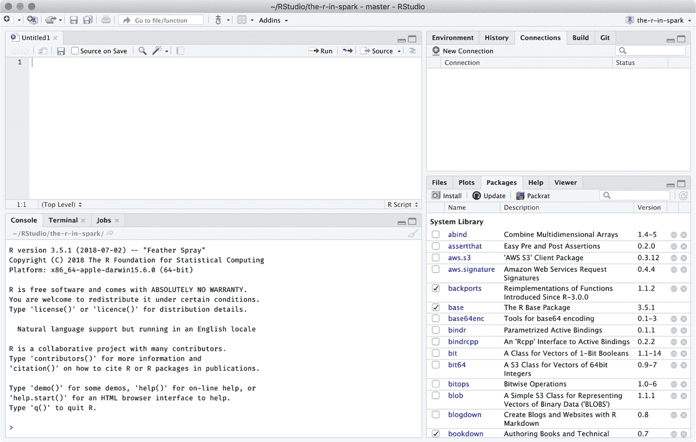

# 附录 A. 补充代码引用

本书中我们包含了对本附录的引用。这里我们包括了重要内容（并列出了可以找到这些材料的章节）。

# 前言

## 格式化

本书中用于格式化所有图形的`ggplot2`主题如下：

```
plot_style <- function() {
  font <- "Helvetica"

  ggplot2::theme_classic() +
  ggplot2::theme(
    plot.title = ggplot2::element_text(
      family = font, size=14, color = "#222222"),
    plot.subtitle = ggplot2::element_text(
      family=font, size=12, color = "#666666"),

    legend.position = "right",
    legend.background = ggplot2::element_blank(),
    legend.title = ggplot2::element_blank(),
    legend.key = ggplot2::element_blank(),
    legend.text = ggplot2::element_text(
      family=font, size=14, color="#222222"),

    axis.title.y = ggplot2::element_text(
      margin = ggplot2::margin(t = 0, r = 8, b = 0, l = 0),
      size = 14, color="#666666"),
    axis.title.x = ggplot2::element_text(
      margin = ggplot2::margin(t = -2, r = 0, b = 0, l = 0),
      size = 14, color = "#666666"),
    axis.text = ggplot2::element_text(
      family=font, size=14, color="#222222"),
    axis.text.x = ggplot2::element_text(
      margin = ggplot2::margin(5, b = 10)),
    axis.ticks = ggplot2::element_blank(),
    axis.line = ggplot2::element_blank(),

    panel.grid.minor = ggplot2::element_blank(),
    panel.grid.major.y = ggplot2::element_line(color = "#eeeeee"),
    panel.grid.major.x = ggplot2::element_line(color = "#ebebeb"),

    panel.background = ggplot2::element_blank(),

    strip.background = ggplot2::element_rect(fill = "white"),
    strip.text = ggplot2::element_text(size  = 20,  hjust = 0)
  )
}
```

您可以通过以下方式激活此功能：

```
ggplot2::theme_set(plot_style())
```

# 第一章

## 世界的信息存储能力

以下脚本用于生成图 1-1：

```
library(ggplot2)
library(dplyr)
library(tidyr)
read.csv("data/01-worlds-capacity-to-store-information.csv", skip = 8) %>%
  gather(key = storage, value = capacity, analog, digital) %>%
  mutate(year = X, terabytes = capacity / 1e+12) %>%
  ggplot(aes(x = year, y = terabytes, group = storage)) +
    geom_line(aes(linetype = storage)) +
    geom_point(aes(shape = storage)) +
    scale_y_log10(
      breaks = scales::trans_breaks("log10", function(x) 10^x),
      labels = scales::trans_format("log10", scales::math_format(10^x))
    ) +
    theme_light() +
    theme(legend.position = "bottom")
```

## CRAN 软件包的每日下载

图 1-6 是通过以下代码生成的：

```
downloads_csv <- "data/01-intro-r-cran-downloads.csv"
if (!file.exists(downloads_csv)) {
  downloads <- cranlogs::cran_downloads(from = "2014-01-01", to = "2019-01-01")
  readr::write_csv(downloads, downloads_csv)
}

cran_downloads <- readr::read_csv(downloads_csv)

ggplot(cran_downloads, aes(date, count)) +
  labs(title = "CRAN Packages",
       subtitle = "Total daily downloads over time") +
  geom_point(colour="black", pch = 21, size = 1) +
  scale_x_date() + xlab("year") + ylab("downloads") +
  scale_x_date(date_breaks = "1 year",
               labels = function(x) substring(x, 1, 4)) +
  scale_y_continuous(
      limits = c(0, 3.5 * 10⁶),
      breaks = c(0.5 * 10⁶, 10⁶, 1.5 * 10⁶, 2 * 10⁶, 2.5 * 10⁶, 3 * 10⁶,
      3.5 * 10⁶),
      labels = c("", "1M", "", "2M", "", "3M", "")
    )
```

# 第二章

## 先决条件

### 安装 R

下载[R 安装程序](https://r-project.org/)（参见图 A-1），并在 Windows、Mac 或 Linux 平台上启动它。


###### 图 A-1\. 统计计算的 R 项目

### 安装 Java

下载[Java 安装程序](https://java.com/download)（参见图 A-2），并在 Windows、Mac 或 Linux 平台上启动它。


###### 图 A-2\. Java 下载页面

从 Spark 2.1 开始，需要 Java 8；然而，Spark 的早期版本支持 Java 7。不过，我们建议安装 Java Runtime Engine 8（JRE 8）。

###### 注意

如果您是一个已经在使用 Java 开发工具包（JDK）的高级读者，请注意当前不支持 JDK 9+。因此，您需要通过卸载 JDK 9+或适当设置`JAVA_HOME`来降级到 JDK 8。

### 安装 RStudio

虽然安装 RStudio 不是与 R 一起使用 Spark 的严格要求，但它将使您更加高效，因此我们建议您安装它。下载[RStudio 安装程序](https://www.rstudio.com/download)（参见图 A-3），然后在 Windows、Mac 或 Linux 平台上启动它。


###### 图 A-3\. RStudio 下载页面

启动 RStudio 后，您可以使用其控制台面板执行本章提供的代码。

### 使用 RStudio

如果您对 RStudio 不熟悉（见图 A-4），您应该注意以下面板：

控制台

您可以使用独立的 R 控制台来执行本书中呈现的所有代码。

软件包

该面板允许您轻松安装`sparklyr`，检查其版本，浏览帮助内容等。

连接

该面板允许您连接到 Spark，管理您的活动连接并查看可用数据集。



###### 图 A-4\. RStudio 概述

# 第三章

## Hive 函数

| 名称 | 描述 |
| --- | --- |
| `size(Map<K.V>)` | 返回映射类型中的元素数量。 |
| `size(Array)` | 返回数组类型中的元素数量。 |
| `map_keys(Map<K.V>)` | 返回包含输入映射键的无序数组。 |
| `map_values(Map<K.V>)` | 返回包含输入映射值的无序数组。 |
| `array_contains(Array, value)` | 如果数组包含某个值，则返回`TRUE`。 |
| `sort_array(Array)` | 按照数组元素的自然顺序升序排序并返回数组。 |
| `binary(string or binary)` | 将参数转换为二进制。 |
| `cast(expr as a given type)` | 将表达式`expr`的结果转换为给定类型。 |
| `from_unixtime(bigint unixtime[, string format])` | 将 Unix 纪元（1970-01-01 00:00:00 UTC）的秒数转换为字符串。 |
| `unix_timestamp()` | 获取当前时间的 Unix 时间戳（秒）。 |
| `unix_timestamp(string date)` | 将格式为 yyyy-MM-dd HH:mm:ss 的时间字符串转换为 Unix 时间戳（秒）。 |
| `to_date(string timestamp)` | 返回时间戳字符串的日期部分。 |
| `year(string date)` | 返回日期的年份部分。 |
| `quarter(date/timestamp/string)` | 返回日期的季度。 |
| `month(string date)` | 返回日期或时间戳字符串的月份部分。 |
| `day(string date) dayofmonth(date)` | 返回日期或时间戳字符串的日部分。 |
| `hour(string date)` | 返回时间戳的小时数。 |
| `minute(string date)` | 返回时间戳的分钟数。 |
| `second(string date)` | 返回时间戳的秒数。 |
| `weekofyear(string date)` | 返回时间戳字符串的周数。 |
| `extract(field FROM source)` | 从源中检索诸如天数或小时的字段。源必须是可以转换为日期、时间戳、间隔或字符串的日期或时间戳。 |
| `datediff(string enddate, string startdate)` | 返回从`startdate`到`enddate`的天数。 |
| `date_add(date/timestamp/string startdate, tinyint/smallint/int days)` | 将一定天数添加到`startdate`。 |
| `date_sub(date/timestamp/string startdate, tinyint/smallint/int days)` | 从`startdate`减去一定天数。 |
| `from_utc_timestamp(\{any primitive type} ts, string timezone)` | 将 UTC 时间戳转换为指定时区的时间戳。 |
| `to_utc_timestamp(\{any primitive type} ts, string timezone)` | 将指定时区的时间戳转换为 UTC 时间戳。 |
| `current_date` | 返回当前日期。 |
| `current_timestamp` | 返回当前时间戳。 |
| `add_months(string start_date, int num_months, output_date_format)` | 返回`start_date`后`num_months`个月的日期。 |
| `last_day(string date)` | 返回日期所属月份的最后一天。 |
| `next_day(string start_date, string day_of_week)` | 返回晚于`start_date`且命名为`day_of_week`的第一个日期。 |
| `trunc(string date, string format)` | 返回按指定格式截断的日期。 |
| `months_between(date1, date2)` | 返回日期`date1`和`date2`之间的月数。 |
| `date_format(date/timestamp/string ts, string fmt)` | 将日期/时间戳/字符串`ts`转换为指定日期格式`fmt`的字符串值。 |
| `if(boolean testCondition, T valueTrue, T valueFalseOrNull)` | 当`testCondition`为真时返回`valueTrue`；否则返回`valueFalseOrNull`。 |
| `isnull( a )` | 如果`a`为 NULL 则返回`true`，否则返回`false`。 |
| `isnotnull( a )` | 如果`a`不为 NULL 则返回`true`，否则返回`false`。 |
| `nvl(T value, T default_value)` | 如果`value`为`NULL`，则返回默认值`default_value`；否则返回`value`。 |
| `COALESCE(T v1, T v2, …)` | 返回第一个不为 NULL 的`v`，如果所有的`v`都为 NULL 则返回 NULL。 |
| `CASE a WHEN b THEN c [WHEN d THEN e]* [ELSE f] END` | 当`a`等于`b`时返回`c`；当`a`等于`d`时返回`e`；否则返回`f`。 |
| `nullif( a, b )` | 如果`a`等于`b`，则返回`NULL`；否则返回`a`。 |
| `assert_true(boolean condition)` | 如果`condition`不为真则抛出异常；否则返回`NULL`。 |
| `ascii(string str)` | 返回字符串`str`的第一个字符的数值值。 |
| `base64(binary bin)` | 将参数从二进制转换为 base64 字符串。 |
| `character_length(string str)` | 返回字符串`str`中包含的 UTF-8 字符数。 |
| `chr(bigint double A)` |  |
| `concat(stringǀbinary A, stringǀbinary B…)` | 返回按顺序传递的参数连接而成的字符串或字节。例如，concat(`foo`, `bar`)结果为`foobar`。 |
| `context_ngrams(array<array>, array, int K, int pf)` | 返回从一组分词句子中提取的前 K 个上下文 N-gram。 |
| `concat_ws(string SEP, string A, string B…)` | 类似于`concat()`，但使用自定义分隔符`SEP`。 |
| `decode(binary bin, string charset)` | 使用提供的字符集（US-ASCII、ISO-8859-1、UTF-8、UTF-16BE、UTF-16LE 或 UTF-16）将第一个参数解码为字符串。如果任一参数为`NULL`，则结果也为`NULL`。 |
| `elt(N int,str1 string,str2 string,str3 string,…)` | 返回索引号上的字符串；`elt(2,hello,world)`返回`world`。 |
| `encode(string src, string charset)` | 使用提供的字符集（US-ASCII、ISO-8859-1、UTF-8、UTF-16BE、UTF-16LE 或 UTF-16）将第一个参数编码为 BINARY。 |
| `field(val T,val1 T,val2 T,val3 T,…)` | 返回`val`在`val1,val2,val3,…`列表中的索引，如果未找到则返回`0`。 |
| `find_in_set(string str, string strList)` | 返回`strList`中第一次出现的`str`，其中`strList`是逗号分隔的字符串。 |
| `format_number(number x, int d)` | 将数字`x`格式化为类似`'#,###,###.##'`的格式，四舍五入到`d`位小数，并将结果作为字符串返回。如果`d`为`0`，则结果没有小数点或小数部分。 |
| `get_json_object(string json_string, string path)` | 根据指定的 JSON 路径从 JSON 字符串`json_string`中提取 JSON 对象，并返回提取的 JSON 对象的 JSON 字符串。 |
| `in_file(string str, string filename)` | 如果字符串 `str` 作为文件 `filename` 中的整行出现，则返回 `true`。 |
| `instr(string str, string substr)` | 返回字符串 `str` 中第一次出现 `substr` 的位置。 |
| `length(string A)` | 返回字符串 `A` 的长度。 |
| `locate(string substr, string str[, int pos])` | 返回从位置 `pos` 开始，在字符串 `str` 中第一次出现 `substr` 的位置。 |
| `lower(string A) lcase(string A)` | 返回将字符串 `A` 中所有字符转换为小写的结果。 |
| `lpad(string str, int len, string pad)` | 返回左填充 `pad` 到长度 `len` 的字符串 `str`。如果 `str` 长度超过 `len`，则返回值被截短为 `len` 字符。 |
| `ltrim(string A)` | 返回修剪自字符串 `A` 开头（左侧）空格后的结果字符串。 |
| `ngrams(array<array>, int N, int K, int pf)` | 从一组标记化的句子（如 `sentences()` 返回的句子）中返回前 k 个 N 元组。 |
| `octet_length(string str)` | 返回用于存储字符串 `str` 的 UTF-8 编码所需的八位组数。 |
| `parse_url(string urlString, string partToExtract [, string keyToExtract])` | 返回 URL 中指定部分的内容。`partToExtract` 的有效值包括 `HOST`、`PATH`、`QUERY`、`REF`、`PROTOCOL`、`AUTHORITY`、`FILE` 和 `USERINFO`。 |
| `printf(String format, Obj… args)` | 根据 `printf` 样式的格式字符串返回格式化后的输入。 |
| `regexp_extract(string subject, string pattern, int index)` | 返回使用模式 `pattern` 提取的字符串。 |
| `regexp_replace(string INITIAL_STRING, string PATTERN, string REPLACEMENT)` | 返回用 `REPLACEMENT` 替换 `INITIAL_STRING` 中所有匹配 `PATTERN` 的子字符串的结果字符串。 |
| `repeat(string str, int n)` | 将字符串 `str` 重复 `n` 次。 |
| `replace(string A, string OLD, string NEW)` | 返回将字符串 `A` 中所有非重叠出现的 `OLD` 替换为 `NEW` 后的结果。 |
| `reverse(string A)` | 返回反转后的字符串。 |
| `rpad(string str, int len, string pad)` | 返回右填充 `pad` 到长度 `len` 的字符串 `str`。 |
| `rtrim(string A)` | 返回修剪自字符串 `A` 末尾（右侧）空格后的结果字符串。 |
| `sentences(string str, string lang, string locale)` | 将自然语言文本字符串分词成单词和句子，每个句子在适当的句子边界处断开，并作为单词数组返回。 |
| `space(int n)` | 返回包含 `n` 个空格的字符串。 |
| `split(string str, string pat)` | 使用正则表达式 `pat` 拆分字符串 `str`。 |
| `str_to_map(text[, delimiter1, delimiter2])` | 使用两个分隔符将文本拆分为键值对。`delimiter1` 用于分隔键值对，`delimiter2` 用于分隔每个键值对中的键和值。默认分隔符为 `,`（对于 `delimiter1`）和 `:`（对于 `delimiter2`）。 |
| `substr(string binary A, int start)` | 返回从 A 的 start 位置开始直到字符串 A 的末尾的子字符串或切片。 |
| `substring_index(string A, string delim, int count)` | 返回字符串 A 中第`count`个定界符`delim`之前的子字符串。 |
| `translate(stringǀcharǀvarchar input, stringǀcharǀvarchar from, stringǀcharǀvarchar to)` | 使用`from`字符串中的字符替换`to`字符串中的对应字符来翻译输入字符串。 |
| `trim(string A)` | 返回从 A 两端去除空格后的字符串。 |
| `unbase64(string str)` | 将 base64 字符串转换为二进制。 |
| `upper(string A) ucase(string A)` | 返回将 A 的所有字符转换为大写的字符串。例如，`upper(*fOoBaR*)` 结果为 FOOBAR。 |
| `initcap(string A)` | 返回字符串，每个单词的首字母大写，其他字母小写。单词由空格分隔。 |
| `levenshtein(string A, string B)` | 返回两个字符串之间的 Levenshtein 距离。 |
| `soundex(string A)` | 返回字符串的`soundex`编码。 |
| `mask(string str[, string upper[, string lower[, string number]]])` | 返回`str`的掩码版本。 |
| `mask_first_n(string str[, int n])` | 返回`str`的掩码版本，首个`n`个值掩码。`mask_first_n("1234-5678-8765-4321", 4)` 结果为 nnnn-5678-8765-4321。 |
| `mask_last_n(string str[, int n])` | 返回`str`的掩码版本，最后`n`个值掩码。 |
| `mask_show_first_n(string str[, int n])` | 返回`str`的掩码版本，显示前`n`个字符不掩码。 |
| `mask_show_last_n(string str[, int n])` | 返回`str`的掩码版本，显示最后`n`个字符不掩码。 |
| `mask_hash(stringǀcharǀvarchar str)` | 基于`str`返回一个哈希值。 |
| `java_method(class, method[, arg1[, arg2..]])` | 反射的同义词。 |
| `reflect(class, method[, arg1[, arg2..]])` | 使用反射调用 Java 方法，匹配参数签名。 |
| `hash(a1[, a2…])` | 返回参数的哈希值。 |
| `current_user()` | 从配置的认证管理器返回当前用户名。 |
| `logged_in_user()` | 从会话状态返回当前用户名。 |
| `current_database()` | 返回当前数据库名称。 |
| `md5(string/binary)` | 计算字符串或二进制的 MD5 128 位校验和。 |
| `sha1(string/binary) sha(string/binary)` | 计算字符串或二进制的 SHA-1 摘要，并以十六进制字符串返回其值。 |
| `crc32(string/binary)` | 计算字符串或二进制参数的循环冗余校验值，并返回 bigint 值。 |
| `sha2(string/binary, int)` | 计算 SHA-2 系列的哈希函数（SHA-224，SHA-256，SHA-384 和 SHA-512）。 |
| `aes_encrypt(input string/binary, key string/binary)` | 使用 AES 加密输入。 |
| `aes_decrypt(input binary, key string/binary)` | 使用 AES 解密输入。 |
| `version()` | 返回 Hive 的版本。 |
| `count(expr)` | 返回检索行的总数。 |
| `sum(col)`, `sum(DISTINCT col)` | 返回组中元素的总和或组中列的唯一值的总和。 |
| `avg(col)`, `avg(DISTINCT col)` | 返回组中元素的平均值或组中列唯一值的平均值。 |
| `min(col)` | 返回组中列的最小值。 |
| `max(col)` | 返回组中列的最大值。 |
| `variance(col), var_pop(col)` | 返回组中数值列的方差。 |
| `var_samp(col)` | 返回组中数值列的无偏样本方差。 |
| `stddev_pop(col)` | 返回组中数值列的标准差。 |
| `stddev_samp(col)` | 返回组中数值列的无偏样本标准差。 |
| `covar_pop(col1, col2)` | 返回组中一对数值列的总体协方差。 |
| `covar_samp(col1, col2)` | 返回组中一对数值列的样本协方差。 |
| `corr(col1, col2)` | 返回组中一对数值列的皮尔逊相关系数。 |
| `percentile(BIGINT col, p)` | 返回组中列的精确第 p 个百分位数（不适用于浮点类型）。`p`必须介于 0 和 1 之间。 |
| `percentile(BIGINT col, array(p1 [, p2]…))` | 返回组中列的精确百分位数 `p1`, `p2`, …。 `pi`必须介于 0 和 1 之间。 |
| `percentile_approx(DOUBLE col, p [, B])` | 返回组中数值列（包括浮点类型）的近似第 p 个百分位数。 `B`参数控制内存成本下的近似精度。较高的值提供更好的近似值，默认为 10,000。当`col`中的唯一值数小于`B`时，这提供精确的百分位数值。 |
| `percentile_approx(DOUBLE col, array(p1 [, p2]…) [, B])` | 与前一条相同，但接受并返回一个百分位值数组而不是单个值。 |
| `regr_avgx(independent, dependent)` | 等同于`avg(dependent)`。 |
| `regr_avgy(independent, dependent)` | 等同于`avg(independent)`。 |
| `regr_count(independent, dependent)` | 返回用于拟合线性回归线的非空对数。 |
| `regr_intercept(independent, dependent)` | 返回线性回归线的 y 截距，即方程 dependent = `a * independent + b`中的`b`值。 |
| `regr_r2(independent, dependent)` | 返回回归的决定系数。 |
| `regr_slope(independent, dependent)` | 返回线性回归线的斜率，即方程 dependent = `a * independent + b`中的`a`值。 |
| `regr_sxx(independent, dependent)` | 等同于 `regr_count(independent, dependent) * var_pop(dependent)`。 |
| `regr_sxy(independent, dependent)` | 等同于 `regr_count(independent, dependent) * covar_pop(independent, dependent)`。 |
| `regr_syy(independent, dependent)` | 等同于 `regr_count(independent, dependent) * var_pop(independent)`。 |
| `histogram_numeric(col, b)` | 使用 `b` 个非均匀间隔的箱体计算组中数值列的直方图。输出是一个大小为 `b` 的双值（x, y）坐标数组，表示箱体的中心和高度。 |
| `collect_set(col)` | 返回一个消除了重复元素的集合。 |
| `collect_list(col)` | 返回一个包含重复对象的列表。 |
| `ntile(INTEGER x)` | 将有序分区分为 `x` 组称为*桶*，并为分区中的每行分配一个桶号。这允许轻松计算四分位数、四分位数、十分位数、百分位数和其他常见汇总统计信息。 |
| `explode(ARRAY a)` | 将数组展开为多行。返回一个包含单列（`col`）的行集，数组中的每个元素对应一行。 |
| `explode(MAP<Tkey,Tvalue> m)` | 将映射展开为多行。返回一个包含两列（`key`，`value`）的行集，输入映射中的每对键值对对应一行。 |
| `posexplode(ARRAY a)` | 将数组展开为多行，并附加一个 `int` 类型的位置列（原始数组中项的位置，从 0 开始）。返回一个包含两列（`pos`，`val`）的行集，数组中的每个元素对应一行。 |
| `inline(ARRAY<STRUCT<f1:T1,…,fn:Tn>> a)` | 将结构数组展开为多行。返回一个包含 `N` 列（`N` = 结构中顶级元素的数量）的行集，每个结构对应一行。 |
| `stack(int r,T1 V1,…,Tn/r Vn)` | 将 `n` 个值 `V1`,…,`Vn` 分成 `r` 行。每行将有 `n/r` 列。 `r` 必须是常量。 |
| `json_tuple(string jsonStr,string k1,…,string kn)` | 接受 JSON 字符串和 `n` 个键，返回一个包含 `n` 个值的元组。 |
| `parse_url_tuple(string urlStr,string p1,…,string pn)` | 接受 URL 字符串和 `n` 个 URL 部分，返回一个包含 `n` 个值的元组。 |

# 第四章

## MLlib 函数

下表展示了 `sparklyr` 支持的机器学习算法：

### 分类

| Algorithm | Function |
| --- | --- |
| Decision trees | `ml_decision_tree_classifier()` |
| Gradient-boosted trees | `ml_gbt_classifier()` |
| Linear support vector machines | `ml_linear_svc()` |
| Logistic regression | `ml_logistic_regression()` |
| Multilayer perceptron | `ml_multilayer_perceptron_classifier()` |
| Naive-Bayes | `ml_naive_bayes()` |
| One vs rest | `ml_one_vs_rest()` |
| Random forests | `ml_random_forest_classifier()` |

### 回归

| Algorithm | Function |
| --- | --- |
| Accelerated failure time survival regression | `ml_aft_survival_regression()` |
| Decision trees | `ml_decision_tree_regressor()` |
| 广义线性回归 | `ml_generalized_linear_regression()` |
| 梯度提升树 | `ml_gbt_regressor()` |
| 保序回归 | `ml_isotonic_regression()` |
| 线性回归 | `ml_linear_regression()` |

### 聚类

| 算法 | 函数 |
| --- | --- |
| 二分*k*-均值聚类 | `ml_bisecting_kmeans()` |
| 高斯混合聚类 | `ml_gaussian_mixture()` |
| *k*-均值聚类 | `ml_kmeans()` |
| 潜在狄利克雷分配 | `ml_lda()` |

### 推荐

| 算法 | 函数 |
| --- | --- |
| 交替最小二乘因子分解 | `ml_als()` |

### 频繁模式挖掘

| 算法 | 函数 |
| --- | --- |
| FP 增长 | `ml_fpgrowth()` |

### 特征转换器

| 转换器 | 函数 |
| --- | --- |
| 二值化 | `ft_binarizer()` |
| 桶分割 | `ft_bucketizer()` |
| 卡方特征选择器 | `ft_chisq_selector()` |
| 文档集合中的词汇表 | `ft_count_vectorizer()` |
| 离散余弦变换 | `ft_discrete_cosine_transform()` |
| 使用`dplyr`进行转换 | `ft_dplyr_transformer()` |
| 哈达玛积 | `ft_elementwise_product()` |
| 特征哈希 | `ft_feature_hasher()` |
| 使用哈希术语频率 | `export(ft_hashing_tf)` |
| 逆文档频率 | `ft_idf()` |
| 补全缺失值 | `export(ft_imputer)` |
| 索引到字符串 | `ft_index_to_string()` |
| 特征交互转换 | `ft_interaction()` |
| 缩放到[-1, 1]范围 | `ft_max_abs_scaler()` |
| 缩放到[min, max]范围 | `ft_min_max_scaler()` |
| 局部敏感哈希 | `ft_minhash_lsh()` |
| 转换为 n-gram | `ft_ngram()` |
| 使用给定 P-范数进行归一化 | `ft_normalizer()` |
| 独热编码 | `ft_one_hot_encoder()` |
| 多项式空间中的特征扩展 | `ft_polynomial_expansion()` |
| 映射到分箱分类特征 | `ft_quantile_discretizer()` |
| SQL 转换 | `ft_sql_transformer()` |
| 使用修正的标准化特征 | `ft_standard_scaler()` |
| 过滤停用词 | `ft_stop_words_remover()` |
| 映射到标签索引 | `ft_string_indexer()` |
| 按空格切分 | `ft_tokenizer()` |
| 合并向量为行向量 | `ft_vector_assembler()` |
| 索引分类特征 | `ft_vector_indexer()` |
| 原始特征的子数组 | `ft_vector_slicer()` |
| 将单词转换为代码 | `ft_word2vec()` |

# 第六章

## Google 趋势关于 On-Premises（主机）、云计算和 Kubernetes 的数据

创建图 6-1 的数据可以从[*https://bit.ly/2YnHkNI*](https://bit.ly/2YnHkNI)下载。

```
library(dplyr)

read.csv("data/clusters-trends.csv", skip = 2) %>%
  mutate(year = as.Date(paste(Month, "-01", sep = ""))) %>%
    mutate(`On-Premise` = `mainframe...Worldwide.`,
           Cloud = `cloud.computing...Worldwide.`,
           Kubernetes = `kubernetes...Worldwide.`) %>%
    tidyr::gather(`On-Premise`, Cloud, Kubernetes,
                  key = "trend", value = "popularity") %>%
    ggplot(aes(x=year, y=popularity, group=trend)) +
      geom_line(aes(linetype = trend, color = trend)) +
      scale_x_date(date_breaks = "2 year", date_labels = "%Y") +
      labs(title = "Cluster Computing Trends",
           subtitle = paste("Search popularity for on-premise (mainframe)",
                            "cloud computing and kubernetes ")) +
      scale_color_grey(start = 0.6, end = 0.2) +
      geom_hline(yintercept = 0, size = 1, colour = "#333333") +
      theme(axis.title.x = element_blank())
```

# 第十二章

## 流生成器

第十二章介绍的`stream_generate_test()`函数在第十二章中创建了一个本地测试流。此功能独立于 Spark 连接运行。下面的示例将在*source*子文件夹中每个文件的创建时间间隔为 1 秒：

```
library(sparklyr)

stream_generate_test(iterations = 5, path = "source", interval = 1)
```

函数完成后，所有文件应显示在*源*文件夹中。请注意，文件大小不同：这样可以模拟真实流的行为：

```
file.info(file.path("source", list.files("source")))[1]
```

```
##                     size
## source/stream_1.csv   44
## source/stream_2.csv  121
## source/stream_3.csv  540
## source/stream_4.csv 2370
## source/stream_5.csv 7236
```

`stream_generate_test()` 默认创建一个单一的数值变量 DataFrame。

```
readr::read_csv("source/stream_5.csv")
```

```
## # A tibble: 1,489 x 1
##        x
##    <dbl>
##  1   630
##  2   631
##  3   632
##  4   633
##  5   634
##  6   635
##  7   636
##  8   637
##  9   638
## 10   639
## # ... with 1,479 more rows
```

## 安装 Kafka

这些说明是使用来自[官方 Kafka 网站](https://kafka.apache.org/quickstart)当前快速入门页面的信息编制的。（此书出版后不久，将会有更新版本的 Kafka 可用。）这里的想法是在“Kafka”示例中“时间戳”使用的版本：

1.  下载 Kafka。

    ```
    wget http://apache.claz.org/kafka/2.2.0/kafka_2.12-2.2.0.tgz
    ```

1.  展开*tar*文件并进入新文件夹。

    ```
    tar -xzf kafka_2.12-2.2.0.tgz
    cd kafka_2.12-2.2.0
    ```

1.  启动随 Kafka 一起提供的 Zookeeper 服务。

    ```
    bin/zookeeper-server-start.sh config/zookeeper.properties
    ```

1.  启动 Kafka 服务。

    ```
    bin/kafka-server-start.sh config/server.properties
    ```

确保始终先启动 Zookeeper，然后再启动 Kafka。
