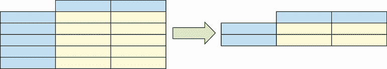
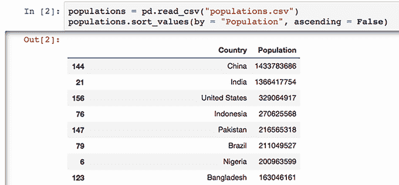

# 1. 介绍 pandas

本章涵盖

+   21 世纪数据科学的发展

+   数据分析库 pandas 的历史

+   pandas 及其竞争对手的优缺点

+   使用 Excel 进行数据分析与使用编程语言进行数据分析的比较

+   通过一个工作示例浏览库的功能

欢迎来到《Pandas 实战》！Pandas 是一个基于 Python 编程语言构建的数据分析库。一个 *库*（也称为 *包*）是用于解决特定领域问题的代码集合。Pandas 是数据操作工具箱：排序、过滤、清理、去重、聚合、转置等等。Python 广大数据科学生态系统的中心，pandas 与其他用于统计、自然语言处理、机器学习、数据可视化等方面的库配合良好。

在本章的引言部分，我们将探讨现代数据分析工具的历史和演变。我们将看到 pandas 如何从一个金融分析师的宠物项目成长为被 Stripe、Google 和 J.P. Morgan 等公司采用的行业标准。我们将将该库与其竞争对手进行比较，包括 Excel 和 R。我们将讨论使用编程语言与使用图形电子表格应用程序之间的区别。最后，我们将使用 pandas 分析一个真实世界的数据集。请将本章视为对你在整本书中将要掌握的概念的预览。让我们开始吧！

## 1.1 21 世纪的数据

“在没有数据之前就进行理论化是一个严重的错误，”夏洛克·福尔摩斯在阿瑟·柯南·道尔的经典短篇小说《波希米亚丑闻》中向他的助手约翰·华生建议。“不知不觉中，人们开始扭曲事实以适应理论，而不是让理论适应事实。”

在道尔作品发表一个多世纪之后，这位明智的侦探的话语依然真实，在一个数据在我们生活的各个方面变得越来越普遍的世界里。“世界上最宝贵的资源不再是石油，而是数据，”2017 年，《经济学人》在一篇评论文章中宣称。数据是 *证据*，证据对于企业、政府、机构和个人解决我们互联世界中日益复杂的问题至关重要。在众多行业中，从 Facebook 到 Amazon 到 Netflix，世界上最成功的企业都将数据视为其组合中最宝贵的资产。联合国秘书长安东尼奥·古特雷斯将准确的数据称为“良好政策和决策的生命线。”数据推动着从电影推荐到医疗治疗，从供应链物流到减贫倡议的一切。21 世纪社区、公司和甚至国家成功将取决于他们获取、汇总和分析数据的能力。

## 1.2 介绍 pandas

过去十年中，用于处理数据的技术生态系统已经大幅增长。如今，开源的 pandas 库是数据分析和操作中最受欢迎的解决方案之一。“开源”意味着库的源代码是公开可下载、使用、修改和分发的。其许可证赋予用户比 Excel 等专有软件更多的权限。Pandas 是免费使用的。一个全球志愿者软件开发团队维护这个库，你可以在 GitHub 上找到其完整的源代码（[`github.com/pandas-dev/pandas`](https://github.com/pandas-dev/pandas)）。

Pandas 可以与微软的 Excel 电子表格软件和谷歌的浏览器内 Sheets 应用程序相媲美。在这三种技术中，用户与由行和列组成的数据表进行交互。一行代表一条记录，或者等价地，一列值的集合。通过应用转换，将数据转换为所需的状态。 

图 1.1 展示了数据集的一个示例转换。分析师对左侧的四行数据集应用操作，得到右侧的两行数据集。他们可以选择符合标准的行，例如，或者从原始数据集中删除重复的行。



图 1.1 表格数据集的示例转换

使 pandas 独特的是它在处理能力和用户生产力之间取得的平衡。通过依赖 C 等底层语言进行许多计算，该库可以高效地将百万行数据集在毫秒内转换。同时，它保持了一套简单直观的命令。在 pandas 中，用少量代码就能完成很多事情。

图 1.2 展示了导入和排序 CSV 数据集的 pandas 代码示例。现在不用担心代码，但请花点时间注意，整个操作只需要两行代码。



图 1.2 pandas 导入和排序数据集的代码示例

Pandas 可以无缝地与数字、文本、日期、时间、缺失数据等协同工作。随着我们继续研究本书附带超过 30 个数据集，我们将探索其令人难以置信的通用性。

Pandas 的第一个版本是由软件工程师 Wes McKinney 在 2008 年开发的，当时他在纽约的 AQR Capital Management 投资公司工作。对 Excel 和统计编程语言 R 都不满意，McKinney 寻找一种工具，可以轻松解决金融行业中的常见数据问题，特别是清理和聚合。由于找不到理想的产品，他决定自己开发一个。当时，Python 还远未成为今天的强大语言，但语言的美丽启发了 McKinney 在其基础上构建他的库。“我喜欢 [Python] 因为它的表达式经济，”他在石英杂志([`mng.bz/w0Na`](http://mng.bz/w0Na))中说道。“你可以在 Python 中用很少的代码表达复杂的思想，而且它非常容易阅读。”

Pandas 自 2009 年 12 月向公众发布以来，持续且广泛地增长。用户数量估计在五百万到一千万之间¹。截至 2021 年 6 月，pandas 已从 PyPi（Python 包的集中在线仓库）下载超过七亿五千万次([`pepy.tech/project/pandas`](https://pepy.tech/project/pandas))。其 GitHub 代码仓库拥有超过 30,000 个星标（星标相当于平台上的“点赞”）。Pandas 的问题在问答聚合器 Stack Overflow 上的比例不断增长，这表明用户兴趣的增加。

我认为我们甚至可以将 Python 本身的快速增长归功于 Pandas。由于其在数据科学领域的广泛应用，Python 的流行度急剧上升，而 Pandas 对此做出了巨大贡献。Python 现在是大学和学院中最常见的第一编程语言。TIOBE 指数，根据搜索引擎流量对编程语言流行度进行排名，宣布 Python 是 2018 年增长最快的语言²。“如果 Python 能保持这种速度，它可能在 3 到 4 年内取代 C 和 Java，从而成为世界上最流行的编程语言，”TIOBE 在一份新闻稿中写道。随着你学习 Pandas，你也会学习 Python，这是库的另一个优点。

### 1.2.1 Pandas 与图形电子表格应用比较

Pandas 需要不同于 Excel 这样的图形电子表格应用的不同思维方式。编程本质上是比视觉更口语化的。我们通过命令与计算机交流，而不是点击。由于它对你的目标假设较少，编程语言往往更不宽容。它需要被明确告知要做什么，不能有不确定性。我们需要以正确的顺序提供正确的输入和正确的指令；否则，程序将无法运行。

由于这些更严格的要求，pandas 的学习曲线比 Excel 或 Sheets 更陡峭。但如果你在 Python 或编程方面经验有限，无需担心！当你忙于 Excel 中的 `SUMIF` 和 `VLOOKUP` 函数时，你已经在像程序员一样思考了。过程是一样的：确定正确的函数并按正确的顺序提供正确的输入。Pandas 需要相同的一套技能；区别在于我们正在用更冗长的语言与计算机进行交流。

当你熟悉其复杂性时，Pandas 会赋予你在数据处理方面更大的权力和灵活性。除了扩展你可用程序的范围外，编程还允许你自动化它们。你可以编写一段代码，然后在整个多个文件中重复使用——这对于那些讨厌的日常和周报来说非常完美。需要注意的是，Excel 随附 Visual Basic for Applications (VBA) 编程语言，它也能让你自动化电子表格程序。然而，我认为 Python 比 VBA 更容易上手，并且用途不仅限于数据分析，这使得它是你时间的更好投资。

从 Excel 跳转到 Python 还有其他好处。与 pandas 经常搭配使用的 Jupyter Notebook 编码环境允许创建更动态、交互性和全面的报告。Jupyter Notebook 由单元格组成，每个单元格都包含一段可执行的代码。分析师可以将这些单元格与标题、图表、描述、注释、图片、视频、图表等集成。读者可以跟随分析师的逐步逻辑，了解他们是如何得出结论的，而不仅仅是他们的最终结果。

Pandas 的另一个优点是 Python 的庞大数据科学生态系统。Pandas 可以轻松与用于统计、自然语言处理、机器学习、网络爬取、数据可视化等方面的库集成。每年都会出现新的库。实验受到欢迎。创新是持续的。这些强大的工具在缺乏大型、全球贡献者社区支持的竞争对手中有时没有得到充分开发。

当数据集增长时，图形电子表格应用也开始遇到困难；在这一点上，Pandas 比 Excel 强大得多。库的容量仅受计算机内存和处理能力的限制。在大多数现代机器上，当开发者知道如何利用所有性能优化时，pandas 可以很好地处理具有数百万行和数吉字节数据集。在描述库限制的一篇博客文章中，创建者 Wes McKinney 写道：“如今，我对于 pandas 的经验法则是，你应该有比你的数据集大 5 到 10 倍的 RAM” ([`mng.bz/qeK6`](http://mng.bz/qeK6))。

选择最适合工作的最佳工具的一部分挑战在于定义数据分析和大数据等术语对你所在的组织和项目意味着什么。全球大约有 7.5 亿个工作专业人士使用 Excel，其电子表格限制在 1,048,576 行数据³。对于一些分析师来说，100 万行数据已经超过了任何报告的需求；而对于其他人来说，100 万行数据只是触及了表面。

我建议您将 pandas 视为不是最佳的数据分析解决方案，而是一个与其他现代技术一起使用的强大选项。Excel 仍然是快速、轻松进行数据操作的一个优秀选择。电子表格应用程序通常会假设你的意图，这就是为什么只需点击几下就可以导入 CSV 文件或排序 100 个值的列。对于这些简单任务，使用 pandas 并没有真正的优势（尽管它完全能够完成这些任务）。但是，当你需要清理两个各包含一千万行数据的文本值，删除它们的重复记录，将它们合并，并为 100 批次的文件复制这种逻辑时，你会使用什么？在这些情况下，使用 Python 和 pandas 来完成工作既容易又节省时间。

### 1.2.2 Pandas 与其竞争对手

数据科学爱好者经常将 pandas 与开源编程语言 R 和专有软件套件 SAS 进行比较。每种解决方案都有自己的支持者社区。

R 是一种以统计学为基础的专用语言，而 Python 则是一种在多个技术领域被广泛使用的通用语言。不出所料，这两种语言往往吸引着特定领域内的专家用户。Hadley Wickham，R 社区的一位杰出开发者，他构建了一个名为 tidyverse 的数据科学包集合，建议用户将这两种语言视为合作伙伴而非竞争对手。“这些事物独立存在，并以不同的方式都很出色，”他在《石英》杂志（[`mng.bz/Jv9V`](http://mng.bz/Jv9V)）中说。“我观察到的一个模式是，公司的数据科学团队使用 R，而数据工程团队使用 Python。Python 人员通常拥有软件工程背景，并且对自己的编程技能非常自信……[R 用户] 真的喜欢 R，但无法与工程团队争论，因为他们没有语言来支持这种争论。”一种语言可能具有另一种语言所不具备的高级功能，但在数据分析的常见任务方面，两者已经达到了近乎对等的状态。开发者和数据科学家只是简单地倾向于使用他们最擅长的工具。

一套支持统计学、数据挖掘、计量经济学等互补的软件工具，SAS 是由北卡罗来纳州立大学的 SAS Institute 开发的商业产品。它根据所选软件包的不同收取年度用户订阅费。由企业支持的产品带来的优势包括工具之间的技术和视觉一致性、强大的文档，以及面向企业客户需求的产品路线图。像 pandas 这样的开源技术则采用更自由的方法；开发者根据自身和其他开发者的需求进行工作，有时会错过市场趋势。

某些技术与 pandas 具有相似的功能，但本质上服务于不同的目的。SQL 是一个例子。*SQL*（结构化查询语言）是一种与关系数据库通信的语言。*关系数据库*由通过公共键链接的数据表组成。我们可以使用 SQL 进行基本的数据操作，例如从表中提取列和根据标准过滤行，但其功能范围更广，并且本质上围绕数据管理展开。数据库是为了 *存储* 数据而构建的；数据分析是次要的使用案例。SQL 可以创建新表，用新值更新现有记录，删除现有记录等。相比之下，pandas 完全是为了数据分析而构建的：统计计算、数据处理、数据合并等。在典型的工作环境中，这两个工具通常作为互补使用。分析师可能会使用 SQL 提取初始数据集，然后使用 pandas 对其进行操作。

总结来说，pandas 不是市场上唯一的工具，但它是一个强大、流行且宝贵的解决方案，用于解决大多数数据分析问题。再次强调，Python 在其简洁和高效方面真正闪耀。正如其创造者 Guido van Rossum 所言，“编写 Python 的乐趣在于看到简洁、紧凑、易读的 [数据结构]，这些结构在少量清晰的代码中表达了大量的操作” ([`mng.bz/7jo7`](http://mng.bz/7jo7))。Pandas 符合这一标准，并且是那些渴望通过强大的现代数据分析工具包提升编程技能的电子表格分析师的绝佳下一步。

## 1.3 pandas 概览

要真正掌握 pandas 的强大功能，最好的方式是看到它在实际中的应用。让我们快速浏览这个库，通过分析史上票房最高的 700 部电影的数据集来进行。我希望你会对 pandas 的语法如何直观感到惊喜，即使你是编程新手。

在阅读本章的其余部分时，请尽量不要过度分析代码示例；你甚至不需要复制它们。我们现在的目标是获得 pandas 特性和功能的鸟瞰图。想想这个库能做什么；我们将在稍后更详细地关注如何实现。

我们将在本书中使用的 Jupyter Notebook 开发环境中编写代码。如果您需要在您的计算机上设置 pandas 和 Jupyter Notebook，请参阅附录 A。您可以在 [`www.github.com/paskhaver/pandas-in-action`](https://www.github.com/paskhaver/pandas-in-action) 下载所有数据集和完成后的 Jupyter Notebook。

### 1.3.1 导入数据集

让我们开始吧！首先，我们将在与 movies.csv 文件相同的目录内创建一个新的 Jupyter Notebook；然后我们将导入 pandas 库以访问其功能：

```
In  [1] import pandas as pd
```

代码左侧的框（在先前的示例中显示数字 1）标记了单元格相对于 Jupyter Notebook 的启动或重启的执行顺序。您可以按任何顺序执行单元格，并且可以多次执行相同的单元格。

阅读本书时，鼓励你在 Jupyter 单元中执行不同的代码片段进行实验。因此，如果你的执行次数与文本中的不一致是完全可以接受的。

我们的数据存储在一个单独的 movies.csv 文件中。CSV（逗号分隔值）文件是一种纯文本文件，它使用换行符分隔每一行数据，使用逗号分隔每一行值。文件的第一行包含数据的列标题。以下是 movies.csv 文件前三行的预览：

```
Rank,Title,Studio,Gross,Year
1,Avengers: Endgame,Buena Vista,"$2,796.30",2019
2,Avatar,Fox,"$2,789.70",2009
```

第一行列出了数据集中的五个列：排名、标题、工作室、总收入和年份。第二行包含第一条记录，或者说第一条电影的记录。这部电影排名为 1，标题为 `"复仇者联盟：终局之战"`，工作室为 `"Buena Vista"`，总收入为 `"$2,796.30"`，年份为 `2019`。下一行包含下一部电影的值，数据集中的剩余 750 多行按此模式重复。

Pandas 可以导入各种文件类型，每种类型在库的顶层都有一个相关的导入函数。在 Pandas 中，*函数*相当于 Excel 中的函数。它是一个我们发出的命令，无论是针对库还是库中的实体。在这种情况下，我们将使用 `read_csv` 函数来导入 movies.csv 文件：

```
In  [2] pd.read_csv("movies.csv")

Out [2]

 **Rank                         Title            Studio      Gross   Year**
  0     1             Avengers: Endgame       Buena Vista  $2,796.30   2019
  1     2                        Avatar               Fox  $2,789.70   2009
  2     3                       Titanic         Paramount  $2,187.50   1997
  3     4  Star Wars: The Force Awakens       Buena Vista  $2,068.20   2015
  4     5        Avengers: Infinity War       Buena Vista  $2,048.40   2018
 ...   ...                      ...                 ...        ...      ...
777   778                     Yogi Bear   Warner Brothers    $201.60   2010
778   779           Garfield: The Movie               Fox    $200.80   2004
779   780                   Cats & Dogs   Warner Brothers    $200.70   2001
780   781      The Hunt for Red October         Paramount    $200.50   1990
781   782                      Valkyrie               MGM    $200.30   2008

782 rows × 5 columns
```

Pandas 将 CSV 文件的全部内容导入一个名为 `DataFrame` 的对象中。将对象视为存储数据的容器。不同的对象针对不同类型的数据进行了优化，并且我们以不同的方式与它们交互。Pandas 使用一种类型的对象（`DataFrame`）来存储多列数据集，另一种类型的对象（`Series`）来存储单列数据集。`DataFrame` 可以与 Excel 中的多列表格相媲美。

为了避免屏幕混乱，pandas 只显示 `DataFrame` 的前五行和后五行。一行省略号（...）标记了数据缺失的位置。

这个`DataFrame`由五个列（排名、标题、工作室、总收入、年份）和一个索引组成。索引是`DataFrame`左侧上升数字的范围。索引标签作为数据行标识符。我们可以将任何列设置为`DataFrame`的索引。当我们没有明确告诉 pandas 使用哪一列时，库会生成从 0 开始的数字索引。

哪一列是作为索引的好候选？它是指可以充当每行主标识符或参考点的值。在我们的五列中，排名和标题是两个最佳选项。让我们将自动生成的数字索引与标题列的值交换。我们可以在 CSV 导入期间直接这样做：

```
In  [3] pd.read_csv("movies.csv", index_col = "Title")

Out [3]

                              Rank            Studio       Gross   Year
**Title** 
           Avengers: Endgame     1       Buena Vista   $2,796.30   2019
                      Avatar     2               Fox   $2,789.70   2009
                     Titanic     3         Paramount   $2,187.50   1997
Star Wars: The Force Awakens     4       Buena Vista   $2,068.20   2015
      Avengers: Infinity War     5       Buena Vista   $2,048.40   2018
                         ...   ...               ...        ...     ...
                   Yogi Bear   778   Warner Brothers     $201.60   2010
         Garfield: The Movie   779               Fox     $200.80   2004
                 Cats & Dogs   780   Warner Brothers     $200.70   2001
    The Hunt for Red October   781         Paramount     $200.50   1990
                    Valkyrie   782               MGM     $200.30   2008

782 rows × 4 columns
```

接下来，我们将`DataFrame`分配给一个名为`movies`的变量，这样我们就可以在程序的其它地方引用它。*变量*是程序中对象的用户分配的名称：

```
In  [4] movies = pd.read_csv("movies.csv", index_col = "Title")
```

更多关于变量的信息，请参阅附录 B。

### 1.3.2 操作 DataFrame

我们可以从`DataFrame`的多个角度来观察。我们可以从开头提取几行：

```
In  [5] movies.head(4)

Out [5]

                              Rank        Studio      Gross   Year
**Title** 
Avengers: Endgame                1   Buena Vista  $2,796.30   2019
Avatar                           2           Fox  $2,789.70   2009
Titanic                          3     Paramount  $2,187.50   1997
Star Wars: The Force Awakens     4   Buena Vista  $2,068.20   2015
```

或者我们可以查看数据集的末尾：

```
In  [6] movies.tail(6)

Out [6]

                          Rank           Studio     Gross   Year
**Title** 
21 Jump Street             777             Sony   $201.60   2012
Yogi Bear                  778  Warner Brothers   $201.60   2010
Garfield: The Movie        779              Fox   $200.80   2004
Cats & Dogs                780  Warner Brothers   $200.70   2001
The Hunt for Red October   781        Paramount   $200.50   1990
Valkyrie                   782              MGM   $200.30   2008
```

我们可以找出`DataFrame`有多少行：

```
In  [7] len(movies)

Out [7] 782
```

我们可以询问`DataFrame`中的行数和列数。这个数据集有 782 行和 4 列：

```
In  [8] movies.shape

Out [8] (782, 4)
```

我们可以询问总共有多少个单元格：

```
In  [9] movies.size

Out [9] 3128
```

我们可以询问四个列的数据类型。在以下输出中，`int64`表示整数列，而`object`表示文本列：

```
In  [10] movies.dtypes

Out [10]

Rank       int64
Studio    object
Gross     object
Year       int64
dtype: object
```

我们可以通过数据集的行号（也称为索引位置）来提取一行。在大多数编程语言中，索引从 0 开始计数。因此，如果我们想提取数据集中的第 500 部电影，我们将目标设置为索引位置 499：

```
In  [11] movies.iloc[499]

Out [11] Rank           500
         Studio         Fox
         Gross      $288.30
         Year          2018
         Name: Maze Runner: The Death Cure, dtype: object
```

Pandas 在这里返回一个新的对象，称为`Series`，它是一个一维带标签的值数组。将其视为带有每行标识符的单列数据。注意，`Series`的索引标签（排名、工作室、总收入和年份）是`movies` `DataFrame`中的四列。Pandas 已经改变了原始行值的展示方式。

我们也可以使用索引标签来访问`DataFrame`中的行。作为提醒，我们的`DataFrame`索引包含电影的标题。让我们提取每个人最喜欢的催泪电影《阿甘正传》的行值。下一个示例通过索引标签而不是数字位置提取行：

```
In  [12] movies.loc["Forrest Gump"]

Out [12] Rank            119
         Studio    Paramount
         Gross       $677.90
         Year           1994
         Name: Forrest Gump, dtype: object
```

索引标签可以包含重复项。例如，`DataFrame`中有两部电影标题为`"101 Dalmatians"`（1961 年的原版和 1996 年的重拍版）：

```
In  [13] movies.loc["101 Dalmatians"]

Out [13]

                Rank        Studio     Gross   Year 
**Title** 
101 Dalmatians   425   Buena Vista   $320.70   1996
101 Dalmatians   708   Buena Vista   $215.90   1961
```

虽然 pandas 允许重复项，但如果可能的话，我建议保持索引标签唯一。唯一的标签集合可以加快 pandas 定位和提取特定行的速度。

CSV 中的电影按排名列的值排序。如果我们想看到最近上映的五部电影，怎么办？我们可以按另一列的值对`DataFrame`进行排序，例如年份：

```
In  [14] movies.sort_values(by = "Year", ascending = False).head()

Out [14]

                                 Rank                  Studio   Gross  Year
**Title** 
Avengers: Endgame                   1             Buena Vista  2796.3  2019
John Wick: Chapter 3 - Parab...   458               Lionsgate   304.7  2019
The Wandering Earth               114  China Film Corporation   699.8  2019
Toy Story 4                       198             Buena Vista   519.8  2019
How to Train Your Dragon: Th...   199               Universal   519.8  2019
```

我们还可以根据多个列的值对`DataFrame`进行排序。让我们首先按 Studio 列的值对`movies`进行排序，然后按 Year 列的值进行排序。现在我们可以看到按工作室和发行日期字母顺序组织的电影：

```
In  [15] movies.sort_values(by = ["Studio", "Year"]).head()

Out [15]

                         Rank       Studio    Gross  Year
**Title** 
The Blair Witch Project   588      Artisan  $248.60  1999
101 Dalmatians            708  Buena Vista  $215.90  1961
The Jungle Book           755  Buena Vista  $205.80  1967
Who Framed Roger Rabbit   410  Buena Vista  $329.80  1988
Dead Poets Society        636  Buena Vista  $235.90  1989
```

我们还可以对索引进行排序，如果我们想按字母顺序查看电影，这很有帮助：

```
In  [16] movies.sort_index().head()

Out [16]

                  Rank           Studio    Gross  Year
**Title** 
10,000 B.C.        536  Warner Brothers  $269.80  2008
101 Dalmatians     708      Buena Vista  $215.90  1961
101 Dalmatians     425      Buena Vista  $320.70  1996
2 Fast 2 Furious   632        Universal  $236.40  2003
2012                93             Sony  $769.70  2009
```

我们迄今为止执行的操作返回新的`DataFrame`对象。Pandas 没有改变来自 CSV 文件的原始`movies` `DataFrame`。这些操作的非破坏性性质是有益的；它积极鼓励实验。我们总是在将其永久化之前确认结果是否正确。

### 1.3.3 在 Series 中计数值

让我们尝试一个更复杂的分析。如果我们想知道哪个电影工作室拥有最多的高票房电影，我们需要解决这个问题，我们需要计算每个工作室在 Studio 列中出现的次数。

我们可以从`DataFrame`中提取单个数据列作为`Series`。注意，pandas 保留了`DataFrame`的索引，即电影标题，在`Series`中：

```
In  [17] movies["Studio"]

Out [17] Title
         Avengers: Endgame                   Buena Vista
         Avatar                                      Fox
         Titanic                               Paramount
         Star Wars: The Force Awakens        Buena Vista
         Avengers: Infinity War              Buena Vista
                                              ...
         Yogi Bear                       Warner Brothers
         Garfield: The Movie                         Fox
         Cats & Dogs                     Warner Brothers
         The Hunt for Red October              Paramount
         Valkyrie                                    MGM
         Name: Studio, Length: 782, dtype: object
```

如果一个`Series`有大量的行，pandas 会截断数据集，只显示前五行和后五行。

现在我们已经隔离了 Studio 列，我们可以计算每个唯一值的出现次数。让我们将结果限制在前 10 个工作室：

```
In  [18] movies["Studio"].value_counts().head(10)

Out [18] Warner Brothers    132
         Buena Vista        125
         Fox                117
         Universal          109
         Sony                86
         Paramount           76
         Dreamworks          27
         Lionsgate           21
         New Line            16
         MGM                 11
         Name: Studio, dtype: int64
```

上面的返回值是另一个`Series`对象！这次，pandas 使用 Studio 列中的工作室作为索引标签，它们的计数作为`Series`的值。

### 1.3.4 通过一个或多个标准过滤列

你通常会想根据一个或多个标准提取行子集。Excel 提供了过滤工具来完成这个目的。

如果我们只想找到由环球公司发行的电影，我们可以用一行代码在 pandas 中完成这个任务：

```
In  [19] movies[movies["Studio"] == "Universal"]

Out [19]

                                Rank     Studio      Gross  Year
**Title** 
Jurassic World                     6  Universal  $1,671.70  2015
Furious 7                          8  Universal  $1,516.00  2015
Jurassic World: Fallen Kingdom    13  Universal  $1,309.50  2018
The Fate of the Furious           17  Universal  $1,236.00  2017
Minions                           19  Universal  $1,159.40  2015
    ...                          ...        ...        ...   ...
The Break-Up                     763  Universal    $205.00  2006
Everest                          766  Universal    $203.40  2015
Patch Adams                      772  Universal    $202.30  1998
Kindergarten Cop                 775  Universal    $202.00  1990
Straight Outta Compton           776  Universal    $201.60  2015

109 rows × 4 columns
```

我们可以将过滤条件分配给一个变量，为读者提供上下文：

```
In  [20] released_by_universal = (movies["Studio"] == "Universal")
         movies[released_by_universal].head()

Out [20]

                                Rank     Studio      Gross  Year
**Title** 
Jurassic World                     6  Universal  $1,671.70  2015
Furious 7                          8  Universal  $1,516.00  2015
Jurassic World: Fallen Kingdom    13  Universal  $1,309.50  2018
The Fate of the Furious           17  Universal  $1,236.00  2017
Minions                           19  Universal  $1,159.40  2015
```

我们还可以根据多个标准过滤`DataFrame`的行。下一个例子针对所有由环球公司发行且在 2015 年发行的电影：

```
In  [21] released_by_universal = movies["Studio"] == "Universal"
         released_in_2015 = movies["Year"] == 2015
         movies[released_by_universal & released_in_2015]

Out [21]

                       Rank     Studio       Gross  Year 
**Title** 
Jurassic World             6  Universal  $1,671.70  2015
Furious 7                  8  Universal  $1,516.00  2015
Minions                   19  Universal  $1,159.40  2015
Fifty Shades of Grey     165  Universal    $571.00  2015
Pitch Perfect 2          504  Universal    $287.50  2015
Ted 2                    702  Universal    $216.70  2015
Everest                  766  Universal    $203.40  2015
Straight Outta Compton   776  Universal    $201.60  2015
```

之前的例子包括了满足两个条件都成立的行。我们也可以筛选出符合任一条件的电影：由环球公司发行*或*在 2015 年发行的。由于更多电影有机会满足这两个条件中的一个而不是两个，所以结果`DataFrame`更长：

```
In  [22] released_by_universal = movies["Studio"] == "Universal"
         released_in_2015 = movies["Year"] == 2015
         movies[released_by_universal | released_in_2015]

Out [22]

                                Rank       Studio      Gross  Year
**Title** 
Star Wars: The Force Awakens       4  Buena Vista  $2,068.20  2015
Jurassic World                     6    Universal  $1,671.70  2015
Furious 7                          8    Universal  $1,516.00  2015
Avengers: Age of Ultron            9  Buena Vista  $1,405.40  2015
Jurassic World: Fallen Kingdom    13    Universal  $1,309.50  2018
    ...                          ...          ...        ...   ...
The Break-Up                     763    Universal    $205.00  2006
Everest                          766    Universal    $203.40  2015
Patch Adams                      772    Universal    $202.30  1998
Kindergarten Cop                 775    Universal    $202.00  1990
Straight Outta Compton           776    Universal    $201.60  2015

140 rows × 4 columns
```

Pandas 提供了额外的过滤`DataFrame`的方法。例如，我们可以针对小于或大于特定值的列值进行目标定位。在这里，我们针对 1975 年之前发行的电影：

```
In  [23] before_1975 = movies["Year"] < 1975
         movies[before_1975]

Out [23]

                    Rank           Studio    Gross   Year
**Title** 
The Exorcist         252  Warner Brothers  $441.30   1973
Gone with the Wind   288              MGM  $402.40   1939
Bambi                540              RKO  $267.40   1942
The Godfather        604        Paramount  $245.10   1972
101 Dalmatians       708      Buena Vista  $215.90   1961
The Jungle Book      755      Buena Vista  $205.80   1967
```

我们还可以指定一个范围，所有值都必须落在这个范围内。下一个例子提取了 1983 年至 1986 年间发行的电影：

```
In  [24] mid_80s = movies["Year"].between(1983, 1986)
         movies[mid_80s]

Out [24]

                                      Rank     Studio     Gross   Year
**Title** 
Return of the Jedi                     222        Fox  $475.10   1983
Back to the Future                     311  Universal  $381.10   1985
Top Gun                                357  Paramount  $356.80   1986
Indiana Jones and the Temple of Doom   403  Paramount  $333.10   1984
Crocodile Dundee                       413  Paramount  $328.20   1986
Beverly Hills Cop                      432  Paramount  $316.40   1984
Rocky IV                               467        MGM  $300.50   1985
Rambo: First Blood Part II             469    TriStar  $300.40   1985
Ghostbusters                           485   Columbia  $295.20   1984
Out of Africa                          662  Universal  $227.50   1985
```

我们还可以使用`DataFrame`的索引来过滤行。下一个例子将索引中的电影标题转换为小写，并找到标题中包含单词`"dark"`的所有电影：

```
In  [25] has_dark_in_title = movies.index.str.lower().str.contains("dark")
         movies[has_dark_in_title]

Out [25]

                                Rank           Studio       Gross   Year
**Title** 
Transformers: Dark of the Moon    23        Paramount  $1,123.80   2011
The Dark Knight Rises             27  Warner Brothers  $1,084.90   2012
The Dark Knight                   39  Warner Brothers  $1,004.90   2008
Thor: The Dark World             132      Buena Vista    $644.60   2013
Star Trek Into Darkness          232        Paramount    $467.40   2013
Fifty Shades Darker              309        Universal    $381.50   2017
Dark Shadows                     600  Warner Brothers    $245.50   2012
Dark Phoenix                     603              Fox    $245.10   2019
```

注意，pandas 会找到所有包含单词`"dark"`的电影，无论该文本出现在标题的哪个位置。

### 1.3.5 数据分组

我们面临的下一个挑战是最复杂的。我们可能好奇哪个工作室在所有电影中的总收入最高。让我们按工作室对总收入列的值进行汇总。

我们面临的第一道难题是，总收入列的值存储为文本而不是数字。Pandas 将该列的值作为文本导入以保留原始 CSV 中的美元符号和逗号符号。我们可以将列的值转换为小数数字，但前提是必须删除这两个字符。下一个示例将所有出现的 `"$"` 和 `","` 替换为空文本。这个操作类似于 Excel 中的查找和替换：

```
In  [26] movies["Gross"].str.replace(
             "$", "", regex = False
         ).str.replace(",", "", regex = False)

Out [26] Title
         Avengers: Endgame               2796.30
         Avatar                          2789.70
         Titanic                         2187.50
         Star Wars: The Force Awakens    2068.20
         Avengers: Infinity War          2048.40
                                           ...
         Yogi Bear                        201.60
         Garfield: The Movie              200.80
         Cats & Dogs                      200.70
         The Hunt for Red October         200.50
         Valkyrie                         200.30
         Name: Gross, Length: 782, dtype: object
```

去掉符号后，我们可以将总收入列的值从文本转换为浮点数：

```
In  [27] (
             movies["Gross"]
            .str.replace("$", "", regex = False)
            .str.replace(",", "", regex = False)
            .astype(float)
         )

Out [27] Title
         Avengers: Endgame               2796.3
         Avatar                          2789.7
         Titanic                         2187.5
         Star Wars: The Force Awakens    2068.2
         Avengers: Infinity War          2048.4
                                          ...
         Yogi Bear                        201.6
         Garfield: The Movie              200.8
         Cats & Dogs                      200.7
         The Hunt for Red October         200.5
         Valkyrie                         200.3
         Name: Gross, Length: 782, dtype: float64
```

这些操作是临时的，并不会修改原始的总收入 `Series`。在前面的所有示例中，pandas 创建了原始数据结构的副本，执行了操作，并返回了一个新对象。下一个示例明确地将 `movies` 中的总收入列覆盖为一个新的以小数点分隔的数字列。现在这个转换是永久的：

```
In  [28] movies["Gross"] = (
             movies["Gross"]
             .str.replace("$", "", regex = False)
             .str.replace(",", "", regex = False)
             .astype(float)
         )
```

我们的数据类型转换打开了更多计算和操作的大门。下一个示例计算电影的平均票房总收入：

```
In  [29] movies["Gross"].mean()

Out [29] 439.0308184143222
```

让我们回到最初的问题：计算每个电影工作室的总票房总收入。首先，我们需要识别工作室并将属于每个工作室的电影（或行）进行分类。这个过程称为“分组”。在下一个示例中，我们将 `DataFrame` 的行根据“工作室”列中的值进行分组：

```
In  [30] studios = movies.groupby("Studio")
```

我们可以要求 pandas 统计每个工作室的电影数量：

```
In  [31] studios["Gross"].count().head()

Out [31] Studio
         Artisan                     1
         Buena Vista               125
         CL                          1
         China Film Corporation      1
         Columbia                    5
         Name: Gross, dtype: int64
```

之前的结果是按工作室名称的字母顺序排序的。我们可以改为按电影数量排序 `Series`，从多到少：

```
In  [32] studios["Gross"].count().sort_values(ascending = False).head()

Out [32] Studio
         Warner Brothers    132
         Buena Vista        125
         Fox                117
         Universal          109
         Sony                86
         Name: Gross, dtype: int64
```

接下来，让我们为每个工作室添加总收入的值。Pandas 将识别属于每个工作室的电影子集，提取它们各自的总收入值，并将它们相加：

```
In  [33] studios["Gross"].sum().head()

Out [33] Studio
         Artisan                     248.6
         Buena Vista               73585.0
         CL                          228.1
         China Film Corporation      699.8
         Columbia                   1276.6
         Name: Gross, dtype: float64
```

再次，pandas 按工作室名称对结果进行排序。我们想要识别总收入最高的工作室，所以让我们按降序对 `Series` 中的值进行排序。以下是总收入最高的五个工作室：

```
In  [34] studios["Gross"].sum().sort_values(ascending = False).head()

Out [34] Studio
         Buena Vista        73585.0
         Warner Brothers    58643.8
         Fox                50420.8
         Universal          44302.3
         Sony               32822.5
         Name: Gross, dtype: float64
```

通过几行代码，我们可以从这个复杂的数据集中得出一些有趣的见解。例如，华纳兄弟工作室在列表中的电影比迪士尼工作室多，但迪士尼工作室所有电影的累计总收入更高。这一事实表明，迪士尼工作室电影的平均总收入高于华纳兄弟工作室电影。

我们只是刚刚触及 pandas 能够做到的事情的表面。我希望这些示例已经阐明了我们可以用这个强大的库以多种方式操纵和转换数据。我们将在整本书中更详细地讨论本章中使用的所有代码。接下来，我们将深入探讨 pandas 的核心构建块：`Series` 对象。

## 摘要

+   Pandas 是一个基于 Python 编程语言构建的数据分析库。

+   Pandas 在使用简洁的语法对大型数据集执行复杂操作方面表现出色。

+   Pandas 的竞争对手包括图形电子表格应用 Excel、统计编程语言 R 和 SAS 软件套件。

+   编程所需的技能集合与使用 Excel 或 Sheets 工作不同。

+   Pandas 可以导入各种文件格式。一种流行的格式是 CSV，它使用换行符分隔行，使用逗号分隔行值。

+   `DataFrame` 是 pandas 中的主要数据结构。它实际上是一个具有多列的数据表。

+   `Series` 是一个一维带标签的数组。可以将其视为数据的一个单列。

+   我们可以通过行号或索引标签访问 `Series` 或 `DataFrame` 中的行。

+   我们可以按一列或多列的值对 `DataFrame` 进行排序。

+   我们可以使用逻辑条件从 `DataFrame` 中提取数据子集。

+   我们可以根据列的值对 `DataFrame` 的行进行分组。我们还可以对结果组执行聚合操作，例如求和。

* * *

¹ 参见“pandas 库的未来是什么？”，Data School，[`www.dataschool.io/future-of-pandas`](https://www.dataschool.io/future-of-pandas)。

² 参见 Oliver Peckham 的文章，“TIOBE Index: Python Reaches Another All-Time High”，HPC Wire，[`mng.bz/w0XP`](http://mng.bz/w0XP)。

³ 参见 Andy Patrizio 的文章，“Excel: Your entry into the world of data analytics”，Computer World，[`mng.bz/qe6r`](http://mng.bz/qe6r)。
