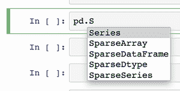
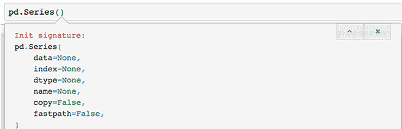
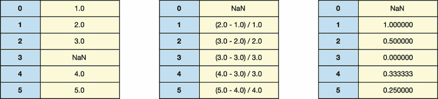
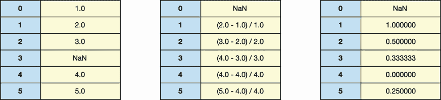
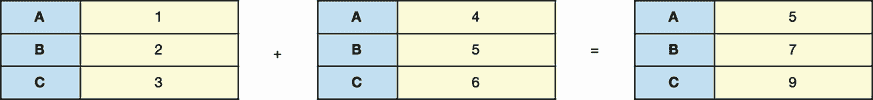
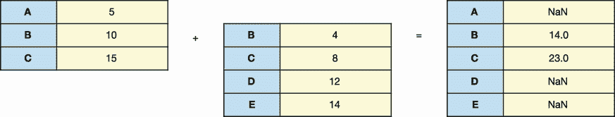

# 2 系列对象

本章节涵盖

+   从列表、字典、元组等实例化 `Series` 对象

+   在`Series`上设置自定义索引

+   访问`Series`对象的属性和调用其方法

+   对一个或多个 `序列` 执行数学运算

+   将 `Series` 传递给 Python 的内置函数

Pandas 的核心数据结构之一，`Series`是一个用于同质数据的单维标签数组。*数组*是有序值集合，类似于 Python 列表。术语*同质*意味着值具有相同的数据类型（例如，所有整数或所有布尔值）。

Pandas 为每个 `Series` 值分配一个 *标签*——一个我们可以用来定位值的标识符。该库还为每个 `Series` 值分配一个 *顺序*——一个在行中的位置。顺序从 0 开始计数；第一个 `Series` 值占据位置 0，第二个值占据位置 1，以此类推。`Series` 是一个一维数据结构，因为我们需要一个参考点来访问一个值：要么是一个标签，要么是一个位置。

`系列`结合并扩展了 Python 原生数据结构的最佳特性。就像列表一样，它以有序的方式存储其值。就像字典一样，它为每个值分配一个键/标签。我们获得了这两个对象的好处，以及超过 180 种数据操作方法。

在本章中，我们将熟悉`Series`对象的机制，学习如何计算`Series`值的总和和平均值，对每个`Series`值应用数学运算，以及更多内容。作为 pandas 的基石，`Series`是探索该库的完美起点。

## 2.1 系列概述

让我们创建一些 `Series` 对象，好吗？我们将从使用 `import` 关键字导入 pandas 和 NumPy 包开始；我们将在 2.1.4 节中使用后者库。`pandas` 和 `numpy` 的流行社区别名是 `pd` 和 `np`。我们可以使用 `as` 关键字给导入项指定别名：

```
In  [1] import pandas as pd
        import numpy as np
```

`pd` 命名空间包含 `pandas` 包的顶级导出，这是一个包含超过 100 个类、函数、异常、常量等功能的集合。有关这些概念的信息，请参阅附录 B。

将`pd`视为图书馆的大厅——一个我们可以访问 pandas 可用功能的入口房间。图书馆的导出项作为`pd`的属性可用。我们可以使用点符号来访问一个属性：

```
pd.attribute
```

Jupyter Notebook 提供了一个方便的自动补全功能，用于搜索属性。输入库的名称，添加一个点，然后按 Tab 键以显示包的导出模态。随着你输入更多字符，笔记本会过滤结果以匹配你的搜索词。



图 2.1 使用 Jupyter Notebook 的自动完成功能来显示以`S`开头的 pandas 导出

图 2.1 展示了自动完成功能在作用。在输入大写字母 `S` 后，我们可以按 Tab 键来显示所有以该字符开头的 `pd` 导出。请注意，搜索是区分大小写的。如果自动完成功能不起作用，请将以下代码添加到笔记本中的一个单元格中，执行它，然后再次尝试搜索：

```
%config Completer.use_jedi = False
```

我们可以使用键盘的上箭头和下箭头键在模式搜索结果中导航。幸运的是，`Series` 类是我们的第一个搜索结果。按 Enter 键来自动完成其名称。

### 2.1.1 类和实例

一个 *类* 是一个 Python 对象的蓝图。`pd.Series` 类是一个模板，下一步是创建它的具体实例。我们通过一对括号从类中实例化一个对象。让我们从 `Series` 类创建一个 `Series` 对象：

```
In  [2] pd.Series()

Out [2] Series([], dtype: float64)
```

可能会在输出旁边出现一个红色框中的警告：

```
DeprecationWarning: The default dtype for empty Series will be 'object' instead of 'float64' in a future version. Specify a dtype explicitly to silence this warning.
```

因为我们没有提供任何要存储的值，pandas 无法推断 `Series` 应该持有的数据类型。无需担心；警告是预期行为。

我们已经成功创建了我们的第一个 `Series` 对象！不幸的是，它没有存储任何数据。让我们用一些值填充我们的 `Series`。

### 2.1.2 用值填充 Series

一个 *构造函数* 是一个从类中构建对象的方法。当我们在第 2.1.1 节中写下 `pd.Series()` 时，我们使用了 `Series` 构造函数来创建一个新的 `Series` 对象。

当我们创建一个对象时，我们通常会想要定义其初始状态。我们可以将对象的初始状态视为其初始配置——其“设置”。我们通常可以通过传递给创建对象的构造函数的参数来设置状态。一个 *参数* 是我们传递给方法的输入。

让我们练习从手动数据创建一些 `Series`。目标是熟悉数据结构的外观和感觉。在未来，我们将使用导入的数据集来填充我们的 `Series` 的值。

`Series` 构造函数的第一个参数是一个可迭代对象，其值将填充 `Series`。我们可以传递各种输入，包括列表、字典、元组和 NumPy `ndarray`s。`

让我们使用 Python 列表中的数据创建一个 `Series` 对象。下一个示例声明了一个包含四个字符串的列表，将列表赋值给 `ice_cream_flavors` 变量，然后将列表传递给 `Series` 构造函数：

```
In  [3] ice_cream_flavors = [
            "Chocolate",
            "Vanilla",
            "Strawberry",
            "Rum Raisin",
        ]

        pd.Series(ice_cream_flavors)

Out [3] 0     Chocolate
        1       Vanilla
        2    Strawberry
        3    Rum Raisin
        dtype: object
```

极好——我们已经使用来自我们的 `ice_cream_ flavors` 列表的四个值创建了一个新的 `Series`。注意，pandas 保留了输入列表中字符串的顺序。我们稍后会回到 `Series` 左侧的数字。

一个 *参数* 是指给函数或方法的一个预期输入的名称。在幕后，Python 会将我们传递给构造函数的每个参数与一个参数匹配。我们可以在 Jupyter Notebook 中直接查看构造函数的参数。在一个新单元格中输入 `pd.Series()`，将鼠标光标放在括号之间，然后按 Shift+Tab。图 2.2 展示了出现的文档模式。



图 2.2 一个带有 `Series` 构造函数参数和默认值的文档模式

重复按 Shift+Tab 键以显示更多信息。最终，Jupyter 将将文档面板固定在屏幕底部。

`Series` 构造函数定义了六个参数：`data`、`index`、`dtype`、`name`、`copy` 和 `fastpath`。我们可以使用这些参数来设置对象的初始状态。我们可以将参数视为 `Series` 的配置选项。

文档显示每个参数及其默认值。*默认值* 是 Python 在我们没有为参数提供参数时使用的回退值。例如，如果我们不为 `name` 参数传递值，Python 将使用 `None`。具有默认值的参数本质上是可选的。它始终会有一些参数，无论是从其调用还是从其定义中隐式地获得。我们之前能够不带参数实例化一个 `Series`，因为其构造函数的所有六个参数都是可选的。

`Series` 构造函数的第一个参数 `data` 期望的是一个对象，其值将填充到 `Series` 中。如果我们向构造函数传递参数而没有参数名称，Python 将假设我们是按顺序传递它们的。在先前的代码示例中，我们将 `ice_cream_flavors` 列表作为构造函数的第一个参数传递；因此，Python 将其与第一个构造函数参数 `data` 匹配。Python 还将 `index`、`dtype` 和 `name` 参数的默认值设置为 `None`，以及将 `copy` 和 `fastpath` 参数的默认值设置为 `False`。

我们可以使用关键字参数明确地将参数和参数连接起来（参见附录 B）。输入参数，后跟一个等号和其参数。在以下示例中，第一行使用位置参数，第二行使用关键字参数，但结果相同：

```
In  [4] # The two lines below are equivalent
        pd.Series(ice_cream_flavors)
        pd.Series(data = ice_cream_flavors)

Out [4] 0     Chocolate
        1       Vanilla
        2    Strawberry
        3    Rum Raisin
        dtype: object
```

关键字参数是有优势的，因为它们为每个构造函数参数提供了上下文。示例中的第二行更好地传达了 `ice_cream_flavors` 代表 `Series` 的 `data`。

### 2.1.3 自定义 `Series` 索引

让我们更仔细地看看我们的 `Series`：

```
0     Chocolate
1       Vanilla
2    Strawberry
3    Rum Raisin
dtype: object
```

之前我们提到，pandas 为每个 `Series` 值分配一个行位置。输出左侧的递增整数集合被称为索引。每个数字表示一个值在 `Series` 中的顺序。索引从 0 开始计数。字符串 `"Chocolate"` 占据索引 0，字符串 `"Vanilla"` 占据索引 1，以此类推。在图形电子表格应用程序中，数据的第一行从 1 开始计数——这是 pandas 和 Excel 之间的重要区别。

术语 *index* 既可以指代标识符的集合，也可以指代单个标识符。这两个表达都是有效的：“`Series` 的索引由整数组成”和“值 `'Strawberry'` 在 `Series` 中的索引位置是 `2`。”

最后一个索引位置总是比值的总数少 1。当前的 `Series` 有四种冰淇淋口味，因此索引计数到 3。

除了索引位置之外，我们还可以为每个 `Series` 值分配一个索引标签。索引标签可以是任何不可变的数据类型：字符串、元组、日期时间等。这种灵活性使 `Series` 非常强大：我们可以通过其顺序或键/标签来引用值。从某种意义上说，每个值都有两个标识符。

`Series` 构造函数的第二个参数 `index` 用于设置 `Series` 的索引标签。如果我们不向该参数传递任何参数，pandas 默认使用从 0 开始的数值索引。这种类型的索引中，标签和位置标识符是相同的。

让我们构建一个具有自定义索引的 `Series`。我们可以向 `data` 和 `index` 参数传递不同数据类型的对象，但它们的长度必须相同，这样 pandas 才能关联它们的值。下一个示例将字符串列表传递给 `data` 参数，并将字符串元组传递给 `index` 参数。列表和元组的长度都是 `4`：

```
In  [5] ice_cream_flavors = [
            "Chocolate",
            "Vanilla",
            "Strawberry",
            "Rum Raisin",
        ]

        days_of_week = ("Monday", "Wednesday", "Friday", "Saturday")

        # The two lines below are equivalent
        pd.Series(ice_cream_flavors, days_of_week)
        pd.Series(data = ice_cream_flavors, index = days_of_week)

Out [5] Monday         Chocolate
        Wednesday        Vanilla
        Friday        Strawberry
        Saturday      Rum Raisin
        dtype: object
```

Pandas 使用共享索引位置将 `ice_cream_flavors` 列表和 `days_of_week` 元组中的值关联起来。例如，库在各自的对象中将 `"Rum Raisin"` 和 `"Saturday"` 视为索引位置 `3`；因此，它在 `Series` 中将它们关联起来。

即使索引由字符串标签组成，pandas 仍然为每个 `Series` 值分配一个索引位置。换句话说，我们可以通过索引标签 `"Wednesday"` 或索引位置 1 来访问值 `"Vanilla"`。我们将在第四章探讨如何通过行和标签访问 `Series` 元素。

索引允许重复，这是 `Series` 与 Python 字典区别的一个细节。在下一个示例中，字符串 `"Wednesday"` 在 `Series` 的索引标签中出现了两次：

```
In  [6] ice_cream_flavors = [
            "Chocolate",
            "Vanilla",
            "Strawberry",
            "Rum Raisin",
        ]

        days_of_week = ("Monday", "Wednesday", "Friday", "Wednesday")

        # The two lines below are equivalent
        pd.Series(ice_cream_flavors, days_of_week)
        pd.Series(data = ice_cream_flavors, index = days_of_week)

Out [6] Monday        Chocolate
        Wednesday       Vanilla
        Friday       Strawberry
        Wednesday    Rum Raisin
        dtype: object
```

尽管 pandas 允许重复，但尽可能避免重复是理想的，因为唯一的索引允许库更快地定位索引标签。

关键字参数的一个额外优点是它们允许我们以任何顺序传递参数。相比之下，顺序/位置参数要求我们按照构造函数期望的顺序传递参数。下一个示例交换了 `index` 和 `data` 关键字参数的顺序。Pandas 创建了相同的 `Series`：

```
In  [7] pd.Series(index = days_of_week, data = ice_cream_flavors)

Out [7] Monday        Chocolate
        Wednesday       Vanilla
        Friday       Strawberry
        Wednesday    Rum Raisin
        dtype: object
```

我们还没有讨论输出中的一个部分：底部的 `dtype` 语句反映了 `Series` 中值的类型。对于大多数数据类型，pandas 将显示一个可预测的类型（例如 `bool`、`float` 或 `int`）。对于字符串和更复杂的对象（例如嵌套数据结构），pandas 将显示 `dtype: object`。¹

下面的示例从布尔值、整数和浮点数值的列表中创建 `Series` 对象。观察 `Series` 中的相似之处和不同之处：

```
In  [8] bunch_of_bools = [True, False, False]
        pd.Series(bunch_of_bools)

Out [8] 0     True
        1    False
        2    False
        dtype: bool

In  [9] stock_prices = [985.32, 950.44]
        time_of_day = ["Open", "Close"]
        pd.Series(data = stock_prices, index = time_of_day)

Out [9] Open     985.32
        Close    950.44
        dtype: float64

In  [10] lucky_numbers = [4, 8, 15, 16, 23, 42]
         pd.Series(lucky_numbers)

Out [10] 0     4
         1     8
         2    15
         3    16
         4    23
         5    42
         dtype: int64
```

`float64` 和 `int64` 数据类型表明，`Series` 中的每个浮点数/整数值在您的计算机 RAM 中占用 64 位（8 字节）。位和字节是内存的存储单位。我们不需要深入探讨这些计算机科学概念，就可以有效地使用 pandas。

Pandas 会尽力从 `data` 参数的值推断出适合 `Series` 的数据类型。我们可以通过构造函数的 `dtype` 参数强制转换到不同的类型。下一个示例将整数列表传递给构造函数，但要求一个浮点数 `Series`：

```
In  [11] lucky_numbers = [4, 8, 15, 16, 23, 42]
 pd.Series(lucky_numbers, dtype = "float")

Out [11] 0     4.0
         1     8.0
         2    15.0
         3    16.0
         4    23.0
         5    42.0
         dtype: float64
```

之前的示例同时使用了位置参数和关键字参数。我们按顺序将 `lucky_numbers` 列表传递给 `data` 参数。我们还通过关键字参数显式地传递了 `dtype` 参数。`Series` 构造函数期望 `dtype` 参数是第三个参数，因此我们不能直接在 `lucky_numbers` 之后传递它；我们必须使用关键字参数。

### 2.1.4 创建带有缺失值的 Series

到目前为止，一切顺利。我们到目前为止的 `Series` 都很简单且完整。当我们自己构建数据集时，拥有完美的数据很容易。在现实世界中，数据要复杂得多。分析师遇到的最常见问题可能是缺失值。

当 pandas 在文件导入期间看到缺失值时，库会替换 NumPy 的 `nan` 对象。`nan` 的缩写是 *not a number*，是一个用于未定义值的通用术语。换句话说，`nan` 是一个表示空缺或缺失的占位符对象。

让我们在 `Series` 中偷偷加入一个缺失值。当我们之前导入时，我们将 NumPy 库分配给别名 `np`。库的顶层导出中可用 `nan` 属性。下一个示例将 `np.nan` 嵌入我们传递给 `Series` 构造函数的温度列表中。注意输出中索引位置 2 的 `NaN`。习惯这三个字母的组合；我们将在整本书中经常看到它们：

```
In  [12] temperatures = [94, 88, np.nan, 91]
         pd.Series(data = temperatures)

Out [12] 0    94.0
         1    88.0
         2     NaN
         3    91.0
         dtype: float64
```

注意，`Series` 的 `dtype` 是 `float64`。当 Pandas 发现 `nan` 值时，会自动将数值从整数转换为浮点数；这个内部技术要求使得库能够将数值和缺失值存储在同一个同质的 `Series` 中。

## 2.2 从 Python 对象创建 Series

`Series` 构造函数的 `data` 参数接受各种输入，包括原生 Python 数据结构和来自其他库的对象。在本节中，我们将探讨 `Series` 构造函数如何处理字典、元组、集合和 NumPy 数组。pandas 返回的 `Series` 对象无论其数据源如何，操作方式都是相同的。

一个 *字典* 是一组键值对（参见附录 B）。当传递一个字典给构造函数时，它会将每个键设置为 `Series` 中相应的索引标签：

```
In  [13] calorie_info = {
             "Cereal": 125,
             "Chocolate Bar": 406,
             "Ice Cream Sundae": 342,
         }

         diet = pd.Series(calorie_info)
         diet

Out [13] Cereal              125
         Chocolate Bar       406
         Ice Cream Sundae    342
         dtype: int64
```

一个 *元组* 是一个不可变列表。在创建元组之后，我们无法添加、删除或替换其中的元素（参见附录 B）。当传递一个元组给构造函数时，它会以预期的方式填充 `Series`：

```
In  [14] pd.Series(data = ("Red", "Green", "Blue"))

Out [14] 0      Red
         1    Green
         2     Blue
         dtype: object
```

要创建一个存储元组的 `Series`，请将元组包裹在一个列表中。元组非常适合由多个部分或组件组成的行值，例如地址：

```
In  [15] rgb_colors = [(120, 41, 26), (196, 165, 45)]
         pd.Series(data = rgb_colors)

Out [15] 0     (120, 41, 26)
         1    (196, 165, 45)
         dtype: object
```

一个 *集合* 是一个无序的唯一值集合。我们可以用一对花括号来声明它，就像字典一样。Python 使用键值对的存在来区分这两种数据结构（参见附录 B）。

如果我们将一个集合传递给 `Series` 构造函数，pandas 会引发一个 `TypeError` 异常。集合既没有顺序的概念（如列表）也没有关联的概念（如字典）。因此，库无法假设一个存储集合值的顺序：²

```
In  [16] my_set = {"Ricky", "Bobby"}
         pd.Series(my_set)

---------------------------------------------------------------------------
TypeError                                 Traceback (most recent call last)
<ipython-input-16-bf85415a7772> in <module>
      1 my_set = { "Ricky", "Bobby" }
----> 2 pd.Series(my_set)

TypeError: 'set' type is unordered
```

如果你的程序涉及一个集合，在将其传递给 `Series` 构造函数之前，将其转换为有序数据结构。下一个示例通过使用 Python 的内置 `list` 函数将 `my_set` 转换为列表：

```
In  [17] pd.Series(list(my_set))

Out [17] 0    Ricky
         1    Bobby
         dtype: object
```

由于集合是无序的，我们无法保证列表元素（或 `Series` 元素）的顺序。

`Series` 构造函数的 `data` 参数也接受一个 NumPy `ndarray` 对象。许多数据科学库使用 NumPy 数组，这是移动数据时的常见存储格式。下一个示例通过 NumPy 的 `randint` 函数生成的 `ndarray` 来向 `Series` 构造函数提供数据（参见附录 C）：

```
In  [18] random_data = np.random.randint(1, 101, 10)
         random_data

Out [18] array([27, 16, 13, 83,  3, 38, 34, 19, 27, 66])

In  [19] pd.Series(random_data)

Out [19] 0    27
         1    16
         2    13
         3    83
         4     3
         5    38
         6    34
         7    19
         8    27
         9    66
         dtype: int64
```

与所有其他输入一样，pandas 保留 `ndarray` 的值在 `Series` 中的顺序。

## 2.3 `Series` 属性

一个 *属性* 是属于一个对象的数据片段。属性揭示了关于对象内部状态的信息。一个属性的值可能是一个对象。参见附录 B 以获取深入了解。

`Series` 由几个更小的对象组成。将这些对象想象成拼图碎片，它们组合在一起形成一个更大的整体。考虑第 2.2 节中的 `calorie_info` `Series`：

```
Cereal              125
Chocolate Bar       406
Ice Cream Sundae    342
dtype: int64
```

这个 `Series` 使用 NumPy 库的 `ndarray` 对象来存储卡路里计数，以及 pandas 库的 `Index` 对象来存储食品名称作为索引。我们可以通过 `Series` 属性访问这些嵌套对象。例如，`values` 属性暴露了存储值的 `ndarray` 对象：

```
In  [20] diet.values

Out [20] array([125, 406, 342])

```

如果我们不确定对象的类型或它来自哪个库，我们可以将对象传递给 Python 的内置`type`函数。该函数将返回对象实例化的类：

```
In  [21] type(diet.values)

Out [21] numpy.ndarray
```

让我们在这里暂停一下，稍作思考。Pandas 将存储`Series`值的责任委托给来自不同库的对象。这就是为什么 NumPy 是 pandas 的依赖项。`ndarray`对象通过依赖底层 C 编程语言进行许多计算，从而优化速度和效率。在许多方面，`Series`是一个包装器——围绕核心 NumPy 库对象的额外功能层。

当然，Pandas 有其自己的对象。例如，`index`属性返回存储`Series`标签的`Index`对象：

```
In  [22] diet.index

Out [22] Index(['Cereal', 'Chocolate Bar', 'Ice Cream Sundae'],
         dtype='object')

```

索引对象，例如`Index`，是内置到 pandas 中的：

```
In  [23] type(diet.index)

Out [23] pandas.core.indexes.base.Index

```

一些属性揭示了关于对象的有用细节。例如，`dtype`返回`Series`值的类型：

```
In  [24] diet.dtype

Out [24] dtype('int64')

```

`size`属性返回`Series`中的值数：

```
In  [25] diet.size

Out [25] 3

```

补充的`shape`属性返回一个元组，包含 pandas 数据结构的维度。对于一维`Series`，元组的唯一值将是`Series`的大小。Python 中一个元素元组的逗号后是一个标准的视觉输出：

```
In  [26] diet.shape
Out [26] (3,)

```

`is_unique`属性在所有`Series`值都是唯一的时返回`True`：

```
In  [27] diet.is_unique

Out [27] True

```

`is_unique`属性在`Series`包含重复项时返回`False`：

```
In  [28] pd.Series(data = [3, 3]).is_unique

Out [28] False
```

`is_monotonic`属性在`Series`的每个值都大于前一个值时返回`True`。值之间的增量不必相等：

```
In  [29] pd.Series(data = [1, 3, 6]).is_monotonic

Out [29] True

```

`is_monotonic`属性在任意元素小于前一个元素时返回`False`：

```
In  [30] pd.Series(data = [1, 6, 3]).is_monotonic

Out [30] False

```

总结来说，属性询问对象关于其内部状态的信息。属性揭示了嵌套对象，它们可以有自己的功能。在 Python 中，一切都是对象，包括整数、字符串和布尔值。因此，返回数字的属性在技术上与返回复杂对象（如`ndarray`）的属性没有区别。

## 2.4 获取第一行和最后一行

到现在为止，你应该已经能够舒适地创建`Series`对象。如果技术术语有点令人不知所措，那也无可厚非；我们在一开始就提供了大量信息，并在整本书中多次回顾。在本节中，我们将开始探索我们可以用`Series`对象做什么。

Python 对象既有属性也有方法。一个*属性*是属于对象的数据片段——数据结构可以揭示的关于自身的特征或细节。在第 2.3 节中，我们访问了`Series`的属性，如`size`、`shape`、`values`和`index`。

相比之下，一个*方法*是属于对象的功能——我们要求对象执行的动作或命令。方法通常涉及对对象属性的分析、计算或操作。属性定义了对象的*状态*，而方法定义了对象的*行为*。

让我们创建我们迄今为止最大的`Series`。我们将使用 Python 的内置`range`函数生成一个从起点到终点的所有数字的序列。`range`函数的三个参数是下限、上限和步进序列（每两个数字之间的间隔）。

下一个示例生成一个介于 0 到 500 之间，增量为 5 的 100 个值的范围，然后将范围对象传递给`Series`构造函数：

```
In  [31] values = range(0, 500, 5)
         nums = pd.Series(data = values)
         nums

Out [31] 0       0
         1       5
         2      10
         3      15
         4      20
               ...
         95    475
         96    480
         97    485
         98    490
         99    495
         Length: 100, dtype: int64

```

现在我们有一个包含 100 个值的`Series`。真棒！注意输出中间出现的省略号（三个点）。Pandas 正在告诉我们它通过隐藏一些行来压缩了输出。这个库方便地截断了`Series`，只显示前五行和后五行。打印过多的数据行可能会减慢 Jupyter Notebook。

我们在方法名称后面调用一对括号。让我们调用一些简单的`Series`方法。我们将从`head`方法开始，它返回数据集的开始或顶部的行。它接受一个参数`n`，该参数设置要提取的行数：

```
In  [32] nums.head(3)

Out [32] 0     0
         1     5
         2    10
         dtype: int64

```

我们可以在方法调用中传递关键字参数，就像在构造函数和函数中一样。以下代码产生与前面代码相同的结果：

```
In  [33] nums.head(n = 3)

Out [33] 0     0
         1     5
         2    10
         dtype: int64

```

和函数一样，方法可以为它们的参数声明默认参数。`head`方法的`n`参数有一个默认参数为`5`。如果我们没有为`n`传递显式参数，pandas 将返回五行（这是 pandas 开发团队的设计决策）：

```
In  [34] nums.head()

Out [34] 0     0
         1     5
         2    10
         3    15
         4    20
         dtype: int64

```

补充的`tail`方法返回`Series`的底部或末尾的行：

```
In  [35] nums.tail(6)

Out [35] 94    470
         95    475
         96    480
         97    485
         98    490
         99    495
         dtype: int64

```

`tail`方法的`n`参数也有一个默认参数为`5`：

```
In  [36] nums.tail()

Out [36] 95    475
         96    480
         97    485
         98    490
         99    495
         dtype: int64

```

`head`和`tail`是我最常用的两个方法；我们可以使用它们快速预览数据集的开始和结束。接下来，让我们深入了解一些更高级的`Series`方法。

## 2.5 数学运算

`Series`对象包含大量的统计和数学方法。让我们看看这些方法在实际中的应用。您可以随意快速浏览这一节，并在需要查找特定函数时再回来。

### 2.5.1 统计操作

我们将从一个升序数字列表开始创建一个`Series`，在中间偷偷加入一个`np.nan`值。记住，如果一个数据源有缺失值，pandas 会将整数强制转换为浮点值：

```
In  [37] numbers = pd.Series([1, 2, 3, np.nan, 4, 5])
         numbers

Out [37] 0    1.0
         1    2.0
         2    3.0
         3    NaN
         4    4.0
         5    5.0
         dtype: float64

```

`count`方法计算非空值的数量：

```
In  [38] numbers.count()

Out [38] 5
```

`sum`方法将`Series`的值相加：

```
In  [39] numbers.sum()

Out [39] 15.0

```

默认情况下，大多数数学方法忽略缺失值。我们可以通过将`skipna`参数的值设置为`False`来强制包含缺失值。

下一个示例使用带有参数的`sum`方法。Pandas 返回一个`nan`，因为它无法将索引`3`处的未知`nan`值加到累积和中：

```
In  [40] numbers.sum(skipna = False)

Out [40] nan

```

`sum` 方法的 `min_count` 参数设置了一个 `序列` 必须持有的有效值的最小数量，以便 pandas 计算其总和。我们的六个元素 `numbers` `序列` 包含五个有效值和一个 `nan` 值

在下一个示例中，`序列` 达到了三个有效值的阈值，因此 pandas 返回总和：

```
In  [41] numbers.sum(min_count = 3)

Out [41] 15.0

```

相比之下，下一个调用要求 pandas 计算总和至少有六个值。阈值未满足，因此 `sum` 方法返回 `nan`：

```
In  [42] numbers.sum(min_count = 6)

Out [42] nan
```

提示：如果您对某个方法的参数感到好奇，请在 Jupyter Notebook 中方法括号之间按 Shift+Tab 键，以显示文档。

`product` 方法将所有 `序列` 值相乘：

```
In  [43] numbers.product()

Out [43] 120.0

```

该方法还接受 `skipna` 和 `min_count` 参数。在这里，我们要求 pandas 将 `nan` 值包含在计算中：

```
In  [44] numbers.product(skipna = False)

Out [44] nan

```

在下一个示例中，如果 `序列` 至少有三个有效值，则请求所有 `序列` 值的乘积：

```
In  [45] numbers.product(min_count = 3)

Out [45] 120.0
```

`cumsum`（累积和）方法返回一个新的 `序列`，其中包含值的滚动总和。每个索引位置都包含从该索引开始并包括该索引的值的总和。累积和有助于确定哪些值对总和的贡献最大：

```
In  [46] numbers

Out [46] 0    1.0
         1    2.0
         2    3.0
         3    NaN
         4    4.0
         5    5.0
         dtype: float64

In  [47] numbers.cumsum()

Out [47] 0     1.0
         1     3.0
         2     6.0
         3     NaN
         4    10.0
         5    15.0
         dtype: float64

```

让我们来看看结果中的一些计算：

+   索引 0 的累积和为 1.0，这是 `numbers` `序列` 中的第一个值。目前还没有任何值可以相加。

+   索引 1 的累积和为 3.0，是索引 0 的 1.0 和索引位置 1 的 2.0 的总和。

+   索引 2 的累积和为 6.0，是 1.0、2.0 和 3.0 的总和。

+   `numbers` `序列` 在索引 3 处有一个 `nan`。Pandas 无法将缺失值添加到累积和中，因此在返回的 `序列` 中相同索引处放置一个 `nan`。

+   索引 4 的累积和为 10.0。Pandas 将前一个累积和与当前索引的值（1.0 + 2.0 + 3.0 + 4.0）相加。

如果我们传递 `skipna` 的参数为 `False`，则 `序列` 将列出直到第一个缺失值的累积和，然后对于剩余的值使用 `NaN`：

```
In  [48] numbers.cumsum(skipna = False)

Out [48] 0    1.0
         1    3.0
         2    6.0
         3    NaN
         4    NaN
         5    NaN
         dtype: float64

```

`pct_change`（百分比变化）方法返回一个 `序列` 中一个值与下一个值之间的百分比差异。在每个索引处，pandas 将最后一个索引的值和当前索引的值相加，然后将总和除以最后一个索引的值。Pandas 只能在两个索引都有有效值的情况下计算百分比差异。

`pct_change` 方法默认使用 *前向填充* 策略处理缺失值。使用此策略，pandas 将最后一个有效值替换为 `nan`。让我们调用该方法，然后了解计算过程：

```
In  [49] numbers

Out [49] 0    1.0
         1    2.0
         2    3.0
         3    NaN
         4    4.0
         5    5.0
         dtype: float64

In  [50] numbers.pct_change()

Out [50] 0         NaN
         1    1.000000
         2    0.500000
         3    0.000000
         4    0.333333
         5    0.250000
         dtype: float64

```

这是 pandas 的工作方式：

+   在索引 0 处，pandas 无法将 `numbers` `序列` 中的值 1.0 与任何先前值进行比较。因此，返回 `序列` 中的索引 0 有一个 `NaN` 值。

+   在索引 1 处，pandas 将索引 1 的值 2.0 与索引 0 的值 1.0 进行比较。2.0 和 1.0 之间的百分比变化是 100（翻倍），这在返回的 `序列` 中转换为索引 1 的 1.00000。

+   在索引 2 处，pandas 重复相同的操作。

+   在索引 3 处，`numbers` `Series`有一个缺失的`NaN`值。Pandas 用最后遇到的值（索引 2 处的 3.0）来替代它。替代的 3.0 在索引 3 处和索引 2 处的 3.0 之间的百分比变化是 0。

+   在索引 4 处，pandas 将索引 4 的值 4.0 与前一行的值进行比较。它再次用它看到的最后一个有效值 3.0 来替代`nan`。4 和 3 之间的百分比变化是 0.333333（增加了 33%）。

图 2.3 展示了前向填充百分比变化计算的视觉表示。左侧的`Series`是起点。中间的`Series`显示了 pandas 执行的中间计算。右侧的`Series`是最终结果。



图 2.3：`pct_change`方法如何使用前向填充解决方案计算值的过程

`fill_method`参数自定义了`pct_change`用何种协议来替代`NaN`值。此参数在许多方法中都可用，因此花时间熟悉它是值得的。如前所述，使用默认的前向填充策略，pandas 用最后一个有效的观察值来替代`nan`值。我们可以传递一个显式的参数`"pad"`或`"ffill"`给`fill_method`参数以实现相同的结果：

```
In  [51] # The three lines below are equivalent
         numbers.pct_change()
         numbers.pct_change(fill_method = "pad")
         numbers.pct_change(fill_method = "ffill")

Out [51] 0         NaN
         1    1.000000
         2    0.500000
         3    0.000000
         4    0.333333
         5    0.250000
         dtype: float64

```

处理缺失值的另一种策略是*后向填充*解决方案。使用此选项，pandas 用下一个有效的观察值来替代`nan`值。让我们传递一个值为`"bfill"`的`fill_method`参数来查看结果，然后逐步进行说明：

```
In  [52] # The two lines below are equivalent
         numbers.pct_change(fill_method = "bfill")
         numbers.pct_change(fill_method = "backfill")

Out [52] 0         NaN
         1    1.000000
         2    0.500000
         3    0.333333
         4    0.000000
         5    0.250000
         dtype: float64

```

注意，在索引位置 3 和 4 之间，前向填充和后向填充解决方案的值不同。以下是 pandas 如何得出先前计算的方法：

+   在索引 0 处，pandas 无法将`numbers` `Series`中的值 1.0 与任何先前值进行比较。因此，返回的`Series`中的索引 0 有一个`NaN`值。

+   在索引 3 处，pandas 在`numbers` `Series`中遇到了一个`NaN`。Pandas 用下一个有效值（索引 4 处的 4.0）来替代它。`numbers`中索引 3 处的 4.0 和索引 2 处的 3.0 之间的百分比变化是 0.33333。

+   在索引 4 处，pandas 将 4.0 与索引 3 的值进行比较。它再次用`numbers` `Series`中下一个有效的值 4.0 来替代索引 3 处的`NaN`。4 和 4 之间的百分比变化是 0.0。

图 2.4 展示了后向填充百分比变化计算的视觉表示。左侧的`Series`是起点。中间的`Series`显示了 pandas 执行的中间计算。右侧的`Series`是最终结果。



图 2.4：`pct_change`方法如何使用后向填充解决方案计算值的过程

`mean`方法返回`Series`中值的平均值。平均值是值总和除以值计数的结果：

```
In  [53] numbers.mean()

Out [53] 3.0

```

`median` 方法返回排序后的 `Series` 值中的中间数。`Series` 值中有一半会低于中位数，另一半会高于中位数：

```
In  [54] numbers.median()

Out [54] 3.0

```

`std` 方法返回 *标准差*，这是衡量数据变异程度的指标：

```
In  [55] numbers.std()

Out [55] 1.5811388300841898

```

`max` 和 `min` 方法从 `Series` 中检索最大和最小值：

```
In  [56] numbers.max()

Out [56] 5.0

In  [57] numbers.min()

Out [57] 1.0

```

Pandas 按字母顺序对字符串 `Series` 进行排序。最小的字符串是接近字母表开头的字符串，最大的字符串是接近字母表末尾的字符串。以下是一个简单的示例，使用了一个小的 `Series`：

```
In  [58] animals = pd.Series(["koala", "aardvark", "zebra"])
         animals

Out [58] 0       koala
         1    aardvark
         2       zebra
         dtype: object

In  [59] animals.max()

Out [59] 'zebra'

In  [60] animals.min()

Out [60] 'aardvark'

```

如果你正在寻找一个可以有效地总结 `Series` 的单一方法，强大的 `describe` 方法可以做到这一点。它返回一个包含计数、平均值和标准差的统计评估 `Series`：

```
In  [61] numbers.describe()

Out [61] count    5.000000
         mean     3.000000
         std      1.581139
         min      1.000000
         25%      2.000000
         50%      3.000000
         75%      4.000000
         max      5.000000
         dtype: float64

```

`sample` 方法从 `Series` 中选择一组随机的值。新 `Series` 和原始 `Series` 中的值顺序可能不同。在下一个示例中，请注意，随机选择中没有 `NaN` 值允许 pandas 返回一个整数的 `Series`。如果 `NaN` 是其中的任何一个值，pandas 将返回一个浮点数的 `Series`。

```
In  [62] numbers.sample(3)

Out [62] 1    2
         3    4
         2    3
         dtype: int64

```

`unique` 方法返回 `Series` 中唯一值的 NumPy `ndarray`。在下一个示例中，字符串 `"Orwell"` 在 `authors` `Series` 中出现两次，但在返回的 `ndarray` 中只出现一次：

```
In  [63] authors = pd.Series(
             ["Hemingway", "Orwell", "Dostoevsky", "Fitzgerald", "Orwell"]
         )

         authors.unique()

Out [63] array(['Hemingway', 'Orwell', 'Dostoevsky', 'Fitzgerald'],
         dtype=object)

```

补充的 `nunique` 方法返回 `Series` 中唯一值的数量：

```
In  [64] authors.nunique()

Out [64] 4

```

`nunique` 方法的返回值将等于 `unique` 方法返回的数组的长度。

### 2.5.2 算术运算

在 2.5.1 节中，我们练习了在 `Series` 对象上调用多个数学方法。Pandas 给我们提供了执行算术计算的其他方法。让我们首先创建一个包含一个缺失值的整数 `Series`：

```
In  [65] s1 = pd.Series(data = [5, np.nan, 15], index = ["A", "B", "C"])
         s1
Out [65] A     5.0
         B     NaN
         C    15.0
         dtype: float64

```

我们可以使用 Python 的标准数学运算符对 `Series` 进行算术运算：

+   `+` 用于加法

+   `-` 用于减法

+   `*` 用于乘法

+   `/` 用于除法

语法直观：将 `Series` 视为数学运算符一侧的常规操作数。将补充值放在运算符的另一侧。请注意，任何涉及 `nan` 的数学运算都会产生另一个 `nan`。下一个示例将 `3` 添加到 `s1` `Series` 中的每个值：

```
In  [66] s1 + 3

Out [66] A     8.0
         B     NaN
         C    18.0
         dtype: float64
```

一些软件开发人员可能会对结果感到惊讶。我们如何将一个整数添加到数据结构中？看起来这些类型是不兼容的。在幕后，pandas 足够智能，能够解析我们的语法，并理解我们想要将整数添加到 `Series` 中的每个值，而不是添加到 `Series` 对象本身。

如果你更喜欢基于方法的方法，`add` 方法可以达到相同的结果：

```
In  [67] s1.add(3)

Out [67] A     8.0
         B     NaN
         C    18.0
         dtype: float64

```

下面的三个示例展示了减法（`-`）、乘法（`*`）和除法（`/`）的补充语法选项。在 pandas 中，通常有多种方式可以完成相同的操作：

```
In  [68] # The three lines below are equivalent
         s1 - 5
         s1.sub(5)
         s1.subtract(5)

Out [68] A     0.0
         B     NaN
         C    10.0
         dtype: float64

In  [69] # The three lines below are equivalent
         s1 * 2
         s1.mul(2)
         s1.multiply(2)

Out [69] A    10.0
         B     NaN
         C    30.0
         dtype: float64

In  [70] # The three lines below are equivalent
         s1 / 2
         s1.div(2)
         s1.divide(2)

Out [70] A    2.5
         B    NaN
         C    7.5
         dtype: float64

```

向下取整除法运算符 (`//`) 执行除法并从结果中移除小数点后的任何数字。例如，15 除以 4 的常规除法得到 3.75，而向下取整除法得到 3。我们可以将此运算符应用于 `Series`；另一种选择是调用 `floordiv` 方法：

```
In  [71] # The two lines below are equivalent
         s1 // 4
         s1.floordiv(4)

Out [71] A    1.0
         B    NaN
         C    3.0
         dtype: float64

```

取模运算符 (`%`) 返回除法的余数。以下是一个例子：

```
In  [72] # The two lines below are equivalent
         s1 % 3
         s1.mod(3)

Out [72] A    2.0
         B    NaN
         C    0.0
         dtype: float64

```

在前面的例子中，

+   Pandas 将索引标签 A 上的值 5.0 除以 3，余数为 2.0。

+   Pandas 不能将索引标签 B 上的 `NaN` 进行除法。

+   Pandas 将索引标签 C 上的值 15.0 除以 3，余数为 0.0。

### 2.5.3 广播

回想一下，pandas 在底层使用 NumPy `ndarray` 存储其 `Series` 值。当我们使用 `s1 + 3` 或 `s1 - 5` 这样的语法时，pandas 将数学计算委托给 NumPy。

NumPy 文档使用术语 *广播* 来描述从一个数组派生另一个数组的过程。不深入技术细节（您不需要理解 NumPy 的复杂性就能有效地使用 pandas），术语 *广播* 来自一个广播塔，它向所有收听的人发送相同的信号。像 `s1 + 3` 这样的语法意味着“将相同的操作（加 3）应用于 `Series` 中的每个值。”每个 `Series` 值都收到相同的信息，就像同时收听同一电台的每个人都能听到相同的歌曲一样。

广播还描述了多个 `Series` 对象之间的数学运算。作为一个经验法则，pandas 使用共享索引标签在不同数据结构之间对齐值。让我们通过一个例子来演示这个概念。让我们实例化两个具有相同三个元素索引的 `Series`：

```
In  [73] s1 = pd.Series([1, 2, 3], index = ["A", "B", "C"])
         s2 = pd.Series([4, 5, 6], index = ["A", "B", "C"])

```

当我们使用 `+` 运算符并将两个 `Series` 作为操作数时，pandas 会将相同索引位置的值相加：

+   在索引 A 处，pandas 将值 1 和 4 相加得到 5。

+   在索引 B 处，pandas 将值 2 和 5 相加得到 7。

+   在索引 C 处，pandas 将值 3 和 6 相加得到 9。

```
In  [74] s1 + s2

Out [74] A    5
         B    7
         C    9
         dtype: int64

```

图 2.5 展示了 pandas 如何对齐两个 `Series`。



图 2.5 展示了 pandas 在执行数学运算时通过共享索引标签对齐 `Series`。

这里是 pandas 使用共享索引标签对齐数据的另一个例子。让我们创建另外两个具有标准数值索引的 `Series`。我们将在每个集合中添加一个缺失值：

```
In  [75] s1 = pd.Series(data = [3, 6, np.nan, 12])
         s2 = pd.Series(data = [2, 6, np.nan, 12])

```

Python 的等号运算符 (`==`) 用于比较两个对象的相等性。我们可以使用这个运算符来比较两个 `Series` 中的值，如下例所示。请注意，pandas 认为 `nan` 值与另一个 `nan` 不相等；它不能假设缺失的值与另一个缺失的值相等。等号运算符的等效方法是 `eq`：

```
In  [76] # The two lines below are equivalent
         s1 == s2
         s1.eq(2)

Out [76] 0    False
         1     True
         2    False
         3     True
         dtype: bool

```

不等号运算符 (`!=`) 确认两个值是否不相等。它的等效方法是 `ne`：

```
In  [77] # The two lines below are equivalent
         s1 != s2
         s1.ne(s2)

Out [77] 0     True
         1    False
         2     True
         3    False
         dtype: bool

```

当索引不同时，`Series`之间的比较操作会变得复杂。一个索引可能包含更多或更少的标签，或者标签本身可能存在不匹配。

下一个示例创建了两个只共享两个索引标签 B 和 C 的`Series`：

```
In  [78] s1 = pd.Series(
             data = [5, 10, 15], index = ["A", "B", "C"]
         )

         s2 = pd.Series(
             data = [4, 8, 12, 14], index = ["B", "C", "D", "E"]
         )

```

当我们尝试将`s1`和`s2`相加时会发生什么？Pandas 会在 B 和 C 标签处添加值，并在剩余的索引（A、D 和 E）处返回`NaN`值。提醒一下，任何与`NaN`值进行的算术运算总是结果为`NaN`：

```
In  [79] s1 + s2

Out [79] A     NaN
         B    14.0
         C    23.0
         D     NaN
         E     NaN
         dtype: float64

```

图 2.6 显示了 pandas 如何对齐`s1`和`s2` `Series`，然后添加它们相关的索引值。



图 2.6 Pandas 在`Series`不共享索引标签时返回`NaN`。

总结来说，pandas 通过在两个`Series`之间共享索引标签来对齐数据，并在需要的地方用`NaN`替换。

## 2.6 将`Series`传递给 Python 的内置函数

Python 的开发者社区喜欢围绕某些设计原则进行团结，以确保代码库之间的连贯性。一个例子是库对象与 Python 内置函数的无缝集成。Pandas 也不例外。我们可以将`Series`传递给 Python 的任何内置函数，并得到可预测的结果。让我们创建一个包含美国城市的`Series`：

```
In  [80] cities = pd.Series(
             data = ["San Francisco", "Los Angeles", "Las  Vegas", np.nan]
         )

```

`len`函数返回`Series`中的行数。计数包括缺失值（`NaN`s）：

```
In  [81] len(cities)

Out [81] 4

```

如我们之前看到的，`type`函数返回对象的类。当你不确定你正在处理的数据结构或其来源的库时，请使用此函数：

```
In  [82] type(cities)

Out [82] pandas.core.series.Series

```

`dir`函数返回一个对象属性和方法作为字符串的列表。注意，下一个示例显示了输出的简略版本：

```
In  [83] dir(cities)

Out [83] ['T',
          '_AXIS_ALIASES',
          '_AXIS_IALIASES',
          '_AXIS_LEN',
          '_AXIS_NAMES',
          '_AXIS_NUMBERS',
          '_AXIS_ORDERS',
          '_AXIS_REVERSED',
          '_HANDLED_TYPES',
          '__abs__',
          '__add__',
          '__and__',
          '__annotations__',
          '__array__',
          '__array_priority__',
          #...
         ]

```

`Series`的值可以填充一个原生的 Python 数据结构。下一个示例通过使用 Python 的`list`函数从我们的`cities` `Series`创建一个列表：

```
In  [84] list(cities)

Out [84] ['San Francisco', 'Los Angeles', 'Las  Vegas', nan]
```

我们可以将`Series`传递给 Python 的内置`dict`函数来创建一个字典。Pandas 将`Series`的索引标签和值映射到字典的键和值：

```
In  [85] dict(cities)

Out [85] {0: 'San Francisco', 1: 'Los Angeles', 2: 'Las  Vegas', 3: nan}

```

在 Python 中，我们使用`in`关键字来检查包含。在 pandas 中，我们可以使用`in`关键字来检查给定值是否存在于`Series`的索引中。这里是一个关于`cities`的提醒：

```
In  [86] cities

Out [86] 0    San Francisco
         1      Los Angeles
         2       Las  Vegas
         3              NaN
         dtype: object

```

下两个示例在`Series`的索引中查询`"Las Vegas"`和`2`：

```
In  [87] "Las Vegas" in cities

Out [87] False

In  [88] 2 in cities

Out [88] True

```

要检查`Series`值中的包含情况，我们可以将`in`关键字与`values`属性配对。记住，`values`暴露了包含实际数据的`ndarray`对象：

```
In  [89] "Las Vegas" in cities.values

Out [89] True

```

我们可以使用逆`not in`运算符来检查排除。如果 pandas 在`Series`中找不到该值，则该运算符返回`True`：

```
In  [90] 100 not in cities

Out [90] True

In  [91] "Paris" not in cities.values

Out [91] True

```

pandas 对象通常会与 Python 的内置函数集成，并提供自己的属性/方法来返回相同的数据。选择最适合你的语法选项。

## 2.7 编程挑战

欢迎来到本书的第一个编码挑战！这些练习的目的是帮助你应用和复习本章中介绍的概念。你将在问题之后立即找到解决方案。祝你好运！

### 2.7.1 问题

假设你被给出了这两个数据结构：

```
In  [92] superheroes = [
             "Batman",
             "Superman",
             "Spider-Man",
             "Iron Man",
             "Captain America",
             "Wonder Woman"
         ]

In  [93] strength_levels = (100, 120, 90, 95, 110, 120)

```

这里是你的挑战：

1.  使用超级英雄列表填充一个新的`Series`对象。

1.  使用力量值的元组填充一个新的`Series`对象。

1.  创建一个以超级英雄为索引标签，力量等级为值的`Series`。将`Series`赋值给`heroes`变量。

1.  提取`heroes` `Series`的前两行。

1.  提取`heroes` `Series`的最后四行。

1.  确定你的`heroes` `Series`中唯一值的数量。

1.  计算`heroes`中超级英雄的平均力量。

1.  计算`heroes`中的最大力量和最小力量。

1.  计算如果力量等级翻倍，每个超级英雄的力量等级会是多少。

1.  将`heroes` `Series`转换为 Python 字典。

### 2.7.2 解决方案

让我们探索 2.7.1 节中问题的解决方案：

1.  要创建一个新的`Series`对象，我们可以在 pandas 库的顶层使用`Series`构造函数。将数据源作为第一个位置参数传入：

    ```
    In  [94] pd.Series(superheroes)

    Out [94] 0             Batman
             1           Superman
             2         Spider-Man
             3           Iron Man
             4    Captain America
             5       Wonder Woman
             dtype: object
    ```

1.  这个问题的解决方案与上一个相同；我们只需要将我们的力量值元组传递给`Series`构造函数。这次，让我们明确写出`data`关键字参数：

    ```
    In  [95] pd.Series(data = strength_levels)

    Out [95] 0    100
             1    120
             2     90
             3     95
             4    110
             5    120
             dtype: int64

    ```

1.  要创建具有自定义索引的`Series`，我们可以将`index`参数传递给构造函数。在这里，我们将力量等级设置为`Series`的值，将超级英雄名称设置为索引标签：

    ```
    In  [96] heroes = pd.Series(
                 data = strength_levels, index = superheroes
             )

             heroes

    Out [96] Batman             100
             Superman           120
             Spider-Man          90
             Iron Man            95
             Captain America    110
             Wonder Woman       120
             dtype: int64

    ```

1.  作为提醒，*方法*是我们可以向对象发出的动作或命令。我们可以使用`head`方法从 pandas 数据结构的顶部提取行。方法的唯一参数`n`设置了要提取的行数。`head`方法返回一个新的`Series`：

    ```
    In  [97] heroes.head(2)

    Out [97] Batman      100
             Superman    120
             dtype: int64

    ```

1.  补充的`tail`方法从 pandas 数据结构的末尾提取行。为了定位最后四行，我们将传递一个参数`4`：

    ```
    In  [98] heroes.tail(4)

    Out [98] Spider-Man          90
             Iron Man            95
             Captain America    110
             Wonder Woman       120
             dtype: int64
    ```

1.  要识别`Series`中的唯一值数量，我们可以调用`nunique`方法。`heroes` `Series`总共有六个值，其中五个是唯一的；值`120`出现了两次：

    ```
    In  [99] heroes.nunique()

    Out [99] 5

    ```

1.  要计算`Series`值的平均值，我们可以调用`mean`方法：

    ```
    In  [100] heroes.mean()

    Out [100] 105.83333333333333

    ```

1.  下一个挑战是确定`Series`中的最大值和最小值。`max`和`min`方法可以解决这个问题：

    ```
    In  [101] heroes.max()

    Out [101] 120

    In  [102] heroes.min()

    Out [102] 90

    ```

1.  我们如何将每个超级英雄的力量等级翻倍呢？我们可以将每个`Series`值乘以 2。以下解决方案使用了乘法运算符，但`mul`和`multiply`方法也是合适的选择：

    ```
    In  [103] heroes * 2

    Out [103] Batman             200
              Superman           240
              Spider-Man         180
              Iron Man           190
              Captain America    220
              Wonder Woman       240
              dtype: int64

    ```

1.  最后的挑战是将`heroes` `Series`转换为 Python 字典。为了解决这个问题，我们可以将数据结构传递给 Python 的`dict`构造函数/函数。Pandas 将索引标签设置为字典键，将`Series`值设置为字典值：

    ```
    In  [104] dict(heroes)

    Out [104] {'Batman': 100,
               'Superman': 120,
               'Spider-Man': 90,
               'Iron Man': 95,
               'Captain America': 110,
               'Wonder Woman': 120}

    ```

恭喜您完成了您的第一个编码挑战！

## 摘要

+   `Series` 是一个一维同构标签数组，用于存储值和索引。

+   `Series` 的值可以是任何数据类型。索引标签可以是任何不可变的数据类型。

+   Pandas 为每个 `Series` 值分配一个索引 *位置* 和一个索引 *标签*。

+   我们可以使用列表、字典、元组、NumPy 数组等数据源填充 `Series`。

+   `head` 方法用于检索 `Series` 的第一行。

+   `tail` 方法用于检索 `Series` 的最后几行。

+   `Series` 支持常见的统计操作，如总和、平均值、中位数和标准差。

+   Pandas 使用共享索引标签在多个 `Series` 上应用算术运算。

+   `Series` 与 Python 的内置函数（包括 `dict`、`list` 和 `len`）友好地协同工作。

* * *

¹ 请参阅[`mng.bz/7j6v`](http://mng.bz/7j6v)以了解为什么 pandas 将字符串的 `dtype` 列为“object”的讨论。

² 请参阅“使用集合构造序列返回集合而不是序列”，[`github.com/pandas-dev/pandas/issues/1913`](https://github.com/pandas-dev/pandas/issues/1913)。
