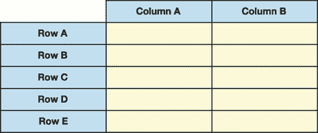

# 4 DataFrame 对象

本章涵盖

+   从字典和 NumPy `ndarrays` 实例化 `DataFrame` 对象

+   使用 `read_csv` 函数从 CSV 文件导入 `DataFrame`

+   排序 `DataFrame` 列

+   访问 `DataFrame` 中的行和列

+   设置和重置 `DataFrame` 索引

+   在 `DataFrame` 中重命名列和索引标签

pandas 的 `DataFrame` 是一个二维数据表，具有行和列。与 `Series` 一样，pandas 为每个 `DataFrame` 行分配一个索引标签和索引位置。Pandas 还为每个列分配一个标签和位置。`DataFrame` 是二维的，因为它需要两个参考点——行和列——来从数据集中隔离一个值。图 4.1 显示了 pandas `DataFrame` 的视觉示例。



图 4.1 pandas `DataFrame` 的五行两列的视觉表示

`DataFrame` 是 pandas 库中的工作马，是你每天都会大量使用的数据结构，因此我们将在这本书的剩余部分探索其丰富的功能。

## 4.1 DataFrame 概述

如往常一样，让我们启动一个新的 Jupyter Notebook 并导入 pandas。我们还需要 NumPy 库，我们将在 4.1.2 节中使用它来生成随机数据。NumPy 通常被分配别名 `np`：

```
In  [1] import pandas as pd
        import numpy as np
```

`DataFrame` 类构造函数位于 pandas 的顶层。实例化 `DataFrame` 对象的语法与实例化 `Series` 的语法相同。我们通过一对括号访问 `DataFrame` 类并实例化：`pd.DataFrame()`。

### 4.1.1 从字典创建 DataFrame

构造函数的第一个参数 `data` 期望填充 `DataFrame` 的数据。一个合适的输入是键为列名、值为列值的 Python 字典。下一个示例传递一个键为字符串、值为列表的字典。Pandas 返回一个包含三个列的 `DataFrame`。每个列表元素成为其相应列的值：

```
In  [2] city_data = {
            "City": ["New York City", "Paris", "Barcelona", "Rome"],
            "Country": ["United States", "France", "Spain", "Italy"],
            "Population": [8600000, 2141000, 5515000, 2873000]
        }

        cities = pd.DataFrame(city_data)
        cities

Out [2]

 **City         Country   Population**
0  New York City   United States      8600000
1          Paris          France      2141000
2      Barcelona           Spain      5515000
3           Rome           Italy      2873000
```

我们正式拥有了一个 `DataFrame`！注意，数据结构与 `Series` 的渲染方式不同。

**A** `DataFrame` 包含行标签的索引。我们没有向构造函数提供自定义索引，因此 pandas 从 0 开始生成一个数字索引。逻辑操作与 `Series` 上的操作相同。

`DataFrame` 可以包含多个数据列。将列标题视为第二个索引是有帮助的。City、Country 和 Population 是列轴上的三个索引标签；pandas 分别将它们分配索引位置 0、1 和 2。

如果我们想交换列标题和索引标签呢？这里有两种选择。我们可以在 `DataFrame` 上调用 `transpose` 方法，或者访问其 `T` 属性：

```
In  [3] # The two lines below are equivalent
        cities.transpose()
        cities.T

Out [3]

 **0        1          2        3**
City        New York City    Paris  Barcelona     Rome
Country     United States   France      Spain    Italy
Population        8600000  2141000    5515000  2873000
```

之前的例子提醒我们，pandas 可以存储不同数据类型的索引标签。在上一个输出中，列使用相同的值作为索引标签和索引位置。行有不同的标签（城市、国家、人口）和位置（0、1 和 2）。

### 4.1.2 从 NumPy ndarray 创建 DataFrame

让我们再试一个例子。`DataFrame` 构造函数的 `data` 参数也接受 NumPy 的 `ndarray`。我们可以使用 NumPy 的 `random` 模块中的 `randint` 函数生成任何大小的 `ndarray`。下一个示例创建一个介于 1 和 101（不包括 101）之间的整数的 3 x 5 `ndarray`：

```
In  [4] random_data = np.random.randint(1, 101, [3, 5])
        random_data

Out [4] array([[25, 22, 80, 43, 42],
              [40, 89,  7, 21, 25],
              [89, 71, 32, 28, 39]])
```

如果你想了解更多关于 NumPy 中随机数据生成的信息，请参阅附录 C。

接下来，让我们将我们的 `ndarray` 传递给 `DataFrame` 构造函数。`ndarray` 没有行标签也没有列标签。因此，pandas 使用数字索引作为行轴和列轴：

```
In  [5] pd.DataFrame(data = random_data)

Out [5]

 **0   1   2   3   4**
0  25  22  80  43  42
1  40  89   7  21  25
2  89  71  32  28  39

```

我们可以使用 `DataFrame` 构造函数的 `index` 参数手动设置行标签，该参数接受任何迭代对象，包括列表、元组或 `ndarray`。请注意，迭代器的长度必须等于数据集的行数。我们传递一个 3 x 5 的 `ndarray`，因此我们必须提供三个行标签：

```
In  [6] row_labels = ["Morning", "Afternoon", "Evening"]
        temperatures = pd.DataFrame(
            data = random_data, index = row_labels
        )
        temperatures

Out [6]

 **0   1   2   3   4**
Morning    25  22  80  43  42
Afternoon  40  89   7  21  25
Evening    89  71  32  28  39

```

我们可以使用构造函数的 `columns` 参数设置列名。`ndarray` 包含五个列，因此我们必须传递一个包含五个元素的迭代器。下一个示例通过元组传递列名：

```
In  [7] row_labels = ["Morning", "Afternoon", "Evening"]
        column_labels = (
            "Monday",
            "Tuesday",
            "Wednesday",
            "Thursday",
            "Friday",
        )

        pd.DataFrame(
            data = random_data,
            index = row_labels,
            columns = column_labels,
        )

Out [7]

 **Monday  Tuesday  Wednesday  Thursday  Friday**
Morning        25       22         80        43      42
Afternoon      40       89          7        21      25
Evening        89       71         32        28      39

```

Pandas 允许行和列索引有重复。在下一个示例中，`"Morning"` 在行索引标签中出现了两次，而 `"Tuesday"` 在列索引标签中出现了两次：

```
In  [8] row_labels = ["Morning", "Afternoon", "Morning"]
        column_labels = [
            "Monday",
            "Tuesday",
            "Wednesday",
            "Tuesday",
            "Friday"
        ]

        pd.DataFrame(
            data = random_data,
            index = row_labels,
            columns = column_labels,
        )

Out [8]

 **Monday  Tuesday  Wednesday  Tuesday  Friday**
Morning        25       22         80       43      42
Afternoon      40       89          7       21      25
Evening        89       71         32       28      39

```

正如我们在前面的章节中提到的，当可能时，拥有唯一的索引是理想的。如果没有重复，pandas 提取特定行或列会更容易。

## 4.2 Series 和 DataFrame 之间的相似性

许多 `Series` 属性和方法也适用于 `DataFrames`。它们的实现可能有所不同；pandas 必须现在考虑多列和两个独立的轴。

### 4.2.1 使用 read_csv 函数导入 DataFrame

nba.csv 数据集是 2019-20 赛季美国国家篮球协会（NBA）职业篮球运动员的列表。每一行包括一名球员的姓名、球队、位置、生日和薪水。数据类型的好组合散布在整个数据集中，这使得这个数据集非常适合探索 `DataFrame` 的基础知识。

让我们使用 pandas 的顶级 `read_csv` 函数导入文件（我们在第三章介绍了这个函数）。该函数接受一个文件名作为其第一个参数，默认返回一个 `DataFrame`。在执行以下代码之前，请确保数据集与你的 Jupyter Notebook 在同一目录下：

```
In  [9] pd.read_csv("nba.csv")

Out [9]

 **Name                 Team    Position  Birthday     Salary**
0      Shake Milton   Philadelphia 76ers          SG   9/26/96    1445697
1    Christian Wood      Detroit Pistons          PF   9/27/95    1645357
2     PJ Washington    Charlotte Hornets          PF   8/23/98    3831840
3      Derrick Rose      Detroit Pistons          PG   10/4/88    7317074
4     Marial Shayok   Philadelphia 76ers           G   7/26/95      79568
 ...       ...                ...                 ...    ...         ...
445   Austin Rivers      Houston Rockets          PG    8/1/92    2174310
446     Harry Giles     Sacramento Kings          PF   4/22/98    2578800
447     Robin Lopez      Milwaukee Bucks           C    4/1/88    4767000
448   Collin Sexton  Cleveland Cavaliers          PG    1/4/99    4764960
449     Ricky Rubio         Phoenix Suns          PG  10/21/90   16200000

450 rows × 5 columns

```

在输出的底部，pandas 通知我们数据有 450 行和 5 列。

在我们将 `DataFrame` 赋值给变量之前，让我们进行一个优化。Pandas 将生日列的值作为字符串而不是日期时间值导入，这限制了我们可以对这些值执行的操作数量。我们可以使用 `parse_dates` 参数将值强制转换为日期时间：

```
In  [10] pd.read_csv("nba.csv", parse_dates = ["Birthday"])

Out [10]

 **Name                 Team Position   Birthday    Salary**
0      Shake Milton   Philadelphia 76ers       SG 1996-09-26   1445697
1    Christian Wood      Detroit Pistons       PF 1995-09-27   1645357
2     PJ Washington    Charlotte Hornets       PF 1998-08-23   3831840
3      Derrick Rose      Detroit Pistons       PG 1988-10-04   7317074
4     Marial Shayok   Philadelphia 76ers        G 1995-07-26     79568
 ...     ...                ...         ...          ...         ...
445   Austin Rivers      Houston Rockets       PG 1992-08-01   2174310
446     Harry Giles     Sacramento Kings       PF 1998-04-22   2578800
447     Robin Lopez      Milwaukee Bucks        C 1988-04-01   4767000
448   Collin Sexton  Cleveland Cavaliers       PG 1999-01-04   4764960
449     Ricky Rubio         Phoenix Suns       PG 1990-10-21  16200000

450 rows × 5 columns

```

现在好多了！现在我们有一个日期时间列。Pandas 以传统的 YYYY-MM-DD 格式显示日期时间值。我很高兴导入成功，因此我们可以将 `DataFrame` 赋值给变量，比如 `nba`：

```
In  [11] nba = pd.read_csv("nba.csv", parse_dates = ["Birthday"])
```

将 `DataFrame` 想象成一系列具有公共索引的 `Series` 对象是有帮助的。在这个例子中，`nba` 中的五个列（姓名、球队、位置、生日和薪水）共享相同的行索引。让我们开始探索 `DataFrame` 吧。

### 4.2.2 `Series` 和 `DataFrames` 的共享和独有属性

`Series` 和 `DataFrames` 的属性和方法可能在名称和实现上有所不同。以下是一个例子。`Series` 有一个 `dtype` 属性，它揭示了其值的类型（见第二章）。请注意，`dtype` 属性是单数的，因为 `Series` 只能存储一种数据类型：

```
In  [12] pd.Series([1, 2, 3]).dtype

Out [12] dtype('int64')

```

相比之下，`DataFrame` 可以存储异构数据。`异构` 意味着混合或不同。一列可以存储整数，另一列可以存储字符串。`DataFrame` 有一个独特的 `dtypes` 属性。（注意名称是复数。）该属性返回一个以 `DataFrame` 的列作为索引标签，列的数据类型作为值的 `Series`：

```
In  [13] nba.dtypes

Out [13] Name                object
         Team                object
         Position            object
         Birthday    datetime64[ns]
         Salary               int64
         dtype: object

```

姓名、球队和位置列将 `object` 列为其数据类型。`object` 数据类型是 pandas 对复杂对象的术语，包括字符串。因此，`nba` `DataFrame` 有三个字符串列，一个日期时间列和一个整数列。

我们可以在 `Series` 上调用 `value_counts` 方法来计算存储每种数据类型的列数：

```
In  [14] nba.dtypes.value_counts()

Out [14] object            3
         datetime64[ns]    1
         int64             1
         dtype: int64

```

`dtype` 与 `dtypes` 是 `Series` 和 `DataFrames` 之间不同属性的一个例子。但这两个数据结构也有许多共同的属性和方法。

一个 `DataFrame` 由几个较小的对象组成：一个包含行标签的索引，一个包含列标签的索引，以及一个包含值的值容器。`index` 属性暴露了 `DataFrame` 的索引：

```
In  [15] nba.index

Out [15] RangeIndex(start=0, stop=450, step=1)

```

这里，我们有一个 `RangeIndex`，这是一个优化存储一系列数值的索引。`RangeIndex` 对象包括三个属性：`start`（包含的下限），`stop`（排除的上限），和 `step`（每两个值之间的间隔或步长）。上面的输出告诉我们 `nba` 的索引从 0 开始计数，以 1 为增量递增到 450。

Pandas 使用一个单独的索引对象来存储 `DataFrame` 的列。我们可以通过 `columns` 属性访问它：

```
In  [16] nba.columns

Out [16] Index(['Name', 'Team', 'Position', 'Birthday', 'Salary'],
         dtype='object'
```

此对象是另一种索引对象：`Index`。Pandas 在索引由文本值组成时使用此选项。

`index`属性是一个`DataFrame`与`Series`共享的属性的例子。`columns`属性是一个仅属于`DataFrame`的属性的例子。`Series`没有列的概念。

`ndim`属性返回 pandas 对象中的维度数。`DataFrame`有两个：

```
In  [17] nba.ndim

Out [17] 2

```

`shape`属性以元组的形式返回`DataFrame`的维度。`nba`数据集有 450 行和 5 列：

```
In  [18] nba.shape

Out [18] (450, 5)

```

`size`属性计算数据集中的总值数。缺失值（如`NaNs`）包含在计数中：

```
In  [19] nba.size

Out [19] 2250

```

如果我们想要排除缺失值，`count`方法返回一个包含每列当前值计数的`Series`：

```
In  [20] nba.count()

Out [20] Name        450
         Team        450
         Position    450
         Birthday    450
         Salary      450
         dtype: int64

```

我们可以使用`sum`方法将这些`Series`值相加，以得到`DataFrame`中非空值的数量。`nba` `DataFrame`数据集没有缺失值，所以`size`属性和`sum`方法返回相同的结果：

```
In  [21] nba.count().sum()

Out [21] 2250

```

这里有一个示例，说明了`size`属性和`count`方法之间的区别。让我们创建一个包含缺失值的`DataFrame`。我们可以将`nan`作为 NumPy 包的顶层属性访问：

```
In  [22] data = {
             "A": [1, np.nan],
             "B": [2, 3]
         }

         df = pd.DataFrame(data)
         df

Out [22]

 **A  B**
0  1.0  2
1  NaN  3

```

`size`属性返回`4`，因为`DataFrame`有四个单元格：

```
In  [23] df.size

Out [23] 4

```

相比之下，`sum`方法返回`3`，因为`DataFrame`有三个非空值：

```
In  [24] df.count()

Out [24] A    1
         B    2
         dtype: int64

In  [25] df.count().sum()

Out [25] 3

```

A 列有一个当前值，B 列有两个当前值。

### 4.2.3 Series 和 DataFrame 的共享方法

`DataFrame`和`Series`也有共同的方法。我们可以使用`head`方法从`DataFrame`的顶部提取行，例如：

```
In  [26] nba.head(2)

Out [26]

 **Name                Team Position   Birthday   Salary**
0    Shake Milton  Philadelphia 76ers       SG 1996-09-26  1445697
1  Christian Wood     Detroit Pistons       PF 1995-09-27  1645357

```

`tail`方法返回`DataFrame`底部的行：

```
In  [27] nba.tail(n = 3)

Out [27]

 **Name                 Team Position   Birthday    Salary**
447    Robin Lopez      Milwaukee Bucks        C 1988-04-01   4767000
448  Collin Sexton  Cleveland Cavaliers       PG 1999-01-04   4764960
449    Ricky Rubio         Phoenix Suns       PG 1990-10-21  16200000
```

这两个方法在没有参数的情况下默认返回五行：

```
In  [28] nba.tail()

Out [28]

 **Name                 Team Position   Birthday    Salary**
445  Austin Rivers      Houston Rockets       PG 1992-08-01   2174310
446    Harry Giles     Sacramento Kings       PF 1998-04-22   2578800
447    Robin Lopez      Milwaukee Bucks        C 1988-04-01   4767000
448  Collin Sexton  Cleveland Cavaliers       PG 1999-01-04   4764960
449    Ricky Rubio         Phoenix Suns       PG 1990-10-21  16200000

```

`sample`方法从`DataFrame`中提取随机行。它的第一个参数指定了行数：

```
In  [29] nba.sample(3)

Out [29]

 **Name                 Team Position    Birthday    Salary**
225     Tomas Satoransky        Chicago Bulls       PG  1991-10-30  10000000
201        Javonte Green       Boston Celtics       SF  1993-07-23    898310
310  Matthew Dellavedova  Cleveland Cavaliers       PG  1990-09-08   9607500

```

假设我们想要找出这个数据集中存在多少支队伍、薪资和职位。在第二章中，我们使用了`nunique`方法来计算`Series`中唯一值的数量。当我们对`DataFrame`调用相同的方法时，它返回一个包含每列唯一值计数的`Series`对象：

```
In  [30] nba.nunique()

Out [30] Name        450
         Team         30
         Position      9
         Birthday    430
         Salary      269
         dtype: int64

```

在`nba`中，有 30 个唯一的队伍，269 个唯一的薪资和 9 个唯一的职位。

你可能还记得`max`和`min`方法。在`DataFrame`上，`max`方法返回一个包含每列最大值的`Series`。文本列中的最大值是字母表中接近末尾的字符串。日期时间列中的最大值是按时间顺序最晚的日期：

```
In  [31] nba.max()

Out [31] Name             Zylan Cheatham
         Team         Washington Wizards
         Position                     SG
         Birthday    2000-12-23 00:00:00
         Salary                 40231758
         dtype: object
```

`min`方法返回一个包含每列最小值的`Series`（最小的数字，字母表中接近开头的字符串，最早的日期，等等）：

```
In  [32] nba.min()

Out [32] Name               Aaron Gordon
         Team              Atlanta Hawks
         Position                      C
         Birthday    1977-01-26 00:00:00
         Salary                    79568
         dtype: object

```

如果我们想要识别多个最大值，例如数据集中的四位最高薪球员？`nlargest`方法可以检索具有`DataFrame`中给定列最大值的行子集。我们通过将其`n`参数传递要提取的行数，并通过其`columns`参数传递用于排序的列：

```
In  [33] nba.nlargest(n = 4, columns = "Salary")

Out [33]

 **Name                   Team Position   Birthday    Salary**
205      Stephen Curry  Golden State Warriors       PG 1988-03-14  40231758
38          Chris Paul  Oklahoma City Thunder       PG 1985-05-06  38506482
219  Russell Westbrook        Houston Rockets       PG 1988-11-12  38506482
251          John Wall     Washington Wizards       PG 1990-09-06  38199000

```

我们下一个挑战是找到联盟中最年长的三位球员。我们可以通过获取生日列中的三个最早日期来完成这项任务。`nsmallest`方法可以帮助我们；它返回具有数据集中给定列最小值的行子集。最小的日期时间值是那些在时间顺序中最早发生的。请注意，`nlargest`和`nsmallest`方法只能用于数值或日期时间列：

```
In  [34] nba.nsmallest(n = 3, columns = ["Birthday"])

Out [34]

 **Name             Team Position   Birthday   Salary**
98    Vince Carter    Atlanta Hawks       PF 1977-01-26  2564753
196  Udonis Haslem       Miami Heat        C 1980-06-09  2564753
262    Kyle Korver  Milwaukee Bucks       PF 1981-03-17  6004753

```

如果我们想要计算所有 NBA 球员的薪资总和呢？`DataFrame`包含一个`sum`方法用于此目的：

```
In  [35] nba.sum()

Out [35] Name        Shake MiltonChristian WoodPJ WashingtonDerrick...
         Team        Philadelphia 76ersDetroit PistonsCharlotte Hor...
         Position    SGPFPFPGGPFSGSFCSFPGPGFCPGSGPFCCPFPFSGPFPGSGSF...
         Salary                                             3444112694
         dtype: object
```

我们确实得到了我们想要的答案，但输出有点杂乱。默认情况下，pandas 会在每个列中添加值。对于文本列，库将所有字符串连接成一个。要限制添加到数值总量，我们可以将`True`传递给`sum`方法的`numeric_only`参数：

```
In  [36] nba.sum(numeric_only = True)

Out [36] Salary    3444112694
         dtype: int64

```

这 450 名 NBA 球员的总薪资高达 34 亿美元。我们可以使用`mean`方法来计算平均薪资。该方法接受相同的`numeric_only`参数，以仅针对数值列：

```
In  [37] nba.mean(numeric_only = True)

Out [37] Salary    7.653584e+06
         dtype: float64

```

`DataFrame`还包括用于统计计算的诸如中位数、众数和标准差的方法：

```
In  [38] nba.median(numeric_only = True)

Out [38] Salary    3303074.5
         dtype: float64

In  [39] nba.mode(numeric_only = True)

Out [39]

 **Salary**
0   79568

In  [40] nba.std(numeric_only = True)

Out [40] Salary    9.288810e+06
         dtype: float64

```

对于高级统计方法，请查看官方的`Series`文档([`mng.bz/myDa`](http://mng.bz/myDa))。

## 4.3 对 DataFrame 进行排序

我们的数据集行以混乱、随机的顺序到达，但这不是问题！我们可以通过使用`sort_values`方法按一个或多个列对`DataFrame`进行排序。

### 4.3.1 按单列排序

让我们先按姓名的字母顺序对球员进行排序。`sort_values`方法的第一参数`by`接受 pandas 应使用的列以对`DataFrame`进行排序。让我们将名称列作为字符串传递：

```
In  [41] # The two lines below are equivalent
         nba.sort_values("Name")
         nba.sort_values(by = "Name")

Out [41]

 **Name                   Team Position   Birthday    Salary**
52        Aaron Gordon          Orlando Magic       PF 1995-09-16  19863636
101      Aaron Holiday         Indiana Pacers       PG 1996-09-30   2239200
437        Abdel Nader  Oklahoma City Thunder       SF 1993-09-25   1618520
81         Adam Mokoka          Chicago Bulls        G 1998-07-18     79568
399  Admiral Schofield     Washington Wizards       SF 1997-03-30   1000000
...                ...                    ...      ...        ...       ...
159        Zach LaVine          Chicago Bulls       PG 1995-03-10  19500000
302       Zach Norvell     Los Angeles Lakers       SG 1997-12-09     79568
312       Zhaire Smith     Philadelphia 76ers       SG 1999-06-04   3058800
137    Zion Williamson   New Orleans Pelicans        F 2000-07-06   9757440
248     Zylan Cheatham   New Orleans Pelicans       SF 1995-11-17     79568

450 rows × 5 columns

```

`sort_values`方法的`ascending`参数确定排序顺序；它有一个默认参数为`True`。默认情况下，pandas 将按升序对数字列进行排序，对字符串列按字母顺序排序，对日期时间列按时间顺序排序。

如果我们想要按逆字母顺序对名称进行排序，我们可以将`ascending`参数传递为`False`：

```
In  [42] nba.sort_values("Name", ascending = False).head()

Out [42]

 **Name                  Team Position   Birthday    Salary**
248   Zylan Cheatham  New Orleans Pelicans       SF 1995-11-17     79568
137  Zion Williamson  New Orleans Pelicans        F 2000-07-06   9757440
312     Zhaire Smith    Philadelphia 76ers       SG 1999-06-04   3058800
302     Zach Norvell    Los Angeles Lakers       SG 1997-12-09     79568
159      Zach LaVine         Chicago Bulls       PG 1995-03-10  19500000

```

这里还有一个例子：如果我们想在不使用`nsmallest`方法的情况下找到`nba`中的五位最年轻球员怎么办？我们可以通过使用`sort_values`方法并将`ascending`设置为`False`来按逆时间顺序对生日列进行排序，然后使用`head`方法取前五行：

```
In  [43] nba.sort_values("Birthday", ascending = False).head()

Out [43]

 **Name                  Team Position   Birthday   Salary**
136      Sekou Doumbouya       Detroit Pistons       SF 2000-12-23  3285120
432  Talen Horton-Tucker    Los Angeles Lakers       GF 2000-11-25   898310
137      Zion Williamson  New Orleans Pelicans        F 2000-07-06  9757440
313           RJ Barrett       New York Knicks       SG 2000-06-14  7839960
392         Jalen Lecque          Phoenix Suns        G 2000-06-13   898310
```

`nba` 中最年轻球员在输出中排在第一位。这位球员是 Sekou Doumbouya，他出生于 2000 年 12 月 23 日。

### 4.3.2 按多列排序

我们可以通过将列表传递给 `sort_values` 方法的 `by` 参数来按多个列对 `DataFrame` 进行排序。Pandas 将按列表中出现的顺序依次对 `DataFrame` 的列进行排序。下一个示例首先按 `Team` 列排序，然后按 `Name` 列排序。Pandas 默认对所有列进行升序排序：

```
In  [44] nba.sort_values(by = ["Team", "Name"])

Out [44]

 **Name                Team Position   Birthday    Salary**
359         Alex Len       Atlanta Hawks        C 1993-06-16   4160000
167     Allen Crabbe       Atlanta Hawks       SG 1992-04-09  18500000
276  Brandon Goodwin       Atlanta Hawks       PG 1995-10-02     79568
438   Bruno Fernando       Atlanta Hawks        C 1998-08-15   1400000
194      Cam Reddish       Atlanta Hawks       SF 1999-09-01   4245720
...              ...                 ...      ...        ...       ...
418     Jordan McRae  Washington Wizards       PG 1991-03-28   1645357
273  Justin Robinson  Washington Wizards       PG 1997-10-12    898310
428    Moritz Wagner  Washington Wizards        C 1997-04-26   2063520
21     Rui Hachimura  Washington Wizards       PF 1998-02-08   4469160
36     Thomas Bryant  Washington Wizards        C 1997-07-31   8000000

450 rows × 5 columns

```

这是您读取输出的方式。当按字母顺序对球队进行排序时，亚特兰大老鹰队是数据集中的第一个球队。在亚特兰大老鹰队中，Alex Len 的名字排在第一位，其次是 Allen Crabbe 和 Brandon Goodwin。Pandas 对剩余的球队和名字重复此排序逻辑。

我们可以将单个布尔值传递给 `ascending` 参数，以将相同的排序顺序应用于每一列。下一个示例传递 `False`，因此 pandas 首先按降序排序 `Team` 列，然后按降序排序 `Name` 列：

```
In  [45] nba.sort_values(["Team", "Name"], ascending = False)

Out [45]

 **Name                Team Position   Birthday    Salary**
36     Thomas Bryant  Washington Wizards        C 1997-07-31   8000000
21     Rui Hachimura  Washington Wizards       PF 1998-02-08   4469160
428    Moritz Wagner  Washington Wizards        C 1997-04-26   2063520
273  Justin Robinson  Washington Wizards       PG 1997-10-12    898310
418     Jordan McRae  Washington Wizards       PG 1991-03-28   1645357
...              ...                 ...      ...        ...       ...
194      Cam Reddish       Atlanta Hawks       SF 1999-09-01   4245720
438   Bruno Fernando       Atlanta Hawks        C 1998-08-15   1400000
276  Brandon Goodwin       Atlanta Hawks       PG 1995-10-02     79568
167     Allen Crabbe       Atlanta Hawks       SG 1992-04-09  18500000
359         Alex Len       Atlanta Hawks        C 1993-06-16   4160000

450 rows × 5 columns
```

如果我们想按不同的顺序对每一列进行排序呢？例如，我们可能希望按升序对球队进行排序，然后按降序对那些球队中的薪水进行排序。为了完成这个任务，我们可以将布尔值列表传递给 `ascending` 参数。传递给 `by` 和 `ascending` 参数的列表长度必须相等。Pandas 将使用两个列表之间的共享索引位置来匹配每一列与其关联的排序顺序。在下一个示例中，`Team` 列在 `by` 列中占据索引位置 0；Pandas 将它与 `ascending` 列中索引位置 0 的 `True` 匹配，因此按升序排序该列。Pandas 对 `Salary` 列应用相同的逻辑，并按降序排序：

```
In  [46] nba.sort_values(
             by = ["Team", "Salary"], ascending = [True, False]
         )

Out [46]

 **Name                Team Position   Birthday    Salary**
111   Chandler Parsons       Atlanta Hawks       SF 1988-10-25  25102512
28         Evan Turner       Atlanta Hawks       PG 1988-10-27  18606556
167       Allen Crabbe       Atlanta Hawks       SG 1992-04-09  18500000
213    De'Andre Hunter       Atlanta Hawks       SF 1997-12-02   7068360
339      Jabari Parker       Atlanta Hawks       PF 1995-03-15   6500000
...                ...                 ...      ...        ...       ...
80         Isaac Bonga  Washington Wizards       PG 1999-11-08   1416852
399  Admiral Schofield  Washington Wizards       SF 1997-03-30   1000000
273    Justin Robinson  Washington Wizards       PG 1997-10-12    898310
283   Garrison Mathews  Washington Wizards       SG 1996-10-24     79568
353      Chris Chiozza  Washington Wizards       PG 1995-11-21     79568

450 rows × 5 columns
```

数据看起来不错，所以让我们使排序永久化。`sort_values` 方法支持 `inplace` 参数，但我们将明确地将返回的 `DataFrame` 重新赋值给 `nba` 变量（有关 `inplace` 参数的不足之处，请参阅第三章）：

```
In  [47] nba = nba.sort_values(
             by = ["Team", "Salary"],
             ascending = [True, False]
         )
```

欢呼——我们已经按 `Team` 和 `Salary` 列的值对 `DataFrame` 进行了排序。现在我们可以找出每个球队中哪位球员的薪水最高。

## 4.4 按索引排序

在我们的永久排序中，`DataFrame` 的顺序与到达时不同：

```
In  [48] nba.head()

Out [48]

 **Name           Team Position   Birthday    Salary**
111  Chandler Parsons  Atlanta Hawks       SF 1988-10-25  25102512
28        Evan Turner  Atlanta Hawks       PG 1988-10-27  18606556
167      Allen Crabbe  Atlanta Hawks       SG 1992-04-09  18500000
213   De'Andre Hunter  Atlanta Hawks       SF 1997-12-02   7068360
339     Jabari Parker  Atlanta Hawks       PF 1995-03-15   6500000

```

我们如何将其恢复到原始形式？

### 4.4.1 按行索引排序

我们的 `nba` `DataFrame` 仍然具有其数值索引。如果我们能按索引位置而不是按列值对数据集进行排序，我们就可以将其恢复到原始形状。`sort_index` 方法正是这样做的：

```
In  [49] # The two lines below are equivalent
         nba.sort_index().head()
         nba.sort_index(ascending = True).head()

Out [49]

 **Name                Team Position   Birthday   Salary**
0    Shake Milton  Philadelphia 76ers       SG 1996-09-26  1445697
1  Christian Wood     Detroit Pistons       PF 1995-09-27  1645357
2   PJ Washington   Charlotte Hornets       PF 1998-08-23  3831840
3    Derrick Rose     Detroit Pistons       PG 1988-10-04  7317074
4   Marial Shayok  Philadelphia 76ers        G 1995-07-26    79568
```

我们还可以通过将 `False` 传递给方法的 `ascending` 参数来反转排序顺序。下一个示例首先显示最大的索引位置：

```
In  [50] nba.sort_index(ascending = False).head()

Out [50]

 **Name                 Team Position   Birthday    Salary**
449    Ricky Rubio         Phoenix Suns       PG 1990-10-21  16200000
448  Collin Sexton  Cleveland Cavaliers       PG 1999-01-04   4764960
447    Robin Lopez      Milwaukee Bucks        C 1988-04-01   4767000
446    Harry Giles     Sacramento Kings       PF 1998-04-22   2578800
445  Austin Rivers      Houston Rockets       PG 1992-08-01   2174310

```

我们回到了起点，`DataFrame` 已按索引位置排序。现在，让我们将这个 `DataFrame` 重新赋值给 `nba` 变量：

```
In  [51] nba = nba.sort_index()
```

接下来，让我们探索如何按 `nba` 的其他轴进行排序。

### 4.4.2 按列索引排序

`DataFrame` 是一个二维数据结构。我们可以对额外的轴进行排序：垂直轴。

要按顺序对 `DataFrame` 列进行排序，我们再次依赖 `sort_index` 方法。然而，这次我们需要添加一个 `axis` 参数，并将其参数传递为 `"columns"` 或 1。下一个示例按升序排序列：

```
In  [52] # The two lines below are equivalent
         nba.sort_index(axis = "columns").head()
         nba.sort_index(axis = 1).head()

Out [52]

 **Birthday            Name Position   Salary                Team**
0 1996-09-26    Shake Milton       SG  1445697  Philadelphia 76ers
1 1995-09-27  Christian Wood       PF  1645357     Detroit Pistons
2 1998-08-23   PJ Washington       PF  3831840   Charlotte Hornets
3 1988-10-04    Derrick Rose       PG  7317074     Detroit Pistons
4 1995-07-26   Marial Shayok        G    79568  Philadelphia 76ers
```

按照逆字母顺序排序列怎么样？这个任务很简单：我们可以将 `ascending` 参数的参数设置为 `False`。下一个示例调用 `sort_index` 方法，使用 `axis` 参数指定列，并通过 `ascending` 参数按降序排序：

```
In  [53] nba.sort_index(axis = "columns", ascending = False).head()

Out [53]

 **Team   Salary Position            Name   Birthday**
0  Philadelphia 76ers  1445697       SG    Shake Milton 1996-09-26
1     Detroit Pistons  1645357       PF  Christian Wood 1995-09-27
2   Charlotte Hornets  3831840       PF   PJ Washington 1998-08-23
3     Detroit Pistons  7317074       PG    Derrick Rose 1988-10-04
4  Philadelphia 76ers    79568        G   Marial Shayok 1995-07-26
```

让我们花点时间来反思 pandas 的强大功能。通过两种方法和几个参数，我们能够对 `DataFrame` 在两个轴上、按一列、按多列、按升序、按降序或按多顺序进行排序。pandas 非常灵活。我们只需要将正确的方法与正确的参数结合起来。

## 4.5 设置新的索引

在本质上，我们的数据集是玩家集合。因此，使用 Name 列的值作为 `DataFrame` 的索引标签似乎是合适的。Name 还有一个好处，即它是唯一具有唯一值的列。

`set_index` 方法返回一个新的 `DataFrame`，其中指定的列被设置为索引。它的第一个参数 `keys` 接受列名作为字符串：

```
In  [54] # The two lines below are equivalent
         nba.set_index(keys = "Name")
         nba.set_index("Name")

Out [54]

                               Team Position   Birthday    Salary
**Name** 
Shake Milton     Philadelphia 76ers       SG 1996-09-26   1445697
Christian Wood      Detroit Pistons       PF 1995-09-27   1645357
PJ Washington     Charlotte Hornets       PF 1998-08-23   3831840
Derrick Rose        Detroit Pistons       PG 1988-10-04   7317074
Marial Shayok    Philadelphia 76ers        G 1995-07-26     79568
    ...                    ...           ...        ...       ...
Austin Rivers       Houston Rockets       PG 1992-08-01   2174310
Harry Giles        Sacramento Kings       PF 1998-04-22   2578800
Robin Lopez         Milwaukee Bucks        C 1988-04-01   4767000
Collin Sexton   Cleveland Cavaliers       PG 1999-01-04   4764960
Ricky Rubio            Phoenix Suns       PG 1990-10-21  16200000

450 rows × 4 columns
```

看起来不错！让我们覆盖我们的 `nba` 变量：

```
In  [55] nba = nba.set_index(keys = "Name")
```

作为旁注，我们可以在导入数据集时设置索引。将列名作为字符串传递给 `read_csv` 函数的 `index_col` 参数。以下代码导致相同的 `DataFrame`：

```
In  [56] nba = pd.read_csv(
             "nba.csv", parse_dates = ["Birthday"], index_col = "Name"
         )
```

接下来，我们将讨论如何从我们的 `DataFrame` 中选择行和列。

## 4.6 从 DataFrame 中选择列和行

`DataFrame` 是具有共同索引的 `Series` 对象的集合。有多个语法选项可用于从 `DataFrame` 中提取一个或多个这些 `Series`。

### 4.6.1 从 DataFrame 中选择单个列

每个 `Series` 列都作为 `DataFrame` 的属性可用。我们使用点语法来访问对象属性。例如，我们可以使用 `nba.Salary` 提取 Salary 列。注意，索引从 `DataFrame` 传递到 `Series`：

```
In  [57] nba.Salary

Out [57] Name
         Shake Milton       1445697
         Christian Wood     1645357
         PJ Washington      3831840
         Derrick Rose       7317074
         Marial Shayok        79568
                             ...
         Austin Rivers      2174310
         Harry Giles        2578800
         Robin Lopez        4767000
         Collin Sexton      4764960
         Ricky Rubio       16200000
         Name: Salary, Length: 450, dtype: int64
```

我们也可以通过在 `DataFrame` 后方传递其名称来提取一个列，使用方括号：

```
In  [58] nba["Position"]

Out [58] Name
         Shake Milton      SG
         Christian Wood    PF
         PJ Washington     PF
         Derrick Rose      PG
         Marial Shayok      G
                           ..
         Austin Rivers     PG
         Harry Giles       PF
         Robin Lopez        C
         Collin Sexton     PG
         Ricky Rubio       PG
         Name: Position, Length: 450, dtype: object
```

方括号语法的优点是它支持有空格的列名。如果我们的列名为 `"Player Position"`，我们只能通过方括号提取它：

```
nba["Player Position"]
```

属性语法会引发异常。Python 没有办法知道空格的意义，它会假设我们正在尝试访问一个 Player 列：

```
nba.Player Position
```

虽然意见不同，但我建议使用方括号语法进行提取。我喜欢那种 100%有效率的解决方案，即使它们需要多输入几个字符。

### 4.6.2 从 DataFrame 中选择多个列

要提取多个 `DataFrame` 列，声明一对开闭方括号；然后传递列名列表。结果将是一个新的 `DataFrame`，其列的顺序与列表元素相同。下一个示例目标是薪资和生日列：

```
In  [59] nba[["Salary", "Birthday"]]

Out [59]

                  Salary   Birthday
**Name** 
Shake Milton     1445697 1996-09-26
Christian Wood   1645357 1995-09-27
PJ Washington    3831840 1998-08-23
Derrick Rose     7317074 1988-10-04
Marial Shayok      79568 1995-07-26

```

Pandas 将根据列表中的顺序提取列：

```
In  [60] nba[["Birthday", "Salary"]].head()

Out [60]

                 Birthday   Salary
**Name** 
Shake Milton   1996-09-26  1445697
Christian Wood 1995-09-27  1645357
PJ Washington  1998-08-23  3831840
Derrick Rose   1988-10-04  7317074
Marial Shayok  1995-07-26    79568

```

我们可以使用 `select_dtypes` 方法根据数据类型选择列。该方法接受两个参数，`include` 和 `exclude`。这些参数接受单个字符串或列表，表示 pandas 应该保留或丢弃的列类型。提醒一下，如果您想查看每列的数据类型，可以访问 `dtypes` 属性。下一个示例从 `nba` 中选择仅包含字符串列：

```
In  [61] nba.select_dtypes(include = "object")

Out [61]

                               Team Position
**Name** 
Shake Milton     Philadelphia 76ers       SG
Christian Wood      Detroit Pistons       PF
PJ Washington     Charlotte Hornets       PF
Derrick Rose        Detroit Pistons       PG
Marial Shayok    Philadelphia 76ers        G
      ...                    ...         ...
Austin Rivers       Houston Rockets       PG
Harry Giles        Sacramento Kings       PF
Robin Lopez         Milwaukee Bucks        C
Collin Sexton   Cleveland Cavaliers       PG
Ricky Rubio            Phoenix Suns       PG

450 rows × 2 columns

```

下一个示例选择除了字符串和整数列之外的所有列：

```
In  [62] nba.select_dtypes(exclude = ["object", "int"])

Out [62]

                 Birthday
**Name** 
Shake Milton   1996-09-26
Christian Wood 1995-09-27
PJ Washington  1998-08-23
Derrick Rose   1988-10-04
Marial Shayok  1995-07-26
      ...          ...
Austin Rivers  1992-08-01
Harry Giles    1998-04-22
Robin Lopez    1988-04-01
Collin Sexton  1999-01-04
Ricky Rubio    1990-10-21

450 rows × 1 columns

```

生日列是 `nba` 中唯一一个既不包含字符串也不包含整数值的列。要包含或排除日期时间列，我们可以将 `"datetime"` 参数传递给正确的参数。

## 4.7 从 DataFrame 中选择行

现在我们已经练习了提取列，让我们学习如何通过索引标签或位置提取 `DataFrame` 行。

### 4.7.1 通过索引标签提取行

`loc` 属性通过标签提取一行。我们称像 `loc` 这样的属性为访问器，因为它们可以访问数据的一部分。在 `loc` 后面立即输入一对方括号，并传递目标索引标签。下一个示例通过索引标签 `"LeBron James"` 提取了 `nba` 行。Pandas 以 `Series` 的形式返回行的值。一如既往，请注意大小写敏感性：

```
In  [63] nba.loc["LeBron James"]

Out [63] Team         Los Angeles Lakers
         Position                     PF
         Birthday    1984-12-30 00:00:00
         Salary                 37436858
         Name: LeBron James, dtype: object

```

我们可以在方括号之间传递一个列表来提取多行。当结果集包含多个记录时，pandas 将结果存储在一个 `DataFrame` 中：

```
In  [64] nba.loc[["Kawhi Leonard", "Paul George"]]

Out [64]

                               Team Position   Birthday    Salary
**Name** 
Kawhi Leonard  Los Angeles Clippers       SF 1991-06-29  32742000
Paul George    Los Angeles Clippers       SF 1990-05-02  33005556

```

Pandas 按照索引标签在列表中出现的顺序组织行。下一个示例交换了上一个示例中的字符串顺序：

```
In  [65] nba.loc[["Paul George", "Kawhi Leonard"]]

Out [65]

                               Team Position   Birthday    Salary
**Name** 
Paul George    Los Angeles Clippers       SF 1990-05-02  33005556
Kawhi Leonard  Los Angeles Clippers       SF 1991-06-29  32742000

```

我们可以使用 `loc` 提取一系列索引标签。语法与 Python 的列表切片语法相似。我们提供起始值，一个冒号，以及结束值。对于此类提取，我强烈建议首先对索引进行排序，因为这可以加快 pandas 查找值的速度。

假设我们想要定位在 Otto Porter 和 Patrick Beverley 之间的所有球员。我们可以对 `DataFrame` 的索引进行排序，以按字母顺序获取球员姓名，然后向 `loc` 访问器提供这两个球员姓名。"Otto Porter" 代表我们的下限，而 "Patrick Beverley" 代表上限：

```
In  [66] nba.sort_index().loc["Otto Porter":"Patrick Beverley"]

Out [66]

                                  Team Position   Birthday    Salary
**Name** 
Otto Porter              Chicago Bulls       SF 1993-06-03  27250576
PJ Dozier               Denver Nuggets       PG 1996-10-25     79568
PJ Washington        Charlotte Hornets       PF 1998-08-23   3831840
Pascal Siakam          Toronto Raptors       PF 1994-04-02   2351838
Pat Connaughton        Milwaukee Bucks       SG 1993-01-06   1723050
Patrick Beverley  Los Angeles Clippers       PG 1988-07-12  12345680

```

注意，pandas 的 `loc` 访问器与 Python 的列表切片语法有一些不同。首先，`loc` 访问器包括上限的标签，而 Python 的列表切片语法不包括上限的值。

这里有一个快速示例来提醒你。下一个示例使用列表切片语法从包含三个元素的列表中提取索引 0 到索引 2 的元素。索引 2（`"PJ Washington"`）是排他的，所以 Python 将其省略：

```
In  [67] players = ["Otto Porter", "PJ Dozier", "PJ Washington"]
         players[0:2]

Out [67] ['Otto Porter', 'PJ Dozier']
```

我们可以使用 `loc` 从 `DataFrame` 的中间拉取行到其末尾。传递方括号起始索引标签和冒号：

```
In  [68] nba.sort_index().loc["Zach Collins":]

Out [68]

                                   Team Position   Birthday    Salary
**Name** 
Zach Collins     Portland Trail Blazers        C 1997-11-19   4240200
Zach LaVine               Chicago Bulls       PG 1995-03-10  19500000
Zach Norvell         Los Angeles Lakers       SG 1997-12-09     79568
Zhaire Smith         Philadelphia 76ers       SG 1999-06-04   3058800
Zion Williamson    New Orleans Pelicans        F 2000-07-06   9757440
Zylan Cheatham     New Orleans Pelicans       SF 1995-11-17     79568

```

向另一个方向转动，我们可以使用 `loc` 切片从 `DataFrame` 的开始处拉取行到特定的索引标签。从冒号开始，然后输入要提取到的索引标签。下一个示例返回从开始到数据集中的阿尔·霍福德的所有球员：

```
In  [69] nba.sort_index().loc[:"Al Horford"]

Out [69]

                                    Team Position   Birthday    Salary
**Name** 
Aaron Gordon               Orlando Magic       PF 1995-09-16  19863636
Aaron Holiday             Indiana Pacers       PG 1996-09-30   2239200
Abdel Nader        Oklahoma City Thunder       SF 1993-09-25   1618520
Adam Mokoka                Chicago Bulls        G 1998-07-18     79568
Admiral Schofield     Washington Wizards       SF 1997-03-30   1000000
Al Horford            Philadelphia 76ers        C 1986-06-03  28000000
```

如果索引标签在 `DataFrame` 中不存在，Pandas 将引发异常：

```
In  [70] nba.loc["Bugs Bunny"]

---------------------------------------------------------------------------
KeyError                                  Traceback (most recent call last)

KeyError: 'Bugs Bunny'

```

如其名称所示，`KeyError` 异常表示在给定的数据结构中不存在键。

### 4.7.2 通过索引位置提取行

`iloc`（索引位置）访问器通过索引位置提取行，这在我们的数据集中行的位置有重要意义时很有用。语法与 `loc` 我们使用的语法相似。在 `iloc` 后面输入一对方括号，并传递一个整数。Pandas 将提取该索引处的行：

```
In  [71] nba.iloc[300]

Out [71] Team             Denver Nuggets
         Position                     PF
         Birthday    1999-04-03 00:00:00
         Salary                  1416852
         Name: Jarred Vanderbilt, dtype: object

```

`iloc` 访问器也接受一个索引位置的列表来针对多个记录。下一个示例从索引位置 100、200、300 和 400 提取球员：

```
In  [72] nba.iloc[[100, 200, 300, 400]]

Out [72]

                                Team Position   Birthday   Salary
**Name** 
Brian Bowen           Indiana Pacers       SG 1998-10-02    79568
Marco Belinelli    San Antonio Spurs       SF 1986-03-25  5846154
Jarred Vanderbilt     Denver Nuggets       PF 1999-04-03  1416852
Louis King           Detroit Pistons        F 1999-04-06    79568

```

我们也可以使用列表切片语法与 `iloc` 访问器一起使用。请注意，然而，pandas 排除了冒号之后的索引位置。下一个示例传递 `400:404` 的切片。Pandas 包括索引位置为 400、401、402 和 403 的行，并排除了索引 404 的行：

```
In  [73] nba.iloc[400:404]

Out [73]

                                    Team Position   Birthday    Salary
**Name** 
Louis King               Detroit Pistons        F 1999-04-06     79568
Kostas Antetokounmpo  Los Angeles Lakers       PF 1997-11-20     79568
Rodions Kurucs             Brooklyn Nets       PF 1998-02-05   1699236
Spencer Dinwiddie          Brooklyn Nets       PG 1993-04-06  10605600

```

我们可以省略冒号前的数字，以从 `DataFrame` 的开始处拉取。在这里，我们针对从 `nba` 开始到（但不包括）索引位置 2 的行：

```
In  [74] nba.iloc[:2]

Out [74]

                              Team Position   Birthday   Salary
**Name** 
Shake Milton    Philadelphia 76ers       SG 1996-09-26  1445697
Christian Wood     Detroit Pistons       PF 1995-09-27  1645357

```

类似地，我们可以移除冒号后面的数字，以拉取到 `DataFrame` 的末尾。在这里，我们针对从索引位置 447 到 `nba` 末尾的行：

```
In  [75] nba.iloc[447:]

Out [75]

                              Team Position   Birthday    Salary
**Name** 
Robin Lopez        Milwaukee Bucks        C 1988-04-01   4767000
Collin Sexton  Cleveland Cavaliers       PG 1999-01-04   4764960
Ricky Rubio           Phoenix Suns       PG 1990-10-21  16200000

```

我们也可以传递负数，无论是单个值还是两个值。下一个示例从倒数第 10 行提取到（但不包括）倒数第 6 行：

```
In  [76] nba.iloc[-10:-6]

Out [76]

                                    Team Position   Birthday   Salary
**Name** 
Jared Dudley          Los Angeles Lakers       PF 1985-07-10  2564753
Max Strus                  Chicago Bulls       SG 1996-03-28    79568
Kevon Looney       Golden State Warriors        C 1996-02-06  4464286
Willy Hernangomez      Charlotte Hornets        C 1994-05-27  1557250

```

我们可以在方括号内提供第三个数字来创建步进序列，在两个索引位置之间创建一个间隔。下一个示例以 2 的增量拉取前 10 个 `nba` 行。结果 `DataFrame` 包含索引位置为 0、2、4、6 和 8 的行：

```
In  [77] nba.iloc[0:10:2]

Out [77]

                             Team Position   Birthday    Salary
**Name** 
Shake Milton   Philadelphia 76ers       SG 1996-09-26   1445697
PJ Washington   Charlotte Hornets       PF 1998-08-23   3831840
Marial Shayok  Philadelphia 76ers        G 1995-07-26     79568
Kendrick Nunn          Miami Heat       SG 1995-08-03   1416852
Brook Lopez       Milwaukee Bucks        C 1988-04-01  12093024

```

当我们想要提取每隔一行时，这种切片技术特别有效。

### 4.7.3 从特定列提取值

`loc` 和 `iloc` 属性都接受一个表示要提取的列（s）的第二个参数。如果我们使用 `loc`，我们必须提供列名。如果我们使用 `iloc`，我们必须提供列位置。下一个示例使用 `loc` 从 `"Giannis Antetokounmpo"` 行和 Team 列的交点提取值：

```
In  [78] nba.loc["Giannis Antetokounmpo", "Team"]

Out [78] 'Milwaukee Bucks'
```

要指定多个值，我们可以为`loc`访问器的其中一个或两个参数传递一个列表。下一个示例提取具有`"James Harden"`索引标签的行以及 Position 和 Birthday 列的值。Pandas 返回一个`Series`：

```
In  [79] nba.loc["James Harden", ["Position", "Birthday"]]

Out [79] Position                     PG
         Birthday    1989-08-26 00:00:00
         Name: James Harden, dtype: object

```

下一个示例提供了多个行标签和多个列：

```
In  [80] nba.loc[
             ["Russell Westbrook", "Anthony Davis"],
             ["Team", "Salary"]
         ]

Out [80]

                                 Team    Salary
**Name** 
Russell Westbrook     Houston Rockets  38506482
Anthony Davis      Los Angeles Lakers  27093019

```

我们还可以使用列表切片语法来提取多个列，而无需明确写出它们的名称。在我们的数据集中有四个列（Team、Position、Birthday 和 Salary）。让我们从 Position 到 Salary 提取所有列。Pandas 在`loc`切片中包含两个端点：

```
In  [81] nba.loc["Joel Embiid", "Position":"Salary"]

Out [81] Position                      C
         Birthday    1994-03-16 00:00:00
         Salary                 27504630
         Name: Joel Embiid, dtype: object

```

我们必须以`DataFrame`中列出现的顺序传递列名。下一个示例返回一个空结果，因为 Salary 列在 Position 列之后。Pandas 无法识别要提取哪些列：

```
In  [82] nba.loc["Joel Embiid", "Salary":"Position"]

Out [82] Series([], Name: Joel Embiid, dtype: object)

```

假设我们想要通过列的顺序而不是通过列名来定位列。记住，pandas 会给每个`DataFrame`列分配一个索引位置。在`nba`中，Team 列的索引为 0，Position 列的索引为 1，以此类推。我们可以将列的索引作为`iloc`的第二个参数传递。下一个示例定位到索引为 57 的行和索引为 3 的列（Salary）的交叉值：

```
In  [83] nba.iloc[57, 3]

Out [83] 796806
```

我们也可以在这里使用列表切片语法。下一个示例从索引位置 100 提取所有行，直到但不包括索引位置 104。它还包括从列的开始到但不包括索引位置 3 的列（Salary）的所有列：

```
In  [84] nba.iloc[100:104, :3]

Out [84]

                             Team Position   Birthday
**Name** 
Brian Bowen        Indiana Pacers       SG 1998-10-02
Aaron Holiday      Indiana Pacers       PG 1996-09-30
Troy Daniels   Los Angeles Lakers       SG 1991-07-15
Buddy Hield      Sacramento Kings       SG 1992-12-17

```

`iloc`和`loc`访问器非常灵活。它们的方括号可以接受单个值、值列表、列表切片等。这种灵活性的缺点是它需要额外的开销；pandas 必须确定我们给`iloc`或`loc`提供了什么类型的输入。

我们可以在知道要从`DataFrame`中提取单个值时使用两个可选属性，`at`和`iat`。这两个属性更快，因为 pandas 可以在寻找单个值时优化其搜索算法。

语法类似。`at`属性接受行和列标签：

```
In  [85] nba.at["Austin Rivers", "Birthday"]

Out [85] Timestamp('1992-08-01 00:00:00')

```

`iat`属性接受行和列索引：

```
In  [86] nba.iat[263, 1]

Out [86] 'PF'

```

Jupyter Notebook 包含几个魔法方法来帮助我们增强开发者体验。我们使用`%%`前缀声明魔法方法，并将它们与常规 Python 代码一起输入。一个例子是`%%timeit`，它在单元格中运行代码并计算执行的平均时间。`%%timeit`有时会运行单元格高达 100,000 次！下一个示例使用魔法方法来比较我们迄今为止探索的访问器的速度：

```
In  [87] %%timeit
         nba.at["Austin Rivers", "Birthday"]

6.38 µs ± 53.6 ns per loop (mean ± std. dev. of 7 runs, 100000 loops each)

In  [88] %%timeit
         nba.loc["Austin Rivers", "Birthday"]

9.12 µs ± 53.8 ns per loop (mean ± std. dev. of 7 runs, 100000 loops each)

In  [89] %%timeit
         nba.iat[263, 1]

4.7 µs ± 27.4 ns per loop (mean ± std. dev. of 7 runs, 100000 loops each)

In  [90] %%timeit
         nba.iloc[263, 1]

7.41 µs ± 39.1 ns per loop (mean ± std. dev. of 7 runs, 100000 loops each)

```

结果在不同计算机之间可能会有所不同，但显示了`at`和`iat`相对于`loc`和`iloc`的明显速度优势。

## 4.8 从 Series 中提取值

`loc`、`iloc`、`at`和`iat`访问器也适用于`Series`对象。我们可以在`DataFrame`的样本`Series`上练习，例如 Salary：

```
In  [91] nba["Salary"].loc["Damian Lillard"]

Out [91] 29802321

In  [92] nba["Salary"].at["Damian Lillard"]

Out [92] 29802321

In  [93] nba["Salary"].iloc[234]

Out [93] 2033160

In  [94] nba["Salary"].iat[234]

Out [94] 2033160

```

随意使用最适合你的访问器。

## 4.9 重命名列或行

你还记得`columns`属性吗？它暴露了存储`DataFrame`列名的`Index`对象：

```
In  [95] nba.columns

Out [95] Index(['Team', 'Position', 'Birthday', 'Salary'], dtype='object')

```

我们可以通过将新名字的列表赋给属性来重命名`DataFrame`的任何或所有列。下一个例子将 Salary 列的名称更改为 Pay：

```
In  [96] nba.columns = ["Team", "Position", "Date of Birth", "Pay"]
         nba.head(1)

Out [96]

                            Team Position Date of Birth      Pay
**Name** 
Shake Milton  Philadelphia 76ers       SG    1996-09-26  1445697
```

`rename`方法是一个替代选项，可以完成相同的结果。我们可以将其`columns`参数传递一个字典，其中键是现有列名，值是它们的新名称。下一个例子将出生日期列的名称更改为 Birthday：

```
In  [97] nba.rename(columns = { "Date of Birth": "Birthday" })

Out [97]

                               Team Position   Birthday       Pay
**Name** 
Shake Milton     Philadelphia 76ers       SG 1996-09-26   1445697
Christian Wood      Detroit Pistons       PF 1995-09-27   1645357
PJ Washington     Charlotte Hornets       PF 1998-08-23   3831840
Derrick Rose        Detroit Pistons       PG 1988-10-04   7317074
Marial Shayok    Philadelphia 76ers        G 1995-07-26     79568
 ...               ...                   ...      ...        ...
Austin Rivers       Houston Rockets       PG 1992-08-01   2174310
Harry Giles        Sacramento Kings       PF 1998-04-22   2578800
Robin Lopez         Milwaukee Bucks        C 1988-04-01   4767000
Collin Sexton   Cleveland Cavaliers       PG 1999-01-04   4764960
Ricky Rubio            Phoenix Suns       PG 1990-10-21  16200000

450 rows × 4 columns

```

让我们通过将返回的`DataFrame`赋给`nba`变量来使操作永久化：

```
In  [98] nba = nba.rename(columns = { "Date of Birth": "Birthday" })
```

我们还可以通过传递字典到方法的`index`参数来重命名索引标签。相同的逻辑适用；键是旧标签，值是新标签。以下示例将 `"Giannis"` `Antetokounmpo"` 与他的昵称 `"Greek"` `Freak"` 交换：

```
In  [99] nba.loc["Giannis Antetokounmpo"]

Out [99] Team                 Milwaukee Bucks
         Position                          PF
         Birthday         1994-12-06 00:00:00
         Pay                         25842697

         Name: Giannis Antetokounmpo, dtype: object

In  [100] nba = nba.rename(
              index = { "Giannis Antetokounmpo": "Greek Freak" }
          )

```

让我们尝试通过其新标签查找行：

```
In  [101] nba.loc["Greek Freak"]

Out [101] Team                 Milwaukee Bucks
          Position                          PF
          Birthday         1994-12-06 00:00:00
          Pay                         25842697
          Name: Greek Freak, dtype: object
```

我们已经成功更改了行标签！

## 4.10 重置索引

有时候，我们想要将另一列设置为`DataFrame`的索引。假设我们想要将 Team 设置为`nba`的索引。我们可以使用本章早些时候引入的`set_index`方法，但我们会失去当前球员名字的索引。看看这个例子：

```
In  [102] nba.set_index("Team").head()

Out [102]

                   Position   Birthday   Salary
**Team** 
Philadelphia 76ers       SG 1996-09-26  1445697
Detroit Pistons          PF 1995-09-27  1645357
Charlotte Hornets        PF 1998-08-23  3831840
Detroit Pistons          PG 1988-10-04  7317074
Philadelphia 76ers        G 1995-07-26    79568

```

为了保留球员的名字，我们首先必须将现有的索引重新集成到`DataFrame`的常规列中。`reset_index`方法将当前索引移动到`DataFrame`列中，并用 pandas 的数字索引替换原来的索引：

```
In  [103] nba.reset_index().head()

Out [103]

 **Name                 Team Position   Birthday    Salary**
0      Shake Milton   Philadelphia 76ers       SG 1996-09-26   1445697
1    Christian Wood      Detroit Pistons       PF 1995-09-27   1645357
2     PJ Washington    Charlotte Hornets       PF 1998-08-23   3831840
3      Derrick Rose      Detroit Pistons       PG 1988-10-04   7317074
4     Marial Shayok   Philadelphia 76ers        G 1995-07-26     79568

```

现在我们可以使用`set_index`方法将 Team 列移动到索引，而不会丢失数据：

```
In  [104] nba.reset_index().set_index("Team").head()

Out [104]

                              Name Position   Birthday   Salary
**Team** 
Philadelphia 76ers    Shake Milton       SG 1996-09-26  1445697
Detroit Pistons     Christian Wood       PF 1995-09-27  1645357
Charlotte Hornets    PJ Washington       PF 1998-08-23  3831840
Detroit Pistons       Derrick Rose       PG 1988-10-04  7317074
Philadelphia 76ers   Marial Shayok        G 1995-07-26    79568

```

避免使用`inplace`参数的一个优点是我们可以链式调用多个方法。让我们链式调用`reset_index`和`set_index`方法，并用结果覆盖`nba`变量：

```
In  [105] nba = nba.reset_index().set_index("Team")
```

这就是所有需要涵盖的内容。你现在已经熟悉了`DataFrame`，它是 pandas 库的核心工作马。

## 4.11 编程挑战

现在我们已经探讨了 NBA 的财务状况，让我们将本章的概念应用于不同的体育联盟。

### 4.11.1 问题

nfl.csv 文件包含了一份国家橄榄球联盟球员名单，其中包含类似的名字、球队、位置、生日和薪水列。看看你是否能回答这些问题：

1.  我们如何导入 nfl.csv 文件？有什么有效的方法将其生日列的值转换为日期时间？

1.  我们可以用哪两种方式将`DataFrame`的索引设置为存储球员名字？

1.  我们如何计算这个数据集中每个球队的球员数量？

1.  谁是收入最高的五位球员？

1.  我们如何首先按球队字母顺序排序数据集，然后按薪水降序排序？

1.  纽约喷气机队名单中最年长的球员是谁，他的生日是什么？

### 4.11.2 解决方案

让我们一步一步地走过挑战：

1.  我们可以使用 `read_csv` 函数导入 CSV 文件。要将 Birthday 列的值存储为日期时间，我们将列传递给 `parse_dates` 参数的列表中：

    ```
    In  [106] nfl = pd.read_csv("nfl.csv", parse_dates = ["Birthday"])
              nfl

    Out [106]

     **Name                  Team Position   Birthday   Salary**
    0           Tremon Smith   Philadelphia Eagles       RB 1996-07-20   570000
    1         Shawn Williams    Cincinnati Bengals       SS 1991-05-13  3500000
    2            Adam Butler  New England Patriots       DT 1994-04-12   645000
    3            Derek Wolfe        Denver Broncos       DE 1990-02-24  8000000
    4              Jake Ryan  Jacksonville Jaguars      OLB 1992-02-27  1000000
       ...                   ...                     ...        ...          ...        ...
    1650    Bashaud Breeland    Kansas City Chiefs       CB 1992-01-30   805000
    1651         Craig James   Philadelphia Eagles       CB 1996-04-29   570000
    1652  Jonotthan Harrison         New York Jets        C 1991-08-25  1500000
    1653         Chuma Edoga         New York Jets       OT 1997-05-25   495000
    1654        Tajae Sharpe      Tennessee Titans       WR 1994-12-23  2025000

    1655 rows × 5 columns
    ```

1.  我们下一个挑战是将球员名称设置为索引标签。我们的选择是调用 `set_index` 方法并将新的 `DataFrame` 赋值给 `nfl` 变量：

    ```
    In  [107] nfl = nfl.set_index("Name")
    ```

    另一个选项是在导入数据集时向 `read_csv` 函数提供 `index_col` 参数：

    ```
    In  [108] nfl = pd.read_csv(
                  "nfl.csv", index_col = "Name", parse_dates = ["Birthday"]
              )

    ```

    无论哪种方式，结果都将相同：

    ```
    In  [109] nfl.head()

    Out [109]

                                    Team Position   Birthday   Salary
    **Name** 
    Tremon Smith     Philadelphia Eagles       RB 1996-07-20   570000
    Shawn Williams    Cincinnati Bengals       SS 1991-05-13  3500000
    Adam Butler     New England Patriots       DT 1994-04-12   645000
    Derek Wolfe           Denver Broncos       DE 1990-02-24  8000000
    Jake Ryan       Jacksonville Jaguars      OLB 1992-02-27  1000000

    ```

1.  要计算每个队伍的球员数量，我们可以在 Team 列上调用 `value_counts` 方法。首先，我们需要使用点语法或方括号提取 Team `Series`：

    ```
    In  [110] # The two lines below are equivalent
              nfl.Team.value_counts().head()
              nfl["Team"].value_counts().head()

    Out [110] New York Jets           58
              Washington Redskins     56
              Kansas City Chiefs      56
              San Francisco 49Ers     55
              New Orleans Saints      55

    ```

1.  要识别五位最高薪球员，我们可以使用 `sort_values` 方法对 Salary 列进行排序。要告诉 pandas 按降序排序，我们可以将 `ascending` 参数传递 `False`。另一个选项是 `nlargest` 方法：

    ```
    In  [111] nfl.sort_values("Salary", ascending = False).head()

    Out [111]

                                     Team Position   Birthday    Salary
    **Name** 
    Kirk Cousins        Minnesota Vikings       QB 1988-08-19  27500000
    Jameis Winston   Tampa Bay Buccaneers       QB 1994-01-06  20922000
    Marcus Mariota       Tennessee Titans       QB 1993-10-30  20922000
    Derek Carr            Oakland Raiders       QB 1991-03-28  19900000
    Jimmy Garoppolo   San Francisco 49Ers       QB 1991-11-02  17200000

    ```

1.  要按多个列排序，我们需要将参数传递给 `sort_values` 方法的 `by` 和 `ascending` 参数。以下代码按升序排序 Team 列，然后按降序排序 Salary 列：

    ```
    In  [112] nfl.sort_values(
                  by = ["Team", "Salary"],
                  ascending = [True, False]
              )

    Out [112]

                                       Team Position   Birthday    Salary
    **Name** 
    Chandler Jones        Arizona Cardinals      OLB 1990-02-27  16500000
    Patrick Peterson      Arizona Cardinals       CB 1990-07-11  11000000
    Larry Fitzgerald      Arizona Cardinals       WR 1983-08-31  11000000
    David Johnson         Arizona Cardinals       RB 1991-12-16   5700000
    Justin Pugh           Arizona Cardinals        G 1990-08-15   5000000
     ...                       ...               ...     ...         ...
    Ross Pierschbacher  Washington Redskins        C 1995-05-05    495000
    Kelvin Harmon       Washington Redskins       WR 1996-12-15    495000
    Wes Martin          Washington Redskins        G 1996-05-09    495000
    Jimmy Moreland      Washington Redskins       CB 1995-08-26    495000
    Jeremy Reaves       Washington Redskins       SS 1996-08-29    495000

    1655 rows × 4 columns

    ```

1.  最后一个挑战是有点棘手的：我们必须找到纽约喷气机阵容中最老的球员。鉴于我们目前可用的工具，我们可以将 Team 列设置为 `DataFrame` 索引，以便轻松提取所有喷气机球员。为了保留我们索引中当前球员的名称，我们首先使用 `reset_index` 方法将它们移回 `DataFrame` 作为常规列：

    ```
    In  [113] nfl = nfl.reset_index().set_index(keys = "Team")
              nfl.head(3)

    Out [113]

                                    Name Position   Birthday   Salary
    **Team** 
    Philadelphia Eagles     Tremon Smith       RB 1996-07-20   570000
    Cincinnati Bengals    Shawn Williams       SS 1991-05-13  3500000
    New England Patriots     Adam Butler       DT 1994-04-12   645000

    ```

    接下来，我们可以使用 `loc` 属性来隔离所有纽约喷气机球员：

    ```
    In  [114] nfl.loc["New York Jets"].head()

    Out [114]
                               Name Position   Birthday   Salary
    **Team** 
    New York Jets   Bronson Kaufusi       DE 1991-07-06   645000
    New York Jets    Darryl Roberts       CB 1990-11-26  1000000
    New York Jets     Jordan Willis       DE 1995-05-02   754750
    New York Jets  Quinnen Williams       DE 1997-12-21   495000
    New York Jets        Sam Ficken        K 1992-12-14   495000

    ```

    最后一步是对 Birthday 列进行排序并提取最高记录。这种排序之所以可能，仅仅是因为我们将列的值转换为日期时间：

    ```
    In  [115] nfl.loc["New York Jets"].sort_values("Birthday").head(1)

    Out [115]

                         Name Position   Birthday   Salary
    **Team** 
    New York Jets  Ryan Kalil        C 1985-03-29  2400000

    ```

在这个数据集中，纽约喷气机的最老球员是 Ryan Kalil。他的生日是 1985 年 3 月 29 日。

恭喜你完成编码挑战！

## 摘要

+   `DataFrame` 是由行和列组成的二维数据结构。

+   `DataFrame` 与 `Series` 共享属性和方法。由于这两个对象之间的维度差异，许多属性和方法操作方式不同。

+   `sort_values` 方法对一或多个 `DataFrame` 列进行排序。我们可以为每个列分配不同的排序顺序（升序或降序）。

+   `loc` 属性通过索引标签提取行或列。`at` 属性是定位单个值的便捷快捷方式。

+   `iloc` 属性通过索引位置提取行或列。`iat` 属性是定位单个值的便捷快捷方式。

+   `reset_index` 方法将索引恢复为 `DataFrame` 中的常规列。

+   `rename` 方法为一个或多个列或行设置不同的名称。
