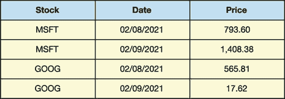
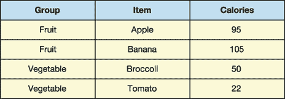

# 7 MultiIndex DataFrames

本章涵盖了

+   创建 `MultiIndex`

+   从 `MultiIndex DataFrame` 中选择行和列

+   从 `MultiIndex DataFrame` 中提取横截面

+   交换 `MultiIndex` 级别

到目前为止，在我们的 pandas 之旅中，我们已经探索了一维的 `Series` 和二维的 `DataFrame`。维数的数量是我们从数据结构中提取值所需的参考点数量。在 `Series` 中定位一个值只需要一个标签或一个索引位置。在 `DataFrame` 中定位一个值需要两个参考点：行和列的标签/索引。我们能否超越二维？绝对可以！Pandas 通过使用 `MultiIndex` 支持任何数量的维度的数据集。

`MultiIndex` 是一个包含多个级别的索引对象。每个级别存储行的值。当值的组合为数据行提供最佳标识符时，使用 `MultiIndex` 是最理想的。考虑图 7.1 中的数据集，它存储了多个日期的股票价格。



图 7.1 示例数据集，包含股票、日期和价格列

假设我们想要为每个价格找到一个唯一标识符。仅股票名称或日期本身都不足以作为标识，但两者的组合则是一个很好的选择。股票 `"MSFT"` 出现了两次，日期 `"02/08/2021"` 也出现了两次，但 `"MSFT"` 和 `"02/08/2021"` 的组合只出现了一次。存储股票和日期列值的 `MultiIndex` 对这个数据集非常适合。

`MultiIndex` 也非常适合层次数据——其中一列的值是另一列值的子类别的数据。考虑图 7.2 中的数据集。



图 7.2 示例数据集，包含组、项目和卡路里列

项目列的值是组列值的子类别。苹果是一种水果，西兰花是一种蔬菜。因此，组和项目列可以作为 `MultiIndex` 组合。

`MultiIndex` 是 pandas 中一个不太为人所知的功能，但值得花时间去学习。引入多个索引级别为我们如何切片和切块数据集增加了许多灵活性。

## 7.1 MultiIndex 对象

让我们打开一个新的 Jupyter Notebook，导入 pandas 库，并将其分配别名 `pd`：

```
In  [1] import pandas as pd
```

为了保持简单，我们将从零开始创建一个 `MultiIndex` 对象。在第 7.2 节中，我们将在导入的数据集上练习这些概念。

你还记得 Python 的内置元组对象吗？元组是一个不可变的数据结构，它按顺序存储一系列值。元组实际上是一个在创建后不能修改的列表。要深入了解这个数据结构，请参阅附录 B。

假设我们想要模拟一个街道地址。地址通常包括街道名称、城市、镇和邮政编码。我们可以将这些四个元素存储在一个元组中：

```
In  [2] address = ("8809 Flair Square", "Toddside", "IL", "37206")
        address

Out [2] ('8809 Underwood Squares', 'Toddside', 'IL', '37206')
```

`Series`和`DataFrame`的索引可以存储各种数据类型：字符串、数字、日期和时间等。但所有这些对象在每个索引位置只能存储一个值，每行一个标签。元组没有这个限制。

如果我们在一个列表中收集多个元组呢？列表看起来会是这样：

```
In  [3] addresses = [
            ("8809 Flair Square", "Toddside", "IL", "37206"),
            ("9901 Austin Street", "Toddside", "IL", "37206"),
            ("905 Hogan Quarter", "Franklin", "IL", "37206"),
        ]
```

现在想象这些元组作为`DataFrame`的索引标签。我希望这个想法不会太令人困惑。所有操作都保持不变。我们仍然可以通过索引标签来引用一行，但每个索引标签都是一个包含多个元素的容器。这是一个很好的方式来开始思考`MultiIndex`对象——作为一个每个标签可以存储多个数据的索引。

我们可以独立于`Series`或`DataFrame`创建`MultiIndex`对象。`MultiIndex`类作为 pandas 库的一个顶级属性可用。它包括一个`from_tuples`类方法，可以从元组列表中实例化一个`MultiIndex`。*类方法*是我们对一个类而不是一个实例调用的方法。下一个例子调用了`from_tuples`类方法，并传递了`addresses`列表：

```
In  [4] # The two lines below are equivalent
        pd.MultiIndex.from_tuples(addresses)
        pd.MultiIndex.from_tuples(tuples = addresses)

Out [4] MultiIndex([( '8809 Flair Square',   'Toddside', 'IL', '37206'),
                    ('9901 Austin Street',   'Toddside', 'IL', '37206'),
                    ( '905 Hogan Quarter',   'Franklin', 'IL', '37206')],
                   )
```

我们有了第一个`MultiIndex`，它存储了三个包含四个元素的元组。每个元组的元素都有一个一致的规律：

+   第一个值是地址。

+   第二个值是城市。

+   第三个值是州。

+   第四个值是邮政编码。

在 pandas 术语中，相同位置上的元组值的集合形成`MultiIndex`的一个`level`。在之前的例子中，第一个`MultiIndex`级别由值`"8809 Flair Square"`、`"9901 Austin Street"`和`"905 Hogan Quarter"`组成。同样，第二个`MultiIndex`级别由`"Toddside"`、`"Toddside"`和`"Franklin"`组成。

我们可以通过传递一个列表给`from_tuples`方法的`names`参数来给每个`MultiIndex`级别分配一个名称。在这里，我们分配了名称"`Street"`、`"City"`、`"State"`和`"Zip"`：

```
In  [5] row_index = pd.MultiIndex.from_tuples(
            tuples = addresses,
            names = ["Street", "City", "State", "Zip"]
        )

        row_index

Out [5] MultiIndex([( '8809 Flair Square',   'Toddside', 'IL', '37206'),
                    ('9901 Austin Street',   'Toddside', 'IL', '37206'),
                    ( '905 Hogan Quarter',   'Franklin', 'IL', '37206')],
                    names=['Street', 'City', 'State', 'Zip'])
```

总结一下，`MultiIndex`是一个存储容器，其中每个标签包含多个值。一个级别由标签中相同位置的值组成。

现在我们有了`MultiIndex`，让我们将其附加到一个`DataFrame`上。最简单的方法是使用`DataFrame`构造函数的`index`参数。我们在前面的章节中传递了这个参数一个字符串列表，但它也接受任何有效的索引对象。让我们传递给它分配给`row_index`变量的`MultiIndex`。因为我们的`MultiIndex`有三个元组（或者说，相当于三个标签），我们需要提供三行数据：

```
In  [6] data = [
            ["A", "B+"],
            ["C+", "C"],
            ["D-", "A"],
        ]

        columns = ["Schools", "Cost of Living"]

        area_grades = pd.DataFrame(
            data = data, index = row_index, columns = columns
        )

        area_grades

Out [6]

 **Schools Cost of Living**
Street             City     State Zip
8809 Flair Square  Toddside IL    37206       A             B+
9901 Austin Street Toddside IL    37206      C+              C
905 Hogan Quarter  Franklin IL    37206      D-              A
```

我们有一个在行轴上有`MultiIndex`的`DataFrame`。每一行的标签包含四个值：街道、城市、州和邮政编码。

让我们把注意力转向列轴。Pandas 将`DataFrame`的列标题存储在一个索引对象中。我们可以通过`columns`属性访问该索引：

```
In  [7] area_grades.columns

Out [7] Index(['Schools', 'Cost of Living'], dtype='object')
```

Pandas 目前将两个列名存储在单级`Index`对象中。让我们创建第二个`MultiIndex`并将其附加到列轴。下一个示例再次调用`from_tuples`类方法，传递一个包含四个元组的列表。每个元组包含两个字符串：

```
In  [8] column_index = pd.MultiIndex.from_tuples(
             [
                 ("Culture", "Restaurants"),
                 ("Culture", "Museums"),
                 ("Services", "Police"),
                 ("Services", "Schools"),
             ]
         )

         column_index

Out [8] MultiIndex([( 'Culture', 'Restaurants'),
                    ( 'Culture',     'Museums'),
                    ('Services',      'Police'),
                    ('Services',     'Schools')],
                   )
```

让我们将两个`MultiIndex`都附加到一个`DataFrame`上。行轴的`MultiIndex`（`row_index`）要求数据集包含三行。列轴的`MultiIndex`（`column_index`）要求数据集包含四列。因此，我们的数据集必须具有 3 x 4 的形状。让我们创建这个样本数据。下一个示例声明了一个包含三个列表的列表。每个嵌套列表存储四个字符串：

```
In  [9] data = [
            ["C-", "B+", "B-", "A"],
            ["D+", "C", "A", "C+"],
            ["A-", "A", "D+", "F"]
        ]
```

我们已经准备好将各个部分组合起来，创建一个在行和列轴上都有`MultiIndex`的`DataFrame`。在`DataFrame`构造函数中，我们将各自的`MultiIndex`变量传递给`index`和`columns`参数：

```
In  [10] pd.DataFrame(
             data = data, index = row_index, columns = column_index
         )

Out [10]

                                    Culture               Services
                                    Restaurants Museums   Police Schools
**Street       City       State Zip** 
8809 Flai... Toddside   IL    37206          C-      B+       B-       A
9901 Aust... Toddside   IL    37206          D+       C        A      C+
905 Hogan... Franklin   IL    37206          A-       A       D+       F
```

欢呼！我们已经成功创建了一个具有四级行`MultiIndex`和二级列`MultiIndex`的`DataFrame`。`MultiIndex`是一个可以存储多个级别、多个层级的索引。每个索引标签由多个组件组成。这就是全部内容。

## 7.2 多级索引 DataFrame

让我们稍微扩大一下范围。neighborhoods.csv 数据集与我们第 7.1 节中创建的数据集类似；它列出了美国各地约 250 个虚构地址。每个地址根据四个宜居特性进行评级：餐馆、博物馆、警察局和学校。这四个评级分为两个父类别：文化和服务。

这是原始 CSV 文件前几行的预览。在 CSV 中，逗号分隔数据行中的每两个后续值。因此，连续逗号之间没有内容表示缺失值：

```
,,,Culture,Culture,Services,Services
,,,Restaurants,Museums,Police,Schools
State,City,Street,,,,
MO,Fisherborough,244 Tracy View,C+,F,D-,A+
```

Pandas 如何导入这个 CSV 文件的数据？让我们用`read_csv`函数来找出答案：

```
In  [11] neighborhoods = pd.read_csv("neighborhoods.csv")
         neighborhoods.head()

Out [11]

 **Unnamed: 0  Unnamed: 1  Unnamed: 2    Culture Culture.1 Services Services.1**
0        NaN         NaN         NaN  Restau...   Museums   Police    Schools
1      State        City      Street        NaN       NaN      NaN        NaN
2         MO   Fisher...   244 Tr...         C+         F       D-         A+
3         SD   Port C...   446 Cy...         C-         B        B         D+
4         WV   Jimene...   432 Jo...          A        A+        F          B
```

这里有些不对劲！首先，我们有三个未命名的列，每个列都以不同的数字结尾。当导入 CSV 时，pandas 假设文件的第一行包含列名，也称为标题。如果一个标题槽没有值，pandas 会将其分配一个标题为“未命名”的列名。同时，库试图避免重复的列名。为了区分多个缺失的标题，库会给每个标题添加一个数字索引。因此，我们有三个未命名的列：未命名：0、未命名：1 和未命名：2。

右侧的四列也存在相同的命名问题。注意，pandas 将标题为“文化”的列分配给索引 3，并将其后的列命名为“文化 1”。CSV 文件在行中有两个标题单元格具有相同的“文化”值，然后是两行标题单元格具有相同的“服务”值。

不幸的是，这还不是我们的问题的终点。在行 0 中，前三个列都包含一个 `NaN` 值。在行 1 中，最后四个列都存在 `NaN` 值。问题是 CSV 正在尝试模拟一个多级行索引和多级列索引，但 `read_csv` 函数参数的默认值不识别它。幸运的是，我们可以通过更改 `read_csv` 参数的值来解决这个问题。

首先，我们必须告诉 pandas，前三个列应该作为 `DataFrame` 的索引。我们可以通过将一个包含数字的列表传递给 `index_col` 参数来实现，每个数字代表一个列的索引（或数字位置），该列应包含在 `DataFrame` 的索引中。索引从 0 开始计数。因此，前三个列（未命名的列）将具有索引位置 0、1 和 2。当我们传递一个包含多个值的 `index_col` 列表时，pandas 会自动为 `DataFrame` 创建一个 `MultiIndex`：

```
In  [12] neighborhoods = pd.read_csv(
             "neighborhoods.csv",
             index_col = [0, 1, 2]
         )

         neighborhoods.head()

Out [12]
 **Culture Culture.1 Services Services.1**
NaN   NaN           NaN           Restaurants   Museums   Police    Schools
State City          Street                NaN       NaN      NaN        NaN
MO    Fisherbor...  244 Tracy...           C+         F       D-         A+
SD    Port Curt...  446 Cynth...           C-         B        B         D+
WV    Jimenezview   432 John ...            A        A+        F          B
```

我们已经完成了一半。接下来，我们需要告诉 pandas 我们想要用于 `DataFrame` 标题的数据集行。`read_csv` 函数假设只有第一行将包含标题。在这个数据集中，前两行将包含标题。我们可以使用 `read_csv` 函数的 `header` 参数自定义 `DataFrame` 的标题，该参数接受一个整数列表，表示 pandas 应将其设置为列标题的 `rows`。如果我们提供一个包含多个元素的列表，pandas 将将一个 `MultiIndex` 分配给列。下一个示例将前两行（索引 0 和 1）设置为列标题：

```
In  [13] neighborhoods = pd.read_csv(
             "neighborhoods.csv",
             index_col = [0, 1, 2],
             header = [0, 1]
         )

         neighborhoods.head()

Out [13]
                                           Culture         Services
                                      Restaurants Museums   Police Schools
**State City             Street** 
MO    Fisherborough    244 Tracy View           C+       F       D-      A+
SD    Port Curtisv...  446 Cynthia ...          C-       B        B      D+
WV    Jimenezview      432 John Common           A      A+        F       B
AK    Stevenshire      238 Andrew Rue           D-       A       A-      A-
ND    New Joshuaport   877 Walter Neck          D+      C-        B       B
```

现在我们有了一些可以操作的东西！

如前所述，数据集将四个可居住性特征（餐馆、博物馆、警察和学校）分为两类（文化和服务）。当我们有一个包含较小子类别的父类别时，创建一个 `MultiIndex` 是实现快速切片的最佳方式。

让我们调用一些熟悉的方法来观察 `MultiIndex` `DataFrame` 的输出如何变化。`info` 方法是一个很好的起点：

```
In  [14] neighborhoods.info()

Out [14]

<class 'pandas.core.frame.DataFrame'>
MultiIndex: 251 entries, ('MO', 'Fisherborough', '244 Tracy View') to ('NE', 'South Kennethmouth', '346 Wallace Pass')
Data columns (total 4 columns):
 #   Column                  Non-Null Count  Dtype
---  ------                  --------------  -----
 0   (Culture, Restaurants)  251 non-null    object
 1   (Culture, Museums)      251 non-null    object
 2   (Services, Police)      251 non-null    object
 3   (Services, Schools)     251 non-null    object
dtypes: object(4)
memory use: 27.2+ KB
```

注意，pandas 将每个列名打印为一个包含两个元素的元组，例如 `(Culture, Restaurants)`。同样，库将每行的标签存储为一个包含三个元素的元组，例如 `('MO', 'Fisherborough', '244 Tracy View')`。

我们可以通过熟悉的 `index` 属性访问行的 `MultiIndex` 对象。输出使我们能够看到包含每行值的元组：

```
In  [15] neighborhoods.index

Out [15] MultiIndex([
            ('MO',       'Fisherborough',        '244 Tracy View'),
            ('SD',    'Port Curtisville',     '446 Cynthia Inlet'),
            ('WV',         'Jimenezview',       '432 John Common'),
            ('AK',         'Stevenshire',        '238 Andrew Rue'),
            ('ND',      'New Joshuaport',       '877 Walter Neck'),
            ('ID',          'Wellsville',   '696 Weber Stravenue'),
            ('TN',           'Jodiburgh',    '285 Justin Corners'),
            ('DC',    'Lake Christopher',   '607 Montoya Harbors'),
            ('OH',           'Port Mike',      '041 Michael Neck'),
            ('ND',          'Hardyburgh', '550 Gilmore Mountains'),
            ...
            ('AK', 'South Nicholasshire',      '114 Jones Garden'),
            ('IA',     'Port Willieport',  '320 Jennifer Mission'),
            ('ME',          'Port Linda',        '692 Hill Glens'),
            ('KS',          'Kaylamouth',       '483 Freeman Via'),
            ('WA',      'Port Shawnfort',    '691 Winters Bridge'),
            ('MI',       'North Matthew',      '055 Clayton Isle'),
            ('MT',             'Chadton',     '601 Richards Road'),
            ('SC',           'Diazmouth',     '385 Robin Harbors'),
            ('VA',          'Laurentown',     '255 Gonzalez Land'),
            ('NE',  'South Kennethmouth',      '346 Wallace Pass')],
           names=['State', 'City', 'Street'], length=251)
```

我们可以通过 `columns` 属性访问列的 `MultiIndex` 对象，该属性也使用元组来存储嵌套的列标签：

```
In  [16] neighborhoods.columns

Out [16] MultiIndex([( 'Culture', 'Restaurants'),
            ( 'Culture',     'Museums'),
            ('Services',      'Police'),
            ('Services',     'Schools')],
           )
```

在其内部，pandas 从多个 `Index` 对象中组合一个 `MultiIndex`。在导入数据集时，库为每个 `Index` 从 CSV 标题分配了一个名称。我们可以通过 `MultiIndex` 对象上的 `names` 属性访问索引名称列表。州、市和街道是成为我们索引的三个 CSV 列的名称：

```
In  [17] neighborhoods.index.names

Out [17] FrozenList(['State', 'City', 'Street'])
```

Pandas 为 `MultiIndex` 中的每个嵌套层级分配一个顺序。在我们的当前 `neighborhoods` `DataFrame` 中，

+   州层级有一个索引位置为 0。

+   城市层级有一个索引位置为 1。

+   街道层级有一个索引位置为 2。

`get_level_values` 方法从 `MultiIndex` 的给定层级中提取 `Index` 对象。我们可以传递层级的索引位置或层级的名称给方法的第一个也是唯一的参数 `level`：

```
In  [18] # The two lines below are equivalent
         neighborhoods.index.get_level_values(1)
         neighborhoods.index.get_level_values("City")

Out [18] Index(['Fisherborough', 'Port Curtisville', 'Jimenezview',
                'Stevenshire', 'New Joshuaport', 'Wellsville', 'Jodiburgh',
                'Lake Christopher', 'Port Mike', 'Hardyburgh',
                ...
                'South Nicholasshire', 'Port Willieport', 'Port Linda',
                'Kaylamouth', 'Port Shawnfort', 'North Matthew', 'Chadton',
                'Diazmouth', 'Laurentown', 'South Kennethmouth'],
               dtype='object', name='City', length=251)
```

列的 `MultiIndex` 层级没有名称，因为 CSV 没有提供任何：

```
In  [19] neighborhoods.columns.names

Out [19] FrozenList([None, None])
```

让我们解决这个问题。我们可以使用 `columns` 属性访问列的 `MultiIndex`。然后我们可以将新的列名列表分配给 `MultiIndex` 对象的 `names` 属性。名称 `"Category"` 和 `"Subcategory"` 似乎很适合这里：

```
In  [20] neighborhoods.columns.names = ["Category", "Subcategory"]
         neighborhoods.columns.names

Out [20] FrozenList(['Category', 'Subcategory'])
```

层级名称将出现在输出中的列标题左侧。让我们调用 `head` 方法来看看区别：

```
In  [21] neighborhoods.head(3)

Out [21]

Category                            Culture         Services
Subcategory                     Restaurants Museums   Police Schools
**State City         Street** 
MO    Fisherbor... 244 Tracy...          C+       F       D-      A+
SD    Port Curt... 446 Cynth...          C-       B        B      D+
WV    Jimenezview  432 John ...           A      A+        F       B
```

现在我们已经为层级分配了名称，我们可以使用 `get_level_values` 方法从列的 `MultiIndex` 中检索任何 `Index`。记住，我们可以传递列的索引位置或列的名称给该方法：

```
In  [22] # The two lines below are equivalent
         neighborhoods.columns.get_level_values(0)
         neighborhoods.columns.get_level_values("Category")

Out [22] Index(['Culture', 'Culture', 'Services', 'Services'],
         dtype='object', name='Category')
```

`MultiIndex` 将延续到从数据集派生的新对象。索引可以根据操作切换轴。考虑 `DataFrame` 的 `nunique` 方法，它返回一个 `Series`，其中包含每列唯一值的计数。如果我们对 `neighborhoods` 调用 `nunique`，`DataFrame` 的列 `MultiIndex` 将交换轴，并在结果 `Series` 中作为行的 `MultiIndex`：

```
In  [23] neighborhoods.head(1)

Out [23]

Category                                 Culture         Services
Subcategory                          Restaurants Museums   Police Schools
**State City           Street** 
AK    Rowlandchester 386 Rebecca ...          C-      A-       A+       C

In  [24] neighborhoods.nunique()

Out [24] Culture   Restaurants    13
                   Museums        13
         Services  Police         13
                   Schools        13
         dtype: int64
```

`MultiIndex` `Series` 告诉我们 Pandas 在每个四个列中找到了多少唯一值。在这种情况下，值是相等的，因为所有四个列都包含了 13 种可能的等级（A+ 到 F）。

## 7.3 对 MultiIndex 排序

Pandas 在有序集合中查找值比在杂乱无章的集合中快得多。一个很好的类似例子是在字典中查找单词。当单词按字母顺序排列时，比随机序列更容易找到单词。因此，在从 `DataFrame` 中选择任何行和列之前对索引进行排序是最佳的。

第四章介绍了用于对 `DataFrame` 排序的 `sort_index` 方法。当我们对 `MultiIndex` `DataFrame` 调用该方法时，pandas 按升序对所有层级进行排序，并从外部开始进行。在下一个示例中，pandas 首先对州级值进行排序，然后对城市级值进行排序，最后对街道级值进行排序：

```
In  [25] neighborhoods.sort_index()

Out [25]

Category                                  Culture         Services
Subcategory                           Restaurants Museums   Police Schools
**State City            Street** 
AK    Rowlandchester 386 Rebecca ...          C-      A-       A+        C
      Scottstad      082 Leblanc ...           D      C-        D       B+
                     114 Jones Ga...          D-      D-        D        D
      Stevenshire    238 Andrew Rue           D-       A       A-       A-
AL    Clarkland      430 Douglas ...           A       F       C+       B+
 ...       ...           ...                  ...     ...      ...     ...
WY    Lake Nicole    754 Weaver T...           B      D-        B        D
                     933 Jennifer...           C      A+       A-        C
      Martintown     013 Bell Mills           C-       D       A-       B-
      Port Jason     624 Faulkner...          A-       F       C+       C+
      Reneeshire     717 Patel Sq...           B      B+        D        A

251 rows × 4 columns
```

让我们确保我们理解输出。首先，pandas 针对州层级，在 `"AK"` 和 `"AL"` 之间对值 `"AK"` 进行排序。然后，在 `"AK"` 州内，pandas 在 `"Rowlandchester"` 和 `"Scottstad"` 之间对城市进行排序。它将相同的逻辑应用于最终层级，街道。

`sort_values` 方法包含一个 `ascending` 参数。我们可以传递一个布尔值给该参数，以对所有 `MultiIndex` 层次应用一致的排序顺序。下一个示例提供了一个 `False` 参数。Pandas 将州值按逆字母顺序排序，然后是城市值按逆字母顺序排序，最后是街道值按逆字母顺序排序：

```
In  [26] neighborhoods.sort_index(ascending = False).head()

Out [26]

Category                              Culture         Services
Subcategory                       Restaurants Museums   Police Schools
**State City        Street** 
WY    Reneeshire  717 Patel Sq...           B      B+        D       A
      Port Jason  624 Faulkner...          A-       F       C+      C+
      Martintown  013 Bell Mills           C-       D       A-      B-
      Lake Nicole 933 Jennifer...           C      A+       A-       C
                  754 Weaver T...           B      D-        B       D
```

假设我们想要为不同的层次改变排序顺序。我们可以将布尔值列表传递给 `ascending` 参数。每个布尔值设置下一个 `MultiIndex` 层次的排序顺序，从最外层开始，向内进行。例如，`[True, False, True]` 参数将按升序对州层次进行排序，按降序对城市层次进行排序，按升序对街道层次进行排序：

```
In  [27] neighborhoods.sort_index(ascending = [True, False, True]).head()

Out [27]

Category                                 Culture         Services
Subcategory                          Restaurants Museums   Police Schools
**State City           Street** 
AK    Stevenshire    238 Andrew Rue           D-       A       A-      A-
      Scottstad      082 Leblanc ...           D      C-        D      B+
                     114 Jones Ga...          D-      D-        D       D
      Rowlandchester 386 Rebecca ...          C-      A-       A+       C
AL    Vegaside       191 Mindy Me...          B+      A-       A+      D+
```

我们还可以单独对 `MultiIndex` 层次进行排序。假设我们想要按第二个 `MultiIndex` 层次，即城市中的值对行进行排序。我们可以将层次索引位置或其名称传递给 `sort_index` 方法的 `level` 参数。Pandas 在排序时会忽略剩余的层次：

```
In  [28] # The two lines below are equivalent
         neighborhoods.sort_index(level = 1)
         neighborhoods.sort_index(level = "City")

Out [28]

Category                                Culture         Services
Subcategory                         Restaurants Museums   Police Schools
**State City          Street** 
AR    Allisonland   124 Diaz Brooks          C-      A+        F      C+
GA    Amyburgh      941 Brian Ex...           B       B       D-      C+
IA    Amyburgh      163 Heather ...           F       D       A+      A-
ID    Andrewshire   952 Ellis Drive          C+      A-       C+       A
UT    Baileyfort    919 Stewart ...          D+      C+        A       C
 ...      ...           ...                 ...     ...      ...     ...
NC    West Scott    348 Jack Branch          A-      D-       A-       A
SD    West Scott    139 Hardy Vista          C+      A-       D+      B-
IN    Wilsonborough 066 Carr Road            A+      C-        B       F
NC    Wilsonshire   871 Christop...          B+       B       D+       F
NV    Wilsonshire   542 Jessica ...           A      A+       C-      C+

251 rows × 4 columns
```

`level` 参数也接受一个层次列表。下一个示例首先按城市层次排序，然后按街道层次排序。州层次的值对排序没有任何影响：

```
In  [29] # The two lines below are equivalent
         neighborhoods.sort_index(level = [1, 2]).head()
         neighborhoods.sort_index(level = ["City", "Street"]).head()

Out [29]

Category                              Culture         Services
Subcategory                       Restaurants Museums   Police Schools
**State City        Street** 
AR    Allisonland 124 Diaz Brooks          C-      A+        F      C+
IA    Amyburgh    163 Heather ...           F       D       A+      A-
GA    Amyburgh    941 Brian Ex...           B       B       D-      C+
ID    Andrewshire 952 Ellis Drive          C+      A-       C+       A
VT    Baileyfort  831 Norma Cove            B      D+       A+      D+
```

我们还可以组合 `ascending` 和 `level` 参数。注意在前面的示例中，pandas 按字母/升序对艾姆伯赫市（"163 Heather Neck" 和 "941 Brian Expressway"）的两个街道值进行了排序。下一个示例按升序对城市层次进行排序，按降序对街道层次进行排序，从而交换了两个艾姆伯赫街道值的位置：

```
In  [30] neighborhoods.sort_index(
             level = ["City", "Street"], ascending = [True, False]
         ).head()

Out [30]

Category                              Culture         Services
Subcategory                       Restaurants Museums   Police Schools
**State City        Street** 
AR    Allisonland 124 Diaz Brooks          C-      A+        F      C+
GA    Amyburgh    941 Brian Ex...           B       B       D-      C+
IA    Amyburgh    163 Heather ...           F       D       A+      A-
ID    Andrewshire 952 Ellis Drive          C+      A-       C+       A
UT    Baileyfort  919 Stewart ...          D+      C+        A       C
```

我们还可以通过向 `sort_index` 方法提供 `axis` 参数来对列的 `MultiIndex` 进行排序。参数的默认值是 `0`，代表行索引。要排序列，我们可以传递数字 `1` 或字符串 `"columns"`。在下一个示例中，pandas 首先按类别层次排序，然后按子类别层次排序。文化值在服务之前。在文化层次内，博物馆值在餐馆之前。在服务中，警察值在学校之前：

```
In  [31] # The two lines below are equivalent
         neighborhoods.sort_index(axis = 1).head(3)
         neighborhoods.sort_index(axis = "columns").head(3)

Out [31]

Category                              Culture             Services
Subcategory                           Museums Restaurants   Police Schools
**State City            Street** 
MO    Fisherborough   244 Tracy View        F          C+       D-      A+
SD    Port Curtisv... 446 Cynthia ...       B          C-        B      D+
WV    Jimenezview     432 John Common      A+           A        F       B
```

我们可以将 `level` 和 `ascending` 参数与 `axis` 参数结合使用，以进一步自定义列的排序顺序。下一个示例按降序对子类别层次值进行排序。Pandas 忽略类别层次中的值。子类别（"Schools"、"Restaurants"、"Police" 和 "Museums"）的逆字母顺序强制视觉上分割类别组。因此，输出会多次打印服务和文化列标题：

```
In  [32] neighborhoods.sort_index(
             axis = 1, level = "Subcategory", ascending = False
         ).head(3)

Out [32]

Category                              Services     Culture Services Culture
Subcategory                            Schools Restaurants   Police Museums
**State City            Street** 
MO    Fisherborough   244 Tracy View        A+          C+       D-       F
SD    Port Curtisv... 446 Cynthia ...       D+          C-        B       B
WV    Jimenezview     432 John Common        B           A        F      A+
```

在第 7.4 节中，我们将学习如何使用熟悉的访问器属性（如 `loc` 和 `iloc`）从 `MultiIndex` `DataFrame` 中提取行和列。如前所述，在我们查找任何行之前对索引进行排序是最佳做法。让我们按升序排序 `MultiIndex` 级别，并覆盖我们的 `neighborhoods` `DataFrame`：

```
In  [33] neighborhoods = neighborhoods.sort_index(ascending = True)
```

这是结果：

```
In  [34] neighborhoods.head(3)

Out [34]

Category                                 Culture         Services
Subcategory                          Restaurants Museums   Police Schools
**State City           Street** 
AK    Rowlandchester 386 Rebecca ...          C-      A-       A+       C
      Scottstad      082 Leblanc ...           D      C-        D      B+
                     114 Jones Ga...          D-      D-        D       D
```

看起来不错。我们已经对 `MultiIndex` 中的每个级别进行了排序，可以继续进行。

## 7.4 使用多级索引进行选择

当涉及多个级别时，从 `DataFrame` 中提取行和列会变得复杂。在编写任何代码之前，我们需要问的关键问题是我们要提取什么。

第四章介绍了从 `DataFrame` 中选择列的方括号语法。这里有一个快速提醒。以下代码创建了一个包含两行两列的 `DataFrame`：

```
In  [35] data = [
             [1, 2],
             [3, 4]
         ]

         df = pd.DataFrame(
             data = data, index = ["A", "B"], columns = ["X", "Y"]
         )

         df

Out [35]

 **X  Y**
A  1  2
B  3  4
```

方括号语法从 `DataFrame` 中提取一列作为 `Series`：

```
In  [36] df["X"]

Out [36] A    1
         B    3
         Name: X, dtype: int64
```

假设我们想从 `neighborhoods` 中提取一列。`DataFrame` 中的四个列都需要两个标识符的组合：一个类别和一个子类别。如果我们只传递一个标识符会发生什么？

### 7.4.1 提取一个或多个列

如果我们在方括号中传递单个值，pandas 将在列的 `MultiIndex` 的最外层级别中查找它。以下示例搜索 `"Services"`，这是类别级别中的一个有效值：

```
In  [37] neighborhoods["Services"]

Out [37]

Subcategory                               Police Schools
**State City           Street** 
AK    Rowlandchester 386 Rebecca Cove         A+       C
      Scottstad      082 Leblanc Freeway       D      B+
                     114 Jones Garden          D       D
      Stevenshire    238 Andrew Rue           A-      A-
AL    Clarkland      430 Douglas Mission      C+      B+
 ...       ...       ...        ...          ...     ...
WY    Lake Nicole    754 Weaver Turnpike       B       D
                     933 Jennifer Burg        A-       C
      Martintown     013 Bell Mills           A-      B-
      Port Jason     624 Faulkner Orchard     C+      C+
      Reneeshire     717 Patel Square          D       A

251 rows × 2 columns
```

注意，新的 `DataFrame` 没有类别级别。它有一个简单的 `Index`，包含两个值："Police" 和 "Schools"。不再需要 `MultiIndex`；在这个 `DataFrame` 中的两列是隶属于服务值的子类别。类别级别不再有任何值得列出的变化。

如果值不存在于列的 `MultiIndex` 的最外层级别，Pandas 将引发 `KeyError` 异常：

```
In  [38] neighborhoods["Schools"]

---------------------------------------------------------------------------
KeyError                                  Traceback (most recent call last)

KeyError: 'Schools'
```

如果我们想针对特定的类别，然后在该类别中针对子类别，我们应该怎么办？为了在列的 `MultiIndex` 的多个级别中指定值，我们可以将它们放在一个元组中。下一个示例针对类别级别中的值为 `"Services"` 和子类别级别中的值为 `"Schools"` 的列：

```
In  [39] neighborhoods[("Services", "Schools")]

Out [39] State  City            Street
         AK     Rowlandchester  386 Rebecca Cove         C
                Scottstad       082 Leblanc Freeway     B+
                                114 Jones Garden         D
                Stevenshire     238 Andrew Rue          A-
         AL     Clarkland       430 Douglas Mission     B+
                                                        ..
         WY     Lake Nicole     754 Weaver Turnpike      D
                                933 Jennifer Burg        C
                Martintown      013 Bell Mills          B-
                Port Jason      624 Faulkner Orchard    C+
                Reneeshire      717 Patel Square         A
         Name: (Services, Schools), Length: 251, dtype: object
```

该方法返回一个不带列索引的 `Series`！再次强调，当我们为 `MultiIndex` 级别提供一个值时，我们消除了该级别存在的必要性。我们明确告诉 pandas 在类别和子类别级别中要针对哪些值，因此库从列索引中删除了这两个级别。因为 `("Services", "Schools")` 组合产生了一个数据列，所以 pandas 返回了一个 `Series` 对象。

要提取多个 `DataFrame` 列，我们需要向方括号传递一个元组列表。列表中的每个元组应指定一个列的级别值。列表中元组的顺序设置了结果 `DataFrame` 中列的顺序。下一个示例从 `neighborhoods` 中提取两列：

```
In  [40] neighborhoods[[("Services", "Schools"), ("Culture", "Museums")]]

Out [40]

Category                                  Services Culture
Subcategory                                Schools Museums
**State City           Street** 
AK    Rowlandchester 386 Rebecca Cove            C      A-
      Scottstad      082 Leblanc Freeway        B+      C-
                     114 Jones Garden            D      D-
      Stevenshire    238 Andrew Rue             A-       A
AL    Clarkland      430 Douglas Mission        B+       F
 ...       ...       ...          ...          ...     ...
WY    Lake Nicole    754 Weaver Turnpike         D      D-
                     933 Jennifer Burg           C      A+
      Martintown     013 Bell Mills             B-       D
      Port Jason     624 Faulkner Orchard       C+       F
      Reneeshire     717 Patel Square            A      B+

251 rows × 2 columns
```

Syntax tends to become confusing and error-prone when it involves multiple parentheses and brackets. We can simplify the preceding code by assigning the list to a variable and breaking its tuples across several lines:

```
In  [41] columns = [
             ("Services", "Schools"),
             ("Culture", "Museums")
         ]

         neighborhoods[columns]

Out [41]

Category                                  Services Culture
Subcategory                                Schools Museums
**State City           Street** 
AK    Rowlandchester 386 Rebecca Cove            C      A-
      Scottstad      082 Leblanc Freeway        B+      C-
                     114 Jones Garden            D      D-
      Stevenshire    238 Andrew Rue             A-       A
AL    Clarkland      430 Douglas Mission        B+       F
 ...        ...      ...      ...               ...    ...
WY    Lake Nicole    754 Weaver Turnpike         D      D-
                     933 Jennifer Burg           C      A+
      Martintown     013 Bell Mills             B-       D
      Port Jason     624 Faulkner Orchard       C+       F
      Reneeshire     717 Patel Square            A      B+

251 rows × 2 columns
```

The previous two examples accomplish the same result, but this code is significantly easier to read; its syntax clearly identifies where each tuple begins and ends.

### 7.4.2 提取一个或多个行使用 loc

Chapter 4 introduced the `loc` and `iloc` accessors for selecting rows and columns from a `DataFrame`. The `loc` accessor extracts by index label, and the `iloc` accessor extracts by index position. Here’s a quick review, using the `df` `DataFrame` we declared in section 7.4.1:

```
In  [42] df

Out [42]

 **X  Y**
A  1  2
B  3  4
```

The next example uses `loc` to select the row with an index label of `"A"`:

```
In  [43] df.loc["A"]

Out [43] X    1
         Y    2
         Name: A, dtype: int64
```

下一个示例使用 `iloc` 来选择索引位置为 1 的行：

```
In  [44] df.iloc[1]

Out [44] X    3
         Y    4
         Name: B, dtype: int64
```

We can use the `loc` and `iloc` accessors to pull rows from a `MultiIndex` `DataFrame`. Let’s start slow and work our way up.

The neighborhoods `DataFrame`’s `MultiIndex` has three levels: State, City, and Address. If we know the values to target in each level, we can pass them in a tuple within the square brackets. When we provide a value for a level, we remove the need for the level to exist in the result. The next example provides `"TX"` for the State level, `"Kingchester"` for the City level, and `"534 Gordon Falls"` for the Address level. Pandas returns a `Series` object with an index constructed from the column headers in neighborhoods:

```
In  [45] neighborhoods.loc[("TX", "Kingchester", "534 Gordon Falls")]

Out [45] Category  Subcategory
         Culture   Restaurants     C
                   Museums        D+
         Services  Police          B
                   Schools         B
         Name: (TX, Kingchester, 534 Gordon Falls), dtype: object
```

If we pass a single label in the square brackets, pandas looks for it in the outermost `MultiIndex` level. The next example selects the rows with a State value of `"CA"`. State is the first level of the rows’ `MultiIndex`:

```
In  [46] neighborhoods.loc["CA"]

Out [46]

Category                           Culture         Services
Subcategory                    Restaurants Museums   Police Schools
**City           Street** 
Dustinmouth    793 Cynthia ...          A-      A+       C-       A
North Jennifer 303 Alisha Road          D-      C+       C+      A+
Ryanfort       934 David Run             F      B+        F      D-
```

Pandas returns a `DataFrame` with a two-level `MultiIndex`. Notice that the State level is not present. There is no longer a need for it because all three rows belong to that level; there is no longer any variation to display.

Usually, the second argument to the square brackets denotes the column(s) we’d like to extract, but we can also provide the value to look for in the next `MultiIndex` level. The next example targets rows with a State value of `"CA"` and a City value of `"Dustinmouth"`. Once again, pandas returns a `DataFrame` with one fewer level. Because only one level is left, pandas falls back to a plain `Index` object to store the row labels from the Street level:

```
In  [47] neighborhoods.loc["CA", "Dustinmouth"]

Out [47]

Category               Culture         Services
Subcategory        Restaurants Museums   Police Schools
**Street** 
793 Cynthia Square          A-      A+       C-       A
```

We can still use the second argument to `loc` to declare the column(s) to extract. The next example extracts rows with a State value of `"CA"` in the row `MultiIndex` and a Category value of `"Culture"` in the column `MultiIndex`:

```
In  [48] neighborhoods.loc["CA", "Culture"]

Out [48]

Subcategory                       Restaurants Museums
**City           Street** 
Dustinmouth    793 Cynthia Square          A-      A+
North Jennifer 303 Alisha Road             D-      C+
Ryanfort       934 David Run                F      B+
```

The syntax in the previous two examples is not ideal because of its ambiguity. The second argument to `loc` can represent either a value from the second level of the rows’ `MultiIndex` or a value from the 第一级 of the columns’ `MultiIndex`:

pandas 文档 ¹ 建议以下索引策略以避免不确定性。使用 `loc` 的第一个参数作为行索引标签，第二个参数作为列索引标签。将给定索引的所有参数都包裹在一个元组中。按照这个标准，我们应该将我们的行级别值放在一个元组中，同样，我们的列级别值也应该放在一个元组中。访问具有 `"CA"` 状态值和 `"Dustinmouth"` 市值的行的推荐方式如下：

```
In  [49] neighborhoods.loc[("CA", "Dustinmouth")]

Out [49]

Category               Culture         Services
Subcategory        Restaurants Museums   Police Schools
**Street** 
793 Cynthia Square          A-      A+       C-       A
```

这个语法更直接、更一致；它允许 `loc` 的第二个参数始终代表列的索引标签以进行定位。下一个示例提取了相同州 `"CA"` 和市 `"Dustinmouth"` 的服务列。我们在元组内传递 `"Services"`。一个元素的元组需要一个逗号，以便 Python 能够将其识别为元组：

```
In  [50] neighborhoods.loc[("CA", "Dustinmouth"), ("Services",)]

Out [50]

Subcategory        Police Schools
**Street** 
793 Cynthia Square     C-       A
```

这里还有一个有用的提示：pandas 区分列表和元组参数以访问器。使用列表来存储多个键。使用元组来存储一个多级键的组成部分。

我们可以将元组作为 `loc` 的第二个参数传递，为列的 `MultiIndex` 级别提供值。下一个示例针对

+   行的 `MultiIndex` 级别中的 `"CA"` 和 `"Dustinmouth"` 

+   列的 `MultiIndex` 级别中的 `"Services"` 和 `"Schools"` 

将 `"Services"` 和 `"Schools"` 放在一个元组中，告诉 pandas 将它们视为构成单个标签的组成部分。`"Services"` 是类别级别的值，而 `"Schools"` 是子类别级别的值：

```
In  [51] neighborhoods.loc[("CA", "Dustinmouth"), ("Services", "Schools")]

Out [51] Street
         793 Cynthia Square    A
         Name: (Services, Schools), dtype: object
```

关于选择连续行怎么办？我们可以使用 Python 的列表切片语法。我们在起点和终点之间放置一个冒号。下一个代码示例提取了所有在 `"NE"` 和 `"NH"` 之间的连续行。在 pandas 切片中，终点（冒号后的值）是包含的：

```
In  [52] neighborhoods["NE":"NH"]

Out [52]

Category                                  Culture         Services
Subcategory                           Restaurants Museums   Police Schools
**State City            Street** 
NE    Barryborough    460 Anna Tunnel          A+      A+        B       A
      Shawnchester    802 Cook Cliff           D-      D+        D       A
      South Kennet... 346 Wallace ...          C-      B-        A      A-
      South Nathan    821 Jake Fork            C+       D       D+       A
NH    Courtneyfort    697 Spencer ...          A+      A+       C+      A+
      East Deborah... 271 Ryan Mount            B       C       D+      B-
      Ingramton       430 Calvin U...          C+      D+        C      C-
      North Latoya    603 Clark Mount          D-      A-       B+      B-
      South Tara      559 Michael ...          C-      C-        F       B
```

我们可以将列表切片语法与元组参数结合使用。下一个示例提取所有行，这些行

+   从州级别 `"NE"` 和市级别 `"Shawnchester"` 的值开始

+   在州级别以 `"NH"` 结尾，在市级别以 `"North Latoya"` 结尾

```
In  [53] neighborhoods.loc[("NE", "Shawnchester"):("NH", "North Latoya")]

Out [53]

Category                                  Culture         Services
Subcategory                           Restaurants Museums   Police Schools
**State City            Street** 
NE    Shawnchester    802 Cook Cliff           D-      D+        D       A
      South Kennet... 346 Wallace ...          C-      B-        A      A-
      South Nathan    821 Jake Fork            C+       D       D+       A
NH    Courtneyfort    697 Spencer ...          A+      A+       C+      A+
      East Deborah... 271 Ryan Mount            B       C       D+      B-
      Ingramton       430 Calvin U...          C+      D+        C      C-
      North Latoya    603 Clark Mount          D-      A-       B+      B-
```

注意这个语法；单个缺失的括号或逗号都可能引发异常。我们可以通过将元组分配给描述性变量并将提取分解成更小的部分来简化代码。下一个示例返回相同的结果集，但更容易阅读：

```
In  [54] start = ("NE", "Shawnchester")
         end   = ("NH", "North Latoya")
         neighborhoods.loc[start:end]

Out [54]

Category                                  Culture         Services
Subcategory                           Restaurants Museums   Police Schools
**State City            Street** 
NE    Shawnchester    802 Cook Cliff           D-      D+        D       A
      South Kennet... 346 Wallace ...          C-      B-        A      A-
      South Nathan    821 Jake Fork            C+       D       D+       A
NH    Courtneyfort    697 Spencer ...          A+      A+       C+      A+
      East Deborah... 271 Ryan Mount            B       C       D+      B-
      Ingramton       430 Calvin U...          C+      D+        C      C-
      North Latoya    603 Clark Mount          D-      A-       B+      B-
```

我们不必为每个级别提供每个元组的值。下一个示例没有为第二个元组包含市级别的值：

```
In  [55] neighborhoods.loc[("NE", "Shawnchester"):("NH")]

Out [55]

Category                                  Culture         Services
Subcategory                           Restaurants Museums   Police Schools
**State City            Street** 
NE    Shawnchester    802 Cook Cliff           D-      D+        D       A
      South Kennet... 346 Wallace ...          C-      B-        A      A-
      South Nathan    821 Jake Fork            C+       D       D+       A
NH    Courtneyfort    697 Spencer ...          A+      A+       C+      A+
      East Deborah... 271 Ryan Mount            B       C       D+      B-
      Ingramton       430 Calvin U...          C+      D+        C      C-
      North Latoya    603 Clark Mount          D-      A-       B+      B-
      South Tara      559 Michael ...          C-      C-        F       B
```

Pandas 从 `("NE", "Shawnchester")` 开始提取行，直到遇到所有具有 `"NH"` 状态值的行末尾。

### 7.4.3 使用 iloc 提取一个或多个行

`iloc` 访问器通过索引位置提取行和列。以下示例应该会帮助你回顾第四章中介绍的概念。我们可以向 `iloc` 传递一个索引位置来提取单行：

```
In  [56] neighborhoods.iloc[25]

Out [56] Category  Subcategory
         Culture   Restaurants    A+
                   Museums         A
         Services  Police         A+
                   Schools        C+
         Name: (CT, East Jessicaland, 208 Todd Knolls), dtype: object
```

我们可以向 `iloc` 传递两个参数来表示行和列索引。下一个示例针对索引位置为 25 的行和索引位置为 2 的列：

```
In  [57] neighborhoods.iloc[25, 2]

Out [57] 'A+'
```

我们可以通过将它们的索引位置包裹在列表中来提取多行：

```
In  [58] neighborhoods.iloc[[25, 30]]

Out [58]

Category                                  Culture         Services
Subcategory                           Restaurants Museums   Police Schools
**State City            Street** 
CT    East Jessica... 208 Todd Knolls          A+       A       A+      C+
DC    East Lisaview   910 Sandy Ramp           A-      A+        B       B
```

在切片方面，`loc` 和 `iloc` 之间有很大的区别。当我们使用 `iloc` 进行索引切片时，终点是排他的。在前面的例子中，街道为 `"910 Sandy Ramp"` 的记录的索引位置是 30。当我们提供 30 作为下一个示例中 `iloc` 终点的值时，pandas 提取到该索引，但不包括它：

```
In  [59] neighborhoods.iloc[25:30]

Out [59]

Category                                  Culture         Services
Subcategory                           Restaurants Museums   Police Schools
**State City            Street** 
CT    East Jessica... 208 Todd Knolls          A+       A       A+      C+
      New Adrianhaven 048 Brian Cove           A-      C+       A+      D-
      Port Mike       410 Keith Lodge          D-       A       B+       D
      Sethstad        139 Bailey G...           C      C-       C+      A+
DC    East Jessica    149 Norman C...          A-      C-       C+      A-
```

列切片遵循相同的原理。下一个示例从索引位置 1 到 3（不包括）提取列：

```
In  [60] neighborhoods.iloc[25:30, 1:3]

Out [60]

Category                              Culture Services
Subcategory                           Museums   Police
**State City            Street** 
CT    East Jessica... 208 Todd Knolls       A       A+
      New Adrianhaven 048 Brian Cove       C+       A+
      Port Mike       410 Keith Lodge       A       B+
      Sethstad        139 Bailey G...      C-       C+
DC    East Jessica    149 Norman C...      C-       C+
```

Pandas 还允许使用负切片。下一个示例从倒数第四行开始提取行，从倒数第二列开始提取列：

```
In  [61] neighborhoods.iloc[-4:, -2:]

Out [61]

Category                          Services
Subcategory                         Police Schools
**State City        Street** 
WY    Lake Nicole 933 Jennifer...       A-       C
      Martintown  013 Bell Mills        A-      B-
      Port Jason  624 Faulkner...       C+      C+
      Reneeshire  717 Patel Sq...        D       A
```

Pandas 为每个 `DataFrame` 行分配一个索引位置，而不是给定索引级别中的每个值。因此，我们无法使用 `iloc` 在连续的 `MultiIndex` 级别之间进行索引。这种限制是 pandas 开发团队有意设计的一个决策。正如开发者 Jeff Reback 所说，`iloc` 作为“严格的位置索引器”，“根本不考虑 `DataFrame` 的结构。” ²

## 7.5 横截面

`xs` 方法允许我们通过提供一个 `MultiIndex` 级别的值来提取行。我们向该方法传递一个带有要查找的值的 `key` 参数。我们传递 `level` 参数为要查找值的数字位置或索引级别的名称。例如，假设我们想要找到湖妮可市的所有地址，无论州或街道。城市是 `MultiIndex` 的第二级；它在级别层次结构中的索引位置为 1：

```
In  [62] # The two lines below are equivalent
         neighborhoods.xs(key = "Lake Nicole", level = 1)
         neighborhoods.xs(key = "Lake Nicole", level = "City")

Out [62]

Category                      Culture         Services
Subcategory               Restaurants Museums   Police Schools
**State Street** 
OR    650 Angela Track              D      C-        D       F
WY    754 Weaver Turnpike           B      D-        B       D
      933 Jennifer Burg             C      A+       A-       C
```

在两个州中，湖妮可市有三个地址。注意，pandas 从新的 `DataFrame` 的 `MultiIndex` 中移除了城市级别。`City` 值是固定的（`"Lake Nicole"`），因此 pandas 没有必要包含它。

我们可以通过将 `axis` 参数的参数设置为 `"columns"` 来将相同的提取技术应用于列。下一个示例选择具有 `Subcategory` 级别中 `"Museums"` 键的列 `MultiIndex`。只有一个列符合这个描述：

```
In  [63] neighborhoods.xs(
             axis = "columns", key = "Museums", level = "Subcategory"
         ).head()

Out [63]
Category                                 Culture
**State City           Street** 
AK    Rowlandchester 386 Rebecca Cove         A-
      Scottstad      082 Leblanc Freeway      C-
                     114 Jones Garden         D-
      Stevenshire    238 Andrew Rue            A
AL    Clarkland      430 Douglas Mission       F
```

注意，子类别级别在返回的 `DataFrame` 中不存在，但类别级别仍然存在。Pandas 包含它是因为类别级别仍然存在变化的可能性（如多个值）。当我们从中间级别提取值时，它们可能属于多个顶级标签。

我们也可以向 `xs` 方法提供跨越非连续 `MultiIndex` 级别的键。我们将它们作为一个元组传递。假设我们想要找到具有 `"238 Andrew Rue"` 街道值和 `"AK"` 州值的行，无论城市值如何。这对 `xs` 来说不是问题：

```
In  [64] # The two lines below are equivalent
         neighborhoods.xs(
             key = ("AK", "238 Andrew Rue"), level = ["State", "Street"]
         )

         neighborhoods.xs(
             key = ("AK", "238 Andrew Rue"), level = [0, 2]
         )

Out [64]

Category        Culture         Services
Subcategory Restaurants Museums   Police Schools
**City** 
Stevenshire          D-       A       A-      A-
```

能够仅针对一个级别的值进行操作是 `MultiIndex` 的一个强大功能。

## 7.6 索引操作

在本章的开头，我们通过改变 `read_csv` 函数的参数，将我们的邻里数据集扭曲成当前的形状。Pandas 也允许我们操作现有的 `DataFrame` 上的索引。让我们看一下。

### 7.6.1 重置索引

邻里 `DataFrame` 当前具有 State 作为其最外层的 `MultiIndex` 级别，后面跟着 City 和 Street：

```
In  [65] neighborhoods.head()

Out [65]

Category                                   Culture         Services
Subcategory                            Restaurants Museums   Police Schools
**State City           Street** 
AK    Rowlandchester 386 Rebecca Cove           C-      A-       A+       C
      Scottstad      082 Leblanc Fr...           D      C-        D      B+
                     114 Jones Garden           D-      D-        D       D
      Stevenshire    238 Andrew Rue             D-       A       A-      A-
AL    Clarkland      430 Douglas Mi...           A       F       C+      B+
```

`reorder_levels` 方法按照指定的顺序排列 `MultiIndex` 级别。我们向其 `order` 参数传递一个所需顺序的级别列表。下一个示例交换了 City 和 State 级别的位置：

```
In  [66] new_order = ["City", "State", "Street"]
         neighborhoods.reorder_levels(order = new_order).head()

Out [66]

Category                                 Culture         Services
Subcategory                          Restaurants Museums   Police Schools
**City           State Street** 
Rowlandchester AK    386 Rebecca ...          C-      A-       A+       C
Scottstad      AK    082 Leblanc ...           D      C-        D      B+
                     114 Jones Ga...          D-      D-        D       D
Stevenshire    AK    238 Andrew Rue           D-       A       A-      A-
Clarkland      AL    430 Douglas ...           A       F       C+      B+
```

我们也可以向 `order` 参数传递一个整数列表。这些数字必须代表 `MultiIndex` 级别的当前索引位置。如果我们想 State 成为新的 `MultiIndex` 中的第一个级别，例如，我们必须以 1 开始列表——这是 State 级别在当前 `MultiIndex` 中的索引位置。下一个代码示例返回与上一个相同的结果：

```
In  [67] neighborhoods.reorder_levels(order = [1, 0, 2]).head()

Out [67]

Category                                 Culture         Services
Subcategory                          Restaurants Museums   Police Schools
**City           State Street** 
Rowlandchester AK    386 Rebecca ...          C-      A-       A+       C
Scottstad      AK    082 Leblanc ...           D      C-        D      B+
                     114 Jones Ga...          D-      D-        D       D
Stevenshire    AK    238 Andrew Rue           D-       A       A-      A-
Clarkland      AL    430 Douglas ...           A       F       C+      B+
```

如果我们想去除索引呢？也许我们想设置不同组合的列作为索引标签。`reset_index` 方法返回一个新的 `DataFrame`，它将之前的 `MultiIndex` 级别作为列整合。Pandas 将之前的 `MultiIndex` 替换为其标准的数值索引：

```
In  [68] neighborhoods.reset_index().tail()

Out [68]

Category    State     City   Street     Culture         Services
Subcategory                         Restaurants Museums   Police Schools
246            WY  Lake...  754 ...        B         D-        B       D
247            WY  Lake...  933 ...        C         A+       A-       C
248            WY  Mart...  013 ...       C-          D       A-      B-
249            WY  Port...  624 ...       A-          F       C+      C+
250            WY  Rene...  717 ...        B         B+        D       A
```

注意，三个新列（State、City 和 Street）成为列的 `MultiIndex` 的最外层级别 Category 的值。为了确保列之间的一致性（使每一列都成为两个值的元组），pandas 将三个新列分配一个空字符串的子类别值。

我们可以将三个列添加到另一个 `MultiIndex` 级别。将所需级别的索引位置或名称传递给 `reset_index` 方法的 `col_level` 参数。下一个示例将 State、City 和 Street 列整合到列的 `MultiIndex` 的子类别级别：

```
In  [69] # The two lines below are equivalent
         neighborhoods.reset_index(col_level = 1).tail()
         neighborhoods.reset_index(col_level = "Subcategory").tail()

Out [69]

Category                                Culture         Services
Subcategory State     City   Street Restaurants Museums   Police Schools
246            WY  Lake...  754 ...        B         D-        B       D
247            WY  Lake...  933 ...        C         A+       A-       C
248            WY  Mart...  013 ...       C-          D       A-      B-
249            WY  Port...  624 ...       A-          F       C+      C+
250            WY  Rene...  717 ...        B         B+        D       A
```

现在 pandas 将默认为空字符串用于类别，这是包含 State、City 和 Street 的子类别级别的父级别。我们可以通过传递一个参数到 `col_fill` 参数来用我们选择的价值替换空字符串。在下一个示例中，我们在地址父级别下对三个新列进行分组。现在外部的类别级别包含三个不同的值：地址、文化和服务：

```
In  [70] neighborhoods.reset_index(
             col_fill = "Address", col_level = "Subcategory"
         ).tail()

Out [70]

Category    Address                       Culture         Services
Subcategory   State     City   Street Restaurants Museums   Police Schools
246              WY  Lake...  754 ...        B         D-        B       D
247              WY  Lake...  933 ...        C         A+       A-       C
248              WY  Mart...  013 ...       C-          D       A-      B-
249              WY  Port...  624 ...       A-          F       C+      C+
250              WY  Rene...  717 ...        B         B+        D       A
```

`reset_index` 的标准调用将所有索引级别转换为常规列。我们也可以通过传递其名称到 `levels` 参数来移动单个索引级别。下一个示例将 `Street` 级别从 `MultiIndex` 移动到常规 `DataFrame` 列：

```
In  [71] neighborhoods.reset_index(level = "Street").tail()

Out [71]

Category                      Street     Culture         Services
Subcategory                          Restaurants Museums   Police Schools
**State City** 
WY    Lake Nicole  754 Weaver Tur...           B      D-        B       D
      Lake Nicole  933 Jennifer Burg           C      A+       A-       C
      Martintown      013 Bell Mills          C-       D       A-      B-
      Port Jason   624 Faulkner O...          A-       F       C+      C+
      Reneeshire    717 Patel Square           B      B+        D       A
```

我们可以通过传递一个列表来移动多个索引级别：

```
In  [72] neighborhoods.reset_index(level = ["Street", "City"]).tail()

Out [72]

Category            City       Street     Culture         Services
Subcategory                           Restaurants Museums   Police Schools
**State** 
WY           Lake Nicole  754 Weav...           B      D-        B       D
WY           Lake Nicole  933 Jenn...           C      A+       A-       C
WY            Martintown  013 Bell...          C-       D       A-      B-
WY            Port Jason  624 Faul...          A-       F       C+      C+
WY            Reneeshire  717 Pate...           B      B+        D       A
```

如果我们要从 `MultiIndex` 中移除一个级别怎么办？如果我们向 `reset_index` 方法的 `drop` 参数传递一个值为 `True`，pandas 将删除指定的级别而不是将其添加到列中。下一个 `reset_index` 示例移除了 Street 级别：

```
In  [73] neighborhoods.reset_index(level = "Street", drop = True).tail()

Out [73]

Category              Culture         Services
Subcategory       Restaurants Museums   Police Schools
**State City** 
WY    Lake Nicole           B      D-        B       D
      Lake Nicole           C      A+       A-       C
      Martintown           C-       D       A-      B-
      Port Jason           A-       F       C+      C+
      Reneeshire            B      B+        D       A
```

为了为 7.6.2 节做准备，让我们通过用新的`DataFrame`覆盖`neighborhoods`变量来使索引重置永久化。此操作将所有三个索引级别移动到`DataFrame`的列中：

```
In  [74] neighborhoods = neighborhoods.reset_index()
```

现在我们有七个列在社区中，只有列轴上的`MultiIndex`。

### 7.6.2 设置索引

让我们检查一下我们的`DataFrame`以唤醒我们的记忆：

```
In  [75] neighborhoods.head(3)

Out [75]

Category    State     City   Street     Culture         Services
Subcategory                         Restaurants Museums   Police Schools
0              AK  Rowl...  386 ...       C-         A-       A+       C
1              AK  Scot...  082 ...        D         C-        D      B+
2              AK  Scot...  114 ...       D-         D-        D       D
```

`set_index`方法将一个或多个`DataFrame`列设置为新的索引。我们可以将列传递给其`keys`参数：

```
In  [76] neighborhoods.set_index(keys = "City").head()

Out [76]

Category       State          Street     Culture         Services
Subcategory                          Restaurants Museums   Police Schools
**City** 
Rowlandchester    AK  386 Rebecca...          C-      A-       A+       C
Scottstad         AK  082 Leblanc...           D      C-        D      B+
Scottstad         AK  114 Jones G...          D-      D-        D       D
Stevenshire       AK  238 Andrew Rue          D-       A       A-      A-
Clarkland         AL  430 Douglas...           A       F       C+      B+
```

如果我们想让最后四个列中的一个作为索引怎么办？下一个示例通过将包含要针对每个`MultiIndex`级别值的元组传递给`keys`参数：

```
In  [77] neighborhoods.set_index(keys = ("Culture", "Museums")).head()

Out [77]

Category    State       City     Street     Culture Services
Subcategory                             Restaurants   Police Schools
**(Cultur...** 
A-             AK  Rowlan...  386 Re...         C-        A+       C
C-             AK  Scottstad  082 Le...          D         D      B+
D-             AK  Scottstad  114 Jo...         D-         D       D
A              AK  Steven...  238 An...         D-        A-      A-
F              AL  Clarkland  430 Do...          A        C+      B+
```

要在行轴上创建`MultiIndex`，我们可以将包含多个列的列表传递给`keys`参数：

```
In  [78] neighborhoods.set_index(keys = ["State", "City"]).head()

Out [78]

Category                      Street     Culture         Services 
Subcategory                          Restaurants Museums   Police Schools
**State City** 
AK    Rowlandchester  386 Rebecca...          C-      A-       A+       C
      Scottstad       082 Leblanc...           D      C-        D      B+
      Scottstad       114 Jones G...          D-      D-        D       D
      Stevenshire     238 Andrew Rue          D-       A       A-      A-
AL    Clarkland       430 Douglas...           A       F       C+      B+
```

正如在 pandas 中经常看到的那样，有许多排列和组合可以用于分析数据集。在定义`DataFrame`的索引时，问问自己当前问题中最重要的是哪些值。关键信息是什么？几份数据是否本质上相互关联？你希望将哪些数据点存储为行或列？行或列是否构成一个组或类别？对于许多这些问题，`MultiIndex`可以提供有效的解决方案来存储你的数据。

## 7.7 编码挑战

这是练习本章引入的概念的机会。

### 7.7.1 问题

investments.csv 数据集包含来自网站 Crunchbase 的超过 27,000 条创业投资记录。每个初创公司都有一个名称、一个市场、一个状态、一个运营状态和一个融资轮次数量：

```
In  [79] investments = pd.read_csv("investments.csv")
         investments.head()

Out [79]

 **Name      Market     Status State  Funding Rounds**
0            #waywire       News    Acquired    NY               1
1  &TV Communications      Games   Operating    CA               2
2  -R- Ranch and Mine    Tourism   Operating    TX               2
3    004 Technologies   Software   Operating    IL               1
4             1-4 All   Software   Operating    NC               1
```

让我们在`DataFrame`上添加一个`MultiIndex`。我们可以通过使用`nunique`方法来识别每个列中唯一值的数量。具有少量唯一项的列通常表示分类数据，并且是索引级别的良好候选者：

```
In  [80] investments.nunique()

Out [80] Name              27763
         Market              693
         Status                3
         State                61
         Funding Rounds       16
         dtype: int64
```

让我们创建一个包含状态、融资轮次和状态列的三级`MultiIndex`。我们将按列中值数量最少的原则排序列。级别中的唯一值越少，pandas 提取其行就越快。我们还将对`DataFrame`索引进行排序以加速查找时间：

```
In  [81] investments = investments.set_index(
             keys = ["Status", "Funding Rounds", "State"]
         ).sort_index()
```

这是投资目前的样子：

```
In  [82] investments.head()

Out [82]
                                              Name               Market
**Status   Funding Rounds State** 
Acquired 1              AB          Hallpass Media                Games
                        AL               EnteGreat   Enterprise Soft...
                        AL     Onward Behaviora...        Biotechnology
                        AL                 Proxsys        Biotechnology
                        AZ             Envox Group     Public Relations
```

这里是该节的一些挑战：

1.  提取所有状态为`"Closed"`的行。

1.  提取所有状态为`"Acquired"`并且有十个融资轮次的行。

1.  提取所有状态为`"Operating"`、六个融资轮次和状态为`"NJ"`的行。

1.  提取所有状态为`"Closed"`并且有八个融资轮次的行，只提取名称列。

1.  提取所有状态为`"NJ"`的行，无论状态和融资轮次级别的值如何。

1.  将`MultiIndex`级别重新整合回`DataFrame`作为列。

### 7.7.2 解决方案

让我们逐一解决这些问题：

1.  要提取所有状态为 `"Closed"` 的行，我们可以使用 `loc` 访问器。我们将传递一个包含单个值 `"Closed"` 的元组。请记住，单元素元组需要逗号：

    ```
    In  [83] investments.loc[("Closed",)].head()

    Out [83]

                                                Name                 Market
    **Funding Rounds State** 
    1              AB    Cardinal Media Technologies   Social Network Media
                   AB               Easy Bill Online               Tracking
                   AB                  Globel Direct       Public Relations
                   AB              Ph03nix New Media                  Games
                   AL                          Naubo                   News
    ```

1.  接下来，我们需要提取符合两个条件的行：状态值为 `"Acquired"` 和融资轮次值为 10。这些是 `MultiIndex` 中的连续级别。我们可以将包含正确值的元组传递给 `loc` 访问器：

    ```
    In  [84] investments.loc[("Acquired", 10)]

    Out [84]

                       Name        Market
    **State** 
    NY     Genesis Networks   Web Hosting
    TX       ACTIVE Network      Software
    ```

1.  我们可以使用之前两个问题中使用的相同解决方案。这次，我们需要提供一个包含三个值的元组，每个值对应于 `MultiIndex` 的一个级别：

    ```
    In  [85] investments.loc[("Operating", 6, "NJ")]

    Out [85]

                                                  Name              Market
    **Status    Funding Rounds State** 
    Operating 6              NJ     Agile Therapeutics       Biotechnology
                             NJ               Agilence   Retail Technology
                             NJ      Edge Therapeutics       Biotechnology
                             NJ                Nistica         Web Hosting
    ```

1.  要提取 `DataFrame` 列，我们可以向 `loc` 访问器传递第二个参数。对于这个问题，我们将传递一个包含名称列的单元素元组。第一个参数仍然包含状态和融资轮次级别的值：

    ```
    In  [86] investments.loc[("Closed", 8), ("Name",)]

    Out [86]

                          Name
    **State** 
    CA               CipherMax
    CA      Dilithium Networks
    CA                 Moblyng
    CA                SolFocus
    CA                Solyndra
    FL     Extreme Enterprises
    GA                MedShape
    NC     Biolex Therapeutics
    WA              Cozi Group
    ```

1.  下一个挑战要求我们提取在州级别具有 `"NJ"` 值的行。我们可以使用 `xs` 方法，将级别索引位置或级别名称传递给 `level` 参数：

    ```
    In  [87] # The two lines below are equivalent
             investments.xs(key = "NJ", level = 2).head()
             investments.xs(key = "NJ", level = "State").head()

    Out [87]

                                        Name               Market
    **Status   Funding Rounds** 
    Acquired 1                         AkaRx        Biotechnology
             1                Aptalis Pharma        Biotechnology
             1                        Cadent             Software
             1               Cancer Genetics  Health And Wellness
             1                     Clacendix           E-Commerce
    ```

1.  最后，我们希望将 `MultiIndex` 级别作为列添加回 `DataFrame`。我们将调用 `reset_index` 方法来重新整合索引级别，并覆盖 `investments` `DataFrame` 以使更改永久：

    ```
    In  [88] investments = investments.reset_index()
             investments.head()

    Out [88]

     **Status  Funding Rounds State                 Name               Market**
    0  Acquired               1    AB       Hallpass Media                Games
    1  Acquired               1    AL            EnteGreat  Enterprise Software
    2  Acquired               1    AL  Onward Behaviora...        Biotechnology
    3  Acquired               1    AL              Proxsys        Biotechnology
    4  Acquired               1    AZ          Envox Group     Public Relations
    ```

恭喜您完成编码挑战！

## 摘要

+   `MultiIndex` 是由多个级别组成的索引。

+   `MultiIndex` 使用值的元组来存储其标签。

+   `DataFrame` 可以在其行和列轴上存储 `MultiIndex`。

+   `sort_index` 方法对 `MultiIndex` 级别进行排序。Pandas 可以单独或作为一组对索引级别进行排序。

+   基于标签的 `loc` 和基于位置的 `iloc` 访问器需要额外的参数来提取正确的行和列组合。

+   向 `loc` 和 `iloc` 访问器传递元组以避免歧义。

+   `reset_index` 方法将索引级别作为 `DataFrame` 列整合。

+   向 `set_index` 方法传递列的列表，以从现有的 `DataFrame` 列构建 `MultiIndex`。

* * *

¹ 请参阅“使用分层索引的高级索引”，[`mng.bz/5WJO`](http://mng.bz/5WJO)。

² 请参阅 Jeff Reback 的“loc 和 iloc 在 MultiIndex 中的不一致行为”，[`github.com/pandas-dev/pandas/issues/15228`](https://github.com/pandas-dev/pandas/issues/15228)。
