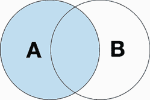
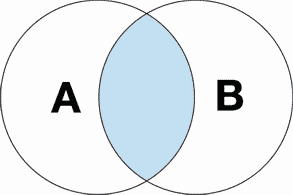
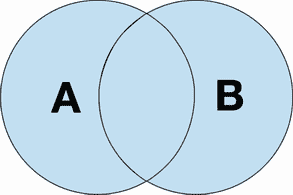

# 10 合并、连接和连接

本章涵盖

+   在垂直和水平轴上连接`DataFrames`

+   使用内连接、外连接和左连接合并`DataFrames`

+   在`DataFrames`之间查找唯一和共享值

+   通过索引标签连接`DataFrames`

随着业务领域的复杂性增长，将所有数据存储在单个集合中变得越来越困难。为了解决这个问题，数据管理员将数据分散到多个表中。然后他们将这些表相互关联，以便容易识别它们之间的关系。

你可能之前使用过像 PostgreSQL、MySQL 或 Oracle 这样的数据库。关系数据库管理系统（RDBMS）遵循前面段落中描述的范式。数据库由表组成。一个表包含一个领域模型的记录。一个表由行和列组成。一行存储一个记录的信息。一列存储该记录的属性。表通过列键连接。如果你之前没有使用过数据库，你可以将表视为与 pandas `DataFrame`等效。

这里有一个现实世界的例子。想象一下，我们正在构建一个电子商务网站，并希望创建一个`users`表来存储网站的注册用户。遵循关系数据库的惯例，我们将为每条记录分配一个唯一的数字标识符。我们将值存储在`id`列中。`id`列的值被称为*主键*，因为它们是特定行的唯一标识符。

| 用户 |
| --- |
| id | 姓氏 | 名字 | 邮箱 | 性别 |
| 1 | Homer | Simpson | donutfan@simpson.com | Male |
| 2 | Bart | Simpson | troublemaker@simpson.com | Male |

让我们设想我们的下一个目标是跟踪我们网站上用户的订单。我们将创建一个`orders`表来存储订单详情，例如项目名称和价格。但我们如何将每个订单与其下单的用户关联起来？看看下面的表格：

| 订单 |
| --- |
| id | 项目 | 价格 | 数量 | 用户 _id |
| 1 | Donut Box | 4.99 | 4 | 1 |
| 2 | Slingshot | 19.99 | 1 | 2 |

为了在两个表之间建立关系，数据库管理员创建一个外键列。*外键*是对另一个表中记录的引用。它被标记为*外键*，因为键存在于当前表的作用域之外。

每个`orders`表行存储了在`user_id`列中下单的*用户*的 ID。因此，`user_id`列存储外键；其值是对另一个表，即`users`表中记录的引用。使用两个表之间建立的关系，我们可以确定订单 1 是由 ID 为 1 的 Homer Simpson 用户下的。

外键的优势在于减少了数据重复。例如，`orders` 表不需要为每个订单复制用户的姓名、姓氏和电子邮件。相反，它只需要存储对正确的 `users` 记录的单个引用。用户和订单的业务实体分别存在，但我们在需要时可以将它们连接起来。

当需要合并表时，我们总是可以转向 pandas。这个库在追加、连接、连接、合并和垂直和水平方向上合并 `DataFrame`s 方面表现出色。它可以识别 `DataFrame`s 之间的唯一和共享记录。它可以执行 SQL 操作，如内连接、外连接、左连接和右连接。在本章中，我们将探讨这些连接之间的差异以及每种连接可以证明是有益的情况。

## 10.1 数据集介绍

让我们导入 pandas 库并将其分配一个别名 `pd`：

```
In  [1] import pandas as pd
```

本章的数据集来自在线社交服务 Meetup，这是一个用户加入具有共同兴趣如远足、文学和桌面游戏的组网站。组组织者安排远程或现场活动，组员参加。Meetup 的域有几个数据模型，包括组、分类和城市。

Meetup 目录包含本章的所有数据集。让我们通过导入 groups1.csv 和 groups2.csv 文件开始我们的探索。这些文件包含 Meetup 注册组的样本。每个组包括一个 ID、名称、关联的分类 ID 和关联的城市 ID。以下是 groups1 的样子：

```
In  [2] groups1 = pd.read_csv("meetup/groups1.csv")
        groups1.head()

Out [2]

 **group_id                           name  category_id  city_id**
0      6388         Alternative Health NYC           14    10001
1      6510      Alternative Energy Meetup            4    10001
2      8458              NYC Animal Rights           26    10001
3      8940  The New York City Anime Group           29    10001
4     10104             NYC Pit Bull Group           26    10001
```

同时导入 groups2.csv 文件。注意，这两个 CSV 文件都有相同的四个列。我们可以想象，groups 数据是以某种方式分割并存储在两个文件中而不是一个文件中：

```
In  [3] groups2 = pd.read_csv("meetup/groups2.csv")
        groups2.head()

Out [3]

 **group_id                                      name  category_id  city_id**
0  18879327                              BachataMania            5    10001
1  18880221  Photoshoot Chicago - Photography and ...           27    60601
2  18880426  Chicago Adult Push / Kick Scooter Gro...           31    60601
3  18880495         Chicago International Soccer Club           32    60601
4  18880695          Impact.tech San Francisco Meetup            2    94101
```

每个组还有一个 `category_id` 外键。我们可以在 categories.csv 文件中找到有关分类的信息。该文件中的每一行存储分类的 ID 和名称：

```
In  [4] categories = pd.read_csv("meetup/categories.csv")
        categories.head()

Out [4]

 **category_id            category_name**
0            1           Arts & Culture
1            3       Cars & Motorcycles
2            4  Community & Environment
3            5                  Dancing
4            6     Education & Learning
```

每个组还有一个 `city_id` 外键。cities.csv 数据集存储城市信息。一个城市有一个唯一的 ID、名称、州和邮政编码。让我们看一下：

```
In  [5] pd.read_csv("meetup/cities.csv").head()

Out [5]

 **id            city state    zip**
0   7093   West New York    NJ   7093
1  10001        New York    NY  10001
2  13417  New York Mills    NY  13417
3  46312    East Chicago    IN  46312
4  56567  New York Mills    MN  56567
```

cities 数据集有一个小问题。看看第一行的 zip 值。7093 是一个无效的邮政编码；CSV 中的值实际上是 07093。邮政编码可以以一个前导零开头。不幸的是，pandas 假设邮政编码是整数，因此从值中删除了前导零。为了解决这个问题，我们可以在 `read_csv` 函数中添加 `dtype` 参数。`dtype` 接受一个字典，其中键表示列名，值表示要分配给该列的数据类型。让我们确保 pandas 将 zip 列的值作为字符串导入：

```
In  [6] cities = pd.read_csv(
            "meetup/cities.csv", dtype = {"zip": "string"}
        )
        cities.head()

Out [6]

 **id            city state    zip**
0   7093   West New York    NJ  07093
1  10001        New York    NY  10001
2  13417  New York Mills    NY  13417
3  46312    East Chicago    IN  46312
4  56567  New York Mills    MN  56567
```

优秀；我们准备继续。为了总结，groups1 和 groups2 中的每个组都属于一个类别和一个城市。category_id 和 group_id 列存储外键。category_id 列的值映射到 `categories` 中的 category_id 列。city_id 列的值映射到 cities 中的 id 列。在我们的数据表加载到 Jupyter 中后，我们准备开始连接它们。

## 10.2 连接数据集

将两个数据集合并的最简单方法是使用连接——将一个 `DataFrame` 添加到另一个 `DataFrame` 的末尾。

groups1 和 groups2 `DataFrame`s 都有相同的四个列名。让我们假设它们是一个更大整体的两半。我们希望将它们的行合并到一个 `DataFrame` 中。Pandas 库的顶层有一个方便的 `concat` 函数。我们可以传递一个 `DataFrame`s 列表给它的 `objs` 参数。Pandas 将按照 `objs` 列表中出现的顺序连接对象。下一个示例将 groups2 的行连接到 groups1 的末尾：

```
In  [7] pd.concat(objs = [groups1, groups2])

Out [7]

 **group_id                                   name  category_id  city_id**
0         6388                 Alternative Health NYC           14    10001
1         6510              Alternative Energy Meetup            4    10001
2         8458                      NYC Animal Rights           26    10001
3         8940          The New York City Anime Group           29    10001
4        10104                     NYC Pit Bull Group           26    10001
 ...      ...                                      ...         ...      ...
8326  26377464                                Shinect           34    94101
8327  26377698  The art of getting what you want [...           14    94101
8328  26378067            Streeterville Running Group            9    60601
8329  26378128                         Just Dance NYC           23    10001
8330  26378470  FREE Arabic Chicago Evanston North...           31    60601

16330 rows × 4 columns
```

连接后的 `DataFrame` 有 16,330 行！正如你可能猜到的，它的长度等于 groups1 和 groups2 `DataFrame`s 长度的总和：

```
In  [8] len(groups1)

Out [8] 7999

In  [9] len(groups2)

Out [9] 8331

In  [10] len(groups1) + len(groups2)

Out [10] 16330
```

Pandas 在连接中保留了两个 `DataFrame` 的原始索引标签，这就是为什么我们看到连接后的 `DataFrame` 中有一个最终的索引位置为 8,330，尽管它有超过 16,000 行。我们看到的是 groups2 `DataFrame` 末尾的 8,330 索引。Pandas 不关心相同的索引号是否出现在 groups1 和 groups2 中。因此，连接后的索引有重复的索引标签。

我们可以将 `concat` 函数的 `ignore_index` 参数设置为 `True` 以生成 pandas 的标准数值索引。连接后的 `DataFrame` 将丢弃原始的索引标签：

```
In  [11] pd.concat(objs = [groups1, groups2], ignore_index = True)

Out [11]

 **group_id                                  name  category_id  city_id**
0          6388                Alternative Health NYC           14    10001
1          6510             Alternative Energy Meetup            4    10001
2          8458                     NYC Animal Rights           26    10001
3          8940         The New York City Anime Group           29    10001
4         10104                    NYC Pit Bull Group           26    10001
 ...        ...                                   ...          ...      ...
16325  26377464                               Shinect           34    94101
16326  26377698  The art of getting what you want ...           14    94101
16327  26378067           Streeterville Running Group            9    60601
16328  26378128                        Just Dance NYC           23    10001
16329  26378470  FREE Arabic Chicago Evanston Nort...           31    60601

16330 rows × 4 columns
```

如果我们想要两者兼得：创建一个非重复索引，同时保留每行数据来自哪个 `DataFrame`？一个解决方案是添加一个 `keys` 参数，并传递一个字符串列表。Pandas 将将 `keys` 列表中的每个字符串与 `objs` 列表中相同索引位置的 `DataFrame` 关联起来。`keys` 和 `objs` 列表必须具有相同的长度。

下一个示例将 groups1 `DataFrame` 分配一个键 `"G1"`，将 `groups2` `DataFrame` 分配一个键 `"G2"`。`concat` 函数返回一个 `MultiIndex DataFrame`。`MultiIndex` 的第一级存储键，第二级存储来自相应 `DataFrame` 的索引标签：

```
In  [12] pd.concat(objs = [groups1, groups2], keys = ["G1", "G2"])

Out [12]

 **group_id                                name  category_id  city_id**
G1 0         6388              Alternative Health NYC           14    10001
   1         6510           Alternative Energy Meetup            4    10001
   2         8458                   NYC Animal Rights           26    10001
   3         8940       The New York City Anime Group           29    10001
   4        10104                  NYC Pit Bull Group           26    10001
... ...       ...                                 ...          ...      ...
G2 8326  26377464                             Shinect           34    94101
   8327  26377698  The art of getting what you wan...           14    94101
   8328  26378067         Streeterville Running Group            9    60601
   8329  26378128                      Just Dance NYC           23    10001
   8330  26378470  FREE Arabic Chicago Evanston No...           31    60601

16330 rows × 4 columns
```

我们可以通过访问 `MultiIndex` 第一级的 `G1` 或 `G2` 键来提取原始 `DataFrame`s。（参见第七章以复习在 `MultiIndex` `DataFrame`s 上使用 `loc` 访问器。）在我们继续之前，让我们将连接后的 `DataFrame` 分配给一个 `groups` 变量：

```
In  [13] groups = pd.concat(objs = [groups1, groups2], ignore_index = True)

```

我们将在第 10.4 节回到 `groups`。

## 10.3 连接后的 DataFrames 中的缺失值

当连接两个`DataFrame`时，pandas 会在数据集不共享的行标签和列标签的交叉处放置`NaN`。考虑以下两个`DataFrame`，它们都有一个足球列。`sports_champions_A` `DataFrame`有一个独有的棒球列，而`sports_champions_B` `DataFrame`有一个独有的曲棍球列：

```
In  [14] sports_champions_A = pd.DataFrame(
             data = [
                 ["New England Patriots", "Houston Astros"],
                 ["Philadelphia Eagles", "Boston Red Sox"]
             ],
             columns = ["Football", "Baseball"],
             index = [2017, 2018]
         )

        sports_champions_A

Out [14]

 **Football        Baseball**
2017  New England Patriots  Houston Astros
2018   Philadelphia Eagles  Boston Red Sox

In  [15] sports_champions_B = pd.DataFrame(
             data = [
                 ["New England Patriots", "St. Louis Blues"],
                 ["Kansas City Chiefs", "Tampa Bay Lightning"]
             ],
             columns = ["Football", "Hockey"],
             index = [2019, 2020]
         )

         sports_champions_B

Out [15]

 **Football               Hockey**
2019  New England Patriots      St. Louis Blues
2020    Kansas City Chiefs  Tampa Bay Lightning
```

如果我们将`DataFrames`连接起来，将在棒球和曲棍球列中创建缺失值。`sports_champions_A` `DataFrame`在曲棍球列中没有值可以放置，而`sports_champions_B` `DataFrame`在棒球列中没有值可以放置：

```
In  [16] pd.concat(objs = [sports_champions_A, sports_champions_B])

Out [16]

 **Football        Baseball               Hockey**
2017  New England Patriots  Houston Astros                  NaN
2018   Philadelphia Eagles  Boston Red Sox                  NaN
2019  New England Patriots             NaN      St. Louis Blues
2020    Kansas City Chiefs             NaN  Tampa Bay Lightning
```

默认情况下，pandas 在水平轴上连接行。有时，我们希望垂直轴上追加行。考虑`sports_champions_C` `DataFrame`，它具有与`sports_champions_A`相同的两个索引标签（2017 年和 2018 年），但有两列不同的数据，分别是曲棍球和篮球：

```
In  [17] sports_champions_C = pd.DataFrame(
             data = [
                 ["Pittsburgh Penguins", "Golden State Warriors"],
                 ["Washington Capitals", "Golden State Warriors"]
         ],
             columns = ["Hockey", "Basketball"],
             index = [2017, 2018]
         )

         sports_champions_C

Out [17]

 **Hockey             Basketball**
2017  Pittsburgh Penguins  Golden State Warriors
2018  Washington Capitals  Golden State Warriors
```

当我们将`sports_champions_A`和`sports_champions_C`连接起来时，pandas 会将第二个`DataFrame`的行追加到第一个`DataFrame`的末尾。这个过程会创建重复的 2017 年和 2018 年索引标签：

```
In  [18] pd.concat(objs = [sports_champions_A, sports_champions_C])

Out [18]

 **Football        Baseball            Hockey        Basketball**
2017  New England P...  Houston Astros               NaN               NaN
2018  Philadelphia ...  Boston Red Sox               NaN               NaN
2017               NaN             NaN  Pittsburgh Pe...  Golden State ...
2018               NaN             NaN  Washington Ca...  Golden State ...
```

这个结果并不是我们想要的。相反，我们希望对齐重复的索引标签（2017 年和 2018 年），使得列没有缺失值。

`concat`函数包含一个`axis`参数。我们可以传递该参数一个`1`或`"columns"`的参数，以在列轴上连接`DataFrame`：

```
In  [19] # The two lines below are equivalent
         pd.concat(
             objs = [sports_champions_A, sports_champions_C],
             axis = 1
         )
         pd.concat(
             objs = [sports_champions_A, sports_champions_C],
             axis = "columns"
         )

Out [19]

 **Football        Baseball            Hockey        Basketball**
2017  New England P...  Houston Astros  Pittsburgh Pe...  Golden State ...
2018  Philadelphia ...  Boston Red Sox  Washington Ca...  Golden State ...
```

太好了！

总结来说，`concat`函数通过将一个`DataFrame`追加到另一个的末尾，在水平轴或垂直轴上组合两个`DataFrame`。我喜欢将这个过程描述为“将两个数据集粘合在一起”。

## 10.4 左连接

与连接相比，*连接*使用逻辑标准来确定两个数据集之间合并的行或列。例如，连接可以仅针对两个数据集之间具有共享值的行。以下几节将介绍三种类型的连接：左连接、内连接和外连接。让我们逐一了解它们。

*左连接*使用一个数据集的键来从另一个数据集中提取值。它在 Excel 中的`VLOOKUP`操作中是等效的。当一个数据集是分析的重点时，左连接是最优的。我们引入第二个数据集以提供与主要数据集相关的补充信息。考虑图 10.1 中的图表。将每个圆圈视为一个`DataFrame`。左边的`DataFrame`是分析的重点。



图 10.1 左连接图

这里快速回顾一下我们的组数据集的样子：

```
In  [20] groups.head(3)

Out [20]

 **group_id                       name  category_id  city_id**
0      6388     Alternative Health NYC           14    10001
1      6510  Alternative Energy Meetup            4    10001
2      8458          NYC Animal Rights           26    10001
```

`category_id`列中的外键引用了`categories`数据集中的 ID：

```
In  [21] categories.head(3)

Out [21]

 **category_id            category_name**
0            1           Arts & Culture
1            3       Cars & Motorcycles
2            4  Community & Environment
```

让我们在 groups 上执行左连接，为每个组添加类别信息。我们将使用`merge`方法将一个`DataFrame`合并到另一个中。该方法的第一参数`right`接受一个`DataFrame`。这个术语来自之前的图表。右边的`DataFrame`是右边的圆圈，即“第二个”数据集。我们可以将表示连接类型的字符串传递给方法的`how`参数；我们将传递`"left"`。我们还必须告诉 pandas 使用哪些列来匹配两个`DataFrame`之间的值。让我们添加一个`on`参数，其值为`"category_id"`。我们只能在两个`DataFrame`的列名相等时使用`on`参数。在我们的情况下，groups 和 categories `DataFrame`s 都有 category_id 列：

```
In  [22] groups.merge(categories, how = "left", on = "category_id").head()

Out [22]

 **group_id                 name  category_id  city_id        category_name**
0      6388  Alternative Heal...           14    10001   Health & Wellbeing
1      6510  Alternative Ener...            4    10001  Community & Envi...
2      8458    NYC Animal Rights           26    10001                  NaN
3      8940  The New York Cit...           29    10001     Sci-Fi & Fantasy
4     10104   NYC Pit Bull Group           26    10001                  NaN
```

就在这里！当 Pandas 找到与 groups 中的 category_id 值匹配时，它会拉入 categories 表的列。唯一的例外是 category_id 列，它只列了一次。请注意，当库在 categories 中找不到 category_id 时，它会在 categories 的 category_name 列中显示`NaN`值。我们可以在上一个输出的第 2 行和第 4 行看到一个例子。

## 10.5 内连接

内连接的目标是存在于两个`DataFrame`中的值。考虑图 10.2；内连接的目标是两个圆圈中间的彩色重叠部分。



图 10.2 内连接图

在内连接中，pandas 排除了只存在于第一个`DataFrame`和只存在于第二个`DataFrame`中的值。

这里是一个提醒，关于 groups 和 categories 数据集看起来是什么样子：

```
In  [23] groups.head(3)

Out [23]

 **group_id                       name  category_id  city_id**
0      6388     Alternative Health NYC           14    10001
1      6510  Alternative Energy Meetup            4    10001
2      8458          NYC Animal Rights           26    10001

In  [24] categories.head(3)

Out [24]

 **category_id            category_name**
0            1           Arts & Culture
1            3       Cars & Motorcycles
2            4  Community & Environment
```

让我们确定存在于两个数据集中的类别。从技术角度来看，我们再次想要针对两个`DataFrame`中 category_id 列值相等的行。在这种情况下，我们是否在 group 或 categories 上调用`merge`方法无关紧要。内连接确定两个数据集中的共同元素；结果将是一样的。对于下一个示例，让我们在 groups 上调用`merge`方法：

```
In  [25] groups.merge(categories, how = "inner", on = "category_id")

Out [25]

 **group_id               name  category_id  city_id      category_name**
0         6388  Alternative He...           14    10001  Health & Wellb...
1        54126  Energy Healers...           14    10001  Health & Wellb...
2        67776  Flourishing Li...           14    10001  Health & Wellb...
3       111855  Hypnosis & NLP...           14    10001  Health & Wellb...
4       129277  The Live Food ...           14    60601  Health & Wellb...
 ...      ...                 ...          ...      ...                ...
8032  25536270  New York Cucko...           17    10001          Lifestyle
8033  25795045  Pagans Paradis...           17    10001          Lifestyle
8034  25856573  Fuck Yeah Femm...           17    94101          Lifestyle
8035  26158102  Chicago Crossd...           17    60601          Lifestyle
8036  26219043  Corporate Goes...           17    10001          Lifestyle

8037 rows × 5 columns
```

合并的`DataFrame`包括 groups 和 categories `DataFrame`s 的所有列。category_id 列的值在 groups 和 categories 中都出现。category_id 列只列了一次。我们不需要重复的列，因为在内连接中，category_id 的值对于 groups 和 categories 是相同的。

让我们添加一些上下文来解释 pandas 做了什么。合并的`DataFrame`的前四行有一个 category_id 值为 14。我们可以在 groups 和 categories `DataFrame`s 中过滤出这个 ID：

```
In  [26] groups[groups["category_id"] == 14]

Out [26]

 **group_id                                  name  category_id  city_id**
0          6388                Alternative Health NYC           14    10001
52        54126                    Energy Healers NYC           14    10001
78        67776               Flourishing Life Meetup           14    10001
121      111855  Hypnosis & NLP NYC - Update Your ...           14    10001
136      129277       The Live Food Chicago Community           14    60601
 ...       ...                                    ...          ...      ...
16174  26291539  The Transformation Project: Colla...           14    94101
16201  26299876  Cognitive Empathy, How To Transla...           14    10001
16248  26322976         Contemplative Practices Group           14    94101
16314  26366221  The art of getting what you want:...           14    94101
16326  26377698  The art of getting what you want ...           14    94101

870 rows × 4 columns

In  [27] categories[categories["category_id"] == 14]

Out [27]

 **category_id       category_name**
8           14  Health & Wellbeing
```

合并后的`DataFrame`为两个`DataFrame`之间的每个`group_id`匹配创建一行。组中有 870 行，类别中有 1 行，`group_id`为 14。Pandas 将组中的 870 行与类别中的单行配对，并在合并的`DataFrame`中创建总共 870 行。因为内连接为每个值匹配创建新行，所以合并的`DataFrame`可以比原始的`DataFrame`大得多。例如，如果有三个 ID 为 14 的类别，pandas 将创建 2610 行（870 x 3）。

## 10.6 外连接

*外连接*将两个数据集中的所有记录组合在一起。在外连接中，唯一性并不重要。图 10.3 显示了外连接的结果；pandas 包括所有值，无论它们是否属于一个数据集或两个数据集。



图 10.3 外连接图

这里是关于组和城市`DataFrame`的提醒：

```
In  [28] groups.head(3)

Out [28]

 **group_id                       name  category_id  city_id**
0      6388     Alternative Health NYC           14    10001
1      6510  Alternative Energy Meetup            4    10001
2      8458          NYC Animal Rights           26    10001

In  [29] cities.head(3)

Out [29]

 **id            city state    zip**
0   7093   West New York    NJ  07093
1  10001        New York    NY  10001
2  13417  New York Mills    NY  13417
```

让我们使用外连接合并组和城市。我们将拉入所有城市：仅属于组的城市，仅属于城市的城市，以及两者都有的城市。

到目前为止，我们只使用共享列名来合并数据集。当数据集之间的列名不同时，我们必须向`merge`方法传递不同的参数。而不是使用`on`参数，我们可以使用`merge`方法的`left_on`和`right_on`参数。我们将`left_on`传递给左边的`DataFrame`中的列名，将`right_on`传递给右边的`DataFrame`中的列名。在这里，我们执行外连接以将城市信息合并到组`DataFrame`中：

```
In  [30] groups.merge(
             cities, how = "outer", left_on = "city_id", right_on = "id"
         )

Out [30]

 **group_id       name  category_id  city_id       city state    zip**
0         6388.0  Altern...       14.0    10001.0   New York    NY  10001
1         6510.0  Altern...        4.0    10001.0   New York    NY  10001
2         8458.0  NYC An...       26.0    10001.0   New York    NY  10001
3         8940.0  The Ne...       29.0    10001.0   New York    NY  10001
4        10104.0  NYC Pi...       26.0    10001.0   New York    NY  10001
 ...         ...        ...        ...        ...        ...   ...    ...
16329  243034...  Midwes...       34.0    60064.0  North ...    IL  60064
16330        NaN        NaN        NaN        NaN  New Yo...    NY  13417
16331        NaN        NaN        NaN        NaN  East C...    IN  46312
16332        NaN        NaN        NaN        NaN  New Yo...    MN  56567
16333        NaN        NaN        NaN        NaN  Chicag...    CA  95712

16334 rows × 8 columns
```

最终的`DataFrame`包含来自两个数据集的所有城市 ID。如果 pandas 在`city_id`和`id`列之间找到值匹配，它将在单行中合并两个`DataFrame`的列。我们可以在前五行中看到一些示例。`city_id`列存储共同的 id。

如果一个`DataFrame`有一个另一个`DataFrame`没有的值，pandas 将在`city_id`列中放置一个`NaN`值。我们可以在数据集的末尾看到一些示例。这种放置将不受组或城市是否有唯一值的影响。

我们可以将`True`传递给`merge`方法的`indicator`参数，以识别一个值属于哪个`DataFrame`。合并后的`DataFrame`将包含一个`_merge`列，该列存储值`"both"`、`"left_only"`和`"right_only"`：

```
In  [31] groups.merge(
             cities,
             how = "outer",
             left_on = "city_id",
             right_on = "id",
             indicator = True
         )

Out [31]

 **group_id    name  category_id  city_id    city state    zip  _merge**
0      6388.0    Alt...    14.0       100...   New...    NY  10001    both
1      6510.0    Alt...     4.0       100...   New...    NY  10001    both
2      8458.0    NYC...    26.0       100...   New...    NY  10001    both
3      8940.0    The...    29.0       100...   New...    NY  10001    both
4      101...    NYC...    26.0       100...   New...    NY  10001    both
...       ...       ...     ...          ...      ...   ...    ...     ...
16329  243...    Mid...    34.0       600...   Nor...    IL  60064    both
16330     NaN       NaN     NaN          NaN   New...    NY  13417  rig...
16331     NaN       NaN     NaN          NaN   Eas...    IN  46312  rig...
16332     NaN       NaN     NaN          NaN   New...    MN  56567  rig...
16333     NaN       NaN     NaN          NaN   Chi...    CA  95712  rig...

16334 rows × 9 columns
```

我们可以使用`_merge`列来过滤属于任一`DataFrame`的行。下一个示例提取`_merge`列中值为`"right_only"`的行，或者等价地，仅存在于城市中的城市 ID，即右边的`DataFrame`：

```
In  [32] outer_join = groups.merge(
             cities,
             how = "outer",
             left_on = "city_id",
             right_on = "id",
             indicator = True
         )
         in_right_only = outer_join["_merge"] == "right_only"

         outer_join[in_right_only].head()

Out [32]

 **group_id name  category_id  city_id      city state    zip    _merge**
16330       NaN  NaN       NaN         NaN  New Y...    NY  13417  right...
16331       NaN  NaN       NaN         NaN  East ...    IN  46312  right...
16332       NaN  NaN       NaN         NaN  New Y...    MN  56567  right...
16333       NaN  NaN       NaN         NaN  Chica...    CA  95712  right...
```

通过几行代码，我们可以轻松过滤出每个数据集中的唯一值。

## 10.7 在索引标签上合并

想象一下，我们想要连接的`DataFrame`将其主键存储在其索引中。让我们模拟这种情况。我们可以在城市上调用`set_index`方法，将其 id 列设置为`DataFrame`的索引：

```
In  [33] cities.head(3)

Out [33]

 **id            city state    zip**
0   7093   West New York    NJ  07093
1  10001        New York    NY  10001
2  13417  New York Mills    NY  13417

In  [34] cities = cities.set_index("id")

In  [35] cities.head(3)

Out [35]

                 city state    zip
**id** 
7093    West New York    NJ  07093
10001        New York    NY  10001
13417  New York Mills    NY  13417
```

让我们再次使用左连接将城市合并到组中。这里是一个关于 `groups` 的快速提醒：

```
In  [36] groups.head(3)

Out [36]

 **group_id                       name  category_id  city_id**
0      6388     Alternative Health NYC           14    10001
1      6510  Alternative Energy Meetup            4    10001
2      8458          NYC Animal Rights           26    10001
```

现在我们想比较组中 city_id 列的值与城市索引标签。当我们调用 `merge` 方法时，我们将 `how` 参数的参数设置为 `"left"` 以进行左连接。我们将使用 `left_on` 参数告诉 pandas 在组中的 city_id 列中查找匹配项，在左 `DataFrame` 中。为了在右 `DataFrame` 的索引中查找匹配项，我们可以提供一个不同的参数，`right_index`，并将其设置为 `True`。该参数告诉 pandas 在右 `DataFrame` 的索引中查找 city_id 匹配项：

```
In  [37] groups.merge(
             cities,
             how = "left",
             left_on = "city_id",
             right_index = True
         )

Out [37]

 **group_id        name  category_id  city_id        city state    zip**
0          6388  Alterna...          14     10001    New York    NY  10001
1          6510  Alterna...           4     10001    New York    NY  10001
2          8458  NYC Ani...          26     10001    New York    NY  10001
3          8940  The New...          29     10001    New York    NY  10001
4         10104  NYC Pit...          26     10001    New York    NY  10001
...         ...         ...         ...       ...         ...   ...    ...
16325  26377464     Shinect          34     94101  San Fra...    CA  94101
16326  26377698  The art...          14     94101  San Fra...    CA  94101
16327  26378067  Streete...           9     60601     Chicago    IL  60290
16328  26378128  Just Da...          23     10001    New York    NY  10001
16329  26378470  FREE Ar...          31     60601     Chicago    IL  60290

16330 rows × 7 columns
```

该方法还支持一个互补的 `left_index` 参数。将参数传递一个 `True` 的参数，告诉 pandas 在左 `DataFrame` 的索引中查找匹配项。左 `DataFrame` 是我们调用 `merge` 方法的那个。

## 10.8 编程挑战

我们的探索已经结束；感谢您的参与（有意为之！）让我们练习本章介绍的概念。

这个编程挑战的表格总结了虚构餐厅的销售情况。week_1_sales.csv 和 week_2_sales.csv 文件包含每周交易的列表。每个餐厅订单包括下订单的客户的 ID 和他们购买的食品项的 ID。以下是 week_1_sales 的前五行预览：

```
In  [38] pd.read_csv("restaurant/week_1_sales.csv").head()

Out [38]

 **Customer ID  Food ID**
0          537        9
1           97        4
2          658        1
3          202        2
4          155        9
```

week_2_sales 数据集具有相同的形状。让我们导入这两个 CSV 文件，并将它们分配给 `week1` 和 `week2` 变量：

```
In  [39] week1 = pd.read_csv("restaurant/week_1_sales.csv")
         week2 = pd.read_csv("restaurant/week_2_sales.csv")
```

客户 ID 列包含外键，它们引用 customers.csv 中的 ID 列的值。customers.csv 中的每条记录都包含一个客户的姓氏、名字、性别、公司和职业。让我们使用 `read_csv` 函数导入该数据集，并使用 `index_col` 参数将其 ID 列设置为 `DataFrame` 的索引：

```
In  [40] pd.read_csv("restaurant/customers.csv", index_col = "ID").head()

Out [40]

   First Name Last Name  Gender  Company                     Occupation
**ID** 
1      Joseph   Perkins    Male  Dynazzy  Community Outreach Specialist
2    Jennifer   Alvarez  Female     DabZ        Senior Quality Engineer
3       Roger     Black    Male  Tagfeed              Account Executive
4      Steven     Evans    Male     Fatz               Registered Nurse
5        Judy  Morrison  Female  Demivee                Legal Assistant

In  [41] customers = pd.read_csv(
             "restaurant/customers.csv", index_col = "ID"
         )
```

weeks1 和 weeks2 `DataFrame`s 中还有另一列外键。食品 ID 外键连接到 foods.csv 中的 ID 列。一个食品项目包括一个 ID、一个名称和一个价格。当我们导入这个数据集时，让我们将其食品 ID 列设置为 `DataFrame` 的索引：

```
In  [42] pd.read_csv("restaurant/foods.csv", index_col = "Food ID")

Out [42]

          Food Item  Price
**Food ID** 
1             Sushi   3.99
2           Burrito   9.99
3              Taco   2.99
4        Quesadilla   4.25
5             Pizza   2.49
6             Pasta  13.99
7             Steak  24.99
8             Salad  11.25
9             Donut   0.99
10            Drink   1.75

In  [43] foods = pd.read_csv("restaurant/foods.csv", index_col = "Food ID")
```

数据集导入后，我们就可以开始解决练习了。

### 10.8.1 问题

这里是挑战：

1.  将两周的销售数据合并到一个 `DataFrame` 中。将 week1 `DataFrame` 分配一个键 `"Week 1"`，将 week2 `DataFrame` 分配一个键 `"Week 2"`。

1.  找出两个星期都在餐厅就餐的客户。

1.  找出两个星期都在餐厅就餐且每周都订购相同食品的客户。

    提示：您可以通过传递一个列列表给 `on` 参数来在多个列上连接数据集。

1.  识别哪些客户只在第 1 周和只在第 2 周来过。

1.  week1 `DataFrame` 中的每一行都标识了一个购买食品项目的客户。对于每一行，从 customers `DataFrame` 中提取客户信息。

### 10.8.2 解决方案

让我们探索解决方案：

1.  我们的首要挑战是将两周的餐厅销售数据合并到一个`DataFrame`中。pandas 顶级层的`concat`函数提供了一个完美的解决方案。我们可以将两个`DataFrame`作为一个列表传递给函数的`objs`参数。为了将`MultiIndex`级别分配给结果中的每个`DataFrame`，我们还将提供`keys`参数一个包含级别标签的列表：

    ```
    In  [44] pd.concat(objs = [week1, week2], keys = ["Week 1", "Week 2"])

    Out [44]

     **Customer ID  Food ID**
    Week 1 0            537        9
           1             97        4
           2            658        1
           3            202        2
           4            155        9
     ...  ...           ...      ...
    Week 2 245          783       10
           246          556       10
           247          547        9
           248          252        9
           249          249        6

    500 rows × 2 columns
    ```

1.  接下来，我们希望识别出在两周内都访问过餐厅的客户。从技术角度来看，我们需要找到存在于 week1 和 week2 `DataFrame`中的客户 ID。这里我们需要的是内连接。让我们在 week1 上调用`merge`方法，并将 week2 作为右边的`DataFrame`传入。我们将连接类型声明为`"inner"`，并告诉 pandas 在客户 ID 列中查找共享值：

    ```
    In  [45] week1.merge(
                 right = week2, how = "inner", on = "Customer ID"
             ).head()

    Out [45]

     **Customer ID  Food ID_x  Food ID_y**
    0          537          9          5
    1          155          9          3
    2          155          1          3
    3          503          5          8
    4          503          5          9
    ```

    记住，内连接显示了 week1 和 week2 `DataFrames`中所有客户 ID 的匹配。因此，结果中有重复（客户 155 和 503）。如果我们想删除重复项，我们可以调用第五章中引入的`drop_duplicates`方法：

    ```
    In  [46] week1.merge(
                 right = week2, how = "inner", on = "Customer ID"
             ).drop_duplicates(subset = ["Customer ID"]).head()

    Out [46]

     **Customer ID  Food ID_x  Food ID_y**
    0          537          9          5
    1          155          9          3
    3          503          5          8
    5          550          6          7
    6          101          7          4
    ```

1.  第三个挑战要求找到在两周内都访问过餐厅并且点了相同菜品的客户。同样，内连接是找到左和右`DataFrame`中存在的值的正确选项。然而，这一次，我们必须将`on`参数传递为一个包含两个列的列表。在 week1 和 week2 的客户 ID 和食品 ID 列中的值必须匹配：

    ```
    In  [47] week1.merge(
                 right = week2,
                 how = "inner",
                 on = ["Customer ID", "Food ID"]
             )

    Out [47]

     **Customer ID  Food ID**
    0          304        3
    1          540        3
    2          937       10
    3          233        3
    4           21        4
    5           21        4
    6          922        1
    7          578        5
    8          578        5s
    ```

1.  识别只在一周内来过的客户的一个解决方案是使用外连接。我们可以通过客户 ID 列中的值在两个`DataFrame`之间匹配记录。让我们将`indicator`参数的值设置为`True`以添加一个 _merge 列。Pandas 将指示客户 ID 是否仅存在于左表(`"left_only"`)、仅存在于右表(`"right_only"`)，还是两个表都存在(`"both"`):

    ```
    In  [48] week1.merge(
                 right = week2,
                 how = "outer",
                 on = "Customer ID",
                 indicator = True
             ).head()

    Out [48]

     **Customer ID  Food ID_x  Food ID_y     _merge**
    0          537        9.0        5.0       both
    1           97        4.0        NaN  left_only
    2          658        1.0        NaN  left_only
    3          202        2.0        NaN  left_only
    4          155        9.0        3.0       both

    ```

1.  最后一个挑战要求将客户信息拉入 week1 表中。左连接是一个最优解。在 week1 `DataFrame`上调用`merge`方法，传入客户`DataFrame`作为右数据集。将`how`参数的值传递为`"left"`。

    这个挑战的难点在于，week1 `DataFrame`将其客户 ID 存储在其客户 ID 列中，而客户`DataFrame`将其存储在其索引标签中。为了解决这个问题，我们可以将`left_on`参数传递给 week1 `DataFrame`中的列名，并将`right_index`参数的值设置为`True`：

    ```
    In  [49] week1.merge(
                 right = customers,
                 how = "left",
                 left_on = "Customer ID",
                 right_index = True
             ).head()

    Out [49]

     **Customer ID  Food ID First Name Last Name  Gender    Company Occupation**
    0        537          9     Cheryl   Carroll  Female   Zoombeat  Regist...
    1         97          4     Amanda   Watkins  Female        Ozu  Accoun...
    2        658          1    Patrick      Webb    Male  Browsebug  Commun...
    3        202          2      Louis  Campbell    Male  Rhynoodle  Accoun...
    4        155          9    Carolyn      Diaz  Female   Gigazoom  Databa...
    ```

恭喜你完成了编码挑战！

## 摘要

+   *主键*是数据集中记录的唯一标识符。

+   *外键*是另一个数据集中记录的引用。

+   `concat`函数在水平或垂直轴上连接`DataFrame`。

+   `merge`方法基于某些逻辑标准连接两个`DataFrame`。

+   内连接（*inner join*）识别两个 `DataFrame` 之间的共同值。对于任何匹配项，pandas 会将右侧 `DataFrame` 的所有列拉入左侧 `DataFrame`。

+   外连接（*outer join*）合并两个 `DataFrame`。Pandas 包含那些仅属于一个数据集或共享的值。

+   左连接（*left join*）在右侧 `DataFrame` 的值存在于左侧 `DataFrame` 时，会拉入列。这个操作在 Excel 中相当于 `VLOOKUP`。

+   当第二个 `DataFrame` 包含我们希望附加到主 `DataFrame` 的补充信息时，左连接是理想的。
