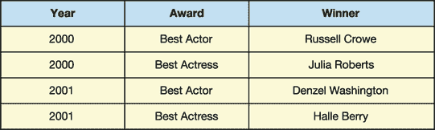
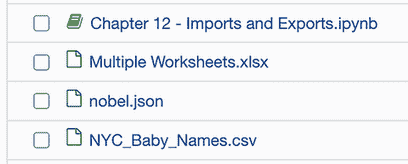
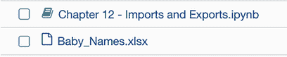

# 12 导入和导出

本章涵盖

+   导入 JSON 数据

+   展平嵌套的记录集合

+   从在线网站下载 CSV 文件

+   从 Excel 工作簿中读取和写入

数据集以各种文件格式存在：逗号分隔值（CSV）、制表符分隔值（TSV）、Excel 工作簿（XLSX）等。一些数据格式不存储在表格格式中；相反，它们在键值存储中嵌套相关数据的集合。考虑以下两个例子。图 12.1 以表格形式存储数据，而图 12.2 以 Python 字典的形式存储相同的数据。



图 12.1 奥斯卡获奖者表格

Python 的字典是一个键值数据结构的例子：

```
{
    2000: [
        {
            "Award": "Best Actor",
            "Winner": "Russell Crowe"
        },
        {
            "Award": "Best Actress",
            "Winner": "Julia Roberts"
        }
    ],
    2001: [
        {
            "Award": "Best Actor",
            "Winner": "Denzel Washington"
        },
        {
            "Award": "Best Actress",
            "Winner": "Halle Berry"
        }
    ]
}
```

图 12.2 具有相同数据的 Python 字典（键值存储）

Pandas 附带用于将键值数据转换为表格数据及其相反操作的实用函数。当我们有`DataFrame`中的数据时，我们可以应用所有我们喜欢的技巧。但将数据扭曲成正确的形状通常证明是分析中最具挑战性的部分。在本章中，我们将学习如何解决数据导入中的常见问题。我们还将探索等式的另一面：将`DataFrame`导出为各种文件类型和数据结构。

## 12.1 从 JSON 文件中读取和写入

让我们从谈论 JSON 开始，可能是今天最受欢迎的键值存储格式。*JavaScript 对象表示法*（JSON）是一种用于存储和传输文本数据的格式。尽管 JavaScript 编程语言启发了其语法，但 JSON 本身是语言无关的。今天的大多数语言，包括 Python，都可以生成和解析 JSON。

一个 JSON 响应由键值对组成，其中键作为值的唯一标识符。冒号符号（`:`）将键与值连接起来：

```
"name":"Harry Potter"
```

键必须是字符串。值可以是任何数据类型，包括字符串、数字和布尔值。JSON 类似于 Python 的字典对象。

JSON 是许多现代应用程序编程接口（API）的流行响应格式，例如网站服务器。API 的原始 JSON 响应看起来像是一个普通的字符串。以下是一个响应可能的样子：

```
{"name":"Harry Potter","age":17,"wizard":true}
```

被称为*linters*的软件程序通过将每个键值对放在单独的一行上格式化 JSON 响应。一个流行的例子是 JSONLint ([`jsonlint.com`](https://jsonlint.com/))。将之前的 JSON 通过 JSONLint 运行会产生以下输出：

```
{
            "name": "Harry Potter",
            "age": 17,
            "wizard": true,
}
```

这两个先前的代码样本之间没有技术差异，但后者更易读。

JSON 响应包含三个键值对：

+   `"name"`键的字符串值为`"Harry Potter"`。

+   `"age"`键的整数值为 17。

+   `"wizard"`键的布尔值为`true`。在 JSON 中，布尔值以小写形式书写。这个概念与 Python 布尔值相同。

键也可以指向一个*数组*，这是一个有序的元素集合，相当于 Python 列表。以下 JSON 示例中的`"friends"`键映射到一个包含两个字符串的数组：

```
{
    "name": "Harry Potter",
            age": 17,
    "wizard": true,
    "friends": ["Ron Weasley", "Hermione Granger"],
}
```

JSON 可以在嵌套对象中存储额外的键值对，例如以下示例中的`"address"`。用 Python 的说法，我们可以将`"address"`视为嵌套在另一个字典中的字典：

```
{
    "name": "Harry Potter",
    "age": 17,
    "wizard": true,    
    "friends": ["Ron Weasley", "Hermione Granger"],
    "address": {
        "street": "4 Privet Drive",
        "town": "Little Whinging"
    }
}
```

嵌套的键值对存储有助于通过分组相关字段来简化数据。

### 12.1.1 将 JSON 文件加载到 DataFrame 中

让我们创建一个新的 Jupyter Notebook 并导入 pandas 库。确保在包含本章数据文件的同一目录中创建 Notebook：

```
In  [1] import pandas as pd
```

JSON 可以存储在一个以.json 扩展名的纯文本文件中。本章的 prizes.json 文件是从诺贝尔奖 API 保存的 JSON 响应。API 存储了从 1901 年以来的诺贝尔奖获得者。您可以通过在网页浏览器中导航到[`api.nobelprize.org/v1/prize.json`](http://api.nobelprize.org/v1/prize.json)来查看原始 JSON 响应。以下是 JSON 形状的预览：

```
{
  "prizes": [
    {
      "year": "2019",
      "category": "chemistry",
      "laureates": [
        {
          "id": "976",
          "firstname": "John",
          "surname": "Goodenough",
          "motivation": "\"for the development of lithium-ion batteries\"",
          "share": "3"
        },
        {
          "id": "977",
          "firstname": "M. Stanley",
          "surname": "Whittingham",
          "motivation": "\"for the development of lithium-ion batteries\"",
          "share": "3"
        },
        {
          "id": "978",
          "firstname": "Akira",
          "surname": "Yoshino",
          "motivation": "\"for the development of lithium-ion batteries\"",
          "share": "3"
        }
      ]
    },
```

JSON 包含一个顶层`prizes`键，它映射到一个字典数组，每个字典对应于年份和类别的组合（例如`"chemistry"`、`"physics"`、`"literature"`等）。对于所有获奖者，`"year"`和`"category"`键都存在，而`"laureates"`和`"overallMotivation"`键只存在于某些获奖者中。以下是一个包含`"overallMotivation"`键的示例字典：

```
{
    year: "1972",
    category: "peace",
    overallMotivation: "No Nobel Prize was awarded this year. The prize
    money for 1972 was allocated to the Main Fund."
}
```

`"laureates"`键连接到一个字典数组，每个字典都有自己的`"id"`、`"firstname"`、`"surname"`、`"motivation"`和`"share"`键。`"laureates"`键存储一个数组，以容纳在相同类别中获得诺贝尔奖的多个年份。即使某一年只有一个获奖者，`"laureates"`键也会使用列表。以下是一个示例：

```
{
    year: "2019",
    category: "literature",
    laureates: [
        {
             id: "980",
             firstname: "Peter",
             surname: "Handke",
             motivation: "for an influential work that with linguistic
             ingenuity has explored the periphery and the specificity of
             human experience",
             share: "1"
        }
    ]
},
```

pandas 中的导入函数有一个一致的命名方案；每个函数都由一个`read`前缀后跟文件类型组成。例如，我们已经在整本书中多次使用了`read_csv`函数。要导入 JSON 文件，我们将使用互补的`read_json`函数。它的第一个参数是文件路径。以下示例传递了 nobel.json 文件。Pandas 返回一个包含奖项列的单列`DataFrame`：

```
In  [2] nobel = pd.read_json("nobel.json")
        nobel.head()

Out [2]

 **prizes**
0  {'year': '2019', 'category': 'chemistry', 'laureates': [{'id': '97...
1  {'year': '2019', 'category': 'economics', 'laureates': [{'id': '98...
2  {'year': '2019', 'category': 'literature', 'laureates': [{'id': '9...
3  {'year': '2019', 'category': 'peace', 'laureates': [{'id': '981', ...
4  {'year': '2019', 'category': 'physics', 'overallMotivation': '"for...
```

我们已经成功地将文件导入到 pandas 中，但不幸的是，它不是分析的理想格式。Pandas 将 JSON 的顶层`prizes`键设置为列名，并为从 JSON 中解析的每个键值对创建了一个 Python 字典。以下是一个示例行值：

```
In  [3] nobel.loc[2, "prizes"]

Out [3] {'year': '2019',
         'category': 'literature',
         'laureates': [{'id': '980',
           'firstname': 'Peter',
           'surname': 'Handke',
           'motivation': '"for an influential work that with linguistic
             ingenuity has explored the periphery and the specificity of
             human experience"',
           'share': '1'}]}
```

以下示例将行值传递给 Python 的内置`type`函数。我们确实有一个字典的`Series`：

```
In  [4] type(nobel.loc[2, "prizes"])

Out [4] dict
```

我们的目标是将数据转换为表格格式。为此，我们需要提取 JSON 的顶级键值对（年份，类别）到单独的 `DataFrame` 列。我们还需要遍历 `"laureates"` 列表中的每个字典并提取其嵌套信息。我们的目标是每个诺贝尔奖获得者一行，与他们所在的年份和类别相关联。我们追求的 `DataFrame` 看起来像这样：

```
 **id   firstname      surname           motivation share  year   category**
0  976        John   Goodenough  "for the develop...     3  2019  chemistry
1  977  M. Stanley  Whittingham  "for the develop...     3  2019  chemistry
2  978       Akira      Yoshino  "for the develop...     3  2019  chemistry
```

将嵌套数据记录移动到单个一维列表的过程称为 *展平* 或 *归一化*。pandas 库包含一个内置的 `json_normalize` 函数来处理繁重的工作。让我们在一个小例子上尝试它：来自 `nobel` `DataFrame` 的一个样本字典。我们将使用 `loc` 访问器来访问第一行的字典并将其分配给一个 `chemistry_2019` 变量：

```
In  [5] chemistry_2019 = nobel.loc[0, "prizes"]
        chemistry_2019

Out [5] {'year': '2019',
         'category': 'chemistry',
         'laureates': [{'id': '976',
           'firstname': 'John',
           'surname': 'Goodenough',
           'motivation': '"for the development of lithium-ion batteries"',
           'share': '3'},
          {'id': '977',
           'firstname': 'M. Stanley',
           'surname': 'Whittingham',
           'motivation': '"for the development of lithium-ion batteries"',
           'share': '3'},
          {'id': '978',
           'firstname': 'Akira',
           'surname': 'Yoshino',
           'motivation': '"for the development of lithium-ion batteries"',
           'share': '3'}]}
```

让我们将 `chemistry_2019` 字典传递给 `json_normalize` 函数的 `data` 参数。好消息是 pandas 提取了三个顶级字典键 `("year"`, `"category"`, 和 `"laureates"`) 并将它们作为新 `DataFrame` 中的单独列。不幸的是，库仍然保留了 `"laureates"` 列表中的嵌套字典。最终，我们希望将数据存储在单独的列中。

```
In  [6] pd.json_normalize(data = chemistry_2019)

Out [6]

 ** year   category                                          laureates**
0  2019  chemistry  [{'id': '976', 'firstname': 'John', 'surname':...
```

我们可以使用 `json_normalize` 函数的 `record_path` 参数来归一化嵌套的 `"laureates"` 记录。我们将传递一个表示字典中哪个键持有嵌套记录的字符串。让我们传递 `"laureates"`：

```
In  [7] pd.json_normalize(data = chemistry_2019, record_path = "laureates")

Out [7]

 **id   firstname      surname                     motivation share**
0  976        John   Goodenough  "for the development of li...     3
1  977  M. Stanley  Whittingham  "for the development of li...     3
2  978       Akira      Yoshino  "for the development of li...     3
```

前进一步，退一步。Pandas 将嵌套的 `"laureates"` 字典扩展到新的列中，但现在我们失去了原始的年份和类别列。为了保留这些顶级键值对，我们可以将它们的名称列表传递给一个名为 `meta` 的参数：

```
In  [8] pd.json_normalize(
            data = chemistry_2019,
            record_path = "laureates",
            meta = ["year", "category"],
        )

Out [8]

 **id   firstname      surname           motivation share  year   category**
0  976        John   Goodenough  "for the develop...     3  2019  chemistry
1  977  M. Stanley  Whittingham  "for the develop...     3  2019  chemistry
2  978       Akira      Yoshino  "for the develop...     3  2019  chemistry
```

这正是我们想要的 `DataFrame`。我们的归一化策略已经成功应用于奖项列中的单个字典。幸运的是，`json_normalize` 函数足够智能，可以接受字典的 `Series` 并为每个条目重复提取逻辑。让我们看看当我们传递 `prizes` `Series` 时会发生什么：

```
In  [9] pd.json_normalize(
            data = nobel["prizes"],
            record_path = "laureates",
            meta = ["year", "category"]
        )

---------------------------------------------------------------------------
KeyError                                  Traceback (most recent call last)
<ipython-input-49-e09a24c19e5b> in <module>
      2     data = nobel["prizes"],
      3     record_path = "laureates",
----> 4     meta = ["year", "category"]
      5 )

KeyError: 'laureates'
```

不幸的是，Pandas 抛出了一个 `KeyError` 异常。奖项 `Series` 中的一些字典没有 `"laureates"` 键。`json_normalize` 函数无法从一个不存在的列表中提取嵌套的获奖者信息。我们可以通过识别缺少 `"laureates"` 键的字典并手动分配它们键值来解决这个问题。在这些情况下，我们可以为 `"laureates"` 键提供一个空列表的值。

让我们花点时间回顾一下 Python 字典中的 `setdefault` 方法。考虑以下字典：

```
In  [10] cheese_consumption = {
             "France": 57.9,
             "Germany": 53.2,
             "Luxembourg": 53.2
         }
```

`setdefault` 方法将键值对分配给字典，但只有当字典中没有该键时。如果键已存在，该方法返回其现有值。该方法的第一参数是键，第二参数是值。

以下示例尝试将键 `"France"` 添加到 `cheese_consumption` 字典中，其值为 `100`。键存在，因此没有变化。Python 保留了原始值 `57.9`：

```
In  [11] cheese_consumption.setdefault("France", 100)

Out [11] 57.9

In  [12] cheese_consumption["France"]

Out [12] 57.9
```

与之相比，下一个示例使用 `"Italy"` 参数调用 `setdefault`。字典中不存在 `"Italy"` 键，因此 Python 添加它并将其赋值为 `48`：

```
In  [13] cheese_consumption.setdefault("Italy", 48)

Out [13] 48

In  [14] cheese_consumption

Out [14] {'France': 57.9, 'Germany': 53.2, 'Luxembourg': 53.2, 'Italy': 48}
```

让我们将此技术应用于奖项中的每个嵌套字典。如果一个字典没有 `laureates` 键，我们将使用 `setdefault` 方法添加键，其值为空列表。提醒一下，我们可以使用 `apply` 方法逐个遍历每个 `Series` 元素。该方法在第三章中引入，接受一个函数作为参数，并将每个 `Series` 行按顺序传递给该函数。下一个示例定义了一个 `add_laureates_key` 函数来更新单个字典，然后将该函数作为参数传递给 `apply` 方法：

```
In  [15] def add_laureates_key(entry):
             entry.setdefault("laureates", [])

         nobel["prizes"].apply(add_laureates_key)

Out [15] 0      [{'id': '976', 'firstname': 'John', 'surname':...
         1      [{'id': '982', 'firstname': 'Abhijit', 'surnam...
         2      [{'id': '980', 'firstname': 'Peter', 'surname'...
         3      [{'id': '981', 'firstname': 'Abiy', 'surname':...
         4      [{'id': '973', 'firstname': 'James', 'surname'...
                                      ...
         641    [{'id': '160', 'firstname': 'Jacobus H.', 'sur...
         642    [{'id': '569', 'firstname': 'Sully', 'surname'...
         643    [{'id': '462', 'firstname': 'Henry', 'surname'...
         644    [{'id': '1', 'firstname': 'Wilhelm Conrad', 's...
         645    [{'id': '293', 'firstname': 'Emil', 'surname':...
         Name: prizes, Length: 646, dtype: object
```

`setdefault` 方法会修改奖项中的字典，因此不需要覆盖原始 `Series`。

现在所有嵌套字典都有一个 `laureates` 键，我们可以重新调用 `json_normalize` 函数。再次，我们将包含我们希望保留的两个顶级字典键的列表传递给 `meta` 参数。我们还将使用 `record_path` 来指定具有嵌套记录列表的顶级属性：

```
In  [16] winners = pd.json_normalize(
             data = nobel["prizes"],
             record_path = "laureates",
             meta = ["year", "category"]
         )

         winners

Out [16]

 **id     firstname      surname      motivation share  year    category**
0    976          John   Goodenough  "for the de...     3  2019   chemistry
1    977    M. Stanley  Whittingham  "for the de...     3  2019   chemistry
2    978         Akira      Yoshino  "for the de...     3  2019   chemistry
3    982       Abhijit     Banerjee  "for their ...     3  2019   economics
4    983        Esther        Duflo  "for their ...     3  2019   economics
...  ...             ...        ...             ...    ...  ...         ...
945  569         Sully    Prudhomme  "in special...     1  1901  literature
946  462         Henry       Dunant  "for his hu...     2  1901       peace
947  463      Frédéric        Passy  "for his li...     2  1901       peace
948    1  Wilhelm Con...    Röntgen  "in recogni...     1  1901     physics
949  293          Emil  von Behring  "for his wo...     1  1901    medicine

950 rows × 7 columns
```

成功！我们已经将 JSON 数据标准化，转换为表格格式，并将其存储在一个二维的 `DataFrame` 中。

### 12.1.2 将 DataFrame 导出为 JSON 文件

现在我们尝试逆向过程：将 `DataFrame` 转换为 JSON 表示形式并将其写入 JSON 文件。`to_json` 方法从 pandas 数据结构创建 JSON 字符串；其 `orient` 参数自定义 pandas 返回数据时的格式。下一个示例使用 `"records"` 参数来返回一个键值对象的 JSON 数组。Pandas 将列名存储为字典键，这些键指向行的相应值。以下是一个示例，展示了 `winners` 的前两行，这是我们在 12.1.1 节中创建的 `DataFrame`：

```
In  [17] winners.head(2)

Out [17]

 **id   firstname      surname           motivation share  year   category**
0  976        John   Goodenough  "for the develop...     3  2019  chemistry
1  977  M. Stanley  Whittingham  "for the develop...     3  2019  chemistry

In  [18] winners.head(2).to_json(orient = "records")

Out [18]
  '[{"id":"976","firstname":"John","surname":"Goodenough","motivation":"\\
    "for the development of lithium-ion batteries\\"","share":"3","year":"2019","category":"chemistry"},
    {"id":"977","firstname":"M. Stanley","surname":"Whittingham","motivation":"\\"
    for the development of lithium-ion batteries\\"","share":"3","year":"2019","category":"chemistry"}]'
```

与之相比，我们可以传递一个 `"split"` 参数来返回一个包含单独的 `columns`、`index` 和 `data` 键的字典。此选项防止了每行条目中列名的重复：

```
In  [19] winners.head(2).to_json(orient = "split")

Out [19]

'{"columns":["id","firstname","surname","motivation","share","year","category"],
    "index":[0,1],"data":[["976","John","Goodenough","\\"for the development of 
    lithium-ion batteries\\"","3","2019","chemistry"],["977","M. Stanley","Whittingham",
    "\\"for the development of lithium-ion batteries\\"","3","2019","chemistry"]]}'
```

`orient` 参数的其他可用参数包括 `"index"`、`"columns"`、`"values"` 和 `"table"`。

当 JSON 格式符合你的预期时，将 JSON 文件名作为 `to_json` 方法的第一个参数传递。Pandas 将字符串写入与 Jupyter Notebook 相同目录的 JSON 文件中：

```
In  [20] winners.to_json("winners.json", orient = "records")
```

警告：执行相同的单元格两次时要小心。如果在目录中存在 `winners.json` 文件，pandas 将在执行上一个单元格时覆盖它。库不会警告我们正在替换文件。因此，我强烈建议为输出文件和输入文件使用不同的名称。

## 12.2 从 CSV 文件读取和写入

我们下一个数据集是纽约市婴儿名字的集合。每一行包括名字、出生年份、性别、种族、计数和流行排名。CSV 文件托管在纽约市政府网站上，可在[`mng.bz/MgzQ`](http://mng.bz/MgzQ)找到。

我们可以在我们的网络浏览器中访问该网站，并将 CSV 文件下载到我们的计算机上进行本地存储。作为替代方案，我们可以将 URL 作为`read_csv`函数的第一个参数传递。Pandas 将自动获取数据集并将其导入到`DataFrame`中。硬编码的 URL 在处理实时数据且数据频繁变化时非常有用，因为它们可以节省我们每次重新运行分析时手动下载数据集的工作：

```
In  [21] url = "https://data.cityofnewyork.us/api/views/25th-nujf/rows.csv"
         baby_names = pd.read_csv(url)
         baby_names.head()

Out [21]

 ** Year of Birth  Gender Ethnicity Child's First Name  Count  Rank**
0           2011  FEMALE  HISPANIC          GERALDINE     13    75
1           2011  FEMALE  HISPANIC                GIA     21    67
2           2011  FEMALE  HISPANIC             GIANNA     49    42
3           2011  FEMALE  HISPANIC            GISELLE     38    51
4           2011  FEMALE  HISPANIC              GRACE     36    53
```

注意，如果链接无效，pandas 将引发 HTTPError 异常。

让我们尝试使用`to_csv`方法将 baby_names `DataFrame`写入一个普通的 CSV 文件。如果没有提供参数，该方法将直接在 Jupyter Notebook 中输出 CSV 字符串。遵循 CSV 约定，pandas 使用换行符分隔行，使用逗号分隔行值。作为提醒，Python 中`\n`字符标记行断。以下是方法输出前十个行的预览：

```
In  [22] baby_names.head(10).to_csv()

Out [22]

",Year of Birth,Gender,Ethnicity,Child's First Name,Count,Rank\n0,2011,FEMALE,HISPANIC,
    GERALDINE,13,75\n1,2011,FEMALE,HISPANIC,GIA,21,67\n2,2011,FEMALE,HISPANIC,
    GIANNA,49,42\n3,2011,FEMALE,HISPANIC,
    GISELLE,38,51\n4,2011,FEMALE,HISPANIC,GRACE,36,53\n5,2011,FEMALE,HISPANIC,
    GUADALUPE,26,62\n6,2011,FEMALE,HISPANIC,
    HAILEY,126,8\n7,2011,FEMALE,HISPANIC,HALEY,14,74\n8,2011,FEMALE,HISPANIC,
    HANNAH,17,71\n9,2011,FEMALE,HISPANIC,HAYLEE,17,71\n"
```

默认情况下，pandas 将`DataFrame`索引包含在 CSV 字符串中。注意字符串开头的逗号和每个`\n`符号后面的数值（0、1、2 等等）。图 12.3 突出了`to_csv`方法输出中的逗号。


图 12.3 CSV 输出，箭头突出显示索引标签

我们可以通过将`index`参数的参数设置为`False`来排除索引：

```
In  [23] baby_names.head(10).to_csv(index = False)

Out [23]

"Year of Birth,Gender,Ethnicity,Child's First Name,Count,Rank\n2011,FEMALE,HISPANIC,
    GERALDINE,13,75\n2011,FEMALE,HISPANIC,
    GIA,21,67\n2011,FEMALE,HISPANIC,GIANNA,49,42\n2011,FEMALE,HISPANIC,
    GISELLE,38,51\n2011,FEMALE,HISPANIC,
    GRACE,36,53\n2011,FEMALE,HISPANIC,
    GUADALUPE,26,62\n2011,FEMALE,HISPANIC,
    HAILEY,126,8\n2011,FEMALE,HISPANIC,
    HALEY,14,74\n2011,FEMALE,HISPANIC,
    HANNAH,17,71\n2011,FEMALE,HISPANIC,
    HAYLEE,17,71\n"
```

要将字符串写入 CSV 文件，我们可以将所需的文件名作为第一个参数传递给`to_csv`方法。确保在字符串中包含.csv 扩展名。如果我们不提供特定路径，pandas 将把文件写入与 Jupyter Notebook 相同的目录：

```
In  [24] baby_names.to_csv("NYC_Baby_Names.csv", index = False)
```

该方法在笔记本单元下方不产生输出。然而，如果我们切换回 Jupyter Notebook 导航界面，我们会看到 pandas 已创建了 CSV 文件。图 12.4 显示了保存的 NYC_Baby_Names.csv 文件。



图 12.4 NYC_Baby_Names.csv 文件已保存到与 Jupyter Notebook 相同的目录中

默认情况下，pandas 将所有`DataFrame`列写入 CSV 文件。我们可以通过传递一个列名列表到`columns`参数来选择要导出的列。下一个示例创建了一个只包含性别、孩子的名字和计数列的 CSV 文件：

```
In  [25] baby_names.to_csv(
             "NYC_Baby_Names.csv",
             index = False,
             columns = ["Gender", "Child's First Name", "Count"]
         )

```

请注意，如果目录中存在 NYC_Baby_Names.csv 文件，pandas 将覆盖现有文件。

## 12.3 从 Excel 工作簿读取和写入

Excel 是目前使用最广泛的电子表格应用程序。Pandas 使得从 Excel 工作簿和特定工作表中读取和写入变得容易。但首先，我们需要做一些整理工作以集成这两款软件。

### 12.3.1 在 Anaconda 环境中安装 xlrd 和 openpyxl 库

Pandas 需要`xlrd`和`openpyxl`库来与 Excel 交互。这些包是连接 Python 和 Excel 的粘合剂。

这里是关于在 Anaconda 环境中安装包的复习。要获取更深入的概述，请参阅附录 A。如果您已经在您的 Anaconda 环境中安装了这些库，请自由跳转到第 12.3.2 节。

1.  启动终端（macOS）或 Anaconda Prompt（Windows）应用程序。

1.  使用`conda info --envs`命令查看您的可用 Anaconda 环境：

    ```
    $ conda info --envs

    # conda environments:
    #
    base                  *  /opt/anaconda3
    pandas_in_action         /opt/anaconda3/envs/pandas_in_action
    ```

1.  激活您想要安装库的 Anaconda 环境。附录 A 展示了如何为本书创建一个`pandas_in_action`环境。如果您选择了不同的环境名称，请在以下命令中将`pandas_in_action`替换为它：

    ```
    $ conda activate pandas_in_action
    ```

1.  使用`conda install`命令安装`xlrd`和`openpyxl`库：

    ```
    (pandas_in_action) $ conda install xlrd openpyxl
    ```

1.  当 Anaconda 列出所需的包依赖关系时，输入`"Y"`并按 Enter 键开始安装。

1.  安装完成后，执行`jupyter notebook`以再次启动 Jupyter 服务器，并导航回该章节的 Jupyter Notebook。

    不要忘记执行顶部的`import pandas as pd`命令的单元格。

### 12.3.2 导入 Excel 工作簿

pandas 顶层中的`read_excel`函数将 Excel 工作簿导入到`DataFrame`中。其第一个参数`io`接受一个包含工作簿路径的字符串。确保在文件名中包含.xlsx 扩展名。默认情况下，pandas 将只导入工作簿中的第一个工作表。

单个工作表的 Excel 工作簿 Single Worksheet.xlsx 是一个很好的起点，因为它包含一个单独的数据工作表：

```
In  [26] pd.read_excel("Single Worksheet.xlsx")

Out [26]

 **First Name Last Name           City Gender**
0    Brandon     James          Miami      M
1       Sean   Hawkins         Denver      M
2       Judy       Day    Los Angeles      F
3     Ashley      Ruiz  San Francisco      F
4  Stephanie     Gomez       Portland      F
```

`read_excel`函数支持与`read_csv`相同的许多参数，包括`index_col`来设置索引列，`usecols`来选择列，以及`squeeze`将一列`DataFrame`强制转换为`Series`对象。下一个示例将 City 列设置为索引并仅保留数据集的四列中的三列。请注意，如果我们传递一个列到`index_col`参数，我们必须也在`usecols`列表中包含该列：

```
In  [27] pd.read_excel(
             io = "Single Worksheet.xlsx",
             usecols = ["City", "First Name", "Last Name"],
             index_col = "City"
         )

Out [27]

              First Name Last Name
**City** 
Miami            Brandon     James
Denver              Sean   Hawkins
Los Angeles         Judy       Day
San Francisco     Ashley      Ruiz
Portland       Stephanie     Gomez
```

当工作簿包含多个工作表时，复杂性略有增加。Multiple Worksheets.xlsx 工作簿包含三个工作表：Data 1、Data 2 和 Data 3。默认情况下，pandas 只导入工作簿中的第一个工作表：

```
In  [28] pd.read_excel("Multiple Worksheets.xlsx")

Out [28]

 **First Name Last Name           City Gender**
0    Brandon     James          Miami      M
1       Sean   Hawkins         Denver      M
2       Judy       Day    Los Angeles      F
3     Ashley      Ruiz  San Francisco      F
4  Stephanie     Gomez       Portland      F
```

在导入过程中，pandas 将每个工作表分配一个从 0 开始的索引位置。我们可以通过传递工作表的索引位置或其名称到`sheet_name`参数来导入特定的工作表。该参数的默认参数是`0`（第一个工作表）。因此，以下两个语句返回相同的`DataFrame`：

```
In  [29] # The two lines below are equivalent
         pd.read_excel("Multiple Worksheets.xlsx", sheet_name = 0)
         pd.read_excel("Multiple Worksheets.xlsx", sheet_name = "Data 1")

Out [29]

 **First Name Last Name           City Gender**
0    Brandon     James          Miami      M
1       Sean   Hawkins         Denver      M
2       Judy       Day    Los Angeles      F
3     Ashley      Ruiz  San Francisco      F
4  Stephanie     Gomez       Portland      F
```

要导入所有工作表，我们可以将`None`作为参数传递给`sheet_name`。Pandas 将每个工作表存储在一个单独的`DataFrame`中。`read_excel`函数返回一个字典，其键是工作表名称，相应的值是`DataFrame`s：

```
In  [30] workbook = pd.read_excel(
             "Multiple Worksheets.xlsx", sheet_name = None
         )

         workbook

Out [30] {'Data 1':   First Name Last Name           City Gender
          0    Brandon     James          Miami      M
          1       Sean   Hawkins         Denver      M
          2       Judy       Day    Los Angeles      F
          3     Ashley      Ruiz  San Francisco      F
          4  Stephanie     Gomez       Portland      F,
          'Data 2':   First Name Last Name           City Gender
          0     Parker     Power        Raleigh      F
          1    Preston  Prescott   Philadelphia      F
          2    Ronaldo   Donaldo         Bangor      M
          3      Megan   Stiller  San Francisco      M
          4     Bustin    Jieber         Austin      F,
          'Data 3':   First Name  Last Name     City Gender
          0     Robert     Miller  Seattle      M
          1       Tara     Garcia  Phoenix      F
          2    Raphael  Rodriguez  Orlando      M}

In  [31] type(workbook)

Out [31] dict
```

要访问`DataFrame`/工作表，我们通过字典中的一个键来访问。在这里，我们访问 Data 2 工作表的`DataFrame`：

```
In  [32] workbook["Data 2"]

Out [32]

 **First Name Last Name           City Gender**
0     Parker     Power        Raleigh      F
1    Preston  Prescott   Philadelphia      F
2    Ronaldo   Donaldo         Bangor      M
3      Megan   Stiller  San Francisco      M
4     Bustin    Jieber         Austin      F
```

要指定要导入的工作表子集，我们可以将`sheet_name`参数传递为一个索引位置或工作表名称的列表。Pandas 仍然返回一个字典。该字典的键将与`sheet_name`列表中的字符串相匹配。下一个示例仅导入 Data 1 和 Data 3 工作表：

```
In  [33] pd.read_excel(
             "Multiple Worksheets.xlsx",
             sheet_name = ["Data 1", "Data 3"]
         )

Out [33] {'Data 1':   First Name Last Name           City Gender
          0    Brandon     James          Miami      M
          1       Sean   Hawkins         Denver      M
          2       Judy       Day    Los Angeles      F
          3     Ashley      Ruiz  San Francisco      F
          4  Stephanie     Gomez       Portland      F,
          'Data 3':   First Name  Last Name     City Gender
          0     Robert     Miller  Seattle      M
          1       Tara     Garcia  Phoenix      F
          2    Raphael  Rodriguez  Orlando      M}
```

下一个示例针对索引位置 1 和 2，或者等价地，第二和第三个工作表：

```
In  [34] pd.read_excel("Multiple Worksheets.xlsx", sheet_name = [1, 2])

Out [34] {1:   First Name Last Name           City Gender
          0     Parker     Power        Raleigh      F
          1    Preston  Prescott   Philadelphia      F
          2    Ronaldo   Donaldo         Bangor      M
          3      Megan   Stiller  San Francisco      M
          4     Bustin    Jieber         Austin      F,
          2:   First Name  Last Name     City Gender
          0     Robert     Miller  Seattle      M
          1       Tara     Garcia  Phoenix      F
          2    Raphael  Rodriguez  Orlando      M}
```

在我们导入`DataFrame`之后，我们可以自由地对其调用任何我们喜欢的操作。原始数据源对我们的可用操作没有影响。

### 12.3.3 导出 Excel 工作簿

让我们回到我们从纽约市下载的`baby_names` `DataFrame`。这是它的一个提醒：

```
In  [35] baby_names.head()

Out [35]

 ** Year of Birth  Gender Ethnicity Child's First Name  Count  Rank**
0           2011  FEMALE  HISPANIC          GERALDINE     13    75
1           2011  FEMALE  HISPANIC                GIA     21    67
2           2011  FEMALE  HISPANIC             GIANNA     49    42
3           2011  FEMALE  HISPANIC            GISELLE     38    51
4           2011  FEMALE  HISPANIC              GRACE     36    53
```

假设我们想要将数据集分成两个`DataFrame`，一个用于每个性别。然后我们希望将每个`DataFrame`写入一个新的 Excel 工作簿中的单独工作表中。我们可以从通过使用性别列中的值过滤`baby_names` `DataFrame`开始。第五章介绍了以下语法：

```
In  [36] girls = baby_names[baby_names["Gender"] == "FEMALE"]
         boys = baby_names[baby_names["Gender"] == "MALE"]
```

将数据写入 Excel 工作簿比写入 CSV 需要更多步骤。首先，我们需要创建一个`ExcelWriter`对象。该对象作为工作簿的基础。我们将在稍后将其附加到单独的工作表上。

`ExcelWriter`构造函数作为 pandas 库的一个顶级属性可用。它的第一个参数`path`接受新的工作簿文件名作为字符串。如果我们不提供一个目录的路径，pandas 将在 Jupyter Notebook 相同的目录中创建 Excel 文件。确保将`ExcelWriter`对象保存到变量中。以下示例使用`excel_file`：

```
In  [37] excel_file = pd.ExcelWriter("Baby_Names.xlsx")
         excel_file

Out [37] <pandas.io.excel._openpyxl._OpenpyxlWriter at 0x118a7bf90>
```

接下来，我们需要将我们的女孩和男孩`DataFrame`s 连接到工作簿中的单独工作表。让我们从前者开始。

`DataFrame`包含一个用于写入 Excel 工作簿的`to_excel`方法。该方法的第一参数`excel_writer`接受一个`ExcelWriter`对象，就像前面示例中创建的那样。该方法的`sheet_name`参数接受工作表名称作为字符串。最后，我们可以通过将`index`参数的值设置为`False`来排除`DataFrame`索引：

```
In  [38] girls.to_excel(
             excel_writer = excel_file, sheet_name = "Girls", index = False
         )
```

注意，我们还没有创建 Excel 工作簿。相反，我们在创建工作簿时将`ExcelWriter`对象连接到包括女孩`DataFrame`。

接下来，让我们将我们的 boys `DataFrame`连接到 Excel 工作簿。我们将在 boys 上调用`to_excel`方法，将`excel_writer`参数传递给相同的`ExcelWriter`对象。现在 pandas 知道它应该将两个数据集写入同一个工作簿。让我们也修改`sheet_name`参数的字符串参数。为了只导出子集的列，我们将传递一个自定义列表到`columns`参数。下一个例子指示 pandas 在将 boys `DataFrame`写入工作簿中的“Boys”工作表时只包含 Child’s First Name，Count 和 Rank 列：

```
In  [39] boys.to_excel(
             excel_file,
             sheet_name = "Boys",
             index = False,
             columns = ["Child's First Name", "Count", "Rank"]
         )
```

现在我们已经配置了 Excel 工作簿的管道，我们可以将其写入磁盘。在`excel_file` `ExcelWriter`对象上调用`save`方法来完成这个过程：

```
In  [40] excel_file.save()
```

查看 Jupyter Notebook 界面以查看结果。图 12.5 显示了同一文件夹中的新 Baby_Names.xlsx 文件。



图 12.5 将 XLSX Excel 文件保存到与 Jupyter Notebook 相同的目录中

现在你已经知道了如何从 pandas 导出 JSON、CSV 和 XLSX 文件。该库提供了将数据结构导出到其他文件格式的附加功能。

## 12.4 编程挑战

让我们练习本章介绍的概念。tv_shows.json 文件是从 Episodate.com API（见[`www.episodate.com/api`](https://www.episodate.com/api)）拉取的电视剧集的聚合集合。JSON 包含了三部电视剧的数据：*《X 档案》，*《迷失》，和*《吸血鬼猎人巴菲》*。

```
In  [41] tv_shows_json = pd.read_json("tv_shows.json")
         tv_shows_json

Out [41]

 ** shows**
0  {'show': 'The X-Files', 'runtime': 60, 'network': 'FOX',...
1  {'show': 'Lost', 'runtime': 60, 'network': 'ABC', 'episo...
2  {'show': 'Buffy the Vampire Slayer', 'runtime': 60, 'net...
```

JSON 包含一个顶层的`"shows"`键，它连接到一个包含三个字典的列表，每个字典对应三个节目中的一个：

```
{
    "shows": [{}, {}, {}]
}
```

每个嵌套的电视剧字典包括`"show"`，`"runtime"`，`"network"`，和`"episodes"`键。以下是第一行字典的截断预览：

```
In  [42] tv_shows_json.loc[0, "shows"]

Out [42] {'show': 'The X-Files',
          'runtime': 60,
          'network': 'FOX',
          'episodes': [{'season': 1,
            'episode': 1,
            'name': 'Pilot',
            'air_date': '1993-09-11 01:00:00'},
           {'season': 1,
            'episode': 2,
            'name': 'Deep Throat',
            'air_date': '1993-09-18 01:00:00'},
```

`"episodes"`键映射到一个字典列表。每个字典包含一个电视剧集的数据。在之前的例子中，我们看到的是《X 档案》第一季前两集的数据。

### 12.4.1 问题

你的挑战是

1.  将每个字典中的嵌套剧集数据规范化，目标是创建一个`DataFrame`，其中每行代表一个剧集。每行应包括剧集的相关元数据（`season`，`episode`，`name`，和`air_date`）以及电视剧的顶级信息（`show`，`runtime`，和`network`）。

1.  将规范化数据集过滤成三个单独的`DataFrame`，每个对应一个节目`("The X-Files"`，`"Lost"`，和`"Buffy the Vampire Slayer"`)。

1.  将三个`DataFrame`写入一个 episodes.xlsx Excel 工作簿，并将每个电视剧的剧集数据保存到单独的工作表中。（工作表名称由你决定。）

### 12.4.2 解决方案

让我们解决这些问题：

1.  我们可以使用 `json_normalize` 函数提取每个电视节目的嵌套剧集批次。剧集位于 `"episodes"` 键下，我们可以将其传递给方法的 `record_path` 参数。为了保留顶级节目数据，我们可以将 `meta` 参数传递一个包含要保留的顶级键的列表：

    ```
    In  [43] tv_shows = pd.json_normalize(
                 data = tv_shows_json["shows"],
                 record_path = "episodes",
                 meta = ["show", "runtime", "network"]
             )

             tv_shows

    Out [43]

     **season  episode          name      air_date          show runtime network**
    0      1        1         Pilot  1993-09-1...   The X-Files      60     FOX
    1      1        2   Deep Throat  1993-09-1...   The X-Files      60     FOX
    2      1        3       Squeeze  1993-09-2...   The X-Files      60     FOX
    3      1        4       Conduit  1993-10-0...   The X-Files      60     FOX
    4      1        5  The Jerse...  1993-10-0...   The X-Files      60     FOX
     ...  ...     ...           ...           ...           ...     ...     ...
    477    7       18   Dirty Girls  2003-04-1...  Buffy the...      60     UPN
    478    7       19  Empty Places  2003-04-3...  Buffy the...      60     UPN
    479    7       20       Touched  2003-05-0...  Buffy the...      60     UPN
    480    7       21   End of Days  2003-05-1...  Buffy the...      60     UPN
    481    7       22        Chosen  2003-05-2...  Buffy the...      60     UPN

    482 rows × 7 columns
    ```

1.  我们接下来的挑战是将数据集拆分为三个 `DataFrame`，每个 `DataFrame` 对应一个电视节目。我们可以根据 show 列中的值在 tv_shows 中过滤行：

    ```
    In  [44] xfiles = tv_shows[tv_shows["show"] == "The X-Files"]
             lost = tv_shows[tv_shows["show"] == "Lost"]
             buffy = tv_shows[tv_shows["show"] == "Buffy the Vampire Slayer"]
    ```

1.  最后，让我们将三个 `DataFrame` 写入 Excel 工作簿。我们首先实例化一个 `ExcelWriter` 对象并将其保存到一个变量中。我们可以将工作簿名称作为第一个参数传入。我选择将其命名为 episodes.xlsx：

    ```
    In  [45] episodes = pd.ExcelWriter("episodes.xlsx")
             episodes

    Out [45] <pandas.io.excel._openpyxl._OpenpyxlWriter at 0x11e5cd3d0>
    ```

    接下来，我们必须在三个 `DataFrame` 上调用 `to_excel` 方法，将它们连接到工作簿中的单独工作表。我们将相同的 `episodes` `ExcelWriter` 对象传递给每个调用中的 `excel_writer` 参数。我们确保通过 `sheet_name` 参数为每个工作表提供唯一的名称。最后，我们将 `index` 参数的值设置为 `False` 以排除 `DataFrame` 的索引：

    ```
    In  [46] xfiles.to_excel(
                 excel_writer = episodes, sheet_name = "X-Files", index = False
             )

    In  [47] lost.to_excel(
                 excel_writer = episodes, sheet_name = "Lost", index = False
             )

    In  [48] buffy.to_excel(
                 excel_writer = episodes,
                 sheet_name = "Buffy the Vampire Slayer",
                 index = False
             )
    ```

    在工作表连接好之后，我们可以在 `episodes` `ExcelWriter` 对象上调用 `save` 方法来创建 episodes.xlsx 工作簿：

    ```
    In  [49] episodes.save()
    ```

恭喜你完成了编码挑战！

## 摘要

+   `read_json` 函数将 JSON 文件解析为 `DataFrame`。

+   `json_normalize` 函数将嵌套 JSON 数据转换为表格 `DataFrame`。

+   我们可以将 URL 传递给导入函数，如 `read_csv`、`read_json` 和 `read_excel`。Pandas 将从提供的链接下载数据集。

+   `read_excel` 函数导入 Excel 工作簿。方法中的 `sheet_name` 参数设置要导入的工作表。当我们导入多个工作表时，pandas 将结果 `DataFrame` 存储在字典中。

+   要将一个或多个 `DataFrame` 写入 Excel 工作簿，需要实例化一个 `ExcelWriter` 对象，通过 `to_excel` 方法将其 `DataFrame` 附加到该对象上，然后在该 `ExcelWriter` 对象上调用 `save` 方法。
