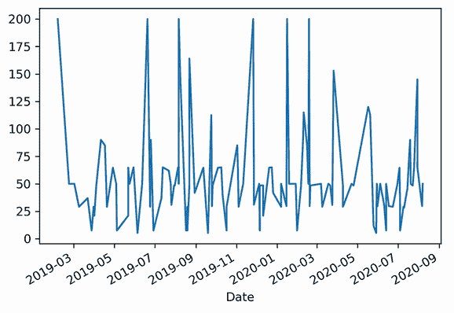
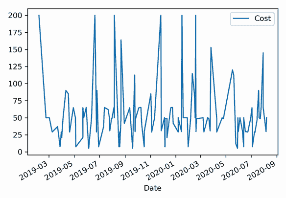
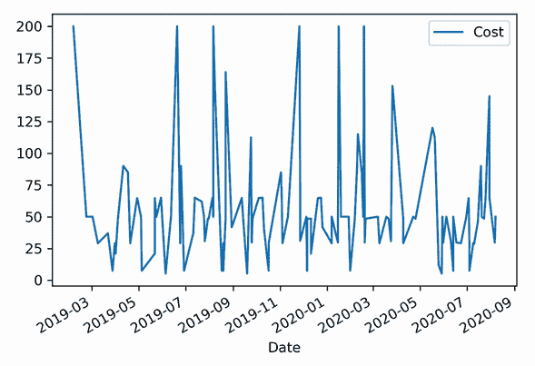
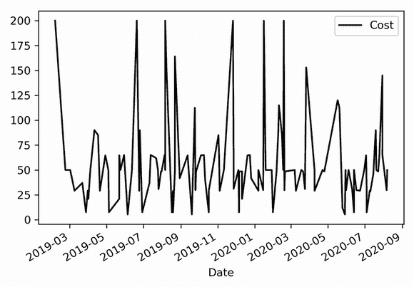
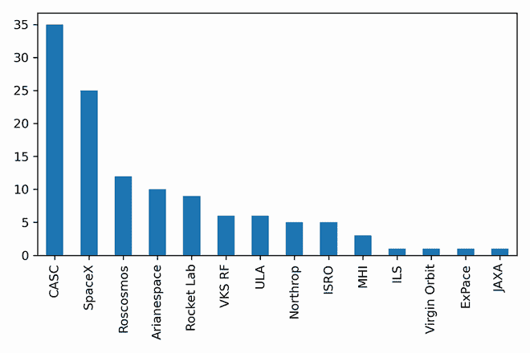
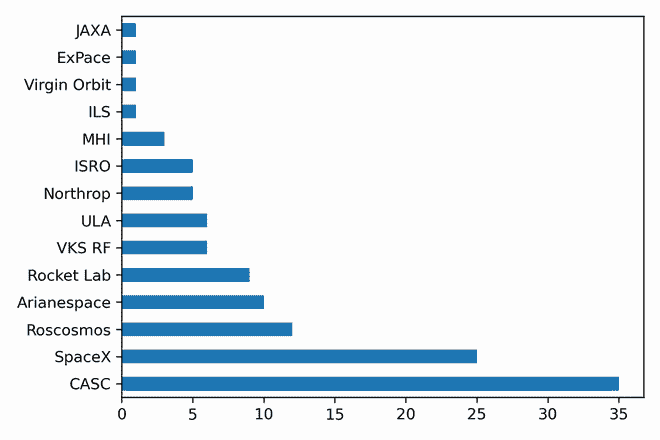
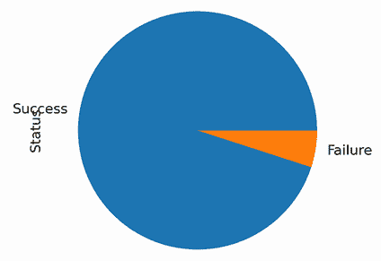
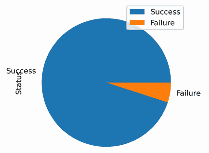

# 14 可视化

本章涵盖

+   安装 Matplotlib 库进行数据可视化

+   使用 pandas 和 Matplotlib 渲染图表和图形

+   将颜色模板应用于可视化

文本形式的 `DataFrame` 摘要很有帮助，但很多时候，一个故事最好通过可视化来讲述。折线图可以快速传达趋势；条形图可以清晰地识别独特的类别及其计数；饼图可以以易于消化的方式表示比例，等等。幸运的是，pandas 与许多流行的 Python 数据可视化库无缝集成，包括 Matplotlib、seaborn 和 ggplot。在本章中，我们将学习如何使用 Matplotlib 从我们的 `Series` 和 `DataFrame`s 中渲染动态图表。我希望这些可视化能帮助您在数据展示中添加一点火花。

## 14.1 安装 matplotlib

默认情况下，pandas 依赖于开源的 Matplotlib 包来渲染图表和图形。让我们在我们的 Anaconda 环境中安装它。

首先，启动您操作系统的终端（macOS）或 Anaconda Prompt（Windows）应用程序。默认的 Anaconda 环境 `base` 应该列在左侧括号内。`base` 是当前活动环境。

当我们安装 Anaconda（见附录 A）时，我们创建了一个名为 `pandas_in_action` 的环境。让我们执行 `conda activate` 命令来激活它。如果您选择了不同的环境名称，请将 `pandas_in_action` 替换为该名称，如下所示：

```
(base) ~$ conda activate pandas_in_action
```

括号应反映活动环境。执行命令 `conda install matplotlib` 在 `pandas_in_action` 环境中安装 Matplotlib 库：

```
(pandas_in_action) ~$ conda install matplotlib
```

当提示确认时，输入 `'Y'` 表示是并按 Enter 键。安装完成后，执行 `jupyter notebook` 并创建一个新的 Notebook。

## 14.2 折线图

如往常一样，让我们首先导入 pandas 库。我们还将从 Matplotlib 库中导入 `pyplot` 包。在这个上下文中，一个 *包* 指的是顶级库中的一个嵌套文件夹。我们可以使用点符号访问 `pyplot` 包，就像访问任何库属性一样。`pyplot` 的一个常见社区别名是 `plt`。

默认情况下，Jupyter Notebook 会将每个 Matplotlib 可视化渲染在单独的浏览器窗口中，就像网站上的弹出窗口一样。窗口可能会有些令人震惊，尤其是当屏幕上有多个图表时。我们可以添加一个额外的行——`%matplotlib inline`——来强制 Jupyter 在单元格下方直接渲染可视化。`%matplotlib inline` 是一个魔法函数，是设置 Notebook 配置选项的语法快捷方式：

```
In  [1] import pandas as pd
        import matplotlib.pyplot as plt
        %matplotlib inline
```

现在来看数据！本章的数据集，space_missions.csv，包含了 2019 年和 2020 年间的 100 多次太空飞行记录。每条记录包括任务日期、赞助公司、地点、成本和状态（"成功"或"失败"）：

```
In  [2] pd.read_csv("space_missions.csv").head()

Out [2]

 **Date Company Name Location    Cost   Status**
0   2/5/19  Arianespace   France  200.00  Success
1  2/22/19       SpaceX      USA   50.00  Success
2   3/2/19       SpaceX      USA   50.00  Success
3   3/9/19         CASC    China   29.15  Success
4  3/22/19  Arianespace   France   37.00  Success
```

在我们将导入的`DataFrame`分配给`space`变量之前，让我们调整两个设置。首先，我们将使用`parse_dates`参数将日期列中的值导入为日期时间。接下来，我们将日期列设置为`DataFrame`的索引：

```
In  [3] space = pd.read_csv(
            "space_missions.csv",
            parse_dates = ["Date"],
            index_col = "Date"
        )

        space.head()

Out [3]

 ** Company Name Location    Cost   Status**
Date
2019-02-05  Arianespace   France  200.00  Success
2019-02-22       SpaceX      USA   50.00  Success
2019-03-02       SpaceX      USA   50.00  Success
2019-03-09         CASC    China   29.15  Success
2019-03-22  Arianespace   France   37.00  Success
```

假设我们想要绘制这个数据集中两年内的飞行成本。*时间序列*图是观察随时间趋势的最佳图表。我们可以在 x 轴上绘制时间，在 y 轴上绘制值。首先，让我们从`DataFrame`的空间中提取成本列。结果是包含数值和日期时间索引的`Series`：

```
In  [4] space["Cost"].head()

Out [4] Date
        2019-02-05    200.00
        2019-02-22     50.00
        2019-03-02     50.00
        2019-03-09     29.15
        2019-03-22     37.00
        Name: Cost, dtype: float64
```

要渲染一个可视化，请在 pandas 数据结构上调用`plot`方法。默认情况下，Matplotlib 绘制一个折线图。Jupyter 还会打印出图表对象在计算机内存中的位置。这个位置会随着每个单元格的执行而不同，所以请随意忽略它：

```
In  [5] space["Cost"].plot()

Out [5] <matplotlib.axes._subplots.AxesSubplot at 0x11e1c4650>
```



真的很花哨！我们已经使用 pandas 的值使用 Matplotlib 渲染了一个折线图。默认情况下，库在 x 轴上绘制索引标签（在这种情况下，日期时间），在 y 轴上绘制`Series`的值。Matplotlib 还计算了两个轴上值范围的合理间隔。

我们也可以在空间`DataFrame`本身上调用`plot`方法。在这种情况下，pandas 产生相同的输出，但仅因为数据集只有一个数值列：

```

In  [6] space.plot()

Out [6] <matplotlib.axes._subplots.AxesSubplot at 0x11ea18790>
```



如果`DataFrame`包含多个数值列，Matplotlib 将为每个列绘制一条单独的线。请注意：如果列之间值的幅度存在较大差距（例如，如果一个数值列的值在百万级别，而另一个在百级别），较大的值可能会轻易地掩盖较小的值。考虑以下`DataFrame`：

```
In  [7] data = [
            [2000, 3000000],
            [5000, 5000000]
        ]

        df = pd.DataFrame(data = data, columns = ["Small", "Large"])
        df

Out [7]

   Small    Large
0   2000  3000000
1   5000  5000000
```

当我们绘制 df `DataFrame`时，Matplotlib 调整图表比例以适应大型列的值。小型列的值趋势变得难以看到：

```
In  [8] df.plot()

Out [8] <matplotlib.axes._subplots.AxesSubplot at 0x7fc48279b6d0>
```


让我们回到空间。`plot`方法接受一个`y`参数来标识 Matplotlib 应该绘制其值的`DataFrame`列。下一个示例传递了成本列，这是渲染相同时间序列图的另一种方式：

```
In  [9] space.plot(y = "Cost")

Out [9] <matplotlib.axes._subplots.AxesSubplot at 0x11eb0b990>
```



我们可以使用`colormap`参数来改变可视化的外观。将这个过程想象成设置图表的颜色主题。该参数接受一个字符串，该字符串来自 Matplotlib 库的预定义调色板。以下示例使用了一个`"gray"`主题，该主题将折线图渲染为黑白：

```
In  [10] space.plot(y = "Cost", colormap = "gray")

Out [10] <matplotlib.axes._subplots.AxesSubplot at 0x11ebef350>
```



要查看`colormaps`参数的有效输入列表，请在`pyplot`库（在我们的笔记本中别名为`plt`）上调用`colormaps`方法。请注意，我们只能在某些条件满足的情况下应用一些主题，例如最小数量的图表线条：

```
In  [11] print(plt.colormaps())

Out [11] ['Accent', 'Accent_r', 'Blues', 'Blues_r', 'BrBG', 'BrBG_r',
          'BuGn', 'BuGn_r', 'BuPu', 'BuPu_r', 'CMRmap', 'CMRmap_r',
          'Dark2', 'Dark2_r', 'GnBu', 'GnBu_r', 'Greens', 'Greens_r',
          'Greys', 'Greys_r', 'OrRd', 'OrRd_r', 'Oranges', 'Oranges_r',
          'PRGn', 'PRGn_r', 'Paired', 'Paired_r', 'Pastel1', 'Pastel1_r',
          'Pastel2', 'Pastel2_r', 'PiYG', 'PiYG_r', 'PuBu', 'PuBuGn',
          'PuBuGn_r', 'PuBu_r', 'PuOr', 'PuOr_r', 'PuRd', 'PuRd_r',
          'Purples', 'Purples_r', 'RdBu', 'RdBu_r', 'RdGy', 'RdGy_r',
          'RdPu', 'RdPu_r', 'RdYlBu', 'RdYlBu_r', 'RdYlGn', 'RdYlGn_r',
          'Reds', 'Reds_r', 'Set1', 'Set1_r', 'Set2', 'Set2_r', 'Set3',
          'Set3_r', 'Spectral', 'Spectral_r', 'Wistia', 'Wistia_r', 'YlGn',
          'YlGnBu', 'YlGnBu_r', 'YlGn_r', 'YlOrBr', 'YlOrBr_r', 'YlOrRd',
          'YlOrRd_r', 'afmhot', 'afmhot_r', 'autumn', 'autumn_r', 'binary',
          'binary_r', 'bone', 'bone_r', 'brg', 'brg_r', 'bwr', 'bwr_r',
          'cividis', 'cividis_r', 'cool', 'cool_r', 'coolwarm',
          'coolwarm_r', 'copper', 'copper_r', 'cubehelix', 'cubehelix_r',
          'flag', 'flag_r', 'gist_earth', 'gist_earth_r', 'gist_gray',
          'gist_gray_r', 'gist_heat', 'gist_heat_r', 'gist_ncar',
          'gist_ncar_r', 'gist_rainbow', 'gist_rainbow_r', 'gist_stern',
          'gist_stern_r', 'gist_yarg', 'gist_yarg_r', 'gnuplot',
          'gnuplot2', 'gnuplot2_r', 'gnuplot_r', 'gray', 'gray_r', 'hot',
          'hot_r', 'hsv', 'hsv_r', 'inferno', 'inferno_r', 'jet', 'jet_r',
          'magma', 'magma_r', 'nipy_spectral', 'nipy_spectral_r', 'ocean',
          'ocean_r', 'pink', 'pink_r', 'plasma', 'plasma_r', 'prism',
          'prism_r', 'rainbow', 'rainbow_r', 'seismic', 'seismic_r',
          'spring', 'spring_r', 'summer', 'summer_r', 'tab10', 'tab10_r',
          'tab20', 'tab20_r', 'tab20b', 'tab20b_r', 'tab20c', 'tab20c_r',
          'terrain', 'terrain_r', 'twilight', 'twilight_r',
          'twilight_shifted', 'twilight_shifted_r', 'viridis', 'viridis_r',
          'winter', 'winter_r']
```

Matplotlib 提供了超过 150 种可用的颜色图可供选择。该库还提供了手动自定义图表的方法。

## 14.3 柱状图

`plot` 方法的 `kind` 参数会改变 Matplotlib 渲染的图表类型。柱状图是展示数据集中唯一值计数的绝佳选择，因此我们可以用它来可视化每家公司赞助的太空飞行次数。

首先，我们将针对“公司名称”列并调用 `value_counts` 方法来返回按公司计算的使命计数的 `Series`：

```
In  [12] space["Company Name"].value_counts()

Out [12] CASC            35
         SpaceX          25
         Roscosmos       12
         Arianespace     10
         Rocket Lab       9
         VKS RF           6
         ULA              6
         Northrop         5
         ISRO             5
         MHI              3
         Virgin Orbit     1
         JAXA             1
         ILS              1
         ExPace           1
         Name: Company Name, dtype: int64
```

接下来，让我们在 `Series` 上调用 `plot` 方法，将 `kind` 参数的参数传递为 `"bar"`。Matplotlib 再次在 x 轴上绘制索引标签，在 y 轴上绘制值。看起来 CASC 在数据集中有最多的条目，其次是 SpaceX：

```
In  [13] space["Company Name"].value_counts().plot(kind = "bar")

Out [13] <matplotlib.axes._subplots.AxesSubplot at 0x11ecd6310>
```



图表是一个良好的开始，但我们必须转动头部才能读取标签。哎呀。让我们将 `kind` 参数更改为 `"barh"` 以渲染一个水平柱状图：

```
In  [14] space["Company Name"].value_counts().plot(kind = "barh")

Out [14] <matplotlib.axes._subplots.AxesSubplot at 0x11edf0190>
```



现在好多了！现在我们可以轻松地识别哪些公司在数据集中有最多的太空飞行次数。

## 14.4 饼图

*饼图*是一种可视化，其中彩色切片组合形成一个完整的圆形饼图（就像披萨的片状）。每一部分都直观地表示它对总量的贡献比例。

让我们使用饼图来比较成功任务与失败任务的比例。状态列只有两个唯一值：“成功”和“失败”。首先，我们将使用 `value_counts` 方法来计算每个值的出现次数：

```
In  [15] space["Status"].value_counts()

Out [15] Success    114
         Failure      6
         Name: Status, dtype: int64
```

让我们再次调用 `plot` 方法。这次，我们将 `kind` 参数的参数设置为 `"pie"`：

```
In  [16] space["Status"].value_counts().plot(kind = "pie")

Out [16] <matplotlib.axes._subplots.AxesSubplot at 0x11ef9ea90>
```



好消息！看起来大多数太空飞行都是成功的。

要向此类可视化添加图例，我们可以将 `legend` 参数的参数设置为 `True`：

```
In  [17] space["Status"].value_counts().plot(kind = "pie", legend = True)

Out [17] <matplotlib.axes._subplots.AxesSubplot at 0x11eac1a10>
```

Matplotlib 支持广泛的附加图表和图形，包括直方图、散点图和箱线图。我们可以包括额外的参数来自定义这些可视化的美学、标签、图例和交互性。我们只是触及了这个强大库可以渲染的表面。



## 概述

+   Pandas 与 Matplotlib 库无缝集成，用于数据可视化。它还与 Python 数据科学生态系统中其他绘图库兼容得很好。

+   在 `Series` 或 `DataFrame` 上的 `plot` 方法会渲染一个包含 pandas 数据结构数据的可视化。

+   Matplotlib 默认的图表是折线图。

+   `plot` 方法的 `kind` 参数会改变渲染的可视化类型。选项包括折线图、柱状图和饼图。

+   `colormap`参数会改变渲染图形的颜色方案。Matplotlib 有数十个预定义的模板，用户也可以通过调整方法参数来创建自己的模板。
