# 附录 A. 安装和设置

欢迎来到补充材料！本附录将指导您在 macOS 和 Windows 操作系统上安装 Python 编程语言和 pandas 库。*库*（也称为*包*）是一系列功能，它扩展了核心编程语言的功能——一个扩展包或附加组件，它为开发者在使用该语言时遇到的常见挑战提供解决方案。Python 生态系统包括数千个针对统计、HTTP 请求和数据库管理等领域的包。

*依赖项*是我们需要安装以运行其他软件的软件组件。Pandas 不是一个独立的包；它包含一系列依赖项，包括 NumPy 和 pytz 库。这些库可能需要它们自己的依赖项。我们不需要了解所有这些其他包的功能，但我们需要安装它们，以便 pandas 能够正常工作。

## A.1 Anaconda 发行版

开源库通常由不同时间线的独立贡献者团队开发。不幸的是，隔离的开发周期可能会在库版本之间引入兼容性问题。在不升级其依赖项的情况下安装库的最新版本可能会导致其无法正常工作，例如。

为了简化 pandas 及其依赖项的安装和管理，我们将依赖一个名为 Anaconda 的 Python 发行版。*发行版*是一组软件，它将多个应用程序及其依赖项捆绑在一个简单的安装程序中。Anaconda 拥有超过 2000 万用户，是 Python 中进行数据科学的最受欢迎的发行版。

Anaconda 安装 Python 和一个名为`conda`的强大环境管理系统。*环境*是一个独立的代码执行沙盒——一种可以安装 Python 和一系列包的游乐场。为了实验不同的 Python 版本、不同的 pandas 版本、不同的包组合或任何介于两者之间的东西，我们创建一个新的`conda`环境。图 A.1 展示了三个假设的`conda`环境，每个环境都有不同的 Python 版本。

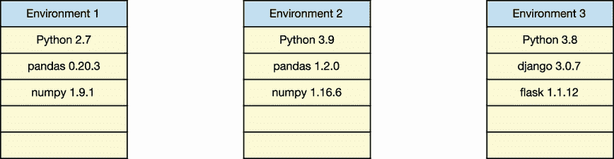

图 A.1 具有不同 Python 版本和不同包的三个 Anaconda 环境

环境的优势在于隔离。一个环境中的更改不会影响其他任何环境，因为`conda`将它们存储在不同的文件夹中。因此，我们可以轻松地处理多个项目，每个项目都需要不同的配置。当您将包安装到环境中时，`conda`也会安装适当的依赖项，并确保不同库版本之间的兼容性。简而言之，`conda`是使您的计算机上能够进行多个 Python 工具安装和配置的有效方式。

这只是一个宏观介绍！现在让我们开始实际操作，安装 Anaconda。前往 [www.anaconda.com/products/individual](http://www.anaconda.com/products/individual)，找到适用于您的操作系统的安装程序下载部分。您可能会看到多个 Anaconda 安装程序的版本：

+   如果您在图形安装程序和命令行安装程序之间有选择，请选择图形安装程序。

+   如果您可以选择 Python 版本，请选择最新的版本。与大多数软件一样，较大的版本号表示较新的发布。Python 3 比 Python 2 新，Python 3.9 比 Python 3.8 新。在学习新技术时，最好从最新版本开始。不用担心；`conda` 允许您创建使用较早版本 Python 的环境，如果您需要的话。

+   如果您是 Windows 用户，您可能会在 64 位和 32 位安装程序之间进行选择。我们将在 A.3 节中讨论选择哪一个。

到此为止，macOS 和 Windows 操作系统的设置过程将有所不同。在本附录中找到适当的子节，并从那里继续。

## A.2 macOS 安装过程

让我们一步步在 macOS 计算机上安装 Anaconda。

### A.2.1 在 macOS 中安装 Anaconda

您的 Anaconda 下载将包含一个单独的 .pkg 安装程序文件。文件名可能包含 Anaconda 版本号和操作系统（例如 Anaconda3-2021.05-MacOSX-x86_64）。在文件系统中定位安装程序，并双击它以开始安装。

在第一个屏幕上点击继续按钮。在 README 屏幕上，安装程序提供了 Anaconda 的快速概述，值得浏览（见图 A.2）。

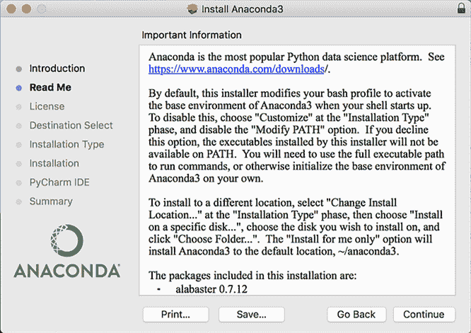

图 A.2 macOS 计算机上的 Anaconda 安装屏幕

安装会创建一个名为 `base` 的起始 `conda` 环境，其中包含超过 250 个预选的数据分析包。您稍后可以创建额外的环境。安装程序还会通知您，每次您启动 shell 时，它都会激活此 `base` 环境；我们将在 A.2.2 节中讨论此过程是如何工作的。现在，请相信这部分安装过程是必需的，并继续前进。

继续浏览任何剩余的屏幕。接受许可协议和空间要求。您将获得自定义安装目录的选项；是否进行自定义完全取决于您。请注意，该发行版是自包含的；Anaconda 会将其自身安装到您的计算机上的一个目录中。因此，如果您想卸载 Anaconda，您可以删除该目录。

安装可能需要几分钟。完成安装后，点击下一步直到退出安装程序。

### A.2.2 启动终端

Anaconda 随附一个名为 Navigator 的图形程序，它使得创建和管理 `conda` 环境变得容易。然而，在我们启动它之前，我们将使用更传统的终端应用程序向 `conda` 环境管理器发出命令。

*终端* 是一个用于向 macOS 操作系统发出命令的应用程序。在现代图形用户界面（GUI）存在之前，用户完全依赖于基于文本的应用程序来与计算机交互。在终端中，你输入文本然后按 Enter 键执行它。我建议我们在掌握 Anaconda Navigator 之前先掌握终端，因为了解软件为我们抽象的复杂性是很重要的，在我们依赖其快捷方式之前。

打开一个 Finder 窗口，导航到应用程序目录，你将在实用工具文件夹中找到终端应用程序。启动应用程序。我还建议将终端应用程序的图标拖到 Dock 中以便于访问。

终端应在闪烁提示符之前，在括号内列出激活的 `conda` 环境名称。作为提醒，Anaconda 在安装期间创建了一个 `base` 起始环境。图 A.3 显示了一个激活了 `base` 环境的示例终端窗口。

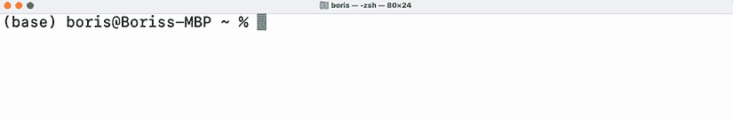

图 A.3 macOS 机器上的终端。当前激活的 `conda` 环境是 `base`。

每次我们启动终端时，Anaconda 都会激活 `conda` 环境管理器和 `base` 环境。

### A.2.3 常见终端命令

我们只需要记住少数几个命令就可以有效地使用终端。在终端中，我们可以像在 Finder 中一样在计算机的目录中导航。`pwd`（打印工作目录）命令输出我们所在的文件夹：

```
(base) ~$ pwd
/Users/boris
```

`ls`（列表）命令列出当前目录内的文件和文件夹：

```
(base) ~$ ls
Applications Documents    Google Drive Movies       Pictures     anaconda3
Desktop      Downloads    Library      Music        Public
```

一些命令接受标志。*标志* 是我们添加到命令后面的配置选项，以修改其执行方式。其语法由一系列短横线和文本字符组成。这里有一个例子。单独的 `ls` 命令只显示公共文件和文件夹。我们可以向命令中添加 `--all` 标志来显示隐藏的文件。一些标志支持多个语法选项。例如，`ls -a` 是 `ls --all` 的快捷方式。请亲自尝试这两个命令。

`cd`（更改目录）命令导航到指定的目录。在命令后立即输入目录名，确保包含一个空格。在下一个示例中，我们将导航到桌面目录：

```
(base) ~$ cd Desktop
```

我们可以使用 `pwd`（打印工作目录）命令输出我们的当前位置：

```
(base) ~/Desktop$ pwd
/Users/boris/Desktop
```

在 `cd` 命令后跟一对点号可以向上导航文件夹层次结构：

```
(base) ~/Desktop$ cd ..

(base) ~$ pwd
/Users/boris
```

终端具有强大的自动完成功能。在您的用户目录中，输入 `cd Des` 并按 Tab 键以自动完成到 `cd Desktop`。终端查看可用的文件和文件夹列表，并确定只有 `Desktop` 与我们输入的 `Des` 模式匹配。如果有多个匹配项，终端将完成名称的一部分。如果一个目录包含两个文件夹，`Anaconda` 和 `Analytics`，并且您输入字母 `A`，终端将自动完成 `Ana`，这是两个选项中的常见字母。您需要输入额外的字母并再次按 Tab 键，以便终端自动完成名称的其余部分。

到目前为止，我们已经获得了开始使用 `conda` 环境管理器所需的所有知识。跳转到 A.4 部分，我们将与我们的 Windows 朋友们见面，并设置我们的第一个 `conda` 环境！

## A.3 Windows 设置过程

让我们一起来了解一下如何在 Windows 计算机上安装 Anaconda。

### A.3.1 在 Windows 中安装 Anaconda

Windows 的 Anaconda 安装程序提供 32 位和 64 位版本。这些选项描述了与您的计算机一起安装的处理器类型。如果您不确定要下载哪个版本，请打开开始菜单，并选择系统信息应用。在应用的主屏幕上，您将看到一个由“项目”和“值”列组成的表格。查找“系统”“类型”项目；其值将包括 `x64` 如果您的计算机运行的是 64 位版本的 Windows，或者 `x86` 如果您的计算机运行的是 32 位版本的 Windows。图 A.4 显示了具有突出显示的系统类型行的 Windows 计算机上的系统信息应用。

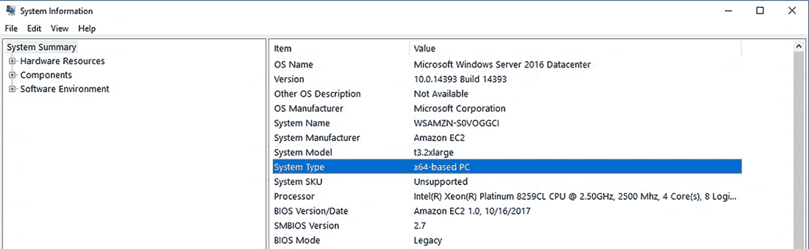

图 A.4 64 位 Windows 计算机上的系统信息应用

您的 Anaconda 下载将包含一个单独的 .exe 安装程序文件。文件名将包括 Anaconda 版本号和操作系统（例如 Anaconda3-2021.05-Windows-x86_64）。在您的文件系统中定位该文件，并双击它以启动安装程序。

通过前几个安装屏幕。您将被提示接受许可协议，选择是否为单个或所有用户安装 Anaconda，以及选择安装目录。选择默认选项是可以的。

当您到达高级安装选项屏幕时，如果您已经在计算机上安装了 Python，取消选中“将 Anaconda 注册为我的默认 Python”复选框可能是个好主意。取消选中该选项可以防止安装将 Anaconda 设置为计算机上的默认 Python 版本。如果您是第一次安装 Python，保留该选项选中应该没问题。

安装创建了一个名为 `base` 的起始 `conda` 环境，其中包含超过 250 个预先选择的数据分析包。您稍后可以创建额外的环境。

安装可能需要几分钟。图 A.5 显示了安装过程的示例。当安装完成后，退出安装程序。

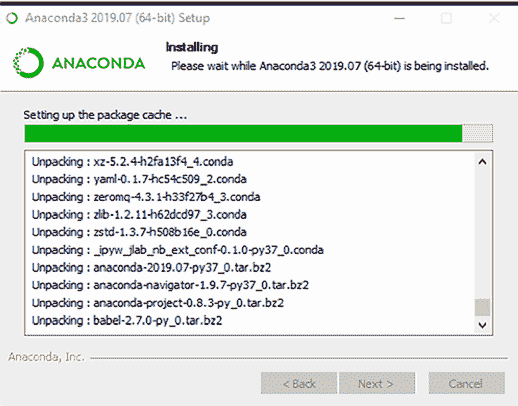

![图 A.5 Windows 电脑上的 Anaconda 安装过程]

如果你想要卸载 Anaconda，请启动开始菜单，并选择“添加或删除程序”。找到 Anaconda 程序，点击“卸载”按钮，然后按照提示中的步骤从计算机中删除该分布。请注意，此过程将删除所有 `conda` 环境、它们安装的包以及 Python 版本。

### A.3.2 启动 Anaconda Prompt

Anaconda 随附一个名为 Navigator 的图形程序，它使得创建和管理 `conda` 环境变得容易。然而，在我们启动它之前，我们将使用一个更传统的命令行应用程序来向 `conda` 环境管理器发出命令。在依赖其快捷方式之前，理解 Navigator 为我们解决的问题很重要。

*Anaconda Prompt* 是一个用于向 Windows 操作系统发出文本命令的应用程序。我们输入一个命令，然后按 Enter 键执行它。在现代 GUI 存在之前，用户完全依赖于像这样一个基于命令的应用程序来与计算机交互。打开开始菜单，找到 Anaconda Prompt，然后启动应用程序。

Anaconda Prompt 应始终在其闪烁的提示符之前用一对括号列出活动的 `conda` 环境。目前，你应该看到 `base`，这是 Anaconda 在安装期间创建的起始环境。图 A.6 显示了具有活动 `base` 环境的 Anaconda Prompt。

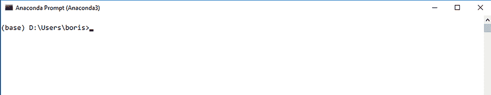


当 Anaconda Prompt 启动时，将激活 `base` 环境。在 A.3.4 节中，我们将介绍如何使用 `conda` 创建和激活新环境。

### A.3.3 常见的 Anaconda Prompt 命令

我们只需要记住少数几个命令，就可以有效地使用 Anaconda Prompt。我们可以像在 Windows 资源管理器中一样在计算机的目录中导航。`dir`（目录）命令列出当前目录中的所有文件和文件夹：

```
(base) C:\Users\Boris>dir
 Volume in drive C is OS
 Volume Serial Number is 6AAC-5705

 Directory of C:\Users\Boris

08/15/2019 03:16 PM <DIR> .
08/15/2019 03:16 PM <DIR> ..
09/20/2017 02:45 PM <DIR> Contacts
08/18/2019 11:21 AM <DIR> Desktop
08/13/2019 03:50 PM <DIR> Documents
08/15/2019 02:51 PM <DIR> Downloads
09/20/2017 02:45 PM <DIR> Favorites
05/07/2015 09:56 PM <DIR> Intel
06/25/2018 03:35 PM <DIR> Links
09/20/2017 02:45 PM <DIR> Music
09/20/2017 02:45 PM <DIR> Pictures
09/20/2017 02:45 PM <DIR> Saved Games
09/20/2017 02:45 PM <DIR> Searches
09/20/2017 02:45 PM <DIR> Videos
              1 File(s) 91 bytes
             26 Dir(s) 577,728,139,264 bytes free
```

`cd`（更改目录）命令可以导航到指定的目录。在命令后立即输入目录名，确保包含一个空格。在下一个示例中，我们将导航到桌面目录：

```
(base) C:\Users\Boris>cd Desktop

(base) C:\Users\Boris\Desktop>
```

在 `cd` 后跟一对点号可以向上导航文件夹层次结构：

```
(base) C:\Users\Boris\Desktop>cd ..

(base) C:\Users\Boris>
```

Anaconda Prompt 具有强大的自动完成功能。在你的用户目录中，输入`cd Des`并按 Tab 键以自动完成它为`cd Desktop`。Anaconda Prompt 查看可用的文件和文件夹列表，并确定只有`Desktop`与我们所输入的`Des`模式匹配。如果有多个匹配项，Anaconda Prompt 将完成名称的一部分。如果一个目录包含两个文件夹，`Anaconda`和`Analytics`，而你输入字母`A`，Anaconda Prompt 将自动完成`Ana`，这是两个选项中的共同字母。你将需要输入额外的字母并再次按 Tab 键，以便 Prompt 自动完成名称的其余部分。

到目前为止，我们已经拥有了开始使用`conda`环境管理器所需的所有知识。让我们创建我们的第一个`conda`环境！

## A.4 创建新的 Anaconda 环境

恭喜你——你已在 macOS 或 Windows 机器上成功安装了 Anaconda 发行版。现在让我们创建一个示例`conda`环境，我们将用它来学习本书。请注意，本节中的代码示例来自 macOS 计算机。尽管两个操作系统之间的输出可能略有不同，但 Anaconda 命令保持不变。

打开终端（macOS）或 Anaconda Prompt（Windows）。Anaconda 的默认`base`环境应该处于激活状态。查看提示符左侧是否有包含`base`一词的括号，以确认其存在。

首先，让我们通过发出一个示例命令来确认我们已成功安装了`conda`环境管理器。这里有一个简单的命令：让`conda`显示其版本号。请注意，你的版本可能与以下输出中的版本不同，但只要命令返回任何数字，就表示`conda`已成功安装：

```
(base) ~$ conda –-version
conda 4.10.1
```

`conda info`命令返回有关`conda`的技术细节列表。输出包括当前活动环境和它在硬盘上的位置。以下是输出摘要：

```
(base) ~$ conda info

     active environment : base
    active env location : /opt/anaconda3
            shell level : 1
       user config file : /Users/boris/.condarc
 populated config files : /Users/boris/.condarc
          conda version : 4.10.1
    conda-build version : 3.18.9
         python version : 3.7.4.final.0
```

我们可以使用标志来自定义和配置`conda`命令。*标志*是我们添加到命令之后的一个配置选项，用于修改其执行方式。其语法由一系列短横线和文本字符组成。`--envs`标志用于`info`命令，列出所有环境和它们在计算机上的位置。星号（`*`）标记了活动环境：

```
(base) ~$ conda info --envs
# conda environments:
#
base                  *  /Users/boris/anaconda3
```

每个`conda`命令都支持`--help`标志，该标志会输出命令的文档。让我们将此标志添加到`conda info`命令中：

```
(base) ~$ conda info --help
usage: conda info [-h] [--json] [-v] [-q] [-a] [--base] [-e] [-s]
                  [--unsafe-channels]

Display information about current conda install.

Options:

optional arguments:
  -h, --help         Show this help message and exit.
  -a, --all          Show all information.
  --base             Display base environment path.
  -e, --envs         List all known conda environments.
  -s, --system       List environment variables.
  --unsafe-channels  Display list of channels with tokens exposed.

Output, Prompt, and Flow Control Options:
  --json             Report all output as json. Suitable for using conda
                     programmatically.
  -v, --verbose      Use once for info, twice for debug, three times for
                     trace.
  -q, --quiet        Do not display progress bar.
```

让我们创建一个新的游乐场来玩耍。`conda create`命令生成一个新的`conda`环境。我们必须使用`--name`标志为环境提供名称。我选择了一个合适的标题`pandas_in_action`；你可以选择你喜欢的任何环境名称。当`conda`提示确认时，输入`y`（代表是）并按 Enter 键确认：

```
(base) ~$ conda create --name pandas_in_action
Collecting package metadata (current_repodata.json): done
Solving environment: done

## Package Plan ##

  environment location: /opt/anaconda3/envs/pandas_in_action

Proceed ([y]/n)? y

Preparing transaction: done
Verifying transaction: done
Executing transaction: done
#
# To activate this environment, use
#
#     $ conda activate pandas_in_action
#
# To deactivate an active environment, use
#
#     $ conda deactivate
```

默认情况下，`conda`在新环境中安装最新的 Python 版本。要自定义语言版本，请在命令末尾添加关键字`python`，输入一个等号，并声明所需的版本。以下示例展示了如何创建一个名为`sample`的环境，并使用 Python 3.7：

```
(base) ~$ conda create --name sample python=3.7
```

使用`conda env remove`命令删除一个环境。提供`--name`标志，指定您想要删除的环境。以下代码示例删除了我们创建的`sample`环境：

```
(base) ~$ conda env remove --name sample
```

现在已经创建了`pandas_in_action`环境，我们可以激活它。`conda activate`命令在终端或 Anaconda 提示符中设置活动环境。提示符前的文本将更改为反映新的活动环境：

```
(base) ~$ conda activate pandas_in_action

(pandas_in_action) ~$
```

所有`conda`命令都在活动环境中执行。如果我们要求`conda`安装一个 Python 软件包，例如，`conda`现在将在`pandas_in_action`中安装它。我们想要安装以下软件包：

+   核心库`pandas`

+   我们将在此处编写代码的`jupyter`开发环境

+   用于速度加速的`bottleneck`和`numexpr`库

`conda` `install` 命令在活动的`conda`环境中下载并安装软件包。在命令后立即添加四个软件包，用空格分隔：

```
(pandas_in_action) ~$ conda install pandas jupyter bottleneck numexpr
```

如前所述，这四个库有依赖关系。`conda`环境管理器将输出所有需要安装的软件包的列表。以下是输出的一部分。如果您看到不同的库列表或版本号，这是正常的；`conda`会处理兼容性问题。

```
Collecting package metadata (repodata.json): done
Solving environment: done

## Package Plan ##

  environment location: /opt/anaconda3/envs/pandas_in_action

  added / updated specs:
    - bottleneck
    - jupyter
    - numexpr
    - pandas

The following packages will be downloaded:

    package                    |            build
    ---------------------------|-----------------
    appnope-0.1.2              |py38hecd8cb5_1001          10 KB
    argon2-cffi-20.1.0         |   py38haf1e3a3_1          44 KB
    async_generator-1.10       |             py_0          24 KB
    certifi-2020.12.5          |   py38hecd8cb5_0         141 KB
    cffi-1.14.4                |   py38h2125817_0         217 KB
    ipython-7.19.0             |   py38h01d92e1_0         982 KB
    jedi-0.18.0                |   py38hecd8cb5_0         906 KB
    #... more libraries
```

输入`y`并按 Enter 键安装所有软件包及其依赖项。

如果您忘记了环境中安装的软件包，请使用`conda` `list`命令查看完整的列表。输出包括每个库的版本：

```
(pandas_in_action) ~$ conda list

# packages in environment at /Users/boris/anaconda3/envs/pandas_in_action:
#
# Name                    Version             Build  Channel
jupyter                   1.0.0           py39hecd8cb5_7
pandas                    1.2.4           py39h23ab428_0
```

如果您想从一个环境中删除软件包，请使用`conda uninstall`命令。以下是一个使用 pandas 的示例：

```
(pandas_in_action) ~$ conda uninstall pandas
```

我们准备好探索我们的开发环境了。我们可以使用命令`jupyter notebook`启动 Jupyter Notebook 应用程序：

```
(pandas_in_action) ~$ jupyter notebook
```

Jupyter Notebook 在您的计算机上启动一个本地服务器以运行核心 Jupyter 应用程序。我们需要一个持续运行的服务器，以便它可以观察我们编写的 Python 代码并立即执行它。

Jupyter Notebook 应用程序应在您的系统默认网页浏览器中打开。您也可以通过在地址栏中导航到 localhost:8888/来访问应用程序；localhost 指的是您的计算机，8888 是应用程序运行的端口。就像码头包括多个港口以欢迎多艘船只一样，您的计算机（localhost）也有多个端口，以便在您的本地服务器上运行多个程序。图 A.7 显示了 Jupyter Notebook 的主界面，列出了当前目录中的文件和文件夹。

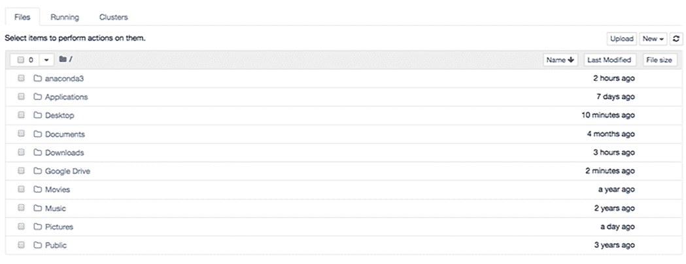

图 A.7 Jupyter Notebook 的主界面

Jupyter Notebook 界面类似于 Finder（macOS）或 Windows 资源管理器（Windows）。文件夹和文件按字母顺序组织。您可以点击文件夹来导航到下一个目录，并使用顶部的导航栏向上导航。探索几秒钟。当您熟悉导航后，关闭浏览器。

注意，关闭浏览器并不会关闭正在运行的 Jupyter 服务器。我们需要在终端或 Anaconda Prompt 中按两次键盘快捷键 Ctrl-C 来终止 Jupyter 服务器。

注意，每次您启动终端（macOS）或 Anaconda Prompt（Windows）时，您都需要再次激活 `pandas_in_action` 环境。尽管 Anaconda 的 `base` 环境包括 pandas，但我建议为每本 Python 书籍或教程创建一个新的环境。多个环境确保了不同项目之间 Python 依赖项的分离。例如，一个教程可能使用 pandas 1.1.3，而另一个可能使用 pandas 1.2.0。当您单独安装、升级和处理依赖项时，技术错误的可能性更小。

这里提醒您每次启动终端或 Anaconda Prompt 时需要做什么：

```
(base) ~$ conda activate pandas_in_action

(pandas_in_action) ~$ jupyter notebook
```

第一个命令激活 `conda` 环境，第二个命令启动 Jupyter Notebook。

## A.5 Anaconda 导航器

*Anaconda* *Navigator* 是一个用于管理 `conda` 环境的图形程序。尽管其功能集不如 `conda` 命令行工具全面，但 Anaconda Navigator 提供了一种视觉友好、适合初学者的方式来使用 `conda` 创建和管理环境。您可以在 Finder（macOS）中的应用程序文件夹或 Windows 的开始菜单中找到 Anaconda Navigator。图 A.8 显示了 Anaconda 导航器应用程序的主界面。


图 A.8 Anaconda 导航器主界面

在左侧菜单中点击环境选项卡以显示所有环境的列表。选择一个 `conda` 环境，以查看其已安装的包，包括它们的描述和版本号。

在底部面板中，点击创建按钮以启动新的环境创建提示。给环境命名，并选择要安装的 Python 版本。结果对话框显示 `conda` 将创建环境的位置（图 A.9）。

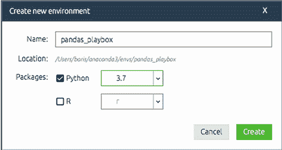

图 A.9 创建新的 Anaconda 环境

要安装包，在左侧列表中选择一个环境。在包列表上方，点击下拉菜单并选择所有以查看所有包（图 A.10）。

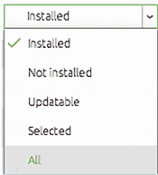

图 A.10 Anaconda 包搜索

在右侧的搜索框中，搜索一个示例库，例如 pandas。在搜索结果中找到它，并选择相应的复选框（图 A.11）。

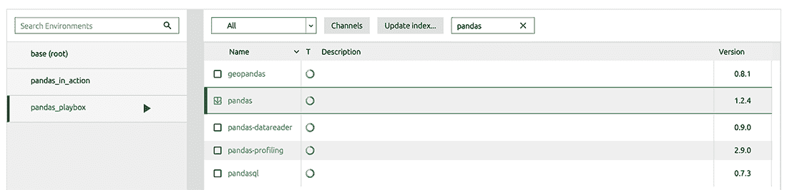

图 A.11 在 Anaconda 导航器中搜索并选择 pandas 包

最后，点击右下角的绿色应用按钮来安装库。

让我们删除我们创建的 `pandas_playbox` 环境。因为我们已经在终端或 Anaconda Prompt 中创建了一个 `pandas_in_action` 环境，所以我们不再需要它。请确保在左侧环境列表中选择 `pandas_playbox`。然后点击底部面板上的删除按钮，并在确认对话框中再次点击（图 A.12）。

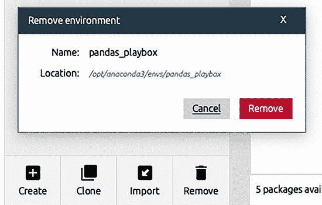

图 A.12 在 Anaconda Navigator 中删除我们创建的环境

要从 Anaconda Navigator 启动 Jupyter Notebook，点击左侧导航菜单的“主页”标签。在此屏幕上，你会看到当前环境中安装的应用程序的磁贴。屏幕顶部有一个下拉菜单，你可以从中选择活动的 `conda` 环境。请确保选择我们为本书创建的 `pandas_in_action` 环境。然后你可以通过点击其应用程序磁贴来启动 Jupyter Notebook。此操作等同于在终端或 Anaconda Prompt 中执行 `jupyter notebook`。

## A.6 Jupyter Notebook 的基础知识

*Jupyter* *Notebook* 是一个用于 Python 的交互式开发环境，由一个或多个单元格组成，每个单元格包含 Python 代码或 Markdown。Markdown 是一种文本格式化标准，我们可以用它来在笔记本中添加标题、文本段落、项目符号列表、嵌入图像等。我们用 Python 编写我们的逻辑，用 Markdown 组织我们的思想。在阅读本书的过程中，请随时使用 Markdown 来记录材料。Markdown 的完整文档可在 [`daringfireball.net/projects/markdown/syntax`](https://daringfireball.net/projects/markdown/syntax) 找到。

在 Jupyter 启动屏幕上，点击右侧菜单中的新建按钮，然后选择 Python 3 来创建一个新的 Notebook（图 A.13）。

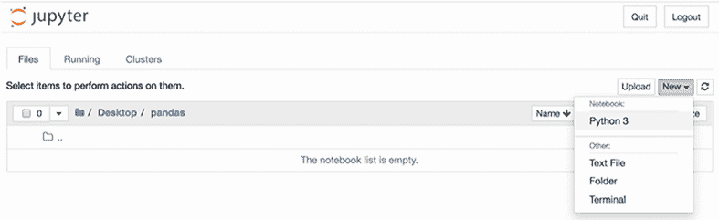

图 A.13 创建 Jupyter Notebook

要给 Notebook 命名，点击顶部的“未命名”文本，并在对话框中输入一个名称。Jupyter Notebook 使用 .ipynb 扩展名保存其文件，这是 IPython Notebooks 的简称，是 Jupyter Notebooks 的前身。你可以导航回 Jupyter Notebook 选项卡，查看目录中的新 .ipynb 文件。

Notebook 运行在两种模式：命令和编辑。当单元格被选中时点击单元格或按 Enter 键将触发编辑模式。Jupyter 会用绿色边框突出显示单元格。在编辑模式下，Jupyter 会逐字解释你的键盘输入。我们使用此模式在选定的单元格中输入字符。图 A.14 显示了编辑模式下的一个示例 Jupyter 单元格。


图 A.14 编辑模式下的空 Jupyter Notebook 单元格

在笔记本的导航菜单下方，你可以找到一个用于常见快捷键的工具栏。工具栏右端的下拉菜单显示了当前单元格的类型。点击下拉菜单以显示可用单元格选项的列表，并选择代码或 Markdown 来将单元格更改为该类型（图 A.15）。


图 A.15 更改 Jupyter Notebook 单元格的类型

Jupyter Notebook 最好的特性之一是其试错式开发方法。我们在 `代码` 单元格中输入 Python 代码然后执行它。Jupyter 在单元格下方输出结果。我们检查结果是否与预期相符，并继续这个过程。这种方法鼓励积极实验；我们总是通过键盘敲击就能看到代码行带来的差异。

让我们执行一些基本的 Python 代码。在笔记本的第一个单元格中输入以下数学表达式，然后点击工具栏上的运行按钮来执行它：

```
In  [1]: 1 + 1

Out [1]: 2
```

代码左侧的框（在先前的例子中显示数字 1）标记了单元格相对于 Jupyter Notebook 的启动或重启的执行顺序。你可以按任何顺序执行单元格，并且可以多次执行相同的单元格。

随着你阅读这本书，我鼓励你通过在 Jupyter 单元格中执行不同的代码片段进行实验。因此，如果你的执行次数与文本中的不一致是正常的。

如果单元格包含多行代码，Jupyter 将输出最后一个表达式的评估。请注意，Python 仍然会运行单元格中的所有代码；我们只看到最后一个表达式。

```
In  [2]: 1 + 1
         3 + 2

Out [2]: 5
```

*解释器* 是解析你的 Python 源代码并执行它的软件。Jupyter Notebook 依赖于 IPython（交互式 Python），这是一个增强的解释器，具有提高开发者生产力的额外功能。例如，你可以使用 Tab 键来显示任何 Python 对象上的可用方法和属性。下一个例子显示了 Python 字符串上的可用方法。输入任何字符串和一个点；然后按 Tab 来查看对话框。图 A.16 展示了一个字符串的例子。如果你不熟悉 Python 的核心数据结构，请参阅附录 B 以获得对语言的全面介绍。

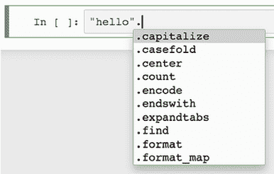

图 A.16 Jupyter Notebook 的自动完成功能

你可以在 `代码` 单元格中输入任何数量的 Python 代码，但最好保持单元格的大小合理，以提高可读性和理解性。如果你的逻辑很复杂，可以将操作拆分到几个单元格中。

你可以使用两种键盘快捷键之一在 Jupyter Notebook 中执行单元格。按 Shift-Enter 来执行单元格并将焦点移动到下一个单元格，按 Ctrl-Enter 来执行单元格并保持焦点在原始单元格上。练习重新执行前两个单元格以查看这种差异的实际效果。

按下 Esc 键以激活命令模式，这是笔记本的管理模式。在此模式下可用的操作更全局；它们影响整个笔记本而不是单个特定单元格。在此模式下，键盘字符作为快捷键。以下是当笔记本处于命令模式时一些有用的键盘快捷键：

| 键盘快捷键 | 描述 |
| --- | --- |
| 上箭头键和下箭头键 | 在笔记本单元格之间导航。 |
| a | 在所选单元格上方创建一个新单元格。 |
| b | 在所选单元格下方创建一个新单元格。 |
| c | 复制单元格的内容。 |
| x | 剪切单元格的内容。 |
| v | 将复制的或剪切的单元格粘贴到所选单元格下方的单元格中。 |
| d+d | 删除单元格。 |
| z | 撤销删除操作。 |
| y | 将单元格类型更改为“代码”。 |
| m | 将单元格类型更改为`Markdown`。 |
| h | 显示帮助菜单，其中包含完整的键盘快捷键列表。 |
| Command-S（macOS）或 Ctrl-S（Windows） | 保存笔记本。请注意，Jupyter Notebook 还具有自动保存功能。 |

为了清除笔记本内存中的所有内容，请从顶层菜单中选择“内核”，然后选择“重启”。还有其他选项可供清除单元格输出和重新运行笔记本中的所有单元格。

假设我们今天已经玩够了笔记本，决定是时候退出。即使我们关闭了浏览器标签页，笔记本也会在后台继续运行。要关闭它，导航到 Jupyter 启动屏幕顶部菜单中的“运行”标签，然后点击笔记本旁边的“关闭”按钮（图 A.17）。


图 A.17 关闭 Jupyter Notebook

关闭所有笔记本后，我们必须终止 Jupyter Notebook 应用程序。关闭带有 Jupyter 应用程序的浏览器标签页。在终端或 Anaconda 提示符中，按 Ctrl+C 两次以终止本地 Jupyter 服务器。

到目前为止，你已经准备好开始在 Jupyter 中编写 Python 和 pandas 代码了。祝你好运！
