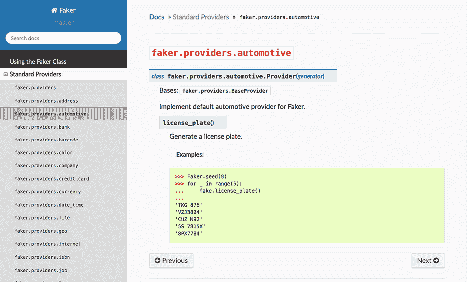

# 附录 D. 使用 Faker 生成假数据

*Faker* 是一个用于生成假数据的 Python 库。它专门用于创建姓名、电话号码、街道地址、电子邮件等列表。结合可以生成随机数值数据的 NumPy，它可以快速创建任何大小、形状和类型的数据集。如果你想要练习 pandas 概念但找不到合适的数据集来应用，Faker 提供了一个绝佳的解决方案。在本附录中，我们将介绍你需要了解的所有内容以开始使用这个库。

## D.1 安装 Faker

首先，让我们在我们的 `conda` 环境中安装 Faker 库。在终端（macOS）或 Anaconda Prompt（Windows）中，激活为这本书设置的 `conda` 环境。当我为附录 A 创建环境时，我将其命名为 `pandas_in_action`：

```
conda activate pandas_in_action
```

如果你忘记了可用的 Anaconda 环境，你可以执行 `conda info --envs` 来查看它们的列表。当环境处于活动状态时，使用 `conda install` 命令安装 Faker 库：

```
conda install faker
```

当提示确认时，输入 `"Y"` 表示是并按 Enter 键。Anaconda 将下载并安装库。当过程完成后，启动 Jupyter Notebook 并创建一个新的笔记本。

## D.2 使用 Faker 入门

让我们探索 Faker 的核心功能，然后将其与 NumPy 配对以生成一个 1,000 行的 `DataFrame`。首先，我们将导入 pandas 和 NumPy 库并将它们分配给各自的别名（`pd` 和 `np`）。同时，我们也将导入 `faker` 库：

```
In  [1] import pandas as pd
        import numpy as np
        import faker
```

`faker` 包导出了一个 `Faker` 类（注意大写的 `F`）。作为提醒，一个 *类* 是对象的蓝图——数据结构的模板。`Series` 和 `DataFrame` 是 pandas 库中的两个示例类，而 `Faker` 是 Faker 库中的一个示例类。

让我们使用一对括号创建一个 `Faker` 类的实例，并将生成的 `Faker` 对象分配给 `fake` 变量：

```
In  [2] fake = faker.Faker()
```

一个 `Faker` 对象包含许多实例方法，每个方法都从给定类别返回一个随机值。例如，`name` 实例方法返回一个包含人名的字符串：

```
In  [3] fake.name()

Out [3] 'David Lee'
```

由于 Faker 的固有随机性，当你在自己的计算机上执行代码时，返回值可能会变化。这是完全可以接受的。

我们可以调用互补的 `name_male` 和 `name_female` 方法来根据性别返回全名：

```
In  [4] fake.name_male()

Out [4] 'James Arnold'

In  [5] fake.name_female()

Out [5] 'Brianna Hall'
```

使用 `first_name` 和 `last_name` 方法来返回仅包含名字或姓氏：

```
In  [6] fake.first_name()

Out [6] 'Kevin'

In  [7] fake.last_name()

Out [7] 'Soto'
```

同样，也有针对特定性别的 `first_name_male` 和 `first_name_female` 方法：

```
In  [8] fake.first_name_male()

Out [8] 'Brian'
In  [9] fake.first_name_female()

Out [9] 'Susan'
```

如您所见，Faker 的语法简单但功能强大。这里有一个另一个例子。假设我们想要为数据集生成一些随机的位置。`address` 方法返回一个包含街道、城市、州和邮政编码的完整地址的字符串：

```
In  [10] fake.address()

Out [10] '6162 Chase Corner\nEast Ronald, SC 68701'
```

注意，地址完全是假的；它不是地图上的实际位置。Faker 只是遵循了地址通常看起来像的惯例。

注意到 Faker 使用换行符 (`\n`) 将街道和地址的其余部分分开。您可以将返回值包裹在一个 `print` 函数调用中，以将地址拆分到多行：

```
In  [11] print(fake.address())

Out [11] 602 Jason Ways Apt. 358
         Hoganville, NV 37296
```

我们可以使用 `street_address`、`city`、`state` 和 `postcode` 等方法生成地址的各个组成部分：

```
In  [12] fake.street_address()

Out [12] '58229 Heather Walk'

In  [13] fake.city()

Out [13] 'North Kristinside'

In  [14] fake.state()

Out [14] 'Oklahoma'

In  [15] fake.postcode()

Out [15] '94631'
```

我们可以使用另一批方法生成与商业相关的数据。以下方法返回一个随机公司、标语、职位和 URL：

```
In  [16] fake.company()

Out [16] 'Parker, Harris and Sutton'

In  [17] fake.catch_phrase()

Out [17] 'Switchable systematic task-force'

In  [18] fake.job()

Out [18] 'Copywriter, advertising'

In  [19] fake.url()

Out [19] 'https://www.gutierrez.com/'
```

Faker 还支持电子邮件地址、电话号码和信用卡号码：

```
In  [20] fake.email()

Out [20] 'sharon13@taylor.com'

In  [21] fake.phone_number()

Out [21] '680.402.4787'

In  [22] fake.credit_card_number()

Out [22] '4687538791240162'
```

Faker 网站 ([`faker.readthedocs.io/en/master`](https://faker.readthedocs.io/en/master)) 为 `Faker` 对象的实例方法提供了完整的文档。该库将方法分组到父类别中，如地址、汽车和银行。图 D.1 显示了 Faker 文档的一个示例页面。



图 D.1 Faker 官方网站上的一个示例文档页面

花些时间探索 Faker 可用的类别。一点多样性可以帮助使你生成的下一个假数据集更加引人入胜。

## D.3 使用假值填充 DataFrame

现在我们已经熟悉了使用 Faker 生成一个假值，让我们使用它来填充整个数据集。我们的目标是创建一个包含四个列：姓名、公司、电子邮件和薪水的 1,000 行 `DataFrame`。

我们将如何解决这个问题：我们将使用一个 `for` 循环来迭代 1,000 次，并在每次迭代中要求 Faker 生成一个假名字、公司和一个电子邮件地址。我们还将要求 NumPy 生成一个随机数来表示薪水。

我们可以使用 Python 的 `range` 函数进行迭代。该函数接受一个整数参数。它返回一个升序的迭代序列，从 `0` 开始，直到但不包括参数。在下一个示例中，我们使用一个 `for` 循环来迭代从 `0`（包含）到 `5`（不包含）的值范围：

```
In  [23] for i in range(5):
             print(i)

Out [23] 0
         1
         2
         3
         4
```

为了生成我们的数据集，我们将使用 `range(1000)` 来迭代 1,000 次。

`DataFrame` 类的构造函数接受各种输入作为其 `data` 参数，包括字典列表。Pandas 将每个字典键映射到 `DataFrame` 的一个列，并将每个值映射到该列的行值。以下是我们想要的输入的预览：

```
[
    {
         'Name': 'Ashley Anderson',
         'Company': 'Johnson Group',
         'Email': 'jessicabrooks@whitaker-crawford.biz',
         'Salary': 62883
    },
    {
         'Name': 'Katie Lee',
         'Company': 'Ward-Aguirre',
         'Email': 'kennethbowman@fletcher.com',
         'Salary': 102971
    }
    # ... and 998 more dictionaries
]
```

您会注意到 Faker 生成的数据中存在一些逻辑不一致。例如，第一个人的名字是 Ashley Anderson，但电子邮件是 jessicabrooks@whitaker-crawford.biz。这种不一致是由于 Faker 的随机性。对于以下示例，我们不会担心这些不完美之处。然而，如果我们想使我们的数据集更加“准确”，我们可以将 Faker 与常规 Python 代码结合使用来生成我们想要的任何值。例如，我们可以要求 Faker 提供一个名字（`"Morgan"`）和一个姓氏（`"Robinson"`），然后将这两个字符串连接起来形成一个更真实的电子邮件地址（`"MorganRobinson@gmail.com"`）：

```
In  [24] first_name = fake.first_name_female()
         last_name = fake.last_name()
         email = first_name + last_name + "@gmail.com"
         email

Out [24] 'MorganRobinson@gmail.com'
```

回到正题。让我们使用列表推导式和`range`函数来创建一个包含 1,000 个字典的列表。在每个字典中，我们将声明相同的四个键：`"Name"`、`"Company"`、`"Email"`和`"Salary"`。对于前三个值，我们将在我们的`Faker`对象上调用`name`、`company`和`email`实例方法。记住，Python 将在*每次*迭代时调用这些方法，因此值将每次都不同。对于`"Salary"`值，我们将使用 NumPy 的`randint`函数来返回一个介于 50,000 和 200,000 之间的随机整数。有关 NumPy 函数的更深入教程，请参阅附录 C。

```
In  [25] data = [
             { "Name": fake.name(),
               "Company": fake.company(),
               "Email": fake.email(),
               "Salary": np.random.randint(50000, 200000)
             }
             for i in range(1000)
         ]
```

我们的`data`变量包含一个包含 1,000 个字典的列表。最后一步是将字典列表传递给 pandas 顶层中的`DataFrame`构造函数：

```
In  [26] df = pd.DataFrame(data = data)
         df

Out [26]

 **Name              Company                Email  Salary**
0       Deborah Lowe       Williams Group  ballbenjamin@gra...  147540
1     Jennifer Black          Johnson Inc  bryannash@carlso...  135992
2          Amy Reese  Mitchell, Hughes...   ajames@hotmail.com  101703
3     Danielle Moore       Porter-Stevens     logan76@ward.com  133189
4        Jennifer Wu        Goodwin Group    vray@boyd-lee.biz   57486
...              ...                  ...                  ...     ...
995   Joseph Stewart  Rangel, Garcia a...     sbrown@yahoo.com  123897
996   Deborah Curtis  Rodriguez, River...  smithedward@yaho...   51908
997  Melissa Simmons        Stevenson Ltd  frederick96@hous...  108791
998  Tracie Martinez       Morales-Moreno  caseycurry@lopez...  181615
999  Phillip Andrade    Anderson and Sons  anthony23@glover...  198586

1000 rows × 4 columns
```

由此，你得到了一个包含 1,000 行随机数据的`DataFrame`，用于练习。请随意探索 Faker 和 NumPy 的文档，看看你可以生成哪些其他类型的随机数据。
