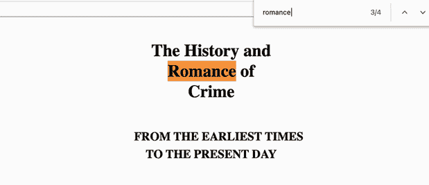

# 附录 E. 正则表达式

一个*正则* *表达式*（通常缩写为*RegEx*）是文本的搜索模式。它定义了计算机应在字符串中查找的逻辑字符序列。

这里有一个简单的例子。你可能在某个时候使用过网页浏览器中的查找功能。在大多数网页浏览器中，你可以通过按 Windows 上的 Ctrl-F 或 macOS 上的 Command-F 来访问这个功能。浏览器会弹出一个对话框，我们在其中输入一串字符。然后浏览器会在网页上搜索这些字符。图 E.1 展示了浏览器在页面内容中搜索并找到`romance`的例子。



图 E.1 使用 Google Chrome 的查找功能搜索文本`romance`

Chrome 的查找功能是正则表达式在行动中的简单例子。这个工具确实有其局限性。例如，我们只能按字符出现的顺序搜索字符。我们可以搜索字符序列`"cat"`，但不能声明一个条件，比如字母`"c"`或`"a"`或`"t"`。正则表达式使得这种动态搜索成为可能。

正则表达式描述了如何在一段文本中查找内容。我们可以搜索字母、数字或空格等字符，但也可以使用特殊符号来声明条件。以下是一些我们可以搜索的内容示例：

+   连续的两个数字

+   由三个或更多字母组成的序列，后面跟一个空格

+   字符`s`，但仅限于单词的开头

在本附录中，我们将探讨正则表达式在 Python 中的工作原理，然后应用我们的知识来处理 pandas 中的数据集。关于正则表达式，有整本教科书和大学课程，所以我们在这里的目的是触及这个复杂研究领域的一角。正则表达式易于入门，但难以精通。

## E.1 Python 的 re 模块简介

让我们从创建一个新的 Jupyter Notebook 开始。我们将导入 pandas 和一个名为`re`的特殊模块。`re`（正则表达式）模块是 Python 标准库的一部分，并内置于语言中：

```
In  [1] import re
        import pandas as pd
```

`re`模块有一个`search`函数，用于在字符串中查找子字符串。该函数接受两个参数：一个搜索序列和一个要查找的字符串。下一个例子是在字符串`"field of flowers"`中查找字符串`"flower"`：

```
In  [2] re.search("flower", "field of flowers")

Out [2] <re.Match object; span=(9, 15), match='flower'>
```

`search`函数如果 Python 在目标字符串中找到字符序列，则返回一个`Match`对象。`Match`对象存储有关与搜索模式匹配的内容以及它在目标字符串中的位置的信息。前面的输出表明`"flower"`在从索引位置 9 到 15 的字符范围内被找到。第一个索引是包含的，第二个索引是排除的。如果我们计算`"field of flowers"`中的字符索引位置，我们会看到索引 9 是`"flowers"`中的小写`"f"`，而索引 15 是`"flowers"`中的`"s"`。

如果搜索模式在目标字符串中不存在，`search` 函数返回 `None`。默认情况下，Jupyter Notebook 不会为 `None` 值输出任何内容。但我们可以将 `search` 调用包裹在 `print` 函数中，强制 Jupyter 打印值：

```
In  [3] print(re.search("flower", "Barney the Dinosaur"))

Out [3] None
```

`search` 函数只返回目标字符串中的第一个匹配项。我们可以使用 `findall` 函数来找到所有匹配项。此函数接受相同的两个参数——一个搜索序列和一个目标字符串——并返回一个字符串列表，其中包含与搜索序列匹配的字符串。在下一个示例中，Python 在 `"Picking flowers in the flower field"` 中找到了 `"flower"` 这个搜索模式两次：

```
In  [4] re.findall("flower", "Picking flowers in the flower field")

Out [4] ['flower', 'flower']
```

注意，搜索是区分大小写的。

## E.2 元字符

现在，让我们使用正则表达式声明一个更复杂的搜索模式。我们将首先将一个长字符串赋值给 `sentence` 变量。下一个代码示例将字符串拆分为多行以提高可读性，但您也可以在 Jupyter Notebook 中将其输入为单行：

```
In  [5] sentence = "I went to the store and bought " \
                   "5 apples, 4 oranges, and 15 plums."

        sentence

Out [5] 'I went to the store and bought 5 apples, 4 oranges, and 15 plums.'
```

在正则表达式中，我们可以声明 *元字符——*定义搜索模式的特殊符号。例如，`\d` 元字符指示 Python 匹配任何数字。假设我们想要识别 `sentence` 字符串中的所有数字。下一个示例使用正则表达式 `"\d"` 作为搜索模式调用 `findall` 函数：

```
In  [6] re.findall("\d", sentence)

Out [6] ['5', '4', '1', '5']
```

函数的返回值是按出现顺序排列的 `sentence` 中的四个数字列表：

+   `"5"` 在 `"5 apples"` 中

+   `"4"` 在 `"4 oranges"` 中

+   `"1"` 在 `"15 plums"` 中

+   `"5"` 在 `"15 plums"` 中

我们已经学会了我们的第一个元字符！通过简单的 `\d` 符号，我们创建了一个匹配目标字符串中任何数字的搜索模式。

在我们继续之前，有两点值得注意：

+   当一个列表包含许多元素时，Jupyter Notebook 喜欢将每个元素打印在单独的一行上。这种风格方法使得输出更容易阅读，但也导致输出占用大量空间。为了强制 Jupyter 正常打印列表——只在输出了一定数量的字符后添加换行符——从现在起，我们将把 `findall` 函数调用包裹在 Python 内置的 `print` 函数中。

+   我们将把 RegEx 参数作为原始字符串传递给 `findall` 函数。Python 将原始字符串中的每个字符按字面意思解释。此解析选项防止正则表达式与转义序列之间的冲突。考虑字符序列 `\b`。它在普通 Python 字符串中有符号意义，在正则表达式中有不同的意义。当我们使用原始字符串时，我们指示 Python 将 `\b` 解释为字面意义上的反斜杠字符后跟字面意义上的 `b` 字符。这种语法保证了 Python 将正确解析正则表达式的元字符。

我们使用双引号前的 `"r"` 字符来声明一个原始字符串。让我们用 `print` 函数调用和原始字符串重写前面的示例：

```
In  [7] print(re.findall(r"\d", sentence))

Out [7] ['5', '4', '1', '5']
```

要声明操作的逆操作，我们交换元字符的大小写。例如，如果 `\d` 表示“匹配任何数字”，那么 `\D` 表示“匹配任何非数字”。非数字字符包括字母、空格、逗号和符号。在下一个示例中，我们使用 `\D` 来识别 `sentence` 中的所有非数字字符：

```
In  [8] print(re.findall(r"\D", sentence))

Out [8] ['I', ' ', 'w', 'e', 'n', 't', ' ', 't', 'o', ' ', 't', 'h', 'e', '
        ', 's', 't', 'o', 'r', 'e', ' ', 'a', 'n', 'd', ' ', 'b', 'o',
        'u', 'g', 'h', 't', ' ', ' ', 'a', 'p', 'p', 'l', 'e', 's', ',', '
        ', ' ', 'o', 'r', 'a', 'n', 'g', 'e', 's', ',', ' ', 'a', 'n',
        'd', ' ', ' ', 'p', 'l', 'u', 'm', 's', '.']
```

现在你已经了解了正则表达式的基础知识，下一步是学习更多元字符并构建复杂的搜索查询。以下是一个示例。`\w` 元字符匹配任何单词字符，这个类别包括字母、数字和下划线：

```
In  [9] print(re.findall(r"\w", sentence))

Out [9] ['I', 'w', 'e', 'n', 't', 't', 'o', 't', 'h', 'e', 's', 't', 'o',
         'r', 'e', 'a', 'n', 'd', 'b', 'o', 'u', 'g', 'h', 't', '5', 'a',
         'p', 'p', 'l', 'e', 's', '4', 'o', 'r', 'a', 'n', 'g', 'e', 's',
         'a', 'n', 'd', '1', '5', 'p', 'l', 'u', 'm', 's']
```

逆 `\W` 元字符匹配任何非单词字符。非单词字符包括空格、逗号和句号：

```
In  [10] print(re.findall(r"\W", sentence))

Out [10] [' ', ' ', ' ', ' ', ' ', ' ', ' ', ' ', ',', ' ', ' ', ',', ' ',
         ' ', ' ', '.']
```

`\s` 元字符搜索任何空白字符：

```
In  [11] print(re.findall(r"\s", sentence))

Out [11] [' ', ' ', ' ', ' ', ' ', ' ', ' ', ' ', ' ', ' ', ' ', ' ', ' ']
```

逆 `\S` 元字符搜索任何非空白字符：

```
In  [12] print(re.findall(r"\S", sentence))

Out [12] ['I', 'w', 'e', 'n', 't', 't', 'o', 't', 'h', 'e', 's', 't', 'o',
         'r', 'e', 'a', 'n', 'd', 'b', 'o', 'u', 'g', 'h', 't', '5', 'a',
         'p', 'p', 'l', 'e', 's', ',', '4', 'o', 'r', 'a', 'n', 'g', 'e',
         's', ',', 'a', 'n', 'd', '1', '5', 'p', 'l', 'u', 'm', 's', '.']
```

要搜索特定字符，请在搜索模式中直接声明该字符。以下示例搜索所有出现的字母 `"t"`。此语法与我们在此附录的第一个示例中使用的是相同的：

```
In  [13] print(re.findall(r"t", sentence))

Out [13] ['t', 't', 't', 't', 't']
```

要搜索字符序列，请按顺序在搜索模式中写出这些字符。以下示例在 `sentence` 字符串中搜索字母 `"to"`。Python 找到了两次（单词 `"to"` 和 `"store"` 中的 `"to"`）：

```
In  [14] print(re.findall(r"to", sentence))

Out [14] ['to', 'to']
```

`\b` 元字符声明单词边界。*单词边界*强制字符相对于空格的位置。以下示例搜索 `"\bt"`。逻辑可以翻译为“任何在单词边界之后的 `t` 字符”或等价地，“任何在空格之后的 `t` 字符”。该模式匹配 `"to"` 和 `"the"` 中的 `"t"` 字符：

```
In  [15] print(re.findall(r"\bt", sentence))

Out [15] ['t', 't']
```

让我们翻转符号。如果我们使用 `"t\b"`，我们搜索“任何在单词边界之前的 `t` 字符”或等价地，“任何在空格之前的 `t` 字符”。Python 匹配的 `"t"` 字符不同。这些是 `"went"` 和 `"bought"` 结尾的 `"t"` 字符：

```
In  [16] print(re.findall(r"t\b", sentence))

Out [16] ['t', 't']
```

逆 `\B` 元字符声明非单词边界。例如，`"\Bt"` 表示“任何不在单词边界之后的 `t` 字符”或等价地，“任何不在空格之后的 `t` 字符”：

```
In  [17] print(re.findall(r"\Bt", sentence))

Out [17] ['t', 't', 't']
```

上述示例匹配了 `"went"`、`"store"` 和 `"bought"` 中的 `"t"` 字符。Python 忽略了 `"to"` 和 `"the"` 中的 `"t"` 字符，因为它们出现在单词边界之后。

## E.3 高级搜索模式

回顾一下，*元字符*是在正则表达式中指定搜索序列的符号。第 E.2 节探讨了 `\d`、`\w`、`\s` 和 `\b` 元字符，用于数字、单词字符、空格和单词边界。让我们学习一些新的元字符，然后将它们组合成复杂的搜索查询。

点 (`.`) 元字符匹配任何字符：

```
In  [18] soda = "coca cola."
         soda

Out [18] 'coca cola.'

In  [19] print(re.findall(r".", soda))

Out [19] ['c', 'o', 'c', 'a', ' ', 'c', 'o', 'l', 'a', '.']
```

乍一看，这个元字符可能看起来并不特别有用，但与其他符号搭配使用时却效果神奇。例如，正则表达式 `"c."` 搜索的是紧跟在 `"c"` 字符后面的任何字符。在我们的字符串中存在三个这样的匹配项：

```
In  [20] print(re.findall(r"c.", soda))

Out [20] ['co', 'ca', 'co']
```

如果我们想在字符串中搜索一个字面上的点，该怎么办？在这种情况下，我们必须在正则表达式中用反斜杠转义它。下一个示例中的 `"\."` 定位到 `soda` 字符串的末尾：

```
In  [21] print(re.findall(r"\.", soda))

Out [21] ['.']
```

之前，我们看到了如何将字符组合起来，以便在目标字符串中按顺序搜索它们。这里，我们搜索 `"co"` 的确切序列：

```
In  [22] print(re.findall(r"co", soda))

Out [22] ['co', 'co']
```

如果我们想搜索字符 `"c"` 或字符 `"o"` 中的任何一个，怎么办？为了做到这一点，我们可以将字符包裹在一对方括号中。匹配项将包括目标字符串中 `"c"` 或 `"o"` 的任何出现：

```
In  [23] print(re.findall(r"[co]", soda))

Out [23] ['c', 'o', 'c', 'c', 'o']
```

方括号中字符的顺序不会影响结果：

```
In  [24] print(re.findall(r"[oc]", soda))

Out [24] ['c', 'o', 'c', 'c', 'o']
```

假设我们想目标化 `"c"` 和 `"l"` 之间的任何字符。一个选项是写出方括号内完整的字母字符序列：

```
In  [25] print(re.findall(r"[cdefghijkl]", soda))

Out [25] ['c', 'c', 'c', 'l']
```

一个更好的解决方案是使用破折号符号（`-`）来声明字符的范围。下面的代码示例产生与前面代码相同的列表：

```
In  [26] print(re.findall(r"[c-l]", soda))

Out [26] ['c', 'c', 'c', 'l']
```

接下来，让我们探索如何目标化字符的连续多个出现。考虑字符串 `"bookkeeper"`：

```
In  [27] word = "bookkeeper"
         word

Out [27] 'bookkeeper'
```

要搜索连续的两个 `"e"` 字符，我们可以在搜索序列中将它们配对：

```
In  [28] print(re.findall(r"ee", word))

Out [28] ['ee']
```

我们还可以使用一对大括号来搜索字符的多个出现。在大括号内，我们声明要匹配的出现次数。在下一个示例中，我们在 `"bookkeeper"` 中搜索连续的两个 `"e"` 字符：

```
In  [29] print(re.findall(r"e{2}", word))

Out [29] ['ee']
```

如果我们使用 `"e{3}"` 搜索连续的三个 `"e"` 字符，返回值将是一个空列表，因为在 `"bookkeeper"` 中没有三个连续的 `"e"` 字符序列：

```
In  [30] print(re.findall(r"e{3}", word))

Out [30] []
```

我们还可以在大括号内输入两个数字，用逗号分隔。第一个值设置出现次数的下限，第二个值设置出现次数的上限。下一个示例搜索连续出现一次到三次的 `"e"` 字符。第一个匹配项是 `"keeper"` 中的连续 `"ee"` 字符，第二个匹配项是 `"keeper"` 中的最后一个 `"e"`：

```
In  [31] print(re.findall(r"e{1,3}", word))

Out [31] ['ee', 'e']
```

让我们更详细地走一遍这个例子。该模式搜索一行中的一到三个 `"e"` 字符。当 Python 找到匹配项时，它会继续遍历字符串，直到搜索模式被违反。正则表达式首先单独查看字母 `"bookk"`。这些字母中没有哪一个符合搜索模式，所以 Python 继续前进。然后模式定位到它的第一个 `"e"`。Python 还不能将这个匹配项标记为最终匹配，因为下一个字符也可能是一个 `"e"`，所以它检查下一个字符。那个字符确实又是另一个 `"e"`，这符合原始搜索标准。Python 继续到 `"p"`，它不匹配模式，并宣布匹配项是 `"ee"` 而不是两个单独的 `"e"` 字符。相同的逻辑重复应用于字符串末尾更接近的 `"e"`。

我们正在取得良好的进展，但所有之前的例子都主要是理论性的。我们在处理现实世界的数据集时如何使用正则表达式？

想象一下，我们正在运行一个客户支持热线并存储电话通话的转录。我们可能有一个这样的消息：

```
In  [32] transcription = "I can be reached at 555-123-4567\. "\
                         "Look forward to talking to you soon."

         transcription

Out [32] 'I can be reached at 555-123-4567\. Look forward to talking to you 
          soon.'
```

假设我们想从每个人的消息中提取电话号码，但每个转录都是独特的。然而，我们可以假设电话号码有一个一致的格式，由

1.  三个数字

1.  一个破折号

1.  三个数字

1.  一个破折号

1.  四个数字

正则表达式的美在于它可以不受字符串内容的影响地识别这种搜索模式。下一个示例声明了我们迄今为止最复杂的正则表达式。我们只是将元字符和符号组合起来，以描述上述逻辑：

1.  `\d{3}` 搜索恰好三个数字。

1.  - 搜索一个破折号。

1.  `\d{3}` 搜索恰好三个数字。

1.  - 搜索一个破折号。

1.  `\d{4}` 搜索恰好四个数字。

    ```
    In  [33] print(re.findall(r"\d{3}-\d{3}-\d{4}", transcription))

    Out [33] ['555-123-4567']
    ```

哇！

此外，还有一个方便的 `+` 元字符，表示“一个或多个”前面的字符或元字符。例如，`\d+` 搜索一行中的一或多个数字。我们可以使用 `+` 符号简化前面的代码。下一个正则表达式持有不同的搜索模式，但返回相同的结果：

1.  一个或多个连续的数字

1.  一个破折号

1.  一个或多个连续的数字

1.  一个破折号

1.  一个或多个连续的数字

    ```
    In  [34] print(re.findall(r"\d+-\d+-\d+", transcription))

    Out [34] ['555-123-4567']
    ```

我们可以用一行代码从一个动态文本片段中提取电话号码——相当强大的功能。

## E.4 正则表达式和 pandas

在第六章中，我们介绍了用于操作字符串 `Series` 的 `StringMethods` 对象。该对象通过 `str` 属性提供，并且它的许多方法支持正则表达式参数，这极大地扩展了它们的功能。让我们在实际数据集上练习这些正则表达式概念。

ice_cream.csv 数据集是四个流行品牌（Ben & Jerry’s、Haagen-Dazs、Breyers 和 Talenti）的冰淇淋口味的集合。每一行包括一个品牌、一个口味和描述：

```
In  [35] ice_cream = pd.read_csv("ice_cream.csv")
         ice_cream.head()

Out [35]

 **Brand               Flavor                         Description**
0  Ben and Jerry's  Salted Caramel Core  Sweet Cream Ice Cream with Blon...
1  Ben and Jerry's  Netflix & Chilll'd™  Peanut Butter Ice Cream with Sw...
2  Ben and Jerry's         Chip Happens  A Cold Mess of Chocolate Ice Cr...
3  Ben and Jerry's              Cannoli  Mascarpone Ice Cream with Fudge...
4  Ben and Jerry's       Gimme S’more!™  Toasted Marshmallow Ice Cream w...
```

注意：ice_cream 是从 Kaggle 可用的数据集的一个修改版本（[`www.kaggle.com/tysonpo/ice-cream-dataset`](https://www.kaggle.com/tysonpo/ice-cream-dataset)）。数据中存在拼写错误和不一致性；我们保留了它们，以便你可以看到在现实世界中出现的真实数据不规则性。我鼓励你考虑如何使用本章中学习的技巧来优化这些数据。

我很好奇我们能在口味中找到多少种不同的巧克力美食。我们的挑战是在描述列中找到紧跟在字符串 `"Chocolate"` 后面的所有单词。我们可以使用 `Series` 上的 `str.extract` 方法来完成这个任务。该方法接受一个正则表达式模式，并返回一个包含匹配项的 `DataFrame`。

让我们构建我们的正则表达式。我们将从一个单词边界 (`\b`) 开始。然后我们将目标定位在文本 `"Chocolate"` 上。接下来，我们将强制一个单独的空白字符 (`\s`)。最后，我们将匹配一行中的一或多个单词字符 (`\w+`)，以捕获所有直到 Python 遇到空格或句点为止的字母数字字母。因此，最终的表达式是 `"\bChocolate\s\w+)"`。

由于技术原因，我们必须在将正则表达式传递给 `str.extract` 方法时将其括起来。该方法支持高级语法，可以搜索多个正则表达式，而括号将其限制为一个：

```
In  [36] ice_cream["Description"].str.extract(r"(\bChocolate\s\w+)").head()

Out [36]

 **0**
0               NaN
1               NaN
2     Chocolate Ice
3               NaN
4  Chocolate Cookie
```

到目前为止，一切顺利。我们的 `Series` 包含了像索引位置 2 的 `"Chocolate` `Ice"` 和索引位置 4 的 `"Chocolate` `Cookie"` 这样的匹配项；它还在找不到搜索模式的地方存储了 `NaN` 值。让我们调用 `dropna` 方法来删除有缺失值的行：

```
In  [37] (
             ice_cream["Description"]
             .str.extract(r"(\bChocolate\s\w+)")
             .dropna()
             .head()
         )

Out [37]

 **0**
2      Chocolate Ice
4   Chocolate Cookie
8      Chocolate Ice
9      Chocolate Ice
13  Chocolate Cookie
```

我们越来越接近了。

接下来，让我们将 `DataFrame` 转换为 `Series`。默认情况下，`str.extract` 方法返回一个 `DataFrame` 以支持潜在的多个搜索模式。我们可以使用 `squeeze` 方法将单列 `DataFrame` 转换为 `Series`。你可能还记得从 `read_csv` 导入函数中的相关 `squeeze` 参数；`squeeze` 方法可以达到相同的效果：

```
In  [38] (
             ice_cream["Description"]
             .str.extract(r"(\bChocolate\s\w+)")
             .dropna()
             .squeeze()
             .head()
         )

Out [38] 2        Chocolate Ice
         4     Chocolate Cookie
         8        Chocolate Ice
         9        Chocolate Ice
         13    Chocolate Cookie
         Name: Chocolate, dtype: object
```

我们的方法链变得越来越长，所以让我们将当前的 `Series` 赋值给一个 `chocolate_flavors` 变量：

```
In  [39] chocolate_flavors = (
            ice_cream["Description"]
            .str.extract(r"(\bChocolate\s\w+)")
            .dropna()
            .squeeze()
        )
```

我们最终想要识别在 `"Chocolate"` 之后是什么成分。让我们调用 `str.split` 方法通过空格的出现来分割每个字符串。在这里，我们不会传递一个包含单个空格的字符串，而是提供一个正则表达式的参数。提醒一下，`"\s"` 元字符查找单个空白：

```
In  [40] chocolate_flavors.str.split(r"\s").head()

Out [40] 2        [Chocolate, Ice]
         4     [Chocolate, Cookie]
         8        [Chocolate, Ice]
         9        [Chocolate, Ice]
         13    [Chocolate, Cookie]
         Name: 0, dtype: object
```

`str.get` 方法从 `Series` 中的每个列表中检索一个在一致索引位置的值。在下一个示例中，我们从每个列表中检索第二个元素（索引位置 1），或者等价地，检索原始字符串中 `"Chocolate"` 后面的单词：

```
In  [41] chocolate_flavors.str.split(r"\s").str.get(1).head()

Out [41] 2        Ice
         4     Cookie
         8        Ice
         9        Ice
         13    Cookie
         Name: Chocolate, dtype: object
```

出于好奇，让我们调用 `value_counts` 方法来看看在所有冰淇淋口味中紧跟 `"Chocolate"` 的最频繁出现的单词。不出所料， `"Ice"` 是赢家，而 `"Cookie"` 则位居第二：

```
In  [42] chocolate_flavors.str.split(r"\s").str.get(1).value_counts()

Out [42] Ice         11
         Cookie       4
         Chip         3
         Cookies      2
         Sandwich     2
         Malt         1
         Mint         1
         Name: Chocolate, dtype: int64
```

正则表达式提供了一种在文本中搜索模式的高级方法。我希望你已经对正则表达式的益处以及如何在 pandas 的各种方法中应用它有了更深入的理解。
