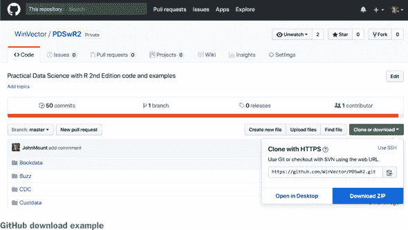

# 前言部分

## 前言

*《用 R 进行实用数据科学》* 第二版是一本关于数据科学的实战指南，重点关注使用 R 语言和统计软件包处理结构化或表格数据的技巧。本书强调机器学习，但在涉及数据科学家在项目中的作用、结果管理以及甚至设计演示文稿等主题上，它所分配的章节数量是独一无二的。除了解释如何编写模型代码外，本书还分享了如何与多元化的团队协作、如何将业务目标转化为指标，以及如何组织工作和报告。如果你想学习如何使用 R 作为数据科学家工作，这本书是必读的。

我们已经认识 Nina Zumel 和 John Mount 多年。我们曾邀请他们与我们一同在奇点大学授课。他们是我们所知的两位顶尖数据科学家。我们经常推荐他们关于交叉验证和影响编码（也称为目标编码）的原创研究。实际上，*《用 R 进行实用数据科学》* 第二版中的第八章介绍了影响编码的理论，并通过作者的 R 包：`vtreat`来应用这一理论。

*《用 R 进行实用数据科学》* 花时间描述了数据科学是什么，以及数据科学家如何解决问题并解释他们的工作。它包括对经典监督学习方法的仔细描述，如线性回归和逻辑回归。我们喜欢这本书的调查风格，并广泛使用了随机森林和`xgboost`等获奖方法论和软件包的实例。这本书充满了有用的共享经验和实用建议。我们注意到他们甚至包括了我们的技巧，即使用随机森林变量重要性进行初始变量筛选。

总体来说，这是一本优秀的书，我们强烈推荐。

—JEREMY HOWARD

AND RACHEL THOMAS

## 前言

这是我们自己在学习那些后来被称为*数据科学*的众多主题和技能时希望拥有的书。这是我们希望分发给我们的客户和同行的书。它的目的是解释统计学、计算机科学和机器学习中与数据科学至关重要的相关部分。

数据科学借鉴了实证科学、统计学、报告、分析、可视化、商业智能、专家系统、机器学习、数据库、数据仓库、数据挖掘和大数据等工具。正是因为我们有这么多工具，我们才需要一个涵盖所有这些工具的学科。数据科学本身与工具和技术区分开来的，是其核心目标是将有效的决策模型部署到生产环境中。

我们的目的是从实用、以实践为导向的角度来介绍数据科学。我们通过专注于真实数据上的完整练习来实现这一目标——总的来说，这本书处理了超过 10 个重要的数据集。我们相信这种方法使我们能够展示我们真正想要教授的内容，并展示在任何实际项目中必要的所有准备工作步骤。

在我们的文本中，我们讨论了有用的统计和机器学习概念，包括具体的代码示例，并探讨了与非专业人士合作和展示的方法。如果你可能觉得这些主题并不新颖，我们希望为你指出一两个你可能最近没有考虑过的其他主题。

## 致谢

我们还要感谢那些阅读并评论我们早期章节草稿的同事和其他人。特别感谢我们的审稿人：Charles C. Earl，Christopher Kardell，David Meza，Domingo Salazar，Doug Sparling，James Black，John MacKintosh，Owen Morris，Pascal Barbedo，Robert Samohyl 和 Taylor Dolezal。他们的评论、问题和更正大大提高了这本书的质量。我们特别想感谢我们的开发编辑 Dustin Archibald 和第一版工作的 Cynthia Kane，感谢他们的想法和支持。同样的感谢也适用于 Nichole Beard，Benjamin Berg，Rachael Herbert，Katie Tennant，Lori Weidert，Cheryl Weisman 以及所有努力使这本书成为一本优秀书籍的其他编辑。

此外，我们感谢我们的同事 David Steier，加州大学伯克利分校信息科学学院的 Douglas Tygar 教授，威斯康星大学怀特沃特分校生物科学和计算机科学系的 Robert K. Kuzoff 教授，以及所有使用这本书作为教学文本的其他教师和讲师。我们感谢 Jim Porzak，Joseph Rickert 和 Alan Miller 邀请我们参加 R 用户组会议，经常讨论我们在本书中涵盖的主题。我们特别感谢 Jim Porzak 为第一版撰写了序言，并成为我们书籍的热心倡导者。在我们疲惫和泄气，想知道为什么我们给自己设定了这个任务的时候，他的兴趣帮助我们提醒我们，我们所提供的东西以及我们提供的方式是有需求的。没有这种鼓励，完成这本书将会困难得多。此外，我们还想感谢 Jeremy Howard 和 Rachel Thomas 撰写新序言，邀请我们发言，并提供了他们的强力支持。

## 关于本书

这本书是关于数据科学的：一个使用统计学、机器学习和计算机科学的结果来创建预测模型的研究领域。由于数据科学的广泛性，讨论它并概述我们在本书中采取的方法是很重要的。

### 什么是数据科学？

统计学家威廉·S·克利夫兰将数据科学定义为比统计学本身更大的跨学科领域。我们定义数据科学为管理将假设和数据转化为可操作预测的过程。典型的预测分析目标包括预测谁将赢得选举、哪些产品会一起畅销、哪些贷款会违约以及哪些广告会被点击。数据科学家负责获取和管理数据、选择建模技术、编写代码以及验证结果。

由于数据科学借鉴了这么多学科，它通常是一个“第二职业”。我们遇到的大多数优秀数据科学家最初都是程序员、统计学家、商业智能分析师或科学家。通过增加一些额外的技术到他们的技能库中，他们成为了优秀的数据科学家。这个观察结果推动了这本书：我们通过具体地处理所有基于真实数据的常见项目步骤，介绍了数据科学家所需的实用技能。有些步骤你可能比我们更了解，有些你可能很快就能掌握，有些你可能需要进一步研究。 

数据科学的大部分理论基础来自统计学。但我们所知道的数据科学受到技术和软件工程方法论的强烈影响，并在很大程度上是在计算机科学和信息技术驱动的群体中演化的。我们可以通过列出一些著名的例子来指出数据科学的一些工程特点：

+   亚马逊的产品推荐系统

+   谷歌的广告估值系统

+   领英的联系人推荐系统

+   推特的流行话题

+   沃尔玛的消费需求预测系统

这些系统有很多共同点：

+   所有这些系统都是*基于大型数据集构建的*。这并不是说它们都在大数据领域。但如果没有使用小型数据集，它们中的任何一个都无法成功。为了管理数据，这些系统需要来自计算机科学的概念：数据库理论、并行编程理论、流数据技术和数据仓库。

+   大多数这些系统都是*在线或实时运行的*。而不是生成一个单一的报告或分析，数据科学团队部署一个决策程序或评分程序，直接做出决策或直接向大量最终用户展示结果。生产部署是最后的机会来确保一切正确，因为数据科学家并不总是能够随时解释缺陷。

+   所有这些系统都允许以一些不可协商的速率*犯错误*。

+   这些系统都不*关注原因*。当它们找到有用的相关性并且不被要求正确区分原因和效果时，它们才会成功。

本书教授了构建此类系统所需的原则和工具。我们教授了成功交付此类项目所使用的常见任务、步骤和工具。我们的重点是整个过程——项目管理、与他人合作以及向非专业人士展示结果。

### 路线图

本书涵盖了以下内容：

+   管理数据科学过程本身。数据科学家必须能够衡量和跟踪自己的项目。

+   应用数据科学项目中使用的许多最强大的统计和机器学习技术。将本书视为一系列使用 R 编程语言进行实际数据科学工作的明确练习。

+   为各种利益相关者（如管理层、用户、部署团队等）准备演示文稿：你必须能够用他们常用的词汇，而不是在某个特定领域坚持的技术定义，具体地解释你的工作。你不能仅仅通过将数据科学项目结果扔过篱笆来逃避责任。

我们按照我们认为能提高理解顺序安排了本书的主题。材料组织如下。

第一部分 描述了数据科学过程的基本目标和技巧，强调协作和数据。第一章 讨论了如何成为一名数据科学家。第二章 讲解了如何将数据加载到 R 中，并展示了如何开始使用 R。

第三章 讲解了在数据中首先应该寻找什么，以及描述和理解数据的重要步骤。数据必须为分析做好准备，并且需要纠正数据问题。第四章 展示了如何纠正第三章中确定的问题。

第五章 讲解了另一个数据准备步骤：基本数据整理。数据科学家并不总是以最适合分析的形式或“形状”获得数据。R 提供了许多工具来操纵和重塑数据，使其适合适当的结构；这些工具在本章中进行了介绍。

第二部分 从描述和准备数据过渡到构建有效的预测模型。第六章 提供了将业务需求映射到技术评估和建模技术的映射。它涵盖了评估模型性能的标准指标和程序，以及一种专门技术 LIME，用于解释模型做出的特定预测。

第七章 介绍了基本的线性模型：线性回归、逻辑回归和正则化线性模型。线性模型是许多分析任务的工作马，特别是在识别关键变量和洞察问题结构方面非常有帮助。对这些模型有扎实的理解对数据科学家来说极其宝贵。

第八章暂时从建模任务转向更高级的数据处理：如何为建模步骤准备混乱的现实世界数据。由于理解这些数据处理方法的工作原理需要一些对线性模型和模型评估指标的了解，因此最好将此主题推迟到第二部分。

第九章涵盖了无监督方法：不使用标记训练数据建模的方法。第十章涵盖了更高级的建模方法，这些方法可以提高预测性能并解决特定的建模问题。涵盖的主题包括基于树的集成、广义加性模型和支持向量机。

第三部分从建模转向过程。我们展示了如何交付结果。第十一章演示了如何管理、记录和部署你的模型。你将在第十二章中学习如何为不同的受众创建有效的演示。

附录中包含了关于 R、统计学以及更多可用工具的附加技术细节。附录 A 展示了如何安装 R、开始工作以及与其他工具（如 SQL）一起使用。附录 B 是关于几个关键统计学概念的复习。

材料根据目标和任务组织，在需要时引入工具。每章中的主题都是在具有相关数据集的代表项目中讨论的。你将在本书的过程中完成多个重大项目。本书中提到的所有数据集都可以在本书的 GitHub 仓库[`github.com/WinVector/PDSwR2`](https://github.com/WinVector/PDSwR2)中找到。你可以下载整个仓库作为一个单一的 zip 文件（GitHub 的一项服务），将仓库克隆到你的机器上，或者根据需要复制单个文件。

### 读者对象

要运行本书中的示例，你需要对 R 和统计学有一定的了解。我们建议你手头有一些好的入门文本。在开始本书之前，你不需要成为 R 的专家，但你需要熟悉它。

要开始使用 R，我们推荐 Jonathan Carroll 的《超越电子表格的 R》（Manning, 20108）或 Robert Kabacoff 的《R 实战》（现在有第二版：[`www.manning.com/kabacoff2/`](http://www.manning.com/kabacoff2/)），以及文本的关联网站*Quick-R* ([`www.statmethods.net`](http://www.statmethods.net))。对于统计学，我们推荐 David Freedman、Robert Pisani 和 Roger Purves 合著的《统计学》，第四版（W. W. Norton & Company, 2007）。

通常，我们期望我们的理想读者具备以下条件：

+   ***对工作示例的兴趣。*** 通过解决示例，你将至少学会一种执行项目所有步骤的方法。你必须愿意尝试简单的脚本和编程，以获得这本书的全部价值。对于每个我们解决的示例，你应该尝试不同的变体，并预期会有一些失败（你的变体不起作用）和一些成功（你的变体优于我们的示例分析）。

+   ***对 R 统计系统的一些了解，以及愿意用 R 编写简短的脚本和程序。*** 除了 Kabacoff，我们还列出了附录 C 中的一些好书。我们将在 R 中解决具体问题；你需要运行示例并阅读额外的文档，以了解我们没有展示的命令的变体。

+   ***对基本统计概念（如概率、均值、标准差和显著性）的舒适度。*** 我们将在需要时介绍这些概念，但你可能需要阅读额外的参考资料，因为我们解决示例。我们将定义一些术语，并在适当的时候引用一些主题参考资料和博客。但我们期望你将不得不对某些主题进行一些自己的互联网搜索。

+   ***一台计算机（macOS、Linux 或 Windows），用于安装 R 和其他工具，以及互联网访问权限，以便下载工具和数据集。*** 我们强烈建议你解决示例，检查各种方法的 R `help()`，并跟进一些额外的参考资料。

### 这本书没有包含什么？

+   ***这本书不是一本 R 手册。*** 我们使用 R 来具体展示数据科学项目的重要步骤。我们教授足够的 R 知识，让你能够解决示例，但如果你不熟悉 R，你将需要参考附录 A 以及许多现有的优秀 R 书籍和教程。

+   ***这本书不是一系列案例研究。*** 我们强调方法和技巧。示例数据和代码仅用于确保我们提供具体、可用的建议。

+   ***这本书不是一本大数据书。*** 我们认为最有意义的数据科学发生在数据库或可管理的文件规模（通常大于内存，但仍足够小，易于管理）。将测量条件映射到依赖结果的宝贵数据往往生产成本高昂，这往往限制了其规模。对于某些报告生成、数据挖掘和自然语言处理，你将不得不进入大数据领域。

+   ***这不是一本理论书。*** 我们不强调任何一种技术的绝对严格理论。数据科学的目标是灵活，有多个好技术可用，并且愿意深入研究似乎适用于手头问题的技术。即使在我们的文本中，我们也更喜欢 R 代码符号而不是漂亮的排版方程式，因为 R 代码可以直接使用。

+   ***这不是一本机器学习修补匠的书。***我们强调已经在 R 中实现的方法。对于每种方法，我们都会讲解其工作原理，并展示该方法的优势。我们通常不讨论如何实现它们（即使实现起来很简单），因为已经有优秀的 R 实现。

### 代码约定和下载

本书以示例驱动。我们在 GitHub 存储库([`github.com/WinVector/PDSwR2`](https://github.com/WinVector/PDSwR2))中提供了准备好的示例数据，包括 R 代码和指向原始来源的链接。您可以在网上探索这个存储库，或者将其克隆到您的机器上。我们还提供了生成书中所有结果和几乎所有图表的代码，作为 zip 文件([`github.com/WinVector/PDSwR2/raw/master/CodeExamples.zip`](https://github.com/WinVector/PDSwR2/raw/master/CodeExamples.zip))，因为从 zip 文件中复制代码可能比从书中复制和粘贴更容易。有关如何下载、安装以及开始使用所有建议的工具和示例数据的说明，请参阅附录 A 中的 A.1 节。

我们鼓励您在阅读文本时尝试示例 R 代码；即使我们在讨论数据科学的相当抽象方面，我们也会用具体的数据和代码来举例。每一章都包括指向它所引用的具体数据集的链接。

在这本书中，代码使用`固定宽度字体`如这样来区分它和普通文本。具体的变量和值以类似的方式格式化，而抽象的数学将以*斜体字体*如这样显示。R 代码编写时不包含任何命令行提示符，例如`>`（在显示 R 代码时经常看到，但不需要作为新 R 代码输入）。内联结果以 R 的注释字符`#`为前缀。在许多情况下，原始源代码已经被重新格式化；我们添加了换行并重新调整了缩进以适应书中的可用页面空间。在极少数情况下，即使这样也不够，列表中还包括了行续续标记()。此外，当代码在文本中描述时，源代码中的注释通常已从列表中删除。代码注释伴随着许多列表，突出重要概念。

### 使用本书

*《使用 R 进行实用数据科学》*最好在至少尝试一些示例的同时阅读。为此，我们建议您安装 R、RStudio 以及书中常用的包。我们将在附录 A 的 A.1 节中分享如何进行这些操作。附录 A。我们还建议您从我们的 GitHub 存储库[`github.com/WinVector/PDSwR2`](https://github.com/WinVector/PDSwR2)下载所有示例，这些示例包括代码和数据。 

#### 下载本书的支持材料/存储库

您可以通过使用 GitHub 的“下载为 ZIP”功能将存储库的内容下载为 ZIP 文件，如图所示，从 GitHub 网址 [`github.com/WinVector/PDSwR2`](https://github.com/WinVector/PDSwR2)。



点击“下载 ZIP”链接应该会下载软件包的压缩内容（或者您也可以尝试直接链接到 ZIP 文件：[`github.com/WinVector/PDSwR2/archive/master.zip`](https://github.com/WinVector/PDSwR2/archive/master.zip)）。或者，如果您熟悉从命令行使用 Git 版本控制系统，您可以从 Bash shell 中使用以下命令完成此操作（而不是从 R 中）：

```
git clone https://github.com/WinVector/PDSwR2.git
```

在所有示例中，我们假设您已经克隆了存储库或下载并解压了内容。这将生成一个名为 PDSwR2 的目录。我们讨论的路径将从该目录开始。例如，如果我们提到使用 PDSwR2/UCICar，我们的意思是在您解压 PDSwR2 的任何子目录中工作。您可以通过 `setwd()` 命令更改 R 的工作目录（请在 R 控制台中输入 `help(setwd)` 以获取一些详细信息）。或者，如果您使用 RStudio，文件浏览窗格也可以通过窗格的齿轮/更多菜单上的选项设置工作目录。本书的所有代码示例都包含在 PDSwR2/CodeExamples 目录中，因此您不需要输入它们（尽管要运行它们，您必须在适当的数据目录中工作——而不是在您找到代码的目录中）。

本书中的示例是作为明确练习的替代品提供的。我们建议您通过示例进行练习，并尝试不同的变体。例如，在 第 2.3.1 节 中，我们展示了如何将预期收入与教育和性别联系起来，尝试将收入与就业状况或甚至年龄联系起来是有意义的。数据科学需要对于编程、函数、数据、变量和关系的好奇心，您越早发现数据中的惊喜，它们就越容易处理。

### 书籍论坛

购买《Practical Data Science with R》将包括免费访问由 Manning Publications 运营的私人网络论坛，您可以在论坛上对书籍发表评论、提出技术问题，并从作者和其他用户那里获得帮助。要访问论坛，请访问 [`forums.manning.com/forums/practical-data-science-with-r-second-edition`](https://forums.manning.com/forums/practical-data-science-with-r-second-edition)。您还可以在 [`forums.manning.com/forums/about`](https://forums.manning.com/forums/about) 了解更多关于 Manning 论坛和行为准则的信息。

Manning 对读者的承诺是提供一个场所，让读者之间以及读者与作者之间可以进行有意义的对话。这并不是对作者参与特定数量活动的承诺，作者对论坛的贡献仍然是自愿的（且未付费）。我们建议您尝试向他们提出一些挑战性的问题，以免他们的兴趣转移！只要这本书有售，论坛和先前讨论的存档将可通过出版社的网站访问。

## 关于作者


**Nina Zumel** 曾在独立的非营利性研究机构 SRI International 担任科学家，担任过价格优化公司的首席科学家，并创立了一家合同研究公司。Nina 现在是 Win-Vector LLC 的主要顾问。您可以通过 *nzumel@win-vector.com* 联系她。


**John Mount** 曾在生物技术领域担任计算科学家，并担任过股票交易算法设计师，还管理过 [Shopping.com](http://Shopping.com) 的研究团队。他现在是 Win-Vector LLC 的主要顾问。您可以通过 *jmount@win-vector.com* 联系他。

## 关于前言作者

JEREMY HOWARD 是一位企业家、商业策略家、开发者和教育者。Jeremy 是 fast.ai 的创始研究员，fast.ai 是一个致力于使深度学习更易于获取的研究机构。他还是旧金山大学的教师，并在 doc.ai 和 platform.ai 担任首席科学家。

此前，Jeremy 曾是 Enlitic 的创始首席执行官，Enlitic 是第一家将深度学习应用于医疗的公司，连续两年被《麻省理工学院技术评论》评为世界上最具智慧的公司之一。他是数据科学平台 Kaggle 的总裁和首席科学家，在那里他连续两年在国际机器学习竞赛中排名第一。

RACHEL THOMAS 是 USF 应用数据伦理中心的主任，也是 fast.ai 的联合创始人，fast.ai 曾被《经济学人》、《麻省理工学院技术评论》和《福布斯》报道。她被《福布斯》评为 20 位令人难以置信的 AI 女性之一，在杜克大学获得了数学博士学位，并在 Uber 担任过早期工程师。Rachel 是一位受欢迎的作家和主题演讲者。在她的 TEDx 演讲中，她分享了关于 AI 使她感到害怕的原因，以及为什么我们需要来自所有背景的人参与 AI。

## 关于封面插图

《实用 R 数据科学》封面的图案被标注为“1703 年一位中国女士的习惯。”这幅插图取自托马斯·杰弗里斯的《不同国家古今服饰汇编》（四卷），伦敦出版，时间介于 1757 年至 1772 年之间。扉页声明这些是手工上色的铜版雕刻，并使用阿拉伯树胶进行了增强。托马斯·杰弗里斯（1719–1771）被称为“乔治三世国王的地理学家。”他是当时的英国制图家，也是他那个时代的主要地图供应商。他为政府和其它官方机构雕刻和印刷地图，并制作了广泛的商业地图和地图集，尤其是北美地区的地图。他作为制图家的工作激发了他对所调查和绘制的土地上的地方服饰习俗的兴趣；这些习俗在这四卷集中得到了精彩的展示。

对遥远土地的迷恋和为了娱乐而旅行在 18 世纪是相对较新的现象，像这样的收藏品很受欢迎，它们向游客和沙发旅行者介绍了其他国家的居民。杰弗里斯卷集中的绘图多样性生动地描绘了几个世纪前世界各国独特性和个性的世界。服饰规范已经改变，当时地区和国家之间的多样性如此丰富，现在已经消失。现在，往往很难区分一个大陆的居民与另一个大陆的居民。或许，从乐观的角度来看，我们用文化和视觉多样性换取了更加多样化的个人生活——或者更加多样化、有趣的知识和技术生活。

在难以区分一本计算机书籍与另一本的时候，曼宁通过基于三百年前丰富多样的民族服饰的封面设计，庆祝了计算机行业的创新精神和主动性，这些设计通过杰弗里斯的画作得以重现。
