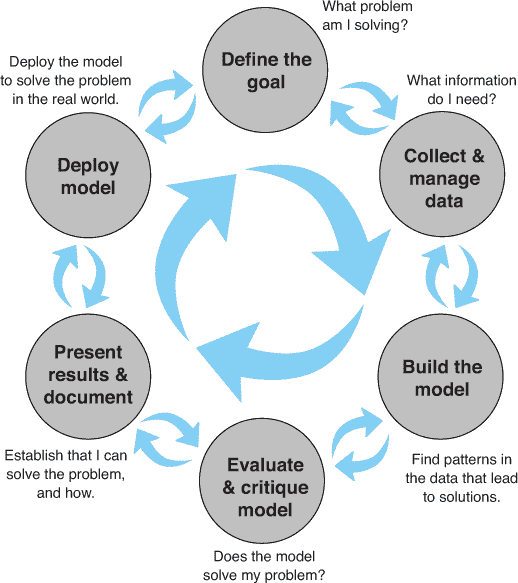
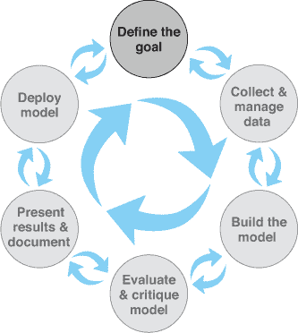
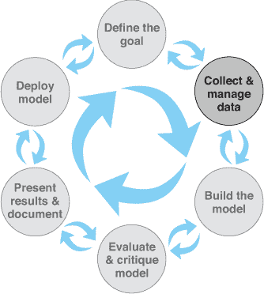
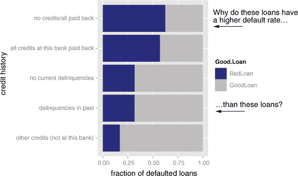
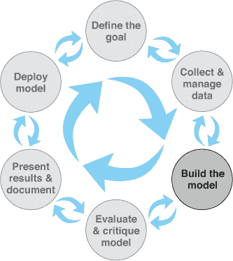
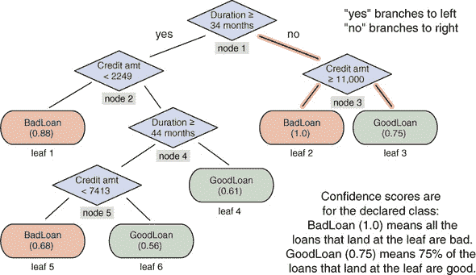
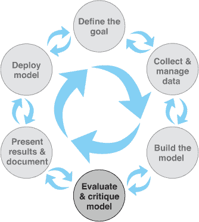
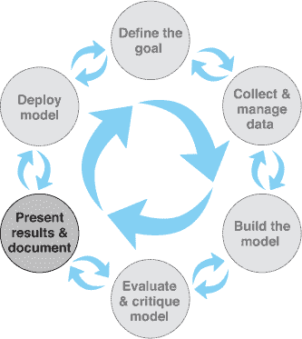
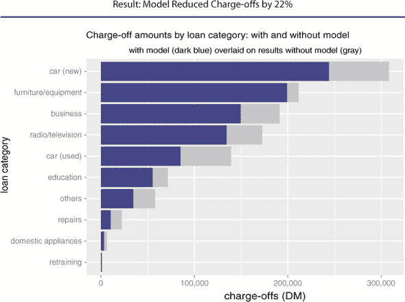
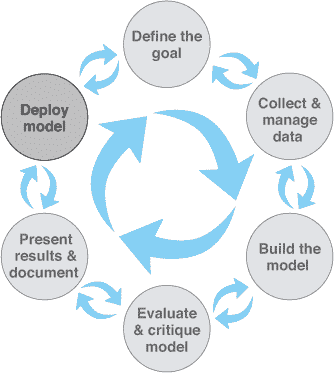

# 第一章. 数据科学流程

本章涵盖

+   定义数据科学

+   定义数据科学项目角色

+   理解数据科学项目的阶段

+   为新的数据科学项目设定期望

数据科学是一个跨学科实践，它借鉴了数据工程、描述性统计、数据挖掘、机器学习和预测分析的方法。与运筹学类似，数据科学侧重于实施数据驱动决策并管理其后果。对于本书，我们将专注于将数据科学应用于商业和科学问题，并使用这些技术。

数据科学家负责从开始到结束引导数据科学项目。数据科学项目的成功不在于对任何一种异国工具的访问，而在于有可衡量的目标、良好的方法论、跨学科互动和可重复的工作流程。

本章将向您展示一个典型的数据科学项目是什么样的：您会遇到的问题类型、应该设定的目标类型、您可能要处理的任务，以及预期的结果类型。

我们将使用一个具体、真实世界的例子来激发本章的讨论。^[[1])

> ¹
> 
> 对于本章，我们将使用汉斯·霍夫曼博士（Dr. Hans Hofmann）于 1994 年捐赠给 UCI 机器学习仓库的信用数据集。为了清晰起见，我们对一些列名进行了简化。原始数据集可以在[`archive.ics.uci.edu/ml/datasets/Statlog+(German+Credit+Data)`](http://archive.ics.uci.edu/ml/datasets/Statlog+(German+Credit+Data))找到。我们将在第二章中展示如何加载数据并为其分析做准备。请注意，数据收集时的德国货币是德国马克（DM）。

* * *

示例

*假设您在一家德国银行工作。银行觉得它在坏账上的损失太大，希望减少损失。为了做到这一点，他们希望有一个工具帮助贷款官员更准确地检测风险贷款。*

* * *

这就是您的数据科学团队发挥作用的地方。

## 1.1\. 数据科学项目中的角色

数据科学不是在真空中进行的。它是一个协作努力，它借鉴了多个角色、技能和工具。在我们谈论过程本身之前，让我们看看在成功项目中必须填补的角色。项目管理长期以来一直是软件工程的核心关注点，因此我们可以从中寻求指导。在定义这里的角色时，我们借鉴了弗雷德里克·布鲁克斯（Fredrick Brooks）在《人月神话：软件工程论文》（Addison-Wesley，1995）中描述的“外科团队”对软件开发的观点。我们还借鉴了敏捷软件开发范例的思想。

### 1.1.1\. 项目角色

让我们看看数据科学项目中的一些常见角色在表 1.1 中。

表 1.1. 数据科学项目角色和职责

| 角色 | 职责 |
| --- | --- |
| 项目赞助人 | 代表商业利益；倡导项目 |
| 客户 | 代表最终用户利益；领域专家 |
| 数据科学家 | 制定和执行分析策略；与赞助人和客户沟通 |
| 数据架构师 | 管理数据和数据存储；有时管理数据收集 |
| 操作 | 管理基础设施；部署最终项目成果 |

有时这些角色可能会重叠。一些角色——特别是客户、数据架构师和操作——通常由不在数据科学项目团队中的人担任，但他们却是关键的合作者。

项目赞助人

*在数据科学项目中，最重要的角色是项目赞助人。* 赞助人是想要数据科学结果的人；通常，他们代表商业利益。在贷款申请示例中，赞助人可能是银行消费贷款部门的负责人。赞助人负责决定项目是成功还是失败。如果数据科学家认为自己了解并能代表商业需求，他们可以为自己的项目填补赞助人角色，但这不是最佳安排。理想的赞助人应满足以下条件：如果他们对项目结果满意，那么项目在定义上就是成功的。*获得赞助人的批准成为数据科学项目的核心组织目标。*

* * *

保持赞助人的知情和参与

保持赞助人的知情和参与至关重要。向他们展示计划、进度以及他们能够理解的中间成功或失败。让赞助人蒙在鼓里是保证项目失败的好方法。

* * *

为了确保获得赞助人的批准，你必须通过定向访谈从他们那里获得明确的目标。你试图将赞助人表达的目标作为定量陈述来捕捉。一个目标示例可能是“在第一次逾期付款前至少两个月识别出 90%将违约的账户，错误率为不超过 25%。”这是一个精确的目标，它允许你并行检查实现目标是否真的对业务有意义，以及你是否拥有足够质量和数量的数据和工具来实现目标。

客户

虽然赞助人代表的是商业利益，但客户代表的是模型最终用户的利益。有时，赞助人和客户角色可能由同一个人担任。再次强调，如果数据科学家能够权衡商业权衡，他们可以填补客户角色，但这并不是最佳选择。

客户比赞助商更注重实际操作；他们是构建良好模型的技术细节与模型将被部署的日常工作流程之间的接口。他们不一定在数学或统计学方面有专业知识，但熟悉相关的业务流程，并在团队中作为领域专家发挥作用。在贷款申请示例中，客户可能是贷款官员或代表贷款官员利益的人。

与赞助商一样，您应该让客户保持知情并参与其中。理想情况下，您希望定期与他们开会，以确保您的努力与最终用户的需求保持一致。通常，客户属于组织中的不同团队，并且除了您的项目之外还有其他职责。保持会议聚焦，用他们能理解的方式展示结果和进度，并认真对待他们的批评。如果最终用户无法或不愿意使用您的模型，那么从长远来看，项目就不算成功。

数据科学家

数据科学项目中的下一个角色是数据科学家，他们负责采取所有必要的步骤以确保项目成功，包括制定项目策略并让客户保持知情。他们设计项目步骤，选择数据来源，并选择要使用的工具。由于他们选择要尝试的技术，他们必须对统计学和机器学习有深入了解。他们还负责项目规划和跟踪，尽管他们可能需要与项目管理合作伙伴一起完成。

在更技术层面上，数据科学家还会查看数据，执行统计测试和程序，应用机器学习模型，并评估结果——这是数据科学中的科学部分。

* * *

**领域同理心**

通常要求数据科学家成为领域专家是过于苛刻的。然而，在所有情况下，数据科学家必须培养强烈的*领域同理心*，以帮助定义和解决正确的问题。

* * *

数据架构师

数据架构师负责所有数据和其存储。通常这个角色由数据科学团队之外的人担任，例如数据库管理员或架构师。数据架构师通常管理多个不同项目的数据仓库，并且他们可能只能提供快速咨询。

操作

运营角色在获取数据和交付最终结果方面至关重要。担任此角色的人通常在数据科学团队之外有运营责任。例如，如果你正在部署一个影响在线购物网站上产品排序的数据科学结果，那么负责运营该网站的人将对如何部署此类事物有大量意见。这个人可能对响应时间、编程语言或数据大小有约束，你需要在部署时尊重这些约束。在运营角色中的人可能已经支持你的赞助者或客户，因此他们通常很容易找到（尽管他们的时间可能已经非常紧张）。

## 1.2\. 数据科学项目的阶段

理想的数据科学环境是鼓励数据科学家与所有其他利益相关者之间进行反馈和迭代的。这在数据科学项目的生命周期中得到了体现。尽管这本书，就像其他关于数据科学过程讨论一样，将周期分解为不同的阶段，但在现实中，阶段之间的界限是流动的，一个阶段的活动经常会与其他阶段的活动重叠。通常，在向前推进整体过程之前，你会在两个或更多阶段之间来回循环。这可以在图 1.1 中看到。

> ²
> 
> 机器学习过程的一个常见模型是跨行业数据挖掘标准流程（CRISP-DM）([`en.wikipedia.org/wiki/Cross-industry_standard_process_for_data_mining`](https://en.wikipedia.org/wiki/Cross-industry_standard_process_for_data_mining))。我们在这里讨论的模型与此类似，但强调在过程的任何阶段都可以进行来回迭代。

图 1.1\. 数据科学项目生命周期：循环中的循环



即使你完成了一个项目并部署了一个模型，从看到该模型在实际应用中可能出现新的问题和疑问。一个项目的结束可能引出后续的项目。

让我们来看看图 1.1 中展示的不同阶段。

### 1.2.1\. 定义目标

数据科学项目的第一个任务是定义一个可衡量和可量化的目标。在这个阶段，尽可能多地了解你项目背景：



+   为什么赞助者一开始就想要这个项目？他们缺少什么，需要什么？

+   他们现在正在做什么来解决问题，为什么这还不够好？

+   你需要哪些资源：什么类型的数据和多少人员？你将拥有领域专家进行合作，以及计算资源是什么？

+   项目赞助者计划如何部署你的结果？为了成功部署，必须满足哪些约束条件？

让我们回到我们的贷款申请示例。最终的商业目标是减少银行因不良贷款而遭受的损失。你的项目赞助商设想了一个工具，可以帮助贷款官员更准确地评估贷款申请人，从而减少不良贷款的数量。同时，重要的是贷款官员感到他们在贷款审批上拥有最终决定权。

一旦你和项目赞助商以及其他利益相关者对这些问题的初步答案达成一致，你们就可以开始定义项目的具体目标。目标应该是具体和可衡量的；不是“我们想更好地找到不良贷款”，而是“我们想通过一个预测哪些贷款申请人可能违约的模型，至少将贷款坏账率降低 10%。”

一个具体的目标会导致具体的中止条件和具体的标准。目标越不具体，项目越有可能无限制地进行，因为没有结果会“足够好”。如果你不知道你想要实现什么，你就不知道何时停止尝试——甚至不知道尝试什么。当项目最终结束时——因为时间或资源耗尽——没有人会对结果感到满意。

当然，有时需要更宽松、更具探索性的项目：“数据中是否有与更高违约率相关的东西？”或者“我们应该考虑减少我们发放的贷款类型吗？哪些类型可能会被取消？”在这种情况下，你仍然可以用具体的中止条件来界定项目，例如时间限制。例如，你可能会决定花两周时间，不再花更多时间探索数据，目标是提出候选假设。然后，这些假设可以被转化为全面建模项目的具体问题或目标。

一旦你对项目目标有了很好的了解，你就可以专注于收集数据以满足这些目标。

### 1.2.2\. 数据收集与管理

此步骤包括确定所需数据、探索数据以及调整数据以便进行分析。这一阶段通常是整个过程中耗时最长的步骤。它也是最重要的步骤之一：

+   我能获得哪些数据？

+   这能帮助我解决问题吗？

+   这是否足够？

+   数据质量是否足够？



想象一下，对于你的贷款申请问题，你已经收集了过去十年中具有代表性的贷款样本。其中一些贷款已经违约；大多数贷款（大约 70%）尚未违约。你已经收集了关于每个贷款申请的各种属性，如表 1.2 中所示。

表 1.2\. 贷款数据属性

| `Status_of_existing_checking_account` *(at time of application)* |
| --- |
| `Duration_in_month` *(loan length)* |
| `Credit_history` |
| `Purpose` *(car loan, student loan, and so on)* |
| `Credit_amount` *(loan amount)* |
| `Savings_Account_or_bonds` *(balance/amount)* |
| `Present_employment_since` |
| `Installment_rate_in_percentage_of_disposable_income` |
| `Personal_status_and_sex` |
| `Cosigners` |
| `Present_residence_since` |
| `Collateral` *(汽车、房产等)* |
| `Age_in_years` |
| `Other_installment_plans` *(其他贷款/信用额度类型)* |
| `Housing` *(拥有、租赁等)* |
| `Number_of_existing_credits_at_this_bank` |
| `Job` *(就业类型)* |
| `Number_of_dependents` |
| `Telephone` *(是否有)* |
| `Loan_status` *(因变量)* |

在您的数据中，`Loan_status`有两种可能的值：`GoodLoan`和`BadLoan`。在本讨论中，假设`GoodLoan`已偿还，而`BadLoan`违约。

* * *

尽量直接测量您所需的信息

尽可能地，尝试使用可以直接测量的信息，而不是从其他测量中推断出的信息。例如，您可能会倾向于使用收入作为变量，认为收入较低意味着偿还贷款更困难。偿还贷款的能力可以通过考虑贷款支付金额与借款人可支配收入的比例来更直接地衡量。这个信息比单纯的收入更有用；您在数据中作为变量`Installment_rate_in_percentage_of_disposable_income`拥有它。

* * *

这是您最初探索和可视化数据的阶段。您还将清理数据：修复数据错误和转换变量，如有必要。在探索和清理数据的过程中，您可能会发现数据不适合您的问题，或者您还需要其他类型的信息。您可能会在数据中发现比您最初计划解决的问题更重要的问题。例如，图 1.2 中的数据似乎与直觉相反。

图 1.2\. 按信用历史类别划分的违约贷款比例。每个条形的深色区域代表该类别中违约贷款的比例。



为什么一些看似安全的申请人（那些已向银行偿还所有贷款的人）的违约率会比看似风险更高的申请人（那些过去有过拖欠记录的人）更高？在更仔细地查看数据并与其他利益相关者和领域专家分享令人困惑的发现后，你意识到这个样本本身是有偏见的：*你只有实际发放的贷款（因此已经接受）*。一个真正的无偏贷款申请样本应该包括已接受的贷款申请和被拒绝的贷款申请。总体而言，由于你的样本只包括已接受的贷款，数据中看起来有风险的贷款比看起来安全的贷款要少。可能的情况是，看起来有风险的贷款在经过更严格的审查过程后被批准，这个过程可能是看似安全的贷款申请可以绕过的。这表明，如果你的模型要在当前申请批准流程之后使用，信用历史就不再是有用的变量。这也表明，即使是看似安全的贷款申请也应该更加仔细地审查。

这样的发现可能会让你和其他利益相关者改变或完善项目目标。在这种情况下，你可能会决定专注于看似安全的贷款申请。在发现数据中的事物时，你可能会在这个阶段和上一个阶段之间，以及在这个阶段和建模阶段之间来回循环。我们将在第三章（chapters 3）和第四章（4）中深入探讨数据探索和管理。

### 1.2.3\. 建模

在建模或分析阶段，你最终会接触到统计学和机器学习。在这里，你试图从数据中提取有用的见解，以实现你的目标。由于许多建模过程对数据分布和关系做出了特定的假设，因此在尝试找到最佳的数据表示方式和建模形式时，建模阶段和数据清洗阶段之间可能会有重叠和反复。



最常见的数据科学建模任务包括这些：

+   ***Classifying—*** 判断某物是否属于某一类别或另一类别

+   ***Scoring—*** 预测或估计一个数值，例如价格或概率

+   ***Ranking—*** 学习根据偏好对项目进行排序

+   ***Clustering—*** 将项目分组到最相似的组中

+   ***Finding relations—*** 寻找数据中观察到的相关关系或潜在原因

+   ***Characterizing—*** 从数据中非常通用的绘图和报告生成

对于这些任务中的每一个，都有几种不同的可能方法。我们将在这本书中介绍这些不同任务的一些最常见方法。

贷款申请问题是一个分类问题：你想要识别那些可能违约的贷款申请人。在这种情况下的一些常见方法是对数回归和基于树的算法（我们将在第七章和第十章中深入探讨这些方法）。你已经与贷款官员和其他将在现场使用你的模型的人进行了交谈，因此你知道他们希望能够理解模型分类背后的推理链，并且他们希望有一个模型对其决策的置信度的指示：这位申请人高度可能违约，还是只有一定可能？为了解决这个问题，你决定决策树是最合适的。我们将在第十章中更广泛地介绍决策树，但现在我们只看看得到的决策树模型。3

> ³
> 
> 在本章中，为了清晰起见，我们故意拟合了一个小而浅的树。

假设你发现了图 1.3 中展示的模型。让我们追踪一条通过树形结构的示例路径。假设有一个申请一年期 10,000 德国马克（当时的研究货币）贷款的应用。在树的顶部（图 1.3 中的节点 1），模型检查贷款是否超过 34 个月。答案是“否”，因此模型沿着树的右侧分支下行。这显示为从节点 1 出发的高亮分支。下一个问题（节点 3）是贷款是否超过 11,000 德国马克。同样，答案是“否”，因此模型再次向右分支（由从节点 3 出发的较暗的高亮分支表示）并到达叶子 3。历史上，到达这个叶子的 75%的贷款都是良好的贷款，因此模型建议你批准这笔贷款，因为有很高的可能性会偿还。

图 1.3. 用于寻找不良贷款申请的决策树模型。结果节点显示置信度分数。



另一方面，假设有一个申请一年期 15,000 德国马克贷款的应用。在这种情况下，模型首先在节点 1 处向右分支，然后在节点 3 处向左分支，到达叶子 2。历史上，到达叶子 2 的所有贷款都违约了，因此模型建议你拒绝这笔贷款申请。

我们将在第六章中讨论一般的建模策略，并在第二部分中详细介绍特定的建模算法。

### 1.2.4. 模型评估和批评

一旦你有了模型，你需要确定它是否满足你的目标：

+   它是否足够准确以满足你的需求？它是否具有良好的泛化能力？

+   它的表现是否优于“显而易见的猜测”？是否优于你目前使用的任何估计？

+   模型的结果（系数、聚类、规则、置信区间、显著性以及诊断）在问题域的背景下是否有意义？



如果你对这些问题的任何一个回答了“不”，那么是时候回到建模步骤——或者决定数据不支持你试图实现的目标。没有人喜欢负面结果，但了解在当前资源下无法满足你的成功标准时，将节省你徒劳的努力。你的精力将更好地用于创造成功。这可能意味着定义更现实的或收集你为实现原始目标所需的额外数据或其他资源。

回到贷款申请示例，首先要检查的是模型发现的规则是否有意义。查看 图 1.3，你不会注意到任何明显奇怪的规则，因此你可以继续评估模型的准确度。分类器准确度的一个很好的总结是 *混淆矩阵*，它列出了实际分类与预测分类的对比。（^[4]）

> ⁴
> 
> 通常，我们会将模型与测试集（用于构建模型的数据）进行比较。在这个例子中，为了简单起见，我们将使用训练数据（用于构建模型的数据）来评估模型。此外，请注意我们遵循的绘图约定：预测是 x 轴，对于表格来说，这意味着预测是列名。请注意，混淆矩阵还有其他约定。

在 列表 1.1 中，你将创建一个混淆矩阵，其中行表示实际贷款状态，列表示预测贷款状态。为了提高可读性，代码通过名称而不是索引引用矩阵元素。例如，`conf_mat ["GoodLoan", "BadLoan"]` 指的是元素 `conf_mat[2, 1]`：模型预测为不良的实际良好贷款数量。矩阵的对角线条目表示正确预测。

列表 1.1\. 计算混淆矩阵

```
library("rpart")                                                           ❶
 load("loan_model_example.RData")                                          ❷
 conf_mat <-
      table(actual = d$Loan_status, pred = predict(model, type = 'class')) ❸

##           pred
## actual     BadLoan GoodLoan
##   BadLoan       41      259
##   GoodLoan      13      687

(accuracy <- sum(diag(conf_mat)) / sum(conf_mat))                          ❹
 ## [1] 0.728
(precision <- conf_mat["BadLoan", "BadLoan"] / sum(conf_mat[, "BadLoan"])  ❺
 ## [1] 0.7592593
(recall <- conf_mat["BadLoan", "BadLoan"] / sum(conf_mat["BadLoan", ]))    ❻
 ## [1] 0.1366667

(fpr <- conf_mat["GoodLoan","BadLoan"] / sum(conf_mat["GoodLoan", ]))      ❻
 ## [1] 0.01857143
```

❶ 如何安装运行本书示例所需的所有包，可以在以下链接找到：[`github.com/WinVector/PDSwR2/blob/master/packages.R`](https://github.com/WinVector/PDSwR2/blob/master/packages.R)。

❷ 此文件可以在以下链接找到：[`github.com/WinVector/PDSwR2/tree/master/Statlog`](https://github.com/WinVector/PDSwR2/tree/master/Statlog)。

❸ 创建混淆矩阵

❹ 模型总体准确率：73% 的预测是正确的。

❺ 模型精确度：76% 被预测为不良的申请者确实违约了。

❻ 模型召回率：模型发现了 14% 的违约贷款。

❻ 假阳性率：2% 的良好申请者被错误地识别为不良。

模型正确预测贷款状态的准确率为 73%，优于随机猜测（50%）。在原始数据集中，30%的贷款是坏账，所以一直猜测`GoodLoan`的准确率将是 70%（尽管并不很有用）。所以你知道模型比随机猜测做得更好，也比明显的猜测做得更好。

总体准确率还不够。你想要知道正在犯什么类型的错误。模型是否漏掉了太多的坏账，或者是否将太多的好账标记为坏账？*召回率*衡量模型实际上能找到多少坏账。*精确率*衡量被标记为坏账的贷款中有多少确实是坏账。*假阳性率*衡量有多少好账被错误地标记为坏账。理想情况下，你希望召回率和精确率都很高，而假阳性率很低。什么构成“足够高”和“足够低”是与其他利益相关者共同做出的决定。通常，正确的平衡需要在召回率和精确率之间进行一些权衡。

还有其他衡量准确率的指标，以及其他衡量模型质量的指标。我们将在第六章讨论模型评估。

### 1.2.5. 演示和文档

一旦你有一个满足成功标准的模型，你将向你的项目赞助商和其他利益相关者展示你的结果。你还必须为那些在模型部署后负责使用、运行和维护模型的组织成员记录模型。



不同的受众需要不同类型的信息。面向商业的受众希望了解你的发现对商业指标的影响。在贷款示例中，向商业受众展示的最重要的事情是，你的贷款申请模型将如何减少坏账（银行因不良贷款而损失的资金）。假设你的模型识别出了一批坏账，占总损失资金的 22%。那么，你的演示或执行摘要应该强调该模型有可能减少银行损失的这个数额，如图 1.4 所示。

图 1.4。执行演示中的示例幻灯片



你还希望向这个受众提供你最有趣的发现或建议，例如，新车贷款比二手车贷款风险更大，或者大多数损失都与不良汽车贷款和不良设备贷款有关（假设受众不知道这些事实）。模型的技术细节对这个受众来说可能不那么有趣，你应该跳过它们或只在高层次上展示它们。

为模型最终用户（贷款官员）准备的演示应该强调模型将如何帮助他们更好地完成工作：

+   他们应该如何解释模型？

+   模型的输出看起来是什么样子？

+   如果模型提供了决策树中执行了哪些规则的跟踪，他们应该如何阅读这些信息？

+   如果模型除了分类之外还提供了一个置信度分数，他们应该如何使用这个置信度分数？

+   他们可能在什么情况下可能会推翻模型？

面向运营人员的演示或文档应该强调你的模型对他们负责的资源的影响。我们将在第三部分讨论不同受众的演示和文档结构。

### 1.2.6\. 模型部署和维护

最后，模型投入运行。在许多组织中，这意味着数据科学家不再对模型的日常运营负有主要责任。但你仍然应该确保模型能够平稳运行，不会做出灾难性的无监督决策。你还想确保模型能够随着环境的变化而更新。在许多情况下，模型最初将部署在一个小型的试点项目中。测试可能会发现你没有预料到的问题，你可能需要相应地调整模型。我们将在第十一章讨论模型部署。



当你部署模型时，你可能会发现贷款官员在特定情况下经常绕过模型，因为它与他们的直觉相矛盾。他们的直觉错了吗？或者你的模型不完整？或者，在一个更积极的场景中，你的模型可能表现得太成功，以至于银行希望你也将其扩展到住房贷款。

在我们深入探讨数据科学生命周期各阶段之前，在接下来的章节中，让我们先看看初始项目设计阶段的一个重要方面：设定预期。

## 1.3\. 设定预期

设定预期是定义项目目标和成功标准的关键部分。你的团队面向业务成员（特别是项目发起人）可能已经对满足业务目标所需的表现有了一定的想法：例如，银行希望至少减少 10%的不良贷款损失。在你深入一个项目之前，你应该确保你拥有的资源足以帮助你实现业务目标。

这是一个项目生命周期阶段灵活性的例子。在探索和清洗阶段，你将更好地了解数据；在你对数据有了感觉之后，你可以判断数据是否足够好，以满足预期的性能阈值。如果不够，那么你将不得不重新审视项目设计和目标设定阶段。

### 1.3.1\. 确定模型性能的下限

在定义验收标准时，了解模型应该达到的预期性能水平是很重要的。

**零模型**代表你应该努力达到的模型性能的下限。你可以将零模型视为“显而易见的猜测”，即你的模型必须做得更好的。在已经有一个正在运行的模型或解决方案，而你试图改进的情况下，零模型是现有的解决方案。在没有现有模型或解决方案的情况下，零模型是最简单的可能模型：例如，始终猜测`GoodLoan`，或者在你试图预测数值时始终预测输出的平均值。

在我们的贷款申请示例中，数据集中的 70%的贷款申请最终证明是好的贷款。将所有贷款标记为`GoodLoan`（实际上，仅使用现有流程来分类贷款）的模型将有 70%的时间是正确的。所以你知道，任何实际模型，当你将其拟合到数据上时，应该比 70%的准确率更好，以便有用——如果准确率是你的唯一指标。由于这是最简单的模型，其错误率被称为**基础错误率**。

你应该比 70%好多少？在统计学中，有一个叫做**假设检验**或**显著性检验**的程序，用于检验你的模型是否与零模型（在这种情况下，是否新模型基本上只与始终猜测`GoodLoan`一样准确）等效。你希望你的模型准确率在统计上“显著优于”70%。我们将在第六章中讨论显著性检验。

准确率并不是唯一的（甚至不是最好的）性能指标。正如我们之前看到的，**召回率**衡量模型识别出的真实坏贷款的比例。在我们的例子中，始终猜测`GoodLoan`的零模型在识别坏贷款方面的召回率为零，这显然不是你想要的。通常，如果已经有一个现有的模型或流程，你希望了解其精确度、召回率和假阳性率；提高这些指标中的一个几乎总是比仅仅考虑准确率更重要。如果你的项目目的是改进现有流程，那么当前模型至少在这些指标中的一个上必须是不令人满意的。了解现有流程的限制有助于你确定所需性能的有用下限。

## 摘要

数据科学流程涉及很多来回——在数据科学家和其他项目利益相关者之间，以及在流程的不同阶段之间。在这个过程中，你会遇到惊喜和障碍；这本书将教你克服一些这些障碍的程序。保持所有利益相关者知情和参与很重要；当项目结束时，与项目有关联的任何人都不应该对最终结果感到惊讶。

在接下来的章节中，我们将探讨项目设计之后的阶段：加载数据、探索数据和管理工作数据。第二章介绍了几种将数据加载到 R 中的基本方法，这些方法便于分析。

在本章中，你学习了

+   一个成功的数据科学项目不仅仅涉及统计学。它还需要各种角色来代表商业和客户利益，以及运营方面的关注。

+   你应该确保你有一个明确、可验证、可量化的目标。

+   确保你对所有利益相关者设定了现实的目标。
