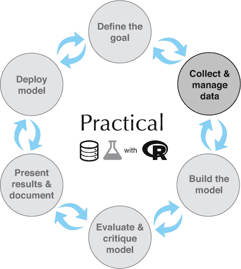
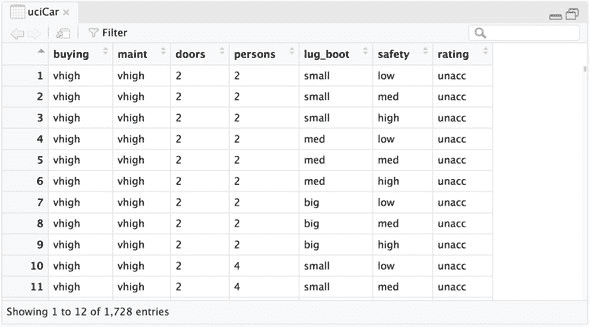
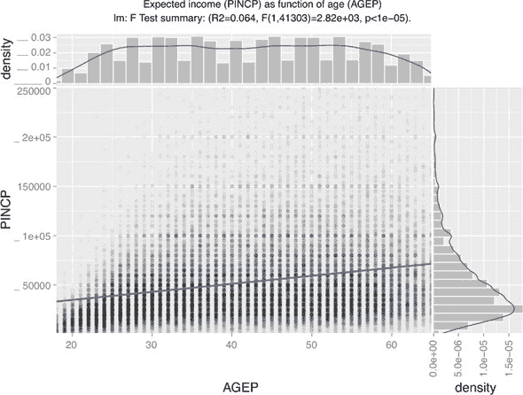

# 第二章。从 R 和数据开始

本章涵盖

+   开始使用 R 和数据

+   掌握 R 的数据框结构

+   将数据加载到 R 中

+   对数据进行重新编码以供后续分析

本章将介绍如何开始使用 R 以及如何从各种来源将数据导入 R。这将为您在本书其余部分的工作做好准备。

图 2.1 是一个表示本书心智模型的图表，经过重新着色以强调本章的目的：开始使用 R 并将数据导入 R。整体图表显示了从第一章中的数据科学流程图与本书标题的象形文字形式相结合。在每一章中，我们将重新着色这个心智模型，以指明我们强调的数据科学流程的各个部分。例如：在本章中，我们将掌握收集和管理数据的初始步骤，并触及实用性、数据和 R（但还不是科学艺术）的问题。

图 2.1。第二章心智模型



许多数据科学项目始于有人将分析师指向一大堆数据，分析师则被留下去理解它。5 您的第一个想法可能是使用临时工具和电子表格来整理它，但您很快就会意识到，您花在调整工具上的时间比实际分析数据的时间要多。幸运的是，有一个更好的方法：使用 R。到本章结束时，您将能够自信地使用 R 提取、转换和加载数据进行分析。

> ⁵
> 
> 我们假设读者对成为分析师、统计学家或数据科学家感兴趣，因此我们将交替使用这些术语来代表与读者类似的人。
> 
> *没有数据的 R 就像去剧院看帷幕上下摆动。*
> 
> *改编自 Ben Katchor 的《Julius Knipl，房地产摄影师：故事》*

## 2.1。从 R 开始

R 是开源软件，在 Unix、Linux、Apple 的 macOS 和 Microsoft Windows 上运行良好。本书将专注于如何作为数据科学家进行工作。然而，为了运行示例，读者必须熟悉 R 编程。如果您想获取一些先决知识，我们建议咨询 CRAN（主要 R 包仓库：[`cran.r-project.org/manuals.html`](https://cran.r-project.org/manuals.html)）和其他在线材料。以下是一些适合 R 入门的好书：

+   *《R 编程艺术，第二版》，Robert Kabacoff，Manning，2015*

+   *《超越电子表格的 R》，Jonathan Carroll，Manning，2018*

+   *《R 编程的艺术》，Norman Matloff，No Starch Press，2011*

+   *《R 编程人人用，第二版》，Jared P. Lander，Addison-Wesley，2017*

每本书都有不同的教学风格，其中一些包括统计学、机器学习和数据工程的内容。一点研究可能会告诉你哪些书籍适合你。本书将专注于处理大量的数据科学示例，展示在未来的实际应用中遇到的典型问题的解决步骤。

我们认为数据科学是可重复的：在相同的数据上重新运行相同的工作应该给出相似的质量结果（由于数值问题、时间问题、并行性问题以及伪随机数问题，确切的结果可能会有所不同）。实际上，我们应该坚持可重复性。这就是为什么我们在数据科学书中讨论编程的原因。编程是可靠地指定可重用操作序列的方法。考虑到这一点，我们应该始终将数据更新（获取更新、更正或更大的数据）视为好事，因为重新运行分析应该，按照设计，非常容易。一个由多个手动步骤执行的分析永远不会容易重复。

### 2.1.1\. 安装 R、工具和示例

我们建议你遵循附录 A 的 A.1 节中的步骤来安装 R、软件包、工具和本书的示例。

* * *

寻找帮助

R 包含一个非常出色的帮助系统。要获取 R 命令的帮助，只需在 R 控制台中运行`help()`命令。例如，要查看如何更改目录的详细信息，你应该输入`help(setwd)`。你必须知道函数的名称才能获取帮助，所以我们强烈建议做笔记。对于一些简单的函数，我们不会解释函数，而是留给读者调用`help()`来找出函数的功能。

* * *

### 2.1.2\. R 编程

在本节中，我们将简要介绍一些 R 编程的约定、语义和风格问题。详细信息可以在特定软件包的文档、R 的`help()`系统中找到，也可以通过尝试我们在此处提供的示例的不同变体来获取。在这里，我们将专注于与其他常见编程语言不同的方面，以及我们在书中强调的约定。这应该有助于你进入 R 编程的思维模式。

有许多常见的 R 编程风格指南。*编程风格*是尝试使事物更加一致、清晰和易于阅读。本书将遵循我们在教学和代码维护中找到的非常有效的风格变体。显然，我们的风格只是众多风格中的一种，并不是强制性的。好的起始参考包括以下内容：

+   [Google R 风格指南](https://google.github.io/styleguide/Rguide.html)

+   Hadley Wickham 的来自《Advanced R》的风格指南([`adv-r.had.co.nz/Style.html`](http://adv-r.had.co.nz/Style.html))

我们将尽量减少与当前惯例的差异，并指出我们有哪些差异。我们还推荐作者博客中的“R 技巧和窍门”。^([6])

> ⁶
> 
> 查看 [`www.win-vector.com/blog/tag/r-tips/`](http://www.win-vector.com/blog/tag/r-tips/)。

R 是一种丰富而广泛的语言，通常有多种方式来完成同一项任务。这代表了一点点初始的学习曲线，因为直到你熟悉了符号，R 程序的含义可能很难辨别。然而，花时间复习一些基本符号是非常有回报的，因为它会使处理即将到来的大量示例变得更加容易。我们理解 R 的语法对于来到这里学习数据科学方法和实践的读者来说可能并不有趣（我们的确切目标受众！），但这个小小的初始努力可以防止以后出现很多困惑。我们将使用本节来描述一些 R 的符号和含义，重点关注特别有用和令人惊讶的部分。所有以下都是小而基本的内容，但其中许多都是微妙的，值得实验。

* * *

倾向于工作代码

倾向于使用程序、脚本或代码，这些代码可以工作但尚未实现你想要的功能。而不是编写一个大的、未经测试的程序或脚本，其中包含了分析的所有期望步骤，编写一个能够正确执行一个步骤的程序，然后迭代地修改脚本以正确执行更多步骤。这种从工作修订版开始的方法通常比尝试调试一个大的、有缺陷的系统到正确性要快得多。

* * *

示例和注释字符（#）

在示例中，我们将以自由文本的形式展示 R 命令，结果以井号 `#` 开头，这是 R 的注释字符。在许多示例中，我们将在命令之后包括结果，前面加上注释字符。R 打印通常包括方括号中的数组单元格索引，并且经常涉及换行。例如，打印整数 1 到 25 的样子如下：

```
print(seq_len(25))
# [1]  1  2  3  4  5  6  7  8  9 10 11 12
# [13] 13 14 15 16 17 18 19 20 21 22 23 24
# [25] 25
```

注意数字被换行到三行，每行都以该行报告的第一个单元格的索引开始，位于方括号内。有时我们不会显示结果，这是额外鼓励你完成这些特定示例的一种方式。

打印

R 有一些规则可以打开或关闭隐式或自动打印。一些包，如 `ggplot2`，使用打印来触发它们预期的操作。输入一个值通常会导致打印该值。在函数或 for 循环中必须小心，因为这些上下文中 R 的自动打印结果是禁用的。打印非常大的对象可能是一个问题，因此你想要避免打印未知大小的对象。通常可以通过添加额外的括号来强制隐式打印，例如在“`(x <- 5)`”中。

向量和列表

向量（值序列的顺序数组）是 R 的基本数据结构。列表可以在每个槽位中持有不同类型；向量在每个槽位中只能持有相同的基本或原子类型。除了数字索引外，向量和列表都支持名称键。可以通过下面的操作符从列表或向量中检索项目。

* * *

向量索引

R 中的向量（R vectors）和列表（R lists）是从 1 开始索引的，而不是像许多其他编程语言那样从 0 开始。

* * *

```
example_vector <- c(10, 20, 30)                ❶
example_list <- list(a = 10, b = 20, c = 30)   ❷

example_vector[1]                              ❸
 ## [1] 10
example_list[1]
## $a
## [1] 10

example_vector[[2]]                            ❹
 ## [1] 20
example_list[[2]]
## [1] 20

example_vector[c(FALSE, TRUE, TRUE)]           ❺
 ## [1] 20 30
example_list[c(FALSE, TRUE, TRUE)]
## $b
## [1] 20
##
## $c
## [1] 30

example_list$b                                 ❻
 ## [1] 20

example_list[["b"]]
## [1] 20
```

❶ 构建一个示例向量。`c()` 是 R 的连接操作符——它从较短的向量或列表构建更长的向量或列表，而不需要嵌套。例如，`c(1)` 只是数字 1，而 `c(1, c(2, 3))` 等价于 `c(1, 2, 3)`，这又等价于整数 1 到 3（尽管以浮点格式存储）。

❷ 构建一个示例列表

❸ 展示了使用 [] 的向量和列表的使用。注意，对于列表，[] 返回一个新的短列表，而不是项目本身。

❹ 展示了使用 [[]] 的向量和列表的使用。在常见情况下，[[]] 强制返回单个项目，尽管对于复杂类型的嵌套列表，这个项目本身也可以是一个列表。

❺ 向量和列表可以通过逻辑向量、整数向量以及（如果向量或列表有名称）字符向量进行索引。

❻ 对于命名示例，example_list$b 的语法实际上是 example_list[["b"]] 的简写（对于命名向量也是如此）。

我们不会在每一个例子中都分享这么多笔记，但我们邀请读者通过在使用的每个函数或命令上调用 `help()` 来像有这些笔记一样工作。此外，我们非常鼓励尝试不同的变体。在 R 中，“错误”只是 R 安全拒绝完成一个不良形成的操作（错误并不表示“崩溃”，结果也没有被破坏）。因此，对错误的恐惧不应限制实验。

```
x <- 1:5
print(x)                                                                   ❶
# [1] 1 2 3 4 5

x <- cumsumMISSPELLED(x)                                                   ❷
# Error in cumsumMISSPELLED(x) : could not find function "cumsumMISSPELLED"

print(x)                                                                   ❸
# [1] 1 2 3 4 5

x <- cumsum(x)                                                             ❹
print(x)
# [1]  1  3  6 10 15
```

❶ 定义了一个我们感兴趣的价值并将其存储在变量 x 中

❷ 尝试将新的结果分配给 x，但失败了

❸ 注意到除了提供有用的错误信息外，R 还保留了变量 x 的原始值。

❹ 再次尝试操作，使用 cumsum() 的正确拼写。cumsum()，即累积和，是一个有用的函数，可以快速计算运行总和。

R 中向量的另一个方面是大多数 R 操作都是**向量化的**。当一个函数或操作符应用于向量时，它被称作**向量化**，这意味着它独立地对向量的每个元素应用函数。例如，函数 `nchar()` 用于计算字符串中的字符数。在 R 中，这个函数可以用于单个字符串，也可以用于字符串向量。

* * *

列表和向量是 R 的映射结构

列表和向量是 R 的映射结构。它们可以将字符串映射到任意对象。主要的列表操作 `[]`、`match()` 和 `%in%` 都是**向量化的**。这意味着当它们应用于值向量时，通过每个条目执行一次查找来返回结果向量。要从列表中提取单个元素，请使用双括号表示法 `[[]]`。

* * *

```
nchar("a string")
# [1] 8

nchar(c("a", "aa", "aaa", "aaaa"))
# [1] 1 2 3 4
```

* * *

逻辑运算

R 的逻辑运算符有两种类型。R 有标准的后缀标量值运算符，它们只期望一个值，并且具有与 C 或 Java 中相同的行为和名称：`&&`和`||`。R 还有向量化后缀运算符，它们作用于逻辑值的向量：`&`和`|`。务必始终在`if`语句等情况下使用标量版本（`&&`和`||`），在处理逻辑向量时使用向量化版本（`&`和`|`）。

* * *

NULL 和 NANA（不可用）值

在 R 中，`NULL`只是使用连接运算符`c()`不带参数形成的空或长度为零向量的同义词。例如，当我们把`c()`输入到 R 控制台时，我们会看到返回的值是`NULL`。在 R 中，`NULL`不是任何形式的无效指针（如在大多数 C/Java 相关语言中）。`NULL`只是一个长度为零的向量。连接`NULL`是一个安全且定义良好的操作（实际上是一个“无操作”或“no-op”，什么都不做）。例如，`c(c(), 1, NULL)`是完全有效的，并返回值`1`。

`NA`代表“不可用”，这在 R 中相当独特。大多数简单类型都可以取`NA`的值。例如，向量`c("a", NA, "c")`是一个包含三个字符字符串的向量，其中我们不知道第二个条目的值。`NA`的存在非常方便，因为它允许我们在数据中直接标注缺失或不可用的值，这在数据处理中可能至关重要。`NA`的行为有点像浮点运算中的`NaN`值，^([7])但我们不限于只使用它与浮点类型一起。此外，`NA`意味着“不可用”，而不是无效（如`NaN`表示），因此`NA`有一些方便的规则，例如逻辑表达式`FALSE & NA`简化为`FALSE`。

> ⁷
> 
> *浮点运算的局限性*，或者说在计算机中通常如何*近似*实数，是处理数值数据时常见的混淆和问题来源。为了理解处理数值数据的问题，我们建议数据科学家阅读大卫·戈尔伯格 1991 年的《计算调查》。“关于浮点运算，每位计算机科学家都应该知道的内容”已从该期公开分享([`docs.oracle.com/cd/E19957-01/806-3568/ncg_goldberg.html`](https://docs.oracle.com/cd/E19957-01/806-3568/ncg_goldberg.html))。

标识符

标识符或符号名称是 R 引用变量和函数的方式。Google R 风格指南坚持使用所谓的“驼峰式命名法”（名称中的单词边界由大写字母表示，如“CamelCase”本身）。高级 R 指南建议使用下划线样式，其中标识符内的名称用下划线分隔（例如，“day_one”而不是“DayOne”）。此外，许多 R 用户使用点来分隔标识符的名称（例如，“day.one”）。特别是，重要的内置 R 类型，如`data.frame`和包如`data.table`，使用点表示法约定。

我们建议使用下划线表示法，但发现在与他人合作时经常必须在这两种约定之间切换。如果可能，避免使用点约定，因为这种表示法通常在面向对象的语言和数据库中用于其他目的，因此会无端地混淆他人.^([8])

> ⁸
> 
> 点表示法可能来自 Lisp 世界（它强烈影响了 R）和避免下划线的倾向可能是在“`_`”曾是 R 中可用的赋值运算符时遗留下来的（它现在不再用作 R 中的赋值运算符）。

换行

通常建议将 R 源代码行限制在 80 列或更少。只要语句结束是明确的，R 接受多行语句。例如，要将单个语句“`1 + 2`”拆分为多行，可以这样编写代码：

```
1 +
  2
```

不要编写如下代码，因为第一行本身就是一个有效的语句，这会创建歧义：

```
1
  + 2
```

规则是这样的：每次在多行语句中读取时，如果语句提前结束，就强制产生语法错误。

分号

R 允许使用分号作为语句结束标记，但不是必须的。大多数风格指南建议不要在 R 代码中使用分号，当然也不应在行尾使用它们。

赋值

R 有许多赋值运算符（见表 2.1）；首选的是`<-`。在 R 中，`=`也可以用于赋值，但它也用于在函数调用期间通过名称将参数值绑定到参数名（因此使用`=`存在一些潜在的歧义）。

表 2.1\. R 的主要赋值运算符

| 运算符 | 用途 | 示例 |
| --- | --- | --- |
| <- | 将右侧的值赋给左侧的符号。 | x <- 5 # 将 5 赋值给符号 x |
| = | 将右侧的值赋给左侧的符号。 | x = 5 # 将 5 赋值给符号 x |
| -> | 将左侧赋给右侧，而不是传统的从右到左。 | 5 -> x # 将 5 赋值给符号 x |

赋值的左侧

许多流行的编程语言只允许将值赋给变量名或符号。R 允许在赋值的左侧使用切片表达式，以及数值和逻辑数组索引。这允许使用非常强大的数组切片命令和编码风格。例如，我们可以像以下示例中那样，将向量中的所有缺失值（用“`NA`”表示）替换为零：

```
d <- data.frame(x = c(1, NA, 3))    ❶
print(d)
#    x
# 1  1
# 2 NA
# 3  3                              ❷

d$x[is.na(d$x)] <- 0                ❸
print(d)
#   x
# 1 1
# 2 0
# 3 3
```

❶ “data.frame”是 R 的表格数据类型，也是 R 中最重要的一种数据类型。data.frame 以行和列的形式组织数据。

❷ 当打印 data.frame 时，行号显示在第一列（未命名的列）中，列值显示在其对应的列名下方。

❸ 我们可以将 d 的 x 列的切片或选择放在赋值的左侧，以轻松地将所有 NA 值替换为零。

因子

R 可以处理多种类型的数据：数值、逻辑、整数、字符串（称为 *字符* 类型）和 *因子*。因子是 R 的一种类型，它将一组固定的字符串编码为整数。因子可以在存储上节省很多空间，同时看起来像字符串一样行为。然而，因子可能与 `as.numeric()` 命令（它为因子返回因子代码，但解析文本为字符类型）产生潜在的混淆。因子还编码了整个允许值的集合，这很有用——但可能会使将来自不同来源（看到了不同的值集合）的数据合并变得有些麻烦。为了避免问题，我们建议在分析后期再延迟将字符串转换为因子。这通常通过向 `data.frame()` 或 `read.table()` 等函数添加 `stringsAsFactors = FALSE` 参数来实现。然而，我们确实鼓励在有理由的情况下使用因子，例如想要使用 `summary()` 或准备生成虚拟指标（参见 关于因子编码的更多内容 后的 2.10 列表，了解更多关于虚拟指标及其与因子的关系）。

命名参数

R 围绕着将函数应用于数据。具有大量参数的函数很快就会变得令人困惑和难以阅读。这就是为什么 R 包含命名参数功能的原因。例如，如果我们想将工作目录设置为 “/tmp”，我们通常会使用 `setwd()` 命令如下：`setwd("/tmp")`。然而，`help(setwd)` 显示 `setwd()` 的第一个参数名为 `dir`，因此我们也可以这样写：`setwd(dir = "/tmp")`。这对于具有大量参数的函数和设置可选函数参数非常有用。注意：命名参数必须通过 `=` 设置，而不是通过赋值运算符如 `<-`。

> *如果你有一个有 10 个参数的过程，你可能遗漏了一些。*
> 
> *艾伦·佩利斯，《编程格言》，ACM SIGPLAN 通告 17*

包符号

在 R 中，使用包中的函数主要有两种方式。第一种是通过 `library()` 命令附加包，然后使用函数名。第二种是使用包名，然后使用 `::` 来指定函数。例如，`stats::sd(1:5)` 就是一个这种方法的例子。`::` 符号有助于避免歧义，或者在你以后阅读自己的代码时留下关于函数来自哪个包的提示。

值语义

R 在高效模拟“按值复制”语义方面很独特。任何用户拥有两个数据引用时，每个都会独立演变：对其中一个的更改不会影响另一个。这对于兼职程序员来说非常理想，并且在编写代码时消除了大量可能的别名错误。这里我们给出一个快速示例：

```
d <- data.frame(x = 1, y = 2)     ❶
d2 <- d                           ❷
d$x <- 5                          ❸

print(d)
#   x y
# 1 5 2

print(d2)
#   x y
# 1 1 2
```

❶ 创建一些示例数据，并通过名称 d 引用它们

❷ 创建对同一数据的另一个引用 d2

❸ 修改 d 所引用的值

注意 `d2` 为 `x` 保留了旧值 `1`。这个特性使得编码非常方便和安全。许多编程语言以这种方式在函数调用中保护引用或指针；然而，R 保护复杂数值，并且在所有情况下都这样做（而不仅仅是函数调用）。当你想要共享回更改时，需要特别注意，例如在所有所需更改完成后调用最终的赋值操作，如 `d2 <- d`。根据我们的经验，R 的值隔离语义防止了比它引入的复制回传不便更多的问题。

组织中间值

长序列的计算可能会变得难以阅读、调试和维护。为了避免这种情况，我们建议保留变量名 `.` 来存储中间值。想法是这样的：慢慢工作以快速前进。例如：一个常见的数据科学问题是排序收入记录，然后计算达到给定排序键的总收入比例。在 R 中，可以通过将这个任务分解成小步骤轻松完成：

```
data <- data.frame(revenue = c(2, 1, 2),                        ❶
                   sort_key = c("b", "c", "a"),
                   stringsAsFactors = FALSE)
print(data)
#   revenue sort_key
# 1       2        b
# 2       1        c
# 3       2        a

. <- data                                                       ❷
. <- .[order(.$sort_key), , drop = FALSE]                       ❸
.$ordered_sum_revenue <- cumsum(.$revenue)
.$fraction_revenue_seen <- .$ordered_sum_revenue/sum(.$revenue)
result <- .                                                     ❹

print(result)
#   revenue sort_key ordered_sum_revenue fraction_revenue_seen
# 3       2        a                   2                   0.4
# 1       2        b                   4                   0.8
# 2       1        c                   5                   1.0
```

❶ 我们的概念性或示例数据。

❷ 将我们的数据赋值给一个名为 “.” 的临时变量。原始值将保留在 “data” 变量中，这使得在必要时从开始重新计算变得容易。

❸ 使用 `order` 命令对行进行排序。`drop = FALSE` 并非绝对必要，但养成包含它的习惯是好的。对于不带 `drop = FALSE` 参数的单列数据框，`[,]` 索引操作符会将结果转换为向量，这几乎不是 R 用户真正的意图。`drop = FALSE` 参数关闭了这种转换，并且包含它是“以防万一”的好主意，并且在数据框只有一列或我们不确定数据框是否有多列（因为数据框来自其他地方）时，这是一个明确的要求。

❹ 将结果从 “.” 赋值给一个更容易记忆的变量名

R 包 `dplyr` 将点符号替换为所谓的 *管道符号*（由名为 `magrittr` 的另一个包提供，类似于 JavaScript 方法，链式调用）。由于 `dplyr` 非常受欢迎，你可能会看到用这种风格编写的代码，我们有时会使用这种风格来帮助你为这样的代码做好准备。然而，重要的是要记住，`dplyr` 仅仅是标准 R 代码的一个流行替代品，而不是一个更优越的替代品。

```
library("dplyr")

result <- data %>%
  arrange(., sort_key) %>%
  mutate(., ordered_sum_revenue = cumsum(revenue)) %>%
  mutate(., fraction_revenue_seen = ordered_sum_revenue/sum(revenue))
```

这个示例的每一步都已被相应的 `dplyr` 等效项所取代。`arrange()` 是 `dplyr` 对 `order()` 的替代，而 `mutate()` 是 `dplyr` 对赋值的替代。代码翻译是逐行进行的，唯一的例外是赋值是首先编写的（尽管它发生在所有其他步骤之后）。计算步骤是通过 `magrittr` 管道符号 `%>%` 顺序排列的。

`magrittr` 管道允许你用 `x %>% f`、`x %>% f()` 或 `x %>% f(.)` 代替 `f(x)`。通常，`x %>% f` 是教授的符号，然而，我们认为 `x %>% f(.)` 在表示所发生的事情方面最为明确。⁹]

> ⁹
> 
> 对于我们自己的工作，我们实际上更喜欢使用 `wrapr` 包中的“点管道” `%.>%`，它强制执行更多的符号一致性。

`dplyr` 符号的详细信息可以在以下链接中找到：[`dplyr.tidyverse.org/articles/dplyr.html`](http://dplyr.tidyverse.org/articles/dplyr.html)。请注意，调试长的 `dplyr` 管道是困难的，在开发和实验过程中，将 `dplyr` 管道分解成更小的步骤，并将中间结果存储到临时变量中是有意义的。

中间结果符号的优点是它既容易重启，也容易逐步调试。在这本书中，我们将根据方便使用不同的符号。

`data.frame` 类

R 的 `data.frame` 类旨在以非常好的“分析就绪”格式存储数据。`data.frame` 是二维数组，其中每一列代表一个变量、测量或事实，每一行代表一个个体或实例。在这种格式中，单个单元格代表单个实例的单个事实或变量的已知信息。`data.frame` 实现为列向量的命名列表（列表列是可能的，但它们通常是 `data.frame` 的例外），在 `data.frame` 中，所有列的长度都相同，这意味着我们可以将所有列的 *`k`* 个条目视为一行。

对 `data.frame` 列的操作通常既高效又矢量化。添加、查找和删除列都很快速。在 `data.frame` 上的行操作可能很昂贵，因此对于大型 `data.frame` 处理，你应该优先选择矢量化列符号。

R 的 `data.frame` 与数据库表非常相似，因为它具有类似模式的信息：一个明确的列名和列类型列表。大多数分析最好用 `data.frame` 列的转换来表示。

让 R 为你做工作

大多数常见的统计或数据处理操作已经在“基础 R”（R 本身及其核心包，如 `utils` 和 `stats`）或扩展包中有了很好的实现。如果你不委托给 R，你最终会与 R 作对。例如，来自 Java 的程序员可能会期望必须使用 for 循环来添加两个数据列的每一行值。在 R 中，添加两个数据列被认为是基本的，并且如下实现：

```
d <- data.frame(col1 = c(1, 2, 3), col2 = c(-1, 0, 1))
d$col3 <- d$col1 + d$col2
print(d)
#   col1 col2 col3
# 1    1   -1    0
# 2    2    0    2
# 3    3    1    4
```

`data.frame` 实际上是列的命名列表。我们将在这本书中广泛使用它们。在 R 中，人们倾向于在列上工作，并让 R 的矢量化特性一次性对每一行执行指定的操作。如果你发现自己正在 R 中逐行迭代，你就是在与语言作对。

* * *

搜索现成的解决方案

寻找正确的 R 函数可能很繁琐，但这是值得花费时间的（尤其是如果你保持可搜索的笔记）。R 是为数据分析而设计的，因此数据分析中最常见的步骤已经在 R 中得到了很好的实现，尽管可能名称不为人知，并且可能有奇特的默认设置。正如化学家弗兰克·韦斯特海默所说，“在实验室里几个月的时间可以经常节省在图书馆里几个小时。”^([10]) 这是对快速行动慢思考原则的有意讽刺重述：研究现有解决方案需要时间，但通常可以节省大量的直接编码时间。

> ¹⁰
> 
> 见[`en.wikiquote.org/wiki/Frank_Westheimer`](https://en.wikiquote.org/wiki/Frank_Westheimer)。

* * *

## 2.2\. 从文件中处理数据

最常见的现成数据格式实际上是一系列称为*结构化值*的表格格式。你找到的大部分数据都将是这些格式之一（或几乎是这样）。当你能够将这些文件读入 R 中时，你就可以分析来自各种公共和私人数据源的数据。在本节中，我们将通过两个从结构化文件加载数据的例子和一个直接从关系数据库加载数据的例子来展示。目的是快速将数据导入 R，然后我们可以使用 R 进行有趣的分析。

### 2.2.1\. 从文件或 URL 中处理结构化数据

最容易读取的数据格式是带有标题的表格结构数据。如图 2.2 所示，这些数据按行和列排列，标题显示列名。每一列代表一个不同的事实或测量；每一行代表一个实例或数据，关于这个实例或数据，我们知道一组事实。大量的公共数据都是这种格式，因此能够读取它会打开很多机会。

图 2.2\. 以表格形式查看的汽车数据



在我们加载上一章中使用的德国信贷数据之前，让我们用一个来自加州大学欧文分校机器学习存储库（[`archive.ics.uci.edu/ml/`](http://archive.ics.uci.edu/ml/））的简单数据集来演示基本的加载命令。UCI 数据文件通常没有标题，因此为了节省步骤（并且使事情简单）我们预先准备了我们的第一个数据示例，来自 UCI 汽车数据集：[http://archive.ics.uci.edu/ml/machine-learning-databases/car/](http://archive.ics.uci.edu/ml/machine-learning-databases/car/)。我们的预准备文件包含在本书支持目录 PDSwR2/UCICar 中（请参阅第 FM.5.6 节以获取说明），如下所示：

```
buying,maint,doors,persons,lug_boot,safety,rating    ❶
vhigh,vhigh,2,2,small,low,unacc                      ❷
vhigh,vhigh,2,2,small,med,unacc
vhigh,vhigh,2,2,small,high,unacc
vhigh,vhigh,2,2,med,low,unacc
...
```

❶ 标题行包含数据列的名称，在这种情况下由逗号分隔。当分隔符是逗号时，这种格式称为逗号分隔值，或.csv。

❷ 数据行与标题行具有相同的格式，但每一行包含实际的数据值。在这种情况下，第一行代表一组名称/值对：购买=vhigh，维护=vhigh，车门=2，人员=2，等等。

* * *

避免在 R 外部手动操作

我们强烈建议您在 R 外部避免手动执行步骤。使用编辑器向文件添加标题行，就像我们在示例中所做的那样，是很诱人的。更好的策略是编写一个 R 脚本来执行任何必要的格式转换。自动化这些步骤可以大大减少在不可避免的数据刷新过程中的痛苦和工作量。收到新的、更好的数据应该总是感觉像好消息，编写自动化和可重复的程序是朝着这个方向迈出的重要一步。

我们在第 2.2.2 节的示例中将展示如何在不手动编辑文件的情况下添加标题，就像在这个示例中所做的那样。

* * *

注意，这个演示的结构类似于电子表格，具有易于识别的行和列。每一行（非标题行）代表对不同车型的一次评估。列代表关于每个车型的事实。大多数列是客观测量值（购买成本、维护成本、车门数量等），最后的最终主观列“评级”标记为整体评级（`vgood`、`good`、`acc`和`unacc`）。这些细节来自原始数据中的文档，对于项目至关重要（因此我们建议保留实验记录本或笔记）。

加载结构良好的数据

将此类数据加载到 R 中是一行代码：我们使用 R 命令 `utils::read .table()` 并完成操作.^([11]) 为了完成这个练习，我们假设你已经下载并解压了本书 GitHub 存储库 [`github.com/WinVector/PDSwR2`](https://github.com/WinVector/PDSwR2) 的内容，并将你的工作目录更改为 PDSwR2/UCICar，正如前言中“使用本书”一节中所述（为此，你将使用 `setwd()` R 函数，并需要输入你保存 `PDSwR2` 的完整路径，而不仅仅是我们在示例中显示的文本片段）。一旦 R 处于 PDSwR2/UCICar 目录，读取数据就像以下列表所示。

> ^(11)
> 
> 另一个选项是使用 `readr` 包中的函数。

列表 2.1\. 读取 UCI 汽车数据

```
uciCar <- read.table(          ❶
    'car.data.csv',            ❷
    sep = ',',                 ❸
    header = TRUE,             ❹
    stringsAsFactor = TRUE     ❺
    )

View(uciCar)                   ❻
```

❶ 从文件或 URL 读取并存储结果为名为 uciCar 的新数据框对象的命令

❷ 获取数据的文件名或 URL

❸ 指定列或字段分隔符为逗号

❹ 告诉 R 预期一个标题行来定义数据列名

❺ 告诉 R 将字符串值转换为因子。这是默认行为，所以我们只是使用这个参数来记录意图。

❻ 使用 R 的内置表格查看器检查数据

列表 2.1 加载数据并将其存储在一个新的 R 数据框对象 `uciCar` 中，我们在 图 2.2 中展示了它的 `View()`。

`read.table()` 命令功能强大且灵活；它可以接受许多不同类型的数据分隔符（逗号、制表符、空格、管道和其他），并且有许多选项用于控制引号和数据转义。`read.table()` 可以从本地文件或远程 URL 读取。如果一个资源名称以 *.gz* 后缀结尾，`read.table()` 假设文件已被 gzip 格式压缩，并在读取时自动解压缩。

检查我们的数据

一旦我们将数据加载到 R 中，我们就会想要检查它。以下是一些始终要尝试的命令：

+   **`class()`—** 告诉你你有什么样的 R 对象。在我们的例子中，`class(uciCar)` 告诉我们对象 `uciCar` 是 `data.frame` 类。类是一个面向对象的概念，它描述了一个对象将如何行为。R 还有一个（不太有用）的 `typeof()` 命令，它揭示了对象存储的实现方式。

+   **`dim()`—** 对于数据框，此命令显示数据中有多少行和列。

+   **`head()`—** 显示数据的前几行（或“头部”）。示例：`head(uciCar)`。

+   **`help()`—** 提供类的文档。特别是尝试 `help(class (uciCar))`。

+   **`str()`—** 提供了对象的架构。尝试 `str(uciCar)`。

+   **`summary()`—** 提供几乎所有 R 对象的摘要。`summary(uciCar)` 显示了 UCI 汽车数据的分布情况。

+   **`print()`—** 打印所有数据。注意：对于大型数据集，这可能需要非常长的时间，并且是你想要避免的。

+   **`View()`—** 以简单的电子表格样式的网格查看器显示数据。

* * *

许多 R 函数是通用的

许多 R 函数是通用的，因为它们在许多数据类型上工作方式几乎相同，或者甚至是面向对象的，因为它们根据它们正在处理的对象的运行时类选择正确的行为。我们建议如果你在一个对象的例子中看到某个函数被使用，尝试在其他对象上使用它。可以在许多不同类和类型上使用的常见 R 函数包括 `length()`、`print()`、`saveRDS()`、`str()` 和 `summary()`。R 运行时非常健壮，并奖励实验。大多数常见错误都会被捕获，并且不能破坏你的数据或使 R 解释器崩溃。所以，请实验吧！

* * *

我们接下来将展示这些步骤的一些结果（R 结果在每个步骤后以“##”为前缀显示）。

列表 2.2\. 探索汽车数据

```
class(uciCar)
## [1] "data.frame"               ❶
summary(uciCar)
##    buying      maint       doors
##  high :432   high :432   2    :432
##  low  :432   low  :432   3    :432
##  med  :432   med  :432   4    :432
##  vhigh:432   vhigh:432   5more:432
##
##  persons     lug_boot    safety
##  2   :576   big  :576   high:576
##  4   :576   med  :576   low :576
##  more:576   small:576   med :576
##
##    rating
##  acc  : 384
##  good :  69
##  unacc:1210
##  vgood:  65

dim(uciCar)
## [1] 1728    7                ❷
```

❶ 加载的对象 uciCar 是数据框类型。

❷ [1] 仅仅是一个输出序列标记。实际信息如下：uciCar 有 1728 行和 7 列。始终尝试通过至少检查行数是否正好比原始文件中的文本行数少一行来确认您已正确解析。差一的原因是列标题算作一行文本，但不算作数据行。

`summary()`命令显示了数据集中每个变量的分布。例如，我们知道数据集中的每辆车都被声明为可容纳`2`、`4`或`更多`人，我们还知道数据集中有 576 辆两座车。我们已经从数据中了解了很多，而无需花费大量时间手动构建像在电子表格中那样必须构建的交叉表。

处理其他数据格式

.csv 并不是你将遇到的唯一常见数据文件格式。其他格式包括.tsv（制表符分隔值）、管道分隔（竖线）文件、Microsoft Excel 工作簿、JSON 数据和 XML。R 的内置`read.table()`命令可以读取大多数分隔值格式。许多更深层的数据格式都有相应的 R 包：

+   ***CSV/TSV/FWF—*** 包`reader`([`readr.tidyverse.org`](http://readr.tidyverse.org))提供了读取“分隔数据”的工具，如逗号分隔值（CSV）、制表符分隔值（TSV）和固定宽度文件（FWF）。

+   ***SQL—*** [`CRAN.R-project.org/package=DBI`](https://CRAN.R-project.org/package=DBI)

+   ***XLS/XLSX—*** [`readxl.tidyverse.org`](http://readxl.tidyverse.org)

+   ***.RData/.RDS—*** R 有二进制数据格式（可以避免解析、引号、转义和以文本形式读取和写入数值或浮点数据时的精度损失等复杂问题）。.RData 格式用于保存对象集和对象名称，并通过`save()`/`load()`命令使用。.RDS 格式用于保存单个对象（不保存原始对象名称）并通过`saveRDS()`/`readRDS()`命令使用。对于临时工作，.RData 更方便（因为它可以保存整个 R 工作空间），但对于可重用工作，.RDS 格式更可取，因为它使得保存和恢复更加明确。为了以.RDS 格式保存多个对象，我们建议使用*命名列表*。

+   ***JSON—*** [`CRAN.R-project.org/package=rjson`](https://CRAN.R-project.org/package=rjson)

+   ***XML—*** [`CRAN.R-project.org/package=XML`](https://CRAN.R-project.org/package=XML)

+   ***MongoDB—*** [`CRAN.R-project.org/package=mongolite`](https://CRAN.R-project.org/package=mongolite)

### 2.2.2\. 使用 R 处理非结构化数据

数据并不总是以现成的格式存在。数据管理员通常只是差一点就能制作出现成的机器可读格式。在第一章中讨论的德国银行信贷数据集就是一个例子。这些数据以无标题的表格形式存储；它使用了一种神秘的编码方式，需要数据集的配套文档来解开。这种情况并不少见，通常是由于其他常用工具的习惯或限制造成的。在我们将数据带入 R 之前重新格式化数据，就像我们在上一个例子中所做的那样，我们现在将展示如何使用 R 来重新格式化数据。这是一个更好的实践，因为我们可以保存并重用准备数据所需的 R 命令。

德国银行信贷数据集的详细信息可以在 [`mng.bz/mZbu`](http://mng.bz/mZbu) 找到，我们已经在 PDSwR2/Statlog 目录中包含了这个数据集的副本。我们将展示如何使用 R 将这些数据转换成有意义的格式。完成这些步骤后，您可以执行 第一章 中已展示的分析。正如我们可以在我们的文件摘录中看到的那样，数据最初似乎是一块难以理解的代码块：

```
A11 6 A34 A43 1169 A65 A75 4 A93 A101 4 ...
A12 48 A32 A43 5951 A61 A73 2 A92 A101 2 ...
A14 12 A34 A46 2096 A61 A74 2 A93 A101 3 ...
  ...
```

在 R 中转换数据

数据通常需要一些转换才能变得有意义。为了解密麻烦的数据，你需要所谓的 *模式文档* 或 *数据字典*。在这种情况下，包含的数据集描述说明数据有 20 个输入列，后面跟着一个结果列。在这个例子中，数据文件中没有标题。列定义和神秘的 `A`-* 代码的含义都在随附的数据文档中。让我们首先将原始数据加载到 R 中。启动 R 或 RStudio 的副本，并输入以下列表中的命令。

列表 2.3\. 加载信贷数据集

```
setwd("PDSwR2/Statlog")                    ❶
 d <- read.table('german.data', sep=' ',
   stringsAsFactors = FALSE, header = FALSE)
```

❶ 将此路径替换为您保存 PDSwR2 的实际路径。

由于文件中没有列标题，我们的数据框 `d` 将会有无用的列名形式 `V#`。我们可以使用 `c()` 命令将这些列名更改为有意义的名称，如下所示。

列表 2.4\. 设置列名

```
d <- read.table('german.data',
                sep  =  " ",
                stringsAsFactors  =  FALSE, header  =  FALSE)

colnames(d) <- c('Status_of_existing_checking_account', 'Duration_in_month',
                 'Credit_history', 'Purpose', 'Credit_amount', 'Savings_account_bonds',
                 'Present_employment_since',
                 'Installment_rate_in_percentage_of_disposable_income',
                 'Personal_status_and_sex', 'Other_debtors_guarantors',
                 'Present_residence_since', 'Property', 'Age_in_years',
                 'Other_installment_plans', 'Housing',
                 'Number_of_existing_credits_at_this_bank', 'Job',
                 'Number_of_people_being_liable_to_provide_maintenance_for',
                 'Telephone', 'foreign_worker', 'Good_Loan')
str(d)
## 'data.frame':    1000 obs. of  21 variables:
##  $ Status_of_existing_checking_account                     : chr  "A11" "A
     12" "A14" "A11" ...
##  $ Duration_in_month                                       : int  6 48 12
     42 24 36 24 36 12 30 ...
##  $ Credit_history                                          : chr  "A34" "A
     32" "A34" "A32" ...
##  $ Purpose                                                 : chr  "A43" "A
     43" "A46" "A42" ...
##  $ Credit_amount                                           : int  1169 595
     1 2096 7882 4870 9055 2835 6948 3059 5234 ...
##  $ Savings_account_bonds                                   : chr  "A65" "A
     61" "A61" "A61" ...
##  $ Present_employment_since                                : chr  "A75" "A
     73" "A74" "A74" ...
##  $ Installment_rate_in_percentage_of_disposable_income     : int  4 2 2 2
     3 2 3 2 2 4 ...
##  $ Personal_status_and_sex                                 : chr  "A93" "A
     92" "A93" "A93" ...
##  $ Other_debtors_guarantors                                : chr  "A101" "
     A101" "A101" "A103" ...
##  $ Present_residence_since                                 : int  4 2 3 4
     4 4 4 2 4 2 ...
##  $ Property                                                : chr  "A121" "
     A121" "A121" "A122" ...
##  $ Age_in_years                                            : int  67 22 49
     45 53 35 53 35 61 28 ...
##  $ Other_installment_plans                                 : chr  "A143" "
     A143" "A143" "A143" ...
##  $ Housing                                                 : chr  "A152" "
     A152" "A152" "A153" ...
##  $ Number_of_existing_credits_at_this_bank                 : int  2 1 1 1
     2 1 1 1 1 2 ...
##  $ Job                                                     : chr  "A173" "
     A173" "A172" "A173" ...
##  $ Number_of_people_being_liable_to_provide_maintenance_for: int  1 1 2 2
     2 2 1 1 1 1 ...
##  $ Telephone                                               : chr  "A192" "
     A191" "A191" "A191" ...
##  $ foreign_worker                                          : chr  "A201" "
     A201" "A201" "A201" ...
##  $ Good_Loan                                               : int  1 2 1 1
     2 1 1 1 1 2 ...
```

`c()` 命令是 R 构造向量的方法.^([12]) 我们直接从数据集文档中复制了列名。通过将我们的名称向量分配给数据框的 `colnames()`，我们已经将数据框的列名重置为有意义的名称。

> ¹²
> 
> `c()` 还可以连接列表或向量，而不引入额外的嵌套。

* * *

分配给访问器

在 R 中，数据框类有多个数据访问器，如 `colnames()` 和 `names()`。我们像在 列表 2.3 中使用 `colnames(d) <- c('Status_of_existing_checking_account', ...)` 分配新名称时看到的那样，许多这些数据访问器可以被分配。这种将值分配给访问器的功能在 R 中有点不寻常，但是一个非常有用的特性。

* * *

数据文档还告诉我们列名，并且还有一个所有神秘`A`-*代码含义的代码字典。例如，它说在第 4 列（现在称为*Purpose*，表示贷款的目的）中，代码`A40`是“新车贷款”，`A41`是“二手车贷款”，等等。我们可以使用 R 的列表映射功能将值重新映射到更描述性的术语。文件 PDSwR2/Statlog/GCDSteps.Rmd 是一个 R Markdown 文件，它包含了到目前为止的所有步骤，并将`A#`形式的值重新映射到更清晰的名字。该文件首先将数据集文档的值映射实现为一个 R 命名向量。这使得我们可以将难以辨认的名字（如`A11`）改为更有意义的描述（如`... < 0 DM`，这本身可能是“报告零或更少德国马克”的缩写）。^([13]) 此映射定义的前几行如下所示：

> ¹³
> 
> 数据收集时的德国货币是德国马克（DM）。

```
mapping <- c('A11' = '... < 0 DM',
             'A12' = '0 <= ... < 200 DM',
             'A13' = '... >= 200 DM / salary assignments for at least 1 year',
             ...
                )
```

注意：在构建命名映射时，必须使用参数绑定符号`=`，而不是任何赋值运算符，如`<-`。

定义了映射列表后，我们可以使用以下 for 循环将每列中类型为`character`的值从原始的神秘`A`-*代码转换为直接从数据文档中获取的简短级别描述。当然，对于包含数值数据的列，我们跳过任何此类转换。

列表 2.5\. 转换汽车数据

```
source("mapping.R")                             ❶
for(ci in colnames(d)) {                        ❷
    if(is.character(d[[ci]])) {
      d[[ci]] <- as.factor(mapping[d[[ci]]])    ❸
    }
}
```

❶ 此文件可在[`github.com/WinVector/PDSwR2/blob/master/Statlog/mapping.R`](https://github.com/WinVector/PDSwR2/blob/master/Statlog/mapping.R)找到。

❷ 建议使用列名而不是列索引。

❸ 使用[[ [ ]] ]]表示法是利用数据框是列命名的列表这一事实。因此，我们依次处理每一列。请注意，映射查找是向量化的：它一次性应用于列中的所有元素。

正如我们提到的，完整的列准备集在 R Markdown 文件 PDSwR2/Statlog/GCDSteps.Rmd 中。我们鼓励读者检查此文件并尝试所有这些步骤。为了方便，准备好的数据已保存在 PDSwR2/Statlog/creditdata.RDS 中。

检查我们的新数据

我们现在可以轻松地使用命令`print(d[1:3,'Purpose'])`检查前三笔贷款的目的。我们可以使用`summary(d$Purpose)`查看贷款目的的分布。这就是为什么我们将值转换为因子，因为`summary()`对于字符串/字符类型报告不多，尽管我们也可以直接在字符类型上使用`table(d$Purpose, useNA = "always")`。我们还可以开始研究贷款类型与贷款结果之间的关系，如下面的列表所示。

列表 2.6\. `Good_Loan`和`Purpose`的摘要

```
setwd("PDSwR2/Statlog")                   ❶
 d <- readRDS("creditdata.RDS")           ❷

table(d$Purpose, d$Good_Loan)

##                       BadLoan GoodLoan
##   business                 34       63
##   car (new)                89      145
##   car (used)               17       86
##   domestic appliances       4        8
##   education                22       28
##   furniture/equipment      58      123
##   others                    5        7
##   radio/television         62      218
##   repairs                   8       14
##   retraining                1        8
```

❶ 设置工作目录。您需要将 PDSwR2/Statlog 替换为您机器上 Statlog 的实际完整路径。

❷ 读取准备好的 statlog 数据

从输出中，我们可以看到我们已经成功地将数据从文件中加载。然而，正如之前提到的，大量数据存储在其他来源，如 Excel 电子表格（使用`readxl`包，这些可以像处理文件一样处理）和数据库中（包括 Apache Spark 等大数据系统）。接下来，我们将讨论通过 SQL 查询语言和 DBI 包与关系数据库一起工作。

## 2.3\. 与关系数据库一起工作

在许多生产环境中，你想要的数据存储在关系或 SQL 数据库中，而不是文件中。公共数据通常存储在文件中（因为它们更容易共享），但你的最重要的客户数据通常存储在数据库中。关系数据库可以轻松扩展到数亿条记录，并提供重要的生产功能，如并行处理、一致性、事务、日志和审计。关系数据库旨在支持在线事务处理（OLTP），因此它们很可能是你需要了解的交易实际产生的位置。

通常，你可以将数据导出为结构化文件，然后使用我们之前章节中的方法将数据传输到 R 中。但这种方法通常不是处理数据的正确方式。由于模式信息丢失、转义、引号和字符编码问题，从数据库导出到文件通常不可靠且具有特殊性。与数据库中找到的数据的最佳工作方式是直接将 R 连接到数据库，这正是我们将在本节中演示的内容。

作为演示的一部分，我们首先将展示如何将数据加载到数据库中。关系数据库是进行诸如连接或采样等转换的好地方（尽管`sqldf`和`dplyr`等包为 R 提供了类似的功能），这将是第五章的主题。我们将从数据库中的数据开始我们的下一个示例。

### 2.3.1\. 一个生产规模的示例

对于我们的生产规模示例，我们将使用 2016 年美国人口普查美国社区调查（ACS）公共使用微观数据样本（PUMS）数据，通常称为“ACS PUMS”。我们在字典`PDSwR2/PUMS/download`中有关于如何下载和准备该数据样本的文档。我们还有一个准备好的 R 数据文件 PDSwR2/PUMS/PUMSsample.RDS，允许你跳过初始下载和处理步骤。

PUMS 数据非常适合设置相对现实的数据科学场景：汇总数据和构建模型，从其他列预测数据的一列。我们将在本书的后面部分回到这个数据集。

PUMS 是一组非常出色的数据，涉及大约 300 万人和 150 万个家庭。它是少数几个共享的美国人口普查数据集之一，涉及个人和家庭（而不是按地区汇总）。这一点很重要，因为大多数常见的数据科学任务都是设计用来使用详细的个人记录，因此这是最像数据科学家会处理的数据的公共数据。每一行包含关于每个个人或家庭的 200 多个事实（收入、就业、教育、房间数量等）。数据包含家庭交叉引用 ID，因此个人可以与所在的 household 关联。数据集的大小很有趣：压缩后只有几吉字节。因此，它足够小，可以存储在良好的网络上或闪存驱动器上，但比在笔记本电脑上使用 R 进行内存操作（在处理数十万行数据时更为舒适）更方便。

* * *

摘要或边缘数据

从面向个人的数据到摘要或边缘数据的转换是一个简单的过程，称为 *汇总统计* 或 *基本分析*。反向转换通常是不可能的，或者最多是一个深度的统计问题（超出了基本数据科学的范围）。大多数美国人口普查数据都是以地区汇总的形式共享的，因此通常需要复杂的统计插补方法来生成有用的个人级预测模型。PUMS 数据非常有用，因为它面向个人。

* * *

数百万行数据是关系数据库或 SQL 辅助的单机分析的理想大小。我们还没有被迫进入数据库集群或 Apache Spark 集群来完成我们的工作。

管理数据

科学的一个硬性规则是，你必须能够重现你的结果。至少，你应该能够通过你记录的步骤重复你自己的成功工作。一切都必须有如何生产的说明或清晰的来源文档。我们称这为“无外来物品”的学科。例如，当我们说我们正在使用 PUMS 美国社区调查数据时，这个声明并不足够精确，以至于任何人都不清楚我们具体指的是什么数据。我们关于 PUMS 数据的实际笔记本条目（我们将其保存在线上，以便我们可以搜索）将在下一列表中展示。

列表 2.7\. PUMS 数据来源文档（PDSwR2/PUMS/download/LoadPUMS.Rmd）

```
Data downloaded 4/21/2018 from:Reduce Zoom                               ❶

  https://www.census.gov/data/developers/data-sets/acs-1year.2016.html   ❷
   https://www.census.gov/programs-surveys/acs/
technical-documentation/pums.html
  http://www2.census.gov/programs-surveys/acs/tech_docs/pums/data_dict/PUMSDataDict16.txt
  https://www2.census.gov/programs-surveys/acs/data/pums/2016/1-Year/

First in a `bash` shell perform the following steps:

wget https://www2.census.gov/programs-surveys/acs/data/
pums/2016/1-Year/csv_hus.zip                                           ❸
 md5 csv_hus.zip
# MD5 (csv_hus.zip) = c81d4b96a95d573c1b10fc7f230d5f7a                   ❹
 wget https://www2.census.gov/programs-surveys/acs/data/pums/2016/1-Year/csv_pus.zip
md5 csv_pus.zip
# MD5 (csv_pus.zip) = 06142320c3865620b0630d74d74181db
wget http://www2.census.gov/programs-
     surveys/acs/tech_docs/pums/data_dict/PUMSDataDict16.txt
md5 PUMSDataDict16.txt
# MD5 (PUMSDataDict16.txt) = 56b4e8fcc7596cc8b69c9e878f2e699aunzip csv_hus.zip
```

❶ 当我们下载数据时

❷ 我们找到数据文档的地方。记录这一点很重要，因为许多数据文件不包含指向文档的链接。

❸ 我们采取的精确步骤

❹ 我们下载的文件内容的加密哈希值。这些是非常短的摘要（称为哈希值），不同文件具有相同值的可能性极低。这些摘要可以后来帮助我们确定我们组织中的另一位研究人员是否正在使用相同的数据。

* * *

记录笔记

成为数据科学家的一个重要部分是能够捍卫你的结果并重复你的工作。我们强烈建议保留数据的本地副本并保持一个笔记本。注意，在列表 2.7 中，我们不仅展示了我们如何以及何时获取数据，还展示了当时下载的加密哈希值。这对于确保可重复的结果以及诊断是否以及在哪里发生了变化非常重要。我们还强烈建议将所有脚本和代码置于版本控制之下，我们将在第十一章中讨论。你绝对需要能够确切回答上周你展示的结果使用了哪些代码和哪些数据。

特别重要的笔记维护形式是使用 Git 源代码控制，我们将在第十一章中讨论。

***

从 PUMS 数据开始

至少浏览一下下载的 PUMS 数据文档很重要：PDSwR2/PUMS/ACS2016_PUMS_README.pdf（一个位于下载的 zip 容器中的文件）和 PDSwR2/PUMS/PUMSDataDict16.txt（我们下载的文件之一）。三个突出点：数据以逗号分隔的格式化文件形式分布，值以难以辨认的整数编码（类似于我们早期的`Statlog`示例），个人被加权以代表不同数量的额外家庭。R Markdown^([14])脚本 PDSwR2/PUMS/download/LoadPUMS.Rmd 读取 CSV 文件（从一个压缩的中间文件中），将值重新编码为更有意义的字符串，并使用与指定家庭抽样权重成比例的概率对数据进行伪随机抽样。成比例的抽样不仅将文件大小减少到大约 10 兆字节（一个易于通过 GitHub 分发的尺寸），而且构建了一个可以以统计正确的方式使用的样本，无需进一步参考人口普查权重。

> ^((14))
> 
> 我们将在本书的后面讨论 R Markdown。它是一种重要的格式，可以一起存储 R 代码和文本文档。

***

抽样

当我们说“伪随机样本”时，我们只是指由 R 的伪随机数生成器构建的样本。R 的随机数生成器被称为“伪随机”，因为它实际上是一系列希望难以预测的选择，其行为与真正的随机不可预测样本非常相似。伪随机样本易于处理，因为它们是可重复的：用相同的种子启动伪随机生成器，你将得到相同的序列选择。在数字计算机广泛可用之前，统计学家通常通过使用预先准备好的表格（如兰德公司 1955 年的书籍《一百万个随机数字及十万个正态偏差》）来实现这种可重复性。目的是使随机样本具有与总体非常相似的属性。你正在处理的特征越常见，这种情况就越有可能发生。

注意：在伪随机实验的可重复性方面必须小心谨慎。许多因素可能会干扰伪随机样本和结果的精确再现。例如，使用不同的操作顺序可能会产生不同的结果（尤其是在并行算法的情况下），而且 R 在从版本 3.5.*（本书的准备工作所使用的版本）迁移到 3.6.*（R 的下一个版本）时，其伪随机数的细节也发生了变化。与浮点表示法类似，有时我们必须接受等效结果而不是完全相同的结果。

* * *

在数百万行数据的规模上，结构化数据最好在数据库中处理，尽管 R 和`data.table`包在这个规模上也能很好地工作。我们将通过将我们的 PUMS 样本复制到内存数据库中来模拟在数据库中处理数据，如下所示。

列表 2.8\. 从关系数据库将数据加载到 R 中

```
library("DBI")
library("dplyr")                                           ❶
library("rquery")

dlist <- readRDS("PUMSsample.RDS")                         ❷
db <- dbConnect(RSQLite::SQLite(), ":memory:")             ❸
dbWriteTable(db, "dpus", as.data.frame(dlist$ss16pus))     ❹
dbWriteTable(db, "dhus", as.data.frame(dlist$ss16hus)) 
rm(list = "dlist")                                         ❺

dbGetQuery(db, "SELECT * FROM dpus LIMIT 5")               ❻

dpus <- tbl(db, "dpus")                                    ❻
dhus <- tbl(db, "dhus")

print(dpus)                                                ❽
glimpse(dpus)

View(rsummary(db, "dpus"))                                 ❾
```

❶ 附上我们希望使用命令和函数的一些包。

❷ 将压缩的 RDS 磁盘格式中的数据加载到 R 内存中。注意：您需要将路径 PUMSsample 更改为您保存 PDSwR2/PUMS 内容的路径。

❸ 连接到一个新的 RSQLite 内存数据库。我们将使用 RSQLite 作为我们的示例。在实际应用中，你会连接到一个预存在的数据库，例如 PostgreSQL 或 Spark，以及预存在的表。

❹ 将内存中的结构 dlist 中的数据复制到数据库中

❺ 删除我们的本地数据副本，因为我们正在模拟在数据库中找到数据

❻ 使用 SQL 查询语言快速查看我们数据的前五行

❻ dplyr 构建的引用远程数据库数据的处理程序

❽ 使用 dplyr 检查和操作远程数据

❾ 使用 rquery 包获取远程数据的摘要

在这个列表中，我们故意没有显示命令产生的任何结果，因为我们希望你自己尝试这个示例。

* * *

代码示例

本书中的所有代码示例都可在 PDSwR2/CodeExamples 目录中找到。从该目录中取代码可能比重新输入它更容易，也比从书的电子副本中复制粘贴更可靠（避免页面中断、字符编码和格式错误等问题）。

* * *

注意，虽然这些数据量不大，但已经超出了使用电子表格方便的范围。使用 `dim(dlist$ss16hus)` 和 `dim(dlist$ss16pus)`（在 `rm()` 步骤之前或重新加载数据之后），我们看到我们的家庭样本有 50,000 行和 149 列，而个人样本有 109,696 行和 203 列。所有列和值代码都在人口普查文档中定义。此类文档至关重要，我们在 PDSwR2/PUMS 中提供了文档链接。

检查和调整 PUMS 数据

将数据加载到 R 中的目的是为了便于建模和分析。数据分析师应该始终“手握数据”，并在加载数据后快速查看数据。作为我们的示例，我们将演示如何快速检查一些 PUMS 的列或字段。

PUMS 数据的每一行代表一个单独的匿名个人或家庭。记录的个人数据包括职业、教育水平、个人收入以及许多其他人口统计变量。我们在列表 2.8 中加载了数据，但在继续之前，让我们讨论一下数据集中及其文档中的一些列：

+   ***年龄—*** 在 AGEP 列中找到的整数

+   ***就业类别—*** 例如：营利性公司、非营利性公司等，在 COW 列中找到

+   ***教育水平—*** 例如：无高中文凭、高中、大学等，在 SCHL 列中找到

+   ***总收入—*** 在 PINCP 列中找到

+   ***工人性别—*** 在 SEX 列中找到

我们将构建一个示例问题，将收入（在字段中以美元表示）与这些变量相关联。这是一个典型的预测建模任务：将一些我们知道其值的变量（年龄、就业等）与一个我们希望知道的变量（在这种情况下，收入）相关联。这个任务是一个监督学习的例子，这意味着我们使用一个数据集，其中可观察的变量（在统计学中称为“独立变量”）和未观察到的结果（或“因变量”）都同时可用。您通常通过购买数据、雇佣标注者或使用您已有时间观察所需结果的老数据来获得此类标记数据。

* * *

不要过于骄傲自满而采样

许多数据科学家花费太多时间调整算法以直接处理大数据。通常这是徒劳的努力，因为对于许多模型类型，你会在合理大小的数据样本上得到几乎完全相同的结果。只有在你所建模的内容不适合采样时，你才需要处理“所有你的数据”，例如在描述罕见事件或在社会网络上执行链接计算时。

* * *

我们不想在示例问题的非人工方面花费太多时间；我们的目标是说明建模和数据处理的程序。结论非常依赖于数据条件的选择（你使用的数据的子集）和数据编码（你如何将记录映射到信息符号）。这就是为什么经验科学论文有一个强制性的“材料和方法”部分，描述了数据是如何选择和准备的。我们的数据处理是通过限制子集以满足以下所有条件来选择“典型的全职工人”子集：

+   自称全职员工的工人

+   每周至少报告 30 小时活动的工人

+   18 至 65 岁的工人

+   年收入在 1,000 美元到 250,000 美元之间的工人。

以下列表显示了限制我们所需数据子集的代码。继续使用我们的列表 2.8 中的数据，我们按照列表 2.9 中的说明进行操作。由于我们的数据量很小（只是 PUMS 的一个样本），我们使用 DBI 包将数据带入 R，以便我们可以处理它。

列表 2.9\. 从数据库加载数据

```
dpus <- dbReadTable(db, "dpus")                        ❶

dpus <- dpus[, c("AGEP", "COW", "ESR",  "PERNP",
                 "PINCP","SCHL", "SEX", "WKHP")]       ❷

for(ci in c("AGEP", "PERNP", "PINCP", "WKHP")) {       ❸
   dpus[[ci]] <- as.numeric(dpus[[ci]])
}

dpus$COW <- strtrim(dpus$COW, 50)                      ❹

str(dpus)                                              ❺
```

❶ 将数据从数据库复制到 R 内存中。这假设我们正在继续上一个示例，所以我们附加的包仍然可用，数据库句柄 db 仍然有效。

❷ 在这个 PUMS 数据副本中，所有列都存储为字符类型，以保留原始数据中的特征，例如前导零。在这里，我们将希望作为数值处理的列转换为数值类型。非数值值，通常是缺失条目，用符号 NA 编码，代表不可用。

❸ 选择我们想要工作的列的子集。限制列不是必需的，但可以提高后续打印的可读性。

❹ PUMS 级别的名称非常长（这也是这些列被分配为整数的原因之一），因此对于这个具有级别名称而不是级别代码的数据集，我们将就业代码缩短到不超过 50 个字符。

❺ 以列方向查看数据的前几行。

* * *

注意 NA 值

R 表示空白或缺失数据的是*NA*。不幸的是，许多 R 命令在没有任何警告的情况下静默地跳过 NA。命令`table(dpus$COW, useNA = 'always')`将显示 NA，就像`summary(dpus$COW)`做的那样。

* * *

我们现在已经执行了一些标准的数据分析步骤：加载数据，重新处理几个列，并查看数据。这些步骤是使用我们所说的“基础 R”来执行的，这意味着使用来自 R 语言本身和自动附加的基本包（如`base`、`stats`和`utils`）的功能和函数。R 非常适合数据处理任务，因为这是大多数用户来到 R 要做的事情。还有一些扩展包，如`dplyr`，它们有自己的数据处理符号，可以直接对数据库中的数据进行许多步骤，同时还能在内存中处理数据。我们在 R Markdown 示例 PDSwR2/PUMS/PUMS1.Rmd 中展示了如何使用基础 R 执行相同的数据处理步骤，或者在 PDSwR2/PUMS/PUMS1_dplyr.Rmd 中使用`dplyr`，或者在 PDSwR2/PUMS/PUMS1_rquery.Rmd 中使用高级查询生成包`rquery`。

我们现在可以开始处理我们的假设问题列表 2.10：根据个人已知的其他事实来描述收入。我们将从一些领域特定的步骤开始：我们将重新映射一些级别名称并将级别转换为因子，每个因子都有一个选择的参考级别。因子是从指定集合中取出的字符串（类似于其他语言中的枚举类型）。因子还有一个特殊级别，称为*参考级别*；惯例是每个级别都被认为是与参考级别的差异。例如，我们将所有低于学士学位的教育水平设置为一个新的级别，称为*无高级学位*，并将无高级学位作为我们的参考级别。一些 R 建模函数将根据与参考级别无高级学位的差异来评分教育水平，如硕士学位。这将在我们的示例中变得清晰。

列表 2.10\. 重新映射值和从数据中选择行

```
target_emp_levs <- c(                                        ❶
  "Employee of a private for-profit company or busine",
  "Employee of a private not-for-profit, tax-exempt, ",
  "Federal government employee",
  "Local government employee (city, county, etc.)",
  "Self-employed in own incorporated business, profes",
  "Self-employed in own not incorporated business, pr",
  "State government employee")

complete <- complete.cases(dpus)                             ❷

stdworker <- with(dpus,                                      ❸
                   (PINCP>1000) &
                    (ESR=="Civilian employed, at work") &
                    (PINCP<=250000) &
                    (PERNP>1000) & (PERNP<=250000) &
                    (WKHP>=30) &
                    (AGEP>=18) & (AGEP<=65) &
                    (COW %in% target_emp_levs))

dpus <- dpus[complete & stdworker, , drop = FALSE]           ❹

no_advanced_degree <- is.na(dpus$SCHL) |                     ❺
   (!(dpus$SCHL %in% c("Associate's degree",
                      "Bachelor's degree",
                      "Doctorate degree",
                      "Master's degree",
                      "Professional degree beyond a bachelor's degree")))
dpus$SCHL[no_advanced_degree] <- "No Advanced Degree"

dpus$SCHL <- relevel(factor(dpus$SCHL),                      ❻
                      "No Advanced Degree")
dpus$COW <- relevel(factor(dpus$COW),
                    target_emp_levs[[1]])
dpus$ESR <- relevel(factor(dpus$ESR),
                    "Civilian employed, at work")
dpus$SEX <- relevel(factor(dpus$SEX),
                    "Male")

saveRDS(dpus, "dpus_std_employee.RDS")                       ❻

summary(dpus)                                                ❽
```

❶ 定义一个我们认为是“标准”的就业定义向量

❷ 构建一个新的逻辑向量，指示哪些行在我们所有感兴趣的列中都有有效值。在实际应用中，处理缺失值非常重要，并且不能总是通过跳过不完整的行来处理。当我们讨论数据管理时，我们将回到正确处理缺失值的问题。

❸ 构建一个新的逻辑向量，指示我们认为的典型全职员工。所有这些列名都是我们之前讨论过的。任何分析的结果都将受到这个定义的严重影响，因此，在实际任务中，我们会花很多时间研究这一步骤的选择。这实际上控制了我们研究和研究的内容。请注意，为了使事情简单和统一，我们将这项研究限制在平民中，这在完整的工作中将是不可接受的限制。

❹ 仅限于符合我们典型工人定义的行或示例

❺ 将教育重新编码，将低于学士学位的级别合并到单个级别“无高级学位”

❻ 将我们的字符串值列转换为因子，使用 relevel()函数选择参考级别

❻ 将此数据保存到文件中，以便我们可以在后面的示例中使用。此文件也已在路径 PDSwR2/PUMS/dpus_std_employee.RDS 中可用。

❽ 查看我们的数据。因子的一个优点是 summary()会为它们构建有用的计数。然而，最好是在完成重新映射级别代码后，再将字符串代码作为因子。

关于因子编码的更多内容

R 的因子类型将字符串编码为已知可能字符串集中的整数索引。例如，我们的 SCHL 列在 R 中的表示如下：

```
levels(dpus$SCHL)                                                          ❶
## [1] "No Advanced Degree"                            "Associate's degree"

## [3] "Bachelor's degree"                              "Doctorate degree"
## [5] "Master's degree"                                "Professional degree
     beyond a bachelor's degree"

head(dpus$SCHL)                                                            ❷
## [1] Associate's degree Associate's degree Associate's degree No Advanced D
     egree Doctorate degree Associate's degree
##   6 Levels: No Advanced Degree Associate's degree Bachelor's degree Doctor
     ate degree ... Professional degree beyond a bachelor's degree

str(dpus$SCHL)                                                             ❸
##  Factor w/ 6 levels "No Advanced Degree",..: 2 2 2 1 4 2 1 5 1 1 ...
```

❶ 显示 SCHL 的可能级别

❷ 显示前几个级别如何表示为代码

❸ 显示 SCHL 的前几个字符串值

非统计学家常常惊讶地发现，你可以将非数值列（如字符串或因子）用作模型的输入或变量。这可以通过多种方式实现，最常见的一种方法是称为*引入指标*或*虚拟变量*的方法。在 R 中，这种编码通常是自动的且不可见的。在其他系统（如 Python 的 scikit-learn）中，分析师必须指定一个编码（通过方法名如“one-hot”）。在这本书中，我们将使用这种编码以及来自`vtreat`包的附加、更复杂的编码。SCHL 列可以明确地转换为基本虚拟变量，正如我们接下来所展示的。这种重新编码策略将在书中隐式和显式地使用，因此我们在这里进行演示：

```
d <- cbind(                                                                ❶
   data.frame(SCHL = as.character(dpus$SCHL),                              ❷
              stringsAsFactors = FALSE),
   model.matrix(~SCHL, dpus)                                               ❸
 )
d$'(Intercept)' <- NULL                                                    ❹
 str(d)                                                                    ❺

## 'data.frame':    41305 obs. of  6 variables:
##  $ SCHL                                              : chr  "Associate's d
     egree" "Associate's degree" "Associate's degree" "No Advanced Degree" ...

##  $ SCHLAssociate's degree                            : num  1 1 1 0 0 1 0
     0 0 0 ...
##  $ SCHLBachelor's degree                             : num  0 0 0 0 0 0 0
     0 0 0 ...
##  $ SCHLDoctorate degree                              : num  0 0 0 0 1 0 0
     0 0 0 ...
##  $ SCHLMaster's degree                               : num  0 0 0 0 0 0 0
     1 0 0 ...
##  $ SCHLProfessional degree beyond a bachelor's degree: num  0 0 0 0 0 0 0
     0 0 0 ...
```

❶ cbind 运算符通过列组合两个数据框，或者每行是通过匹配每个数据框中的行来构建的。

❷ 创建一个将 SCHL 列重新编码为字符字符串而不是因子的 data.frame

❸ 使用 SCHL 因子列生成的虚拟变量构建一个矩阵

❹ 从 data.frame 中删除名为“(Intercept)”的列，因为它是我们目前不感兴趣的 model.matrix 的副作用。

❺ 显示包含原始 SCHL 字符串形式及其指标的结构。str()以转置格式（翻转，使行现在是上下，列是左右）显示前几行。

注意，没有高级学位的参考水平没有获得列，而新的指标列有一个 1，这揭示了原始 SCHL 列中的哪个值。没有高级学位的列都是全零虚拟变量，因此我们也可以知道哪些示例具有该值。这种编码可以读作“所有零行是基准或正常情况，其他行与全零情况不同，因为有一个指标被打开（显示我们正在讨论哪种情况）。”注意，这种编码包含了原始字符串形式的所有信息，但所有列现在都是数值的（这是许多机器学习和建模过程所需的一种格式）。这种格式在许多 R 机器学习和建模函数中隐式使用，用户甚至可能没有意识到转换。

使用 PUMS 数据进行工作

到目前为止，我们已经准备好使用数据来练习我们的问题。正如我们所见，`summary(dpus)` 已经给出了我们数据集中每个变量的分布信息。我们还可以使用一些汇总命令查看变量之间的关系：`tapply()` 或 `table()`。例如，要查看按教育水平和性别同时分解的示例计数，我们可以输入命令 `table(schooling = dpus$SCHL, sex = dpus$SEX)`。要按相同方式获取平均收入，我们可以使用命令 `tapply(dpus$PINCP, list(dpus$SCHL, dpus$SEX), FUN = mean)`。

```
table(schooling = dpus$SCHL, sex = dpus$SEX)                            ❶

##                                                 sex
## schooling                                         Male Female
##   No Advanced Degree                             13178   9350
##   Associate's degree                              1796   2088
##   Bachelor's degree                               4927   4519
##   Doctorate degree                                 361    269
##   Master's degree                                 1792   2225
##   Professional degree beyond a bachelor's degree   421    379

tapply(                                                                 ❷
    dpus$PINCP,                                                         ❸
    list(dpus$SCHL, dpus$SEX),                                          ❹
    FUN = mean                                                          ❺
    )

##                                                     Male   Female
## No Advanced Degree                              44304.21 33117.37
## Associate's degree                              56971.93 42002.06
## Bachelor's degree                               76111.84 57260.44
## Doctorate degree                               104943.33 89336.99
## Master's degree                                 94663.41 69104.54
## Professional degree beyond a bachelor's degree 111047.26 92071.56
```

❶ 使用 table 命令来统计每个 SCHL 和 SEX 配对的频率

❷ 使用 tapply 来统计每个 SCHL 和 SEX 配对的频率

❸ 此参数是我们正在 tapply 中聚合或汇总的数据向量。

❹ 此参数列表指定了数据的分组方式，在这种情况下是同时按 SCHL 和 SEX 分组。

❺ 此参数指定了我们如何聚合值；在这种情况下，我们使用 mean 函数计算平均值。

`dplyr` 语法中的相同计算如下：

```
library("dplyr")

dpus %>%
  group_by(., SCHL, SEX)  %>%
  summarize(.,
            count = n(),
            mean_income = mean(PINCP)) %>%
  ungroup(.) %>%
  arrange(., SCHL, SEX)

## # A tibble: 12 x 4
##    SCHL                                           SEX    count mean_income
##    <fct>                                          <fct>  <int>       <dbl>
##  1 No Advanced Degree                             Male   13178      44304.
##  2 No Advanced Degree                             Female  9350      33117.
##  3 Associate's degree                             Male    1796      56972.
##  4 Associate's degree                             Female  2088      42002.
##  5 Bachelor's degree                              Male    4927      76112.
##  6 Bachelor's degree                              Female  4519      57260.
##  7 Doctorate degree                               Male     361     104943.
##  8 Doctorate degree                               Female   269      89337.
##  9 Master's degree                                Male    1792      94663.
## 10 Master's degree                                Female  2225      69105.
## 11 Professional degree beyond a bachelor's degree Male     421     111047.
## 12 Professional degree beyond a bachelor's degree Female   379      92072.
```

`dplyr` 管道将任务表示为基本数据转换的序列。注意，`tapply()` 的结果是在所谓的宽格式（数据单元格按行和列键）中，而 `dplyr` 的输出是在高格式（数据单元格按每行的关键列键）中。

我们甚至可以绘制关系图，如图 列表 2.11 所示。最后，如果我们想同时估计所有其他变量的收入模型，我们可以尝试回归分析，这是第八章的主题。第五章 覆盖了在转换此类格式时的关键主题。

列表 2.11\. 绘制数据

```
WVPlots::ScatterHist(
  dpus, "AGEP", "PINCP",
  "Expected income (PINCP) as function age (AGEP)",
  smoothmethod = "lm",
  point_alpha = 0.025)
```

这是一个值得庆祝的时刻，因为我们终于实现了数据科学的目标。在 图 2.3 中，我们正在查看数据和数据中的关系。在图中解释汇总信息的技术任务将在第八章第八章 中介绍。

图 2.3. 收入（PINCP）随年龄（AGEP）的变化散点图



在本书中，我们将多次回到人口普查数据，并展示更复杂的建模技术。在所有情况下，我们都在通过这些示例来展示在实际处理数据时遇到的基本挑战，并介绍一些准备好的 R 工具来帮助。作为后续步骤，我们强烈建议运行这些示例，查阅所有这些函数的 `help()`，并在线搜索官方文档和用户指南。

## 摘要

在本章中，我们探讨了如何最初提取、转换和加载数据以进行分析的基本方法。对于小型数据集，我们使用 R 和在内存中执行转换。对于大型数据集，我们建议使用 SQL 数据库，甚至使用如 Spark（通过 `sparklyr` 包加上 `SQL`、`dplyr` 或 `rquery`）这样的大数据系统。在任何情况下，我们都将所有转换步骤保存为代码（无论是 SQL 还是 R），以便在数据刷新时可以重用。本章的目的是为下一章中实际有趣的工作做准备：探索、管理、纠正和建模数据。

R 被构建来处理数据，将数据加载到 R 中的目的是检查和处理它。在第三章中，我们将演示如何通过汇总、探索和绘图来描述您的数据。这些是在任何建模努力早期的重要步骤，因为这些步骤可以帮助您了解您希望建模的实际问题和性质。

在本章中，您已经学到了

+   数据框，其每一行代表一个实例，每一列代表一个变量或测量值，是数据分析中首选的数据结构。

+   使用 `utils::read.table()` 或 `readr` 包将小型、结构化数据集加载到 R 中。

+   `DBI` 包允许您使用 `SQL`、`dplyr` 或 `rquery` 中的任何一种直接与数据库或 Apache Spark 工作。

+   R 被设计成以高级步骤与数据工作，并拥有许多现成的、用于数据转换的命令和函数。通常，如果在 R 中某个任务变得困难，那是因为您不小心尝试用低级编程步骤重新实现高级数据转换。
