# 第三章\. 探索数据

本章涵盖

+   使用汇总统计来探索数据

+   使用可视化探索数据

+   在数据探索过程中发现问题和问题

在前两章中，您学习了如何设定数据科学项目的范围和目标，以及如何在 R 中开始处理您的数据。在本章中，您将开始深入数据。如图 3.1 所示的心理模型(图 3.1)，本章强调在建模步骤之前探索数据的科学。您的目标是拥有尽可能干净和有用的数据。

* * *

示例

*假设您的目标是构建一个模型来预测哪些客户没有健康保险。您收集了一个您知道其健康保险状态的客户数据集。您还确定了一些客户属性，您认为这些属性有助于预测保险覆盖率的概率：年龄、就业状态、收入、居住和车辆信息等。*

* * *

图 3.1\. 第三章 心理模型

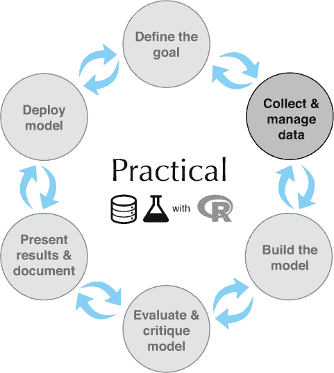

您已经将所有数据放入了一个名为 customer_data 的单个数据框中，并将其输入到 R 中.^([1]) 现在您已经准备好开始构建模型以识别您感兴趣的客户。

> ¹
> 
> 我们可以从[`github.com/WinVector/PDSwR2/tree/master/Custdata`](https://github.com/WinVector/PDSwR2/tree/master/Custdata)下载这个合成数据集，一旦保存，您可以使用命令`customer_data <- readRDS("custdata.RDS")`将其加载到 R 中。这个数据集是从您在第二章中看到的普查数据派生出来的。我们在`age`变量中引入了一些噪声，以反映在现实世界噪声数据集中通常看到的情况。我们还包含了一些可能与我们示例场景不相关的列，但这些列展示了某些重要的数据异常。

很容易在没有仔细查看数据集的情况下直接进入建模步骤，尤其是当您有大量数据时。抵制这种诱惑。没有数据集是完美的：您将缺少一些客户的信息，并且关于其他客户的数据可能是不正确的。一些数据字段将是杂乱无章和不一致的。如果您在开始建模之前不花时间检查数据，您可能会发现自己反复重做工作，因为您发现了需要转换的坏数据字段或变量。在最坏的情况下，您将构建一个返回错误预测的模型——您也不会知道为什么。

* * *

在建模之前了解您的数据

通过早期解决数据问题，您可以节省一些不必要的劳动，并避免很多头痛！

* * *

您还希望了解您的客户是谁。他们是年轻人、中年人还是老年人？他们的富裕程度如何？他们住在哪里？了解这些问题的答案可以帮助您构建更好的模型，因为您将有一个更具体的概念，了解哪些信息最准确地预测了保险覆盖的概率。

在本章中，我们将演示一些了解数据的方法，并讨论您在探索过程中寻找的一些潜在问题。数据探索结合了*描述性统计*——均值和中位数、方差和计数——以及*可视化*，即数据的图表。您只需使用描述性统计就能发现一些问题；其他问题则更容易通过视觉发现。

* * *

**组织数据以进行分析**

在本书的大部分内容中，我们将假设您正在分析的数据在一个单一的数据框中。数据通常不是这样存储的。例如，在数据库中，数据通常以*规范化形式*存储以减少冗余：关于单个客户的信息分布在许多小的表中。在日志数据中，关于单个客户的信息可以分布在许多日志条目或会话中。这些格式使得添加（或，在数据库的情况下，修改）数据变得容易，但不是分析的最佳选择。您通常可以使用 SQL 将所有需要的数据合并到一个数据库中的单个表中，但在第五章中，我们将讨论您可以在 R 中使用以进一步合并数据的`join`等命令。

* * *

## 3.1\. 使用描述性统计来发现问题

在 R 中，您通常会使用`summary()`命令来首次查看数据。目标是了解您是否有可以帮助预测健康保险覆盖的客户信息，以及数据是否足够好，足以提供信息。1]

> ¹
> 
> 如果您还没有这样做，我们建议您按照附录 A 中的章节 A.1 中的步骤安装 R、包、工具和本书的示例。

列表 3.1\. `summary()`命令

```
setwd("PDSwR2/Custdata")                                                 ❶
customer_data = readRDS("custdata.RDS")
summary(customer_data)
##     custid              sex        is_employed       income           ❷
##  Length:73262       Female:37837   FALSE: 2351   Min.   :  -6900
##  Class :character   Male  :35425   TRUE :45137   1st Qu.:  10700
##  Mode  :character                  NA's :25774   Median :  26200
##                                                  Mean   :  41764
##                                                  3rd Qu.:  51700
##                                                  Max.   :1257000
##
##             marital_status  health_ins                                ❸
##  Divorced/Separated:10693   Mode :logical
##  Married           :38400   FALSE:7307
##  Never married     :19407   TRUE :65955
##  Widowed           : 4762
##
##
##
##                        housing_type   recent_move      num_vehicles   ❹
##  Homeowner free and clear    :16763   Mode :logical   Min.   :0.000
##  Homeowner with mortgage/loan:31387   FALSE:62418     1st Qu.:1.000
##  Occupied with no rent       : 1138   TRUE :9123      Median :2.000
##  Rented                      :22254   NA's :1721      Mean   :2.066
##  NA's                        : 1720                   3rd Qu.:3.000
##                                                       Max.   :6.000
##                                                       NA's   :1720
##       age               state_of_res     gas_usage                    ❺
##  Min.   :  0.00   California  : 8962   Min.   :  1.00
##  1st Qu.: 34.00   Texas       : 6026   1st Qu.:  3.00
##  Median : 48.00   Florida     : 4979   Median : 10.00
##  Mean   : 49.16   New York    : 4431   Mean   : 41.17
##  3rd Qu.: 62.00   Pennsylvania: 2997   3rd Qu.: 60.00
##  Max.   :120.00   Illinois    : 2925   Max.   :570.00
##                   (Other)     :42942   NA's   :1720
```

❶ 将此路径更改为您实际解压 PDSwR2 的目录路径

❷ 变量 is_employed 大约有三分之一的缺失值。变量 income 有负值，这些值可能是无效的。

❸ 大约 90%的客户有健康保险。

❹ 变量 housing_type、recent_move、num_vehicles 和 gas_usage 中每个变量都缺失 1720 或 1721 个值。

❺ 变量 age 的平均值看起来合理，但最小值和最大值似乎不太可能。变量 state_of_res 是一个分类变量；`summary()`报告了每个州（对于前几个州）有多少客户。

在数据框上使用 `summary()` 命令会报告数据框数值列的各种摘要统计信息，以及任何分类列的计数统计信息（如果分类列已经作为因子读入^([1])）。

> ¹
> 
> 在 R 中，分类变量属于 `factor` 类。它们可以用字符串（`character` 类）表示，并且一些分析函数会自动将字符串变量转换为因子变量。为了得到一个有用的分类变量总结，它需要是一个因子。

如列表 3.1 所示，数据的总结可以帮助你快速发现潜在问题，如缺失数据或不可能的值。你还可以大致了解分类数据的分布情况。让我们更详细地讨论一下你可以通过总结发现的典型问题。

### 3.1.1\. 数据总结揭示的典型问题

在这个阶段，你正在寻找几个常见问题：

+   缺失值

+   无效值和异常值

+   数据范围过宽或过窄

+   数据的单位

让我们详细讨论这些问题中的每一个。

缺失值

一些缺失值可能并不是真正的问题，但如果某个特定数据字段大部分未填充，在没有一些修复的情况下不应作为输入使用（我们将在第 4.1.2 节中讨论）。例如，在 R 中，许多建模算法默认会静默地丢弃包含缺失值的行。正如你在下面的列表中看到的，`is_employed` 变量中的所有缺失值可能导致 R 静默地忽略超过三分之二的数据。

列表 3.2\. 变量 `is_employed` 对建模是否有用？

```
## is_employed                                            ❶
## FALSE: 2321
## TRUE :44887
## NA's :24333

##                       housing_type   recent_move       ❷
## Homeowner free and clear    :16763   Mode :logical
## Homeowner with mortgage/loan:31387   FALSE:62418
## Occupied with no rent       : 1138   TRUE :9123
## Rented                      :22254   NA's :1721
## NA's                        : 1720
##
##
##   num_vehicles     gas_usage
##  Min.   :0.000   Min.   :  1.00
##  1st Qu.:1.000   1st Qu.:  3.00
##  Median :2.000   Median : 10.00
##  Mean   :2.066   Mean   : 41.17
##  3rd Qu.:3.000   3rd Qu.: 60.00
##  Max.   :6.000   Max.   :570.00
##  NA's   :1720    NA's   :1720
```

❶ 变量 is_employed 缺失的数据超过三分之二。为什么？就业状态是否未知？公司是否最近才开始收集就业数据？NA 是否表示“不在活跃劳动力中”（例如，学生或全职主妇）？

❷ 变量 housing_type、recent_move、num_vehicles 和 gas_usage 缺失值相对较少——大约占数据的 2%。仅删除缺失值的行可能是安全的，尤其是如果这些缺失值都集中在同一 1720 行中。

如果某个特定数据字段大部分未填充，尝试确定原因是有意义的；有时，一个值缺失本身就有信息量。例如，为什么 `is_employed` 变量缺失了这么多值？正如我们注意到的，有许多可能的原因，如列表 3.2 所示。

无论缺失数据的原因是什么，您都必须决定最合适的行动。您是否要在模型中包含缺失值的变量，或者不包含？如果您决定包含它，您是删除所有该字段缺失的行，还是将缺失值转换为`0`或额外的类别？我们将在第四章中讨论处理缺失数据的方法。在这个例子中，您可能决定删除关于房屋或车辆的数据行，因为它们不多。您可能不想丢弃缺失就业信息的数据，因为就业状况可能是健康保险的强预测因素；您可能将 NAs 作为第三个就业类别处理。在模型评分时，您可能会遇到缺失值，因此您应该在模型训练期间处理它们。

无效值和异常值

即使某一列或变量没有缺失值，您仍然想要检查您拥有的值是否有意义。您是否有任何无效值或异常值？无效值的例子包括在应该是非负数值数据字段（如年龄或收入）中的负值或您期望数字的文本。异常值是那些远远超出您期望数据所在范围的数值点。您能否在下一个列表中找到异常值和无效值？

列表 3.3\. 无效值和异常值的示例

```
summary(customer_data$income)
##    Min. 1st Qu.  Median    Mean 3rd Qu.    Max.
##   -6900   11200   27300   42522   52000 1257000       ❶

summary(customer_data$age)
##    Min. 1st Qu.  Median    Mean 3rd Qu.    Max.
##    0.00   34.00   48.00   49.17   62.00  120.00       ❷
```

❶ 收入为负值可能表明数据有误。它们也可能有特殊含义，例如“债务金额”。无论哪种情况，您都应该检查这个问题有多普遍，并决定如何处理。您是否要删除收入为负的数据？您是否要将负值转换为零？

❷ 年龄为零或年龄大于大约 110 的客户是异常值。它们超出了预期客户值的范围。异常值可能是数据输入错误。它们可能是特殊的哨兵值：零可能表示“年龄未知”或“拒绝声明”。而且，您的某些客户可能特别长寿。

通常，无效值仅仅是数据输入错误。然而，在`年龄`这样的字段中，负数可能是一个*哨兵值*，表示“未知”。异常值也可能是数据错误或哨兵值。或者，它们可能是有效但异常的数据点——人们偶尔会活过 100 岁。

与缺失值一样，您必须决定最合适的行动：删除数据字段、删除该字段有问题的数据点，或将不良数据转换为有用的值。例如，即使您确信某些异常值是有效数据，您可能仍然希望在不干扰模型拟合过程的情况下，将它们从模型构建中省略。通常，建模的目标是在典型情况下做出良好的预测，而一个高度偏向于正确预测罕见情况的模型可能并不总是最好的模型。

数据范围

你还应该注意数据中的值变化有多大。如果你认为年龄或收入有助于预测健康保险覆盖的概率，那么你应该确保你的客户在年龄和收入上有足够的差异，以便你能看到这些关系。让我们再次看看收入，在下一个列表中。数据范围是宽的还是窄的？

列表 3.4\. 查看变量的数据范围

```
summary(customer_data$income)
##    Min. 1st Qu.  Median    Mean 3rd Qu.    Max.
##   -6900   10700   26200   41764   51700 1257000       ❶
```

❶ 收入范围从零到超过一百万美元，这是一个非常宽的范围。

即使忽略负收入，列表 3.4 中的 `income` 变量范围从零到超过一百万美元。这相当宽（尽管对于收入来说很典型）。像这样跨越几个数量级的范围的数据可能会对某些建模方法造成问题。当我们谈到第四章中的对数变换时，我们将讨论缓解数据范围问题的方法。

数据也可能太窄。假设你的所有客户年龄都在 50 到 55 岁之间。可以肯定的是，这个年龄范围可能不是预测该人群健康保险覆盖概率的好指标，因为它几乎没有任何变化。

* * *

**数据范围“太窄”是什么意思？**

当然，术语“窄”是相对的。如果我们预测的是 5 到 10 岁儿童的阅读能力，那么年龄可能是一个有用的变量。对于包括成人年龄的数据，你可能需要以某种方式转换或分组年龄，因为你不期望在 40 到 50 岁之间阅读能力有显著变化。你应该根据问题域的信息来判断数据范围是否狭窄，但一个粗略的经验法则是与标准差与平均值之比相关。如果这个比率非常小，那么数据变化不大。

* * *

当我们谈到图形化检查数据时，我们将在 第 3.2 节 回顾数据范围。

决定数据范围的一个因素是计量单位。以一个非技术性的例子来说，我们用周或月来衡量婴儿和幼儿的年龄，因为在这个时间尺度上，非常年幼的儿童会经历发育变化。假设我们用年来衡量婴儿的年龄。从数字上看，一岁和两岁之间可能没有太大的区别。实际上，差异是巨大的，正如任何父母都可以告诉你的那样！单位也可能因为另一个原因在数据集中引起潜在问题。

单位

列表 3.5 中的收入数据代表的是每小时工资，还是以 $1000 为单位的年工资？实际上，它是以 $1000 为单位的年工资，但如果它代表的是小时工资呢？你可能在建模阶段不会注意到这个错误，但最终有人会将小时工资数据输入模型，并得到错误的预测结果。

列表 3.5\. 检查单位；错误可能导致惊人的错误

```
IncomeK = customer_data$income/1000
summary(IncomeK)                                        ❶
 ##    Min. 1st Qu.  Median    Mean 3rd Qu.    Max.
##   -6.90   10.70   26.20   41.76   51.70 1257.00
```

❶ 变量 IncomeK 被定义为 IncomeK = customer_data$income/1000。但假设你不知道这一点。仅通过查看摘要，这些值可能合理地解释为“时薪”或“以 1000 美元为单位的年收入。”

时间间隔是以天、小时、分钟还是毫秒来衡量的？速度是以每秒公里、每小时英里还是节来衡量的？货币金额是以美元、千美元还是 1/100 美分（在金融中这是一种习惯做法，计算通常使用定点算术）？这实际上是通过检查数据字典或文档中的数据定义来捕捉的，而不是在总结统计中；按每小时工资数据和每年工资单位为 1000 美元之间的差异在随意一瞥时可能并不明显。但在查看变量的值范围时，这仍然是一件需要记住的事情，因为通常你可以发现测量单位是否意外。汽车速度以节为单位看起来与以每小时英里为单位大不相同。

## 3.2. 使用图形和可视化发现问题

正如你所见，你只需查看数据摘要就能发现许多问题。对于数据的其他属性，图片比文字更好。

> *我们不能期望少数数值[总结统计]能够持续传达数据中存在的丰富信息。数值缩减方法并不保留数据中的信息。*
> 
> *威廉·克利夫兰，《数据绘图要素》*

图 3.2 展示了客户年龄分布的图表。我们稍后会讨论图表的 y 轴代表什么；现在只需知道，图表的高度对应于人口中该年龄段的客户数量。正如你所见，分布的峰值年龄、数据的范围以及异常值的存在，通过视觉吸收比通过文本确定要容易得多。

图 3.2. 一些信息从图表中更容易阅读，而另一些则从摘要中更容易阅读。

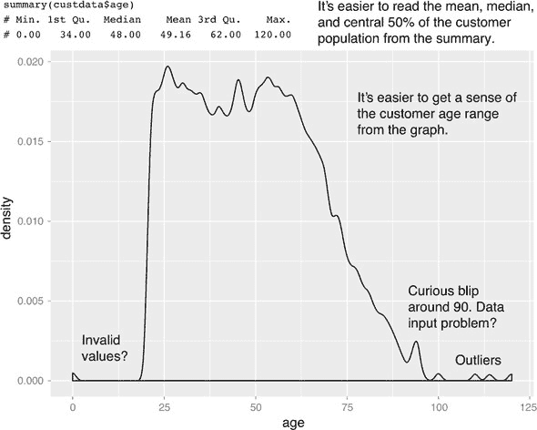

使用图形来检查数据被称为*可视化*。我们试图遵循威廉·克利夫兰的科学可视化原则。除了特定图表的细节之外，克利夫兰哲学的关键点如下：

+   一张图表应尽可能多地展示信息，同时给观众带来最低的认知压力。

+   力求清晰。使数据突出。提高清晰度的具体技巧包括以下这些：

    +   避免过多的叠加元素，例如在同一绘图空间中过多的曲线。

    +   找到合适的宽高比和缩放比例，以正确展示数据的细节。

    +   避免数据在图表的一侧或另一侧过于倾斜。

+   可视化是一个迭代的过程。它的目的是回答关于数据的问题。

在可视化阶段，你绘制数据，学习你能学到的，然后重新绘制数据以回答从先前图形中产生的问题。不同的图形最适合回答不同的问题。我们将在本节中查看其中的一些。

在本书中，我们将使用 R 绘图包 `ggplot2`（Leland Wilkinson 的 *图形语法* 的 R 实现，Springer，1999）以及来自 `WVPlots` 包的一些预包装 `ggplot2` 可视化来展示可视化图形。你也可以查看 `ggpubr` 和 `ggstatsplot` 包以获取更多预包装的 `ggplot2` 图形。当然，其他 R 可视化包，如基础图形或 `lattice` 包，也可以生成类似的图形。

* * *

**关于 ggplot2 的注意事项**

本节的主题是如何使用可视化来探索你的数据，而不是如何使用 `ggplot2`。`ggplot2` 包基于 Leland Wilkinson 的书籍，*图形语法*。我们选择 `ggplot2` 是因为它擅长将多个图形元素组合在一起，但其语法可能需要一些时间来适应。以下是在查看我们的代码片段时需要理解的关键点：

+   `ggplot2` 中的图形只能定义在数据框上。图形中的变量——*x* 变量、*y* 变量、定义点颜色或大小的变量——被称为 *美学*，通过使用 `aes` 函数声明。

+   `ggplot()` 函数声明了图形对象。`ggplot()` 的参数可以包括感兴趣的数据框和美学。`ggplot()` 函数本身并不产生可视化；可视化是通过 *层* 产生的。

+   层生成图形和图形变换，并使用 `+` 操作符添加到给定的图形对象中。每个层也可以接受数据框和美学作为参数，以及特定的图形参数。层的例子包括 `geom_point`（用于散点图）或 `geom_line`（用于线图）。

在接下来的示例中，这种语法将变得更加清晰。有关更多信息，我们建议参考 Hadley Wickham 的参考网站 [`ggplot2.tidyverse.org/reference/`](https://ggplot2.tidyverse.org/reference/)，该网站提供了在线文档的链接；Winston Chang 网站的图形部分 [`www.cookbook-r.com/`](http://www.cookbook-r.com/)；以及 Winston Chang 的 *R 图形烹饪书*（O’Reilly，2012）。

* * *

在接下来的两个章节中，我们将展示如何使用图片和图形来识别数据特征和问题。在 3.2.2 节 中，我们将查看两个变量的可视化。但让我们先看看单变量的可视化。

### 3.2.1\. 检查单变量分布的视觉

在本节中我们将查看

+   直方图

+   密度图

+   条形图

+   点图

本节中的可视化可以帮助你回答如下问题：

+   分布的峰值是多少？

+   分布中有多少个峰值（单峰与双峰）？

+   数据有多正常（或对数正态）？我们将在附录 B 中讨论正态和对数正态分布。附录 B。

+   数据变化有多大？它是否集中在某个区间或某个类别中？

容易直观理解的一件事是数据分布的形状。图 3.3 中的图表在 25 岁到 60 岁之间相对平坦，60 岁之后缓慢下降。然而，即使在范围内，似乎在 20 年代末到 30 年代初和 50 年代初存在峰值。这些数据有多个峰值：它不是*单峰的*。^([1])

> ¹
> 
> *单峰*的严格定义是分布有一个唯一的最大值；从这个意义上说，图 3.3 是单峰的。然而，大多数人使用“单峰”一词来表示分布有一个唯一的峰值（局部最大值）；客户年龄分布有多个峰值，因此我们将它称为*多峰的*。

图 3.3\. 年龄密度图

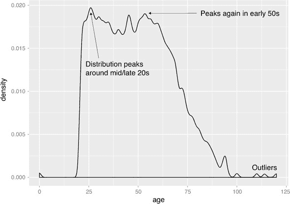

单峰性是你在数据中想要检查的一个属性。为什么？因为（粗略地说）单峰分布对应于一个受试者群体。对于图 3.4 中的实线曲线，平均客户年龄约为 50 岁，50%的客户年龄在 34 岁到 64 岁之间（第一和第三四分位数，以阴影表示）。因此，可以说“典型”的客户是中年人，并且可能拥有许多中年人的人口统计特征——尽管，当然，你必须用你的实际客户信息来验证这一点。

图 3.4\. 单峰分布（实线曲线）通常可以建模为来自单一用户群体的数据。双峰分布（虚线曲线）时，你的数据通常来自两个用户群体。

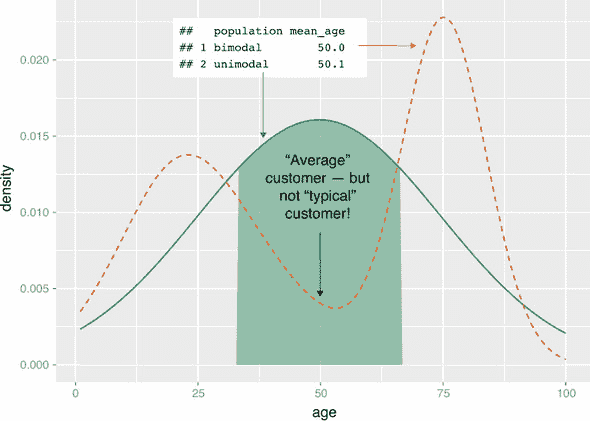

图 3.4 中的虚线曲线显示了当你有两个峰值或*双峰分布*时可能发生的情况。（具有超过两个峰值的分布是*多峰的*。）这组客户群体的平均年龄与实线曲线所代表的客户群体的平均年龄大致相同——但 50 岁的人 hardly 可以算作“典型”客户！这个（诚然是夸张的）例子对应于两个客户群体：一个相对年轻的群体，主要在十几岁到二十年代末，另一个是 70 多岁的老年群体。这两个群体可能具有非常不同的行为模式，如果你想要建模一个客户是否可能有医疗保险，分别对这两个群体进行建模可能不是一个坏主意。

直方图和密度图是两种可视化工具，可以帮助您快速检查数值变量的分布。图 3.1 和 3.3 是密度图。您使用直方图还是密度图在很大程度上取决于个人喜好。我们倾向于更喜欢密度图，但直方图对不那么注重量化的人群来说更容易解释。

直方图

基本直方图将变量分成固定宽度的桶，并返回每个桶中数据点的数量作为高度。例如，假设您想了解您的客户每月天然气供暖账单的支付情况。您可以将天然气账单金额分组为$10 间隔：$0–10，$10–20，$20–30，等等。处于边界的客户进入更高的桶：每月支付约$20 的人进入$20–30 桶。然后，您为每个桶计数该桶中有多少客户。生成的直方图显示在图 3.5 中。

图 3.5\. 直方图告诉您数据集中在哪里。它还直观地突出显示异常值和异常。

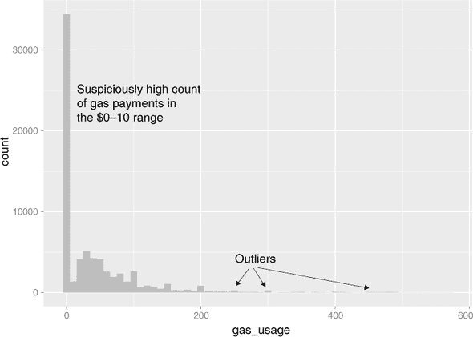

您可以在`ggplot2`中使用`geom_histogram`层在图 3.5 中创建直方图。

列表 3.6\. 绘制直方图

```
library(ggplot2)                              ❶
ggplot(customer_data, aes(x=gas_usage)) +
  geom_histogram(binwidth=10, fill="gray")    ❷
```

❶ 如果您还没有这样做，请加载 ggplot2 库。

❷ `binwidth`参数告诉`geom_histogram`调用如何创建$10 间隔的桶（默认为 datarange/30）。`fill`参数指定直方图条的颜色（默认：黑色）。

适当的`binwidth`可以使直方图直观地突出数据集中的集中区域，并指出潜在异常值和异常的存在。例如，在图 3.5 中，您可以看到一些异常客户有比典型情况大得多的天然气账单，因此您可能希望从任何使用天然气账单作为输入的分析中排除这些客户。您还看到支付$0–10/月天然气费用的异常高人群集中。这可能意味着您的客户中大多数没有天然气供暖，但在进一步调查数据字典（表 3.1）时，您发现了这一点。

表 3.1\. `gas_usage`的数据字典条目

| 值 | 定义 |
| --- | --- |
| NA | 未知或不适用 |
| 001 | 包含在租金或公寓费中 |
| 002 | 包含在电费中 |
| 003 | 无费用或未使用天然气 |
| 004-999 | $4 至$999（四舍五入并上限编码） |

换句话说，`gas_usage` 列中的值是数值和作为数字编码的符号代码的混合。值 `001`、`002` 和 `003` 是**哨兵值**，将它们视为数值可能会在分析中导致错误的结论。在这种情况下的一种可能的解决方案是将数值 `1`-`3` 转换为 `NA`，并添加额外的布尔变量来指示可能的案例（包括租金/公寓费等）。

直方图的主要缺点是您必须提前决定桶的宽度。如果桶太宽，您可能会丢失关于分布形状的信息。如果桶太窄，直方图可能看起来太嘈杂，难以阅读。一种替代的可视化方法是密度图。

密度图

你可以将**密度图**视为变量的**连续直方图**，除了密度图下的面积重新缩放为等于一。密度图上的一个点对应于具有特定值的数值（或数值的百分比，除以 100）的数据（或数据百分比）。这个分数通常非常小。当你查看密度图时，你更感兴趣的是曲线的整体形状，而不是 y 轴上的实际值。你已经看到了年龄的密度图；图 3.6 显示了收入的密度图。

图 3.6\. 密度图显示了数据集中的集中位置。

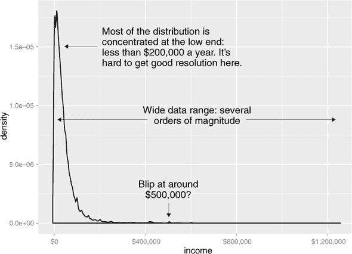

你可以使用 `geom_density` 层生成 图 3.6，如下面的列表所示。

列表 3.7\. 生成密度图

```
library(scales)                                           ❶

ggplot(customer_data, aes(x=income)) + geom_density() +
  scale_x_continuous(labels=dollar)                       ❷
```

❶ The scales package brings in the dollar scale notation.

❷ 将 x 轴标签设置为美元

当数据范围非常广且分布的质量严重集中在一边时，就像 图 3.6 中的分布一样，很难看到其形状的细节。例如，很难确定收入分布的峰值的确切值。如果数据是非负的，那么一种突出更多细节的方法是将分布绘制在对数尺度上，如图 图 3.7 所示。这相当于绘制 `log10(income)` 的密度图。

图 3.7\. 在 log10 尺度上的收入密度图突出了在常规密度图中难以看到的收入分布的细节。

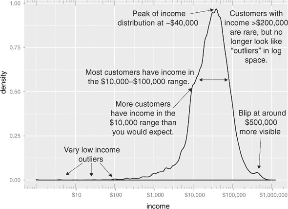

在 `ggplot2` 中，您可以使用 `geom_density` 和 `scale_x_log10` 层绘制 图 3.7，如下面的列表所示。

列表 3.8\. 创建对数刻度的密度图

```
ggplot(customer_data, aes(x=income)) +
  geom_density() +
  scale_x_log10(breaks = c(10, 100, 1000, 10000, 100000, 1000000),
  labels=dollar) +                                               ❶
   annotation_logticks(sides="bt", color="gray")                   ❷
```

❶ 将 x 轴设置为 log10 尺度，并手动设置刻度和标签为美元

❷ 在图表的顶部和底部添加对数刻度的刻度线

当你发出前面的命令时，你也会收到一个警告信息：

```
## Warning in self$trans$transform(x): NaNs produced
## Warning: Transformation introduced infinite values in continuous x-axis
## Warning: Removed 6856 rows containing non-finite values (stat_density).
```

这表明`ggplot2`忽略了零值和负值行（因为`log(0) = Infinity`），并且有 6856 这样的行。在评估图表时请记住这一点。

*** 

**何时应该使用对数刻度？**

当百分比变化或数量级的变化比绝对单位的变化更重要时，你应该使用对数刻度。你也应该使用对数刻度来更好地可视化严重偏斜的数据。

例如，在收入数据中，收入差异为 5,000 美元在收入倾向于数万美元的人口中意味着与收入在数十万或数百万美元的人口中意味着大不相同。换句话说，“显著差异”的定义取决于你所查看的收入的数量级。同样，在图 3.7 中类似的人口中，少数高收入者会导致大多数数据压缩到图表的相对较小区域。出于这两个原因，将收入分布绘制在对数刻度上是一个好主意。

***

在对数空间中，收入分布看起来像“正常”分布，这将在附录 B 中讨论。它并不完全是一个正态分布（实际上，它似乎至少是两个正态分布混合在一起）。

条形图和点图

*条形图* 是离散数据的直方图：它记录了分类变量每个值的频率。图 3.8 显示了客户数据集中婚姻状况的分布。如果你认为婚姻状况有助于预测健康保险覆盖的可能性，那么你想要检查你是否拥有足够的不同婚姻状况的客户，以帮助你发现已婚（或未婚）与拥有健康保险之间的关系。

[图 3.8]_ 条形图显示了分类变量的分布 _。


生成图 3.8 的`ggplot2`命令使用`geom_bar`：

```
ggplot(customer_data, aes(x=marital_status)) + geom_bar(fill="gray")
```

这个图表实际上并没有比`summary(customer_data$marital.stat)`显示的更多信息，但有些人发现图表比文本更容易吸收。当可能的值数量相当大时，如居住状态，条形图最有用。在这种情况下，我们经常发现像图 3.9 中所示的水平图表比垂直图表更易读。

[图 3.9]_A 水平条形图在存在几个具有长名称的分类时更容易阅读 _。

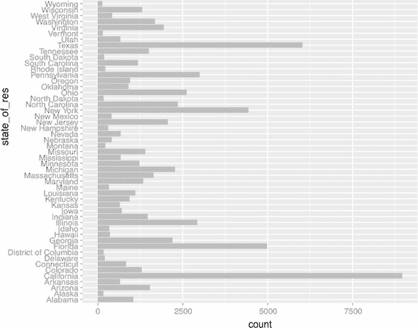

生成图 3.9 的`ggplot2`命令将在下一列表中展示。

列表 3.9\. 生成水平条形图

```
ggplot(customer_data, aes(x=state_of_res)) +
  geom_bar(fill="gray") +                        ❶
   coord_flip()                                  ❷
```

❶ 如前所述绘制条形图：居住状态在 x 轴上，计数在 y 轴上

❷ 翻转 x 和 y 轴：state_of_res 现在位于 y 轴

克利夫兰^([1]) 更喜欢使用 *点图* 而不是条形图来可视化离散计数。这是因为条形图是二维的，所以计数差异看起来像是条形 *面积* 的差异，而不是仅仅在条形高度上的差异。这可能会产生感知上的误导。由于点图中的点线和线不是二维的，所以在比较两个数量时，观众只考虑高度差异，正如他们应该的那样。

> ¹
> 
> 见威廉·S·克利夫兰，*数据绘图元素*，霍巴特出版社，1994 年。

克利夫兰还建议对条形图或点图中的数据进行排序，以便更有效地从数据中提取洞察。这如图 3.10 所示。图 3.10。现在可以很容易地看到哪些州居住着最多的客户——或者最少的客户。

图 3.10\. 使用点图和按计数排序使数据更容易阅读。

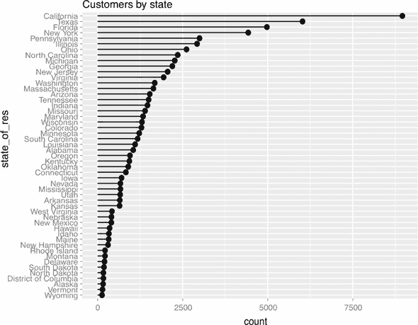

排序的可视化需要更多的操作，至少在 `ggplot2` 中是这样，因为默认情况下，`ggplot2` 将按字母顺序绘制因子变量的类别。幸运的是，大部分代码已经包含在 `WVPlots` 包中的 `ClevelandDotPlot` 函数中。

列表 3.10\. 生成排序类别的点图

```
library(WVPlots)                                    ❶
ClevelandDotPlot(customer_data, "state_of_res",     ❷
     sort = 1, title="Customers by state") +        ❸
 coord_flip()                                       ❹
```

❶ 加载 WVPlots 库

❷ 绘制客户数据数据框的 state_of_res 列

❸ “sort = 1”按递增顺序（最频繁的放在最后）排序类别。

❹ 如前所述翻转坐标轴

在我们继续讨论两个变量的可视化之前，我们将总结本节中讨论的可视化，见表 3.2。

表 3.2\. 单变量可视化

| 图表类型 | 用途 | 例子 |
| --- | --- | --- |
| 直方图或密度图 | 检查数据范围 检查数量模式 检查分布是否为正态/对数正态 检查异常值和离群值 | 检查客户年龄的分布以获取典型客户年龄范围 检查客户收入的分布以获取典型收入范围 |
| 条形图或点图 | 比较分类变量值的频率 | 计算来自不同居住州的客户的数量，以确定哪些州拥有最大的或最小的客户基础 |

### 3.2.2\. 检查两个变量之间的关系

除了单独检查变量外，你通常会想查看两个变量之间的关系。例如，你可能想回答以下问题：

+   我的数据中两个输入 *年龄* 和 *收入* 之间是否存在关系？

+   如果有的话，是什么类型的关系，有多强？

+   输入 *婚姻状况* 和输出 *健康保险* 之间是否存在关系？有多强？

你将在建模阶段精确量化这些关系，但现在探索它们可以让你对数据有一个感觉，并帮助你确定哪些变量是模型中最佳候选变量。

本节探讨了以下可视化：

+   用于比较两个连续变量的折线图和散点图

+   用于比较大量两个连续变量的平滑曲线和六边形图

+   用于比较两个离散变量的不同类型的条形图

+   用于比较连续和离散变量的直方图和密度图的变体

首先，让我们考虑两个连续变量之间的关系。你可能首先想到的图表（尽管它并不总是最好的）是折线图。

折线图

*折线图*在两个变量之间的关系相对清晰时效果最好：每个*x*值都有一个唯一的（或几乎唯一的）*y*值，如图 3.11 所示。你使用`geom_line`绘制图 3.11。

图 3.11。折线图的示例

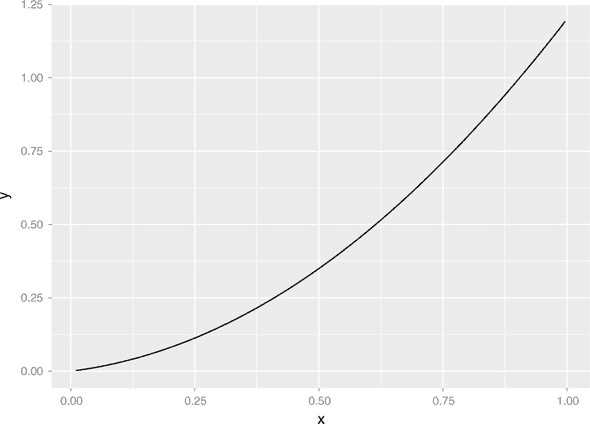

列表 3.11。生成折线图

```
x <- runif(100)                                           ❶
y <- x² + 0.2*x                                          ❷
ggplot(data.frame(x=x,y=y), aes(x=x,y=y)) + geom_line()   ❸
```

❶ 首先，生成本例的数据。x 变量在 0 和 1 之间均匀随机分布。

❷ y 变量是 x 的二次函数。

❸ 绘制折线图

当数据关系不是那么清晰时，折线图并不那么有用；你将想要使用散点图，正如你将在下一节中看到的。

散点图和平滑曲线

你可能会预期年龄和健康保险之间存在关系，收入和健康保险之间也存在关系。但年龄和收入之间的关系是什么？如果它们完美地相互跟踪，那么你可能不想在健康保险模型中使用这两个变量。适当的汇总统计量是相关性，我们在数据的一个安全子集上计算它。

列表 3.12。检查年龄和收入之间的相关性

```
customer_data2 <- subset(customer_data,
                   0 < age & age < 100 &
                    0 < income & income < 200000)        ❶

cor(customer_data2$age, customer_data2$income)           ❷
 ## [1] 0.005766697                                      ❸
```

❶ 只考虑具有合理年龄和收入值的子集数据。

❷ 获取年龄和收入的相关性

❸ 结果相关性为正但几乎为零。

相关性为正，正如你可能预期的，但几乎为零，这意味着年龄和收入之间似乎没有太多关系。可视化比单个数字能提供更多关于正在发生的事情的洞察。让我们先尝试散点图（图 3.12）。由于我们的数据集有超过 64,000 行，这对于可读的散点图来说太大，我们将在绘图之前对数据集进行抽样。你使用`geom_point`绘制图 3.12，如列表 3.13 所示。

图 3.12。收入与年龄的散点图

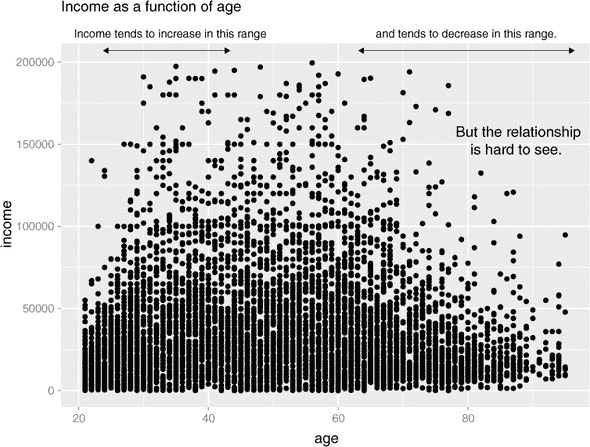

列表 3.13。创建年龄和收入的散点图

```
set.seed(245566)                                                                     ❶
 customer_data_samp <-
      dplyr::sample_frac(customer_data2, size=0.1, replace=FALSE)                    ❷

ggplot(customer_data_samp, aes(x=age, y=income)) +                                   ❸
        geom_point() +
       ggtitle("Income as a function of age")
```

❶ 通过设置随机种子使随机抽样可重复。

❷ 为了可读性，只绘制数据的 10%样本。我们将在下一节中展示如何绘制所有数据。

❸ 创建散点图

年龄与收入之间的关系并不容易看出。你可以尝试通过在数据上绘制平滑曲线来使这种关系更清晰，如图 3.13 图所示。

图 3.13. 收入与年龄的散点图，带有平滑曲线

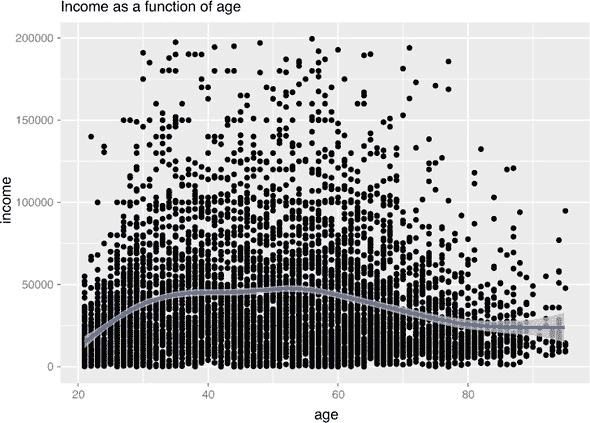

平滑曲线使得更容易看出，在这个群体中，收入通常从二十多岁开始随着年龄增长，直到三十多岁中期，之后收入以较慢、几乎平缓的速度增长，直到大约五十多岁中期。五十多岁中期之后，收入通常随着年龄的增长而减少。

在 `ggplot2` 中，你可以通过使用 `geom_smooth` 来对数据进行平滑曲线绘制：

```
ggplot(customer_data_samp, aes(x=age, y=income)) +
  geom_point() + geom_smooth() +
  ggtitle("Income as a function of age")
```

对于点数较少的数据集，`geom_smooth` 函数使用 `loess`（或 `lowess`）函数来计算数据的平滑局部线性拟合。对于像这样较大的数据集，`geom_smooth` 使用样条拟合。

默认情况下，`geom_smooth` 还会在平滑曲线周围绘制一个“标准误差”带。这个带子在哪里数据点较少就较宽，在哪里数据密集就较窄。它的目的是表示平滑曲线估计的不确定性。对于图 3.13 中的图表，散点图非常密集，以至于平滑带在图表的极端右侧之外是不可见的。由于散点图已经提供了标准误差带所提供的信息，你可以通过 `se=FALSE` 参数将其关闭，正如我们将在后面的例子中看到的那样。

带有平滑曲线的散点图也用于连续变量与布尔值之间关系的可视化。假设你正在考虑将年龄作为你的医疗保险模型的输入。你可能想绘制医疗保险覆盖范围作为年龄的函数，如图 3.14 图所示。

图 3.14. 拥有医疗保险的客户比例，作为年龄的函数

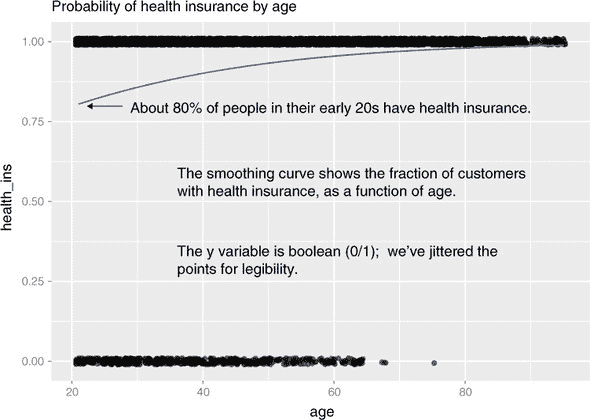

当一个人有医疗保险时，变量 `health_ins` 的值为 `1`（表示 TRUE），否则为 `0`（表示 FALSE）。数据的散点图将会有所有的 y 值都是 `0` 或 `1`，这可能看起来没有太多信息量，但数据的平滑曲线估计了 `0`/`1` 变量 `health_ins` 作为年龄的函数的平均值。给定年龄的 `health_ins` 的平均值简单地是该年龄的人在你数据集中拥有医疗保险的概率。

图 3.14 展示了随着客户年龄的增长，拥有医疗保险的概率也在增加，从 20 岁时的约 80%增加到 75 岁后的近 100%。

* * *

**为什么保留散点图？**

你可能会问，为什么费心绘制这些点？为什么不直接绘制平滑曲线？毕竟，数据只取`0`和`1`这两个值，所以散点图似乎没有太多信息量。

这是个品味问题，但我们喜欢保留散点图，因为它能让我们直观地估计出在*x*变量的不同范围内有多少数据。例如，如果你的数据在 70-100 岁年龄段的客户只有十几个，那么你就知道那个年龄段健康保险概率的估计可能不太准确。相反，如果你有数百名客户分布在那个年龄段，那么你对估计的信心就会更大。

`geom_smooth`在平滑曲线周围绘制的标准误差带提供了等效的信息，但我们发现散点图更有帮助。

* * *

使用`WVPlots`中的`BinaryYScatterPlot`函数绘制图 3.14 是一个简单的方法：

```
BinaryYScatterPlot(customer_data_samp, "age", "health_ins",
                   title = "Probability of health insurance by age")
```

默认情况下，`BinaryYScatterPlot`通过数据拟合逻辑回归曲线。你将在第八章中了解更多关于逻辑回归的内容，但就现在而言，只需知道逻辑回归试图估计布尔结果`y`为真的概率，作为数据`x`的函数。

如果你尝试绘制`customer_data2`数据集中所有点的散点图，散点图将变成难以辨认的涂抹。为了在类似这种情况的高容量情况下绘制所有数据，尝试一个聚合图，如 hexbin 图。

Hexbin 图

*hexbin*图就像一个二维直方图。数据被分成几个区间，每个区间中的数据点数量用颜色或阴影表示。让我们回到收入与年龄的例子。图 3.15 展示了数据的 hexbin 图。注意平滑曲线是如何追踪数据最密集区域形成的形状的。

图 3.15\. 收入与年龄的 hexbin 图，叠加了平滑曲线

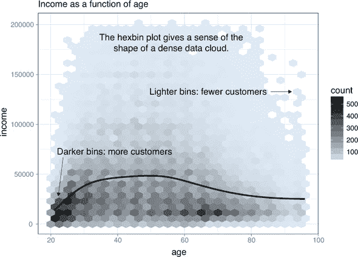

要在 R 中制作 hexbin 图，你必须安装`hexbin`包。我们将在附录 A 中讨论如何安装 R 包。一旦安装了`hexbin`并加载了库，你可以使用`geom_hex`层创建图表，或者使用`WVPlots`中的便利函数`HexBinPlot`，就像我们在这里做的那样。`HexBinPlot`预先定义了一个颜色尺度，其中密集的单元格被着色得更深；默认的`ggplot2`颜色尺度将密集的单元格着色得更浅。

列表 3.14\. 制作`hexbin`图

```
library(WVPlots)                                                            ❶

HexBinPlot(customer_data2, "age", "income", "Income as a function of age") +❷
   geom_smooth(color="black", se=FALSE)                                     ❸
```

❶ 加载 WVPlots 库

❷ 绘制收入作为年龄函数的 hexbin 图

在黑色中添加平滑线；抑制标准误差带（se=FALSE）

在本节和上一节中，我们查看了一些至少有一个变量是数值的图表。但在我们的健康保险例子中，输出是分类的，许多输入变量也是分类的。接下来，我们将探讨可视化两个分类变量之间关系的方法。

两个分类变量的条形图

让我们考察婚姻状态与健康保险覆盖率概率之间的关系。可视化这种关系的最直接方法是使用*堆积条形图*，如图 3.16 所示。

图 3.16\. 健康保险与婚姻状态：堆积条形图

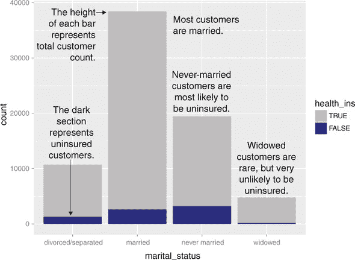

堆积条形图使得比较每个婚姻类别中的人数总和以及比较每个婚姻类别中未投保人数变得容易。然而，你不能直接比较每个类别中投保人数的数量，因为条形并不都从同一水平开始。所以有些人更喜欢图 3.17 中显示的*并列条形图*，这使得比较不同类别中投保和未投保人数变得更容易——但不是每个类别中总人数。

图 3.17\. 健康保险与婚姻状态：并列条形图

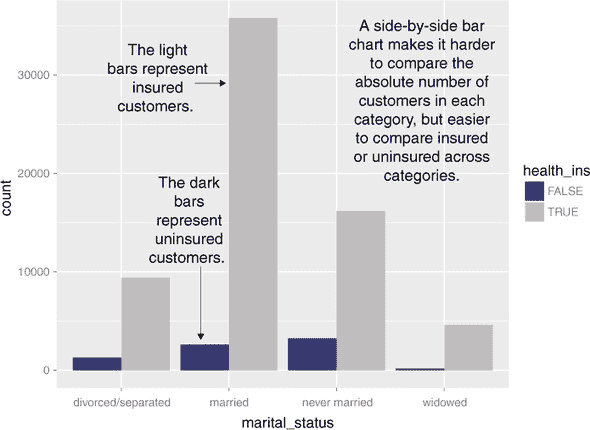

如果你想要比较不同类别中投保和未投保人数，同时保持每个类别中总人数的概念，一个可以尝试的图表是我们所说的阴影图。这个数据集的阴影图创建了两个图表，一个用于投保人口，一个用于未投保人口。这两个图表都叠加在总人口的“阴影图”上。这允许在婚姻状态类别之间和内部进行比较，同时保持类别总数的信息。这如图 3.18 所示。

图 3.18\. 健康保险与婚姻状态：阴影图

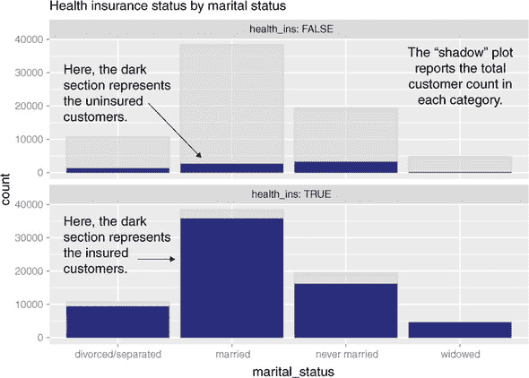

所有前面图表的主要缺点是，你不能轻易地比较投保与未投保人数的比率，特别是对于像丧偶这样的罕见类别。你可以使用`ggplot2`所说的*填充条形图*直接绘制比率的可视化，如图 3.19 所示。

图 3.19\. 健康保险与婚姻状态：填充条形图

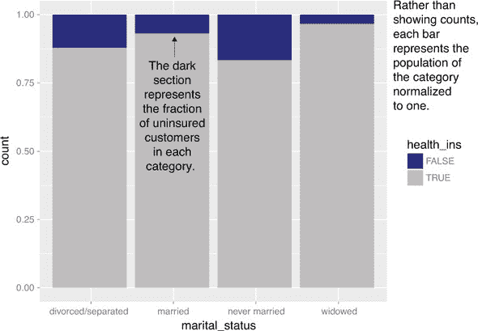

填充条形图使得明显看出离婚客户比已婚客户更有可能未投保。但你失去了关于丧偶的信息，尽管它高度预测保险覆盖率，但这是一个罕见的类别。

你使用哪种条形图取决于你需要传达的最重要信息是什么。接下来给出生成这些图表的代码。注意`ggplot2`命令中使用`fill`美学；这告诉`ggplot2`根据变量`health_ins`的值来着色（填充）条形。`geom_bar`的`position`参数指定条形图样式。

列表 3.15\. 指定不同的条形图样式

```
ggplot(customer_data, aes(x=marital_status, fill=health_ins)) +
                        geom_bar()                                           ❶

ggplot(customer_data, aes(x=marital_status, fill=health_ins)) +
                     geom_bar(position = "dodge")                            ❷

ShadowPlot(customer_data, "marital_status", "health_ins",
                         title = "Health insurance status by marital status")❸
ggplot(customer_data, aes(x=marital_status, fill=health_ins)) +
                     geom_bar(position = "fill")                             ❹
```

❶ 堆积条形图，默认样式

❷ 并列条形图

❸ 使用来自 WVPlots 包的 ShadowPlot 命令进行阴影图绘制

❹ 填充条形图

在前面的例子中，一个变量是二元的；相同的图表可以应用于每个变量都有几个类别的两个变量，但结果更难阅读。假设你对不同住房类型的婚姻状况分布感兴趣。有些人发现在这种情况下并排条形图最容易阅读，但它并不完美，如你在 图 3.20 中所见。

图 3.20\. 按住房类型分布的婚姻状况：并排条形图

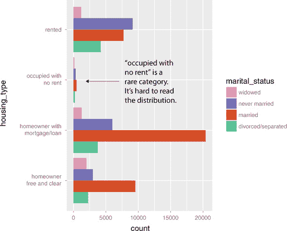

如果任何一个变量有大量类别，像 图 3.20 这样的图表就会显得杂乱。更好的选择是将分布分解成不同的图表，每个住房类型一个。在 `ggplot2` 中，这被称为 *分面* 图表，并使用 `facet_wrap` 层。结果如图 图 3.21 所示。

图 3.21\. 按住房类型分布的婚姻状况：分面并排条形图

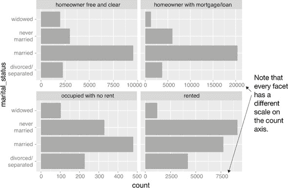

图 3.20 和 3.21 的代码看起来像下面的列表。

列表 3.16\. 带与不带分面的条形图绘制

```
cdata <- subset(customer_data, !is.na(housing_type))        ❶

ggplot(cdata, aes(x=housing_type, fill=marital_status)) +   ❷
   geom_bar(position = "dodge") +
  scale_fill_brewer(palette = "Dark2") +
  coord_flip()                                              ❸

ggplot(cdata, aes(x=marital_status)) +                      ❹
   geom_bar(fill="darkgray") +
  facet_wrap(~housing_type, scale="free_x") +               ❺
   coord_flip()                                             ❻
```

❶ 限制为已知住房类型的数据

❷ 并排条形图

❸ 使用 coord_flip() 函数旋转图表，以便婚姻状况可读

❹ 分面条形图

❺ 通过 housing.type 对图表进行分面。参数 scales="free_x" 指定每个分面都有一个独立缩放的 x 轴；默认情况下，所有分面在两个轴上都有相同的缩放。参数 "free_y" 将释放 y 轴缩放，而参数 "free" 则释放两个轴。

❻ 使用 coord_flip() 函数旋转图表

比较连续变量和分类变量

假设你想比较你数据中不同婚姻状况人群的年龄分布。你在 3.2.1 节 中看到，你可以使用直方图或密度图来查看连续变量（如 `age`）的分布。现在你想要多个分布图：每个婚姻状况类别一个。最直接的方法是将这些图叠加在同一张图上。

图 3.22 比较了数据中丧偶（虚线）和从未结婚（实线）人群的年龄分布。你可以快速看到这两个种群分布差异很大：丧偶人群偏老，而从未结婚的人群偏年轻。

图 3.22\. 比较丧偶和从未结婚人群的婚姻状况分布

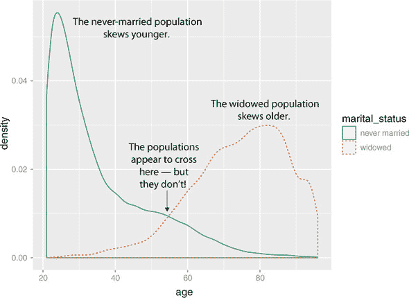

生成 图 3.22 的代码如下。

列表 3.17\. 比较不同类别的种群密度

```
customer_data3 = subset(customer_data2, marital_status %in%
   c("Never married", "Widowed"))                             ❶
ggplot(customer_data3, aes(x=age, color=marital_status,       ❷
   linetype=marital_status)) +
   geom_density() + scale_color_brewer(palette="Dark2")
```

❶ 限制为丧偶或从未结婚的人的数据

❷ 通过婚姻状况区分图表的颜色和线型

重叠密度图可以提供关于分布形状的良好信息：人口密集和稀疏的地方，人口是否分离或重叠。然而，它们会失去关于每个种群相对大小的信息。这是因为每个个体的密度图都按单位面积缩放。这有利于提高每个个体分布的可读性，但可能会让你误以为所有种群的大小都差不多。实际上，图 3.22 中的重叠密度图也可能让你误以为 55 岁后丧偶人口会超过从未结婚的人口，这实际上是不正确的。

为了保留关于每个种群相对大小的信息，使用直方图。直方图不易重叠，因此你可以使用`facet_wrap()`命令与`geom_histogram()`一起使用，就像你在列表 3.16 中看到的柱状图一样。你还可以使用`WVPlots`中的`ShadowHist()`函数生成阴影图的直方图版本，如下所示。

列表 3.18. 使用`ShadowHist()`比较不同类别的种群密度

```
ShadowHist(customer_data3, "age", "marital_status",
 "Age distribution for never married vs. widowed populations", binwidth=5) ❶
```

❶ 将直方图的箱宽设置为 5

结果显示在图 3.23 中。现在你可以看到，丧偶人口相当少，并且直到大约 65 岁后才会超过从未结婚的人口——比图 3.22 中的交叉点晚 10 年。

图 3.23. 丧偶和从未结婚人口年龄分布的`ShadowHist`比较

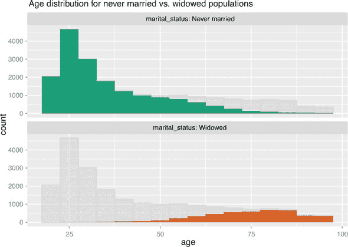

当比较超过两个类别的分布时，你也应使用分面，因为过多的重叠图表难以阅读。尝试检查所有四个婚姻状况类别的年龄分布；该图表显示在图 3.24 中。

图 3.24. 不同婚姻状况年龄分布的截面图

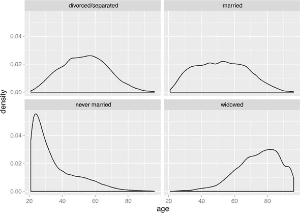

```
ggplot(customer_data2, aes(x=age)) +
  geom_density() + facet_wrap(~marital_status)
```

再次，这些密度图可以提供关于分布形状的良好信息，但会失去关于每个种群相对大小的信息。

两个变量可视化概述

表 3.3 总结了我们所涵盖的两个变量的可视化。

表 3.3. 两个变量的可视化

| 图表类型 | 使用 | 示例 |
| --- | --- | --- |
| 折线图 | 显示两个连续变量之间的关系。当这种关系是函数性的或几乎如此时最佳。 | 绘制 *y = f(x)*。 |
| 散点图 | 显示两个连续变量之间的关系。当关系过于松散或类似云朵，难以在折线图上轻易看出时最佳。 | 绘制收入与工作年限的关系图（收入在 y 轴上）。 |
| 平滑曲线 | 展示两个连续变量之间的“平均”关系或趋势。也可以用来展示连续变量与二进制或布尔变量之间的关系：离散变量的真实值作为连续变量的函数的分数。 | 估计收入与工作年限之间的“平均”关系。 |
| 六边形图 | 当数据非常密集时，展示两个连续变量之间的关系。 | 为大量人口绘制收入与工作年限的关系图。 |
| 堆积条形图 | 展示两个分类变量（var1 和 var2）之间的关系。突出显示 var1 的每个值的频率。当 var2 为二进制时效果最佳。 | 当您想保留每个婚姻类别中人数的信息时，将保险覆盖范围（var2）作为婚姻状况（var1）的函数绘制。 |
| 并列条形图 | 展示两个分类变量（var1 和 var2）之间的关系。适用于比较 var1 的每个值上 var2 的频率。当 var2 为二进制时效果最佳。 | 当您想直接比较每个婚姻类别中投保和未投保人数时，将保险覆盖范围（var2）作为婚姻状况（var1）的函数绘制。 |
| 阴影图 | 展示两个分类变量（var1 和 var2）之间的关系。显示 var1 的每个值的频率，同时允许比较 var2 的值在 var1 的各个类别内和类别间的比较。 | 当您想直接比较每个婚姻类别中投保和未投保人数，并且仍然保留每个婚姻类别中总人数的信息时，将保险覆盖范围（var2）作为婚姻状况（var1）的函数绘制。 |
| 填充条形图 | 展示两个分类变量（var1 和 var2）之间的关系。适用于比较 var1 的每个值内 var2 的相对频率。当 var2 为二进制时效果最佳。 | 当您想比较每个婚姻类别中未投保与投保人数的比率时，将保险覆盖范围（var2）作为婚姻状况（var1）的函数绘制。 |
| 分面条形图 | 展示两个分类变量（var1 和 var2）之间的关系。当 var2 有超过两个值时，最适合比较 var1 的每个值内 var2 的相对频率。 | 将婚姻状况（var2）的分布作为住房类型（var1）的函数绘制。 |
| 叠加密度图 | 比较连续变量在不同分类变量值上的分布。当分类变量只有两个或三个类别时效果最佳。显示连续变量在各个类别中的分布是否不同或相似。 | 比较已婚与离婚人口年龄分布。 |
| 分面密度图 | 比较连续变量在不同分类变量值上的分布。适用于有超过三个或更多类别的分类变量。显示连续变量在类别之间是分布不同还是相似。 | 比较几种婚姻状况（未婚、已婚、离婚、丧偶）的年龄分布。 |
| 分面直方图或阴影直方图 | 在保留关于相对人口规模信息的同时，比较连续变量在不同分类变量值上的分布。 | 在保留关于相对人口规模信息的同时，比较几种婚姻状况（未婚、已婚、离婚、丧偶）的年龄分布。 |

你可以使用许多其他变体和可视化来探索数据；前面的一组涵盖了最有用和最基本的一些图表。你应该尝试不同类型的图表，从数据中获得不同的见解。这是一个互动的过程。一个图表可能会提出一些问题，你可以通过重新绘制数据并使用不同的可视化来尝试回答这些问题。

最终，你会探索足够多的数据，以获得对它的感觉，并发现大多数主要问题和问题。在下一章中，我们将讨论一些解决你可能在数据中发现的一些常见问题的方法。

## 摘要

到目前为止，你已经对你的数据有了感觉。你已经通过摘要和可视化来探索它；你现在对你的数据质量以及变量之间的关系有了感觉。你已经发现了并准备纠正几种数据问题——尽管随着你继续前进，你很可能会遇到更多的问题。

可能你发现的一些事情让你重新评估了你试图回答的问题，或者修改了你的目标。也许你决定你需要更多或不同类型的数据来实现你的目标。这些都是好事。正如我们在上一章提到的，数据科学过程是由层层嵌套的循环组成的。数据探索和数据清洗阶段（我们将在下一章讨论清洗）是过程中耗时较长且最重要的两个阶段。没有好的数据，你无法构建好的模型。你在这里花费的时间是你在其他地方不会浪费的时间。

在下一章中，我们将讨论解决你在数据中发现的问题。

在本章中，你学习了

+   在深入建模之前，花时间检查和理解你的数据。

+   摘要命令帮助你发现数据范围、单位、数据类型以及缺失或无效值的问题。

+   不同的可视化技术有不同的优点和应用。

+   可视化是一个迭代的过程，有助于解答关于数据的问题。从一次可视化中获得的信息可能会引出更多问题——你可能会尝试用另一次可视化来回答这些问题。如果一次可视化不起作用，就尝试另一次。在这里花费的时间是在建模过程中没有浪费的时间。
