# 第四章\. 管理数据

***本章涵盖***

+   修复数据质量问题

+   在建模前转换数据

+   为建模过程组织你的数据

在 第三章 中，你学习了如何探索你的数据以及如何识别常见的数据问题。在本章中，你将看到如何修复你发现的数据问题。之后，我们将讨论在建模过程中转换和组织数据。本章的大部分例子都使用了你在上一章中使用过的相同客户数据.^([1])

> ¹
> 
> 数据可以通过保存文件 custdata.RDS 到 [`github.com/WinVector/PDSwR2/tree/master/Custdata`](https://github.com/WinVector/PDSwR2/tree/master/Custdata) 并然后在 R 中运行 `readRDS("custdata.RDS")` 来加载。

如心智模型 (图 4.1) 所示，本章再次强调了在建模步骤之前以统计有效的方式管理数据的重要性。

图 4.1\. 第四章 心智模型

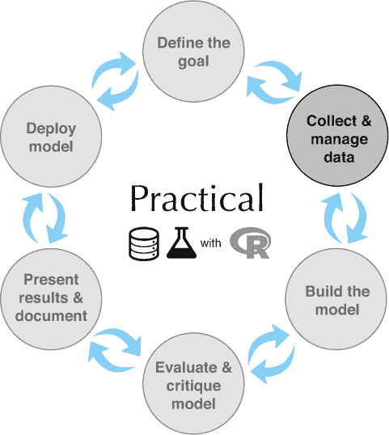

## 4.1\. 数据清洗

在本节中，我们将解决你在数据探索/可视化阶段发现的问题，特别是无效和缺失值。数据中的缺失值很常见，你处理它们的方式通常从项目到项目都是一样的。处理无效值通常是 *领域特定的*：哪些值是无效的，你将如何处理它们，取决于你试图解决的问题。

* * *

示例

*假设你有一个名为* `credit_score`* 的数值变量。领域知识将告诉你该变量的有效范围。如果信用评分应该是客户的“经典 FICO 评分”，那么任何在 300–850 范围之外的值都应该被视为无效。其他类型的信用评分将有不同的有效值范围。*

* * *

我们首先来看一个领域特定数据清洗的例子。

### 4.1.1\. 领域特定数据清洗

从上一章的数据探索中，我们知道我们的数据存在一些问题：

+   变量 `gas_usage` 混合了数值和符号数据：大于 `3` 的值是月度 `gas_bills`，但 `1` 到 `3` 的值是特殊代码。此外，`gas_usage` 还有一些缺失值。

+   变量 `age` 有问题值 `0`，这可能意味着年龄未知。此外，还有一些客户的年龄超过 100 岁，这也可能是一个错误。然而，对于这个项目，我们将值 `0` 视为无效，并假设年龄超过 100 岁是有效的。

+   变量 `income` 有负值。我们假设在这次讨论中这些值是无效的。

这类问题相当常见。事实上，前面提到的大部分问题都已经在我们的假设客户数据示例所基于的实际人口普查数据中存在。

处理`age`和`income`变量的快速方法是将其无效值转换为`NA`，就像它们是缺失变量一样。然后您可以使用在 4.1.2 节中讨论的自动缺失值处理方法来处理`NA`。^([2])

> ²
> 
> 如果您还没有这样做，我们建议您按照附录 A 的 A.1 节和附录 A 中的步骤安装 R、包、工具和本书的示例。

列表 4.1\. 处理年龄和收入变量

```
library(dplyr)
customer_data = readRDS("custdata.RDS")                  ❶

customer_data <- customer_data %>%
   mutate(age = na_if(age, 0),                           ❷
           income = ifelse(income < 0, NA, income))      ❸
```

❶ 加载数据

❷ dplyr 包中的 mutate()函数向数据框中添加列，或修改现有列。来自 dplyr 的函数 na_if()将特定的有问题值（在本例中为 0）转换为 NA。

❸ 将负收入转换为 NA

`gas_usage`变量需要特殊处理。回想一下第三章，值`1`、`2`和`3`不是数值，而是代码：

+   值`1`表示“燃气账单包含在租金或公寓费中。”

+   值`2`表示“燃气账单包含在电费中。”

+   值`3`表示“无费用或未使用燃气。”

处理`gas_usage`的一种方法是将所有特殊代码（`1`、`2`、`3`）转换为`NA`，并添加三个新的*指示变量*，每个代码一个。例如，指示变量`gas_with_electricity`将在原始`gas_usage`变量值为`2`时具有值`1`（或`TRUE`），否则为`0`。在下面的列表中，您将创建三个新的指示变量，`gas_with_rent`、`gas_with_electricity`和`no_gas_bill`。

列表 4.2\. 处理`gas_usage`变量

```
customer_data <- customer_data %>%
  mutate(gas_with_rent = (gas_usage == 1),                   ❶
          gas_with_electricity = (gas_usage == 2),
         no_gas_bill = (gas_usage == 3) ) %>%
  mutate(gas_usage = ifelse(gas_usage < 4, NA, gas_usage))   ❷
```

❶ 创建三个指示变量

❷ 将`gas_usage`列中的特殊代码转换为 NA

### 4.1.2\. 处理缺失值

让我们再次看看上一章中客户数据集中一些具有缺失值的变量。一种通过编程查找这些变量的方法是计算客户数据框中每列的缺失值数量，并查找计数大于零的列。下一个列表计算数据集中每列的缺失值数量。

列表 4.3\. 计算每个变量的缺失值数量

```
count_missing = function(df) {                             ❶
   sapply(df, FUN=function(col) sum(is.na(col)) )
}

nacounts <- count_missing(customer_data)
hasNA = which(nacounts > 0)                                ❷
nacounts[hasNA]

##          is_employed               income         housing_type
##                25774                   45                 1720
##          recent_move         num_vehicles                  age
##                 1721                 1720                   77
##            gas_usage        gas_with_rent gas_with_electricity
##                35702                 1720                 1720
##          no_gas_bill
##                 1720
```

❶ 定义了一个函数，用于计算数据框中每列的 NA 值数量

❷ 将函数应用于 customer_data，识别具有缺失值的列，并打印列和计数

基本上，您可以使用这些变量做两件事：删除包含缺失值的行，或将缺失值转换为有意义的值。对于`income`或`age`这样的变量，相对于数据的大小（`customer_data`有 73,262 行），缺失值非常少，删除行可能是安全的。对于`is_employed`或`gas_usage`这样的变量，其中很大一部分值是缺失的，删除行可能是不安全的。

此外，记住，R（以及其他语言）中的许多建模算法会静默地删除具有缺失值的行。所以如果你有宽数据，并且许多列有缺失值，删除具有缺失值的行可能并不安全。这是因为在这种情况下，至少有一个缺失值的行比例可能很高，你可能会丢失大部分数据，如图 4.2(figure 4.2)所示。因此，为了这次讨论，我们将所有缺失值转换为有意义的值。

图 4.2\. 即使只有几个缺失值也可能丢失所有数据。

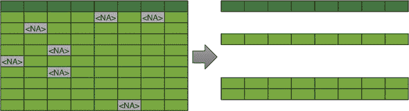

分类变量中的缺失数据

当缺失值的变量是分类变量时，一个简单的解决方案是为该变量创建一个新的类别，例如，称为`missing`或`_invalid_`。这在图 4.3(figure 4.3)中 schematically 展示了`housing_type`变量。

图 4.3\. 为缺失的分类值创建新级别

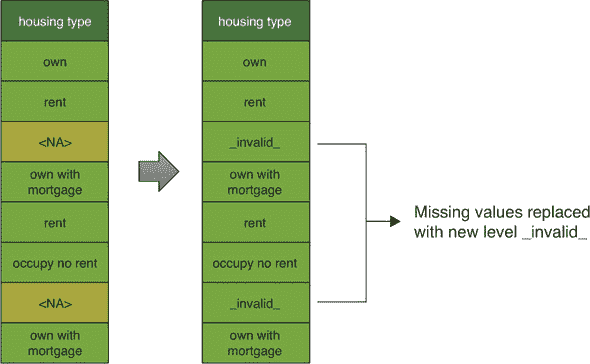

数值或逻辑变量中的缺失值

假设你的收入变量缺失大量数据，如图 4.4(figure 4.4)所示。你认为收入仍然是健康保险覆盖概率的重要预测因子，因此你仍然想使用该变量。你该怎么办？这可以取决于你为什么认为数据缺失。

图 4.4\. 具有缺失值的收入数据

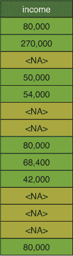

缺失值的性质

你可能认为数据缺失是因为数据收集失败是随机的，独立于情况和其他值。在这种情况下，你可以用“合理的估计”或*插补值*来替换缺失值。从统计学的角度来看，一个常用的估计是期望值或平均值，如图 4.5(figure 4.5)所示。

图 4.5\. 用平均值替换缺失值

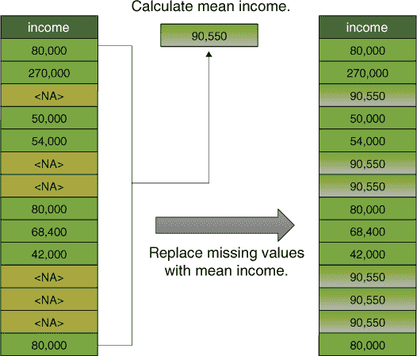

假设缺失收入的客户与其他客户的分布方式相同，用平均值替换缺失值在平均意义上将是正确的。这也是一个容易实施的解决方案。

当你记得收入与你的数据中的其他变量相关时，你可以改进这个估计——例如，根据前一章的数据探索，你知道年龄和收入之间存在关系。居住地或婚姻状况与收入之间也可能存在关系。如果你有这些信息，你可以使用它。基于其他输入变量对输入变量的缺失值进行插补的方法也可以应用于分类数据。^([3)]

> ³
> 
> 《R in Action，第二版》（Robert Kabacoff，2014，[`mng.bz/ybS4`](http://mng.bz/ybS4)）包括对 R 中可用的几种值插补方法的广泛讨论。

重要的是要记住，用平均值替换缺失值，以及其他更复杂的缺失值插补方法，假设缺失收入的客户在某种程度上是典型的。可能缺失收入数据的客户与其他客户在系统上有所不同。例如，可能的情况是，缺失收入信息的客户确实没有收入，因为他们是全职学生或全职主妇，或者他们不是活跃的劳动力。如果是这样，那么使用上述方法之一“填补”他们的收入信息是不充分的处理，可能会导致错误的结论。

将缺失值视为信息

你仍然需要将 `NA` 替换为一个替代值，比如平均值。但是建模算法应该知道这些值可能与其他值不同。对我们来说，一个有效的方法是将 `NA` 替换为平均值，并添加一个额外的指示变量来跟踪哪些数据点已被更改。这如图 4.6 所示。

图 4.6\. 用平均值替换缺失值并添加指示列以跟踪更改的值

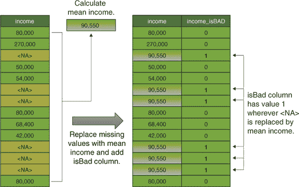

`income_isBAD` 变量让你能够区分数据中的两种值：你即将添加的值和已经存在的值。

你已经在另一个关于系统缺失值的例子中看到了这种方法的变化，那就是 `gas_usage` 变量。大多数缺失 `gas_usage` 值的客户并不是随机的：他们要么与其他账单一起支付燃气费，比如电费或租金，要么他们不使用燃气。你通过添加额外的指示变量来识别这些客户：`no_gas_bill`、`gas_with_rent` 等。现在你可以在 `gas_usage` 中的“缺失”值用替代值填充，比如零，或者 `gas_usage` 的平均值。

策略是在建模步骤中，将所有变量——`income`、`income_isBAD`、`gas_usage`、`no_gas_bill` 等——都提供给建模算法，它可以确定如何最好地使用这些信息进行预测。如果缺失值确实是随机缺失的，那么你添加的指示变量就是无信息的，模型应该忽略它们。如果缺失值是系统缺失的，那么指示变量为建模算法提供了有用的额外信息。

* * *

缺失指示器可能很有用

我们在许多情况下观察到，`isBAD` 变量有时甚至比原始变量更有信息和有用！

* * *

如果你不知道缺失值是随机的还是系统的，我们建议假设差异是系统的，而不是努力根据随机缺失假设对变量进行值填充。正如我们之前所说的，当缺失值实际上指示某些数据点的系统性差异时，将其视为随机缺失可能会得出错误的结论。

### 4.1.3\. 用于自动处理缺失变量的 vtreat 包

由于缺失值是数据中如此常见的问题，因此有一个自动且可重复的处理过程来处理它们是非常有用的。我们建议使用 `vtreat` 变量处理包。`vtreat` 处理过程创建一个 *处理计划*，记录重复数据处理过程所需的所有信息：例如，观察到的平均收入，或像 `housing_type` 这样的分类变量的所有观察值。然后，你使用这个处理计划在拟合模型之前“准备”或处理你的训练数据，然后再在将新数据输入模型之前再次处理。其想法是处理过的数据是“安全的”，没有缺失或意外的值，并且不应该破坏模型。

你将在后面的章节中看到使用 `vtreat` 的更复杂示例，但到目前为止，你将只创建一个简单的处理计划来管理 `customer_data` 中的缺失值。图 4.7 显示了创建和应用此简单处理计划的过程。首先，你必须指定数据中的哪些列是输入变量：除了 `health_ins`（要预测的结果）和 `custid` 之外的所有列：

```
varlist <- setdiff(colnames(customer_data), c("custid", "health_ins"))
```

图 4.7\. 创建和应用简单处理计划

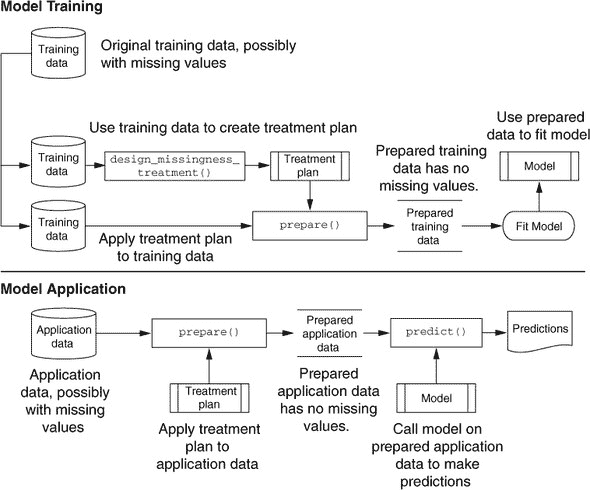

然后，你创建处理计划，并“准备”数据。

列表 4.4\. 创建和应用处理计划

```
library(vtreat)
treatment_plan <-
      design_missingness_treatment(customer_data, varlist = varlist)
training_prepared <- prepare(treatment_plan, customer_data)
```

数据框 `training_prepared` 是用于训练模型的处理数据。让我们将其与原始数据进行比较。

列表 4.5\. 比较处理数据与原始数据

```
colnames(customer_data)
##  [1] "custid"               "sex"                  "is_employed"
##  [4] "income"               "marital_status"       "health_ins"
##  [7] "housing_type"         "recent_move"          "num_vehicles"
## [10] "age"                  "state_of_res"         "gas_usage"
## [13] "gas_with_rent"        "gas_with_electricity" "no_gas_bill"
colnames(training_prepared)                                               ❶
##  [1] "custid"                     "sex"
##  [3] "is_employed"                "income"
##  [5] "marital_status"             "health_ins"
##  [7] "housing_type"               "recent_move"
##  [9] "num_vehicles"               "age"
## [11] "state_of_res"               "gas_usage"
## [13] "gas_with_rent"              "gas_with_electricity"
## [15] "no_gas_bill"                "is_employed_isBAD"
## [17] "income_isBAD"               "recent_move_isBAD"
## [19] "num_vehicles_isBAD"         "age_isBAD"
## [21] "gas_usage_isBAD"            "gas_with_rent_isBAD"
## [23] "gas_with_electricity_isBAD" "no_gas_bill_isBAD"

nacounts <- sapply(training_prepared, FUN=function(col) sum(is.na(col)) ) ❷
sum(nacounts)
## [1] 0
```

❶ 准备好的数据有额外的列，这些列在原始数据中不存在，最重要的是那些带有 _isBAD 标记的列。

❷ 准备好的数据没有缺失值。

现在检查一些你知道有缺失值的列。

列表 4.6\. 检查数据处理

```
htmissing <- which(is.na(customer_data$housing_type))                  ❶

columns_to_look_at <- c("custid", "is_employed", "num_vehicles",
                           "housing_type", "health_ins")

customer_data[htmissing, columns_to_look_at] %>% head()                ❷
##           custid is_employed num_vehicles housing_type health_ins
## 55  000082691_01        TRUE           NA         <NA>      FALSE
## 65  000116191_01        TRUE           NA         <NA>       TRUE
## 162 000269295_01          NA           NA         <NA>      FALSE
## 207 000349708_01          NA           NA         <NA>      FALSE
## 219 000362630_01          NA           NA         <NA>       TRUE
## 294 000443953_01          NA           NA         <NA>       TRUE
columns_to_look_at = c("custid", "is_employed", "is_employed_isBAD",
                       "num_vehicles","num_vehicles_isBAD",
                       "housing_type", "health_ins")

training_prepared[htmissing, columns_to_look_at] %>%  head()           ❸
##           custid is_employed is_employed_isBAD num_vehicles
## 55  000082691_01   1.0000000                 0       2.0655
## 65  000116191_01   1.0000000                 0       2.0655
## 162 000269295_01   0.9504928                 1       2.0655
## 207 000349708_01   0.9504928                 1       2.0655
## 219 000362630_01   0.9504928                 1       2.0655
## 294 000443953_01   0.9504928                 1       2.0655
##     num_vehicles_isBAD housing_type health_ins
## 55                   1    _invalid_      FALSE
## 65                   1    _invalid_       TRUE
## 162                  1    _invalid_      FALSE
## 207                  1    _invalid_      FALSE
## 219                  1    _invalid_       TRUE
## 294                  1    _invalid_       TRUE

customer_data %>%
    summarize(mean_vehicles = mean(num_vehicles, na.rm = TRUE),
    mean_employed = mean(as.numeric(is_employed), na.rm = TRUE))       ❹
##   mean_vehicles mean_employed
## 1        2.0655     0.9504928
```

❶ 找到 `housing_type` 缺失的行

❷ 查看原始数据中那些行的几个列

❸ 查看处理数据中的那些行和列（包括 isBADs）

❹ 验证数据集中预期的车辆数量和预期的失业率

你可以看到 `vtreat` 将分类变量 `housing_type` 的缺失值替换为 `_invalid_`，并将数值列 `num_vehicles` 的缺失值替换为原始数据中的平均值。它还将逻辑变量 `is_ employed` 转换为数值变量，并用原始数据中的平均值替换缺失值。

除了修复缺失数据外，还有其他方法可以转换数据，以解决你在探索阶段发现的问题。在下一节中，我们将检查一些其他常见的转换。

## 4.2\. 数据转换

数据转换的目的是使数据更容易建模，也更容易理解。机器学习通过学习训练数据中的有意义模式来工作，然后通过利用这些模式在新数据中进行预测。因此，使训练数据中的模式与新数据中的模式更容易匹配的数据转换可以带来好处。

* * *

示例

*假设你正在考虑将收入作为保险模型的输入。生活成本会因州而异，所以在一个地区可能是高薪，而在另一个地区可能几乎不足以维持生计。因此，可能更有意义的是，通过他们居住地区的典型收入来归一化客户的收入。这是一个相对简单（且常见）的转换例子。*

* * *

对于这个例子，你有一个名为 median_income.RDS 的文件，其中包含每个州的中位数收入的外部信息。列表 4.7 使用这些信息来归一化收入。代码使用连接操作将 median_income.RDS 中的信息与现有的客户数据进行匹配。我们将在下一章讨论连接表，但就目前而言，你应该理解连接是将数据从另一个数据框复制到具有匹配行的数据框中。

列表 4.7\. 按州归一化收入

```
library(dplyr)
median_income_table <- readRDS("median_income.RDS")                         ❶
head(median_income_table)

##   state_of_res median_income
## 1      Alabama         21100
## 2       Alaska         32050
## 3      Arizona         26000
## 4     Arkansas         22900
## 5   California         25000
## 6     Colorado         32000

training_prepared <-  training_prepared %>%
  left_join(., median_income_table, by="state_of_res") %>%                  ❷
   mutate(income_normalized = income/median_income)

head(training_prepared[, c("income", "median_income", "income_normalized")])❸

##   income median_income income_normalized
## 1  22000         21100         1.0426540
## 2  23200         21100         1.0995261
## 3  21000         21100         0.9952607
## 4  37770         21100         1.7900474
## 5  39000         21100         1.8483412
## 6  11100         21100         0.5260664

summary(training_prepared$income_normalized)

##    Min. 1st Qu.  Median    Mean 3rd Qu.    Max.
##  0.0000  0.4049  1.0000  1.5685  1.9627 46.5556
```

❶ 如果你已下载 PDSwR2 代码示例目录，那么 median_income.RDS 位于 PDSwR2/Custdata 目录中。我们假设这是你的工作目录。

❷ 将 median_income_table 连接到客户数据中，以便你可以按其所在州的中位数收入归一化每个人的收入

❸ 比较收入和 income_normalized 的值

查看第 4.7 表的结果，你会发现收入高于其所在州中位数收入的客户，其`income_normalized`值大于`1`，而收入低于其所在州中位数收入的客户，其`income_normalized`值小于`1`。由于不同州的客户得到不同的归一化处理，我们称这种处理为*条件性*转换。换句话说，这种归一化是基于客户居住地的状态。我们称通过相同值对所有客户进行缩放为*非条件性*转换。

数据转换的需要也可能取决于你计划使用的建模方法。例如，对于线性回归和逻辑回归，理想情况下，你希望确保输入变量与输出变量之间的关系大致是线性的，并且输出变量的方差是恒定的（输出变量的方差与输入变量无关）。你可能需要转换一些输入变量以更好地满足这些假设。

在本节中，我们将探讨一些有用的数据转换及其应用场景：

+   标准化

+   中心化和缩放

+   对数转换

### 4.2.1\. 标准化

标准化（或缩放）在绝对量不如相对量有意义时很有用。你已经看到了一个将收入相对于另一个有意义的量（中位数收入）进行标准化的例子。在这种情况下，有意义的量是外部的（它来自外部信息），但它也可以是内部的（从数据本身导出）。

例如，你可能对客户的绝对年龄不如对客户相对于“典型”客户的年龄大小感兴趣。让我们以客户的平均年龄作为典型年龄。你可以通过以下列表进行标准化。

列表 4.8\. 通过平均年龄进行标准化

```
summary(training_prepared$age)

##    Min. 1st Qu.  Median    Mean 3rd Qu.    Max.
##   21.00   34.00   48.00   49.22   62.00  120.00

mean_age <- mean(training_prepared$age)
age_normalized <- training_prepared$age/mean_age
summary(age_normalized)

##    Min. 1st Qu.  Median    Mean 3rd Qu.    Max.
##  0.4267  0.6908  0.9753  1.0000  1.2597  2.4382
```

`age_normalized`的值远小于`1`表示客户异常年轻；远大于`1`表示客户异常年长。但“远小于”或“远大于`1`”是什么意思？这取决于你的客户倾向于有多大的年龄分布。参见图 4.8 以获取示例。

图 4.8\. 35 岁的人算年轻吗？

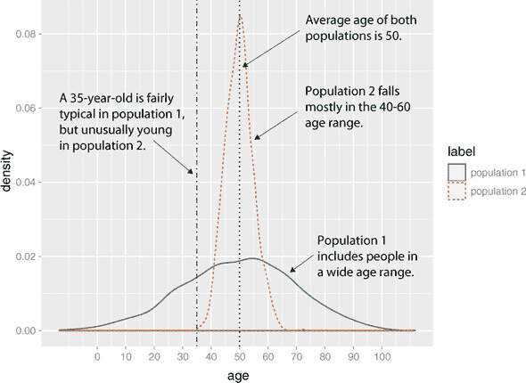

两个群体中的平均客户年龄都是 50 岁。*群体 1*的年龄分布相对较广，所以 35 岁的人仍然看起来相当典型（可能有点年轻）。同样的 35 岁的人在*群体 2*中看起来异常年轻，因为群体 2 的年龄分布较窄。你的客户的典型年龄分布可以通过标准差来总结。这导致了一种表达客户相对年龄的另一种方式。

### 4.2.2\. 中心化和缩放

你可以通过使用标准差作为距离单位来缩放你的数据。一个年龄在平均年龄加减一个标准差范围内的客户被认为与典型年龄相差不大。一个年龄比平均年龄多一个或两个标准差的客户可以被认为是年龄较大或较小。为了使相对年龄更容易理解，你还可以通过平均值来中心化数据，这样“典型年龄”的客户中心化年龄为 0。

列表 4.9\. 中心化和缩放年龄

```
(mean_age <- mean(training_prepared$age))                                  ❶
 ## [1] 49.21647

(sd_age <- sd(training_prepared$age))                                      ❷
 ## [1] 18.0124

print(mean_age + c(-sd_age, sd_age))                                       ❸
 ## [1] 31.20407 67.22886

training_prepared$scaled_age <- (training_prepared$age - mean_age) / sd_age❹

training_prepared %>%
  filter(abs(age - mean_age) < sd_age) %>%
  select(age, scaled_age) %>%
  head()

##   age scaled_age                                                        ❺
## 1  67  0.9872942
## 2  54  0.2655690
## 3  61  0.6541903
## 4  64  0.8207422
## 5  57  0.4321210
## 6  55  0.3210864

training_prepared %>%
  filter(abs(age - mean_age) > sd_age) %>%
  select(age, scaled_age) %>%
  head()

##   age scaled_age                                                        ❻
## 1  24  -1.399951
## 2  82   1.820054
## 3  31  -1.011329
## 4  93   2.430745
## 5  76   1.486950
## 6  26  -1.288916
```

❶ 计算平均值

❷ 计算标准差

❸ 这个群体的典型年龄范围大约在 31 岁到 67 岁之间。

❹ 以平均值作为起点（或参考点），并通过标准差缩放与平均值的距离

❺ 典型年龄范围内的客户具有小于 1 的缩放年龄值。

❻ 在典型年龄范围之外的客户具有大于 1 的缩放年龄值。

现在，小于 `-1` 的值表示比典型客户年轻的客户；大于 `1` 的值表示比典型客户年长的客户。

* * *

**一个技术细节**

标准差作为距离单位的常见解释隐含地假设数据是正态分布的。对于正态分布，大约三分之二的数据（大约 68%）在均值加减一个标准差范围内。大约 95%的数据在均值加减两个标准差范围内。在 figure 4.8（在 figure 4.9 中作为分面图重现）中，一个 35 岁的人在 *population 1* 中距离均值一个标准差，但在 *population 2* 中超过一个（实际上，超过两个）标准差。

Figure 4.9\. 分面图：35 岁的人年轻吗？

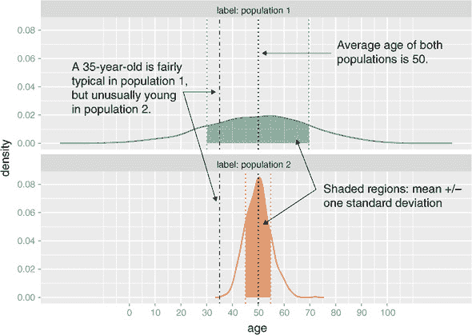

即使数据不是正态分布的，你仍然可以使用这种变换，但标准差作为距离的单位在数据单峰且大致围绕均值对称时最有意义。

* * *

当你有多个数值变量时，你可以使用 `scale()` 函数同时将它们居中和缩放。这有一个优点，即现在所有数值变量都具有相似且更兼容的范围。为了具体说明，比较变量 *age*（以年为单位）和变量 *income*（以美元为单位）。两个客户之间 10 岁的年龄差异可能很大，但 10 美元的收入差异却相当小。如果你对这两个变量都进行居中和缩放，那么值 `0` 对两个缩放变量意味着相同的事情：平均年龄或平均收入。而值 `1.5` 也意味着相同的事情：一个比平均年龄高 1.5 个标准差的个人，或者比平均收入高 1.5 个标准差的个人。在这两种情况下，值 `1.5` 可以被认为是从平均值的一个较大差异。

以下列表展示了如何使用 `scale()` 对数据中的四个数值变量进行居中和缩放。

Listing 4.10\. 居中和缩放多个数值变量

```
dataf <- training_prepared[, c("age", "income", "num_vehicles", "gas_usage")]
summary(dataf)

##       age             income         num_vehicles     gas_usage
##  Min.   : 21.00   Min.   :      0   Min.   :0.000   Min.   :  4.00
##  1st Qu.: 34.00   1st Qu.:  10700   1st Qu.:1.000   1st Qu.: 50.00
##  Median : 48.00   Median :  26300   Median :2.000   Median : 76.01
##  Mean   : 49.22   Mean   :  41792   Mean   :2.066   Mean   : 76.01
##  3rd Qu.: 62.00   3rd Qu.:  51700   3rd Qu.:3.000   3rd Qu.: 76.01
##  Max.   :120.00   Max.   :1257000   Max.   :6.000   Max.   :570.00

dataf_scaled <- scale(dataf, center=TRUE, scale=TRUE)                      ❶

summary(dataf_scaled)
##       age               income         num_vehicles        gas_usage
##  Min.   :-1.56650   Min.   :-0.7193   Min.   :-1.78631   Min.   :-1.4198
##  1st Qu.:-0.84478   1st Qu.:-0.5351   1st Qu.:-0.92148   1st Qu.:-0.5128
##  Median :-0.06753   Median :-0.2666   Median :-0.05665   Median : 0.0000
##  Mean   : 0.00000   Mean   : 0.0000   Mean   : 0.00000   Mean   : 0.0000
##  3rd Qu.: 0.70971   3rd Qu.: 0.1705   3rd Qu.: 0.80819   3rd Qu.: 0.0000
##  Max.   : 3.92971   Max.   :20.9149   Max.   : 3.40268   Max.   : 9.7400

(means <- attr(dataf_scaled, 'scaled:center'))                             ❷
 ##          age       income num_vehicles    gas_usage
##     49.21647  41792.51062      2.06550     76.00745

(sds <- attr(dataf_scaled, 'scaled:scale'))
##          age       income num_vehicles    gas_usage
##    18.012397 58102.481410     1.156294    50.717778
```

❶ 通过其均值居中数据，并通过其标准差进行缩放

❷ 获取原始数据的均值和标准差，这些值存储为 dataf_scaled 的属性

由于 `scale()` 变换将所有数值变量放入兼容的单位，因此它是主成分分析和深度学习等一些数据分析和技术推荐的预处理步骤。

保持训练变换

当你使用从数据中导出的参数（如均值、中位数或标准差）在建模之前转换数据时，你通常应该保留这些参数，并在转换将输入到模型的新数据时使用它们。当你使用列表 4.10 中的`scale()`函数时，你保留了`scaled:center`和`scaled:scale`属性的值作为变量`means`和`sds`。这样做是为了你可以使用这些值来缩放新数据，正如列表 4.11 中所示。这确保了新的缩放数据与训练数据具有相同的单位。

当使用`vtreat`包中的`design_missingness_treatment()`函数清理缺失值时，与你在第 4.1.3 节中所做的一样，同样的原则适用。产生的处理计划（在列表 4.1.3)中称为`treatment_plan`）保留了训练数据中的信息，以便从新数据中清理缺失值，正如你在列表 4.5 中所看到的。

列表 4.11\. 在将新数据输入模型之前对其进行处理

```
newdata <- customer_data                              ❶

library(vtreat)                                       ❷
newdata_treated <- prepare(treatment_plan, newdata)

new_dataf <- newdata_treated[, c("age", "income",     ❸
"num_vehicles", "gas_usage")]

dataf_scaled <- scale(new_dataf, center=means, scale=sds)
```

❶ 模拟拥有一个新的客户数据集

❷ 使用原始数据集的处理计划对其进行清理

❸ 使用原始数据集的均值和标准差来缩放年龄、收入、车辆数量和油耗

然而，有些情况下你可能希望使用新的参数。例如，如果模型中的重要信息是某个主体的收入与*当前*中位数收入的关系，那么在为建模准备新数据时，你将希望使用当前的中位数收入来归一化收入，而不是模型训练时的中位数收入。这里的含义是，收入是中位数三倍的人的特征将不同于收入低于中位数的人的特征，并且这些差异与实际收入金额无关。

### 4.2.3\. 对偏斜和宽分布进行对数转换

通过均值和标准差进行归一化，正如你在第 4.2.2 节中所做的那样，当数据分布大致对称时最有意义。接下来，我们将探讨一种可以使某些分布更加对称的转换方法。

货币金额——如收入、客户价值、账户价值或购买大小——是数据科学应用中最常见的偏斜分布来源之一。事实上，正如我们将在附录 B 中讨论的那样，货币金额通常是*对数正态分布*：数据的对数是正态分布的。这导致我们想到，通过对货币数据取对数可以恢复数据的对称性和规模，使其看起来“更正常”。我们在图 4.11 中展示了这一点。

对于建模的目的，通常使用哪种对数并不太关键，无论是自然对数、以 10 为底的对数还是以 2 为底的对数。例如，在回归分析中，对数的选择会影响对应于对数变量的系数的大小，但它不会影响模型的架构。我们喜欢使用以 10 为底的对数来表示货币金额，因为十进制对于金钱来说似乎是自然的：$100，$1000，$10,000 等等。变换后的数据易于阅读。

***

关于图形的一个补充

注意到图 4.10 的底部面板与图 3.7 具有相同的形状。在*收入*的密度图上使用`ggplot`层的`scale_x_log10`与绘制*log10(income)*的密度图之间的主要区别是轴标签。使用`scale_x_log10`将对 x 轴进行美元金额的标注，而不是对数。

***

图 4.10。一个近似对数正态分布及其对数

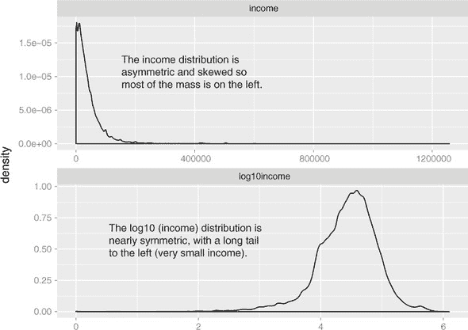

对于包含跨越几个数量级的值的数值数据，通常进行对数变换也是一个好主意，例如城镇和城市的居民数量，可能从几百到几百万不等。这样做的一个原因是因为建模技术往往难以处理非常宽的数据范围。另一个原因是，这类数据通常来自乘法过程，而不是加法过程，因此对数单位在某种程度上更为自然。

作为一种**加法**过程的例子，假设你正在研究减肥。如果你体重 150 磅，而你的朋友体重 200 磅，你们两人同样活跃，并且你们都采取了完全相同的限制卡路里饮食，那么你们可能都会减掉大约相同数量的磅数。你减掉的体重并不取决于你最初体重有多少，而只取决于卡路里摄入量。在这种情况下，自然单位是绝对磅数（或千克）的减少。

作为乘法过程的例子，考虑工资增长。如果管理层给部门里的每个人都加薪，那么它可能并不是给每个人都额外加$5,000。相反，每个人都得到 2%的加薪：你最终工资中增加的金额取决于你的初始工资。在这种情况下，自然单位是百分比，而不是绝对美元。其他乘法过程的例子：

+   在线零售网站的变化会使每个商品的转化率（购买）增加 2%（而不是每晚正好增加两个购买）。

+   餐厅菜单的任何变化都会使每晚的顾客数量增加 5%（而不是每晚正好增加五个顾客）。

当过程是乘法时，对数变换过程数据可以使建模更容易。

不幸的是，只有当数据是非负的时，取对数才有效，因为零的对数是负无穷大，负数的对数没有定义（R 将负数的对数标记为`NaN`：不是一个数字）。还有其他转换，如*arcsinh*，可以在你有零或负值时用来减少数据范围。我们并不总是使用*arcsinh*，因为我们发现转换后的数据值并不具有意义。在数据偏斜是货币（如账户余额或客户价值）的应用中，我们使用我们称之为*带符号对数*的方法。带符号对数取变量的绝对值对数并乘以适当的符号。严格位于`-1`和`1`之间的值被映射到零。对数和带符号对数之间的区别在图 4.11 中显示。

图 4.11. 带符号的对数可以将非正值数据可视化在对数尺度上。


这是在 R 中计算带符号的对数底数为 10 的方法：

```
signedlog10 <- function(x) {
     ifelse(abs(x) <= 1, 0, sign(x)*log10(abs(x)))
}
```

这种方法将-1 和 1 之间的所有数据映射到零，因此如果小于 1 的数值很重要，这种转换显然是不实用的。但是，对于许多货币变量（如美元），实际上小于一美元的数值与零（或 1）没有太大区别。因此，例如，将账户余额小于或等于 1 美元（相当于每个账户始终有最低余额 1 美元）进行映射可能是可以的。您还可以为“小”选择一个更大的阈值，例如 100 美元。这将把小于 100 美元的小账户映射到相同的值，并消除图 4.10 和 4.11 中的长左尾。在某些情况下，消除这个长尾可能是希望的——一方面，它使数据图表的视觉偏差减少。4]

> ⁴
> 
> 除了截断之外，还有其他方法可以处理带符号的对数，例如反正弦函数（见[`mng.bz/ZWQa`](http://mng.bz/ZWQa)），但它们也会扭曲接近零的数据，并使几乎任何数据看起来是双峰的，这可能具有欺骗性。

一旦数据得到了适当的清理和转换，你几乎可以开始建模阶段了。在我们到达那里之前，我们还有一步。

## 4.3. 用于建模和验证的抽样

抽样是选择一个子集来代表总体，在分析和建模过程中的过程。在当前的大数据集时代，有些人认为计算能力和现代算法让我们能够分析整个大型数据集，而不需要抽样。但请记住，“大数据”本身通常是从更大的宇宙中抽取的样本。因此，了解抽样对于处理数据总是必要的。

我们当然可以分析比以前更大的数据集，但抽样仍然是一个有用的工具。当你处于开发或改进建模过程的中途时，在训练整个数据集之前，在小子样本上测试和调试代码会更简单。使用数据子样本进行可视化可能更容易；`ggplot` 在较小的数据集上运行得更快，过多的数据往往会模糊图表中的模式，正如我们在第三章 中提到的。而且，通常不可能使用你的整个客户群来训练一个模型。

确保你使用的整个数据集能够准确代表你的整体人群是很重要的。例如，你的客户可能来自美国的各个地方。当你收集客户数据时，可能会倾向于使用一个州的所有客户，比如康涅狄格州，来训练模型。但如果你计划使用该模型来预测全国各地的客户，那么随机从所有州选择客户是一个好主意，因为预测德克萨斯州客户健康保险覆盖率的因素可能与预测康涅狄格州健康保险覆盖率的因素不同。这可能并不总是可行的（也许只有康涅狄格州和马萨诸塞州的分支机构目前收集客户健康保险信息），但使用非代表性数据集的缺点应该引起注意。

另一个对数据进行抽样的原因是创建测试和训练分割。

### 4.3.1\. 测试和训练分割

当你构建一个用于预测的模型，比如我们预测健康保险覆盖概率的模型时，你需要数据来构建模型。你还需要数据来测试模型是否能在新数据上做出正确的预测。第一个集合被称为**训练集**，第二个集合被称为**测试集**（或**保留集**）。图 4.12 展示了分割过程（以及可选的校准集分割，详见侧边栏 “训练/校准/测试分割”）。

图 4.12\. 将数据分割成训练集和测试集（或训练、校准和测试集）

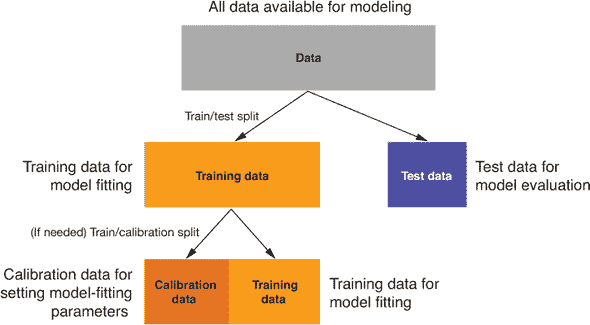

训练集是提供给模型构建算法（我们将在第二部分中介绍具体算法）的数据，以便算法能够拟合正确的结构以最佳预测结果变量。测试集是输入到最终模型中的数据，以验证模型在新数据上的预测是否准确。我们将在第六章中详细介绍你可以通过使用保留数据检测到的建模问题。现在，我们将为稍后进行的保留实验准备数据。

* * *

**训练/校准/测试分割**

许多作家推荐使用训练/校准/测试分割，其中 *校准集* 用于设置模型拟合算法需要的参数，而训练集用于拟合模型。这也是一条很好的建议。我们的理念是这样的：尽早将数据分割为训练/测试，直到最终评估前不要查看测试数据，如果您需要校准数据，则从您的训练子集中重新分割。

* * *

### 4.3.2\. 创建样本组列

管理随机采样的便捷方法是在数据框中添加一个样本组列。该样本组列包含使用 `runif()` 函数生成的从零到一的均匀数。您可以通过对样本组列使用适当的阈值从数据框中抽取任意大小的随机样本。

例如，一旦您已经使用样本组列（让我们称它为 `gp`）标记了数据框的所有行，那么 `gp` < 0.4 的所有行将大约是四分之一，即 40% 的数据。`gp` 在 0.55 和 0.70 之间的所有行大约是数据的 15%（0.7 – 0.55 = 0.15）。因此，您可以通过使用 `gp` 可重复地生成任何大小的数据随机样本。

列表 4.12\. 使用随机分组标记分割为测试集和训练集

```
set.seed(25643)                                      ❶
customer_data$gp <- runif(nrow(customer_data))       ❷
customer_test <- subset(customer_data, gp <= 0.1)    ❸
customer_train <- subset(customer_data, gp > 0.1)    ❹

dim(customer_test)
## [1] 7463   16

dim(customer_train)
## [1] 65799    16
```

❶ 设置随机种子，以确保此示例可重复

❷ 创建分组列

❸ 在这里，我们生成大约 10% 的数据测试集。

❹ 在这里，我们使用剩余的数据生成一个训练集。

列表 4.12 生成大约 10% 的数据测试集，并将剩余的 90% 数据分配给训练集。

`dplyr` 包也有名为 `sample_n()` 和 `sample_frac()` 的函数，可以从数据框中抽取随机样本（默认为均匀随机样本）。为什么不直接使用这些中的一个来抽取训练集和测试集呢？您可以这样做，但您应该确保通过 `set.seed()` 命令（就像我们在列表 4.12 中所做的那样）设置随机种子，以确保您每次都会抽取相同的样本组。在调试代码时，可重复采样是必不可少的。在许多情况下，代码会因为您忘记防范的边缘情况而崩溃。这个边缘情况可能会出现在您的随机样本中。如果您每次运行代码时都使用不同的随机输入样本，您将不知道是否会再次触发该错误。这使得跟踪和修复错误变得困难。

您还希望对于软件工程师所说的 *回归测试*（不要与统计回归混淆）有可重复的输入样本。换句话说，当您对模型或数据处理进行更改时，您想确保您不会破坏已经正常工作的事物。如果模型版本 1 为某个输入集提供了“正确答案”，您想确保模型版本 2 也能这样做。

我们发现，将样本组列与数据一起存储是保证在开发和测试期间可重复采样的一种更可靠的方法。

* * *

可重复抽样的技巧不仅适用于 R

如果你的数据存储在数据库或其他外部存储中，而你只想将数据的一个子集拉入 R 进行分析，你可以在数据库中适当表中生成一个样本组列，使用 SQL 命令`RAND`来抽取一个可重复的随机样本。

* * *

### 4.3.3\. 记录分组

一个注意事项是，前面的技巧在感兴趣的每个对象（在这种情况下是每个客户）对应一个唯一行时才有效。但如果你对哪些客户没有健康保险的兴趣较少，而对哪些家庭有未投保成员的兴趣更多呢？如果你在家庭层面而不是客户层面建模问题，那么家庭中的每个成员都应该在同一组（测试或训练）中。换句话说，随机抽样也必须在家庭层面进行。

假设你的客户既由家庭 ID 标记，也由客户 ID 标记。这显示在图 4.13 中。我们想要将家庭分成训练集和测试集。列表 4.13 显示了一种生成适当的样本组列的方法。

图 4.13\. 具有客户和家庭的示例数据集

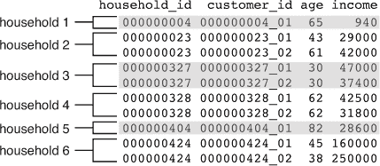

列表 4.13\. 确保测试/训练分割不会在家庭内部分割

```
household_data <- readRDS("hhdata.RDS")                 ❶
hh <- unique(household_data$household_id)               ❷

set.seed(243674)
households <- data.frame(household_id = hh,             ❸
                          gp = runif(length(hh)),
                         stringsAsFactors=FALSE)

household_data <- dplyr::left_join(household_data,      ❹
                             households,
                            by = "household_id")
```

❶ 如果你已下载了 PDSwR2 代码示例目录，那么家庭数据集位于 PDSwR2/Custdata 目录中。我们假设这是你的工作目录。

❷ 获取唯一的家庭 ID

❸ 为每个家庭生成唯一的抽样组 ID，并将其放入名为 gp 的列中

❹ 将家庭 ID 重新合并到原始数据中

结果样本组列显示在图 4.14。家庭中的每个人都有相同的样本组编号。

图 4.14\. 按家庭而非客户进行数据集抽样

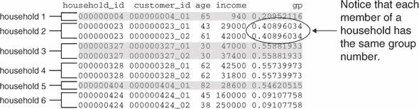

现在，我们可以像以前一样生成测试集和训练集。然而，这次阈值 0.1 并不代表数据行的 10%，而是家庭的 10%，这可能会多或少于 10%的数据，具体取决于家庭的大小。

### 4.3.4\. 数据来源

你还可能想要添加一个（或多个）列来记录数据来源：你的数据集何时收集的，也许在建模之前使用了哪个版本的数据清理程序，等等。这种元数据类似于数据的版本控制。当你正在改进模型或比较不同模型或模型的不同版本时，这是一些方便的信息，以确保你是在比较苹果和苹果。

图 4.15 展示了添加到训练数据中的一些可能的元数据示例。在这个例子中，你记录了原始数据源（称为“数据提取 8/2/18”），数据收集的时间以及处理的时间。例如，如果数据上的处理日期早于你最近的数据处理程序版本，那么你知道这个处理过的数据可能是过时的。多亏了元数据，你可以回到原始数据源并再次处理它。

图 4.15\. 使用数据记录数据源、收集日期和处理日期

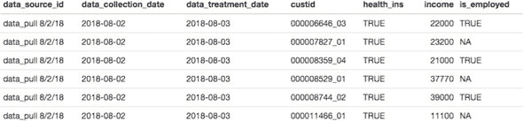

## 摘要

在某个时候，你将拥有尽可能好的数据质量。你已经解决了缺失数据的问题，并执行了任何需要的转换。你现在可以进入建模阶段。

然而，请记住，数据科学是一个迭代的过程。在建模过程中，你可能会发现你需要进行额外的数据清理或转换。你可能需要回溯得更远，收集不同类型的数据。这就是为什么我们建议在你的数据集中添加样本组和数据来源的列（稍后，在模型和模型输出中），这样你就可以在数据和模型演变过程中跟踪数据管理步骤。

在本章中，你学习了

+   处理缺失值的不同方法可能更适合某个特定的目的或另一个目的。

+   你可以使用`vtreat`包来自动管理缺失值。

+   如何归一化或缩放数据，以及何时进行归一化/缩放是合适的。

+   如何进行对数转换数据，以及何时对数转换是合适的。

+   如何实现一个可重复的采样方案来创建你的数据的测试/训练分割。
