# 第五章。数据工程和数据整理

本章涵盖

+   习惯于应用数据转换

+   从重要的数据处理包包括`data.table`和`dplyr`开始

+   学习控制您数据的布局

本章将向您展示如何使用 R 来组织或整理数据，使其适合分析。数据整理是一系列步骤，如果您发现数据不是全部在一个表中，或者不是在分析准备好的排列中。

图 5.1 是本章的心理模型：与数据一起工作。前几章假设数据是现成的，或者我们已经预先准备数据，使其以这种形式呈现。本章将使您能够自己采取这些步骤。数据整理的基本概念是可视化您的数据结构，以使您的任务更容易，然后采取步骤将这种结构添加到您的数据中。为了教学，我们将处理一些示例，每个示例都有一个激励性的任务，然后处理一个解决问题的转换。我们将专注于一组强大且有用的转换，这些转换涵盖了大多数常见情况。

图 5.1。第五章心理模型

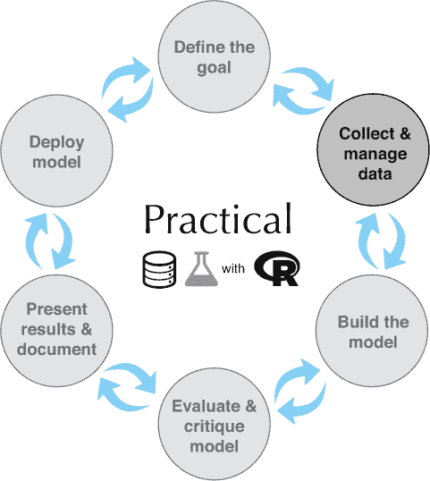

我们将展示使用基础 R、`data.table`和`dplyr`进行数据处理解决方案。^([1]) 每个都有其优势，这就是为什么我们展示了不止一个解决方案。在整个这本书中，我们故意采用多语言方法进行数据处理：混合基础 R、`data.table`和`dplyr`，以方便起见。每个系统都有其优势：

> ¹
> 
> 对于数据库任务，我们建议使用`dbplyr`或`rquery`，我们将在附录 A（../Text/A.xhtml#app01）中简要介绍。

+   ***基础 R—*** 这是在 R 中编写的代码，它直接使用 R 的内置功能操作`data.frame`。将复杂的转换分解为基础 R 原语可能是一个难题，但我们将在本章中为您提供解决这个难题的工具。

+   ***`data.table`—*** `data.table`是 R 中进行快速和内存高效数据处理的包。它与常规 R 语义的不同之处在于`data.table`使用*引用语义*，其中更改直接在共享数据结构（对所有引用同一结构可见）中进行，而不是 R 的更典型的*值语义*（在一个引用中做出的更改不会对其他引用可见）。`data.table`符号通过[]索引操作符的变体指定强大的转换，并在`help(data .table, package="data.table")`和`vignette("datatable-intro", package= "data.table")`中得到很好的解释。

+   ***`dplyr`—*** `dplyr`是一个流行的数据处理包，它强调通过一系列类似 SQL（或 Codd 风格）操作符的数据操作。`dplyr`通常不如`data.table`快（或空间效率高），但符号很方便。

在 R 中操作数据的良好起点是以下免费指南：

+   R 入门，`data.table`版本：[`eddelbuettel.github.io/gsir-te/Getting-Started-in-R.pdf`](https://eddelbuettel.github.io/gsir-te/Getting-Started-in-R.pdf)

+   R 入门，`tidyverse`版本：[`github.com/saghirb/Getting-Started-in-R`](https://github.com/saghirb/Getting-Started-in-R)

我们希望提高你编写 R 代码（将意图转化为实现）和阅读 R 代码（从现有代码中推断意图）的能力。为此，本章，就像这本书的大部分内容一样，被设计成一系列的工作示例。我们强烈鼓励你亲自尝试运行这些示例（它们在这里可用：[`github.com/WinVector/PDSwR2`](https://github.com/WinVector/PDSwR2)）。养成在编码之前规划（甚至绘制）数据转换的习惯是关键。在陷入编码细节之前，先明确你的意图。相信 R 中大多数常见的数据整理任务都有易于找到的方法，并假设你可以在需要时找到它们。原则是这样的：通过将你的数据转换成简单的“数据矩阵”格式来简化你的分析，其中每一行是一个观察值，每一列是一个测量类型。尽早解决像奇特的列名等问题，这样你就不必编写复杂的代码来绕过它们。

本章按所需的转换类型组织。为了多样化，我们将引入一些小型概念数据集，并花一点时间查看每个数据集。这种任务到示例的组织将快速介绍 R 中的数据转换。我们将涵盖的转换包括以下内容：

+   选择列的子集

+   选择行子集

+   重新排序行

+   创建新列

+   处理缺失值

+   通过行合并两个数据集

+   通过列合并两个数据集

+   合并两个数据集

+   聚合行

+   通用数据重塑（长格式与宽格式）

这个列表的目的是为你提供足够多的工具来完成大量任务。我们将从问题到解决方案进行工作。我们将展示哪个命令解决了给定问题，并将命令的语法细节留给 R 的帮助系统以及我们在本章中建议的指南和教程。请将本章视为数据整理的罗塞塔石碑：每个概念只解释一次，然后执行三次（通常是在基础 R、`data.table`和`dplyr`中）。

我们的第一个应用（选择行和列）将设定应用的一般模式，所以即使你已经自信地使用 R 进行数据选择，也值得阅读。

* * *

数据来源

在本章中，我们将使用小型、玩具大小的数据集来简化在转换前后检查数据的过程。我们强烈建议您与我们一同运行所有示例。所有示例要么是 R 自带的数据集，要么可以从本书的 GitHub 站点获取：[`github.com/WinVector/PDSwR2`](https://github.com/WinVector/PDSwR2)。此外，所有代码示例都可以在相同位置的`CodeExamples`中找到。我们建议克隆或下载此材料以帮助您使用本书。

* * *

关于 R 的内置示例的更多信息，请尝试使用命令 `help(datasets)`。

## 5.1\. 数据选择

本节涵盖了删除行、删除列、重新排序列、删除缺失数据和重新排序数据行。在大数据时代，你常常需要查看太多的数据，因此将你的数据限制在你需要的内容上可以大大加快你的工作速度。

### 5.1.1\. 选择行和列

在处理数据集时，选择行或列的子集是一个常见任务。

情境

在我们的第一个示例中，我们将使用`iris`数据集：测量三种鸢尾花物种的萼片长度和宽度以及花瓣长度和宽度。

首先，我们将查看一些数据方面的内容。我们建议始终这样做，并将其作为“关注数据”工作纪律的一部分。例如，图 5.2 显示了我们的示例 iris 的花瓣尺寸：

```
library("ggplot2")                                                     ❶

summary(iris)                                                          ❷
##   Sepal.Length    Sepal.Width     Petal.Length    Petal.Width
##  Min.   :4.300   Min.   :2.000   Min.   :1.000   Min.   :0.100
##  1st Qu.:5.100   1st Qu.:2.800   1st Qu.:1.600   1st Qu.:0.300
##  Median :5.800   Median :3.000   Median :4.350   Median :1.300
##  Mean   :5.843   Mean   :3.057   Mean   :3.758   Mean   :1.199
##  3rd Qu.:6.400   3rd Qu.:3.300   3rd Qu.:5.100   3rd Qu.:1.800
##  Max.   :7.900   Max.   :4.400   Max.   :6.900   Max.   :2.500
##
##        Species
##  setosa    :50
##  versicolor:50
##  virginica :50
```

❶ 将 ggplot2 包附加到后续绘图

❷ 查看内置的 iris 数据

图 5.2\. 番茄图示例


* * *

附加包

早期附加包是一个好习惯。如果一个包无法附加，请尝试使用如`install.packages("ggplot2")`之类的命令安装它。

* * *

```
head(iris)

##   Sepal.Length Sepal.Width Petal.Length Petal.Width Species
## 1          5.1         3.5          1.4         0.2  setosa
## 2          4.9         3.0          1.4         0.2  setosa
## 3          4.7         3.2          1.3         0.2  setosa
## 4          4.6         3.1          1.5         0.2  setosa
## 5          5.0         3.6          1.4         0.2  setosa
## 6          5.4         3.9          1.7         0.4  setosa

ggplot(iris,
       aes(x = Petal.Length, y = Petal.Width,
           shape = Species, color = Species)) +
  geom_point(size =2 ) +
  ggtitle("Petal dimensions by iris species: all measurements")
```

`iris`数据是 R 预安装的，并属于`datasets`包。我们将故意在本章中使用小型示例，以便更容易查看结果。

场景

*假设我们被分配生成一份关于仅包含花瓣长度和花瓣宽度，按 iris 物种分类的报告，对于花瓣长度大于 2 的 iris。为了完成这项任务，我们需要从数据框中选择列（变量）的子集或行的子集（实例）*。

列和行选择看起来像图 5.3。

图 5.3\. 选择列和行

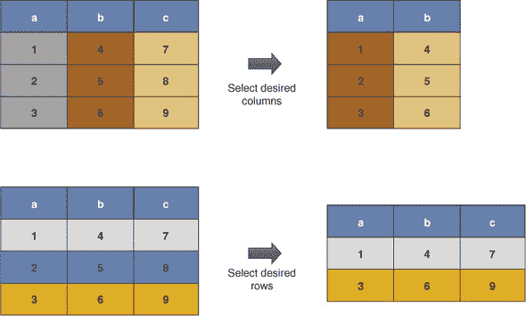

* * *

图表

本章中的图表旨在成为转换的助记卡通。我们建议在转换前后查看实际数据以获取数据转换所做的更多详细信息。我们还在解决完问题后再次审查它们，并注意它们如何抽象转换前后的数据排列。将这些图表视为转换的视觉索引。

* * *

解决方案 1：基础 R

基础 R 解决方案是通过使用`[,]`索引运算符来实现的。

* * *

drop = FALSE

When working with `[,]` always add a third argument `drop = FALSE` to get around the issue that the default behavior when selecting a single column from an R `data.frame` returns a vector and not a `data.frame` containing the column. In many cases, we know we have more than one column, and don’t strictly need the command. But it is good to get in the habit of adding this argument to avoid unpleasant surprises.

* * *

The solution strategy is this:

+   Get desired columns by name or column index in the second position of `[,]`.

+   Get desired rows by Boolean per-row selection in the first position of `[,]`.

```
columns_we_want <- c("Petal.Length", "Petal.Width", "Species")
rows_we_want <- iris$Petal.Length > 2

# before
head(iris)

##   Sepal.Length Sepal.Width Petal.Length Petal.Width Species
## 1          5.1         3.5          1.4         0.2  setosa
## 2          4.9         3.0          1.4         0.2  setosa
## 3          4.7         3.2          1.3         0.2  setosa
## 4          4.6         3.1          1.5         0.2  setosa
## 5          5.0         3.6          1.4         0.2  setosa
## 6          5.4         3.9          1.7         0.4  setosa

iris_base <- iris[rows_we_want, columns_we_want, drop = FALSE]

# after
head(iris_base)

##    Petal.Length Petal.Width    Species
## 51          4.7         1.4 versicolor
## 52          4.5         1.5 versicolor
## 53          4.9         1.5 versicolor
## 54          4.0         1.3 versicolor
## 55          4.6         1.5 versicolor
## 56          4.5         1.3 versicolor
```

Notice column selection is also a good way to reorder columns. An advantage of base R is it tends to be fast and has very stable APIs: code written this year in base R is most likely to work next year (`tidyverse` packages, unfortunately, tend to have less-stable APIs). The one disadvantage is that a few base R defaults are irritating. For example, we included the `drop=FALSE` notation to work around the fact that base R would return a `vector` instead of a `data.frame` if we tried to select only one column.

Solution 2: data.table

Row and column selection in `data.table` is performed similarly to base R. `data .table` uses a very powerful set of index notations. In this case, we use a `..` notation to tell `data.table` that we are using the second index position to specify column names (and not to specify calculations, as we will demonstrate later).

```
library("data.table")

iris_data.table <- as.data.table(iris)                                 ❶

columns_we_want <- c("Petal.Length", "Petal.Width", "Species")
rows_we_want <- iris_data.table$Petal.Length > 2

iris_data.table <- iris_data.table[rows_we_want , ..columns_we_want]   ❷

head(iris_data.table)

##    Petal.Length Petal.Width    Species
## 1:          4.7         1.4 versicolor
## 2:          4.5         1.5 versicolor
## 3:          4.9         1.5 versicolor
## 4:          4.0         1.3 versicolor
## 5:          4.6         1.5 versicolor
## 6:          4.5         1.3 versicolor
```

❶ Converts to data.table class to get data.table semantics

❷ The .. notation tells data.table that columns_we_want isn’t itself the name of a column but a variable referring to names of columns.

The advantage of `data.table` is that it is the fastest and most memory efficient solution for data wrangling in R at a wide range of scales. `data.table` has a very helpful FAQ, and there is a nice cheat sheet:

+   [`cran.r-project.org/web/packages/data.table/vignettes/datatable-faq.html`](https://cran.r-project.org/web/packages/data.table/vignettes/datatable-faq.html)

+   [`www.datacamp.com/community/tutorials/data-table-cheat-sheet`](https://www.datacamp.com/community/tutorials/data-table-cheat-sheet)

如果你在使用`data.table`的示例之后再来理解这两个概念，它们就会更加清晰。这些示例可以在 R 中使用命令`vignette("datatable-intro", package = "data.table")`获取。

Taking care when using data.table

`data.table` works like `data.frame`s for packages that are not `data.table`-aware. This means you can use `data.table`s with just about any package, even those that predate `data.table`. In a `data.table`-aware situation (using `data.table` at the command line, or using a package that depends on `data.table`), `data.table` implements slightly enhanced semantics. We show a quick example here:

```
library("data.table")

df <- data.frame(x = 1:2, y = 3:4)                              ❶

df[, x]                                                         ❷
## Error in `[.data.frame`(df, , x) : object 'x' not found

x <- "y"                                                        ❸
dt <- data.table(df)

dt[, x]                                                         ❹
## [1] 1 2

dt[, ..x]                                                       ❺
##    y
## 1: 3
## 2: 4
```

❶ Example data.frame

❷ Notice that writing df[, x] instead of df[, "x"] is an error (assuming x is not bound to a value in our environment).

❸ Sets up data.table example

❹ 注意这返回的列 x 与 d$x 非常相似。

❺ 这使用 data.table 的“查找”习语来获取由变量 x 引用的列的数据表。

解决方案 3：dplyr

`dplyr`解决方案是用选择和过滤来编写的：

+   使用`dplyr::select`来选择所需的列

+   使用`dplyr::filter`来选择所需的行

通常使用`magrittr`管道操作符`%>%`来链式调用`dplyr`步骤，但分配给临时变量同样有效。在这里教学时，我们将使用*显式点*表示法，其中数据管道被写作`iris %>% select(., column)`而不是更常见的隐式第一个参数表示法（`iris %>% select(column)`）。显式点表示法在第二章中已有讨论，也是以下 R 技巧的主题：[`www.win-vector.com/blog/2018/03/r-tip-make-arguments-explicit-in-magrittr-dplyr-pipelines/`](http://www.win-vector.com/blog/2018/03/r-tip-make-arguments-explicit-in-magrittr-dplyr-pipelines/).^([2])

> ²
> 
> 在`wrapr`包中可以找到一个强大的替代管道，称为*点箭头管道*（写作`%.>%`），它坚持使用显式点表示法并提供额外的功能。在这本书的大部分内容中，我们将坚持使用`magrittr`管道，但我们鼓励好奇的读者在自己的工作中检查`wrapr`管道。

```
library("dplyr")

iris_dplyr <- iris %>%
  select(.,
         Petal.Length, Petal.Width, Species) %>%
  filter(.,
         Petal.Length > 2)

head(iris_dplyr)

##   Petal.Length Petal.Width    Species
## 1          4.7         1.4 versicolor
## 2          4.5         1.5 versicolor
## 3          4.9         1.5 versicolor
## 4          4.0         1.3 versicolor
## 5          4.6         1.5 versicolor
## 6          4.5         1.3 versicolor
```

`dplyr`的优势在于强调数据处理作为一个分解为可见管道的操作序列。

可以从[`www.rstudio.com/wp-content/uploads/2015/02/data-wrangling-cheatsheet.pdf`](https://www.rstudio.com/wp-content/uploads/2015/02/data-wrangling-cheatsheet.pdf)获取一份关于`dplyr`的不错的速查表。速查表总是简明扼要的，所以你在尝试了一些示例之后，这份表格将会非常有用。

### 5.1.2\. 删除不完整数据记录

子集数据的一个重要变体是删除含有缺失值的行数据。我们还将讨论一些简单的策略，通过在行之间移动值（使用`na.locf()`）或在列之间移动值（称为*合并*）来替换缺失值.^([3])

> ³
> 
> 实际上，有一个完整的科学致力于填补缺失数据值的值。关于这个主题的一个好资源是[`CRAN.R-project.org/view=MissingData`](https://CRAN.R-project.org/view=MissingData)。

在本节中，我们将展示如何快速选择只有没有缺失数据或值的行。这只是一个例子；我们通常建议在现实世界的应用中使用第四章和第八章中提到的处理缺失值的方法。

情况

由于我们前面的例子没有缺失值，我们将转向另一个例子：具有不同特征的动物的睡眠时间 `msleep` 数据集。在这个数据集中，有几行有缺失值。本例的另一个目标是让你熟悉一些常见的实践数据集。这些是应该尝试新数据整理方法的数据库集。

首先，像往常一样，让我们看看数据：

```
library("ggplot2")
data(msleep)               ❶

str(msleep)

## Classes 'tbl_df', 'tbl' and 'data.frame':    83 obs. of  11 variables:
##  $ name        : chr  "Cheetah" "Owl monkey" "Mountain beaver" "Greater sh
     ort-tailed shrew" ...
##  $ genus       : chr  "Acinonyx" "Aotus" "Aplodontia" "Blarina" ...
##  $ vore        : chr  "carni" "omni" "herbi" "omni" ...
##  $ order       : chr  "Carnivora" "Primates" "Rodentia" "Soricomorpha" ...
##  $ conservation: chr  "lc" NA "nt" "lc" ...
##  $ sleep_total : num  12.1 17 14.4 14.9 4 14.4 8.7 7 10.1 3 ...
##  $ sleep_rem   : num  NA 1.8 2.4 2.3 0.7 2.2 1.4 NA 2.9 NA ...
##  $ sleep_cycle : num  NA NA NA 0.133 0.667 ...
##  $ awake       : num  11.9 7 9.6 9.1 20 9.6 15.3 17 13.9 21 ...
##  $ brainwt     : num  NA 0.0155 NA 0.00029 0.423 NA NA NA 0.07 0.0982 ...
##  $ bodywt      : num  50 0.48 1.35 0.019 600 ...

summary(msleep)

##      name              genus               vore
##  Length:83          Length:83          Length:83
##  Class :character   Class :character   Class :character
##  Mode  :character   Mode  :character   Mode  :character
##
##
##
##
##     order           conservation        sleep_total      sleep_rem
##  Length:83          Length:83          Min.   : 1.90   Min.   :0.100
##  Class :character   Class :character   1st Qu.: 7.85   1st Qu.:0.900
##  Mode  :character   Mode  :character   Median :10.10   Median :1.500
##                                        Mean   :10.43   Mean   :1.875
##                                        3rd Qu.:13.75   3rd Qu.:2.400
##                                        Max.   :19.90   Max.   :6.600
##                                                        NA's   :22
##   sleep_cycle         awake          brainwt            bodywt
##  Min.   :0.1167   Min.   : 4.10   Min.   :0.00014   Min.   :   0.005
##  1st Qu.:0.1833   1st Qu.:10.25   1st Qu.:0.00290   1st Qu.:   0.174
##  Median :0.3333   Median :13.90   Median :0.01240   Median :   1.670
##  Mean   :0.4396   Mean   :13.57   Mean   :0.28158   Mean   : 166.136
##  3rd Qu.:0.5792   3rd Qu.:16.15   3rd Qu.:0.12550   3rd Qu.:  41.750
##  Max.   :1.5000   Max.   :22.10   Max.   :5.71200   Max.   :6654.000
##  NA's   :51                       NA's   :27
```

❶ 将 ggplot2 包中的 msleep 复制到我们的工作空间

场景

我们被要求构建一个没有缺失值的 `msleep` 数据的提取。为了完成这个任务，我们将删除所有包含缺失值的行。转换的卡通图显示在图 5.4 中。

图 5.4\. 删除包含缺失值的行


Base R 解决方案

+   `complete.cases()` 返回一个向量，其中每个数据框的行都有一个条目，如果且仅当该行没有缺失条目时为 `TRUE`。一旦我们知道我们想要哪些行，就只是选择这些行（我们之前已经看到过）。

+   `na.omit()` 在一步中完成整个任务。

```
clean_base_1 <- msleep[complete.cases(msleep), , drop = FALSE]

summary(clean_base_1)

##      name              genus               vore
##  Length:20          Length:20          Length:20
##  Class :character   Class :character   Class :character
##  Mode  :character   Mode  :character   Mode  :character
##
##
##
##     order           conservation        sleep_total       sleep_rem
##  Length:20          Length:20          Min.   : 2.900   Min.   :0.600
##  Class :character   Class :character   1st Qu.: 8.925   1st Qu.:1.300
##  Mode  :character   Mode  :character   Median :11.300   Median :2.350
##                                        Mean   :11.225   Mean   :2.275
##                                        3rd Qu.:13.925   3rd Qu.:3.125
##                                        Max.   :19.700   Max.   :4.900
##   sleep_cycle         awake          brainwt            bodywt
##  Min.   :0.1167   Min.   : 4.30   Min.   :0.00014   Min.   :  0.0050
##  1st Qu.:0.1792   1st Qu.:10.07   1st Qu.:0.00115   1st Qu.:  0.0945
##  Median :0.2500   Median :12.70   Median :0.00590   Median :  0.7490
##  Mean   :0.3458   Mean   :12.78   Mean   :0.07882   Mean   : 72.1177
##  3rd Qu.:0.4167   3rd Qu.:15.07   3rd Qu.:0.03670   3rd Qu.:  6.1250
##  Max.   :1.0000   Max.   :21.10   Max.   :0.65500   Max.   :600.0000

nrow(clean_base_1)

## [1] 20

clean_base_2 = na.omit(msleep)
nrow(clean_base_2)

## [1] 20
```

data.table 解决方案

`complete.cases()` 解决方案也适用于 `data.table`：

```
library("data.table")

msleep_data.table <- as.data.table(msleep)

clean_data.table = msleep_data.table[complete.cases(msleep_data.table), ]

nrow(clean_data.table)

## [1] 20
```

dplyr 解决方案

`dplyr::filter` 也可以与 `complete.cases()` 一起使用。

使用 `magrittr` 管道符号，`.` 被认为是管道中的项目。因此，我们可以方便地多次使用 `.` 来引用我们的数据，例如告诉 `dplyr::filter` 使用数据作为要过滤的对象，并将其作为要传递给 `complete .cases()` 的对象。

```
library("dplyr")

clean_dplyr <- msleep %>%
filter(., complete.cases(.))

nrow(clean_dplyr)

## [1] 20
```

### 5.1.3\. 排序行

在本节中，我们想要排序或控制我们的数据行顺序。也许数据到达我们这里时未排序，或者排序的目的不是我们的。

场景

我们被要求构建按时间累积的销售总和，但数据到达我们这里时是乱序的：

```
purchases <- wrapr::build_frame(        ❶
    "day", "hour", "n_purchase" |
   1    , 9     , 5            |
   2    , 9     , 3            |
   2    , 11    , 5            |
   1    , 13    , 1            |
   2    , 13    , 3            |
   1    , 14    , 1            )
```

❶ 使用 wrapr::build_frame 直接以可读的列顺序输入数据

问题

按照日期和小时重新排序行，并计算运行总和。抽象图显示在图 5.5 中。

图 5.5\. 排序行

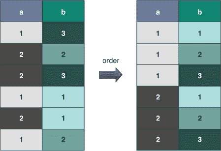

Base R 解决方案

```
order_index <- with(purchases, order(day, hour))                          ❶

purchases_ordered <- purchases[order_index, , drop = FALSE]
purchases_ordered$running_total <- cumsum(purchases_ordered$n_purchase)   ❷

purchases_ordered

##   day hour n_purchase running_total
## 1   1    9          5             5
## 4   1   13          1             6
## 6   1   14          1             7
## 2   2    9          3            10
## 3   2   11          5            15
## 5   2   13          3            18
```

❶ `with()` 函数执行其第二个参数中的代码，就像第一个参数的列是变量一样。这使得我们可以用 `x` 代替 `purchases_ordered$x`。

❷ 计算运行总和

data.table 解决方案

```
library("data.table")

DT_purchases <- as.data.table(purchases)

order_cols <- c("day", "hour")              ❶
setorderv(DT_purchases, order_cols)
DT_purchases[ , running_total := cumsum(n_purchase)]

# print(DT_purchases)
```

❶ 重新排序数据

* * *

:= 和 []

改变数据位置的操作（如 `:=`）会注释结果以抑制打印。这很重要，因为通常你正在处理大型结构，并且不希望中间数据打印出来。`[]` 是一个无操作，作为副作用恢复打印。

* * *

`setorderv()`就地重新排序数据，并接受一个排序列名的列表来指定顺序。这比基础 R 解决方案更方便，后者需要多个排序列作为多个参数。`wrapr::orderv()`试图通过允许用户使用列的列表（列值，而不是列名）来指定排序约束来弥合这一差距。

dplyr 解决方案

`dplyr`使用单词`arrange`来排序数据，并使用`mutate`来添加新列：

```
library("dplyr")

res <- purchases %>%
  arrange(., day, hour) %>%
  mutate(., running_total = cumsum(n_purchase))

# print(res)
```

高级排序使用

对于我们的高级示例，假设我们想要按日计算销售总额——也就是说，在每天的开始重置总和。

基础 R 解决方案

这是最简单的基于基础 R 的解决方案，采用拆分和重新组合策略：

```
order_index <- with(purchases, order(day, hour))                  ❶
purchases_ordered <- purchases[order_index, , drop = FALSE]

data_list <- split(purchases_ordered, purchases_ordered$day)      ❷

data_list <- lapply(                                              ❸
  data_list,
  function(di) {
    di$running_total <- cumsum(di$n_purchase)
    di
  })

purchases_ordered <- do.call(base::rbind, data_list)              ❹
rownames(purchases_ordered) <- NULL                               ❺

purchases_ordered

##   day hour n_purchase running_total
## 1   1    9          5             5
## 2   1   13          1             6
## 3   1   14          1             7
## 4   2    9          3             3
## 5   2   11          5             8
## 6   2   13          3            11
```

❶ 首先对数据进行排序

❷ 现在将数据拆分成一组组

❸ 对每个组应用 cumsum

❹ 将结果重新组合成一个单独的数据框

❺ R 通常在 rownames()中保留注释。在这种情况下，它存储了我们正在组装的各个部分的原始行号。当打印时，这可能会让用户困惑，因此，像我们在这里所做的那样，删除这些注释是良好的实践。

data.table 解决方案

`data.table`解决方案特别简洁。我们排序数据，然后告诉`data.table`使用`by`参数按组计算新的运行总和。分组是计算的性质，而不是数据的性质，这一想法与 SQL 类似，有助于最小化错误。

* * *

:= 与 =

在`data.table`中，`:=`表示“就地分配”——它用于更改或创建传入的`data.table`中的列。相反，`=`用于表示“创建新的`data.table`”，我们用`.()`符号包装这些类型的赋值，以避免列名与`data.table`的参数混淆。

* * *

```
library("data.table")

# new copy for result solution
DT_purchases <- as.data.table(purchases)[order(day, hour),
             .(hour = hour,
               n_purchase = n_purchase,
               running_total = cumsum(n_purchase)),
             by = "day"]                                          ❶
# print(DT_purchases)                                             ❷

# in-place solution
DT_purchases <- as.data.table(purchases)
order_cols <- c("day", "hour")
setorderv(DT_purchases, order_cols)
DT_purchases[ , running_total := cumsum(n_purchase), by = day]
# print(DT_purchases)                                             ❸

# don't reorder the actual data variation!
DT_purchases <- as.data.table(purchases)
DT_purchases[order(day, hour),
             `:=`(hour = hour,
               n_purchase = n_purchase,
               running_total = cumsum(n_purchase)),
             by = "day"]

# print(DT_purchases)                                             ❹
```

❶ 添加 by 关键字将计算转换为按组计算。

❷ 第一种解决方案：结果是数据的第二个副本。（=）符号。只有用于计算的列（如日期）和明确分配的列在结果中。

❸ 第二种解决方案：在分组计算之前对表进行排序，结果就地计算。

❹ 第三种解决方案：结果与原始表顺序相同，但累积总和是按排序表、计算分组运行总和然后返回到原始顺序的方式计算的。

* * *

`data.table`操作的排序

`data.table`操作的排序可以通过连续写入就地操作（就像我们在这些示例中所做的那样）或在一个关闭的`]`之后开始一个新的开放的``来创建新副本的操作（这称为*方法链*，相当于使用管道操作符）来实现。

* * *

dplyr 解决方案

`dplyr`解决方案之所以有效，是因为`mutate()`命令（我们将在下一节中讨论）如果数据已分组，则按组工作。我们可以使用`group_by()`命令使数据分组：

```
library("dplyr")

res <- purchases %>%
  arrange(., day, hour) %>%
  group_by(., day) %>%
  mutate(., running_total = cumsum(n_purchase)) %>%
  ungroup(.)

# print(res)
```

* * *

ungroup()

在 `dplyr` 中，当您完成对每个组操作的执行时，始终要取消分组您的数据。这是因为 `dplyr` 分组注释的存在可能会导致许多后续步骤计算出不期望和不正确的结果。我们建议即使在 `summarize()` 步骤之后也要这样做，因为 `summarize()` 会移除一个关键分组，使得代码读者不清楚数据是否仍然分组。

* * *

## 5.2\. 基本数据转换

本节介绍添加和重命名列。

### 5.2.1\. 添加新列

本节涵盖向数据框添加新变量（列）或对现有列应用转换（参见 [图 5.6）。

图 5.6\. 添加或修改列

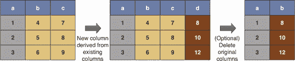

示例数据

对于我们的示例数据，我们将使用 1973 年的空气质量测量数据，其中包含缺失数据和非标准日期格式：

```
library("datasets")
library("ggplot2")

summary(airquality)

##      Ozone           Solar.R           Wind             Temp
##  Min.   :  1.00   Min.   :  7.0   Min.   : 1.700   Min.   :56.00
##  1st Qu.: 18.00   1st Qu.:115.8   1st Qu.: 7.400   1st Qu.:72.00
##  Median : 31.50   Median :205.0   Median : 9.700   Median :79.00
##  Mean   : 42.13   Mean   :185.9   Mean   : 9.958   Mean   :77.88
##  3rd Qu.: 63.25   3rd Qu.:258.8   3rd Qu.:11.500   3rd Qu.:85.00
##  Max.   :168.00   Max.   :334.0   Max.   :20.700   Max.   :97.00
##  NA's   :37       NA's   :7
##      Month            Day
##  Min.   :5.000   Min.   : 1.0
##  1st Qu.:6.000   1st Qu.: 8.0
##  Median :7.000   Median :16.0
##  Mean   :6.993   Mean   :15.8
##  3rd Qu.:8.000   3rd Qu.:23.0
##  Max.   :9.000   Max.   :31.0
##
```

场景

我们被要求将这种非标准的日期表示转换为一个新的、更有用的日期列，以便进行查询和绘图。

```
library("lubridate")
library("ggplot2")

# create a function to make the date string.
datestr = function(day, month, year) {
  paste(day, month, year, sep="-")
}
```

Base R 解决方案

在基础 R 中，我们通过赋值来创建新列：

```
airquality_with_date <- airquality                                    ❶

airquality_with_date$date <- with(airquality_with_date,               ❷
                                   dmy(datestr(Day, Month, 1973)))

airquality_with_date <- airquality_with_date[,                        ❸
                                              c("Ozone", "date"),
                                              drop = FALSE]

head(airquality_with_date)                                            ❹

##   Ozone       date
## 1    41 1973-05-01
## 2    36 1973-05-02
## 3    12 1973-05-03
## 4    18 1973-05-04
## 5    NA 1973-05-05
## 6    28 1973-05-06
ggplot(airquality_with_date, aes(x = date, y = Ozone)) +              ❺
  geom_point() +
  geom_line() +
  xlab("Date") +
  ggtitle("New York ozone readings, May 1 - Sept 30, 1973")
```

❶ 构建数据的副本

a

❷ 使用 with() 添加日期列，无需引用表名即可引用列

❸ 限制到感兴趣的列

❹ 显示结果

❺ 绘制结果

上述代码生成了 图 5.7。

图 5.7\. 臭氧图示例

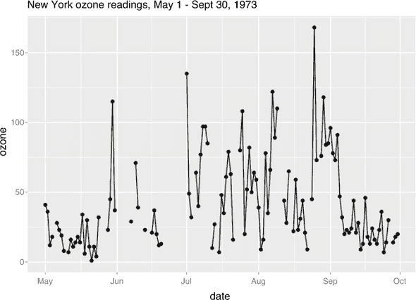

基础 R 已经有这些基本操作符的转换样式（或可管道化）版本了（只是没有管道！）。让我们再次以这种方式处理这个例子：

```
library("wrapr")                                                   ❶

airquality %.>%                                                    ❷
  transform(., date = dmy(datestr(Day, Month, 1973))) %.>%
  subset(., !is.na(Ozone), select =  c("Ozone", "date")) %.>%
  head(.)
##   Ozone       date
## 1    41 1973-05-01
## 2    36 1973-05-02
## 3    12 1973-05-03
## 4    18 1973-05-04
## 6    28 1973-05-06
## 7    23 1973-05-07
```

❶ 将 wrapr 包附加到定义 wrapr 点箭头管道：%.>%. 点箭头管道是另一个 R 管道，在 R 项目的期刊中有所描述，请参阅 [`journal.r-project.org/archive/2018/RJ-2018-042/index.html`](https://journal.r-project.org/archive/2018/RJ-2018-042/index.html)。

❷ 使用 transform() 和 subset() 重复所有步骤，并添加一个额外的步骤，过滤掉没有缺失臭氧值的行

data.table 解决方案

`data.table` 使用 `:=` 来显示“就地”发生的列更改或创建（当前 `data.table` 被更改，而不是创建一个新的）。

```
library("data.table")

DT_airquality <-
  as.data.table(airquality)[                       ❶
     , date := dmy(datestr(Day, Month, 1973)) ][   ❷
       , c("Ozone", "date")]                       ❸

head(DT_airquality)

##    Ozone       date
## 1:    41 1973-05-01
## 2:    36 1973-05-02
## 3:    12 1973-05-03
## 4:    18 1973-05-04
## 5:    NA 1973-05-05
## 6:    28 1973-05-06
```

❶ 构建数据的 data.table 副本

❷ 添加日期列

❸ 限制到感兴趣的列

注意到开放的 `[` 步骤如何大量地像管道一样工作，将一个 `data.table` 阶段连接到另一个。这是 `data.table` 在 `[]` 中放置许多操作的原因之一：在 R 中，`[]` 自然地按从左到右的顺序链式操作。

dplyr 解决方案

`dplyr` 用户会记得在 `dplyr` 中，新列是通过 `mutate()` 命令生成的：

```
library("dplyr")

airquality_with_date2 <- airquality %>%
  mutate(., date = dmy(datestr(Day, Month, 1973))) %>%
  select(., Ozone, date)

head(airquality_with_date2)

##   Ozone       date
## 1    41 1973-05-01
## 2    36 1973-05-02
## 3    12 1973-05-03
## 4    18 1973-05-04
## 5    NA 1973-05-05
## 6    28 1973-05-06
```

情景继续

注意原始臭氧图中的数据有孔，这是由于缺失值造成的。我们将尝试通过将最后已知的臭氧读数传播到有缺失值的日期来修复这个问题。这种“任务完成了……直到我们查看结果”的情况是数据科学的典型情况。所以总是要查看，并寻找问题。

在图 5.8 中展示了从列中较早的缺失值填充。

图 5.8\. 填充缺失值

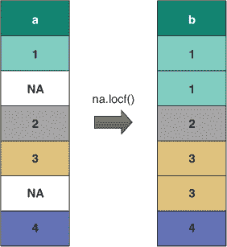

`zoo` 包提供了一个名为 `na.locf()` 的函数，该函数旨在解决我们的问题。我们现在将展示如何应用此函数。

基础 R 解决方案

```
library("zoo")

airquality_corrected <- airquality_with_date
airquality_corrected$OzoneCorrected <-
  na.locf(airquality_corrected$Ozone, na.rm = FALSE)

summary(airquality_corrected)

##      Ozone             date            OzoneCorrected
##  Min.   :  1.00   Min.   :1973-05-01   Min.   :  1.00
##  1st Qu.: 18.00   1st Qu.:1973-06-08   1st Qu.: 16.00
##  Median : 31.50   Median :1973-07-16   Median : 30.00
##  Mean   : 42.13   Mean   :1973-07-16   Mean   : 39.78
##  3rd Qu.: 63.25   3rd Qu.:1973-08-23   3rd Qu.: 52.00
##  Max.   :168.00   Max.   :1973-09-30   Max.   :168.00
##  NA's   :37

ggplot(airquality_corrected, aes(x = date, y = Ozone)) +
  geom_point(aes(y=Ozone)) +
  geom_line(aes(y=OzoneCorrected)) +
  ggtitle("New York ozone readings, May 1 - Sept 30, 1973",
          subtitle = "(corrected)") +
  xlab("Date")
```

这生成了 图 5.9。

图 5.9\. 再次展示臭氧图

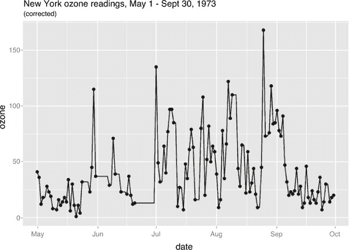

* * *

使用 na.rm = FALSE

总是使用 `na.rm = FALSE` 与 `na.locf()` 一起；否则，它可能会删除数据中的初始 `NA` 元素。

* * *

data.table 解决方案

```
library("data.table")
library("zoo")

DT_airquality[, OzoneCorrected := na.locf(Ozone, na.rm=FALSE)]

summary(DT_airquality)

##      Ozone             date            OzoneCorrected
##  Min.   :  1.00   Min.   :1973-05-01   Min.   :  1.00
##  1st Qu.: 18.00   1st Qu.:1973-06-08   1st Qu.: 16.00
##  Median : 31.50   Median :1973-07-16   Median : 30.00
##  Mean   : 42.13   Mean   :1973-07-16   Mean   : 39.78
##  3rd Qu.: 63.25   3rd Qu.:1973-08-23   3rd Qu.: 52.00
##  Max.   :168.00   Max.   :1973-09-30   Max.   :168.00
##  NA's   :37
```

注意 `data.table` 在 `DT_airquality` 中“就地”进行了修正，而不是生成一个新的 `data.frame`。

dplyr 解决方案

```
library("dplyr")
library("zoo")

airquality_with_date %>%
  mutate(.,
         OzoneCorrected = na.locf(Ozone, na.rm = FALSE)) %>%
  summary(.)

##      Ozone             date            OzoneCorrected
##  Min.   :  1.00   Min.   :1973-05-01   Min.   :  1.00
##  1st Qu.: 18.00   1st Qu.:1973-06-08   1st Qu.: 16.00
##  Median : 31.50   Median :1973-07-16   Median : 30.00
##  Mean   : 42.13   Mean   :1973-07-16   Mean   : 39.78
##  3rd Qu.: 63.25   3rd Qu.:1973-08-23   3rd Qu.: 52.00
##  Max.   :168.00   Max.   :1973-09-30   Max.   :168.00
##  NA's   :37
```

### 5.2.2\. 其他简单操作

在处理数据时，有许多常用的简单操作可用——特别是通过直接更改列名来重命名列，以及通过分配 `NULL` 来删除列。我们将简要展示这些操作：

```
d <- data.frame(x = 1:2, y = 3:4)
print(d)
#>   x y
#> 1 1 3
#> 2 2 4

colnames(d) <- c("BIGX", "BIGY")
print(d)
#>   BIGX BIGY
#> 1    1    3
#> 2    2    4

d$BIGX <- NULL
print(d)
#>   BIGY
#> 1    3
#> 2    4
```

## 5.3\. 聚合转换

本节涵盖了结合多行或多列的转换。

### 5.3.1\. 将多行合并为汇总行

在这里，我们处理了存在多个观察或测量值的情况，在这种情况下是鸢尾花的物种，我们希望将其聚合为单个观察值。

场景

我们被要求制作一份总结报告，总结鸢尾花花瓣按物种的分类。

问题

按类别汇总测量值，如图 5.10 所示。

图 5.10\. 聚合行

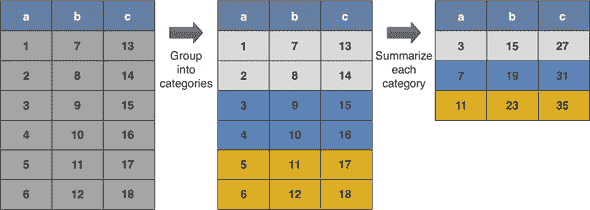

示例数据

再次，我们使用来自 `iris` 数据集的鸢尾花花瓣长度和宽度的测量值，按鸢尾花种类：

```
library("datasets")
library("ggplot2")

head(iris)

##   Sepal.Length Sepal.Width Petal.Length Petal.Width Species
## 1          5.1         3.5          1.4         0.2  setosa
## 2          4.9         3.0          1.4         0.2  setosa
## 3          4.7         3.2          1.3         0.2  setosa
## 4          4.6         3.1          1.5         0.2  setosa
## 5          5.0         3.6          1.4         0.2  setosa
## 6          5.4         3.9          1.7         0.4  setosa
```

基础 R 解决方案

```
iris_summary <- aggregate(
  cbind(Petal.Length, Petal.Width) ~ Species,
  data = iris,
  FUN = mean)

print(iris_summary)

#      Species Petal.Length Petal.Width
# 1     setosa        1.462       0.246
# 2 versicolor        4.260       1.326
# 3  virginica        5.552       2.026

library(ggplot2)
ggplot(mapping = aes(x = Petal.Length, y = Petal.Width,
                     shape = Species, color = Species)) +
  geom_point(data = iris, # raw data
             alpha = 0.5) +
  geom_point(data = iris_summary, # per-group summaries
             size = 5) +
  ggtitle("Average Petal dimensions by iris species\n(with raw data for refer
     ence)")
```

这生成了 图 5.11，一个新的带有分组平均值的鸢尾花图。

图 5.11\. 鸢尾花图

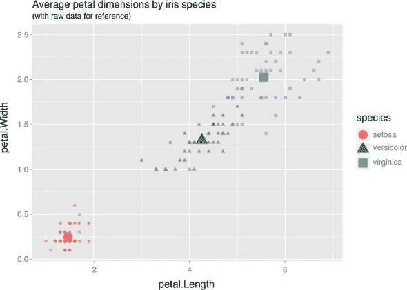

data.table 解决方案

```
library("data.table")

iris_data.table <- as.data.table(iris)
iris_data.table <- iris_data.table[,
                                   .(Petal.Length = mean(Petal.Length),
                                     Petal.Width = mean(Petal.Width)),
                                   by = .(Species)]

# print(iris_data.table)
```

dplyr 解决方案

+   `dplyr::group_by`

+   `dplyr::summarize`

+   一个单参数聚合函数，例如 `sum` 或 `mean`

```
library("dplyr")

iris_summary <- iris %>% group_by(., Species) %>%
  summarize(.,
            Petal.Length = mean(Petal.Length),
            Petal.Width = mean(Petal.Width)) %>%
  ungroup(.)

# print(iris_summary)
```

窗口函数

`data.table` 和 `dplyr` 都有前面操作的分组版本（类似于关系数据库中称为 *窗口函数* 的内容）。这允许每行包含每个组的汇总，而无需构建汇总表和连接（计算此类量的常用方法）。例如：

```
iris_copy <- iris
iris_copy$mean_Petal.Length <-
      ave(iris$Petal.Length, iris$Species, FUN = mean)
iris_copy$mean_Petal.Width <- ave(iris$Petal.Width, iris$Species, FUN = mean)

# head(iris_copy)
# tail(iris_copy)
```

在 `data.table` 中，任务看起来如下：

```
library("data.table")

iris_data.table <- as.data.table(iris)

iris_data.table[ ,
                 `:=`(mean_Petal.Length = mean(Petal.Length),
                      mean_Petal.Width = mean(Petal.Width)),
                 by = "Species"]

# print(iris_data.table)
```

请运行前面的代码并打印 `iris_data.table`，以查看计算出的平均值是按组计算的。

`dplyr` 有类似的功能：

```
library("dplyr")

iris_dplyr <- iris %>%
  group_by(., Species) %>%
  mutate(.,
         mean_Petal.Length = mean(Petal.Length),
         mean_Petal.Width = mean(Petal.Width)) %>%
  ungroup(.)

# head(iris_dplyr)
```

再次强调，在应用每个组的转换时，必须执行 `ungroup()`。此外，请注意，`dplyr` 分组操作（特别是通过 `filter()` 进行行选择）通常比未分组操作慢得多，因此您希望将 `group()`/ `ungroup()` 间隔尽可能缩短。并且通常 `dplyr` 分组操作比 `data.table` 分组操作慢。

## 5.4\. 多表数据转换

本节涵盖了多个表之间的操作。这包括拆分表、连接表和连接表的任务。

### 5.4.1\. 快速合并两个或多个有序数据框

在这里，我们讨论合并具有相同行数或列数（以及相同顺序）的两个数据框。一种更复杂但更通用的合并数据的方法在 5.4.2 节中演示。

场景

我们被要求从销售数据库中提取有关产品的信息并生成报告。通常，不同的事实（在本例中为价格和销售单位）存储在不同的表中，因此为了生成我们的报告，我们将不得不从多个表中组合数据。

例如，假设我们的示例数据如下：

```
productTable <- wrapr::build_frame(
   "productID", "price" |
   "p1"       , 9.99    |
   "p2"       , 16.29   |
   "p3"       , 19.99   |
   "p4"       , 5.49    |
   "p5"       , 24.49   )

salesTable <- wrapr::build_frame(
   "productID", "sold_store", "sold_online" |
   "p1"       , 6           , 64            |
   "p2"       , 31          , 1             |
   "p3"       , 30          , 23            |
   "p4"       , 31          , 67            |
   "p5"       , 43          , 51            )

productTable2 <- wrapr::build_frame(
   "productID", "price" |
   "n1"       , 25.49   |
   "n2"       , 33.99   |
   "n3"       , 17.99   )

productTable$productID <- factor(productTable$productID)
productTable2$productID <- factor(productTable2$productID)
```

问题 1：追加行

当两个表具有完全相同的列结构时，我们可以将它们连接起来以获得更大的表，如图 5.12 所示。

图 5.12\. 行合并

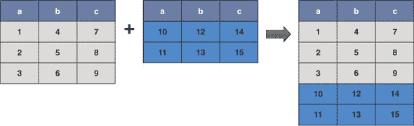

基础 R 解决方案

*`rbind`*

```
rbind_base = rbind(productTable,
                   productTable2)
```

注意到 `rbind` 在合并不兼容的因子变量时创建一个新的因子变量：

```
str(rbind_base)

## 'data.frame':    8 obs. of  2 variables:
##  $ productID: Factor w/ 8 levels "p1","p2","p3",..: 1 2 3 4 5 6 7 8
##  $ price    : num  9.99 16.29 19.99 5.49 24.49 ...
```

data.table 解决方案

```
library("data.table")

rbindlist(list(productTable,
               productTable2))

##    productID price
## 1:        p1  9.99
## 2:        p2 16.29
## 3:        p3 19.99
## 4:        p4  5.49
## 5:        p5 24.49
## 6:        n1 25.49
## 7:        n2 33.99
## 8:        n3 17.99
```

`data.table` 还正确合并因子类型。

dplyr 解决方案

*`dplyr::bind_rows`*

```
library("dplyr")

bind_rows(list(productTable,
               productTable2))

## Warning in bind_rows_(x, .id): Unequal factor levels: coercing to character

## Warning in bind_rows_(x, .id): binding character and factor vector,
## coercing into character vector

## Warning in bind_rows_(x, .id): binding character and factor vector,
## coercing into character vector

##   productID price
## 1        p1  9.99
## 2        p2 16.29
## 3        p3 19.99
## 4        p4  5.49
## 5        p5 24.49
## 6        n1 25.49
## 7        n2 33.99
## 8        n3 17.99
```

注意到 `bind_rows` 将不兼容的因子变量强制转换为字符。

问题 2：拆分表

行绑定（row binding）的逆操作是*拆分*。通过将数据框拆分为一系列数据框，然后对每个数据框进行操作，最后将它们重新绑定在一起，可以简化许多复杂的计算。`data.table` 中的实现是最好的，它有一些优先级（因为它是第一批之一）。`na.rm = FALSE` 仅模拟拆分和重组数据（因此通常非常快）。

基础 R 解决方案

```
# add an extra column telling us which table
# each row comes from
productTable_marked <- productTable
productTable_marked$table <- "productTable"
productTable2_marked <- productTable2
productTable2_marked$table <- "productTable2"

# combine the tables
rbind_base <- rbind(productTable_marked,
                    productTable2_marked)
rbind_base

##   productID price         table
## 1        p1  9.99  productTable
## 2        p2 16.29  productTable
## 3        p3 19.99  productTable
## 4        p4  5.49  productTable
## 5        p5 24.49  productTable
## 6        n1 25.49 productTable2
## 7        n2 33.99 productTable2
## 8        n3 17.99 productTable2

# split them apart
tables <- split(rbind_base, rbind_base$table)
tables

## $productTable
##   productID price        table
## 1        p1  9.99 productTable
## 2        p2 16.29 productTable
## 3        p3 19.99 productTable
## 4        p4  5.49 productTable
## 5        p5 24.49 productTable
##
## $productTable2
##   productID price         table
## 6        n1 25.49 productTable2
## 7        n2 33.99 productTable2
## 8        n3 17.99 productTable2
```

data.table 解决方案

`data.table` 将拆分、应用和重组步骤合并为一个单一且非常高效的运算。我们将继续使用 `rbind_base` 对象来展示其效果。`data.table` 愿意为每个数据组调用用户函数或执行用户表达式，并为每个组提供特殊变量以进行工作：

+   ***`.BY`—*** 一个命名列表，包含分组变量和每个组的值。.BY 是一个标量列表，因为根据定义，分组变量在每个组中不变化。

+   ***`.SD`—*** 给定组的行集的 `data.table` 表示，分组列已被移除。

例如，为了计算每个组的最大价格，我们可以执行以下操作：

```
library("data.table")

# convert to data.table
dt <- as.data.table(rbind_base)

# arbitrary user defined function
f <- function(.BY, .SD) {
  max(.SD$price)
}

# apply the function to each group
# and collect results
dt[ , max_price := f(.BY, .SD), by = table]

print(dt)

##    productID price         table max_price
## 1:        p1  9.99  productTable     24.49
## 2:        p2 16.29  productTable     24.49
## 3:        p3 19.99  productTable     24.49
## 4:        p4  5.49  productTable     24.49
## 5:        p5 24.49  productTable     24.49
## 6:        n1 25.49 productTable2     33.99
## 7:        n2 33.99 productTable2     33.99
## 8:        n3 17.99 productTable2     33.99
```

注意，前面的内容是一个强大的通用形式，对于这样一个简单的任务并不需要。通常通过命名列来实现简单的按组聚合值：

```
library("data.table")

dt <- as.data.table(rbind_base)
grouping_column <- "table"
dt[ , max_price := max(price), by = eval(grouping_column)]

print(dt)

##    productID price         table max_price
## 1:        p1  9.99  productTable     24.49
## 2:        p2 16.29  productTable     24.49
## 3:        p3 19.99  productTable     24.49
## 4:        p4  5.49  productTable     24.49
## 5:        p5 24.49  productTable     24.49
## 6:        n1 25.49 productTable2     33.99
## 7:        n2 33.99 productTable2     33.99
## 8:        n3 17.99 productTable2     33.99
```

在这个例子中，我们展示了如何通过变量选择的列进行分组。

dplyr 解决方案

`dplyr` 没有自己的分割实现。`dplyr` 尝试通过其 `group_by()` 符号来模拟在子表上工作。例如，要在 `dplyr` 中计算每个组的最大价格，我们会编写如下代码：

```
rbind_base %>%
  group_by(., table) %>%
  mutate(., max_price = max(price)) %>%
  ungroup(.)

## # A tibble: 8 x 4
##   productID price table         max_price
##   <fct>     <dbl> <chr>             <dbl>
## 1 p1         9.99 productTable       24.5
## 2 p2        16.3  productTable       24.5
## 3 p3        20.0  productTable       24.5
## 4 p4         5.49 productTable       24.5
## 5 p5        24.5  productTable       24.5
## 6 n1        25.5  productTable2      34.0
## 7 n2        34.0  productTable2      34.0
## 8 n3        18.0  productTable2      34.0
```

这将不会像为每个数据组调用任意函数那样强大。

问题 3：追加列

将数据框作为列追加到另一个数据框中。数据框必须具有相同数量的行和相同的行顺序（相对于我们认为是行键的内容）。这在图 5.13 中得到了说明。

图 5.13. 合并列

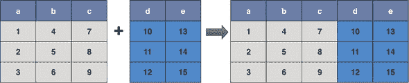

从 `productTable` 和 `salesTable` 创建一个产品信息表（价格和销售单位）。这假设产品在这两个表中按相同的顺序排序。如果它们不是，那么对它们进行排序，或者使用连接命令将表合并在一起（请参阅第 5.4.2 节）。

基础 R 解决方案

*`cbind`*

```
cbind(productTable, salesTable[, -1])

##   productID price sold_store sold_online
## 1        p1  9.99          6          64
## 2        p2 16.29         31           1
## 3        p3 19.99         30          23
## 4        p4  5.49         31          67
## 5        p5 24.49         43          51
```

data.table 解决方案

对于绑定列，`data.table` 方法要求数据已经为 `data.table` 类型。

```
library("data.table")

cbind(as.data.table(productTable),
      as.data.table(salesTable[, -1]))

##    productID price sold_store sold_online
## 1:        p1  9.99          6          64
## 2:        p2 16.29         31           1
## 3:        p3 19.99         30          23
## 4:        p4  5.49         31          67
## 5:        p5 24.49         43          51
```

dplyr 解决方案

*`dplyr::bind_cols`*

```
library("dplyr")

# list of data frames calling convention
dplyr::bind_cols(list(productTable, salesTable[, -1]))

##   productID price sold_store sold_online
## 1        p1  9.99          6          64
## 2        p2 16.29         31           1
## 3        p3 19.99         30          23
## 4        p4  5.49         31          67
## 5        p5 24.49         43          51
```

### 5.4.2. 从多个表中组合数据的主要方法

*连接*是关系数据库中合并两个表以创建第三个表的过程。连接的结果可能是一个表，它可能对于原始两个表中的每一对行都有一个新行（以及可能来自每个表没有匹配的其他表中的行）。行是通过键值匹配的，从一个表匹配到另一个表。最简单的情况是，每个表都有一组列，这些列可以唯一确定每一行（一个唯一键），这是我们在这里要讨论的情况。

场景

我们的示例数据是销售数据库中产品信息。各种事实（在这种情况下，价格和销售单位）存储在不同的表中。允许存在缺失值。我们的任务是组合这些表以生成报告。

首先，让我们设置一些示例数据：

```
productTable <- wrapr::build_frame(
   "productID", "price" |
   "p1"       , 9.99    |
   "p3"       , 19.99   |
   "p4"       , 5.49    |
   "p5"       , 24.49   )

salesTable <- wrapr::build_frame(
   "productID", "unitsSold" |
   "p1"       , 10          |
   "p2"       , 43          |
   "p3"       , 55          |
   "p4"       , 8           )
```

左连接

对于数据科学家来说，最重要的连接可能是*左连接*。这种连接保留左表中的每一行，并添加来自右表中匹配行的列。如果没有匹配的行，则用 `NA` 值替换。通常，你设计右表（连接命令的第二个参数）具有唯一的键；否则，行数可能会增加（左表不需要有唯一的键）。

该操作通常用于将来自第二个（或右）表的数据附加到第一个或左表的副本中，如图 5.14 所示。

图 5.14. 左连接

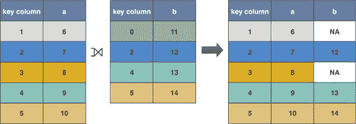

基础 R 解决方案

*`merge`函数，其中`all.x = TRUE`*

```
merge(productTable, salesTable, by = "productID", all.x = TRUE)

##   productID price unitsSold
## 1        p1  9.99        10
## 2        p3 19.99        55
## 3        p4  5.49         8
## 4        p5 24.49        NA
```

data.table 解决方案

```
library("data.table")

productTable_data.table <- as.data.table(productTable)
salesTable_data.table <- as.data.table(salesTable)

# index notation for join
# idea is rows are produced for each row inside the []
salesTable_data.table[productTable_data.table, on = "productID"]

##    productID unitsSold price
## 1:        p1        10  9.99
## 2:        p3        55 19.99
## 3:        p4         8  5.49
## 4:        p5        NA 24.49

# data.table also overrides merge()
merge(productTable, salesTable, by = "productID", all.x = TRUE)

##   productID price unitsSold
## 1        p1  9.99        10
## 2        p3 19.99        55
## 3        p4  5.49         8
## 4        p5 24.49        NA
```

Base R 索引解决方案

`data.table`索引表示法提醒我们，还有另一种非常好的 Base R 方法，即使用一个表向另一个表添加单个列：通过`match()`和`[]`方法进行向量化查找。

```
library("data.table")

joined_table <- productTable
joined_table$unitsSold <- salesTable$unitsSold[match(joined_table$productID,
salesTable$productID)]
print(joined_table)

##   productID price unitsSold
## 1        p1  9.99        10
## 2        p3 19.99        55
## 3        p4  5.49         8
## 4        p5 24.49        NA
```

`match()`找到了匹配的索引，`[]`使用这些索引检索数据。请参阅`help(match)`获取更多详细信息。

dplyr 解决方案

```
library("dplyr")

left_join(productTable, salesTable, by = "productID")

##   productID price unitsSold
## 1        p1  9.99        10
## 2        p3 19.99        55
## 3        p4  5.49         8
## 4        p5 24.49        NA
```

右连接

还有一种称为**右连接**的连接，它只是将左连接的参数反转。由于右连接与左连接非常相似，我们将省略任何右连接的示例。

内连接

在一个**内连接**中，你将两个表合并成一个单一的表，只保留两个表中都存在的键的行。这将产生两个表的交集，如图 5.15 所示。

图 5.15\. 内连接

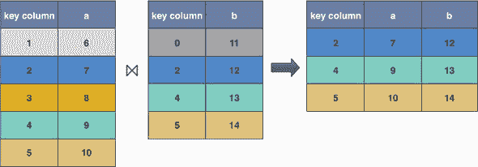

Base R 解决方案

*`merge`*

```
merge(productTable, salesTable, by = "productID")

##   productID price unitsSold
## 1        p1  9.99        10
## 2        p3 19.99        55
## 3        p4  5.49         8
```

data.table 解决方案

```
library("data.table")

productTable_data.table <- as.data.table(productTable)
salesTable_data.table <- as.data.table(salesTable)

merge(productTable, salesTable, by = "productID")

##   productID price unitsSold
## 1        p1  9.99        10
## 2        p3 19.99        55
## 3        p4  5.49         8
```

dplyr 解决方案

*`inner_join`*

```
library("dplyr")

inner_join(productTable, salesTable, by = "productID")

##   productID price unitsSold
## 1        p1  9.99        10
## 2        p3 19.99        55
## 3        p4  5.49         8
```

全连接

在一个**全连接**中，你将两个表合并成一个单一的表，保留所有键值对应的行。注意，在这里两个表具有相同的重要性。我们将在图 5.16 中展示结果。

图 5.16\. 全连接

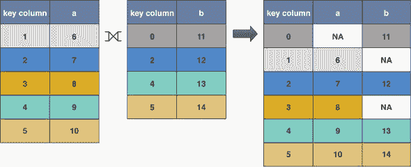

Base R 解决方案

*`merge`函数，其中`all=TRUE`*

```
# note that merge orders the result by key column by default
# use sort=FALSE to skip the sorting
merge(productTable, salesTable, by = "productID", all=TRUE)

##   productID price unitsSold
## 1        p1  9.99        10
## 2        p2    NA        43
## 3        p3 19.99        55
## 4        p4  5.49         8
## 5        p5 24.49        NA
```

data.table 解决方案

```
library("data.table")

productTable_data.table <- as.data.table(productTable)
salesTable_data.table <- as.data.table(salesTable)

merge(productTable_data.table, salesTable_data.table,
      by = "productID", all = TRUE)

##    productID price unitsSold
## 1:        p1  9.99        10
## 2:        p2    NA        43
## 3:        p3 19.99        55
## 4:        p4  5.49         8
## 5:        p5 24.49        NA
```

dplyr 解决方案

*`dplyr::full_join`*

```
library("dplyr")

full_join(productTable, salesTable, by = "productID")

##   productID price unitsSold
## 1        p1  9.99        10
## 2        p3 19.99        55
## 3        p4  5.49         8
## 4        p5 24.49        NA
## 5        p2    NA        43
```

一个更复杂的连接问题

我们到目前为止给出的示例没有使用行顺序。有些问题可以通过使用行顺序的方法解决得更加高效，例如`data.table`强大的滚动连接操作。

场景

你被提供了历史股票交易和报价（买入/卖出）数据。你被要求对股票数据进行以下分析：找出每次交易时的买入价和卖出价。这涉及到使用行顺序来表示时间，并在行之间共享信息。

示例数据

在股票市场中，*买入价*是某人声明的愿意支付的最高价格，而*卖出价*是某人声明的愿意以该价格出售股票的最低价格。买入价和卖出价数据称为*报价*，它们通常是不规则的时序数据（因为新的报价可以在任意时间形成，而不仅仅是定期间隔），如下面的示例所示：

```
library("data.table")

quotes <- data.table(
  bid = c(5, 5, 7, 8),
  ask = c(6, 6, 8, 10),
  bid_quantity = c(100, 100, 100, 100),
  ask_quantity = c(100, 100, 100, 100),
  when = as.POSIXct(strptime(
    c("2018-10-18 1:03:17",
      "2018-10-18 2:12:23",
      "2018-10-18 2:15:00",
      "2018-10-18 2:17:51"),
    "%Y-%m-%d %H:%M:%S")))

print(quotes)

##    bid ask bid_quantity ask_quantity                when
## 1:   5   6          100          100 2018-10-18 01:03:17
## 2:   5   6          100          100 2018-10-18 02:12:23
## 3:   7   8          100          100 2018-10-18 02:15:00
## 4:   8  10          100          100 2018-10-18 02:17:51
```

另一个不规则的时序数据是*交易*。这些是在特定时间以特定价格交换股票数量的事后报告。

```
trades <- data.table(
  trade_id = c(32525, 32526),
  price = c(5.5, 9),
  quantity = c(100, 200),
  when = as.POSIXct(strptime(
    c("2018-10-18 2:13:42",
      "2018-10-18 2:19:20"),
    "%Y-%m-%d %H:%M:%S")))

print(trades)

##    trade_id price quantity                when
## 1:    32525   5.5      100 2018-10-18 02:13:42
## 2:    32526   9.0      200 2018-10-18 02:19:20
```

滚动连接

`data.table`的滚动连接非常适合找到每个交易的最新报价信息。滚动连接是一种在有序列上的连接类型，它在我们查找时间点提供最新的可用数据。

```
quotes[, quote_time := when]
      trades[ , trade_time := when ]
      quotes[ trades, on = "when", roll = TRUE ][
        , .(quote_time, bid, price, ask, trade_id, trade_time) ]
##             quote_time bid price ask trade_id          trade_time
## 1: 2018-10-18 02:12:23   5   5.5   6    32525 2018-10-18 02:13:42
## 2: 2018-10-18 02:17:51   8   9.0  10    32526 2018-10-18 02:19:20
```

我们将前面的内容解读为“对于每一笔交易，查找相应的报价。”在连接中，`when`字段来自交易，这也是为什么我们添加了`quote_time`字段，以便我们也能看到报价是在何时建立的。`data.table`的滚动连接非常快，而且在基础 R、`SQL`或`dplyr`中也不容易高效地模拟。

滚动连接是`data.table`独有的。在 R 中，有许多任务，如匹配最新记录，可以很容易地表示为在行之间移动索引。然而，在 R 中，在行之间移动索引通常效率不高，因为它不能像列操作那样向量化。滚动连接是直接解决这类问题的方法，并且有一个高效的实现。

## 5.5\. 重新塑造转换

本节涵盖在行和列之间移动数据。这通常被称为*旋转*，这个名字来自 Pito Salas 的工作，它结合了数据汇总和形状转换。示例将在三个包中完成：`data.table`、`cdata`（它只重新塑造数据，不汇总数据）和`tidyr`。基础 R 确实有这些转换的符号（如`stack()`和`unstack()`），但包版本是显著更好的工具。

### 5.5.1\. 将数据从宽格式转换为长格式

我们将展示如何将所有测量值都在单行中的数据记录移动到一个新的记录集中，其中数据在多行中。我们称这种移动为从宽格式到窄或长格式。

数据示例

让我们以按月份测量的车辆驾驶员/乘客受伤或死亡的数据为例。数据还包括有关燃料价格以及法律是否要求使用安全带的信息。

本例的相关变量：

+   **`date`—** 测量年份和月份（数字表示）

+   **`DriversKilled`—** 被杀害的汽车驾驶员

+   **`front`—** 前排乘客死亡或严重受伤

+   **`rear`—** 后排乘客死亡或严重受伤

+   **`law`—** 安全带法律是否生效（0/1）

```
library("datasets")
library("xts")

# move the date index into a column
dates <- index(as.xts(time(Seatbelts)))
Seatbelts <- data.frame(Seatbelts)
Seatbelts$date <- dates

# restrict down to 1982 and 1983
Seatbelts <- Seatbelts[ (Seatbelts$date >= as.yearmon("Jan 1982")) &
                          (Seatbelts$date <= as.yearmon("Dec 1983")),
                           , drop = FALSE]
Seatbelts$date <- as.Date(Seatbelts$date)
# mark if the seatbelt law was in effect
Seatbelts$law <- ifelse(Seatbelts$law==1, "new law", "pre-law")
# limit down to the columns we want
Seatbelts <- Seatbelts[, c("date", "DriversKilled", "front", "rear", "law")]

head(Seatbelts)

##           date DriversKilled front rear     law
## 157 1982-01-01           115   595  238 pre-law
## 158 1982-02-01           104   673  285 pre-law
## 159 1982-03-01           131   660  324 pre-law
## 160 1982-04-01           108   676  346 pre-law
## 161 1982-05-01           103   755  410 pre-law
## 162 1982-06-01           115   815  411 pre-law
```

为了将我们的数据转换成可展示的格式，我们已经在本章前面的部分中描述了转换操作：选择行，选择列，添加新的派生列等等。现在数据中每行对应一个日期（我们将日期视为行键），并包含诸如在三个座位位置（驾驶员、前排、后排）中各有多少人死亡以及新的安全带法律是否生效等信息。

我们想看看新的安全带法律是否能够挽救生命。请注意，我们缺少一个关键信息：一个标准化因子，例如每日期的汽车拥有数量，按日期划分的驾驶人口规模，或每日期的总行驶里程（风险作为比率比作为绝对计数更有意义）。这是一个真正的数据科学是迭代过程的例子：我们将尽我们所能使用现有的数据，但在实际项目中，我们也会回到来源和合作伙伴那里，试图获取关键的缺失数据（或者至少是缺失数据的估计或代理）。

让我们根据法律绘制数据：

```
# let's give an example of the kind of graph we have in mind,
# using just driver deaths
library("ggplot2")

ggplot(Seatbelts,
       aes(x = date, y = DriversKilled, color = law, shape = law)) +
  geom_point() +
  geom_smooth(se=FALSE) +
  ggtitle("UK car driver deaths by month")
```

此代码生成了图 5.17。

图 5.17\. 乘客死亡图表

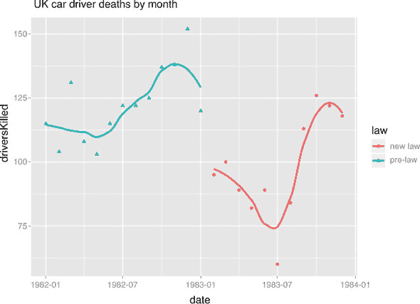

从图表来看，引入安全带法与死亡数的正常变化相比，死亡人数的下降是非平凡的。这也表明效果可能迅速逆转。

假设我们的后续问题是进一步将数据分解到座位位置（因为安全带类型根据座位位置有很大差异）。

要使用 `ggplot2` 制作此类图表，我们需要将数据从每行包含所有事实转换为每个座位位置一行。这是一个从宽或非规范化格式（机器学习任务的自然格式）到高或多行记录格式的转换示例。

问题

使用 `ggplot2` 根据日期和座位位置绘制死亡人数图表。`ggplot2` 要求数据以长格式而非宽格式。因此，我们将集中讨论如何执行此转换。我们称这种转换是将数据从面向行的记录移动到行块，如图 5.18 所示。

图 5.18\. 宽到高的转换


解决方案 1：data.table::melt.data.table()

我们可以用 `data.table::melt.data.table()` 解决这个问题。使用 `measure.vars` 参数指定原始表中要取值的列。使用 `variable.name`（新键列）和 `value.name`（新值列）参数指定在转换表中写入信息的列对。

```
library("data.table")

seatbelts_long2 <-
  melt.data.table(as.data.table(Seatbelts),
                  id.vars = NULL,
                  measure.vars = c("DriversKilled", "front", "rear"),
                  variable.name = "victim_type",
                  value.name = "nvictims")
```

这些新图表确实显示了一些更多信息：法律对后排乘客几乎没有影响。这可能是因为法律没有涵盖这些座位，或许执行后排座位遵守规定很困难，或者后排安全带可能是安全带（而不是三点式约束）并且效果不佳。最大的好处似乎是对前排乘客，这并不太奇怪，因为他们通常配备高质量的座椅安全带，并且不坐在方向盘前面（这是致命伤害的主要来源）。

解决方案 2：cdata::unpivot_to_blocks()

```
library("cdata")

seatbelts_long3 <- unpivot_to_blocks(
  Seatbelts,
  nameForNewKeyColumn = "victim_type",
  nameForNewValueColumn = "nvictims",
  columnsToTakeFrom = c("DriversKilled", "front", "rear 
"))
```

`cdata` 提供了简单的方法来一次性指定多个列的坐标转换。有关介绍，请参阅[`www.win-vector.com/blog/2018/10/faceted-graphs-with-cdata-and-ggplot2/`](http://www.win-vector.com/blog/2018/10/faceted-graphs-with-cdata-and-ggplot2/)。

我们鼓励您尝试所有三种解决方案，并确信它们产生等效的结果。我们更喜欢 `cdata` 解决方案，但它较新，不如 `data.table` 或 `tidyr` 解决方案知名。

解决方案 3：tidyr::gather()

```
library("tidyr")

seatbelts_long1 <- gather(
  Seatbelts,
  key = victim_type,
  value = nvictims,
  DriversKilled, front, rear)

head(seatbelts_long1)
##         date     law   victim_type nvictims
## 1 1982-01-01 pre-law DriversKilled      115
## 2 1982-02-01 pre-law DriversKilled      104
## 3 1982-03-01 pre-law DriversKilled      131
## 4 1982-04-01 pre-law DriversKilled      108
## 5 1982-05-01 pre-law DriversKilled      103
## 6 1982-06-01 pre-law DriversKilled      115

ggplot(seatbelts_long1,
       aes(x = date, y = nvictims, color = law, shape = law)) +
  geom_point() +
  geom_smooth(se=FALSE) +
  facet_wrap(~victim_type, ncol=1, scale="free_y") +
  ggtitle("UK auto fatalities by month and seating position")
```

我们现在有了按座位位置分组的乘客死亡数据，如图 5.19 所示。

图 5.19\. 分面乘客死亡图表

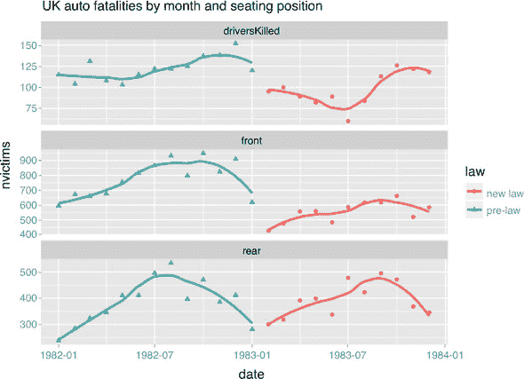

### 5.5.2\. 从高到宽的数据移动

我们得到了以日志风格提供的数据，其中每个测量的细节都写在单独的一行中。通俗地说，我们称这种形式为“高”或“瘦”数据形式（正式上，它与如 RDF 三元组这样的信息存储理念相关）。将数据转换为宽形式的过程非常类似于微软 Excel 用户所说的“旋转”，除了聚合（总和、平均值、计数）不是从高到宽形式转换的严格部分（我们建议在转换之前先进行聚合）。此外，从高到宽形式的转换当然是之前讨论的从宽到高形式转换的逆过程。

数据

对于我们的例子，我们从 R 的`datasets`包中取了`ChickWeight`数据。请尝试与本书一起使用这些命令，并采取额外步骤检查数据（使用`View()`、`head()`、`summary()`等命令）：

```
library("datasets")
library("data.table")
library("ggplot2")

ChickWeight <- data.frame(ChickWeight) # get rid of attributes
ChickWeight$Diet <- NULL # remove the diet label
# pad names with zeros
padz <- function(x, n=max(nchar(x))) gsub(" ", "0", formatC(x, width=n))
# append "Chick" to the chick ids
ChickWeight$Chick <- paste0("Chick", padz(as.character(ChickWeight$Chick)))

head(ChickWeight)

##   weight Time   Chick
## 1     42    0 Chick01
## 2     51    2 Chick01
## 3     59    4 Chick01
## 4     64    6 Chick01
## 5     76    8 Chick01
## 6     93   10 Chick01
```

这组数据组织得如此之好，以至于每一行都是关于给定时间给定小鸡的一个单一事实（重量）。这是一个非常容易产生和传输的格式，这也是为什么它在科学环境中很受欢迎。为了从数据中进行有趣的工作或从中学习，我们需要将数据带入更宽的结构。对于我们的问题，我们希望所有关于小鸡的重量事实都在一行中，时间作为新的列名。

在做那之前，让我们利用我们之前的一些课程来查看数据。我们可以聚合数据，从关于个体的信息转换到整体趋势。

```
# aggregate count and mean weight by time
ChickSummary <- as.data.table(ChickWeight)
ChickSummary <- ChickSummary[,
             .(count = .N,
               weight = mean(weight),
               q1_weight = quantile(weight, probs = 0.25),
               q2_weight = quantile(weight, probs = 0.75)),
             by = Time]
head(ChickSummary)

##    Time count    weight q1_weight q2_weight
## 1:    0    50  41.06000        41        42
## 2:    2    50  49.22000        48        51
## 3:    4    49  59.95918        57        63
## 4:    6    49  74.30612        68        80
## 5:    8    49  91.24490        83       102
## 6:   10    49 107.83673        93       124
```

在`ChickSummary`中，唯一的关键是`Time`（由`data.tableby`参数指定），现在我们可以看到在给定时间存活的小鸡数量以及给定时间存活小鸡重量的分布。

我们可以将这个表格以图形方式呈现。要使用`ggplot2`来完成此操作，我们需要将汇总数据移动到高形式（因为`ggplot2`更喜欢与高数据一起工作）。我们使用`cdata::unpivot_to_blocks:`。

```
library("ggplot2")

ChickSummary <- cdata::unpivot_to_blocks(                                ❶
   ChickSummary,
  nameForNewKeyColumn = "measurement",
  nameForNewValueColumn = "value",
  columnsToTakeFrom = c("count", "weight"))

ChickSummary$q1_weight[ChickSummary$measurement=="count"] <- NA          ❷
 ChickSummary$q2_weight[ChickSummary$measurement=="count"] <- NA
CW <- ChickWeight
CW$measurement <- "weight"

ggplot(ChickSummary, aes(x = Time, y = value, color = measurement)) +    ❸
   geom_line(data = CW, aes(x = Time, y = weight, group = Chick),
            color="LightGray") +
  geom_line(size=2) +
  geom_ribbon(aes(ymin = q1_weight, ymax = q2_weight),
              alpha = 0.3, colour = NA) +
  facet_wrap(~measurement, ncol=1, scales = "free_y") +
  theme(legend.position = "none") +
  ylab(NULL) +
  ggtitle("Chick Weight and Count Measurements by Time",
          subtitle = "25% through 75% quartiles of weight shown shaded around
      mean")
```

❶ 将数据从宽形式转换为高形式以进行绘图

❷ 确保我们有用于绘图的所需列的准确集合

❸ 绘制图表

这为小鸡提供了按时间和小鸡组织起来的重量，如图图 5.20 所示。

图 5.20\. 随时间变化的小鸡数量和重量

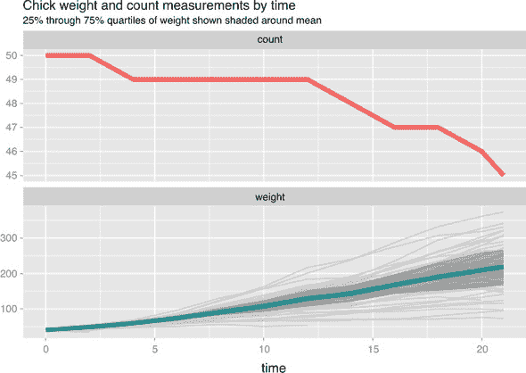

在这里，我们将存活小鸡的总数作为时间的函数绘制出来，以及每个个体检查的重量轨迹，以及总结统计（平均重量和 25%至 75%的四分位数）。

问题

我们现在可以回到本节示例任务：将每个小鸡的所有信息放入一行中。

图形上，它看起来如下：一列的（meastype）值用作新的列标题，第二列（meas）提供值。我们称这种将数据从块移动到宽行记录的过程，如图图 5.21 所示。

图 5.21\. 从高到宽形式转换

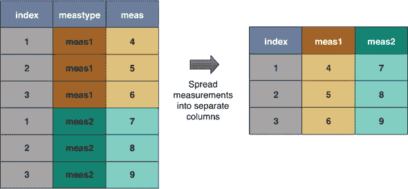

解决方案 1：data.table::dcast.data.table()

要使用 `dcast.data.table()` 将数据移动到宽格式，我们使用带有 `~` 符号的公式指定结果矩阵的行和列。然后我们通过 `value.var` 参数说明如何填充这个矩阵的单元格。在我们的例子中，为了得到一个每只小鸡一行、每段时间一列，单元格中是重量的数据框，我们使用以下步骤：

```
library("data.table")

ChickWeight_wide2 <- dcast.data.table(
  as.data.table(ChickWeight),
  Chick ~ Time,
  value.var = "weight")
```

这个表是一个矩阵，行由小鸡标识，列是时间。单元格包含给定小鸡和时间的重量（如果小鸡没有存活到给定时间，则为 `NA`）。请注意，这种格式更容易阅读，可能需要用于报告。

`data.table` 对 `dcast` 的实现还允许更强大的转换，例如同时进行变量铸造和聚合。

解决方案 2：cdata::pivot_to_rowrecs()

`cdata::pivot_to_rowrecs()` 通过行键、从列中获取新列键的列和从列中获取值的列来描述预期的表：

```
library("cdata")

ChickWeight_wide3 <- pivot_to_rowrecs(
  ChickWeight,
  columnToTakeKeysFrom = "Time",
  columnToTakeValuesFrom = "weight",
  rowKeyColumns = "Chick")
```

解决方案 3：tidyr::spread()

```
library("tidyr")

ChickWeight_wide1 <- spread(ChickWeight,
                            key = Time,
                            value = weight)

head(ChickWeight_wide1)

##     Chick  0  2  4  6  8  10  12  14  16  18  20  21
## 1 Chick01 42 51 59 64 76  93 106 125 149 171 199 205
## 2 Chick02 40 49 58 72 84 103 122 138 162 187 209 215
## 3 Chick03 43 39 55 67 84  99 115 138 163 187 198 202
## 4 Chick04 42 49 56 67 74  87 102 108 136 154 160 157
## 5 Chick05 41 42 48 60 79 106 141 164 197 199 220 223
## 6 Chick06 41 49 59 74 97 124 141 148 155 160 160 157
```

### 5.5.3. 数据坐标

数据转换有很多细节。需要保留的重要概念是：数据有坐标，例如表名、列名和行标识符。坐标的确切指定方式是实现细节，需要克服或转换为方便的状态。所有这些都是 Codd 数据库设计第二规则的后果：“关系数据库中的每个原子值（数据项）都保证可以通过表名、主键值和列名的组合来逻辑访问。”^([4]) 我们希望您已经学到的是：坐标（或访问计划）的哪些部分是表名，与行键、列名相比，是一个可更改的实现细节。

> ⁴
> 
> 查看 [`en.wikipedia.org/wiki/Edgar_F._Codd`](https://en.wikipedia.org/wiki/Edgar_F._Codd)。

* * *

倾向于使用简单的代码

早期构建临时表、添加列和更正列名要比有复杂的分析代码好得多。这遵循了 Raymond 的“表示规则”。

Raymond 的“表示规则”

* * *

> *将知识融入数据，使程序逻辑可以简单且健壮。*
> 
> *《Unix 编程艺术》，Erick S. Raymond，Addison-Wesley，2003*

我们建议您尽早转换数据以解决问题（更正列名、更改数据布局），以便使后续步骤更容易。您应该尝试转换为用于预测建模的格式，数据库设计者称之为*非规范化形式*，统计学家称之为*多元数据矩阵*或*模型矩阵*：一个常规数组，其中行是个人，列是可能的观测值.^([5])

> ⁵
> 
> 查看 W. J. Krzanowski 和 F. H. C. Marriott 的 *多元分析，第一部分*，Edward Arnold，1994。

对此感兴趣的读者可能希望深入了解`cdata`强大的数据布局图示系统，该系统正在被广泛采用，并在此处讨论：[`github.com/WinVector/cdata`](https://github.com/WinVector/cdata)。

## 摘要

在本章中，我们处理了用于分析和展示的基本转换数据示例。

到目前为止，我们已经处理了大量的数据转换。自然要问的问题是：这些转换是否足够？我们能否快速将任何任务分解成一系列这些转换？

答案是“不，也不”。有一些更专业的转换，如“滚动窗口”函数和其他时间序列操作，难以用这些转换来表示，但在 R 和`data.table`中确实有它们自己的高效实现。然而，对于“是”的答案，有很好的理由认为我们学到的转换集是相当全面的。基本的操作转换几乎涵盖了 Edgar F. Codd 的关系代数：自 1970 年以来一直在推动数据工程的一系列转换。

在本章中，您已经学到了

+   如何使用强大的数据重塑转换目录

+   如何应用这些转换来解决数据组织问题

在本书的第二部分中，我们将讨论构建和评估模型的过程，以满足您所设定的目标。
