# 第六章：选择和评估模型

本章涵盖

+   将商业问题映射到机器学习任务

+   评估模型质量

+   解释模型预测

在本章中，我们将讨论建模过程（图 6.1）。在深入探讨特定机器学习方法的细节之前，我们先讨论这个过程，因为本章讨论的主题适用于任何类型的模型。首先，让我们讨论选择合适的模型方法。

图 6.1\. 心理模型


## 6.1\. 将问题映射到机器学习任务

作为数据科学家，您的任务是将商业问题映射到一个好的机器学习方法。让我们看看一个现实世界的情况。假设您是一家在线零售公司的数据科学家。您的团队可能会被要求解决以下一些商业问题：

+   根据历史交易预测客户可能会购买的商品

+   识别欺诈交易

+   确定各种产品或产品类别的价格弹性（价格上升导致销售下降的比率，反之亦然）

+   确定当客户搜索商品时展示产品列表的最佳方式

+   客户细分：将具有相似购买行为的客户分组

+   AdWord 估值：公司在搜索引擎上购买特定 AdWords 应花费的金额

+   评估营销活动

+   将新产品组织到产品目录中

您对模型的预期用途将对您应使用的方法有很大影响。如果您想知道输入变量的微小变化如何影响结果，那么您可能想使用回归方法。如果您想知道哪个单一变量驱动了分类的大部分，那么决策树可能是一个不错的选择。此外，每个商业问题都建议尝试一种统计方法。为了讨论的目的，我们将数据科学家通常解决的问题的不同类型分组到以下类别中：

+   ***分类—*** 将标签分配给数据

+   ***评分—*** 将数值分配给数据

+   ***分组—*** 在数据中发现模式和共性

在本节中，我们将描述这些问题类别，并列出针对每个类别的典型方法。

### 6.1.1\. 分类问题

让我们尝试以下示例。

* * *

示例

*假设您的任务是自动化将新产品分配到您公司的产品类别中，如图 6.2 所示。*

* * *

图 6.2\. 将产品分配到产品类别

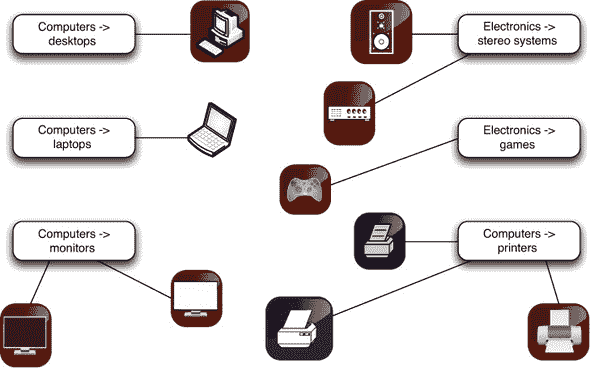

这可能比听起来更复杂。来自不同来源的产品可能有它们自己的产品分类，这与你在零售网站上使用的分类不一致，或者它们可能没有任何分类。许多大型在线零售商使用由人类标签员组成的团队手动分类他们的产品。这不仅劳动密集，而且不一致且容易出错。自动化是一个吸引人的选择；它节省劳动力，并且可以提高零售网站的质量。

基于产品属性和/或产品文本描述的产品分类是*分类*的一个例子：决定如何将（已知的）标签分配给一个对象。分类本身是所谓*监督学习*的一个例子：为了学习如何分类对象，你需要一个已经分类的对象数据集（称为*训练集*）。构建训练数据是大多数分类任务的主要开销，尤其是与文本相关的任务。

* * *

**多类别与二类别分类**

产品分类是*多类别*或*多项式*分类的一个例子。大多数分类问题和大多数分类算法都是针对二类别，或二项式，分类专门化的。有一些技巧可以使用二进制分类器来解决多类别问题（例如，为每个类别构建一个分类器，称为*一对余*分类器）。但在大多数情况下，找到合适的多类别实现是值得努力的，因为它们往往比多个二进制分类器工作得更好（例如，使用`mlogit`包而不是基础方法`glm()`进行逻辑回归）。

* * *

本书将涵盖的常见分类方法包括逻辑回归（带有阈值）和决策树集成。

### 6.1.2\. 评分问题

评分可以解释如下。

* * *

示例

*假设你的任务是帮助评估不同的营销活动如何增加对网站有价值的流量。目标是不仅吸引更多的人到网站上，还要吸引更多购买的人。*

* * *

在这种情况下，你可能需要考虑许多不同的因素：沟通渠道（网站上的广告、YouTube 视频、印刷媒体、电子邮件等）；流量来源（Facebook、Google、电台等）；目标受众；一年中的时间，等等。你想要衡量这些因素是否增加了销售额，以及增加了多少。

根据这些因素预测特定营销活动带来的销售额增加是*回归*或*评分*的一个例子。在这种情况下，回归模型将测量的不同因素映射到一个数值：销售额，或从某个基线开始的销售额增加。

预测事件（如属于某个给定类别）的概率也可以被认为是评分。例如，您可能会将欺诈检测视为分类：这个事件是欺诈还是不是？然而，如果您试图估计事件是欺诈的概率，这可以被认为是评分。这如图 图 6.3 所示。评分也是监督学习的一个实例。

图 6.3\. 确定交易欺诈概率的概念示例

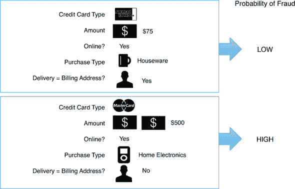

### 6.1.3\. 分组：在没有已知目标的情况下工作

前面的方法要求您有一个已知结果的训练数据集。在某些情况下，您可能还没有（或尚未）想要预测的具体结果。相反，您可能正在寻找数据中的模式和关系，这将帮助您更好地了解您的客户或您的业务。

这些情况对应于一类称为 *无监督学习* 的方法：无监督学习的目标不是基于输入预测输出，而是发现数据中的相似性和关系。一些常见的无监督任务包括以下这些：

+   ***聚类——*** 将相似对象分组在一起

+   ***关联规则——*** 发现常见的购买模式，例如，总是一起购买的商品，或者总是一起借出的图书馆书籍

让我们进一步探讨这两种无监督方法。

何时使用基本聚类

一个好的聚类示例如下。

* * *

示例

*假设您想将客户分成具有相似购买模式的通用人群类别。您可能事先不知道这些群体应该是什么。*

* * *

这个问题非常适合使用 *k-means 聚类*。k-means 聚类是一种将数据分组的方法，使得同一组内的成员彼此之间比与其他组成员更相似。

假设您发现（如图 图 6.4 所示），您的客户分为有小孩的群体，他们购买更多家庭导向的产品，以及没有小孩或成年子女的群体，他们购买更多休闲和社会活动相关的产品。一旦您将客户分配到这些群体之一，您就可以对他们的一般行为做出概括性陈述。例如，有小孩的客户群体可能对促销耐用的吸引人玻璃器皿的反应更为积极，而不是对精美水晶酒杯的促销。

图 6.4\. 根据购买模式和购买金额对客户进行聚类的概念示例

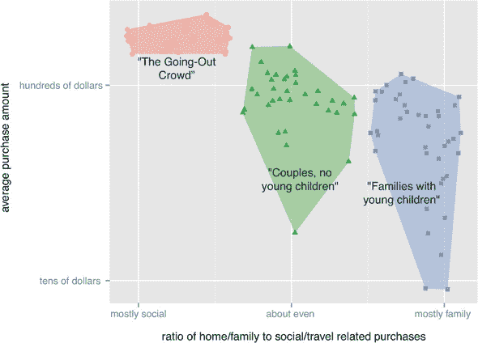

我们将在 第 9.1 节 中更详细地介绍 k-means 和其他聚类方法。

何时使用关联规则

你可能对直接确定哪些产品倾向于一起购买感兴趣。例如，你可能发现泳装和太阳镜经常一起购买，或者购买某些文化电影（如《Repo Man》）的人通常会同时购买电影原声带。

这是对关联规则（甚至推荐系统）的良好应用。你可以挖掘有用的产品推荐：每当观察到有人将泳装放入购物车时，你还可以推荐防晒霜。这如图 6.5 所示。我们将在第 9.2 节中介绍用于发现关联规则的 Apriori 算法。

图 6.5。在数据中寻找购买模式的概念示例

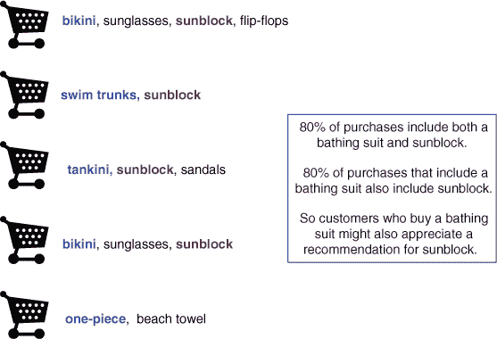

### 6.1.4. 问题到方法的映射

总结前面的内容，表 6.1 将一些典型的商业问题映射到相应的机器学习任务。

表 6.1。从问题到方法

| 示例任务 | 机器学习术语 |
| --- | --- |
| 识别垃圾邮件 在产品目录中排序产品 识别即将违约的贷款 将客户分配到现有的客户群组 | *分类*—将已知的标签分配给对象。分类是一种监督方法，因此你需要预分类的数据来训练模型。 |
| 预测 AdWords 的价值 估计贷款违约的概率 预测营销活动将增加多少流量或销售额 基于过去拍卖的类似产品的最终价格预测拍卖物品的最终价格 | *回归*—预测或预测数值。回归也是一种监督方法，因此你需要已知输出的数据来训练模型。 |
| 寻找一起购买的产品 识别在同一会话中经常访问的网页 识别成功的（经常点击的）网页和 AdWords 的组合 | *关联规则*—寻找在数据中倾向于一起出现的对象。关联规则是一种无监督方法；你不需要已知关系的现有数据，而是试图发现数据中的关系。 |
| 识别具有相同购买模式的客户群体 识别在相同地区或具有相同客户群组的流行产品群体 识别讨论类似事件的新闻条目 | *聚类*—找到彼此之间比其他组中的对象更相似的物体组。聚类也是一种无监督方法；你不需要预分组的数据，而是试图发现数据中的分组。 |

* * *

**预测与预测**

在日常用语中，我们倾向于将*预测*和*预测*这两个词互换使用。技术上，预测是选择一个结果，例如“明天会下雨”，而预测是分配一个概率：“有 80%的可能性明天会下雨。”对于不平衡类别应用（如预测信用违约），这种区别很重要。考虑建模贷款违约的情况，并假设整体违约率为 5%。识别一个违约率为 30%的群体是不准确的预测（你不知道群体中谁会违约，群体中的大多数人不会违约），但可能是一个非常有用的预测（这个群体的违约率是整体率的六倍）。

* * *

## 6.2. 评估模型

在构建模型时，你必须能够估计模型质量，以确保你的模型在现实世界中表现良好。为了尝试估计未来的模型性能，我们通常将数据分为训练数据和测试数据，如图 6.6 所示。[测试数据]是在训练期间未使用的数据，目的是让我们对模型在新数据上的表现有一些经验。

图 6.6. 模型构建和评估示意图

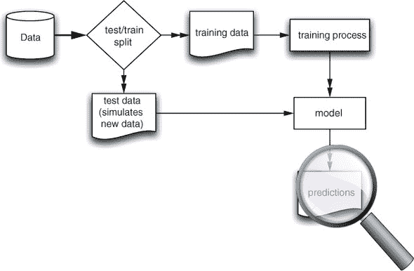

测试集可以帮助你识别的一件事是*过度拟合*：构建一个记住训练数据的模型，并且对新数据泛化不好。许多建模问题都与过度拟合有关，寻找过度拟合的迹象是诊断模型的好第一步。

### 6.2.1. 过度拟合

过度拟合的模型在训练数据上看起来很棒，但在新数据上的表现却很差。模型在它训练的数据上的预测误差被称为*训练误差*。模型在新数据上的预测误差被称为*泛化误差*。通常，训练误差会小于泛化误差（这并不令人惊讶）。然而，理想情况下，这两个误差率应该很接近。如果泛化误差很大，并且你的模型测试性能不佳，那么你的模型可能已经*过度拟合*——它记住了训练数据而不是发现可泛化的规则或模式。你希望通过（尽可能）选择更简单的模型来避免过度拟合，因为这些模型实际上往往能更好地泛化。¹ 图 6.7 展示了合理模型和过度拟合模型的典型外观。

> ¹
> 
> 防止过度拟合的其他技术包括正则化（偏好模型变量的小效应）和袋装法（平均不同的模型以减少方差）。

图 6.7. 过度拟合的概念性插图


一个过于复杂和过度拟合的模型至少有两个缺点。首先，过度拟合的模型可能比任何有用的模型都要复杂得多。例如，图 6.7 中过度拟合部分的额外波动可能会使相对于*x*的优化变得毫无必要地困难。此外，正如我们提到的，过度拟合的模型在生产中的准确性通常低于训练期间，这很尴尬。

在保留数据上进行测试

在第 4.3.1 节中，我们介绍了将数据分为测试-训练或测试-训练-校准集的想法，如图 6.8 所示。在这里，我们将更详细地讨论为什么您想要以这种方式分割数据。

图 6.8. 将数据分割为训练和测试（或训练、校准和测试）集

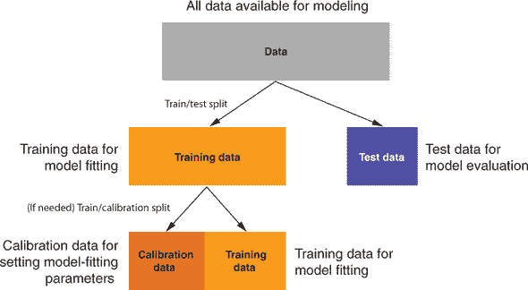

* * *

示例

*假设您正在构建基于汽车各种特征的模型来预测二手车价格。您拟合了一个线性回归模型和一个随机森林模型，并且您希望比较这两个模型。*^([2])

> ²
> 
> 这两种建模技术将在本书的后续章节中介绍。

* * *

如果您没有分割数据，而是使用所有可用数据来训练和评估每个模型，那么您可能会认为您将选择更好的模型，因为模型评估已经看到了更多的数据。然而，用于构建模型的数据并不是评估模型性能的最佳数据。这是因为在这组数据中存在乐观的*测量偏差*，因为在这组数据中看到了模型构建过程。模型构建是优化您的性能度量（或者至少与您的性能度量相关的东西），因此您往往会得到训练数据上性能的夸张估计。

此外，数据科学家自然倾向于调整他们的模型以获得最佳性能。这也导致了性能的过度评估。这通常被称为*多重比较偏差*。而且，由于这种调整可能有时会利用训练数据中的怪癖，它可能导致过度拟合。

对于这种乐观偏差的一个推荐预防措施是将您可用的数据分为测试和训练集。仅在训练数据上执行所有您聪明的工作，并尽可能晚地测量您相对于测试数据的性能（因为您在看到测试或保留性能后所做的所有选择都会引入建模偏差）。我们希望尽可能长时间地保持测试数据保密，这就是我们通常实际上将数据分为训练、校准和测试集的原因（我们将在第 8.2.1 节中演示）。

当你对数据进行分区时，你希望平衡保持足够的数据以拟合良好模型和保留足够的数据以对模型性能进行良好估计之间的权衡。一些常见的分割比例是 70%用于训练，30%用于测试，或者 80%用于训练，20%用于测试。对于大型数据集，有时甚至可以看到 50-50 的分割。

K 折交叉验证

在保留数据上进行测试，虽然有用，但每个示例只使用一次：要么作为模型构建的一部分，要么作为保留的模型评估集的一部分。这并不是**统计效率高的**，^([3]) 因为测试集通常比我们的整个数据集小得多。这意味着通过如此简单地对数据进行分区，我们在对模型性能的估计中损失了一些精度。在我们的示例场景中，假设你无法收集到大量历史二手车价格数据集。那么你可能觉得你没有足够的数据来分割成足够大的训练集和测试集，以便既能构建良好的模型，又能正确评估它们。在这种情况下，你可能会选择使用更彻底的分区方案，称为**k 折交叉验证**。

> ³
> 
> 当一个估计量对于一个给定的数据集大小具有最小方差时，我们称其为统计效率高的估计量。

k 折交叉验证背后的思想是在不同的可用训练数据子集上重复构建模型，然后在构建过程中未看到的数据上评估该模型。这使我们能够在训练和评估模型时使用每个示例（只是永远不会同时在两个角色中使用相同的示例）。这种思想在图 6.9 中对于**k** = 3 进行了展示。

图 6.9\. 3 折交叉验证的数据分区

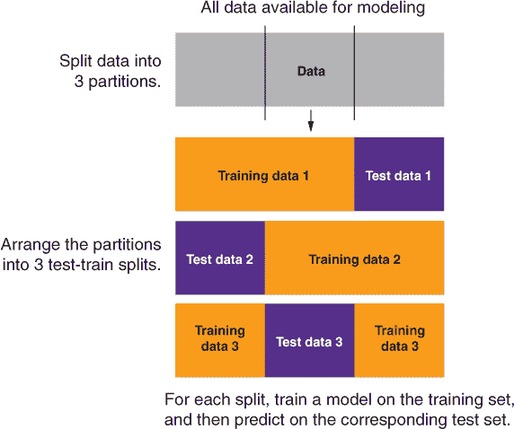

在图中，数据被分割成三个非重叠的部分，这三个部分被排列成三个测试-训练分割。对于每个分割，在训练集上训练一个模型，然后将其应用于相应的测试集。然后使用我们在本章后面将要讨论的适当评估分数来评估整个预测集。这模拟了在一个与整个数据集大小相同的保留集上训练模型并对其进行评估。对所有数据进行模型性能的估计，给我们提供了一个更精确的估计，即给定类型的模型在新数据上会如何表现。假设这个性能估计是令人满意的，那么你就可以回去使用**所有**训练数据来训练一个最终模型。

对于大数据，测试-训练分割通常足够好，并且实施起来更快。在数据科学应用中，交叉验证通常用于调整建模参数，这基本上是连续尝试许多模型。交叉验证也用于嵌套模型（使用一个模型作为另一个模型的输入）。这是在转换数据进行分析时可能出现的问题，并在第七章中讨论。

### 6.2.2. 模型性能度量

在本节中，我们将介绍一些模型性能的定量度量。从评估的角度来看，我们这样分组模型类型：

+   分类

+   评分

+   概率估计

+   聚类

对于大多数模型评估，我们只想计算一个或两个总结分数，告诉我们模型是否有效。为了决定给定的分数是高还是低，我们通常将我们的模型性能与几个基线模型进行比较。

零模型

零模型是你试图超越的非常简单模型的最佳版本。最典型的零模型是对于所有情况都返回相同答案的模型（一个常量模型）。我们将零模型用作期望性能的下限。例如，在分类问题中，零模型将始终返回最流行的类别，因为这是最容易猜测且最不常出错的选择。对于评分模型，零模型通常是所有结果的平均值，因为这与所有结果的最小平方偏差最小。

这个想法是，如果你没有超越零模型，你就没有提供价值。请注意，要做得和最好的零模型一样好可能很困难，因为尽管零模型很简单，但它有特权知道将要被测验的项目的大致分布。我们总是假设我们比较的零模型是所有可能的零模型中最好的。

单变量模型

我们还建议将任何复杂的模型与您可用的最佳单变量模型进行比较（请参阅第八章了解如何将单变量转换为单变量模型）。如果一个复杂的模型不能超越从您的训练数据中可用的最佳单变量模型，那么它就没有理由。此外，商业分析师有许多构建有效单变量模型（如交叉表）的工具，所以如果您的客户是分析师，他们很可能在寻找高于这个水平的性能。

我们将介绍模型质量的标准化度量，这些度量在模型构建中很有用。在所有情况下，我们建议除了标准模型质量评估之外，您还应该尝试与您的项目赞助商或客户设计自己的以业务为导向的指标。通常这就像为每个结果分配一个名义美元价值，然后看看您的模型在这个标准下的表现。让我们从如何评估分类模型开始，然后继续下去。

### 6.2.3. 评估分类模型

一个分类模型将示例放入两个或更多类别之一。为了衡量分类器的性能，我们首先介绍一个极其有用的工具，称为*混淆矩阵*，并展示它是如何被用来计算许多重要评估分数的。我们将讨论的第一个分数是准确率。

* * *

示例

*假设我们想要将电子邮件分类为垃圾邮件（我们根本不想要的电子邮件）和非垃圾邮件（我们想要的电子邮件）。*

* * *

一个现成的示例（附带良好描述）是“Spambase 数据集”（[`mng.bz/e8Rh`](http://mng.bz/e8Rh)）。该数据集的每一行都是针对特定电子邮件测量的特征集，以及一个额外的列，说明邮件是否是垃圾邮件（不受欢迎）或非垃圾邮件（受欢迎）。我们将快速构建一个垃圾邮件分类模型，以便我们有结果来评估。我们将在第 7.2 节中讨论逻辑回归，但就目前而言，您可以从本书的 GitHub 网站（[`github.com/WinVector/PDSwR2/tree/master/Spambase`](https://github.com/WinVector/PDSwR2/tree/master/Spambase)）下载 Spambase/spamD.tsv 文件，然后执行以下列表中显示的步骤。

列表 6.1\. 构建和应用逻辑回归垃圾邮件模型

```
spamD <- read.table('spamD.tsv',header=T,sep='\t')              ❶

spamTrain <- subset(spamD,spamD$rgroup  >= 10)                  ❷
spamTest <- subset(spamD,spamD$rgroup < 10)

spamVars <- setdiff(colnames(spamD), list('rgroup','spam'))     ❸
spamFormula <- as.formula(paste('spam == "spam"',
paste(spamVars, collapse = ' + '),sep = ' ~ '))

spamModel <- glm(spamFormula,family = binomial(link = 'logit'), ❹
                                  data = spamTrain)

spamTrain$pred <- predict(spamModel,newdata = spamTrain,        ❺
                              type = 'response')
spamTest$pred <- predict(spamModel,newdata = spamTest,
                            type = 'response')
```

❶ 读取数据

❷ 将数据分为训练集和测试集

❸ 创建一个描述模型的公式

❹ 拟合逻辑回归模型

❺ 在训练集和测试集上做出预测

垃圾邮件模型预测给定电子邮件是垃圾邮件的概率。我们简单垃圾邮件分类器的结果样本在下一列表中展示。

列表 6.2\. 垃圾邮件分类

```
sample <- spamTest[c(7,35,224,327), c('spam','pred')]
print(sample)
##          spam         pred       ❶
## 115      spam 0.9903246227
## 361      spam 0.4800498077
## 2300 non-spam 0.0006846551
## 3428 non-spam 0.0001434345
```

❶ 第一列给出了实际的类别标签（垃圾邮件或非垃圾邮件）。第二列给出了电子邮件是垃圾邮件的预测概率。如果概率大于 0.5，则电子邮件被标记为“垃圾邮件”；否则，它被标记为“非垃圾邮件”。

混淆矩阵

分类器性能最有趣的总结是混淆矩阵。这个矩阵仅仅是一个表格，总结了分类器对实际已知数据类别的预测。

混淆矩阵是一个表格，统计了已知结果（真相）与每种预测类型组合发生的频率。对于我们的电子邮件垃圾邮件示例，混淆矩阵是通过以下列表中的 R 命令计算的。

列表 6.3\. 垃圾邮件混淆矩阵

```
confmat_spam <- table(truth = spamTest$spam,
                         prediction = ifelse(spamTest$pred > 0.5,
                         "spam", "non-spam"))
print(confmat_spam)
##          prediction
## truth   non-spam spam
##   non-spam   264   14
##   spam        22  158
```

表格的行（标记为*真相*）对应于数据点的实际标签：它们是否真的是垃圾邮件。表格的列（标记为*预测*）对应于模型做出的预测。因此，表格的第一个单元格（*真相 = 非垃圾邮件*和*预测 = 非垃圾邮件*）对应于测试集中不是垃圾邮件的 264 封电子邮件，并且模型（正确地）预测它们不是垃圾邮件。这些正确的负预测被称为*真正负例*。

* * *

混淆矩阵惯例

许多工具以及维基百科都会绘制混淆矩阵，实际的真实值控制图中的 x 轴。这可能是由于矩阵和表格中数学惯例，即矩阵和表格的第一个坐标命名行（垂直偏移），而不是列（水平偏移）。我们觉得直接标签，如“pred”和“actual”，比*任何*惯例都要清晰。此外，请注意，在残差图中，预测总是 x 轴，与这个重要惯例保持视觉一致性是一个好处。因此，在这本书中，我们将预测绘制在 x 轴上（无论其名称如何）。

* * *

将属于感兴趣类别的数据称为*正实例*，而不属于感兴趣类别的数据称为*负实例*是标准术语。在我们的场景中，垃圾邮件是正实例，非垃圾邮件是负实例。

在一个二乘二的混淆矩阵中，每个单元格都有一个特殊名称，如表 6.2 所示。

表 6.2. 二乘二混淆矩阵

|   | 预测=NEGATIVE (预测为非垃圾邮件) | 预测=POSITIVE (预测为垃圾邮件) |
| --- | --- | --- |
| **真实标记=NEGATIVE (非垃圾邮件**) | 真阴性 (TN) confmat_spam[1,1]=264 | 假阳性 (FP) confmat_spam[1,2]=14 |
| **真实标记=POSITIVE (垃圾邮件**) | 假阴性 (FN) confmat_spam[2,1]=22 | 真阳性 (TP) confmat_spam[2,2]=158 |

使用这个摘要，我们现在可以开始计算垃圾邮件过滤器的各种性能指标。

* * *

将分数转换为分类

注意，我们将数值预测分数转换为决策，通过检查分数是否高于或低于 0.5。这意味着如果模型返回的电子邮件是垃圾邮件的概率高于 50%，我们就将其分类为垃圾邮件。对于某些评分模型（如逻辑回归），0.5 的分数可能是一个提供合理准确性的分类器阈值。然而，准确率并不总是最终目标，对于不平衡的训练数据，0.5 的阈值可能不是好的选择。选择除 0.5 以外的阈值可以让数据科学家在*精确度*和*召回率*（这两个术语我们将在本章后面定义）之间进行权衡。你可以从 0.5 开始，但考虑尝试其他阈值并查看 ROC 曲线（见第 6.2.5 节）。

* * *

准确率

准确率回答了这样的问题：“当垃圾邮件过滤器说这封邮件是或不是垃圾邮件时，它正确的概率是多少？”对于一个分类器，准确率定义为正确分类的项目数除以总项目数。这很简单，就是分类器做出的分类中正确比例。这如图 6.10 图所示。

图 6.10. 准确率

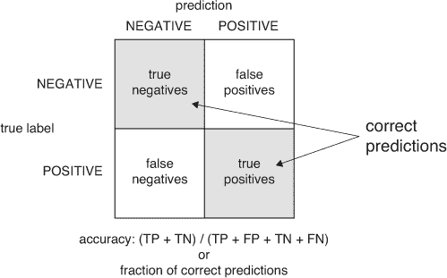

至少，你希望分类器是准确的。让我们计算垃圾邮件过滤器的准确率：

```
(confmat_spam[1,1] + confmat_spam[2,2]) / sum(confmat_spam)
## [1] 0.9213974
```

对于垃圾邮件过滤器来说，大约 8%的错误率是不可接受的，但对于说明不同类型的模型评估标准来说却是好的。

在我们继续之前，我们想分享一个良好的垃圾邮件过滤器的混淆矩阵。在下一个列表中，我们创建来自 Win-Vector 博客的 Akismet 评论垃圾邮件过滤器的混淆矩阵。^([4)]

> ⁴
> 
> 见[`www.win-vector.com/blog/`](http://www.win-vector.com/blog/)。

列表 6.4\. 手动输入 Akismet 混淆矩阵

```
confmat_akismet <- as.table(matrix(data=c(288-1,17,1,13882-17),nrow=2,ncol=2))
rownames(confmat_akismet) <- rownames(confmat_spam)
colnames(confmat_akismet) <- colnames(confmat_spam)
print(confmat_akismet)
##       non-spam  spam
## non-spam   287     1
## spam        17 13865
```

由于 Akismet 过滤器使用链接目的地线索和来自其他网站的判断（除了文本特征），它达到了更可接受的精确度：

```
(confmat_akismet[1,1] + confmat_akismet[2,2]) / sum(confmat_akismet)
## [1] 0.9987297
```

更重要的是，Akismet 似乎抑制了更少的良好评论。我们将在下一节中讨论精确度和召回率，以量化这种区别。

** * * ***

对于不平衡的类别，准确度是一个不合适的衡量标准

假设我们有一个罕见事件的情况（比如，分娩期间的严重并发症）。如果我们试图预测的事件是罕见的（比如，大约 1%的人口），那么说罕见事件永远不会发生的零模型是**非常**（99%）准确的。实际上，零模型比一个有用（但不完美）的模型更准确，后者将 5%的人口识别为“有风险”，并捕捉到 5%中的所有不良事件。这并不是任何形式的悖论。这只是因为准确性不是衡量不平衡分布或不平衡成本事件的好指标。

** * * ***

精确度和召回率

机器学习研究人员使用的另一个评估指标是一对称为精确度和召回率的数字。这些术语来自信息检索领域，其定义如下。

**精确度**回答了这样的问题：“如果垃圾邮件过滤器说这封邮件是垃圾邮件，那么它真的是垃圾邮件的概率是多少？”精确度定义为真实阳性与预测阳性的比率。这如图 6.11 所示。

图 6.11\. 精确度

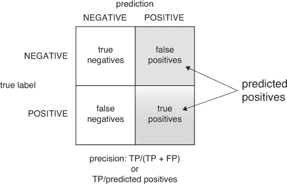

我们可以按以下方式计算垃圾邮件过滤器的精确度：

```
confmat_spam[2,2] / (confmat_spam[2,2]+ confmat_spam[1,2])
## [1] 0.9186047
```

精确度如此接近我们之前报告的准确度数字只是一个巧合。再次强调，精确度是指阳性指示最终被证明是正确的情况的频率。重要的是要记住，精确度是分类器和数据集组合的函数。单独询问分类器的精确度是没有意义的；只有针对给定的数据集询问分类器的精确度才有意义。希望分类器在数据集抽取的整体人口中也会有类似的精确度——一个具有与数据集相同的阳性实例分布的人口。

在我们的电子邮件垃圾邮件示例中，92%的精确度意味着被标记为垃圾邮件的 8%实际上并不是垃圾邮件。这对于丢失可能重要的信息来说是不可接受的比率。另一方面，Akismet 的精确度超过 99.99%，因此它丢弃的非垃圾邮件非常少。

```
confmat_akismet[2,2] / (confmat_akismet[2,2] + confmat_akismet[1,2])
## [1] 0.9999279
```

精确度的伴随分数是 *召回率*。召回率回答了这样的问题：“在电子邮件集中的所有垃圾邮件中，有多少比例被垃圾邮件过滤器检测到了？” 召回率是真实阳性与所有实际阳性的比率，如 图 6.12 所示。

图 6.12\. 召回率

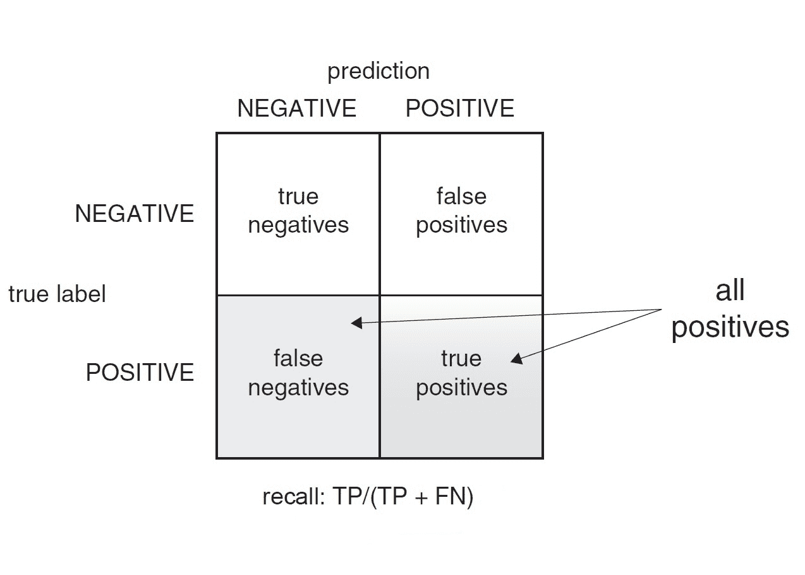

让我们比较两个垃圾邮件过滤器的召回率。

```
confmat_spam[2,2] / (confmat_spam[2,2] + confmat_spam[2,1])
## [1] 0.8777778

confmat_akismet[2,2] / (confmat_akismet[2,2] + confmat_akismet[2,1])
## [1] 0.9987754
```

对于我们的电子邮件垃圾邮件过滤器，这个值是 88%，这意味着我们收到的垃圾邮件中仍有大约 12% 会进入我们的收件箱。Akismet 的召回率为 99.88%。在这两种情况下，大多数垃圾邮件实际上都被标记了（我们有高召回率），并且精确度比召回率更重要。这对于垃圾邮件过滤器来说是合适的，因为不丢失非垃圾邮件比从我们的收件箱中过滤掉每一件垃圾邮件更重要。

重要的是要记住这一点：精确度是确认度的度量（当分类器指示为正时，实际上它是正确的频率），召回率是实用性的度量（分类器找到了多少实际存在的可找内容）。精确度和召回率通常与商业需求相关，并且是与你的项目赞助商和客户讨论的好指标。

F1

* * *

示例

*假设你有多个垃圾邮件过滤器可供选择，每个过滤器都有不同的精确度和召回率。你该如何选择使用哪个垃圾邮件过滤器呢？*

* * *

在这种情况下，有些人更喜欢有一个数字来比较所有不同的选择。这样一个评分就是 *F1 分数*。F1 分数衡量了精确度和召回率之间的权衡。它被定义为精确度和召回率的调和平均值。这可以通过一个明确的计算来最容易地展示：

```
precision <- confmat_spam[2,2] / (confmat_spam[2,2]+ confmat_spam[1,2])
recall <- confmat_spam[2,2] / (confmat_spam[2,2] + confmat_spam[2,1])

(F1 <- 2 * precision * recall / (precision + recall) )
## [1] 0.8977273
```

我们具有 0.93 精确度和 0.88 召回率的垃圾邮件过滤器有一个 0.90 的 F1 分数。当分类器具有完美的精确度和召回率时，F1 为 1.00，而对于具有非常低精确度或召回率（或两者都有）的分类器，F1 会降到 0.00。假设你认为你的垃圾邮件过滤器丢失了太多的真实邮件，并且你想要让它“更挑剔”地标记邮件为垃圾邮件；也就是说，你想要提高它的精确度。通常情况下，提高分类器的精确度也会降低其召回率：在这种情况下，一个更挑剔的垃圾邮件过滤器可能会标记更少的真实垃圾邮件为垃圾邮件，并允许它进入你的收件箱。如果随着精确度的提高，过滤器的召回率变得太低，这将导致 F1 分数降低。这可能意味着你为了更好的精确度而牺牲了太多的召回率。

敏感度和特异性

* * *

示例

*假设你已经使用你的工作电子邮件作为训练数据，成功训练了一个具有可接受精确度和召回率的垃圾邮件过滤器。现在你想要将同一个垃圾邮件过滤器应用于你主要用于摄影爱好者的个人电子邮件账户。这个过滤器会同样有效吗？*

* * *

过滤器可能在你个人的电子邮件上工作得很好，因为垃圾邮件的性质（电子邮件的长度、使用的单词、链接的数量等）在这两个电子邮件账户之间可能变化不大。然而，你个人电子邮件账户上收到的垃圾邮件的比例可能与工作电子邮件上的不同。这可能会改变你个人电子邮件上的垃圾邮件过滤器的性能。⁵

> ⁵
> 
> 垃圾邮件过滤器的性能也可能发生变化，因为非垃圾邮件的性质也会不同：常用的单词可能不同；合法电子邮件中的链接或图像数量可能不同；你与之通信的人的电子邮件域名可能不同。对于这次讨论，我们将假设垃圾邮件的比例是垃圾邮件过滤器性能差异的主要原因。

让我们看看垃圾邮件比例的变化如何改变垃圾邮件过滤器的性能指标。在这里，我们模拟了具有比我们训练过滤器时更多的和更少的电子邮件集。

列表 6.5. 观察垃圾邮件比例变化时过滤器性能的变化

```
set.seed(234641)

N <- nrow(spamTest)
pull_out_ix <- sample.int(N, 100, replace=FALSE)
removed = spamTest[pull_out_ix,]                                  ❶

get_performance <- function(sTest) {                              ❷
  proportion <- mean(sTest$spam == "spam")
  confmat_spam <- table(truth = sTest$spam,
                        prediction = ifelse(sTest$pred>0.5,
                                            "spam",
                                            "non-spam"))
  precision <- confmat_spam[2,2]/sum(confmat_spam[,2])
  recall <- confmat_spam[2,2]/sum(confmat_spam[2,])
  list(spam_proportion = proportion,
       confmat_spam = confmat_spam,
       precision = precision, recall = recall)
}

sTest <- spamTest[-pull_out_ix,]                                  ❸
get_performance(sTest)

## $spam_proportion
## [1] 0.3994413
##
## $confmat_spam
##           prediction
## truth      non-spam spam
##   non-spam      204   11
##   spam           17  126
##
## $precision
## [1] 0.919708
##
## $recall
## [1] 0.8811189

get_performance(rbind(sTest, subset(removed, spam=="spam")))      ❹

## $spam_proportion
## [1] 0.4556962
##
## $confmat_spam
##           prediction
## truth      non-spam spam
##   non-spam      204   11
##   spam           22  158
##
## $precision
## [1] 0.9349112
##
## $recall
## [1] 0.8777778

get_performance(rbind(sTest, subset(removed, spam=="non-spam"))) ❺

## $spam_proportion
## [1] 0.3396675
##
## $confmat_spam
##           prediction
## truth      non-spam spam
##   non-spam      264   14
##   spam           17  126
##
## $precision
## [1] 0.9
##
## $recall
## [1] 0.8811189
```

❶ 从测试集中随机抽取 100 封电子邮件

❷ 这是一个方便的函数，用于在测试集上打印出过滤器的混淆矩阵、精确度和召回率。

❸ 检查与训练数据中相同比例的垃圾邮件的测试集上的性能

❹ 仅将额外的垃圾邮件添加回来，因此测试集中垃圾邮件的比例高于训练集

❺ 仅将非垃圾邮件添加回来，因此测试集中垃圾邮件的比例低于训练集

注意，过滤器的召回率在这三种情况下都是相同的：大约 88%。当数据中的垃圾邮件数量多于过滤器训练的数据时，过滤器的精确度更高，这意味着它抛出的非垃圾邮件比例更低。这是好事！然而，当数据中的垃圾邮件数量少于过滤器训练的数据时，精确度较低，这意味着过滤器会抛出更高比例的非垃圾邮件。这是不希望的。

由于存在一些情况，分类器或过滤器可能被用于正类（在本例中为垃圾邮件）的普遍性不同的群体中，因此拥有独立于类别普遍性的性能指标是有用的。这样一对指标是*灵敏度*和*特异性*。这对指标在医学研究中很常见，因为疾病和其他条件的测试将用于不同的群体，这些群体中特定疾病或条件的普遍性不同。

*灵敏度*也称为*真正阳性率*，与召回率完全相同。*特异性*也称为*真正阴性率*：它是真正阴性数与所有阴性数的比率。这如图 6.13 所示。

图 6.13. 特异性

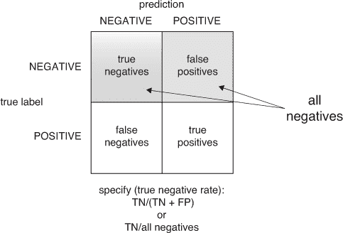

敏感性和召回率回答了“垃圾邮件过滤器找到了多少比例的垃圾邮件？”的问题。特异性回答了“垃圾邮件过滤器找到了多少比例的非垃圾邮件？”的问题。

我们可以计算我们的垃圾邮件过滤器的特异性：

```
confmat_spam[1,1] / (confmat_spam[1,1] + confmat_spam[1,2])
## [1] 0.9496403
```

特异性减一也称为*假阳性率*。假阳性率回答了“模型将多少比例的非垃圾邮件分类为垃圾邮件？”的问题。您希望假阳性率低（或特异性高），同时敏感性也要高。我们的垃圾邮件过滤器的特异性约为 0.95，这意味着它将大约 5%的非垃圾邮件标记为垃圾邮件。

敏感性和特异性的一个重要特性是：如果您翻转标签（从试图识别的类别*垃圾邮件*切换到试图识别的类别*非垃圾邮件*），您只是交换了敏感性和特异性。此外，一个总是说正面或总是说负面的简单分类器在敏感性和特异性上都会得到零分。因此，无用的分类器在这至少一个指标上得分总是很差。

为什么需要精确率/召回率和敏感度/特异性？从历史上看，这些指标来自不同的领域，但每个都有其优点。敏感度/特异性适用于像医学这样的领域，在这些领域中，了解分类器、测试或过滤器如何独立于人口中不同类别的分布将正例与负例分开是很重要的。但精确率/召回率可以给您一个关于分类器或过滤器在特定人群上如何工作的概念。如果您想知道被识别为垃圾邮件的电子邮件实际上是垃圾邮件的概率，您必须知道垃圾邮件在该人的电子邮件收件箱中有多常见，适当的指标是精确率。

摘要：使用常见的分类性能指标

在与客户和赞助商合作时，您应使用这些标准分数，以查看哪些指标最符合他们的业务需求。对于每个分数，您应询问他们是否需要该分数较高，然后与他们进行快速的思想实验，以确认您已经理解了他们的业务需求。然后您应该能够用这些指标中的一对的最小界限来撰写项目目标。表 6.3 展示了典型的业务需求和每个指标的示例后续问题。

表 6.3\. 分类器性能度量业务故事。

| 指标 | 典型的业务需求 | 后续问题 |
| --- | --- | --- |
| 准确率 | “我们需要大多数决策都是正确的。” | “我们能否容忍 5%的错误率？并且用户是否将垃圾邮件被标记为非垃圾邮件或非垃圾邮件被标记为垃圾邮件视为等效？” |
| 精确度 | “我们标记为垃圾邮件的大部分内容确实应该是垃圾邮件。” | “这将保证大多数在垃圾邮件文件夹中的内容确实是垃圾邮件，但这并不是衡量用户丢失多少合法邮件的最佳方式。我们可以通过向所有用户发送大量易于识别的垃圾邮件来正确识别，从而在这个目标上作弊。也许我们真正想要的是良好的特异性。” |
| 召回率 | “我们希望将用户看到的垃圾邮件数量减少 10 倍（消除 90%的垃圾邮件）。” | “如果 10%的垃圾邮件得以通过，用户将看到主要是非垃圾邮件还是主要是垃圾邮件？这将导致良好的用户体验吗？” |
| 敏感性 | “我们必须削减大量的垃圾邮件；否则，用户将看不到任何好处。” | “如果我们把垃圾邮件削减到现在的 1%，这将是一个好的用户体验吗？” |
| 特异性 | “我们必须至少达到*三个九*的合法电子邮件；用户必须至少看到 99.9%的非垃圾邮件。” | “用户能否容忍错过 0.1%的合法邮件，我们应该保留一个用户可以查看的垃圾邮件文件夹吗？” |

对于垃圾邮件分类的对话过程，一个结论可能是建议将业务目标写为最大化敏感性，同时保持至少 0.999 的特异性。

### 6.2.4\. 评估评分模型

让我们在一个简单的例子中演示评估。

* * *

示例

*假设你已经读到，蟋蟀鸣叫的速率与温度成正比，因此你已经收集了一些数据并拟合了一个模型，该模型可以从条纹地面蟋蟀的鸣叫速率（每秒鸣叫次数）预测温度（华氏度）。现在你想要评估这个模型。*

* * *

你可以使用以下列表拟合一个线性回归模型，并进行预测。我们将在第八章详细讨论线性回归。确保你的工作目录中有 crickets.csv 数据集。⁶]

> ⁶
> 
> 乔治·W·皮尔斯，《昆虫之歌》，哈佛大学出版社，1948 年。你可以在这里找到数据集：[`github.com/WinVector/PDSwR2/tree/master/cricketchirps`](https://github.com/WinVector/PDSwR2/tree/master/cricketchirps)

列表 6.6\. 拟合蟋蟀模型并进行预测

```
crickets <- read.csv("cricketchirps/crickets.csv")

cricket_model <- lm(temperatureF ~ chirp_rate, data=crickets)
crickets$temp_pred <- predict(cricket_model, newdata=crickets)
```

图 6.14 比较了实际数据（点）与模型的预测（线）。预测的`temperatureF`和`temp_pred`之间的差异被称为模型的*残差*或*误差*。我们将使用残差来计算评分模型的常见性能指标。

图 6.14\. 评分残差

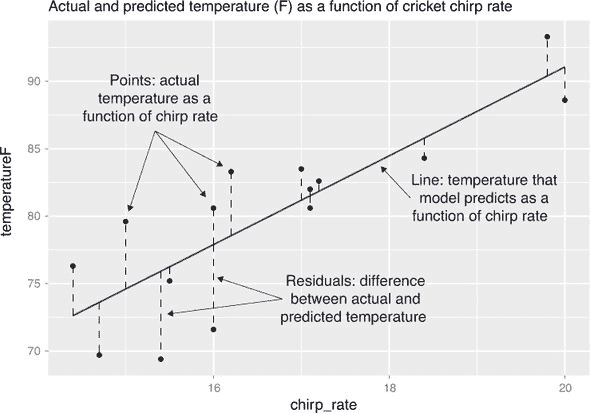

根均方误差

最常见的拟合优度度量称为*均方根误差（RMSE）*。RMSE 是平均平方残差的平方根（也称为均方误差）。RMSE 回答了“预测温度通常偏离多少？”这个问题。我们按照以下列表所示计算 RMSE。

列表 6.7\. 计算 RMSE

```
error_sq <- (crickets$temp_pred - crickets$temperatureF)²
( RMSE <- sqrt(mean(error_sq)) )
## [1] 3.564149
```

RMSE 与结果单位相同：由于结果（温度）是以华氏度为单位，因此 RMSE 也是以华氏度为单位。在这里，RMSE 告诉你模型的预测通常（即平均）会偏离实际温度大约 3.6 度。假设你认为一个通常能将温度预测在 5 度以内的模型是“好的”，那么恭喜你！你已经拟合了一个符合你目标的模型。

RMSE 是一个好的度量，因为它通常是你在使用的拟合算法明确试图最小化的。在商业环境中，一个好的 RMSE 相关目标可能是“我们希望账户估值的 RMSE 低于每账户 1000 美元。”

量`mean(error_sq)`被称为*均方误差*。我们将量`sum(error_sq)`称为*均方误差之和*，也将其称为模型的*方差*。

R 平方

另一个重要的拟合度度量称为*R 平方*（或 R2，或确定系数）。我们可以如下推导 R 平方的定义。

对于你收集的数据，温度的最简单基线预测只是数据集中的平均温度。这是一个*零模型*；它不是一个很好的模型，但你必须至少做得比它好。数据的*总方差*是零模型的均方误差之和。你希望你的实际模型的均方误差之和远小于数据的方差——也就是说，你希望你的模型均方误差与总方差之比接近零。R 平方定义为这个比率的倒数，因此我们希望 R 平方接近 1。这导致了以下 R 平方的计算。

列表 6.8\. 计算 R 平方

```
error_sq <- (crickets$temp_pred - crickets$temperatureF)²             ❶
numerator <- sum(error_sq)                                             ❷

delta_sq <- (mean(crickets$temperatureF) - crickets$temperatureF)²    ❸
denominator = sum(delta_sq)                                            ❹

(R2 <- 1 - numerator/denominator)                                      ❺
## [1] 0.6974651
```

❶ 计算平方误差项

❷ 将它们相加得到模型的均方误差，或方差

❸ 从零模型计算平方误差项

❹ 计算数据的总方差

❺ 计算 R 平方

由于 R 平方是由一个比率构成的，该比率比较了你的模型方差与总方差，因此你可以将 R 平方视为衡量你的模型“解释”了多少方差的一个指标。R 平方有时也被称为衡量模型“拟合”数据程度或其“拟合优度”的指标。

最佳可能的 R 平方是 1.0，接近零或负的 R 平方是糟糕的。一些其他模型（如逻辑回归）使用偏差来报告一个类似数量的指标，称为*伪 R 平方*。

在某些情况下，R-squared 等于另一个称为 *相关系数* 的度量（见[`mng.bz/ndYf`](http://mng.bz/ndYf)）。一个关于 R-squared 商业目标的良好陈述将是：“我们希望模型至少解释账户价值变化的 70%。”

### 6.2.5\. 评估概率模型

概率模型是既能判断一个项目是否属于给定类别，又能返回该项目属于该类别的估计概率（或置信度）的模型。逻辑回归和决策树建模技术在返回良好的概率估计方面相当著名。这些模型可以根据它们的最终决策进行评估，正如我们在第 6.2.3 节中已经展示的那样，但它们也可以根据它们的估计概率进行评估。

在我们看来，大多数概率模型的度量都非常技术化，并且非常擅长比较同一数据集上不同模型的品质。了解它们很重要，因为数据科学家通常在这些标准之间进行交流。但将这些标准精确地转化为业务需求并不容易。因此，我们建议跟踪它们，但不要在与你的项目赞助商或客户交流时使用它们。

为了激励使用概率模型的不同指标，我们将继续从第 6.2.3 节中的垃圾邮件过滤器示例。

* * *

示例

*假设在构建你的垃圾邮件过滤器时，你尝试了多种不同的算法和建模方法，并提出了几个模型，所有这些模型都返回了给定电子邮件是垃圾邮件的概率。你想要快速比较这些不同的模型，并确定哪一个将制作出最佳的垃圾邮件过滤器。*

* * *

为了将概率模型转换为分类器，你需要选择一个阈值：得分高于该阈值的项将被分类为垃圾邮件；否则，它们将被分类为非垃圾邮件。对于概率模型来说，最简单（也可能是最常见的）的阈值是 0.5，但针对特定概率模型的“最佳”分类器可能需要不同的阈值。这个最佳阈值可能因模型而异。本节中的指标直接比较概率模型，而没有将它们转换为分类器。如果你合理地假设最佳的概率模型将产生最佳的分类器，那么你可以使用这些指标来快速选择最合适的概率模型，然后花一些时间调整阈值，以构建满足你需求的最佳分类器。

双密度图

在考虑概率模型时，构建双密度图（如图 6.15 所示）是有用的。

列表 6.9\. 制作双密度图

```
library(WVPlots)
DoubleDensityPlot(spamTest,
                  xvar = "pred",
                  truthVar = "spam",
                  title = "Distribution of scores for spam filter")
```

图 6.15\. 按已知类别拆分的分数分布

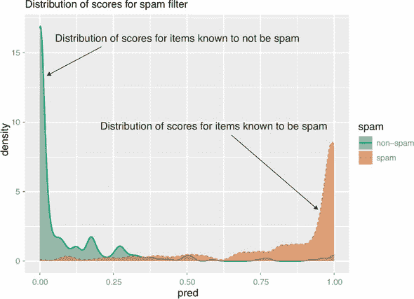

图中的 x 轴对应于垃圾邮件过滤器返回的预测分数。图 6.15 展示了我们在评估估计概率模型时试图检查的内容：属于该类别的示例应该主要具有高分数，而不属于该类别的示例应该主要具有低分数。

双密度图在选择分类器阈值时可能很有用，或者分类器从将电子邮件标记为非垃圾邮件切换到垃圾邮件的阈值分数。如我们之前提到的，标准分类器阈值是 0.5，这意味着如果电子邮件是垃圾邮件的概率大于一半，我们就将其标记为垃圾邮件。这是你在第 6.2.3 节中使用的阈值。然而，在某些情况下，你可能选择使用不同的阈值。例如，使用垃圾邮件过滤器的 0.75 阈值将产生一个具有更高精确度（但召回率较低）的分类器，因为分数高于 0.75 的电子邮件中有更高的比例实际上是垃圾邮件。

接收者操作特征曲线和 AUC

*接收者操作特征曲线*（或*ROC 曲线*）是双密度图的一个流行替代方案。对于通过在垃圾邮件和非垃圾邮件之间选择不同的分数阈值得到的每个不同的分类器，我们绘制了真正的阳性（TP）率和错误的阳性（FP）率。得到的曲线代表了从该模型派生出的分类器中可用的每个可能的真正阳性率和错误阳性率之间的权衡。图 6.16 显示了我们的垃圾邮件过滤器的 ROC 曲线，如下一列表所示。在列表的最后一行，我们计算了*AUC*或*曲线下的面积*，这是对模型质量的一种衡量。

图 6.16\. 电子邮件垃圾邮件示例的 ROC 曲线

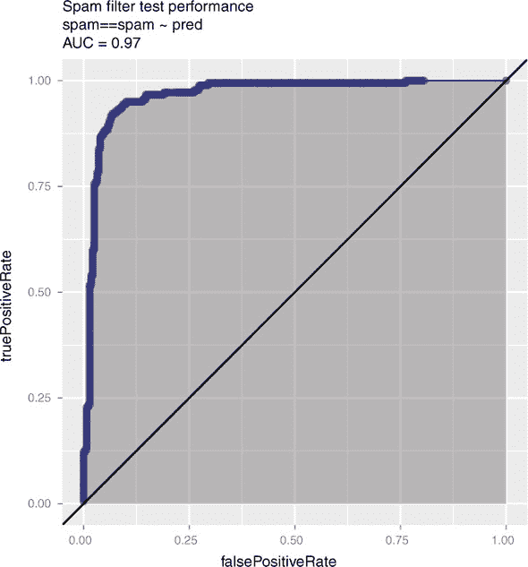

列表 6.10\. 绘制接收者操作特征曲线

```
library(WVPlots)
ROCPlot(spamTest,                                 ❶
        xvar = 'pred',
        truthVar = 'spam',
        truthTarget = 'spam',
        title = 'Spam filter test performance')
library(sigr)
calcAUC(spamTest$pred, spamTest$spam=='spam')     ❷
 ## [1] 0.9660072
```

❶ 绘制接收者操作特征（ROC）曲线

❷ 显式计算 ROC 曲线下的面积

AUC 背后的推理

在模型光谱的一端是理想的完美模型，该模型将为垃圾邮件返回 1 分，为非垃圾邮件返回 0 分。这个理想模型将形成一个有三个点的 ROC 曲线：

+   (0,0)—对应于由阈值`p = 1`定义的分类器：没有任何内容被分类为垃圾邮件，因此这个分类器的错误阳性率和真正阳性率都为 0。

+   (1,1)—对应于由阈值`p = 0`定义的分类器：所有内容都被分类为垃圾邮件，因此这个分类器的错误阳性率和真正阳性率都为 1。

+   (0,1)—对应于由 0 到 1 之间的阈值定义的任何分类器：所有内容都被正确分类，因此这个分类器的错误阳性率为 0，真正阳性率为 1。

理想模型的 ROC 曲线形状如图 6.17 所示。此模型的曲线下面积为 1。返回随机分数的模型将有一个从原点到点(1,0)的对角线 ROC：真正的阳性率与阈值成正比。随机模型的曲线下面积为 0.5。因此，你希望模型具有接近 1 的 AUC，并且大于 0.5。

图 6.17\. 完美分类的理想模型的 ROC 曲线

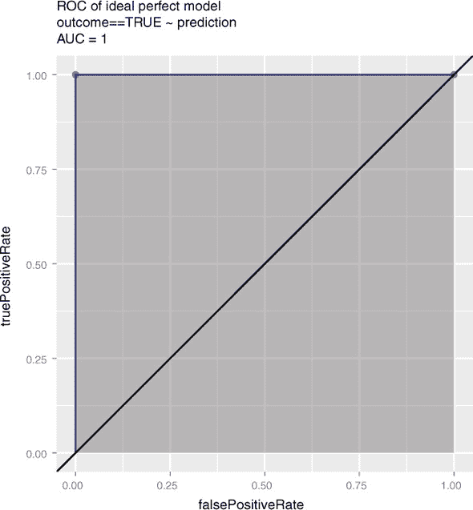

当比较多个概率模型时，你通常希望优先考虑具有更高 AUC 的模型。然而，你还需要检查 ROC 曲线的形状，以探索可能的项目目标权衡。曲线上的每个点都显示了使用此模型可实现的真正阳性率和假阳性率之间的权衡。如果你与客户分享 ROC 曲线的信息，他们可能会对两种可接受的权衡有意见。

对数似然

*对数似然*是衡量模型预测“匹配”真实类别标签好坏的一个指标。它是一个非正数，其中对数似然为 0 表示完美匹配：模型将所有垃圾邮件评分的概率为 1，将所有非垃圾邮件评分的概率为 0。对数似然的绝对值越大，匹配越差。

模型对特定实例预测的对数似然是该模型分配给实例实际类别的概率的对数。如图 6.18 所示，对于一个估计概率为*p*的垃圾邮件，其对数似然是`log(p)`；对于非垃圾邮件，相同的*p*分数给出对数似然为`log(1 - p)`。

图 6.18\. 垃圾邮件过滤器预测的对数似然

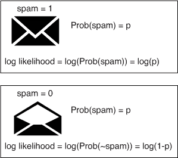

模型对整个数据集预测的对数似然是各个单独对数似然的和：

```
log_likelihood = sum(y * log(py) + (1-y) * log(1 - py))
```

这里`y`是真实的类别标签（非垃圾邮件为 0，垃圾邮件为 1），`py`是实例属于类别 1（垃圾邮件）的概率。我们使用乘法来选择正确的对数。我们还使用约定`0 * log(0) = 0`（尽管为了简单起见，这在代码中没有显示）。

图 6.19 展示了对数似然如何奖励匹配并惩罚实际邮件标签与模型分配的分数之间的不匹配。对于正实例（垃圾邮件），模型应该预测一个接近 1 的值，而对于负实例（非垃圾邮件），模型应该预测一个接近 0 的值。当预测与类别标签匹配时，对数似然的贡献是一个小的负数。当它们不匹配时，对数似然的贡献是一个较大的负数。对数似然越接近 0，预测越好。

图 6.19\. 对数似然惩罚预测与真实类别标签之间的不匹配。

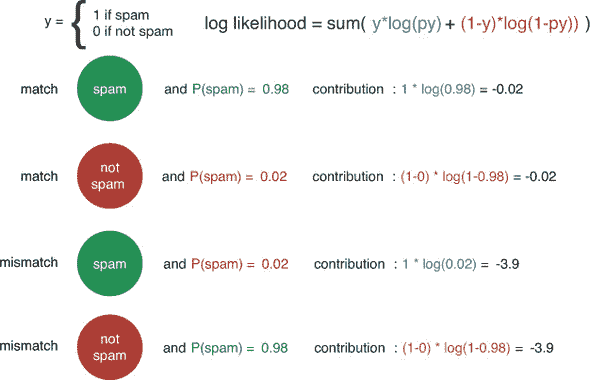

下一个列表展示了计算垃圾邮件过滤器预测的似然对数的一种方法。

列表 6.11\. 计算似然对数

```
ylogpy <- function(y, py) {              ❶
   logpy = ifelse(py > 0, log(py), 0)
  y*logpy
}

y <- spamTest$spam == 'spam'             ❷

sum(ylogpy(y, spamTest$pred) +           ❸
       ylogpy(1-y, 1-spamTest$pred))
## [1] -134.9478
```

❶ 一个计算 y * log(py) 的函数，约定 0 * log(0) = 0

❷ 获取测试集的类别标签为 TRUE/FALSE，R 在算术运算中将它们视为 1/0

❸ 计算模型在测试集上的预测的似然对数

似然对数对于比较同一测试数据集上的多个概率模型很有用——因为似然对数是一个非归一化的总和，其大小隐式地依赖于数据集的大小，因此你不能直接比较在不同数据集上计算的似然对数。在比较多个模型时，你通常希望偏好具有较大（即较小幅度）似然对数的模型。

至少，你想要将模型的性能与预测每个示例相同概率的空模型进行比较。最佳可观察的单个估计值是训练集中垃圾邮件的观察率。

列表 6.12\. 计算空模型的似然对数

```
(pNull <- mean(spamTrain$spam == 'spam'))
## [1] 0.3941588

sum(ylogpy(y, pNull) + ylogpy(1-y, 1-pNull))
## [1] -306.8964
```

该模型将 `-134.9478` 的似然对数分配给测试集，这比空模型的 `-306.8964` 要好得多。

偏差

在拟合概率模型时，另一个常见的度量是 *偏差*。偏差定义为 `-2*(logLikelihood-S)`，其中 `S` 是称为“饱和模型的似然对数”的技术常数。在大多数情况下，饱和模型是一个完美的模型，对于属于类的项目返回概率 1，对于不属于类的项目返回概率 0（因此 `S=0`）。偏差越低，模型越好。

我们最关心的是偏差率的比率，例如空偏差与模型偏差之间的比率。这些偏差可以用来计算伪 R 平方（见 [`mng.bz/j338`](http://mng.bz/j338)）。将空偏差视为需要解释的变异量，将模型偏差视为模型未解释的变异量。你希望伪 R 平方接近 1。

在下一个列表中，我们展示了使用 `sigr` 包快速计算偏差和伪 R 平方的方法。

列表 6.13\. 计算偏差和伪 R 平方

```
library(sigr)

(deviance <- calcDeviance(spamTest$pred, spamTest$spam == 'spam'))
## [1] 253.8598
(nullDeviance <- calcDeviance(pNull, spamTest$spam == 'spam'))
## [1] 613.7929
(pseudoR2 <- 1 - deviance/nullDeviance)
## [1] 0.586408
```

与似然对数一样，偏差是非归一化的，因此你应该只比较在相同数据集上计算的偏差。在比较多个模型时，你通常会偏好偏差较小的模型。伪 R 平方是归一化的（它是偏差比率的函数），所以原则上你可以比较在不同测试集上计算的伪 R 平方。在比较多个模型时，你通常会偏好伪 R 平方较大的模型。

AIC

偏差的一个重要变体是**赤池信息量准则**（**AIC**）。这相当于模型中使用的`deviance + 2*numberOfParameters`。模型中的参数越多，模型越复杂；模型越复杂，越有可能过拟合。因此，AIC 是对模型复杂度进行惩罚的偏差。当比较模型（在同一测试集上）时，你通常会倾向于选择 AIC 较小的模型。AIC 在比较具有不同复杂度度量以及具有不同水平数量的建模变量时很有用。然而，调整模型复杂度通常更可靠地通过使用在第 6.2.1 节中讨论的保留法和交叉验证法来实现。

到目前为止，我们已经评估了模型在**总体**上的表现：模型在测试数据上返回正确或错误预测的整体比率。在下一节中，我们将探讨一种评估模型在**特定**示例上的方法，或者解释为什么模型在给定示例上返回特定的预测。

## 6.3\. 本地可解释模型无关解释（LIME）用于解释模型预测

在许多人看来，现代机器学习方法（如深度学习或梯度提升树）的预测性能提升是以降低可解释性为代价的。正如你在第一章中看到的，一个人类领域专家可以审查决策树的 if-then 结构，并将其与自己的决策过程进行比较，以决定决策树是否会做出合理的决策。线性模型也有一个易于解释的结构，正如你将在第八章中看到的。然而，其他方法的结构远更复杂，难以被人类评估。例如，随机森林中的多个单独的树（如图 6.20 所示[../Text/06.xhtml#ch06fig20]），或者神经网络的高度连接拓扑结构。

图 6.20\. 一些模型比其他模型更容易手动检查。

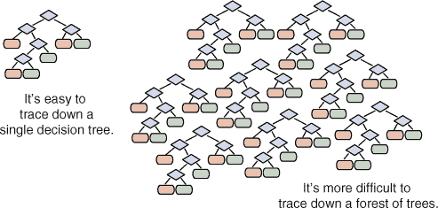

如果模型在保留数据上表现良好，这表明模型将在野外表现良好——但这并不是万无一失的。一个潜在的问题是，保留集通常来自与训练数据相同的来源，并且具有与训练数据相同的怪癖和独特性。你如何知道你的模型是否在学习实际感兴趣的概念，或者只是学习数据中的怪癖？或者，换一种说法，模型是否会在来自不同来源的类似数据上工作？

* * *

示例

*假设你想要训练一个分类器来区分关于基督教的文档和关于无神论的文档。*

* * *

其中一个模型是使用 20 Newsgroups 数据集的帖子语料库进行训练的，这是一个常用于机器学习文本研究的数据集。该随机森林模型在保留数据上的准确率为 92%。^([7]) 表面上看，这似乎相当不错。

> ⁷
> 
> 该实验在 Ribeiro, Singh 和 Guestrin 的论文“‘Why Should I Trust You?’ Explaining the Predictions of Any Classifier”中有描述，[`arxiv.org/pdf/1602.04938v1.pdf`](https://arxiv.org/pdf/1602.04938v1.pdf)。

然而，深入研究模型发现，它正在利用数据中的特殊性，使用“那里”、“帖子”或“edu”等词语的分布来决定帖子是关于基督教还是关于无神论。换句话说，该模型正在查看数据中的错误特征。该模型的一个分类示例在图 6.21.^([8])中展示。

> ⁸
> 
> 来源：[`homes.cs.washington.edu/~marcotcr/blog/lime/`](https://homes.cs.washington.edu/~marcotcr/blog/lime/)

图 6.21。一个文档及其被模型分类为“无神论者”的最强贡献词语示例


此外，由于语料库中的文档似乎包含了特定发帖者的名字，这个模型也可能潜在地学习到在训练语料库中频繁发帖的“人”是基督徒还是无神论者，这不同于学习“文本”是基督徒还是无神论者，尤其是在尝试将模型应用于来自不同语料库、不同作者的文档时。

另一个现实世界的例子是亚马逊最近尝试自动化简历审查，使用亚马逊在过去 10 年内雇佣的人的简历作为训练数据.^([9]) 如路透社报道，公司发现他们的模型对女性存在歧视。它惩罚包含“女性”等词语的简历，并对毕业于两所特定女子大学的申请者进行降级。研究人员还发现，该算法忽略了指代特定技能的常见术语（例如计算机编程语言的名称），并偏好像“执行”或“捕获”这样的词语，这些词语在男性申请者中被不成比例地使用。

> ⁹
> 
> Jeffrey Dastin，“亚马逊取消对女性存在歧视的秘密 AI 招聘工具，”路透社，2018 年 10 月 9 日，[`www.reuters.com/article/us-amazon-com-jobs-automation-insight/amazon-scraps-secret-ai-recruiting-tool-that-showed-bias-against-women-idUSKCN1MK08G`](https://www.reuters.com/article/us-amazon-com-jobs-automation-insight/amazon-scraps-secret-ai-recruiting-tool-that-showed-bias-against-women-idUSKCN1MK08G)。

在这种情况下，问题不在于机器学习算法，而在于训练数据，该数据显然捕捉到了亚马逊招聘实践中的现有偏见——模型随后将这些偏见编码。LIME 等预测解释技术可能发现此类问题。

### 6.3.1\. LIME：自动性检查

为了检测模型是否真正学习到概念，而不是仅仅学习数据中的异常，领域专家通常会手动通过运行一些示例案例来检查模型，并查看答案。通常，你想要尝试一些典型案例和一些极端案例，以看看会发生什么。你可以将 LIME 视为一种自动性检查的形式。

LIME 可以产生一个关于模型对特定数据预测的解释。也就是说，LIME 试图确定哪些特征对该数据产生了最大的影响，从而帮助数据科学家尝试理解黑盒机器学习模型的行为。

为了具体说明，我们将演示 LIME 在两个任务上的应用：鸢尾花物种分类和电影评论分类。

### 6.3.2\. 漫步 LIME：一个小例子

第一个例子是鸢尾花分类。

* * *

示例

*假设你有一个包含三种鸢尾花花瓣和萼片尺寸的数据集。目标是根据花瓣和萼片的尺寸预测给定的鸢尾花是否为 setosa。*

* * *

让我们获取数据并将其分为测试集和训练集。

列表 6.14\. 加载鸢尾花数据集

```
iris <- iris

iris$class <- as.numeric(iris$Species == "setosa")   ❶

set.seed(2345)
intrain <- runif(nrow(iris)) < 0.75                  ❷
train <- iris[intrain,]
test <- iris[!intrain,]

head(train)

##   Sepal.Length Sepal.Width Petal.Length Petal.Width Species class
## 1          5.1         3.5          1.4         0.2  setosa     1
## 2          4.9         3.0          1.4         0.2  setosa     1
## 3          4.7         3.2          1.3         0.2  setosa     1
## 4          4.6         3.1          1.5         0.2  setosa     1
## 5          5.0         3.6          1.4         0.2  setosa     1
## 6          5.4         3.9          1.7         0.4  setosa     1
```

❶ Setosa 是正类。

❷ 使用 75%的数据进行训练，其余作为保留（测试数据）

变量是萼片和花瓣的长度和宽度。你想要预测的结果是`class`，当鸢尾花是*setosa*时为 1，否则为 0。你将使用来自`xgboost`包的梯度提升模型来预测`class`。

你将在第十章中详细了解梯度提升模型；目前，我们已经将拟合过程封装到函数`fit_iris_example()`中，该函数接受输入矩阵和类别标签向量作为输入，并返回一个预测`class`的模型。^([10]) `fit_iris_example()`的源代码位于[`github.com/WinVector/PDSwR2/tree/master/LIME_iris/lime_iris_example.R`](https://github.com/WinVector/PDSwR2/tree/master/LIME_iris/lime_iris_example.R)；在第十章中，我们将详细解释该函数的工作原理。

> ¹⁰
> 
> `xgboost`包要求输入是一个数值矩阵，类别标签是一个数值向量。

要开始，将训练数据转换为矩阵并拟合模型。确保`lime_iris_example.R`位于你的工作目录中。

列表 6.15\. 将模型拟合到鸢尾花训练数据

```
source("lime_iris_example.R")                     ❶

input <- as.matrix(train[, 1:4])                  ❷
model <- fit_iris_example(input, train$class)
```

❶ 加载便利函数

❷ 模型的输入是训练数据的前四列，转换为一个矩阵。

在您拟合模型后，您可以在测试数据上评估模型。模型的预测是给定留兰香是 *setosa* 的概率。

列表 6.16\. 评估留兰香模型

```
predictions <- predict(model, newdata=as.matrix(test[,1:4]))   ❶

teframe <- data.frame(isSetosa = ifelse(test$class == 1,       ❷
                                        "setosa",
                                        "not setosa"),
                      pred = ifelse(predictions > 0.5,
                                "setosa",
                                "not setosa"))
with(teframe, table(truth=isSetosa, pred=pred))                ❸

##             pred
## truth        not setosa setosa
##   not setosa         25      0
##   setosa              0     11
```

❶ 在测试数据上做出预测。预测是留兰香是 *setosa* 的概率。

❷ 预测和实际结果的数据框

❸ 检查混淆矩阵

注意，测试集中的所有数据点都落在混淆矩阵的对角线上：该模型正确地将所有 *setosa* 示例标记为 “*setosa*”，并将所有其他标记为 “not *setosa*”。该模型在测试集上的预测完美无缺！然而，您可能仍然想知道在用您的模型对留兰香进行分类时，哪些特征是最重要的。让我们从 `test` 数据集中的一个特定示例开始，并使用 `lime` 包对其进行解释.^([11])

> ¹¹
> 
> `lime` 包并不支持所有类型的模型。请参阅 `help(model_support)` 获取它支持的模型类列表（`xgboost` 是其中之一），以及如何添加对其他类型模型的支持。有关其他示例，请参阅 LIME 的 README 文件 ([`cran.r-project.org/web/packages/lime/README.html`](https://cran.r-project.org/web/packages/lime/README.html))。

首先，使用训练集和模型构建一个 *解释器*：一个您将用于解释模型预测的函数。

列表 6.17\. 从模型和训练数据构建 LIME 解释器

```
library(lime)
explainer <- lime(train[,1:4],                  ❶
                      model = model,
                      bin_continuous = TRUE,    ❷
                      n_bins = 10)              ❸
```

❶ 从训练数据构建解释器

❷ 在解释时对连续变量进行分箱

❸ 使用 10 个分箱

现在从测试集中选择一个特定示例。

列表 6.18\. 留兰香数据示例

```
(example <- test[5, 1:4, drop=FALSE])                    ❶
##    Sepal.Length Sepal.Width Petal.Length Petal.Width
## 30          4.7         3.2          1.6         0.2

test$class[5]
## [1] 1                                                 ❷

round(predict(model, newdata = as.matrix(example)))
## [1] 1                                                 ❸
```

❶ 单行数据框

❷ 这个示例是 *setosa*。

❸ 并且模型预测它是 *setosa*。

现在解释 `example` 上的模型预测。请注意，`dplyr` 包也有一个名为 `explain()` 的函数，所以如果您在命名空间中有 `dplyr`，您可能在调用 `lime` 的 `explain()` 函数时遇到冲突。为了防止这种歧义，请使用命名空间符号指定函数：`lime::explain(...)`.

列表 6.19\. 解释留兰香示例

```
explanation <- lime::explain(example,
                                explainer,
                                n_labels = 1,     ❶
                                n_features = 4)   ❷
```

❶ 要解释的标签数量；对于二分类，使用 1。

❷ 在拟合解释时使用的特征数量

您可以使用 `plot_features()` 函数可视化解释，如图 6.22 所示 图 6.22。

```
plot_features(explanation)
```

图 6.22\. 可视化模型预测的解释

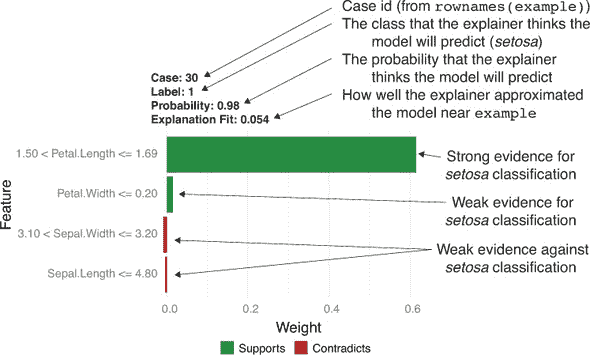

解释器期望模型预测此示例是 *setosa*（标签 = 1），并且该示例的 `Petal.Length` 值是支持此预测的强烈证据。

LIME 的工作原理

为了更好地理解 LIME 的解释，并诊断解释是否可信，了解 LIME 的高层次工作原理很有帮助。图 6.23 高层次地概述了 LIME 对分类器的处理过程。该图显示了以下要点：

+   *模型的决策表面*。分类器的*决策表面*是在变量空间中分隔模型将数据点分类为正例（在我们的例子中，作为“*setosa*”）和将其分类为负例（在我们的例子中，作为“not *setosa*”）的表面。

+   图中标记为圆圈加号的*我们想要解释的数据点*。在图中，该数据点是一个正例。在接下来的解释中，我们将称这个点为“原始示例”或`example`。

+   算法创建并给模型评估的*合成数据点*。我们将详细说明合成示例是如何产生的。

+   *LIME 对我们要解释的示例附近的决策表面的估计*。我们将详细说明 LIME 是如何得出这个估计的。

图 6.23。LIME 工作原理的概念草图

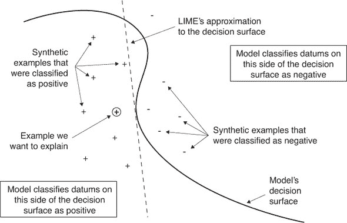

程序如下：

1.  “抖动”原始示例以生成与它相似的合成示例。你可以将每个抖动点视为原始示例，其中每个变量的值略有变化。例如，如果原始示例是

    ```
    Sepal.Length Sepal.Width Petal.Length Petal.Width
             5.1         3.5          1.4         0.2
    ```

    那么一个抖动点可能为

    ```
    Sepal.Length Sepal.Width Petal.Length Petal.Width
        5.505938    3.422535       1.3551   0.4259682
    ```

    为了确保合成示例是合理的，LIME 使用训练集中数据的分布来生成抖动数据。在我们的讨论中，我们将称合成示例的集合为 `{s_i}`。图 6.23 显示了作为额外正号和负号的合成数据。请注意，抖动是随机的。这意味着在同一个示例上多次运行 `explain()` 将每次产生不同的结果。如果 LIME 的解释是强有力的，结果应该不会太不同，这样解释在数量上仍然相似。在我们的案例中，`Petal.Length`很可能总是作为权重最大的变量出现；只是`Petal.Length`的权重及其与其他变量的关系会有所不同。

1.  使用模型对所有合成示例进行预测 `{y_i}`。在图 6.23 中，正号表示模型被分类为正例的合成示例，负号表示模型被分类为负例的合成示例。LIME 将使用 `{y_i}` 的值来了解模型在原始示例附近的决策表面看起来像什么。在图 6.23 中，决策表面是分隔模型将数据点分类为正例的区域和将其分类为负例的区域的大型曲线结构。

1.  将 {`y_i`} 作为 {`s_i`} 的函数拟合一个 *m*- 维线性模型。线性模型是 LIME 对原始模型决策表面的估计，如图 6.23 图 中的虚线所示。使用线性模型意味着 LIME 假设模型的决策表面在 `example` 附近的局部区域是线性的（平坦的）。你可以将 LIME 的估计看作是最准确地分离正合成示例和负合成示例的平坦表面（在图中，它是一条线）。线性模型的 R²（在 图 6.22 中报告为“解释拟合”）表明这一假设得到了多好的满足。如果解释拟合接近 0，那么就没有一个平坦的表面能够很好地将正例和负例分开，LIME 的解释可能不可靠。你通过函数 `explain()` 中的 `n_features` 参数指定 *m* 的值。在我们的例子中，我们使用四个特征（所有特征）来拟合线性模型。当有大量特征（如文本处理中）时，LIME 会尝试选择最佳的 *m* 个特征来拟合模型。线性模型的系数给出了解释中特征的权重。对于分类，一个大的正权重意味着相应的特征是模型预测的有力证据，而一个大的负权重意味着相应的特征是反对模型预测的有力证据。

将步骤作为一个整体来考虑

这可能看起来有很多步骤，但它们都由 `lime` 包提供了一个方便的包装器。总的来说，这些步骤是在实现一个简单的反事实问题的解决方案：如果给定的示例有不同的属性，它的评分会有何不同？总结强调了最重要的合理变化。

回到鸢尾花示例

让我们再挑选几个示例，并解释模型对这些示例的预测。

列表 6.20\. 更多鸢尾花示例

```
(example <- test[c(13, 24), 1:4])

##     Sepal.Length Sepal.Width Petal.Length Petal.Width
## 58           4.9         2.4          3.3         1.0
## 110          7.2         3.6          6.1         2.5

test$class[c(13,24)]                                 ❶
## [1] 0 0

round(predict(model, newdata=as.matrix(example)))    ❷
## [1] 0 0

explanation <- explain(example,
                          explainer,
                          n_labels = 1,
                          n_features = 4,
                          kernel_width = 0.5)

plot_features(explanation)
```

❶ 这两个示例都是负的（不是 setosa）。

❷ 模型预测这两个示例都是负的。

解释器期望模型会预测这两个示例都不是 *setosa*（标签 = 0）。对于案例 110（`example` 的第二行和 图 6.24 的右侧图），这又是由于 `Petal.Length`。案例 58（图 6.24 的左侧图）看起来很奇怪：大部分证据似乎都与预期的分类相矛盾！请注意，案例 58 的解释拟合相当小：它比案例 110 的拟合小一个数量级。这告诉你，你可能不想相信这个解释。

图 6.24\. 两个鸢尾花示例的解释

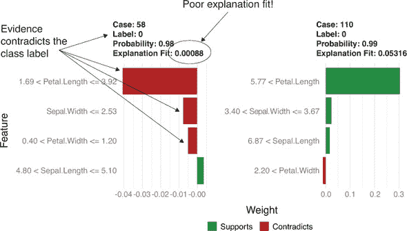

让我们看看这三个例子与鸢尾花数据的其余部分如何比较。图 6.25 显示了数据中花瓣和萼片尺寸的分布，其中三个样本案例被标记出来。

图 6.25\. 不同物种花瓣和萼片尺寸的分布

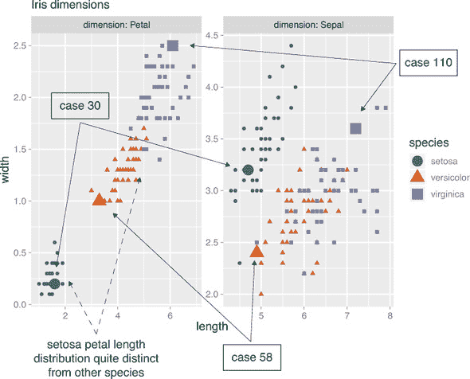

从图 6.25 中可以看出，花瓣长度强烈区分了*setosa*与其他的鸢尾花物种。就花瓣长度而言，案例 30 显然是*setosa*，而案例 110 显然不是。案例 58 似乎不是*setosa*，因为花瓣长度，但如前所述，案例 58 的整个解释相当差，可能是因为案例 58 位于模型决策曲面上的一种类型的拐点上。

现在我们尝试在一个更大的例子上使用 LIME。

### 6.3.3\. LIME 用于文本分类

* * *

示例

*在这个例子中，你将使用互联网电影数据库（IMDB）中的电影评论进行分类。任务是识别正面评论。*

* * *

为了方便，我们将原始存档中的数据转换为两个 RDS 文件，`IMDBtrain.RDS`和`IMDBtest.RDS`，它们可以在[`github.com/WinVector/PDSwR2/tree/master/IMDB`](https://github.com/WinVector/PDSwR2/tree/master/IMDB)找到。每个 RDS 对象包含两个元素：一个表示 25,000 条评论的字符向量，以及一个表示数值标签的向量，其中 1 表示正面评论，0 表示负面评论.^([13]) 你将再次拟合一个`xgboost`模型来对评论进行分类。

> ^{(12)}
> 
> 原始数据可以在[`s3.amazonaws.com/text-datasets/aclImdb.zip`](http://s3.amazonaws.com/text-datasets/aclImdb.zip)找到。
> 
> ^{(13)}
> 
> 创建 RDS 文件所使用的提取/转换脚本可以在[`github.com/WinVector/PDSwR2/tree/master/IMDB/getIMDB.R`](https://github.com/WinVector/PDSwR2/tree/master/IMDB/getIMDB.R)找到。

你可能会想知道 LIME 是如何抖动文本数据的。它是通过随机从文档中删除单词来做到这一点的，然后将生成的新文本转换为模型适当的表示。如果删除一个单词倾向于改变文档的分类，那么这个单词可能对模型很重要。

首先，加载训练集。确保你已经将 RDS 文件下载到你的工作目录中。

列表 6.21\. 加载 IMDB 训练数据

```
library(zeallot)                                 ❶

c(texts, labels) %<-% readRDS("IMDBtrain.RDS")   ❷
```

❶ 加载 zeallot 库。如果失败，则调用 install.packages(“zeallot”)。

❷ 命令 read(IMDBtrain.RDS)返回一个列表对象。使用 zeallot 赋值箭头%<-%将列表解包成两个元素：texts 是一个包含评论的字符向量，labels 是一个 0/1 的类别标签向量。标签 1 表示正面评论。

你可以检查评论及其相应的标签。这里有一个正面评论：

```
list(text = texts[1], label = labels[1])
## $text
## train_21317
## train_21317
## "Forget depth of meaning, leave your logic at the door, and have a
## great time with this maniacally funny, totally absurdist, ultra-
## campy live-action \"cartoon\". MYSTERY MEN is a send-up of every
## superhero flick you've ever seen, but its unlikelysuper-wannabes
## are so interesting, varied, and well-cast that they are memorable
## characters in their own right. Dark humor, downright silliness,
## bona fide action, and even a touchingmoment or two, combine to
## make this comic fantasy about lovable losers a true winner. The
## comedic talents of the actors playing the Mystery Men --
## including one Mystery Woman -- are a perfect foil for Wes Studi
## as what can only be described as a bargain-basement Yoda, and
## Geoffrey Rush as one of the most off-the-wall (and bizarrely
## charming) villains ever to walk off the pages of a Dark Horse
## comic book and onto the big screen. Get ready to laugh, cheer,
## and say \"huh?\" more than once.... enjoy!"
##
## $label
## train_21317
##           1
```

这里有一个负面评论：

```
list(text = texts[12], label = labels[12])
## $text
## train_385
## train_385
## "Jameson Parker And Marilyn Hassett are the screen's most unbelievable
## couple since John Travolta and Lily Tomlin. Larry Peerce's direction
## wavers uncontrollably between black farce and Roman tragedy. Robert
## Klein certainly think it's the former and his self-centered  performance
## in a minor role underscores the total lack of balance and chemistry
## between the players in the film. Normally, I don't like to let myself
## get so ascerbic, but The Bell Jar is one of my all-time favorite books,
## and to watch what they did with it makes me literally crazy."
##
## $label
## train_385
##         0
```

为建模表示文档

对于我们的文本模型，特征是单个词，有很多这样的词。为了使用 `xgboost` 在文本上拟合模型，我们必须构建一个有限的特征集，或称为 *词汇表*。词汇表中的词是模型唯一考虑的特征。

我们不想使用太常见的词，因为出现在正面评论和负面评论中的常见词不会提供信息。我们也不想使用太罕见的词，因为很少出现在评论中的词并不那么有用。对于这个任务，让我们将“太常见”定义为出现在超过一半的训练文档中的词，将“太罕见”定义为出现在不到 0.1%的文档中的词。

我们将使用 `text2vec` 包构建一个包含 10,000 个词的词汇表，这些词不太常见也不太罕见。为了简洁，我们将该过程封装在函数 `create_pruned_vocabulary()` 中，该函数接受文档向量作为输入并返回一个词汇表对象。`create_pruned_vocabulary()` 函数的源代码位于 [`github.com/WinVector/PDSwR2/tree/master/IMDB/lime_imdb_example.R`](https://github.com/WinVector/PDSwR2/tree/master/IMDB/lime_imdb_example.R)。

一旦我们有了词汇表，我们必须将文本（再次使用 `text2vec`）转换为 `xgboost` 可以使用的数值表示。这种表示称为 *文档-词矩阵*，其中行表示语料库中的每个文档，每列表示词汇表中的一个词。对于文档-词矩阵 `dtm`，`dtm[i, j]` 是词汇表词 `w[j]` 在文档 `texts[i]` 中出现的次数。参见 图 6.26。请注意，这种表示会丢失文档中词的顺序。

图 6.26\. 创建文档-词矩阵

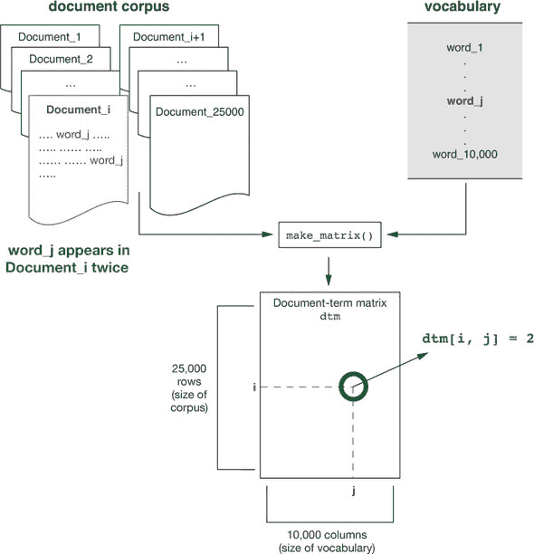

文档-词矩阵将会相当大：25,000 行乘以 10,000 列。幸运的是，词汇表中的大多数词不会出现在给定的文档中，所以每一行将主要是零。这意味着我们可以使用一种特殊表示，称为 *稀疏矩阵*，该矩阵以空间高效的方式表示大型、主要为零的矩阵。

我们将这个转换封装在函数 `make_matrix()` 中，该函数接受文本向量和词汇表作为输入，并返回一个稀疏矩阵。与鸢尾花示例一样，我们还把模型拟合封装在函数 `fit_imdb_model()` 中，该函数接受文档词矩阵和数值文档标签作为输入，并返回一个 `xgboost` 模型。这些函数的源代码也位于 [`github.com/WinVector/PDSwR2/tree/master/IMDB/lime_imdb_example.R`](https://github.com/WinVector/PDSwR2/tree/master/IMDB/lime_imdb_example.R)。

### 6.3.4\. 训练文本分类器

在将 `lime_imdb_example.R` 下载到您的当前工作目录后，您可以从训练数据中创建词汇表和文档-词矩阵，并拟合模型。这可能需要一些时间。

列表 6.22\. 转换文本并拟合模型

```
source("lime_imdb_example.R")

vocab <- create_pruned_vocabulary(texts)      ❶
dtm_train <- make_matrix(texts, vocab)        ❷
model <- fit_imdb_model(dtm_train, labels)    ❸
```

❶ 从训练数据创建词汇表

❷ 创建训练语料库的文档-词矩阵

❸ 训练模型

现在加载测试语料库并评估模型。

列表 6.23\. 评估评论分类器

```
c(test_txt, test_labels) %<-%  readRDS("IMDBtest.RDS")               ❶
dtm_test <- make_matrix(test_txt, vocab)                             ❷

predicted <- predict(model, newdata=dtm_test)                        ❸

teframe <- data.frame(true_label = test_labels,
                         pred = predicted)                           ❹

(cmat <- with(teframe, table(truth=true_label, pred=pred > 0.5)))    ❺

##      pred
## truth FALSE  TRUE
##     0 10836  1664
##     1  1485 11015

sum(diag(cmat))/sum(cmat)                                            ❻
## [1] 0.87404

library(WVPlots)
DoubleDensityPlot(teframe, "pred", "true_label",
                  "Distribution of test prediction scores")          ❻
```

❶ 读取测试语料库

❷ 将语料库转换为文档-词矩阵

❸ 在测试语料库上做出预测(概率)

❹ 创建包含真实标签和预测标签的框架

❺ 计算混淆矩阵

❻ 计算准确率

❻ 绘制预测分布

根据其在测试集上的表现，模型在分类评论方面做得很好，但并不完美。测试预测分数的分布(图 6.27)显示，大多数负评(类别 0)得分低，大多数正评(类别 1)得分高。然而，也有一些正评得分接近 0，一些负评得分接近 1。还有一些评论得分接近 0.5，这意味着模型对这些看似模糊的评论完全不确定。你希望改进分类器，在这些看似模糊的评论上做得更好。

图 6.27\. 测试预测分数的分布

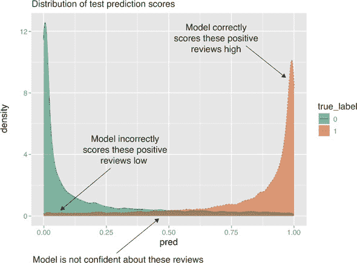

### 6.3.5\. 解释分类器的预测

尝试解释几个示例评论的预测，以了解模型。首先，从训练数据和模型中构建解释器。对于文本模型，`lime()`函数需要一个预处理函数，该函数将训练文本和合成示例转换为模型所需的文档-词矩阵。

列表 6.24\. 为文本分类器构建解释器

```
explainer <- lime(texts, model = model,
                  preprocess = function(x) make_matrix(x, vocab))
```

现在从测试语料库中取一个简短的样本文本。这条评论是积极的，模型预测它是积极的。

列表 6.25\. 解释模型对评论的预测

```
casename <- "test_19552";
sample_case <- test_txt[casename]
pred_prob <- predict(model, make_matrix(sample_case, vocab))
list(text = sample_case,
     label = test_labels[casename],
     prediction = round(pred_prob) )

## $text
## test_19552
## "Great story, great music. A heartwarming love story that's beautiful to
## watch and delightful to listen to. Too bad there is no soundtrack CD."
##
## $label
## test_19552
##          1
##
## $prediction
## [1] 1
```

现在用五个最有力的证据词来解释模型的分类。影响预测最多的单词在图 6.28 中显示。

图 6.28\. 样本评论的预测解释

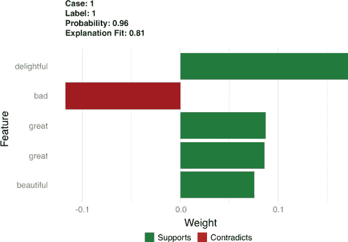

列表 6.26\. 解释模型的预测

```
explanation <- lime::explain(sample_case,
                       explainer,
                       n_labels = 1,
                       n_features = 5)

plot_features(explanation)
```

在列表 6.26 中，你使用了`plot_features()`来可视化解释，就像在`iris`示例中做的那样，但`lime`还有一个针对文本的特殊可视化，即`plot_text_explanations()`。

如图 6.29 所示，`plot_text_explanations()`突出了文本中的关键词，绿色代表支持证据，红色代表矛盾。证据越强，颜色越深。在这里，解释器期望模型会根据单词*delightful*、*great*和*beautiful*预测这条评论是积极的，尽管有单词*bad*。

```
plot_text_explanations(explanation)
```

图 6.29\. 列表 6.26 中预测的文本解释

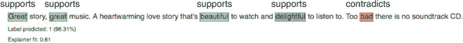

让我们再看几篇评论，包括一篇模型分类错误的评论。

列表 6.27. 检查两篇更多的评论

```
casenames <-  c("test_12034", "test_10294")
sample_cases <- test_txt[casenames]
pred_probs <- predict(model, newdata=make_matrix(sample_cases, vocab))
list(texts = sample_cases,
     labels = test_labels[casenames],
     predictions = round(pred_probs))

## $texts
## test_12034
## "I don't know why I even watched this film. I think it was because
## I liked the idea of the scenery and was hoping the film would be
## as good. Very boring and pointless."
##
## test_10294
## "To anyone who likes the TV series: forget the movie. The jokes
## are bad and some topics are much too sensitive to laugh about it.
## <br /><br />We have seen much better acting by R. Dueringer in
## \"Hinterholz 8\"".
##
## $labels
## test_12034 test_10294                          ❶
##          0          0
##
## $predictions                                   ❷
## [1] 0 1

explanation <- lime::explain(sample_cases,
                                    explainer,
                                    n_labels = 1,
                                    n_features = 5)

plot_features(explanation)
plot_text_explanations(explanation)
```

❶ 这两篇评论都是负面的。

❷ 模型错误地将第二篇评论分类。

如图 6.30 所示，解释器预计模型将主要基于单词*pointless*和*boring*将第一篇评论分类为负面。它预计模型将基于单词*8*、*sensitive*和*seen*将第二篇评论分类为正面，尽管有单词*bad*和（有些令人惊讶地）*better*。

图 6.30. 列表 6.27 中的两个样本评论的解释可视化

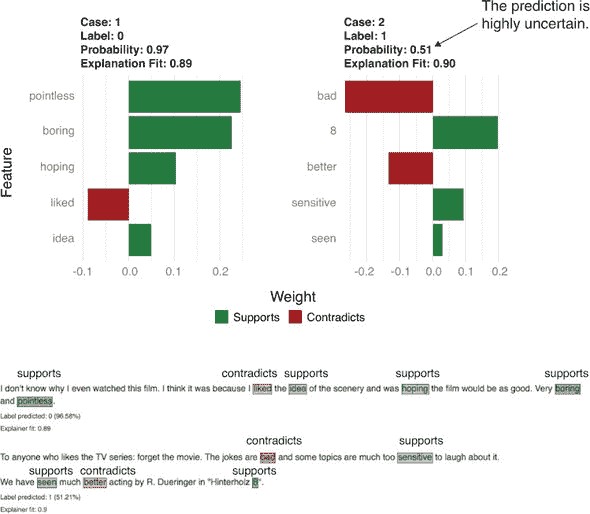

注意，根据图 6.30，第二次评论的分类概率似乎为 0.51——换句话说，解释器预计模型对其预测将完全没有把握。让我们将其与模型在现实中的预测进行比较：

```
predict(model, newdata=make_matrix(sample_cases[2], vocab))
## [1] 0.6052929
```

模型实际上以 0.6 的概率预测标签 1：这不是一个自信的预测，但比解释器估计的要稍微自信一些（尽管仍然是错误的）。差异在于解释器返回的标签和概率来自模型线性近似的预测，*而不是*来自模型本身。你偶尔甚至可能会看到解释器和模型对同一示例返回不同的标签的情况。这通常发生在解释器拟合不佳时，因此你根本不应该相信那些解释。

作为负责分类评论的数据科学家，你可能会对数字*8*看似很高的重要性感到好奇。经过反思，你可能记得一些电影评论中包含评分“8 分/10 分”，或者“8/10”。这可能会让你考虑在将评论传递给文本处理器之前提取明显的评分，并将它们作为额外的特殊特征添加到模型中。你可能也不喜欢使用像*seen*或*idea*这样的词作为特征。

作为一项简单的实验，你可以尝试从词汇表中移除数字 1 到 10，然后重新调整模型。新的模型正确地分类了`test_10294`，并返回了一个更合理的解释，如图 6.31 所示。

> ^(14)
> 
> 这涉及到将数字 1 到 10 作为字符串添加到文件 lime_imdb_example.R 中`create_pruned_vocabulary()`函数的停用词列表中。我们将重新创建词汇表和文档-词矩阵，以及重新调整评论分类器，作为读者的练习。

图 6.31. `test_10294`的解释可视化

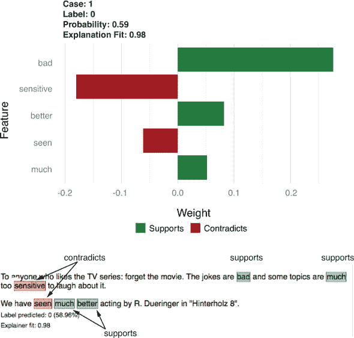

查看模型对其他被错误分类的评论的解释可以引导你改进特征工程或数据预处理，这可能会提高你的模型。你可能会决定，单词序列（*好主意*，而不是仅仅*主意*）是更好的特征。或者你可能会决定，你想要一个文本表示和模型，它查看文档中单词的顺序，而不仅仅是单词频率。无论如何，查看模型对边缘情况的预测解释可以让你对你的模型有更深入的了解，并帮助你决定如何更好地实现你的建模目标。

## 摘要

你现在对如何选择建模技术有了些稳固的想法。你也知道了如何评估数据科学工作的质量，无论是自己的还是他人的。本书第二部分第二部分的剩余章节将更详细地介绍如何构建、测试和交付有效的预测模型。在下一章，我们将实际开始构建预测模型。

在本章中，你学习了

+   如何将你想要解决的问题与适当的建模方法相匹配。

+   如何划分你的数据以进行有效的模型评估。

+   如何计算用于评估分类模型的各项指标。

+   如何计算用于评估评分（回归）模型的各项指标。

+   如何计算用于评估概率模型的各项指标。

+   如何使用`lime`包解释模型中的单个预测。
