# 第七章 线性和逻辑回归

本章涵盖

+   使用线性回归预测数量

+   使用逻辑回归预测概率或类别

+   从线性模型中提取关系和建议

+   解释 R 的`lm()`调用中的诊断信息

+   解释 R 的`glm()`调用中的诊断信息

+   使用`glmnet`包通过正则化来解决线性模型可能出现的各种问题。

在上一章中，你学习了如何评估模型。现在我们有了讨论模型是好是坏的能力，我们将继续到建模步骤，如图 7.1 中的心理模型所示。在本章中，我们将介绍如何在 R 中拟合和解释*线性模型*。

图 7.1. 心理模型


当你不仅想要预测一个结果，还想了解输入变量与结果之间的关系时，线性模型特别有用。这种知识可能非常有用，因为这种关系通常可以用作如何获得你想要的结果的*建议*。

我们首先定义*线性回归*，然后用它来预测客户收入。之后，我们将使用*逻辑回归*来预测新生儿需要额外医疗注意力的概率。我们还将介绍 R 在拟合线性或逻辑模型时产生的诊断信息。

线性方法可以在出人意料广泛的情境中有效工作。然而，当模型的输入变量相关或*共线性*时，可能会出现问题。在逻辑回归的情况下，当变量子集在训练数据的一个子集中完美预测分类输出时，也可能出现问题（具有讽刺意味的是）。本章的最后部分将展示如何通过一种称为*正则化*的技术来解决这些问题。

## 7.1. 使用线性回归

线性回归是统计学家和数据科学家常用的预测方法。如果你试图预测像利润、成本或销售量这样的数值量，你应该首先尝试线性回归。如果它工作得很好，你就完成了；如果它失败了，产生的详细诊断信息可以给你一个很好的线索，告诉你下一步应该尝试什么方法。

### 7.1.1. 理解线性回归

* * *

示例

*假设你想预测一个正在节食和锻炼计划中的人一个月内会减掉多少磅。你将基于该人的其他事实来做出预测，比如他们在这个月平均每天减少多少卡路里摄入量，以及他们每天锻炼多少小时。换句话说，对于每个人* `i`*，你想要根据* `daily_cals_down[i]` *和* `daily_exercise[i]`*来预测* `pounds_lost[i]`*。*

* * *

线性回归假设结果`pounds_lost`与每个输入`daily_cals_down[i]`和`daily_exercise[i]`线性相关。这意味着（例如）`daily_cals_down[i]`与`pounds_lost`之间的关系看起来像一条（有噪声的）直线，如图 7.2 所示。1

> ¹
> 
> 很有希望希望`b0J = bC0 + be0`或者`b.calsJ = b.cals`；然而，联合回归并不能保证这一点。

图 7.2。`daily_cals_down`与`pounds_lost`之间的线性关系


`daily_exercise`与`pounds_lost`之间的关系也会是直线。假设图 7.2 中显示的线的方程是

```
pounds_lost = bc0 + b.cals * daily_cals_down
```

这意味着对于`daily_cals_down`（每减少一卡路里）的每单位变化，`pounds_lost`的值会通过`b.cals`变化，无论`daily_cals_down`的起始值是多少。为了具体说明，假设`pounds_lost = 3 + 2 * daily_cals_down`。那么增加`daily_cals_down`一个单位，`pounds_lost`也会增加 2，无论你从什么值开始。对于像`pounds_lost = 3 + 2 * (daily_cals_down²)`这样的例子，这就不成立了。

线性回归进一步假设总减重是变量`daily_cals_down[i]`和`daily_exercise[i]`的*线性组合*，或者说是由于减少卡路里摄入量和运动导致的减重之和。这给我们带来了以下线性回归模型形式的`pounds_lost`：

```
pounds_lost[i] = b0 + b.cals * daily_cals_down[i] +
     b.exercise * daily_exercise[i]
```

线性回归的目标是找到`b0`、`b.cals`和`b.exercise`的值，使得`daily_cals_lost[i]`和`daily_exercise[i]`的线性组合（加上一些偏移量`b0`）对于训练数据中的所有人员`i`的`pounds_lost[i]`都非常接近。

让我们用更普遍的术语来表述。假设`y[i]`是你想要预测的数值量（称为*因变量*或*响应变量*），而`x[i,]`是与输出`y[i]`相对应的一行输入（`x[i,]`是*自变量*或*解释变量*）。线性回归试图找到一个函数*f*(*x*)，使得

公式 7.1。线性回归模型的表示

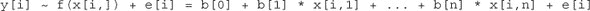

你想要找到数字`b[0],...,b[n]`（称为*系数*或*贝塔*），使得对于训练数据中的所有`(x[i,],y[i])`对，`f(x[i,])`尽可能接近`y[i]`。R 提供了一个单行命令来找到这些系数：`lm()`。

公式 7.1 中的最后一项`e[i]`代表所谓的*非系统误差*，或噪声。非系统误差被定义为具有均值为`0`（因此它们不代表净向上或净向下的偏差）并且与`x[i,]`不相关。换句话说，`x[i,]`不应该包含关于`e[i]`的信息（反之亦然）。

通过假设噪声是无系统的，线性回归试图拟合所谓的“无偏”预测器。这另一种说法是，预测器在整个训练集上“平均”得到正确答案，或者说它低估的量与高估的量大致相等。特别是，无偏估计往往能得到总数正确。

* * *

示例

*假设你已拟合一个线性回归模型来预测基于卡路里摄入量减少和锻炼的体重减轻。现在考虑训练数据集中的`LowExercise`组，该组的人每天锻炼时间在零到一小时之间。这些受试者共同在研究过程中减掉了总共 150 磅。模型预测他们会减掉多少体重？*

* * *

使用线性回归模型时，如果你将`LowExercise`组中所有受试者的预测体重减轻值加起来，这个总和将是 150 磅，这意味着模型正确预测了`LowExercise`组一个人的平均体重减轻，尽管有些人减掉的重量超过了模型的预测，有些人减掉的重量少于模型预测。在商业环境中，正确计算这样的总和是至关重要的，尤其是在汇总货币金额时。

在这些假设（线性关系和无系统噪声）下，线性回归在寻找最佳系数`b[i]`方面是绝对不懈的。如果有某种有利的特点组合或特征消除，它也会找到。线性回归不做的一件事是将变量重塑为线性。奇怪的是，即使实际关系不是线性的，线性回归通常也能做得很好。

* * *

思考线性回归

当使用线性回归时，你会在“加法太简单无法工作”和“如何估计系数？”之间来回摇摆。这是自然的，源于该方法既简单又强大。我们的朋友菲利普·阿普斯总结了这一点：“你必须起得很早才能打败线性回归。”

* * *

当线性回归的假设被违反时

作为一个小例子，考虑只用线性函数加上一个常数来拟合整数 1 到 10 的平方。我们要求系数`b[0]`和`b[1]`，使得

```
x[i]² nearly equals b[0] + b[1] * x[i]
```

显然，这个问题是不公平的，因为我们知道我们试图预测的不是线性的。然而，在这种情况下，线性回归仍然做得相当不错。它选择了以下拟合：

```
x[i]² nearly equals -22 + 11 * x[i]
```

如图 7.3 所示，这是我们在训练区域的一个良好拟合。

图 7.3\. y=x²的拟合与实际值


图 7.3 中的例子是线性回归在“实际应用中”的典型用法——我们使用线性模型来预测本身不是线性的东西。请注意，这是一个小错误。特别是，请注意，模型预测与真实`y`之间的误差不是随机的，而是系统的：模型在特定的`x`范围内低估，在其他范围内高估。这不是理想的，但通常是我们能做的最好的。请注意，在本例中，预测在拟合的端点附近偏离真实结果更远，这表明这个模型可能不适合在模型在训练数据中观察到的`x`范围之外使用。

* * *

外推法不如内插法安全

通常，您应该只尝试使用模型进行*内插法*：预测训练数据范围内的新的数据。*外推法*（预测训练数据观察范围之外的新的数据）对任何模型来说都更具风险。对于线性模型来说，除非您知道您正在建模的系统确实是线性的，否则这尤其危险。

* * *

接下来，我们将通过一个例子来展示如何将线性回归应用于更有趣的实时数据。

介绍 PUMS 数据集

* * *

示例

*假设您想预测任何公众人物的相对百分比的个人收入，给定他们的年龄、教育和其他人口统计变量。除了预测收入外，您还有一个次要目标：确定学士学位对收入的影响，相对于完全没有学位的情况。*

* * *

对于这个任务，您将使用 2016 年美国人口普查 PUMS 数据集。为了简化，我们已经准备了一个小样本的 PUMS 数据用于本例。数据准备步骤包括以下内容：

+   将数据限制为 20 至 50 岁之间的全职员工，收入在 1,000 美元至 250,000 美元之间。

+   将数据划分为训练集`dtrain`和测试集`dtest`。

我们可以通过将 psub.RDS（您可以从[`github.com/WinVector/PDSwR2/raw/master/PUMS/psub.RDS`](https://github.com/WinVector/PDSwR2/raw/master/PUMS/psub.RDS)下载）加载到工作目录中，并执行以下列表中的步骤来继续这个例子.^([1])

> ¹
> 
> 准备数据样本的脚本可以在[`github.com/WinVector/PDSwR2/blob/master/PUMS/makeSubSample.Rmd`](https://github.com/WinVector/PDSwR2/blob/master/PUMS/makeSubSample.Rmd)找到。

列表 7.1\. 加载 PUMS 数据并拟合模型

```
psub <- readRDS("psub.RDS")

set.seed(3454351)
gp <- runif(nrow(psub))                                               ❶

dtrain <- subset(psub, gp >= 0.5)                                     ❷
 dtest <- subset(psub, gp < 0.5)

model <- lm(log10(PINCP) ~ AGEP + SEX + COW + SCHL, data = dtrain)    ❸
 dtest$predLogPINCP <- predict(model, newdata = dtest)                ❹
 dtrain$predLogPINCP <- predict(model, newdata = dtrain)
```

❶ 通过随机变量对数据进行分组和划分

❷ 将数据 50-50 分成训练集和测试集

❸ 将线性模型拟合到对数收入

❹ 在测试集和训练集上获取预测的对数收入

PUMS 数据集的每一行代表一个单独的匿名个人或家庭。记录的个人数据包括职业、教育水平、个人收入以及许多其他人口统计变量。

对于这个例子，我们决定预测`log10(PINCP)`，即收入的对数。拟合对数转换后的数据通常会得到相对误差更小的结果，强调对较小收入的较小误差。但这种改进的相对误差是以引入偏差为代价的：平均而言，预测的收入将低于实际训练收入。预测`log(income)`的无偏替代方案是使用一种称为*泊松回归*的广义线性模型。我们将在第 7.2 节中讨论广义线性模型（特别是逻辑回归）。泊松回归是无偏的，但通常以更大的相对误差为代价。1]

> ¹
> 
> 关于讨论这些问题的系列文章，请参阅[`www.win-vector.com/blog/2019/07/link-functions-versus-data-transforms/`](http://www.win-vector.com/blog/2019/07/link-functions-versus-data-transforms/)。

对于本节的分析，我们将考虑输入变量年龄（`AGEP`）、性别（`SEX`）、工人类别（`COW`）和教育水平（`SCHL`）。输出变量是个人收入（`PINCP`）。我们还将设置*参考水平*，或“默认”性别为`M`（男性）；工人类别的参考水平为`私营营利性企业的雇员`；教育水平的参考水平为`无高中文凭`。我们将在本章后面讨论参考水平。

* * *

**参考水平是基线，而非价值判断**

当我们说默认性别为男性，默认教育水平为`无高中文凭`时，我们并不是暗示你应该期待典型工人是男性，或者典型工人没有高中文凭。变量的参考水平是其他变量值与之比较的基础水平。因此，我们说的是，在分析的这个阶段，我们可能想要比较具有相同特征的男女工人的收入，或者我们可能想要比较拥有高中文凭或学士学位的工人与没有高中文凭（但其他特征相同）的工人的收入。

默认情况下，R 会选择分类变量按字母顺序排列的第一个值作为参考水平。

* * *

现在开始构建模型。

### 7.1.2\. 构建线性回归模型

预测或寻找关系（建议）的第一步是构建线性回归模型。在 R 中构建线性回归模型的函数是`lm()`，由`stats`包提供。`lm()`函数最重要的参数是一个公式，其中用`~`代替等号。公式指定数据框中哪一列是要预测的量，以及要用于预测的列。

统计学家将需要预测的量称为*因变量*，将用于进行预测的变量/列称为*自变量*。我们发现将需要预测的量称为*y*，将用于预测的变量称为*x*更容易。我们的公式是：`log10(PINCP) ~ AGEP + SEX + COW + SCHL`，这可以读作“预测以年龄、性别、就业类别和教育为函数的收入的对数 10 为基数。”^([1])整体方法在图 7.4 中得到了演示。

> ¹
> 
> 回想一下第 4.2 节中关于对数正态分布的讨论，通常对货币量进行对数变换是有用的。对数变换也与我们的原始任务兼容，即使用相对误差（意味着大误差对小额收入的影响更大）来预测收入。第 7.2 节中的`glm()`方法可以用来避免对数变换，并以最小化平方误差的方式预测（因此，偏离$50,000 将被视为大额和小额收入相同的误差）。

图 7.4\. 使用`lm()`构建线性模型

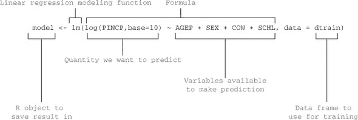

图 7.4 中的语句构建了线性回归模型，并将结果存储在名为`model`的新对象中。这个模型能够进行预测，并从数据中提取重要信息。

* * *

R 将训练数据存储在模型中

R 在其模型中保留了一份训练数据的副本，以提供在`summary(model)`中看到的残差信息。以这种方式保留数据的副本并非绝对必要，并且可能无谓地耗尽你的内存。如果你内存不足（或正在交换），你可以使用`rm()`命令删除 R 对象，如`model`。在这种情况下，你可以通过运行`rm("model")`来删除模型。

* * *

### 7.1.3\. 进行预测

一旦你调用了`lm()`函数来构建模型，你的第一个目标就是预测收入。在 R 中这样做很简单。要预测，你需要将数据传递给`predict()`方法。图 7.5 展示了如何使用测试数据框`dtest`和训练数据框`dtrain`来演示这一点。

图 7.5\. 使用线性回归模型进行预测

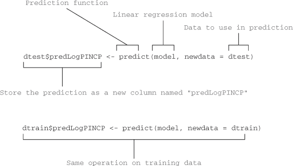

数据框列`dtest$predLogPINCP`和`dtrain$predLogPINCP`现在分别存储测试集和训练集的预测结果。我们现在已经产生了并应用了一个线性回归模型。

描述预测质量

在公开分享预测之前，你希望检查预测和模型的质量。我们建议将你试图预测的实际 `y`（在这种情况下，预测收入）作为你的预测的函数来绘制。在这种情况下，将 `log10(PINCP)` 作为 `predLogPINCP` 的函数来绘制。如果预测非常好，那么图上的点将排列在 `y=x` 线附近，我们称之为*完美预测线*（这个短语不是标准术语；我们用它来使讨论图形更容易）。在图 7.6 中展示的生成此图的步骤将在下一个列表中显示。

图 7.6\. 实际对数收入作为预测对数收入的函数的图

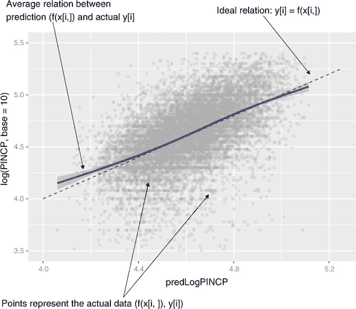

列表 7.2\. 将对数收入作为预测对数收入的函数进行绘图

```
library('ggplot2')
ggplot(data = dtest, aes(x = predLogPINCP, y = log10(PINCP))) +
   geom_point(alpha = 0.2, color = "darkgray") +
   geom_smooth(color = "darkblue") +
   geom_line(aes(x = log10(PINCP),                  ❶
                  y = log10(PINCP)),
             color = "blue", linetype = 2) +
   coord_cartesian(xlim = c(4, 5.25),               ❷
                    ylim = c(3.5, 5.5))
```

❶ 绘制 x=y 的线

❷ 限制图形范围以提高可读性

统计学家更喜欢图 7.7 中所示的残差图，其中残差误差（在这种情况下，`predLogPINCP - log10(PINCP)`）作为 `predLogPINCP` 的函数进行绘制。在这种情况下，完美预测线是 `y=0` 的线。注意，点从这个线散布很广（可能是低质量拟合的迹象）。图 7.7 中的残差图是用下一个列表中的 R 步骤准备的。

图 7.7\. 预测误差作为预测函数的图


列表 7.3\. 将残差收入作为预测对数收入的函数进行绘图

```
ggplot(data = dtest, aes(x = predLogPINCP,
                     y = predLogPINCP - log10(PINCP))) +
  geom_point(alpha = 0.2, color = "darkgray") +
  geom_smooth(color = "darkblue") +
  ylab("residual error (prediction - actual)")
```

* * *

**为什么预测而不是真实值在 x 轴上？**

在 x 轴上绘制预测，并在 y 轴上绘制真实值（如图 7.6 所示）或残差（如图 7.7 所示）的图与在 x 轴上绘制真实值并在 y 轴上绘制预测（或残差）的图所回答的问题不同。统计学家倾向于更喜欢图 7.7 中所示的图形。在 x 轴上有预测的残差图能让你根据模型输出判断模型可能存在低估或高估的情况。

如果在 x 轴上有真实结果并在 y 轴上有残差，那么几乎总是会显示出不希望的残差结构，即使没有建模问题。这种错觉是由于一种称为*回归到均值*或*回归到平庸*的效果造成的。

* * *

当你查看真实值与拟合值或残差图时，你正在寻找一些我们将在下文中讨论的具体内容。

平均而言，预测是否正确？

平滑曲线是否更靠近完美预测的直线？理想情况下，点将非常接近那条线，但如果你输入的变量没有很好地解释输出，你可能会得到一个更宽的点云（如我们在图 7.6 和 7.7 中看到的那样）。但如果平滑曲线沿着完美预测的直线并且“在点云的中间”，那么模型平均预测是正确的：它低估的量大约等于高估的量。

是否存在系统性误差？

如果平滑曲线过多地偏离了完美预测的直线，如图 7.8 所示，这表明在特定范围内存在系统性的低估或高估：误差与预测相关。系统性误差表明系统“线性程度”不够，线性模型不适合，因此你应该尝试本书后面将要讨论的不同建模方法之一。

图 7.8\. 模型预测中的系统性误差示例

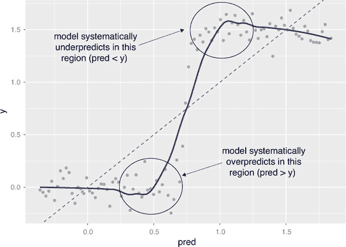

R-squared 和 RMSE

除了检查图表外，你还应该对预测质量和残差进行定量总结。衡量预测质量的一个标准指标称为*R-squared*，我们在第 6.2.4 节中讨论过。R-squared 是衡量模型“拟合”数据程度或其“拟合优度”的指标。你可以使用以下列表中的 R 步骤计算预测和实际`y`之间的 R-squared。

列表 7.4\. 计算 R-squared

```
rsq <- function(y, f) { 1 - sum((y - f)²)/sum((y - mean(y))²) }

rsq(log10(dtrain$PINCP), dtrain$predLogPINCP)     ❶
 ## [1] 0.2976165

rsq(log10(dtest$PINCP), dtest$predLogPINCP)       ❷
 ## [1] 0.2911965
```

❶ 训练数据上的模型 R-squared

❷ 测试数据上的模型 R-squared

R-squared 可以理解为`y`变化的多少部分是由模型解释的。你希望 R-squared 相当大（1.0 是你可以达到的最大值）并且测试和训练数据上的 R-squared 相似。测试数据上的 R-squared 显著低于这是过度拟合模型的症状，这种模型在训练中看起来很好，但在生产中却不起作用。在这种情况下，训练和测试数据的 R-squared 大约都是 0.3。我们希望看到高于这个值（比如，0.7–1.0）。所以模型质量低，但不是过度拟合。

对于拟合良好的模型，R-squared 也等于预测值与实际训练值之间的相关性的平方.^([1])

> ¹
> 
> 查看[`www.win-vector.com/blog/2011/11/correlation-and-r-squared/`](http://www.win-vector.com/blog/2011/11/correlation-and-r-squared/)。

* * *

**R-squared 可能过于乐观**

通常，训练数据上的 R-squared 对于具有更多输入参数的模型会更高，无论这些额外变量是否真正改善了模型。这就是为什么许多人更喜欢调整后的 R-squared（我们将在本章后面讨论）。

此外，R-squared 与相关系数有关，如果模型正确预测了几个异常值，相关系数可能会被人为地夸大。这是因为增加的数据范围使得整体数据云相对于完美预测线看起来“更紧密”。以下是一个玩具示例。设`y <- c(1,2,3,4,5,9,10)`和`pred <- c(0.5,0.5,0.5, 0.5,0.5,9,10)`。这对应于一个模型，对于前五个点与真实结果完全不相关，并且完美预测了最后两个点，这两个点与前面的五个点有些距离。你可以自己检查这个明显较差的模型具有约 0.926 的相关系数`cor(y, pred)`，相应的 R-squared 为 0.858。因此，在检查 R-squared 的同时，查看测试数据的真实值与拟合值图是一个很好的想法。

* * *

另一个值得考虑的良好度量是*均方根误差*（RMSE）。

列表 7.5\. 计算均方根误差

```
rmse <- function(y, f) { sqrt(mean( (y-f)² )) }

rmse(log10(dtrain$PINCP), dtrain$predLogPINCP)      ❶
 ## [1] 0.2685855

rmse(log10(dtest$PINCP), dtest$predLogPINCP)        ❷
 ## [1] 0.2675129
```

❶ 模型在训练数据上的均方根误差（RMSE）

❷ 模型在测试数据上的均方根误差（RMSE）

你可以将 RMSE 视为围绕完美预测线的数据云宽度的度量。我们希望 RMSE 尽可能小，实现这一目标的一种方法就是引入更多有用、解释性的变量。

### 7.1.4\. 寻找关系和提取建议

记住，你的另一个目标，除了预测收入之外，是找到拥有学士学位的价值。我们将展示如何直接从线性回归模型中读取这个价值以及其他数据中的关系。

线性回归模型中的所有信息都存储在一个称为*系数*的数字块中。系数可以通过`coefficients(model)`函数获得。我们的收入模型的系数在图 7.9 中显示。

图 7.9\. 模型系数

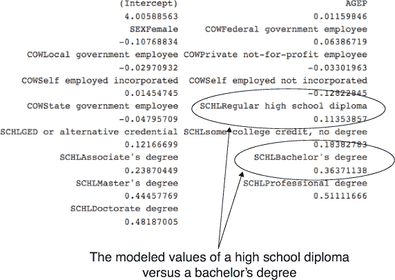

报告的系数

我们原始的建模变量只有`AGEP`、`SEX`、`COW`（工作类别）和`SCHL`（教育/学历）；然而，模型报告的系数比这四个还要多。我们将解释所有报告的系数是什么。

在图 7.9 中，有八个以`SCHL`开头的系数。原始变量`SCHL`取了这八个字符串值以及一个未显示的值：`no high school diploma`。每个可能的字符串被称为*水平*，而`SCHL`本身被称为*分类*或*因子*变量。未显示的水平被称为*参考水平*；其他水平的系数是以参考水平为基准测量的。

例如，在`SCHLBachelor's degree`中，我们找到了系数 0.36，这可以读作“模型为拥有学士学位相对于没有高中文凭的 10 对数收入提供了 0.36 的额外奖励。”你可以通过以下方式求解拥有学士学位的人与同等学历（相同性别、年龄和工作类别）但没有高中文凭的人之间的收入比率：

```
log10(income_bachelors) = log10(income_no_hs_degree) + 0.36
log10(income_bachelors) - log10(income_no_hs_degree) = 0.36
         (income_bachelors) / (income_no_hs_degree)  = 10^(0.36)
```

这意味着，拥有学士学位的人的收入将倾向于是 `10⁰.36`，或者说比没有高中文凭的同等人员高出 2.29 倍。

在 `SCHLRegular high school diploma` 下，我们发现系数为 0.11。这可以理解为“模型认为，相对于拥有高中文凭，拥有学士学位往往会使预测的对数收入增加 0.36-0.11 个单位。”

```
log10(income_bachelors) - log10(income_no_hs_degree) = 0.36
       log10(income_hs) - log10(income_no_hs_degree) = 0.11

log10(income_bachelors) - log10(income_hs) = 0.36 - 0.11         ❶
          (income_bachelors) / (income_hs)  = 10^(0.36 - 0.11)
```

❶ 从第二个方程中减去第一个方程

本科毕业生预期收入与高中毕业生（其他变量相等）之间的模型关系是 `10^(0.36 - 0.11)`，或者说大约高 1.8 倍。建议：如果你能找到工作，上大学是值得的（记住，我们只分析了完全就业的情况，所以这是假设你能找到工作）。

`SEX` 和 `COW` 也是离散变量，分别以 `Male` 和 `私人营利性公司员工` [公司] 为参考水平。对应于 `SEX` 和 `COW` 不同水平的系数可以以与教育水平相似的方式解释。`AGEP` 是一个系数为 0.0116 的连续变量。你可以将其解释为：年龄增加一年，对对数收入的增加贡献了 0.0116 的额外值；换句话说，年龄增加一年相当于收入增加 `10⁰.0116`，即增加了 1.027 倍——大约是收入的 2.7%增加（其他变量相等）。

系数 `(Intercept)` 对应于一个始终具有值为 `1` 的变量，这个变量在调用 `lm()` 函数时默认添加到线性回归模型中，除非你在公式调用中使用特殊的 `0+` 符号。解释截距的一种方式是将其视为“参考主体的预测”——也就是说，这个主体承担了所有分类输入的参考水平值，对于连续变量为零。请注意，这可能不是一个在物理上合理的主体。

在我们的例子中，参考主体将是一个没有高中文凭、年龄为零的男性私人营利性公司员工。如果这样的人存在，模型将预测他们的以 10 为底的对数收入约为 4.0，这对应于 1 万美元的收入。

* * *

**指标变量**

大多数建模方法通过将其转换为 *n*（或 *n*-1）个二元变量，或指标变量来处理具有 *n* 个可能水平的字符串值（分类）变量。R 有命令可以显式控制将字符串值变量转换为表现良好的指标变量：`as.factor()` 从字符串变量创建分类变量；`relevel()` 允许用户指定参考水平。

但要注意那些具有非常多的水平变量的情况，例如邮政编码。线性（和逻辑）回归的运行时间大致与系数数量的立方成正比。太多的水平（或太多的变量）将使算法变得缓慢，并需要更多的数据来进行可靠的推断。在第八章第八章中，我们将讨论处理此类高基数变量的方法，例如效果编码或影响编码。

* * *

之前对系数的解释假设模型已经提供了良好的系数估计。我们将在下一节中看到如何检查这一点。

### 7.1.5. 阅读模型摘要和描述系数质量

在第 7.1.3 节中，我们检查了我们的收入预测是否值得信赖。现在我们将展示如何检查模型系数是否可靠。这尤其重要，因为我们一直在讨论展示系数与其他系数的关系作为建议。

我们需要了解的大部分信息已经在模型摘要中，该摘要是通过`summary()`命令生成的：`summary(model)`。这产生了图 7.10 所示的输出。

图 7.10. 模型摘要

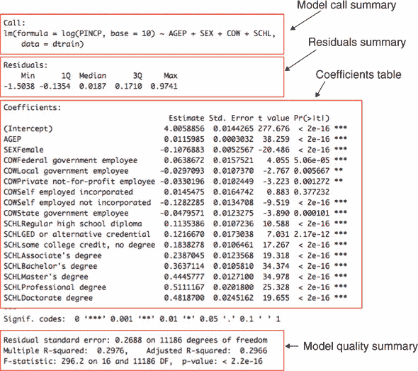

这个图看起来可能有些吓人，但它包含了很多有用的信息和诊断信息。当你展示结果时，你可能会被问到图 7.10 中的元素，所以我们将演示所有这些字段是如何得出的以及这些字段的意义。

我们首先将`summary()`分解成几个部分。

原始模型调用

`summary()`的第一部分是`lm()`模型的构建方式：

```
Call:
lm(formula = log10(PINCP) ~ AGEP + SEX + COW + SCHL,
    data = dtrain)
```

这是一个双重检查你是否使用了正确的数据框、执行了预期的转换以及使用了正确变量的好地方。例如，你可以再次检查你是否使用了数据框`dtrain`而不是数据框`dtest`。

残差摘要

`summary()`的下一部分是残差摘要：

```
Residuals:
    Min      1Q  Median      3Q     Max
-1.5038 -0.1354  0.0187  0.1710  0.9741
```

记住，残差是预测中的误差：`log10(dtrain$PINCP) - predict (model,newdata=dtrain)`。在线性回归中，残差是所有内容。你想要了解的关于模型拟合质量的大部分信息都在残差中。你可以计算训练集和测试集的残差的有用摘要，如下所示。

列表 7.6. 残差摘要

```
( resids_train <- summary(log10(dtrain$PINCP) -
      predict(model, newdata = dtrain)) )
##    Min. 1st Qu.  Median    Mean 3rd Qu.    Max.
## -1.5038 -0.1354  0.0187  0.0000  0.1710  0.9741

( resids_test <- summary(log10(dtest$PINCP) -
      predict(model, newdata = dtest)) )
##      Min.   1st Qu.    Median      Mean   3rd Qu.      Max.
## -1.789150 -0.130733  0.027413  0.006359  0.175847  0.912646
```

在线性回归中，系数被选择以最小化残差的平方和。这也是为什么这种方法也经常被称为*最小二乘法*。因此，对于好的模型，你期望残差很小。

在残差摘要中，你得到了 `Min.` 和 `Max.`，这是所见到的最小和最大残差。你还得到了残差的四分位数：`1st. Qu.`，或上界于数据前 25% 的值；`Median`，或上界于数据前 50% 的值；以及 `3rd Qu.`，或上界于数据前 75% 的值（`Max` 是第四四分位数：上界于 100% 的数据的值）。四分位数给你一个关于数据分布的大致概念。

你希望在残差摘要中看到的是中位数接近 0（如我们的示例所示），以及 `1st. Qu.` 和 `3rd Qu.` 大约与中位数等距（两者都不太大）。在我们的例子中，训练残差（`resids_train`）的 `1st. Qu.` 和 `3rd Qu.` 都大约离中位数 0.15。测试残差（0.16 和 0.15 离中位数）稍微不对称，但仍在范围内。

`1st. Qu.` 和 `3rd Qu.` 的四分位数很有趣，因为正好有一半的训练数据在这个范围内有残差。在我们的例子中，如果你随机抽取一个训练数据，其残差有 50% 的时间会在 –0.1354 到 0.1710 的范围内。所以你实际上期望经常看到这种规模的预测误差。如果这些误差对于你的应用来说太大，那么你没有一个可用的模型。

系数表

`summary(model)` 的下一部分是系数表，如图 7.11 所示。此表的矩阵形式可以通过 `summary(model)$coefficients` 获取。

图 7.11\. 模型摘要系数列

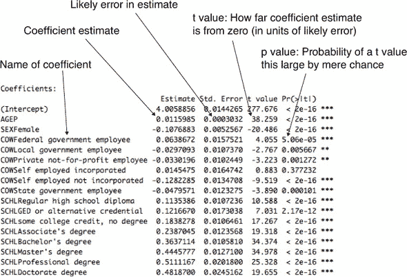

每个模型系数形成系数摘要表的行。列报告估计系数、估计的不确定性、系数相对于不确定性的大小以及这种比率仅由于偶然性而可能出现的可能性。图 7.11 给出了列的名称和解释。

你开始研究收入以及获得学士学位对收入的影响。但你必须查看所有系数以检查是否存在干扰效应。

例如，`SEXF` 的系数为 –0.108 表示你的模型学会了为女性对 `log10(PINCP)` 施加 –0.108 的惩罚。女性收入与男性收入的比率被建模为 `10^(-0.108)`：女性的收入是男性的 78%，在其他模型参数相等的情况下。注意我们说的是“其他模型参数相等”，而不是“其他所有事物相等。”这是因为我们不是在建模工作年限（年龄可能不是一个可靠的代理）或职业/行业类型（这对收入有重大影响）。这个模型，在它被赋予的特征下，无法测试平均而言，一个与男性在相同职位且具有相同工作经验的女性是否会被支付更少。

* * *

**不显著的系数**

注意在图 7.11 中，系数`COWSelf employed incorporated`是“不显著的”。这意味着对于这个模型设计来说，没有足够的证据来确定系数是否为零。

一些推荐逐步回归来移除这样的变量，或者添加一种有用的归纳偏差，形式为：“如果我们不能判断它是非零的，就强制它为零。”在这种情况下，这并不方便，因为变量只是一个分类变量的水平（因此，独立处理它有点困难）。我们不推荐逐步回归，因为逐步回归会引入*多重比较*问题，这会偏颇剩余系数的估计。^a 我们建议接受非显著的估计（因为即使将它们替换为零，也是在用一个不确定的估计替换另一个），或者预先过滤变量以供使用，或者使用正则化方法（如`glmnet`/lasso）。本书中涵盖了所有这些想法。

> ^a
> 
> 参见 Robert Tibshirani，“通过 lasso 进行回归收缩和选择。”*皇家统计学会杂志*，第 58 卷：267–288，1996 年。

一个需要记住的点：在预测（我们的主要目标）方面，拥有少量影响较小的无关系数并不是问题。问题出现在我们拥有影响较小的系数但系数/效应较大，或者有大量无关系数的情况下。

* * *

* * *

**统计学作为纠正不良实验设计的尝试**

测试是否存在性别驱动的收入分布差异的绝对最佳实验是将所有可能变量（年龄、教育、行业年数、绩效评估、种族、地区等）都相同但性别不同的个人的收入进行比较。我们不太可能获得这样的数据，所以我们只能满足于一个好的实验设计：一个没有其他特征与性别相关的总体。随机选择可以帮助实验设计，但它并不是万能的。如果没有一个好的实验设计，通常的实用策略是这样的：引入额外的变量来表示可能干扰我们试图研究的效应的效应。因此，研究性别对收入的影响可能包括其他变量，如教育水平和年龄，以尝试解开相互竞争的效应。

* * *

p 值和显著性

*p 值*（也称为*显著性*）是系数摘要中最重要的一列诊断信息。p 值估计在真实系数实际上为零的情况下（如果变量对结果没有影响）观察到与观察到的系数大小一样大的概率。因此，不要信任任何具有大 p 值的系数的估计。通常，人们会选择一个阈值，并将所有 p 值低于该阈值的系数称为*统计显著*，这意味着这些系数很可能不是零。一个常见的阈值是*p* < 0.05；然而，这是一个任意水平。

注意，一旦足够好，较低的 p 值并不总是“更好”。只要两个 p 值都低于你选择的阈值，就没有理由偏好一个 p 值为 1e-23 的系数而不是一个 p 值为 1e-08 的系数；在这个点上，你知道两个系数都可能是良好的估计，你应该偏好那些解释最多变异的系数。此外，注意高 p 值并不总是告诉我们哪些系数是坏的，正如我们在侧边栏中讨论的那样。

* * *

**共线性也会降低显著性**

有时，一个预测变量可能不会显得显著，因为它与另一个预测变量共线性（或相关）。例如，如果你尝试使用年龄和在职年数来预测收入，两个变量可能都不会显得显著。这是因为年龄往往与在职年数相关。如果你移除其中一个变量，另一个变量变得显著，这是一个很好的相关性指标。

如果你看到看起来不合理大的系数（通常是相反的符号），或者系数的异常大的标准误差，这可能表明存在共线性变量。

输入中存在共线性的另一个可能迹象是看到具有意外符号的系数：例如，看到收入与在职年数呈*负相关*。

整体模型即使在输入相关的情况下仍然可以很好地预测收入，但它无法确定哪个变量应该得到预测的功劳。

在第 7.3 节中我们将讨论，使用正则化在共线性情况下可能会有所帮助。正则化偏好较小的系数，当用于新数据时可能风险较低。

如果你希望将系数值用作建议以及做出良好的预测，尽量在输入中避免共线性。

* * *

整体模型质量摘要

`summary(model)`报告的最后部分是整体模型质量统计。在分享任何预测或系数之前检查整体模型质量是个好主意。摘要如下：

```
Residual standard error: 0.2688 on 11186 degrees of freedom
Multiple R-squared:  0.2976,    Adjusted R-squared:  0.2966
F-statistic: 296.2 on 16 and 11186 DF,  p-value: < 2.2e-16
```

让我们更详细地解释每个摘要。

自由度

*自由度*是数据行数减去拟合的系数数，在我们的例子中，是这样的：

```
(df <-  nrow(dtrain) - nrow(summary(model)$coefficients))
## [1] 11186
```

自由度是在纠正了你试图解决的系数数量之后，你拥有的训练数据行数。你希望训练集中的数据点数量与你要解决的系数数量相比要大；换句话说，你希望自由度要高。自由度低表明你试图拟合的模型对于你拥有的数据量来说过于复杂，并且你的模型很可能是过拟合的。过拟合是指你在训练数据中发现了在总体中不存在的偶然关系。过拟合是件坏事：当你没有好模型时，你却以为你有。

残差标准误差

*残差标准误差* 是残差平方和（或平方误差之和）除以自由度的结果。因此，它与我们在前面讨论过的 RMSE（均方根误差）类似，只是调整了数据行数以匹配自由度；在 R 中，这可以这样计算：

```
(modelResidualError <- sqrt(sum(residuals(model)²) / df))
## [1] 0.2687895
```

残差标准误差比 RMSE 对模型性能的估计更保守，因为它调整了模型的复杂性（自由度小于训练数据行数，因此残差标准误差大于 RMSE）。再次强调，这试图弥补更复杂的模型有更高的过拟合数据的倾向。

* * *

**测试数据上的自由度**

在测试数据（在训练过程中未使用的数据）上，自由度等于数据行数。这与训练数据的情况不同，正如我们所说的，在训练数据的情况下，自由度等于数据行数减去模型的参数数量。

差异产生的原因在于模型训练“窥视”的是训练数据，而不是测试数据。

* * *

多元和调整后的 R-squared

*多元 R-squared* 只是模型在训练数据上的 R-squared（在 7.1.3 节中讨论）。

*调整后的 R-squared* 是对输入变量数量进行惩罚的多个 R-squared。这种惩罚的原因是，通常情况下，增加输入变量的数量会提高训练数据上的 R-squared，即使添加的变量实际上并不具有信息性。这另一种说法是，更复杂的模型由于过拟合，往往在训练数据上看起来更好，因此调整后的 R-squared 是对模型拟合优度的一个更保守的估计。

如果你没有测试数据，在评估你的模型时依赖调整后的 R 平方是一个好主意。但更好的是，在保留的测试数据上计算预测值和实际值之间的 R 平方。在 7.1.3 节中，我们展示了测试数据上的 R 平方为 0.29，在这种情况下，它与报告的调整后的 R 平方 0.3 大致相同。然而，我们仍然建议准备训练集和测试集；测试集的估计可能比统计公式更能代表生产模型的表现。

F 统计量和它的 p 值

*F 统计量*与你在图 7.11 中看到的系数的 t 值类似。正如 t 值用于计算系数的 p 值一样，F 统计量用于计算模型拟合的 p 值。它得名于 F 检验，这是一种检查两个方差（在这种情况下，常数模型的残差方差和线性模型的残差方差）是否显著不同的技术。相应的 p 值是在假设所讨论的两个方差实际上相同的情况下，我们观察到如此大的或更大的 F 统计量的概率估计。因此，你希望 p 值很小（一个常见的阈值：小于 0.05）。

在我们的例子中，F 统计量的 p 值非常小（< 2.2e-16）：该模型解释的方差比常数模型更多，而且这种改进不太可能仅仅来自抽样误差。

* * *

解释模型的重要性

大多数线性回归的测试，包括系数和模型重要性的测试，都是基于误差项或残差呈正态分布的假设。重要的是要通过图形分析或使用分位数分析来确定回归模型是否合适。

* * *

### 7.1.6. 线性回归要点

线性回归是预测数量时首选的统计建模方法。它简单且具有优势，即模型的系数通常可以充当建议。以下是关于线性回归你应该记住的几个要点：

+   线性回归假设结果是输入变量的线性组合。自然地，当这个假设几乎成立时，它效果最好，但即使它不成立，它也能出人意料地预测得很好。

+   如果你想要使用你模型的系数作为建议，你应该只信任那些在统计上显著的系数。

+   过大的系数幅度、过大的系数估计标准误差以及系数的符号错误可能是相关输入的迹象。

+   即使在存在相关变量的情况下，线性回归也能很好地预测，但相关变量会降低建议的质量。

+   线性回归在处理具有大量变量或具有大量级别的分类变量的问题时可能会遇到困难。

+   线性回归包提供了一些最好的内置诊断工具，但仍然需要在测试数据上重新检查你的模型，这是你最有效的安全检查。

## 7.2\. 使用逻辑回归

逻辑回归是称为 *广义线性模型* 的一类模型中最重要的（也可能是最常用的）成员。与线性回归不同，逻辑回归可以直接预测限制在 (0, 1) 区间内的值，例如概率。它是预测概率或比率的首选方法，并且像线性回归一样，逻辑回归模型的系数可以被视为 *建议*。它也是二元分类问题的良好首选。

在本节中，我们将使用一个医疗分类示例（预测新生儿是否需要额外的医疗关注）来详细说明生产和使用逻辑回归模型的各个步骤.^([1])

> ¹
> 
> 逻辑回归通常用于分类，但逻辑回归及其近亲 *beta 回归* 也用于估计 *比率*。事实上，R 的标准 g`lm()` 调用除了预测分类之外，还可以预测介于 0 和 1 之间的数值。

正如我们在线性回归中所做的那样，在处理主要示例之前，我们将快速概述逻辑回归。

### 7.2.1\. 理解逻辑回归

* * *

示例

*假设你想根据航班的事实，如起点和终点、天气和航空公司，预测航班是否会延误。对于每架航班* `i`*，你希望根据* `origin[i]`*、* `destination[i]`*、* `weather[i]`* 和* `air_carrier[i]`* 来预测* `flight_delayed[i]`*。*

* * *

我们希望使用线性回归来预测航班 `i` 将会延误的概率，但概率严格限制在 `0:1` 的范围内，而线性回归并不限制其预测值在这个范围内。

一个想法是找到一个概率函数，其值域在 `-Infinity:Infinity` 之间，将线性模型拟合到预测该数量，然后从模型预测中求解适当的概率。那么让我们看看一个稍微不同的问题：不是预测航班延误的概率，而是考虑航班延误的 *几率*，或者航班延误的概率与不延误的概率之比。

```
odds[flight_delayed] = P[flight_delayed == TRUE] / P[flight_delayed == FALSE]
```

几率函数的值域不是 `-Infinity:Infinity`；它被限制为非负数。但我们可以取几率的对数——*对数几率*——以得到一个概率函数，其值域是 `-Infinity:Infinity`。

```
log_odds[flight_delayed] = log(P[flight_delayed == TRUE] / P[flight_delayed == FALSE])

Let: p = P[flight_delayed == TRUE]; then
log_odds[flight_delayed] = log(p / (1 - p))
```

注意，如果航班延迟的可能性大于准时，则几率比将大于一；如果航班延迟的可能性小于准时，则几率比将小于一。因此，如果航班延迟的可能性更大，对数几率将是正的；如果航班准时的可能性更大，对数几率将是负的；如果延迟的可能性是 50-50，则对数几率为零。这如图 7.12 所示。

图 7.12\. 将延迟航班的几率映射到对数几率

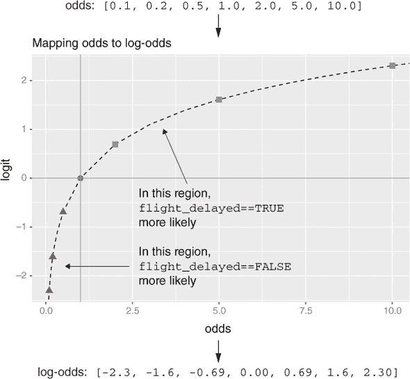

概率*p*的对数几率也称为*logit(p)*。*logit(p)*的逆函数是*sigmoid*函数，如图 7.13 所示。sigmoid 函数将范围从`-Infinity:Infinity`的值映射到范围`0:1`——在这种情况下，sigmoid 函数将无界的对数几率比映射到介于 0 和 1 之间的概率值。

```
logit <- function(p) { log(p/(1-p)) }
s <- function(x) { 1/(1 + exp(-x))}

s(logit(0.7))
# [1] 0.7

logit(s(-2))
# -2
```

图 7.13\. 通过 Sigmoid 函数将延迟航班的对数几率映射到概率

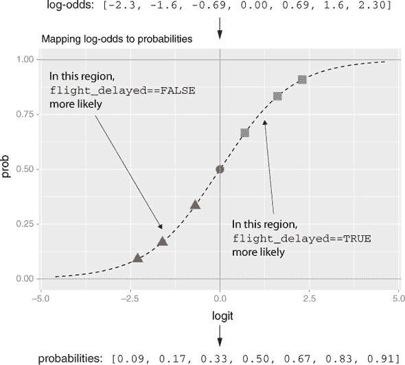

现在我们可以尝试将线性模型拟合到延迟航班的对数几率：

```
logit(P[flight_delayed[i] == TRUE]) = b0 + b_origin * origin[i] + ...
```

但我们真正感兴趣的是航班延迟的*概率*。为了得到这个概率，取等式两边的 sigmoid `s()`：

```
P[flight_delayed[i] == TRUE] =  s(b0 + b_origin * origin[i] + ...)
```

这是航班延迟概率的*逻辑回归模型*。前面的推导可能看起来是临时的，但使用`logit`函数转换概率是已知具有许多有利特性的。例如，像线性回归一样，它正确地得到总数（正如我们将在 7.2.3 节中看到）。

更一般地，假设`y[i]`是对象`i`的类别：`TRUE`或`FALSE`；`delayed`或`on_time`。同时，假设`x[i,]`是一行输入，并将其中一个类别称为“感兴趣类别”或*目标类别*——即你试图预测的类别（你想要预测某物是否为`TRUE`或者航班是否属于`delayed`类别）。然后逻辑回归试图拟合一个函数`f(x)`，使得

方程 7.2\. 逻辑回归模型的表达式

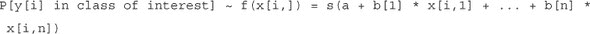

如果`y[i]`是`x[i,]`属于感兴趣类别的概率，那么拟合的任务就是找到`a, b[1], ..., b[n]`，使得`f(x[i,])`是`y[i]`的最佳可能估计。R 提供了一个单行语句来找到这些系数：`glm()`。^([1]) 注意，运行`glm()`不需要提供概率估计的`y[i]`；训练方法只需要`y[i]`表明给定的训练示例属于哪个类别。

> ¹
> 
> 逻辑回归可以用于分类到任意数量的类别（只要类别是互斥的并且覆盖所有可能性：每个`x`必须属于给定的类别之一）。但`glm()`只处理两类别的情况，因此我们的讨论将集中在这种情况。

正如我们所展示的，你可以将逻辑回归视为一种线性回归，它寻找你感兴趣概率的对数几率。特别是，逻辑回归假设 `logit(y)` 在 `x` 的值上是线性的。与线性回归一样，逻辑回归将找到最佳系数来预测 `y`，包括当输入相关时找到有利组合和抵消。

现在来看主要示例。

* * *

示例

*想象一下你在一所医院工作。总体目标是设计一个计划，为分娩室配备新生儿紧急设备。新生儿出生后一分钟和五分钟会使用所谓的阿普加测试进行评估，该测试旨在确定婴儿是否需要立即的紧急护理或额外的医疗关注。阿普加评分低于 7 分（0 到 10 分的评分标准）的婴儿需要额外的关注。*

*这类有风险的新生儿很少见，所以医院不想为每一次分娩都配备额外的紧急设备。另一方面，有风险的新生儿可能需要快速得到关注，因此主动为合适的分娩提供资源可以挽救生命。你的任务是构建一个模型，提前识别出风险概率较高的情形，以便能够适当地分配资源。*

* * *

我们将使用 2010 年 CDC 出生公共使用数据文件中的样本数据集 ([`mng.bz/pnGy`](http://mng.bz/pnGy))。该数据集记录了在美国 50 个州和哥伦比亚特区的所有出生登记的统计数据，包括关于母亲和父亲以及分娩的事实。样本中有一个名为 `sdata` 的数据框，包含超过 26,000 次出生。^([2]) 数据被分为训练集和测试集，使用我们添加的随机分组列，这允许进行可重复的实验，并确定分割比例。

> ²
> 
> 我们预先准备好的文件在 [`github.com/WinVector/PDSwR2/tree/master/CDC/NatalRiskData.rData`](https://github.com/WinVector/PDSwR2/tree/master/CDC/NatalRiskData.rData)；我们还提供了一个脚本文件 ([`github.com/WinVector/PDSwR2/blob/master/CDC/PrepNatalRiskData.R`](https://github.com/WinVector/PDSwR2/blob/master/CDC/PrepNatalRiskData.R))，该文件从完整的出生数据集的提取中准备数据框。详细信息请参阅 [`github.com/WinVector/PDSwR2/blob/master/CDC/README.md`](https://github.com/WinVector/PDSwR2/blob/master/CDC/README.md)。

列表 7.7\. 加载 CDC 数据

```
load("NatalRiskData.rData")
train <- sdata[sdata$ORIGRANDGROUP <= 5 , ]
test <- sdata[sdata$ORIGRANDGROUP > 5, ]
```

表 7.1 列出了您将使用的数据集的列。因为目标是提前预测有风险的新生儿，所以我们将变量限制在那些在分娩前已知或在分娩期间可以确定的变量。例如，关于母亲体重和健康史的资料是有效的输入，但出生后的资料，如婴儿出生体重则不是。我们可以通过推理将分娩室内的并发症，如臀位分娩包括在内，因为模型可以在分娩前（通过协议或清单）及时更新，以便在分娩前分配紧急资源。

表 7.1\. 出生数据集中的一些变量

| Variable | 类型 | 描述 |
| --- | --- | --- |
| atRisk | 逻辑 | 如果 5 分钟 Apgar 评分小于 7 则为 TRUE；否则为 FALSE |
| PWGT | 数字 | 母亲的孕前体重 |
| UPREVIS | 数字（整数） | 预产期医疗访问次数 |
| CIG_REC | 逻辑 | 如果吸烟则为 TRUE；否则为 FALSE |
| GESTREC3 | 分类 | 两个类别：小于 37 周（早产）和大于等于 37 周 |
| DPLURAL | 分类 | 出生多胎，分为三类：单胎/双胎/三胎及以上 |
| ULD_MECO | 逻辑 | 如果羊水有中度/重度粪便污染则为 TRUE |
| ULD_PRECIP | 逻辑 | 如果异常短产（小于三小时）则为 TRUE |
| ULD_BREECH | 逻辑 | 臀位（骨盆首先）出生位置为 TRUE |
| URF_DIAB | 逻辑 | 如果母亲是糖尿病患者则为 TRUE |
| URF_CHYPER | 逻辑 | 如果母亲有慢性高血压则为 TRUE |
| URF_PHYPER | 逻辑 | 如果母亲有与怀孕相关的妊娠高血压则为 TRUE |
| URF_ECLAM | 逻辑 | 如果母亲经历了子痫：与怀孕相关的癫痫发作则为 TRUE |

现在我们已经准备好构建模型。

### 7.2.2\. 构建逻辑回归模型

在 R 中构建逻辑回归模型的函数是 `glm()`，由 `stats` 包提供。在我们的情况下，因变量 `y` 是逻辑（或布尔）的 `atRisk`；表 7.1 中的所有其他变量是自变量 `x`。使用这些变量预测 `atRisk` 的模型公式相当长，手动输入；您可以使用 `wrapr` 包中的 `mk_formula()` 函数生成公式，如下所示。

列表 7.8\. 构建模型公式

```
complications <- c("ULD_MECO","ULD_PRECIP","ULD_BREECH")
riskfactors <- c("URF_DIAB", "URF_CHYPER", "URF_PHYPER",
                  "URF_ECLAM")

y <- "atRisk"
x <- c("PWGT",
      "UPREVIS",
      "CIG_REC",
      "GESTREC3",
      "DPLURAL",
      complications,
      riskfactors)
library(wrapr)
fmla <- mk_formula(y, x)
```

现在我们将构建逻辑回归模型，使用训练数据集。

列表 7.9\. 拟合逻辑回归模型

```
print(fmla)

## atRisk ~ PWGT + UPREVIS + CIG_REC + GESTREC3 + DPLURAL + ULD_MECO +
##     ULD_PRECIP + ULD_BREECH + URF_DIAB + URF_CHYPER + URF_PHYPER +
##     URF_ECLAM
## <environment: base>

model <- glm(fmla, data = train, family = binomial(link = "logit"))
```

这与调用`lm()`的线性回归类似，但有一个额外的参数：`family = binomial(link = "logit")`。`family`函数指定了因变量`y`的假设分布。在我们的例子中，我们将`y`建模为二项分布，或者是一个概率依赖于`x`的硬币。链接函数“链接”输出到线性模型——就好像您通过链接函数传递`y`，然后将其作为`x`值的线性函数建模。不同的`family`函数和链接函数的组合会导致不同类型的广义线性模型（例如，泊松或 probit）。在这本书中，我们只讨论逻辑模型，所以我们只需要使用带有`logit`链接的二项分布族。^([1])

> ¹
> 
> `logit`链接是二项分布族的默认链接，因此调用`glm(fmla, data = train, family = binomial)`是完全可以的。我们明确指定链接是为了讨论的目的。

* * *

不要忘记`family`参数！

没有显式的`family`参数，`glm()`默认为标准线性回归（如`lm`）。

可以使用`family`参数来选择`glm()`函数的许多不同行为。例如，选择`family = quasipoisson`会选择一个“log”链接，将预测的对数视为输入的线性模型。

这将是尝试解决第 7.1 节中的收入预测问题的另一种方法。然而，确定对数变换和线性模型或对数链接和广义线性模型对于给定问题来说哪个更好是一个微妙的问题。对数链接将更好地预测总收入（对于小收入和大收入都达到$50,000 的误差）。对数变换方法将更好地预测相对收入（对于大收入来说，$50,000 的评分误差不如小收入严重）。

* * *

如前所述，我们将结果存储在对象`model`中。

### 7.2.3\. 做出预测

使用逻辑模型进行预测与使用线性模型进行预测类似——使用`predict()`函数。以下代码将训练集和测试集的预测结果存储为相应数据框中的`pred`列。

列表 7.10\. 应用逻辑回归模型

```
train$pred <- predict(model, newdata=train, type = "response")
test$pred <- predict(model, newdata=test, type="response")
```

注意额外的参数`type = "response"`。这告诉`predict()`函数返回预测概率`y`。如果您不指定`type = "response"`，则默认情况下`predict()`将返回`link`函数的输出，即`logit(y)`。

逻辑回归的一个优点是它保留了训练数据的边缘概率。这意味着如果你对整个训练集的预测概率得分进行求和，这个数量将等于训练集中正结果（`atRisk == TRUE`）的数量。对于由模型中包含的变量确定的数据子集也是如此。例如，在训练数据子集中，`train$GESTREC == "<37 weeks"`（婴儿早产）的情况下，预测概率的总和等于正训练示例的数量（例如，参见[`mng.bz/j338`](http://mng.bz/j338)）。

列表 7.11\. 使用逻辑回归保留边缘概率

```
sum(train$atRisk == TRUE)                               ❶
 ## [1] 273

sum(train$pred)                                         ❷
 ## [1] 273

premature <- subset(train, GESTREC3 == "< 37 weeks")    ❸
sum(premature$atRisk == TRUE)
## [1] 112

sum(premature$pred)                                     ❹
 ## [1] 112
```

❶ 计算训练集中处于风险中的婴儿数量。

❷ 对训练集中的所有预测概率进行求和。请注意，它增加了处于风险中的婴儿的数量。

❸ 计算训练集中处于风险中的早产婴儿数量

❹ 对训练集中所有早产婴儿的预测概率进行求和。请注意，它增加了处于风险中的早产婴儿的数量。

由于逻辑回归保留了边缘概率，你知道模型在某种程度上与训练数据是一致的。当模型应用于与训练数据分布相似的未来数据时，它应该返回与该数据一致的结果：预期的处于风险中的婴儿的正确概率质量，正确地根据婴儿的特征分布。然而，如果模型应用于具有非常不同分布的未来数据（例如，处于风险中的婴儿的比率大大增加），模型可能无法预测得很好。

描述预测质量

如果你的目标是使用模型将新实例分类为两个类别之一（在这种情况下，处于风险或不在风险中），那么你希望模型对正实例给出高分数，否则给出低分数。正如我们在第 6.2.5 节中讨论的那样，你可以通过绘制正负实例得分的分布来检查这一点。让我们在训练集上这样做（你也应该绘制测试集，以确保性能质量相似）。

列表 7.12\. 按已知结果分组绘制预测得分分布

```
library(WVPlots)
DoubleDensityPlot(train, "pred", "atRisk",
                  title = "Distribution of natality risk scores")
```

结果显示在图 7.14 中。理想情况下，我们希望得分的分布是分离的，负实例（FALSE）的得分集中在左侧，而正实例的分布集中在右侧。在图 6.15（此处重现为图 7.15）中，我们展示了一个分类器（垃圾邮件过滤器）的例子，它很好地将正负实例分开。使用出生风险模型，两个分布都集中在左侧，这意味着正负实例的得分都较低。这并不奇怪，因为正实例（有风险婴儿的实例）是罕见的（在数据集中占所有出生的约 1.8%）。负实例的得分分布比正实例的得分分布衰减得更快。这意味着模型确实在数据中识别出了子群体，其中高风险新生儿的比率高于平均水平，如图 7.14 所示。

图 7.14。按正例（TRUE）和负例（FALSE）分开的得分分布

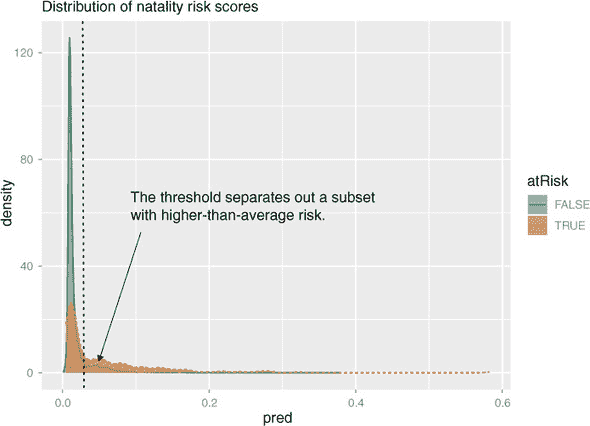

图 7.15。重绘第六章图 6.15 中的垃圾邮件过滤器得分分布

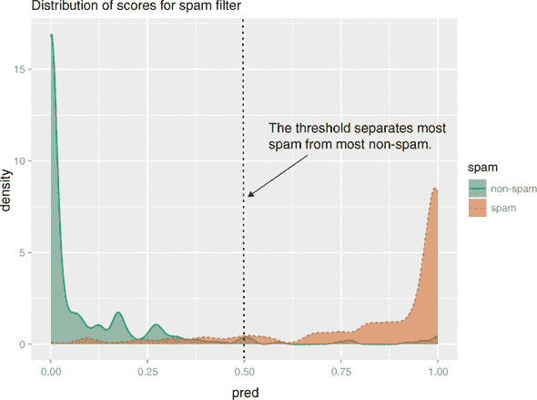

为了将模型用作分类器，你必须选择一个阈值；得分高于阈值的将被分类为正，低于阈值的将被分类为负。当你选择一个阈值时，你试图平衡分类器的*精确度*（预测的正例中有多少是真正的正例）和其*召回率*（分类器找到多少真正的正例）。

如果正负实例的得分分布很好地分离，如图 7.15 所示，你可以在两个峰值之间的“山谷”中选取一个合适的阈值。在当前情况下，两个分布没有很好地分离，这表明模型不能构建一个同时实现良好召回率和良好精确度的分类器。

然而，你可能能够构建一个分类器，以识别具有高于平均风险出生率的子集：例如，你可能能够找到一个阈值，产生一个精确度为 3.6%的分类器。尽管这个精确度很低，但它代表了一个数据子集，其风险是整体人口的两倍（3.6%比 1.8%），因此为这些情况预先分配资源可能是明智的。我们将分类器精确度与平均正例率之比称为*富集率*。

你设置的阈值越高，分类器的精确度就越高（你将识别出风险出生率远高于平均水平的情境集）；但你也可能会错过更多风险情境。在挑选阈值时，你应该使用训练集，因为挑选阈值是分类器构建的一部分。然后你可以使用测试集来评估分类器性能。

为了帮助挑选阈值，你可以使用类似于图 7.16 的图表，该图表显示了富集度和召回率作为阈值的函数。

图 7.16\. 训练集的富集度（顶部）和召回率（底部）作为阈值的函数

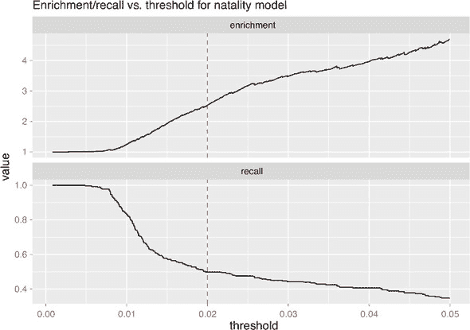

查看图 7.16，你会发现更高的阈值会导致更精确的分类（精确度与富集度成正比），但代价是错过更多案例；较低的阈值将识别更多案例，但代价是许多更多的误报（精确度降低）。最佳精度/富集度与召回率之间的权衡取决于医院可以分配的资源数量，以及他们可以保留在储备（或重新部署）以应对分类器未涵盖情况的数量。阈值 0.02（在图 7.16 中由虚线标记）可能是一个不错的权衡。结果分类器将识别出人口中风险出生率是总体人口 2.5 倍的一个子集，并且包含所有真正风险情况的一半左右。

你可以使用`WVPlots`中的`PRTPlot()`函数生成图 7.16。

列表 7.13\. 探索建模权衡

```
library("WVPlots")
library("ggplot2")
plt <- PRTPlot(train, "pred", "atRisk", TRUE,                            ❶
         plotvars = c("enrichment", "recall"),
        thresholdrange = c(0,0.05),
        title = "Enrichment/recall vs. threshold for natality model")
plt + geom_vline(xintercept = 0.02, color="red", linetype = 2)           ❷
```

❶ 在 PRTPlot()中调用 pred 为预测列，atRisk 为真实结果列，TRUE 为感兴趣类别

❷ 添加一条线标记阈值=0.02。

一旦你挑选了一个合适的阈值，你可以通过查看混淆矩阵来评估结果分类器，正如我们在第 6.2.3 节中讨论的那样。让我们使用测试集来评估阈值为 0.02 的分类器。

列表 7.14\. 评估所选模型

```
( ctab.test <- table(pred = test$pred > 0.02, atRisk = test$atRisk)  )   ❶

##        atRisk
## pred    FALSE TRUE
##   FALSE  9487   93
##   TRUE   2405  116

( precision <- ctab.test[2,2] / sum(ctab.test[2,]) )
## [1] 0.04601349

( recall <- ctab.test[2,2] / sum(ctab.test[,2]) )
## [1] 0.5550239

( enrichment <- precision / mean(as.numeric(test$atRisk))  )
## [1] 2.664159
```

❶ 构建混淆矩阵。行包含预测的负例和正例；列包含实际的负例和正例。

结果分类器精确度较低，但识别出包含测试集中 55.5%真正正例的潜在风险案例集，其比率是总体平均水平的 2.66 倍。这与训练集上的结果一致。

除了做出预测外，逻辑回归模型还能帮助你提取有用的信息和建议。我们将在下一节中展示这一点。

### 7.2.4\. 从逻辑模型中寻找关系和提取建议

逻辑回归模型的系数以类似于线性回归模型系数的方式编码输入变量与输出之间的关系。你可以通过调用 `coefficients (model)` 来获取模型的系数。

列表 7.15。模型系数

```
coefficients(model)
##              (Intercept)                     PWGT
##              -4.41218940               0.00376166
##                  UPREVIS              CIG_RECTRUE
##              -0.06328943               0.31316930
##       GESTREC3< 37 weeks DPLURALtriplet or higher
##               1.54518311               1.39419294
##              DPLURALtwin             ULD_MECOTRUE
##               0.31231871               0.81842627
##           ULD_PRECIPTRUE           ULD_BREECHTRUE
##               0.19172008               0.74923672
##             URF_DIABTRUE           URF_CHYPERTRUE
##              -0.34646672               0.56002503
##           URF_PHYPERTRUE            URF_ECLAMTRUE
##               0.16159872               0.49806435
```

统计上显著的负系数对应于与正结果（婴儿处于风险）的概率负相关的变量。统计上显著的正系数与婴儿处于风险的概率正相关。

> ¹
> 
> 我们将在下一节中展示如何检查统计显著性。

就像线性回归一样，每个分类变量都会扩展成一组指示变量。如果原始变量有 `n` 个级别，将会有 `n-1` 个指示变量；剩余的级别是参考水平。

例如，变量 `DPLURAL` 有三个级别，分别对应单胎、双胞胎和三胞胎或更高。逻辑回归模型有两个相应的系数：`DPLURALtwin` 和 `DPLURALtriplet or higher`。参考水平是单胎。`DPLURAL` 的两个系数都是正的，表明多胎出生的风险概率比单胎出生高，其他变量保持不变。

* * *

逻辑回归也不喜欢变量数量非常多

就像线性回归一样，你应该避免使用具有太多级别的分类变量。

* * *

解释系数

与线性回归相比，解释系数值要复杂一些。如果变量 `x[,k]` 的系数是 `b[k]`，那么对于 `x[,k]` 每单位的变化，正结果的概率会乘以 `exp(b[k])` 的因子。

* * *

示例

*假设一个具有某些特征的足月婴儿有 1% 的风险概率。那么这个婴儿的风险概率是 `p/(1-p)`，即 `0.01/0.99 = 0.0101`。那么具有相同特征但早产儿的婴儿的风险概率（以及风险概率）是多少？*

* * *

对于 `GESTREC3< 37 weeks`（早产儿）的系数是 1.545183。因此，对于一个早产儿，其处于风险的概率是 `exp(1.545183)= 4.68883` 倍高于足月出生的婴儿，其他输入变量保持不变。具有与假设足月婴儿相同特征的早产儿的危险概率是 `0.0101 * 4.68883 = 0.047`。

你可以将公式 `odds = p / (1 - p)` 逆转来求解 `p` 作为 `odds` 的函数：

```
p = odds * (1 - p) = odds - p * odds
p * (1 + odds) = odds
p = odds/(1 + odds)
```

这个早产儿处于风险的概率是 `0.047/1.047`，大约是 4.5%——比等效的足月婴儿高得多

同样，`UPREVIS`（产前医疗访问次数）的系数大约是-0.06。这意味着每次产前访问都会将高风险婴儿的概率降低到`exp(-0.06)`倍，即大约 0.94。假设一个早产儿的母亲没有进行任何产前访问；在相同情况下，如果母亲进行了三次产前访问，那么婴儿处于风险的概率大约是`0.047 * 0.94 * 0.94 * 0.94 = 0.039`。这对应于 3.75%的风险概率。

在这种情况下的一般建议可能是特别关注早产（和多胞胎），并鼓励孕妇进行定期的产前访问。

### 7.2.5。阅读模型摘要和描述系数

正如我们之前提到的，关于系数值的结论只有在系数值具有统计学意义时才应予以信任。我们还想确保模型实际上在解释某些东西。模型摘要中的诊断将帮助我们确定有关模型质量的一些事实。调用，如前所述，是`summary(model)`。

列表 7.16。模型摘要

```
summary(model)

## Call:
## glm(formula = fmla, family = binomial(link = "logit"), data = train)
##
## Deviance Residuals:
##     Min       1Q   Median       3Q      Max
## -0.9732  -0.1818  -0.1511  -0.1358   3.2641
##
## Coefficients:
##                           Estimate Std. Error z value Pr(>|z|)
## (Intercept)              -4.412189   0.289352 -15.249  < 2e-16 ***
## PWGT                      0.003762   0.001487   2.530 0.011417 *
## UPREVIS                  -0.063289   0.015252  -4.150 3.33e-05 ***
## CIG_RECTRUE               0.313169   0.187230   1.673 0.094398 .
## GESTREC3< 37 weeks        1.545183   0.140795  10.975  < 2e-16 ***
## DPLURALtriplet or higher  1.394193   0.498866   2.795 0.005194 **
## DPLURALtwin               0.312319   0.241088   1.295 0.195163
## ULD_MECOTRUE              0.818426   0.235798   3.471 0.000519 ***
## ULD_PRECIPTRUE            0.191720   0.357680   0.536 0.591951
## ULD_BREECHTRUE            0.749237   0.178129   4.206 2.60e-05 ***
## URF_DIABTRUE             -0.346467   0.287514  -1.205 0.228187
## URF_CHYPERTRUE            0.560025   0.389678   1.437 0.150676
## URF_PHYPERTRUE            0.161599   0.250003   0.646 0.518029
## URF_ECLAMTRUE             0.498064   0.776948   0.641 0.521489
## ---
## Signif. codes:  0 '***' 0.001 '**' 0.01 '*' 0.05 '.' 0.1 ' ' 1
##
## (Dispersion parameter for binomial family taken to be 1)
##
##    Null deviance: 2698.7  on 14211  degrees of freedom
## Residual deviance: 2463.0  on 14198  degrees of freedom
## AIC: 2491
##
## Number of Fisher Scoring iterations: 7
```

再次强调，当你展示结果时，可能会被问到模型摘要中的元素，所以我们将讨论这些字段的意义，以及如何使用它们来解释你的模型。

原始模型调用

摘要的第一行是`glm()`的调用：

```
Call:
glm(formula = fmla, family = binomial(link = "logit"), data = train)
```

这里我们检查是否使用了正确的训练集和正确的公式（尽管在我们的情况下，公式本身在另一个变量中）。我们还可以验证是否使用了正确的家族和连接函数来生成逻辑模型。

偏差残差摘要

偏差残差是线性回归模型残差的类似物：

```
Deviance Residuals:
    Min       1Q   Median       3Q      Max
-0.9732  -0.1818  -0.1511  -0.1358   3.2641
```

线性回归模型是通过最小化残差的平方和来找到的；逻辑回归模型是通过最小化残差偏差的总和来找到的，这相当于最大化给定模型的数据的对数似然，我们将在本章后面讨论对数似然。

逻辑模型也可以用来明确地计算比率：给定几个相同数据点（除了结果外都相同）的组，预测每个组中阳性结果的比率。这种数据称为*分组数据*。在分组数据的情况下，偏差残差可以用作模型拟合的诊断。这就是为什么偏差残差包括在摘要中的原因。我们正在使用*未分组数据*——训练集中的每个数据点可能是唯一的。在未分组数据的情况下，使用偏差残差进行模型拟合诊断不再有效，所以我们在这里不讨论它们.^([1])

> ¹
> 
> 见 Daniel Powers 和 Yu Xie 所著的《分类数据分析的统计方法》，第 2 版，Emerald Group Publishing Ltd.，2008 年。

摘要系数表

逻辑回归的摘要系数表与线性回归的系数表具有相同的格式：

```
Coefficients:
                          Estimate Std. Error z value Pr(>|z|)
(Intercept)              -4.412189   0.289352 -15.249  < 2e-16 ***
PWGT                      0.003762   0.001487   2.530 0.011417 *
UPREVIS                  -0.063289   0.015252  -4.150 3.33e-05 ***
CIG_RECTRUE               0.313169   0.187230   1.673 0.094398 .
GESTREC3< 37 weeks        1.545183   0.140795  10.975  < 2e-16 ***
DPLURALtriplet or higher  1.394193   0.498866   2.795 0.005194 **
DPLURALtwin               0.312319   0.241088   1.295 0.195163
ULD_MECOTRUE              0.818426   0.235798   3.471 0.000519 ***
ULD_PRECIPTRUE            0.191720   0.357680   0.536 0.591951
ULD_BREECHTRUE            0.749237   0.178129   4.206 2.60e-05 ***
URF_DIABTRUE             -0.346467   0.287514  -1.205 0.228187
URF_CHYPERTRUE            0.560025   0.389678   1.437 0.150676
URF_PHYPERTRUE            0.161599   0.250003   0.646 0.518029
URF_ECLAMTRUE             0.498064   0.776948   0.641 0.521489
---
Signif. codes:  0 '***' 0.001 '**' 0.01 '*' 0.05 '.' 0.1 ' ' 1
```

表格的列表示

+   一个系数

+   其估计值

+   该估计值周围的误差

+   估计系数值与 0 的符号距离（使用标准误差作为距离的单位）

+   在假设系数值实际上为零的零假设下，观察到至少与我们观察到的系数值一样大的概率

这个最后的值，称为*p 值*或*显著性*，告诉我们是否应该相信估计的系数值。常见的做法是假设 p 值小于 0.05 的系数是可靠的，尽管一些研究人员更喜欢更严格的阈值。

对于出生数据，我们可以从系数摘要中看到，早产和三胞胎出生是新生儿需要额外医疗关注的有力预测因素：系数的绝对值不可忽视，p 值表明其显著性。其他影响结果的因素还包括

+   *`PWGT`*—母亲的孕前体重（体重较重的母亲表示风险更高——有点令人惊讶）

+   *`UPREVIS`*—产前医疗访问次数（访问次数越多，风险越低）

+   *`ULD_MECOTRUE`*—羊水中的胎粪污染

+   `ULD_BREECHTRUE`—出生时的臀位

母亲吸烟与高风险出生之间可能存在正相关，但数据并没有明确表明这一点。其他变量与高风险出生之间没有显示出强烈的关系。

* * *

**不显著可能意味着共线性输入**

与线性回归一样，逻辑回归在处理共线性（或相关）输入时也能很好地进行预测，但相关性可能会掩盖有用的建议。

为了让您自己看到这一点，我们在数据集`sdata`中留下了关于婴儿出生体重的克数数据。它在测试数据和训练数据中都作为`DBWT`列存在。尝试将`DBWT`添加到除了所有其他变量之外的逻辑回归模型中；您会发现婴儿出生体重的系数将是显著的、不可忽视的（对预测有实质性影响），并且与风险呈负相关。`DPLURALtriplet or higher`的系数将显得不显著，而`GESTREC3< 37 weeks`的系数的绝对值要小得多。这是因为低出生体重与早产和多胞胎都有关联。在这三个相关变量中，出生体重是结果的最佳单一预测因素：知道婴儿是三胞胎不会增加额外的有用信息，而知道婴儿早产只会增加一点信息。

在建模目标——主动分配紧急资源到更有可能需要的地点——的背景下，出生体重不是一个非常有用的变量，因为我们不知道婴儿出生时的体重。我们事先知道它是否早产，或者是否是多个婴儿中的一个。因此，最好使用`GESTREC3`和`DPLURAL`作为输入变量，而不是`DBWT`。

其他可能存在共线性输入的迹象是系数符号错误和异常大的系数幅度，伴随着巨大的标准误差。

* * *

模型整体质量摘要

摘要的下一部分包含模型质量统计信息：

```
Null deviance: 2698.7  on 14211  degrees of freedom
Residual deviance: 2463.0  on 14198  degrees of freedom
AIC: 2491
```

零偏差和残差偏差

偏差是衡量模型拟合数据好坏的度量。它是数据集给定模型的负对数似然的两倍。正如我们之前在第 6.2.5 节中讨论的，对数似然背后的思想是，正实例`y`应该在模型下有高概率`py`发生；负实例应该有低概率发生（或者换句话说，`(1 - py)`应该是大的）。对数似然函数奖励结果`y`与预测概率`py`之间的匹配，并惩罚不匹配（负实例的高`py`，反之亦然）。

如果你认为偏差类似于方差，那么*零偏差*类似于围绕正例平均率的平均数据方差。*残差偏差*类似于围绕模型的数据方差。与方差一样，你希望残差偏差相对于零偏差较小。模型摘要报告了训练数据上的偏差和零偏差；你（并且应该）也可以为测试数据计算它们。在下面的列表中，我们计算了训练集和测试集的偏差。

列表 7.17\. 计算偏差

```
loglikelihood <- function(y, py) {                                     ❶
   sum(y * log(py) + (1-y)*log(1 - py))
}

(pnull <- mean(as.numeric(train$atRisk))  )                            ❷
## [1] 0.01920912

(null.dev <- -2  *loglikelihood(as.numeric(train$atRisk), pnull) )     ❸
## [1] 2698.716

model$null.deviance                                                    ❹
## [1] 2698.716

pred <- predict(model, newdata = train, type = "response")             ❺
(resid.dev <- -2 * loglikelihood(as.numeric(train$atRisk), pred) )     ❻
## [1] 2462.992

model$deviance                                                         ❻
## [1] 2462.992

testy <- as.numeric(test$atRisk)                                       ❽
testpred <- predict(model, newdata = test,
                        type = "response")

( pnull.test <- mean(testy) )
## [1] 0.0172713

( null.dev.test <- -2 * loglikelihood(testy, pnull.test) )
## [1] 2110.91

( resid.dev.test <- -2 * loglikelihood(testy, testpred) )
## [1] 1947.094
```

❶ 计算数据集对数似然的函数。变量 y 是数值形式的结果（正例为 1，负例为 0）。变量 py 是 y 等于 1 的预测概率。

❷ 计算数据集中正例的比率

❸ 计算零偏差

❹ 对于训练数据，零偏差存储在 model$null.deviance 槽中。

❺ 为训练数据预测概率

❻ 计算训练数据的模型偏差

❻ 对于训练数据，模型偏差存储在 model$deviance 槽中。

❽ 计算测试数据的零偏差和残差偏差

伪 R 平方

基于偏差的一个有用的拟合优度度量是伪 R 平方：`1 - (dev.model/dev.null)`。伪 R 平方是线性回归中 R 平方的类似物。它是衡量模型“解释”了多少偏差的度量。理想情况下，你希望伪 R 平方接近 1。让我们计算测试数据和训练数据的伪 R 平方。

列表 7.18\. 计算伪 R 平方

```
pr2 <- 1 - (resid.dev / null.dev)

print(pr2)
## [1] 0.08734674
pr2.test <- 1 - (resid.dev.test / null.dev.test)
print(pr2.test)
## [1] 0.07760427
```

该模型仅解释了约 7.7-8.7%的偏差；它不是一个高度预测性的模型（你早已应该从图 7.14 中怀疑这一点）。这告诉我们，我们尚未识别出所有实际预测风险出生的因素。

模型显著性

您还可以使用空模型和残差偏差来检查模型的概率预测是否比仅仅猜测平均阳性率更好，从统计学的角度来看。换句话说，模型偏差的减少是否具有意义，或者只是偶然观察到的？这与计算线性回归中报告的 F 检验统计量和相关 p 值类似。在逻辑回归的情况下，您将运行的测试是*卡方检验*。为此，您需要知道空模型和实际模型的自由度（这些在总结中报告）。空模型的自由度是数据点数量减去 1：

```
df.null =  dim(train)[[1]] - 1
```

您拟合的模型自由度是数据点数量减去模型中的系数数量：

```
df.model = dim(train)[[1]] - length(model$coefficients)
```

如果训练集中数据点的数量很大，且`df.null - df.model`很小，那么偏差差异`null.dev - resid.dev`与我们观察到的差异一样大的概率大约服从具有`df.null - df.model`个自由度的卡方分布。

列表 7.19\. 计算观察到的拟合的显著性

```
( df.null <- dim(train)[[1]] - 1  )                               ❶
 ## [1] 14211

( df.model <- dim(train)[[1]] - length(model$coefficients) )      ❷
 ## [1] 14198

( delDev <- null.dev - resid.dev )                                ❸
 ## [1] 235.724
( deldf <- df.null - df.model )
## [1] 13
( p <- pchisq(delDev, deldf, lower.tail = FALSE) )                ❹
 ## [1] 5.84896e-43
```

❶ 空模型具有（数据点数量 - 1）个自由度。

❷ 拟合模型具有（数据点数量 - 系数数量）个自由度。

❸ 计算偏差差异和自由度差异

❹ 使用卡方分布估计在空模型下观察到偏差差异的概率（p 值）

p 值非常小；我们通过偶然看到如此多的偏差减少的可能性极低。这意味着这个模型在数据中找到信息性模式的可能性是合理的（但遗憾的是不是决定性的）。

* * *

**拟合优度与显著性**

值得注意的是，我们找到的模型是一个显著的模型，但不是一个强大的模型。良好的 p 值告诉我们，该模型是显著的：它在训练数据中预测有风险出生的质量，这种质量不太可能是纯粹的偶然。较差的伪 R 平方意味着该模型没有给我们提供足够的信息来有效地区分低风险和高风险出生。

也可能存在良好的伪 R 平方（在训练数据上），但 p 值较差。这是过拟合的迹象。这就是为什么检查两者都是好主意，或者更好的是，检查模型在训练和测试数据上的伪 R 平方。

* * *

AIC

概述部分给出的最后一个指标是 AIC，或*赤池信息准则*。AIC 是调整了系数数量的对数似然。正如线性回归的 R 平方在变量数量较高时通常较高一样，对数似然也随着变量数量的增加而增加。

列表 7.20\. 计算赤池信息准则

```
aic <- 2 * (length(model$coefficients) -
         loglikelihood(as.numeric(train$atRisk), pred))
aic
## [1] 2490.992
```

AIC 通常用于决定在模型中使用哪些输入变量以及使用多少。如果你在同一个训练集上使用不同的变量集训练了许多不同的模型，你可以考虑具有最低 AIC 的模型为最佳拟合。

费舍尔评分迭代

模型摘要的最后一行是费舍尔评分迭代的次数：

```
Number of Fisher Scoring iterations: 7
```

费舍尔评分法是一种迭代优化方法，类似于牛顿法，`glm()` 使用它来找到逻辑回归模型的最佳系数。你应该期望它在大约六到八次迭代内收敛。如果迭代次数比这多得多，那么算法可能没有收敛，模型可能无效。

分离和准分离

非收敛的可能原因是分离或准分离：模型中的一个变量或一些模型变量的组合至少对于训练数据的一个子集完美预测了结果。你可能会认为这是一件好事；但讽刺的是，当变量过于强大时，逻辑回归会失败。理想情况下，`glm()` 在检测到分离或准分离时会发出警告：

```
Warning message:
glm.fit: fitted probabilities numerically 0 or 1 occurred
```

不幸的是，有些情况下似乎没有发出警告，但仍有其他警告信号：

+   费舍尔迭代次数异常高

+   非常大的系数，通常伴随着非常大的标准误差

+   剩余偏差大于零偏差

如果你看到这些迹象中的任何一种，那么模型是可疑的。本章的最后一节介绍了一种解决该问题的方法：正则化。

### 7.2.6. 逻辑回归要点

逻辑回归是二元分类的统计建模方法中的首选。与线性回归一样，逻辑回归模型的系数通常可以充当建议。以下是关于逻辑回归的一些要点：

+   逻辑回归校准良好：它再现了数据的边缘概率。

+   伪 R 平方是一个有用的拟合优度启发式方法。

+   逻辑回归在处理具有大量变量或具有大量级别的分类变量的问题时可能会遇到困难。

+   即使存在相关变量，逻辑回归也能很好地预测，但相关变量会降低建议的质量。

+   过大的系数幅度，系数估计的标准误差过大，以及系数的符号错误可能是相关输入的迹象。

+   过多的费舍尔迭代，或过大的系数与非常大的标准误差可能是你的逻辑回归模型没有收敛，可能无效的迹象。

+   `glm()` 提供了良好的诊断，但仍然需要在测试数据上重新检查你的模型，这是你最有效的诊断方法。

## 7.3. 正则化

如前所述，过大的系数绝对值和过大的标准误差可能表明你的模型存在一些问题：线性或逻辑回归中的几乎共线变量，或者在逻辑回归系统中存在分离或准分离。

几乎共线的变量可能导致回归求解器不必要地引入大的系数，这些系数通常几乎相互抵消，并且具有大的标准误差。分离/准分离可能导致逻辑回归无法收敛到预期的解；这是大系数和大标准误差的另一个来源。

过大的系数绝对值不太可靠，当模型应用于新数据时可能会带来风险。每个系数估计都存在一些测量噪声，而大的系数会导致估计中的噪声驱动预测中的大变化（和错误）。直观地说，拟合几乎共线的变量的大的系数必须在训练数据中相互抵消，以表达变量对结果的影响。如果未来的数据中相同的变量没有以完全相同的方式平衡，这种抵消集合就是对训练数据的过度拟合。

* * *

示例

*假设* `age` *和* `years_in_workforce` *高度相关，并且年龄增长一年/在劳动力市场工作一年更长，在训练数据中会使对数收入增加一个单位。如果模型中只有* `years_in_workforce` *，它将得到大约 1 的系数。如果模型包括* `age` *又会发生什么？*

* * *

在某些情况下，如果模型中同时包含`age`和`years_in_workforce`，线性回归可能会给`years_in_workforce`和`age`分配大的、符号相反的平衡系数；例如，`years_in_workforce`的系数为 99，而`age`的系数为-98。这些大的系数将“相互抵消”以达到适当的效果。

由于准分离，即使没有共线变量，逻辑模型也可能产生类似的效果。为了演示这一点，我们将引入本节中将处理的更大场景。

### 7.3.1\. 准分离的一个例子

* * *

示例

*假设一个汽车评论网站根据几个特征对汽车进行评级，包括可负担性和安全评级。汽车评级可以是“非常好”、“好”、“可接受”或“不可接受”。你的目标是预测汽车是否会失败审查：也就是说，得到一个不可接受的评级。*

* * *

对于这个示例，你将再次使用 UCI 机器学习仓库中你在第二章中使用过的汽车数据。这个数据集包含 1728 种汽车的信息，以下变量：

+   *`car_price`*—(非常高，高，中，低)

+   *`maint_price`*—(非常高，高，中，低)

+   *`doors`*—(2，3，4，5，更多)

+   *`persons`*—(2，4，更多)

+   *`lug_boot`*—(小，中，大)

+   *`safety`*—(低，中，高)

结果变量是`rating`（vgood，good，acc，unacc）。

首先，让我们读取数据并将其分割为训练集和测试集。如果您还没有这样做，请从 [`github.com/WinVector/PDSwR2/blob/master/UCICar/car.data.csv`](https://github.com/WinVector/PDSwR2/blob/master/UCICar/car.data.csv) 下载 `car.data.csv` 文件，并确保该文件位于您的当前工作目录中。

列表 7.21\. 准备 `cars` 数据

```
cars <- read.table(
  'car.data.csv',
  sep = ',',
  header = TRUE,
  stringsAsFactor = TRUE
)

vars <- setdiff(colnames(cars), "rating")              ❶

cars$fail <- cars$rating == "unacc"
outcome <- "fail"                                      ❷

set.seed(24351)
gp <- runif(nrow(cars))                                ❸

library("zeallot")
c(cars_test, cars_train) %<-% split(cars, gp < 0.7)    ❹

nrow(cars_test)
## [1] 499
nrow(cars_train)
## [1] 1229
```

❶ 获取输入变量

❷ 你想要预测汽车是否会获得不可接受的评级

❸ 为测试/训练分割创建分组变量（70%用于训练，30%用于测试）

❹ `split()` 函数返回一个包含两个组的列表，其中 `gp < 0.7 == FALSE` 的组排在前面。zeallot 包的 `%<-%` 多重赋值操作将这个值列表解包到名为 `cars_test` 和 `cars_train` 的变量中。

解决这个问题的第一个可能方法是尝试简单的逻辑回归。

列表 7.22\. 拟合逻辑回归模型

```
library(wrapr)
(fmla <- mk_formula(outcome, vars) )

## fail ~ car_price + maint_price + doors + persons + lug_boot +
##     safety
## <environment: base>

model_glm <- glm(fmla,
            data = cars_train,
            family = binomial)
```

您将看到 `glm()` 返回一个警告：

```
## Warning: glm.fit: fitted probabilities numerically 0 or 1 occurred
```

这个警告表明问题是准可分的：一些变量集合可以完美预测数据的一个子集。实际上，这个问题足够简单，您可以很容易地确定低安全评级可以完美预测汽车将无法通过评审（我们将这作为读者的练习）。然而，即使安全评级较高的汽车也可能获得不可接受的评级，因此安全变量只能预测数据的一个子集。

您还可以通过查看模型摘要来看到这个问题。

列表 7.23\. 查看模型摘要

```
summary(model_glm)

##
## Call:
## glm(formula = fmla, family = binomial, data = cars_train)
##
## Deviance Residuals:
##      Min        1Q    Median        3Q       Max
## -2.35684  -0.02593   0.00000   0.00001   3.11185
##
## Coefficients:
##                   Estimate Std. Error z value Pr(>|z|)
## (Intercept)        28.0132  1506.0310   0.019 0.985160
## car_pricelow       -4.6616     0.6520  -7.150 8.67e-13 ***
## car_pricemed       -3.8689     0.5945  -6.508 7.63e-11 ***
## car_pricevhigh      1.9139     0.4318   4.433 9.30e-06 ***
## maint_pricelow     -3.2542     0.5423  -6.001 1.96e-09 ***
## maint_pricemed     -3.2458     0.5503  -5.899 3.66e-09 ***
## maint_pricevhigh    2.8556     0.4865   5.869 4.38e-09 ***
## doors3             -1.4281     0.4638  -3.079 0.002077 **
## doors4             -2.3733     0.4973  -4.773 1.82e-06 ***
## doors5more         -2.2652     0.5090  -4.450 8.58e-06 ***
## persons4          -29.8240  1506.0310  -0.020 0.984201          ❶
## personsmore       -29.4551  1506.0310  -0.020 0.984396
## lug_bootmed         1.5608     0.4529   3.446 0.000568 ***
## lug_bootsmall       4.5238     0.5721   7.908 2.62e-15 ***
## safetylow          29.9415  1569.3789   0.019 0.984778          ❷
## safetymed           2.7884     0.4134   6.745 1.53e-11 ***
## ---
## Signif. codes:  0 '***' 0.001 '**' 0.01 '*' 0.05 '.' 0.1 ' ' 1
##
## (Dispersion parameter for binomial family taken to be 1)
##
##     Null deviance: 1484.7  on 1228  degrees of freedom
## Residual deviance:  245.5  on 1213  degrees of freedom
## AIC: 277.5
##
## Number of Fisher Scoring iterations: 21)                         ❸
```

❶ 变量 `persons4` 和 `personsmore` 具有显著的大负幅度和巨大的标准误差。

❷ 变量 `safetylow` 具有显著的大正幅度和巨大的标准误差。

❸ 算法运行了异常大量的 Fisher 评分迭代。

变量 `safetylow`、`persons4` 和 `personsmore` 都具有异常高的幅度和非常高的标准误差。如前所述，`safetylow` 总是与不可接受的评级相对应，因此 `safetylow` 是评审失败的一个强烈指标。然而，更大的汽车（能容纳更多人的汽车）并不总是能通过评审。可能算法观察到更大的汽车往往更安全（获得比 `safetylow` 更好的安全评级），因此它使用 `persons4` 和 `personsmore` 变量来抵消 `safetylow` 过高的系数。

此外，您还可以看到 Fisher 评分迭代次数异常高；算法没有收敛。

这个问题相当简单，因此模型可能在测试集上预测得相当好；然而，一般来说，当您看到 `glm()` 没有收敛的证据时，您不应该相信这个模型。

为了与正则化算法进行比较，让我们绘制逻辑回归模型的系数（图 7.17）。

图 7.17\. 逻辑回归模型的系数

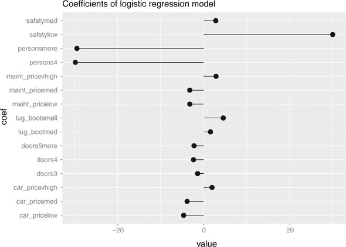

列表 7.24。查看逻辑模型的系数

```
coefs <- coef(model_glm)[-1]                      ❶
coef_frame <- data.frame(coef = names(coefs),
                        value = coefs)

library(ggplot2)
ggplot(coef_frame, aes(x = coef, y = value)) +
  geom_pointrange(aes(ymin = 0, ymax = value)) +
  ggtitle("Coefficients of logistic regression model") +
  coord_flip()
```

❶ 获取系数（除了截距）

在图中，指向右的系数与未通过审查正相关，而指向左的系数与失败负相关。

你也可以查看模型在测试数据上的表现。

列表 7.25。逻辑模型的测试性能

```
cars_test$pred_glm <- predict(model_glm,
                             newdata=cars_test,
                             type = "response")                          ❶

library(sigr)                                                            ❷

confmat <- function(dframe, predvar) {                                   ❸
   cmat <- table(truth = ifelse(dframe$fail, "unacceptable", "passed"),
               prediction = ifelse(dframe[[predvar]] > 0.5,
                                   "unacceptable", "passed"))
  accuracy <- sum(diag(cmat)) / sum(cmat)
  deviance <- calcDeviance(dframe[[predvar]], dframe$fail)
  list(confusion_matrix = cmat,
       accuracy = accuracy,
       deviance = deviance)
}

confmat(cars_test, "pred_glm")
## $confusion_matrix
##               prediction
## truth          passed unacceptable
##   passed          150            9
##   unacceptable     17          323
##
## $accuracy
## [1] 0.9478958
##
## $deviance
## [1] 97.14902
```

❶ 获取模型在测试集上的预测

❷ 添加 sigr 包以进行偏差计算（sigr 包含多个拟合优度摘要和测试）

❸ 打印混淆矩阵、准确率和偏差的便利函数

在这种情况下，模型看起来是好的。然而，你并不能总是信任非收敛模型，或者那些系数过大的模型。

在你看到系数异常大且标准误差极端大的情况下，无论是由于共线性还是准分离，我们建议使用正则化。^([1)] 正则化向公式中添加了一个惩罚，使模型的系数偏向于零。这使得求解器难以将系数驱动到不必要的过大值。

> ¹
> 
> 有些人建议使用主成分回归（PCR）来处理共线性变量：PCR 使用现有变量创建相互正交的合成变量，消除共线性。这不会帮助解决准分离问题。我们通常更喜欢正则化。

* * *

**关于过拟合**

建模的目标是在未来的应用数据上做出良好的预测。提高你在训练数据上的测量性能并不总是能达到这一点。这就是我们一直在讨论的过拟合问题。正则化会降低训练数据拟合的质量，以期提高未来模型的表现。

* * *

### 7.3.2。正则化回归的类型

存在多种类型的正则化回归，每种类型都由对模型系数施加的惩罚定义。在这里，我们涵盖了不同的正则化方法。

岭回归

*岭回归*（或 L2-正则化回归）试图在最小化训练预测误差的同时，也最小化系数的平方幅度之和。^([2)] 让我们看看岭回归正则化线性回归。记住，线性回归试图找到系数 `b`，使得

> ²
> 
> 这被称为“系数向量的 L2 范数”，因此得名。

```
f(x[i,]) = b[0] + b[1] x[i,1] + ... b[n] x[i,n]
```

对于所有训练数据，预测值尽可能接近 `y[i]`。它是通过最小化 `(y - f(x))²`，即 `y` 和 `f(x)` 之间平方误差的和来做到这一点的。岭回归试图找到使 `b` 最小的值

```
(y - f(x))² + lambda * (b[1]² + ...  + b[n]²)
```

其中 `lambda` >= 0。当 `lambda` = 0 时，这会退化为常规线性回归；`lambda` 越大，算法对大系数的惩罚就越严格。正则化逻辑回归的表达式类似。

* * *

**岭回归对系数的影响**

当变量几乎完全线性相关时，岭回归往往会将线性相关的变量平均在一起。你可以将其视为“岭回归共享信用。”

例如，让我们回到使用年龄和工作年限（这两个变量几乎完全线性相关）来拟合对数收入的线性回归的例子。回想一下，在训练数据中，年龄增加一年或工作年限增加一年会使对数收入增加一个单位。

在这种情况下，岭回归可能会将变量`age`和`years_in_workforce`的系数都分配为 0.5，这加起来是适当的效果。

* * *

Lasso 回归

*Lasso 回归*（或 L1 正则化回归）试图在最小化训练预测误差的同时，也最小化系数绝对值的总和。[¹] 对于线性回归，这看起来就像是最小化

> ¹
> 
> 或者“系数向量的 L1 范数。”

```
(y - f(x))² + lambda * ( abs(b[1]) + abs(b[2]) + .... abs(b[n]) )
```

* * *

**lasso 回归如何影响系数**

当变量几乎完全线性相关时，lasso 回归往往会将其中一个或多个变量驱动到零。因此，在收入场景中，lasso 回归可能会将`years_in_workforce`的系数分配为 1，而将`age`的系数分配为 0。[^a] 因此，lasso 回归通常被用作一种变量选择方法。较大的 lambda 值往往会将更多系数驱动到零。

> ^a
> 
> 如 Hastie 等人所指出的，在《统计学习的要素》第 2 版（Springer，2009 年），哪些相关变量被置零是有些任意的。

* * *

Elastic net

在某些情况下，如准分离性，岭回归的解可能更受欢迎。在其他情况下，例如当你有大量变量，其中许多变量相互关联时，lasso 可能更受欢迎。你可能不确定哪种方法最好，所以一种折衷的方法是将两者结合起来。这被称为*弹性网络*。使用弹性网络的惩罚是岭回归和 lasso 惩罚的组合：

```
(1 - alpha) * (b[1]² + ...  + b[n]²) +
    alpha * ( abs(b[1]) + abs(b[2]) + .... abs(b[n]) )
```

当`alpha` = 0 时，这会降低到岭回归；当`alpha` = 1 时，它降低到 lasso。在 0 和 1 之间的不同`alpha`值给出了在共享相关变量之间的信用和仅保留它们的一个子集之间的不同权衡。

### 7.3.3. 使用 glmnet 的正则化回归

我们所讨论的所有正则化回归类型都由 R 中的`glmnet`包实现。不幸的是，`glmnet`包使用了一个不太像 R 的调用接口；特别是，它期望输入数据是一个数值矩阵而不是数据框。因此，我们将使用`glmnetUtils`包来为函数提供更 R 式的接口。

* * *

**调用接口**

如果所有建模过程都有相同的调用接口，那就最好不过了。`lm()`和`glm()`包几乎做到了，而`glmnetUtils`帮助使`glmnet`更符合 R 的调用接口约定。

然而，要正确使用某种方法，你必须了解一些关于其特定约束和后果的事情。这意味着即使所有建模方法都有相同的调用接口，你仍然必须研究文档来了解如何正确使用它。

* * *

让我们比较一下不同的正则化方法在汽车评分预测问题上的应用。

岭回归的解决方案

当减少变量数量不是问题的时候，我们通常首先尝试岭回归，因为它是一种更平滑的正则化，我们觉得它保留了系数的最大可解释性（但请参阅本节后面的警告）。参数 `alpha` 指定了岭回归和 Lasso 惩罚的混合（0=岭回归，1=Lasso）；因此对于岭回归，设置 `alpha = 0`。参数 `lambda` 是正则化惩罚。

由于你通常不知道最佳的 `lambda` 值，原始函数 `glmnet:: glmnet()` 会尝试几个 `lambda` 值（默认为 100）并返回对应每个值的模型。`glmnet::cv.glmnet()` 函数除了执行交叉验证以选择固定 `alpha` 的最小交叉验证误差的 `lambda` 值，并将其作为 `lambda.min` 字段返回外，还返回一个值 `lambda.1se`，这是使误差在最小值 1 个标准误差范围内的 `lambda` 的最大值。这如图 7.18 所示。

图 7.18\. `cv.glmnet()` 的示意图

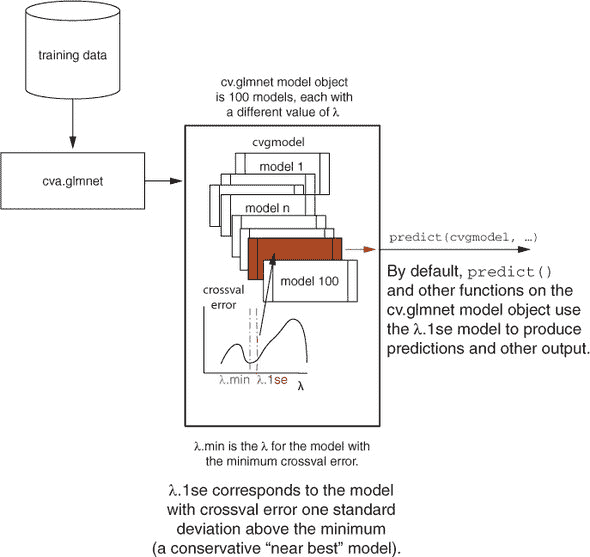

函数 `glmnetUtils::cv.glmnet()` 允许你以更友好的 R 方式调用交叉验证版本。

当使用正则化回归时，标准化数据（或中心化和缩放数据）（见 4.2.2 节）是一个好主意。幸运的是，`cv.glmnet()` 默认就会这样做。如果出于某种原因你想关闭这个功能（可能你已经标准化了数据），使用参数 `standardize = FALSE`。^([1])

> ¹
> 
> 关于 `glmnetUtils::cv.glmnet()` 的帮助/文档，请参阅 `help(cv.glmnet, package = "glmnet-Utils")`、`help(cv.glmnet, package = "glmnet")` 和 `help(glmnet, package = "glmnet")`。

列表 7.26\. 拟合岭回归模型

```
library(glmnet)
library(glmnetUtils)

(model_ridge <- cv.glmnet(fmla,
                         cars_train,
                         alpha = 0,
                         family = "binomial"))      ❶

## Call:
## cv.glmnet.formula(formula = fmla, data = cars_train, alpha = 0,
##     family = "binomial")
##
## Model fitting options:
##     Sparse model matrix: FALSE
##     Use model.frame: FALSE
##     Number of crossvalidation folds: 10
##     Alpha: 0
##     Deviance-minimizing lambda: 0.02272432  (+1 SE): 0.02493991
```

❶ 对于逻辑回归风格的模型，使用 family = “binomial”。对于线性回归风格的模型，使用 family = “gaussian”。

打印出 `model_ridge` 会告诉你对应于最小交叉验证误差（偏差）的 lambda 值，即 `model_ridge$lambda.min`。它还报告了 `model_ridge$lambda.1se` 的值。

记住，`cv.glmnet()` 默认返回 100 个模型；当然，你实际上只需要一个——“最佳”模型。如图 7.18 所示，当你调用 `predict()` 或 `coef()` 等函数时，`cv.glmnet` 对象默认使用对应于 `lambda.1se` 的模型，因为有些人认为 `lambda.1se` 比最小值 `lambda.min` 更不可能过拟合。

以下列表检查`lambda.1se`模型的系数。如果您想看到对应于`lambda.min`的模型，将列表中的第一行替换为`(coefs <- coef(model_ridge, s = model_ridge$lambda.min))`。

列表 7.27\. 查看岭模型的系数

```
(coefs <- coef(model_ridge))

## 22 x 1 sparse Matrix of class "dgCMatrix"
##                            1
## (Intercept)       2.01098708
## car_pricehigh     0.34564041
## car_pricelow     -0.76418240
## car_pricemed     -0.62791346
## car_pricevhigh    1.05949870
## maint_pricehigh   0.18896383
## maint_pricelow   -0.72148497
## maint_pricemed   -0.60000546
## maint_pricevhigh  1.14059599
## doors2            0.37594292
## doors3            0.01067978
## doors4           -0.21546650
## doors5more       -0.17649206
## persons2          2.61102897      ❶
## persons4         -1.35476871
## personsmore      -1.26074907
## lug_bootbig      -0.52193562
## lug_bootmed      -0.18681644
## lug_bootsmall     0.68419343
## safetyhigh       -1.70022006
## safetylow         2.54353980
## safetymed        -0.83688361

coef_frame <- data.frame(coef = rownames(coefs)[-1],
                        value = coefs[-1,1])

ggplot(coef_frame, aes(x = coef, y = value)) +
  geom_pointrange(aes(ymin = 0, ymax = value)) +
  ggtitle("Coefficients of ridge model") +
  coord_flip()
```

❶ 注意，分类变量 persons 的所有级别都存在（没有参考级别）。

注意，`cv.glmnet()`不使用分类变量的参考级别：例如，`coefs`向量包括变量`persons2`、`persons4`和`personsmore`，对应于`persons`变量的级别 2、4 和“more”。7.3.1 节中的逻辑回归模型使用了变量`persons4`和`personsmore`，并使用级别值`2`作为参考级别。在正则化时使用所有变量级别的好处是，系数的大小会正则化到零，而不是到一个（可能是任意的）参考级别。

您可以在图 7.19 中看到，该模型不再具有异常大的幅度。系数的方向表明，低安全评级、小型汽车以及非常高的购买或维护价格都正向预测不可接受的评级。有人可能会怀疑小型汽车与低安全评级相关，因此`safetylow`和`persons2`可能共享了这一荣誉。

图 7.19\. 岭回归模型的系数

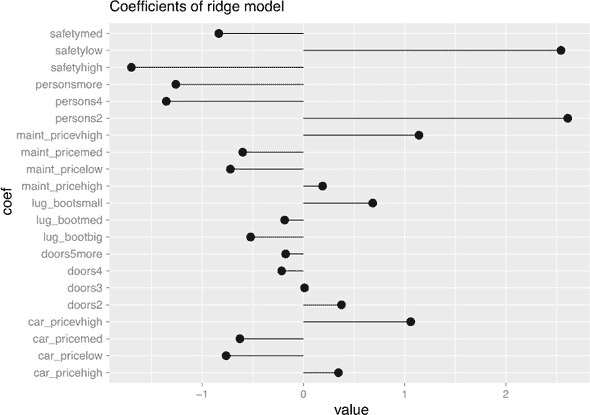

* * *

正则化影响可解释性

因为正则化向算法的优化函数添加了一个额外的项，所以您不能像在 7.1.4 节和 7.2.4 节中那样解释系数。例如，没有报告系数的显著性。然而，您至少可以使用系数的符号作为指示，哪些变量在联合模型中与结果呈正相关或负相关。

* * *

您还可以评估`model_ridge`在测试数据上的性能。

列表 7.28\. 查看岭模型的测试性能

```
prediction <- predict(model_ridge,
                     newdata = cars_test,
                     type = "response")

cars_test$pred_ridge <- as.numeric(prediction)    ❶

confmat(cars_test, "pred_ridge")
## $confusion_matrix
##               prediction
## truth          passed unacceptable
##   passed          147           12
##   unacceptable     16          324
##
## $accuracy
## [1] 0.9438878
##
## $deviance
## [1] 191.9248
```

❶ 预测变量是一个一维矩阵；在将其添加到 cars_test 数据框之前，需要将其转换为向量。

要查看对应于`lambda.min`的模型的预测，将前面列表中的第一个命令替换为以下命令：

```
prediction <- predict(model_ridge,
                      newdata = cars_test,
                      type="response",
                      s = model_ridge$lambda.min)
```

lasso 回归解决方案

您可以使用`alpha = 1`（默认值）与上一节相同的步骤来拟合 lasso 回归模型。我们将拟合模型作为练习留给读者；以下是结果。

列表 7.29\. lasso 模型的系数

```
## 22 x 1 sparse Matrix of class "dgCMatrix"
##                             1
## (Intercept)      -3.572506339
## car_pricehigh     2.199963497
## car_pricelow     -0.511577936
## car_pricemed     -0.075364079
## car_pricevhigh    3.558630135
## maint_pricehigh   1.854942910
## maint_pricelow   -0.101916375
## maint_pricemed   -0.009065081
## maint_pricevhigh  3.778594043
## doors2            0.919895270
## doors3            .
## doors4           -0.374230464
## doors5more       -0.300181160
## persons2          9.299272641
## persons4         -0.180985786
## personsmore       .
## lug_bootbig      -0.842393694
## lug_bootmed       .
## lug_bootsmall     1.886157531
## safetyhigh       -1.757625171
## safetylow         7.942050790
## safetymed         .
```

如图 7.20 所示，`cv.glmnet()` 并没有减少最大系数的幅度，尽管它将一些变量（`doors3`、`personsmore`、`lug_boot_med`、`safety_med`）置零，并且选择了与强烈预测不可接受评分相似的变量集。

图 7.20\. lasso 回归模型的系数

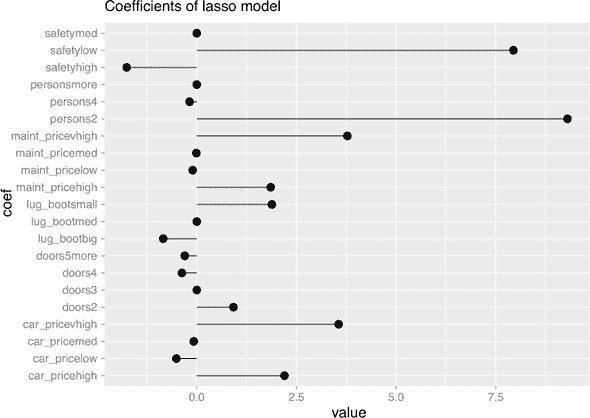

在测试数据上，lasso 模型的准确度与 ridge 模型相似，但偏差要低得多，这表明在测试数据上模型性能更好。

列表 7.30\. lasso 模型的测试性能

```
### $confusion_matrix
##               prediction
## truth          passed unacceptable
##   passed          150            9
##   unacceptable     17          323
##
## $accuracy
## [1] 0.9478958
##
## $deviance
## [1] 112.7308
```

弹性网络解决方案：选择 alpha

`cv.glmnet()` 函数仅优化 `lambda`；它假设 `alpha`，指定岭回归和 lasso 惩罚混合的变量是固定的。`glmnetUtils` 包提供了一个名为 `cva.glmnet()` 的函数，该函数将对 `alpha` 和 `lambda` 同时进行交叉验证。

列表 7.31\. 对 `alpha` 和 `lambda` 进行交叉验证

```
(elastic_net <- cva.glmnet(fmla,
                          cars_train,
                          family = "binomial"))

## Call:
## cva.glmnet.formula(formula = fmla, data = cars_train, family = "binomial")
##
## Model fitting options:
##     Sparse model matrix: FALSE
##     Use model.frame: FALSE
##     Alpha values: 0 0.001 0.008 0.027 0.064 0.125 0.216 0.343 0.512 0.729 1
##     Number of crossvalidation folds for lambda: 10
```

提取最佳模型的过程稍微复杂一些。与 `cv.glmnet` 不同，`cva.glmnet` 不返回 `alpha.min` 或 `alpha.1se`。相反，字段 `elastic_net$alpha` 返回函数尝试的所有 alpha 值（默认情况下为 11 个），而 `elastic_net$modlist` 返回所有相应的 `glmnet::cv.glmnet` 模型对象（参见图 7.21）。这些模型对象中的每一个实际上都是 100 个模型，因此对于给定的 `alpha`，我们将选择 `lambda.1se` 模型作为“最佳模型”。

图 7.21\. 使用 `cva.glmnet` 选择 `alpha` 的示意图

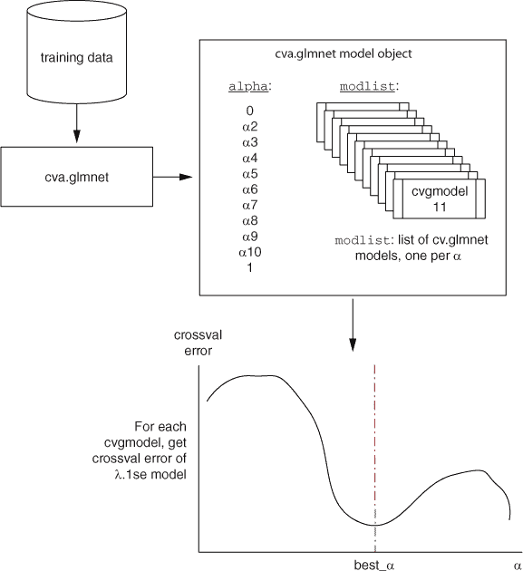

下面的列表实现了在图 7.21 中概述的过程，以获取每个“最佳模型”的平均交叉验证误差，并将误差作为 alpha 的函数绘制出来（图 7.22）。您可以使用函数 `minlossplot(elastic_net)` 创建类似的图表，但下面的列表还返回了最佳测试的 `alpha` 值。

图 7.22\. 交叉验证误差作为 alpha 的函数

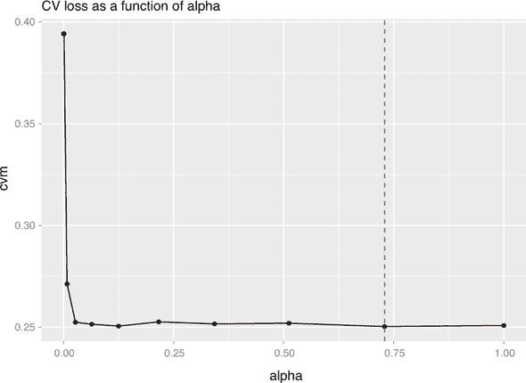

列表 7.32\. 寻找最小误差 `alpha`

```
get_cvm <- function(model) {                                           ❶
   index <- match(model$lambda.1se, model$lambda)
  model$cvm[index]
}

enet_performance <- data.frame(alpha = elastic_net$alpha)              ❷
models <- elastic_net$modlist                                          ❸
enet_performance$cvm <- vapply(models, get_cvm, numeric(1))            ❹

minix <- which.min(enet_performance$cvm)                               ❺
(best_alpha <- elastic_net$alpha[minix])                               ❻
## [1] 0.729
ggplot(enet_performance, aes(x = alpha, y = cvm)) +                    ❻
   geom_point() +
  geom_line() +
  geom_vline(xintercept = best_alpha, color = "red", linetype = 2) +
  ggtitle("CV loss as a function of alpha")
```

❶ 获取 cv.glmnet lambda.1se 模型平均交叉验证误差的函数

❷ 获取算法尝试的 alpha 值

❸ 获取生成的模型对象

❹ 获取每个最佳模型的误差

❺ 找到最小交叉验证误差

❻ 获取相应的 alpha

❻ 将模型性能作为 alpha 的函数绘制

记住，`cv.glmnet`和`cva.glmnet`都是随机的，因此结果可能每次运行都会有所不同。`glmnetUtils`的文档([`cran.r-project.org/web/packages/glmnetUtils/vignettes/intro.html`](https://cran.r-project.org/web/packages/glmnetUtils/vignettes/intro.html))建议多次运行`cva.glmnet`以减少噪声。如果您想对`alpha`进行交叉验证，我们建议多次计算`enet_performance`的等效值，并将`cvm`列的值平均在一起——每次运行的`alpha`值将是相同的，尽管相应的`lambda.1se`值可能不是。在确定了与最佳平均`cvm`相对应的`alpha`之后，再使用所选的`alpha`调用一次`cv.glmnet`以获得最终模型。

列表 7.33\. 拟合和评估弹性网络模型

```
(model_enet <- cv.glmnet(fmla,
                       cars_train,
                       alpha = best_alpha,
                       family = "binomial"))

## Call:
## cv.glmnet.formula(formula = fmla, data = cars_train, alpha = best_alpha,
##     family = "binomial")
##
## Model fitting options:
##     Sparse model matrix: FALSE
##     Use model.frame: FALSE
##     Number of crossvalidation folds: 10
##     Alpha: 0.729
##     Deviance-minimizing lambda: 0.0002907102  (+1 SE): 0.002975509

prediction <- predict(model_enet,
                      newdata = cars_test,
                      type = "response")

cars_test$pred_enet <- as.numeric(prediction)

confmat(cars_test, "pred_enet")

## $confusion_matrix
##               prediction
## truth          passed unacceptable
##   passed          150            9
##   unacceptable     17          323
##
## $accuracy
## [1] 0.9478958
##
## $deviance
## [1] 117.7701
```

还值得注意的是，在这种情况下，交叉验证损失在`alpha=0`之后下降得相当快，因此在实际应用中，几乎任何非零的`alpha`都会给出相似质量的模型。

## 摘要

线性和逻辑回归都假设结果是一个输入线性组合的函数。这似乎很限制，但在实践中，即使理论假设并不完全符合，线性和逻辑回归模型也能表现良好。我们将在第十章（chapter 10）中展示如何进一步克服这些限制。

线性和逻辑回归还可以通过量化结果与模型输入之间的关系来提供*建议*。由于模型完全由其系数表达，它们体积小、易于携带、效率高——这些都是将模型投入生产时的宝贵品质。如果模型的误差与*y*不相关，则可以信任模型在训练范围之外进行外推预测。外推永远不完全安全，但有时是必要的。

在变量相关或预测问题近似可分的情况下，线性方法可能表现不佳。在这些情况下，正则化方法可以产生更安全应用于新数据的模型，尽管这些模型的系数对于变量与结果之间关系建议并不那么有用。

在本章学习线性模型时，我们假设数据表现良好：数据没有缺失值，分类变量的可能级别数量较少，并且所有可能的级别都包含在训练数据中。在现实世界的数据中，这些假设并不总是成立。在下一章中，你将学习关于如何准备表现不佳的数据以进行建模的高级方法。

在本章中，你已经学到了

+   如何使用线性回归模型预测数值量

+   如何使用逻辑回归模型预测概率或进行分类

+   如何解释`lm()`和`glm()`模型的诊断结果

+   如何解释线性模型的系数

+   如何诊断线性模型可能不“安全”或不够可靠（多重共线性，准分离）

+   如何使用 `glmnet` 来拟合正则化线性与逻辑回归模型
