# 第八章\. 高级数据准备

本章涵盖

+   使用 `vtreat` 包进行高级数据准备

+   交叉验证数据准备

在我们上一章中，我们基于良好或行为良好的数据构建了大量的模型。在本章中，我们将学习如何准备或处理混乱的现实世界数据以进行建模。我们将使用第四章（第四章）的原则和高级数据准备包：`vtreat`。我们将重新审视缺失值、分类变量、变量重编码、冗余变量以及变量过多等问题。我们将花一些时间讨论变量选择，这在当前的机器学习方法中也是一个重要的步骤。本章的心智模型总结（图 8.1）强调，本章是关于处理数据和为机器学习建模做准备。我们首先介绍 `vtreat` 包，然后解决一个详细的现实世界问题，接着更详细地介绍如何使用 `vtreat` 包。

图 8.1\. 心智模型

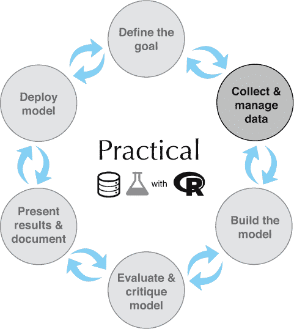

## 8.1\. vtreat 包的用途

`vtreat` 是一个 R 包，旨在为监督学习或预测建模准备现实世界的数据。它旨在处理许多常见问题，因此数据科学家无需处理。这为他们留下了更多时间来寻找和解决独特的领域相关问题。`vtreat` 是对第四章（第四章）中讨论的概念以及许多其他概念的出色实现。第四章（第四章）的一个目标是为您提供一些我们在处理数据时可能遇到的问题的理解，以及处理此类数据时应采取的原则性步骤。`vtreat` 将这些步骤自动化为高性能的生产级包，并且是一种可以正式引用的方法，您可以将其纳入自己的工作中。由于 `vtreat` 做了很多事情，我们无法简要解释它对数据所做的一切；有关详细信息，请参阅此处的高级文档：[`arxiv.org/abs/1611.09477`](https://arxiv.org/abs/1611.09477)。此外，`vtreat` 在此处有许多解释性小节和工作示例：[`CRAN.R-project.org/package=vtreat`](https://CRAN.R-project.org/package=vtreat)。

在本章中，我们将通过使用 KDD Cup 2009 数据集预测账户取消（称为 *客户流失*）的例子来探讨 `vtreat` 的功能。在这个示例场景中，我们将使用 `vtreat` 准备数据，以便在后续建模步骤中使用。`vtreat` 帮助解决的问题包括以下几方面：

+   数值变量中的缺失值

+   数值变量中的极端或超出范围的值

+   分类变量中的缺失值

+   分类数据中的稀有值

+   分类数据中的新颖值（在测试或应用期间看到，但在训练期间没有看到）

+   具有非常多个可能值的分类数据

+   由于变量数量过多导致的过拟合

+   由于“嵌套模型偏差”导致的过度拟合

`vtreat` 的基本工作流程（如图 8.2 所示）是使用一些训练数据来创建一个 *处理计划*，该计划记录了数据的关键特征，例如个体变量与结果之间的关系。然后，这个处理计划被用来 *准备* 将用于拟合模型的数据，以及准备模型将应用到的数据。这个想法是，这种准备或处理过的数据将是“安全”的，没有缺失或意外的值，并且可能包含新的合成变量，这将提高模型拟合度。从这个意义上说，`vtreat` 本身看起来很像一个模型。

图 8.2\. `vtreat` 三分分割策略

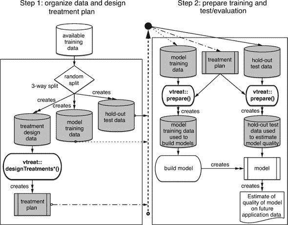

我们在 第四章 中看到了 `vtreat` 的简单用法，用于处理缺失值。在本章中，我们将使用 `vtreat` 的全部编码能力来处理我们的客户流失示例。为了激发兴趣，我们将解决 KDD Cup 2009 问题，然后我们将讨论如何一般性地使用 `vtreat`。

KDD Cup 2009 提供了一个关于客户关系管理的数据集。这个竞赛数据提供了 50,000 个信用卡账户的 230 个事实。从这些特征中，竞赛的一个目标就是预测账户取消（称为 *流失*）。

使用 `vtreat` 的基本方法是采用三分数据分割：一组用于学习数据处理，一组用于建模，第三组用于在新数据上评估模型质量。图 8.2 展示了这一概念，一旦我们通过一个示例，它将作为一个很好的记忆点。如图所示，要这样使用 `vtreat`，我们将数据分成三部分，并使用其中一部分来准备处理计划。然后我们使用处理计划来准备其他两个子集：一个子集用于拟合所需的模型，另一个子集用于评估拟合的模型。这个过程可能看起来很复杂，但从用户的角度来看，它非常简单。

让我们从使用 `vtreat` 的一个示例场景开始，该场景使用 KDD Cup 2009 账户取消预测问题。

## 8.2\. KDD 和 KDD Cup 2009

* * *

示例

*我们被赋予预测在特定时间段内哪些信用卡账户将取消的任务。这种取消称为流失。为了构建我们的模型，我们有监督的训练数据可用。对于训练数据中的每个账户，我们有数百个测量的特征，并且我们知道账户后来是否取消。我们希望构建一个模型，能够识别数据中的“有取消风险”的账户，以及未来的应用。*

* * *

为了模拟这个场景，我们将使用 KDD Cup 2009 竞赛数据集.^([1])

> ¹
> 
> 我们在这里分享数据以及使用 R 准备这些数据以进行建模的步骤：[`github.com/WinVector/PDSwR2/tree/master/KDD2009`](https://github.com/WinVector/PDSwR2/tree/master/KDD2009)。

* * *

**数据的不足之处**

与许多基于评分的竞赛一样，这次竞赛专注于机器学习，并故意抽象或跳过了一些重要的数据科学问题，例如共同定义目标、请求新的度量、收集数据以及根据业务目标量化分类器的性能。对于这次竞赛的数据，我们没有任何独立（或输入）变量的名称或定义，也没有对依赖（或结果）变量的真正定义。我们有优势，即数据以准备好建模的格式提供（所有输入变量和结果都安排在单行中）。但我们不知道任何变量的含义（因此我们很遗憾不能加入外部数据源），而且我们不能使用任何处理时间和事件重复的仔细方法（如时间序列方法或生存分析）。

> ^a
> 
> 我们将使用各种名称或列来构建模型，称为*变量*、*独立变量*、*输入变量*等，以尝试区分它们与要预测的值（我们将称之为*结果*或*依赖变量*）。

* * *

为了模拟数据科学过程，我们将假设我们可以使用我们给出的任何列来进行预测（即所有这些列在需要预测之前都是已知的）^([2])。我们将假设竞赛指标（*AUC*，或*曲线下面积*，如第 6.2.5 节中讨论的）是正确的，并且顶级参赛者的 AUC 是一个很好的上限（告诉我们何时停止调整）^([3])。

> ²
> 
> 检查列是否实际上将在预测期间可用（而不是未知输出的某个后续函数）是数据科学项目中的一个关键步骤。
> 
> ³
> 
> AUC 是一个好的初始筛选指标，因为它衡量你的分数的任何单调变换是否是一个好的分数。为了微调，我们将使用 R 平方和伪 R 平方（也在第六章中定义）作为它们更严格，衡量手头的确切值是否是好的分数。

### 8.2.1\. 开始使用 KDD Cup 2009 数据

对于我们的示例，我们将尝试预测 KDD 数据集中的客户流失。KDD 竞赛是根据 AUC（*曲线下面积*，第 6.2.5 节中讨论的预测质量度量）来评判的，因此我们也将使用 AUC 作为我们的性能度量^([4])。获胜团队在客户流失上的 AUC 为 0.76，因此我们将将其视为可能性能的上限。我们的性能下限是 AUC 为 0.5，因为 AUC 低于 0.5 比随机预测更差。

> ⁴
> 
> 此外，正如常见的示例问题一样，我们没有项目赞助商来讨论指标，因此我们的评估选择有点随意。

此问题具有大量变量，其中许多是具有大量可能级别的分类变量。正如我们将看到的，此类变量在创建治疗方案的过程中特别容易过拟合。由于这个担忧，我们将数据分为三个集合：训练集、校准集和测试集。在以下示例中，我们将使用训练集来设计治疗方案，并使用校准集来检查治疗方案中的过拟合。测试集保留用于对模型性能进行最终估计。许多研究人员推荐这种三方分割程序。5

> ⁵
> 
> 通常，我们会使用校准集来设计治疗方案，训练集来训练模型，测试集来评估模型。由于本章的重点是数据处理过程，我们将使用最大的集合（`dTrain`）来设计治疗方案，并使用其他集合来评估它。

让我们按照以下列表开始工作，其中我们准备数据进行分析和建模。6

> ⁶
> 
> 请在 PDSwR2 支持材料的 KDD2009 子目录中工作，或者将相关文件复制到您正在工作的位置。PDSwR2 支持材料可在 [`github.com/WinVector/PDSwR2`](https://github.com/WinVector/PDSwR2) 获取，有关入门说明请参阅 附录 A。

列表 8.1\. 准备 KDD 数据进行分析

```
d <- read.table('orange_small_train.data.gz',                          ❶
   header = TRUE,
   sep = '\t',
   na.strings = c('NA', ''))                                           ❷

churn <- read.table('orange_small_train_churn.labels.txt',
   header = FALSE, sep = '\t')                                         ❸
d$churn <- churn$V1                                                    ❹
set.seed(729375)                                                       ❺
rgroup <- base::sample(c('train', 'calibrate', 'test'),                ❻
   nrow(d),
   prob = c(0.8, 0.1, 0.1),
   replace = TRUE)
dTrain <- d[rgroup == 'train', , drop = FALSE]
dCal <- d[rgroup == 'calibrate', , drop = FALSE]
dTrainAll <- d[rgroup %in% c('train', 'calibrate'), , drop = FALSE]
dTest <- d[rgroup == 'test', , drop = FALSE]

outcome <- 'churn'
vars <- setdiff(colnames(dTrainAll), outcome)

rm(list=c('d', 'churn', 'rgroup'))                                     ❻
```

❶ 读取独立变量文件。所有数据均来自 [`github.com/WinVector/PDSwR2/tree/master/KDD2009`](https://github.com/WinVector/PDSwR2/tree/master/KDD2009)。

❷ 将 NA 和空字符串都视为缺失数据

❸ 读取已知的流失结果

❹ 添加流失作为新列

❺ 通过设置伪随机数生成器的种子，我们使我们的工作可重复：有人重新执行它将看到完全相同的结果。

❻ 将数据分为训练集、校准集和测试集。显式指定 base::sample() 函数以避免与 dplyr::sample() 函数发生名称冲突，如果已加载 dplyr 包。

❻ 从工作区移除不必要的对象

我们还在 GitHub 仓库中保存了一个 R 工作空间，其中包含本章的大部分数据、函数和结果，您可以使用命令 `load('KDD2009.Rdata')` 加载它。我们现在准备好构建一些模型。

我们想提醒读者：始终查看您的数据。查看数据是发现惊喜的最快方式。有两个函数特别有助于对数据进行初步查看：`str()`（以转置形式显示前几行的结构）和 `summary()`。

* * *

练习：使用 str() 和 summary()

在继续之前，请运行列表 8.1 中的所有步骤，然后尝试自己运行`str(dTrain)`和`summary(dTrain)`。我们试图通过不在我们的保留数据上做出建模决策来避免过拟合。

* * *

* * *

**快速进行子样本**

经常数据科学家会如此专注于业务问题、数学和数据，以至于他们忘记了需要多少试错。首先在小部分训练数据上工作通常是一个非常好的主意，这样调试代码只需要几秒钟，而不是几分钟。除非你真的需要，否则不要处理大型和缓慢的数据集。

* * *

描述结果

在开始建模之前，我们应该查看结果分布。这告诉我们有多少变异，以至于甚至尝试预测。我们可以这样做：

```
outcome_summary <- table(
   churn = dTrain[, outcome],                   ❶
   useNA = 'ifany')                             ❷

knitr::kable(outcome_summary)

outcome_summary["1"] / sum(outcome_summary)     ❸
#          1
# 0.07347764
```

❶ 列出客户流失结果的水平

❷ 在列表中包含 NA 值

❸ 估计观察到的客户流失率或流行率

图 8.3 中的表格表明，客户流失有两个值：-1 和 1。值 1（表示发生了客户流失或账户取消）大约有 7% 的时间被看到。因此，我们可以简单地通过预测没有任何账户取消来达到 93% 的准确率，尽管显然这不是一个有用的模型！^([7])

> ⁷
> 
> 见[`www.win-vector.com/blog/2009/11/i-dont-think-that-means-what-you-think-it-means-statistics-to-english-translation-part-1-accuracy-measures/`](http://www.win-vector.com/blog/2009/11/i-dont-think-that-means-what-you-think-it-means-statistics-to-english-translation-part-1-accuracy-measures/)。

图 8.3\. KDD2009 客户流失率

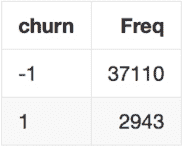

### 8.2.2\. 中国瓷器店的牛

让我们故意忽略查看数据、查看列以及描述拟议的解释变量与要预测的数量之间关系的建议。对于这个第一次尝试，我们不是在制定治疗方案，所以我们将使用`dTrain`和`dCal`数据一起来拟合模型（作为`dTrainAll`集合）。让我们看看如果我们立即尝试为`churn == 1`构建模型会发生什么，给定解释变量（提示：这不会很漂亮）。

列表 8.2\. 尝试在没有准备的情况下进行建模

```
library("wrapr")                                                 ❶

outcome <- 'churn'
vars <- setdiff(colnames(dTrainAll), outcome)

formula1 <- mk_formula("churn", vars, outcome_target = 1)        ❷
model1 <- glm(formula1, data = dTrainAll, family = binomial)     ❸

# Error in `contrasts ...                                        ❹
```

❶ 为方便函数（如 mk_formula()）附加 wrapr 包

❷ 构建模型公式规范，要求预测 churn == 1 作为我们的解释变量的函数

❸ 要求 glm() 函数构建一个逻辑回归模型

❹ 尝试失败，出现错误。

如我们所见，这次尝试失败了。一些研究将表明，我们试图用作解释变量的某些列没有变化，并且对于每一行或示例都具有完全相同的值。我们可以尝试手动过滤掉这些不良列，但以这种方式修复常见的数据问题是非常繁琐的。例如，列表 8.3 展示了如果我们只使用第一个解释变量`Var1`来构建模型会发生什么。

* * *

**解释变量**

*解释变量*是我们试图用作模型输入的列或变量。在这种情况下，变量到达我们这里时没有信息性的名称，因此它们以`Var#`的形式命名，其中`#`是一个数字。在一个真实的项目中，这可能是数据管理伙伴未承诺的迹象，并且在尝试建模之前需要解决的问题。

* * *

列表 8.3\. 尝试仅使用一个变量

```
model2 <- glm((churn == 1) ~ Var1, data = dTrainAll, family = binomial)
summary(model2)
#
# Call:
# glm(formula = (churn == 1) ~ Var1, family = binomial, data = dTrainAll)
#
# Deviance Residuals:
#     Min       1Q   Median       3Q      Max
# -0.3997  -0.3694  -0.3691  -0.3691   2.3326
#
# Coefficients:
#               Estimate Std. Error z value Pr(>|z|)
# (Intercept) -2.6523837  0.1674387 -15.841   <2e-16 ***
# Var1         0.0002429  0.0035759   0.068    0.946
# ---
# Signif. codes:  0 '***' 0.001 '**' 0.01 '*' 0.05 '.' 0.1 ' ' 1
#
# (Dispersion parameter for binomial family taken to be 1)
#
#     Null deviance: 302.09  on 620  degrees of freedom
# Residual deviance: 302.08  on 619  degrees of freedom
#   (44407 observations deleted due to missingness)       ❶
# AIC: 306.08
#
# Number of Fisher Scoring iterations: 5

dim(dTrainAll)
# [1] 45028   234
```

❶ 这意味着建模过程丢弃了这么多的（几乎全部）训练数据。

我们在第 7.2 节中详细介绍了如何阅读模型摘要。这里引人注目的是“由于缺失值删除了 44407 个观测值”这一行。这意味着建模过程丢弃了我们 45028 个训练行中的 44407 行，基于剩余的 621 行数据构建模型。因此，除了不变化的列之外，我们还有包含大量缺失值的列。

数据问题并没有结束。看看另一个变量，这次是名为`Var200`的变量：

```
head(dTrainAll$Var200)
# [1] <NA>    <NA>    vynJTq9 <NA>    0v21jmy <NA>
# 15415 Levels: _84etK_ _9bTOWp _A3VKFm _bq4Nkb _ct4nkXBMp ... zzQ9udm

length(unique(dTrainAll$Var200))
# [1] 14391
```

`head()`命令显示了`Var200`的前几个值，告诉我们这个列具有作为因子的字符串值编码。因子是 R 对来自已知集合的字符串的表示。这正是问题的所在。注意列表中提到因子有 15415 个可能的水平。具有这么多不同水平的因子或字符串变量在过拟合方面将是一个大问题，并且对于`glm()`代码来说也难以处理。此外，`length(unique(dTrainAll$Var200))`摘要告诉我们`Var200`在我们的训练样本中只采取了 14391 个不同的值。这告诉我们我们的训练数据样本没有看到这个变量的所有已知值。我们的保留测试集除了在训练期间看到的值之外，还包含训练集之外的新的值。这对于具有大量水平的字符串值或分类变量来说是很常见的，并且导致大多数 R 建模代码在尝试对新数据进行预测时出错。

我们可以继续。我们还没有用尽第 8.1 节中常见错误事项的列表。到目前为止，我们希望读者会同意：一种合理的系统方法来识别、描述和减轻常见的数据质量问题将大有裨益。以领域无关的方式处理常见的数据质量问题，让我们有更多时间处理数据并解决任何特定领域的问题。`vtreat`包是这项任务的优秀工具。在本章的其余部分，我们将与 KDD Cup 2009 数据略作工作，然后掌握一般使用`vtreat`的方法。

## 8.3\. 分类的基本数据准备

`vtreat`通过清理现有列或变量以及引入新的列或变量来准备数据。对于我们的订单取消场景，`vtreat`将处理缺失值、具有许多级别的分类变量和其他问题。让我们在这里掌握`vtreat`的过程。

首先，我们将使用我们数据的一部分（`dTrain`集）来设计我们的变量处理。

列表 8.4\. 分类的基本数据准备

```
library("vtreat")                                                       ❶

(parallel_cluster <- parallel::makeCluster(parallel::detectCores()))    ❷

treatment_plan <- vtreat::designTreatmentsC(                            ❸
  dTrain,
  varlist = vars,
  outcomename = "churn",
  outcometarget = 1,
  verbose = FALSE,
  parallelCluster = parallel_cluster)
```

❶ 添加 vtreat 包以使用如 designTreatmentsC()等函数

❷ 启动一个并行集群以加快计算速度。如果您不想使用并行集群，只需将 parallel_cluster 设置为 NULL。

❸ 使用 designTreatmentsC()从训练数据中学习处理计划。对于大小和复杂度类似于 KDD2009 的数据集，这可能需要几分钟。

然后，我们将使用处理计划来准备清洗和处理后的数据。`prepare()`方法构建一个新的数据框，其行顺序与原始数据框相同，并包含处理计划中的列（如果存在，则复制依赖变量列）。这一想法在图 8.4 中得到了说明。在列表 8.5 中，我们将处理计划应用于`dTrain`数据，以便我们可以比较处理后的数据与原始数据。

图 8.4\. `vtreat`变量准备

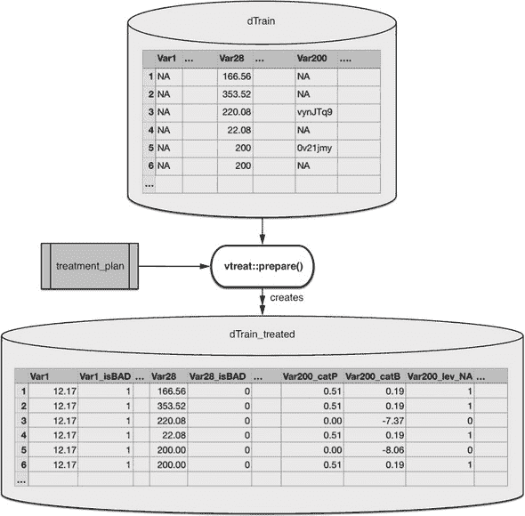

列表 8.5\. 使用`vtreat`准备数据

```
dTrain_treated <- prepare(treatment_plan,
                          dTrain,
                          parallelCluster = parallel_cluster)

head(colnames(dTrain))
## [1] "Var1" "Var2" "Var3" "Var4" "Var5" "Var6"
head(colnames(dTrain_treated))                                       ❶
## [1] "Var1"       "Var1_isBAD" "Var2"       "Var2_isBAD" "Var3"
## [6] "Var3_isBAD"
```

❶ 比较原始 dTrain 数据的列与其处理后的对应数据

注意，处理后的数据既转换了现有列，也引入了新的列或派生变量。在下一节中，我们将探讨这些新变量是什么以及如何使用它们。

### 8.3.1\. 变量得分框架

我们到目前为止所处理的`vtreat`过程集中在`designTreatmentsC()`上，它返回治疗方案。治疗方案是一个 R 对象，有两个目的：通过`prepare()`语句用于数据准备，并提供对建议变量的简单总结和初步评估。这个简单的总结封装在*分数框架*中。分数框架列出了`prepare()`方法将创建的变量，以及一些关于它们的信息。分数框架是我们了解`vtreat`引入的新变量以简化我们的建模工作的指南。让我们看一下分数框架：

```
score_frame <-  treatment_plan$scoreFrame
t(subset(score_frame, origName %in% c("Var126", "Var189")))

# varName           "Var126"       "Var126_isBAD" "Var189"       "Var189_isBAD" ❶
# varMoves          "TRUE"         "TRUE"         "TRUE"         "TRUE"         ❷
# rsq               "0.0030859179" "0.0136377093" "0.0118934515" "0.0001004614" ❸
# sig               "7.876602e-16" "2.453679e-64" "2.427376e-56" "1.460688e-01" ❹
# needsSplit        "FALSE"        "FALSE"        "FALSE"        "FALSE"        ❺
# extraModelDegrees "0"            "0"            "0"            "0"            ❻
# origName          "Var126"       "Var126"       "Var189"       "Var189"       ❻
# code              "clean"        "isBAD"        "clean"        "isBAD"        ❽
```

❶ 派生变量或列的名称

❷ 一个指示符，表明这个变量不总是相同的值（不是一个常数，这对建模是无用的）

❸ 变量的 R-squared 或伪 R-squared；这个变量在线性模型中可以解释的因变量变异的分数

❹ 估计 R-squared 的重要性

❺ 一个指示符，当为 TRUE 时，是对用户的一个警告，表明该变量隐藏了额外的自由度（模型复杂度的度量），需要使用交叉验证技术进行评估

❻ 变量的复杂程度；对于分类变量，这与级别的数量有关。

❻ 变量派生自原始列的名称

❽ 用于构建此变量的转换类型的名称

分数框架是一个`data.frame`，每行对应一个派生解释变量。每一行显示派生变量将来自哪个原始变量（`orig-Name`），将使用什么类型的转换来生成派生变量（`code`），以及一些关于变量的质量摘要。

在我们的例子中，Var126 生成了两个新的或派生变量：Var126（原始 Var126 的清理版本，没有 NA/缺失值），以及 Var116_isBAD（一个指示变量，表示 Var126 原始的哪些行包含缺失或不良值）。

`rsq`列记录了给定变量的伪 R-squared，这是如果将其作为因变量的单变量模型处理时，变量信息性的一个指标。`sig`列是对此伪 R-squared 显著性的估计。请注意，`var126_isBAD`比清理后的原始变量`var126`更有信息量。这表明我们应该考虑将`var126_isBAD`包含在我们的模型中，即使我们决定不包含`var126`的清理版本本身！

* * *

**信息性缺失值**

在生产系统中，缺失值通常非常有信息。缺失值通常表明相关数据经历了某种条件（温度超出范围，测试未运行，或其他情况），并以编码的形式提供了大量上下文。我们见过许多情况，其中变量缺失的信息比变量本身的清理值更有信息量。

* * *

让我们看看一个分类变量。原始 `Var218` 有两个可能的水平：`cJvF` 和 `UYBR`。

```
t(subset(score_frame, origName == "Var218"))

# varName           "Var218_catP"  "Var218_catB"  "Var218_lev_x_cJvF" "Var218
                                                                 _lev_x_UYBR"
# varMoves          "TRUE"         "TRUE"         "TRUE"              "TRUE"

# rsq               "0.011014574"  "0.012245152"  "0.005295590"       "0.0019
                                                                       70131"
# sig               "2.602574e-52" "5.924945e-58" "4.902238e-26"
                                                               "1.218959e-10"
# needsSplit        " TRUE"        " TRUE"        "FALSE"             "FALSE"
# extraModelDegrees "2"            "2"            "0"                 "0"
# origName          "Var218"       "Var218"       "Var218"            "Var218
# code              "catP"         "catB"         "lev"               "lev"
```

原变量 `Var218` 产生了四个派生变量。特别是，请注意，水平 `cJvF` 和 `UYBR` 分别为我们提供了新的派生列或变量。

水平变量（lev）

`Var218_lev_x_cJvF` 和 `Var218_lev_x_UYBR` 是指示变量，当原始 `Var218` 的值分别为 `cJvF` 和 `UYBR` 时，它们的值为 `1`；^([8]) 我们稍后会讨论其他两个变量。回顾 第七章，大多数建模方法通过将其转换为 *n*（或 *n-1*）个二元变量，或指示变量（有时称为 *独热编码* 或 *虚拟变量*）来处理具有 *n* 个可能水平的分类变量。R 中的许多建模函数，如 `lm` 或 `glm`，会自动进行这种转换；而其他函数，如 `xgboost`，则不会。`vtreat` 尝试在可行的情况下显式地独热编码分类变量。这样，数据既可以由 `glm` 等建模函数使用，也可以由 `xgboost` 等函数使用。

> ⁸
> 
> 在一个真实的建模项目中，我们会坚持使用有意义的水平名称和一个 *数据字典* 来描述各种水平的含义。KDD2009 竞赛数据没有提供此类信息，这是竞赛数据的一个局限性，阻碍了使用变量从外部数据源获取额外信息等强大方法。

默认情况下，`vtreat` 只为“非稀有”水平创建指示变量：出现频率超过 2% 的水平。正如我们将看到的，`Var218` 也有一些缺失值，但缺失值只占 1.4% 的时间。如果缺失值更有信息量，那么 `vtreat` 也会创建一个 `Var218_lev_x_NA` 指示变量。

影响变量（catB）

独热编码为分类变量的每个非稀有水平创建一个新变量。`catB` 编码返回一个单一的新变量，其中每个原始分类变量的可能水平都有一个数值。这个值表示给定水平的信息量：具有大绝对值的值对应于更具有信息量的水平。我们称此为该水平对结果的影响；因此，术语“影响变量”。为了理解影响变量，让我们比较原始 `Var218` 与 `Var218_catB`：

```
comparison <- data.frame(original218 = dTrain$Var218,
                         impact218 = dTrain_treated$Var218_catB)

head(comparison)
 ##   original218  impact218
## 1        cJvF -0.2180735
## 2        <NA>  1.5155125
## 3        UYBR  0.1221393
## 4        UYBR  0.1221393
## 5        UYBR  0.1221393
## 6        UYBR  0.1221393
```

对于分类问题，影响编码的值与从 `Var218` 预测流失的逻辑回归模型的预测相关。为了展示这一点，我们将使用我们在 第 4.1.3 节 中使用的简单缺失值处理方法，将 `Var218` 中的 `NA` 值显式地转换为新的水平。我们还将使用我们在 第七章 中看到的 `logit` 或对数优势函数。

```
treatment_plan_2 <- design_missingness_treatment(dTrain, varlist = vars)   ❶
dtrain_2 <- prepare(treatment_plan_2, dTrain)                              ❷
head(dtrain_2$Var218)

## [1] "cJvF"      "_invalid_" "UYBR"      "UYBR"      "UYBR"      "UYBR"

model <- glm(churn ==1  ~ Var218,                                          ❸
             data = dtrain_2,
             family = "binomial")
pred <- predict(model,                                                     ❹
                newdata = dtrain_2,
                type = "response")

(prevalence <- mean(dTrain$churn == 1) )                                   ❺
 ## [1] 0.07347764

logit <- function(p) {                                                     ❻
   log ( p / (1-p) )
}

comparison$glm218 <- logit(pred) - logit(prevalence)                       ❻
 head(comparison)

##   original218  impact218     glm218
## 1        cJvF -0.2180735 -0.2180735                                     ❽
## 2        <NA>  1.5155125  1.5155121
## 3        UYBR  0.1221393  0.1221392
## 4        UYBR  0.1221393  0.1221392
## 5        UYBR  0.1221393  0.1221392
## 6        UYBR  0.1221393  0.1221392
```

❶ 将 NA 转换为安全字符串的简单处理

❷ 创建处理后的数据

❸ 符合一元逻辑回归模型

❹ 在数据上做出预测

❺ 计算流失的全球概率。

❻ 一个计算概率的对数几率或对数优势的函数

❻ 手动计算 catB 值

❽ 注意，vtreat 的影响代码与标准 glm 模型中编码的“delta logit”预测相匹配。这有助于说明 vtreat 是如何实现的。

在我们的 KDD2009 示例中，我们看到`catB`影响编码正在用一个对应的一元逻辑回归模型的预测来替换一个分类变量。由于技术原因，预测是在“链接空间”或`logit`空间中，而不是在概率空间中，并且表示为与总是预测全局结果概率的零模型之间的差异。在所有情况下，这种数据准备都涉及一个可能复杂的分类变量（可能表示许多自由度或虚拟变量列），并推导出一个单一的数值列，该列提取了变量的大部分建模效用。

当建模问题是一个回归而不是分类（结果为数值）时，影响编码与一元线性回归的预测相关。我们将在本章后面看到这个示例。

普及变量（catP）

想法是这样的：对于某些变量，知道某个水平出现的频率非常有信息量。例如，对于美国的 ZIP 代码，罕见的 ZIP 代码可能都是来自低人口密度的农村地区。普及变量简单地编码了原始变量在给定水平上占的时间比例，使得这些整个数据集的统计数据以方便的按例格式可用于建模过程。

* * *

**变量伦理**

注意：对于某些应用，某些变量和推断可能既不道德也可能非法使用。例如，由于历史上的“红线”歧视做法，美国禁止在信用批准决策中使用 ZIP 代码和种族。

在实际应用中，对伦理问题的敏感性和熟悉数据和建模法律是至关重要的。

* * *

让我们看看另一个给我们带来麻烦的变量发生了什么：`Var200`。回想一下，这个变量有 15415 个可能的值，其中只有 13324 个出现在训练数据中。

```
score_frame[score_frame$origName == "Var200", , drop = FALSE]

#           varName varMoves         rsq          sig needsSplit
            extraModelDegrees origName code
# 361   Var200_catP     TRUE 0.005729835 4.902546e-28
                        TRUE             13323   Var200 catP
# 362   Var200_catB     TRUE 0.001476298 2.516703e-08
                        TRUE             13323   Var200 catB
# 428 Var200_lev_NA     TRUE 0.005729838 4.902365e-28
                        FALSE                 0   Var200  lev
```

注意，`vtreat`只返回了一个指示变量，表示缺失值。`Var200`的所有其他可能值都很罕见：它们出现的频率不到 2%。对于像`Var200`这样的具有非常大量级的变量，在建模时将所有级别编码为指示变量并不实用；将变量表示为单个数值变量，如`catB`变量，计算上更有效。

在我们的例子中，`designTreatmentsC()` 方法将原始的 230 个解释变量重新编码为 546 个新的全数值解释变量，这些变量没有缺失值。想法是这些 546 个变量更容易处理，并且有很大的机会代表数据中大部分原始的预测信号。`vtreat` 可以引入的新变量的完整描述可以在 `vtreat` 包文档中找到。9]

> ⁹
> 
> 查看 [`winvector.github.io/vtreat/articles/vtreatVariableTypes.html`](https://winvector.github.io/vtreat/articles/vtreatVariableTypes.html)。

8.3.2\. 正确使用治疗计划

治疗计划对象的主要目的是允许 `prepare()` 在拟合和应用模型之前将新数据转换为安全、干净的形式。让我们看看这是如何完成的。在这里，我们将从 `dTrain` 集中学习到的治疗计划应用于校准集 `dCal`，如图 8.5 所示。

图 8.5\. 准备保留数据


```
dCal_treated <- prepare(treatment_plan,
                        dCal,
                        parallelCluster = parallel_cluster)
```

通常，我们现在可以使用 `dCal_treated` 来拟合一个关于客户流失的模型。在这种情况下，我们将用它来说明在得分框架中 `needsSplit == TRUE` 的转换变量上过度拟合的风险。

如我们之前提到的，你可以将 `Var200_catB` 变量视为一个关于客户流失的单变量逻辑回归模型。当我们调用 `designTreatmentsC()` 时，这个模型使用了 `dTrain` 进行拟合；然后当我们调用 `prepare()` 时，它被应用于 `dCal` 数据。让我们看看这个模型在训练集和校准集上的 AUC：

```
library("sigr")

calcAUC(dTrain_treated$Var200_catB, dTrain_treated$churn)

# [1] 0.8279249

calcAUC(dCal_treated$Var200_catB, dCal_treated$churn)

# [1] 0.5505401
```

注意训练数据中估计的 AUC 为 0.83，这似乎非常好。然而，当我们查看未用于设计变量处理的校准数据时，这个 AUC 并没有得到证实。`Var200_catB` 相对于 `dTrain_ treated` 过度拟合。`Var200_catB` 是一个有用的变量，只是不如它在训练数据上看起来那么好。

* * *

不要直接重用相同的数据来拟合治疗计划和模型！

为了避免过度拟合，一般规则是，每当预建模数据预处理步骤使用对结果的知识时，你不应该使用相同的数据进行预建模步骤和建模。

本节中的 AUC 计算表明 `Var200_catB` 在训练数据上看起来“太好”了。任何使用 `dTrain_ treated` 来拟合客户流失模型的模型拟合算法都可能基于其明显的值过度使用这个变量。结果模型将无法在新的数据上实现这个值，并且它的预测效果不会像预期的那样好。

* * *

正确的程序是在设计数据处理计划后不重复使用 `dTrain`，而是使用 `dCal_treated` 进行模型训练（尽管在这种情况下，我们应该使用比最初分配更多的可用数据）。有了足够的数据和正确的数据分割（例如，40% 数据处理设计，50% 模型训练，10% 模型测试/评估），这是一种有效的策略。

在某些情况下，我们可能没有足够的数据来进行良好的三路分割。内置的 `vtreat` 交叉验证程序允许我们使用相同的训练数据来设计数据处理计划，并正确构建模型。这是我们接下来要掌握的。

## 8.4\. 高级数据准备用于分类

现在我们已经看到了如何为分类准备杂乱的数据，让我们探讨如何以更统计有效的方式进行。也就是说，让我们掌握那些让我们可以安全地重复使用相同数据来设计处理计划和模型训练的技术。

### 8.4.1\. 使用 mkCrossFrameCExperiment()

使用 `vtreat` 安全地使用相同的数据进行数据处理设计和模型构建是很容易的。我们所做的只是使用 `mkCrossFrameCExperiment()` 方法而不是 `designTreatmentsC()` 方法。`designTreatmentsC()` 方法使用交叉验证技术来生成一个特殊的 *交叉帧* 用于训练，而不是在训练数据上使用 `prepare()`，这一点我们在图 8.6 中进行了回顾。

图 8.6\. `vtreat` 三路分割策略再次

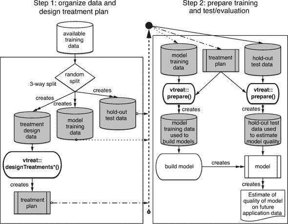

交叉帧是一种特殊的代理训练数据，其行为就像它没有被用来构建自己的处理计划一样。这个过程在图 8.7 中显示，我们可以将其与图 8.6 进行对比。

图 8.7\. `vtreat` 交叉帧策略

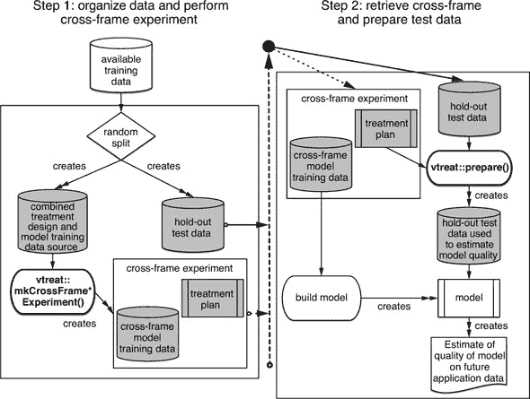

程序的用户可见部分很小且简单。图 8.7 之所以看起来复杂，是因为 `vtreat` 提供了一个非常复杂的服务：适当的交叉验证组织，这允许我们安全地重复使用数据来进行处理设计和模型训练。

治疗计划和交叉帧可以按以下方式构建。在这里，我们将最初分配用于训练和校准的所有数据作为一个单独的训练集，`dTrainAll`。然后我们将评估测试集中的数据。

列表 8.6\. 高级数据准备用于分类

```
library("vtreat")

parallel_cluster <- parallel::makeCluster(parallel::detectCores())

cross_frame_experiment <- vtreat::mkCrossFrameCExperiment(
  dTrainAll,
  varlist = vars,
  outcomename = "churn",
  outcometarget = 1,
  verbose = FALSE,
  parallelCluster = parallel_cluster)

dTrainAll_treated <- cross_frame_experiment$crossFrame       ❶
treatment_plan <- cross_frame_experiment$treatments
score_frame <- treatment_plan$scoreFrame

dTest_treated <- prepare(treatment_plan,                     ❷
                         dTest,
                         parallelCluster = parallel_cluster)
```

❶ 我们将使用交叉帧来训练逻辑回归模型。

❷ 准备测试集，以便我们可以对其调用模型

列表 8.6 中的步骤故意与列表 8.4 中的步骤非常相似。请注意，`dTrainAll_treated` 是作为实验的一部分返回的值，而不是我们使用 `prepare()` 产生的。这种整体数据处理策略实现了图 8.7 中的想法。

让我们重新检查 `Var200` 在训练集和测试集上的预测质量估计：

```
library("sigr")

calcAUC(dTrainAll_treated$Var200_catB, dTrainAll_treated$churn)

# [1] 0.5450466

calcAUC(dTest_treated$Var200_catB, dTest_treated$churn)

# [1] 0.5290295
```

注意，`Var200` 在训练数据上的估计效用现在与其在测试数据上的未来性能非常接近.^([10]) 这意味着在训练数据上做出的决策在稍后重新测试保留的测试数据或未来的应用数据时，有很大机会是正确的。

> ¹⁰
> 
> 记住，我们是从受抽样影响的数据中估计性能的，因此所有质量估计都是嘈杂的，我们不应将观察到的差异视为问题。

### 8.4.2\. 构建模型

现在我们已经处理了我们的变量，让我们再次尝试构建一个模型。

变量选择

构建许多变量模型的关键部分是选择要使用的变量。我们使用的每个变量都代表解释更多结果变化的机会（构建更好模型的机会），但也代表噪声和过拟合的可能来源。为了控制这种影响，我们通常预先选择我们将用于拟合的变量子集。变量选择可以是一个重要的防御性建模步骤，即使是那些“不需要”这种步骤的模型类型。现代数据仓库中通常看到的列数可能会压倒最先进的机器学习算法.^([11])

> ¹¹
> 
> 查看 [`www.win-vector.com/blog/2014/02/bad-bayes-an-example-of-why-you-need-hold-out-testing/`](http://www.win-vector.com/blog/2014/02/bad-bayes-an-example-of-why-you-need-hold-out-testing/)。

`vtreat` 提供了两种过滤变量的方法：评分框架中的汇总统计以及一种称为 `value_variables_C()` 的方法。评分框架中的汇总是每个变量的线性拟合质量，因此它们可能低估了复杂的非线性数值关系。一般来说，你可能想尝试 `value_variables_C()` 来正确评分非线性关系。对于我们的例子，我们将拟合一个线性模型，因此使用更简单的评分框架方法是合适的.^([12])

> ¹²
> 
> 我们在 [`github.com/WinVector/PDSwR2/blob/master/KDD2009/KDD2009vtreat.md`](https://github.com/WinVector/PDSwR2/blob/master/KDD2009/KDD2009vtreat.md) 分享了一个 `xgboost` 的工作解决方案，它在 AUC（曲线下面积）方面与线性模型具有相似的性能。事情可以改进，但我们似乎已经进入了一个收益递减的区域。

我们将根据显著性过滤变量，但请注意，显著性估计本身非常嘈杂，如果不当进行变量选择，本身也可能成为错误和偏差的来源。13] 我们将使用以下思路：假设某些列实际上是不相关的，并使用最宽松的标准，只允许少量不相关列通过。我们使用最宽松的条件来尽量减少我们可能意外过滤掉的实际有用列或变量的数量。请注意，虽然相关列的显著性值应接近零，但不相关列的显著性应在零到一之间均匀分布（这与显著性的定义非常接近）。因此，一个好的选择过滤器将保留所有显著性不超过`k/nrow(score_frame)`的变量；我们预计只有大约`k`个不相关变量会通过这样的过滤器。

> ¹³
> 
> 关于这个效果的优秀文章是 Freedman 的“关于筛选回归方程的注释”，*《美国统计学家》*，第 37 卷，第 152-155 页，1983 年。

变量选择可以按以下方式进行：

```
k <- 1                                                ❶
 (significance_cutoff <- k / nrow(score_frame))
# [1] 0.001831502
score_frame$selected <- score_frame$sig < significance_cutoff
suppressPackageStartupMessages(library("dplyr"))      ❷

score_frame %>%
  group_by(., code, selected) %>%
  summarize(.,
            count = n()) %>%
  ungroup(.) %>%
  cdata::pivot_to_rowrecs(.,
                          columnToTakeKeysFrom = 'selected',
                          columnToTakeValuesFrom = 'count',
                          rowKeyColumns = 'code',
                          sep = '=')

# # A tibble: 5 x 3
#   code  `selected=FALSE` `selected=TRUE`
#   <chr>            <int>           <int>
# 1 catB                12              21
# 2 catP                 7              26
# 3 clean              158              15
# 4 isBAD               60             111
# 5 lev                 74              62
```

❶ 使用我们的 k / nrow(score_frame)启发式方法进行过滤显著性，其中 k = 1

❷ 引入 dplyr 包以帮助总结选择

表格显示了对于每种转换后的变量类型，选择了多少个变量或被拒绝。特别是，请注意，几乎所有的`clean`类型变量（这是清理后的数值变量的代码）都被丢弃，因为它们不可用。这可能表明线性方法可能不足以解决这个问题，我们应该考虑使用非线性模型。在这种情况下，你可以使用`value_variables_C()`（它返回一个类似于得分框架的结构）来选择变量，并使用第十章中提到的先进的非线性机器学习方法。在本章中，我们专注于变量准备步骤，因此我们只构建一个线性模型，将尝试不同的建模技术作为读者的重要练习。14]

> ¹⁴
> 
> 尽管我们在这里提供了一个工作的`xgboost`解决方案：[`github.com/WinVector/PDSwR2/blob/master/KDD2009/KDD2009vtreat.md`](https://github.com/WinVector/PDSwR2/blob/master/KDD2009/KDD2009vtreat.md)。

#### 构建多变量模型

一旦我们的变量准备就绪，构建模型似乎相对直接。在这个例子中，我们将使用逻辑回归（第 7.2 节的主题）。拟合多变量模型的代码将在下一列表中给出。

列表 8.7\. 基本变量重新编码和选择

```
library("wrapr")

newvars <- score_frame$varName[score_frame$selected]              ❶

f <- mk_formula("churn", newvars, outcome_target = 1)             ❷
model <- glm(f, data = dTrainAll_treated, family = binomial)      ❸
# Warning message:
# glm.fit: fitted probabilities numerically 0 or 1 occurred
```

❶ 构建一个公式，指定建模流失 == 1 是所有变量的函数

❷ 使用 R 的 glm()函数建模公式

❸ 注意这个警告：它暗示我们应该转向正则化方法，如 glmnet。

#### 评估模型

现在我们有了模型，让我们在测试数据上评估它：

```
library("sigr")

dTest_treated$glm_pred <- predict(model,                                   ❶
                                  newdata = dTest_treated,
                                  type = 'response')
# Warning message:                                                         ❷
# In predict.lm(object, newdata, se.fit, scale = 1, type = ifelse(type ==  :
#   prediction from a rank-deficient fit may be misleading

calcAUC(dTest_treated$glm_pred, dTest_treated$churn == 1)                  ❸
## [1] 0.7232192

permTestAUC(dTest_treated, "glm_pred", "churn", yTarget = 1)               ❹
 ## [1] "AUC test alt. hyp. AUC>AUC(permuted): (AUC=0.7232, s.d.=0.01535, p<1
     e-05)."

var_aucs <- vapply(newvars,                                                ❺
        function(vi) {
        calcAUC(dTrainAll_treated[[vi]], dTrainAll_treated$churn == 1)
       }, numeric(1))
(best_train_aucs <- var_aucs[var_aucs >= max(var_aucs)])
## Var216_catB
##   0.5873512
```

❶ 将模型预测添加到评估数据作为新列

❷ 再次注意这个警告：它暗示我们应该转向正则化方法，如 glmnet。

❸ 在保留数据上计算模型的 AUC

❹ 使用另一种估计标准差或误差条的方法，第二次计算 AUC

❺ 在这里，我们计算最佳单变量模型 AUC 以进行比较。

模型的 AUC 为 0.72。这不如获胜者的 0.76（在不同的测试数据上），但比最佳输入变量作为单变量模型的 AUC（显示为 0.59）要好得多。请记住，`perm-TestAUC()`计算表明，对于这个大小的测试集，AUC 估计的标准差为 0.015。这意味着 AUC 的加减 0.015 的差异在统计学上并不显著。

将逻辑回归模型转换为分类器

如我们从模型分数的双密度图（图 8.8）中可以看出，该模型在区分流失账户和非流失账户方面只做了中等的工作。如果我们犯了一个错误，将这个模型用作硬分类器，其中所有预测流失倾向超过 50%的个体都被认为是风险，我们会看到以下糟糕的性能：

图 8.8. `glm`模型在测试数据上的分数分布

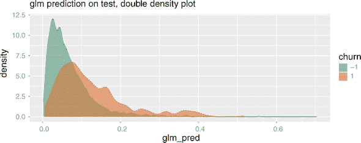

```
table(prediction = dTest_treated$glm_pred >= 0.5,
      truth = dTest$churn)
#           truth
# prediction   -1    1
#      FALSE 4591  375
#      TRUE     8    1
```

该模型仅识别出 9 个具有如此高概率的个人，其中只有 1 个流失。记住这是一个不平衡的分类问题；只有 7.6%的测试示例实际上流失。模型可以识别出处于较高流失风险的个体，而不是那些肯定会流失的个体。例如，如果我们要求模型找出预测流失风险是预期流失风险两倍的个体：

```
table(prediction = dTest_treated$glm_pred>0.15,
      truth = dTest$churn)
#           truth
# prediction   -1    1
#      FALSE 4243  266
#      TRUE   356  110
```

注意，在这种情况下，使用 0.15 作为我们的评分阈值，模型识别出 466 个潜在风险账户，其中 101 个实际上已经流失。因此，这个子集的流失率为 24%，大约是整体流失率的 3 倍。并且，该模型识别出 376 个流失者中的 110 个，即 29%。从商业角度来看，这个模型正在识别出占人口 10%的子群体，他们负责 29%的流失。这可能很有用。

在第 7.2.3 节中，我们看到了如何将召回率（检测到的流失者占流失者的比例）和富集或提升（在所选集中流失的频率有多高）之间的权衡关系表示为图表。图 8.9 显示了流失模型中召回率和富集作为阈值的函数的图。

图 8.9. `glm`召回率和富集作为阈值的函数


使用图 8.9 的一种方法是，在选择的 x 轴阈值处画一条垂直线，比如 0.2。然后这条垂直线与每条曲线交叉的高度告诉我们，如果我们把高于阈值的分数分类为阳性，我们会看到的同时丰富度和召回率。在这种情况下，我们的召回率大约为 0.12（意味着我们识别了大约 12%的受风险账户），丰富度大约为 3（意味着我们警告的群体账户取消率是普通群体的 3 倍，这表明这确实是一个高风险群体）。

生成这些图表的代码看起来像这样：

```
WVPlots::DoubleDensityPlot(dTest_treated, "glm_pred", "churn",
                           "glm prediction on test, double density plot")

WVPlots::PRTPlot(dTest_treated, "glm_pred", "churn",
                 "glm prediction on test, enrichment plot",
                 truthTarget = 1,
                 plotvars = c("enrichment", "recall"),
                 thresholdrange = c(0, 1.0))
```

现在我们已经使用`vtreat`解决了一个实质性的分类问题。

## 8.5\. 为回归建模准备数据

为回归建模准备数据与为分类建模准备数据非常相似。我们不是调用`designTreatmentsC()`或`mkCrossFrameCExperiment()`，而是调用`designTreatmentsN()`或`mkCrossFrameNExperiment()`。

* * *

示例

*您希望根据汽车的其他事实（如重量和马力）预测每加仑英里数的汽车燃油经济性。*

* * *

为了模拟这种情况，我们将使用来自 UCI 机器学习仓库的 Auto MPG 数据集。我们可以从`auto_mpg/`目录中的`auto_mpg.RDS`文件加载此数据（在下载此存储库后）。

```
auto_mpg <- readRDS('auto_mpg.RDS')

knitr::kable(head(auto_mpg))          ❶
```

❶ 快速查看数据。

看过图 8.10 中的数据后，让我们采取“闯入瓷器店的大象”的方法进行建模，直接调用`lm()`函数，而不检查或处理数据：

图 8.10\. `auto_mpg`数据的前几行

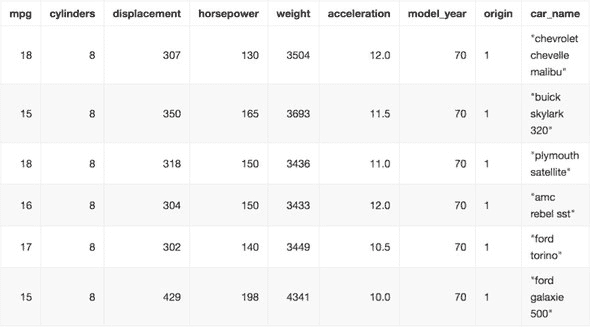

```
library("wrapr")

vars <- c("cylinders", "displacement",                          ❶
          "horsepower", "weight", "acceleration",
          "model_year", "origin")
f <- mk_formula("mpg", vars)
model <- lm(f, data = auto_mpg)

auto_mpg$prediction <- predict(model, newdata = auto_mpg)       ❷

str(auto_mpg[!complete.cases(auto_mpg), , drop = FALSE])

# 'data.frame':    6 obs. of  10 variables:
#  $ mpg         : num  25 21 40.9 23.6 34.5 23
#  $ cylinders   : num  4 6 4 4 4 4
#  $ displacement: num  98 200 85 140 100 151
#  $ horsepower  : num  NA NA NA NA NA NA                       ❸
#  $ weight      : num  2046 2875 1835 2905 2320 ...
#  $ acceleration: num  19 17 17.3 14.3 15.8 20.5
#  $ model_year  : num  71 74 80 80 81 82
#  $ origin      : Factor w/ 3 levels "1","2","3": 1 1 2 1 2 1
#  $ car_name    : chr  "\"ford pinto\"" "\"ford maverick\"" "\"renault lecar
      deluxe\"" ...
#  $ prediction  : num  NA NA NA NA NA NA                       ❹
```

❶ 在不处理数据的情况下直接跳入建模。

❷ 添加模型预测作为新列

❸ 注意，这些汽车没有记录马力。

❹ 因此，这些汽车没有获得预测。

由于数据集有缺失值，模型无法为每一行返回预测。现在，我们将再次尝试，使用`vtreat`先处理数据：

```
library("vtreat")

cfe <- mkCrossFrameNExperiment(auto_mpg, vars, "mpg",     ❶
                                verbose = FALSE)
treatment_plan <- cfe$treatments
auto_mpg_treated <- cfe$crossFrame
score_frame <- treatment_plan$scoreFrame
new_vars <- score_frame$varName

newf <- mk_formula("mpg", new_vars)
new_model <- lm(newf, data = auto_mpg_treated)

auto_mpg$prediction <- predict(new_model, newdata = auto_mpg_treated)
# Warning in predict.lm(new_model, newdata = auto_mpg_treated): prediction
# from a rank-deficient fit may be misleading
str(auto_mpg[!complete.cases(auto_mpg), , drop = FALSE])
# 'data.frame':    6 obs. of  10 variables:
#  $ mpg         : num  25 21 40.9 23.6 34.5 23
#  $ cylinders   : num  4 6 4 4 4 4
#  $ displacement: num  98 200 85 140 100 151
#  $ horsepower  : num  NA NA NA NA NA NA
#  $ weight      : num  2046 2875 1835 2905 2320 ...
#  $ acceleration: num  19 17 17.3 14.3 15.8 20.5
#  $ model_year  : num  71 74 80 80 81 82
#  $ origin      : Factor w/ 3 levels "1","2","3": 1 1 2 1 2 1
#  $ car_name    : chr  "\"ford pinto\"" "\"ford maverick\"" "\"renault lecar deluxe\"" ...
#  $ prediction  : num  24.6 22.4 34.2 26.1 33.3 ...    ❷
```

❶ 再次尝试使用 vtreat 数据准备。

❷ 现在我们可以进行预测，即使是对有缺失数据的项。

现在，模型为每一行返回预测，包括那些有缺失数据的行。

## 8.6\. 掌握 vtreat 包

现在我们已经看到了如何使用`vtreat`包，我们将花一些时间来回顾这个包为我们做了什么。这可以通过玩具大小的例子最容易地看到。

`vtreat`旨在为监督机器学习或预测建模准备数据。该包旨在帮助将一组输入或解释变量与单个要预测的输出或因变量相关联。

### 8.6.1\. vtreat 阶段

如图 8.11 所示，`vtreat`在两个阶段工作：设计阶段和应用/准备阶段。在设计阶段，`vtreat`学习数据的细节。对于每个解释变量，它估计变量与结果之间的关系，因此解释变量和因变量都必须可用。在应用阶段，`vtreat`引入了从解释变量派生的新变量，但更适合简单的预测建模。转换后的数据都是数值型且没有缺失值.^([15]) R 本身有处理缺失值的方法，包括许多缺失值插补包.^([16]) R 还有一个将任意`data.frame`转换为数值数据的规范方法：`model.matrix()`，许多模型都使用它来接受任意数据。`vtreat`是专门为这些任务设计的工具，旨在为监督机器学习或预测建模任务提供非常好的效果。

> ¹⁵
> 
> 记住：缺失值不是数据可能出错的所有情况，也不是`vtreat`唯一解决的问题。
> 
> ¹⁶
> 
> 查看[`cran.r-project.org/web/views/MissingData.html`](https://cran.r-project.org/web/views/MissingData.html)。

图 8.11\. `vtreat`的两个阶段

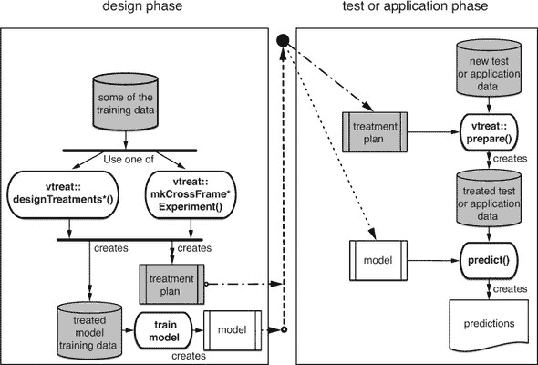

对于处理设计阶段，调用以下函数之一：

+   ***`designTreatmentsC()`—*** 设计一个用于二元分类任务的变量处理计划。二元分类任务是我们想要预测一个示例是否属于给定类别，或者预测一个示例属于给定类别的概率。

+   ***`designTreatmentsN()`—*** 设计一个用于回归任务的变量处理计划。回归任务是在给定示例数值结果的情况下预测数值结果。

+   ***`designTreatmentsZ()`—*** 设计一个简单的变量处理计划，不查看训练数据的结果。此计划处理缺失值并将字符串重新编码为指示变量（独热编码），但不产生影响变量（这需要了解训练数据的结果）。

+   ***`design_missingness_treatment()`—*** 设计一个非常简单的处理方案，仅处理缺失值，但不进行独热编码分类变量。相反，它将`NA`替换为标记`"_invalid_"`。

+   ***`mkCrossFrameCExperiment()`—*** 使用交叉验证技术准备用于分类的数据，这样设计变量处理所使用的数据可以安全地重新用于训练模型。

+   ***`mkCrossFrameNExperiment()`—*** 使用交叉验证技术准备用于回归的数据，这样设计变量处理所使用的数据可以安全地重新用于训练模型。

对于应用或数据准备阶段，我们始终调用`prepare()`方法。

`vtreat` 包附带大量文档和示例，可以在 [`winvector.github.io/vtreat/`](https://winvector.github.io/vtreat/) 找到。然而，除了了解如何操作包之外，数据科学家还必须知道他们使用的包为他们做了什么。因此，我们将在这里讨论 `vtreat` 实际上做了什么。

我们需要回顾的概念包括以下这些：

+   缺失值

+   指示变量

+   影响编码

+   治疗计划

+   变量得分框架

+   跨框架

这些概念很多，但它们是数据修复和准备的关键。我们将通过具体但微小的例子来保持具体性。可以在此处找到展示这些方法性能的更大例子：[`arxiv.org/abs/1611.09477`](https://arxiv.org/abs/1611.09477)。

### 8.6.2\. 缺失值

正如我们之前讨论的，R 有一个特殊的代码用于缺失、未知或不可用的值：`NA`。许多建模过程不接受带有缺失值的数据，因此如果出现缺失值，我们必须采取一些措施。常见的策略包括以下这些：

+   ***限制为“完整案例”—*** 只使用没有缺失值的列的数据行。这对于模型训练可能是个问题，因为完整案例可能分布不均或不具有代表性，实际数据集。此外，这种策略也无法很好地说明如何评分具有缺失值的新数据。有一些关于如何重新加权数据使其更具代表性的理论，但我们不鼓励这些方法。

+   ***缺失值插补—*** 这些是使用非缺失值来推断或插补缺失值（或值的分布）的方法。可以在 [`cran.r-project.org/web/views/MissingData.html`](https://cran.r-project.org/web/views/MissingData.html) 找到专门针对这些方法的 R 任务视图。

+   ***使用可以容忍缺失值的模型—*** 一些决策树或随机森林的实现可以容忍缺失值。

+   ***将缺失性视为可观察信息—*** 用替代信息替换缺失值。

`vtreat` 提供了将缺失性视为可观察信息的最后一种方法的实现，因为这很容易做到，并且非常适合监督机器学习或预测建模。这个想法很简单：缺失值被替换为某个替代值（可以是零，也可以是非缺失值的平均值），并添加一个额外的列来指示这种替换已经发生。这个额外的列给任何建模步骤提供了额外的自由度，或者说是将插补值与未插补值分开处理的能力。

以下是一个简单示例，展示了变换的添加：

```
library("wrapr")                                  ❶

d <- build_frame(
   "x1"    , "x2"         , "x3", "y" |
   1       , "a"          , 6   , 10  |
   NA_real_, "b"          , 7   , 20  |
   3       , NA_character_, 8   , 30  )

knitr::kable(d)

plan1 <- vtreat::design_missingness_treatment(d)
vtreat::prepare(plan1, d) %.>%                    ❷
    knitr::kable(.)
```

❶ 引入 wrapr 包用于 build_frame 和 wrapr 的“点管道”

❷ 使用 wrapr 的点管道而不是 magrittr 的前向管道。点管道需要显式点参数符号，这在第五章中讨论过。

注意到在图 8.12 中`x1`列有缺失值，并且在图 8.13 中用已知值的平均值替换了该值。处理后的或准备好的数据（见图 8.13）还有一个新列，`x1_isBAD`，表示`x1`被替换的位置。最后，注意对于字符串值列`x2`，`NA`值被替换为一个特殊的级别代码。

图 8.12\. 我们简单的示例数据：原始的

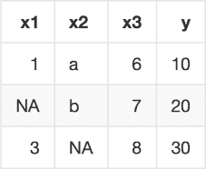

图 8.13\. 我们简单的示例数据：处理后的

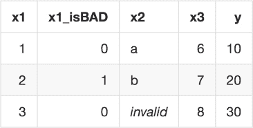

### 8.6.3\. 指示变量

许多统计和机器学习程序都期望所有变量都是数值型的。一些 R 用户可能没有意识到这一点，因为许多 R 模型实现都在幕后调用`model.matrix()`将任意数据转换为数值数据。对于现实世界的项目，我们建议使用更可控的显式转换，例如`vtreat`.^([17])

> ¹⁷
> 
> 然而，在这本书中，为了教学目的，我们将尽量减少每个例子中不必要的准备步骤，因为这些步骤不是讨论的主题。

这种转换有多个名称，包括指示变量、虚拟变量和独热编码。其思路是这样的：对于字符串值变量的每个可能值，我们创建一个新的数据列。当字符串值变量具有与列标签匹配的值时，我们将这些新列中的每个设置为`1`，否则为`0`。以下示例中可以很容易地看到这一点：

```
d <- build_frame(
   "x1"    , "x2"         , "x3", "y" |
   1       , "a"          , 6   , 10  |
   NA_real_, "b"          , 7   , 20  |
   3       , NA_character_, 8   , 30  )

print(d)
#   x1   x2 x3  y
# 1  1    a  6 10
# 2 NA    b  7 20                                        ❶
# 3  3 <NA>  8 30
plan2 <- vtreat::designTreatmentsZ(d,
                                   varlist = c("x1", "x2", "x3"),
                                   verbose = FALSE)
vtreat::prepare(plan2, d)
#   x1 x1_isBAD x3 x2_lev_NA x2_lev_x_a x2_lev_x_b
# 1  1        0  6         0          1          0
# 2  2        1  7         0          0          1       ❷
# 3  3        0  8         1          0          0
```

❶ x2 的第二个值是 b。

❷ 在处理数据的第二行中，x2_lev_x_b = 1。

注意到在第二个准备好的数据行中`x2_lev_x_b`是`1`。这就是转换后的数据如何保留`x2`变量在这个行中原本的值为`b`的信息。

正如我们在第七章中关于`lm()`和`glm()`的讨论中看到的，在传统统计实践中，实际上并不为字符串值变量的一个可能级别保留一个新列。这个级别被称为*参考级别*。我们可以识别字符串值变量等于参考级别的行，因为在这样的行中，所有其他级别的列都是零（其他行在级别列中恰好有一个`1`）。对于一般的监督学习，特别是对于正则化回归等高级技术，我们建议编码所有级别，正如这里所看到的。

### 8.6.4\. 影响编码

影响编码是一个经常在不同名称下被重新发现的好主意（*效果*编码、*影响*编码，以及最近更常见的*目标*编码）.^([18])

> ¹⁸
> 
> 我们能找到的关于影响编码的最早讨论是 Robert E. Sweeney 和 Edwin F. Ulveling 的“用于简化回归分析中二元变量系数解释的转换。” *《美国统计学家》*，第 26 卷(5)，30–32，1972 年。我们，即作者，已经产生了研究并在 R 和 Kaggle 用户中推广了该方法，并添加了类似于“堆叠”方法的关键交叉验证方法[`arxiv.org/abs/1611.09477`](https://arxiv.org/abs/1611.09477)。

当一个字符串类型的变量有数千个可能的值或级别时，为每个可能的级别生成一个新的指标列会导致数据极度膨胀和过拟合（如果模型拟合器在这种情况下甚至可以收敛）。因此，我们使用一个*影响代码*：将级别代码替换为其作为单一变量模型的效果。这就是我们在 KDD2009 信用账户取消示例中产生`catB`类型派生变量的原因，以及在回归情况下产生`catN`风格变量的原因。

让我们看看一个简单的数值预测或回归示例的影响：

```
d <- build_frame(
   "x1"    , "x2"         , "x3", "y" |
   1       , "a"          , 6   , 10  |
   NA_real_, "b"          , 7   , 20  |
   3       , NA_character_, 8   , 30  )

print(d)
#   x1   x2 x3  y
# 1  1    a  6 10
# 2 NA    b  7 20
# 3  3 <NA>  8 30
plan3 <- vtreat::designTreatmentsN(d,
                                   varlist = c("x1", "x2", "x3"),
                                   outcomename = "y",
                                   codeRestriction = "catN",
                                   verbose = FALSE)
vtreat::prepare(plan3, d)
#   x2_catN  y
# 1     -10 10
# 2       0 20
# 3      10 30
```

影响编码的变量位于名为`x2_catN`的新列中。注意，在第一行它为`-10`，因为`y`的值是`10`，这比`y`的平均值低 10。这种“条件 delta 从均值”的编码就是“影响代码”或“效果代码”名称的由来。

对于分类变量的影响编码类似，只是它们是以对数单位表示的，就像第 8.3.1 节中的逻辑回归一样。在这种情况下，对于如此小的数据，`x2_catB`的初始值在第一行和第三行将是负无穷大，在第二行是正无穷大（因为`x2`级别值完美地预测或区分`y == 20`的情况）。我们看到接近正负`10`的值是由于一个重要的调整，称为*平滑*，它说在计算条件概率时，为了更安全的计算，添加一点偏向“无效果”的偏差.^([19]) 下一个示例将展示如何使用`vtreat`为可能的分类任务准备数据：

> ¹⁹
> 
> 关于平滑的参考资料可以在这里找到：[`en.wikipedia.org/wiki/Additive_smoothing`](https://en.wikipedia.org/wiki/Additive_smoothing)。

```
plan4 <- vtreat::designTreatmentsC(d,
                                   varlist = c("x1", "x2", "x3"),
                                   outcomename = "y",
                                   outcometarget = 20,
                                   codeRestriction = "catB",
                                   verbose = FALSE)
vtreat::prepare(plan4, d)
#     x2_catB  y
# 1 -8.517343 10
# 2  9.903538 20
# 3 -8.517343 30
```

* * *

**平滑**

平滑是一种防止在小数据上出现一定程度过拟合和胡说八道答案的方法。平滑的想法是试图遵守 *Cromwell’s rule*，即在任何经验概率推理中不应使用零概率估计。这是因为如果你通过乘法（结合概率估计的最常见方法）组合概率，那么一旦某个项为 0，整个估计将变为 0 *无论其他项的值如何*。最常见形式的平滑称为 *Laplace 平滑*，它将 `n` 次试验中的 `k` 次成功计为一个成功比率 `(k+1)/(n+1)`，而不是 `k/n` 的比率（防御 `k=0` 的情况）。频率派统计学家认为平滑是一种正则化的形式，而贝叶斯派统计学家认为平滑是从先验的角度来看。

* * *

### 8.6.5\. 治疗方案

治疗方案指定了在用其拟合模型之前如何处理训练数据，以及在使用模型之前如何处理新数据。它直接由 `design*()` 方法返回。对于 `mkExperiment*()` 方法，治疗方案是返回结果中键为 `treatments` 的项目。以下代码显示了治疗方案的结构：

```
class(plan4)
# [1] "treatmentplan"

names(plan4)

# [1] "treatments"  "scoreFrame"  "outcomename" "vtreatVersion" "outcomeType"  

# [6] "outcomeTarget" "meanY"         "splitmethod"
```

变量分数框架

所有治疗方案中都包含的一个重要项目是分数框架。可以从治疗方案中提取出来，如下所示（继续我们之前的例子）：

```
plan4$scoreFrame

#   varName varMoves rsq   sig needsSplit extraModelDegrees origName code
# 1 x2_catB   TRUE   0.0506719  TRUE   2  x2 catB
```

分数框架是一个每行一个派生解释变量的 `data.frame`。每一行显示派生变量是从哪个原始变量派生出来的 (`orig-Name`)，用于生成派生变量的转换类型 (`code`)，以及关于变量的某些质量摘要。例如，`needsSplit` 是一个指示符，当 `TRUE` 时，表示变量复杂且需要交叉验证评分，这正是 `vtreat` 生成变量质量估计的方法。

### 8.6.6\. 交叉框架

`vtreat` 的一个关键创新是 *交叉框架*。交叉框架是 `mkCrossFrame*Experiment()` 方法返回的对象列表中的一个项目。这是一个允许安全地使用相同数据既用于变量处理的设计又用于训练模型的创新。如果没有这种交叉验证方法，你必须保留一部分训练数据来构建变量处理计划，以及一个不重叠的训练数据集来拟合处理后的数据。否则，复合系统（数据准备加模型应用）可能会受到严重的嵌套模型偏差的影响：产生一个在训练数据上看起来很好的模型，但后来在测试或应用数据上失败。

无知地重复使用数据的风险

这里有一个例子。假设我们从一个例子数据开始，其中实际上 `x` 和 `y` 之间没有关系。在这种情况下，我们知道我们认为它们之间存在的任何关系只是我们程序的一个产物，实际上并不存在。

列表 8.8\. 一个无信息数据集

```
set.seed(2019)                                               ❶

d <- data.frame(                                             ❷
  x_bad = sample(letters, 100, replace = TRUE),
  y = rnorm(100),
  stringsAsFactors = FALSE
)
d$x_good <- ifelse(d$y > rnorm(100), "non-neg", "neg")       ❸

head(d)                                                      ❹
#   x_bad           y  x_good
# 1     u -0.05294738 non-neg
# 2     s -0.23639840     neg
# 3     h -0.33796351 non-neg
# 4     q -0.75548467 non-neg
# 5     b -0.86159347     neg
# 6     b -0.52766549 non-neg
```

❶ 设置伪随机数生成器种子以使示例可重复

❷ 构建一个示例数据，其中 x_bad 和 y 之间没有关系

❸ x_good 是 y 符号的嘈杂预测，因此它确实有关于 y 的信息。

❹ 查看我们的合成示例数据。其思路是这样的：y 与 x_good 之间存在一种嘈杂的关系，但与 x_bad 无关。在这种情况下，我们知道应该选择哪些变量，因此我们可以判断我们的接受程序是否工作正确。

我们天真地使用训练数据来创建治疗方案，然后在拟合模型之前准备相同的数据。

列表 8.9. 重复使用数据的危险

```
plan5 <- vtreat::designTreatmentsN(d,                                     ❶
                                   varlist = c("x_bad", "x_good"),
                                   outcomename = "y",
                                   codeRestriction = "catN",
                                   minFraction = 2,
                                   verbose = FALSE)
class(plan5)
# [1] "treatmentplan"

print(plan5)                                                              ❷
#   origName     varName code          rsq          sig extraModelDegrees

# 1    x_bad  x_bad_catN catN 4.906903e-05 9.448548e-01                24
# 2   x_good x_good_catN catN 2.602702e-01 5.895285e-08                 1

training_data1 <- vtreat::prepare(plan5, d)                               ❸

res1 <- vtreat::patch_columns_into_frame(d, training_data1)               ❹
 head(res1)
#   x_bad  x_good x_bad_catN x_good_catN           y
# 1     u non-neg  0.4070979   0.4305195 -0.05294738
# 2     s     neg -0.1133011  -0.5706886 -0.23639840
# 3     h non-neg -0.3202346   0.4305195 -0.33796351
# 4     q non-neg -0.5447443   0.4305195 -0.75548467
# 5     b     neg -0.3890076  -0.5706886 -0.86159347
# 6     b non-neg -0.3890076   0.4305195 -0.52766549

sigr::wrapFTest(res1, "x_good_catN", "y")                                 ❺
# [1] "F Test summary: (R2=0.2717, F(1,98)=36.56, p<1e-05)."

sigr::wrapFTest(res1, "x_bad_catN", "y")                                  ❻
# [1] "F Test summary: (R2=0.2342, F(1,98)=29.97, p<1e-05)."
```

❶ 使用 x_bad 和 x_good 设计变量处理计划以预测 y

❷ 注意到派生变量 x_good_catN 显示出显著的信号，而 x_bad_catN 则没有。这是由于在 vtreat 质量估计中正确使用了交叉验证。

❸ 在设计治疗方案所用的相同数据上调用 prepare()——这并不总是安全的，正如我们将看到的。

❹ 使用 training_data1 当存在重复列名时将数据帧 d 和 training_data1 合并

❺ 使用统计 F-test 检查 x_good_catN 的预测能力

❻ x_bad_catN 的 F-test 被夸大，并看起来是显著的。这是由于未能使用交叉验证方法。

在这个例子中，注意 `sigr` F-test 报告了 `x_bad_catN` 和结果变量 `y` 之间的 R-squared 为 0.23。这是检查解释变异分数（本身称为 R-squared）是否在统计上不显著（在纯机会下常见）的技术术语。因此，我们希望真正的 R-squared 高（接近 1），真正的 F-test 显著性低（接近零）对于好变量。我们也期望真正的 R-squared 低（接近 0），真正的 F-test 显著性非零（不接近零）对于坏变量。

然而，请注意，好变量和坏变量都得到了良好的评估！这是一个错误，发生是因为我们正在测试的变量 `x_good_catN` 和 `x_bad_catN` 都是高基数字符串值变量的影响代码。当我们在这组数据上测试这些变量时，我们会过度拟合，这错误地夸大了我们的变量质量估计。在这种情况下，大量的 *表面* 质量实际上只是变量复杂性的度量（或过度拟合的能力）。

还要注意，在得分框架中报告的 R-squared 和显著性正确地表明 `x_bad_catN` 不是一个高质量的变量（R-squared 接近零，显著性不接近零）。这是因为得分框架使用交叉验证来估计变量显著性。这很重要，因为涉及多个变量的建模过程可能会因为 `x_bad_catN` 的过度拟合夸大的质量分数而选择 `x_bad_catN` 而不是其他实际有用的变量。

如前几节所述，解决过拟合的方法是将我们训练数据的一部分用于`designTreatments*()`步骤，而将另一部分不重叠的训练数据用于变量使用或评估（例如`sigr::wrapFTest()`步骤）。

安全重用数据的交叉框架

另一种实现方式，允许我们同时使用所有训练数据来设计变量处理计划和模型拟合，被称为*交叉框架*方法。这是`vtreat`的`mkCrossFrame*Experiment()`方法中内置的特殊交叉验证方法。在这种情况下，我们只需调用`mkCrossFrameNExperiment()`而不是`designTreatmentsN`，并从返回的列表对象的`crossFrame`元素中获取准备好的训练数据（而不是调用`prepare()`）。对于未来的测试或应用数据，我们确实从处理计划（作为返回列表对象的`treatments`项返回）中调用`prepare()`，但对于训练我们则不调用`prepare()`。

代码如下。

列表 8.10\. 使用`mkCrossFrameNExperiment()`

```
cfe <- vtreat::mkCrossFrameNExperiment(d,
                                       varlist = c("x_bad", "x_good"),
                                       outcomename = "y",
                                       codeRestriction = "catN",
                                       minFraction = 2,
                                       verbose = FALSE)
plan6 <- cfe$treatments

training_data2 <- cfe$crossFrame
res2 <- vtreat::patch_columns_into_frame(d, training_data2)

head(res2)
#   x_bad  x_good x_bad_catN x_good_catN           y
# 1     u non-neg  0.2834739   0.4193180 -0.05294738
# 2     s     neg -0.1085887  -0.6212118 -0.23639840
# 3     h non-neg  0.0000000   0.5095586 -0.33796351
# 4     q non-neg -0.5142570   0.5095586 -0.75548467
# 5     b     neg -0.3540889  -0.6212118 -0.86159347
# 6     b non-neg -0.3540889   0.4193180 -0.52766549

sigr::wrapFTest(res2, "x_bad_catN", "y")
# [1] "F Test summary: (R2=-0.1389, F(1,98)=-11.95, p=n.s.)."

sigr::wrapFTest(res2, "x_good_catN", "y")
# [1] "F Test summary: (R2=0.2532, F(1,98)=33.22, p<1e-05)."
plan6$scoreFrame                                              ❶
 #       varName varMoves        rsq          sig needsSplit
# 1  x_bad_catN     TRUE 0.01436145 2.349865e-01       TRUE
# 2 x_good_catN     TRUE 0.26478467 4.332649e-08       TRUE
#   extraModelDegrees origName code
# 1                24    x_bad catN
# 2                 1   x_good catN
```

❶ 数据和 scoreFrame 统计的 F 测试现在在很大程度上是一致的。

注意现在`sigr::wrapFTest()`正确地将`x_bad_catN`视为低值变量。此方案也能正确评分变量，这意味着我们可以区分好坏。我们可以使用交叉框架的`training_data2`来拟合模型，并从变量处理中获得良好的保护，以防止过拟合。

嵌套模型偏差

将一个模型的输出作为另一个模型的输入导致的过拟合称为*嵌套模型偏差*。使用`vtreat`时，这可能是一个影响代码的问题，因为影响代码本身也是模型。对于不查看结果的数据处理，如`design_ missingness_treatment()`和`designTreatmentsZ()`，可以使用相同的数据来设计处理计划并拟合模型。然而，当数据处理使用结果时，我们建议进行额外的数据拆分或使用第 8.4.1 节中的`mkCrossFrame*Experiment()/$crossFrame`模式。

`vtreat`使用交叉验证程序来创建交叉框架。有关详细信息，请参阅[`winvector.github.io/vtreat/articles/vtreatCrossFrames.html`](https://winvector.github.io/vtreat/articles/vtreatCrossFrames.html)。

* * *

`designTreatments*()` 与 `mkCrossFrame*Experiment()`

对于较大的数据集，使用训练数据的三分法以及`designTreatments*()`/`prepare()`模式来设计处理计划、拟合模型和评估更容易。对于看起来太小而无法三分的数据集（特别是具有非常大量变量的数据集），使用`mkCrossFrame*Experiment()`/`prepare()`模式可能会得到更好的模型。

* * *

## 摘要

现实世界的数据通常很杂乱。未经检查和处理的原始数据可能会使你的建模或预测步骤失败，或者可能给出不良的结果。“修复”数据并不与拥有更好的数据相竞争。但能够处理你拥有的数据（而不是你希望拥有的数据）是一种优势。

除了许多特定领域或特定问题的领域特定问题之外，你可能会发现，在你的数据中，存在许多应该被预见并系统处理的常见问题。`vtreat`是一个专门用于为监督机器学习或预测建模任务准备数据的包。它还可以通过其可引用的文档来减少你的项目文档需求^([20])。然而，请记住，工具不是避免查看数据的借口。

> ²⁰
> 
> 查看[`arxiv.org/abs/1611.09477`](https://arxiv.org/abs/1611.09477)。

在本章中，你学习了

+   如何使用`vtreat`包的`designTreatments*()`/`prepare()`模式，通过将训练数据分为三部分来准备用于模型拟合和模型应用的前处理数据

+   如何使用`vtreat`包的`mkCrossFrame*Experiment()`/`prepare()`模式，通过将训练数据分为两部分来准备用于模型拟合和模型应用的前处理数据，尤其是在统计效率很重要的情况下
