# 第九章\. 无监督方法

本章涵盖

+   使用 R 的聚类函数探索数据和寻找相似性

+   选择合适的聚类数量

+   评估一个聚类

+   使用 R 的关联规则函数来发现数据中的共现模式

+   评估一组关联规则

在上一章中，我们介绍了使用`vtreat`包来准备用于建模的杂乱的真实世界数据。在本章中，我们将探讨发现数据中未知关系的方法。这些方法被称为*无监督方法*。使用无监督方法时，没有你试图预测的结果；相反，你希望发现数据中的模式，这些模式可能是你之前未曾怀疑的。例如，你可能希望找到具有相似购买模式的客户群体，或者人口流动与社会经济因素之间的相关性。我们仍将这种模式发现视为“建模”，因此算法的结果仍然可以评估，如本章的心理模型所示（图 9.1）。

图 9.1\. 心理模型


无监督分析通常不是目的本身；相反，它们是寻找可以用于构建预测模型的关系和模式的方法。事实上，我们鼓励您将无监督方法视为探索性的——帮助您接触数据的程序——而不是神秘且自动给出“正确答案”的黑盒方法。

在本章中，我们将探讨两类无监督方法：

+   *聚类分析*寻找具有相似特性的群体。

+   *关联规则挖掘*寻找数据中倾向于一起出现的元素或属性。

## 9.1\. 聚类分析

在聚类分析中，目标是把你的数据中的观测值分组到*聚类*中，使得每个聚类中的数据点与其他聚类中的数据点相比，更相似。例如，一家提供导游服务的公司可能希望根据行为和口味对其客户进行聚类：他们喜欢访问哪些国家；他们是否更喜欢冒险之旅、奢华之旅还是教育之旅；他们参加的活动类型；以及他们喜欢访问的场所类型。此类信息可以帮助公司设计吸引人的旅游套餐，并针对客户群中的适当细分市场进行定位。

聚类分析是一个值得单独成书的话题；在本章中，我们将讨论两种方法。*层次聚类*找到嵌套的聚类群体。层次聚类的例子可能是标准的植物分类学，它按家族、属、种等分类植物。我们将探讨的第二种方法是*k-means*，这是一种快速且流行的在定量数据中寻找聚类的方法。

* * *

**聚类和密度估计**

从历史上看，聚类分析与密度估计问题相关：如果你认为你的数据存在于一个高维空间中，那么你想要找到数据最密集的区域。如果这些区域是不同的，或者几乎是不同的，那么你就有了聚类。

* * *

### 9.1.1\. 距离

为了进行聚类，你需要相似性和不相似性的概念。不相似性可以被视为距离，这样聚类中的点比其他聚类中的点更接近。这如图 9.2 所示。

图 9.2\. 三簇数据的示例

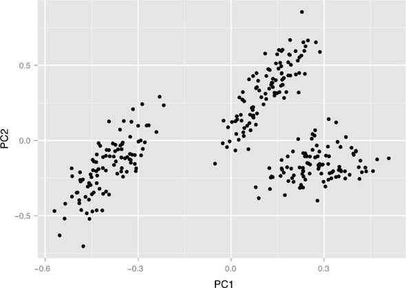

不同的应用领域会有不同的距离和相似度概念。在本节中，我们将介绍其中的一些最常见概念：

+   欧几里得距离

+   汉明距离

+   曼哈顿（城市街区）距离

+   余弦相似度

欧几里得距离

* * *

示例

*假设你测量了每天主体在不同活动上花费的分钟数，并且你想根据他们的活动模式对主体进行分组。*

* * *

由于你的测量是数值和连续的，*欧几里得距离* 是用于聚类的良好选择。人们通常在想到“距离”时想到的就是欧几里得距离。优化平方欧几里得距离是 k-means 的基础。当然，欧几里得距离只有在所有数据都是实值（定量）时才有意义。如果数据是分类的（特别是二元的），则应使用其他距离。

两个向量 `x` 和 `y` 之间的欧几里得距离定义为

```
edist(x, y) <- sqrt((x[1] - y[1])² + (x[2] - y[2])² + ...)
```

汉明距离

* * *

示例

*假设你想要将你的食谱盒分组为相似食谱的组。一种方法是测量它们的成分列表的相似度。*

* * *

通过这个度量，煎饼、华夫饼和可丽饼非常相似（它们的成分几乎相同，只是比例不同）；它们都与玉米面包（使用玉米粉而不是面粉）有所不同；并且它们与土豆泥的差异更大。

对于像食谱成分、性别（`男性`/`女性`）或定性大小（`小`/`中`/`大`）这样的分类变量，你可以定义当两个点属于同一类别时距离为 `0`，否则为 `1`。如果所有变量都是分类的，则可以使用 *汉明距离*，它计算不匹配的数量：

```
hdist(x, y) <- sum((x[1] != y[1]) + (x[2] != y[2]) + ...)
```

在这里，`a != b` 被定义为当表达式为真时取值为 `1`，当表达式为假时取值为 `0`。

你还可以将分类变量扩展为指示变量（如我们在 7.1.4 节 中讨论的），每个变量一个。

如果类别是有序的（如`小`/`中`/`大`），使得某些类别比其他类别“更接近”，那么您可以将其转换为数值序列。例如，（`小`/`中`/`大`）可能映射到（`1`/`2`/`3`）。然后您可以使用欧几里得距离或其他距离来处理定量数据。

曼哈顿（城市街区）距离

* * *

示例

*假设您经营一家为市中心企业提供服务的快递公司。您想要将客户聚类，以便在每个聚类中放置位于中心位置的取件/投递箱。*

* * *

曼哈顿距离通过水平单位和垂直单位数来衡量从一个（实值）点到另一个点（没有对角线移动）的距离。这也被称为*L1 距离*（而平方欧几里得距离是*L2 距离*）。

在这个例子中，曼哈顿距离更为合适，因为您想要通过人们沿街道行走的距离来衡量距离，而不是通过对角线点对点（欧几里得距离）。例如，在图 9.3 中，客户 A 位于场地北面 2 个街区，西面 2 个街区，而客户 B 位于场地南面 3 个街区，东面 1 个街区。他们通过曼哈顿距离与场地距离相等（4 个街区）。但是，客户 B 通过欧几里得距离更远：3x1 矩形的对角线比 2x2 正方形的对角线长。

图 9.3\. 曼哈顿距离与欧几里得距离

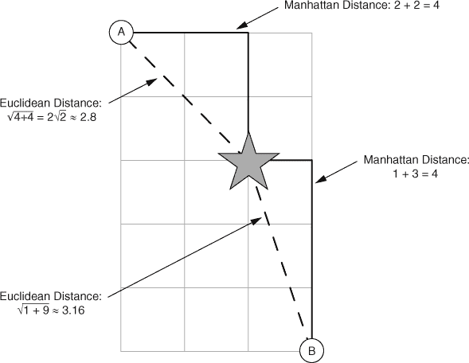

两个向量`x`和`y`之间的曼哈顿距离定义为

```
mdist(x, y) <- sum(abs(x[1] - y[1]) + abs(x[2] - y[2]) + ...)
```

余弦相似度

* * *

示例

*假设您将文档表示为文档-文本矩阵的行，就像我们在第 6.3.3 节中所做的那样，其中行向量中的每个元素 i 给出了单词 i 在文档中出现的次数。然后两个行向量之间的余弦相似度是相应文档相似度的度量。*

* * *

余弦相似度是文本分析中常用的相似度度量。它衡量两个向量之间的最小角度。在我们的文本示例中，我们假设非负向量，因此两个向量之间的角度`theta`在 0 到 90 度之间。余弦相似度如图 9.4 所示。

图 9.4\. 余弦相似度

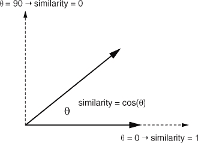

两个垂直向量（`theta` = 90 度）是最不相似的；90 度的余弦值为 0。两个平行向量是最相似的（如果假设它们都基于原点，则相同）；0 度的余弦值为 1。

从初等几何中，您可以推导出两个向量之间角度的余弦值由两个向量的归一化点积给出：

```
dot(x, y) <- sum(x[1] * y[1] + x[2] * y[2] + ...)
cossim(x, y) <- dot(x, y) / (sqrt(dot(x,x) * dot(y, y)))
```

您可以通过从 1.0 中减去余弦相似度将其转换为伪距离（尽管要得到一个实际度量，您应该使用`1 - 2 * acos(cossim(x, y)) / pi`）。

不同的距离度量会给出不同的聚类，不同的聚类算法也会如此。应用领域可能会给你一个关于最合适的距离的提示，或者你可以尝试几种距离度量。在本章中，我们将使用（平方）欧几里得距离，因为它是最自然的定量数据距离。

### 9.1.2\. 准备数据

为了展示聚类，我们将使用 1973 年关于欧洲 25 个国家九个不同食物组蛋白质消费的小型数据集.^([1]) 目标是根据各国蛋白质消费的模式对国家进行分组。该数据集被加载到 R 中，作为一个名为`protein`的数据框，如下所示。

> ¹
> 
> 原始数据集来自数据与故事库，之前托管在 CMU。它不再在线上。可以找到带有数据的制表符分隔的文本文件[`github.com/WinVector/PDSwR2/tree/master/Protein/`](https://github.com/WinVector/PDSwR2/tree/master/Protein/)。数据文件名为 protein.txt；更多信息可以在文件 protein_README.txt 中找到。

列表 9.1\. 读取蛋白质数据

```
protein <- read.table("protein.txt", sep = "\t", header=TRUE)
summary(protein)
##            Country      RedMeat         WhiteMeat           Eggs
##  Albania       : 1   Min.   : 4.400   Min.   : 1.400   Min.   :0.500
##  Austria       : 1   1st Qu.: 7.800   1st Qu.: 4.900   1st Qu.:2.700
##  Belgium       : 1   Median : 9.500   Median : 7.800   Median :2.900
##  Bulgaria      : 1   Mean   : 9.828   Mean   : 7.896   Mean   :2.936
##  Czechoslovakia: 1   3rd Qu.:10.600   3rd Qu.:10.800   3rd Qu.:3.700
##  Denmark       : 1   Max.   :18.000   Max.   :14.000   Max.   :4.700
##  (Other)       :19
##       Milk            Fish           Cereals          Starch
##  Min.   : 4.90   Min.   : 0.200   Min.   :18.60   Min.   :0.600
##  1st Qu.:11.10   1st Qu.: 2.100   1st Qu.:24.30   1st Qu.:3.100
##  Median :17.60   Median : 3.400   Median :28.00   Median :4.700
##  Mean   :17.11   Mean   : 4.284   Mean   :32.25   Mean   :4.276
##  3rd Qu.:23.30   3rd Qu.: 5.800   3rd Qu.:40.10   3rd Qu.:5.700
##  Max.   :33.70   Max.   :14.200   Max.   :56.70   Max.   :6.500
##
##       Nuts           Fr.Veg
##  Min.   :0.700   Min.   :1.400
##  1st Qu.:1.500   1st Qu.:2.900
##  Median :2.400   Median :3.800
##  Mean   :3.072   Mean   :4.136
##  3rd Qu.:4.700   3rd Qu.:4.900
##  Max.   :7.800   Max.   :7.900
```

单位和缩放

该数据集的文档没有提及测量单位是什么；我们将假设所有列都使用相同的单位进行测量。这很重要：单位（或者更精确地说，*单位差异*）会影响算法会发现哪些聚类。如果你将你的受试者的生命体征测量为年龄（年）、身高（英尺）和体重（磅），你将得到不同的距离——可能还有不同的聚类——如果你将年龄测量为年、身高为米和体重为千克。

理想情况下，你希望每个坐标的变化单位代表相同程度的不同。在`protein`数据集中，我们假设所有测量都在相同的单位下进行，所以看起来我们可能没问题。这很可能是一个正确的假设，但不同的食物组提供的蛋白质含量不同。一般来说，基于动物的食物来源每份蛋白质的克数比基于植物的食物来源多，因此有人可能会认为在蛋白质摄入量上增加五克，在蔬菜消费方面比在红肉消费方面有更大的差异。

尝试使每个变量的单位更兼容的一种方法是将所有列转换为单位均值为 0、标准差为 1。这使得标准差成为每个坐标的测量单位。假设你的训练数据具有准确代表总体的大规模分布，那么标准差在每一个坐标上表示大约相同程度的不同。

你可以使用 R 中的`scale()`函数缩放数值数据。`scale()`的输出是一个矩阵。为了本章的目的，你可以主要将矩阵视为一个包含所有数值列的数据框（这并不完全正确，但足够接近）。

`scale()` 函数使用两个属性注释其输出——`scaled:center` 返回所有列的均值，而 `scaled:scale` 返回标准差。您将保存这些值，以便稍后“取消缩放”数据。

列表 9.2\. 重新缩放数据集

```
vars_to_use <- colnames(protein)[-1]           ❶
 pmatrix <- scale(protein[, vars_to_use])
pcenter <- attr(pmatrix, "scaled:center")      ❷
 pscale <- attr(pmatrix, "scaled:scale")

rm_scales <- function(scaled_matrix) {         ❸
  attr(scaled_matrix, "scaled:center") <- NULL
  attr(scaled_matrix, "scaled:scale") <- NULL
  scaled_matrix
}

pmatrix <- rm_scales(pmatrix)                  ❹
```

❶ 使用除第一个（国家）之外的所有列

❷ 存储缩放属性

❸ 用于从缩放矩阵中删除缩放属性的便利函数。

❹ 为安全起见，将缩放属性置为零

图 9.5 展示了缩放对两个变量 `Fr.Veg` 和 `RedMeat` 的影响。原始（未缩放）变量有不同的范围，反映了通过红肉提供的蛋白质量往往高于通过水果和蔬菜提供的蛋白质量。缩放后的变量现在具有相似的范围，这使得比较每个变量的相对变化更容易。

图 9.5\. `Fr.Veg` 和 `RedMeat` 变量的比较，未缩放（顶部）和缩放（底部）

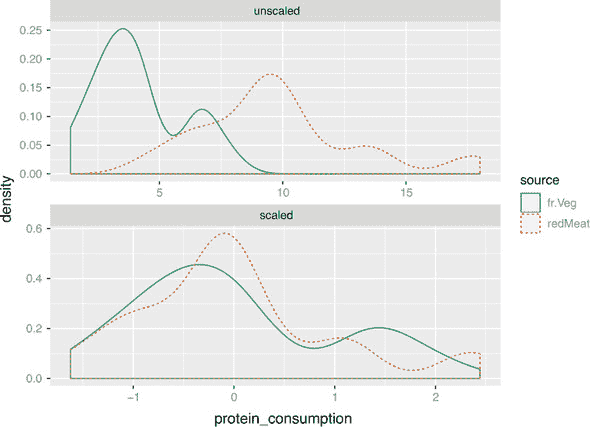

现在您已经准备好对蛋白质数据进行聚类。我们将从层次聚类开始。

### 9.1.3\. 使用 hclust 进行层次聚类

`hclust()` 函数接受一个距离矩阵（作为 `dist` 类的对象）作为输入，该矩阵记录了数据中所有点对之间的距离（使用任何一种方法）。您可以使用 `dist()` 函数计算距离矩阵。

`dist()` 将使用（平方）欧几里得距离 (`method = "euclidean"`)、曼哈顿距离 (`method = "manhattan"`) 以及当分类变量扩展为指示符时类似汉明距离的方法来计算距离函数。如果您想使用其他距离度量，您必须计算适当的距离矩阵，并使用 `as.dist()` 调用将其转换为 `dist` 对象（有关更多详细信息，请参阅 `help(dist)`）。

`hclust()` 也使用多种聚类方法之一来生成一棵树，该树记录了嵌套的聚类结构。我们将使用沃德方法，该方法最初将每个数据点作为一个单独的聚类，并通过迭代合并聚类以最小化聚类的总 *内部平方和* (WSS)（我们将在本章后面更详细地解释 WSS）。

让我们对蛋白质数据进行聚类。

列表 9.3\. 层次聚类

```
distmat <- dist(pmatrix, method = "euclidean")   ❶
pfit <- hclust(distmat, method = "ward.D")       ❷
plot(pfit, labels = protein$Country)             ❸
```

❶ 创建距离矩阵

❷ 进行聚类

❸ 绘制树状图

`hclust()` 返回一个 *树状图*：表示嵌套聚类的树。蛋白质数据的树状图显示在 图 9.6 中。如果树中的叶子之间存在路径，则它们位于同一聚类中。通过在某个深度切割树，您将断开一些路径，从而创建更多、更小的聚类。

图 9.6\. 蛋白质消费聚类国家的树状图

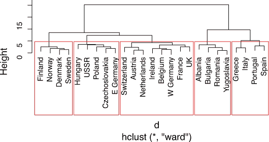

这棵树状图表明五个集群可能是一个合适的数量，如图 9.6 所示。figure 9.6。您可以使用 `rect.hclust()` 函数在树状图上绘制矩形：

```
rect.hclust(pfit, k=5)
```

要从 `hclust` 对象中提取每个集群的成员，请使用 `cutree()`。

列表 9.4\. 提取 `hclust()` 找到的集群

```
groups <- cutree(pfit, k = 5)

print_clusters <- function(data, groups, columns) {     ❶
   groupedD <- split(data, groups)
   lapply(groupedD,
         function(df) df[, columns])
}

cols_to_print <- wrapr::qc(Country, RedMeat, Fish, Fr.Veg)
print_clusters(protein, groups, cols_to_print)

## $`1`
##       Country RedMeat Fish Fr.Veg
## 1     Albania    10.1  0.2    1.7
## 4    Bulgaria     7.8  1.2    4.2
## 18    Romania     6.2  1.0    2.8
## 25 Yugoslavia     4.4  0.6    3.2
##
## $`2`
##        Country RedMeat Fish Fr.Veg
## 2      Austria     8.9  2.1    4.3
## 3      Belgium    13.5  4.5    4.0
## 9       France    18.0  5.7    6.5
## 12     Ireland    13.9  2.2    2.9
## 14 Netherlands     9.5  2.5    3.7
## 21 Switzerland    13.1  2.3    4.9
## 22          UK    17.4  4.3    3.3
## 24   W Germany    11.4  3.4    3.8
##
## $`3`
##           Country RedMeat Fish Fr.Veg
## 5  Czechoslovakia     9.7  2.0    4.0
## 7       E Germany     8.4  5.4    3.6
## 11        Hungary     5.3  0.3    4.2
## 16         Poland     6.9  3.0    6.6
## 23           USSR     9.3  3.0    2.9
##
## $`4`
##    Country RedMeat Fish Fr.Veg
## 6  Denmark    10.6  9.9    2.4
## 8  Finland     9.5  5.8    1.4
## 15  Norway     9.4  9.7    2.7
## 20  Sweden     9.9  7.5    2.0
##
## $`5`
##     Country RedMeat Fish Fr.Veg
## 10   Greece    10.2  5.9    6.5
## 13    Italy     9.0  3.4    6.7
## 17 Portugal     6.2 14.2    7.9
## 19    Spain     7.1  7.0    7.2
```

❶ 打印每个集群中国家的便利函数，以及红肉、鱼类和水果/蔬菜消费的值。在本节中我们将使用此函数。请注意，该函数假定数据在数据框（而非矩阵）中。

这些集群有一定的逻辑性：每个集群中的国家往往位于相同的地理区域。同一地区的国家拥有相似的饮食习惯是有道理的。您还可以看到，

+   集群 2 由消费红肉量高于平均的国家组成。

+   集群 4 包含了鱼类消费量高于平均但农产品消费量较低的国家。

+   集群 5 包含了鱼类和农产品消费量高的国家。

这个数据集只有 25 个点；当数据点非常多时，很难“目测”集群及其成员。在接下来的几节中，我们将探讨一些更全面地检查集群的方法。

使用主成分分析可视化集群

正如我们在 第三章 中提到的，可视化是获取数据整体视图的有效方法，或者在这种情况下，是获取聚类视图。蛋白质数据是九维的，因此很难用散点图进行可视化。

我们可以尝试通过将数据投影到数据的第一个两个 *主成分* 上来可视化聚类。^[[1]] 如果 *N* 是描述数据的变量数量，那么主成分描述了 *N*-空间中大致界定数据的超椭圆体。每个主成分是一个 *N*-维向量，描述了该超椭圆体的一个轴。图 9.7 展示了当 *N* = 3 时的这种情况。

> ¹
> 
> 我们可以将数据投影到任何两个主成分上，但前两个最有可能显示有用的信息。

图 9.7\. 主成分分析背后的思想

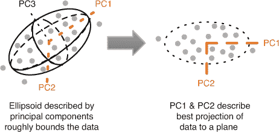

如果您按超椭圆体对应轴的长度（最长优先）对主成分进行排序，那么前两个主成分描述了 *N*-空间中的一个平面，该平面可以捕捉到尽可能多的数据变化，这些变化可以在二维中捕捉到。换句话说，它描述了数据的最佳 2-D 投影。我们将使用 `prcomp()` 调用来进行主成分分解。

列表 9.5\. 将集群投影到前两个主成分上

```
library(ggplot2)
princ <- prcomp(pmatrix)                                            ❶
nComp <- 2
project <- predict(princ, pmatrix)[, 1:nComp]                       ❷
project_plus <- cbind(as.data.frame(project),                       ❸
                      cluster = as.factor(groups),
                     country = protein$Country)

ggplot(project_plus, aes(x = PC1, y = PC2)) +                       ❹
  geom_point(data = as.data.frame(project), color = "darkgrey") +
  geom_point() +
  geom_text(aes(label = country),
            hjust = 0, vjust = 1) +
  facet_wrap(~ cluster, ncol = 3, labeller = label_both)
```

❶ 计算数据的主成分

❷ `predict()` 函数会将数据旋转到由主成分描述的坐标中。旋转数据的前两列是数据在第一个和第二个主成分上的投影。

❸ 创建一个数据框，包含转换后的数据，以及每个点的聚类标签和国家标签。

❹ 绘制它。为了可读性，将每个集群放在单独的面板中。

您可以在 图 9.8 中看到，集群 1（罗马尼亚/南斯拉夫/保加利亚/阿尔巴尼亚）和地中海集群（集群 5）与其他集群分离。其他三个集群在这个投影中混合在一起，尽管它们在其他投影中可能更分离。

图 9.8\. 按蛋白质消耗量聚类的国家，投影到前两个主成分

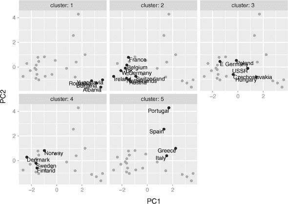

集群的自举评估

在评估集群时，一个重要的问题是给定集群是否“真实”——该集群是否代表数据中的实际结构，或者它是否是聚类算法的产物？正如您将看到的，这对于像 k-means 这样的聚类算法尤为重要，用户必须事先指定集群的数量。我们的经验表明，聚类算法通常会生成几个代表数据中实际结构或关系的集群，然后是一个或两个代表“其他”或“杂项”的集群。所谓的“其他”集群往往由彼此之间没有真正关系的点组成；它们根本不适合其他任何地方。

评估一个集群是否代表真实结构的一种方法是通过观察该集群在数据集的合理变化下是否保持稳定。`fpc` 包含一个名为 `clusterboot()` 的函数，该函数使用自举重采样来评估给定集群的稳定性.^([1]) `clusterboot()` 是一个集成函数，它既执行聚类又评估最终生成的集群。它具有与多个 R 聚类算法的接口，包括 `hclust` 和 `kmeans`。

> ¹
> 
> 对于算法的完整描述，请参阅 Christian Henning 的研究报告，“Cluster-wise assessment of cluster stability”，报告编号 271，伦敦大学学院统计科学系，2006 年 12 月。

`clusterboot` 算法使用 *Jaccard 系数*，它是集合之间的相似度度量。集合 A 和 B 之间的 Jaccard 相似度是 A 和 B 交集元素数量与 A 和 B 并集元素数量的比率。这如图 9.9 所示。

图 9.9\. Jaccard 相似度

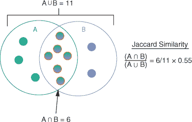

基本的一般策略如下：

1.  按照常规对数据进行聚类。

1.  通过对原始数据集进行有放回的重采样（意味着某些数据点可能会出现多次，而其他点则可能一次也不出现）来绘制一个新的数据集（与原始数据集大小相同）。对新数据集进行聚类。

1.  对于原始聚类中的每个聚类，找到新聚类中最相似的聚类（给出最大贾卡德系数的那个聚类）并记录该值。如果这个最大贾卡德系数小于 0.5，原始聚类被认为是 *溶解* 的——它没有出现在新的聚类中。一个经常溶解的聚类可能不是一个“真实”的聚类。

1.  重复步骤 2–3 几次。

原始聚类中每个聚类的 *聚类稳定性* 是其在所有自助迭代中贾卡德系数的平均值。一般来说，稳定性值小于 0.6 的聚类应被视为不稳定。介于 0.6 和 0.75 之间的值表明聚类正在测量数据中的模式，但关于哪些点应该聚类在一起没有很高的确定性。稳定性值高于约 0.85 的聚类可以被认为是高度稳定的（它们很可能是真实聚类）。

不同的聚类算法即使在产生高度相似的聚类时也可能给出不同的稳定性值，因此 `clusterboot()` 也测量聚类算法的稳定性。

让我们在蛋白质数据上运行 `clusterboot()`，使用五聚类的层次聚类。请注意，`clusterboot()` 是随机的，因此你可能不会得到相同的结果。

列表 9.6\. 在蛋白质数据上运行 `clusterboot()`

```
library(fpc)                                             ❶
kbest_p <- 5                                             ❷
cboot_hclust <- clusterboot(pmatrix,
                           clustermethod = hclustCBI,    ❸

                           method = "ward.D",
                           k = kbest_p)

summary(cboot_hclust$result)                             ❹

##               Length Class  Mode
## result         7     hclust list
## noise          1     -none- logical
## nc             1     -none- numeric
## clusterlist    5     -none- list
## partition     25     -none- numeric
## clustermethod  1     -none- character
## nccl           1     -none- numeric

groups <- cboot_hclust$result$partition                  ❺
print_clusters(protein, groups, cols_to_print)           ❻
## $`1`
##       Country RedMeat Fish Fr.Veg
## 1     Albania    10.1  0.2    1.7
## 4    Bulgaria     7.8  1.2    4.2
## 18    Romania     6.2  1.0    2.8
## 25 Yugoslavia     4.4  0.6    3.2
##
## $`2`
##        Country RedMeat Fish Fr.Veg
## 2      Austria     8.9  2.1    4.3
## 3      Belgium    13.5  4.5    4.0
## 9       France    18.0  5.7    6.5
## 12     Ireland    13.9  2.2    2.9
## 14 Netherlands     9.5  2.5    3.7
## 21 Switzerland    13.1  2.3    4.9
## 22          UK    17.4  4.3    3.3
## 24   W Germany    11.4  3.4    3.8
##
## $`3`
##           Country RedMeat Fish Fr.Veg
## 5  Czechoslovakia     9.7  2.0    4.0
## 7       E Germany     8.4  5.4    3.6
## 11        Hungary     5.3  0.3    4.2
## 16         Poland     6.9  3.0    6.6
## 23           USSR     9.3  3.0    2.9
##
## $`4`
##    Country RedMeat Fish Fr.Veg
## 6  Denmark    10.6  9.9    2.4
## 8  Finland     9.5  5.8    1.4
## 15  Norway     9.4  9.7    2.7
## 20  Sweden     9.9  7.5    2.0
##
## $`5`
##     Country RedMeat Fish Fr.Veg
## 10   Greece    10.2  5.9    6.5
## 13    Italy     9.0  3.4    6.7
## 17 Portugal     6.2 14.2    7.9
## 19    Spain     7.1  7.0    7.2

cboot_hclust$bootmean                                    ❻
## [1] 0.8090000 0.7939643 0.6247976 0.9366667 0.7815000

cboot_hclust$bootbrd                                     ❽
## [1] 19 14 45  9 30
```

❶ 加载 fpc 包。你可能需要先安装它。

❷ 设置所需的聚类数量

❸ 使用 hclust (clustermethod = hclustCBI) 和 Ward 方法 (method = "ward.D") 以及 kbest_p 个聚类 (k = kbest_p) 运行 clusterboot()。结果存储在名为 cboot_hclust 的对象中。

❹ 聚类结果存储在 cboot_hclust$result 中。

❺ cboot_hclust$result$partition 返回一个聚类标签向量。

❻ 聚类结果与直接调用 hclust() 得到的结果相同。

❻ 聚类稳定性的向量

❽ 每个聚类被溶解的次数。默认情况下，clusterboot() 运行 100 次自助迭代。

`clusterboot()` 的结果显示，高鱼消费国家（聚类 4）的聚类非常稳定：聚类稳定性高，聚类相对较少地被溶解。聚类 1 和 2 也相当稳定；聚类 5 的稳定性较低（你可以在 图 9.8 中看到聚类 5 的成员与其他国家分离，但也相对彼此分离）。聚类 3 具有我们一直称之为“其他”聚类的特征。

`clusterboot()` 假设你知道聚类数量，*k*。我们从树状图中目测了合适的 *k*，但这种方法在大数据集中并不总是可行。我们能否以更自动化的方式选择一个合理的 *k*？我们将在下一节中探讨这个问题。

选择聚类数量

有许多启发式方法和经验规则用于选择簇；给定的启发式方法在某些数据集上可能比其他数据集上工作得更好。如果可能的话，最好利用领域知识来帮助设置簇的数量。否则，尝试各种启发式方法，也许还有几个不同的*k*值。

总内部平方和

一个简单的启发式方法是计算不同*k*值的总内部平方和（WSS），并寻找曲线中的“肘部”。我们将在本节中介绍 WSS 的定义。

图 9.10 显示了具有四个簇的数据。定义每个簇的*质心*为簇中所有点的平均值。质心将位于簇的中心，如图所示。单个簇的内部平方和（或`WSS_i`）是簇中每个点与簇质心的平方距离之和。这在图中的簇 4 中显示出来。

图 9.10. 四个簇的簇 WSS 和总 WSS

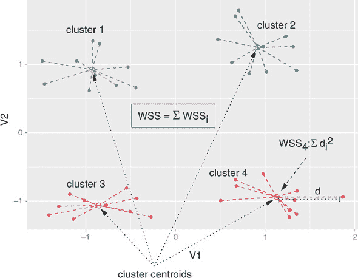

总的内部平方和是所有簇的`WSS_i`的总和。我们将在下面的列表中展示计算过程。

列表 9.7. 计算总内部平方和

```
sqr_edist <- function(x, y) {                                              ❶
   sum((x - y)²)
}

wss_cluster <- function(clustermat) {                                      ❷
   c0 <- colMeans(clustermat)                                              ❸
   sum(apply(clustermat, 1, FUN = function(row) { sqr_edist(row, c0) }))   ❹
 }

wss_total <- function(dmatrix, labels) {                                   ❺
  wsstot <- 0
  k <- length(unique(labels))
  for(i in 1:k)
    wsstot <- wsstot + wss_cluster(subset(dmatrix, labels == i))           ❻
  wsstot
}

wss_total(pmatrix, groups)                                                 ❻

## [1] 71.94342
```

❶ 计算两个向量之间平方距离的函数

❷ 计算单个簇的 WSS 的函数，该簇表示为一个矩阵（每行一个点）

❸ 计算簇的质心（所有点的平均值）

❹ 计算簇中每个点与质心的平方差，并求和所有距离

❺ 计算从一组数据点和聚类标签中得到的总 WSS 的函数

❻ 提取每个簇，计算簇的 WSS，并求和所有值

❻ 计算当前蛋白质聚类的总 WSS。

随着簇数量的增加，总的 WSS 会减少，因为每个簇将变得更小、更紧密。希望 WSS 减少的速率会在超过最佳簇数量后的*k*上放缓。换句话说，WSS 与*k*的图表应该在最佳*k*之后变平，因此最佳*k*将在图表的“肘部”。让我们尝试计算最多 10 个簇的 WSS。

列表 9.8. 绘制`k`范围的 WSS

```
get_wss <- function(dmatrix, max_clusters) {               ❶
    wss = numeric(max_clusters)

  wss[1] <- wss_cluster(dmatrix)                           ❷

  d <- dist(dmatrix, method = "euclidean")
  pfit <- hclust(d, method = "ward.D")                     ❸

  for(k in 2:max_clusters) {                               ❹

    labels <- cutree(pfit, k = k)
    wss[k] <- wss_total(dmatrix, labels)
  }

  wss
}

kmax <- 10
cluster_meas <- data.frame(nclusters = 1:kmax,
                          wss = get_wss(pmatrix, kmax))

breaks <- 1:kmax
ggplot(cluster_meas, aes(x=nclusters, y = wss)) +          ❺
   geom_point() + geom_line() +
  scale_x_continuous(breaks = breaks)
```

❶ 一个函数，用于获取从 1 到最大值的簇的总 WSS

❷ wss[1]只是所有数据的 WSS。

❸ 对数据进行聚类

❹ 对于每个 k，计算簇标签和簇 WSS

❺ 绘制 WSS 随 k 的变化图

图 9.11 显示了 WSS 随*k*变化的曲线图。不幸的是，在这种情况下，曲线的肘部很难看清，尽管如果你眯起眼睛，你可能会说服自己，在`k = 2`处有一个肘部，在`k = 5`或`k = 6`处也有一个。这意味着最佳的聚类可能是 2 个簇，5 个簇，或 6 个簇。

图 9.11. 蛋白质数据的 WSS 随`k`的变化

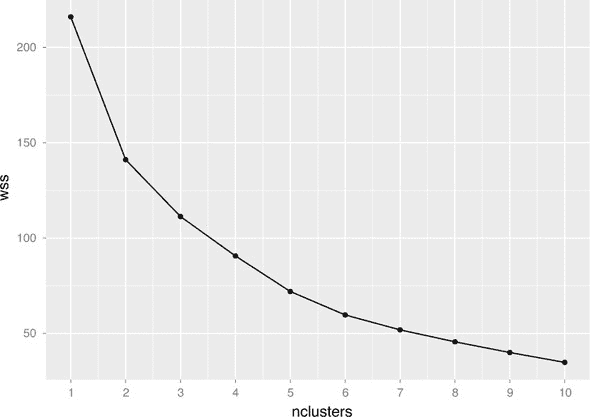

Calinski-Harabasz 指数

**Calinski-Harabasz 指数**是衡量聚类好坏的另一种常用指标。它试图找到所有聚类都紧密且彼此之间距离较远的位置。为了说明（并计算）Calinski-Harabasz 指数（简称 CH 指数），我们首先需要定义一些更多术语。

如图 9.12 所示，一组点的**总平方和**（TSS）是所有点与数据质心的距离平方的和。在列表 9.8 的`get_wss()`函数中，值`wss[1]`是 TSS，它与聚类无关。对于具有总内部平方和的给定聚类，我们还可以定义**之间平方和**（BSS）：

```
BSS = TSS - WSS
```

图 9.12\. 四个聚类的总平方和

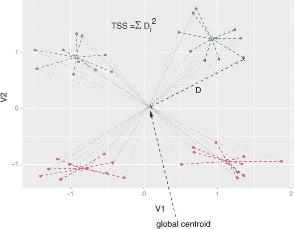

BSS 衡量聚类彼此之间的距离。一个好的聚类具有小的 WSS（所有聚类都紧密围绕其中心）和大的 BSS。我们可以比较随着聚类数量的变化，BSS 和 WSS 如何变化。

列表 9.9\. 作为*k*函数绘制 BSS 和 WSS

```
total_ss <- function(dmatrix) {                                            ❶
   grandmean <- colMeans(dmatrix)
  sum(apply(dmatrix, 1, FUN = function(row) { sqr_edist(row, grandmean) }))
}

tss <- total_ss(pmatrix)
cluster_meas$bss <- with(cluster_meas, tss - wss)

library(cdata)                                                             ❷
cmlong <- unpivot_to_blocks(cluster_meas,                                  ❸
                            nameForNewKeyColumn = "measure",
                           nameForNewValueColumn = "value",
                           columnsToTakeFrom = c("wss", "bss"))

ggplot(cmlong, aes(x = nclusters, y = value)) +
  geom_point() + geom_line() +
  facet_wrap(~measure, ncol = 1, scale = "free_y") +
  scale_x_continuous(breaks = 1:10)
```

❶ 计算总平方和：TSS

❷ 加载 cdata 包以重塑数据

❸ 将 cluster_meas 重塑，使 WSS 和 BSS 在同一列

图 9.13 显示，随着*k*的增加，BSS 增加，而 WSS 减少。我们希望找到一个具有良好 BSS 和 WSS 平衡的聚类。为了找到这样的聚类，我们必须查看与 BSS 和 WSS 相关的几个指标。

图 9.13\. BSS 和 WSS 作为*k*的函数

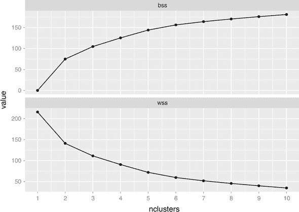

**聚类内方差 W**由以下公式给出

```
W = WSS / (n - k)
```

这里，*n*是数据点的数量，*k*是聚类的数量。你可以将*W*视为“平均”WSS。

**聚类间方差 B**由以下公式给出

```
B = BSS / (k - 1)
```

同样，你可以将*B*视为每个聚类对 BSS 的平均贡献。

一个好的聚类应该具有小的平均 WSS 和大的平均 BSS，因此我们可能会尝试最大化*B*与*W*的比率。这就是 Calinski-Harabasz（CH）指数。让我们计算 CH 指数并绘制出最多 10 个聚类的图像。

列表 9.10\. Calinski-Harabasz 指数

```
cluster_meas$B <- with(cluster_meas,  bss / (nclusters - 1))     ❶

n = nrow(pmatrix)
cluster_meas$W <- with(cluster_meas,  wss / (n - nclusters))     ❷
cluster_meas$ch_crit <- with(cluster_meas, B / W)                ❸

ggplot(cluster_meas, aes(x = nclusters, y = ch_crit)) +
  geom_point() + geom_line() +
  scale_x_continuous(breaks = 1:kmax)
```

❶ 计算聚类间方差 B

❷ 计算聚类内方差 W

❸ 计算 CH 指数

观察图 9.14，你看到 CH 标准在`k = 2`时最大化，在`k = 5`处有另一个局部最大值。`k = 2`的聚类对应于蛋白质数据树状图的第一次分割，如图 9.15 所示；如果你使用`clusterboot()`进行聚类，你会看到聚类高度稳定，尽管可能不是非常有信息量。

图 9.14\. 作为*k*函数的 Calinski-Harabasz 指数

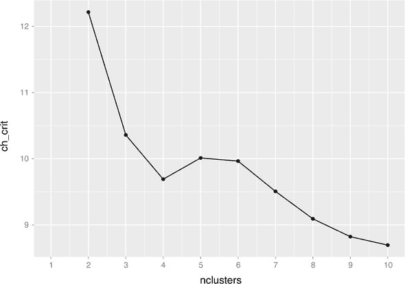

图 9.15\. 具有两个聚类的蛋白质数据树状图

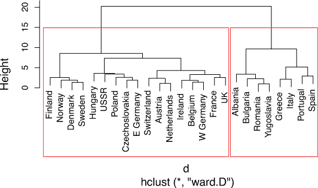

* * *

**聚类质量的其他度量**

在选择*k*时，你可以尝试几种其他度量。*gap 统计量*^([a])是尝试自动在 WSS 曲线上进行“肘部发现”。当数据来自具有近似高斯分布的多个总体（称为*mixture of Gaussians*）时，它效果最好。当我们讨论`kmeans()`时，我们还将看到另一个度量，即*平均轮廓宽度*。

> ^a
> 
> 参见 Robert Tibshirani，Guenther Walther 和 Trevor Hastie，“通过 gap 统计量估计数据集中聚类的数量”，*皇家统计学会 B 卷*，2001 年，第 63 卷，第 2 期，第 411-423 页；[www.stanford.edu/~hastie/Papers/gap.pdf](http://www.stanford.edu/~hastie/Papers/gap.pdf)。

* * *

### 9.1.4\. k-means 算法

当数据都是数值且距离度量是平方欧几里得距离时（尽管理论上可以用其他距离度量运行它），K-means 是一种流行的聚类算法。它相当随意，并且主要缺点是你必须事先选择*k*。优点是它易于实现（这是它如此受欢迎的原因之一），并且在大型数据集上可能比层次聚类更快。它最适合看起来像高斯混合的数据，不幸的是，`protein`数据看起来并不是这样。

kmeans()函数

在 R 中运行 k-means 的函数是`kmeans()`。`kmeans()`的输出包括聚类标签、聚类的中心（质心）、总平方和、总 WSS、总 BSS 以及每个聚类的 WSS。

k-means 算法在图 9.16 中展示，其中*k* = 2。这个算法不保证有一个唯一的停止点。k-means 可能相当不稳定，因为最终的聚类取决于初始的聚类中心。多次使用不同的随机开始运行 k-means 是一个好习惯，然后选择具有最低总 WSS 的聚类。`kmeans()`函数可以自动完成此操作，尽管它默认只使用一个随机开始。

图 9.16\. k-means 过程。两个聚类中心由轮廓星和菱形表示。

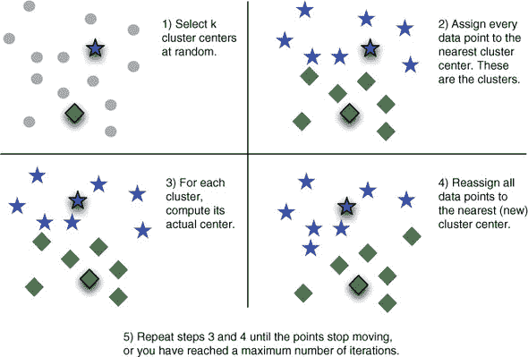

让我们在`protein`数据上运行`kmeans()`（如前所述，缩放到均值为 0 和单位标准差）。我们将使用`k = 5`，如列表 9.11 所示。请注意，`kmeans()`是随机化代码，因此你可能不会得到显示的确切结果。

列表 9.11\. 使用`k = 5`运行 k-means

```
kbest_p <- 5

pclusters <- kmeans(pmatrix, kbest_p, nstart = 100, iter.max = 100)   ❶
summary(pclusters)                                                    ❷
##              Length Class  Mode
## cluster      25     -none- numeric
## centers      45     -none- numeric
## totss         1     -none- numeric
## withinss      5     -none- numeric
## tot.withinss  1     -none- numeric
## betweenss     1     -none- numeric
## size          5     -none- numeric
## iter          1     -none- numeric
## ifault        1     -none- numeric

pclusters$centers                                                     ❸

##        RedMeat  WhiteMeat        Eggs       Milk       Fish    Cereals
## 1 -0.570049402  0.5803879 -0.08589708 -0.4604938 -0.4537795  0.3181839
## 2 -0.508801956 -1.1088009 -0.41248496 -0.8320414  0.9819154  0.1300253
## 3 -0.807569986 -0.8719354 -1.55330561 -1.0783324 -1.0386379  1.7200335
## 4  0.006572897 -0.2290150  0.19147892  1.3458748  1.1582546 -0.8722721
## 5  1.011180399  0.7421332  0.94084150  0.5700581 -0.2671539 -0.6877583
##       Starch       Nuts      Fr.Veg
## 1  0.7857609 -0.2679180  0.06873983
## 2 -0.1842010  1.3108846  1.62924487
## 3 -1.4234267  0.9961313 -0.64360439
## 4  0.1676780 -0.9553392 -1.11480485
## 5  0.2288743 -0.5083895  0.02161979

pclusters$size                                                        ❹
 ## [1] 5 4 4 4 8

groups <- pclusters$cluster                                           ❺

cols_to_print = wrapr::qc(Country, RedMeat, Fish, Fr.Veg)
print_clusters(protein, groups, cols_to_print)                        ❻

## $`1`
##           Country RedMeat Fish Fr.Veg
## 5  Czechoslovakia     9.7  2.0    4.0
## 7       E Germany     8.4  5.4    3.6
## 11        Hungary     5.3  0.3    4.2
## 16         Poland     6.9  3.0    6.6
## 23           USSR     9.3  3.0    2.9
##
## $`2`
##     Country RedMeat Fish Fr.Veg
## 10   Greece    10.2  5.9    6.5
## 13    Italy     9.0  3.4    6.7
## 17 Portugal     6.2 14.2    7.9
## 19    Spain     7.1  7.0    7.2
##
## $`3`
##       Country RedMeat Fish Fr.Veg
## 1     Albania    10.1  0.2    1.7
## 4    Bulgaria     7.8  1.2    4.2
## 18    Romania     6.2  1.0    2.8
## 25 Yugoslavia     4.4  0.6    3.2
##
## $`4`
##    Country RedMeat Fish Fr.Veg
## 6  Denmark    10.6  9.9    2.4
## 8  Finland     9.5  5.8    1.4
## 15  Norway     9.4  9.7    2.7
## 20  Sweden     9.9  7.5    2.0
##
## $`5`
##        Country RedMeat Fish Fr.Veg
## 2      Austria     8.9  2.1    4.3
## 3      Belgium    13.5  4.5    4.0
## 9       France    18.0  5.7    6.5
## 12     Ireland    13.9  2.2    2.9
## 14 Netherlands     9.5  2.5    3.7
## 21 Switzerland    13.1  2.3    4.9
## 22          UK    17.4  4.3    3.3
## 24   W Germany    11.4  3.4    3.8
```

❶ 使用五个聚类（kbest_p = 5），每次运行 100 次随机开始，每次运行 100 次最大迭代次数的 kmeans()函数

❷ kmeans()返回所有平方和度量。

❸ pclusters$centers 是一个矩阵，其行是聚类的质心。请注意，pclusters$centers 是在缩放坐标中，而不是原始蛋白质坐标中。

❹ `pclusters$size` 返回每个簇中的点数。一般来说（尽管并非总是如此），一个好的聚类将相当平衡：没有极小的簇，也没有极大的簇。

❺ `pclusters$cluster`是一个簇标签的向量。

❻ 在这种情况下，`kmeans()`和`hclust()`返回相同的聚类。这并不总是正确的。

选择 k 的`kmeansruns()`函数

要运行`kmeans()`，你必须知道*k*。`fpc`包（与`clusterboot()`相同的包）有一个名为`kmeansruns()`的函数，它在一个*k*的范围内调用`kmeans()`并估计最佳的*k*。然后它返回其选择的最佳*k*值，该值对应的`kmeans()`输出，以及一个关于*k*的标准的向量。目前，`kmeansruns()`有两个标准：Calinski-Harabasz 指数（`"ch"`）和平均轮廓宽度（`"asw"`）。对于任何标准，最大值表示最佳簇数（有关轮廓聚类的更多信息，请参阅[`mng.bz/Qe15`](http://mng.bz/Qe15)）。检查整个*k*的范围的标准值是个好主意，因为你可能会看到算法没有自动选择的*k*的证据。下面的列表说明了这一点。

列表 9.12。绘制聚类标准

```
clustering_ch <- kmeansruns(pmatrix, krange = 1:10, criterion = "ch")      ❶

clustering_ch$bestk                                                        ❷
## [1] 2

clustering_asw <- kmeansruns(pmatrix, krange = 1:10, criterion = "asw")    ❸
clustering_asw$bestk
## [1] 3

clustering_asw$crit                                                        ❹
## [1] 0.0000000 0.3271084 0.3351694 0.2617868 0.2639450 0.2734815 0.2471165
## [8] 0.2429985 0.2412922 0.2388293

clustering_ch$crit                                                         ❺
##  [1]  0.000000 14.094814 11.417985 10.418801 10.011797  9.964967  9.861682
##  [8]  9.412089  9.166676  9.075569

cluster_meas$ch_crit                                                       ❻
##  [1]       NaN 12.215107 10.359587  9.690891 10.011797  9.964967  9.506978
##  [8]  9.092065  8.822406  8.695065

summary(clustering_ch)                                                     ❻

##              Length Class  Mode
## cluster      25     -none- numeric
## centers      18     -none- numeric
## totss         1     -none- numeric
## withinss      2     -none- numeric
## tot.withinss  1     -none- numeric
## betweenss     1     -none- numeric
## size          2     -none- numeric
## iter          1     -none- numeric
## ifault        1     -none- numeric
## crit         10     -none- numeric
## bestk         1     -none- numeric
```

❶ 从 1 到 10 个簇运行`kmeansruns()`，并使用 ch 标准。默认情况下，`kmeansruns()`每个运行使用 100 个随机起始点和 100 次最大迭代。

❷ ch 标准选择了两个簇。

❸ 从 1 到 10 个簇运行`kmeansruns()`，并使用平均轮廓宽度标准。平均轮廓宽度选择了 3 个簇。

❹ 查看 asw 标准值作为 k 的函数

❺ 查看 ch 标准值作为 k 的函数

❻ 将这些与 hclust()聚类的 ch 值进行比较。它们并不完全相同，因为两种算法没有选择相同的簇。

❻ `kmeansruns()`还返回了`k = bestk`时的`kmeans`输出。

图 9.17 的顶部图比较了`kmeansruns`提供的两种聚类标准的结果。这两种标准都已被缩放到兼容的单位。它们建议两到三个簇是最好的选择。然而，如果你比较图 9.17 底部图中`kmeans`和`hclust`聚类的（未缩放）CH 标准值，你会发现 CH 标准为`kmeans()`和`hclust()`聚类产生了不同的曲线，但它确实为`k = 5`和`k = 6`选择了相同的值（这可能意味着它选择了相同的簇），这可以被视为 5 或 6 是*k*的最佳选择的证据。

图 9.17。顶部：比较`kmeans`聚类的（缩放）CH 和平均轮廓宽度指数。底部：比较`kmeans`和`hclust`聚类的 CH 指数。

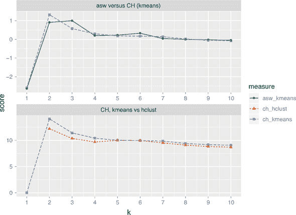

clusterboot()重新审视

我们也可以使用 k-means 算法运行`clusterboot()`。

列表 9.13\. 使用 k-means 运行 `clusterboot()`

```
kbest_p <- 5
cboot <- clusterboot(pmatrix, clustermethod = kmeansCBI,
            runs = 100,iter.max = 100,
            krange = kbest_p, seed = 15555)           ❶

groups <- cboot$result$partition
print_clusters(protein, groups, cols_to_print)
## $`1`
##       Country RedMeat Fish Fr.Veg
## 1     Albania    10.1  0.2    1.7
## 4    Bulgaria     7.8  1.2    4.2
## 18    Romania     6.2  1.0    2.8
## 25 Yugoslavia     4.4  0.6    3.2
##
## $`2`
##    Country RedMeat Fish Fr.Veg
## 6  Denmark    10.6  9.9    2.4
## 8  Finland     9.5  5.8    1.4
## 15  Norway     9.4  9.7    2.7
## 20  Sweden     9.9  7.5    2.0
##
## $`3`
##           Country RedMeat Fish Fr.Veg
## 5  Czechoslovakia     9.7  2.0    4.0
## 7       E Germany     8.4  5.4    3.6
## 11        Hungary     5.3  0.3    4.2
## 16         Poland     6.9  3.0    6.6
## 23           USSR     9.3  3.0    2.9
##
## $`4`
##        Country RedMeat Fish Fr.Veg
## 2      Austria     8.9  2.1    4.3
## 3      Belgium    13.5  4.5    4.0
## 9       France    18.0  5.7    6.5
## 12     Ireland    13.9  2.2    2.9
## 14 Netherlands     9.5  2.5    3.7
## 21 Switzerland    13.1  2.3    4.9
## 22          UK    17.4  4.3    3.3
## 24   W Germany    11.4  3.4    3.8
##
## $`5`
##     Country RedMeat Fish Fr.Veg
## 10   Greece    10.2  5.9    6.5
## 13    Italy     9.0  3.4    6.7
## 17 Portugal     6.2 14.2    7.9
## 19    Spain     7.1  7.0    7.2

cboot$bootmean
## [1] 0.8670000 0.8420714 0.6147024 0.7647341 0.7508333

cboot$bootbrd
## [1] 15 20 49 17 32
```

❶ 我们已为随机生成器设置种子，以便结果可重复。

注意，由 `cboot$bootmean` 提供的稳定性数字（以及由 `cboot$bootbrd` 提供的簇“溶解”次数）在层次聚类和 k-means 中是不同的，尽管发现的簇是相同的。这表明聚类的稳定性部分是聚类算法的函数，而不仅仅是数据的函数。再次强调，两个聚类算法发现相同的簇可能表明 5 是簇的最佳数量。

### 9.1.5\. 将新点分配给簇

聚类通常用作数据探索的一部分，或作为其他监督学习方法的先导。但您可能还想使用您发现的簇来对新数据进行分类。这样做的一种常见方式是将每个簇的重心作为整个簇的代表，然后将新点分配给最近的质心所在的簇。请注意，如果您在聚类之前对原始数据进行缩放，那么在将新点分配给簇之前也应以相同的方式进行缩放。

列表 9.14 展示了一个函数的示例，该函数将新数据点 `newpt`（表示为向量）分配给聚类 `centers`，其中 `centers` 表示为矩阵，每行是一个簇中心。这是 `kmeans()` 返回的簇中心表示。如果聚类之前使用 `scale()` 对数据进行缩放，那么 `xcenter` 和 `xscale` 分别是 `scaled:center` 和 `scaled:scale` 属性。

列表 9.14\. 将点分配给簇的函数

```
assign_cluster <- function(newpt, centers, xcenter = 0, xscale = 1) {
   xpt <- (newpt - xcenter) / xscale                                       ❶
    dists <- apply(centers, 1, FUN = function(c0) { sqr_edist(c0, xpt) })  ❷
    which.min(dists)                                                       ❸
  }
```

❶ 对新数据点进行中心化和缩放

❷ 计算新数据点到每个簇中心的距离

❸ 返回最近质心的簇编号

注意，函数 `sqr_edist()`（欧几里得距离的平方）之前已在 9.1.1 节 中定义。

让我们通过使用合成数据来查看将点分配给簇的示例。首先，我们将生成数据。

列表 9.15\. 生成和聚类合成数据

```
mean1 <- c(1, 1, 1)                                                    ❶
sd1 <- c(1, 2, 1)

mean2 <- c(10, -3, 5)
sd2 <- c(2, 1, 2)

mean3 <- c(-5, -5, -5)
sd3 <- c(1.5, 2, 1)

library(MASS)                                                          ❷
clust1 <- mvrnorm(100, mu = mean1, Sigma = diag(sd1))
clust2 <- mvrnorm(100, mu = mean2, Sigma = diag(sd2))
clust3 <- mvrnorm(100, mu = mean3, Sigma = diag(sd3))
toydata <- rbind(clust3, rbind(clust1, clust2))

tmatrix <- scale(toydata)                                              ❸

tcenter <- attr(tmatrix, "scaled:center")                              ❹
tscale <-attr(tmatrix, "scaled:scale")
tmatrix <- rm_scales(tmatrix)

kbest_t <- 3
tclusters <- kmeans(tmatrix, kbest_t, nstart = 100, iter.max = 100)    ❺

tclusters$size

## [1] 101 100  99
```

❶ 设置三个 3D 高斯簇的参数

❷ 使用来自 MASS 包的 `mvrnorm()` 函数生成 3D 对齐的高斯簇

❸ 缩放合成数据

❹ 获取缩放属性，然后从矩阵中删除它们

❺ 将合成数据聚类为三个簇

❻ 生成的簇的大小与真实簇的大小一致。

让我们比较发现的 k-means 簇的中心与真实簇中心。为此，我们需要对 `tclusters$centers` 进行反缩放。`scale()` 函数通过减去中心向量然后除以缩放向量来实现。因此，要逆转这个过程，首先对缩放矩阵进行“反缩放”，然后“去中心化”。

列表 9.16\. 反缩放中心

```
unscaled = scale(tclusters$centers, center = FALSE, scale = 1 / tscale)
rm_scales(scale(unscaled, center = -tcenter, scale = FALSE))

##         [,1]      [,2]       [,3]
## 1  9.8234797 -3.005977  4.7662651
## 2 -4.9749654 -4.862436 -5.0577002
## 3  0.8926698  1.185734  0.8336977
```

将未缩放的中心与 列表 9.15 中的 `mean1`、`mean2` 和 `mean3` 进行比较，我们看到

+   第一个发现的中心对应于 `mean2`： (10, –3, 5)。

+   第二个发现的中心对应于 `mean3`： (–5, –5, –5)。

+   第三个发现的中心对应于 `mean1`： (1, 1, 1)。

因此，似乎发现的聚类与真实聚类一致。

现在我们可以演示将新点分配到聚类中。让我们从每个真实聚类生成一个点，并查看它被分配到哪个 k-means 聚类。

列表 9.17\. 将点分配到聚类的示例

```
assign_cluster(mvrnorm(1, mean1, diag(sd1))   ❶
                 tclusters$centers,
                tcenter, tscale)

## 3
## 3

assign_cluster(mvrnorm(1, mean2, diag(sd2))   ❷
                 tclusters$centers,
                tcenter, tscale)

## 1
## 1

assign_cluster(mvrnorm(1, mean3, diag(sd3))   ❸
                 tclusters$centers,
                tcenter, tscale)

## 2
## 2
```

❶ 这应该被分配到聚类 3。

❷ 这应该被分配到聚类 1。

❸ 这应该被分配到聚类 2。

`assign_cluster()` 函数已正确地将每个点分配到适当的聚类。

### 9.1.6\. 聚类要点

在这个阶段，你已经学会了如何估计数据集的适当聚类数量，如何使用层次聚类和 k-means 聚类数据集，以及如何评估结果聚类。以下是关于聚类的你应该记住的内容：

+   聚类的目标是发现或提取数据子集之间的相似性。

+   在一个好的聚类中，同一聚类中的点应该比其他聚类中的点更相似（更近）。

+   在聚类时，每个变量所测量的单位很重要。不同的单位会导致不同的距离和潜在的不同的聚类。

+   理想情况下，你希望每个坐标的单位变化代表相同程度的变化。一种近似方法是，通过使用函数 `scale()` 将所有列转换为具有 0 均值和 1.0 标准差，例如。

+   聚类通常用于数据探索或作为监督学习方法的前奏。

+   与可视化一样，聚类比监督方法更迭代、更交互式，也更少自动化。

+   不同的聚类算法将给出不同的结果。你应该考虑不同的方法，使用不同的聚类数量。

+   存在许多启发式方法用于估计最佳聚类数量。再次提醒，你应该考虑不同启发式方法的结果，并探索不同数量的聚类。

有时，与其寻找彼此高度相似的数据点子集，你更想知道哪些类型的数据（或哪些数据属性）倾向于一起出现。在下一节中，我们将探讨解决此问题的一种方法。

## 9.2\. 关联规则

关联规则挖掘用于寻找经常一起出现的对象或属性——例如，在购物过程中经常一起购买的产品，或者在网站搜索引擎会话中倾向于一起出现的查询。此类信息可用于向购物者推荐产品，将经常捆绑的商品一起放置在商店货架上，或重新设计网站以便更容易导航。

### 9.2.1\. 关联规则概述

* * *

示例

*假设你在图书馆工作。你想知道哪些书籍倾向于一起被借出，以帮助你预测书籍的可用性。*

* * *

在挖掘关联规则时，“一起”的单位称为*交易*。根据问题，交易可以是单个购物篮、单个网站用户会话，甚至单个客户。构成交易的实体称为*项目集*中的*项目*：购物篮中的产品、网站会话期间访问的页面、客户的操作。有时交易被称为*篮子*，来源于购物篮的类比。

当图书馆读者借出一套书时，那是一个交易；读者借出的书构成了交易的项目集。表格 9.1 代表交易数据库（你运营的图书馆中奇幻类书籍非常受欢迎）。

表格 9.1\. 图书馆交易数据库

| 交易 ID | 借出的书籍 |
| --- | --- |
| --- | --- |
| 1 | *《霍比特人》，*《公主新娘》* |
| 2 | *《公主新娘》，*《最后的独角兽》* |
| 3 | *《霍比特人》* |
| 4 | *《永远的故事》* |
| 5 | *《最后的独角兽》* |
| 6 | *《霍比特人》，*《公主新娘》，*《指环王》* |
| 7 | *《霍比特人》，*《指环王》，*《双塔奇兵》，*《王者归来》* |
| 8 | *《指环王》，*《双塔奇兵》，*《王者归来》* |
| 9 | *《霍比特人》，*《公主新娘》，*《最后的独角兽》* |
| 10 | *《最后的独角兽》，*《永远的故事》* |

关联规则挖掘分为两个步骤：

1.  寻找出现频率高于最小交易比例的所有项目集（交易的子集）。

1.  将这些项目集转化为规则。

让我们看看涉及物品*《霍比特人》*（简称 H）和*《公主新娘》*（简称 PB）的交易。表格 9.2 的列代表交易；行标记了出现给定项目集的交易。表格 9.2 代表交易数据库（你运营的图书馆中奇幻类书籍非常受欢迎）。

表格 9.2\. 寻找《霍比特人》和《公主新娘》

|   | 1 | 2 | 3 | 4 | 5 | 6 | 7 | 8 | 9 | 10 | 总计 |
| --- | --- | --- | --- | --- | --- | --- | --- | --- | --- | --- | --- |
| **H** | X |   | X |   |   | X | X |   | X |   | 5 |
| **PB** | X | X |   |   |   | X |   |   | X |   | 4 |
| {**H**, **PB**} | X |   |   |   |   | X |   |   | X |   | 3 |

查看表格 9.2 中的所有交易，你会发现

+   *《霍比特人》*出现在所有交易的 5/10，即 50%。

+   *《公主新娘》*出现在所有交易的 4/10，即 40%。

+   两本书一起被借出发生在 3/10，即所有交易中的 30%。

我们会说项目集*{《霍比特人》，*《公主新娘》}*的支持度为 30%。

+   在包含*《霍比特人》*的五个交易中，有三个（3/5 = 60%）也包含了*《公主新娘》*。

因此，你可以制定一条规则：“借阅《霍比特人》的人也会借阅《公主新娘》。”这条规则应该有 60%的正确率（根据你的数据）。我们会说这条规则的**置信度**是 60%。

+   相反，在《公主新娘》被借阅的四次中，有三次出现了《霍比特人》，即 3/4 = 75%的时间。

因此，规则“借阅《公主新娘》的人也会借阅《霍比特人》”有 75%的置信度。

让我们正式定义规则、支持和置信度。

规则

规则“如果 X，则 Y”意味着每次你在交易中看到项目集 X 时，你期望也会看到 Y（给定一定的置信度）。对于本节将要讨论的 Apriori 算法，Y 始终是一个包含一个项目的项目集。

支持度

假设你的交易数据库称为 T，X 是一个项目集。那么`support(X)`是包含 X 的交易数量除以 T 中交易的总数。

置信度

规则“如果 X，则 Y”的置信度给出了规则为真的频率相对于你看到 X 的频率的分数或百分比。换句话说，如果`support(X)`是项目集 X 在交易中出现的频率，而`support({X, Y})`是项目集 X 和 Y 在交易中同时出现的频率，那么规则“如果 X，则 Y”的置信度是`support({X, Y})/support(X)`。

关联规则挖掘的目标是在数据库中找到所有至少有给定最小支持度（比如说 10%）和最小置信度（比如说 60%）的有趣规则。

### 9.2.2\. 示例问题

* * *

示例

*假设你为一家书店工作，你想根据客户的所有先前购买和书籍兴趣推荐他们可能感兴趣的书籍。你希望使用历史书籍兴趣信息来制定一些推荐规则。*

* * *

你可以通过两种方式获取客户书籍兴趣的信息：要么他们从你这里购买了一本书，要么他们在你的网站上对一本书进行了评分（即使他们在其他地方购买了这本书）。在这种情况下，一个交易是一个客户，一个项目集是他们通过购买或评分表示兴趣的所有书籍。

你将使用的数据是基于 2004 年从书籍社区 Book-Crossing 收集的数据（参考文献[1]），用于弗莱堡大学信息学院的研究（参考文献[2]）。信息被压缩成一个单独的制表符分隔的文本文件，称为 bookdata.tsv。文件中的每一行包含一个用户 ID、一本书的标题（每个书籍都被设计为唯一的 ID）和评分（在这个例子中你实际上不会使用评分）：

> ¹
> 
> 原始数据存储库可以在[`mng.bz/2052`](http://mng.bz/2052)找到。由于原始文件中的一些工件在读取到 R 时导致错误，我们提供了数据的准备版 RData 对象：[`github.com/WinVector/PDSwR2/blob/master/Bookdata/bxBooks.RData`](https://github.com/WinVector/PDSwR2/blob/master/Bookdata/bxBooks.RData)。本节中我们将使用的数据的准备版本是[`github.com/WinVector/PDSwR2/blob/master/Bookdata/bookdata.tsv.gz`](https://github.com/WinVector/PDSwR2/blob/master/Bookdata/bookdata.tsv.gz)。有关准备数据的更多信息和相关脚本可以在[`github.com/WinVector/PDSwR2/tree/master/Bookdata`](https://github.com/WinVector/PDSwR2/tree/master/Bookdata)找到。
> 
> ²
> 
> 研究者的原始论文是“通过主题多样化改进推荐列表”，Cai-Nicolas Ziegler，Sean M. McNee，Joseph A. Konstan，Georg Lausen；第 14 届国际万维网会议（WWW ‘05），2005 年 5 月 10 日至 14 日，日本千叶。可以在[`mng.bz/7trR`](http://mng.bz/7trR)在线找到。

```
|token                 | userid| rating|title                 |
|:---------------------|------:|------:|:---------------------|
|always have popsicles | 172742|      0|Always Have Popsicles |
```

`token`列包含小写列字符串；这些标记用于识别具有不同 ISBN（原始书籍 ID）的书籍，这些书籍的标题除了大小写外都相同。`title`列包含正确大写的标题字符串；这些字符串对每本书都是唯一的，因此在这个例子中，你将使用它们作为书籍 ID。

在这种格式中，事务（客户）信息通过数据扩散，而不是全部在一个行中；这反映了数据在数据库中自然存储的方式，因为客户的活动会随时间扩散。书籍通常有不同的版本或来自不同的出版商。在这个例子中，我们将所有不同的版本压缩成一个单独的项目；因此，*小妇人*的不同副本或印刷版都将映射到我们数据中的相同项目 ID（即标题“小妇人”）。

原始数据包括大约一百万条来自 278,858 位读者的 271,379 本书的评分。由于我们之前讨论的映射，我们的数据将包含更少的书籍。

现在你可以开始挖掘了。

### 9.2.3\. 使用 arules 包挖掘关联规则

你将使用`arules`包进行关联规则挖掘。`arules`包括流行的关联规则算法*apriori*的实现，以及读取和检查事务数据的功能。^[[1]) 该包使用特殊的数据类型来存储和处理数据；你将在处理示例时探索这些数据类型。

> ¹
> 
> 对于比本章中我们能提供的更全面的`arules`介绍，请参阅 Hahsler, Grin, Hornik 和 Buchta 的“arules 介绍——挖掘关联规则和频繁项集的计算环境”，在线阅读[cran.r-project.org/web/packages/arules/vignettes/arules.pdf](http://cran.r-project.org/web/packages/arules/vignettes/arules.pdf)。

读取数据

您可以直接使用`read.transactions()`函数将数据从`bookdata.tsv.gz`文件读取到`bookbaskets`对象中。

列表 9.18\. 读取书籍数据

```
library(arules)                                                        ❶
bookbaskets <- read.transactions("bookdata.tsv.gz",
                                     format = "single",                ❷
                                      header = TRUE,                   ❸
                                      sep = "\t",                      ❹
                                      cols = c("userid", "title"),     ❺
                                      rm.duplicates = TRUE)            ❻
```

❶ 加载 arules 包

❷ 指定文件和文件格式

❸ 指定输入文件有标题行

❹ 指定列分隔符（制表符）

❺ 分别指定事务 ID 和项目 ID 的列

❻ 告诉函数查找并删除重复条目（例如，同一用户对《霍比特人》的多个条目）

`read.transactions()`函数以两种格式读取数据：每行对应一个单一物品的格式（如 bookdata.tsv.gz），以及每行对应一个单一事务的格式，可能包含事务 ID，如表 9.1。要读取第一种格式的数据，请使用`format = "single"`参数；要读取第二种格式的数据，请使用`format = "basket"`参数。

有时会发生读者购买一本书的一个版本，然后后来在另一个版本下为该书添加评分的情况。由于我们在这个例子中代表书籍的方式，这两个动作将导致重复条目。`rm.duplicates = TRUE`参数将消除它们。它还会输出一些（不太有用）的关于重复项的诊断信息。

读取数据后，您可以检查生成的对象。

检查数据

事务以一个称为`transactions`的特殊对象表示。您可以将`transactions`对象视为一个 0/1 矩阵，其中每一行代表一个事务（在这个例子中，是一个顾客），每一列代表每一个可能的物品（在这个例子中，是一本书）。矩阵条目(*i*, *j*)为 1，如果第*i*个事务包含项目*j*，或者如果顾客*i*对书籍*j*表示了兴趣。您可以使用多个调用来检查事务数据，如下一个列表所示。

列表 9.19\. 检查事务数据

```
class(bookbaskets)                                                    ❶
## [1] "transactions"
## attr(,"package")
## [1] "arules"
bookbaskets                                                           ❷
## transactions in sparse format with
##  92108 transactions (rows) and
##  220447 items (columns)
dim(bookbaskets)                                                      ❸
## [1]  92108 220447
colnames(bookbaskets)[1:5]                                            ❹
## [1] " A Light in the Storm:[...]"
## [2] " Always Have Popsicles"
## [3] " Apple Magic"
## [4] " Ask Lily"
## [5] " Beyond IBM: Leadership Marketing and Finance for the 1990s"
rownames(bookbaskets)[1:5]                                            ❺
## [1] "10"     "1000"   "100001" "100002" "100004"
```

❶ 该对象是`transactions`类。

❷ 打印对象会告诉你其维度。

❸ 您也可以使用`dim()`查看矩阵的维度。

❹ 列标签为书名

❺ 行标签为顾客

您可以使用`size()`函数检查事务大小（或篮子大小）的分布：

```
basketSizes <- size(bookbaskets)
summary(basketSizes)
##    Min. 1st Qu.  Median    Mean 3rd Qu.    Max.
##     1.0     1.0     1.0    11.1     4.0 10250.0
```

大多数顾客（实际上至少有一半）只对一本书表示了兴趣。但有人对超过 10,000 本书表示了兴趣！您可能想更仔细地查看大小分布，看看发生了什么。

列表 9.20\. 检查大小分布

```
quantile(basketSizes, probs = seq(0, 1, 0.1))                         ❶
##    0%   10%   20%   30%   40%   50%   60%   70%   80%   90%  100%
##     1     1     1     1     1     1     2     3     5    13 10253
library(ggplot2)                                                      ❷
ggplot(data.frame(count = basketSizes)) +
  geom_density(aes(x = count)) +
  scale_x_log10()
```

❶ 查看购物篮大小分布，以 10% 的增量

❷ 绘制分布图以获得更好的观察

图 9.18 显示了购物篮大小的分布。90% 的客户对少于 15 本书表示了兴趣；大多数剩余的客户对大约 100 本书或更少的书籍表示了兴趣；调用 `quantile(basketSizes, probs = c(0.99, 1))` 将显示 99% 的客户对 179 本书或更少的书籍表示了兴趣。尽管如此，仍有少数人对几百本甚至几千本书表示了兴趣。

图 9.18\. 购物篮大小的密度图

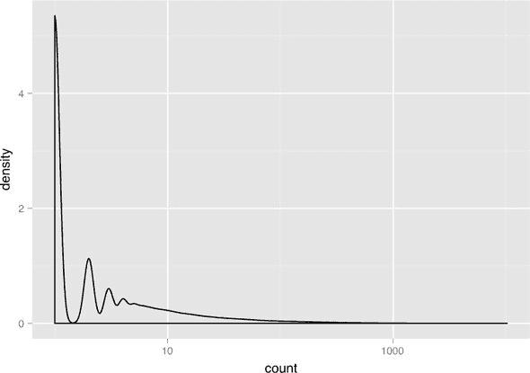

他们都读了哪些书？函数 `itemFrequency()` 可以告诉你每本书在交易数据中出现的频率。

列表 9.21\. 计算每本书出现的频率

```
bookCount <- itemFrequency(bookbaskets, "absolute")
summary(bookCount)

##     Min.  1st Qu.   Median     Mean  3rd Qu.     Max.
##    1.000    1.000    1.000    4.638    3.000 2502.000
```

你还可以找到出现频率最高的 10 本书。

列表 9.22\. 找到出现频率最高的 10 本书

```
orderedBooks <- sort(bookCount, decreasing = TRUE)           ❶
knitr::kable(orderedBooks[1:10])                             ❷

# |                                                |    x|
# |:-----------------------------------------------|----:|
# |Wild Animus                                     | 2502|
# |The Lovely Bones: A Novel                       | 1295|
# |She's Come Undone                               |  934|
# |The Da Vinci Code                               |  905|
# |Harry Potter and the Sorcerer's Stone           |  832|
# |The Nanny Diaries: A Novel                      |  821|
# |A Painted House                                 |  819|
# |Bridget Jones's Diary                           |  772|
# |The Secret Life of Bees                         |  762|
# |Divine Secrets of the Ya-Ya Sisterhood: A Novel |  737|

orderedBooks[1] / nrow(bookbaskets)                          ❸

## Wild Animus
##  0.02716376
```

❶ 按计数降序排序

❷ 以良好的格式显示前 10 本书籍

❸ 数据集中最受欢迎的书籍出现在少于 3% 的购物篮中。

前面的列表中的最后一个观察结果突出了挖掘高维数据时的问题之一：当你有成千上万的变量或项目时，几乎每个事件都是罕见的。在决定规则挖掘的支持度阈值时，请记住这一点；你的阈值通常需要相当低。

在我们进行规则挖掘之前，让我们进一步精炼数据。正如你之前观察到的，数据中的半数客户只对一本书表示了兴趣。由于你想要找到在人们兴趣列表中一起出现的书籍，你不能直接使用那些尚未对多本书表示兴趣的人。你可以将数据集限制为至少对两本书表示过兴趣的客户：

```
bookbaskets_use <- bookbaskets[basketSizes > 1]
dim(bookbaskets_use)
## [1]  40822 220447
```

现在你已经准备好寻找关联规则了。

apriori() 函数

为了挖掘规则，你需要决定一个最小支持度水平和最小阈值水平。对于这个例子，让我们尝试将我们考虑的项目集限制在最小支持度为 0.2%，或 0.002。这对应于至少出现 `0.002 * nrow(bookbaskets_use)` 次的项目集，大约是 82 笔交易。我们将使用 75% 的置信度阈值。

列表 9.23\. 寻找关联规则

```
rules <- apriori(bookbaskets_use,                                       ❶
                  parameter = list(support = 0.002, confidence = 0.75))

summary(rules)
## set of 191 rules                                                     ❷
##
## rule length distribution (lhs + rhs):sizes                           ❸
##   2   3   4   5
##  11 100  66  14
##
##    Min. 1st Qu.  Median    Mean 3rd Qu.    Max.
##   2.000   3.000   3.000   3.435   4.000   5.000
##
## summary of quality measures:                                         ❹
##     support           confidence          lift            count
##  Min.   :0.002009   Min.   :0.7500   Min.   : 40.89   Min.   : 82.0
##  1st Qu.:0.002131   1st Qu.:0.8113   1st Qu.: 86.44   1st Qu.: 87.0
##  Median :0.002278   Median :0.8468   Median :131.36   Median : 93.0
##  Mean   :0.002593   Mean   :0.8569   Mean   :129.68   Mean   :105.8
##  3rd Qu.:0.002695   3rd Qu.:0.9065   3rd Qu.:158.77   3rd Qu.:110.0
##  Max.   :0.005830   Max.   :0.9882   Max.   :321.89   Max.   :238.0
##
## mining info:                                                         ❺
##             data ntransactions support confidence
##  bookbaskets_use         40822   0.002       0.75
```

❶ 使用最小支持度 0.002 和最小置信度 0.75 调用 apriori()

❷ 找到的规则数量

❸ 规则长度的分布（在这个例子中，大多数规则包含 3 个项目——左侧 2 个，X（lhs），右侧 1 个，Y（rhs））

❹ 规则质量度量总结，包括支持度和置信度

❺ 关于如何调用 apriori() 的相关信息

规则的质量度量包括规则的支持度和置信度、支持度计数（规则应用到的交易数量），以及一个称为 *提升度* 的量。提升度比较观察到的模式的频率与仅通过偶然看到该模式频率的期望。规则“如果 X，则 Y”的提升度由 `support({X, Y}) / (support(X) * support(Y))` 给出。如果提升度接近 1，那么观察到的模式仅通过偶然发生的可能性很大。提升度越大，模式是“真实”的可能性就越大。在这种情况下，所有发现的规则提升度至少为 40，因此它们很可能是客户行为的真实模式。

检查和评估规则

您还可以使用其他指标和兴趣度量来通过 `interestMeasure()` 函数评估规则。我们将查看其中两个度量：`coverage` 和 `fishersExactTest`。*覆盖率* 是规则左侧（X）的支持度；它告诉您规则在数据集中会被应用多少次。*费舍尔精确检验* 是一个用于检验观察到的模式是真实还是偶然（与提升度测量的相同；费舍尔检验更为正式）的显著性检验。费舍尔精确检验返回 p 值，即您偶然看到观察到的模式的概率；您希望 p 值很小。

列表 9.24\. 评分规则

```
measures <- interestMeasure(rules,                              ❶
                  measure=c("coverage", "fishersExactTest"),    ❷
                  transactions = bookbaskets_use)               ❸
summary(measures)
##     coverage        fishersExactTest
##  Min.   :0.002082   Min.   : 0.000e+00
##  1st Qu.:0.002511   1st Qu.: 0.000e+00
##  Median :0.002719   Median : 0.000e+00
##  Mean   :0.003039   Mean   :5.080e-138
##  3rd Qu.:0.003160   3rd Qu.: 0.000e+00
##  Max.   :0.006982   Max.   :9.702e-136
```

❶ `interestMeasure()` 的第一个参数是发现的规则。

❷ 第二个参数是应用兴趣度量的列表。

❸ 最后一个参数是用于评估兴趣度量的数据集。这通常是用于挖掘规则的相同集合，但不必如此。例如，您可以在整个数据集 `bookbaskets` 上评估规则，以获得反映所有客户的覆盖率估计，而不仅仅是那些对多本书表示兴趣的客户。

发现的规则覆盖率范围在 0.002–0.007 之间，相当于大约 82–286 人的范围。所有费舍尔检验的 p 值都很小，因此这些规则很可能反映了实际的客户行为模式。

您还可以使用 `interestMeasure()` 函数，通过 `support`、`confidence` 和 `lift` 等方法进行调用。在我们的例子中，如果您想为整个数据集 `bookbaskets` 获取支持度、置信度和提升度估计，而不是过滤后的数据集 `bookbaskets_use`——或者对于数据的一个子集，例如，仅限于美国客户，这将是有用的。

函数 `inspect()` 会美化打印规则。函数 `sort()` 允许您根据质量或兴趣度量对规则进行排序，例如置信度。要打印数据集中最自信的五个规则，可以使用以下语句，我们将使用管道符号进行扩展。

列表 9.25\. 获取最自信的五个规则

```
library(magrittr)                    ❶

rules %>%
  sort(., by = "confidence") %>%     ❷

  head(., n = 5) %>%                 ❸

  inspect(.)                         ❹
```

❶ 使用 magrittr 添加管道符号

❷ 按置信度排序规则

❸ 获取前五个规则

❹ 调用 inspect() 函数以美化打印规则

为了提高可读性，我们将此命令的输出显示在 表 9.3 中。

表 9.3\. 数据中发现的最自信的五个规则

| 左侧 | 右侧 | 支持度 | 自信度 | 升值 | 数量 |
| --- | --- | --- | --- | --- | --- |
| *四到得分* *高五* *七上* *两块面包* | *三到致命* | 0.002 | 0.988 | 165 | 84 |
| *哈利·波特与凤凰社* *哈利·波特与阿兹卡班的囚徒* *哈利·波特与魔法石* | *哈利·波特与密室* | 0.003 | 0.966 | 73 | 117 |
| *四到得分* *高五* *一美元一把* *两块面包* | *三到致命* | 0.002 | 0.966 | 162 | 85 |
| *四到得分* *七上* *三到致命* *两块面包* | *高五* | 0.002 | 0.966 | 181 | 84 |
| *高五* *七上* *三到致命* *两块面包* | *四到得分* | 0.002 | 0.966 | 168 | 84 |

在 表 9.3 中有两个需要注意的地方。首先，这些规则涉及的是系列书籍：关于赏金猎人斯蒂芬妮·普卢的编号系列小说，以及哈利·波特系列。因此，这些规则本质上表明，如果一个读者读过四本斯蒂芬妮·普卢或三本哈利·波特的书，他们几乎肯定会再买一本。

第二个要注意的是，规则 1、4 和 5 是相同项目集的排列。当规则变长时，这种情况很可能会发生。

限制挖掘的项目

你可以限制规则左侧或右侧出现的项目。假设你特别感兴趣的是那些倾向于与小说 *The Lovely Bones* 同时出现的书籍。你可以通过限制规则右侧出现的书籍来实现这一点，使用 `appearance` 参数。

列表 9.26\. 带限制条件的规则查找

```
brules <- apriori(bookbaskets_use,
                parameter = list(support = 0.001,                        ❶
                                  confidence = 0.6),
                appearance = list(rhs = c("The Lovely Bones: A Novel"),  ❷
                                   default = "lhs"))                     ❸
 summary(brules)
## set of 46 rules
##
## rule length distribution (lhs + rhs):sizes
##  3  4
## 44  2
##
##    Min. 1st Qu.  Median    Mean 3rd Qu.    Max.
##   3.000   3.000   3.000   3.043   3.000   4.000
##
## summary of quality measures:
##     support           confidence          lift           count
##  Min.   :0.001004   Min.   :0.6000   Min.   :21.81   Min.   :41.00
##  1st Qu.:0.001029   1st Qu.:0.6118   1st Qu.:22.24   1st Qu.:42.00
##  Median :0.001102   Median :0.6258   Median :22.75   Median :45.00
##  Mean   :0.001132   Mean   :0.6365   Mean   :23.14   Mean   :46.22
##  3rd Qu.:0.001219   3rd Qu.:0.6457   3rd Qu.:23.47   3rd Qu.:49.75
##  Max.   :0.001396   Max.   :0.7455   Max.   :27.10   Max.   :57.00
##
## mining info:
##             data ntransactions support confidence
##  bookbaskets_use         40822   0.001        0.6
```

❶ 将最小支持度放宽到 0.001，最小置信度放宽到 0.6

❷ 规则的右侧只允许出现“《骨之恋》”。

❸ 默认情况下，所有书籍都可以进入规则的左侧。

支持度、置信度、数量和升值都比我们之前的例子低，但升值仍然远大于一，因此这些规则很可能反映了真实的客户行为模式。

让我们检查按置信度排序的规则。由于它们都将有相同的右侧，你可以使用 `lhs()` 函数只查看左侧。

列表 9.27\. 规则检查

```
brules %>%
  sort(., by = "confidence") %>%
  lhs(.) %>%                          ❶

  head(., n = 5) %>%
  inspect(.)
##   items
## 1 {Divine Secrets of the Ya-Ya Sisterhood: A Novel,
##    Lucky : A Memoir}
## 2 {Lucky : A Memoir,
##    The Notebook}
## 3 {Lucky : A Memoir,
##    Wild Animus}
## 4 {Midwives: A Novel,
##    Wicked: The Life and Times of the Wicked Witch of the West}
## 5 {Lucky : A Memoir,
##    Summer Sisters}
```

❶ 获取排序规则的左侧

注意，五个最自信的规则中有四个包括左侧的 *Lucky: A Memoir*，这可能并不令人惊讶，因为 *Lucky* 是 *The Lovely Bones* 的作者所写。假设你想了解其他作者的作品，这些作品对那些对 *The Lovely Bones* 感兴趣的人也很有趣；你可以使用 `subset()` 函数来筛选出不包括 *Lucky* 的规则。

列表 9.28\. 带限制条件的规则检查

```
brulesSub <- subset(brules, subset = !(lhs %in% "Lucky : A Memoir"))    ❶
 brulesSub %>%
  sort(., by = "confidence") %>%
  lhs(.) %>%
  head(., n = 5) %>%
  inspect(.)

brulesConf <- sort(brulesSub, by="confidence")

inspect(head(lhs(brulesConf), n = 5))
##   items
## 1 {Midwives: A Novel,
##    Wicked: The Life and Times of the Wicked Witch of the West}
## 2 {She's Come Undone,
##    The Secret Life of Bees,
##    Wild Animus}
## 3 {A Walk to Remember,
##    The Nanny Diaries: A Novel}
## 4 {Beloved,
##    The Red Tent}
## 5 {The Da Vinci Code,
##    The Reader}
```

❶ 限制为不包含 Lucky 在左侧的规则子集

这些例子表明，关联规则挖掘通常是高度交互的。为了得到有趣的规则，你通常必须将支持度和置信度水平设置得相当低；结果，你可以得到许多许多规则。有些规则可能比你想象的更有趣或更令人惊讶；要找到它们，需要按不同的兴趣度量对规则进行排序，或者可能限制自己只关注特定的规则子集。

### 9.2.4. 关联规则要点

你现在已经通过一个使用关联规则来探索购买数据中常见模式的例子。以下是关于关联规则你应该记住的几点：

+   关联规则挖掘的目标是在数据中找到关系：倾向于一起出现的项目或属性。

+   一个好的规则“如果 X，则 Y”应该比偶然观察到的频率更高。你可以使用提升或 Fisher 的精确检验来检查这是否成立。

+   当大量不同项目可能出现在篮子里（在我们的例子中，成千上万的不同书籍）时，大多数事件将是罕见的（支持度低）。

+   关联规则挖掘通常是交互式的，因为可能有许多规则需要排序和筛选。

## 摘要

在本章中，你学习了如何使用 R 中的两种不同的聚类方法来寻找数据中的相似性，以及如何使用关联规则来寻找数据中倾向于一起出现的项目。你还学习了如何评估你发现的集群和规则。

本章中我们介绍的无监督方法实质上更具有探索性。与监督方法不同，没有“真实情况”来评估你的发现。但无监督方法的发现可以成为更专注的实验和建模的起点。

在最后几章中，我们介绍了最基本建模和数据分析技术；它们都是当你开始一个新项目时值得考虑的良好起点。在下一章中，我们将触及一些更高级的方法。

本章你学到了

+   如何使用层次方法和 k-means 对无标签数据进行聚类

+   如何估计合适的聚类数量

+   如何评估现有聚类的聚类稳定性

+   如何使用 apriori 在事务数据中找到模式（关联规则）

+   如何评估和筛选发现的关联规则
