# 第十章. 探索高级方法

本章涵盖

+   基于决策树的模型

+   广义加性模型

+   支持向量机

在第七章中，你学习了拟合预测模型的线性方法。这些模型是机器学习的核心方法；它们易于拟合；它们小巧、便携、高效；它们有时会提供有用的建议；并且它们可以在各种情况下表现良好。然而，它们也对世界做出了强烈的假设：即结果与所有输入线性相关，并且所有输入都以加性方式对结果产生影响。在本章中，你将了解一些放宽这些假设的方法。

图 10.1 代表了我们本章将要执行的心理模型：使用 R 掌握构建监督机器学习模型的科学。

图 10.1\. 心理模型


* * *

示例

*假设你想研究死亡率与一个人的健康或体能指标之间的关系，包括 BMI（身体质量指数）。*

* * *

图 10.2 显示了在四年期间，泰国老年人群体的 BMI 与死亡率风险比之间的关系.^([1]) 它表明，无论是高 BMI 还是低 BMI 都与较高的死亡率相关：BMI 与死亡率之间的关系不是线性的。因此，基于 BMI（部分）预测死亡率的简单线性模型可能表现不佳。

> ¹
> 
> Vapattanawong 等人。“泰国老年人的肥胖与死亡率：四年随访研究”，*BMC 公共健康*，2010。[`doi.org/10.1186/1471-2458-10-604`](https://doi.org/10.1186/1471-2458-10-604)。

图 10.2\. 男女死亡率与身体质量指数的关系

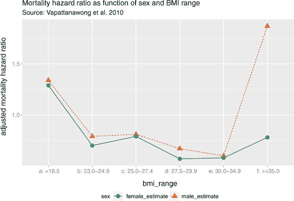

此外，BMI（身体质量指数）与其他因素之间可能存在*相互作用*，例如一个人的活跃程度。例如，对于非常活跃的人来说，BMI 对死亡率的影响可能远小于对久坐不动的人的影响。一些相互作用，如变量之间的“如果-那么”关系或变量之间的乘法效应，可能并不总是可以用线性模型来表示.^([2])

> ²
> 
> 在线性模型中可以建模相互作用，但这必须由数据科学家明确执行。相反，我们将专注于机器学习技术，例如基于树的方法，这些方法可以直接学习至少某些类型的相互作用。

本章中介绍的机器学习技术使用各种方法来解决建模中的非线性、相互作用和其他问题。

## 10.1\. 基于树的方法

你在第一章中看到了一个基本的决策树模型的例子（在图 10.3 中重现）。决策树对分类和回归都很有用，并且由于以下原因，它们是一种吸引人的方法：

+   它可以接受任何类型的数据，无论是数值型还是分类型，而不需要任何分布假设和预处理。

+   大多数实现（特别是 R）处理缺失数据；该方法对冗余和非线性数据也具有鲁棒性。

+   算法易于使用，输出（树）相对容易理解。

+   它们自然地表达了输入变量之间的一些交互：形式为“如果 x 为真且 y 为真，那么……”

+   一旦模型拟合完成，评分就很快。

图 10.3。示例决策树（来自第一章)

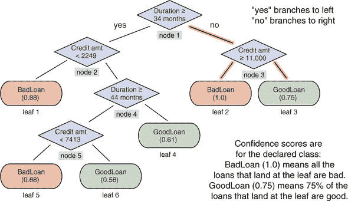

另一方面，决策树也有一些缺点：

+   它们有过度拟合的倾向，尤其是在没有剪枝的情况下。

+   它有很高的训练方差：从同一总体中抽取的样本可以产生具有不同结构和不同预测准确性的树。

+   简单决策树不如本章我们将讨论的其他基于树的集成方法可靠。（^[3])

    > ³
    > 
    > 参见 Lim、Loh 和 Shih，“三十三种旧分类算法与新分类算法的预测准确性、复杂性和训练时间比较”，*机器学习*，2000。40，203–229；在线[`mng.bz/qX06`](http://mng.bz/qX06)。

由于这些原因，我们在这本书中不强调基本决策树的使用。然而，有许多技术可以修复这些弱点，从而产生最先进、有用且性能良好的建模算法。我们将在本节中讨论一些这些技术。

### 10.1.1。一个基本的决策树

为了激发对基于树的讨论，我们将回到第六章中使用的示例，并构建一个基本的决策树。

* * *

示例

*假设你想要将电子邮件分类为垃圾邮件（你不想收到的邮件）和非垃圾邮件（你想要的邮件）。*

* * *

对于这个例子，你将再次使用 Spambase 数据集。该数据集包含大约 4,600 个文档和 57 个特征，这些特征描述了某些关键词和字符的频率。以下是过程：

+   首先，你将训练一个决策树来估计给定文档是垃圾邮件的概率。

+   接下来，你将根据几个性能指标评估树的表现，包括准确率、F1 和偏差（所有这些都在第七章中讨论过）。

回想一下第六章和第七章的讨论，我们希望准确性和 F1 值要高，而偏差（与方差类似）要低。

首先，让我们加载数据。就像你在第 6.2 节中所做的那样，从[`github.com/WinVector/PDSwR2/raw/master/Spambase/spamD.tsv`](https://github.com/WinVector/PDSwR2/raw/master/Spambase/spamD.tsv)下载一份 spamD.tsv 的副本。然后，编写一些便利函数并训练一个决策树，如下所示。

列表 10.1。准备 Spambase 数据和评估决策树模型

```
spamD <- read.table('spamD.tsv', header = TRUE, sep = '\t')                ❶
spamD$isSpam <- spamD$spam == 'spam'
spamTrain <- subset(spamD, spamD$rgroup >= 10)
spamTest <- subset(spamD, spamD$rgroup < 10)

spamVars <- setdiff(colnames(spamD), list('rgroup', 'spam', 'isSpam'))
library(wrapr)
spamFormula <- mk_formula("isSpam", spamVars)                              ❷

loglikelihood <- function(y, py) {                                         ❸
   pysmooth <- ifelse(py == 0, 1e-12,
                  ifelse(py == 1, 1 - 1e-12, py))

  sum(y * log(pysmooth) + (1 - y) * log(1 - pysmooth))
}

accuracyMeasures <- function(pred, truth, name = "model") {                ❹
   dev.norm <- -2 * loglikelihood(as.numeric(truth), pred) / length(pred)  ❺
   ctable <- table(truth = truth,
                 pred = (pred > 0.5))                                      ❻
   accuracy <- sum(diag(ctable)) / sum(ctable)
  precision <- ctable[2, 2] / sum(ctable[, 2])
  recall <- ctable[2, 2] / sum(ctable[2, ])
  f1 <- 2 * precision * recall / (precision + recall)
  data.frame(model = name, accuracy = accuracy, f1 = f1, dev.norm)
}

library(rpart)                                                             ❻
treemodel <- rpart(spamFormula, spamTrain, method = "class")

library(rpart.plot)                                                        ❽
rpart.plot(treemodel, type = 5, extra = 6)

predTrain <- predict(treemodel, newdata = spamTrain)[, 2]                  ❾

trainperf_tree <- accuracyMeasures(predTrain,                              ❿)

                 spamTrain$spam == "spam",
                 name = "tree, training")

predTest <- predict(treemodel, newdata = spamTest)[, 2]
testperf_tree <- accuracyMeasures(predTest,
                 spamTest$spam == "spam",
```

❶ 加载数据并将其分为训练集（90%的数据）和测试集（10%的数据）

❷ 使用所有特征并执行二元分类，其中 TRUE 对应于垃圾邮件文档

❸ 一个用于计算对数似然（用于计算偏差）的函数

❹ 一个用于计算并返回模型上各种度量（归一化偏差、预测准确性和 f1）的函数

❺ 通过数据点的数量归一化偏差，以便我们可以比较训练集和测试集之间的偏差

❻ 将类概率估计器转换为分类器，通过将评分大于 0.5 的文档标记为垃圾邮件

❻ 加载 rpart 库并拟合决策树模型

❽ 用于绘制树

❾ “垃圾邮件”类的概率

❿ 评估决策树模型与训练集和测试集

结果的决策树模型显示在图 10.4 中。两次调用`accuracyMeasures()`的输出如下：

图 10.4\. 用于垃圾邮件过滤的决策树模型

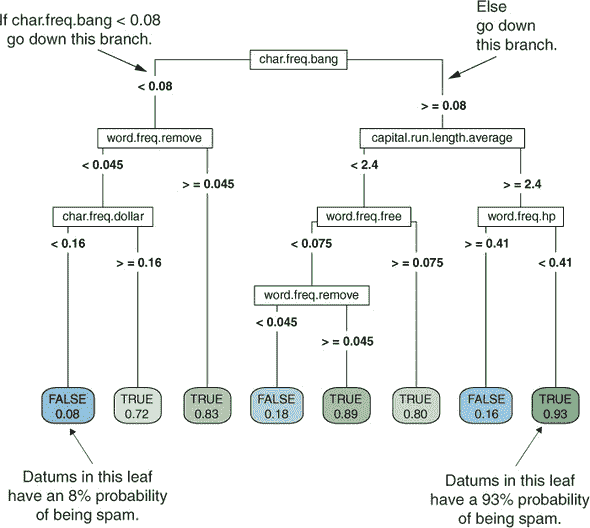

```
library(pander)                              ❶

panderOptions("plain.ascii", TRUE)           ❷
panderOptions("keep.trailing.zeros", TRUE)
panderOptions("table.style", "simple")
perf_justify <- "lrrr"

perftable <- rbind(trainperf_tree, testperf_tree)
pandoc.table(perftable, justify = perf_justify)

##
##
## model              accuracy       f1   dev.norm
## ---------------- ---------- -------- ----------
## tree, training       0.8996   0.8691     0.6304
## tree, test           0.8712   0.8280     0.7531
```

❶ 一个用于制作格式优美的 ASCII 表格的包

❷ 在全局设置一些选项，这样我们就不必在每次调用中都设置它们

如预期的那样，准确性和 F1 分数在测试集上都降低了，偏差增加了。

### 10.1.2\. 使用袋装提高预测

通过自助聚合，或称为**袋装**，可以减轻决策树模型的不足。在袋装中，你从数据中抽取自助样本（带有替换的随机样本）。从每个样本中，你构建一个决策树模型。最终模型是所有单个决策树的平均值。这显示在图 10.5.^([4])

> ⁴
> 
> 袋装、随机森林和梯度提升树是称为**集成学习**的一般技术的变体。一个集成模型由几个较小的简单模型（通常是小的决策树）的组合组成。Giovanni Seni 和 John Elder 的《数据挖掘中的集成方法》（Morgan & Claypool，2010）是集成学习一般理论的优秀入门书籍。

图 10.5\. 袋装决策树

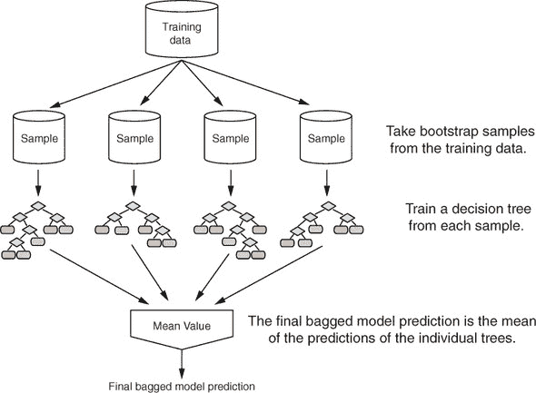

为了使这一点具体化，假设*x*是一个输入数据，*y*_*i*(*x*)是第*i*个树的输出，*c*(*y*_1(*x*), *y*_2(*x*), ... *y*_*n*(*x*))是单个输出的向量，*y*是最终模型的输出：

+   对于回归，或用于估计类概率，*y*(*x*)是单个树返回的分数的平均值：*y*(*x*) = mean(*c*(*y*_1(*x*), ... *y*_*n*(*x*)))。

+   对于分类，最终模型将分配给单个树投票最多的类别。

袋装决策树通过降低方差来稳定最终模型，这提高了准确性。一个树袋集成也较少可能过度拟合数据。

尝试对垃圾邮件示例进行一些树模型的袋装处理。

列表 10.2\. 袋装决策树

```
ntrain <- dim(spamTrain)[1]
n <- ntrain                                          ❶

ntree <- 100

samples <- sapply(1:ntree,                           ❷

                 FUN = function(iter)
                   { sample(1:ntrain, size = n, replace = TRUE) })

treelist <-lapply(1:ntree,                           ❸

                  FUN = function(iter) {
                    samp <- samples[, iter];
                    rpart(spamFormula, spamTrain[samp, ], method = "class") }
      )

predict.bag <- function(treelist, newdata) {         ❹

  preds <- sapply(1:length(treelist),
                 FUN = function(iter) {
                   predict(treelist[[iter]], newdata = newdata)[, 2] })
  predsums <- rowSums(preds)
  predsums / length(treelist)
}

pred <- predict.bag(treelist, newdata = spamTrain)
trainperf_bag <- accuracyMeasures(pred,              ❺

                 spamTrain$spam == "spam",
                 name = "bagging, training")

pred <- predict.bag(treelist, newdata = spamTest)
testperf_bag <- accuracyMeasures(pred,
                 spamTest$spam == "spam",
                 name = "bagging, test")

perftable <- rbind(trainperf_bag, testperf_bag)
pandoc.table(perftable, justify = perf_justify)
##
##
## model                 accuracy       f1   dev.norm
## ------------------- ---------- -------- ----------
## bagging, training       0.9167   0.8917     0.5080
## bagging, test           0.9127   0.8824     0.5793
```

❶ 使用与训练集相同大小的自助样本，有 100 棵树

❷ 通过替换抽样`spamTrain`的行索引来构建自助样本。矩阵的每一列样本表示构成自助样本的`spamTrain`中的行索引。

❸ 训练单个决策树并将它们以列表形式返回。注意：此步骤可能需要几分钟。

❹ `predict.bag`假设底层分类器返回决策概率，而不是决策。`predict.bag`取所有单个树的预测的平均值

❺ 评估袋装决策树对训练集和测试集的性能

如您所见，与单个决策树相比，袋装提高了准确性和 F1 分数，并减少了训练集和测试集的偏差。与决策树相比，从训练到测试的袋装模型性能下降较少。

您可以通过从袋装到随机森林来进一步提高预测性能。

* * *

**袋装分类器**

袋装减少方差的证明仅适用于回归和估计类概率，不适用于分类器（仅返回类成员资格，不返回类概率）。对不良分类器进行袋装可能会使其变得更糟。因此，如果您能获得类概率估计，您肯定希望在此基础上工作。但可以证明，在 R 中的 CART 树（决策树实现）在轻微假设下，袋装往往会提高分类器的准确性。有关更多详细信息，请参阅 Clifton D. Sutton 的“分类和回归树、袋装和提升”，*《统计手册，第 24 卷》*（Elsevier，2005）。

* * *

### 10.1.3\. 使用随机森林进一步提高预测

在袋装中，使用随机数据集构建树，但每棵树都是通过考虑完全相同的特征集来构建的。这意味着所有单个树很可能使用非常相似的特征集（可能是不同的顺序或不同的分割值）。因此，单个树之间可能会过度相关。如果特征空间中有某些区域一棵树倾向于出错，那么所有树也可能会在那里出错，从而减少了我们的纠正机会。随机森林方法试图通过随机化每棵树允许使用的变量集来解耦树。

该过程在图 10.6 中显示。对于集成中的每棵单个树，随机森林方法执行以下操作：

1.  从训练数据中抽取一个自助样本

1.  对于每个样本，生长一棵决策树，并在树的每个节点

    1.  从`p`个总特征中随机抽取一个子集`mtry`变量

    1.  从`mtry`变量集中选择最佳变量和最佳分割

    1.  继续生长直到树完全成熟

图 10.6\. 增长随机森林

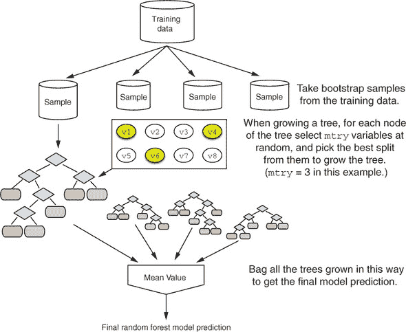

然后将最终的树集合进行袋装，以生成随机森林预测。这相当复杂，但幸运的是，所有这些操作都由单行随机森林调用完成。

默认情况下，R 中的`randomForest()`函数在每个节点上为回归树抽取`mtry = p/3`个变量，为分类树抽取`m = sqrt(p)`个变量。从理论上讲，随机森林对`mtry`值的敏感性并不高。较小的值会使树生长得更快；但如果你有很多变量可供选择，其中只有一小部分真正有用，那么使用较大的`mtry`更好，因为使用较大的`mtry`，你更有可能在树的生长过程中每一步都抽取到一些有用的变量。

从第 10.1 节中的数据继续，尝试使用随机森林构建一个垃圾邮件模型。

列表 10.3\. 使用随机森林

```
library(randomForest)                                        ❶
set.seed(5123512)                                            ❷
fmodel <- randomForest(x = spamTrain[, spamVars],            ❸
         y = spamTrain$spam,
         ntree = 100,                                        ❹
         nodesize = 7,                                       ❺
         importance = TRUE)                                  ❻

pred <- predict(fmodel,
                spamTrain[, spamVars],
                type = 'prob')[, 'spam']

trainperf_rf <-  accuracyMeasures(predict(fmodel,            ❻
   newdata = spamTrain[, spamVars], type = 'prob')[, 'spam'],
   spamTrain$spam == "spam", name = "random forest, train")

testperf_rf <-  accuracyMeasures(predict(fmodel,
   newdata = spamTest[, spamVars], type = 'prob')[, 'spam'],
   spamTest$spam == "spam", name = "random forest, test")

perftable <- rbind(trainperf_rf, testperf_rf)
pandoc.table(perftable, justify = perf_justify)

##
##
## model                    accuracy       f1   dev.norm
## ---------------------- ---------- -------- ----------
## random forest, train       0.9884   0.9852     0.1440
## random forest, test        0.9498   0.9341     0.3011
```

❶ 加载 randomForest 包

❷ 设置伪随机种子为已知值，以尝试使随机森林运行可重复

❸ 调用 randomForest()函数，以解释变量作为 x，预测类别作为 y 来构建模型

❹ 使用 100 棵树以与我们的袋装示例兼容。默认为 500 棵树。

❺ 指定树的每个节点必须至少有 7 个元素，以与 rpart()在此训练集上使用的默认最小节点大小兼容

❻ 告诉算法将信息保存下来，用于计算变量重要性（我们稍后会看到）

❻ 报告模型质量

你可以总结你所查看的所有三个模型的成果。首先，在训练数据上：

```
trainf <- rbind(trainperf_tree, trainperf_bag, trainperf_rf)
pandoc.table(trainf, justify = perf_justify)
##
##
## model                    accuracy       f1   dev.norm
## ---------------------- ---------- -------- ----------
## tree, training             0.8996   0.8691     0.6304
## bagging, training          0.9160   0.8906     0.5106
## random forest, train       0.9884   0.9852     0.1440
```

然后，在测试数据上：

```
testf <- rbind(testperf_tree, testperf_bag, testperf_rf)
pandoc.table(testf, justify = perf_justify)
##
##
## model                   accuracy       f1   dev.norm
## --------------------- ---------- -------- ----------
## tree, test                0.8712   0.8280     0.7531
## bagging, test             0.9105   0.8791     0.5834
## random forest, test       0.9498   0.9341     0.3011
```

随机森林模型在训练和测试数据上都比其他两个模型表现得好得多。

你还可以查看性能变化：从训练到测试时准确性和 F1 的下降，以及偏差的增加。

```
difff <- data.frame(model = c("tree", "bagging", "random forest"),
                  accuracy = trainf$accuracy - testf$accuracy,
                  f1 = trainf$f1 - testf$f1,
                  dev.norm = trainf$dev.norm - testf$dev.norm)

pandoc.table(difff, justify=perf_justify)

##
##
## model             accuracy        f1   dev.norm
## --------------- ---------- --------- ----------
## tree              0.028411   0.04111   -0.12275
## bagging           0.005523   0.01158   -0.07284
## random forest     0.038633   0.05110   -0.15711
```

当从训练数据到测试数据时，随机森林模型退化程度与单个决策树相当，并且比袋装模型要多得多。这是随机森林模型的一个缺点：过度拟合训练数据的倾向。然而，在这种情况下，随机森林模型仍然是表现最好的。

* * *

**随机森林可以过拟合！**

在随机森林的支持者中，有一个传说：“随机森林不会过拟合。”实际上，它们可以。Hastie 等人在这本《统计学习的要素》中关于随机森林的章节中支持了这个观察结果（Springer，2011 年）。在训练数据上看到几乎完美的预测，而在保留数据上表现不佳，这是随机森林模型的特点。因此，在使用随机森林时，在保留数据上验证模型性能非常重要。

* * *

检查变量重要性

`randomForest()`函数的一个有用特性是其变量重要性计算。由于该算法使用大量自助样本，每个数据点`x`都有一个相应的**袋外样本集**：那些不包含点`x`的样本。这在图 10.7 中对于数据点`x1`进行了展示。袋外样本可以像**N**-折交叉验证一样使用，以估计集成中每棵树的准确性。

图 10.7. 数据点`x1`的袋外样本

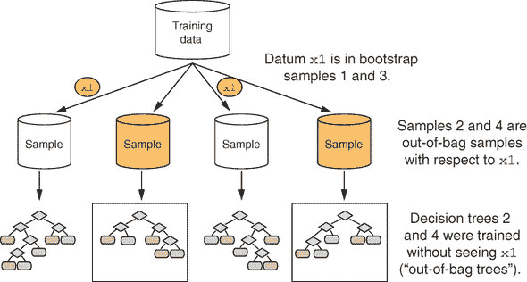

为了估计变量`v1`的“重要性”，随机排列该变量的值。然后，评估每棵树对其袋外样本，并估计每棵树准确性的相应下降。这已在图 10.8 中展示。

图 10.8. 计算变量`v1`的重要性

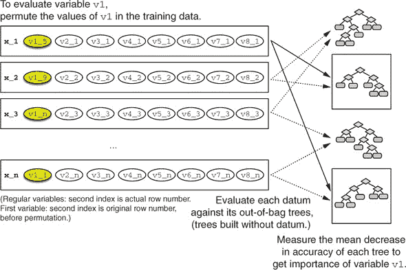

如果所有树的平均下降幅度很大，则认为该变量很重要——其值对预测结果有很大影响。如果平均下降幅度很小，则该变量对结果影响不大。算法还测量了在排列变量（如何影响树的质量）上分割时节点纯度的下降。

你可以通过在`randomForest()`调用中设置`importance = TRUE`来计算变量重要性（就像你在列表 10.3 中所做的那样），然后调用`importance()`和`varImpPlot()`函数。

列表 10.4. `randomForest`变量重要性

```
varImp <- importance(fmodel)                                       ❶

varImp[1:10, ]                                                     ❷
##                     non-spam      spam MeanDecreaseAccuracy
## word.freq.make      1.656795  3.432962             3.067899
## word.freq.address   2.631231  3.800668             3.632077
## word.freq.all       3.279517  6.235651             6.137927
## word.freq.3d        3.900232  1.286917             3.753238
## word.freq.our       9.966034 10.160010            12.039651
## word.freq.over      4.657285  4.183888             4.894526
## word.freq.remove   19.172764 14.020182            20.229958
## word.freq.internet  7.595305  5.246213             8.036892
## word.freq.order     3.167008  2.505777             3.065529
## word.freq.mail      3.820764  2.786041             4.869502

varImpPlot(fmodel, type = 1)                                       ❸
```

❶ 在垃圾邮件模型上调用`importance()`

❷ `importance()`函数返回一个重要性度量矩阵（值越大表示越重要）。

❸ 以准确性变化衡量变量重要性的图

`varImpPlot()`调用的结果在图 10.9 中展示。根据图表，确定一封电子邮件是否为垃圾邮件最重要的变量是`char.freq.bang`，即电子邮件中感叹号出现的次数，这在某种程度上是有直觉意义的。下一个最重要的变量是`word.freq.remove`，即电子邮件中“remove”一词出现的次数。

图 10.9. 垃圾邮件模型中最重要变量的准确性测量图

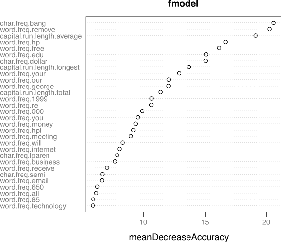

了解哪些变量最重要（或者至少，哪些变量对底层决策树的结构贡献最大）可以帮助你进行变量减少。这不仅有助于构建更小、更快的树，还可以在选择用于其他建模算法的变量时发挥作用。在这个垃圾邮件示例中，我们可以将变量数量从 57 减少到 30，而不会影响最终模型的质量。

* * *

**变量筛选作为初步筛选**

数据科学家 Jeremy Howard（Kaggle 和 fast.ai 的知名人士）是使用初始变量重要性筛选的强烈支持者，在数据科学项目的早期阶段消除不感兴趣的变量，并确定与业务伙伴讨论的变量。

* * *

列表 10.5\. 使用较少变量进行拟合

```
sorted <- sort(varImp[, "MeanDecreaseAccuracy"],       ❶
                decreasing = TRUE)

selVars <- names(sorted)[1:30]
fsel <- randomForest(x = spamTrain[, selVars],         ❷
                         y = spamTrain$spam,
                        ntree = 100,
                        nodesize = 7,
                        importance = TRUE)

trainperf_rf2 <- accuracyMeasures(predict(fsel,
   newdata = spamTrain[, selVars], type = 'prob')[, 'spam'],
   spamTrain$spam == "spam", name = "RF small, train")

testperf_rf2 <- accuracyMeasures(predict(fsel,
   newdata=spamTest[, selVars], type = 'prob')[, 'spam'],
   spamTest$spam == "spam", name = "RF small, test")

perftable <- rbind(testperf_rf, testperf_rf2)          ❸
pandoc.table(perftable, justify = perf_justify)
##
##
## model                   accuracy       f1   dev.norm
## --------------------- ---------- -------- ----------
## random forest, test       0.9498   0.9341     0.3011
## RF small, test            0.9520   0.9368     0.4000
```

❶ 按照准确度变化率对变量进行排序

❷ 仅使用 30 个最重要的变量构建随机森林模型

❸ 在测试集上比较两个随机森林模型

较小的模型与使用所有 57 个变量构建的随机森林模型表现相当。

* * *

**随机森林变量重要性与 LIME**

随机森林变量重要性衡量单个变量对模型整体预测性能的重要性。它们告诉你哪些变量通常对模型的预测影响最大，或者模型最依赖哪些变量。

LIME 变量重要性（在第 6.3 节 section 6.3 中讨论）衡量不同变量对模型在特定示例上的预测影响程度。LIME 解释可以帮助你确定模型是否适当地使用了其变量，通过解释特定的决策。

* * *

### 10.1.4\. 梯度提升树

*梯度提升*是另一种集成方法，它通过逐步向现有集成中添加树来提高决策树的表现。与 bagging 和随机森林不同，梯度提升不是简单地平均多个树的预测，而是试图通过增量添加树来提高预测性能。步骤如下：

1.  使用当前的集成`TE`对训练数据进行预测。

1.  测量真实结果与训练数据上的预测之间的残差。

1.  将新树`T_i`拟合到残差。将`T_i`添加到集成`TE`中。

1.  继续直到残差消失，或达到另一个停止标准。

该过程在图 10.10 中进行了概述。

图 10.10\. 构建梯度提升树模型

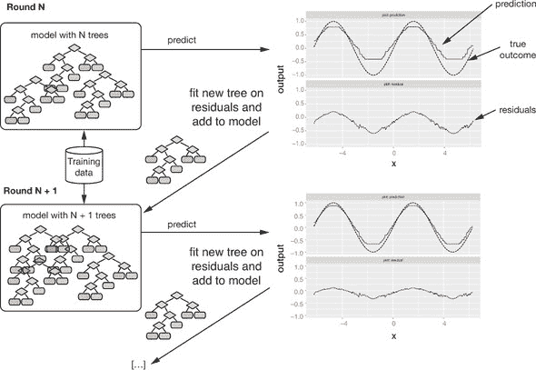

梯度提升树也可能过拟合，因为某个时刻残差只是随机噪声。为了减轻过拟合，大多数梯度提升的实现都提供了交叉验证方法，以帮助确定何时停止向集成中添加树。

当我们在第 6.3 节 section 6.3 中讨论 LIME 时，你看到了梯度提升的例子，其中使用`xgboost`包拟合了梯度提升树模型。在本节中，我们将更详细地介绍你在第 6.3 节 section 6.3 中使用的建模代码。

鸢尾花示例

让我们从一个小例子开始。

* * *

示例

*假设你有一个包含三种鸢尾花品种花瓣和萼片尺寸的数据集。目标是根据花瓣和萼片的尺寸预测给定的鸢尾花是否为 setosa 品种。*

* * *

列表 10.6\. 加载鸢尾花数据

```
iris <- iris
iris$class <- as.numeric(iris$Species == "setosa")       ❶

set.seed(2345)
intrain <- runif(nrow(iris)) < 0.75                      ❷
train <- iris[intrain, ]
test <- iris[!intrain, ]
head(train)

##   Sepal.Length Sepal.Width Petal.Length Petal.Width Species class
## 1          5.1         3.5          1.4         0.2  setosa     1
## 2          4.9         3.0          1.4         0.2  setosa     1
## 3          4.7         3.2          1.3         0.2  setosa     1
## 4          4.6         3.1          1.5         0.2  setosa     1
## 5          5.0         3.6          1.4         0.2  setosa     1
## 6          5.4         3.9          1.7         0.4  setosa     1

input <- as.matrix(train[, 1:4])                         ❸
```

❶ setosa 是正类。

❷ 将数据分为训练集和测试集（75%/25%）

❸ 创建输入矩阵

注意`xgboost`需要其输入为数值矩阵（没有分类变量），所以在列表 10.6 中，你从训练数据框中获取输入数据并创建一个输入矩阵。

在第 6.3 节中，你使用预提供的便利函数`fit_iris_example()`拟合了鸢尾花模型；这里我们将详细解释该函数中的代码。第一步是运行交叉验证函数`xgb.cv()`以确定要使用的树的数量。

列表 10.7. 交叉验证以确定模型大小

```
library(xgboost)

cv <- xgb.cv(input,                                     ❶

            label = train$class,                        ❷

              params = list(
                objective = "binary:logistic"           ❸
               ),
              nfold = 5,                                ❹
              nrounds = 100,                            ❺
              print_every_n = 10,                       ❻

              metrics = "logloss")                      ❻

evalframe <- as.data.frame(cv$evaluation_log)           ❽

head(evalframe)                                         ❾

##   iter train_logloss_mean train_logloss_std test_logloss_mean
## 1    1          0.4547800      7.758350e-05         0.4550578
## 2    2          0.3175798      9.268527e-05         0.3179284
## 3    3          0.2294212      9.542411e-05         0.2297848
## 4    4          0.1696242      9.452492e-05         0.1699816
## 5    5          0.1277388      9.207258e-05         0.1280816
## 6    6          0.0977648      8.913899e-05         0.0980894
##   test_logloss_std
## 1      0.001638487
## 2      0.002056267
## 3      0.002142687
## 4      0.002107535
## 5      0.002020668
## 6      0.001911152

(NROUNDS <- which.min(evalframe$test_logloss_mean))    ❿)
## [1] 18

library(ggplot2)
ggplot(evalframe, aes(x = iter, y = test_logloss_mean)) +
  geom_line() +
  geom_vline(xintercept = NROUNDS, color = "darkred", linetype = 2) +
  ggtitle("Cross-validated log loss as a function of ensemble size")
```

❶ 输入矩阵

❷ 类标签也必须是数字（1 代表 setosa，0 代表非 setosa）

❸ 使用“binary:logistic”目标函数进行二分类，使用“reg:linear”进行回归

❹ 使用 5 折交叉验证

❺ 构建包含 100 棵树的集成

❻ 每 10 次迭代打印一条消息（使用 verbose = FALSE 不打印消息）

❻ 使用最小交叉验证对数损失（与偏差相关）来选择最佳树的数量。对于回归，使用指标“rmse”。

❽ 获取性能日志

❾ `evalframe`记录了训练和交叉验证对数损失作为树数量的函数。

❿ 找到给出最小交叉验证对数损失的树的数量

图 10.11 显示了交叉验证对数损失作为树数量的函数。在这种情况下，`xgb.cv()`估计 18 棵树给出了最佳模型。一旦你知道要使用的树的数量，你就可以调用`xgboost()`来拟合适当的模型。

图 10.11. 验证集交叉验证对数损失作为集成大小的函数

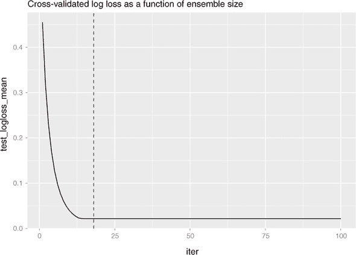

列表 10.8. 拟合`xgboost`模型

```
model <- xgboost(data = input,
                 label = train$class,
                 params = list(
                    objective = "binary:logistic"
                  ),
                 nrounds = NROUNDS,
                 verbose = FALSE)

test_input <- as.matrix(test[, 1:4])      ❶
pred <- predict(model,  test_input)       ❷

accuracyMeasures(pred, test$class)

##   model accuracy f1   dev.norm
## 1 model        1  1 0.03458392
```

❶ 为测试数据创建输入矩阵

❷ 进行预测

模型在保留数据上预测完美，因为这是一个简单的问题。现在你已经熟悉了步骤，你可以尝试在更难的问题上使用`xgboost`：第 6.3.3 节中的电影评论分类问题。

文本分类的梯度提升

* * *

示例

*对于这个例子，你将使用来自互联网电影数据库（IMDB）的电影评论进行分类。任务是识别正面评论。*

* * *

正如你在第 6.3.3 节中所做的那样，你将使用训练和测试数据，`IMDBtrain.RDS`和`IMDBtest.RDS`，可以在[`github.com/WinVector/PDSwR2/tree/master/IMDB`](https://github.com/WinVector/PDSwR2/tree/master/IMDB)找到。每个`RDS`对象是一个包含两个元素的列表：一个表示 25,000 条评论的字符向量，以及一个表示标签的数值向量，其中 1 表示正面评论，0 表示负面评论。

首先，加载训练数据：

```
library(zeallot)
c(texts, labels) %<-% readRDS("IMDBtrain.RDS")
```

你必须将文本输入数据转换为数值表示。正如第 6.3.3 节中所述，你将训练数据转换为文档-词矩阵，实现为`dgCMatrix`类的稀疏矩阵。用于执行此转换的便利函数在[`github.com/WinVector/PDSwR2/tree/master/IMDB/lime_imdb_example.R`](https://github.com/WinVector/PDSwR2/tree/master/IMDB/lime_imdb_example.R)中。接下来，你将创建语料库中的术语词汇表，然后为训练数据创建文档-词矩阵：

```
source("lime_imdb_example.R")
vocab <- create_pruned_vocabulary(texts)
dtm_train <- make_matrix(texts, vocab)
```

配置模型的第一步是确定要使用的树的数量。这可能需要一些时间。

```
cv <- xgb.cv(dtm_train,
             label = labels,
             params = list(
               objective = "binary:logistic"
               ),
             nfold = 5,
             nrounds = 500,
             early_stopping_rounds = 20,     ❶
             print_every_n = 10,
             metrics = "logloss")

evalframe <- as.data.frame(cv$evaluation_log)
(NROUNDS <- which.min(evalframe$test_logloss_mean))
## [1] 319
```

❶ 如果 20 轮内性能没有提高，则提前停止。

然后拟合模型并评估它：

```
model <- xgboost(data = dtm_train, label = labels,
                  params = list(
                    objective = "binary:logistic"
                  ),
                  nrounds = NROUNDS,
                  verbose = FALSE)

pred = predict(model, dtm_train)
trainperf_xgb =  accuracyMeasures(pred, labels, "training")

c(test_texts, test_labels) %<-% readRDS("IMDBtest.RDS")      ❶
dtm_test = make_matrix(test_texts, vocab)

pred = predict(model, dtm_test)
testperf_xgb = accuracyMeasures(pred, test_labels, "test")

perftable <- rbind(trainperf_xgb, testperf_xgb)
pandoc.table(perftable, justify = perf_justify)
##
##
## model        accuracy       f1   dev.norm
## ---------- ---------- -------- ----------
## training       0.9891   0.9891     0.1723
## test           0.8725   0.8735     0.5955
```

❶ 加载测试数据并将其转换为文档-词矩阵

与随机森林一样，这个梯度提升模型在训练数据上给出了近乎完美的性能，在保留数据上则略逊一筹，但仍然相当不错。尽管交叉验证步骤建议使用 319 棵树，你可能还想检查`evalframe`（就像你在鸢尾花示例中所做的那样），并尝试不同的树的数量，看看是否可以减少过拟合。

* * *

**梯度提升模型与随机森林**

在我们自己的工作中，我们发现梯度提升模型在大多数我们已经尝试过的问题上往往优于随机森林。然而，偶尔会有梯度提升模型表现不佳，而随机森林模型给出可接受性能的情况。你的经验可能不同。无论如何，保留这两种方法在你的工具箱中是个好主意。

* * *

使用 xgboost 处理分类变量

在鸢尾花示例中，所有输入变量都是数值型的；在电影评论示例中，你将非结构化文本输入转换为结构化、数值矩阵表示。在许多情况下，你将拥有具有分类级别的结构化输入数据，如下例所示。

* * *

示例

*假设你想使用`xgboost`预测新生儿的出生体重作为几个变量的函数，这些变量既有数值型也有分类型。* 

* * *

本例中的数据来自 2010 年 CDC 出生数据集；它与你在第七章中用于预测风险出生的数据相似。^([[5)]

> ⁵
> 
> 数据集可以在[`github.com/WinVector/PDSwR2/blob/master/CDC/NatalBirthData.rData`](https://github.com/WinVector/PDSwR2/blob/master/CDC/NatalBirthData.rData)找到。

列表 10.9\. 加载出生数据

```
load("NatalBirthData.rData")
train <- sdata[sdata$ORIGRANDGROUP <= 5, ]                            ❶

test <- sdata[sdata$ORIGRANDGROUP >5 , ]

input_vars <- setdiff(colnames(train), c("DBWT", "ORIGRANDGROUP"))    ❷

str(train[, input_vars])

## 'data.frame':    14386 obs. of  11 variables:
##  $ PWGT      : int  155 140 151 160 135 180 200 135 112 98 ...
##  $ WTGAIN    : int  42 40 1 47 25 20 24 51 36 22 ...
##  $ MAGER     : int  30 32 34 32 24 25 26 26 20 22 ...
##  $ UPREVIS   : int  14 13 15 1 4 10 14 15 14 10 ...
##  $ CIG_REC   : logi  FALSE FALSE FALSE TRUE FALSE FALSE ...
##  $ GESTREC3  : Factor w/ 2 levels ">= 37 weeks",..: 1 1 1 2 1 1 1 1 1 1 ...
##  $ DPLURAL   : Factor w/ 3 levels "single","triplet or higher",..: 1 1 1 1 1 1 1 1 1 1 ...
##  $ URF_DIAB  : logi  FALSE FALSE FALSE FALSE FALSE FALSE ...
##  $ URF_CHYPER: logi  FALSE FALSE FALSE FALSE FALSE FALSE ...
##  $ URF_PHYPER: logi  FALSE FALSE FALSE FALSE FALSE FALSE ...
##  $ URF_ECLAM : logi  FALSE FALSE FALSE FALSE FALSE FALSE ...
```

❶ 将数据分为训练集和测试集

❷ 使用模型中的所有变量。DBWT（婴儿出生体重）是要预测的值，ORIGRANDGROUP 是分组变量。

如你所见，输入数据包含数值变量、逻辑变量和分类（因子）变量。如果你想使用 `xgboost()` 来拟合一个使用所有这些变量的梯度提升模型以预测婴儿的出生体重，你必须将输入转换为全数值数据。有几种方法可以实现这一点，包括基础 R 的 `model.matrix()` 函数。我们推荐使用 `vtreat`，正如你在第八章中所做的那样。

对于这个场景，你可以使用 `vtreat` 的三种方法：

+   将数据分为三个集合：校准/训练/测试。使用 `designTreatmentsN()` 与校准集一起创建治疗方案；使用 `prepare()` 准备训练集以拟合 `xgboost` 模型；然后使用 `prepare()` 准备测试集以验证模型。当你拥有一个包含复杂变量（具有大量可能级别的分类变量）或大量分类变量的大型训练集时，这是一个不错的选择。如果你希望在拟合模型之前剪枝一些变量（使用显著性剪枝——参见 第 8.4.2 节），这也是一个好的选择。

+   将数据分为训练/测试集（正如我们在这里所做的那样）。使用 `mkCrossFrameNExperiment()` 创建治疗方案和交叉帧以训练 `xgboost` 模型；使用 `prepare()` 准备测试集以验证模型。当你没有足够的训练数据来分为三组，但你拥有复杂变量或大量分类变量，以及/或者你希望在拟合模型之前剪枝一些变量时，这是一个不错的选择。

+   将数据分为训练/测试集。使用 `designTreatmentsZ()` 创建一个处理计划，该计划管理缺失值并将分类变量转换为指示变量。使用 `prepare()` 准备训练集和测试集以创建纯数值输入。这个解决方案与调用 `model.matrix()` 类似，但增加了管理缺失值和优雅地处理某些分类级别只在训练或测试中出现，而不在两者中都出现的情况的优势。当你只有少量分类变量，且没有任何变量过于复杂时，这是一个很好的解决方案。

由于在这个场景中只有两个分类变量，而且它们都不太复杂（`GESTREC3` 有两个值，`DPLURAL` 有三个值），你可以使用第三种方法。

列表 10.10\. 使用 `vtreat` 准备 `xgboost` 的数据

```
library(vtreat)

treatplan <- designTreatmentsZ(train,                                        ❶
                               input_vars,
                               codeRestriction = c("clean", "isBAD", "lev" ),❷
                               verbose = FALSE)

train_treated <- prepare(treatplan, train)                                   ❸
str(train_treated)

## 'data.frame':    14386 obs. of  14 variables:
##  $ PWGT                           : num  155 140 151 160 135 180 200 135 112 98 ...
##  $ WTGAIN                         : num  42 40 1 47 25 20 24 51 36 22 ...
##  $ MAGER                          : num  30 32 34 32 24 25 26 26 20 22 ...
##  $ UPREVIS                        : num  14 13 15 1 4 10 14 15 14 10 ...
##  $ CIG_REC                        : num  0 0 0 1 0 0 0 0 0 0 ...
##  $ URF_DIAB                       : num  0 0 0 0 0 0 0 0 0 0 ...
##  $ URF_CHYPER                     : num  0 0 0 0 0 0 0 0 0 0 ...
##  $ URF_PHYPER                     : num  0 0 0 0 0 0 0 0 0 0 ...
##  $ URF_ECLAM                      : num  0 0 0 0 0 0 0 0 0 0 ...
##  $ GESTREC3_lev_x_37_weeks        : num  0 0 0 1 0 0 0 0 0 0 ...
##  $ GESTREC3_lev_x_37_weeks_1      : num  1 1 1 0 1 1 1 1 1 1 ...
##  $ DPLURAL_lev_x_single           : num  1 1 1 1 1 1 1 1 1 1 ...
##  $ DPLURAL_lev_x_triplet_or_higher: num  0 0 0 0 0 0 0 0 0 0 ...
##  $ DPLURAL_lev_x_twin             : num  0 0 0 0 0 0 0 0 0 0 ...
```

❶ 创建治疗方案

❷ 创建干净的数值变量（“clean”）、缺失值指示器（“isBad”）、指示变量（“lev”），但不包括 catP（患病率）变量

❸ 准备训练数据

注意`train_treated`完全是数值的，没有缺失值，并且不包含结果列，因此可以安全地与`xgboost`一起使用（尽管你必须首先将其转换为矩阵）。为了演示这一点，以下列表直接将 50 棵树的梯度提升模型拟合到准备好的训练数据（没有交叉验证来选择最佳大小），然后将模型应用于准备好的测试数据。这只是为了演示目的；通常你想要先调用`xgb.cv()`来选择合适的树的数量。

列表 10.11\. 对出生体重进行`xgboost`模型的拟合和应用

```
birthwt_model <- xgboost(as.matrix(train_treated),
                         train$DBWT,
                         params = list(
                           objective = "reg:linear",
                           base_score = mean(train$DBWT)
                         ),
                         nrounds = 50,
                         verbose = FALSE)
test_treated <- prepare(treatplan, test)
pred <- predict(birthwt_model, as.matrix(test_treated))
```

* * *

练习：尝试使用 xgboost 来解决出生体重问题。

*尝试使用`xgboost`来预测`DBWT`，即设置数据和运行前面的代码。*

* * *

Bagging、随机森林和梯度提升是事后可以尝试的改进，以提高决策树模型。在下一节中，你将使用广义加性模型，它使用不同的方法来表示输入和输出之间的非线性关系。

### 10.1.5\. 基于树的模型要点

关于基于树的模型，你应该记住以下几点：

+   树对于建模输入和输出之间具有非线性关系的数据以及变量之间的潜在交互是有用的。

+   基于树的集成通常比基本的决策树模型有更好的性能。

+   Bagging 通过减少方差来稳定决策树并提高准确性。

+   随机森林和梯度提升树都可能倾向于在训练数据上过拟合。确保在保留数据上评估模型，以获得更好的模型性能估计。

## 10.2\. 使用广义加性模型（GAMs）来学习非单调关系

在第七章中，你使用了线性回归来建模和预测定量输出，以及逻辑回归来预测类别概率。线性回归和逻辑回归模型是强大的工具，特别是当你想了解输入变量和输出变量之间的关系时。它们对相关变量（当正则化时）具有鲁棒性，逻辑回归保留了数据的边缘概率。这两个模型的主要缺点是它们假设输入和输出之间的关系是单调的。也就是说，如果更多是好的，那么更多总是更好的。

但如果实际关系是非单调的呢？考虑一下你在本章开头看到的 BMI 例子。对于体重不足的成年人，增加 BMI 可以降低死亡率。但有一个限度：在某个点上，更高的 BMI 会变得有害，随着 BMI 的增加，死亡率也会上升。线性回归和逻辑回归无法捕捉到这种区别。对于我们正在处理的数据，如图 10.12 所示，线性模型会预测死亡率总是随着 BMI 的增加而降低。

图 10.12\. BMI 对死亡率的影响：线性模型与 GAM

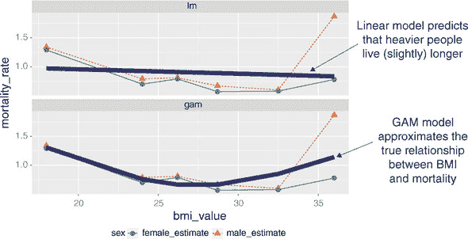

*广义加性模型*（GAMs）是在线性或逻辑模型（或任何其他广义线性模型）框架内对非单调响应进行建模的一种方法。在死亡率示例中，GAM 将尝试找到一个好的“U 形”函数 `s(BMI)`，来描述 BMI 与死亡率之间的关系，如图 图 10.12 所示。GAM 然后将拟合一个函数来根据 `s(BMI)` 预测死亡率。

### 10.2.1\. 理解 GAMs

记住，如果 `y[i]` 是你想要预测的数值量，而 `x[i, ]` 是对应于输出 `y[i]` 的输入行，那么线性回归找到一个函数 `f(x)`，使得

```
f(x[i, ]) = b0 + b[1] * x[i, 1] + b[2] * x[i, 2] + ... b[n] * x[i, n]
```

并且 `f(x[i, ])` 尽可能接近 `y[i]`。

在其最简单形式中，GAM 模型放宽了线性约束，并找到一组函数 `s_i()`（以及一个常数项 `a0`），使得

```
f(x[i,]) = a0 + s_1(x[i, 1]) + s_2(x[i, 2]) + ... s_n(x[i, n])
```

我们也希望 `f(x[i, ])` 尽可能接近 `y[i]`。函数 `s_i()` 是由多项式构建的平滑曲线拟合。这些曲线被称为 *样条*，它们被设计成尽可能接近数据点而不太“扭曲”（不过度拟合）。一个样条拟合的例子在 图 10.13 中展示。

图 10.13\. 通过一系列点拟合的样条

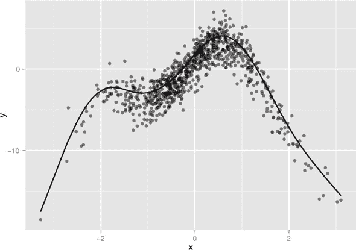

让我们来看一个具体的例子。

### 10.2.2\. 一维回归示例

首先，考虑这个玩具示例。

* * *

示例

*假设你想要将模型拟合到数据中，其中响应* `y` *是输入变量* `x` *的噪声非线性函数*（实际上，它是 图 10.13 中显示的函数）。*

* * *

如同往常，我们将数据分为训练集和测试集。

列表 10.12\. 准备一个人工问题

```
set.seed(602957)

x <- rnorm(1000)
noise <- rnorm(1000, sd = 1.5)

y <- 3 * sin(2 * x) + cos(0.75 * x) - 1.5 * (x²) + noise

select <- runif(1000)
frame <- data.frame(y = y, x = x)

train <- frame[select > 0.1, ]
test <-frame[select <= 0.1, ]
```

由于数据来自非线性函数 `sin()` 和 `cos()`，从 `x` 到 `y` 不应该有一个好的线性拟合。我们将首先构建一个（较差的）线性回归。

列表 10.13\. 将线性回归应用于人工示例

```
lin_model <- lm(y ~ x, data = train)
summary(lin_model)

##
## Call:
## lm(formula = y ~ x, data = train)
##
## Residuals:
##     Min      1Q  Median      3Q     Max
## -17.698  -1.774   0.193   2.499   7.529
##
## Coefficients:
##             Estimate Std. Error t value Pr(>|t|)
## (Intercept)  -0.8330     0.1161  -7.175 1.51e-12 ***
## x             0.7395     0.1197   6.180 9.74e-10 ***
## ---
## Signif. codes:  0 '***' 0.001 '**' 0.01 '*' 0.05 '.' 0.1 ' ' 1
##
## Residual standard error: 3.485 on 899 degrees of freedom
## Multiple R-squared:  0.04075,    Adjusted R-squared:  0.03968
## F-statistic: 38.19 on 1 and 899 DF,  p-value: 9.737e-10

rmse <- function(residuals) {                      ❶
   sqrt(mean(residuals²))
}

train$pred_lin <- predict(lin_model, train)        ❷
resid_lin <- with(train, y - pred_lin)
rmse(resid_lin)
## [1] 3.481091

library(ggplot2)                                   ❸

ggplot(train, aes(x = pred_lin, y = y)) +
  geom_point(alpha = 0.3) +
  geom_abline()
```

❶ 计算残差向量中均方根误差（RMSE）的便利函数

❷ 计算此模型在训练数据上的 RMSE

❸ 绘制 y 与预测值的对比图

结果模型的预测与真实响应在 图 10.14 中绘制。正如预期的那样，这是一个非常差的拟合，R-squared 约为 0.04。特别是，误差 *不是同方差*：存在模型系统性地低估和系统性地高估的区域。如果 `x` 和 `y` 之间的关系确实是线性的（具有独立的噪声），那么误差将是 *同方差*：误差将在预测值周围均匀分布（均值为 0）。

图 10.14\. 线性模型的预测与实际响应。实线是完美预测的线（预测 == 实际）。

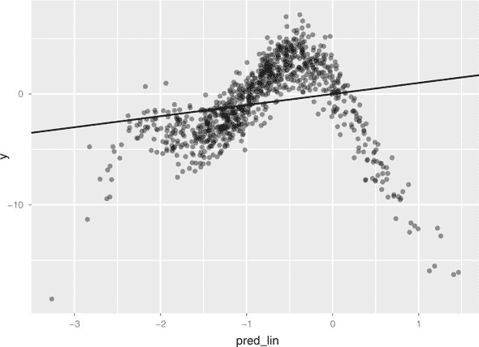

现在尝试找到一个将 `x` 映射到 `y` 的非线性模型。我们将使用 `mgcv` 包中的 `gam()` 函数。^([6]) 当使用 `gam()` 函数时，你可以将变量建模为线性或非线性。通过将变量 `x` 包裹在 `s()` 符号中，你可以将其建模为非线性。在这个例子中，你不会使用公式 `y ~ x` 来描述模型，而是使用公式 `y ~ s(x)`。然后 `gam()` 将搜索最佳样条 `s()` 来描述 `x` 和 `y` 之间的关系，如 代码列表 10.14 所示。只有被 `s()` 包围的项才会接受 GAM/样条处理。

> ⁶
> 
> 有一个名为 `gam` 的旧包，由 GAM 的发明者 Hastie 和 Tibshirani 编写。`gam` 包运行良好。但它与 `mgcv` 包不兼容，而 `ggplot` 已经加载了 `mgcv` 包。由于我们使用 `ggplot` 进行绘图，我们将使用 `mgcv` 作为我们的示例。

列表 10.14\. 将 GAM 应用于人工示例

```
library(mgcv)                                                       ❶
gam_model <- gam(y ~ s(x), data = train)                            ❷
gam_model$converged                                                 ❸
## [1] TRUE

summary(gam_model)

## Family: gaussian                                                 ❹
## Link function: identity
##
## Formula:
## y ~ s(x)
##
## Parametric coefficients:                                         ❺
##             Estimate Std. Error t value Pr(>|t|)
## (Intercept) -0.83467    0.04852   -17.2   <2e-16 ***
## ---
## Signif. codes:  0 '***' 0.001 '**' 0.01 '*' 0.05 '.' 0.1 ' ' 1
##
## Approximate significance of smooth terms:                        ❻
##        edf Ref.df     F p-value
## s(x) 8.685  8.972 497.8  <2e-16 ***
## ---
## Signif. codes:  0 '***' 0.001 '**' 0.01 '*' 0.05 '.' 0.1 ' ' 1
##
## R-sq.(adj) =  0.832   Deviance explained = 83.4%                 ❻
## GCV score =  2.144  Scale est. = 2.121     n = 901

train$pred <- predict(gam_model, train)                             ❽
resid_gam <- with(train, y - pred)
rmse(resid_gam)

## [1] 1.448514

ggplot(train, aes(x = pred, y = y)) +                               ❾
  geom_point(alpha = 0.3) +
  geom_abline()
```

❶ 加载 mgcv 包

❷ 构建模型，指定 x 应被视为非线性变量

❸ 收敛参数告诉你算法是否收敛。只有当此值为 TRUE 时，你才应该相信输出结果。

❹ 设置 family = gaussian 和 link = identity 告诉你模型被处理为与标准线性回归相同的分布假设。

❺ 参数系数是线性项（在这个例子中，只有常数项）。本节总结告诉你哪些线性项与 0 显著不同。

❻ 平滑项是非线性项。本节总结告诉你哪些非线性项与 0 显著不同。它还告诉你构建每个平滑项使用的有效自由度（edf）。edf 接近 1 表示变量与输出有大约线性关系。

❻ R-sq.(adj) 是调整后的 R 平方。 “Deviance explained” 是原始 R 平方（0.834）。

❽ 计算此模型在训练数据上的 RMSE

❾ 绘制 y 与预测值的对比图

结果模型的预测值与真实响应值在 图 10.15 中进行对比。这个拟合效果要好得多：模型解释了超过 80% 的方差（R 平方为 0.83），并且在训练数据上的均方根误差（RMSE）小于线性模型的 RMSE 的一半。注意，图 10.15 中的点在大约均匀地分布在完美预测线的周围。GAM 被拟合为同方差，任何给定的预测值作为高估或低估的可能性相同。

图 10.15\. GAM 的预测值与实际响应值。实线是理论上的完美预测线（预测值等于实际值）。

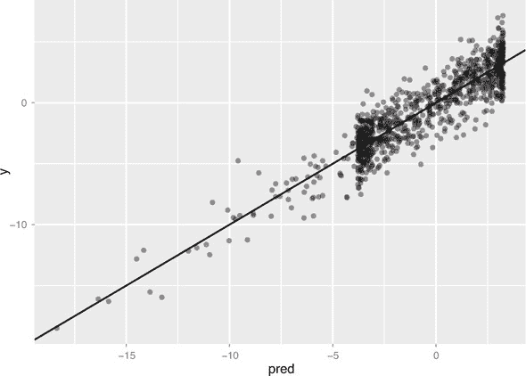

* * *

**使用 gam() 建模线性关系**

默认情况下，`gam()`将执行标准线性回归。如果你用公式`y ~ x`调用`gam()`，你会得到与使用`lm()`相同的结果。更普遍地，调用`gam(y ~ x1 + s(x2), data=...)`将变量`x1`建模为与`y`有线性关系，并尝试拟合最佳可能的平滑曲线来建模`x2`与`y`之间的关系。当然，最佳平滑曲线可能是一条直线，所以如果你不确定`x`与`y`之间的关系是否线性，你可以使用`s(x)`。如果你看到系数有一个`edf`（有效自由度——参见模型摘要列表 10.14），那么你可以尝试将变量重新拟合为线性项。

* * *

使用样条曲线为 GAM 提供了更丰富的模型空间来选择；这种增加的灵活性带来了更高的过拟合风险。你还应该检查模型在测试数据上的性能。

列表 10.15\. 比较线性回归和 GAM 性能

```
test <- transform(test,                                  ❶
                  pred_lin = predict(lin_model, test),
                  pred_gam = predict(gam_model, test) )

test <- transform(test,                                  ❷
                  resid_lin = y - pred_lin,
                  resid_gam = y - pred_gam)

rmse(test$resid_lin)                                     ❸
## [1] 2.792653

rmse(test$resid_gam)
## [1] 1.401399

library(sigr)                                            ❹
 wrapFTest(test, "pred_lin", "y")$R2
## [1] 0.115395
wrapFTest(test, "pred_gam", "y")$R2
## [1] 0.777239
```

❶ 从两个模型在测试数据上获取预测值。函数`transform()`是 dplyr::mutate()的基础 R 版本。

❷ 计算残差

❸ 在测试数据上比较两个模型的均方根误差（RMSE）

❹ 使用 sigr 包在测试数据上比较两个模型的 R 平方

GAM 在训练集和测试集上的表现相似：测试集上的 RMSE 为 1.40，训练集上的 RMSE 为 1.45；测试集上的 R 平方为 0.78，训练集上的 R 平方为 0.83。所以很可能没有过拟合。

### 10.2.3\. 提取非线性关系

一旦你拟合了一个广义可加模型（GAM），你可能会对`s()`函数的形状感兴趣。在 GAM 上调用`plot()`将为你提供每个`s()`曲线的图表，这样你可以可视化非线性。在我们的例子中，`plot(gam_model)`生成了图 10.16 中的顶部曲线。

图 10.16\. 顶部：`gam()`发现的非线性函数`s(PWGT)`，由`plot(gam_model)`输出。底部：相同的样条曲线叠加在训练数据上。

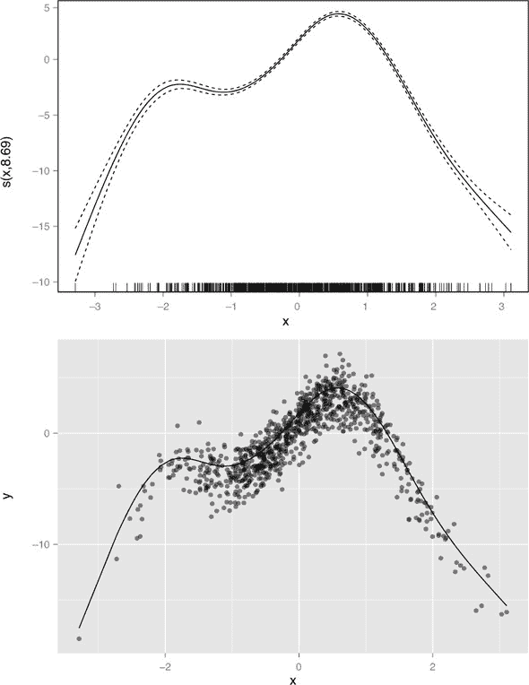

曲线的形状与我们看到的图 10.13（作为图 10.16 的下半部分重现）非常相似。实际上，图 10.13 中散点图上叠加的样条曲线与同一曲线相同。

你可以通过使用`predict()`函数并带有`type = "terms"`参数来提取用于制作此图的点。这将产生一个矩阵，其中第*i*列代表`s(x[,i])`。以下列表演示了如何重现图 10.16 中的下部分图。

列表 10.16\. 从 GAM 中提取学习样条

```
sx <- predict(gam_model, type = "terms")
summary(sx)
##       s(x)
##  Min.   :-17.527035
##  1st Qu.: -2.378636
##  Median :  0.009427
##  Mean   :  0.000000
##  3rd Qu.:  2.869166
##  Max.   :  4.084999

xframe <- cbind(train, sx = sx[,1])

ggplot(xframe, aes(x = x)) +
     geom_point(aes(y = y), alpha = 0.4) +
     geom_line(aes(y = sx))
```

现在你已经完成了一个简单的例子，你就可以尝试一个包含更多变量的更现实的例子了。

### 10.2.4\. 在实际数据上使用 GAM

* * *

示例

*假设你想根据多个变量预测一个新生儿的体重（*`DBWT`*）：*

+   *母亲的体重（`PWGT`*）

+   *母亲的孕期体重增加（`WTGAIN`*）

+   *母亲的年龄（`MAGER`*）

+   *产前医疗访问次数（`UPREVIS`*）

* * *

对于这个例子，你将使用 2010 年 CDC 出生数据集中你用过的数据第 7.2 节（尽管这不是该章节中使用的风险数据）。^([7）请注意，我们选择这个例子是为了突出`gam()`的机制，而不是为了找到最佳出生体重模型。除了我们选择的四个变量之外，添加其他变量将提高拟合度，但会模糊说明。

> ⁷
> 
> 数据集可在[`github.com/WinVector/PDSwR2/blob/master/CDC/NatalBirthData.rData`](https://github.com/WinVector/PDSwR2/blob/master/CDC/NatalBirthData.rData)找到。从原始 CDC 提取准备数据集的脚本可在[`github.com/WinVector/PDSwR2/blob/master/CDC/prepBirthWeightData.R`](https://github.com/WinVector/PDSwR2/blob/master/CDC/prepBirthWeightData.R)找到。

在下一个列表中，你将拟合一个线性模型和一个 GAM，并进行比较。

列表 10.17\. 将线性回归（带 GAM 和不带 GAM）应用于健康数据

```
library(mgcv)
library(ggplot2)
load("NatalBirthData.rData")
train <- sdata[sdata$ORIGRANDGROUP <= 5, ]
test <- sdata[sdata$ORIGRANDGROUP > 5, ]

form_lin <- as.formula("DBWT ~ PWGT + WTGAIN + MAGER + UPREVIS")
linmodel <- lm(form_lin, data = train)                             ❶

summary(linmodel)

## Call:
## lm(formula = form_lin, data = train)
##
## Residuals:
##      Min       1Q   Median       3Q      Max
## -3155.43  -272.09    45.04   349.81  2870.55
##
## Coefficients:
##              Estimate Std. Error t value Pr(>|t|)
## (Intercept) 2419.7090    31.9291  75.784  < 2e-16 ***
## PWGT           2.1713     0.1241  17.494  < 2e-16 ***
## WTGAIN         7.5773     0.3178  23.840  < 2e-16 ***
## MAGER          5.3213     0.7787   6.834  8.6e-12 ***
## UPREVIS       12.8753     1.1786  10.924  < 2e-16 ***
## ---
## Signif. codes:  0 '***' 0.001 '**' 0.01 '*' 0.05 '.' 0.1 ' ' 1
##
## Residual standard error: 562.7 on 14381 degrees of freedom
## Multiple R-squared:  0.06596,    Adjusted R-squared:  0.0657    ❷
## F-statistic: 253.9 on 4 and 14381 DF,  p-value: < 2.2e-16
form_gam <- as.formula("DBWT ~ s(PWGT) + s(WTGAIN) +
                        s(MAGER) + s(UPREVIS)")
gammodel <- gam(form_gam, data = train)                            ❸
gammodel$converged                                                 ❹
## [1] TRUE

summary(gammodel)

##
## Family: gaussian
## Link function: identity
##
## Formula:
## DBWT ~ s(PWGT) + s(WTGAIN) + s(MAGER) + s(UPREVIS)
##
## Parametric coefficients:
##             Estimate Std. Error t value Pr(>|t|)
## (Intercept) 3276.948      4.623   708.8   <2e-16 ***
## ---
## Signif. codes:  0 '***' 0.001 '**' 0.01 '*' 0.05 '.' 0.1 ' ' 1
##
## Approximate significance of smooth terms:
##              edf Ref.df       F  p-value
## s(PWGT)    5.374  6.443  69.010  < 2e-16 ***
## s(WTGAIN)  4.719  5.743 102.313  < 2e-16 ***
## s(MAGER)   7.742  8.428   7.145 1.37e-09 ***
## s(UPREVIS) 5.491  6.425  48.423  < 2e-16 ***
## ---
## Signif. codes:  0 '***' 0.001 '**' 0.01 '*' 0.05 '.' 0.1 ' ' 1
##
## R-sq.(adj) =  0.0927   Deviance explained = 9.42%               ❺
## GCV = 3.0804e+05  Scale est. = 3.0752e+05  n = 14386
```

❶ 使用四个变量构建线性模型

❷ 该模型解释了大约 6.6%的方差；所有系数均与 0 有显著差异。

❸ 使用相同的变量构建 GAM

❹ 验证模型已收敛

❺ 模型解释了略超过 9%的方差；所有变量都有与 0 显著不同的非线性效应。

GAM 提高了拟合度，所有四个变量似乎与出生体重有非线性关系，正如`edf`值都大于 1 所证明的。你可以使用`plot(gammodel)`来检查`s()`函数的形状；相反，让我们将它们与每个变量对母亲体重的直接平滑曲线进行比较。

列表 10.18\. 绘制 GAM 结果

```
terms <- predict(gammodel, type = "terms")               ❶
terms <- cbind(DBWT = train$DBWT, terms)                 ❷

tframe <- as.data.frame(scale(terms, scale = FALSE))     ❸
colnames(tframe) <- gsub('[()]', '', colnames(tframe))   ❹

vars = c("PWGT", "WTGAIN", "MAGER", "UPREVIS")
pframe <- cbind(tframe, train[, vars])                   ❺

ggplot(pframe, aes(PWGT)) +                              ❻
  geom_point(aes(y = sPWGT)) +
  geom_smooth(aes(y = DBWT), se = FALSE)

# [...]                                                  ❻
```

❶ 获取`s()`函数的矩阵

❷ 绑定出生体重（`DBWT`）

❸ 将所有列移至零均值（以便比较）；转换为数据框

❹ 使列名便于引用（s(PWGT)转换为 sPWGT 等）

❺ 绑定输入变量

❻ 将样条 s(PWGT)与 DBWT（婴儿体重）作为母亲体重（`PWGT`）的函数的平滑曲线进行比较

❻ 对剩余变量重复操作（为简洁起见省略）

图 10.17 显示了`gam()`学习的`s()`样条曲线，这些曲线以虚线表示。这些样条曲线是`gam()`对每个变量与结果（`DBWT`）之间（联合）关系的估计。样条的总和（加上偏移量）是模型对`DBWT`作为输入变量的函数的最佳估计。

图 10.17\. 四个输入变量对出生体重的平滑曲线，与`gam()`发现的样条进行比较。所有曲线都已移至零均值，以便比较形状。

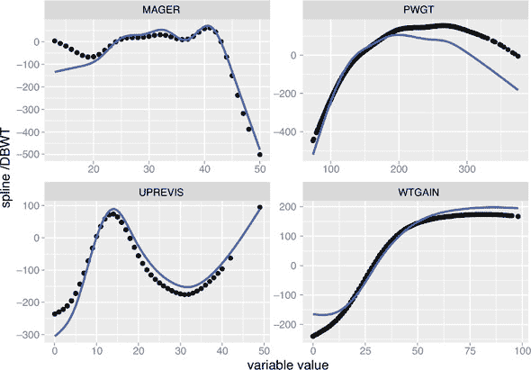

图表还显示了直接与`DBWT`相关的平滑曲线。每个案例中的平滑曲线在形状上类似于相应的`s()`，并且对所有变量都是非线性的。形状上的差异是因为样条曲线是联合拟合的（这对建模更有用），而平滑曲线是单独计算的。

与往常一样，您应该使用保留数据来检查过拟合。

列表 10.19\. 在保留数据上检查 GAM 模型性能

```
test <- transform(test,                                 ❶
                  pred_lin = predict(linmodel, test),
                  pred_gam = predict(gammodel, test) )

test <- transform(test,                                 ❷
                  resid_lin = DBWT - pred_lin,
                  resid_gam = DBWT - pred_gam)

rmse(test$resid_lin)                                    ❸
## [1] 566.4719

rmse(test$resid_gam)
## [1] 558.2978

wrapFTest(test, "pred_lin", "DBWT")$R2                  ❹
## [1] 0.06143168

wrapFTest(test, "pred_gam", "DBWT")$R2
## [1] 0.08832297
```

❶ 获取测试数据上两个模型的预测

❷ 获取残差

❸ 在测试数据上比较了两个模型的 RMSE

❹ 在测试数据上比较了两个模型的 R-squared 值，使用 sigr

在测试集上，线性模型和 GAM 的性能相似，与训练集上相似，因此在这个例子中，没有实质性的过拟合。

### 10.2.5\. 使用 GAM 进行逻辑回归

`gam()`函数也可以用于逻辑回归。

* * *

示例

*假设您想预测婴儿何时会出生体重不足（定义为`DBWT < 2000`*），使用与先前场景相同的输入变量。*

* * *

执行此操作的逻辑回归调用在以下列表中显示。

列表 10.20\. GLM 逻辑回归

```
form <- as.formula("DBWT < 2000 ~ PWGT + WTGAIN + MAGER + UPREVIS")
logmod <- glm(form, data = train, family = binomial(link = "logit"))
```

对应的`gam()`调用还指定了二项式族和`logit`连接。

列表 10.21\. GAM 逻辑回归

```
form2 <- as.formula("DBWT < 2000 ~ s(PWGT) + s(WTGAIN) +
                                              s(MAGER) + s(UPREVIS)")
glogmod <- gam(form2, data = train, family = binomial(link = "logit"))
glogmod$converged
## [1] TRUE

summary(glogmod)
## Family: binomial
## Link function: logit
##
## Formula:
## DBWT < 2000 ~ s(PWGT) + s(WTGAIN) + s(MAGER) + s(UPREVIS)
##
## Parametric coefficients:
##             Estimate Std. Error z value Pr(>|z|)
## (Intercept) -3.94085    0.06794     -58   <2e-16 ***
## ---
## Signif. codes:  0 '***' 0.001 '**' 0.01 '*' 0.05 '.' 0.1 ' ' 1
##
## Approximate significance of smooth terms:
##              edf Ref.df  Chi.sq  p-value
## s(PWGT)    1.905  2.420   2.463  0.36412                 ❶
## s(WTGAIN)  3.674  4.543  64.426 1.72e-12 ***
## s(MAGER)   1.003  1.005   8.335  0.00394 **
## s(UPREVIS) 6.802  7.216 217.631  < 2e-16 ***
## ---
## Signif. codes:  0 '***' 0.001 '**' 0.01 '*' 0.05 '.' 0.1 ' ' 1
##
## R-sq.(adj) =  0.0331   Deviance explained = 9.14%        ❷
## UBRE score = -0.76987  Scale est. = 1         n = 14386
```

❶ 注意与母亲体重（PGWT）相关的大 p 值。这意味着没有统计证据表明母亲的体重（PWGT）对结果有显著影响。

❷ “偏差解释”是伪 R-squared：1 - (偏差/空偏差)。

与标准逻辑回归调用一样，我们通过调用`predict(glogmodel, newdata = train, type = "response")`恢复类别概率。同样，这些模型的质量较低，在实践中，我们会寻找更多解释变量来构建更好的筛选模型。

### 10.2.6\. GAM 要点

关于 GAMs，您应该记住以下几点：

+   GAMs 让您能够在线性或逻辑回归框架中表示变量和结果之间的非线性和非单调关系。

+   在`mgcv`包中，您可以使用`predict()`函数和`type = "terms"`参数从 GAM 模型中提取发现的关系。

+   您可以使用与标准线性或逻辑回归相同的指标来评估 GAM：残差、偏差、R-squared 和伪 R-squared。`gam()`摘要还提供了哪些变量对模型有显著影响的指示。

+   由于与标准线性或逻辑回归模型相比，GAMs 具有更高的复杂性，因此存在更大的过拟合风险。

GAMs 通过允许变量对结果产生非线性（甚至非单调）影响来扩展线性方法（以及广义线性方法）。另一种方法是通过对现有变量的非线性*组合*形成新的变量。数据科学家可以通过手动添加交互作用或新的合成变量来完成这项工作，或者可以通过支持向量机（SVMs）机械地完成，如下一节所示。希望有了足够多的这些新变量，你的建模问题就会变得更容易。

在下一节中，我们将探讨两种最流行的方法来添加和管理新变量：*核方法*和*支持向量机*。

## 10.3. 使用支持向量机解决“不可分”问题

一些分类问题被称为*不可分*：类 A 的实例位于由类 B 定义的区域内，因此类 A 不能通过一个平坦的边界与类 B 分开。例如，在图 10.18 中，我们看到许多 o 位于由 x 定义的三角形内部（我们也看到数据通过所谓的核函数`phi()`转换成了一个很好的可分离排列）。左侧的原始排列是*线性不可分*：没有超平面可以将 x 与 o 分开。因此，线性方法完全分离这两个类是不可能的。我们可以使用第 10.1 节中展示的基于树的模型来拟合分类器，或者我们可以使用一种称为*核方法*的技术。在本节中，我们将使用 SVMs 和核方法在线性不可分数据上构建良好的分类器。

图 10.18. 核变换的概念图（基于 Cristianini 和 Shawe-Taylor，2000）

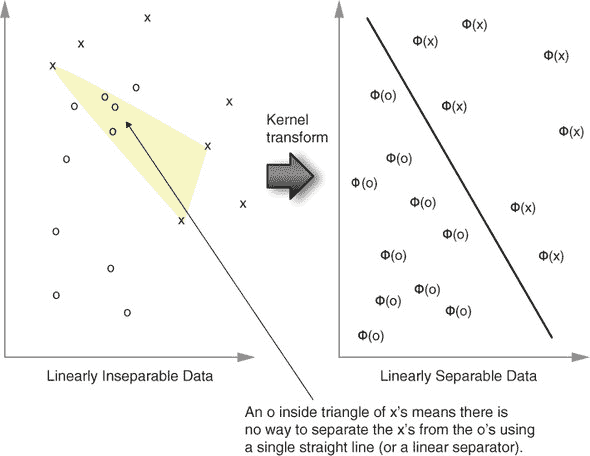

* * *

**有多种方法可以完成事情**

在这一点上，我们已经看到了许多高级方法，它们为我们提供了处理复杂问题的多种方式。例如：随机森林、提升和 SVMs 都可以引入变量交互来解决问题。如果总有一种明显最好的方法那会很好。然而，每种方法对于不同的问题都可能占主导地位。因此，没有一种最好的方法。

我们的建议是首先尝试简单的方法，如线性回归和逻辑回归。然后引入并尝试高级方法，如 GAMs（可以处理单变量重塑）、基于树的模型（可以处理多变量交互）和 SVMs（可以处理多变量重塑）来解决建模问题。

* * *

### 10.3.1. 使用 SVM 解决问题

让我们从 R 的`kernlab`库文档中改编的一个例子开始。学习分离两个螺旋是一个著名的“不可能”问题，线性方法无法解决（尽管可以通过谱聚类、核方法、SVMs、深度学习或深度神经网络来解决）。

* * *

示例

*图 10.19 显示了两个螺旋，一个在另一个内部。你的任务是构建一个决策过程，将平面切割成两个区域，使得 1 标记的例子在一个区域，2 标记的例子在互补区域。*^([8])

> ⁸
> 
> 参见 K. J. Lang 和 M. J. Witbrock 在 1988 年连接主义模型夏季学校的论文“学会区分两个螺旋”，D. Touretzky, G. Hinton, 和 T. Sejnowski（编），Morgan Kaufmann，1988（第 52-59 页）。

* * *

支持向量机在学习和“相邻的例子应该给予相同的分类”形式的概念方面表现出色。为了使用 SVM 技术，用户必须选择一个核（以控制“近”或“远”的定义），并选择一个超参数`C`或`nu`的值（以尝试控制模型复杂度）。

螺旋示例

列表 10.22 展示了图 10.19 中显示的两个螺旋的恢复和标记。你将使用标记的数据进行示例任务：给定标记数据，通过监督机器学习恢复 1 与 2 的区域。

图 10.19\. 螺旋反例

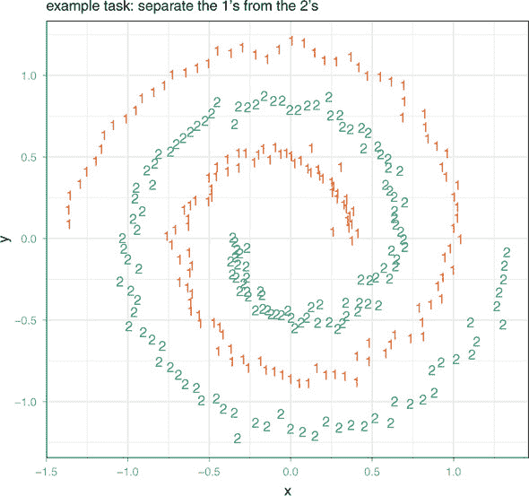

列表 10.22\. 将螺旋数据设置为分类问题

```
library('kernlab')
data(spirals)                                               ❶
 sc <- specc(spirals, centers = 2)                          ❷
 s <- data.frame(x = spirals[, 1], y = spirals[, 2],        ❸
    class = as.factor(sc))

library('ggplot2')
ggplot(data = s) +                                          ❹
                geom_text(aes(x = x, y = y,
                label = class, color = class)) +
  scale_color_manual(values = c("#d95f02", "#1b9e77")) +
  coord_fixed() +
  theme_bw() +
  theme(legend.position  = 'none') +
  ggtitle("example task: separate the 1s from the 2s")
```

❶ 加载 kernlab 核和 SVM 包，并要求提供包含的示例螺旋

❷ 使用 kernlab 的谱聚类程序识别示例数据集中的两个不同螺旋

❸ 将螺旋坐标和螺旋标签合并到一个数据框中

❹ 绘制带有类别标签的螺旋

图 10.19 展示了标记的螺旋数据集。两种数据类别（用数字表示）被安排在两个交织的螺旋中。这个数据集对于没有足够丰富概念空间（感知器、浅层神经网络）的方法来说很难，但对于可以引入正确新特征的更复杂的学习者来说很容易。使用正确核的支持向量机是一种引入新组合特征以解决问题的方式。

使用过简单核的支持向量机

支持向量机功能强大，但没有正确的核，它们在处理某些概念（如螺旋示例）时会有困难。列表 10.23 展示了使用恒等或点积（线性）核尝试使用 SVM 学习螺旋概念的失败尝试。线性核不对数据进行变换；它可以适用于某些应用，但在这个情况下，它没有给我们想要的数据分离特性。

列表 10.23\. 使用核选择不当的 SVM

```
set.seed(2335246L)
s$group <- sample.int(100, size = dim(s)[[1]], replace = TRUE)
sTrain <- subset(s, group > 10)
sTest <- subset(s,group <= 10)                                             ❶

library('e1071')
mSVMV <- svm(class ~ x + y, data = sTrain, kernel = 'linear', type =
'nu-classification')                                                  ❷
 sTest$predSVMV <- predict(mSVMV, newdata = sTest, type = 'response')      ❸

shading <- expand.grid(                                                    ❹
  x = seq(-1.5, 1.5, by = 0.01),
  y = seq(-1.5, 1.5, by = 0.01))
shading$predSVMV <- predict(mSVMV, newdata = shading, type = 'response')

ggplot(mapping = aes(x = x, y = y)) +                                      ❺
  geom_tile(data = shading, aes(fill = predSVMV),
            show.legend = FALSE, alpha = 0.5) +
  scale_color_manual(values = c("#d95f02", "#1b9e77")) +
  scale_fill_manual(values = c("white", "#1b9e77")) +
  geom_text(data = sTest, aes(label = predSVMV),
            size = 12) +
  geom_text(data = s, aes(label = class, color = class),
            alpha = 0.7) +
  coord_fixed() +
  theme_bw() +
  theme(legend.position = 'none') +
  ggtitle("linear kernel")
```

❶ 准备使用 SVM 从坐标中学习螺旋类别标签

❷ 使用 vanilladot 核（不是一个很好的核）构建支持向量模型

❸ 使用模型对保留数据预测类别

❹ 在点网格上调用模型以生成表示学习概念的背景阴影

❺ 在所有数据的灰色副本上绘制预测，以便我们可以看到预测是否与原始标记一致

这次尝试的结果是图 10.20。图中以小字体显示了整个数据集，以大字体显示了测试数据集的 SVM 分类。它还通过阴影指示了学习到的概念。SVM 没有使用标识核产生一个好的模型，因为它被迫选择线性分离器。在下文中，你将使用高斯径向核重复这个过程，并得到更好的结果。

图 10.20\. 标识核无法学习螺旋概念

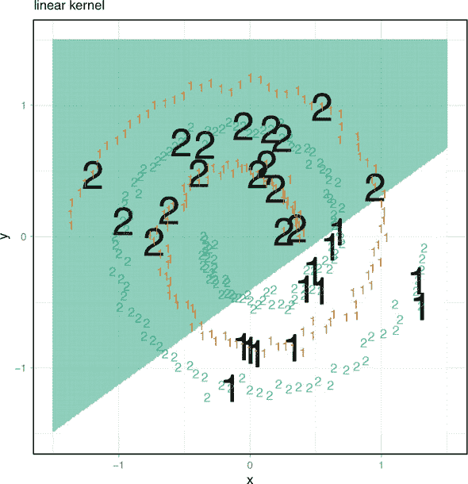

具有良好核的支持向量机

在列表 10.24 中，你将重复 SVM 拟合过程，但这次指定高斯或径向核。图 10.21 再次以黑色（整个数据集以较小的字体显示）绘制了 SVM 测试分类。注意这次算法正确地学习了实际的螺旋概念，如阴影所示。

图 10.21\. 径向核成功学习螺旋概念


列表 10.24\. 选择良好核的 SVM

```
mSVMG <- svm(class ~ x + y, data = sTrain, kernel = 'radial', type =
'nu-classification')                                               ❶
sTest$predSVMG <- predict(mSVMG, newdata = sTest, type = 'response')

shading <- expand.grid(
  x = seq(-1.5, 1.5, by = 0.01),
  y = seq(-1.5, 1.5, by = 0.01))
shading$predSVMG <- predict(mSVMG, newdata = shading, type = 'response')

ggplot(mapping = aes(x = x, y = y)) +
  geom_tile(data = shading, aes(fill = predSVMG),
            show.legend = FALSE, alpha = 0.5) +
  scale_color_manual(values = c("#d95f02", "#1b9e77")) +
  scale_fill_manual(values = c("white", "#1b9e77")) +
  geom_text(data = sTest, aes(label = predSVMG),
            size = 12) +
  geom_text(data = s,aes(label = class, color = class),
            alpha = 0.7) +
  coord_fixed() +
  theme_bw() +
  theme(legend.position = 'none') +
  ggtitle("radial/Gaussian kernel")
```

❶ 这次使用“径向”或高斯核，这是一个很好的几何距离度量

* * *

练习：尝试使用 xgboost 解决螺旋问题。

*正如我们所说的，一些方法在某些问题上比其他方法更有效。尝试使用* `xgboost` *包解决螺旋问题。你发现`xgboost`的结果比 SVM 的结果更好还是更差？（这个示例的工作版本可以在以下位置找到：[`github.com/WinVector/PDSwR2/tree/master/Spirals`](https://github.com/WinVector/PDSwR2/tree/master/Spirals)。)*

* * *

### 10.3.2\. 理解支持向量机

支持向量机通常被描绘成一个使分类变得更容易的魔法机器。9 为了消除敬畏并能够自信地使用支持向量方法，我们需要花些时间学习它们的原则和它们是如何工作的。直觉是这样的：*具有径向核的支持向量机是非常好的近邻式分类器*。

> ⁹
> 
> 支持向量机也可以用于回归，但这里我们不会涉及。

在图 10.22 中，在“真实空间”（左侧），数据通过非线性边界分离。当数据提升到更高维的核空间（右侧）时，提升的点通过超平面分离。让我们称该超平面的法线为`w`，从原点偏移为`b`（未显示）。

图 10.22\. SVM 的概念性说明

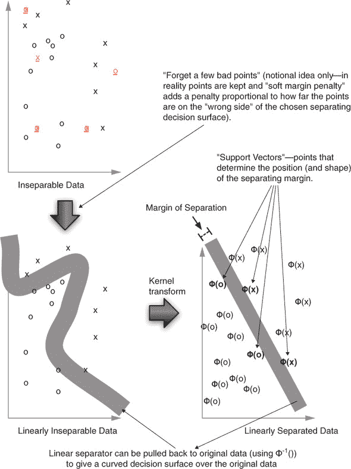

SVM 找到一个线性决策函数（由参数`w`和`b`确定），对于给定的示例`x`，机器决定`x`属于该类，如果

```
w %*% phi(x) + b >= 0
```

对于某些`w`和`b`，否则不在该类中。该模型完全由函数`phi()`、向量`w`和标量偏移`b`确定。其想法是`phi()`将数据提升或重塑到更合适的空间（其中事物是线性可分的），然后 SVM 在这个新空间中找到分离两个数据类的线性边界（由`w`和`b`表示）。这个提升空间中的线性边界可以拉回到原始空间中的通用曲线边界。这个原理在图 10.22 中进行了概述。

支持向量训练操作找到`w`和`b`。SVM 有变体可以在多于两个类别之间做出决策，执行评分/回归，并检测新颖性。但我们将只讨论用于简单分类的 SVM。

作为 SVM 的用户，你不必立即了解训练过程是如何工作的；这是软件为你做的。但你确实需要有一些关于它试图做什么的概念。模型`w,b`理想地选择，以便

```
w %*% phi(x) + b >= u
```

对于所有在类中的训练`x`。

```
w %*% phi(x) + b <= v
```

对于所有不在该类中的训练示例。

如果`u > v`，则数据被称为*可分*。分离的大小是`(u - v) / sqrt(w %*% w)`，称为*间隔*。SVM 优化器的目标是最大化间隔。实际上，较大的间隔可以确保对未来数据的良好行为（良好的泛化性能）。在实践中，即使存在核，真实数据也不总是可分的。为了解决这个问题，大多数 SVM 实现都实现了所谓的*软间隔*优化目标。

软间隔优化器添加额外的误差项，这些误差项用于允许有限比例的训练示例位于决策表面的错误一侧。10] 模型实际上并不擅长处理这些修改后的训练示例，但它将这些示例上的误差与剩余训练示例上的间隔增加进行权衡。对于大多数实现，模型超参数`C`或`nu`决定了剩余数据的间隔宽度和为了实现间隔而推来推去的数据量之间的权衡。我们将使用`nu`超参数。`nu`的设置在零和一之间；较低的值允许更少的训练错误分类，有利于更复杂的模型（更多的支持向量）。11] 对于我们的示例，我们将只使用函数默认值：`0.5`。

> ^([10](https://example.org))
> 
> 在任何核下都不可分的一种常见数据集是至少有两个示例属于不同结果类，并且所有输入或`x`变量的值都完全相同的数据集。原始的“硬间隔”SVM 无法处理这类数据，因此被认为不实用。
> 
> ^([11](https://example.org))
> 
> 关于 SVM 的更多详细信息，我们推荐 Cristianini 和 Shawe-Taylor 的 *支持向量机及其他基于核的学习方法导论*，剑桥大学出版社，2000 年。

### 10.3.3\. 理解核函数

SVM 选择哪些数据是不重要的（被排除在外）以及哪些数据非常重要（用作支持向量）。但实际上，将问题重塑以使数据可分是由所谓的 *核方法* 或 *核函数* 来执行的。

图 10.22 展示了^([12]) 我们希望从好的核函数中得到的结果：我们的数据被推来推去，使其更容易排序或分类。通过使用核变换，我们进入一个这样的状态，即我们试图学习的区别可以通过我们变换后的数据的线性分离器来表示。

> ¹²
> 
> Cristianini 和 Shawe-Taylor，*支持向量机及其他基于核的学习方法导论*。

为了开始理解 SVM，我们需要快速查看 SVM 和核方法用户应该熟悉的常见数学和术语。首先是核函数的概念，它用于实现我们看到的重塑空间的 `phi()`。

核函数的正式定义

在我们的应用中，核是一个具有非常特定定义的函数。令 `u` 和 `v` 为任意一对变量。`u` 和 `v` 通常是从数据集的两行中选取的输入或独立变量的向量（可能是）。一个将 `(u,v)` 对映射到数字的函数 `k(,)` 被称为 *核函数*，当且仅当存在一个将 `(u,v)` 映射到向量空间的函数 `phi()`，使得对于所有 `u,v`，有 `k(u,v) = phi(u) %*% phi(v)`。^([13]) 我们将非正式地将表达式 `k(u,v) = phi(u) %*% phi(v)` 称为核的 *Mercer 展开*（参考 Mercer 定理；见 [`mng.bz/xFD2`](http://mng.bz/xFD2)），并将 `phi()` 视为告诉我们 `k(,)` 是一个好的核的证明。这可以通过具体的例子更容易理解。在下面的列表中，我们展示了等价的 `phi()` / `k(,)` 对。

> ¹³
> 
> `%*%` 是 R 的点积或内积的表示；有关详细信息，请参阅 `help('%*%')`。请注意，`phi()` 可以映射到非常大的（甚至无限的）向量空间。

列表 10.25\. 一个人工核函数示例

```
u <- c(1, 2)
v <- c(3, 4)
k <- function(u, v) {                   ❶
      u[1] * v[1] +
        u[2] * v[2] +
        u[1] * u[1] * v[1] * v[1] +
        u[2] * u[2] * v[2] * v[2] +
        u[1] * u[2] * v[1] * v[2]
  }
phi <- function(x) {                    ❷
      x <- as.numeric(x)
     c(x, x*x, combn(x, 2, FUN = prod))
  }
print(k(u, v))                          ❸
 ## [1] 108
print(phi(u))
## [1] 1 2 1 4 2
print(phi(v))
## [1]  3  4  9 16 12
print(as.numeric(phi(u) %*% phi(v)))    ❹
 ## [1] 108
```

❶ 定义一个关于两个向量变量（都是二维的）的函数，作为各种项乘积的总和

❷ 定义一个关于单个向量变量的函数，该函数返回一个包含原始条目以及所有条目乘积的向量

❸ k(,) 的示例评估

❹ 确认 phi() 与 k(,) 一致。phi() 是一个证明，表明 k(,) 实际上是一个核函数。

大多数核方法直接使用函数 `k(,)`，并且只使用由匹配的 `phi()` 保证的 `k(,)` 的性质来确保方法正确性。`k(,)` 函数通常比理论上的函数 `phi()` 更快计算。一个简单的例子是我们所说的文档的 *点积相似性*。点积文档相似性定义为两个向量的点积，其中每个向量都是通过构建一个由指示器组成的大向量从文档中导出的，每个指示器对应一个可能的特征。例如，如果你考虑的特征是词对，那么对于给定字典中的每一对单词，如果这对单词在文档中作为连续的表述出现，则文档获得特征值 1，如果没有出现，则获得 0。这种方法是 `phi()`，但在实践中我们从不使用 `phi()` 程序。相反，当比较两个文档时，一个文档中连续的每一对单词都会生成，如果这对单词在字典中并且也在另一个文档中连续出现，则会添加一些分数。对于中等大小的文档和大型字典，这种直接的 `k(,)` 实现比 `phi()` 实现效率高得多。

支持向量

支持向量机得名于向量 `w` 通常的表示方式：作为训练示例的线性组合——支持向量。回想一下，我们在 第 10.3.3 节 中提到，函数 `phi()` 原则上可以映射到一个非常大的或甚至是无限的向量空间。这意味着可能无法直接写出 `w`。

支持向量机通过限制 `w` 为原则上为 `phi()` 项之和来绕过“无法写出 `w`”的问题，如下所示：

```
w = sum(a1 * phi(s1), ... , am * phi(sm))
```

向量 `s1, ..., sm` 实际上是 `m` 个训练示例，被称为支持向量。前面的公式之所以有用，是因为这样的和（通过一些数学运算）等同于我们接下来展示的形式的 `k( ,x)` 内核项的和：

```
w %*% phi(x) + b = sum(a1 * k(s1, x),... , am * k(sm, x)) + b
```

右边是一个我们可以计算的数量。

支持向量训练算法的工作是选择向量 `s1, ..., sm`，标量 `a1, ..., am`，以及偏移 `b`。所有这些都称为“核技巧”。

* * *

关于支持向量模型需要记住的内容

支持向量模型由以下这些组成：

+   一个 *核* `phi()`，它重塑空间（由用户选择）

+   一组称为 *支持向量* 的训练数据示例（由 SVM 算法选择）

+   一组标量 `a1, ..., am`，这些标量指定了支持向量定义的分离表面的线性组合（由 SVM 算法选择）

+   一个与之一比较的标量阈值 `b`（由 SVM 算法选择）

* * *

数据科学家必须了解支持向量的原因在于它们存储在支持向量模型中。例如，如果模型过于复杂，可能会有非常多的支持向量，导致模型变得很大且评估成本高昂。在最坏的情况下，模型中的支持向量数量几乎可以与训练示例的数量相当，使得支持向量模型的评估可能像最近邻评估一样昂贵，并增加了过拟合的风险。用户通过交叉验证选择一个良好的 `C` 或 `nu` 值来选择一个良好的支持向量数量。

* * *

练习：在螺旋问题中尝试不同的 `nu` 值。

*`nu` 是 SVM 的重要超参数。理想情况下，我们应该对 `nu` 的一个良好值进行交叉验证。而不是进行完整的交叉验证，只需尝试几个 `nu` 的值来获取景观。（我们在这里有一个解决方案：[`github.com/WinVector/PDSwR2/tree/master/Spirals`](https://github.com/WinVector/PDSwR2/tree/master/Spirals)）。*

* * *

### 10.3.4\. 支持向量机和核方法要点

这里是你应该记住的这部分内容：

+   支持向量机是一种基于核的分类方法，其中复杂的分离表面是通过训练示例的（可能非常大的）子集（称为支持向量）来参数化的。

+   “核技巧”的目标是将数据提升到一个数据可分的空间，或者可以直接使用线性方法的空间。当问题具有适中的变量数量，并且数据科学家怀疑要建模的关系是变量效应的非线性组合时，支持向量机和核方法效果最佳。

## 摘要

在本章中，我们展示了处理基本建模方法特定问题的某些高级方法：建模方差、建模偏差、非线性问题和变量交互问题。我们希望有时间触及的一个重要附加方法系列是 *深度学习*，这是神经网络现代改进处理。幸运的是，已经有了一本关于这个主题的好书可以推荐：*使用 R 进行深度学习*，作者为 François Chollet 和 J. J. Allaire，Manning，2018 年。

你应该理解，你引入高级方法和技术来解决特定的建模问题，并不是因为它们有异国情调的名字或激动人心的历史。我们也认为，在构建自己的定制技术之前，你应该至少尝试找到一种现有的技术来解决你怀疑隐藏在数据中的问题；通常，现有的技术已经包含了大量的调整和智慧。哪种方法最好取决于数据，并且有众多高级方法可以尝试。高级方法可以帮助解决过拟合、变量交互、非加性关系和不平衡分布，但不能解决特征或数据不足的问题。

最后，学习高级技术理论的目标不是能够背诵常见实现的步骤，而是要知道何时应用这些技术以及它们代表了什么权衡。数据科学家需要提供思考和判断，并认识到平台可以提供实现。

在本章中，你学习了

+   如何通过捆绑决策树来稳定模型并提高预测性能

+   如何通过使用随机森林或梯度提升进一步改进基于决策树的模型

+   如何使用随机森林变量重要性来帮助进行变量选择

+   如何使用广义加性模型在线性回归和逻辑回归的背景下更好地建模输入和输出之间的非线性关系

+   如何使用高斯核支持向量机来对具有复杂决策表面的分类任务进行建模，特别是最近邻风格的任务。

建模项目的实际目的是为生产部署提供结果，并向您的合作伙伴提供有用的文档和评估。本书的下一部分将介绍交付您结果的最佳实践。
