# 第十一章\. 文档和部署

本章涵盖

+   生成有效的里程碑文档

+   使用源控制管理项目历史

+   部署结果和进行演示

在本章中，我们将探讨记录和部署您工作的技术。我们将处理特定场景，并在您想掌握所讨论技术时提供进一步学习的资源。主题是这样的：既然您能够构建机器学习模型，您就应该探索工具和程序来熟练地保存、分享和重复成功。我们本章的心理模型（图 11.1）强调本章全部关于分享您所构建的模型。让我们使用 表 11.1 来获取更多具体的目标。

图 11.1\. 心理模型

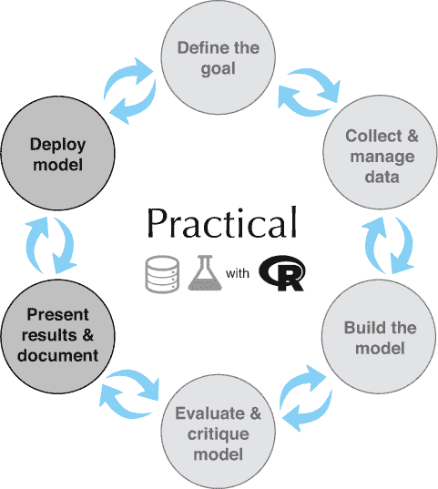

表 11.1\. 章节目标

| 目标 | 描述 |
| --- | --- |
| 生成有效的里程碑文档 | 项目目标、数据来源、采取的步骤和技术结果（数字和图表）的可读性总结。里程碑文档通常由合作者和同行阅读，因此它可以简洁，并且经常包括实际代码。我们将展示一个用于生成优秀里程碑文档的出色工具：R *knitr* 和 *rmarkdown* 包，我们将泛指它们为 *R markdown*。R markdown 是“可重复研究”运动的产物（参见 Christopher Gandrud 的 *Reproducible Research with R and RStudio,* 第二版，Chapman and Hall，2015），是生成可靠快照的绝佳方式，不仅展示了项目的状态，还允许他人验证项目是否可行。 |
| 管理完整项目历史 | 如果您无法获取二月份的代码和数据副本，那么对您项目上个月如何工作的精美里程碑或检查点文档几乎没有意义。这就是为什么您需要良好的版本控制纪律来保护代码，以及良好的数据纪律来保存数据。 |
| 部署演示 | 真正的生产部署最好由经验丰富的工程师完成。这些工程师知道他们将要部署的工具和环境。快速启动生产部署的一个好方法是有一个参考应用程序。这允许工程师对您的工作进行实验，测试边缘情况，并构建验收测试。 |

本章解释了如何分享您的工作——甚至与未来的自己分享。我们将讨论如何使用 R markdown 创建实质性的项目里程碑文档并自动化图形和其他结果的再现。您将了解如何在代码中使用有效的注释，以及如何使用 Git 进行版本管理和协作。我们还将讨论将模型作为 HTTP 服务和应用程序进行部署。

对于一些示例，我们将使用 RStudio，这是一个由 RStudio, Inc.（而不是 R/CRAN 本身）生产的集成开发环境（IDE）。我们展示的所有内容都可以在不使用 RStudio 的情况下完成，但 RStudio 提供了一个基本的编辑器以及一些一键式替代方案来处理一些脚本任务。

## 11.1\. 预测 Buzz

* * *

示例

*在我们的示例场景中，我们希望使用关于文章前几天的浏览量收集的指标来预测文章的长期受欢迎程度。这对销售广告和预测和管理收入可能很重要。具体来说：我们将使用文章发布前八天进行的测量值来预测文章是否会在长期内保持受欢迎。*

*本章的任务是保存和分享我们的 Buzz 模型，记录模型，测试模型，并将模型部署到生产环境中。*

* * *

为了模拟预测长期文章受欢迎程度或 Buzz 的示例场景，我们将使用来自 [`ama.liglab.fr/datasets/buzz/`](http://ama.liglab.fr/datasets/buzz/) 的 *Buzz 数据集*。我们将处理文件 TomsHardware-Relative-Sigma-500.data.txt 中的数据.^([1]) 原始提供的文档（TomsHardware-Relative-Sigma-500.names.txt 和 BuzzDataSetDoc.pdf）告诉我们 Buzz 数据的结构如图 11.2 所示。

> ¹
> 
> 本章中提到的所有文件均可在 [`github.com/WinVector/PDSwR2/tree/master/Buzz`](https://github.com/WinVector/PDSwR2/tree/master/Buzz) 获取。

表 11.2\. Buzz 数据描述

| 属性 | 描述 |
| --- | --- |
| 行 | 每行代表一个技术个人电脑讨论主题的多种不同测量值。 |
| 主题 | 主题包括关于个人电脑的技术问题，如品牌名称、内存、超频等。 |
| 测量类型 | 对于每个主题，测量类型包括发帖数、帖子数、作者数、读者数等数量。每种测量值在八个不同时间进行。 |
| 时间 | 八个相对时间命名为 0 到 7，可能是天数（原始变量文档并不完全清楚，匹配的论文尚未发布）。对于每种测量类型，所有八个相对时间都存储在同一数据行的不同列中。 |
| Buzz | 要预测的量称为 *Buzz*，如果观察日之后的几天内平均每天新增讨论活动的发生频率至少为 500 事件，则定义为真或 1。可能的 Buzz 是七个标记为 *NAC* 的变量的未来平均值（原始文档对此并不明确）。 |

在我们最初的 Buzz 文档中，我们列出了我们所知的内容（并且，重要的是，承认了我们不确定的地方）。在指出提供的 Buzz 文档中的问题时，我们并没有任何不尊重的意思。这种文档在项目开始时所能看到的水平大致如此。在实际项目中，你会通过讨论和工作周期来澄清和改进不明确的地方。这是为什么在现实世界项目中能够接触到活跃的项目赞助者和合作伙伴是至关重要的一个原因。

在本章中，我们将使用 Buzz 模型和数据集，并专注于展示用于生成文档、部署和演示的工具和技术。在实际项目中，我们建议你首先生成像 表 11.2 中的笔记。你还会结合会议笔记来记录你的实际项目目标。由于这只是一个演示，我们将强调技术文档：数据来源和初步的简单分析，以证明我们对数据有控制权。我们的示例初始 Buzz 分析可以在以下位置找到：[`github.com/WinVector/PDSwR2/blob/master/Buzz/buzzm.md`](https://github.com/WinVector/PDSwR2/blob/master/Buzz/buzzm.md)。我们建议你在我们介绍下一节中使用的工具和步骤之前先浏览一下。

## 11.2\. 使用 R markdown 生成里程碑文档

你需要准备文档的第一个受众是你自己和你的同伴。你可能几个月后需要回到之前的工作，可能是在紧急情况下，比如重要的错误修复、演示或功能改进。对于自我/同伴文档，你想要专注于事实：所陈述的目标是什么，数据来自哪里，以及尝试了哪些技术。你假设只要使用标准术语或参考，读者就能弄清楚他们需要知道的其他任何内容。你想要强调任何惊喜或异常问题，因为它们正是重新学习时最昂贵的。你不能期望与客户分享这类文档，但你可以稍后用它作为构建更广泛文档和演示的基础。

我们推荐的第一种文档类型是项目里程碑或检查点文档。在项目的主要步骤中，你应该抽出一些时间在一个干净的环境中重复你的工作（证明你知道中间文件中的内容，并且实际上可以重新创建它们）。一个重要且常被忽视的里程碑是项目的开始。在本节中，我们将使用 knitr 和 rmarkdown R 包来记录使用 Buzz 数据开始工作的过程。

* * *

文档场景：分享 Buzz 模型的 ROC 曲线

*我们的第一个任务是构建一个包含示例模型 ROC 曲线的文档。我们希望能够在更改模型或评估数据时自动重建此文档，因此我们将使用 R markdown 来生成文档。*

* * *

### 11.2.1\. 什么是 R markdown？

R markdown 是 Markdown 文档规范的变体^([2]), 允许在文档中包含 R 代码和结果。处理代码和文本组合的概念应归功于 R Sweave 软件包^([3]) 和 Knuth 的文献编程的早期思想.^([4]) 实际上，你维护一个包含用户可读文档和程序源代码片段的主文件。R markdown 支持的文档类型包括 Markdown、HTML、LaTeX 和 Word。LaTeX 格式是详细、排版、技术文档的好选择。Markdown 格式是在线文档和维基的好选择。

> ²
> 
> Markdown 本身是一种流行的文档格式化系统，其灵感来源于模仿人们手动注释电子邮件的方式：[`en.wikipedia.org/wiki/Markdown`](https://en.wikipedia.org/wiki/Markdown).
> 
> ³
> 
> 查看 [`leisch.userweb.mwn.de/Sweave/`](http://leisch.userweb.mwn.de/Sweave/).
> 
> ⁴
> 
> 查看 [`www.literateprogramming.com/knuthweb.pdf`](http://www.literateprogramming.com/knuthweb.pdf).

执行文档创建任务的引擎被称为 knitr。knitr 的主要操作称为 *knit*：knitr 提取并执行所有 R 代码，然后构建一个新的结果文档，该文档将原始文档的内容与格式化后的代码和结果组合在一起。图 11.2 展示了 knitr 如何将文档视为片段（称为 *chunks*）并将片段转换为可分享的结果。

图 11.2\. R markdown 流程示意图

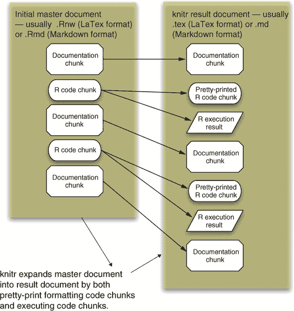

通过几个示例可以最好地展示这个过程。

一个简单的 R markdown 示例

Markdown ([`daringfireball.net/projects/markdown/`](http://daringfireball.net/projects/markdown/)) 是一种简单的、适用于网络的格式，在许多维基中都被使用。以下列表显示了一个简单的 Markdown 文档，其中 R markdown 注释块用 ```` ``` ```` 标记。

列表 11.1\. R 注释的 Markdown

```
---                                                                            ❶
title: "Buzz scoring example"
output: github_document
---
```{r, include = FALSE}                                                        ❷

# 使用 knitr 或 rmarkdown 处理文档。

# knitr::knit("Buzz_score_example.Rmd") # creates Buzz_score_example.md

# rmarkdown::render("Buzz_score_example.Rmd",

# rmarkdown::html_document()) # creates Buzz_score_example.html

```                                                                            ❸

Example scoring (making predictions with) the Buzz data set.                   ❹

First attach the `randomForest` package and load the model and test data.
```{r}                                                                         ❺

suppressPackageStartupMessages(library("randomForest"))

lst <- readRDS("thRS500.RDS")

varslist <- lst$varslist

fmodel <- lst$fmodel

buzztest <- lst$buzztest

rm(list = "lst")

```

Now show the quality of our model on held-out test data.                      ❻
```{r}                                                                        ❻

buzztest$prediction <-

    predict(fmodel, newdata = buzztest, type = "prob")[, 2, drop = TRUE]

WVPlots::ROCPlot(buzztest, "prediction",

                "buzz", 1,

                "ROC 曲线估计模型预测在保留数据上的质量-

    out data")

```
```

❶ YAML（另一种标记语言）标题指定一些元数据：标题和默认输出格式

❷ R Markdown 的“起始代码块”注释。`include = FALSE` 指令表示该块在渲染中不显示。

❸ R Markdown 块的结束；起始和结束标记之间的所有内容都被视为 R 代码并执行。

❹ 自由 Markdown 文本

❺ 另一个 R 代码块。在这种情况下，我们正在加载一个已经生成的随机森林模型和测试数据。

❻ 更多自由测试

❻ 另一个 R 代码块

列表 11.1 的内容可在文件 [`github.com/WinVector/PDSwR2/blob/master/Buzz/Buzz_score_example.Rmd`](https://github.com/WinVector/PDSwR2/blob/master/Buzz/Buzz_score_example.Rmd) 中找到。在 R 中，我们会这样处理它：

```
rmarkdown::render("Buzz_score_example.Rmd", rmarkdown::html_document())
```

这生成了新的文件 Buzz_score_example.html，这是一个完成的 HTML 格式的报告。将这种能力添加到您的流程中（无论是使用 Sweave 还是 knitr/rmarkdown）都是革命性的。

R Markdown 的目的

R Markdown 的目的是生成可重复的工作。相同的数据和技术应该可以重新运行以获得等效的结果，而不需要要求容易出错的人工干预，例如选择工作表范围或复制粘贴。当您以 R Markdown 格式分发您的作品（如我们在第 11.2.3 节中所做的那样）时，任何人都可以下载您的作品，并且无需很大努力就可以重新运行它以确认他们得到的结果与您相同。这是科学研究的理想标准，但很少达到，因为科学家通常在共享所有代码、数据和实际程序方面存在不足。knitr 收集并自动化所有步骤，因此如果某些内容缺失或实际上没有按声称的方式工作，就会变得明显。knitr 自动化可能看起来只是方便，但它使得表 11.3 中列出的基本工作变得更加容易（因此更有可能真正完成）。

表 11.3\. R Markdown 使维护任务变得更容易

| 任务 | 讨论 |
| --- | --- |
| 保持代码与文档同步 | 只有一份代码（已经在文档中）的情况下，要使其与文档不同步就不那么容易了。 |
| 保持结果与数据同步 | 消除所有手动步骤（如剪切粘贴结果、选择文件名和包含图表）将大大增加您正确重新运行和重新检查工作的可能性。 |
| 将正确的工作转交给他人 | 如果步骤按顺序排列，以便机器可以运行它们，那么重新运行和确认它们就更容易了。此外，有一个容器（主文档）来保存所有工作，这使得管理依赖关系变得更加容易。 |

### 11.2.2\. knitr 技术细节

要在大型项目中使用 knitr，您需要了解更多关于 knitr 代码块的工作方式。特别是，您需要清楚如何标记代码块以及您将需要操作哪些常见的代码块选项。图 11.3 显示了准备 R Markdown 文档的步骤。

图 11.3\. R Markdown 流程

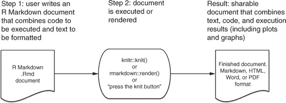

knitr 块声明格式

通常，一个 knitr 代码块以块声明开始（在 Markdown 中为 ```` ``` ````，在 LaTeX 中为 `<<`）。第一个字符串是块的名称（在整个项目中必须是唯一的）。之后，允许有多个以逗号分隔的 `option=value` 块选项赋值。

knitr 块选项

在 表 11.4 中给出了有用的选项赋值示例。

表 11.4\. 一些有用的 knitr 选项

| 选项名称 | 目的 |
| --- | --- |
| cache | 控制是否缓存结果。当 cache = FALSE（默认值）时，代码块总是执行。当 cache = TRUE 时，如果之前运行中有有效的缓存结果可用，则代码块不会执行。缓存块在修订 knitr 文档时是必不可少的，但你应该始终删除缓存目录（位于你使用 knitr 的子目录中），并执行干净的重跑以确保你的计算正在使用你文档中指定的当前数据版本和设置。 |
| echo | 控制源代码是否被复制到文档中。当 echo = TRUE（默认值）时，格式化良好的代码会被添加到文档中。当 echo = FALSE 时，代码不会被回显（当你只想显示结果时很有用）。 |
| eval | 控制代码是否被评估。当 eval = TRUE（默认值）时，代码被执行。当 eval = FALSE 时，它不会被评估（用于显示指令）。 |
| message | 将 message = FALSE 设置为将 R 的 message() 命令直接发送到运行 R 的控制台，而不是发送到文档。这对于向用户发布进度消息很有用，你不需要在最终文档中看到这些消息。 |
| results | 控制对 R 输出的处理方式。通常你不需要设置此选项，输出会与代码混合（带有 ## 注释）。一个有用的选项是 results='hide'，它可以抑制输出。 |
| tidy | 控制在打印之前是否重新格式化源代码。我们曾经将 tidy = FALSE，因为 knitr 的一个版本在整理时错误地格式化了 R 注释。 |

大多数这些选项在我们的 Buzz 示例中都有演示，我们将在下一节中处理这个示例。

### 11.2.3\. 使用 knitr 记录 Buzz 数据并生成模型

我们刚刚评估的模型本身是使用 R markdown 脚本生成的：位于 [`github.com/WinVector/PDSwR2/tree/master/Buzz`](https://github.com/WinVector/PDSwR2/tree/master/Buzz) 的 buzzm.Rmd 文件。编译此文件生成了 Markdown 结果 buzzm.md 和驱动我们示例的保存模型文件 thRS500.RDS。本章中提到的所有步骤都在 Buzz 示例目录中完全演示。我们将展示 buzzm.Rmd 的摘录。

* * *

Buzz 数据注释

对于 Buzz 数据，准备说明可以在 buzzm.md 和 buzzm.html 文件中找到。我们建议查看这些文件之一和 表 11.2。Buzz 项目的原始描述文件（TomsHardware-Relative-Sigma-500.names.txt 和 BuzzDataSetDoc.pdf）也可在 [`github.com/WinVector/PDSwR2/tree/master/Buzz`](https://github.com/WinVector/PDSwR2/tree/master/Buzz) 找到。

* * *

确认数据来源

因为 knitr 正在自动化步骤，你可以多走几步来确认你正在分析的数据确实是你认为下载的数据。例如，我们将从确认我们从哪里开始的数据的 SHA 密码哈希与我们所认为下载的内容相匹配开始我们的 Buzz 数据分析。这可以通过以下列表完成（注意：始终查看块的第一行以查找块选项，如 `cache = TRUE`）。

列表 11.2\. 使用 `system()` 命令计算文件哈希

```
```{r dataprep}

infile <- "TomsHardware-Relative-Sigma-500.data.txt"

paste('checked at', date())

system(paste('shasum', infile), intern = TRUE)             ❶

buzzdata <- read.table(infile, header = FALSE, sep = ",")

...

```

❶ Runs a system-installed cryptographic hash program (this program is outside of R’s install image)

This code sequence depends on a program named *shasum* being on your execution path. You have to have a cryptographic hash installed, and you can supply a direct path to the program if necessary. Common locations for a cryptographic hash include /usr/bin/shasum, /sbin/md5, and fciv.exe, depending on your actual system configuration.

This code produces the output shown in figure 11.4. In particular, we’ve documented that the data we loaded has the same cryptographic hash we recorded when we first downloaded the data. Having confidence you’re still working with the exact same data you started with can speed up debugging when things go wrong. Note that we’re using the cryptographic hash only to defend against accident (using the wrong version of a file or seeing a corrupted file) and not to defend against adversaries or external attacks. For documenting data that may be changing under external control, it is critical to use up-to-date cryptographic techniques.

Figure 11.4\. knitr documentation of Buzz data load

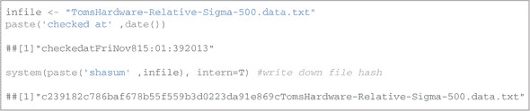

Figure 11.5 is the same check, rerun in 2019, which gives us some confidence we are in fact dealing with the same data.

Figure 11.5\. knitr documentation of Buzz data load 2019: buzzm.md

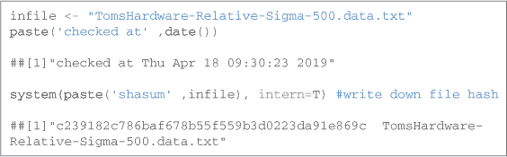

Recording the performance of the naive analysis

The initial milestone is a good place to try to record the results of a naive “just apply a standard model to whatever variables are present” analysis. For the Buzz data analysis, we’ll use a random forest modeling technique (not shown here, but in our knitr documentation) and apply the model to test data.

* * *

**Save your data!**

Always save a copy of your training data. Remote data (URLs, databases) has a habit of changing or disappearing. To reproduce your work, you must save your inputs.

* * *

Listing 11.3\. Calculating model performance

```

``` {r}
rtest <- data.frame(truth = buzztest$buzz,
pred = predict(fmodel, newdata = buzztest, type = "prob")[, 2, drop = TRUE])
print(accuracyMeasures(rtest$pred, rtest$truth))
```

    ## [1] "精确度= 0.832402234636871 ; 召回率= 0.84180790960452"

    ## pred

    ## 真实值 FALSE TRUE

    ## 0   584   30

    ## 1    28  149

    ## 模型准确度        f1 dev.norm       AUC

    ## 1 模型 0.9266751 0.8370787  0.42056 0.9702102

```

Using milestones to save time

Now that we’ve gone to all the trouble to implement, write up, and run the Buzz data preparation steps, we’ll end our knitr analysis by saving the R workspace. We can then start additional analyses (such as introducing better variables for the time-varying data) from the saved workspace. In the following listing, we’ll show how to save a file, and how to again produce a cryptographic hash of the file (so we can confirm work that starts from a file with the same name is in fact starting from the same data).

Listing 11.4\. Saving data

```

保存变量名、模型和测试数据。

``` {r}
fname <- 'thRS500.RDS'
items <- c("varslist", "fmodel", "buzztest")
saveRDS(object = list(varslist = varslist,
                      fmodel = fmodel,
                      buzztest = buzztest),
        file = fname)
message(paste('saved', fname))  # message to running R console
print(paste('saved', fname))    # print to document
```

    ## [1] "saved thRS500.RDS"

``` {r}
paste('finished at', date())
```

    ## [1] "finished at Thu Apr 18 09:33:05 2019"

``` {r}
system(paste('shasum', fname), intern = TRUE)  # write down file hash
```

    ## [1] "f2b3b80bc6c5a72079b39308a5758a282bcdd5bf  thRS500.RDS"

```

knitr takeaway

In our knitr example, we worked through the steps we’ve done for every dataset in this book: load data, manage columns/variables, perform an initial analysis, present results, and save a workspace. The key point is that because we took the extra effort to do this work in knitr, we have the following:

*   Nicely formatted documentation (buzzm.md)
*   Shared executable code (buzzm.Rmd)

This makes debugging (which usually involves repeating and investigating earlier work), sharing, and documentation much easier and more reliable.

* * *

**Project organization, further reading**

To learn more about R markdown we recommend Yihui Xie, *Dynamic Documents with R and knitr* (CRC Press, 2013). Some good ideas on how to organize a data project in reproducible fashion can be found in *Reproducible Research with R and RStudio*, Second Edition.

* * *

## 11.3\. Using comments and version control for running documentation

Another essential record of your work is what we call *running documentation*. Running documentation is less formal than milestone/checkpoint documentation and is easily maintained in the form of code comments and version control records. Undocumented, untracked code runs up a great deal of *technical debt* (see [`mng.bz/IaTd`](http://mng.bz/IaTd)) that can cause problems down the road.

* * *

Example

*Suppose you want to work on formatting Buzz modeling results. You need to save this work to return to it later, document what steps you have taken, and share your work with others.*

* * *

In this section, we’ll work through producing effective code comments and using Git for version control record keeping.

### 11.3.1\. Writing effective comments

R’s comment style is simple: everything following a `#` (that isn’t itself quoted) until the end of a line is a comment and ignored by the R interpreter. The following listing is an example of a well-commented block of R code.

Listing 11.5\. Example code comments

```

#' 返回 x 的伪对数，以 10 为底。

#'

#' 返回 x 的伪对数（以 10 为底），接近

#' sign(x)*log10(abs(x)) 对于 abs(x) 较大的 x

#' 并且不会在零附近“爆炸”。有用

#' 用于转换可能为负的宽范围变量

#' （如利润/亏损）。

#'

#' 参考：\url{http://www.win-vector.com/blog/2012/03/modeling-trick-the-

    signed-pseudo-logarithm/

#'

#' 注意：此转换具有不希望的性质，使得大多数

#' 签名分布出现在原点周围的双峰分布，无论

#' 真正的分布看起来是什么样子。

#' 参数 x 假设为数值，可以是向量。

#'

#' @param x 数值向量

#' @return x 的伪对数，以 10 为底

#'

#' @examples

#'

#' pseudoLog10(c(-5, 0, 5))

#' # 应该是：[1] -0.7153834  0.0000000  0.7153834

#'

#' @export

#'

pseudoLog10 <- function(x) {

asinh(x / 2) / log(10)

}

```

When such comments (with the `#'` marks and `@` marks ) is included in an R package, the documentation management engine can read the structured information and use it to produce additional documentation and even online help. For example, when we saved the preceding code in an `R` package at [`github.com/WinVector/PDSwR2/blob/master/PseudoLog10/R/pseudoLog10.R`](https://github.com/WinVector/PDSwR2/blob/master/PseudoLog10/R/pseudoLog10.R), we could use the `roxygen2` R package to generate the online help shown in figure 11.6.

Figure 11.6\. `roxygen@`-generated online help

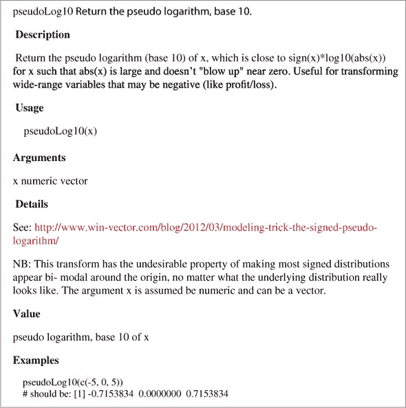

Good comments include what the function does, what types arguments are expected to be used, limits of domain, why you should care about the function, and where it’s from. Of critical importance are any `NB` (*nota bene* or *note well* ) or `TODO` notes. It’s vastly more important to document any unexpected features or limitations in your code than to try to explain the obvious. Because R variables don’t have types (only objects they’re pointing to have types), you may want to document what types of arguments you’re expecting. It’s critical to state if a function works correctly on lists, data frame rows, vectors, and so on.

For more on packages and documentation, we recommend Hadley Wickham, *R Packages: Organize, Test, Document, and Share Your Code* (O’Reilly, 2015).

### 11.3.2\. Using version control to record history

Version control can both maintain critical snapshots of your work in earlier states and produce running documentation of what was done by whom and when in your project. Figure 11.7 shows a cartoon “version control saves the day” scenario that is in fact common.

Figure 11.7\. Version control saving the day

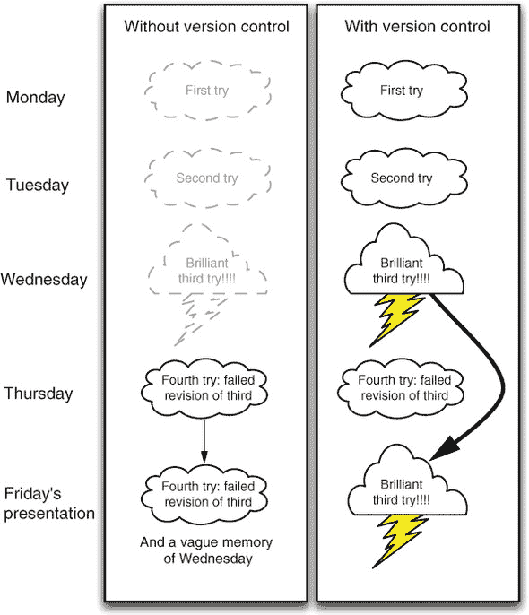

In this section, we’ll explain the basics of using Git ([`git-scm.com/`](http://git-scm.com/)) as a version control system. To really get familiar with Git, we recommend a good book such as Jon Loeliger and Matthew McCullough’s *Version Control with Git,* Second Edition, (O’Reilly, 2012). Or, better yet, work with people who know Git. In this chapter, we assume you know how to run an interactive shell on your computer (on Linux and OS X you tend to use `bash` as your shell; on Windows you can install Cygwin—[`www.cygwin.com`](http://www.cygwin.com)).

* * *

Working in bright light

Sharing your Git repository means you’re sharing a lot of information about your work habits and also sharing your mistakes. You’re much more exposed than when you just share final work or status reports. Make this a virtue: know you’re working in bright light. One of the most critical features in a good data scientist (perhaps even before analytic skill) is scientific honesty.

* * *

To get most of the benefit from Git, you need to become familiar with a few commands, which we will demonstrate in terms of specific tasks next.

Choosing a project directory structure

Before starting with source control, it’s important to settle on and document a good project directory structure. *Reproducible Research with R and RStudio,* Second Edition, has good advice and instructions on how to do this. A pattern that’s worked well for us is to start a new project with the directory structure described in table 11.5.

Table 11.5\. A possible project directory structure

| Directory | Description |
| --- | --- |
| Data | Where we save original downloaded data. This directory must usually be excluded from version control (using the .gitignore feature) due to file sizes, so you must ensure it’s backed up. We tend to save each data refresh in a separate subdirectory named by date. |
| Scripts | Where we store all code related to analysis of the data. |
| Derived | Where we store intermediate results that are derived from data and scripts. This directory must be excluded from source control. You also should have a master script that can rebuild the contents of this directory in a single command (and test the script from time to time). |
| Results | Similar to derived, but this directory holds smaller, later results (often based on derived) and hand-written content. These include important saved models, graphs, and reports. This directory is under version control, so collaborators can see what was said when. Any report shared with partners should come from this directory. |

Starting a Git project using the command line

When you’ve decided on your directory structure and want to start a version-controlled project, do the following:

1.  Start the project in a new directory. Place any work either in this directory or in subdirectories.
2.  Move your interactive shell into this directory and type `git init`. It’s okay if you’ve already started working and there are already files present.
3.  Exclude any subdirectories you don’t want under source control with .gitignore control files.

You can check if you’ve already performed the init step by typing `git status`. If the init hasn’t been done, you’ll get a message similar to `fatal: Not a git repository (or any of the parent directories): .git`. If the init has been done, you’ll get a status message telling you something like `on branch master` and listing facts about many files.

The init step sets up in your directory a single hidden file tree called .git and prepares you to keep extra copies of every file in your directory (including subdirectories). Keeping all of these extra copies is called *versioning* and what is meant by *version control*. You can now start working on your project: save everything related to your work in this directory or some subdirectory of this directory.

Again, you only need to init a project once. Don’t worry about accidentally running `git init.` a second time; that’s harmless.

Using add/commit pairs to checkpoint work

* * *

Get nervous about uncommitted state

Here’s a good rule of thumb for Git: you should be as nervous about having uncommitted changes as you should be about not having clicked Save. You don’t need to push/pull often, but you do need to make local commits often (even if you later squash them with a Git technique called *rebasing*).

* * *

As often as practical, enter the following two commands into an interactive shell in your project directory:

```

git add -A       ❶

git commit       ❷

```

❶ Stages results to commit (specifies what files should be committed)

❷ Actually performs the commit

Checking in a file is split into two stages: add and commit. This has some advantages (such as allowing you to inspect before committing), but for now just consider the two commands as always going together. The `commit` command should bring up an editor where you enter a comment as to what you’re up to. Until you’re a Git expert, allow yourself easy comments like “update,” “going to lunch,” “just added a paragraph,” or “corrected spelling.” Run the add/commit pair of commands after every minor accomplishment on your project. Run these commands every time you leave your project (to go to lunch, to go home, or to work on another project). Don’t fret if you forget to do this; just run the commands next time you remember.

* * *

**A “wimpy commit” is better than no commit**

We’ve been a little loose in our instructions to commit often and not worry too much about having a long commit message. Two things to keep in mind are that usually you want commits to be meaningful with the code working (so you tend not to commit in the middle of an edit with syntax errors), and good commit notes are to be preferred (just don’t forgo a commit because you don’t feel like writing a good commit note).

* * *

Using git log and git status to view progress

Any time you want to know about your work progress, type either `git status` to see if there are any edits you can put through the add/commit cycle, or `git log` to see the history of your work (from the viewpoint of the add/commit cycles).

The following listing shows the `git status` from our copy of this book’s examples repository ([`github.com/WinVector/PDSwR2`](https://github.com/WinVector/PDSwR2)).

Listing 11.6\. Checking your project status

```

$ git status

在 master 分支上

你的分支与 'origin/master' 保持同步。

没有要提交的内容，工作树干净

```

And the next listing shows a `git log` from the same project.

Listing 11.7\. Checking your project history

```

$ git log

提交 d22572281d40522bc6ab524bbdee497964ff4af0 (HEAD -

    > master, origin/master)

作者：John Mount <jmount@win-vector.com>

日期：   周二 Apr 16 16:24:23 2019 -0700

    技术编辑 ch7

```

The indented lines are the text we entered at the `git commit` step; the dates are tracked automatically.

Using Git through RStudio

The RStudio IDE supplies a graphical user interface to Git that you should try. The add/commit cycle can be performed as follows in RStudio:

*   Start a new project. From the RStudio command menu, select Project > Create Project, and choose New Project. Then select the name of the project and what directory to create the new project directory in; leave the type as (Default), and make sure Create a Git Repository for this Project is checked. When the new project pane looks something like figure 11.8, click Create Project, and you have a new project.

    Figure 11.8\. RStudio new project pane

    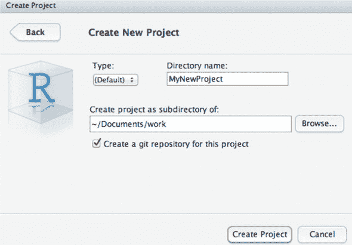

*   Do some work in your project. Create new files by selecting File > New > R Script. Type some R code (like `1/5`) into the editor pane and then click the save icon to save the file. When saving the file, be sure to choose your project directory or a subdirectory of your project.
*   Commit your changes to version control. Figure 11.9 shows how to do this. Select the Git control pane in the top right of RStudio. This pane shows all changed files as line items. Check the Staged check box for any files you want to stage for this commit. Then click Commit, and you’re done.

    Figure 11.9\. RStudio Git controls

    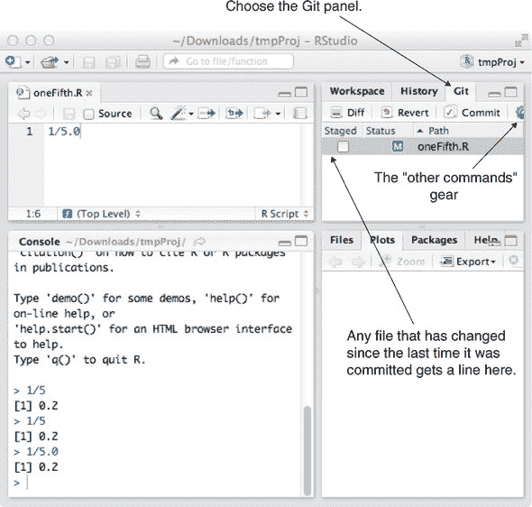

You may not yet deeply understand or like Git, but you’re able to safely check in all of your changes every time you remember to stage and commit. This means all of your work history is there; you can’t clobber your committed work just by deleting your working file. Consider all of your working directory as “scratch work”—only checked-in work is safe from loss.

Your Git history can be seen by pulling down on the Other Commands gear (shown in the Git pane in figure 11.9) and selecting History (don’t confuse this with the nearby History pane, which is command history, not Git history). In an emergency, you can find Git help and find your earlier files. If you’ve been checking in, then your older versions are there; it’s just a matter of getting some help in accessing them. Also, if you’re working with others, you can use the push/pull menu items to publish and receive updates. Here’s all we want to say about version control at this point: *commit often, and if you’re committing often, all problems can be solved with some further research*. Also, be aware that since your primary version control is on your own machine, you need to make sure you have an independent backup of your machine. If your machine fails and your work hasn’t been backed up or shared, then you lose both your work and your version repository.

### 11.3.3\. Using version control to explore your project

Up until now, our model of version control has been this: Git keeps a complete copy of all of our files each time we successfully enter the pair of add/commit lines. We’ll now use these commits. If you add/commit often enough, Git is ready to help you with any of the following tasks:

*   Tracking your work over time
*   Recovering a deleted file
*   Comparing two past versions of a file
*   Finding when you added a specific bit of text
*   Recovering a whole file or a bit of text from the past (undo an edit)
*   Sharing files with collaborators
*   Publicly sharing your project (à la GitHub at [`github.com/`](https://github.com/), Gitlab [`gitlab.com/`](https://gitlab.com/), or Bitbucket at [`bitbucket.org`](https://bitbucket.org))
*   Maintaining different versions (branches) of your work

And that’s why you want to add and commit often.

* * *

Getting help on Git

For any Git command, you can type `git help [command]` to get usage information. For example, to learn about `git log`, type `git help log`.

* * *

Finding out who wrote what and when

In section 11.3.1, we implied that a good version control system can produce a lot of documentation on its own. One powerful example is the command `git blame`. Look what happens if we download the Git repository [`github.com/WinVector/PDSwR2`](https://github.com/WinVector/PDSwR2) (with the command `git clone git@github.com:WinVector/PDSwR2.git`) and run the command `git blame Buzz/buzzapp/server.R` (to see who “wrote” each line in the file).

Listing 11.8\. Finding out who committed what

```

git blame Buzz/buzzapp/server.R

4efb2b78 (John Mount 2019-04-24 16:22:43 -0700  1) #

4efb2b78 (John Mount 2019-04-24 16:22:43 -0700  2)

    # This is the server logic of a Shiny web application. You can run the

4efb2b78 (John Mount 2019-04-24 16:22:43 -0700  3)

    # application by clicking 'Run App' above.

4efb2b78 (John Mount 2019-04-24 16:22:43 -0700  4) #

```

The `git blame` information takes each line of the file and prints the following:

*   The prefix of the line’s Git commit hash. This is used to identify which commit the line we’re viewing came from.
*   Who committed the line.
*   When they committed the line.
*   The line number.
*   And, finally, the contents of the line.

* * *

git blame doesn’t tell the whole story

It is important to understand that many of the updates that `git blame` reports may be mechanical (somebody using a tool to reformat files), or somebody acting on somebody else’s behalf. You *must* look at the commits to see what happened. In this particular example, the commit message was “add Nina’s Shiny example,” so this was work done by Nina Zumel, who had delegated checking it in to John Mount.

A famous example of abusing similar lines of code metrics was the attempt to discredit Katie Bouman’s leadership in creating the first image of a black hole. One of the (false) points raised was that collaborator Andrew Chael had contributed more lines of code to the public repository. Fortunately, Chael himself responded, defending Bouman’s role and pointing out the line count attributed to him was machine-generated model files he had checked into the repository as part of his contribution, not authored lines of code.

* * *

Using git diff to compare files from different commits

The `git diff` command allows you to compare any two committed versions of your project, or even to compare your current uncommitted work to any earlier version. In Git, commits are named using large hash keys, but you’re allowed to use prefixes of the hashes as names of commits.^([5]) For example, the following listing demonstrates finding the differences in two versions of [`github.com/WinVector/PDSwR2`](https://github.com/WinVector/PDSwR2) in a diff or patch format.

> ⁵
> 
> You can also create meaningful names for commits with the `git tag` command.

Listing 11.9\. Finding line-based differences between two committed versions

```

diff --git a/CDC/NatalBirthData.rData b/CDC/NatalBirthData.rData

...

+++ b/CDC/prepBirthWeightData.R

@@ -0,0 +1,83 @@

+data <- read.table("natal2010Sample.tsv.gz",

+                   sep="\t", header = TRUE, stringsAsFactors = FALSE)

+

+# make a boolean from Y/N data

+makevarYN = function(col) {

+  ifelse(col %in% c("", "U"), NA, col=="Y")

+}

...

```

* * *

Try to not confuse Git commits and Git branches

A Git commit represents the complete state of a directory tree at a given time. A Git branch represents a sequence of commits and changes as you move through time. Commits are immutable; branches record progress.

* * *

Using git log to find the last time a file was around

* * *

Example

*At some point there was a file named Buzz/buzz.pdf in our repository. Somebody asks us a question about this file. How do we use Git to find when this file was last in the repository, and what its contents had been?*

* * *

After working on a project for a while, we often wonder, when did we delete a certain file and what was in it at the time? Git makes answering this question easy. We’ll demonstrate this in the repository [`github.com/WinVector/PDSwR2`](https://github.com/WinVector/PDSwR2). We remember the Buzz directory having a file named buzz.pdf, but there is no such file now and we want to know what happened to it. To find out, we’ll run the following:

```

git log --name-status -- Buzz/buzz.pdf

commit 96503d8ca35a61ed9765edff9800fc9302554a3b

Author: John Mount <jmount@win-vector.com>

Date:   Wed Apr 17 16:41:48 2019 -0700

    fix links and re-build Buzz example

D       Buzz/buzz.pdf

```

We see the file was deleted by John Mount. We can view the contents of this older file with the command `git checkout 96503d8¹ -- Buzz/buzz.pdf`. The `96503d8` is the prefix of the commit number (which was enough to specify the commit that deleted the file), and the `¹` means “the state of the file one commit before the named commit” (the last version before the file was deleted).

### 11.3.4\. Using version control to share work

* * *

Example

*We want to work with multiple people and share results. One way to use Git to accomplish this is by individually setting up our own repository and sharing with a central repository.*

* * *

In addition to producing work, you must often share it with peers. The common (and bad) way to do this is emailing zip files. Most of the bad sharing practices take excessive effort, are error prone, and rapidly cause confusion. We advise using version control to share work with peers. To do that effectively with Git, you need to start using additional commands such as `git pull`, `git rebase`, and `git push`. Things seem more confusing at this point (though you still don’t need to worry about branching in its full generality), but are in fact far less confusing and less error-prone than ad hoc solutions. We almost always advise sharing work in *star workflow*, where each worker has their own repository, and a single common “naked” repository (a repository with only Git data structures and no ready-to-use files) is used to coordinate (thought of as a server or gold standard, often named *origin*). Figure 11.10 shows one arrangement of repositories that allows multiple authors to collaborate.

Figure 11.10\. Multiple repositories working together

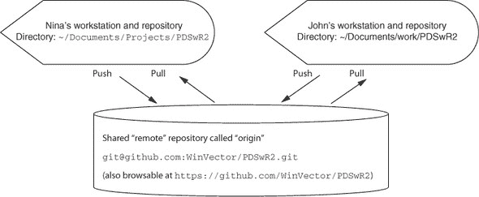

The usual shared workflow is like this:

*   ***Continuously—*** Work, work, work.
*   ***Frequently—*** Commit results to the local repository using a `git add`/`git commit` pair.
*   ***Every once in a while—*** Pull a copy of the remote repository into our view with some variation of `git pull` and then use `git push` to push work upstream.

The main rule of Git is this: don’t try anything clever (push/pull, and so on) unless you’re in a “clean” state (everything committed, confirmed with `git status`).

Setting up remote repository relations

For two or more Git repositories to share work, the repositories need to know about each other through a relation called *remote*. A Git repository is able to share its work to a remote repository by the `push` command and pick up work from a remote repository by the `pull` command. The next listing shows the declared remotes for the authors’ local copy of the [`github.com/WinVector/PDSwR2`](https://github.com/WinVector/PDSwR2) repository.

Listing 11.10\. `git remote`

```

$ git remote --verbose

origin  git@github.com:WinVector/PDSwR2.git (fetch)

origin  git@github.com:WinVector/PDSwR2.git (push)

```

The remote relation is set when you create a copy of a repository using the `git clone` command or can be set using the `git remote add` command. In listing 11.10, the remote repository is called `origin`—this is the traditional name for a remote repository that you’re using as your master or gold standard. (Git tends not to use the name *master* for repositories because master is the name of the branch you’re usually working on.)

Using push and pull to synchronize work with remote repositories

Once your local repository has declared some other repository as remote, you can push and pull between the repositories. When pushing or pulling, always make sure you’re clean (have no uncommitted changes), and you usually want to pull before you push (as that’s the quickest way to spot and fix any potential conflicts). For a description of what version control conflicts are and how to deal with them, see [`mng.bz/5pTv`](http://mng.bz/5pTv).

Usually, for simple tasks we don’t use branches (a technical version control term), and we use the `rebase` option on pull so that it appears that every piece of work is recorded into a simple linear order, even though collaborators are actually working in parallel. This is what we call an *essential* difficulty of working with others: time and order become separate ideas and become hard to track (and this is *not* a needless complexity added by using Git—there *are* such needless complexities, but this is not one of them).

The new Git commands you need to learn are these:

*   `git push` (usually used in the `git push -u origin master` variation)
*   `git pull` (usually used in the `git fetch; git merge -m pull master origin/ master` or `git pull --rebase origin master` variations)

Typically, two authors may be working on different files in the same project at the same time. As you can see in figure 11.11, the second author to push their results to the shared repository must decide how to specify the parallel work that was performed. Either they can say the work was truly in parallel (represented by two branches being formed and then a merge record joining the work), or they can rebase their own work to claim their work was done “after” the other’s work (preserving a linear edit history and avoiding the need for any merge records). Note: *before* and *after* are tracked in terms of arrows, not time.

Figure 11.11\. `git pull`: rebase versus merge

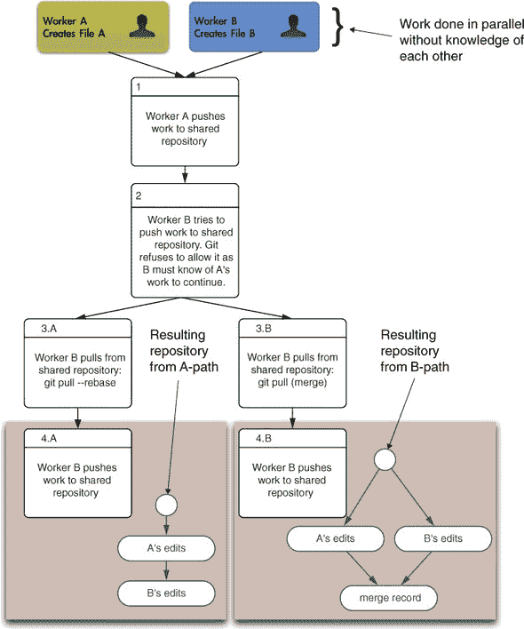

Merging is what’s really happening, but *rebase* is much simpler to read. The general rule is that you should only rebase work you haven’t yet shared (in our example, Worker B should feel free to rebase their edits to appear to be after Worker A’s edits, as Worker B hasn’t yet successfully pushed their work anywhere). You should avoid rebasing records people have seen, as you’re essentially hiding the edit steps they may be basing their work on (forcing them to merge or rebase in the future to catch up with your changed record keeping).

* * *

Keep notes

Git commands are confusing; you’ll want to keep notes. One idea is to write a 3 × 5 card for each command you’re regularly using. Ideally, you can be at the top of your Git game with about seven cards.

* * *

For most projects, we try to use a rebase-only strategy. For example, this book itself is maintained in a Git repository. We have only two authors who are in close proximity (so able to easily coordinate), and we’re only trying to create one final copy of the book (we’re not trying to maintain many branches for other uses). If we always rebase, the edit history will appear totally ordered (for each pair of edits, one is always recorded as having come before the other), and this makes talking about versions of the book much easier (again, *before* is determined by arrows in the edit history, not by time stamp).

* * *

Don’t confuse version control with backup

Git keeps multiple copies and records of all of your work. But until you push to a remote destination, all of these copies are on your machine in the .git directory. So don’t confuse basic version control with remote backups; they’re complementary.

* * *

A bit on the Git philosophy

Git is interesting in that it automatically detects and manages so much of what you’d have to specify with other version control systems (for example, Git finds which files have changed instead of you having to specify them, and Git also decides which files are related). Because of the large degree of automation, beginners usually severely underestimate how much Git tracks for them. This makes Git fairly quick except when Git insists you help decide how a possible global inconsistency should be recorded in history (either as a rebase or a branch followed by a merge record). The point is this: Git suspects possible inconsistency based on global state (even when the user may not think there is such) and then forces the committer to decide how to annotate the issue *at the time of commit* (a great service to any possible readers in the future). Git automates so much of the record keeping that it’s always a shock when you have a conflict and have to express opinions on nuances you didn’t know were being tracked. Git is also an “anything is possible, but nothing is obvious or convenient” system. This is hard on the user at first, but in the end is much better than an “everything is smooth, but little is possible” version control system (which can leave you stranded).

## 11.4\. Deploying models

Good data science shares a rule with good writing: show, don’t tell. And a successful data science project should include at least a demonstration deployment of any techniques and models developed. Good documentation and presentation are vital, but at some point, people have to see things working and be able to try their own tests. We strongly encourage partnering with a development group to produce the actual production-hardened version of your model, but a good demonstration helps recruit these collaborators.

* * *

Example

*Suppose you are asked to make your model predictions available to other software so it can be reflected in reports and used to make decisions. This means you must somehow “deploy your model.” This can vary from scoring all data in a known database, exporting the model for somebody else to deploy, or setting up your own web application or HTTP service.*

* * *

The statistician or analyst’s job often ends when the model is created or a report is finished. For the data scientist, this is just the acceptance phase. The real goal is getting the model into production: scoring data that wasn’t available when the model was built and driving decisions made by other software. This means that helping with deployment is part of the job. In this section, we will outline useful methods for achieving different styles of R model deployment.

We outline some deployment methods in table 11.6.

Table 11.6\. Methods to deploy models

| Method | Description |
| --- | --- |
| Batch | Data is brought into R, scored, and then written back out. This is essentially an extension of what you’re already doing with test data. |
| Cross-language linkage | R supplies answers to queries from another language (C, C++, Python, Java, and so on). R is designed with efficient cross-language calling in mind (in particular the Rcpp package), but this is a specialized topic we won’t cover here. |
| Services | R can be set up as an HTTP service to take new data as an HTTP query and respond with results. |
| Export | Often, model evaluation is simple compared to model construction. In this case, the data scientist can export the model and a specification for the code to evaluate the model, and the production engineers can implement (with tests) model evaluation in the language of their choice (SQL, Java, C++, and so on). |
| PMML | *PMML*, or *Predictive Model Markup Language*, is a shared XML format that many modeling packages can export to and import from. If the model you produce is covered by R’s package pmml, you can export it without writing any additional code. Then any software stack that has an importer for the model in question can use your model. |

* * *

**Models in production**

There are some basic defenses one should set up when placing a model in production. We mention these as we rarely see these valuable precautions taken:

*   All models and all predictions from models should be annotated with the model version name and a link to the model documentation. This simple precaution has saved one of the authors when they were able to show a misclassification was not from the model they had just deployed, but from a human tagger.
*   Machine learning model results should never be directly used as decisions. Instead, they should be an input to configurable business logic that makes decisions. This allows both patching the model to make it more reasonable (such as bounding probability predictions into a reasonable range such as 0.01 to 0.99) and turning it off (changing the business logic to not use the model prediction in certain cases).

You always want the last stage in any automated system to be directly controllable. So even a trivial business logic layer that starts by directly obeying a given model’s determination is high value, as it gives a place where you can correct special cases.

* * *

We’ve already demonstrated batch operation of models each time we applied a model to a test set. We won’t work through an R cross-language linkage example as it’s very specialized and requires knowledge of the system you’re trying to link to. We’ll demonstrate service and export strategies.

### 11.4.1\. Deploying demonstrations using Shiny

* * *

Example

*Suppose we want to build an interactive dashboard or demo for our boss. Our boss wants to try different classification thresholds against our Buzz score to see what precision and recall are available at each threshold. We could do this as a graph, but we are asked do this as an interactive service (possibly part of a larger drill-down/exploration service).*

* * *

We will solve this scenario by using *Shiny*, a tool for building interactive web applications in R. Here we will use Shiny to let our boss pick the threshold that converts our Buzz score into a “will Buzz”/“won’t Buzz” decision. The entire code for this demonstration is in the Buzz/buzzapp directory of [`github.com/WinVector/PDSwR2`](https://github.com/WinVector/PDSwR2).

The easiest way to run the Shiny application is to open the file server.R from that directory in RStudio. Then, as shown in figure 11.12, there will be a button on the upper right of the RStudio editor pane called Run App. Clicking this button will run the application.

Figure 11.12\. Launching the Shiny server from RStudio

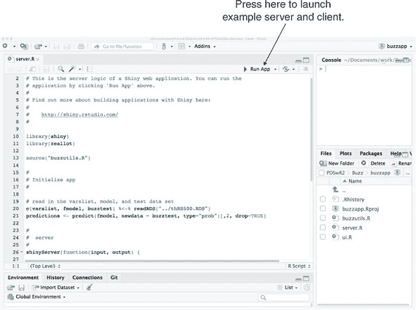

The running application will look like figure 11.13. The user can move the threshold control slider and get a new confusion matrix and model metrics (such as precision and recall) for each slider position.

Figure 11.13\. Interacting with the Shiny application

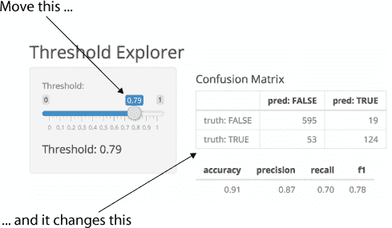

Shiny’s program principles are based on an idea called *reactive programming* where the user specifies what values may change due to user interventions. The Shiny software then handles rerunning and updating the display as the user uses the application. Shiny is a very large topic, but you can get started by copying an example application and editing it to fit your own needs.

Further Shiny reading

We don’t currently have a Shiny book recommendation. A good place to start on Shiny documentation, examples, and tutorials is [`shiny.rstudio.com`](https://shiny.rstudio.com).

### 11.4.2\. Deploying models as HTTP services

* * *

Example

*Our model looked good in testing, and our boss likes working with our interactive web application. So we now want to fully “put our model in production.” In this case, the model is considered “in production” if other servers can send data to it and get scored results. That is, our model is to be partly deployed in production as part of a services oriented architecture (SOA).*

* * *

Our model can be used by other software either by linking to it or having the model exposed as a service. In this case, we will deploy our Buzz model as an HTTP service. Once we have done this, other services at our company can send data to our model for scoring. For example, a revenue management dashboard can send a set of articles it is managing to our model for “buzz scoring,” meaning the buzz score can be incorporated into this dashboard. This is more flexible than having our Buzz model score all known articles in a database, as the dashboard can ask about any article for which it has the details.

One easy way to demonstrate an R model in operation is to expose it as an HTTP service. In the following listing, we show how to do this for our Buzz model (predicting discussion topic popularity). Listing 11.11 shows the first few lines of the file PDSwR2/Buzz/plumber.R. This .R file can be used with the `plumber` R package to expose our model as an HTTP service, either for production use or testing.

Listing 11.11\. Buzz model as an R-based HTTP service

```

library("randomForest")           ❶

lst <- readRDS("thRS500.RDS")

varslist <- lst$varslist

fmodel <- lst$fmodel

buzztest <- lst$buzztest

rm(list = "lst")

#* Score a data frame.

#* @param d data frame to score

#* @post /score_data

function(d) {

predict(fmodel, newdata = d, type = "prob")

}

```

❶ Attaches the randomForest package, so we can run our randomForest model

We would then start the server with the following code:

```

library("plumber")

r <- plumb("plumber.R")

r$run(port=8000)

```

The next listing is the contents of the file PDSwR2/Buzz/RCurl_client_example.Rmd, and shows how to call the HTTP service from R. However, this is just to demonstrate the capability—the whole point of setting up an HTTP service is that something other than R wants to use the service.

Listing 11.12\. Calling the Buzz HTTP service

```

library("RCurl")

library("jsonlite")

post_query <- function(method, args) {                              ❶

hdr <- c("Content-Type" = "application/x-www-form-urlencoded")

resp <- postForm(

    paste0("http://localhost:8000/", method),

    .opts=list(httpheader = hdr,

            postfields = toJSON(args)))

fromJSON(resp)

}

data <- read.csv("buzz_sample.csv",

                stringsAsFactors = FALSE,

                strip.white = TRUE)

scores <- post_query("score_data",

                    list(d = data))

knitr::kable(head(scores))

tab <- table(pred = scores[, 2]>0.5, truth = data$buzz)

knitr::kable(tab)

```

❶ Wraps the services as a function

This produces the result PDSwR2/Buzz/RCurl_client_example.md, shown in figure 11.14 (also saved in our example GitHub repository).

Figure 11.14\. Top of HTML form that asks server for Buzz classification on submit

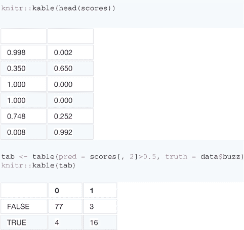

For more on `plumber`, we suggest starting with the `plumber` package documentation: [`CRAN.R-project.org/package=plumber`](https://CRAN.R-project.org/package=plumber).

### 11.4.3\. Deploying models by export

It often makes sense to export a copy of the finished model from R, instead of attempting to reproduce all the details of model construction in another system or to use R itself in production. When exporting a model, you’re depending on development partners to handle the hard parts of hardening a model for production (versioning, dealing with exceptional conditions, and so on). Software engineers tend to be good at project management and risk control, so sharing projects with them is a good opportunity to learn.

The steps required depend a lot on the model and data treatment. For many models, you only need to save a few coefficients. For random forests, you need to export the trees. In all cases, you need to write code in your target system (be it SQL, Java, C, C++, Python, Ruby, or other) to evaluate the model.

One of the issues of exporting models is that you must repeat any data treatment. So part of exporting a model is producing a specification of the data treatment (so it can be reimplemented outside of R).

Exporting random forests to SQL with tidypredict

* * *

Exercise: Run our random forest model in SQL

*Our goal is to export our random forest model as SQL code that can be then run in a database, without any further use of R.*

* * *

The R package `tidypredict`^([6]) provides methods to export models such as our random forest Buzz model to SQL, which could then be run in a database. We will just show a bit of what this looks like. The random forest model consists of 500 trees that vote on the answer. The top of the first tree is shown in figure 11.15 (random forest trees tend not to be that legible). Remember that trees classify by making sequential decisions from the top-most node down.

> ⁶
> 
> See [`CRAN.R-project.org/package=tidypredict`](https://CRAN.R-project.org/package=tidypredict).

Figure 11.15\. The top of the first tree (of 500) from the random forest model

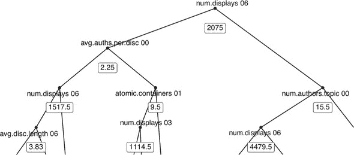

Now let’s look at the model that `tidypredict` converted to SQL. The conversion was performed in the R markdown file PDSwR2/Buzz/model_export.Rmd, which produces the rendered result PDSwR2/Buzz/model_export.md. We won’t show the code here, but instead show the first few lines of the what the first random forest tree is translated into:

```

CASE

WHEN (`num.displays_06` >= 1517.5 AND

    `avg.auths.per.disc_00` < 2.25 AND

    `num.displays_06` < 2075.0) THEN ('0')

WHEN (`num.displays_03` >= 1114.5 AND

    `atomic.containers_01` < 9.5 AND

    `avg.auths.per.disc_00` >= 2.25 AND

    `num.displays_06` < 2075.0) THEN ('0')

WHEN ...

```

The preceding code is enumerating each path from the root of the tree down. Remember that decision trees are just huge nested if/else blocks, and SQL writes `if`/`else` as `CASE`/`WHEN`. Each SQL `WHEN` clause is a path in the original decision tree. This is made clearer in figure 11.16.

Figure 11.16\. Annotating `CASE`/`WHEN` paths

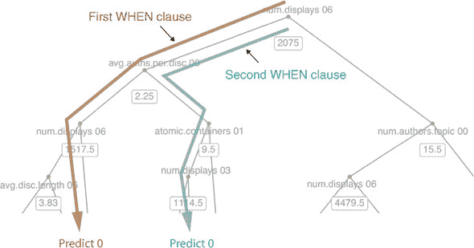

在 SQL 导出中，每棵树都被写为一系列覆盖其所有路径的 `WHEN` 情况，允许在 SQL 中执行树计算。作为用户，我们会从根节点开始追踪，向下移动节点，并根据节点条件向左或向右移动。相反，SQL 代码会评估从根到叶子的所有路径，并保留满足所有条件的唯一路径的结果。这是一种评估树的特殊方式，但它将所有内容转换为一个一次性公式，可以导出到 SQL。

整体思路是这样的：我们已经将随机森林模型导出为其他程序可以读取的格式，即 SQL。从那时起，其他人可以拥有这个完成的模型。

一个值得考虑的重要导出系统是 *预测模型标记语言* (PMML)，它是一个用于在不同系统间共享模型的 XML 标准.^([7])

> ⁷
> 
> 例如，查看 PMML 包 [`CRAN.R-project.org/package=pmml`](https://CRAN.R-project.org/package=pmml)。

### 11.4.4\. 应该记住什么

现在，你应该能够舒适地向他人展示 R 模型。部署和展示技术包括

+   设置一个模型作为其他人可以实验的 HTTP 服务

+   使用 Shiny 设置微应用

+   导出模型以便在生产环境中重新实现模型应用

## 摘要

在本章中，我们致力于管理和分享你的工作。此外，我们还展示了设置演示 HTTP 服务和导出模型供其他软件使用的技巧（这样你就不需要在生产中添加 R 作为依赖）。到目前为止，你已经构建了一些时间机器学习模型，并且你现在有一些在一段时间内与合作伙伴高效工作使用模型的技巧。

这里有一些关键要点：

+   使用 knitr 生成重要的可重复里程碑/检查点文档。

+   写出有效的注释。

+   使用版本控制保存你的工作历史。

+   使用版本控制与他人协作。

+   使你的模型可供合作伙伴进行实验、测试和生产部署。

在下一章中，我们将探讨如何正式展示和解释你的工作。
