# 第十二章. 制作有效的展示

本章涵盖

+   向项目赞助商展示您的结果

+   与您的模型最终用户沟通

+   向同行数据科学家展示您的结果

在上一章中，您看到了如何有效地记录您日常的项目工作以及如何将您的模型部署到生产中。这包括支持运营团队所需的额外文档。在本章中，我们将探讨如何向其他感兴趣的相关方展示您项目的成果。正如我们在心智模型(图 12.1)中所看到的，本章全部关于文档和展示。

图 12.1. 心智模型

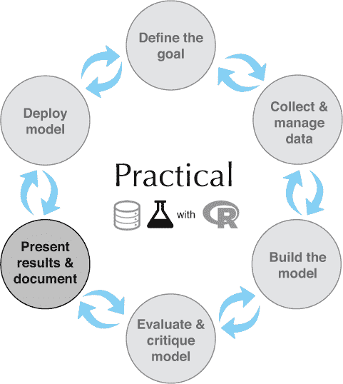

我们将继续使用上一章的例子。

* * *

示例

*假设您的公司（让我们称其为 WVCorp）生产和销售家用电子设备和相关的软件及应用。WVCorp 希望监控公司产品论坛和讨论板上的话题，以识别“即将热议”的问题：那些即将引起大量兴趣和活跃讨论的话题。这些信息可以被产品团队和市场团队用来主动识别未来发布所需的产品特性，并快速发现现有产品特性的问题。您的团队已经成功构建了一个模型来识别论坛上的即将热议的话题。现在您想向项目赞助商解释项目结果，同时也向将使用您模型结果的产品经理、市场经理和支持工程经理解释。*

* * *

表 12.1 总结了我们场景中的相关实体，包括贵公司及其竞争对手销售的产品。

表 12.1. buzz 模型场景中的实体

| 实体 | 描述 |
| --- | --- |
| WVCorp | 您所在的公司 |
| eRead | WVCorp 的电子书阅读器 |
| TimeWrangler | WVCorp 的时间管理应用 |
| BookBits | 竞争对手的电子书阅读器 |
| GCal | TimeWrangler 可以集成的第三方云日历服务 |

* * *

**关于数据和示例项目的免责声明**

我们用于 buzz 模型的数据集是从 Tom’s Hardware ([tomshardware.com](http://tomshardware.com)) 收集的，这是一个讨论电子和电子设备的实际论坛。Tom’s Hardware 与任何特定的产品供应商无关，数据集没有指定记录的主题。本章的示例场景是为了展示会产生与 Tom’s Hardware 数据集类似数据的情景。我们示例中的所有产品名称和论坛主题都是虚构的。

* * *

让我们从为项目赞助商的展示开始.^([1])

> ¹
> 
> 我们提供了示例演示文稿的 PDF 版本，可在[`github.com/WinVector/PDSwR2/tree/master/Buzz`](https://github.com/WinVector/PDSwR2/tree/master/Buzz)找到，文件名为 ProjectSponsorPresentation.pdf、UserPresentation.pdf 和 PeerPresentation.pdf。该目录还包括这些演示文稿的手册，包含简要笔记，格式为 xxxPresentation_withNotes.pdf。

## 12.1. 向项目赞助人展示你的结果

如第一章所述，项目赞助人是希望获得数据科学结果的人——通常是为了满足商业需求。尽管项目赞助人可能具有技术或定量背景，并且可能喜欢听关于技术细节和细微差别，但他们的主要兴趣是面向商业的，因此你应该用商业问题的术语讨论你的结果，尽量减少技术细节。

你还应该记住，赞助人通常会感兴趣将你的工作“推销”给组织中的其他人，以争取支持并获取额外的资源以维持项目的进行。你的演示文稿将是赞助人将与这些人分享的部分，这些人可能不如你和你的赞助人对项目的背景那么熟悉。

为了涵盖这些考虑因素，我们推荐以下类似的结构：

1.  总结项目背后的动机及其目标。

1.  陈述项目的成果。

1.  如有必要，用详细信息备份结果。

1.  讨论建议、未解决的问题和可能未来的工作。

有些人还建议添加一个“执行摘要”幻灯片：对要点 1 和 2 的一个单页摘要。

你如何处理每个要点——时长、详细程度——取决于你的听众和情况。一般来说，我们建议保持演示简短。在本节中，我们将提供一些在我们 buzz 模型示例背景下的示例幻灯片。

让我们逐一详细说明每个要点。

* * *

**我们将专注于内容，而非视觉**

本章的讨论将集中在演示文稿的内容上，而不是幻灯片的视觉格式。在实际演示中，你可能会更喜欢比我们提供的幻灯片更多的视觉元素和更少的文本。如果你在寻找有关演示视觉和引人注目的演示数据可视化的指导，两本好书是

+   Michael Alley，*《科学演示的技艺》*（Springer，2007）

+   Cole Nussbaumer Knaflic，*《用数据讲故事》*（Wiley，2015）

如果你阅读这些文本，你会注意到我们的例子演示文稿违反了他们所有的建议。想想我们的骨骼演示文稿就像是你将填充成更具视觉吸引力的格式的提纲。

值得指出的是，Alley 和 Knaflic 推荐的以视觉为导向、低文本格式的目的是**展示**，而不是阅读。在演讲幻灯片中，用报告或备忘录代替的情况很常见。如果你要将你的演示文稿分发给那些不会看到你亲自演示的人，确保包含全面的演讲者笔记。否则，可能更适合采用大量项目符号、文本密集的演示格式。

* * *

### 12.1.1\. 总结项目目标

本节演示文稿旨在为整个演讲提供背景，特别是如果它将被分发给公司中那些没有像你的项目赞助人那样密切参与的人。让我们为 WVCorp 嗡嗡模型示例准备目标幻灯片。

在图 12.2 中，我们通过展示业务需求和项目如何满足这一需求，为项目的动机提供背景。在我们的例子中，eRead 是 WVCorp 的电子书阅读器，它曾一度引领市场，直到我们的竞争对手发布了他们电子书阅读器 BookBits 的新版本。BookBits 的新版本有一个共享书架功能，而 eRead 没有提供——尽管许多 eRead 用户在论坛上表达了希望拥有这种功能的需求。不幸的是，论坛流量如此之高，以至于产品经理难以跟上，并且不知何故错过了这一用户需求的表达。因此，WVCorp 由于未能预见共享书架功能的需求而失去了市场份额。

图 12.2\. 项目动机

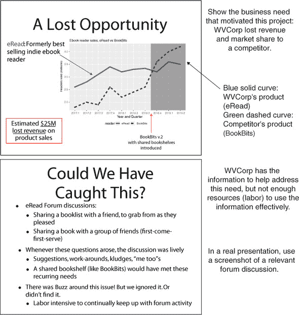

在图 12.3 中，我们根据图 12.2 中设定的动机，陈述了项目目标。我们希望检测论坛上即将引起热议的话题，以便产品经理能够及早发现新兴问题。

图 12.3\. 陈述项目目标

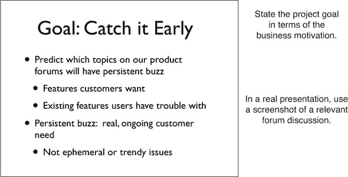

一旦你确定了项目的背景，你应该直接进入项目的结果。你的演示文稿不是惊悚电影——不要让你的观众保持悬念！

### 12.1.2\. 陈述项目结果

本节演示文稿简要描述了在满足业务需求的情况下你所做的工作以及结果。图 12.4 描述了嗡嗡模型试点研究以及你所发现的内容。

图 12.4\. 描述项目和其结果

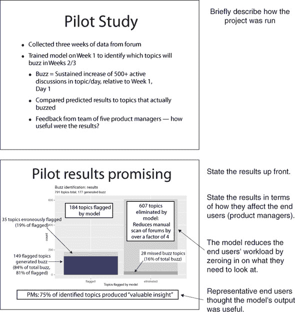

保持对结果的讨论具体且非技术性。你的听众对模型本身的细节不感兴趣，而是更关心你的模型如何帮助你解决了在演讲动机部分提到的那个问题。不要用精确度、召回率或其他技术指标来谈论你的模型性能，而应该讨论它如何减轻模型最终用户的负担，他们觉得结果有多有用，以及模型遗漏了什么。在模型与货币结果更紧密相关的项目中，例如贷款违约预测，尝试估计你的模型可能为公司产生多少潜在收益或节省多少成本。

### 12.1.3\. 填充细节

一旦你的听众知道了你做了什么，为什么，以及你在商业角度上的成功程度，你就可以填充细节来帮助他们更好地理解。像之前一样，尽量保持讨论相对非技术性，并基于业务流程。描述模型在业务流程或工作流程中的位置以及一些有趣的发现示例将很好地融入这一部分，如图 12.5 所示。

图 12.5\. 更详细地讨论你的工作

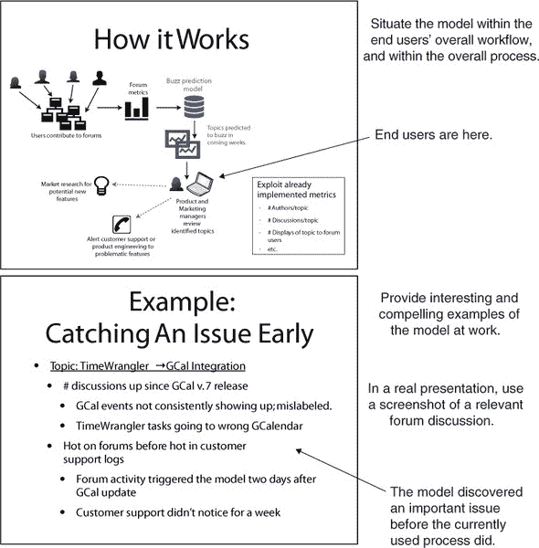

图 12.5 中的“如何工作”幻灯片展示了 buzz 模型在产品经理工作流程中的位置。我们强调（到目前为止）我们使用的是已经集成到系统中的指标（从而最小化需要引入工作流程的新流程数量）。我们还介绍了模型输出可能被潜在使用的途径：为潜在的新功能生成线索，并警告产品支持团队即将出现的问题。

图 12.5 的底部幻灯片展示了项目中的一个有趣发现（在实际演示中，你可能会展示多个）。在这个例子中，Time-Wrangler 是 WVCorp 的时间管理产品，而 GCal 是一个第三方基于云的日历服务，TimeWrangler 可以与之通信。在这个幻灯片中，我们展示了模型如何能够比 TimeWrangler 团队原本预期的时间更早地识别出 TimeWrangler 和 GCal 之间的集成问题（从客户支持日志中）。这样的例子使模型的价值具体化。

我们也在这次演示文稿中包含了一页来讨论建模算法（如图 12.6 所示）。您是否使用这一页取决于听众——一些听众可能具有技术背景，并会对您选择的建模方法感兴趣。其他听众可能不关心。无论如何，请保持简短，并专注于对技术的高层次描述以及为什么您认为这是一个好的选择。如果听众中有任何人对细节感兴趣，他们可以提问——如果您预计听众中有这样的人，您可以准备额外的幻灯片来涵盖可能的问题。否则，请准备好快速处理这一点，或者完全跳过。

图 12.6\. 关于建模方法的可选幻灯片

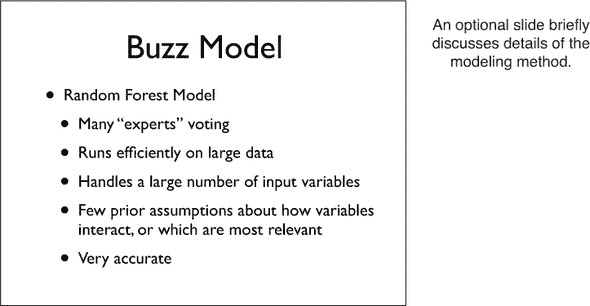

在本节中，您可能还想讨论其他一些细节。例如，如果参与您试点研究的产品经理给出了有趣的引言或反馈——使用模型后他们的工作多么容易，他们认为特别有价值的发现，他们对如何改进模型的想法——您可以在这里提及这些反馈。这是您让公司其他人对您在这个项目上的工作感兴趣并鼓动持续支持后续工作的机会。

### 12.1.4\. 提出建议和讨论未来工作

没有一个项目能产生完美的结果，您应该坦率（但乐观）地讨论您结果中的局限性。在嗡嗡模型示例中，我们在演示文稿结束时列出了一些我们希望进行的改进和后续工作，如图 12.7 所示。当然，作为数据科学家，您当然对提高模型性能感兴趣，但对于听众来说，提高模型的重要性不如提高过程（更好地满足业务需求）重要。从这一角度来框架讨论。

图 12.7\. 讨论未来工作

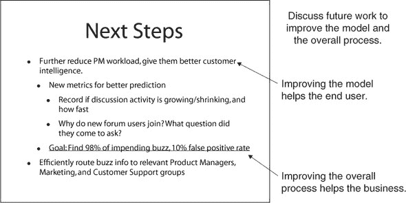

项目赞助人演示文稿侧重于整体情况以及您的结果如何帮助更好地满足业务需求。面向最终用户的演示文稿将涵盖许多相同的内容，但现在您将讨论框架放在最终用户的流程和关注点上。我们将在下一节中查看关于嗡嗡模型的用户演示。

### 12.1.5\. 项目赞助人演示文稿要点

关于项目赞助人演示文稿，您应该记住以下几点：

+   请保持简短。

+   请将重点放在业务问题上，而不是技术问题上。

+   您的项目赞助人可能会使用您的演示文稿来帮助向组织中的其他人推销项目或其结果。在介绍背景和动机时，请记住这一点。

+   在演示文稿的早期就介绍您的结果，而不是逐步构建。

## 12.2\. 向最终用户展示您的模型

无论您的模型表现得多好，重要的是实际使用它的人对其输出有信心，并愿意采用它。否则，模型将不会被使用，您的努力将白费。希望您在项目中涉及了最终用户——在我们的热点模型示例中，我们有五位产品经理帮助进行试点研究。最终用户可以帮助您向他们的同事推销模型的益处。

在本节中，我们将给出一个示例，说明您如何向最终用户展示您项目的成果。根据情况，您可能并不总是进行明确的演示：您可能提供用户手册或其他文档。然而，无论信息如何传递给用户，我们都认为让他们知道模型旨在使他们的工作流程更简单，而不是更复杂，是很重要的。为了本章节的目的，我们将使用演示格式。

对于最终用户演示，我们建议采用以下类似的结构：

1.  总结项目背后的动机及其目标。

1.  展示模型如何融入用户的工作流程（以及它如何改进该工作流程）。

1.  展示如何使用模型。

让我们逐一探讨这些观点，从项目目标开始。

### 12.2.1\. 总结项目目标

对于模型的目标用户，讨论商业动机不如关注模型对他们的影响那么重要。在我们的例子中，产品经理已经通过论坛来了解客户需求和问题。我们项目的目标是帮助他们将注意力集中在“好东西”——热点上。如图 12.8 图 12.8 中的示例幻灯片直接指向这一点。用户已经知道他们想要找到热点；我们的模型将帮助他们更有效地搜索。

图 12.8\. 项目动机

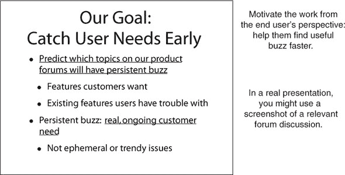

### 12.2.2\. 展示模型如何融入用户工作流程

在演示的这一部分，您解释模型如何帮助用户完成工作。一个很好的方法是提供典型用户工作流程的前后场景，就像我们在图 12.9 中展示的那样。

图 12.9\. 模型前后用户工作流程

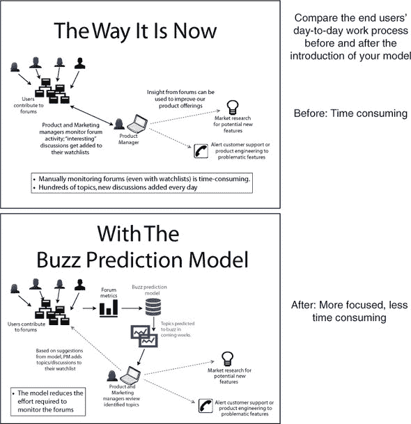

假设用户已经明显意识到之前的流程及其缺点。之后的幻灯片强调模型将为他们进行一些初步的论坛主题筛选。模型的输出帮助用户管理他们已经存在的关注列表，当然用户也可以直接访问论坛。

下一张幻灯片（图 12.10，顶部）使用试点研究结果来展示模型可以减少监控论坛所需的工作量，并且确实提供了有用的信息。我们在图 12.10 的底部幻灯片中详细阐述了这一点（我们在项目赞助人演示中也用到的 TimeWrangler 示例）。

图 12.10. 从用户的角度展示模型的益处。

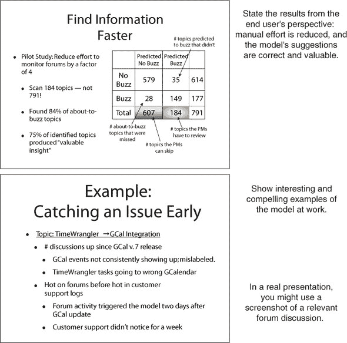

您可能还希望填写更多关于模型如何操作的详细信息。例如，用户可能想知道模型的输入是什么（图 12.11），这样他们就可以将这些输入与他们自己手动在论坛上寻找有趣信息时考虑的内容进行比较。

图 12.11. 提供对用户相关的技术细节。

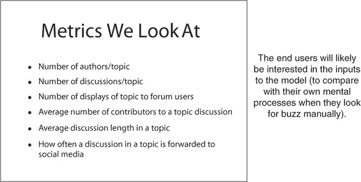

一旦您展示了模型如何融入用户工作流程，您就可以解释用户将如何使用它。

### 12.2.3. 展示如何使用模型

本节可能是演示的主要内容，您将在其中教授用户如何使用模型。图 12.12 中的幻灯片描述了产品经理如何与 Buzz 模型交互。在这个示例场景中，我们假设产品经理已经有了一个机制，可以将论坛中的主题和讨论添加到观察列表中，以及一个机制来监控该观察列表。模型将单独向用户发送关于他们感兴趣的主题即将出现的嗡嗡声的通知。

图 12.12. 描述用户如何与模型交互。

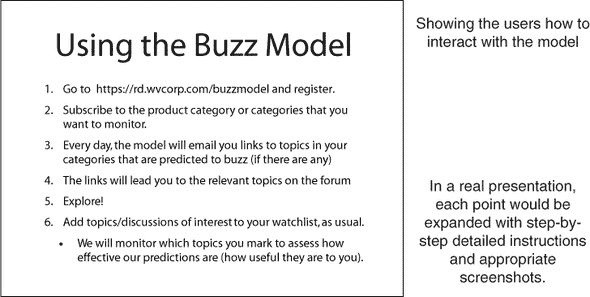

在实际演示中，您将扩展每个要点，引导用户了解他们如何使用模型：他们用来与模型交互的 GUI 截图，以及模型输出的截图。我们在图 12.13 中提供了一个示例幻灯片：一个通知电子邮件的截图，并附有注释来解释用户视图。到本节结束时，用户应该了解如何使用 Buzz 模型以及如何处理 Buzz 模型的结果。

图 12.13. 一个示例教学幻灯片

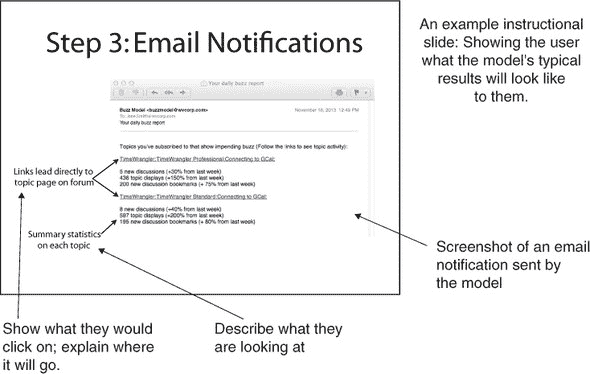

最后，我们包括了一个幻灯片，要求用户在认真使用模型后对其提供反馈。这显示在图 12.14 中。用户的反馈可以帮助您（以及其他一旦模型投入运行就支持该模型的团队）改善用户体验，使模型被接受和广泛采用的可能性更大。

图 12.14. 向用户征求反馈。

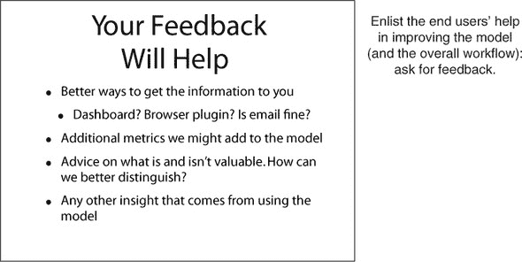

除了向项目赞助人和最终用户展示您的模型之外，您可能还需要向您组织内的其他数据科学家或组织外的数据科学家展示您的工作。我们将在下一节中介绍同行展示。

### 12.2.4. 最终用户演示要点

关于最终用户展示，以下是你应该记住的：

+   你的主要目标是说服用户他们想要使用你的模型。

+   专注于模型如何影响（改善）最终用户日常流程。

+   描述如何使用模型以及如何解释或使用模型的输出。

## 12.3\. 向其他数据科学家展示你的工作

向其他数据科学家展示你的工作，这给了他们评估你的工作的机会，也给了你从他们的洞察力中受益的机会。他们可能会在问题中看到你忽略的东西，并可以提出对你方法或你未考虑过的替代方法的好建议。

其他数据科学家主要会对你所使用的建模方法、你尝试的标准技术的任何变化以及与建模过程相关的有趣发现感兴趣。向你的同行进行展示通常具有以下结构：

1.  介绍问题。

1.  讨论相关工作。

1.  讨论你的方法。

1.  提供结果和发现。

1.  讨论未来工作。

让我们详细地走一遍这些步骤。

### 12.3.1\. 介绍问题

你的同行通常对你试图解决的预测任务（如果有的话）最感兴趣，并且不需要像项目发起人或最终用户那样多的背景信息。在图 12.15 中，我们首先介绍了“热点”的概念以及为什么它很重要，然后直接进入预测任务。

图 12.15\. 介绍项目

当你在自己组织内的其他数据科学家面前进行展示时，这种方法最好，因为你们都共享组织需求的背景。当你向组织外的同行群体进行展示时，你可能想要从业务问题开始（例如，项目发起人展示的前两页幻灯片，图 12.2 和 12.3），为他们提供一些背景信息。

### 12.3.2\. 讨论相关工作

学术演讲通常有一个相关工作部分，其中你讨论了其他人对你问题相关的研究，他们采取了什么方法，以及他们的方法与你的方法相似或不同。热点模型项目的相关工作幻灯片如图 12.16 所示。

图 12.16\. 讨论相关工作

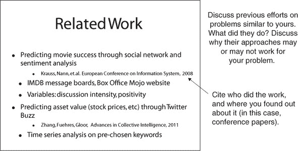

你不是在进行学术演讲；对你来说，你的方法成功比新颖更重要。对你来说，相关工作幻灯片是一个讨论你考虑过的其他方法以及为什么它们可能不完全适合你特定问题的机会。

在讨论了你考虑过并拒绝的方法之后，你接下来可以讨论你实际采用的方法。

### 12.3.3\. 讨论你的方法

详细地讨论你所做的工作，包括你必须做出的妥协和遇到的挫折。这为听众提供了背景信息，并增强了他们对你的工作和能力的信心。以我们的例子来说，图 12.17 介绍了我们进行的试点研究，我们使用的数据以及我们选择的建模方法。它还提到一组最终用户（五位产品经理）参与了该项目；这确立了我们确保模型输出有用和相关的做法。

图 12.17. 介绍试点研究

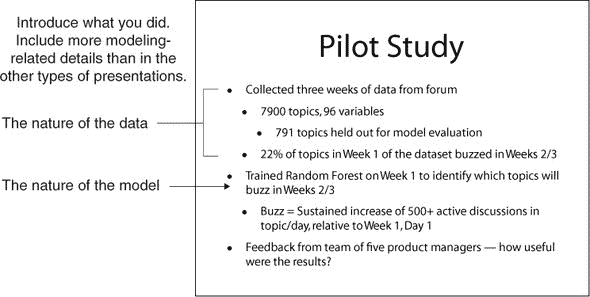

在你介绍了试点研究之后，你介绍你使用的输入变量和建模方法（图 12.18）。在这种情况下，数据集没有合适的变量——如果我们有适当的数据，我们本可以做更多的时间序列分析，但我们想从已经在产品论坛系统中实施的一些指标开始。对此要坦率。

图 12.18. 讨论模型输入和建模方法

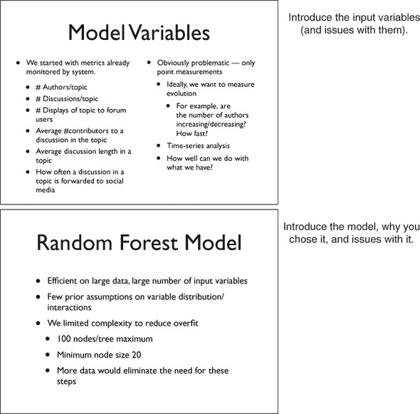

幻灯片还讨论了我们选择的建模方法——随机森林——以及为什么选择它。由于我们必须修改标准方法（通过限制模型复杂性），我们也提到了这一点。

### 12.3.4. 讨论结果和未来工作

一旦你讨论了你的方法，你可以讨论你的结果。在图 12.19 中，我们讨论了我们的模型性能（精确度/召回率），并确认代表性最终用户确实发现模型输出对他们的工作有用。

图 12.19. 展示模型性能

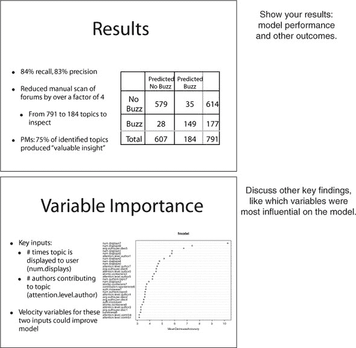

图 12.19 的底部幻灯片显示了在模型中最有影响力的变量（记住，变量重要性计算是构建随机森林的一个副作用）。在这种情况下，最重要的变量是主题在各个日子上显示的次数以及有多少作者为该主题做出贡献。这表明这两个变量的时间序列数据可能特别有助于提高模型性能。

你还希望在本节演讲中添加一些引人注目的发现示例——例如，我们在其他两个演示中展示的 TimeWrangler 集成问题。

一旦你展示了模型性能和其他工作成果，你可以在图 12.20 所示的方式中，讨论可能的改进和未来的工作。

图 12.20. 讨论未来工作

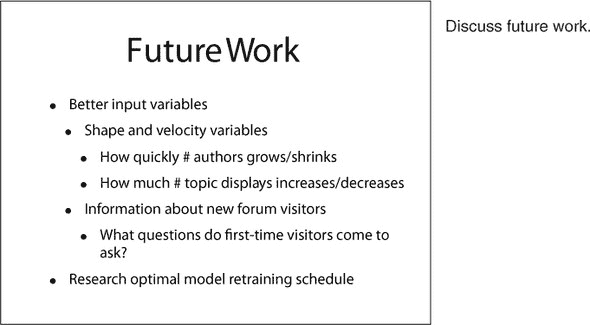

在未来工作幻灯片上的某些观点——特别是对速度变量的需求——自然地从之前的工作和发现讨论中产生。其他一些，如关于模型重新训练计划的工作，在演讲的前部分并没有那么强烈地预示，但可能会在您的观众中引起注意，并且在这里简要阐述是值得的。再次强调，您应该坦率地、乐观地说明您模型的局限性——特别是因为这个观众可能已经看到了这些局限性。

### 12.3.5. 同行演示要点

关于您向数据科学家同行展示的演示，以下是你应该记住的：

+   同行演示主要可以由建模任务激发。

+   与之前的演示不同，同行演示可以（并且应该）包含丰富的技术细节。

+   在构建模型时，要坦率地说明模型的局限性和所做的假设。您的观众可能已经发现了许多局限性。

## 摘要

在本章中，您已经看到了如何向三个不同的观众展示您的工作成果。每个观众都有自己的视角和兴趣点，您的演讲应该针对这些兴趣点进行调整。组织您的演示，宣布一个共同的目标并展示您如何实现这个目标。我们建议了组织每种类型演讲的方法，这将帮助您适当地调整讨论。

我们的建议并非一成不变：您可能有一个想要深入了解更技术细节的项目赞助商或其他感兴趣的执行人员，或者有对模型内部工作原理好奇的最终用户。您也可能有想要了解更多关于业务背景的同行观众。如果您提前知道这一点（可能是因为您之前向这个观众做过演示），那么您应该在演讲中包含适当级别的细节。如果您不确定，您也可以准备备用幻灯片，根据需要使用。只有一个硬性规则：要对您的观众表示同情。

在本章中，您已经学到了

+   如何为项目赞助商准备以业务为导向的演示

+   如何为最终用户准备演示（或文档），向他们展示如何使用您的模型并说服他们想要使用它

+   如何为您的同行准备更技术性的演示
