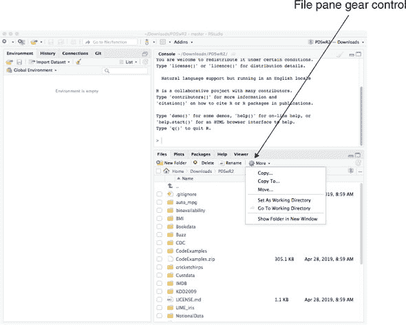
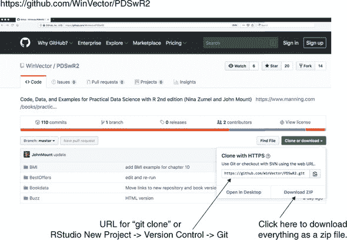
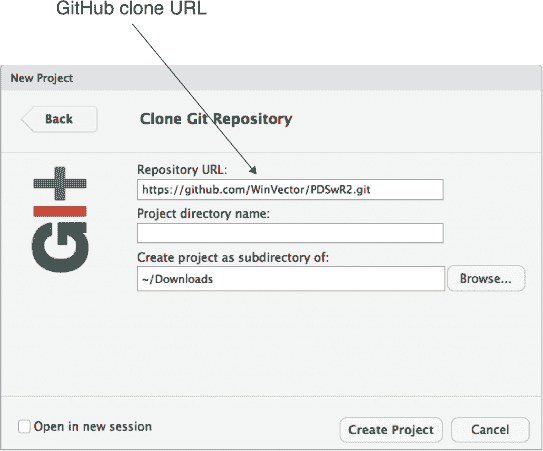
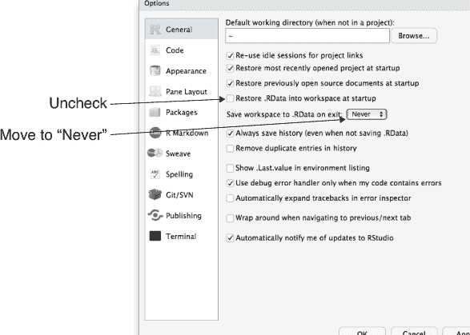
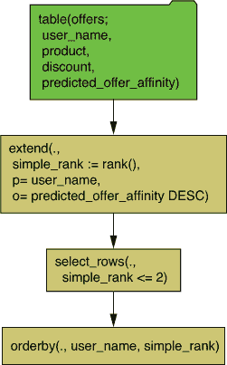

# 附录 A. 从 R 和其他工具开始

在这个附录中，我们将展示如何安装工具并开始使用 R。我们将演示一些示例概念和步骤，但你可能需要进一步阅读以获取更多信息。

章节 A.1 是所有读者都应该回顾的内容，因为它展示了如何获取本书的所有软件支持材料。其他章节应根据需要考虑，因为它们概述了 R 的工作细节（读者可能已经知道）以及一些可能不是所有读者都需要的具体应用（例如使用数据库）。在本书中，我们尽量避免“以防万一”的教学，但在附录中，我们提供了一些你可能“可能”需要的东西。

## A.1. 安装工具

我们的工作示例的主要工具将是 R，以及可能还有 RStudio。但其他工具（数据库、版本控制、编译器等）也非常推荐。你可能还需要访问在线文档或其他帮助，以便在你的环境中使用所有这些工具。我们列出的发行站点是一个良好的起点。

### A.1.1. 安装工具

R 环境是一套可以安装在 Unix、Linux、Apple macOS 和 Windows 上的工具和软件。

R

我们推荐从综合 R 档案网络（CRAN）[`cran.r-project.org`](https://cran.r-project.org)或其镜像安装最新的 R 版本。CRAN 是 R 及其软件包的官方中央仓库。CRAN 由 R 基金会和 R 开发核心团队支持。R 本身是自由软件基金会 GNU 项目的官方部分，在 GPL 2 许可证下分发。R 被许多大型机构使用，包括美国食品药品监督管理局。^([[1)]

> ¹
> 
> 来源：[`www.r-project.org/doc/R-FDA.pdf`](https://www.r-project.org/doc/R-FDA.pdf)。

对于这本书，我们建议使用至少 R 版本 3.5.0 或更新的版本。

要使用 R，你需要一个专门用于处理非格式化（或非丰富）文本的文本编辑器。这些编辑器包括 Atom、Emacs、Notepad++、Pico、Programmer’s Notepad、RStudio、Sublime Text、text wrangler、vim 等。这些与富文本编辑器（不适用于编程任务）形成对比，例如 Microsoft Word 或 Apple Text Edit。

RStudio

我们建议在用 R 工作时考虑使用 RStudio。RStudio 是由 RStudio, Inc.提供的流行跨平台集成开发环境([`www.rstudio.com`](https://www.rstudio.com))。RStudio 提供内置文本编辑器和方便的用户界面，用于执行安装软件、渲染 R Markdown 文档和操作源代码控制等常见任务。RStudio 不是 R 或 CRAN 的官方部分，不应与 R 或 CRAN 混淆。

RStudio 的重要特性之一是文件浏览器和位于文件浏览面板齿轮图标中的隐藏的设置目录/转到目录控件，我们在图 A.1 中指出。

图 A.1\. RStudio 文件浏览控件



RStudio 不是使用 R 或完成本书中的示例的必要条件。

Git

Git 是一种源代码控制或版本管理系统，对于保存和共享工作非常有用。要安装 Git，请遵循 [`git-scm.com`](https://git-scm.com) 上的适当说明。

数据科学总是涉及大量的工具和协作，因此愿意尝试新工具是必须培养的灵活性。

书籍支持材料

书中所有支持材料均可在 GitHub 上免费获取：[`github.com/WinVector/PDSwR2`](https://github.com/WinVector/PDSwR2)，如图 A.2 所示。读者应下载全部内容，可以使用 `git clone` 命令和 URL [`github.com/WinVector/PDSwR2.git`](https://github.com/WinVector/PDSwR2.git) 进行下载，或者通过在 GitHub 页面右上角的“克隆或下载”控件中下载完整的 zip 文件。

图 A.2\. 从 GitHub 下载书籍材料



下载书籍材料的另一种方法是使用 RStudio 和 Git。选择文件 > 新建项目 > 从版本控制创建项目 > Git。这将弹出一个对话框，如图 A.3 所示。您可以在其中填写 Git URL 并将书籍材料作为项目下载。

图 A.3\. 克隆书籍仓库



我们将在整本书中引用此目录为 PDSwR2，我们提到的所有文件和路径要么在此目录中，要么在子目录中。请确保在此目录中查找任何 README 或勘误文件。

支持目录的一些特性包括以下内容：

+   书中使用的所有示例数据。

+   书中使用的所有示例代码。书中的示例可在 CodeExamples 子目录中找到，也可以作为 CodeExamples.zip 文件下载。此外，整个示例集，包括重新运行和重新渲染的示例，都在 RenderedExamples 中共享。（所有路径均相对于您解压的书籍目录 PDSwR2。） 

R 包

R 的一大优势是 CRAN 中心包仓库。R 通过 `install.packages()` 命令实现了标准化的包安装。一个安装的包通常在通过 `library()` 命令附加以供使用之前，在项目中并不完全可用.^([2]) 良好的做法是：任何类型的 R 脚本或工作都应首先附加它打算使用的所有包。此外，在大多数情况下，脚本不应调用 `install.packages()`，因为这会改变 R 的安装，这不应在没有用户监督的情况下进行。

> ²
> 
> 在 R 中，安装软件包是使用软件包的一个独立步骤。`install.packages()` 使软件包内容可能可用；之后，`library()` 准备它们以供使用。一个方便的记忆法是：`install.packages()` 在你的厨房中设置新的家电，而 `library()` 则是打开它们。你不必经常安装东西，然而你经常需要重新打开它们。

安装所需软件包

要安装本书中所有示例所需的一组软件包，首先按照之前描述的方法下载本书的仓库。然后查看该仓库的第一个目录或顶级目录：PDSwR2\. 在这个目录中，你会找到名为 packages.R 的文件。你可以用文本编辑器打开这个文件，它应该看起来像下面这样（尽管它可能比这里显示的更新）。

```
# Please have an up to date version of R (3.5.*, or newer)
# Answer "no" to:
# Do you want to install from sources the packages which need compilation?
update.packages(ask = FALSE, checkBuilt = TRUE)

pkgs <- c(
    "arules", "bitops", "caTools", "cdata", "data.table", "DBI",
    "dbplyr", "DiagrammeR", "dplyr", "e1071", "fpc", "ggplot2",
    "glmnet", "glmnetUtils", "gridExtra", "hexbin", "kernlab",
    "igraph", "knitr", "lime", "lubridate", "magrittr", "MASS",
    "mgcv", "pander", "plotly", "pwr", "randomForest", "readr",
    "readxls", "rmarkdown", "rpart", "rpart.plot", "RPostgres",
    "rqdatatable", "rquery", "RSQLite", "scales", "sigr", "sqldf",
    "tidypredict", "text2vec", "tidyr", "vtreat", "wrapr", "WVPlots",
    "xgboost", "xts", "webshot", "zeallot", "zoo")

install.packages(
    pkgs,
    dependencies = c("Depends", "Imports", "LinkingTo"))
```

要安装所有内容，请在 R 中运行此文件中的每一行代码.^([3])

> ³
> 
> 之前提到的代码可以在 [`github.com/WinVector/PDSwR2`](https://github.com/WinVector/PDSwR2) 的 packages.R 文件中找到。我们可以称之为 PDSwR2/packages.R，这可能意味着来自原始 GitHub URL 的文件或 GitHub 仓库的本地副本。

很不幸，安装可能会因为许多原因失败：错误的复制粘贴、没有网络连接、R 或 RStudio 配置不当、没有足够的权限管理 R 安装、R 或 RStudio 版本过旧、缺少系统要求，或者没有或错误的 C/C++/Fortran 编译器。如果你遇到这些问题，最好是找到一个论坛或专家来帮助你完成这些步骤。一旦所有内容都成功安装，R 就是一个自包含的环境，其中事物可以正常工作。

并非所有软件包对所有示例都是必需的，所以如果你在整体安装过程中遇到麻烦，只需尝试在书中工作示例。这里有一个警告：如果你看到一个 `library(pkgname)` 命令失败，请尝试 `install.packages('pkgname')` 来安装缺失的软件包。前面的软件包列表只是试图在一步中解决所有问题。

其他工具

可以通过使用 Perl、gcc/clang、gfortran、git、Rcpp、TeX、pandoc、ImageMagick 和 Bash shell 等工具来增强 R 的功能。这些工具都在 R 之外管理，如何维护它们取决于你的计算机、操作系统和系统权限。Unix/Linux 用户安装这些工具最简单，R 主要是在 Unix 环境中开发的.^([5]) RStudio 将安装一些额外的工具。macOS 用户可能需要 Apple 的 Xcode 工具和 Homebrew ([`brew.sh`](https://brew.sh)) 来获得所有必需的工具。希望编写软件包的 Windows 用户可能需要研究 RTools ([`cran.r-project.org/bin/windows/Rtools/`](https://cran.r-project.org/bin/windows/Rtools/))。

> ⁴
> 
> 查看 [`www.perl.org/get.html`](https://www.perl.org/get.html)。
> 
> ⁵
> 
> 例如，我们在这里分享如何在 Amazon EC2 实例上快速配置 R 和 RStudio Server 的笔记：[www.win-vector.com/blog/2018/01/setting-up-rstudio-server-quickly-on-amazon-ec2/](http://www.win-vector.com/blog/2018/01/setting-up-rstudio-server-quickly-on-amazon-ec2/)。

Windows 用户可能需要 RTools 来编译包；然而，这通常不是严格必要的，因为大多数当前包都以预编译形式从 CRAN 提供（至少对于 macOS 和 64 位 Windows）。macOS 用户可能需要安装 Xcode 编译器（由 Apple 提供）来编译包。所有这些都是在你需要编译能力之前可能想要跳过的步骤。

### A.1.2\. R 包系统

R 是一种广泛且强大的语言，本身就是一个分析工作平台。但它的真正优势之一是包系统的深度以及通过 CRAN 提供的包。要从 CRAN 安装一个包，只需输入 `install.packages('nameofpackage')`。要使用已安装的包，输入 `library(nameofpackage)`。^([6]) 每次你输入 `library('nameofpackage')` 或 `require('nameofpackage')`，你都在假设你正在使用一个内置包，或者如果你需要的话，能够运行 `install.packages('nameofpackage')`。在这本书中，我们将反复回到包系统。要查看你的会话中存在哪些包，输入 `sessionInfo()`。

> ⁶
> 
> 实际上，`library('nameofpackage')` 也可以使用引号。未使用引号的形式在 R 中有效，因为 R 有能力延迟参数评估（所以未定义的 `nameofpackage` 不会导致错误）以及能够窥探参数变量的名称（大多数编程语言只依赖于参数的引用或值）。鉴于数据科学家整天都要与许多工具和语言打交道，我们更喜欢不依赖于特定于一种语言的特性，除非我们真的需要这个特性。但“官方 R 风格”是不使用引号的。

* * *

更改你的 CRAN 镜像

你可以使用 `chooseCRANmirror()` 命令随时更改你的 CRAN 镜像。如果你正在使用的镜像很慢，这会很有用。

* * *

### A.1.3\. 安装 Git

我们建议在向你展示如何使用 R 和 RStudio 之前安装 Git 版本控制。这是因为如果没有 Git 或类似工具，你会丢失重要的工作。不仅仅是丢失 *你的* 工作——你还会丢失重要的 *客户* 工作。许多数据科学工作（尤其是分析任务）涉及尝试变体和学习新事物。有时你会学到一些令人惊讶的东西，需要重新进行早期的实验。版本控制保留了所有工作的早期版本，因此它是恢复早期实验中使用的代码和设置的完美工具。Git 可从 [`git-scm.com`](http://git-scm.com) 的预编译包中获得。

### A.1.4\. 安装 RStudio

RStudio 提供了一个文本编辑器（用于编辑 R 脚本）和 R 的集成开发环境。在从 [`rstudio.com`](http://rstudio.com) 获取 RStudio 之前，你应该安装 R 和 Git，就像我们之前描述的那样。

你最初想要的 RStudio 产品称为 *RStudio Desktop*，它为 Windows、Linux 和 macOS 提供了预编译版本。

当你刚开始使用 RStudio 时，我们强烈建议关闭“启动时将 .RData 恢复到工作区”和“退出时将工作区保存到 .RData”这两个功能。这些设置（默认）开启会使“干净工作”（我们将在 章节 A.3 中讨论）变得难以可靠。要关闭这些功能，请打开 RStudio 选项面板（全局选项可以通过例如菜单 RStudio > 预设，工具 > 全局选项，工具 > 选项或类似的方式找到，具体取决于你使用的操作系统），然后按照 图 A.4 中的指示更改这两个设置。

图 A.4\. RStudio 选项



### A.1.5\. R 资源

R 的强大功能很大程度上来自于其庞大的包家族，这些包可以从 CRAN 仓库获取。在本节中，我们将指出一些包和文档。

安装 R 视图

R 提供了一套非常深入的可用库。通常，R 已经有了你想要的包；只是需要找到它。一种强大的查找 R 包的方法是使用 *视图*：[`cran.r-project.org/web/views/`](http://cran.r-project.org/web/views/)。

你也可以通过一个命令（尽管警告：这可能需要一个小时才能完成）安装所有包（包括帮助文档）。例如，这里我们一次性安装了一个庞大的时间序列库集合：

```
install.packages('ctv', repos = 'https://cran.r-project.org')
library('ctv')
# install.views('TimeSeries') # can take a LONG time
```

一旦完成这些，你就可以尝试示例和代码了。

在线 R 资源

在线有很多 R 帮助资源。我们最喜欢的资源包括以下这些：

+   ***CRAN—*** 主要的 R 网站：[`cran.r-project.org`](http://cran.r-project.org)

+   ***Stack Overflow R 部分—*** 一个问答网站：[`stackoverflow.com/questions/tagged/r`](http://stackoverflow.com/questions/tagged/r)

+   ***Quick-R—*** 一个优秀的 R 资源：[`www.statmethods.net`](http://www.statmethods.net)

+   ***LearnR—*** 将 *Lattice: Multivariate Data Visualization with R (Use R!)*（由 D. Sarker；Springer，2008）中的所有图表翻译成 ggplot2：[`learnr.wordpress.com`](http://learnr.wordpress.com)

+   ***R-bloggers—*** 一个 R 博客聚合器：[`www.r-bloggers.com`](http://www.r-bloggers.com)

+   ***RStudio 社区—*** 一个以 RStudio/tidyverse 为导向的公司网站：[`community.rstudio.com/`](https://community.rstudio.com/)

## A.2\. 从 R 开始

R 实现了一种名为 *S* 的统计编程语言的方言。S 的原始实现演变成一个名为 S+ 的商业包。因此，R 的许多语言设计决策都可以追溯到 S。为了避免混淆，当我们描述功能时，我们大部分时间只说 *R*。您可能会想知道 S/R 是什么样的命令和编程环境。它非常强大，有一个很好的命令解释器，我们鼓励您直接输入。

* * *

**干净工作**

在 R 或 RStudio 中，重要的是“干净地工作”——也就是说，从一个空的工作区开始，并明确引入您想要的包、代码和数据。这确保您知道如何进入您的准备就绪状态（因为您必须执行或写下到达那里的步骤），并且您不会受到您不知道如何恢复的状态的束缚（我们称之为“无外来工件”规则）。

要在 R 中干净地工作，你必须关闭任何类型的工作区自动恢复。在“基础 R”中，这是通过使用带有`--no-restore`命令行标志重启 R 来实现的。在 RStudio 中，会话 > 重启 R 菜单选项起到类似的作用，*如果*未选中“启动时将 .Rdata 恢复到工作区”选项。

* * *

使用 R 和向 R 发送命令实际上是脚本编写或编程。我们假设您对脚本编写（可能使用 Visual Basic、Bash、Perl、Python、Ruby 等）或编程（可能使用 C、C#、C++、Java、Lisp、Scheme 等）有些了解，或者愿意使用我们的参考资料之一来学习。我们并不打算在 R 中编写长程序，但我们必须展示如何发出 R 命令。R 的编程虽然功能强大，但与许多流行的编程语言略有不同，但我们相信，只要有一些指导，任何人都可以使用 R。如果您不知道如何使用某个命令，请尝试使用`help()`调用获取一些文档。

在整本书中，我们将指导您在 R 中运行各种命令。这几乎总是意味着将文本或命令提示符 > 后面的文本输入到 RStudio 控制台窗口中，然后按 Return。例如，如果我们告诉您输入`1/5`，您可以将它输入到控制台窗口中，当您按下 Enter 键时，您将看到类似 `[1] 0.2` 的结果。结果中的 `[1]` 部分只是 R 标记结果行的方式（应忽略），而 `0.2` 是请求的五分之一的浮点表示。

* * *

帮助

总是尝试调用`help()`来了解命令。例如，`help('if')`将显示有关 R 的`if`命令的帮助信息。

* * *

让我们尝试几个命令，帮助您熟悉 R 和其基本数据类型。R 命令可以用换行符或分号（或两者）终止，但直到您按下 Return 键之前，交互式内容不会执行。以下列表显示了您应该在您的 R 复制中运行的几个实验。

列表 A.1\. 尝试几个 R 命令

```
1
## [1] 1
1/2
## [1] 0.5
'Joe'
## [1] "Joe"
"Joe"
## [1] "Joe"
"Joe"=='Joe'
## [1] TRUE
c()
## NULL
is.null(c())
## [1] TRUE
is.null(5)
## [1] FALSE
c(1)
## [1] 1
c(1, 2)
## [1] 1 2
c("Apple", 'Orange')
## [1] "Apple"  "Orange"
length(c(1, 2))
## [1] 2
vec <- c(1, 2)
vec
## [1] 1 2
```

* * *

# 是 R 的注释字符

`#` 符号是 R 语言中的注释字符。它表示该行剩余部分的内容将被忽略。我们使用它来添加注释，也可以用它将输出与结果一起包含。

* * *

### A.2.1\. R 的主要特性

R 命令看起来像典型的过程式编程语言。这有点误导，因为 R 语言（该语言实现了 S 语言）实际上受到了函数式编程的启发，并且也具有许多面向对象的特点。

赋值

R 有五种常见的赋值操作符：`=`, `<-`, `->`, `<<-`, 和 `->>`。在 R 中，`<-` 是首选的赋值操作符，而 `=` 被视为一个晚些时候的添加，并且是它的业余别名。

`<-` 符号的优点在于 `<-` 总是表示赋值，而 `=` 可以表示赋值、列表槽绑定、函数参数绑定或情况语句，具体取决于上下文。要避免的一个错误是意外地在赋值操作符中插入空格：

```
x <- 2
x < - 3
## [1] FALSE
print(x)
## [1] 2
```

我们实际上更喜欢 `=` 赋值，因为数据科学家通常同时使用多种语言，并且使用 `=` 可以更早地捕捉到更多错误。但这个建议太异端，不能强加于人（见 [`mng.bz/hfug`](http://mng.bz/hfug)）。我们试图在这本书中一致地使用 `<-`，但一些习惯很难改变。

* * *

R 中的多行命令

R 很擅长处理多行命令。要输入多行命令，只需确保在断行处停止解析会导致语法错误即可。例如，要将 `1+2` 作为两行输入，在加号后添加换行符，而不是在前面。要从 R 的多行模式中退出，请按 Escape 键。许多神秘的 R 错误是由以下原因造成的：要么是语句结束得比你想要的早（一个不会在早期终止时强制语法错误的换行符），要么是结束得不是你预期的（需要额外的换行符或分号）。

* * *

`=` 操作符主要用于将值绑定到函数参数（而 `<-` 不能这样使用），如以下列表所示。

列表 A.2\. 将值绑定到函数参数

```
divide <- function(numerator,denominator) { numerator/denominator }
divide(1, 2)
## [1] 0.5

divide(2, 1)
## [1] 2

divide(denominator = 2, numerator = 1)
## [1] 0.5

divide(denominator <- 2, numerator <- 1)  # wrong symbol <-
     , yields 2, a wrong answer!
## [1] 2
```

`->` 操作符仅是一个从左到右的赋值，允许你编写类似 `x -> 5` 的内容。这很有趣，但并不改变游戏规则。

`<<-` 和 `->>` 操作符应尽量避免使用，除非你确实需要它们的特殊功能。它们旨在将值写入当前执行环境之外，这是副作用的一个例子。当你需要它们时（通常用于错误跟踪和日志记录），副作用看起来很棒，但过度使用会使代码维护、调试和文档编写变得非常困难。在以下列表中，我们展示了一个没有副作用的好函数和一个有副作用的坏函数。

列表 A.3\. 展示副作用

```
x<-1
good <- function() { x <- 5}
good()
print(x)
## [1] 1

bad <- function() { x <<- 5}
bad()
print(x)
## [1] 5
```

向量化操作

许多 R 操作被称为 *向量化*，这意味着它们作用于向量的每个元素。这些运算符很方便，并且应该优先于显式的代码，如 for 循环。例如，向量化的逻辑运算符是 `==`、`&` 和 `|`。接下来的列表展示了使用这些运算符在 R 的逻辑类型 `TRUE` 和 `FALSE` 上的示例。

列表 A.4\. R 中布尔运算符的真值表

```
c(TRUE, TRUE, FALSE, FALSE) == c(TRUE, FALSE, TRUE, FALSE)
## [1]  TRUE FALSE FALSE  TRUE

c(TRUE, TRUE, FALSE, FALSE) & c(TRUE, FALSE, TRUE, FALSE)
## [1]  TRUE FALSE FALSE FALSE

c(TRUE, TRUE, FALSE, FALSE) | c(TRUE, FALSE, TRUE, FALSE)
## [1]  TRUE  TRUE  TRUE FALSE
```

要测试两个向量是否匹配，我们会使用 R 的 `identical()` 或 `all.equal()` 方法。

* * *

在 R 中何时使用 && 或 ||

`&&` 和 `||` 只在标量上工作，不在向量上。所以 *总是* 在 `if()` 语句中使用 `&&` 和 `||`，永远不要在 `if()` 语句中使用 `&` 或 `|`。类似地，当处理一般数据（可能需要这些向量化的版本）时，更倾向于使用 `&` 和 `|`。

* * *

R 还提供了一个名为 `ifelse(,,)` 的向量化函数（基本的 R 语言 `if` 语句并没有向量化）。

R 的对象系统

R 中的每个元素都是一个对象，并且有一个称为 *类* 的类型定义。你可以使用 `class()` 命令来询问任何对象的类型。例如，`class(c(1,2))` 的类型是 *numeric*。实际上，R 有两个面向对象的系统。第一个被称为 *S3*，它最接近 C++ 或 Java 程序员所期望的系统。在 S3 类系统中，你可以有多个具有相同名称的命令。例如，可能存在多个名为 `print()` 的命令。当你输入 `print(x)` 时，实际上调用的是哪个 `print()` 取决于 `x` 在运行时的类型。S3 是一个独特的对象系统，因为方法是全球函数，并且与对象定义、原型或接口没有强关联。R 还有一个名为 *S4* 的第二个面向对象系统，它支持更详细的类，并允许根据第一个参数的类型以外的类型来选择方法。除非你打算成为一名专业的 R 程序员（而不是专业的 R 用户或数据科学家），我们建议不要深入研究 R 的面向对象系统。大多数情况下，你只需要知道大多数 R 对象定义了有用的通用方法，如 `print()`、`summary()` 和 `class()`。我们还建议大量使用 `help()` 命令。要获取特定类的帮助，使用 *method.class* 语法；例如，要获取与类 `glm` 对象关联的 `predict()` 方法的信息，你应该输入 `help(predict.glm)`。

R 的按值共享特性

在 R 中，每个对值的引用都是隔离的：对一个引用的更改不会被其他引用看到。这是一个有用的特性，类似于其他语言所说的“按值调用语义”，甚至是某些语言的不可变数据类型。

这意味着，从程序员的视角来看，每个变量或函数的每个参数都表现得像它是一个传递给函数的单独副本。技术上，R 的调用语义实际上是引用和所谓的 *惰性复制* 的组合。但直到你开始直接操作函数参数引用，你看到的是类似值传递的行为。

值共享是分析软件的一个很好的选择：它减少了副作用和错误。但大多数编程语言都不是值共享，因此值共享语义通常是一个惊喜。例如，许多专业程序员依赖于函数内部值的变化在函数外部可见。下面是一个值传递工作的例子。

列表 A.5\. 值传递效应

```
a <- c(1, 2)
b <- a

print(b)

a[[1]] <- 5     ❶

print(a)

print(b)        ❷
```

❶ 改变 a。这是通过构建一个全新的向量并将 a 重新分配到这个新向量来实现的。旧值保持不变，任何引用仍然看到未更改的旧值。

❷ 注意 b 的值没有改变。

### A.2.2\. R 的主要数据类型

虽然 R 语言及其特性很有趣，但 R 的数据类型才是 R 分析风格的主要原因。在本节中，我们将讨论主要数据类型以及如何使用它们。

向量

R 中最基本的数据类型是 *向量* 或数组。在 R 中，向量是相同类型值的数组。它们可以用 `c()` 符号构建，该符号将逗号分隔的参数列表转换为向量（参见 `help(c)`）。例如，`c(1,2)` 是一个向量，其第一个条目是 `1`，第二个条目是 `2`。尝试在 R 的命令提示符中输入 `print(c(1,2))` 来查看向量的样子，并注意 `print(class(1))` 返回 `numeric`，这是 R 对数值向量的称呼。

R 在没有标量类型方面相当独特。在 R 中，单个数字（如数字 5）被表示为一个只有一个条目的向量（5）。

* * *

**R 中的数字**

R 中的数字主要是以双精度浮点数表示。这与一些默认使用整数的编程语言（如 C 和 Java）不同。这意味着你不需要写 `1.0/5.0` 来防止 `1/5` 在 C 或 Java 中被舍入到 `0`，就像你通常做的那样。这也意味着某些分数不能完美地表示。例如，R 中的 `1/5` 实际上（当通过 `sprintf("%.20f", 1 / 5)` 格式化为 20 位时）是 `0.20000000000000001110`，而不是通常显示的 `0.2`。这并不特指 R；这是浮点数的本质。一个值得记住的好例子是 `1 / 5 != 3 / 5 - 2 / 5`，因为 `1 / 5 - (3 / 5 - 2 / 5)` 等于 `5.55e-17`。

* * *

R 通常不会向用户公开任何原始或标量类型。例如，数字 `1.1` 实际上被转换为一个长度为 1 的数值向量，其第一个条目是 `1.1`。请注意，`print(class(1.1))` 和 `print(class(c(1.1, 0)))` 是相同的。还要注意，`length(1.1)` 和 `length(c(1.1))` 也是相同的。我们所说的标量（或单个数字或字符串）在 R 中只是长度为 `1` 的向量。R 最常见的向量类型如下：

+   ***数值类型—*** 双精度浮点数的数组。

+   ***字符类型—*** 字符串的数组。

+   ***因子类型—*** 从一组固定可能性（在许多其他语言中称为 *枚举*）中选择字符串的数组。

+   ***逻辑类型—*** `TRUE`/`FALSE` 的数组。

+   ***NULL—*** 空向量 `c()`（始终具有类型 `NULL`）。请注意，`length(NULL)` 为 `0`，且 `is.null(c())` 为 `TRUE`。

R 使用方括号表示法（以及其他表示法）来引用向量中的条目.^([7]) 与大多数现代编程语言不同，R 从 1 而不是 0 开始对向量进行编号。以下是一些示例代码，展示了创建一个名为 `vec` 的变量，它包含一个数值向量。此代码还显示，大多数 R 数据类型是 *可变的*，这意味着我们可以更改它们：

> ⁷
> 
> 最常用的索引表示法是 `[]`。当提取单个值时，我们更喜欢双方括号表示法 `[[]]`，因为它在 `[]` 不适用的情况下会发出越界警告。

```
vec <- c(2, 3)
vec[[2]] <- 5
print(vec)
## [1] 2 5
```

* * *

数字序列

使用像 `1:10` 这样的命令可以轻松生成数字序列。注意：冒号运算符绑定不是很紧密，因此你需要养成使用额外括号的习惯。例如，`1:5 * 4 + 1` 并不意味着 `1:21`。对于常量序列，尝试使用 `rep()`。

* * *

列表

除了使用 `c()` 运算符创建的向量之外，R 还有两种类型的列表。与向量不同，列表可以存储多种类型的对象，因此是返回多个结果的首选方式。基本的 R 列表使用 `list()` 运算符创建，例如 `list(6, 'fred')`。基本的列表实际上并不那么有用，所以我们将其跳过，直接到 *命名列表*。在命名列表中，每个条目都有一个名称。一个命名列表的示例可以通过 `list('a' = 6, 'b' = 'fred')` 创建。通常省略列表名称上的引号，但列表名称始终是常量字符串（不是变量或其他类型）。在 R 中，命名列表实际上是唯一的便利映射结构（另一种映射结构是环境，它提供可变列表）。访问列表中的条目的方式是 `$` 运算符和 `[[]]` 运算符（在 R 的帮助系统中查看 `help('[[')`）。以下是一个快速示例。

列表 A.6\. R 索引运算符的示例

```
x <- list('a' = 6, b = 'fred')
names(x)
## [1] "a" "b"
x$a
## [1] 6
x$b
## [1] "fred"
x[['a']]
## $a
## [1] 6

x[c('a', 'a', 'b', 'b')]
## $a
## [1] 6
##
## $a
## [1] 6
##
## $b
## [1] "fred"
##
## $b
## [1] "fred"
```

* * *

**标签使用大小写敏感的局部匹配**

R 列表标签操作符（如 `$`）允许部分匹配。例如，`list('abe' = 'lincoln')$a` 返回 `lincoln`，这很好，直到你向这样的列表添加一个实际标记为 a 的槽位，你的旧代码就会出错。一般来说，如果 `list('abe'='lincoln')$a` 是一个错误，那么你就有机会在第一次犯这样的错误时得到信号。你可以尝试使用 `options(warnPartialMatchDollar = TRUE)` 来禁用此行为，但即使这在所有上下文中都有效，它也可能破坏任何依赖于这种简写符号的任何其他代码。

* * *

正如你在我们的示例中看到的，`[]` 操作符是向量化的，这使得列表作为翻译映射变得极其有用。

* * *

**选择：[[]] 与 []**

`[[]]` 是从列表或向量中选择单个元素的严格正确操作符。乍一看，`[]` 似乎是一个方便的别名 `[[]]`，但对于单值（标量）参数来说，这并不严格正确。实际上，`[]` 是一个可以接受向量作为其参数的操作符（尝试 `list(a='b')[c('a','a')]`），并且可以返回非平凡向量（长度大于 1 的向量或看起来不像标量的向量）或列表。操作符 `[[]]` 对于列表和向量都有不同的（更好的）单元素语义（尽管，不幸的是，`[[]]` 对于列表和向量的语义不同）。

真的，你应该**永远**不要在可以使用 `[[]]` 时使用 `[]`（当你只想得到单个结果时）。每个人，包括作者，都会忘记这一点，并且比安全地使用 `[]` 更频繁地使用它。对于列表，主要问题是 `[[]]` 有用地解包了从列表类型返回的值（正如你所期望的：比较 `class(list(a='b')['a'])` 与 `class(list(a='b')[['a']])`）。对于向量，问题是 `[]` 无法指示越界访问（比较 `c('a','b')[[7]]` 与 `c('a','b')[7]` 或，更糟糕的是，`c('a','b')[NA]`）。

* * *

数据框

R 的核心数据结构是 *数据框*。数据框组织成行和列。它是由不同类型的列组成的列表。每一行都有一个列的值。R 数据框类似于数据库表：列类型和名称是模式，行是数据。在 R 中，你可以使用 `data.frame()` 命令快速创建数据框。例如，`d = data.frame(x=c(1,2),y=c('x','y'))` 是一个数据框。

从数据框中读取列的正确方法是使用 `[[]]` 或 `$` 操作符，例如 `d[['x']]`、`d$x` 或 `d[[1]]`。列也通常用 `d[, 'x']` 或 `d['x']` 的表示法读取。请注意，并非所有这些操作符都返回相同类型（一些返回数据框，而一些返回数组）。

使用 `d[rowSet,]` 符号可以从数据框中访问行集，其中 `rowSet` 是一个布尔向量，每个数据行有一个条目。我们更倾向于使用 `d[rowSet,, drop = FALSE]` 或 `subset(d,rowSet)`，因为它们保证始终返回数据框，而不是某些意外的类型（如向量，它不支持数据框的所有相同操作）.^([8]) 使用 `d[k,]` 符号可以访问单行，其中 `k` 是行索引。在数据框上可以调用的有用函数包括 `dim()`、`summary()` 和 `colnames()`。最后，可以使用行和列的符号来引用数据框中的单个单元格，例如 `d[1, 'x']`。

> ⁸
> 
> 要查看问题，请输入 `class(data.frame(x = c(1, 2))[1, ])`，它报告的类别为 `numeric`，而不是 `data.frame`。

从 R 的角度来看，数据框是一个单张表，其中每行对应你感兴趣的示例，每列对应你可能想要处理的特征。这当然是一个理想化的观点。数据科学家并不期望如此幸运，能够找到这样一个现成的数据集来工作。事实上，数据科学家的 90% 的工作是找出如何将数据转换成这种形式。我们称这项任务为 *数据管道*，它涉及将来自多个来源的数据连接起来，寻找新的数据来源，并与商业和技术合作伙伴合作。但数据框正是正确的抽象。将数据表视为理想的数据科学家 API。它代表了将数据准备成这种形式的工作步骤和分析步骤之间的一种良好分界。

数据框本质上是一列列的列表。这使得打印摘要或所有列的类型变得特别容易，但将批量操作应用于所有行则不太方便。R 矩阵按行组织，因此将数据框转换为/从矩阵转换（并使用转置 `t()`）是执行数据框行批量操作的一种方法。但请注意：使用类似 `model.matrix()` 命令（将分类变量转换为多个数值水平指示符的列）将数据框转换为矩阵时，不会跟踪多个列可能如何从一个变量派生出来，并且可能会使具有按变量启发式（如逐步回归和随机森林）的算法产生混淆。

如果填充数据框的唯一方式是手动输入，那么数据框将毫无用处。填充数据框的两种主要方式是 R 的 `read.table()` 命令和数据库连接器（我们将在 A.3 节 中介绍）。

矩阵

除了数据框之外，R 还支持矩阵。矩阵是通过行和列来寻址的二维结构。矩阵与数据框的不同之处在于，矩阵是行列表，并且矩阵中的每个单元格都具有相同的类型。在索引矩阵时，我们建议使用`drop = FALSE`的表示法；如果没有这个，本应返回单行矩阵的选择将返回向量。这似乎没问题，但在 R 中，向量不能替代矩阵，因此期望矩阵的下游代码在运行时会神秘地崩溃。而且崩溃可能很少见，难以演示或找到，因为这只有在选择恰好返回一行时才会发生。

NULL 和 NANA（不可用）值

R 有两个特殊值：`NULL` 和 `NA`。在 R 中，`NULL` 只是 `c()`（空向量）的别名。它不携带类型信息，因此空数字向量与空字符串向量属于同一类型（这是一个设计缺陷，但与大多数编程语言处理所谓的空指针的方式一致）。`NULL` 只能在期望向量或列表的地方出现；它不能表示缺失的标量值（如单个数字或字符串）。

对于缺失的标量值，R 使用一个特殊符号`NA`，表示缺失或不可用数据。在 R 中，`NA`的行为类似于在大多数浮点实现中看到的非数字或`NaN`（除了`NA`可以表示任何标量，而不仅仅是浮点数）。值`NA`表示非信号错误或缺失值。"非信号"意味着你不会得到打印警告，并且你的代码不会停止（这不一定是个好事）。如果`NA`重复出现，则`NA`是不一致的。"2+NA"是`NA`，正如我们所希望的那样，但`paste(NA,'b')`是一个有效的非`NA`字符串。

即使`class(NA)`声称是逻辑类型，`NA`也可以出现在任何向量、列表、槽或数据框中。

因素

除了名为`character`的字符串类型之外，R 还有一个特殊的“字符串集合”类型，类似于 Java 程序员所说的*枚举类型*。这种类型称为*因素*，因素只是一个保证从称为*级别*的指定值集中选择的字符串值。因素的优势在于，它们是表示分类变量不同值或级别的确切数据类型。

以下示例显示了字符串`red`被编码为因素（注意它携带了所有可能值的列表），以及尝试将`apple`编码到同一组因素中的失败尝试（返回`NA`，R 的特殊非值符号）。

列表 A.7\. R 处理意外因素级别的处理方式

```
factor('red', levels = c('red', 'orange'))
## [1] red
## Levels: red orange

factor('apple', levels = c('red', 'orange'))
## [1] <NA>
## Levels: red orange
```

因素在统计学中很有用，你会在数据科学流程的某个阶段将大多数字符串值转换为因素。通常，你越晚这样做越好（因为你随着工作会更多地了解数据的变异）——所以我们建议在读取数据或创建新的`data.frame`时使用可选参数`"StringsAsFactors = FALSE"`。

确保因子级别一致性

在本书中，我们经常分别准备训练数据和测试数据（模拟新数据通常会在原始训练数据之后准备）。对于因子，这引入了两个基本问题：训练期间因子级别的编号一致性，以及在应用期间应用和发现新的因子级别值。对于第一个问题，确保因子编号一致性是 R 代码的责任。以下列表演示了 `lm()` 正确处理因子作为字符串，并且在应用期间发现不同的一组因子时仍然保持一致性（这可能需要你为非核心库进行双重检查）。对于第二个问题，在应用期间发现新的因子是一个建模问题。数据科学家要么需要确保这种情况不会发生，要么开发应对策略（例如，回退到不使用相关变量的模型）。

列表 A.8\. 确认 `lm()` 正确编码新字符串

```
d <- data.frame(x=factor(c('a','b','c')),
                   y=c(1,2,3))
m <- lm(y~0+x,data=d)                                        ❶
 print(predict(m,                                            ❷
   newdata=data.frame(x='b'))[[1]])
 # [1] 2
print(predict(m,
   newdata=data.frame(x=factor('b',levels=c('b'))))[[1]])    ❸
 # [1] 2
```

❶ 构建一个数据框和线性模型，将 a、b、c 映射到 1、2、3

❷ 展示了模型将 b 作为字符串正确预测

❸ 展示了模型将 b 作为因子，使用不同数量的级别进行编码时的正确预测。这表明 lm() 正确地将因子视为字符串。

插槽

除了列表之外，R 还可以通过对象槽以名称存储值。对象槽使用 `@` 运算符进行寻址（参见 `help('@')`）。要列出对象上的所有槽，请尝试 `slotNames()`。插槽和对象（特别是 S3 和 S4 对象系统）是本书中不涉及的高级主题。你需要知道 R 有对象系统，因为一些包会返回它们给你，但你不应在 R 生涯早期就创建自己的对象。

## A.3\. 使用 R 与数据库

有时候你可能想使用 R 来处理数据库中的数据。通常这是因为数据已经存在于数据库中，或者你希望使用高性能数据库（例如 Postgres 或 Apache Spark）来快速操作数据。

如果你的数据足够小，可以放入内存（或者你可以启动足够大的计算机来做到这一点，比如在 Amazon EC2、Microsoft Azure 或 Google Cloud 上），我们建议使用 `DBI::dbReadTable()` 将数据带到 R 中，然后使用 `data.table`。除了数据传输时间外，这将是很难被击败的。然而，请注意，将大型结果写回数据库并不被所有 R 数据库驱动程序完全支持（sparklyr，特别是明确不支持这一点）。

如果你想要在数据库中处理数据（我们通常为客户这样做），我们建议使用查询生成器，如 `rquery` 或 `dbplyr`。我们还认为，从 Codd 关系运算符的角度思考（或从 SQL 数据库的角度思考）的想法非常有益，因此尝试使用上述系统之一可能会非常值得。

### A.3.1\. 使用查询生成器运行数据库查询

* * *

示例

*客户出价排名*

* * *

我们得到了一个以客户名称和产品名称为键的数据表。对于这些键对，我们有一个建议的价格折扣分数和一个预测的折扣出价亲和度（都是由一些机器学习模型生成的，这类模型是我们在这本书中讨论过的）。我们的任务是取这个表，并选择每个客户预测亲和度最高的两个出价。业务目标是这样的：我们只想向客户展示这两个出价，而不展示其他任何出价。

为了模拟这个任务，我们将从 R 中取一些任意数据并将其复制到 Postgres 数据库中。要运行这个示例，你需要自己的 Postgres 数据库，并复制你的连接细节，包括主机、端口、用户名和密码。这个练习的目的是让你体验从 R 中操作数据库以及以 Codd 关系术语进行思考（这是许多数据处理系统的基础，包括 `dplyr`）。^([9])

> ⁹
> 
> 完整的示例和解决方案可以在以下链接找到：[`github.com/WinVector/PDSwR2/blob/master/BestOffers/BestOffers.md`](https://github.com/WinVector/PDSwR2/blob/master/BestOffers/BestOffers.md)。

首先，我们设置数据库连接并从一些数据中复制到这个新数据库中：

```
library("rquery")

raw_connection <- DBI::dbConnect(RPostgres::Postgres(),
                                 host = 'localhost',
                                 port = 5432,
                                 user = 'johnmount',
                                 password = '')              ❶

dbopts <- rq_connection_tests(raw_connection)                ❷
db <- rquery_db_info(
  connection = raw_connection,
  is_dbi = TRUE,
  connection_options = dbopts)

data_handle <- rq_copy_to(                                   ❸
   db,
  'offers',
  wrapr::build_frame(
   "user_name"  , "product"                       , "discount", "predicted_of
     fer_affinity" |
     "John"     , "Pandemic Board Game"           , 0.1       , 0.8596
                   |
     "Nina"     , "Pandemic Board Game"           , 0.2       , 0.1336
                   |
     "John"     , "Dell XPS Laptop"               , 0.1       , 0.2402
                   |
     "Nina"     , "Dell XPS Laptop"               , 0.05      , 0.3179
                   |
     "John"     , "Capek's Tales from Two Pockets", 0.05      , 0.2439
                   |
     "Nina"     , "Capek's Tales from Two Pockets", 0.05      , 0.06909
                   |
     "John"     , "Pelikan M200 Fountain Pen"     , 0.2       , 0.6706
                   |
     "Nina"     , "Pelikan M200 Fountain Pen"     , 0.1       , 0.616
                   ),

  temporary = TRUE,
  overwrite = TRUE)
```

❶ 使用 DBI 连接到数据库。在这种情况下，它创建了一个新的内存中的 SQLite。

❷ 为连接构建一个 rquery 包装器

❸ 将一些示例数据复制到数据库中

现在，我们将通过关系性思维来解决这个问题。我们按步骤进行，并且随着经验的积累，我们会发现要解决这个问题，我们想要为每个用户分配每个出价的排名，然后筛选出我们想要的排名。

我们将使用 `rquery` 包来演示这个例子。在 `rquery` 中，可以通过 `extend()` 方法使用窗口函数.^([10]) `extend()` 可以根据数据的分区（通过 `user_name`）和这些分区内的列排序（通过 `predicted_offer_affinity`）来计算一个新列。通过实际操作来演示这一点最为直观。

> ¹⁰
> 
> 选择“extend”这个奇特的名字是为了尊重这些想法的来源：Codd 的关系代数。

```
data_handle %.>%   extend(.,                               ❶
         simple_rank = rank(),                             ❷
          partitionby = "user_name",                       ❸
          orderby = "predicted_offer_affinity",            ❹
          reverse = "predicted_offer_affinity") %.>%
  execute(db, .) %.>%                                      ❺
knitr::kable(.)                                            ❻

# |user_name |product                        | discount| predicted_offer_affi
     nity| simple_rank|
# |:---------|:------------------------------|--------:|---------------------
     ---:|-----------:|
# |Nina      |Pelikan M200 Fountain Pen      |     0.10|                  0.6
     1600|           1|
# |Nina      |Dell XPS Laptop                |     0.05|                  0.3
     1790|           2|
# |Nina      |Pandemic Board Game            |     0.20|                  0.1
     3360|           3|
# |Nina      |Capek's Tales from Two Pockets |     0.05|                  0.0
     6909|           4|
# |John      |Pandemic Board Game            |     0.10|                  0.8
     5960|           1|
# |John      |Pelikan M200 Fountain Pen      |     0.20|                  0.6
     7060|           2|
# |John      |Capek's Tales from Two Pockets |     0.05|                  0.2
     4390|           3|
# |John      |Dell XPS Laptop                |     0.10|                  0.2
     4020|           4|
```

❶ 将我们的数据通过 execute() 方法传递。注意我们使用了 wrapr 点管道。

❷ 我们将计算 rank() 或数据行的顺序。

❸ 将为每个用户（我们的窗口分区）重新计算排名。

❹ 控制排名的窗口排序将从预测出价亲和度开始，并反向排序（最大的排在前面）。

❺ 将操作计划转换为 SQL，发送到数据库执行，并将结果带回 R

❻ 美化打印结果

问题是这样的：我们是如何知道使用`extend`方法和设置哪些选项的？这需要一些关系型系统的经验。只有少数几个主要操作（添加派生列、选择列、选择行和连接表）以及少数几个选项（例如添加窗口列时的分区和排序）。因此，这种技术是可以学习的。理论的力量在于，几乎任何常见的数据转换都可以用这些基本数据操作符来表示。

现在，为了解决我们的完整问题，我们将这个操作符与几个更多的关系型操作符（再次使用`wrapr`点管道）结合起来。这次结果将被写入远程表（因此数据永远不会移动到或从 R！），然后在计算完成后仅复制结果。

```
ops <- data_handle %.>%                                           ❶
   extend(.,                                                      ❷
          simple_rank = rank(),
         partitionby = "user_name",
         orderby = "predicted_offer_affinity",
         reverse = "predicted_offer_affinity") %.>%
         select_rows(.,                                           ❸
               simple_rank <= 2) %.>%
   orderby(., c("user_name", "simple_rank")                       ❹

result_table <- materialize(db, ops)                              ❺

DBI::dbReadTable(db$connection, result_table$table_name) %.>%     ❻
   knitr::kable(.)

# |user_name |product                   | discount| predicted_offer_affinity|
      simple_rank|

# |:---------|:-------------------------|--------:|------------------------
     :|-----------:|
# |John      |Pandemic Board Game       |     0.10|                   0.8596|
                1|
# |John      |Pelikan M200 Fountain Pen |     0.20|                   0.6706|
                2|
# |Nina      |Pelikan M200 Fountain Pen |     0.10|                   0.6160|
                1|
# |Nina      |Dell XPS Laptop           |     0.05|                   0.3179|
                2|
```

❶ 定义我们的操作序列

❷ 为每行标记其简单的按用户排名

❸ 为每个用户选择排名最高的两行

❹ 按用户和产品排名对行进行排序

❺ 在数据库中运行结果，实例化一个新的结果表

❻ 将结果复制回 R 并格式化打印

我们将操作计划保存在变量`ops`中的原因是因为我们可以做很多不仅仅是执行计划的事情。例如，我们可以创建计划操作的图表，如图 A.5 所示。

图 A.5\. `rquery`操作计划图



此外——这是一个重要观点——我们可以看到实际发送到数据库的 SQL。如果没有查询规划器（如`rquery`或`dbplyr`），我们就必须编写如下 SQL：

```
ops %.>%
  to_sql(., db) %.>%
  cat(.)

## SELECT * FROM (
##  SELECT * FROM (
##   SELECT
##    "user_name",
##    "product",
##    "discount",
##    "predicted_offer_affinity",
##    rank ( ) OVER (  PARTITION BY "user_name" ORDER BY "predicted_offer_aff
     inity" DESC ) AS "simple_rank"
##   FROM (
##    SELECT
##     "user_name",
##     "product",
##     "discount",
##     "predicted_offer_affinity"
##    FROM
##     "offers"
##    ) tsql_17135820721167795865_0000000000
##  ) tsql_17135820721167795865_0000000001
##  WHERE "simple_rank" <= 2
## ) tsql_17135820721167795865_0000000002 ORDER BY "user_name", "simple_rank"
```

问题在于，关系型思考是富有成效的，但 SQL 本身相当冗长。特别是，SQL 将顺序或组合表示为嵌套，这意味着我们是从内向外读取的。当我们转向操作符表示法（如`dplyr`或`rquery`中看到的那样）时，Codd 的思想中的许多优雅之处得到了恢复。

在这里可以找到对这个例子的更详细处理（包含更多参考）：[`github.com/WinVector/PDSwR2/blob/master/BestOffers/BestOffers.md`](https://github.com/WinVector/PDSwR2/blob/master/BestOffers/BestOffers.md)。

关系型数据处理从操作符的角度思考，我们在这里简要提到了这一点，以及数据组织，这是我们下一节的主题。

### A.3.2\. 如何进行数据关系性思考

关于数据关系性思考的技巧是这样的：对于每一个表格，将列分类为几个重要的主题，并处理这些主题之间的自然关系。关于主要列主题的一个观点可以在表 A.1 中找到。

表 A.1\. 主要 SQL 列主题

| 列主题 | 描述 | 常见用途和处理 |
| --- | --- | --- |
| 自然键列 | 在许多表中，一个或多个列组合在一起形成一个自然键，该键唯一地标识行。某些数据（如运行日志）没有自然键（许多行可能对应于给定的时间戳）。 | 自然键用于排序数据、控制连接和指定聚合。 |
| 代理键列 | 代理键列是没有与问题自然相关联的关键列（唯一标识行的列集合）。代理键的例子包括行号和散列。在某些情况下（如分析时间序列），行号可以是自然键，但通常它是代理键。 | 代理键列可以用来简化连接；它们通常对排序和聚合没有用处。代理键列不得用作建模特征，因为它们不代表有用的测量。 |
| 来源列 | 来源列包含关于行的事实，例如何时加载。在第 2.3.1 节中添加的 ORIGIN-SERTTIME、ORIGFILENAME 和 ORIGFILEROWNUMBER 列是来源列的例子。 | 来源列不应用于分析，除非用于确认你正在处理正确的数据集、选择数据集（如果同一表中混合了不同的数据集）和比较数据集。 |
| 负载列 | 负载列包含实际数据。负载列可能包含价格和计数等数据。 | 负载列用于聚合、分组和条件。它们有时也可以用来指定连接。 |
| 实验设计列 | 实验设计列包括样本分组，如第 2.3.1 节中提到的 ORIGRANDGROUP，或数据权重，如我们在第 7.1.1 节中提到的 PWGTP*和 WGTP*列。 | 实验设计列可以用来控制分析（选择数据子集，在建模操作中使用作为权重），但它们永远不应该用作分析的特征。 |
| 派生列 | 派生列是其他列或列组的函数列。一个例子是星期几（从星期一到星期日），它是日期的函数。派生列可以是键的函数（这意味着在许多 GROUP BY 查询中它们是不变的，尽管 SQL 会坚持指定一个聚合器，如 MAX()）或负载列的函数。 | 派生列在分析中很有用。一个*完全范式*数据库没有这样的列。在范式设计中，目的是不存储可以派生的任何内容，这消除了某些类型的不一致性（例如，日期为 2014 年 2 月 1 日，星期为星期三的行，而正确的星期应该是星期六）。但在分析过程中，始终将中间计算存储在表和列中是个好主意：它简化了代码，并使调试变得容易得多。 |

重点是，如果你为每个提供的数据源都有一个良好的列主题分类法，分析就会容易得多。然后，你设计 SQL 命令序列来将你的数据转换成一个新的表格，其中列正好适合分析。最终，你应该拥有这样的表格：每一行都是你感兴趣的事件，每个需要的细节都已经在一个列中（这个列长期以来被称为*模型矩阵*，或者从关系数据库的角度来说，是一个*非规范化表*）。

进一步的数据库阅读

我们首选的数据库参考书籍是 Joe Celko 的《SQL for Smarties》，第四版（Morgan Kauffman，2011 年）。

## A.4. 吸取的经验

在我们看来，R 生态系统是通往实质性数据科学、统计和机器学习成就的最快途径。其他系统可能拥有更先进的机器学习功能（例如 Python 的深度学习连接），但这些现在也通过一个名为*reticulate*的适配器对 R 用户开放了。^([11]) 没有数据科学家会期望永远只使用一种语言或一个系统工作；但我们认为 R 是许多人开始的好地方。

> ¹¹
> 
> 例如，请参阅 François Chollet 和 J. J. Allaire 合著的《Deep Learning with R》（Manning，2018 年）。
