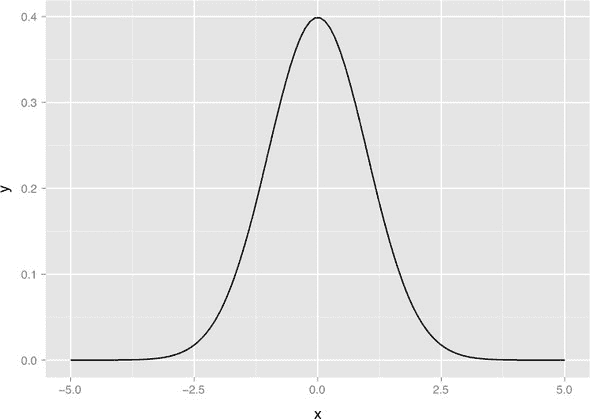
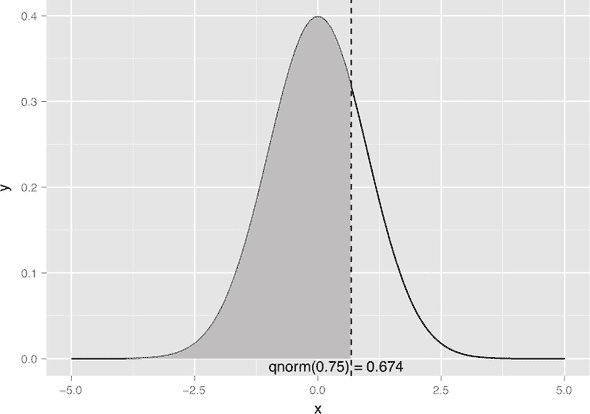
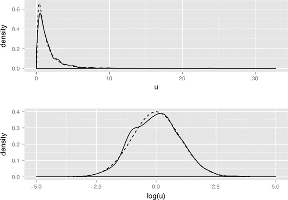
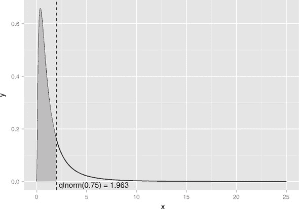
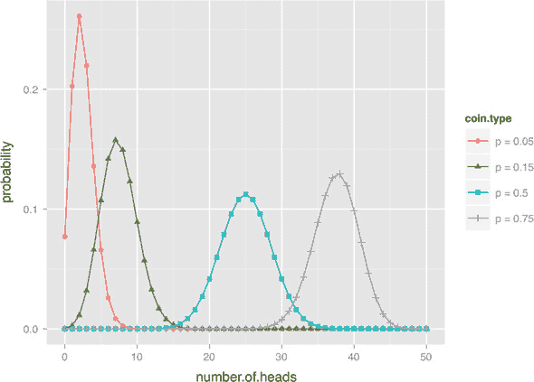
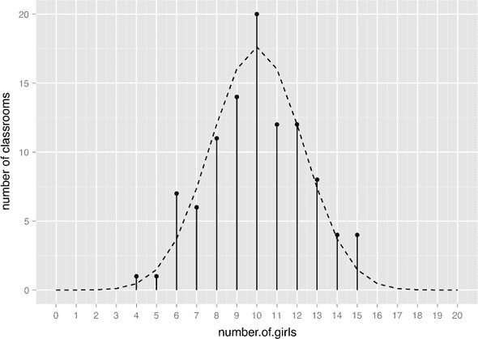
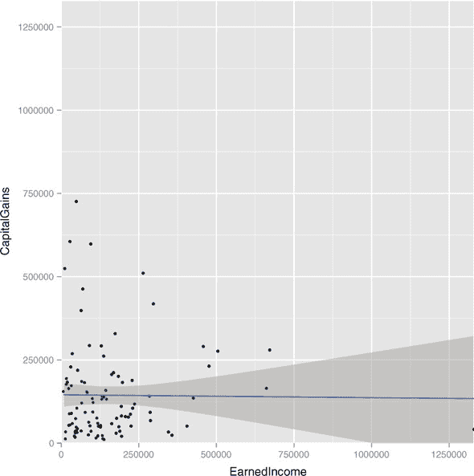
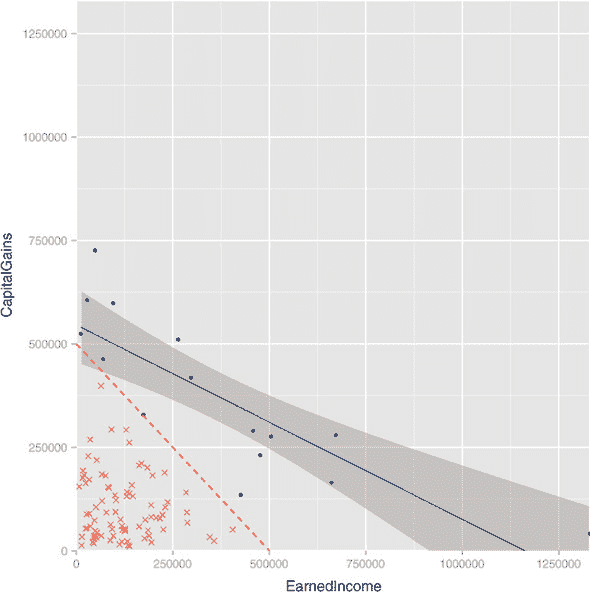

# 附录 B. 重要统计概念

统计学是一个如此广泛的话题，我们只能将其一部分纳入我们的数据科学叙事中。但它是一个重要的领域，它有很多关于当你尝试从数据中推断时会发生什么的内容。在这本书中，我们假设你已经了解一些统计概念（特别是均值、众数、中位数、方差和标准差等汇总统计量）。在本附录中，我们将演示一些与模型拟合、不确定性描述和实验设计相关的重要统计概念。

统计学是数学，所以这个附录有点数学性。它还旨在教你正确的**统计术语**，这样你就可以与其他数据科学家分享你的工作。本附录涵盖了你在“数据科学行话”中会听到的技术术语。你已经做了数据科学工作；现在，我们将讨论讨论和批评工作的工具。

**统计量**是数据的一种总结或度量。一个例子是房间里的人数。"统计学"是研究观察到的样本汇总如何与（未观察到的）我们希望建模的整个群体的真实汇总相关联的学科。统计学帮助我们描述和减轻估计的方差（或变异）、不确定性（我们不知道的范围或估计的范围）和偏差（我们的程序不幸引入的系统误差）。

例如，如果我们使用的是我们公司所有过去营销的数据库，这最多仍然是对所有可能销售（包括我们希望用我们的模型预测的未来营销和销售）的样本。如果我们不考虑抽样中的不确定性（以及来自许多其他原因的不确定性），我们将得出错误的推断和结论。^([[1)]

> ¹
> 
> 我们喜欢将机器学习称为对数据的乐观看法，将统计学称为悲观看法。在我们看来，你需要理解这两个观点才能与数据工作。

## B.1\. 分布

分布是对数据集中可能值的可能性的描述。例如，它可能是美国 18 岁成年男性可能的身高集合。对于一个简单的数值，分布的定义如下：对于值`b`，分布是看到值`x`的概率，其中`x <= b`。这被称为**累积分布函数**（CDF）。

我们通常可以通过命名一个分布和一些汇总统计量来总结一组可能的结果。例如，我们可以这样说，如果我们公平地掷一枚硬币 10 次，我们观察到的正面数量应该是二项分布（在 B.5.7 节中定义）的，期望平均值为 5 个正面。在所有情况下，我们都关心值的生成方式，以及获取比仅仅描述均值和标准差更详细的信息，比如获取分布的名称和形状。

在本节中，我们将概述几个重要的分布：正态分布、对数正态分布和二项分布。随着你进一步学习，你还将想要学习许多其他关键分布（如泊松、贝塔、负二项分布等），但这里提出的想法应该足以让你开始。

### B.1.1\. 正态分布

正态分布或高斯分布是经典的对称钟形曲线，如图 B.1 所示。#app02fig01。许多测量量，如一组学生的考试成绩，或特定人群的年龄或身高，通常可以用正态分布来近似。重复测量往往会落入正态分布。例如，如果一位医生使用经过正确校准的秤多次称量一位患者的体重，那么测量值（如果取足够多）将围绕患者的真实体重落入正态分布。这种变化将归因于测量误差（秤的变异性）。正态分布定义在所有实数上。

图 B.1\. 均值为 0，标准差为 1 的正态分布



此外，**中心极限定理**指出，当你观察许多独立、有界方差的随机变量的总和（或均值）时，随着你收集更多的数据，你的观察值的分布将趋近于正态分布。例如，假设你想要测量每天上午 9 点到 10 点之间有多少人访问你的网站。用于建模访问人数的适当分布是**泊松分布**；但如果你有足够的流量，并且观察足够长的时间，观察到的访问者分布将趋近于正态分布，你可以通过将访问者数量视为正态分布来对流量做出可接受的估计。

许多现实世界的分布大约是“正态”的——特别是，任何“接近”的概念倾向于累加的测量。一个例子就是成年人的身高：6 英寸的身高差异对于身高 5'6" 的人和身高 6' 的人都是很大的。

正态分布由两个参数描述：均值 `m` 和标准差 `s`（或者，也可以说是方差，它是 `s` 的平方）。均值代表分布的中心（也是其峰值）；标准差代表分布的“自然长度单位”——你可以通过观察值与均值的多少个标准差来估计观察值的稀有程度。正如我们在第四章中提到的，对于一个正态分布的变量

+   大约 68% 的观察值将落在区间 `(m-s,m+s)` 内。

+   大约 95% 的观察值将落在区间 `(m-2*s,m+2*s)` 内。

+   大约 99.7% 的观察值将落在区间 `(m-3*s,m+3*s)` 内。

因此，一个观察值如果比均值大三个标准差，在大多数应用中可以被认为是相当罕见的。

许多机器学习算法和统计方法（例如，线性回归）假设未建模的误差是正态分布的。线性回归对违反这一假设的情况相当稳健；然而，对于连续变量，你至少应该检查变量的分布是否单峰且在一定程度上对称。当这种情况不成立时，你可能希望考虑使用变量转换，例如我们在 第四章 中讨论的对数转换。

在 R 中使用正态分布

在 R 中，函数 `dnorm(x, mean = m, sd = s)` 是 *正态概率密度函数*：当它从均值为 `m` 和标准差 `s` 的正态分布中抽取时，将返回观察到 `x` 的概率。默认情况下，`dnorm` 假设 `mean=0` 和 `sd = 1`（这里讨论的所有与正态分布相关的函数都如此）。让我们使用 `dnorm()` 来绘制 图 B.1。

列表 B.1\. 绘制理论正态密度

```
library(ggplot2)

x <- seq(from=-5, to=5, length.out=100) # the interval [-5 5]
f <- dnorm(x)                           # normal with mean 0 and sd 1
ggplot(data.frame(x=x,y=f), aes(x=x,y=y)) + geom_line()
```

函数 `rnorm(n, mean = m, sd = s)` 将生成 `n` 个从均值为 `m` 和标准差 `s` 的正态分布中抽取的点。

列表 B.2\. 绘制经验正态密度

```
library(ggplot2)

# draw 1000 points from a normal with mean 0, sd 1
u <- rnorm(1000)

# plot the distribution of points,
# compared to normal curve as computed by dnorm() (dashed line)
ggplot(data.frame(x=u), aes(x=x)) + geom_density() +
   geom_line(data=data.frame(x=x,y=f), aes(x=x,y=y), linetype=2)
```

如你在 图 B.2 中所见，由 `rnorm(1000)` 生成的点的经验分布与理论正态分布非常接近。从有限数据集中观察到的分布永远不能与理论上的连续分布（如正态分布）完全匹配；并且，与所有统计事物一样，对于给定样本大小，你期望偏离有多远有一个明确的分布。

图 B.2\. 从均值为 0 和标准差为 1 的正态分布中抽取的点的经验分布。虚线表示理论正态分布。


函数 `pnorm(x, mean = m, sd = s)` 是 R 所称的 *正态概率函数*，也称为 *正态累积分布函数*：它返回从均值为 `m` 和标准差 `s` 的正态分布中观察到小于 `x` 的数据点的概率。换句话说，这是分布曲线下落在 `x` 左侧的区域（回想一下，分布曲线下的面积是单位面积）。这如图 B.3 列表 所示。

列表 B.3\. 处理正态 CDF

```
# --- estimate probabilities (areas) under the curve ---

# 50% of the observations will be less than the mean
pnorm(0)
# [1] 0.5

# about 2.3% of all observations are more than 2 standard
# deviations below the mean
pnorm(-2)
# [1] 0.02275013

# about 95.4% of all observations are within 2 standard deviations
# from the mean
pnorm(2) - pnorm(-2)
# [1] 0.9544997
```

函数 `qnorm(p, mean = m, sd = s)` 是具有均值 `m` 和标准差 `s` 的正态分布的 *分位数函数*。它是 `pnorm()` 的逆函数，其中 `qnorm(p, mean = m, sd = s)` 返回值 `x`，使得 `pnorm(x, mean = m, sd = s) == p`。

图 B.3 展示了 `qnorm()` 的使用：垂直线在 `x = qnorm(0.75)` 处截断 x 轴；垂直线左侧的阴影区域表示面积为 0.75，即正态曲线下方的 75% 的面积。

图 B.3\. 说明 `x < qnorm(0.75)`



创建图 B.3（以及使用`qnorm()`的几个其他示例）的代码如下所示。

列表 B.4\. 绘制`x < qnorm(0.75)`

```
# --- return the quantiles corresponding to specific probabilities ---

# the median (50th percentile) of a normal is also the mean
qnorm(0.5)
# [1] 0

# calculate the 75th percentile
qnorm(0.75)
# [1] 0.6744898
pnorm(0.6744898)
# [1] 0.75

# --- Illustrate the 75th percentile ---

# create a graph of the normal distribution with mean 0, sd 1
x <- seq(from=-5, to=5, length.out=100)
f <- dnorm(x)
nframe <- data.frame(x=x,y=f)
# calculate the 75th percentile
line <- qnorm(0.75)
xstr <- sprintf("qnorm(0.75) = %1.3f", line)

# the part of the normal distribution to the left
# of the 75th percentile
nframe75 <- subset(nframe, nframe$x < line)

# Plot it.
# The shaded area is 75% of the area under the normal curve
ggplot(nframe, aes(x=x,y=y)) + geom_line() +
  geom_area(data=nframe75, aes(x=x,y=y), fill="gray") +
  geom_vline(aes(xintercept=line), linetype=2) +
  geom_text(x=line, y=0, label=xstr, vjust=1)
```

### B.1.2\. 总结 R 的分布命名约定

现在我们已经展示了一些具体的例子，我们可以总结一下 R 是如何命名与给定概率分布相关的不同函数的。假设概率分布被命名为`DIST`。那么以下都是正确的：

+   `dDIST(x, ...)`是*分布函数*（或*PDF*，见下一部分）返回观察值`x`的概率。

+   `pDIST(x, ...)`是累积分布函数，返回观察值小于`x`的概率。标志`lower.tail = FALSE`将导致`pDIST(x, ...)`返回观察值大于`x`的概率（右尾下的面积，而不是左尾）。

+   `rDIST(n, ...)`是随机数生成器，返回从分布`DIST`中抽取的`n`个值。

+   `qDIST(p, ...)`是分位数函数，返回对应于`DIST`的第`p`百分位的`x`。标志`lower.tail = FALSE`将导致`qDIST(p, ...)`返回对应于`1 - p`百分位的`x`。

* * *

R 的令人困惑的命名约定

由于某种原因，R 将累积分布函数（或 CDF）简称为*分布函数*。当使用 R 工作时，请注意检查您是想使用概率密度函数还是 CDF。

* * *

### B.1.3\. 对数正态分布

*对数正态分布*是随机变量`X`的自然对数`log(X)`服从正态分布的分布。高度偏斜的正态数据，如盈利客户的值、收入、销售额或股价，通常可以建模为对数正态分布。对数正态分布定义在所有非负实数上；如图 B.4（顶部）所示，它是不对称的，尾部向正无穷延伸。`log(X)`的分布（如图 B.4（底部）所示）是一个以`mean(log(X))`为中心的正态分布。对于对数正态总体，均值通常远高于中位数，向均值贡献的大部分来自少量最高值的数据点。

图 B.4。顶部：对数正态分布`X`，其`mean(log(X)) = 0`和`sd(log(X)) = 1`。虚线是理论分布，实线是随机对数正态样本的分布。底部：实线是`log(X)`的分布。



* * *

不要将对数正态总体的均值用作“典型”值

对于一个近似正态分布的总体，你可以使用总体的平均值作为典型成员的大致替代值。如果你将平均值用作对数正态总体的替代值，你会高估大多数数据点的值。

* * *

直观地说，如果数据的变化自然地表示为百分比或相对差异，而不是绝对差异，那么数据就适合用对数正态分布来建模。例如，你杂货店中典型的土豆袋可能重约五磅，上下浮动半磅。从特定类型的枪支发射特定类型的子弹时，子弹飞行的距离可能约为 2,100 米，上下浮动 100 米。这些观察结果的变化自然地用绝对单位表示，并且可以建模为正态分布。另一方面，货币数量的差异通常最好用百分比表示：一个工人群体的所有工人可能都会获得 5% 的加薪（而不是每人每年增加 5,000 美元）；你可能希望将下季度的收入预测在 10% 以内（而不是在加减 1,000 美元以内）。因此，这些数量通常最好建模为具有对数正态分布。

在 R 中使用对数正态分布

让我们看看 R 中处理对数正态分布的函数（也参见 B.5.3 节）。我们将从 `dlnorm()` 和 `rlnorm()` 开始：

+   `dlnorm(x, meanlog = m, sdlog = s)` 是返回从对数正态分布 `X` 中抽取的值 `x` 的概率密度的 *概率密度函数* (PDF)，其中 `mean(log(X)) = m` 和 `sd(log(X)) = s`。默认情况下，本节中讨论的所有函数的 `meanlog = 0` 和 `sdlog = 1`。

+   `rlnorm(n, meanlog = m, sdlog = s)` 是返回从具有 `mean(log(X)) = m` 和 `sd(log(X)) = s` 的对数正态分布中抽取的 `n` 个随机数的随机数。

我们可以使用 `dlnorm()` 和 `rlnorm()` 来生成前面显示的 图 8.4，以下列表演示了对数正态分布的一些特性。

列表 B.5\. 展示对数正态分布的一些特性

```
# draw 1001 samples from a lognormal with meanlog 0, sdlog 1
u <- rlnorm(1001)

# the mean of u is higher than the median
mean(u)
# [1] 1.638628
median(u)
# [1] 1.001051

# the mean of log(u) is approx meanlog=0
mean(log(u))
# [1] -0.002942916

# the sd of log(u) is approx sdlog=1
sd(log(u))
# [1] 0.9820357

# generate the lognormal with meanlog = 0, sdlog = 1
x <- seq(from = 0, to = 25, length.out = 500)
f <- dlnorm(x)

# generate a normal with mean = 0, sd = 1
x2 <- seq(from = -5, to = 5, length.out = 500)
f2 <- dnorm(x2)

# make data frames
lnormframe <- data.frame(x = x, y = f)
normframe <- data.frame(x = x2, y = f2)
dframe <- data.frame(u=u)

# plot densityplots with theoretical curves superimposed
p1 <- ggplot(dframe, aes(x = u)) + geom_density() +
  geom_line(data = lnormframe, aes(x = x, y = y), linetype = 2)

p2 <- ggplot(dframe, aes(x = log(u))) + geom_density() +
  geom_line(data = normframe, aes(x = x,y = y), linetype = 2)

# functions to plot multiple plots on one page
library(grid)
nplot <- function(plist) {
  n <- length(plist)
  grid.newpage()
  pushViewport(viewport(layout=grid.layout(n, 1)))
  vplayout<-
     function(x,y) { viewport(layout.pos.row = x, layout.pos.col = y) }
  for(i in 1:n) {
    print(plist[[i]], vp = vplayout(i, 1))
  }
}

# this is the plot that leads this section.
nplot(list(p1, p2))
```

剩下的两个函数是累积分布函数 `plnorm()` 和分位数函数 `qlnorm()`：

+   `plnorm(x, meanlog = m, sdlog = s)` 是累积分布函数，它返回从具有 `mean(log(X)) = m` 和 `sd(log(X)) = s` 的对数正态分布中观察到的值小于 `x` 的概率。

+   `qlnorm(p, meanlog = m, sdlog = s)` 是分位数函数，它返回对应于对数正态分布中 `p` 百分位数的 `x` 值，其中 `mean(log(X)) = m` 和 `sd(log(X)) = s`。它是 `plnorm()` 的逆函数。

以下列表演示了 `plnorm()` 和 `qlnorm()`。它使用前一个列表中的数据框 `lnormframe`。

列表 B.6\. 绘制对数正态分布图

```
# the 50th percentile (or median) of the lognormal with
# meanlog=0 and sdlog=10
qlnorm(0.5)
# [1] 1
# the probability of seeing a value x less than 1
plnorm(1)
# [1] 0.5

# the probability of observing a value x less than 10:
plnorm(10)
# [1] 0.9893489

# -- show the 75th percentile of the lognormal

# use lnormframe from previous example: the
# theoretical lognormal curve

line <- qlnorm(0.75)
xstr <- sprintf("qlnorm(0.75) = %1.3f", line)

lnormframe75 <- subset(lnormframe, lnormframe$x < line)

# Plot it
# The shaded area is 75% of the area under the lognormal curve
ggplot(lnormframe, aes(x = x, y = y)) + geom_line() +
  geom_area(data=lnormframe75, aes(x = x, y = y), fill = "gray") +
  geom_vline(aes(xintercept = line), linetype = 2) +
  geom_text(x = line, y = 0, label = xstr, hjust = 0, vjust = 1)
```

如你在图 B.5 中所见，大多数数据集中在分布的左侧，剩余的四分之一数据分布在非常长的尾部。

图 B.5. 均值为 `meanlog = 1`，标准差为 `sdlog = 0` 的对数正态分布的 75 分位数



### B.1.4. 二项分布

假设你有一枚硬币，当你翻转它时，它落在头部的概率为 `p`（因此对于公平的硬币，`p = 0.5`）。在这种情况下，二项分布用于模拟翻转该硬币 `N` 次时观察到 `k` 个头部的概率。它用于建模二元分类问题（如我们在第八章中讨论的与逻辑回归相关的内容），其中正例可以被认为是“头部”。

图 B.6 展示了不同公平性的硬币在翻转 50 次时的二项分布形状。请注意，二项分布是*离散的*；它只定义了 `k` 的（非负）整数值。

图 B.6. 50 次抛掷硬币的二项分布，硬币的公平性各异（落在头部的概率）



在 R 中使用二项分布

让我们看看在 R 中处理二项分布的函数（参见 B.5.3 节）。我们将从概率密度函数 `dbinom()` 和随机数生成器 `rbinom()` 开始：

+   `dbinom(k, nflips, p)` 是 PDF，它返回从具有头部概率 `p` 的硬币中抛掷 `nflips` 次时观察到恰好 `k` 个头部的概率。

+   `rbinom(N, nflips, p)` 是随机数生成器，它返回从具有头部概率 `p` 的硬币中抽取的 `N` 个值，对应于 `nflips` 次抛掷。

你可以使用 `dbinom()`（如下面的列表所示）来生成图 B.6。

列表 B.7. 绘制二项分布

```
library(ggplot2)
#
# use dbinom to produce the theoretical curves
#

numflips <- 50
# x is the number of heads that we see
x <- 0:numflips

# probability of heads for several different coins
p <- c(0.05, 0.15, 0.5, 0.75)
plabels <- paste("p =", p)

# calculate the probability of seeing x heads in numflips flips
# for all the coins. This probably isn't the most elegant
# way to do this, but at least it's easy to read

flips <- NULL
for(i in 1:length(p)) {
  coin <- p[i]
  label <- plabels[i]
  tmp <- data.frame(number_of_heads=x,
                    probability = dbinom(x, numflips, coin),
                    coin_type = label)
  flips <- rbind(flips, tmp)
}

# plot it
# this is the plot that leads this section
ggplot(flips, aes(x = number_of_heads, y = probability)) +
  geom_point(aes(color = coin_type, shape = coin_type)) +
  geom_line(aes(color = coin_type))
```

你可以使用 `rbinom()` 来模拟抛硬币风格的实验。例如，假设你有一个 50% 女性的大型学生群体。如果学生随机分配到教室，并且你访问了有 20 名学生的 100 个教室，那么你预计每个教室中会有多少女孩？一个合理的结果显示在图 B.7 中，理论分布叠加在上面。

图 B.7. 当人口为 50% 女性时，在 100 个大小为 20 的教室中观察到的女孩数量分布。理论分布用虚线表示。



让我们编写代码来生成图 B.7。

列表 B.8. 处理理论二项分布

```
p = 0.5 # the percentage of females in this student population
class_size <- 20 # size of a classroom
numclasses <- 100 # how many classrooms we observe

# what might a typical outcome look like?
numFemales <- rbinom(numclasses, class_size, p)                ❶

# the theoretical counts (not necessarily integral)
probs <- dbinom(0:class_size, class_size, p)
tcount <- numclasses*probs

# the obvious way to plot this is with histogram or geom_bar
# but this might just look better

zero <- function(x) {0} # a dummy function that returns only 0

ggplot(data.frame(number_of_girls = numFemales, dummy = 1),
  aes(x = number_of_girls, y = dummy)) +
  # count the number of times you see x heads
  stat_summary(fun.y = "sum", geom = "point", size=2) +        ❷
  stat_summary(fun.ymax = "sum", fun.ymin = "zero", geom = "linerange") +
  # superimpose the theoretical number of times you see x heads
  geom_line(data = data.frame(x = 0:class_size, y = tcount),
            aes(x = x, y = y), linetype = 2) +
  scale_x_continuous(breaks = 0:class_size, labels = 0:class_size) +
  scale_y_continuous("number of classrooms")
```

❶ 因为我们没有调用 `set.seed`，所以我们预计每次运行此行时都会得到不同的结果。

❷ `stat_summary` 是在绘图过程中控制数据聚合的一种方法。在这种情况下，我们使用它将来自经验数据的点状和条形图放置在理论密度曲线中。

正如您所看到的，即使只有 4 个或多达 16 个女孩的教室也不是完全闻所未闻，当来自这个群体中的学生随机分配到教室时。但是，如果您观察到太多的此类教室——或者观察到少于 4 个或超过 16 个女孩的教室——您会想调查这些班级的学生选择是否以某种方式存在偏见。

您还可以使用 `rbinom()` 来模拟抛掷单个硬币。

列表 B.9\. 模拟二项分布

```
# use rbinom to simulate flipping a coin of probability p N times

p75 <- 0.75 # a very unfair coin (mostly heads)
N <- 1000  # flip it several times
flips_v1 <- rbinom(N, 1, p75)

# Another way to generate unfair flips is to use runif:
# the probability that a uniform random number from [0 1)
# is less than p is exactly p. So "less than p" is "heads".
flips_v2 <- as.numeric(runif(N) < p75)

prettyprint_flips <- function(flips) {
  outcome <- ifelse(flips==1, "heads", "tails")
  table(outcome)
}

prettyprint_flips(flips_v1)
# outcome
# heads tails
# 756   244
prettyprint_flips(flips_v2)
# outcome
# heads tails
# 743   257
```

最后两个函数是累积分布函数 `pbinom()` 和分位数函数 `qbinom()`：

+   `pbinom(k, nflips, p)` 是返回从 `nflips` 次抛掷中观察到 `k` 个或更少正面的概率的累积分布函数（CDF）。`pbinom(k, nflips, p, lower.tail = FALSE)` 返回从 `nflips` 次抛掷中观察到超过 `k` 个正面的概率。请注意，左尾概率是在包含区间 `numheads <= k` 上计算的，而右尾概率是在排他区间 `numheads > k` 上计算的。

+   `qbinom(q, nflips, p)` 是分位数函数，它返回与 `nflips` 次抛掷中正面概率 `p` 对应的 `q` 百分位数所对应正面的数量 `k`。

下一个列表展示了使用 `pbinom()` 和 `qbinom()` 的几个示例。

列表 B.10\. 使用二项分布

```
# pbinom example

nflips <- 100
nheads <- c(25, 45, 50, 60)  # number of heads

# what are the probabilities of observing at most that
# number of heads on a fair coin?
left.tail <- pbinom(nheads, nflips, 0.5)
sprintf("%2.2f", left.tail)
# [1] "0.00" "0.18" "0.54" "0.98"

# the probabilities of observing more than that
# number of heads on a fair coin?
right.tail <- pbinom(nheads, nflips, 0.5, lower.tail = FALSE)
sprintf("%2.2f", right.tail)
# [1] "1.00" "0.82" "0.46" "0.02"

# as expected:
left.tail+right.tail
#  [1] 1 1 1 1

# so if you flip a fair coin 100 times,
# you are guaranteed to see more than 10 heads,
# almost guaranteed to see fewer than 60, and
# probably more than 45.
# qbinom example

nflips <- 100

# what's the 95% "central" interval of heads that you
# would expect to observe on 100 flips of a fair coin?

left.edge <- qbinom(0.025, nflips, 0.5)
right.edge <- qbinom(0.025, nflips, 0.5, lower.tail = FALSE)
c(left.edge, right.edge)
# [1] 40 60

# so with 95% probability you should see between 40 and 60 heads
```

需要注意的一点是，由于二项分布是离散的，`pbinom()` 和 `qbinom()` 不会像连续分布（如正态分布）那样是彼此的完美逆函数。

列表 B.11\. 使用二项累积分布函数

```
# because this is a discrete probability distribution,
# pbinom and qbinom are not exact inverses of each other

# this direction works
pbinom(45, nflips, 0.5)
# [1] 0.1841008
qbinom(0.1841008, nflips, 0.5)
# [1] 45

# this direction won't be exact
qbinom(0.75, nflips, 0.5)
# [1] 53
pbinom(53, nflips, 0.5)
# [1] 0.7579408
```

### B.1.5\. 用于分布的更多 R 工具

R 有许多用于处理分布的工具，而不仅仅是我们在演示中展示的 PDF、CDF 和生成工具。特别是，对于拟合分布，您可能想尝试来自 `MASS` 包的 `fitdistr` 方法。

## B.2\. 统计理论

在这本书中，我们必然要专注于（正确地）处理数据，而不会停下来解释很多理论。在回顾本节中的一些统计理论之后，我们将使用的步骤将更容易理解。

### B.2.1\. 统计哲学

我们在这本书中展示的预测工具和机器学习方法，其预测能力并非来自揭示因果关系（那将是一件好事），而是通过跟踪和尝试消除数据中的差异，以及通过减少不同来源的错误。在本节中，我们将概述一些关键概念，描述正在发生的事情以及为什么这些技术有效。

可交换性

由于基本的统计建模不足以可靠地将预测归因于真实原因，我们一直在默默地依赖一个称为 *可交换性* 的概念，以确保我们可以构建有用的预测模型。

交换性的正式定义是这样的：假设世界上所有的数据都是`x[i,],y[i]`（`i=1,...m`）。如果对于`1, ...m`的任何排列`j_1, ...j_m`，看到`x[i,],y[i]`的联合概率等于看到`x[j_i, ], y[j_i]`的联合概率，那么我们称这些数据为*可交换的*。换句话说，看到元组`x[i, ], y[i]`的联合概率不依赖于*何时*我们看到它，或者它在观察序列中的位置。

这个想法是，如果数据的所有排列都是等可能的，那么当我们仅使用索引（而不是窥探`x[i,],y[i]`）从数据中抽取子集时，每个子集中的数据，尽管不同，可以被认为是独立同分布的。我们在进行训练/测试划分（甚至训练/校准/测试划分）时依赖于此，我们希望（并且应该采取措施确保）我们的训练数据和未来在生产中遇到的数据之间也是如此。

我们构建模型的目标是在未知的未来，模型将应用到的数据可以与我们的训练数据交换。如果这种情况成立，那么我们预期在训练数据上的良好表现将转化为生产环境中模型的良好表现。防御数据交换性免受过度拟合和概念漂移等问题的影响是非常重要的。

一旦我们开始检查训练数据，我们就（不幸地）破坏了它与未来数据的交换性。包含大量训练数据的子集不再与不包含训练数据的子集（通过简单地记住所有训练数据）区分开来。我们试图通过在保留的测试数据上的性能来衡量这种损害的程度。这就是为什么泛化误差如此重要的原因。在模型构建过程中没有查看的数据应该与未来数据保持与之前相同的可交换性，因此测量保留数据的性能有助于预测未来的性能。这也是为什么你不使用测试数据进行校准（相反，你应该进一步划分你的训练数据来做这件事）；一旦你查看你的测试数据，它就与未来在生产中看到的可交换性降低。

预测中交换性可能遭受的另一巨大损失总结为所谓的*Goodhart 定律*：“当一项度量成为目标时，它就不再是一个好的度量。”其要点是：仅仅与预测相关的因素是好的预测者——直到你过度优化它们，或者当其他人对你使用它们的反应时。例如，垃圾邮件发送者可能会通过使用与合法电子邮件高度相关的更多特征和短语，以及改变垃圾邮件过滤器认为与垃圾邮件高度相关的短语来尝试击败垃圾邮件检测系统。这是实际原因（当改变时确实对结果有影响）和仅仅相关性（可能与结果同时发生，并且只有通过示例的交换性才是好的预测者）之间的基本区别。

偏差方差分解

本书中的许多建模任务被称为*回归*，其中对于形式为`y[i],x[i,]`的数据，我们试图找到一个模型或函数`f()`，使得`f(x[i,])~E[y[j]|x[j,]~x[i,]]`（期望`E[]`是对所有示例取的，其中`x[j,]`被认为非常接近`x[i,]`）。通常这是通过选择`f()`来最小化`E[(y[i]-f(x[i,]))²]`来实现的。^([2]) 符合这种公式的显著方法包括回归、k-最近邻（KNN）和神经网络。

> ²
> 
> 最小化平方误差能够正确得到期望值是一个重要的事实，它在方法设计中反复被使用。

显然，最小化平方误差并不总是你的直接建模目标。但当你以平方误差为基准工作时，你可以将误差明确分解为有意义的组成部分，这被称为*偏差/方差分解*（参见 T. Hastie、R. Tibshirani 和 J. Friedman 所著的《统计学习的要素》；Springer，2009 年）。偏差/方差分解指出：

```
E[(y[i] - f(x[i, ]))²] = bias² + variance + irreducibleError
```

*模型偏差*是错误中你选择的建模技术永远无法正确处理的部分，通常是因为真实过程的某些方面无法在所选模型的假设中表示。例如，如果结果变量与输入变量之间的关系是曲线或非线性，你无法用只考虑线性关系的线性回归完全建模它。你通常可以通过转向更复杂的建模思想来减少偏差：核化、GAMs、添加交互作用等。许多建模方法可以自行增加模型复杂性（以尝试减少偏差），例如决策树、KNN、支持向量机和神经网络。但直到你拥有大量数据，增加模型复杂性有很大机会会增加模型方差。

*模型方差*是由于数据中的偶然关系而导致的错误部分。其想法是这样的：在新的数据上重新训练模型可能会产生不同的错误（这就是方差与偏差的区别）。一个例子是使用`k = 1`运行 KNN。当你这样做时，每个测试示例都会通过匹配到单个最近的训练示例来评分。如果那个示例碰巧是正的，你的分类将是正的。这就是我们倾向于使用较大的`k`值运行 KNN 的原因之一：它给我们提供了通过包括更多示例来获得更可靠的邻域性质估计的机会，尽管这会使邻域稍微不那么局部或具体。更多的数据和平均思想（如 bagging）可以大大减少模型方差。

*不可减少误差* 是问题的真正不可建模的部分（考虑到当前变量）。如果我们有两个数据 `x[i, ], y[i]` 和 `x[j,], y[j]`，使得 `x[i, ] == x[j, ]`，那么 `(y[i] - y[j])²` 会贡献到不可减少误差。我们强调，不可减少误差是相对于一组给定的变量来衡量的；添加更多变量，你就有了一个新的情况，可能具有其自己的更低不可减少误差。

重点是，你总是可以将建模误差视为来自三个来源：偏差、方差和不可减少误差。当你试图提高模型性能时，你可以根据你试图减少的这些因素来选择尝试的方法。

* * *

**平均化是一个强大的工具**

在相当温和的假设下，平均化可以降低方差。例如，对于具有相同分布的独立值的数据，大小为 `n` 的组平均值的期望方差为单个值方差的 `1/n`。这就是为什么即使预测单个事件很困难，你仍然可以构建准确预测人口或群体率的模型的原因之一。所以尽管预测旧金山的谋杀案数量可能很容易，但你无法预测谁会被杀害。除了缩小方差外，平均化还会使分布越来越像正态分布（这是中心极限定理，与大量定律相关）。

* * *

统计效率

无偏统计过程的 *效率* 定义为在给定数据集大小的情况下该过程有多少方差：也就是说，当在相同大小和来自相同分布的数据集上运行时，该过程产生的估计值会有多大的变化。更有效的程序需要更少的数据来达到给定的方差量。这与计算效率不同，计算效率是关于产生估计值需要多少工作量。

当你拥有大量数据时，统计效率变得不那么关键（这就是为什么我们在这本书中不强调它）。但是，当产生更多数据成本很高时（例如在药物试验中），统计效率是你的主要关注点。在这本书中，我们采取的方法是通常我们有很多数据，因此我们可以优先考虑相对统计效率较低的一般方法（例如使用测试保留集等），而不是更专业、统计效率更高的方法（例如 Wald 检验等特定的现成参数检验）。

记住：忽略统计效率是一种奢侈，而不是权利。如果你的项目有这样的需求，你将想要咨询专家统计学家，以获得最佳实践的益处。

### B.2.2\. A/B 测试

硬统计问题通常源于糟糕的实验设计。本节描述了一种简单、良好的统计设计哲学，称为 *A/B 测试*，它具有非常简单的理论。理想的实验是拥有两个组——控制组（A）和治疗组（B），并且以下条件成立：

+   每个组都足够大，以至于你可以得到可靠的测量结果（这推动了显著性）。

+   每个组（直到单个因素）都精确地分布得像你未来预期的群体（这推动了相关性）。特别是，两个样本都是同时并行运行的。

+   两个组只在你要测试的单个因素上有所不同。

在 A/B 测试中，提出一个新的想法、治疗方法或改进措施，然后对其进行效果测试。一个常见的例子是，对零售网站提出一个希望提高从浏览器到购买者转换率的改变。通常，治疗组被称为 *B* 组，未处理或对照组被称为 *A* 组。作为参考，我们推荐“网络受控实验实用指南”（R. Kohavi, R. Henne, 和 D. Sommerfield；KDD，2007）。

设置 A/B 测试

在运行 A/B 测试时需要格外小心。确保 A 组和 B 组同时运行非常重要。这有助于防御任何可能影响转换率变化的潜在混杂效应（如每小时效应、流量来源效应、星期几效应等）。此外，你需要知道你正在测量的差异实际上是由于你提出的改变造成的，而不是由于控制组和测试基础设施之间的差异。为了控制基础设施，你应该运行几个 A/A 测试（在 A 和 B 组中运行相同实验的测试）。

随机化是设计 A/B 测试的关键工具。但是，将用户分为 A 组和 B 组的方式需要合理。例如，对于用户测试，你不想将同一用户会话中的原始点击量分为 A/B 组，因为这样 A/B 组都会有可能看到过任何治疗网站的用户的点击。相反，你应该维护每个用户的记录，并在用户到达时永久性地将他们分配到 A 组或 B 组。避免在不同服务器之间进行大量记录保存的一个技巧是计算用户信息的哈希值，并根据哈希值是偶数还是奇数将用户分配到 A 组或 B 组（这样，所有服务器都会做出相同的决定，而无需进行通信）。

评估 A/B 测试

A/B 测试中的关键测量是效果的大小和测量的显著性。B 作为良好治疗的自然替代品（或零假设）是 B 没有差异，或者 B 甚至使事情变得更糟。不幸的是，典型的失败的 A/B 测试通常看起来并不像彻底的失败。它通常看起来是你正在寻找的积极效果确实存在，你只需要一个稍微大一点的后续样本大小来实现显著性。由于这类问题，在运行测试之前进行接受/拒绝条件的推理至关重要。

让我们做一个 A/B 测试的例子。假设我们已经运行了一个关于转化率的 A/B 测试并收集了以下数据。

列表 B.12\. 构建模拟的 A/B 测试数据

```
set.seed(123515)
d <- rbind(                                                                 ❶
   data.frame(group = 'A', converted = rbinom(100000, size = 1, p = 0.05)), ❷
   data.frame(group = 'B', converted = rbinom(10000, size = 1, p = 0.055))  ❸
)
```

❶ 构建一个数据框来存储模拟示例

❷ 从 A 组添加 100,000 个示例，模拟 5%的转化率

❸ 从 B 组添加 10,000 个示例，模拟 5.5%的转化率

一旦我们有了数据，我们就使用一种称为**列联表**的数据结构将其总结为基本计数。^([3])

> ³
> 
> 我们在第 6.2.3 节中使用的混淆矩阵也是列联表的例子。

列表 B.13\. 将 A/B 测试总结到列联表中

```
tab <- table(d)
print(tab)
##      converted
## group     0     1
##     A 94979  5021
##     B  9398   602
```

列联表是统计学家所说的**充分统计量**：它包含了我们关于实验结果所需知道的一切。我们可以打印出 A 组和 B 组的观察转化率。

列表 B.14\. 计算观察到的 A 和 B 转化率

```
aConversionRate <- tab['A','1']/sum(tab['A',])
print(aConversionRate)
## [1] 0.05021

bConversionRate <- tab['B', '1'] / sum(tab['B', ])
print(bConversionRate)
## [1] 0.0602

commonRate <- sum(tab[, '1']) / sum(tab)
print(commonRate)
## [1] 0.05111818
```

我们看到 A 组的测量值接近 5%，B 组的测量值接近 6%。我们想知道的是：我们能信任这个差异吗？这样的差异可能是由于纯粹的偶然和测量噪声导致的这个样本大小吗？我们需要计算一个显著性来查看我们是否运行了一个足够大的实验（显然，我们希望设计一个足够大的实验——我们称之为*测试功效*，我们将在 B.6.5 节中讨论）。以下是一些快速运行的优秀测试。

费舍尔独立性检验

我们可以运行的第一项测试是费舍尔的列联表检验。在费舍尔检验中，我们希望拒绝的零假设是转化与组别无关，或者说 A 组和 B 组完全相同。费舍尔检验给出了一个概率，即看到独立数据集（A=B）显示出与独立性偏离的程度，与我们观察到的程度一样大。我们按照下一列表中的方式进行测试。

列表 B.15\. 计算观察到的差异在率上的显著性

```
fisher.test(tab)

##     Fisher's Exact Test for Count Data
##
## data:  tab
## p-value = 2.469e-05
## alternative hypothesis: true odds ratio is not equal to 1
## 95 percent confidence interval:
##  1.108716 1.322464
## sample estimates:
## odds ratio
##   1.211706
```

这是一个非常好的结果。p 值（在这种情况下，如果我们实际上有 A=B，观察到这种差异的概率）是 2.469e-05，非常小。这被认为是一个显著的结果。另一件需要关注的是 *优势比*：所声称效果的实际重要性（有时也称为 *临床意义*，这不属于统计意义）。优势比为 1.2 表示我们在 A 和 B 组之间测量到 20% 的相对转换率提升。你是否认为这是一个大或小的提升（通常，20% 被认为是大的）是一个重要的商业问题。

频率主义显著性测试

另一种估计显著性的方法是再次暂时假设 A 和 B 来自一个具有共同转换率的相同分布，并看看 B 组仅通过偶然机会获得如此高的分数的可能性有多大。如果我们考虑一个以共同转换率为中心的二项分布，我们希望看到在或高于 B 的水平的转换率上没有太多的概率质量。这意味着如果 A=B，观察到的差异不太可能。我们将在下面的列表中进行计算。

列表 B.16\. 计算频率主义显著性

```
print(pbinom(                  ❶
   lower.tail = FALSE,         ❷
   q = tab['B', '1'] - 1,      ❸
   size = sum(tab['B', ]),     ❹
   prob = commonRate           ❺
   ))
## [1] 3.153319e-05
```

❶ 使用 pbinom() 调用来计算不同观察计数出现的可能性

❷ 我们想要计算大于给定 q 的概率的信号

❸ 询问看到至少与我们观察到的 B 组一样多的转换的概率。我们减去一个，使比较包括（大于或等于 tab['B', '1']）。

❹ 指定总试验次数等于我们在 B 组中看到的次数

❺ 指定估计的共同转换率下的转换概率

这又是一个非常好的结果。计算出的概率很小，这意味着如果 `A = B`，那么这种差异很难偶然观察到。

### B.2.3\. 测试的效力

要获得可靠的 A/B 测试结果，你必须首先设计和运行良好的 A/B 测试。我们需要防御两种类型的错误：未能看到差异，假设有差异（描述为测试效力）；以及看到差异，假设没有差异（描述为显著性）。我们试图测量的 A 和 B 组之间的差异越接近，就越难获得一个好的正确测量的概率。我们唯一的工具是设计实验，希望 A 和 B 有很大的差异，或者增加实验规模。效力计算器让我们选择实验规模。

* * *

示例：设计一个测试来查看新广告是否具有更高的转换率

*假设我们正在运行一个每天有 6,000 个独立访客和 4%的转化率*^([4]) *从页面浏览到购买咨询（我们的可衡量目标）的旅游网站。我们希望测试网站的新设计，看看它是否能提高我们的转化率。这正是 A/B 测试旨在解决的问题！但我们还有一个问题：我们需要将多少用户路由到新设计才能得到可靠的测量？我们需要多长时间才能收集足够的数据？我们允许将不超过 10%的访客路由到新广告。*

> ⁴
> 
> 我们从[`mng.bz/7pT3`](http://mng.bz/7pT3)获取 4%的比率。

* * *

在这个实验中，我们将 90%的流量路由到旧广告，10%路由到新广告。对旧广告的转化率进行估计存在不确定性，但为了示例的简单性（以及因为九倍的流量将流向旧广告），我们将忽略这一点。因此，我们的问题是：我们应该将多少流量路由到新广告？

为了解决这个问题，我们需要为我们的实验设计一些标准：

+   我们对旧广告的转化率的估计是多少？让我们说这是 0.04 或 4%。

+   我们认为新广告足够大的改进的下限是多少？为了测试能够工作，这个值必须大于旧转化率。让我们说这是 0.046 或 4.5%，代表相对于销售转化的 10%以上的相对改进。

+   如果新广告没有更好的话，我们愿意以多大的概率出错？也就是说，如果新广告实际上并不比旧广告更好，我们愿意多频繁地“狼来了”并声称有改进（实际上并没有这种事）？让我们说，我们愿意以这种方式出错 5%的时间。让我们称这个为*显著性水平*。

+   当新广告实质上更好时，我们希望以多大的概率是正确的？也就是说，如果新广告实际上以至少 4.5%的比率转化，我们希望多频繁地检测到这一点？这被称为*功效*（与敏感性相关，我们在讨论分类模型时看到了这一点）。让我们说，我们希望功效为 0.8 或 80%。当有改进时，我们希望 80%的时间内找到它。

显然，我们*希望*能够检测到接近零的改进，在零的显著性水平，以及在 1 的功效。然而，如果我们坚持任何这些参数达到它们的“如果愿望是马的价值”（改进大小接近零，显著性水平接近零，功效接近 1），为了确保这些保证所需的测试规模变得巨大（甚至无限大！）因此，在项目开始前设定期望（始终是一个好习惯）的一部分，我们必须首先将这些“要求”协商到更可实现的价值，就像我们刚才描述的那样。

当试图确定样本量或实验持续时间时，重要的概念是 *统计测试功效*。统计测试功效是在零假设错误时拒绝零假设的概率。^([5]) 将统计测试功效视为 1 减去 p 值。其想法是这样的：如果你甚至无法识别哪些治疗方法是无用的，那么你就无法挑选出有用的治疗方法。因此，你希望设计你的测试以使测试功效接近 1，这意味着 p 值接近 0。

> ⁵
> 
> 参见 B. S. Everitt 所著的 *《剑桥统计学词典》* (剑桥大学出版社，2010 年)。

估算我们希望引导到新广告的访客数量的标准方法被称为 *功效计算*，由 R 包 `pwr` 提供。以下是我们是怎样使用 R 来得到答案的：

```
library(pwr)
pwr.p.test(h = ES.h(p1 = 0.045, p2 = 0.04),
           sig.level = 0.05,
           power = 0.8,
           alternative = "greater")

#     proportion power calculation for binomial distribution (arcsine transfo
     rmation)
#
#              h = 0.02479642
#              n = 10055.18
#      sig.level = 0.05
#          power = 0.8
#    alternative = greater
```

注意，我们只是将我们的要求复制到 `pwr.p.test` 方法中，尽管我们确实通过 `ES.h()` 方法输入了我们要区分的两个假设比率，该方法将比率差异转换为 Cohen 风格的“效应量”。在这种情况下，`ES.h(p1 = 0.045, p2 = 0.04)` 为 0.025，这被认为相当小（因此难以测量）。效应量非常粗略地表示你试图测量的效应相对于个体自然变异的大小。因此，我们试图测量销售可能性变化，这是个体销售可能性变异的 1/0.025 或 40 倍小。对于任何小样本集来说，这是不可观察的，但足够大的样本可以观察到。^([6])

> ⁶
> 
> 效应量是一个好主意，有一个经验法则，即 0.2 是小的，0.5 是中等的，1.0 是大的。参见 [`en.wikipedia.org/wiki/Effect_size`](https://en.wikipedia.org/wiki/Effect_size)。

`n = 10056` 是我们需要发送到新广告上的流量量，以获得至少满足指定质量参数（显著性水平和功效）的测试结果。因此，我们需要向 10056 位访客展示新广告，以完成我们的 A/B 测试测量。我们的网站每天有 6,000 位访客，我们每天只能向其中 10%，即 600 位，展示新广告。因此，完成这项测试需要 10056/600 或 16.8 天。^([7])

> ⁷
> 
> 这实际上是 A/B 测试的一个不为人知的秘密：测量诸如广告转化成销售（通常称为“转化成销售”）等罕见事件的微小改进需要大量数据，而获取大量数据可能需要很长时间。

* * *

**场所购物降低测试功效**

我们在假设你正在运行一个大型测试的情况下讨论了测试功效和显著性。在实践中，你可能需要运行多个测试，尝试多种处理方法，以查看是否有任何处理方法能带来改进。这会降低你的测试功效。如果你运行 20 种处理方法，每种处理方法的 p 值目标为 0.05，你可能会期望有一个测试看起来显示出显著的改进，即使所有 20 种处理方法都毫无用处。测试多种处理方法或甚至多次重新检查同一处理方法是一种“地点购物”的形式（你会在不同的地点不断询问，直到得到对你有利的裁决）。计算测试功效的损失正式称为“应用 Bonferroni 校正”，其简单之处在于将你的显著性估计值乘以你的测试数量（记住，大数值对显著性或 p 值是不利的）。为了补偿这种测试功效的损失，你可以将每个基础测试在更紧的*p*截止值下运行：*p*除以你打算运行的测试数量。

* * *

### B.2.4. 专用统计测试

在整本书中，我们专注于构建预测模型和评估显著性，无论是通过建模工具内置的诊断工具，还是通过经验重采样（如 bootstrap 测试或排列测试）。在统计学中，对于你通常计算的大多数内容，都有一个高效的正确测试来检验其显著性。选择正确的标准测试为你提供了一个良好的测试实现，并可以访问解释测试背景和影响的文献。让我们来计算一个简单的相关系数，并找到匹配的正确测试。

我们将使用一个合成示例，这个示例应该会让你想起我们在第八章中进行的 PUMS 人口普查工作。第八章。假设我们已经测量了 100 个人的收入（以工资形式获得的钱）和资本收益（从投资中获得的钱）。进一步假设，对于我们的个人来说，这两者之间没有关系（在现实世界中，存在相关性，但我们需要确保我们的工具即使在没有任何关系的情况下也不会报告出来）。我们将使用一些对数正态分布的数据设置一个简单的数据集来表示这种情况。

列表 B.17. 构建合成的非相关收入

```
set.seed(235236)                                        ❶
d <- data.frame(EarnedIncome = 100000 * rlnorm(100),
                 CapitalGains = 100000 * rlnorm(100))   ❷
print(with(d, cor(EarnedIncome, CapitalGains)))         ❸

# [1] -0.01066116
```

❶ 将伪随机种子设置为已知值，以便演示可重复进行

❷ 生成我们的合成数据

❸ 相关系数为-0.01，这非常接近 0——表明（如设计所示）没有关系。

我们声称观察到的-0.01 的相关性在统计学上与 0（或无效果）无法区分。这是我们应当量化的。一点研究告诉我们，常见的相关性被称为*皮尔逊系数*，对于正态分布数据的皮尔逊系数的显著性测试是学生 t 检验（自由度等于项目数减去 2）。我们知道我们的数据不是正态分布的（实际上是对数正态分布），所以我们进一步研究，发现首选的解决方案是通过排名（而不是值）比较数据，并使用斯皮尔曼的ρ或肯德尔的τ这样的测试。我们将使用斯皮尔曼的ρ，因为它可以追踪正负相关性（而肯德尔的τ追踪的是一致性程度）。

一个合理的问题是，我们如何知道使用哪个测试是正确的？答案是，通过学习统计学。请注意，有很多测试，这导致了像 N. D. Lewis 的《R 中的 100 个统计测试》（Heather Hills Press，2013 年）这样的书籍。我们还建议，如果你知道一个测试的名称，可以查阅 B. S.Everitt 和 A. Skrondal 的《剑桥统计学词典》，第四版（Cambridge University Press，2010 年）。

另一种找到正确测试的方法是使用 R 的帮助系统。`help(cor)`告诉我们`cor()`实现了三种不同的计算（皮尔逊、斯皮尔曼和肯德尔），并且有一个匹配的函数叫做`cor.test()`，它执行适当的显著性测试。由于我们并没有偏离常规路径太远，我们只需要了解这三种测试，并确定我们感兴趣的测试（在这种情况下，斯皮尔曼）。因此，让我们用选定的测试重新进行相关性计算，并检查显著性。

B.18. 列表：计算观察到的相关性的（非）显著性

```
with(d, cor(EarnedIncome, CapitalGains, method = 'spearman'))

# [1] 0.03083108

(ctest <- with(d, cor.test(EarnedIncome, CapitalGains, method = 'spearman')))
#
#       Spearman's rank correlation rho
#
#data:  EarnedIncome and CapitalGains
#S = 161512, p-value = 0.7604
#alternative hypothesis: true rho is not equal to 0
#sample estimates:
#       rho
#0.03083108
```

我们看到斯皮尔曼相关系数为 0.03，p 值为 0.7604，这意味着真正不相关的数据大约有 76%的时间会显示出这样大的系数。因此，没有显著效果（这正是我们设计合成示例的方式）。

在我们自己的工作中，我们使用`sigr`包来封装这些测试结果，以便进行更简洁的正式展示。格式类似于 APA（美国心理学会）风格，而`n.s.`表示“不显著”。

```
sigr::wrapCorTest(ctest)

# [1] "Spearman's rank correlation rho: (r=0.03083, p=n.s.)."
```

## B.3. 示例：数据的统计观点

与统计学相比，机器学习和数据科学对数据处理持乐观态度。在数据科学中，你迅速抓住非因果关系，希望它们会持续并有助于未来的预测。统计学的大部分内容是关于数据如何欺骗你以及这些关系如何误导你。我们只有空间举几个例子，所以我们将集中在两个最常见的问题上：抽样偏差和缺失变量偏差。

### B.3.1. 抽样偏差

*抽样偏差*是指任何系统地改变观察数据分布的过程.^([8]) 数据科学家必须意识到抽样偏差的可能性，并准备好检测和修复它。最有效的方法是修复你的数据收集方法。

> ⁸
> 
> 我们本想使用常见的术语“截断”来描述这个问题，但在统计学中，短语*censored observations*是保留给那些只记录到某个极限或界限的变量的。因此，使用该术语来描述缺失观察结果可能会造成混淆。

对于我们的抽样偏差示例，我们将继续使用我们在 B.4 节中开始讨论的收入示例。假设通过某种偶然，我们只研究我们原始人口中的高收入子集（也许我们在某个独家活动中对他们进行了民意调查）。以下列表显示了当我们限制为高收入集时，似乎收入和资本收益之间存在强烈的负相关性。我们得到的相关性为-0.86（因此，将负相关性视为解释了`(-0.86)² = 0.74 = 74%`的方差；参见[`mng.bz/ndYf`](http://mng.bz/ndYf))，p 值非常接近 0（因此，不太可能以这种方式产生的更多未知真实相关性实际上为 0）。以下列表展示了计算过程。

列表 B.19\. 偏差观察结果导致的误导性显著性结果

```
veryHighIncome <- subset(d, EarnedIncome+CapitalGains>=500000)
print(with(veryHighIncome,cor.test(EarnedIncome,CapitalGains,
    method='spearman')))
#
#       Spearman's rank correlation rho
#
#data:  EarnedIncome and CapitalGains
#S = 1046, p-value < 2.2e-16
#alternative hypothesis: true rho is not equal to 0
#sample estimates:
#       rho
#-0.8678571
```

一些图表有助于展示正在发生的事情。图 B.8 显示了通过最佳线性关系线绘制的原始数据集。请注意，该线几乎是平的（表明`x`的变化不能预测`y`的变化）。

图 B.8\. 收入与资本收益



图 B.9 显示了穿过高收入数据集的最佳趋势线。它还显示了如何删除低于线`x+y=500000`的点，留下一些稀疏的高价值事件，这些事件按方向排列，粗略地近似我们的切割线（-0.8678571 是-1 的粗略近似）。值得注意的是，我们抑制的部分之间没有相关性，因此这种影响并不是通过从非相关云中抑制相关组来获得负相关。

图 B.9\. 偏差收入与资本收益



生成图 B.8、B.9 并计算被抑制点之间相关性的代码如下所示。

列表 B.20\. 绘制收入和资本收益的偏差视图

```
library(ggplot2)
ggplot(data=d,aes(x=EarnedIncome,y=CapitalGains)) +
   geom_point() + geom_smooth(method='lm') +
   coord_cartesian(xlim=c(0,max(d)),ylim=c(0,max(d)))             ❶
ggplot(data=veryHighIncome,aes(x=EarnedIncome,y=CapitalGains)) +
   geom_point() + geom_smooth(method='lm') +
   geom_point(data=subset(d,EarnedIncome+CapitalGains<500000),
         aes(x=EarnedIncome,y=CapitalGains),
      shape=4,alpha=0.5,color='red') +
   geom_segment(x=0,xend=500000,y=500000,yend=0,
      linetype=2,alpha=0.5,color='red') +
   coord_cartesian(xlim=c(0,max(d)),ylim=c(0,max(d)))             ❷
print(with(subset(d,EarnedIncome+CapitalGains<500000),
    cor.test(EarnedIncome,CapitalGains,method='spearman')))       ❸
#
#        Spearman's rank correlation rho
#
#data:  EarnedIncome and CapitalGains
#S = 107664, p-value = 0.6357
#alternative hypothesis: true rho is not equal to 0
#sample estimates:
#        rho
#-0.05202267
```

❶ 以线性趋势线（以及不确定性带）绘制所有收入数据

❷ 绘制非常高的收入数据和线性趋势线（包括截止点和被抑制数据的描绘）

❸ 计算被抑制数据的相关性

### B.3.2\. 漏掉变量偏差

许多数据科学客户期望数据科学是一个快速的过程，其中一次性将所有方便的变量投入其中，并迅速获得最佳结果。统计学家有理由对此类方法持谨慎态度，因为各种负面效应，如漏变量偏差、共线性变量、混杂变量和干扰变量。在本节中，我们将讨论一个更普遍的问题：漏变量偏差。

什么是漏变量偏差？

在其最简单的形式中，漏变量偏差发生在模型中未包含的变量既与我们试图预测的内容相关联，又与模型中包含的变量相关联。当这种影响强烈时，会导致问题，因为模型拟合过程试图使用模型中的变量来直接预测所需的输出，并代表缺失变量的影响。这可能会引入偏差，创建出不太合理的模型，并导致泛化性能不佳。

漏变量偏差的影响在回归示例中最容易看到，但它可以影响任何类型的模型。

漏变量偏差的一个例子

我们已经准备了一个名为 synth.RData 的合成数据集（从[`github.com/WinVector/PDSwR2/tree/master/bioavailability`](https://github.com/WinVector/PDSwR2/tree/master/bioavailability)下载），它具有数据科学项目中典型的漏变量问题。首先，请下载 synth.RData 并将其加载到 R 中，如下所示。

列表 B.21. 总结我们的合成生物数据

```
load('synth.RData')
print(summary(s))
##       week         Caco2A2BPapp       FractionHumanAbsorption
##  Min.   :  1.00   Min.   :6.994e-08   Min.   :0.09347
##  1st Qu.: 25.75   1st Qu.:7.312e-07   1st Qu.:0.50343
##  Median : 50.50   Median :1.378e-05   Median :0.86937
##  Mean   : 50.50   Mean   :2.006e-05   Mean   :0.71492
##  3rd Qu.: 75.25   3rd Qu.:4.238e-05   3rd Qu.:0.93908
##  Max.   :100.00   Max.   :6.062e-05   Max.   :0.99170
head(s)
##   week Caco2A2BPapp FractionHumanAbsorption
## 1    1 6.061924e-05              0.11568186
## 2    2 6.061924e-05              0.11732401
## 3    3 6.061924e-05              0.09347046
## 4    4 6.061924e-05              0.12893540
## 5    5 5.461941e-05              0.19021858
## 6    6 5.370623e-05              0.14892154
# View(s)                                       ❶
```

❶ 在类似电子表格的窗口中显示日期。视图是 RStudio 中比基本 R 有更好实现的命令之一。

这加载了代表可能收集的药物 ADME^([9])或生物利用度项目历史数据的简化视图的合成数据。RStudio 的`View()`电子表格显示在图 B.10。此数据集的列在表 B.1 中描述。

> ⁹
> 
> ADME 代表吸收、分布、代谢、排泄；它有助于确定哪些分子可以通过摄入进入人体，因此甚至可能是口服药物的可行候选者。

图 B.10. 生物利用度数据集的行视图


表 B.1. 生物利用度列

| 列 | 描述 |
| --- | --- |
| week | 在这个项目中，我们假设一个研究小组每周提交一个新的候选药物分子进行检测。为了简化问题，我们使用周数（自项目开始以来的周数）作为分子的标识符和数据行的标识符。这是一个优化项目，这意味着每个提出的分子都是使用从所有先前分子中学到的经验制作的。这在许多项目中是典型的，但这意味着数据行不能互相交换（我们经常使用的重要假设，以证明统计和机器学习技术的合理性）。 |
| Caco2A2BPapp | 这是我们进行的第一次检测（也是“便宜”的一次）。Caco2 测试测量候选分子通过由特定大肠癌细胞系（癌症常用于测试，因为非癌性的人类细胞通常不能无限期地培养）衍生的细胞膜的速度。Caco2 测试是一种替代或类比测试。该测试被认为模拟了一层与它形态相似的小肠层（尽管它缺少实际小肠中存在的一些形态和机制）。将 Caco2 视为一种便宜的测试，用于评估与生物利用度（项目的实际目标）相关的因素。 |
| FractionHumanAbsorption | 这是第二次检测，表示药物候选物被人体测试对象吸收的比例。显然，这些测试的运行成本很高，并且受到许多安全协议的约束。在这个例子中，优化吸收是项目的实际最终目标。 |

我们构建了这组合成数据来代表一个试图通过候选药物分子的微小变化来优化人体吸收的项目。在项目开始时，他们有一个针对替代标准 Caco2（它与人体吸收相关）高度优化的分子，并且在项目的历史过程中，通过改变我们在这个简单模型中未跟踪的因素，实际的人体吸收大大增加。在药物优化过程中，通常会出现曾经占主导地位的替代标准在其它输入开始主导结果时，其价值似乎变得不那么理想。因此，在我们的示例项目中，人体吸收率正在上升（因为科学家们成功地对其进行了优化），而 Caco2 率正在下降（因为它一开始就很高，而我们不再对其优化，尽管它*确实*是一个有用的特征）。

使用合成数据为这些问题示例提供的一个优点是，我们可以设计数据以具有给定的结构，然后我们知道如果模型能够捕捉到这一点，那么模型就是正确的；如果它错过了这一点，那么模型就是错误的。特别是，这个数据集被设计成 Caco2 在整个数据集中始终是吸收分数的正向贡献。这些数据是通过使用合理的 Caco2 测量值的随机非递增序列生成的，然后生成虚构的吸收数值，如下所示（从 synth.RData 中加载的数据框 `d` 是我们基于合成示例发布的图形）。我们将在下一个列表中生成已知随时间改进的合成数据。

列表 B.22\. 随时间改进的数据构建

```
set.seed(2535251)
s <- data.frame(week = 1:100)
s$Caco2A2BPapp <- sort(sample(d$Caco2A2BPapp,100,replace=T),
   decreasing=T)
sigmoid <- function(x) {1/(1 + exp(-x))}
s$FractionHumanAbsorption <-               ❶
 sigmoid(
   7.5 + 0.5 * log(s$Caco2A2BPapp) +       ❷
   s$week / 10 - mean(s$week / 10) +       ❸
   rnorm(100) / 3                          ❹
   )
write.table(s, 'synth.csv', sep=',',
   quote = FALSE, row.names = FALSE)
```

❶ 构建合成示例

❷ 将 Caco2 添加到从原始数据集学习到的吸收关系中。请注意，这种关系是正向的：在我们的合成数据集中，更好的 Caco2 总是推动更好的吸收。我们正在对 Caco2 进行对数变换，因为它有超过 30 年的范围。

❸ 添加一个依赖于时间的均值为 0 的项，以模拟项目推进过程中的改进效果

❹ 添加一个均值为 0 的噪声项

这组数据的设计是这样的：Caco2 总是具有正向效应（与我们的起始源数据相同），但这一效应被 `week` 因子所掩盖（因为 `week` 在增加，而 Caco2 是按递减顺序排列的）。时间不是我们最初希望建模的变量（这不是我们可以有效控制的），但省略时间的分析会受到省略变量偏差的影响。关于完整细节，请参阅我们的 GitHub 示例文档（[`github.com/WinVector/PDSwR2/tree/master/bioavailability`](https://github.com/WinVector/PDSwR2/tree/master/bioavailability)）。

一个被宠坏的分析

在某些情况下，Caco2 与 `FractionHumanAbsorption` 之间的真实关系被隐藏，因为变量 `week` 与 `FractionHumanAbsorption` 正相关（因为吸收随时间改善）且与 Caco2 负相关（因为 Caco2 随时间下降）。`week` 是代表我们未记录或建模的所有其他驱动人类吸收的分子因素的替代变量。列表 B.23 展示了当我们尝试不使用 `week` 变量或任何其他因素来建模 Caco2 与 `FractionHumanAbsorption` 之间的关系时会发生什么。

列表 B.23\. 一个糟糕的模型（由于省略变量偏差）

```
print(summary(glm(data = s,
   FractionHumanAbsorption ~ log(Caco2A2BPapp),
   family = binomial(link = 'logit'))))
## Warning: non-integer #successes in a binomial glm!
##
## Call:
## glm(formula = FractionHumanAbsorption ~ log(Caco2A2BPapp),
##    family = binomial(link = "logit"),
##     data = s)
##
## Deviance Residuals:
##    Min      1Q  Median      3Q     Max
## -0.609  -0.246  -0.118   0.202   0.557
##
## Coefficients:
##                   Estimate Std. Error z value Pr(>|z|)
## (Intercept)        -10.003      2.752   -3.64  0.00028 ***
## log(Caco2A2BPapp)   -0.969      0.257   -3.77  0.00016 ***
## ---
## Signif. codes:  0 '***' 0.001 '**' 0.01 '*' 0.05 '.' 0.1 ' ' 1
##
## (Dispersion parameter for binomial family taken to be 1)
##
##     Null deviance: 43.7821  on 99  degrees of freedom
## Residual deviance:  9.4621  on 98  degrees of freedom
## AIC: 64.7
##
## Number of Fisher Scoring iterations: 6
```

关于如何阅读 `glm()` 摘要的详细信息，请参阅第 7.2 节。注意，Caco2 系数的符号是负的，而不是我们预期的或合理的。这是因为 Caco2 系数不仅记录了 Caco2 与 `FractionHumanAbsorption` 之间的关系，还必须记录任何通过省略的相关变量产生的任何关系。

解决省略变量偏差

有多种处理遗漏变量偏差的方法，最好的方法是更好的实验设计和更多的变量。其他方法包括使用固定效应模型和层次模型。我们将演示其中一种最简单的方法：添加可能重要的遗漏变量。在下面的列表中，我们包括了`week`变量重新进行了分析。

列表 B.24\. 一个更好的模型

```
print(summary(glm(data=s,
   FractionHumanAbsorption~week+log(Caco2A2BPapp),
   family=binomial(link='logit'))))
## Warning: non-integer #successes in a binomial glm!
##
## Call:
## glm(formula = FractionHumanAbsorption ~ week + log(Caco2A2BPapp),
##     family = binomial(link = "logit"), data = s)
##
## Deviance Residuals:
##     Min       1Q   Median       3Q      Max
## -0.3474  -0.0568  -0.0010   0.0709   0.3038
##
## Coefficients:
##                   Estimate Std. Error z value Pr(>|z|)
## (Intercept)         3.1413     4.6837    0.67   0.5024
## week                0.1033     0.0386    2.68   0.0074 **
## log(Caco2A2BPapp)   0.5689     0.5419    1.05   0.2938
## ---
## Signif. codes:  0 '***' 0.001 '**' 0.01 '*' 0.05 '.' 0.1 ' ' 1
##
## (Dispersion parameter for binomial family taken to be 1)
##
##     Null deviance: 43.7821  on 99  degrees of freedom
## Residual deviance:  1.2595  on 97  degrees of freedom
## AIC: 47.82
##
## Number of Fisher Scoring iterations: 6
```

我们恢复了 Caco2 和`week`系数的合理估计，但我们没有在 Caco2 的影响上达到统计显著性。请注意，修正遗漏变量偏差需要（即使在我们的合成示例中）一些领域知识来提出重要的遗漏变量，以及测量额外变量的能力（并尝试通过使用偏置来消除它们的影响；参见`help('offset')`）。

在这个阶段，你应该对变量有一个更详细的意向性看法。至少，有你可以控制的变量（解释变量），重要的变量你无法控制（干扰变量），以及你不知道的重要变量（遗漏变量）。你对所有这些变量类型的了解应该影响你的实验设计和分析。

## B.4\. 吸取的教训

统计学是一个深奥的领域，对数据科学有重要的影响。统计学包括对建模和分析中可能出错的研究，如果你没有为可能出错的情况做好准备，它往往会出错。我们希望你能将这个附录视为进一步学习的邀请。我们推荐的一本书是 David Freedman 所著的《统计模型：理论与实践》（剑桥出版社，2009 年）。
