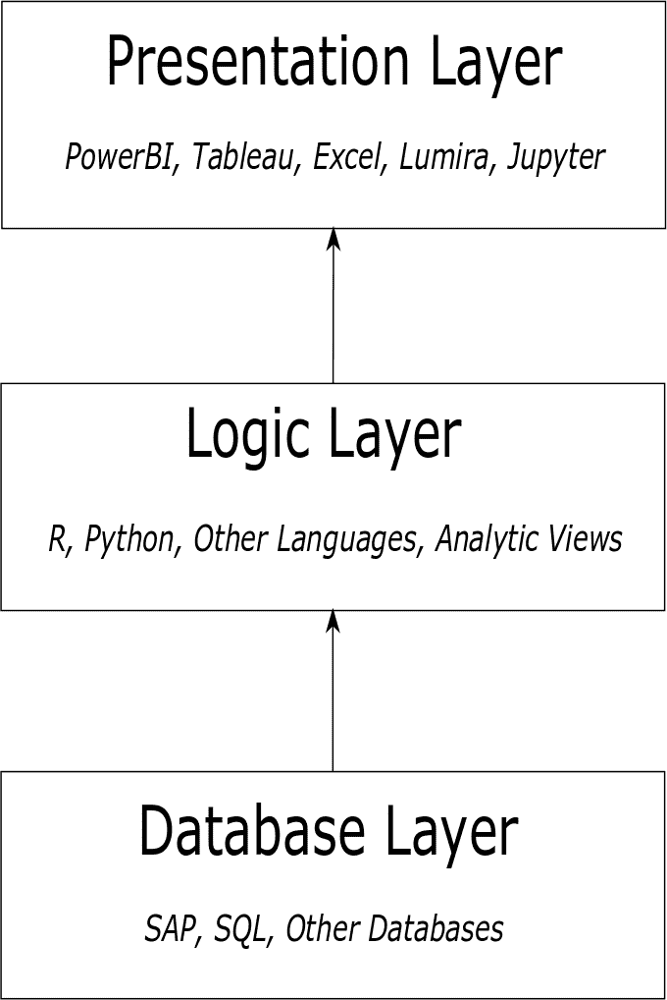

# 第一章：引言

# 用数据讲好故事

> 我们关于放弃垃圾的说法还远远不够。
> 
> 伊拉·格拉斯

我们都见过它们。那些令人生畏的 PowerPoint 演示文稿，屏幕上滚动着一队队的项目符号。讲师经常会为繁忙的幻灯片道歉，然后继续按照幻灯片上印刷的每个字读。您开始怀疑自己是否昨晚忘了关炉子。我们都喜欢故事。一个结构良好的叙事，无论是电影、书籍、电视节目还是播客，都会像毯子一样缠绕在我们周围，吸引我们的注意力。那些布满项目符号的 PowerPoint 幻灯片……却不是这样。随着互联网和物联网的兴起带来的数据洪流，我们很容易在演示中加入一些发现，擦干净我们的手，然后说“就是这样了”。然而，作为数据专业人士，我们不能只是向受众“淋浴”数据发现。流行的建议是，您必须用数据讲述一个故事——确保它是人们愿意听的引人入胜的故事。不要否认讲述故事能带来的乐趣。

要讲述一个引人入胜的故事，您必须首先识别它。我的数据被要求展示什么？我的用户正在寻找什么洞察？专门提供服务和设备的公司可能会问：“哪些设备最需要维修？哪些最不需要？设备类型与零件更换之间是否存在相关性？”在同一家公司，财务部门的某人可能会问：“我们如何更准确地预测手头的现金？”在销售部门，问题可能是：“我有什么样的客户流失情况？”

确定了您的故事之后，您需要找到您的受众。有多种方法可以细分受众，但通常您的受众包括高管、业务专业人员和技术专业人员。尽管他们可能管理或指导许多业务流程，但高管通常对这些流程的日常运行了解甚少。细节对他们来说无关紧要（或可能令人困惑）——他们想要看到大大的粗体字。业务专业人员是业务流程的日常管理员，如超级用户和业务分析师。他们了解流程的详细信息，并能理解原始的表格数据。技术专业人员是您受众中最小的部分；他们通常包括数据分析和数据科学团队中的同事。这个群体需要较少的业务和流程背景，而更多的是如回归的均方根误差或神经网络的架构等技术细节。

一旦你确定了故事和受众，你就需要继续进行旅程中最困难和不确定的部分：寻找数据。如果没有数据来支持你的故事，你的旅程将很快结束。假设你想讲述太阳黑子如何与北半球的帽子和手套销售相关的故事。令人惊讶的是，太阳黑子数据很容易获取。你已经有了这部分数据。然而，你只有关于帽子销售的细节，没有手套的数据。这里需要谨慎。你是改变你的故事以适应数据，还是放弃并找到另一个故事？反向过程是可行的，但这是一条很险的路。一般的规则是，不要改变你的假设来适应你的数据。

在你完全信任这些数据之前，你需要对其进行审核，并开始问很多问题：

数据源是否可靠？你是从网站上的一个表中爬取数据吗？该网站使用了什么数据源，并且数据是如何获取的？像 Data.gov、ProPublica、美国人口普查局和 GapMinder 这样的来源是可信的，但其他来源可能需要小心处理。

你有太多数据吗？是否有易于识别的无用特征？寻找明显相关的特征。在前面提到的太阳黑子数据中，也许你有一个 UTC 时间戳特征和另外两个日期和时间的特征。要么日期和时间应该被抛弃，要么时间戳。我们稍后将讨论的技术可以帮助你快速查看相关性，以帮助你确定何时两个特征过于相关，两者都不再有用。

数据是否完整？使用一些初步的数据工具确保你的数据没有太多遗漏的信息。我们稍后会详细讨论这个过程。

故事已经定好，受众已确认，数据已审核，接下来怎么办？现在你准备好进行故事的艺术和乐趣了——确定使用什么工具来支持或拒绝你的零假设。说你在使用“数据科学”作为工具是一条很险的路。你有先进的报告、机器学习和深度学习在你的工具库中。通常，只需将数据组织成易于使用的仪表板，就能讲述整个故事。不需要再做更多。尽管这在我们的职业生涯中曾让我们沮丧过，但这种情况发生的次数比其他任何情况都多。我们开始旅程时认为我们有一个适用于递归神经网络的案例，其中有门控循环单元或长短期记忆模块。在收集数据时，兴奋感不断增加。然后我们意识到支持向量机或简单的回归也能胜任。后来，有些失望地意识到，为用户提供探索数据的仪表板已经足够讲述故事。并非所有情况都需要深度甚至机器学习。尽管这通常很有趣，但将你的故事硬套到这些范式中通常并不能更好地讲述故事。

最后，花点时间学习一下讲故事的艺术。即使是我们干燥的数据科学故事也值得一些关注和关注。艾拉·格拉斯是一个了不起的讲故事者。他在讲述故事艺术方面有[一系列四段短视频](https://www.youtube.com/watch?v=f6ezU57J8YI)。观看它们，并将他的智慧建议融入到你的故事中。

# 一个快速的观察：SAP 专业人士的数据科学

SAP 专业人士每天都在忙于支持业务和用户，不断寻找流程改进。他们收集需求，在 SAP 系统中进行配置或编码，并且往往生活在 SAP GUI 中。他们对 SAP 内的数据以及业务流程有着深入的了解，并可以像念咒语一样召唤一大堆事务代码。当要求提供带有分析的报告时，他们确实有两个选择：在 SAP 中编写报告或将数据推送到数据仓库，由其他人生成报告。这两个过程通常是长期的、资源密集型的努力，给最终用户和 SAP 专业人员带来沮丧。

阅读本书将帮助你——作为 SAP 专业人士——在业务专业人士和数据科学家的世界之间架起一座桥梁。在这些页面中，你会找到一些打破以往受限制的典型报告和/或分析方法的想法。正如我们之前讨论的那样，做到这一点的首要方法之一就是*提出更好的问题*。

这是一个典型的 SAP 场景：辛迪在应收账款部门工作。她需要一个 30-60-90 天逾期报告，列出逾期客户并根据逾期时间将其分组到 30 天、60 天或 90 天逾期的桶中。财务部门的莎伦收到请求，她知道可以创建一个标准的 ALV（ABAP 列表查看器）报告，或者提取数据并将其推送到业务仓库（BW），在那里使用 Microstrategy 或其他工具生成报告。

如果我们将莎伦的视角转移到数据科学家的角度会怎样呢？莎伦收到报告请求。她知道她可以提供刚刚被请求的内容，但是她想：“还能做些什么？”她打开记事本，记下了一些想法。

是否存在拖欠付款的惯犯？

数据中是否存在任何有趣的相关性？我们知道客户名称、客户付款历史、客户购买和金额。

能预测一个人会延迟支付吗？延迟多久？

我们可以使用这些数据来帮助*评估*我们的客户吗？评级较低的客户在库存不足时可能无法下订单，而评级较高的客户则可以提出同样的请求。

哪些可视化类型会有帮助？

Sharon 概述了一个交互式仪表盘报告，她认为对用户非常有用。凭借这些想法和草图，Sharon 向部门数据科学家（或 SAP 开发人员）询问可能性。

在这里存在明显的方法差异。第一种是典型的 SAP 响应，限制了业务分析师的创造力和智力能力。第二种则利用了他们的创造力。当 Sharon 在 SAP 中看到数据并提出更好的问题时，她将在实质性流程改进中发挥重要作用。

这只是一个例子。想象一下典型 SAP 团队接收到的所有请求及其可能性，因此这本书出现了！

另一种改变 SAP 团队思维，使其更加动态和数据中心化的方法是*使用更好的工具*。这是 SAP 开发人员的责任。大多数 SAP 开发人员生活在名为 ABAP（高级业务应用程序编程）的应用程序编程语言的世界中，当被要求提供报告或流程改进时，立即转向 SAP GUI 或 Eclipse。这是他们被期望花费时间并提供价值的地方。

###### 小贴士

ABAP 最初被称为*Allgemeiner Berichts-Aufbereitungs-Prozessor*。它是一种专门设计用于扩展 SAP 核心功能的服务器端语言。您可以创建显示报告、运行业务交易或接收外部系统数据并集成到 SAP 中的程序。大量 SAP ERP 交易完全依赖 ABAP 代码运行。

ABAP 开发人员经常专注于 SAP 提供的一个或多个业务功能之一。由于 ABAP 程序经常直接增强标准 SAP 功能，ABAP 开发人员对企业如何设计其流程非常熟悉。熟悉 ABAP 的人很常见同时承担技术编程角色和业务分析角色。

###### 小贴士

SAP 开发人员，我们恳请您：将 SAP 视为数据源。报告的呈现层和逻辑层应该从数据库层抽象出来（见图 1-1）。值得注意的是，SAP 数据具有高度结构化和严格的业务规则。采用这种方法的一个最明显的优势是逻辑层可以访问其他数据源，例如公共数据。在 SAP 系统内部，如果需要查看雨靴销售与天气模式之间的关联，NOAA 的天气数据必须被带入 BI 或 SAP 本身。然而，通过使用分层模型，数据可以被逻辑层访问并在呈现层中呈现。通常情况下，数据可能是 API，允许在没有存储的情况下访问。这种模型还允许逻辑层与像 Azure 机器学习工作室这样的工具进行绑定，对 SAP 数据执行机器学习或深度学习。

###### 图 1-1\. 数据科学发现的简单分层方法：数据库、逻辑和数据呈现

SAP 缺乏 Python 中数以千计的库或 R 中数以千计的包。¹ 它也缺乏轻松创建动态/交互式仪表盘和可视化的能力。不要误会：SAP 确实有工具进行高级分析、仪表盘和可视化。只是这些工具成本高，需要大量时间和精力。有些地方需要几个月甚至几个季度才能创建报告，有时甚至有效的商业问题时间只有几小时。通过本书中的工具，我们打算弥补这一差距。如果你是 SAP 开发人员，我们强烈建议你学习 Python 和 R 等编程语言，以便用它们来对 SAP 数据进行分析。首先，它们不局限于 SAP 生态系统，其次，它们是免费的。

除了 SAP 之外，还有许多其他工具可帮助 SAP 开发人员展示其 SAP 数据。你可以在 R 中使用 RMarkdown，在 Python 中使用 Shiny 和 Jupyter Notebooks，还有 PowerBI、Tableau、Plotly 等等。在本书中，我们将使用 PowerBI、RMarkdown 和 Jupyter Notebooks 作为演示示例。

# 简介：数据科学家的 SAP 基础知识

尽管 SAP 如此之大且无处不在，其缺乏广泛的认知常常令人惊讶。一个惊人的事实是：全球 77%的交易收入以某种方式与 SAP 系统相关。如果你花钱，很可能你已经与 SAP 打过交道。而 92%的《福布斯》全球 2000 强企业是 SAP 的客户。

但是 SAP 软件究竟如何触及所有这些？它到底做了什么？近年来，SAP 通过收购多家 SaaS（软件即服务）公司来扩展其产品组合并使股东获益，但它最初的核心专注点是 ERP：企业资源规划。

SAP 成立于 1972 年，最初被称为 Systemanalyse und Programmentwicklung，源自德国。在 IBM 服务器上运行 DOS 系统，首个功能是一个后台财务会计软件包。很快，相继推出了采购、库存管理和发票验证模块。可以看出其主题：完成企业日常需求。

起初，这些功能列表可能看起来相当乏味，尤其对于我们这些拥有 Python 模块和 TensorWhatsits 的酷炫数据科学家来说，我们知道如何让计算机告诉我们图片中有狗（但没有飞机）。它不像搜索 Google 或者在 iPhone 上使用 Siri 那样神奇。但 SAP 在这些乏味的初始模块中添加了一个变数：集成。库存管理直接影响采购，采购直接影响财务，财务直接影响……嗯，一切。这一个 SAP ERP 系统包含了所有这些模块。现在，公司不再需要购买和运行单独的财务/库存/发票系统，从而节省了大量资金。当一个系统可以提供所有业务问题的答案时，客户开始大量购买。这就是 ERP 的价值和胜利。到了 1990 年代，当 Gartner 创造了 ERP 这个术语时，SAP 的年销售额已经超过 10 亿德国马克。

###### 注意

由于全球大多数大公司在如此多的业务关键功能中使用 SAP，难怪如此多的业务可以在其中进行。

## 从 SAP 获取数据

像大多数大型商业应用程序一样，SAP ERP 使用关系数据库来存储事务数据和主数据。它设计得让客户可以从多种关系数据库管理系统（RDBMS）中选择作为 SAP 应用程序数据库。Microsoft SQL Server、IBM DB2、Oracle 和 SAP 的 MaxDB 都得到支持。在过去几年中，SAP 迅速引入了另一种专有的数据库技术——HANA，作为一种具有内存技术的关系数据库管理系统解决方案。虽然未来版本的 SAP 核心 ERP 产品有朝一日将要求使用 HANA，但今天大多数的 SAP 安装仍然使用其他技术作为其数据库。

###### 提示

在本书中，我们将介绍几种从你的 SAP 系统中提取数据的方法，这些方法都不需要你准确地知道你的 SAP 系统运行在哪种数据库上。但是如果你是一个真正的极客，你最终还是会弄清楚的。

在你公司的 SAP 实例中驱动关系数据库都是巨大且充满了事务和主数据。它们完全描述了由 SAP 存储和处理的关键业务信息的形状。你的 SAP 系统核心的数据库是你可以进行发现的真实来源。

除非它是你的绝对最后选择，否则你永远不应该直接连接它们。

好吧，我们在这里有点在开玩笑。你会找到合适的时机通过 SQL 语句直接从 SAP 数据库查询数据。但是数据模型的巨大规模和难以置信的复杂性使得完全理解一个简单的销售订单的结构可能涉及超过 40 个表和 1000 多个字段。即使是 SAP 的黑带也很难记住所有他们需要使用的各种表和字段，所以想象一下对于一个刚接触 SAP 的数据科学家来说，解开所有这些必要数据的各种要素会是多么低效。

### BAPIs：使用 NetWeaver RFC 库

数据爱好者们，如果对 SAP 不太熟悉，应该从检查 SAP 系统中可用的业务应用程序接口（BAPIs）开始。BAPIs 是由 SAP 提供的远程调用函数，用于公开各种业务信息文档中的数据。不必去弄清楚 40 多个销售订单表中哪些适用于你的特定数据问题，可以查看各种销售订单 BAPIs 的结构，确定它们是否填补了这个空缺。逆向工程数据模型的麻烦不复存在。

BAPIs 还通过覆盖早期版本中的系统限制来提供帮助。在 SAP 核心产品开发的早期阶段，各种模块限制了可以表示表或字段的字符数。多年来，随着 SAP 的显著稳定性，这些表和字段名称一直保留下来。如果不在 SAP 内部工作，你怎么可能知道“LIKP”和“VBELN”与交货数据有关？BAPIs 是后来的补充，因此它们已经通过更好地描述其形状和功能的接口成长起来。

### OData

SAP NetWeaver Gateway 代表 SAP 进入现代 Web 时代的许多方式之一。它是一个 SAP 模块，在某些情况下运行足够自己的东西以至于值得作为一个独立系统，允许 SAP 开发人员快速轻松地建立 HTTP 连接到 SAP 后端业务数据。我们预测你将在第六章看到使用 SAP NetWeaver Gateway 的例子。

运输的基础层称为 OData。OData 代表许多技术公司联合起来通过 RESTful API 在 Web 上进行通信的一种标准方式。它提供了一个通用的数据格式，使用 XML 或 JSON 通过 Web 传输数据的方式，为客户端指示基本的创建/读取/更新/删除操作，并通过基于 XML 的方法让服务器指定与数据交互时提供的字段、结构和选项的元数据。

通过 SAP NetWeaver Gateway 使用 OData 需要使用 SAP 的原生后端语言 ABAP 进行编程。我们一些熟悉这种语言的 SAP 原生读者可以生成 Gateway OData API。其他读者可能不熟悉，但可以放心：如果你的公司在任何有意义的方式上运行 SAP，公司内会有了解 ABAP 的人员。这些人要么知道如何创建 OData 服务，要么能够快速学习，因为这并不难。

当您找不到满足数据需求的 BAPI 时，请选择 OData。这是一个很好的中间地带，为 SAP 管理员提供了灵活性来计量和监控其使用情况。它还赋予开发人员以任意方式组合数据的能力。使用 OData 的另一个好处是，它不像 BAPI 方法那样需要 NetWeaver 连接器：任何能够在企业网络内安全进行 HTTP 请求的设备都能够进行 OData 请求。

### 获取数据的其他方法

如果您找不到合适的 BAPI，并且找不到资源来制作 OData 服务，总是还有几条其他路线可供选择。由于这些通常不是我们推荐的事项，我们将简要涵盖它们。

#### Web 服务

SAP 允许您基于其 Internet Communication Manager (ICM)层创建 Web 服务。这些 Web 服务使您比 OData 更灵活地工作，但仍需要 ABAP 知识。介于 Gateway 和完全自定义的 SAP Web 服务之间的空间很小，请仔细考虑您的数据问题是否无法通过 OData 来回答。

#### 直接数据库访问

每个人都说你不应该这样做，但我们也都遇到过一两次这是唯一行得通的情况。如果您必须选择这条路线，一个关键任务将是确保您提取的数据与 SAP 向最终用户提供的数据匹配。许多时候，隐藏的输入/输出转换和数据建模层不会在仅通过数据模型浏览时显现出来。

严肃地说，直接从 SAP 数据库中选择数据就像是驾驶一辆有刹车问题的方程式赛车。你会快速到达目的地，但可能在路上撞上一两堵墙。

#### 将屏幕截图导出到 Excel

有时候，最终用户会准确地知道哪个屏幕上有他们需要的数据。许多时候，这个屏幕会有一种机制，可以将数据导出到 Excel 中。

# 角色和责任

数据科学结合了各种技能集。这些技能通常包括统计学、编程、机器学习、分析、架构和工程。许多博客和在线帖子讨论数据科学角色之间的差异。有无数的职位标题和界定。一个阵营将角色定义为数据分析师、数据工程师、数据架构师、数据科学家和数据通用角色。其他组织有他们自己的划分。

读者应该明白一件非常重要的事情。除非你在一个非常大的公司并且拥有一个数据科学团队，否则你很幸运能有一个人拥有这些技能。这些职位划分在理论上存在于所有人，但实际上只有少部分人。准备好做很多事情。如果你在公司应用了一些数据科学的尝试，准备好自己动手。没有 SQL 数据库想要提取和存储一些 SAP 数据？我们来介绍一下。想要自动化工作流程以进行数据提取？这里给你。从 SAP 数据到呈现层，我们将涵盖所有内容。

我们的意图很明确：我们希望培养懂得如何在他们的组织中进行数据科学工作的公民数据科学家。你可能没有任何资源来帮助你，当你请求这些资源时可能会遇到阻力。通常情况下，你必须在得到帮助之前证明你的理论。我们理解角色和责任并没有很好地定义。我们希望给你一个概览。如果你正在阅读本书，那么你已经卷起袖子准备做从构建 SQL 数据库到在 PowerBI 中呈现机器学习结果的所有事情。

# 总结

获取价值的一个重要部分是进行沟通。我们讨论了如何使用在 SAP 中找到的数据讲述精彩故事：确认你的故事，找到受众，发现数据，并对这些发现的数据应用严格的工具。有时，仅仅需要一个简单的图表来传达故事。其他时候可能需要详细的结果列表。但无论用什么视觉方法来传达你的发现，都要准备好用它来讲故事。

想要讲述关于他们数据的故事的 SAP 专业人员应该看看像 Python 和 R 这样的编程语言，以及 Tableau 和 Power BI 这样的可视化工具。深入了解请参考第二章。

想要发现 SAP 中有什么的数据科学家应该看看获取这些数据的方法。BAPI 提供了一种基于功能的数据检索方法，OData 设置了可重复和可预测的 HTTP 服务，作为最后的手段，你总是可以将屏幕数据导出到 Excel 或直接查询 SAP 数据库。详细内容请参考第三章。

我们希望你能充分利用企业中可供挖掘的 SAP 数据，并且从原始数据中获取价值的最佳方式是应用数据科学原理。本书将向你展示如何将 SAP 的世界与数据科学的世界结合起来。

¹ 想要体验 R 软件包领域有多广阔，可以看看[这篇博客文章](http://bit.ly/2kIobHy)，了解软件包列表的增长和寻找合适软件包的搜索策略。

² 但是，如果我们不承认最糟糕的黑客和不明智的胶带解决方案至少占据了任何真实环境的 50%，那么这本书就不能被称为“实用”。
