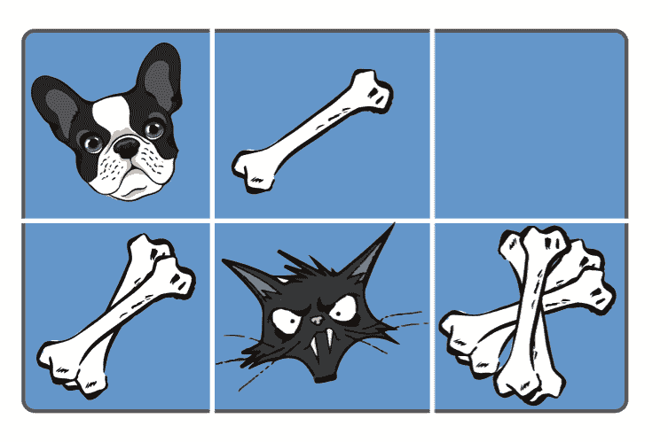
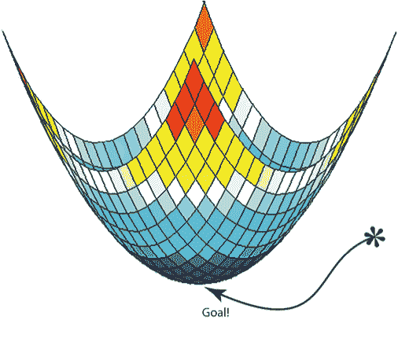
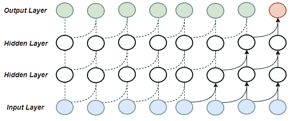

# 第二章：数据科学与 SAP 专业人员

###### 注意

如果你是一名数据科学家，你可能不需要本章节中的大部分信息。我们试图让 SAP 专业人员迅速掌握你可能已经了解的内容。

作为一名 SAP 业务分析师，Fred 始终在寻找流程改进的方法。那是他的工作，他做得很好。他听说过很多关于数据科学的信息，但对他来说，那只是...信息噪音。数据科学是创造自动驾驶汽车、击败围棋世界冠军和翻译语言。Fred 在一家美国制造商工作，数据科学对他来说并没有真正的相关性。

或者呢？

如果 Fred 了解数据科学的基本概念，他就会明白如何利用它为业务提供价值。最近，他与产品开发团队合作，后者正在寻求 IT 的帮助来简化他们的流程。他们有大量未组织的数据。他们向 Fred 提出了一个想法，一个仪表板来帮助他们追踪他们的流程。当 Fred 评估项目时，他的第一个反应是将数据放入 SQL 数据库中。一旦放在那里，他可以使用像 PowerBI 这样的演示工具创建一个仪表板。这是一个每个人都喜欢的解决方案。

Fred 并不了解数据科学的基础知识。这些数据中的特征可能帮助公司做出更好的、基于数据的决策。如果他了解回归和聚类的基本概念，他就会明白。他会知道他可以做更多，而不仅仅是项目团队要求的那些业务数据。

这正是本章的重点所在。我们不是要培养数据科学家。我们试图让业务分析师像数据科学家一样思考一点；我们试图创建*公民数据科学家*。这些是理解数据科学足够多的业务分析师和专业人士，他们能够提出关于如何将数据科学应用于他们的数据（特别是对他们的*SAP*数据有用的）的问题。为此，我们需要介绍数据科学的基础知识，包括不同类型的学习模型：机器学习和神经网络。

接下来将会对该主题进行一场快速浏览，至少会给你留下足够的信息，让你以稍微不同的方式思考业务流程...以数据科学的方式。理想情况下，你可以考虑你的项目和数据，并对你的数据科学家或开发者说：“也许朴素贝叶斯这样的分类算法在这个问题上可能有效。”想象一下这种回应将引起的震惊！

这是一个概念性的章节，提供了主要数据科学概念的概述，因此我们不会讨论诸如探索性数据分析（EDA）或数据准备等具体的想法。我们已经涵盖了我们认为最相关的主题，但可以轻松地争论我们忽略了重要的事物，例如自动化机器学习（autoML）和集成方法；然而，我们必须在某个地方划定界限，以便保持本章的可管理性。尽管如此，我们稍后将讨论诸如 EDA（在第四章中讨论）等具体概念，所以请继续关注。

# 机器学习

数据科学中的语法可能令人困惑且重叠。根据定义，深度学习是机器学习的一个组成部分，但我们指的深度学习是使用更复杂的神经网络模型。深度学习需要更多的计算能力、时间和数据才能取得成功。通常情况下，更简单的机器学习模型表现同样甚至更好。在光鲜和花哨的神经网络面前，不要忽视它们。

###### 注意

大多数数据科学家的时间主要用于查找、清理和组织大量数据。一些估计称，[数据科学家花费 80%的时间](http://bit.ly/2NBXPTJ)在这个无趣的任务上。对于查看 SAP 数据的数据科学家，我们有好消息。SAP 是一个 ERP 系统。数百万行的业务数据已经在关系数据库中。虽然这并没有结束进行一些清理和重新组织的必要性，但确实减少了这些工作的努力。我们将展示如何查找和提取这些数据，但通常情况下，几乎不需要进行清理或组织。

机器学习大致可以分为四类：

+   监督学习

+   无监督学习

+   半监督学习

+   强化学习

###### 小贴士

深度学习也包括这些类别。它被认为是机器学习的一个子集。对于本书的目的，我们在这里提到机器学习而不是深度学习的子集。我们稍后会介绍深度学习。术语中存在大量的重叠和混淆。如果你关注机器学习的新闻，你会发现地球上没有两个人使用相同的术语方式——所以不要因为感到困惑而感到难过。

## 监督学习机器学习

监督学习是在有标记的数据上进行的。它在分类方面表现出色，这是一种为一组数据分类或预测分类标签的方法。例如，在营销中，可以确定购买产品的客户。监督学习还在预测方面表现良好。预测是从一组数据中确定数值的方法。以与分类相同的类比，例如在营销中，可以用来尝试确定客户可能花费多少。例如，著名的鸢尾花数据集包含有关 150 朵鸢尾花的花瓣长度、花瓣宽度、萼片长度和萼片宽度的信息，并确定它们的物种。一旦我们对这些数据进行模型训练，它就能准确预测一朵新鸢尾花的物种，只要给出其萼片和花瓣数据。让我们更详细地了解一些不同类型的监督学习模型。

### 线性回归

线性回归是一种建模因变量与一个或多个解释变量之间关系的方法。一个房屋价值与其面积的关系是一个很好的例子（图 2-1）。如果你有几个房屋的价值和它们各自的平方英尺，你可以推测出一个未知房屋的价值，只要知道它的大小。当然，一个房屋的价值不仅仅取决于这些因素，但你明白我的意思。

###### 图 2-1\. 房屋价格与平方英尺的线性回归

### 逻辑回归

逻辑回归与线性回归类似，使用相同的基本公式。然而，逻辑回归是分类的，而线性回归是连续的。以同样的房屋价值例子，线性回归用于确定房屋的价值，而逻辑回归可以用于确定是否会卖出。

### 决策树

决策树是一种简单地提出问题并做出决策的模型。决策树的节点提出问题，导致要么到其他节点，要么到末端节点（叶子），这些末端节点是分类或预测（图 2-2）。

###### 图 2-2\. 吃饼干的决策树

### 随机森林

随机森林是一组决策树，帮助解决决策树的一个最大问题：过度拟合（图 2-3）。过度拟合模型意味着它非常擅长解决它已知的问题，但当引入新数据时，它会表现不佳。可以将其视为训练自己成为世界一流的一级方程式赛车手，但从未学会停车。¹

###### 图 2-3\. 随机森林

## 无监督机器学习

正如你可能猜到的那样，无监督机器学习没有标记的数据。也就是说，你有一堆数据，但你不知道输出标签。例如，你有一组包含年龄、性别、收入、职业和其他特征的选民记录。你不知道的是它们之间的关系。让我们看一下一些不同类型的无监督机器学习。

### *k*-均值聚类

*k*-均值聚类将数据分组到给定的点集中（图 2-4）。一个例子是将一组客户分组或聚类到代表他们购买频率的组中。它通过将它们与最近的均值值进行分组来完成此操作。如果使用非欧几里德距离，如 Levenshtein，也适用于单词。我们将在第七章中详细介绍这一点（ch07.html#clustering_and_segmentation_in_r）。

###### 图 2-4\. 聚类

### 朴素贝叶斯

朴素贝叶斯不是单一的算法，而是贝叶斯定理家族中的一系列分类算法（图 2-5）。其共同概念是数据的每个特征都被视为独立于其他特征。例如，一辆汽车有车盖、后备箱、轮子和座位。朴素贝叶斯将这些都视为独立的贡献因素，判断这个对象是一辆汽车的概率。朴素贝叶斯非常快速，通常是机器学习任务中首选的分类器。

###### 图 2-5\. 贝叶斯定理

这里是贝叶斯定理的术语，用简单的语言来说：

P(c | x)

假设成立（c）的概率，给定数据（x）。

P(x | c)

如果假设成立（c），数据的概率（x）。

P(c)

假设成立的概率（c），无论数据如何。

P(x)

数据的概率（x），无论数据如何。

这是贝叶斯的一个常见解释；它无处不在。然而，这有点难以理解，所以让我们简化一下。

有一个非常常见和直观的解释贝叶斯的例子，使用乳腺癌作为例子。考虑这种情况：患者去医生那里检查，乳房 X 线照片结果异常。那么患者患有癌症的可能性有多大？你可能直觉地认为癌症一定存在，因为测试结果，但将贝叶斯应用到这种情况显示了不同的结果。让我们来看一下。

考虑这些统计数据:³

+   参加例行筛查的 40 岁女性中，有 1%患乳腺癌，99%没有。

+   当乳房癌存在时，80%的乳房 X 线照片将检测到癌症，而 20%未能检测到。

+   9.5%的乳房 X 线照片返回假阳性；它们检测到了实际上不存在的癌症。这意味着 89.5%未能检测到癌症，实际上也没有癌症（真阴性）。

+   事件的概率是事件发生的次数除以所有可能性。

    *P(c|x)* = .01 * .8 / (.99 * .095) + (.01 * .8) = .0776

直觉上听到乳腺 X 光检查的准确率为 80%，因此如果结果呈阳性，则表示你有 80%的患癌症的几率。但事实是……即使结果呈阳性，你只有 7.8%的概率患癌。

### 分层聚类

分层聚类是一种将结果分组成树状图或树状图的方法（图 2-6）。如果从许多集群开始并移动到一个集群，则称为*分裂*。如果从一个集群开始并移动到多个集群，则称为*聚合*。分裂方法通过计算其特征之间的最大差异（或距离）来分区给定的集群。聚合方法则相反。它计算所有集群之间的差异，并组合具有最少公共特征距离的两个集群。它们都会继续进行，直到数据用尽或树状图达到预定义的分裂次数。我们将在第 7 章中更详细地讨论。

###### 图 2-6\. 聚合和分割层次聚类

## 半监督机器学习

半监督机器学习是监督学习和无监督学习的结合。在这种情况下，您有大量数据，但并非所有数据都已标记。考虑欺诈检测的情况。信用卡公司和银行拥有大量的交易数据，其中一些已正确标记为欺诈。然而，并不是所有的欺诈交易都被发现。理想情况下，他们会手动正确标记所有的欺诈交易。然而，这个过程是不切实际的，需要太多时间和精力。已有一小部分标记数据和非常大量的未标记数据。在半监督学习中，一个常见的技术称为*伪标记*。在这个过程中，使用传统的监督学习方法对标记数据进行建模。一旦模型建立并调整好，将未标记数据输入模型并进行*标记*。最后，使用已标记数据和新伪标记的数据再次训练模型（图 2-7）。

###### 图 2-7\. 用于半监督学习的伪标记

## 强化机器学习

强化机器学习是指训练模型根据试错来做决策。该模型通过从过去的成功和失败中学习来与环境进行交互。然后，它确定下一次尝试或迭代的行动方案。它的工作原理是最大化奖励。最常见的例子是训练机器玩游戏。让我们更详细地看看几种不同类型的强化学习。

### 隐马尔可夫模型

隐藏马尔可夫模型（HMMs）是一系列可观察的*发射*。这些是模型通过的给定状态的结果，用来进行这些发射。这有点令人困惑，所以让我们澄清一下。在 HMM 中，你不能直接观察到状态，但你可以观察到那些状态的结果。你在一个没有窗户的办公室工作，看不到外面的天气。你可以看到人们来办公室时穿着什么。比如说 75%的人带着雨伞...你可以推测外面正在下雨。HMMs 是识别序列和时间序列的流行方法。它们不看真实的状态；相反，它们看真实状态的发射。最简单的模型假设每个观察是独立的。然而，HMMs 假设观察之间存在关系。再举个例子，一系列数据被观察到了天气。这些数据中包含了气压、温度和一年中的日期等特征。相应的*发射*数据具有“不多云”或“多云”的二元特征。观察多天的连续性，该模型不仅预测今天的可观察特征的天气状态，还预测了前几天的特征的天气状态。HMMs 试图识别最有可能的潜在未知序列，以解释观察到的序列。

这个概念有点棘手，所以让我们用另一个例子来说明。比如你想用 HMM 来确定公司的订单是否增加或减少购买 widgets。SAP 有订单数据的历史记录和时间戳。它还有其他*状态*可能会影响 widgets 购买的时间。有销售订单、年度时间（季节性）、仓库库存水平和生产订单。每一个这些都可以被 HMM 使用。可以这样理解：“过去的行为预测未来的行为。”

### Q-learning

Q-learning 是一种基于价值的强化学习算法。它基于一个行动的*质量*。Q-learning 通过学习优化其结果的步骤进行。在游戏玩法的例子中，它执行一个动作，评估该动作，更新其行为秘笈（cheat sheet）表明该动作的好坏，然后再次尝试。它以极快的速度迭代这个过程。

###### Figure 2-8\. Q-learning 步骤

一种常见的插图是想象一个游戏，你是一只狗，你必须找到骨头堆。每走一步花费一根骨头。如果你遇到那只讨厌的猫，你会失去 10 根骨头并且死亡（Figure 2-9）。目标是最大化骨头数量。

###### Figure 2-9\. Q-learning 狗最大化优化骨头

对我们来说，这似乎是一个简单的游戏，但计算机不知道该如何开始。所以它首先下去拿了两根骨头。耶！哥们，这一步走得好。它记录下来并向右走了一步。该死的猫……游戏结束。它更新了作弊表格的信息。下次它先向右走一步，然后再向右走一步，然后只有向下的选项。是的——骨头的“金矿”！记住每走一步要付出-1 个骨头的代价。结果是-1 +2 -1 -1 +1 -1 -1 +10 = 8。它记录下结果并再试一次。这次它向右走，因为知道那里有+1。它再向右走一步，然后向下找到“金矿”。结果是-1 +1 -1 -1 +10 = 8。两条路径同样有价值，但如果有奖励或步数限制，第二个选项胜出。

你可能会想，“挺酷的，但这与游戏之外的应用有何关系？” 想象一下斗牛犬找到主要金矿的情景。现在把它想象成一个简单的仓库……大幅扩展它（图 2-10）。强化学习可以减少拣选、打包和库存的运输时间，同时优化空间利用率。虽然更复杂，但基本上与狗和骨头的游戏相同。

###### 图 2-10\. 这个仓库比狗找骨头更复杂，但通过强化学习的路径规划同样适用于这里

# 神经网络

我们两个作者都从事编程多年，并在这过程中体验过一些美妙的“哇”时刻。格雷格通过 Apple IIe 上的 Basic 学会了编程。在学会使用 PEEK、POKE 和 CALL 命令之前，他已经编程了大约一年。第一次使用这些命令并运行他的程序时，他坐下来想：“哇！”；从那以后，他一直以某种形式进行编程。当格雷格和保罗编写他们的前几个深度学习程序时，他们都有这种感觉。“哇！”是我们能说的全部。

让我们谈谈深度学习及其含义。

传统编程遵循简单直接的逻辑故事。如果这样，那么执行那个动作 10 次。它如此强大，我们可以模拟美丽的风景并创建让我们陶醉的游戏，带我们进入魔法般的、想象的境界。但这使得像语言翻译这样的任务几乎不可能。想象一下需要翻译英语到韩语的程序。这个程序需要考虑词语、短语、否定、语法、本土用语、标点符号等等，无穷尽的条件。想象将所有这些嵌套在线性逻辑中。机器学习出现了。现在你输入一组英文文本及其翻译成韩文的等价文本。你通过展示输入和期望输出来训练模型。你拥有的数据越多，你就能训练模型得越好。最后，你输入一组没有韩文翻译的英文文本，哇！它像学会了一样进行翻译。

这本身就很了不起，但更好的是，谷歌在 2016 年构建了一个[深度学习算法](https://tcrn.ch/2Pcz2YJ)，能够从英语翻译成韩语、韩语翻译成英语、日语翻译成英语以及英语翻译成日语。这本身就非常了不起——但这不是令人惊奇的部分。该网络能够直接从日语翻译成韩语和韩语翻译成日语，[*而无需先经过英语*](https://tcrn.ch/2Lc0KAM)。想一想这是如何发生的？网络内部发生了什么，使得这种事情成为可能？该网络学会了一种*元语言*——一种超越简单一对一语言翻译的语言映射。

当从日语翻译成韩语时，人们期望模型首先经过英语（弯曲的线路）；见 图 2-11。然而，模型并没有这样做。它直接从日语到韩语（虚线路）。令人惊讶！实际上有点令人毛骨悚然。

###### 图 2-11\. 谷歌的语言翻译器

谷歌的语言翻译器是一个正在运行的神经网络。让我们来看几种基本的神经网络架构。这是神经网络和深度学习的初步介绍。我们希望这能激发你的好奇心，让你有兴趣深入了解。神经网络的基础是一系列相互连接的处理模块，它们一起接收输入并求解给定的输出。它们受到大脑中神经元和突触处理信息的启发。它们在解决从图像分类⁴到语言翻译等问题上发挥了重要作用。我们将在第九章中进一步深入探讨这一点 Chapter 9。

神经网络有三个基本层：

输入层

这里是数据输入到网络的地方。

隐藏层

这一层执行基本计算，然后将权重传递到下一层。下一层可以是另一个隐藏层或输出层。

输出层

这是网络的结束，模型输出结果的地方。

神经网络有六个基本概念，如下节所述。

### 前向传播

数据（权重和偏差）从输入层经过各个隐藏层向前流动，最终到达输出层（图 2-12）。

###### 图 2-12\. 前向传播

### 反向传播

数据经过网络前向传播后，误差（期望值减去获得值）通过网络反向传播以调整权重和偏差，旨在减少误差（图 2-13）。

###### 图 2-13\. 反向传播

\/>

### 梯度下降

一种优化函数，尝试找到函数的最小值。另一种说法是，梯度下降的目标是尽可能地最小化成本函数（见图 2-14）。当这一目标达成时，网络被优化了。一个常见的类比是一个人走下山。他每走一步都希望朝向下降的方向前进，直到达到最低点；这就是成本函数最小化的地方。当这一目标达成时，模型的准确性最高。

###### 图 2-14\. 梯度下降

### 学习率（Learning rate）

学习率是我们为了实现梯度下降的最小值（山底）而采取的步骤大小。如果学习率太大，会超过最小值并潜在地失控。如果太小，过程会花费太长时间（见图 2-15）。

###### 图 2-15\. 学习率

### 神经元

神经元是神经网络的基础。它接收一个或多个输入，对这些输入应用一个函数，并生成一个输出。它在某种程度上基于人类神经元（见图 2-16）。

###### 图 2-16\. 神经元

### 函数

函数是神经元内的数学方程，它接收输入值并决定是否应该激活（或发出）。有许多激活函数，但这些是神经网络中最常见的：

Sigmoid

将输入值置于 0 到 1 的范围内（见图 2-17）。

###### 图 2-17\. Sigmoid

Tanh

将输入值置于-1 到 1 的范围内（见图 2-18）。

###### 图 2-18\. Tanh

ReLU

修正线性单元（Rectified Linear Unit）将输入值置于 0 到无穷大的范围内。它使所有负值为 0（见图 2-19）。

###### 图 2-19\. 渗漏修正线性单元

Leaky ReLU

将输入值置于非常小的负值到无穷大的范围内（见图 2-20）。

###### 图 2-20\. 渗漏修正线性单元

Softmax

接收输入并在一定的可能性集合上预测结果。例如，在数字识别中，Softmax 函数返回 10 个可能性（0-9），每个可能性都有概率。如果你有五种不同的汽水，它将返回五种可能性，每种可能性都有相应的概率（见图 2-21）。

###### 图 2-21\. Softmax 函数

###### 注意

ReLU 函数存在“死亡”的问题——它会陷入负值侧并始终输出值为 0。使用具有轻微负斜率的渗漏修正线性单元或降低学习率可以解决这个问题。

作为业务分析师，我们建议对机器学习，特别是神经网络，采取高层次的视角。在这里，你可以深入研究 S 型或双曲正切函数的确切差异，或者如何确定梯度下降的确切方法。你可以深入数学领域，甚至可以撰写许多博士论文。我们在这个概述中的目标是向 SAP 业务分析师传达这门美妙科学的深度。此外，对这门科学的基本理解将使你能够利用它获得实际结果。

现在我们掌握了一些基本概念，那么今天我们实际上看到的一些基本神经网络是什么呢？

### 单层感知器

*单层感知器* 是神经网络的最简单形式（图 2-22）。它没有隐藏层。它只有一个输入和输出层。你可能认为图表有两层，但是输入层不被认为是一层，因为它不进行计算。单层感知器接收多个输入信号，对它们求和，如果值高于预定阈值就发射。因为它们只有值或没有，它们只能区分两个线性可分的类别。这有什么了不起的？单层感知器本身相当有限。然而，它们构成其他神经网络。想象一下：普通人的大脑有 1000 亿个神经元。每个神经元的功能很简单，就像这个单层感知器一样。正是我们大脑中这些神经元的合奏构成了我们的音乐。

###### 图 2-22\. 单层感知器

### 多层感知器

*多层感知器* 由多个层组成（图 2-23）。它们通常是互相连接的。第一个隐藏层中的节点连接到输入层中的节点。偏置节点可以添加在不连接输入层的隐藏层中。偏置节点增加了网络适应数据的灵活性，它们的值通常设为 1。在更高级的神经网络中，*批量归一化* 进行这个功能。

###### 图 2-23\. 多层感知器

### 卷积网络

*卷积神经网络*（CNN）是通过层间传递权重和偏置的多层网络。CNN 假设输入是图像，因此这些网络有特殊的层和编码。为什么不用多层感知器进行图像分类呢？嗯，图像数据很大……它不会很好地扩展。CNN 使用三维张量作为它们的输入，包括宽度、高度和深度。

###### 图 2-24\. 卷积神经网络层

CNN 有三个独特的层：

卷积层

主要目的是从输入中提取特征。每个图像都是像素值矩阵，通过滑动在图像上的*滤波器*计算点积来转换为特征。

池化层

有时也称为降采样或子采样。它通过使用最大值、平均值或总和值来减少由卷积层呈现的特征的维度。

全连接层

类似于使用 SoftMax 激活函数的多层感知器，将概率分布传递到输出层。

CNN 可以变得非常复杂。查看谷歌的 Inception 模型，如图 2-25 所示。

###### 图 2-25\. 谷歌的 Inception 模型

###### 注

神经网络领域正在经历快速且令人兴奋的变化。杰出的思想家们正努力推动这一领域的快速发展。随着研究人员萨拉·萨布尔、尼古拉斯·弗罗斯特和杰弗里·辛顿提出了[胶囊网络](http://bit.ly/2lQr9dl)（Capsule Networks）的提议，这一变化尤为明显。（辛顿在这一领域是一个偶像级人物；只要他的名字出现在一篇论文上...你就会去读它。）在多层神经网络中，根据你的需求不断添加更多层次。在 CapsNet 中，你在另一层中添加一个神经网络。

正如辛顿所说，“卷积神经网络中使用的池化操作是一个大错误，它能够如此出色地工作，这是一场灾难。”

令胶囊网络如此令人兴奋的原因在于它们，就像我们自己的图像处理一样，不考虑图像的方向。当一个孩子看着一只狗时，狗的方向并不会影响他/她对图像的感知。

CapsNets 在目前仍然很新，但如果它们继续受到关注，我们将在未来的版本中更全面地讨论它们。

### 递归神经网络

*递归神经网络*是利用时间序列或顺序数据的多层网络。它们表现非常出色，通常是自然语言处理（NLP）任务和时间序列数据的首选模型。我们将在*语言与文本处理*章节中看到它们的运行。在其他神经网络中，一旦数据传递到下一层，前一层就被遗忘了。然而，在试图对数据序列进行预测时，*记住*之前发生过的事情是很重要的。这些网络是*递归*的，它们会回溯并查看之前的输入或输入。从某种意义上说，它们具有记忆功能。

环绕返回的箭头显示了 RNN 中的循环（见图 2-26）。正如你所见，这种循环非常短暂；它仅在同一层上循环返回。从本质上讲，它只有短期记忆。引入长短期记忆（LSTM）网络克服了这一问题。

LSTM 允许网络在长时间内学习。它们有三个门：输入门、输出门和遗忘门。输入门确定允许进入的数据。输出门确定允许输出的数据。最后，遗忘门决定应该遗忘哪些数据。它们的架构对初学者来说可能很难理解，但可以说 LSTM 允许网络在长时间内记住。如果您对它们更深入地了解感兴趣，请阅读[这篇博客](http://bit.ly/2kjzC8A)。

###### 图 2-26。前馈和递归网络

### 时间网络

*时间卷积网络*（TCN）是一个多层网络，具有卷积网络的优点，同时也考虑位置和摆放。

卷积网络通常非常擅长图像识别和语言分类。然而，它们并不关心位置。例如，卷积神经网络想知道图像中是否有尾巴、棕色的鼻子和垂耳。然后将该图像分类为狗。它并不关心图像的位置。在语言分类中，卷积神经网络想知道是否存在某些关键词，这些关键词会提示它是否在查看法律文件、漫画书或海明威的小说。同样，位置并不真正重要。但是如果您想处理位置和摆放很重要的数据，比如时间序列数据呢？时间序列数据就是一个带有日期和/或时间戳的时间轴上的数据集。正如我们之前提到的，处理这类任务的行业首选模型是循环神经网络（RNN）。然而，像许多数据科学中的事物一样，这个模型最近被强大的 TCN 取代了。

相较于 RNN，TCN 在计算上更加经济实惠，并且使用更简单的架构。RNN 需要资源，如 LSTM 层来*记住*。TCN 使用映射到下一层输入的输出步骤（参见图 2-27）。它们不使用递归，而是使用一个层的结果来馈送下一个层。

###### 图 2-27。时间卷积网络

在第六章中，我们进行了一个简单的销售预测。TCN 似乎是用于此类任务的合适模型；我们将尝试使用它来预测从 SAP 系统中某个特定产品的销售情况。

### 自编码器

自编码器是一个仅具有前向传递的神经网络，其定义看似简单。它是一个接受输入数据并试图将其复制为输出的网络。它由两部分组成：

编码器

拆解输入数据。

解码器

重构数据以供输出。

这种类型的网络最常见的用途是图像去噪和图像生成。自编码器的真正价值不在于输出，这在我们其他神经网络的情况下是如此。真正的价值在于神经网络对压缩数据输出的表征。为了进一步澄清这一点，模型在最压缩的情况下已经学会了对象的显著特征。比如说，它正在观察一张狗的图片。显著特征包括耳朵、眼睛、嘴巴、吻、类似狗的鼻子等等。如果模型压缩得太远，可能会认为唯一显著的特征是眼睛，无法区分狗和其他动物。如果模型压缩得不够，识别了太多特征（比如颜色和面部形状），它只会知道一种类型的狗。这种模型的技巧在于知道平衡点。总结一下，神经网络的优化不是在输出接近输入时，而是在输出仍然代表输入的关键特征且数据尽可能*压缩*的时候。

###### 注意

自编码器的一个关键概念是，输出维度必须小于输入维度，以便网络学习最相关的特征。

###### 图 2-28\. 自编码器

自编码器通常用于减少数据的维度和特征学习。它们通常是另一个神经网络的一部分，帮助减少特征的维度。

### 生成对抗网络

生成对抗网络（GAN）是一种神经网络架构，其中有两个网络，坦率地说，它们相互对抗。因此有*对抗*一词。这两个网络分别称为生成器和判别器。想象一下这种常见的场景。GAN 想制造假钱。生成器制作一张钞票并将其发送给判别器进行测试。嗯，判别器知道真钞看起来是什么样的，因为它已经从一组真实世界的图像中学习了。生成器的第一次尝试是可悲的，它失败了并且得到了失败的反馈。然后它再试一次，再试一次，直到能够生成一个让判别器认为是真实的钞票。然后轮到判别器学习了。它发现自己错了，并学会不再接受那张假钞票。这种争吵来回进行，直到网络在失败和成功上达到了一个平衡点......即不再有学习发生的点。

###### 图 2-29\. 生成对抗网络

/>

你可能会想知道这样的网络会如何使用。嗯，这些网络喜欢模仿数据。因此，它们已经被教会模仿艺术、音乐、图像，甚至诗歌。它们可以被教会合并图像中的概念。例如，你训练网络使用戴帽男士的图像，不戴帽女士的图像，并要求 GAN 生成戴帽女士的图像，它会做得相当不错。听起来很棒，但在我们的业务场景中有什么用呢？嗯，GAN 已被用于检测数据中的异常，也用于为其他网络生成训练数据，当数据量有限时。在这里我们提供的神经网络介绍中，我们不提到 GAN 是不完整的。但是，我们承认将它们应用于业务应用程序要困难得多。在此介绍它们只是为了说明我们在 SAP 业务分析师社区中创建一种*公民数据科学家*的目标。请记住，包括 GAN 在内的所有概念，也许你能找到一个能够应用 GAN 的业务场景。

# 摘要

如果这是你第一次接触数据科学概念，我们理解这可能有些难以接受。如果你是一位经验丰富的数据科学家，你可能会问：“XGBoost 在哪里？”或者“为什么不用 AutoML？”请记住我们的主要意图，我们希望业务分析师能多少像数据科学家思考一下。我们在本章中没有涵盖的数据科学的其他领域，如探索性数据分析和数据可视化，将在后面进行讨论。业务分析师们，我们希望你在本章中找到一些能让你思考你自己数据的想法，特别是本书中的 SAP 数据。在接下来的章节中，我们将使用 SAP 数据和我们在本章介绍的概念来进行详细的业务场景讨论。

¹ 作者建议在学习参与 F1 赛车之前先学会停车，但我们没有使用本书中的任何技术进行分析。那么谁知道呢？也许成为 F1 赛车手但不学会停车更好！需要更多数据来证明。

² 欧氏距离简单来说就是两点之间的普通直线距离，可以是平面上的或者三维空间中的。为什么说“直线距离”而不说“欧氏距离”听起来更学术呢？如果你有烟斗或羊毛衫夹克，额外加分。

³ 这种情况的更详细解释可以在[*http://yudkowsky.net/rational/bayes#content*](http://yudkowsky.net/rational/bayes#content)找到。

⁴ 图像分类是指从图像中提取信息并对其进行分类的过程；例如，识别一张图片是[吉娃娃还是蓝莓松饼](http://bit.ly/2U6fpAt)。
