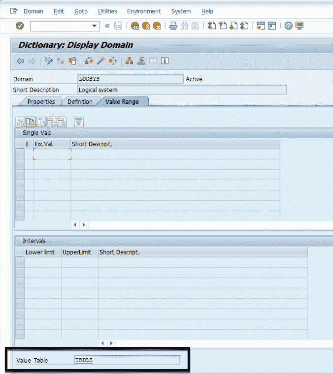
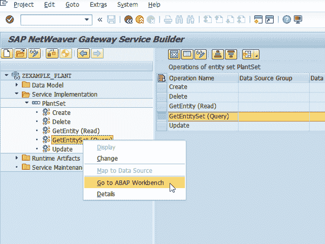

# 第三章：SAP 数据科学家

###### 注意

如果你是 SAP 专业人士，你可能不需要本章的大部分信息。我们正试图让数据科学家了解你可能已经知道的事情。

在 Big Bonanza Warehouse，Greg 和 Paul¹ 组成了整个数据科学团队。无论他们往哪里看，都会看到大量有趣的数据：工厂自动化系统、客户发货的运输记录、营销活动数据以及大型企业中随处可见的大量电子表格和 Microsoft Access 数据库。他们无法喝咖啡都听到另一个引人入胜的数据机会。他们既感到欣喜若狂又感到不堪重负：他们每天都要处理有趣的问题，但是他们永远也无法赶上堆积如山的数据请求。

当然，他们也有一种赶上来的方法。他们可以深入学习 SAP。

因为 SAP 是继续吞并其他大型宝库系统的利维坦。随着 Big Bonanza 将其企业软件资源整合到 SAP 组合中，更多珍贵的数据消失在这头巨兽的腹中。Greg 和 Paul 知道 SAP 中数据量和机会之多令人难以置信。但他们不知道如何开始探索获取这些数据。与 SAP 最终用户交流无法揭示真正的数据模型，而与 SAP 管理员交流几乎毫无进展，因为他们的工作负荷实在太大。Greg 和 Paul 需要一种方法来进入这个领域。

数据科学家们，请注意。本章介绍了 SAP 基础知识，将帮助你达到你想要的目标。SAP 专业人员花了很多年时间熟悉 SAP 的各个方面。阅读一章书后，你不会像马哥伦那样导航。这是你成为与 SAP 团队和 SAP 数据合作的合格者的方法。

如果你听过“我知道的只够让我危险”的说法——这正是我们的目标。

# 开始学习 SAP

SAP 是具有多个高度可配置功能的企业资源规划（ERP）软件。安装并运行 SAP 的企业可以选择多个可能的模块（参见 第一章 部分清单），但目前最常见的 SAP 版本是 R/3 ERP，这是一个在应用服务器上需要大量应用处理的客户端/服务器架构。

应用服务器几乎肯定由 SAP 社区内被称为 SAP Basis 管理员的一组管理员设置和维护。他们专注于安装和配置 SAP 系统，以实现高可用性运行。SAP Basis 管理员执行数据库管理、服务器管理、调度和故障处理批处理作业、管理低级安全性、修补应用程序和运行应用程序的基本操作系统等许多其他技术任务。

与 SAP 合作意味着您将使用功能强大（尽管看起来有些过时）的 SAP GUI。您很可能需要通过或从公司 IT 部门获得指示来安装它。通常由 Basis 团队维护的连接设置指向您的安装到正确服务器。一旦 GUI 安装完成，您可以通过打开 SAP GUI 登录板（图 3-1）来启动 SAP。


###### 图 3-1\. SAP GUI 登录板

如果您的 SAP 登录板上有许多系统连接，请不要担心，这是正常的。考虑到为许多 SAP R/3 应用程序安装了单独的系统，并且每个系统存在于沙盒、开发、QA、预生产和生产环境中，您可以看到：通常有数百个可能的系统可供登录。了解您需要的数据在所有这些系统中的位置可能需要您公司 SAP 专家的至少一个初始指引。

但一旦找到合适的系统并获得适当的访问权限，您就可以准备登录。请记住：就像任何企业系统一样，获取此访问权限通常需要通过安全专业团队的审核，并可能需要几秒到几周的时间。一旦完成并输入您的凭据，您将看到类似于图 3-2 的内容（尽管有些公司选择在 GUI 屏幕右侧放置其他图片）。


###### 图 3-2\. SAP Easy Access 屏幕，准备运行事务

现在您已经准备好进行一些真正的探索了。最初出现的屏幕允许您通过顶部的命令字段手动输入 t-code 启动任何 SAP GUI 功能，而左侧的所有文件和文件夹则是 t-code 的快捷方式。

将 t-code 理解为 SAP 内部的程序快捷方式。输入 t-code VA03，如图 3-3 所示，将启动 SAP 程序查看销售订单；输入 SE37 将进入 SAP 函数编辑器等。最终用户有通过网页界面或移动应用程序等其他方式查看其业务 t-code 的替代方法，但数据科学家需要探索 SAP 应用套件的管理侧面。


###### 图 3-3\. 显示和编辑销售订单的第一个屏幕

如您从图 3-3 中看到的 VA03 截图，SAP 终端用户体验可能变得非常混乱。典型的 SAP 用户通常只需使用订单的少量字段。在某些情况下，向通常不使用的字段输入数据可能会触发意外功能。

这正是使 SAP 和数据科学交汇如此奇怪却又如此有趣的部分。从 SAP 中可以获取到大量数据。您从哪里找到它？您甚至如何知道它在那里？

对于你们数据科学家，这本书将帮助你们在某些时间回答一些问题。对于你们 SAP 专家，放心，所有那些辛苦赢得的经验和领域知识对数据科学过程有着*巨大*的价值。

# ABAP 数据字典

SAP 系统的一个重要功能是其内置的灵活性，允许客户添加或更改交付功能。这使得 SAP 能够交付支持包和增强功能，供客户自行实施，同时也允许客户在 SAP 系统*内部*创建自己的数据对象和程序。

SAP 系统为让客户定义自定义数据对象规定了一个过程。这些工具、对象和流程的集合通常称为*ABAP 数据字典*。数据科学家和其他程序员可能熟悉用于创建数据类型和表的常见 SQL 命令。SAP 在概念上提供了相同的功能，但实际上对其进行了加强。数据定义的变更立即影响系统的原始应用功能。例如，通过修改 SAP 表中字段的定义，您可以立即使屏幕为用户提供一个友好的下拉列表，用于输入字段的值。

我们将在这里介绍 ABAP 数据字典的一些主要部分，因为它们在解析您可以访问的系统中的数据时非常有用。

###### Tip

强大的功能伴随着巨大的责任！那些第一次窥探 SAP 的数据科学家们应该避免编辑 SAP 数据字典对象的诱惑。如果管理员给了您开发者访问权限，您可能会发现自己有权进行此操作。但请不要这样做！

更改数据字典对象可能会导致系统多个区域的不稳定性。作者曾见过一次不明智的数据字典更改导致整个 SAP 实例必须从备份中恢复。可以告诉你的是，最有经验的 SAP 老手也是最谨慎触碰数据字典对象的人。

## Tables

在大多数 SAP 系统中，应用程序运行在像 Microsoft SQL Server、Oracle 或 IBM DB2 这样的传统 RDBMS 之上。与直接编辑这些数据库系统以进行更改不同，SAP 为用户提供了几个可以查看和更改系统数据库的事务代码。在过去几年中，SAP 推出了自己的 RDBMS，称为 HANA。它正在全球 SAP 环境中获得立足点，但截至目前尚未成为 SAP 数据库市场的主要股东。在本章的后面，我们将展示为 HANA 系统创建数据服务的示例。²

让我们深入研究一些 SAP 表。转到事务码 SE11，输入 VBAK 到数据库表字段中。点击显示按钮，表定义如图 3-4 所示。


###### Figure 3-4\. 在事务码 SE11 中的 VBAK 表定义

VBAK 是一个*透明表*，这意味着屏幕上显示的字段和其他信息与底层的关系数据库管理系统中的表一一对应。这比在 SQL 中盯着某些 DDL 语句好得多。SAP 还允许另外两种类型的表：汇总和集群。对于本书的目的，我们不需要详细讨论，但要理解 SAP 汇总和集群表与关系数据库管理系统表不是一一对应的，因此屏幕显示的数据物理存储方式并不完全代表数据库中数据的物理存储方式。对于 SAP 中的大多数编程任务，这种区别并不太重要。³

###### 注意

VBAK 是销售订单头表。VBAP 是销售订单行项目表。在查找 SAP 表时，请记住：SAP 是德国软件。K 通常代表“Kopf”或头部。P 通常代表“Position”或项目。

SAP GUI 列出了此表的字段在底部部分，包括它们的数据类型和长度。字段列给出了数据库中字段的名称——在我们的第一个示例行中是 MANDT。选中 Key 复选框的行必须在记录写入表之前以组合形式唯一，因此在我们的示例中，MANDT 和 VBELN 必须唯一。数据元素列标识引用数据对象类型，进一步由数据类型、长度和小数点列指定。对于试图确定字段用途的数据科学家，简短描述列提供了这一点。如果你滚动到字段列表底部，可能会看到一个或多个字段名称带有 Y 或 Z 前缀。这表示公司已向交付的数据库表中添加了字段，因为数据科学家可能需要在 SAP 系统中收集其他唯一数据。⁴ SAP 使用 Y 或 Z 来命名这些字段。但是，这些新字段确实在添加时成为底层数据库表的一部分。

T-code SE11 在搜索 SAP 数据时提供了另一个有价值的功能。顶部附近有一个“Indexes…”按钮。这让你知道哪些字段被优化用于搜索此表，这在考虑某些较大的 SAP 表时非常重要。索引是灵活性的另一个关键点——SAP 应用程序允许你向基本系统表中添加自己的索引以提高搜索性能。然而，索引并不完美。它们可能会造成性能成本，因此在向 SAP 表添加自己的索引时要谨慎和实用。

如果我们勇敢的数据科学家 Greg 和 Paul 需要检查特定的销售订单集以查看系统中存在的数据类型，他们可以使用 t-code SE16（通用表显示）或较新的 SE16N，如图 3-5 所示。知道 VBAK 是订单头表的提示来自他们的 SAP 同事，他们可以在下部分输入搜索条件，并查看结果。请注意，他们可以限制返回的记录数量，这对于发现他们是否在等待 3000 万行返回到屏幕上以确定他们是否正在搜索正确的内容非常有用。SE16/SE16N 更适合查看表中的数据，而 SE11 更适合检查表的设置详细信息。


###### 图 3-5\. 在 SE16N 中显示的 VBAK 表，用于查询

## 结构

SE11 还用于定义 SAP 结构。结构是在字典中定义的字段组，提供了在 SAP ABAP 代码中引用数据的常用方式。在“OData 服务”中，我们使用字典定义的结构来保存 SAP 物理工厂数据。如果像图 3-6 中那样在字典中定义了一个结构，那么整个 SAP 系统中的程序都可以使用该结构来创建内部变量。结构本身并不永久保留数据；它们只是用于生成数据的模板。


###### 图 3-6\. 在 t-code SE11 中的结构视图

视觉效果非常类似于表视图。您可以查看字段名称、数据类型和一些基本描述。作为数据科学家，您可能不会经常定义新的结构，但好处是定义自己的结构比重新定义基本应用表的风险要小得多。例如，在第五章中，您将了解到异常检测，我们将定义自己的结构以用于从 SAP 提取数据。

## 数据元素和域

SAP 应用层使用数据元素作为结构和表定义（除了像整数和字符串这样的基本类型之外）的最低级别部分。它们可以在整个系统中的结构、表和程序中使用，这使它们成为定制字典定义中灵活性的关键部分。

数据元素也在 SE11 中定义（见图 3-7）。

在这里，您将数据元素定义为预定义的基本类型或域的一部分。在图 3-8 中显示的屏幕截图中，SAP 提供的 LOGSYS 数据元素使用了同名的 LOGSYS 域。这是安装在基本系统中的。尽可能使用域来赋予您的数据元素一些额外的功能。


###### 图 3-7\. 在 t-code SE11 中定义的数据元素


###### 图 3-8\. LOGSYS 的域定义（在本例中，LOGSYS 是 LOGSYS 数据元素的域）

域可以作为数据元素之上的一种感性层。最强大的是，您可以为该域定义一个可接受的值列表，无论是通过硬编码列表（如 VBTYP 域的图 3-9 所示），还是指定一个 SAP 表作为该域可能值的定义（如 LOGSYS 域的图 3-10 所示）。


###### 图 3-9\. VBTYP 域的硬编码可接受值列表

在 SAP 中进行信息搜索时，使用域定义的数据元素可以极大地帮助查找可能的值。了解可能的值及其含义会立即提升您对正在查看的数据的洞察力。例如，如果 Greg 和 Paul 从图 3-9 中看到的 VBTYP 字段提取信息，数据将从 SAP 中提取出这些 A、B、C……等快捷值。Greg 和 Paul 可以通过参考 VBTYP 的域定义快速转换这些值。



###### 图 3-10\. 在 SE11 中配置的 TBDLS 表中定义的 LOGSYS 域的可能值

## 使用位置

我们已经讨论了在 SAP 系统中定义数据的关键点，包括表、结构、数据元素和域。在您探索和寻找正确信息集的过程中，一个最强大的工具是“使用位置”清单，适用于所有这些元素。带有箭头的小奇怪方框（图 3-11 所示）表示您可以四处寻找相关信息。


###### 图 3-11\. “使用位置”按钮，用于查找对您正在查看的 ABAP 对象的引用

例如，Greg 和 Paul 得知表 VBAK 是销售订单头表。他们怀疑其他系统表中也包含有价值的相关信息，但不知道在哪里找到它们。他们阅读字段的简短描述，并决定进一步深入研究 VBELN。

要查看如何执行此操作，请单击以突出显示 VBELN 字段，然后如图 3-12 所示双击数据元素 VBELN_VA。在数据元素屏幕上，单击“使用位置”图标。从出现的对话框中选择“表字段”，如图 3-13 所示，完成！将显示包含 VBELN 字段的其他表的列表，如图 3-14 所示。然后，通过在 t-code SE16 中进行一般表显示和查找相关数据的结合分析，您可以从可用表数据中组合出您正在寻找的模型。


###### 图 3-12\. 选择数据元素 VBELN_VA 进行“使用位置”分析


###### 图 3-13\. 限制“使用位置”搜索仅限表字段


###### 图 3-14\. VBELN_VA 在表中使用位置的部分列表

个体域和数据元素也是如此。如果您的调查已经让您发现一个您认为对数据调查至关重要的数据元素，您可以“使用它”，找出系统在哪些其他地方使用了这个字段。通过这种方式，您可以找到使用该数据元素的表格；希望这个表格包含您需要的数据。

除了揭示 SAP 表的模型结构外，您还经常可以发现支持您搜索的程序元素。通过搜索函数、类和其他程序对象来查找您选择的字典对象，您可以访问可能的实用函数和可重复使用的代码。在本书的几个后续章节中，我们将使用 SAP 函数和表来展示这些关系，但教授您如何编写 SAP ABAP 代码并非本书的主要目标。⁵

## ABAP QuickViewer

大多数情况下，您可能需要查看来自多个表格的数据。例如，您可能希望查看采购订单数据——但像 SAP 中的大多数数据一样，它按照头和项目进行拆分。如果您使用 SE16 或 SE16N，您需要从 EKKO 和 EKPO⁶ 查询数据——这并不是最有效的方法。为了进一步复杂化事情，每个表格上有数百个字段——其中绝大多数您都不需要。

这里有一个查看多个相关表的更好工具：ABAP Quick Viewer。此工具允许您创建快速查询，您可以在 SAP GUI 中查看或提取到另一个工具中。让我们看一个快速的例子。

在命令栏中输入事务码`**SQVI**`。您将看到与图 3-15 相同的 Quick Viewer 初始屏幕。输入查询的名称，采购，并点击“创建”按钮。


###### 图 3-15\. QuickViewer 初始屏幕

输入标题并将数据源更改为表连接。点击“输入”按钮（绿色圆圈内有勾号的按钮）。

您将看到一个空白画布，您可以在其中查看您使用的表格。点击“插入表格”按钮（图 3-16）。


###### 图 3-16\. 插入表格按钮

在“添加表格”对话框（图 3-17）中，输入查询的主表 EKKO。点击“输入”按钮。


###### 图 3-17\. 向 QuickViewer 设置中添加表格

现在您会在画布上看到您选择的主表。再次点击“插入表格”按钮以添加另一个表格——EKPO。再次点击“输入”按钮以接受它。

SAP 试图检测两个表之间的正确关系，并在画布上显示结果；然而，它并不总是完全正确。图 3-18 显示 EKKO 和 EKPO 之间存在两种关系——具体来说，EKKO-EBELN 到 EKPO-EBELN 和 EKKO-LPONR 到 EKPO-EBELP。第二个关系（对于我们的目的）不正确，需要删除。


###### 图 3-18\. EKKO 和 EKPO 之间的两个自动建议关系

右键单击要删除的连接，并从上下文菜单中选择“删除链接”。


###### 图 3-19\. 链接的上下文菜单

现在关系正确了，点击“返回”按钮，会看到一个类似图 3-20 的屏幕，并选择字段。右侧是可用字段的列表。有数百个字段，但我们只需要几个。点击所需字段，然后点击“添加字段”按钮。


###### 图 3-20\. QuickViewer 字段选择

选择的字段（图 3-21）将移动到左侧面板。


###### 图 3-21\. 在 QuickViewer 中选择的字段

点击“选择字段”选项卡（如图 3-21 所示），并选择要查询数据的字段（图 3-22）。例如，我们只想按日期筛选我们的数据，因此我们将选择“记录创建日期”并将该值移动到左侧，就像我们之前做的那样。


###### 图 3-22\. 选择显示的字段

就这样！查询准备就绪！点击“保存”按钮保存您的工作。接下来点击“执行”按钮进行测试。⁷ 您将看到一个简单的报告，只包含我们指定的选择标准。输入采购订单的日期范围，然后点击“执行”按钮。SAP 将显示您请求的采购详细信息的简单表格报告（如图 3-23）。


###### 图 3-23\. QuickViewer 查询结果

此工具栏在整个 SAP 中都可以找到，并且几乎所有标准报表都包含在内。


特别注意导出按钮。当您点击它时，会显示一些导出数据的选项（图 3-24）。选择“本地文件”将带您到本地文件选项（图 3-25）。


###### 图 3-24\. 查询导出选项


###### 图 3-25\. 本地文件选项

作为数据科学家，您已经知道如何将制表符分隔文件导入到 R、Python 或 Weka 中。ABAP Quick Viewer 提供了一种简便的方法来进行一些初始数据导出和关键的探索性数据分析。通过使用这种技术，您可以快速地从 SAP 获取数据，并进行概念验证，而不需要太多的努力。

## SE16 导出

现在您可以在 SAP 中看到数据，想要在您选择的工具中进行一些探索性数据分析和可视化。也许您计划使用 R 和 R Studio 或 Jupyter Notebook。甚至是 Weka！让我们从 SAP GUI 中提取这些表格数据。

通用表显示 t-code SE16 带有这个方便的工具栏（图 3-26）。


###### 图 3-26\. SE16 通用表显示工具栏选项

数据科学家感兴趣的两个按钮：“在 Excel 中打开”（左圆圈）和“本地文件”（右圆圈）。它们的功能都符合您的预期。在导出之前，“本地文件”按钮提供格式化选项。

有权访问原始数据文件的数据科学家是一位快乐的数据科学家。

# OData 服务

现在您已经了解了如何找到正确的数据并手动提取它，让我们看看如何再现该数据提取并使其外部可用。回想一下第一章提到的，OData 服务在数据提取方面有其优势。

+   它们符合流行的 REST 范式。

+   它们将数据服务暴露给任何能够进行 HTTP 调用的设备/客户端。

+   它们允许通过结果数据进行过滤和分页。

现在我们知道如何定义数据字典对象，我们可以利用它来构建一个简单的 OData 服务的组件，使用 SAP NetWeaver Gateway。在我们开始之前，有几件事情需要记住：

Gateway 架构

一些 SAP 安装使用单独的系统来运行 Gateway 组件，而其他一些则将 Gateway 安装在与所有 ERP 模块相同的系统中。为简单起见，我们假设我们在与所有模块相同的系统上，并且只在可能存在差异时进行注释。

ABAP 编程

我们将尽量减少我们示例中编写的代码量。正如前面提到的，本书不是 ABAP 入门指南。希望各位数据科学家在不必花费大量时间学习语言的情况下能够获得所需的数据。

安全问题

默认情况下，大多数运行 NetWeaver Gateway 的公司将其部署在企业防火墙之后。您可能需要一台运行在企业网络内部的计算机来使用您创建的 OData 服务。虽然可以将其暴露给更广泛的互联网，但请务必听取安全团队的建议，找到最佳的安全和监控 API 的方法。

其他 OData 功能

OData 还允许完整的 RESTful 操作集（创建/读取/更新/删除），只要它们被编程实现。我们将仅利用和解释读取能力，因为它们对本书最相关，但如果您的场景扩展到其他数据收集和分析，OData 是创建这些能力的绝佳起点。

由于我们将在本书中的其他用例中使用 OData，让我们做一个简单的示例来展示设置的方法。我们将创建一个简单的服务，返回配置在 SAP ERP 系统中的所有工厂的列表。

首先，我们将创建一个结构来定义我们将提供的数据形状。在 t-code SE11 中，点击“数据类型”旁边的单选按钮。在其旁边的字段中输入 `**ZEXAMPLE_PLANT**`，然后点击“创建”按钮，如图 3-27 所示。


###### 图 3-27\. 在 SE11 中定义一个新结构

当您点击创建时，将会看到三种类型之一的选项：数据元素、结构和表类型。选择结构如同图 3-28 所示，并点击勾选继续。


###### 图 3-28\. 结构类型选择

在下一个屏幕（图 3-29）上，您定义实际进入结构的字段。保持简单，仅定义植物和描述字段。完成后，点击魔术棒按钮激活此结构。这将使该结构可供外部程序使用。请注意，您需要在顶部部分输入结构本身的描述。


###### 图 3-29\. 我们新的 ZEXAMPLE_PLANT 结构定义的 Plant 和 Description 字段

我们如何知道要为此结构使用什么类型和数据元素？我们发现植物存储在销售订单的行项目级别中，存储在表 VBAP 中。使用 SE11 查看该表，我们找到了植物字段（WERKS）及其关联的数据元素（WERKS_EXT）。通过点击数据元素，我们找到定义 WERKS_EXT 的域为 WERKS。我们使用该域的属性来发现其底层的表：T001W（图 3-30）。然后，在其自己的 SE11 会话中打开 T001W，我们发现 WERKS 和 NAME1 字段包含我们想要的信息。就像我们为数据字典的内容所展示的一样！因此，对于我们的两个字段，PLANT 和 DESCRIPTION，我们使用与 T001W 中相应字段相同的数据元素。


###### 图 3-30\. 在 SE11 中查看的定义植物和分支的 T001W 表

现在我们已经有了返回数据的正确形状，让我们设置 OData 服务来提供它。输入事务码 SEGW。这就是网关服务生成器（图 3-31），您设置和维护 OData 服务的一站式工具。点击小白纸按钮开始构建我们的服务。


###### 图 3-31\. 网关服务生成器

在弹出窗口中，按照图 3-32 中显示的值填入。确保用你的实际用户 ID 替换`*[YOUR_USER]*`（默认应已填充），然后点击勾选。您将看到服务的骨架已创建。现在我们可以插入我们创建的结构，并自动将其作为服务的一部分。


###### 图 3-32\. 命名和定义 SEGW 项目

OData 服务可以有多个数据源插入它们。这些数据源称为*实体*和*实体集*。将实体视为定义数据源端点单记录结构的对象，将实体集视为匹配该结构的记录集合。一个服务可以附加多个实体和实体集，并且每个实体可以选择是否实现一些或所有的创建/读取/更新/删除操作。我们将把我们的植物信息转换为服务中可用的实体集之一，并且只实现读取功能。

右键单击数据模型文件夹，选择“导入...DDIC 结构”（DDIC 表示“数据字典”），如图 3-33 所示。

在向导的第一步（图 3-34），将`**Plant**`作为实体的名称输入，将`**ZEXAMPLE_PLANT**`作为 ABAP 结构输入（记住我们刚刚创建的结构），并确保选择创建默认实体集。


###### 图 3-33\. 导入 DDIC 结构


###### 图 3-34\. OData 设置向导步骤 1

在第二步（图 3-35），从结构中作为导入的所有可用字段进行检查，并点击“下一步”按钮。


###### 图 3-35\. OData 设置向导步骤 2

在最后一步（图 3-36），将 Plant 字段标记为关键字段，因为这将是这些记录的唯一识别信息。点击“完成”。

我们刚刚所做的确保了我们创建的结构被导入到服务中，作为 Plant 实体的定义。SAP 系统使用结构中的信息来确保 OData 服务被正确地类型定义。

接下来，我们生成一些数据提取类。SAP Gateway 使用生成的类来处理调用特定操作（创建/读取/更新/删除）时 OData 服务的默认行为，并且开发人员可以使用这些生成的类作为实现自己独特代码和功能的钩子。要生成这些类，请点击小棋盘状圆圈图标（在图 3-37 中标出）。


###### 图 3-36\. OData 设置向导最终步骤


###### 图 3-37\. 生成基本 OData 类

当完成这一步后，我们准备编写一些简短的数据检索代码。打开服务实现文件夹并展开 PlantSet 项目。右键单击 GetEntitySet（Query）并选择转到 ABAP 工作台（图 3-38）。您将收到一个听起来很恶心的信息弹出窗口，指示某个方法尚未实现。这没关系，这正是我们要做的事情！



###### 图 3-38\. 转到 ABAP 工作台

您将进入类生成器屏幕。使用屏幕左侧的导航，转到继承方法 PLANTSET_GET_ENTITYSET。右键单击它，并选择重新定义，如图 3-39 所示。


###### Figure 3-39\. 准备重定义 OData ABAP 代码

在屏幕右侧，您将看到一个文本编辑器，允许您编辑方法的代码。我们这里不会深入讨论 ABAP 编程，所以请相信我们，并输入以下代码，然后点击魔术棒以激活代码：

| `METHOD plantset_get_entityset.`

`SELECT werks AS plant`

`name1 AS description`

`INTO CORRESPONDING FIELDS OF TABLE et_entityset`

`FROM t001w`

`ORDER BY werks ASCENDING.`

`ENDMETHOD.` |

通过输入此代码，我们已经做了足够的工作来设置服务以具备可运行的代码。现在我们需要做一些额外的步骤，使其作为 web 服务正常运行。转到事务码 /N/IWFND/MAINT_SERVICE 并点击目录顶部的添加服务按钮。下一个屏幕将允许您搜索，您可能需要与本地 SAP 专家沟通，以了解您的系统环境，以确定您是否需要使用本地系统作为网关，还是您有一个单独的网关服务器。如果您需要使用本地系统，则将输入一个系统别名如 LOCAL 或类似的，而如果您需要使用网关中心系统，则需要找到正确的别名。

在输入别名后，点击获取服务，并向下滚动找到我们的服务：ZEXAMPLE_PLANT_SRV。点击服务以查看单屏激活向导 —— 只需接受其默认设置，并返回到主服务目录。现在您的新服务将出现在主目录中，准备好进行测试。

在列表中向下滚动以找到 ZEXAMPLE_PLANT_SRV，并点击它。在屏幕底部，您将看到一个“ICF 节点”部分展开，如 Figure 3-40 中所示。点击该部分中的 Gateway 客户端按钮，即可进入 SAP GUI 网关测试工具。


###### Figure 3-40\. 导航到网关客户端

将请求 URI 更改为 */sap/opu/odata/sap/ZEXAMPLE_PLANT_SRV/PlantSet?$format=json* 并点击执行。您将看到作为服务调用结果的 JSON 格式化数据，如 Figure 3-41 中所示。就这样！您已经设置了一个简单的、可通过 web 调用的服务，用于获取 SAP 植物数据。我们在后面的章节中设置的 OData 服务会更加复杂，但这个初始过程会让您顺利起步。


###### Figure 3-41\. 我们示例服务的 OData 请求结果

# 核心数据服务

正如本章前面承诺的那样，这里是使存储在 HANA 中的 SAP 数据可用的一瞥。请记住，HANA 是最新 SAP ERP 系统运行在其上的新后端数据库。如果您的系统是新的（或最近更新的），您可能已经准备好使用此功能。如果您是数据科学爱好者，请与您的 SAP 同事联系。

核心数据服务（CDS）是 SAP 的一个新特性，用户可以通过 HTTP 开发可以向客户端请求公开的数据模型。这些模型可以是表、SQL 视图、关联和用户定义的结构。可以将它们看作是 NetWeaver Gateway……但没有网关。它们是一种极其强大和有用的暴露、建模和分析 SAP 数据的方式。它们的功能是 SAP 店升级到 HANA 的最具诱惑力的原因之一。

虽然 CDS 有很多功能，我们将以一个简单的销售订单数据提取示例为例。为了创建这些视图，您需要安装并修改 Eclipse，以便它可以与 SAP 一起使用。大多数 ABAP 开发人员已经将其开发需求迁移到 Eclipse，但这是一个选择而不是必需的。CDS 视图*需要* Eclipse。

从 [*www.eclipse.org*](http://www.eclipse.org) 下载最新版本的 Eclipse，并按照向导说明安装。您至少需要安装*Java 开发人员的 Eclipse IDE*。


安装完成后，您需要添加一些附加组件以使其与 SAP 正常工作。启动 Eclipse 并导航到菜单路径菜单 → 安装新软件，如 图 3-42。


###### 图 3-42\. 向 Eclipse 安装新的插件

在显示的对话框中（图 3-43），输入 URL [*https://tools.hana.ondemand.com/photon*](https://tools.hana.ondemand.com/photon)。用您使用的 Eclipse 版本替换*photon*。


###### 图 3-43\. 选择要下载插件的 Eclipse 版本

按 Enter 键查看安装选项。然后选择您想要安装的组件。在我们的示例中，我们选择了 图 3-44 中的所有 SAP 选项。


###### 图 3-44\. 安装到 Eclipse 的软件选择

点击“下一步”按钮等待组件安装完成。完成后，它将显示添加到 Eclipse 环境中的所有软件组件。再次点击“下一步”接受许可协议，然后点击“完成”按钮。

安装完成后需要重新启动 Eclipse。重新启动后，点击“打开透视图”按钮打开新的 SAP 环境。选择 ABAP 透视图如 图 3-45，然后点击“打开”按钮。


###### 图 3-45\. 选择 ABAP 透视图以使用正确的 SAP 开发设置打开 Eclipse

第一步是创建一个 CDS 文档。这些是设计时源文件，包含描述模型的 DDL（数据定义语言）代码。

在 Eclipse 中，按照菜单路径文件 → 新建 → 其他（图 3-46）。


###### 图 3-46\. 选择一个新的项目用于 CDS 文档

在对话框中展开 ABAP 和 Core Data Services，并选择数据定义选项（图 3-47）。

单击“下一步”按钮并接受默认项目。

为开发对象输入一个包。对于我们的目的，我们将使用 $TMP，这是 SAP 用于本地/不可传输对象的指定。

为您的服务输入名称和描述，然后单击“完成”按钮（图 3-48）。


###### 图 3-47\. 新的 ABAP 存储库对象用于 CDS


###### 图 3-48\. 完成新的 CDS 数据定义

在工作空间中有一些默认注解。我们将更改一些并添加一些新的。

默认情况下，注解从此处开始：

```
@AbapCatalog.sqlViewName: 'sql_view_name'
@AbapCatalog.compiler.compareFilter: true
@AbapCatalog.preserveKey: true
@AccessControl.authorizationCheck: #CHECK
@EndUserText.label: 'Data Definition for Sales Orders'
```

更改`sqlViewName`和`authorizationCheck`：

```
@AbapCatalog.sqlViewName: 'Sales_Orders'
@AccessControl.authorizationCheck: #NOT_REQUIRED

```

需要两个新的注解：

`@VDM.viewType: #CONSUMPTION`

表明我们要消费此数据定义。

`@OData.publish: true`

表明我们希望定义能够自动发布。

现在注解部分应如下所示：

```
@AbapCatalog.sqlViewName: 'Sales_Orders'
@AbapCatalog.compiler.compareFilter: true
@AbapCatalog.preserveKey: true
@AccessControl.authorizationCheck: #NOT_REQUIRED
@EndUserText.label: 'Data Definition for Sales Orders'
@VDM.viewType: #CONSUMPTION
@OData.publish: true

```

现在您可以设置数据的形状和关系。首先，定义要读取的主表：

```
define view YBD_DD_SALES
  as select from vbak as header 
```

如果有其他与主表关联的表格，请识别并命名它们：

```
    association[0..*] to vbap as line 
      on header.vbeln = line.vbeln 
```

确定并命名要从 SAP 系统中提取的字段。请注意，我们已包括一个计算行，用于显示即时输出的`NetPrice`：

```
{
  key header.vbeln as SalesDocument,
  key line.posnr as SalesDocumentLine,
  header.erdat as CreateDate,
  header.erzet as CreateTime,
  header.vbtyp as DocumentCategory,
  header.auart as DocumentType,
  header.kunnr as Customer,
  line.matnr as Material,
  @Semantics.quantity.unitOfMeasure: 'UoM'
  line.kwmeng as Quantity,
  line.meins as UoM,
  line.kdmat as CustomerMaterial,
  line.pstyv as ItemCategory,
  round(line.netpr * line.kwmeng,2) as NetPrice
}

```

在选择中添加任何条件：

```
where header.auart = 'ZOR'
```

完整的最终定义：

```
@AbapCatalog.sqlViewName: 'Sales_Orders'
@AbapCatalog.compiler.compareFilter: true
@AbapCatalog.preserveKey: true
@AccessControl.authorizationCheck: #NOT_REQUIRED
@EndUserText.label: 'Data Definition for Sales Orders'
@VDM.viewType: #CONSUMPTION
@OData.publish: true

define view YBD_DD_SALES
  as select from vbak as header
    association[0..*] to vbap as line
      on header.vbeln = line.vbeln

{
  key header.vbeln as SalesDocument,
  key line.posnr as SalesDocumentLine,
  header.erdat as CreateDate,
  header.erzet as CreateTime,
  header.vbtyp as DocumentCategory,
  header.auart as DocumentType,
  header.kunnr as Customer,
  line.matnr as Material,
  @Semantics.quantity.unitOfMeasure: 'UoM'
  line.kwmeng as Quantity,
  line.meins as UoM,
  line.kdmat as CustomerMaterial,
  line.pstyv as ItemCategory,
  round(line.netpr * line.kwmeng,2) as NetPrice
}

where header.auart = 'ZOR'

```

单击“保存”按钮，然后单击“激活”按钮以发布数据定义。

通过按下 F8 键来测试服务。结果将显示在另一个标签页中（图 3-49）。


###### 图 3-49\. Eclipse 中的 CDS 数据结果

服务应该正确激活。如果您在 OData 注解旁边收到以下警告，则服务实际上没有发布。以下步骤允许您手动执行此操作。


在 Eclipse 中，点击 SAP GUI 按钮（图 3-50）。选择要启动的项目，然后点击“确定”按钮。这与创建数据定义的同一项目。


###### 图 3-50\. 使用 CDS 项目启动 SAP GUI

在事务字段中，输入事务代码`**/n/iwfnd/maint_service**`（图 3-51）。


###### 图 3-51\. 输入维护服务的事务代码

点击“输入”按钮（圈出），然后点击“添加服务”按钮。

输入系统别名，对于我们的情况将是 LOCAL，并输入技术服务名称，如 图 3-52。这是数据定义的名称，附加了“_CDS”。然后点击“获取服务”按钮。


###### 图 3-52\. 启动技术服务的设置

服务定义将显示在报告中。突出显示适当的服务，并单击“添加所选服务”按钮。


###### 图 3-53\. 将新服务添加到 Gateway 后端服务

最后，"添加服务" 屏幕显示如 图 3-54 所示。接受默认设置并添加包分配，我们的情况下是 $TMP。


###### 图 3-54\. 接受默认设置并添加 $TMP 包分配以将服务添加到网关

单击输入按钮（环绕）。如果一切操作正确，你将看到在 图 3-55 中显示的消息。


###### 图 3-55\. 成功创建 CDS OData 服务

返回具有 CDS 注释的数据定义屏幕，然后单击激活按钮（图 3-56）。


###### 图 3-56\. 激活按钮允许你使你的 CDS 定义在 SAP 系统中可用

在 OData 注释旁边有一个新的 *生成的 OData 服务* 指示器。将光标放在该符号上，将显示一个弹出窗口，显示 OData 服务的详细信息。单击类似 图 3-57 中的 OData 服务突出显示链接，可以在浏览器中查看 OData 服务定义。


###### 图 3-57\. OData 服务发布结果

# 概要

格雷格和保罗详尽地查阅了数据字典、数据导出、OData 和 CDS 信息，他们觉得已经准备好创建他们的 SAP 数据科学故事了！

与 SAP 数据一起工作的数据科学家永远不应忘记他们可以利用的真实资源。在企业中工作的 SAP 团队充满了深入了解数据模型的人。他们还具有极富帮助性的部落知识，了解他们所在企业如何定制 SAP 以适应其业务需求。就像黑客在尝试破解复杂加密之前从人们那里社会工程获取密码一样，与 SAP 工作的数据科学家应该在尝试逆向工程 SAP 数据模型的所有细节之前向那些有经验的 SAP 人士寻求知识。按照我们在这里描述的方式检查数据字典最终将帮助你找到需要的业务答案所需的数据，但这需要相当长的时间。坐在你身后的人很可能能轻易记住那些怪诞的 SAP 表名。

¹ 请允许我们这一次作者的自豪。

² 就因为我们是好人。

³ 在最新的 SAP HANA 发布版本中，汇集和集群表已经取消汇集和取消集群化。因此，如果你不理解它们，不要费心 — 它们即将消失。

⁴ 我们在章节开头的注释是认真的 — 只有当你是 SAP 系统管理员、有系统备份并完成必要的仪式时才能执行此操作。

⁵ 这很好，因为它不像 Python 或 R 那样有趣。

⁶ **EKKO** 是采购订单头表，而 **EKPO** 则是用于行项目。注意前面提到的 “K” 和 “P”？

⁷ 此时可能会看到一个日志详细信息对话框。只需点击继续。
