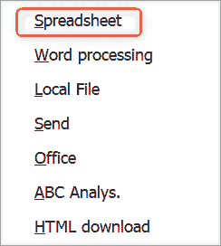
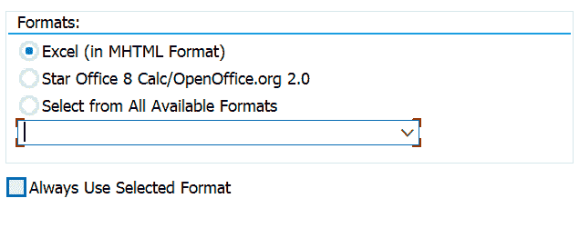

# 第四章：R 的探索性数据分析

Pat 是大富翁仓库采购部门的经理。他的部门专门生产各种建筑行业的管子，这需要采购大量的原材料和半成品。然而，Pat 有一个问题；他每天在 SAP 系统中收到多达一百份采购申请，需要经过批准才能成为采购订单。这是一个繁重且耗时的过程，他希望能够得到帮助来优化流程。他决定向 IT 部门和 SAP 团队寻求帮助。

SAP 团队已经对系统进行了优化，使采购申请流程变得更加高效。当 Pat 和 SAP 团队联系他们的数据科学团队时，他们立刻想到：“我们能否建立一个模型来学习采购申请是否会被批准？” SAP 系统中有大量数据——近 10 年的历史数据——他们知道所有的采购申请批准和拒绝情况。原来有数百万条带标签的数据记录，所有这些记录都指示被批准或被拒绝。这不就是监督学习吗？当然是！

我们在第二章介绍了四种不同类型的学习模型。它们分别是：

+   监督学习

+   无监督学习

+   半监督学习

+   强化学习

我们倾向于认为这里提到的场景是监督学习，因为我们有带标签的数据。也就是说，我们有已经批准和被拒绝的采购申请。我们可以在这些带标签的数据上训练一个模型，因此这是一个监督学习的场景。确定了我们正在使用的学习模型的类型之后，下一步是探索数据。

数据科学家工作流程中最关键的过程之一是探索性数据分析（EDA）。数据科学家使用这个过程来探索数据，并确定是否能够对其进行建模，以及如何进行建模。EDA 的目标是通过总结主要特征来了解数据，通常使用可视化来实现。这一步要求数据科学家熟悉数据。

熟悉 SAP 系统的读者：如果您认为您已经熟悉了您的数据，请尝试进行这项练习。您会惊讶地发现自己学到了多少东西。对于了解关系型数据的一般形式和了解清理、分析和完全建模的结果之间存在着巨大的差异。

在本章中，我们将详细介绍探索性数据分析（EDA）的过程。为了使其更易理解，我们将实时进行。也就是说，我们不会操纵数据以便更轻松地编写本课程；相反，我们将尽可能真实和贴近实际地进行。在我们的情景中，我们将遇到问题，并像处理真实情景一样解决它们。如图 4-1 所示，EDA 包括四个主要阶段：收集、清洗、分析和建模。在深入探讨我们的情景之前，让我们简要介绍每个阶段。


###### 图 4-1\. 探索性数据分析工作流程

# EDA 的四个阶段

在*收集数据*阶段，我们从源系统的数据开始。了解源系统如何记录数据是很重要的。例如，如果我们不知道 SAP 表中的采购申请是什么样的，我们就无法将其提取出来进行后续分析。

一旦我们理解了源数据，我们选择方法和工具来提取并检查数据。在本章中，我们使用了从 SAP 中的平面文件提取作为中间存储，使用 R 数据分析语言来处理和分析数据。在专注于业务场景的 EDA 中，迅速迭代假设是非常重要的。因此，请选择您熟悉和习惯的工具。

如果您对任何工具还不熟悉，不要担心！有许多选项可供提取和分析。第三章 讨论了几种替代的 SAP 数据提取方法，本书的后续章节使用了其中的许多方法。R 语言在统计学家和数据科学家中很受欢迎，但 Python 也有一个非常强大的社区。在本书中，我们将使用这两种语言的示例和工具。

成功提取数据后，我们进入*清洗数据*阶段。源系统的数据库、数据维护规则以及我们选择的提取方法都可能在数据上留下自己的独特痕迹。例如，有时 CSV 提取可能会有额外的不需要的标题行。有时 API 提取可能会以不兼容分析工具的方式格式化数字。经常出现的情况是，当我们提取多年数据时，源系统的数据管理规则已经发生了变化。

当我们在提取后立即清洗数据时，我们寻找那些明显错误或不一致的事物。在本章中，我们使用 R 方法来清洗数据，而您可能会更喜欢其他语言。无论您的方法是什么，我们在这个阶段的目标是清除数据中明显存在的问题。

达到去除这些不良元素的目标后，是时候进入*分析*阶段了。这是我们开始建立假设并探索问题的地方。由于数据在经过清洗后可以信任，我们可以可视化关系并确定哪些关系最强大且值得进一步建模。

在这个阶段，我们经常会发现自己在重塑和重新格式化数据。这是一种清理数据的形式，重点不是去除不良（或格式不佳）的数据，而是专注于将好的数据塑造成下一个阶段可以有效使用的形式。分析阶段通常会为进一步重塑提供几个机会。

最后一个阶段是*建模*。到了这个阶段，我们已经在数据中发现了几个值得追求的关系。我们的目标是：创建一个模型，使我们能够得出见解深刻的结论或进行基于证据的预测。该模型应该是可靠且可重复的。通过对此采购场景进行建模，SAP 团队旨在为采购经理帕特提供具有深刻影响的信息和工具。

格雷格和保罗对这个流程非常熟悉，所以让我们开始吧！

# 第一阶段：收集我们的数据

从 SAP 获取数据的简便方法是使用 ABAP QuickViewer。此事务允许用户查看表格或连接在一起的表格集合的字段。对于采购申请到采购订单的情景，我们需要两个表格：采购申请的 EBAN 和采购订单行的 EKPO。使用事务代码 SQVI 启动 QuickViewer 事务。

输入快速查看的名称（如图 4-2](#quick_view_first_screen)）。


###### 图 4-2\. 快速查看第一个屏幕

点击“创建”按钮并给快速视图命名一个标题（见图 4-3](#quick_view_title)）。


###### 图 4-3\. 快速视图标题

将“数据源”更改为“表连接”（如图 4-4](#quick_view_type_options)）。


###### 图 4-4\. 快速查看类型选项

点击“输入”按钮，然后点击“插入表格”按钮（如图 4-5](#fquick_view_create_table)）。


###### 图 4-5\. 快速视图插入表格按钮

输入第一个表格的名称，然后点击“输入”（如图 4-6](#first_quick_view_table)）。


###### 图 4-6\. 第一个快速查看表格

重复此过程，点击“插入表格”按钮，然后点击“输入”（如图 4-7](#second_quick_view_table)）。


###### 图 4-7\. 第二个快速查看表格

表格将显示在屏幕上，其默认关系已确定（见图 4-8](#quick_view_default_join_properties)）。始终检查这些关系，确保它们符合要求。在这种情况下，确定了四个关系，但只需要两个。


###### 图 4-8\. QuickView 的默认连接属性

右键单击 BANFN 和 BNFPO 的链接，选择删除连接（见图 4-9）。


###### 图 4-9\. 移除 QuickView 中的默认连接

双重检查剩余的两个关系以确保它们是正确的。表 EBAN 和 EKPO 应该通过 EBELN 和 EBELP 进行关联（见图 4-10）；这些是采购订单号和采购订单项。


###### 图 4-10\. 确认 QuickView 中剩余的连接

点击返回按钮。下一个屏幕允许选择报表字段。展开左侧的小箭头以显示表的所有字段（见图 4-11）。


###### 图 4-11\. QuickViewer 打开表格

在第一列中选择要显示的字段，并在第二列中选择表的选择参数（见图 4-12）。


###### 图 4-12\. QuickView 的选择和列表选项

接下来，重复这个过程来处理采购文档条目表。

点击执行按钮以运行报表。由于数据可能非常庞大，我们将其中一个选择标准设置为更改日期。这允许我们缩小结果数据。设置日期范围，然后点击执行按钮。在我们的示例中，我们将选择一个小的一个月数据集，只是为了看看结果是否符合预期。然后我们将为全部 10 年的数据重新运行报告。


###### 图 4-13\. QuickView 测试报告

报告显示所选字段（见图 4-14）。


###### 图 4-14\. QuickView ALV（ABAP 列表查看器）报表

点击导出按钮（见图 4-14 中的圆圈）并选择电子表格。



###### 图 4-15\. QuickView 导出选项

接受 Excel 的默认设置并点击 Enter（见图 4-16）。



###### 图 4-16\. QuickView 导出为 xlsx

这里的格式选项取决于 SAP 版本，所以屏幕可能看起来稍有不同。无论其他可见的格式如何，确保选择 Excel。

给文件命名并保存它（见图 4-17）。


###### 图 4-17\. QuickView 另存为对话框

Excel 将会自动打开。将其保存为 CSV 文件，以便轻松加载到 R 或 Python 中。

## 使用 R 进行导入

如果您还没有使用 R 或 R Studio 做任何事情，¹在线有许多优秀的资源，提供逐步安装指南。这与在计算机上安装任何其他软件一样简单。虽然本书不打算成为 R 的教程，但我们将介绍一些基础知识，以帮助您入门。安装了 R Studio 后，双击图 4-18 中的图标来启动它。


###### 图 4-18\. R Studio 图标

R 中的基本概念之一是使用软件包。这些是以良好定义的格式收集函数、数据和编译代码的集合。它们使编码更加简单和一致。您需要安装必要的软件包才能使用它们。我们最喜欢的之一是[`tidyverse`](https://www.tidyverse.org/)。安装此软件包有两种方法。您可以在 R Studio 的控制台窗口中使用`install.packages()`函数，如图 4-19 所示。只需按 Enter 键，它将为您下载并安装软件包。


###### 图 4-19\. 从控制台窗口安装软件包

另一种安装方法是从菜单路径 Tools → Install Packages，如图 4-20 所示。


###### 图 4-20\. 从菜单路径安装软件包

在“Packages”行中开始键入软件包名称，然后从选项中选择，如图 4-21 所示。


###### 图 4-21\. 从下拉选项中选择软件包

点击“Install”按钮完成。

安装完一个软件包后，让我们开始一个新脚本。单击“New”按钮，从下拉菜单中选择 R Script，如图 4-22 所示。


###### 图 4-22\. 开始一个新的 R Studio 脚本

现在，您将有一个空白画布，可以开始使用 R 编程语言进行数据探索。

现在，让我们开始。使用`read.csv()`函数轻松导入数据到 R 或 R Studio。我们使用以下设置读取文件：`header`设置为`TRUE`，因为文件有标题。我们不希望字符串设置为因子，所以`stringsAsFactors`设置为`FALSE`。

###### 小贴士

将字符串设置为因子通常是有意义的。因子表示分类数据，并可以是有序或无序的。如果您计划在加载数据后操作或格式化数据，通常不希望它们作为因子存在。您可以随时使用`factor()`函数将分类变量转换为因子。

最后，我们希望将任何空行或单个空格设置为 NA：

```
pr <- read.csv("D:/DataScience/Data/prtopo.csv",
              header=TRUE,
              stringsAsFactors = FALSE,
              na.strings=c("", " ","NA"))
```

数据加载后，我们可以使用`head`命令查看文件的一部分，如图 4-23 和 4-24 所示。

```
head(pr)
```


###### 图 4-23\. 在 R 中查看头数据帧


###### 图 4-24\. 在 R 中查看头数据帧继续

我们很快就能看到需要进行一些清理的地方。行号作为列导入，并且一些格式问题导致了一些任意的列，比如 X 和 X.1\. 清理它们是我们的第一个任务。

# 第二阶段：清理我们的数据

在这个阶段，我们的目标是删除或纠正提取过程中明显的错误。现在花时间清理数据，可以极大地提高我们分析和建模步骤的效率。格雷格和保罗知道清理可能占据探索性数据分析时间的很大一部分，所以他们已经准备好用 R Studio 进行工作。

## 空值移除

首先，我们删除所有没有采购申请号的行。这是错误的数据。实际上可能没有任何需要移除的行，但这是一个良好的标准过程。确保数据的关键特征确实有条目是一个很好的开始：

```
pr <- pr[!(is.na(pr$Purch.Req.)), ]
```

## 二进制指示器

接下来，D 和 D.1 列是我们的采购申请的删除或拒绝指标。将其作为二进制将是一个真假指示器。我们可以很容易地通过将空白等于 0（假）和任何其他条目等于 1（真）来实现这一点。为什么使用二进制而不只是插入“已拒绝”或“未拒绝”的文本？请记住，您将会可视化和可能对这些数据进行建模。模型和可视化在处理分类变量或文本时表现不佳。然而，可视化和建模 0 和 1 是很容易的：

```
pr = within(`pr`, {
  deletion = ifelse(`is`.na(`D`) & is.na(`D`.1), 0, 1)
})
```

# 删除多余的列

让我们摆脱那些无用和错误的列。为什么要这样做？为什么不简单地忽略那些列？保持数据没有额外的列可以释放出用于处理的内存。在我们当前的示例中，这并不是真正必要的。然而，如果稍后我们构建一个神经网络，我们希望尽可能高效。拥有干净整洁的数据是一个简单而有效的做法²。我们创建一个列名列表，并将其赋给“drops”变量。然后我们创建一个新的数据框，它是旧数据框去掉“drops”的结果：

```
drops <- c("X.2","X", "Un.1", "Crcy.1", "Per.1", "X.1",
          "Purch.Req.", "Item", "PO", "Item.1", "D", "D.1",
          "Per", "Crcy")
pr <- pr[ , !(names(pr) %in% drops)]
```

###### 提示

在 R 中有许多不同类型的数据结构。数据框（dataframe）是一个表格，其中每列代表一个变量，每行包含每列的值，就像 Excel 中的表格一样。

## 空白

处理数据时常见的问题之一是空白。空白可能会导致后续查找和合并问题。例如，您想要通过*customer*列合并两个数据框。一个数据框列有“Smith DrugStore”，另一个数据框有“ Smith DrugStore”。注意第二个数据框中名称前后的空格？R 将不会认为这两个客户是相同的。这些数据中的空格或空白看起来像程序的合法输入。早期删除空格和其他“隐形”元素是个好主意。我们可以使用以下代码轻松地为数据框中的所有列清理它们：

```
pr <- data.frame(lapply(pr, trimws), stringsAsFactors = FALSE)
```

`lapply()`函数是做什么的？阅读这些有用的[函数](http://bit.ly/2khPSHb)可以让你更好地使用你的 R 代码。

## Numbers

接下来，我们修改数值或整数列，使其具有这种特性。如果您的列具有数值，则不应将其存储为字符。这可能会在加载数据时发生。简而言之，值 1 不等于“1”的值。确保我们数据框中的列正确分类和正确类型是另一个关键的清理步骤，可以解决以后可能出现的问题：

```
pr$deletion <- as.integer(pr$deletion)
pr$Qty.Requested <- as.numeric(pr$Qty.Requested)
pr$Valn.Price <- as.numeric(pr$Valn.Price)
pr$Net.Price <- as.numeric(pr$Net.Price)
```

接下来，我们将在我们刚创建的数值中用零替换 NA 值。NA 表示该值不存在。R 不会假设像数量这样的离散变量在值不存在时为零。然而，在我们的情况下，我们希望 NA 值为零：

```
pr[,c("Qty.Requested", "Valn.Price", "Net.Price")] <-
   apply(pr[,c("Qty.Requested", "Valn.Price", "Net.Price")], 2,
        function(x){replace(x, is.na(x), 0)})
```

最后，我们通过用 NA 替换任何空白来清理这些分类变量。在查找缺失值时，这将很有用……空白有时看起来像分类变量中的值，因此 NA 更可靠。我们之前已经处理了空白，但这是另一个很好的实践步骤，将帮助我们避免以后的问题：

```
pr <- pr %>% mutate(Des.Vendor = na_if(Des.Vendor, ""),
                    Un = na_if(Un, ""),
                    Material = na_if(Material, ""),
                    PGr = na_if(PGr, ""),
                    Cat = na_if(Cat, ""),
                    Document.Type = na_if(Document.Type, ""),
                    Tax.Jur. = na_if(Tax.Jur., ""),
                    Profit.Ctr = na_if(Profit.Ctr, ""))
```

# 第三阶段：分析我们的数据

我们已经清理了数据，现在进入分析阶段。我们将回顾此阶段的两个关键目标：提出更深层次的问题来形成假设，以及为建模阶段适当地塑造和格式化数据。Greg 和 Paul 的清理过程让他们的数据处于一个继续进入分析阶段的良好位置。

## DataExplorer

让我们取个捷径。这也是 R 提供的所有库的光辉的一部分。使用`DataExplorer`库可以进行一些非常快速和简单的数据探索。³

使用以下 R 命令安装并包括库：

```
install.packages("DataExplorer")
library(DataExplorer)
```

对数据整体结构进行快速可视化（Figure 4-25）：

```
plot_str(pr)
```


###### 图 4-25。使用 DataExplorer 查看数据的整体结构

我们可以使用`DataExplorer`包中的`introduce`命令来概述我们的数据：

```
introduce(pr)
      rows columns discrete_columns continuous_columns
   3361850      13                9                  4
  all_missing_columns total_missing_values complete_rows
                    0                    0       3361850
  total_observations memory_usage
             43704050    351294072
```

我们看到我们有超过三百万行数据，共十三列。其中九列为离散变量，四列为连续变量。

看看是否有某些列缺少大量数据非常重要。一般来说，大部分为空的列（超过 90%）在建模中没有任何价值（参见 图 4-26）：

```
plot_missing(pr)
```

由于`Des.Vendor`字段中缺失条目较多，我们将其删除：

```
pr$Des.Vendor = NULL
```


###### 图 4-26\. 使用 DataExplorer 识别缺失或近乎缺失的变量

## 离散特征

了解离散特征⁴有助于选择能提升模型性能的数据，以及删除没有用的数据。我们可以很容易地绘制所有离散特征的分布（图 4-27 到 4-29）：

```
plot_bar(pr)
```

###### 注意

排除具有超过 50 个条目的离散变量。

我们立即注意到一个神秘而明显的错误条目。在“文档类型”分布中有一个名为…“文档类型”的文档类型。其他离散特征也是如此。让我们找出那一行并查看一下：

```
pr[which(pr$Document.Type == "Document Type"),]
count(pr[which(pr$Document.Type == "Document Type"),])

```

我们看到了一个包含 49 个条目的列表和计数，其中文档类型为“文档类型”，而其他所有列都有列描述而不是有效值。很可能是从 SAP 提取时，在某些间隔处有头行。很容易移除：

```
pr <- pr[which(pr$Document.Type != "Document Type"),]

```


###### 图 4-27\. 离散特征的条形图（第一部分）


###### 图 4-28\. 离散特征的条形图（第二部分）


###### 图 4-29\. 离散特征的条形图（第三部分）

当我们再次运行`plot_bar(pr)`时，我们看到这些不良行已被删除。

我们还注意到一些变量没有被绘制出来。这是因为它们有超过 50 个唯一值。如果一个离散变量有太多唯一值，在模型中编码会很困难。我们可以使用以下代码来查看变量`Material`中唯一值的计数：

```
length(`unique`(`pr`$Material))
```

哇，我们发现我们有超过 500,000 个唯一值。让我们仔细考虑一下。材料本身能成为模型的一个良好特征吗？我们还有一个名为`Matl.Group`的变量，表示材料所属的分类。这可以是办公用品、IT 基础设施、原材料或类似的内容。对我们来说，这种分类比确切的材料编号更有意义。因此，我们也将删除那些材料编号的值：

```
pr$Material = NULL
```

我们还从这个条形图中注意到，变量`Cat`只有一个唯一值。这个变量在决定采购申请的批准或不批准方面毫无价值。我们将删除该变量：

```
pr$Cat = NULL
```

## 连续特征

接下来我们想要了解我们的数值/连续变量，比如 Net.Price。我们的连续变量是否呈正态钟形分布？这在建模中很有帮助，因为机器学习和神经网络更喜欢不偏斜的分布。我们怀疑连续变量都呈右偏态。一两件物品的采购申请请求会比 20 或 30 件更多。让我们看看这种怀疑是否正确。

###### 小贴士

自然喜欢均匀/高斯分布。学校成绩，多年来或按国家划分的降雨量，以及个体身高和体重都遵循高斯分布。机器学习和神经网络更喜欢这些分布。如果您的数据不是高斯分布，对数据进行对数变换、缩放或归一化是一个不错的选择。

我们可以通过简单的直方图显示数据的分布。在 R 中使用`DataExplorer`包可以轻松地同时绘制所有连续变量的直方图（参见图 4-30）：

```
plot_histogram(pr)
```


###### 图 4-30\. 连续特征的直方图

我们只关心 Qty.Requested，Valn.Price 和 Net.Price 的直方图。我们知道删除列只是我们创建的一个二进制列，其中 1 表示物品被拒绝（删除），0 表示未被拒绝。我们很快就看到所有直方图都呈右偏态，正如我们所怀疑的那样。它们向右延伸。了解这一点很重要，因为在对数据进行建模之前，我们可能需要进行一些标准化或归一化处理。

###### 注

归一化将数据的尺度缩小到 0 到 1 的范围内：

X[归一化] = X−X[min / (]X[max]−X[min)]

标准化将数据的尺度缩小到均值（μ）为 0，标准差（σ）为 1：

X[标准化] = X−μ / σ

另一个测试是 QQ 图（分位数-分位数图）。这也会显示我们的连续变量是否呈正态分布。通过直方图我们知道这些分布不是正态分布。这里的 QQ 图仅供示意。

如果 QQ 图呈对角直线，说明数据是正态分布的。通过我们的观察，我们很快就能看出这些变量并不呈正态分布。DataExplorer 中的 QQ 图（参见图 4-31 以查看有趣的连续特征，和图 4-32 以查看删除标记）默认将数据与正态分布进行比较：

```
plot_qq(pr, sample=1000L)
```


###### 图 4-31\. 连续特征的 QQ 图


###### 图 4-32\. QQ 图显示数据不符合正态分布

# 第四阶段：建模我们的数据

现在我们已经熟悉了数据，是时候将其塑造并输入神经网络以检查它是否能学会购买申请是否被批准或拒绝。我们将在 R 中使用 TensorFlow 和 Keras 来完成这个任务。Greg 和 Paul 知道建模阶段才是实际价值被提取的地方——如果他们正确地进行建模，他们知道将通过“收集、清洗和分析”阶段获得宝贵的见解。

## TensorFlow 和 Keras

在我们深入研究我们的模型之前，我们应该稍作停顿，讨论一下 TensorFlow 和 Keras。在数据科学和机器学习领域，它们是两个最广泛使用的工具。

TensorFlow 是一个开源软件库，特别是自 2017 年发布 1.0.0 版本以来，在数值计算方面迅速被广泛使用。尽管高性能数值计算适用于许多领域，但 TensorFlow 在 Google Brain 团队的 AI 专注中成长起来。这种血统使其设计对机器学习和深度学习任务具有高适应性。

尽管 TensorFlow 最辛勤工作的代码是高度调整和编译的 C++，它为简单消费提供了出色的 Python 和 R API。你可以直接使用[TensorFlow](http://bit.ly/2mfiwsY)编程，或者使用 Keras。Keras 是 TensorFlow 的高级 API，用户友好、模块化且易于扩展。你可以在 Windows、macOS、Linux 和 Android/iOS 上使用 TensorFlow 和 Keras。TensorFlow 宇宙中最酷的部分是，Google 甚至创建了定制硬件来增强 TensorFlow 的性能。Tensor Processing Units (TPUs)是 AlphaGo 和 AlphaZero 最先进版本的核心，这些专注于游戏的 AI 征服了围棋——长期以来被认为是机器精通的几十年之外的游戏。

核心 TensorFlow 非常适合在复杂的数据科学场景中设置强大的计算。但对于数据科学家来说，通常有助于在更高的抽象级别建模工作，并抽象掉一些底层细节。

进入 Keras。它足够可扩展，可以在几个主要的底层 ML 工具包（如 TensorFlow、Theano 或 Microsoft Cognitive Toolkit）之上运行。Keras 的设计侧重于 Python 和 R 的用户友好性，快速建立和实验深度神经网络模型。作为数据科学家，我们知道快速实验提供了最好的结果——它们允许你快速失败并朝着更正确的方向前进！

快速停顿结束。让我们回到场景中。我们将稍后在 TensorFlow 和 Keras 中使用它们，但首先我们会使用基本的 R 编程。

## 训练和测试分离

这个过程的第一步是将数据分割成训练集和测试集。使用[库*rsample*](http://bit.ly/2mk4iHr)很容易实现这一点。

```
tt_split <- initial_split(pr, prop=0.85)
trn <- training(tt_split)
tst <- testing(tt_split)
```

在 R Studio 的全局环境中查看，有两个新的数据框：TRN 用于训练，TST 用于测试（图 4-33）。


###### 图 4-33\. 训练和测试数据框的视图

## 数据整形和独热编码

我们仍在为 TensorFlow 和 Keras 整形我们的数据过程中。我们将在接下来的步骤中继续基本的 R 编程。下一步是整形数据，使其可以与神经网络很好地配合。总的来说，神经网络对正态分布的数据表现最佳。我们正在向网络中输入的数据必须是名义的：我们不能将我们在采购申请数据中发现的分类变量输入到模型中。网络不会知道如何处理诸如“物料组”之类的内容。我们将使用称为 *独热编码* 的过程将我们的分类数据转换为稀疏数据。⁵ 例如，Matl.Group 列的独热编码的结果将如 图 4-34 所示。


###### 图 4-34\. 独热编码的可视化

我们知道我们想要对分类变量进行独热编码，但对于其他变量，我们想要做些什么呢？考虑到请求数量列和采购申请的数量选项。新车的采购申请可能不会超过一个。然而，原材料批次的请求数量可能是一千磅。这让我们很好奇，请求数量列的值范围是多少？我们可以轻松地用以下命令看到：

```
max(pr$Qty.Requested)
min(pr$Qty.Requested)
```

我们看到值的范围是从 0 到 986。什么？零的数量？有多少个？

```
count(`pr`[which(`pr1`$Qty.Requested == 0),])
```

我们看到有 313 行的数量为 0！这是什么意思？我们对这些数据感到困惑，那我们应该将它们删除吗？数据科学并不是真空的，尽管我们编码人员希望它是。我们必须回到业务部门，拿几个数量为零的采购申请的例子，并问他们是否知道原因。如果他们不知道，那么我们将删除这些数量为零的行。

通过这个过程，我们学到了一些东西。当问及帕特关于这些奇怪的申请时，他说：“有时候当我不在电脑旁，有人打电话来询问我拒绝的采购申请，他们会将数量归零，因为他们没有拒绝该行的权利。” 实质上，数量为零的采购申请是被拒绝的采购申请。我们必须将这些的删除指示器转换为 1，以表示它们被拒绝：

```
pr = within(`pr`, {
    deletion = ifelse(`Qty`.Requested == 0, 1 ,0)
})
```

现在我们已经适当处理了数量为零的采购申请，我们回到手头的任务。模型将无法在从 0 到一千的单个变量上表现最佳。将这些订单数量分成几组将使模型表现更好。我们将创建三个值桶。我们选择这个值相当随意，可以在测试模型性能时稍后更改。

## 配方

我们决定对我们的分类变量进行独热编码，以及对我们的数值变量进行缩放和分桶。为此，我们将在 R 中使用[`recipes`](http://bit.ly/2NHJ9SY)库。这个非常方便的库允许我们为数据转换创建“配方”。

*recipes*的概念很直观：定义一个配方，以便稍后应用编码和处理。最终的结果可以应用于机器学习或神经网络。

我们已经决定了如何处理数据以准备用于网络。让我们通过`recipes`包中的代码来实现这一点。

首先，我们想创建一个`recipe`对象，定义我们要分析的内容。在这段代码中，我们说我们希望根据数据中的其他特征预测删除指示器：

```
library(recipes)
recipe_object <- recipe(deletion ~ Document.Type +
                    PGr +
                    Matl.Group +
                    Qty.Requested +
                    Un +
                    Valn.Price +
                    Tax.Jur. +
                    Profit.Ctr,
                    data = trn)
#We could also just use the . like this to indicate all, but the above is done 
#for clarity. recipe_object <- recipe(deletion ~ ., data = trn)

```

###### 注意

如果遇到内存错误，如“Error: cannot allocate vector of size x.x Gb”，可以使用以下命令增加内存分配（前两个数字表示分配的几个 Gigabytes，本例中为 12）：

```
memory.limit(1210241024*1024)
```

我们的下一步是取出`recipe`对象，并对其应用一些成分。我们已经说明了我们希望将我们的数量和价格值放入三个桶中。我们使用`recipes`中的`step_discretize`函数来实现这一点：

###### 提示

一些建模者更喜欢分箱，而另一些则喜欢保持连续变量的连续性。在这里，我们分箱以提高模型的性能。

```
recipe_object <- recipe_object %>%
   step_discretize(Qty.Requested, options = list(cuts = 3)) %>%
   step_discretize(Valn.Price, options = list(cuts = 3))

```

我们还希望对所有的分类变量进行独热编码。我们可以一次列出它们，也可以使用`recipes`包中的许多选择器之一。我们使用`step_dummy`函数执行编码，并使用`all_nominal`选择器选择所有的分类变量：

```
recipe_object <- recipe_object %>%
  step_dummy(all_nominal())
```

然后我们需要对所有的值进行缩放和居中处理。如前所述，我们的数据不服从高斯分布，因此需要进行某种形式的缩放：

```
rec_obj <- rec_obj %>%
  step_center(all_predictors()) %>%
  step_scale(all_predictors())

```

###### 提示

有许多归一化方法；在我们的例子中，我们使用了最小-最大特征缩放和标准分数。

到目前为止，我们还没有对这个配方做任何操作。现在我们需要准备数据，并使用`prep`命令将配方应用到数据上：

```
recipe_trained <`-` prep( recipe_object, training = trn, retain = TRUE)

```

现在我们可以将这个配方应用到任何我们有的数据集上。我们将从我们的训练集开始，并在命令中排除删除指示器：

```
x <- bake(rec_obj, new_data = trn) %>% select(-deletion)
```

## 为神经网络准备数据

现在我们完成了我们的配方，需要为神经网络准备数据。

###### 提示

我们最喜欢（并且通常被接受为最好的）的技术是*不*直接跳入神经网络模型。最好是从最简单的模型逐步增长到最复杂的模型，设定一个性能标准，然后尝试用越来越复杂的模型超越它。例如，我们应该首先尝试简单的线性回归。因为我们试图分类批准和未批准的采购申请，我们之后可以尝试分类机器学习技术，如支持向量机（SVM）和/或随机森林。最后，我们可能会使用神经网络。然而，出于教学目的，我们将直接使用神经网络。没有先验知识导致了这个决定；这只是一个教学示例。

首先，我们要创建一个删除值的向量：

```
training_vector <- pull(`trn`, deletion)
```

如果这是你第一次使用 TensorFlow 和 Keras，你需要安装它。这与常规库有些不同，所以我们在这里介绍一下步骤。首先，像安装任何其他包一样安装包：

```
install.packages("tensorflow")
```

然后，要使用 TensorFlow，你需要在库声明之后进行额外的函数调用：

```
library(tensorflow)
install_tensorflow()

```

最后，很好的流程是使用以下常见的打印语句检查它是否工作。如果你得到了“Hello, TensorFlow!” 的语句，那么它正在工作：

```
sess = tf$Session()
 hello <- tf$constant('Hello, TensorFlow!')
 sess$run(hello)

```

Keras 安装与其他 R 库类似。让我们在 Keras 中创建我们的模型。第一步是初始化模型，我们将使用 `keras_model_sequential()` 函数进行初始化：

```
k_model <- keras_model_sequential()
```

模型由多层组成。接下来的步骤是创建这些层。

我们的第一层是一个输入层。输入层需要输入的形状。随后的层根据第一个输入层推断形状。在我们的情况下，这很简单，输入形状是我们训练集中列的数量 *ncol(x_trn)*。我们将单元数设置为 18。在测试神经网络时有两个关键决策要考虑。这些是每层单元的数量和层数。

我们的下一层是一个隐藏层，具有相同数量的输入。请注意，它与前一层相同，但我们无需指定形状。

我们的第三层是一个 10% 的 Dropout 层。也就是说，该层的神经元中将随机地失活 10%。

###### 提示

Dropout 层控制过拟合，当模型在某种程度上记住了训练数据时发生。当这种情况发生时，模型在未见过的数据上表现不佳……这有点违背了神经网络的目的。Dropout 在训练阶段使用，随机地使一组神经元失活。

我们的最后一层是输出层。单元数为 1，因为结果是互斥的。也就是说，要么采购申请被批准，要么没有。

最后，我们将编译模型或 *构建* 它。我们需要设置三个基本的编译设置：

优化器

调整模型权重的技术。一个非常常见的起点是`Adam`优化器。

初始化器

模型设置层的[初始随机权重的方式](https://keras.io/initializers/)。有许多选项；一个常见的起点是`uniform`。

激活

参考第二章了解激活函数的描述。Keras 提供了许多易于使用的[激活函数](https://keras.io/activations/)。

```
k_model %>%
  #First hidden layer with 18 units, a uniform kernel initializer,
  #the relu activation function, and a shape equal to 
  #our "baked" recipe object. 
  layer_dense(
    units = 18,
    kernel_initializer = "uniform",
    activation = "relu",
    input_shape = ncol(x_trn)) %>%

  #Second hidden layer - same number of layers with
  #same kernel initializer and activation function.
  layer_dense(
    units = 18,
    kernel_initializer = "uniform",
    activation = "relu") %>%

  #Dropout
 layer_dropout(rate = 0.1) %>%

  #Output layer - final layer with one unit and the same initializer
  #and activation. Good to try sigmoid as an activation here. 
  layer_dense(
    units = 1,
    kernel_initializer = "uniform",
    activation = "relu") %>%

  #Compile - build the model with the adam optimizer. Perhaps the 
  #most common starting place for the optimizer. Also use the 
  #loss function of binary crossentropy...again, perhaps the most 
  #common starting place. Finally, use accuracy as the metric 
  #for seeing how the model performs. 
  compile(
    optimizer = "adam",
    loss = "binary_crossentropy",
    metrics = c("accuracy"))
```

###### 提示

设置神经网络的参数既是艺术也是科学。调整层中神经元的数量、丢失率、损失优化器等。这是您实验和调整网络以获得更高准确度和更低损失的地方。

要查看模型，请键入`**k_model**`：

```
___________________________________________________________________________
 Layer (type)                       Output Shape                    Param #     
 =========================================================================
 dense_2 (Dense)                    (None, 18)                      2646        
 ___________________________________________________________________________
 dropout_1 (Dropout)                (None, 18)                      0           
 ___________________________________________________________________________
 dense_3 (Dense)                    (None, 18)                      342         
 ___________________________________________________________________________
 edropout_2 (Dropout)               (None, 18)                      0           
 ___________________________________________________________________________
 dense_4 (Dense)                    (None, 1)                       19          
 =========================================================================
 Total params: 3,007
 Trainable params: 3,007
 Non-trainable params: 0
 ___________________________________________________________________________
```

最后一步是将模型拟合到数据上。我们使用了用配方“烘焙”的数据，即`x_trn`：

```
history <- fit(
    #fit to the model defined above
  object = k_model,
      #baked recipe
  x = as.matrix(x_trn),
    #include the training_vector of deletion indicators
  y = training_vector,
    #start with a batch size of 100 and vary it to see performance
  batch_size = 100,
    #how many times to run through?
  epochs = 5,
    #no class weights at this time, but something to try
    #class_weight <- list("0" = 1, "1" = 2)
    #class_weight = class_weight,
  validation_split = 0.25)
```

模型在运行时显示日志：

```
Train on 1450709 samples, validate on 483570 samples
Epoch 1/5
1450709/1450709 [==============================] 
- 19s 13us/step - loss: 8.4881e-04 - acc: 0.9999 -
val_loss: 0.0053 - val_acc: 0.9997
Epoch 2/5
1450709/1450709 [==============================] 
- 20s 14us/step - loss: 8.3528e-04 - acc: 0.9999 -
val_loss: 0.0062 - val_acc: 0.9997
Epoch 3/5
1450709/1450709 [==============================] 
- 19s 13us/step - loss: 8.5323e-04 - acc: 0.9999 -
val_loss: 0.0055 - val_acc: 0.9997
Epoch 4/5
1450709/1450709 [==============================] 
- 19s 13us/step - loss: 8.3805e-04 - acc: 0.9999 -
val_loss: 0.0054 - val_acc: 0.9997
Epoch 5/5
1450709/1450709 [==============================] 
- 19s 13us/step - loss: 8.2265e-04 - acc: 0.9999 -
val_loss: 0.0058 - val_acc: 0.9997
```

## 结果

我们希望从我们的模型中得到的是高准确率，并随着时代的推移得到改进。然而，这并不是我们看到的。请注意图中的第二张图表图 4-35。我们看到准确率从一开始就非常高，并且从未改善。损失函数也没有减少，而是保持相对稳定。

这告诉我们模型没有学到任何东西。或者更确切地说，它很快学到了一些东西，使其非常准确，并从那时起停止学习。我们可以尝试许多调整选项，也许不同的优化器和损失函数。我们还可以重新设计神经网络，增加或减少层数。但是，让我们高层次地思考一分钟，回到原始数据，并提出一些问题。

我们是否从一开始就选择了正确的 SAP 特征？还有其他可能有帮助的特征吗？


###### 图 4-35\. 模型学习的准确性和损失结果

我们在途中是否犯过错误或者做出了错误的假设？这需要对整个过程进行回顾。

这些数据可以被建模吗？并非所有数据都适合建模。

在回答这些问题之后，我们偶然发现了这一点。如果批准的采购申请数量过多怎么办？如果模型只学会了一直回答“是”，因为在训练过程中几乎总是正确的答案呢？如果我们回过头来看一下建模之前的数字，我们会发现帕特批准了超过 99%的所有采购申请。我们可以尝试不同的模型和数据中的不同特征，但是数据探索传奇的真相很可能是这些数据不能被建模。或者更确切地说，它可以被建模，但是由于批准数量过多，模型只会学会批准。它将发现自己有很高的准确性和低损失，因此表面上看是一个很好的模型。

# 总结

尽管我们未能对采购申请数据进行建模，但这个例子教会了我们许多宝贵的经验。有时候数据无法被建模，它就是这样发生的……而且经常发生。一个准确率高、损失低的模型并不意味着它是一个好模型。我们的模型准确率达到了 99%，这从一开始就应该引起怀疑。但它是一个毫无价值的模型；它没有学到任何东西。数据科学家通常的角色是报告发现并提出下一步的建议。我们失败了，但我们快速失败并能够朝着正确的解决方案迈进。

可以说，格雷格和保罗辜负了帕特。毕竟，我们无法根据我们找到和探索的数据做出任何良好的预测。但仅仅因为我们没有找到预测建模方案的方法，并不意味着我们失败了。我们学到了！如果数据科学真的是科学，它必须承认负面结果和正面结果一样。我们没有学会预测采购申请行为，但我们确实了解到尝试这样做不具成本效益。我们了解到帕特和他的同事们创建了一套使企业在采购行为上非常有纪律性的稳健流程。

在探索性数据分析中，唯一的失败是没有学到东西。模型可能没有学到东西，但数据科学家们学到了。格雷格和保罗为此多做了一次去咖啡机的旅行来庆祝。

在本章中，我们确定了一个业务需求，从 SAP 中提取了必要的数据，清理了数据，探索了数据，建模了数据，并从结果中得出结论。我们发现我们无法让我们的模型学习当前的数据，并推测这是因为数据明显偏向批准。在这一点上，我们正在做出合理的猜测；我们可以做得更多。

我们还可以采取其他方法。例如，我们可以使用编码器来增强数据，这超出了本书的范围。我们可以对变量进行加权，使被拒绝的采购申请比被接受的具有更大的价值。然而，在测试这种方法时，模型简单地失去了所有的准确性，因为完全不同的原因失败了。我们还可以将被拒绝的采购申请视为异常，并采用完全不同的方法。在第五章中，我们将深入研究异常检测，这可能为应用于这些数据提供其他答案。

我们决定在我们的示例中采取的最终行动方案并不是一个数据方法（这让我们感到遗憾）。应该告知业务，因为超过 99%的所有采购申请都得到批准，模型无法找到显著特征来确定何时会发生拒绝。如果不做大量的工作，这可能是个死胡同。也许有不同的 IT 解决方案，比如一个手机应用程序可以帮助帕特更有效地完成工作。然而，这种解决方案很可能无法通过机器学习和数据科学找到。

¹ 安装 R Studio 和 R 的说明，请访问[*https://www.rstudio.com/products/rstudio/download/*](https://www.rstudio.com/products/rstudio/download/)。

² 我们以前提到过这个链接，但我们会再次链接（因为它非常好）：[*https://vita.had.co.nz/papers/tidy-data.pdf*](https://vita.had.co.nz/papers/tidy-data.pdf)。

³ 深入了解 DataExplorer，可参考[*https://cran.r-project.org/web/packages/DataExplorer/vignettes/dataexplorer-intro.html*](https://cran.r-project.org/web/packages/DataExplorer/vignettes/dataexplorer-intro.html)提供的详细介绍。

⁴ 请记住，在第二章中提到，离散或分类特征是具有明确定义边界的特征。例如*颜色*或狗的种类。

⁵ 有时也称为创建“虚拟变量”。
