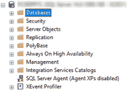
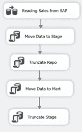
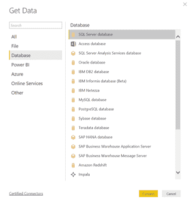
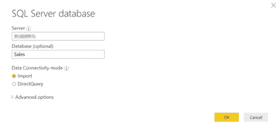
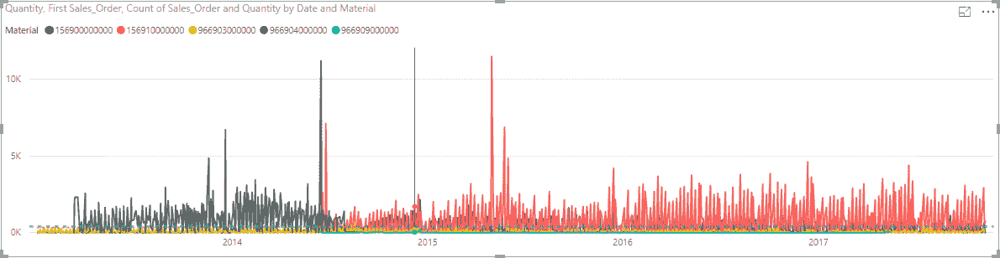
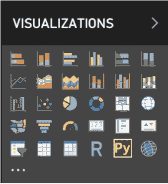

# 第五章：使用 R 和 Python 进行异常检测

> 麦克森公司（McKesson），美国最大的药品分销商之一，同意支付创纪录的 1.5 亿美元民事罚款，涉嫌违反《受控物质法》（CSA），司法部今天宣布。
> 
> 司法部，2017 年 1 月 17 日

阅读这些头条新闻时，简妮的心沉了下去。她专心阅读了文章；这影响了她。她在大宝矿库的监管部门工作，负责维护公司的合规性。她知道《可疑订单监控法规》（21 C.F.R. 1301.74(b)）。最近，司法部因不符合该法规而连续打击公司，比过去更为频繁。法规大致规定，从事受控物质的制造和分销公司“了解他们的客户”。法规的确切措辞是，

> 对于健全运营来说，处理人员采取合理措施识别他们的客户、了解这些客户通常进行的正常和预期交易，从而识别客户进行的那些可疑交易是至关重要的。
> 
> 21 C.F.R. 1301.74(b)

但这究竟意味着什么？她知道她的公司在 SAP 中有销售订单。已经有超过 10 年的销售订单了。但了解客户的*正常和预期交易*意味着什么？她决定把这个问题带给 SAP 团队，并与他们讨论，如果可能的话，可以采取什么措施来保护他们免受违规行为和潜在罚款的影响。

杜安，SAP 团队的分析师，对她的问题很感兴趣。SAP 包含/存储销售订单和销售订单历史记录，但它没有提供订购模式或检测系统，以便在出现异常时进行检测。首先要问的问题是：“什么是异常？”这并不像简单地说一个客户通常一周订购 5 件产品，然后突然订购 10 件那么简单。如果他们错过了一周怎么办？如果他们一直在稳步增加他们的供应链，现在 10 件就是可以接受的？

当杜安把问题带给数据科学家格雷格和保罗时，他们立刻嗅到了*异常检测*问题。异常检测基本上是一种识别数据中不符合预期模式的异常模式的方法。我们大多数人已经通过数据科学体验过异常检测。当你收到信用卡公司的短信或电话询问最近的交易时，你就体验过异常检测。欺诈检测是信用卡公司用来防止损失的一种复杂的异常检测方法。

Greg 和 Paul 启动了他们的程序编辑器，准备找出那些异常。Duane 逗留在旁边，主要是为了向 Greg 和 Paul 提供 SAP 的见解，但也想看看他们是如何做到这一点的。Duane 相当确定，虽然他没有统计学或计算机科学的博士学位，但他能够跟上足够的速度开始理解。

# 异常类型

有三种一般类型的异常：

点

数据中的异常由一个显著的离群值确定。在我们的订购模式示例中，假设一个客户通常每周订购 10 个项目，但某周他们订购了 100 个。这种订单量比他们典型订单增加了 10 倍，是一个简单的点异常。

环境

在一个条件内的异常。通常，这是对时间序列数据的分析。以销售数据为例，假设一个客户整年都订购很多产品，但七月份订购手套。十二月份订购手套不是异常，但七月份是。

集体

在数据集的上下文中查看的异常。这与数据整体的模式相关，如心电图或正弦波。如果客户的订购模式突破了他们典型的波动或模式，这将是异常的。

或许检测异常的最简单方法是，如果数据点距离均值或中位数有一定标准偏差，则将其标记为异常。销售数据是一个时间序列，所以必须考虑一个滚动窗口。定义滚动窗口的宽度将由业务条件决定，因为每个企业的情况都有所不同。在我们怀疑的订单检测案例中，三年的窗口是合适的。滚动窗口（或滚动平均）平滑短期波动并强调长期波动。在我们当前的情况下，我们可以使用回归并带有容差地拟合线条。任何超出容差范围的东西都是异常。

然而，这是一个相当静态的方法，对我们来说……不够。它不会考虑到任何背景信息，比如季节性。我们不知道我们的销售订单数据是否有季节性；因此，为了慎重起见，我们至少应该检查一下。我们知道我们的要求是*了解我们的客户*，所以我们希望看到随时间变化的订购模式。简而言之，我们想识别集体异常。

# R 中的工具

有许多文档详细描述的技术，用于使用静态方法（如前面讨论过的方法）、机器学习技术和神经网络模型来检测异常。在考虑使用哪种技术时，请回答以下问题：

+   它是什么类型的数据？

    对于我们的情景来说，这是时间序列数据。

+   数据被标记了吗？

    我们没有标记的数据，因此我们处于无监督学习的场景中。¹ 如果数据被标记，它可以被分成测试和训练集，并基本上被转化为分类问题。

数据科学家工具箱中有许多工具可用于使用时间序列数据进行无监督学习。我们可以采用 TensorFlow/Keras 构建递归神经网络。这将大大复杂化事情，并且不一定（实际上不太可能）会比为此目的构建的几个 R 库和 Python 包提供更好的结果。

###### 提示

在 R 中有小品文档（vignettes）。这些是包的教程，大多数时候非常信息丰富和有用。要查看您包中可用的小品文档，请在 R 工具的控制台中输入 `**browseVignettes()**`。例如，要查看关于 dplyr 的详细教程，请输入 `**browseVignettes(“dplyr”)**`。在这种情况下，这个关键包在 R 中有多个教程。

## AnomalyDetection

这是一个由 Twitter 开源的包。它专门用于检测时间序列数据中的异常……正是我们正在寻找的。它基于季节性极端学生化偏差（ESD），而季节性极端学生化偏差则基于广义 ESD。广义 ESD 是一种检测近似正态分布的单变量数据异常的测试方法。广义 ESD 的优点在于，它不需要指定异常值的数量，只需指定疑似异常值的上限。

给定这个上限，假设为 *u*，该包实际上执行 *u* 个测试，首先是一个异常测试，然后是两个，依此类推，直到 *u* 个异常。

## Anomalize

`anomalize package` 是对像 R 和 Python 这样的编程语言功能和能力的又一个证明。在 CRAN 上有关于这个包的 [精彩文档](http://bit.ly/2mkWhlB)。

这个包被设计用于检测所有类型的异常：点异常、上下文异常和集体异常。它是由 *Business Science.* 开发的 Twitter `AnomalyDetection` 包的可扩展适应版。这是一个基于时间序列的异常检测包，可以适用于一个到多个时间序列。

我们了解来自 SAP 所需的情景和数据。我们还在 R 中为检测异常识别了一些有用的库。我们的任务由司法部定义。我们需要理解我们的客户及其订购模式。换句话说，我们想知道何时发生异常。接下来的步骤将详细介绍将我们的 SAP 订单数据转化为异常报告的过程。

## 获取数据

有许多方法可以从 SAP 中获取数据。对于我们的异常检测场景，我们可以简单地通过 CSV 下载数据，通过 SAP Gateway 读取，或使用 CDS 视图。我们可能需要或不需要将数据存储在单独的系统中，但为了说明目的，我们将在这里执行这些操作。在我们的场景中，我们将通过 NetWeaver Gateway 从 SAP 中读取数据，使用 SQL Server Integration Services（SSIS）将数据从 SQL 中提取到 Power BI 中。最后，我们将使用 R 和 Python 代码创建一个交互式仪表板进行异常检测。

## SAP ECC 系统

我们的第一步是定义我们想要分析的数据结构。我们希望看到按材料和客户的销售订单行数量。

在 SAP 中输入事务码`**SE11**`，为数据结构命名，然后点击创建按钮（图 5-1）。


###### 图 5-1\. SAP 数据字典

选择“Structure”单选按钮，然后点击 Enter（图 5-2）。


###### 图 5-2\. SAP 结构选择

我们想要收集销售订单、销售订单项目、订购材料、数量、客户和订单日期。输入数据和字段的简短描述（图 5-3）。（保持原始 SAP 字段名称作为字段名称使得与网关的集成更简单。我们将在网关之外将它们重命名为有意义的名称。）


###### 图 5-3\. 数据结构的组成部分

点击货币/数量字段选项卡，为数量字段添加参考值。

如果你不知道参考表和字段是什么，你可以参考我们将要读取的表格。在这种情况下，这些表格是 VBAK（销售订单头）和 VBAP（销售订单项目）。


###### 图 5-4\. 从 VBAP 表复制的货币和数量字段用于数量（KWMENG）

按照菜单路径 Extras → Enhancement Category 输入该结构是否可以增强。我们不需要增强，所以我们将选择不能增强（图 5-5 和 5-6）。


###### 图 5-5\. 数据结构增强类别


###### 图 5-6\. 增强类别的选择

点击“复制”按钮，然后点击“激活”按钮。弹出对话框要求分配一个包以分配此结构。出于我们的目的，我们使用的是一个$TMP 对象，因此不会进行传输。


###### 图 5-7\. 激活 SAP 结构

如果所有操作都正确完成，屏幕底部将显示“对象已保存并已激活”的确认消息。

接下来，点击“返回”按钮。函数模块需要一个表类型。我们现在将创建它。

在结构的名称前面加上“_TT”，与结构名称相同，如 图 5-8 中所示。


###### 图 5-8\. 在 SAP 中创建表类型

点击“创建”按钮。这次选择“表类型”单选按钮，并按 Enter 键（参见 图 5-9）。


###### 图 5-9\. SAP 表类型选择

输入“简短文本”，并在“行类型”字段中放入先前创建的结构（参见 图 5-10）。

点击“激活”按钮。系统会再次询问您选择一个包，并在完成后显示“对象已保存并激活”的确认信息。


###### 图 5-10\. 将结构分配给表类型

下一步是为数据读取创建一个函数模块。在命令行输入事务码 `**SE37**` 并按 Enter 键。为函数模块命名，并点击“创建”按钮（参见 #sap_function_builder）。输入“函数组”和“简短文本”描述，然后点击“保存”按钮。如果您不知道函数组，可以向您的 Basis 管理员或 ABAP 开发人员获取。


###### 图 5-11\. SAP 功能生成器

您将收到一条信息提示（#sap_function_module_warning）。点击 Enter 键继续。


###### 图 5-12\. SAP 函数模块警告

点击“属性”选项卡，确保函数模块是远程可用的（参见 图 5-13）。如果没有这个选项，NetWeaver Gateway 将无法调用此函数。


###### 图 5-13\. SAP 远程启用函数选择

点击“导出”选项卡，输入参数名称和关联类型，即先前创建的表类型。选中“传递数值”复选框，确保数据传递到此导出参数（参见 图 5-14）。


###### 图 5-14\. 函数模块的参数

点击“源代码”选项卡。输入以下代码。它将读取所有大于 2014 年 01 月 01 日的销售订单行项目。一般来说，添加一个导入日期参数会更加动态化。但是，为了说明的目的，我们会保持这个超级简单：

```
`SELECT` `DISTINCT` vbak~vbeln
                vbak~erdat
                vbak~kunnr
                vbap~posnr
                vbap~matnr
                vbap~kwmeng
  `INTO` `CORRESPONDING` `FIELDS` `OF` `TABLE` e_salesdata
  `FROM` vbak `JOIN` vbap `ON` vbak~vbeln = vbap~vbeln
  `WHERE` vbak~erdat >= '2014101'.
```

点击激活按钮，然后点击测试按钮确保它正常运行且不运行时间过长。点击执行按钮。函数将返回一张数据表。如果表很大，例如我们所拥有的这张表，不要点击查看表按钮。SAP 将尝试渲染整个表格并遇到分页问题，然后会简单退出。


###### 图 5-15\. 功能模块测试结果

## SAP NetWeaver 网关

现在是关于 SAP NetWeaver 网关的说明。正如前面指出的，该实用程序的主要功能是通过 OData feed（XML 或 JSON）公开我们新发现的数据。如果您的 SAP 环境有单独的 NetWeaver 网关服务器，请登录并输入事务码`**SEGW**`。点击创建按钮以创建新项目。输入项目名称、描述和包名称。然后点击输入按钮（图 5-16）。


###### 图 5-16\. 在 SAP 中创建新的 NetWeaver 网关项目

您的新项目将显示在下方（图 5-17）。


###### 图 5-17\. 事务 SEGW 中的项目

右键单击数据模型节点，并从上下文菜单中选择导入 → RFC/BOR 接口来读取我们刚刚创建的函数定义（图 5-18）。


###### 图 5-18\. 将 RFC 导入模型

输入实体类型名称，选择目标系统，并输入函数模块的名称。在此示例中，由于我们的网关嵌入在 SAP ERP 中，我们使用本地选项。然后点击下一步按钮（图 5-19）。


###### 图 5-19\. 定义网关模型的 RFC

选择所有用于服务的元素的复选框。我们需要所有这些，因此只需选择顶级节点。点击下一步按钮（图 5-20）。


###### 图 5-20\. 从功能模块导出中选择必要字段

确定结构的关键字段，然后点击完成按钮（图 5-21）。关键字段是结构的唯一字段，在这种情况下是销售订单（VBELN）和销售订单项目（POSNR）。在 SAP 系统中，同一销售订单项目永远不会有相同的销售订单号。


###### 图 5-21\. 确定模型的关键字段

打开项目文件夹 数据模型 → 实体类型 → 销售订单，并单击属性文件夹。在名称列中为服务添加一些有意义的名称（如 图 5-22 所示），并通过点击复选框确定可以为空的任何值。完成后，点击生成运行时对象按钮。


###### 图 5-22\. 给实体赋予有意义的名称

接受即将生成的对象的默认值。点击 Enter 按钮 (图 5-23)。


###### 图 5-23\. 生成模型和服务定义

在弹出对话框中，如有必要，再次分配到传输。点击保存按钮 (图 5-24)。


###### 图 5-24\. 选择网关项目包

打开项目文件夹 服务实现 → SalesorderSet，并右键单击 GetEntitySet（查询）行 (图 5-25)。选择映射到数据源选项，如图 5-26 (图 5-26) 所示。


###### 图 5-25\. 将网关映射到数据源


###### 图 5-26\. 选择映射到数据源选项

这将为我们的服务和后端函数提供映射选项。确定函数模块的目标系统、类型和名称。按下 Enter 键 (图 5-27)。


###### 图 5-27\. 标识源函数模块

将每个函数模块字段映射到服务字段。如果您使用常见的参数类型定义函数，您可以更轻松地点击建议映射 (图 5-28)。在这个示例中，效果很好。


###### 图 5-28\. 使用建议映射选项进行映射

完成后，点击生成运行时对象按钮 (图 5-29)。

打开服务维护文件夹，右键单击要使用的中心，并选择注册 (图 5-30)。


###### 图 5-29\. 服务维护的节点


###### 图 5-30\. 选择注册网关组件

选择系统别名，然后点击 Enter 按钮 (图 5-31)。


###### 图 5-31\. 为网关服务标识系统别名

系统现在将注册服务。接受默认条目，分配一个包，并点击“输入”按钮（图 5-32）。


###### 图 5-32\. 生成和激活网关服务和组件

###### 注意

如果在服务维护文件夹下没有中心，则系统配置不正确。请参考您的基础管理部门以获取帮助。在[blogs.sap.com](http://blogs.sap.com)有一些非常好的博客可供参考。

让我们测试一下，看看是否有效。再次右键单击中心，但这次选择维护（图 5-33）。


###### 图 5-33\. 维护网关服务

显示了带有一些额外功能的服务。最简单的方式是在浏览器中调用服务，所以点击“调用浏览器”按钮（图 5-34）。


###### 图 5-34\. 在浏览器中测试网关服务

默认浏览器打开服务和实体集：

```
<app:service xml:base="http://<host>:<port>/sap/opu/odata/sap/ZGMF_SALES_SRV/">
  <app:workspace>
  <atom:title type="text">Data</atom:title>
  <app:collection sap:creatable="false" sap:updatable="false"
     sap:deletable="false" sap:pageable="false"
     sap:content-version="1" href="SalesOrderSet">
     <atom:title type="text">SalesOrderSet</atom:title>
     <sap:member-title>SalesOrder</sap:member-title>
  </app:collection>
</app:workspace>
<atom:link rel="self" 
  href="http://<host>:<port>/sap/opu/odata/sap/ZGMF_SALES_SRV/"/>
<atom:link rel="latest-version" 
  href="http://<host>:<port>/sap/opu/odata/sap/ZGMF_SALES_SRV/"/>
</app:service>
```

要尝试实际的实体集和功能模块，请复制实体集名称（在我们的情况下为`SalesOrderSet`），并将其放在 URL 的`/`和`?`之间。对于我们的示例，此 URL 将起作用：

```
https://[YOUR_SAP_HOSTNAME]/sap/opu/odata/sap/ZGMF*`_SALES_`*SRV/SalesOrderSet?
    $format=xml
```

并将生成如下输出：

```
...
<`id`>
  http://<`host`>:<`port`>/sap/opu/odata/sap/YGMF_SALES_SRV/SalesOrderSet
</`id`>
<`title` type="text">SalesOrderSet</`title`>
<`updated`>2019-04-25T17:39:37Z</`updated`>
<`author`>
  <`name`/>
</`author`>
<`link` href="SalesOrderSet" rel="self" title="SalesOrderSet"/>
<`entry`>
  <`id`>
http://<`host`>:<`port`>/sap/opu/odata/sap/YGMF_SALES_SRV/SalesOrderSet (Vbeln='5000000',Posnr='000010')
  </`id`>
  <`title` type="text">SalesOrderSet(Vbeln='5000000',Posnr='000010')</`title`>
  <`updated`>2019-04-25T17:39:37Z</`updated`>
  <`category` term="YGMF_SALES_SRV.SalesOrder"
scheme="http://schemas.microsoft.com/ado/2007/08/dataservices/scheme"/>
  <`link` href="SalesOrderSet(Vbeln='5000000',Posnr='000010')"
     rel="self" title="SalesOrder"/>
  <`content` type="application/xml">
    <`m``:``properties`>
      <`d``:``Vbeln`>5000000</`d``:``Vbeln`>
      <`d``:``Erdat`>2017-07-03T00:00:00</`d``:``Erdat`>
      <`d``:``Posnr`>000010</`d``:``Posnr`>
      <`d``:``Matnr`>12345678</`d``:``Matnr`>
      <`d``:``Kwmeng`>1.000</`d``:``Kwmeng`>
      <`d``:``Kunnr`>56789</`d``:``Kunnr`>
    </`m``:``properties`>
  </`content`>
 </`entry`>
...
```

现在我们知道我们的数据源正在工作，我们可以继续使用 SSIS 进行读取并将其放入 SQL 中。对于高容量和频繁访问的分析数据，将其存储在中间 SQL 数据库中可以避免 SAP 系统的内存错误。对于低容量或偶尔访问频率，直接从 PowerBI 读取作为 OData 服务可能效果也不错。您的环境的正确答案将有所不同。

第一步是定义数据库结构。这很容易，因为我们可以通过在服务网址末尾添加`**/$metadata/**`来查询我们服务的元数据。就像这样…

```
https://[YOUR_SAP_HOST_NAME]/sap/opu/odata/sap/ZGMF_SALES_SRV/$metadata/
```

`<entitytype>` 标签将包含我们创建 SQL 数据库所需的所有数据定义：

```
<edmx:Edmx xmlns:edmx="http://schemas.microsoft.com/ado/2007/06/edmx"
xmlns:m="http://schemas.microsoft.com/ado/2007/08/dataservices/metadata"
  xmlns:sap="http://www.sap.com/Pro
tocols/SAPData" Version="1.0">
 <edmx:DataServices m:DataServiceVersion="2.0">
 <Schema xmlns="http://schemas.microsoft.com/ado/2008/09/edm" 
   Namespace="YGMF_SALES_SRV" xml:lang="en"
sap:schema-version="0">
 <EntityType Name="SalesOrder" sap:content-version="1">
 <Key>
 <PropertyRef Name="Vbeln"/>
 <PropertyRef Name="Posnr"/>
 </Key>
 <Property Name="Vbeln" Type="Edm.String" Nullable="false" MaxLength="10" 
   sap:label="Sales Document" sap:creatable="false" sap:updatable="false" 
   sap:sortable="false"sap:filterable="false"/>
<Property Name="Erdat" Type="Edm.DateTime" Precision="7" sap:label="Created on" 
   sap:creatable="false"
sap:updatable="false" sap:sortable="false"sap:filterable="false"/>
<Property Name="Posnr" Type="Edm.String" Nullable="false" MaxLength="6" 
   sap:label="Item" sap:creatable="false" sap:updatable="false" 
   sap:sortable="false"sap:filterable="false"/>
<Property Name="Matnr" Type="Edm.String" MaxLength="18" 
sap:label="Material" sap:creatable="false"
sap:updatable="false" sap:sortable="false" sap:filterable="false"/>
<Property Name="Kwmeng" Type="Edm.Decimal" Precision="13" Scale="3" 
  sap:label="Quantity" sap:creatable="false" sap:updatable="false" 
  sap:sortable="false"sap:filterable="false"/>
<Property Name="Kunnr" Type="Edm.String" MaxLength="10" sap:label="Customer" 
   sap:creatable="false" sap:updatable="false" sap:sortable="false" 
   sap:filterable="false"/>
</EntityType>
<EntityContainer Name="YGMF_SALES1_SRV_Entities" 
   m:IsDefaultEntityContainer="true" sap:supported-formats="atom json">
<EntitySet Name="SalesOrderSet" EntityType="YGMF_SALES_SRV.SalesOrder" 
   sap:creatable="false" sap:updatable="false" sap:deletable="false" 
   sap:pageable="false"sap:content-version="1"/>
</EntityContainer>
<atom:link xmlns:atom="http://www.w3.org/2005/Atom" rel="self"
href="http://<host>:<port>/sap/opu/odata/sap/YGMF_SALES1_SRV/$metadata"/>
<atom:link xmlns:atom="http://www.w3.org/2005/Atom" rel="latest-version"
href="http://scsecccid.sces1.net:8001/sap/opu/odata/sap/
 YGMF_SALES1_SRV/$metadata"/>
</Schema>
</edmx:DataServices>
</edmx:Edmx>
```

###### 注意

要执行接下来的步骤，您需要 SQL、SQL Server Management Studio 和 Microsoft Visual Studio Community。如果您还没有 SQL Server，建议先使用 SQL Express⁴。安装过程有很多好的教程⁵。如果您还没有使用过 SQL Server Management Studio，现在就开始吧。安装 SQL Server Management Studio⁶ 并连接到您的 SQL Express⁷。最后，如果您还没有使用过 Visual Studio Community，我们羡慕您。这就像告诉朋友一部精彩电影，希望自己能够再次第一次观看。下载 Visual Studio Community⁸ 并安装它。如果您还没有使用这些工具，起初可能会感到有些困难，但请相信，这些是强大且有趣的工具，将改变您对数据和分析的看法。勇敢地去探索，不要回头，享受其中的乐趣。

## SQL Server

在我们建立数据库之前，让我们谈谈我们的意图。我们希望以最简单和最轻松的方式从我们的后端系统加载数据。为此，我们首先将所有数据加载到一个仓库表中。该仓库的数据类型将是简单的 Unicode 字符串。然后数据移动到一个分段表中，其中数据定义更加精确。成功完成后，数据将使用 Upsert 命令加载到最终的市场表中。这将根据我们定义的键（销售订单和行项目）插入任何新记录，并覆盖任何现有记录。


###### 图 5-35\. 数据流程用于在 SQL 中存储数据

打开 SQL Server Management Studio，输入服务器名称和您的凭据，然后单击“连接”按钮（图 5-36）。


###### 图 5-36\. 连接到您的服务器

右键单击“数据库”文件夹（图 5-37）并选择“新建数据库”（图 5-38）。



###### 图 5-37\. SQL 层次结构


###### 图 5-38\. 创建新数据库

输入数据库名称并单击“确定”按钮（图 5-39）。


###### 图 5-39\. 输入 SQL 数据库名称

点击新创建的数据库，然后右键单击“表”文件夹。选择“新建 → 表”（图 5-40）。


###### 图 5-40\. 创建新的 SQL 表

使用 Unicode 数据类型和充足长度输入表的详细信息（图 5-41）。


###### 图 5-41\. 输入 SQL 表变量

点击“保存”按钮。

输入表的名称，表示它是存储库表。点击“OK”按钮（图 5-42）。


###### 图 5-42\. 为 repo 命名 SQL 表

重复此过程，创建另一个表，但这次确保类型准确定义，如图 5-43 所示。


###### 图 5-43\. 为阶段标识 SQL 变量

点击“保存”按钮。

输入表的名称，表示它是阶段表。点击“OK”按钮（图 5-44）。


###### 图 5-44\. 为阶段命名 SQL 表

重复与阶段表相同的过程，但将其标记为 mart 表（图 5-45）。这将是我们从中读取数据进入 PowerBI 的位置。


###### 图 5-45\. 输入 mart 的 SQL 表名

现在我们的数据库已经准备好，我们需要创建操作，从 SAP 加载数据到其中。

### SQL Server Integration Services（SSIS）

首先，让我们打开 Visual Studio Community。

按照菜单路径“文件 → 新建 → 项目”（图 5-46）。


###### 图 5-46\. 创建新的 SSIS 项目

这里是您需要按照的步骤（图 5-47）：

1.  打开“Business Intelligence”文件夹。

1.  点击“Integration Services”。

1.  在右侧面板上，右键单击“Integration Services Project”。

1.  输入项目名称。

1.  点击“OK”按钮。


###### 图 5-47\. 启动 Integration Services 项目的步骤

在“Solution Manager”面板中，右键单击“Connection Manager”，然后选择“New Connection”。这是我们将定义到 SAP 的 OData 模型的连接位置。连接管理器默认具有一个 ODATA 选项（图 5-48）。


###### 图 5-48\. 在 SSIS 中添加新连接

选择我们将从 NWG（NetWeaver Gateway）读取的连接类型。这是一个 OData 连接；因此，点击 ODATA，然后点击“添加”按钮。然后按照以下步骤操作（图 5-49）：

1.  输入一个有意义的连接管理器名称。

1.  输入服务文档位置，即我们从 SAP 获取的 NWG 数据源的 URL。确保使用服务而不是集合。

1.  将身份验证类型更改为基本身份验证。

1.  输入授权用户名。

1.  输入密码。


###### 第 5-49 图。SAP 网关服务的 SSIS 连接设置

点击“测试连接”按钮以确保所有设置都正确。然后您应该会看到显示在 图 5-50 中的对话框。


###### 第 5-50 图。从 SSIS 到 SAP 的连接测试

点击“确定”按钮，然后再次点击“确定”以保存连接。接下来，我们需要定义读取过程的工作流程。在 SSIS 工具箱中点击“数据流任务”，并将其拖到控制流面板上（图 5-51）。


###### 第 5-51 图。创建数据流任务

重命名数据流任务（图 5-52）。


###### 第 5-52 图。重命名数据流任务

双击数据流任务以导航到控制流或点击控制流选项卡。从公共部分拖动一个 OData 源组件。将其重命名为有意义的名称（图 5-53）。


###### 第 5-53 图。在数据流中创建 OData 源连接

1.  双击 OData 组件。

1.  选择之前创建的连接。

1.  NWG 服务的集合或实体集将显示。

1.  点击“预览”按钮（图 5-54）。


###### 第 5-54 图。SAP 连接的 OData 源设置

将显示一个小预览（图 5-55）。如果一切正常，关闭预览窗口并点击“确定”按钮。


###### 第 5-55 图。在 SSIS 中预览来自 SAP 的数据

我们可以从 SAP 读取数据，现在我们需要将其放入我们之前创建的 SQL 数据库中。

在解决方案管理器面板中，右键单击连接管理器，选择“新建连接管理器”（图 5-56）。这是我们将定义到 SQL 数据库的连接的地方。


###### 第 5-56 图。从 SSIS 添加到 SQL 的连接

从列表中选择 OLEDB，然后点击“添加”按钮（图 5-57）。


###### 第 5-57 图。选择 SQL 的 OLEDB 连接类型

点击“新建”按钮。输入 SQL Server 名称、认证和数据库名称。然后点击“测试连接”按钮（图 5-58）。


###### 第 5-58 图。SSIS 中的 SQL 数据库连接设置

如果一切顺利，测试结果将是积极的（图 5-59）。


###### 第 5-59 图。测试连接到 SQL

点击三次确定按钮以保存。

连接管理器窗格现在显示我们创建的两个连接（图 5-60）。


###### 第 5-60 图。连接到不同系统的连接

下一步是将 SAP 连接到 SQL 连接。选择 OLE DB 目标组件并将其拖入数据流选项卡中。给它起一个有意义的名称（图 5-61）。


###### 第 5-61 图。在 SSIS 中创建 OLE DB 目标

用蓝色箭头将 SAP 组件连接到 SQL 组件（图 5-62）。红色箭头表示错误。


###### 第 5-62 图。在 SSIS 中连接 SAP 和 SQL

双击 SQL 组件。它会自动连接到 SQL 连接，因为只有一个选项。如果有多个选项，请从 OLE DB 连接管理器中选择适当的选项。从 SQL 数据库中选择存储库表（图 5-63）。


###### 第 5-63 图。连接到特定的 SQL 数据库表

点击左侧的映射选项。如果数据库中的名称与 SAP 提供的名称相同，则条目将自动映射。如果不同，请手动映射。然后点击确定按钮（图 5-64）。


###### 第 5-64 图。从 SAP 源映射到 SQL 数据库目标

数据流现在应该不显示任何错误（图 5-65）。


###### 第 5-65 图。当前映射中没有错误

点击保存按钮，然后点击开始按钮来测试流程。当完成时，会有两个绿色勾号（一个表示从 SAP 成功读取，一个表示成功写入 SQL 存储库表），如 图 5-66 所示。


###### 第 5-66 图。在 SSIS 中执行 SAP 到 SQL 数据库流

确保数据存在于我们的数据库中。打开 SQL Server Management Studio 并导航到存储库表。右键单击表并从上下文菜单中选择“选择前 1000 行”（图 5-67）。


###### 第 5-67 图。检查 SQL 数据库

现在，来自 SAP 的结果已经在数据库资源库表中（图 5-68）。


###### 图 5-68\. 通过 SSIS，SAP 数据现在在 SQL 中

为什么我们要创建另外两个表？我们只是简单地将数据加载到资源库表中而已，不进行任何规则检查。这意味着我们不会检查整数是否为整数，日期是否为日期，或任何其他验证。回想我们在 图 5-35 中的流程。如果有数据错误，它们将在移至阶段时被捕捉到。由于我们使用了大型 Unicode 字符串，错误风险很小。现在我们将数据从资源库移至阶段表。

在 Visual Studio 中，点击“停止”按钮结束测试。在 SSIS 工具箱中，将执行 SQL 任务拖到控制流程选项卡，并为其取一个有意义的名称（图 5-69）。


###### 图 5-69\. 在 SSIS 中创建一个执行 SQL 任务

双击 SQL 任务以打开其属性。确保连接指向 SQL Server。点击省略号按钮以打开 SQL 编辑器（图 5-70）。


###### 图 5-70\. 在 SSIS 任务中打开 SQL 编辑器

输入 SQL 语句，将所有数据从资源库表移动到阶段表。然后连续点击两次 OK 按钮（图 5-71）。


###### 图 5-71\. 从资源库表移动数据到阶段表的 SQL 代码

右键单击“执行 SQL 任务”，选择“执行任务”进行测试。任务成功完成后，SQL 数据库的阶段表将包含数据（图 5-72）。


###### 图 5-72\. 在 SSIS 中执行单个任务

最后，我们将数据从阶段移至数据仓库。在控制流程选项卡中再次拖动另一个执行 SQL 任务。给它一个有意义的名称（图 5-73）。


###### 图 5-73\. 在工作流程中添加另一个执行 SQL 任务

就像我们之前从资源库移至阶段的操作一样，双击 SQL 任务以打开其属性。确保连接指向 SQL Server。点击省略号按钮以打开 SQL 编辑器。

这里的 SQL 代码有些不同。它使用基于销售订单和项目的 MERGE 语句。如果数据仓库表中已有这个销售订单和项目，它将进行更新；否则将进行插入。完成后，连续点击两次 OK 按钮（图 5-74）。


###### 图 5-74\. 从阶段表移动数据到 MART 表的 SQL 代码

正如之前所做的那样，右键单击执行 SQL 任务，然后选择执行任务进行测试。成功完成此任务后，SQL 数据库中的 MART 表中将有数据。

这里的概念是将数据倒入存储库表，插入到阶段表，然后合并到 MART 表中。为了使此流程正常工作，我们必须在成功加载到阶段表后清理存储库表，在成功加载到 MART 表后清理阶段表。通过不直接写入 MART 表，我们确保了安全的过程，并减少了意外损坏 MART 表的风险。

将两个新的执行 SQL 任务复制到控制流面板。给它们指示它们要执行的操作名称。我们将在数据成功移动后*截断*或删除存储库和阶段表（图 5-75）。


###### 图 5-75\. 向 SQL 任务添加删除以前表的代码

就像之前做过的那样，将正确的连接分配给 SQL 数据库并打开 SQL 编辑器。对于 Truncate Repo 任务，输入以下简单的代码：

```
`TRUNCATE` `TABLE` SalesOrders_Repo;
```

对于 Truncate Stage 任务，输入以下内容：

```
`TRUNCATE` `TABLE` SalesOrder_Stage;
```

测试它们，然后在 SQL Server Management Studio 中检查确保存储库和阶段表为空。

每个组件目前都是独立的。将它们连接起来以创建工作流程（图 5-76）。如果其中任何步骤失败，流程将在那里停止，而不会继续——这正是我们想要的！再次参考 图 5-35。我们希望保护我们的 MART，以便在任何过程中的错误发生时停止整个流程，以免数据转移到 MART 之前。

###### 注意

有些人可能认为整个存储库 → 阶段 → MART 过程增加了不必要的复杂性。如果您明智地监控数据并在数据加载时谨慎，您可以直接加载到 MART。然而，最近在更新一个超过 7000 万行的制药分析数据库时，我们的流程在插入到阶段时失败了。源数据结构已经不知不觉地发生了变化。存储库 → 阶段 → MART 设计为我们节省了一次重建，大量时间，也许更重要的是，避免了任何系统停机。



###### 图 5-76\. 将任务连接到单个工作流程

点击保存按钮，然后点击开始按钮来测试该流程。如果所有组件成功完成，它们都将显示绿色勾号（图 5-77）。


###### 图 5-77\. 执行整个工作流程并检查状态

我们已经通过 NetWeaver Gateway 从 SAP 中提取数据的过程已经完成。我们使用了一个名为 SSIS 的提取工具自动化这一过程，并将数据拉入 SQL 数据库。现在这些数据已经可以用于高级分析和机器学习！

# 寻找异常

为了进行高级分析和机器学习工作，我们将使用 PowerBI 和 R，之前介绍过的 `anomalize` 包。为了获得技术上的乐趣，我们也将使用 PowerBI 和 Python 来做同样的事情——展示这两种语言及 PowerBI 工具本身的一些关键能力。Greg 是 R 的爱好者，而 Paul 则在 Python 上“胡来”。PowerBI 是将这些喜好融合起来的完美场所。

## PowerBI 和 R

让我们了解数据科学家工具箱中另一个强大的工具……PowerBI。那么 PowerBI 到底是什么呢？从技术角度来看，PowerBI 是数据与展示之间的抽象层。您可以在向用户呈现数据之前对其进行建模和转换。此外，您可以使用 PowerBI 将不同的数据源合并和修改为一个报告。我们来为我们的 SAP 用户举个例子。您知道那个无处不在的 ALV（ABAP List Viewer）报告吗？那是数据和报告之间的抽象。PowerBI 比那个强大数百倍。对于熟悉商业智能模型的人来说，PowerBI 在实际报告之前提供了一个 ETL（提取-转换-加载）层。

首先，下载并安装 PowerBI。¹⁰ 要在 PowerBI 中使用 R，我们需要设置连接到我们的 SQL mart。打开 PowerBI 并点击“获取数据”按钮。然后选择“数据库”选项并突出显示 SQL Server 数据库。点击“连接”按钮（图 5-78）。



###### 图 5-78\. 连接 PowerBI 到 SQL 数据库

输入服务器和数据库名称，然后点击“确定”按钮（图 5-79）。



###### 图 5-79\. 在 PowerBI 中命名 SQL 数据库连接

接受授权设置或根据需要更改它们（如果不使用 Windows 凭据）。点击“连接”按钮（图 5-80）。


###### 图 5-80\. 连接到 PowerBI 中 SQL 数据库的授权

PowerBI 将通知您，它首先尝试了加密连接但未成功，现在将使用非加密连接。点击“确定”按钮（图 5-81）。


###### 图 5-81\. PowerBI 中用于加密支持的警告消息

从 SQL 数据库中选择 mart 表。预览将显示在右侧面板中。点击“加载”按钮（图 5-82）。


###### 图 5-82\. 预览在 PowerBI 中的 SQL 数据

当 PowerBI 加载数据时，它将显示如下对话框（见图 5-83 #powerbi_loading_indicator）。


###### 图 5-83\. PowerBI 加载指示器

数据加载完成后，PowerBI 将显示一个空白画布，包含用于可视化的工具和来自 SQL 数据库的字段。首先点击切片器按钮（见图 5-84 #selecting_the_slicer_visualization_in_po）。这使我们能够在 PowerBI 报告中动态过滤数据。


###### 图 5-84\. 在 PowerBI 中选择切片器可视化

然后点击客户字段以将其分配给切片器。画布上的切片器显示了分配情况。如果希望切片器具有“可搜索”功能，请点击右上角的省略号并选择“搜索”，如图 5-85 #using_the_searchable_option_for_the_slic 和 5-86 #the_searchable_option_in_the_slicer_visu 所示。


###### 图 5-85\. 在 PowerBI 中使用可搜索选项的切片器可视化


###### 图 5-86\. 切片器可视化中的可搜索选项

重复此过程以处理材料和日期（见图 5-87 #adding_other_slicer_visuals_in_powerbi）。


###### 图 5-87\. 在 PowerBI 中添加其他切片器可视化

我们的第一个可视化是一个简单的线图，显示按日期销售的材料。点击线图按钮并将其放置在画布上。如图 5-88 #adding_variables_to_the_line_chart_visua 所示，将日期分配到轴上，数量分配到值上，并将材料分配到图例中。然后添加所需的工具提示。


###### 图 5-88\. 向线图可视化中添加变量

由于尚未进行过滤，线图非常繁忙。我们已为报表创建了一个切片器，但尚未为其添加任何过滤条件（见图 5-89 #preview_of_the_line_chart_visual_in_powe）。



###### 图 5-89\. 在 PowerBI 中线图可视化的预览

接下来的步骤是添加一个 R 可视化。点击 R 按钮，并将其放置在线图下的画布上。将要使用的变量拖放到 R 可视化中。这些变量是日期和数量（见图 5-90 #using_the_r_visual_in_powerbi）。


###### 图 5-90\. 在 PowerBI 中使用 R 可视化

在脚本编辑器中，所选字段将显示为数据集的一部分（见图 5-91 #selecting_variables_for_the_dataset_in_r）。


###### 图 5-91\. 在 PowerBI 中选择数据集中的变量

将以下 R 代码放入脚本编辑器中（代码中的注释以井号（#）开头，描述下一行代码的功能）：

```
#anomalize package by Matt Dancho and Davis Vaughan @business-science.io 
library(anomalize)
#tidyverse package by Hadley Wickham @ RStudio.com
library(tidyverse)
#tibble time package by Matt Dancho and Davis Vaughan @business-science.io
library(tibbletime)

#make sure that R sees the Date as a date variable
dataset$Date <- as.Date(dataset$Date)

#convert the dataframe to a tibble, which is still a dataframe but
#with tweaks to old behavior to make life easier
dataset <- as_tbl_time(dataset, index = Date)

#identify the dataset to be used 
#Reference 
#https://cran.r-project.org/web/packages/magrittr/vignettes/magrittr.html 
dataset %>%                                                                                              

  as_period("weekly") %>%       #set the period to daily 
  time_decompose(Quantity) %>%  #generate a time series decomposition
  anomalize(remainder) %>%      #detect outliers in a distribution
  time_recompose() %>%          #generate bands around the normal levels
  plot_anomalies(time_recomposed = TRUE) +
    ggtitle("Anomalies")      #plot the findings with the time_recompose

```

然后按播放按钮查看其工作效果。

起初并不太有意义，因为它正在评估所有客户和所有可用材料的异常。它尚未进行过滤（图 5-92）。


###### 图 5-92\. PowerBI 中 R 和线性视图的未过滤视图

选择一个材料，以查看该特定材料下所有客户的异常情况（图 5-93）。


###### 图 5-93\. 通过切片器过滤线性和 R 视图

首先要注意的是，线性图并不直观地显示异常。人们可能会认为峰值是异常，但 `anomalize` 包并不总是将它们分类为异常。现在点击一个客户以进一步细分值，显示特定客户和材料组合的异常（图 5-94 和 5-95）。


###### 图 5-94\. 按材料和客户子集化视图以进行准确的异常检测

异常现在更符合线性图，并且大的峰值确实显示为异常，但不是所有的异常。


###### 图 5-95\. 仅查看 PowerBI 报告中图表的近距离视图

## PowerBI 和 Python

无论您是 SAP 分析师还是数据科学家，每个处理代码的人都有自己偏好的语言、语法、样式和平台。在设计 PowerBI 时，微软深知这一点。前文设置并分析了销售订单数据，寻找 R 中的异常情况，但让我们跳到 Python。一些包帮助我们使这个过程更加高效：

luminol

一个设计用于时间序列数据分析的包。这是 LinkedIn 团队开源的。考虑到 LinkedIn 处理的大量数据以及其在产品价值中的相对重要性，可以想象他们的数据科学团队非常出色。这个包通过提供易于使用的 API 来检测异常，并调整检测的工作方式，证明了这一点。

Matplotlib

一个专为二维绘图设计的包。非常强大、功能丰富，在 Python 社区中很常见。我们将使用这个库来可视化我们的结果。

我们甚至可以在同一工具中保留我们的语言偏好，因为 PowerBI 内置支持使用 Python 输出图表和图形，允许我们使用这些库。这种支持目前处于预览状态，所以让我们来设置一下。毕竟，数据科学的一个重要部分就是敢于尝试新事物！

为了确保您的计算机可以运行新的 Python 功能，请安装最新版本的 Python，并使用以下三个`pip`命令安装我们将使用的包：¹¹

```
$ pip install pandas
$ pip install luminol
$ pip install matplotlib

```

接下来，打开 PowerBI，并使用之前用于 R 分析的同一文件。导航至设置菜单，在全局部分的预览功能菜单中，您可以添加尚未包含在当前完整发布版中的即将推出的功能（图 5-96）。


###### 图 5-96. 启用 PowerBI 中的 Python 支持

选中 Python 支持旁边的复选框，并关闭选项菜单。您现在可以在此文档中使用 Python 了。我们将在我们之前创建的 R 图形的下方添加一个 Python 图形。在可视化菜单中，选择 Py 以向仪表板添加另一个分析部分（图 5-97）。



###### 图 5-97. PowerBI 中的 Python 可视化

对于 PowerBI 的最后一点设置，请确保此可视化的字段属性与我们之前设置的 R 可视化的属性匹配（图 5-98）。


###### 图 5-98. Python 可视化的选择字段

当 PowerBI 设置好并安装好所需的包后，我们准备好了。点击 Python 分析部分，并输入以下代码：

```
from luminol.anomaly_detector import AnomalyDetector
import matplotlib.pylab as plt 
import matplotlib.ticker as plticker 
# Helper function to make the raw dates into numbers for 
# luminol to interpret 
def make_date_int(date): 
    date_parts = date.split('-') 
    year = int(date_parts[0]) * 10000 
    month = int(date_parts[1]) * 100 
    day = int(date_parts[2][:2]) 
    return year + month + day 
# PowerBI sends the dataset as a dataframe with the field values 
# as individual lists. 
dataset_parts = dataset.to_dict('list') 
# Create a list of integer-ified dates, then make a dictionary with 
# keys as those integer-ified dates and values as the Quantity 
dates_to_int = list(map(make_date_int, dataset_parts['Date'])) 
data_for_detection = dict(zip(dates_to_int, dataset_parts['Quantity'])) 
# Keep a copy of the data with original dates on hand, zipped up nice 
base_preserved_dates = dict(zip(dataset_parts['Date'],  
                                dataset_parts['Quantity'])) 
anomalies = AnomalyDetector(time_series=data_for_detection,  
                            score_threshold=2,  
                            algorithm_name='exp_avg_detector' 
                           ).get_anomalies() 
# Extract out the dates that the AnomalyDetector found. 
# (List comprehensions are the best) 
anomaly_dates = [int(x.start_timestamp) for x in anomalies] 
# Here's where we set up a plot. 
ordered_data = sorted(base_preserved_dates.items()) 
xaxis, yaxis = zip(*ordered_data) 
fig, ax = plt.subplots() 
# Plot all the data, and then loop on the anomaly data to add 
# markers to the graph. 
plt.plot(xaxis, yaxis) 
for date in anomaly_dates: 
    highlight = data_for_detection[date] 
    timestamp_str = str(date) 
    timestamp = timestamp_str[:4] + '-' + timestamp_str[4:6] +
    '-' + timestamp_str[6:8] + 'T00:00:00.0000000' 
    plt.plot(timestamp, highlight, 'ro') 
# Showing the plot with x-axes ticks every 25 data points, 
# and makes the data nicely readable in '2018-09-12' date format. 
loc = plticker.MultipleLocator(base=25.0) 
ax.xaxis.set_major_locator(loc) 
ax.get_xaxis().set_major_formatter( 
    plticker.FuncFormatter(lambda x, p: xaxis[int(x)][:10] if int(x) < 
                           len(xaxis) else "")) 
plt.show()

```

在代码控制台中点击播放按钮，观看图表生成（图 5-99）。

如果将此图与从 R 代码生成的图进行比较，您会发现两个软件包都同意将 2017 年 1 月底的突发事件以及 2016 年 7 月的突发事件标记为异常。R 图捕获了 2017 年晚些时候的几个未被`luminol`库标记为可疑的点。

通过两次分析提出您的问题有两个显著优点。首先，您有机会学习新的方法和工具。SAP 分析师和数据科学家都可以肯定地看到扩展其工具集的价值。如今的技术专业人员不容忽视这一点。


###### 图 5-99. PowerBI 中 Python 可视化中的异常

第二，对于我们的数据分析目的来说最重要的是，你可以使用多种方法来调整你对数据提出的问题的答案。例如，注意 Python 代码中`AnomalyDetector`构造函数接受`score_threshold`参数。通过将`score_threshold`值设置为 2，我们将算法设置为仅解析某些异常。在调整该参数时，请注意在这种情况下将参数设置为较低或较高的数字将开始揭示数据下限存在的异常。

在监管部门的 Janine 和 SAP 分析师 Duane 需要问自己：对于分析目的和满足监管要求来说，异常低订单是否值得关注？相反，对于高数值阈值，我对这位客户了解多少？他们是否订购了超过仓库容量的产品？这是否可疑？许多 ERP 和 EDI 系统可以存储有关客户设施的信息。

# 总结

在本章中，数据科学团队完成了从 SAP 提取销售数据，存储到 SQL，并借助 R 或 Python 在 PowerBI 仪表板中显示结果的过程。也许看起来需要很多步骤才能使其工作，但一个人可以跟随这些步骤，在一天之内从 SAP 创建一个销售订单异常仪表板。对于试图赶上业务各部门数百个类似请求的大型数据仓库团队来说，同样的过程可能需要数周甚至数月的时间。我们已经能够在一天内为 SAP 销售订单原型化一个异常检测系统。这展示了在现代工具应用于业务数据时，数据科学的速度和能力。

通过在 R（`anomalize`）和 Python（`luminol`）中使用现成的库，我们发现可以快速轻松地检测数据中的异常。我们仅仅触及到了异常检测的表面，但已经暴露出了利用 SAP 业务数据进行此操作的可能性。本章学到的过程远不止异常检测。通过 NetWeaver Gateway 从 SAP 提取数据，再通过 SSIS 存储到 SQL 中，这是所有类型数据科学工作中常见且实用的过程。在我们的例子中，并不一定要将数据存储在 SAP 之外；然而，如果你发现自己在处理 SAP 财务数据时，这种技术可能会有所帮助。SAP 中的财务数据通常数量庞大，常常需要在分析之前提取出来。

虽然我们有一个良好的开始，这可能并非是我们在检测销售订单异常方面的终点。我们已向业务提供了概念验证和原型。监管部门的珍妮已经知道规定要求保持符合。然而，现在她了解到 IT 部门可以提供何种类型的分析和数据科学。这个原型将经过几次迭代和完善，最终成为一个强大的仪表盘，将保护珍妮及其公司免受不符合政府标准的处罚。这个项目本可以为其他公司服务得很好——那些遭到政府审查并最终被罚款的公司。

¹ 请参阅 Chapter 2 以了解监督学习和无监督学习的复习。

² 更多关于通用 ESD 如何运作的详细机制可以在[*https://www.itl.nist.gov/div898/handbook/eda/section3/eda35h3.htm*](https://www.itl.nist.gov/div898/handbook/eda/section3/eda35h3.htm)找到。

³ 可以在*Business Science*网站上找到关于这个包的精彩介绍：[*https://www.business-science.io/code-tools/2018/04/08/introducing-anomalize.html*](https://www.business-science.io/code-tools/2018/04/08/introducing-anomalize.html)。

⁴ 可以在这里下载 SQL Server Express：[`www.microsoft.com/en-us/sql-server/sql-server-editions-express`](https://www.microsoft.com/en-us/sql-server/sql-server-editions-express)。

⁵ SQL Express 的安装教程请参考[*https://www.sqlshack.com/install-microsoft-sql-server-express-localdb/*](https://www.sqlshack.com/install-microsoft-sql-server-express-localdb/)。

⁶ SQL Server Management Studio 下载地址：[*https://docs.microsoft.com/en-us/sql/ssms/download-sql-server-management-studio-ssms?view=sql-server-2017*](https://docs.microsoft.com/en-us/sql/ssms/download-sql-server-management-studio-ssms?view=sql-server-2017)。

⁷ 请参阅 [*https://docs.microsoft.com/en-us/sql/relational-databases/lesson-1-connecting-to-the-database-engine?view=sql-server-2017*](https://docs.microsoft.com/en-us/sql/relational-databases/lesson-1-connecting-to-the-database-engine?view=sql-server-2017) 将 SSMS 连接到 SQL。

⁸ Visual Studio Community 下载地址：[*https://visualstudio.microsoft.com/downloads/*](https://visualstudio.microsoft.com/downloads/)。

⁹ 依我们的谦虚意见，像 PowerBI 和 Tableau 这样具有 ETL 层的工具是传统数据仓库模型的丧钟。

¹⁰ PowerBI 可从[*https://powerbi.microsoft.com/en-us/downloads/*](https://powerbi.microsoft.com/en-us/downloads/)下载。

¹¹ Python 中安装新包的方式有很多。在我们的例子中，我们使用了基本的命令行。
