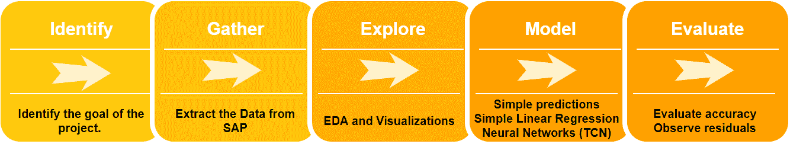
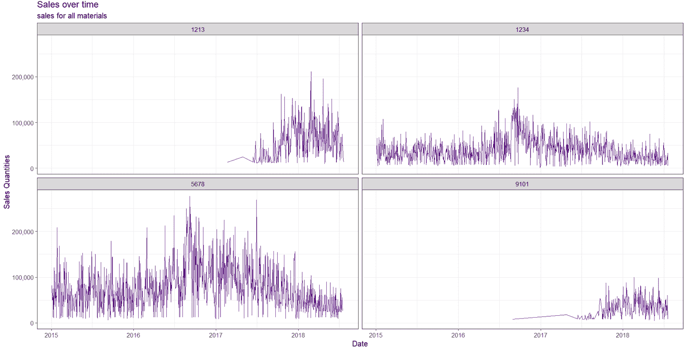

# 第六章：R 和 Python 中的预测分析

Big Bonanza Warehouse 的团队在销售预测方面遇到了一些问题，销售副总裁转向作为销售和分销分析师工作的 Duane 寻求帮助。每季度他们大约收集一次数据并将其发送给外部公司进行处理。结果是预测他们未来几个季度所有产品的销售，但他们发现为他们生成的预测太过一般化（基于季度），并且经常是极不准确的。他们是否可以得到一些帮助他们了解下周销售可能是什么的东西？简言之，他们想要对畅销产品的销售进行每周预测。

Duane 有一些想法。他曾与公司的数据科学家 Greg 和 Paul 合作过，对数据科学有一些了解。一段时间内产品的销售是一个时间序列¹问题。他们有足够的历史数据来尝试寻找模式。这不是纯粹的预测，而是模式检测。这是销售团队可以使用的东西，而不是他们的直觉感觉。Duane 决定使用一些*预测分析*。借助正确的 R 或 Python 工具集和一些预测分析的前期知识，Duane 不需要花几个月时间支付昂贵的顾问费用来建立庞大的数据湖。他可以动手找到答案。

数据科学中有许多术语很模糊（包括*数据科学*本身！），但*预测分析*占据了特殊的不可理解性份额。您可能已经听说了那个如今臭名昭著的“预测”故事。零售巨头 Target 在父亲甚至不知道之前预测了一个少女的怀孕。如果您还没有听说这个故事…… Target 开始向一个少女发送婴儿优惠券。她的父亲抱怨说他们在鼓励他的女儿怀孕。事实是，这个女孩已经怀孕了。Target 是否*预测*了这个少女的怀孕？答案是否定的。这不是预测；这是推断或分类。他们使用的特征是客户的购物行为。这个少女的购买习惯导致分类算法将她归类为“怀孕”类别。

这个故事的要点是突出显示“预测”一词的两种常见用法。其中一种预测是统计推断，另一种是预测。让我们在这里诚实一点，您可以对这些定义进行无休止的辩论。对于我们的目的，我们将在预测和推断之间划清界限。对我们来说，预测将是预测。² 让我们确保我们对术语的理解是一致的：*预测是预测未来的行为*。

确定分析是否属于预测的试金石是询问：“事件是否已发生？”如果是，那么根据我们的定义，它很可能不是预测。

以下是数据科学学习材料中常见的被误标记为预测的主题和练习的一些示例：

预测波士顿房价

这是另一个基于给定物业的特征（如位置、面积、卧室数量等）的分类/推理问题。

预测 *泰坦尼克号* 的生存率

这是另一个基于性别、客舱号码（位置）、家庭成员数量、出发点等特征的分类/推理问题。

预测欺诈信用卡行为

这是一个异常检测问题，确定持卡人的行为是否在容忍范围内。更具描述性的称呼可能是“检测欺诈信用卡行为”。

预测为什么和何时患者会再次收治

这听起来非常接近预测。这是另一个基于已被再次收治的患者的特征进行分类/推理的问题。如果他们的特征与尚未再次收治的患者的特征匹配，他们可能会再次收治。

一些被正确标记为预测的主题和练习的示例：

预测波士顿房价 *明年*

明年的房屋价值是基于某些特征对当前房屋价值的分类。这一分类与其他显著数据（如 GDP）融合，以进行未来预测。

预测未来股票价值

你来解决这个问题……告诉我们。许多不同的数据源有助于预测股票的表现。公司在 EDGAR³ 的季度业绩报告是一个很好的起点。

# 预测销售在 R 中

在本章中，我们将详细介绍 Duane 在预测分析中的练习，并尝试进行销售订单预测。我们将按照 图 6-1 中的流程进行此任务。



###### 图 6-1\. 数据分析与预测流程

## 步骤 1: 确定数据

还不准备完全独立行动，Duane 向数据科学团队寻求更好的指标，以预测未来销售——接下来的几周、几个月、几个季度，以及一年内。随着预测准确度随着预测的时间越远而变得更加不稳定。简单地说，预测明天的销售要比预测明年的销售容易得多，因为我们知道昨天的销售情况。然而，并不是说我们可以预测明年的销售，因为我们知道去年的情况。我们知道的是，我们将会有一系列产品的销售数据。

## 步骤 2: 收集数据

我们的数据来源是 SAP。我们将使用与 第四章 中相同的方法提取数据。使用 ABAP QuickViewer 查询，我们从 VBAP 和 VBAK 表中收集简单的销售数据。我们只从 VBAK 中取 ERDAT（创建日期）。我们从 VBAP 表中取 MATNR（物料）和 KWMENG（销售数量）。

## 步骤 3: 探索数据

从 SAP 导出数据为 CSV 文件后，我们将其读入 R 进行查看：

```
sales <- read.csv('D:/DataScience/Data/Sales.csv')
```

让我们先看看前 10 行：

```
head(sales)

   X DailySales Material       ReqDeliveryDate
 1 0   48964.75     1234 /Date(1420416000000)/
 2 1   30853.88     1234 /Date(1420502400000)/
 3 2   65791.00     1234 /Date(1420588800000)/
 4 3   17651.20     1234 /Date(1420675200000)/
 5 4   36552.90     1234 /Date(1420761600000)/
 6 5    5061.00     1234 /Date(1420848000000)/

```

我们立即看到两件事。行进来时在列 X 下，我们不需要它。此外，日期字段看起来很奇怪，看起来像 UNIX 时间，我们需要进行转换。进一步查看后，我们发现它确实是 UNIX 时间，但末尾多余的三个零需要去掉。让我们在继续之前先纠正这些问题：

```
#Remove the X column
sales$X <- NULL
#Remove all nonnumeric from the date column
sales$ReqDeliveryDate <- gsub("[⁰-9]", "", sales$ReqDeliveryDate)
#Convert the unix time to a regular date time using the anytime library
library(anytime)
#First trim the whitespace
sales$ReqDeliveryDate <- trimws(sales$ReqDeliveryDate)
#Remove the final three numbers
sales$ReqDeliveryDate <- gsub('.{3}$', '', sales$ReqDeliveryDate)
#Convert the field to numeric
sales$ReqDeliveryDate <- as.numeric(sales$ReqDeliveryDate)
#Convert the unix time to a readable time
sales$ReqDeliveryDate <- anydate(sales$ReqDeliveryDate)

```

现在我们已经完成了一些操作，让我们来看看我们数据的结构。使用函数`str()`来查看数据的结构：

```
str(sales)
 'data.frame': 2359 obs. of 3 variables:
  $ DailySales  : num 48965 30854 65791 17651 36553 ...
  $ Material    : int 1234 1234 1234 1234 1234 1234 1234 1234 1234 1234 ...
  $ ReqDeliveryDate: Date, format: "2015-01-04" "2015-01-05" "2015-01-06"  ...

```

我们看到我们有一个包含三个变量的数据框，共有 2,359 个观测。让我们来找出数据框中材料的分布情况。使用`ggplot2`库中的以下命令（这会在图 6-2 中呈现）：

```
ggplot(`sales`, aes(`Material`)) + geom_bar()
```


###### 图 6-2\. 我们销售数据中材料的分布

我们已经有了我们喜欢的数据格式。现在是时候绘制和探索数据了。

## 第四步：建模数据

我们将使用 R 中的[`ggplot2`](https://ggplot2.tidyverse.org/)、[`dplyr`](http://bit.ly/2lRCudc)和[`scales`](http://bit.ly/2lRCudc)库来建模我们的数据。这些是 R 生态系统中最有用和多功能的包之一：

```
library(ggplot2)
library(dplyr)
require(scales)

```

首先，我们进行一些前期工作。我们希望我们的图表有漂亮的数字，所以我们使用来自`scales`的`format_format`函数来定义这些内容。该函数的效果是简单地将我们的数字格式化，使小数点为句点，千位数为逗号，并且不使用科学计数法。

```
point <- format_format(big.mark = ",", decimal.mark = ".", scientific = FALSE)

```

让我们简单地绘制材料随时间的销售情况：

```
sales %>%
  ggplot(aes(x=ReqDeliveryDate, y=DailySales)) +
  geom_point(color = "darkorchid4") +
  scale_y_continuous(labels = point) +
  labs(title = "Sales over time",
       subtitle = "sales for all materials",
       y = "Sales Quantities",
       x = "Date") +
  theme_bw(base_size = 15)

```

用人类语言说，这段 R 代码的意思是：“取销售数据框并将其发送到`ggplot`。将 x 轴设为`ReqDeliveryDate`，y 轴设为`DailySales`。使用`darchorchid4`色调的点。然后将 y 轴格式化为`point`格式。最后，好好标注一切并给它一个基本的主题和大小。” 结果显示在图 6-3 中。


###### 图 6-3\. 所有材料随时间的销售情况

这给了我们关于销售随时间的分布的想法，但它混合了材料，并且点并不适合绘制时间序列。让我们分开材料，并选择线而不是点。我们在图 6-4 中看到了结果。


###### 图 6-4\. 按颜色分开的材料随时间的销售情况

这样做更好了，但材料仍然混杂在一起不够清晰。也许我们需要完全分开它们。`ggplot2`的`facet_wrap`可以很好地完成这项任务。以下代码生成了图 6-5 中的图表：

```
sales %>%
  ggplot(aes(x=ReqDeliveryDate, y=DailySales, color)) +
  geom_line(color = "darkorchid4") +
  facet_wrap( ~ Material) +
  scale_y_continuous(labels = point) +
  labs(title = "Sales over time",
       subtitle = "sales for all materials",
       y = "Sales Quantities",
       x = "Date") +
  theme_bw(base_size = 15)
```



###### 图 6-5. 销售材料随时间变化的分段图表

现在我们可以更轻松地看到每种材料的分布情况。我们可以快速发现其中两种材料最近才开始销售。

让我们专注于一个材料，1234。我们将使用`geom_smooth`函数添加一个简单线性模型。这里我们只有一个材料，但我们保留`facet_wrap`是因为它使得标题非常漂亮（结果显示在图 6-6 中）：

```
sales %>%
  subset(Material == '1234') %>%
  ggplot(aes(x=ReqDeliveryDate, y=DailySales, color)) +
  geom_line(color = "darkorchid4") +
  facet_wrap( ~ Material ) +
  geom_smooth(method = "lm") +
  scale_y_continuous(labels = point) +
  labs(title = "Sales over time",
     subtitle = "sales for all materials",
     y = "Sales Quantities",
     x = "Date") +
  theme_bw(base_size = 15)
```


###### 图 6-6. 简单线性映射下的销售随时间变化

我们想知道这些年度销售如何相互匹配。线性图表使得难以判断 2015 年的整体周销量是否高于 2018 年。

让我们放松心态，以直觉的方式来解决问题。在 R 编程中有许多重要概念，但其中两个最具影响力的是*Tidy Data*和*Split-Apply-Combine*。

理解这些概念将帮助您更轻松地思考问题。我们将简单地将我们的`sales`数据框分割成一个更容易绘制的子数据框。首先，我们将我们的销售数据复制到一个仅包含我们材料的子数据框中：

```
sales_week <- sales %>% subset(Material == '1234')
```

其次，我们需要从日期变量中创建一个周变量和一个年变量。在 R 中，使用基本函数`strftime`很容易实现这一点：

```
sales_week$week <- strftime(sales_week$ReqDeliveryDate, format = '%V')
sales_week$year <- strftime(sales_week$ReqDeliveryDate, format = '%Y')
```

我们不再需要`ReqDeliveryDate`或`Material`：

```
sales_week$ReqDeliveryDate <- NULL
sales_week$Material <- NULL
```

我们还想将我们的周聚合到一个桶中。在我们的`sales`数据框中，可能会有给定周的多次销售，我们希望在`sales_week`数据框中只保留一个周的销售：

```
sales_week <- sales_week %>% group_by(year, week) %>% summarise_all(sum)
```

如果我们现在查看我们的数据框，它具有以下列：

```
 head(sales_week)
 # A tibble: 6 x 3
 # Groups:   year [1]
   year week DailySales
   <chr> <chr>      <dbl>
 1 2015 01        48965.
 2 2015 02       173920.
 3 2015 03       213616.
 4 2015 04       243433.
 5 2015 05       304793.
 6 2015 06       265335.
```

现在我们可以再次使用`ggplot2`来查看按年度比较周销量的情况（结果在图 6-7 中显示）：

```
sales_week %>% 
  ggplot(`aes`(`x` = week, y = DailySales, group = year)) +
  geom_area(`aes`(`fill` = year), position = "stack") +
  labs(`title` = "Quantity Sold: Week Plot", x = "", y = "Sales") +
  scale_y_continuous() +
  theme_bw(`base_size` = 15)
```


###### 图 6-7. 按年度销售面积图

这张图告诉我们一些以前无法清晰看到的内容。每年销售量的峰值和谷底之间有着强烈的相关性。这种年度之间的强相关性让我们相信可以根据这种模式进行建模。2018 年没有完整记录的年度销售，所以该图表在第 29 周停止。我们还看到在第 35 至 40 周和第 4 至 9 周之间销售明显上升。

要进一步探索，我们需要访问 R 中的一个基本对象，即`ts`（时间序列）对象。它是一组随时间变化的数值数组。到目前为止，我们一直在使用的是数据框（dataframe）。在 R 中，将`data.frame`轻松转换为`ts`对象。此函数以数据本身作为第一个参数，然后是一系列其他参数，我们现在将逐一介绍。在控制台中键入`**args(ts)**`以查看基本`ts`函数的参数列表：

```
args(`ts`)
function (`data` = NA, start = 1, end = numeric(), frequency = 1,
    deltat = 1, ts.eps = getOption("ts.eps"), class = if (`nseries` >
        1) c("mts", "ts", "matrix") else "ts", 
        names = if (!is.null(`dimnames`(`data`))) 
        colnames(`data`) else paste("Series",
        seq(`nseries`)))
```

我们将使用的参数是：

+   `start`和`end`参数定义了`ts`对象的起始日期和结束日期。

+   `frequency`参数指定了单位时间内的观察次数。

为了更轻松、更清晰地完成这一任务，我们需要重新格式化我们的数据框架。这将导致一个整洁美观的`ts`对象。

这一次我们将按月进行分析。就像我们按周进行分析一样，我们将子集化`sales`数据框架。不过，这一次我们会重新命名列，以便更容易使用和记忆：

```
sales_month <- sales %>% subset(Material == '1234')
 sales_month$Material <- NULL
 colnames(sales_month) <- c('sales', 'date')
```

另外，`ts`对象不喜欢间隙。如果你要按天分析数据，`ts`对象希望每天都有数据……即使某天没有销售数据。如果按分钟分析数据，同样每分钟都必须有数据。例如，如果某天没有销售某种材料，日期序列中就会出现间隙。我们想用 0 填补所有这些间隙，因为那天实际销售的数量就是 0。首先，我们创建一个新的数据框架，包含从`sales_month`的第一天开始到最后一天的所有可能日期：

```
all_dates = seq(`as`.Date(`min`(`sales_month`$date)),
                as.Date(`max`(`sales_month`$date)),
                by="day")
```

然后我们想将这个数据框架与`sales_month`合并：

```
sales_month <- merge(data.frame(date = all_dates),
                      sales_month,
                      all.x=T,
                      all.y=T)
```

让我们来看看我们的数据：

```
head(sales_month, n=10)
         date    sales
 1  2015-01-04 48964.75
 2  2015-01-05 30853.88
 3  2015-01-06 65791.00
 4  2015-01-07 17651.20
 5  2015-01-08 36552.90
 6  2015-01-09 5061.00
 7  2015-01-10       NA
 8  2015-01-11 18010.00
 9  2015-01-12 24015.00
 10 2015-01-13 39174.25
```

我们马上注意到我们的数据中有缺失值（NA）。这是在没有销售的那些天。让我们用 0 替换它们：

```
sales_month$sales[is.na(sales_month$sales)] = 0
```

现在创建一个`ts`对象就很容易了。坦率地说，在 R 中，`ts`对象一直是一个难题。听从我们的建议——花时间对数据框架进行清晰简洁的格式化，你将轻松通过`ts`对象部分：

```
require(xts)
sales_ts <- xts(sales_month$sales, order.by = as.Date(sales_month$date))
```

现在我们有了一个格式良好的`ts`对象，可以在其上做一些简单的图表：

```
plot(sales_ts)
```


###### 图 6-8\. `ts`对象的简单图

我们还可以轻松地查看每月的销售额和平均销售额。通过观察图 6-9，我们可以看到尽管有高峰和低谷，整体销售金额相对平均。

```
monthplot(sales_ts)
```


###### 图 6-9\. `ts`对象的月度图

### 预测图表

在预测分析中，我们通常要使用三种简单图形：均值、朴素和漂移。让我们分别来看看这些图形。

第一个图是对未来均值的简单预测。这一预测假设过去销售的平均值将继续保持。要创建这些图表，我们需要使用`forecast`⁴库。我们在图 6-10 中看到了均值预测的结果。

```
library(forecast)
sales_ts <- ts(sales_month$sales) 
sales_ts_mean = meanf(sales_ts,h=35,level=c(90,90), 
                      fan=FALSE, lambda = NULL)
plot(sales_ts_mean)
```

您可能会想知道图表（最右侧的灰色矩形区域）告诉您什么。灰色区域是置信区间，默认情况下为 95%。灰色区域中间的线表示预测应该落在哪里，灰色区域表示：“我有 95%的信心，如果值不在线上，它会在灰色区域内。”可以假设，95%的置信区间相当高，因此该区域必须足够大以确保这一点。


###### 图 6-10\. 简单的均值预测及其置信区间

天真的假设是销售将与最后一次观察相同，如图 6-11 所示：

```
sales_ts_naive <- naive(`sales_ts`,h=35,level=c(90,90),
                         fan=FALSE,lambda=NULL)
plot(`sales_ts_naive`)
```


###### 图 6-11\. 简单的天真预测及其置信区间

最后，我们可以很容易地通过`forecast`库查看图表的漂移。漂移从天真的起点开始，但然后根据数据的平均整体变化进行正向或负向调整。我们在图 6-12 中看到了结果。请注意，这里有一个细微的向下趋势：

```
sales_ts_drift <- rwf(sales_ts,h=35,drift=T,level=c(90,90),
                      fan=FALSE,lambda=NULL)
plot(sales_ts_drift)
```


###### 图 6-12\. 简单的漂移预测及其置信区间

显然，这些图表并不能令销售副总裁满意，但这只是我们预测过程的开始，我们将继续改进这个过程，直到我们获得满意的结果。

## 第五步：评估模型

首先，让我们分析刚刚创建的三个图的准确性。使用`forecast`包很容易做到这一点，但在此之前，我们需要讨论如何衡量准确性。我们将分析六种方式来分析准确性，而表 6-1 展示了最常用的测量方法。

表 6-1\. 准确性测量

| 测量 | 描述 | 符号 |
| --- | --- | --- |
| ME | 平均误差：预测误差的平均数。正误差有可能抵消负误差。 | mean(e[i]) |
| MAE | 平均绝对误差：预测误差的平均值。这不考虑误差是过高还是过低，只考虑误差的大小。 | mean(&#124;e[i]&#124;) |
| RMSE | 均方根误差：与 MAE 相同，但在总和开平方之前对误差进行了平方。这样做的结果是大误差比小误差更有价值。如果您希望严重惩罚大误差，可以考虑此改进。 | SQRT(mean(e²[i])) |
| MPE | 平均百分比误差：误差百分比的平均值。 | mean((e[i] / actual[i]) *100) |
| MAPE | 平均绝对百分比误差：误差的绝对百分比的平均值。 | mean((&#124;e[i] / actual[i]) *100&#124;) |
| MASE | 平均绝对标度误差：绝对值的*标度^(a)*误差的均值。标度是代替百分比误差的一种方法。MASE > 1 表明预测比天真预测更糟糕。如果 < 1 则更好。 | mean(&#124;q[i]&#124;) |
| ^(a) MASE 是由统计学家[罗布·海德曼](http://bit.ly/2ZKRo7z)于 2005 年提出的，用于确定预测的比较准确性。 |

我们可以使用`forecast`包轻松查看这些值（见表 6-2）：

```
accuracy(sales_ts_mean)
accuracy(sales_ts_naive)
accuracy(sales_ts_drift)
```

表 6-2\. 均值、天真和漂移预测的准确性度量

|   | ME | RMSE | MAE | MPE | MAPE | MASE |
| --- | --- | --- | --- | --- | --- | --- |
| Mean | -2.46E-13 | 28535.31 | 23019.78 | -Inf | Inf | 1 |
| Naïve | -33.81419 | 31653.02 | 23017.03 | -Inf | Inf | 1 |
| Drift | 1.25E-12 | 31653 | 23021.87 | NaN | Inf | 1.00021 |

对于这些评估，什么是好的值？请考虑每组数据都不同且具有不同的比例。一个实验中的数据可能在 1 到 1,000,000 的范围内，而 RMSE 为 10，这似乎非常好。然而，如果数据的范围是 1 到 20，则相同的 RMSE 值就很糟糕了。因此，考虑使用您的评估方法来比较不同的图表和测试，避免盲目地将小评估结果视为好的陷阱。在我们刚刚看过的简单方法中，均值似乎领先。我们的结果还向我们展示了使用百分比的一些风险。存在除以零或接近零的风险，导致无限值。

在我们的数据中，另一件需要关注的事情是季节性。这是一种通过使用`tseries`⁵库大大简化的探索数据的不同方式。是否有基于周期事件的某种模式？时间序列中季节性的一个示例是连指手套的销售。显然，连指手套的销售在冬季增加，在夏季减少。另一种说法是数据是否平稳或不平稳。平稳数据与实际时间序列无关。我们可以通过使用`tseries`包中的`adf.test`方法来测试平稳性或非平稳性：

```
library(tseries)
sales_ts_adf <- adf.test(sales_ts) 
sales_ts_adf
```

我们得到的结果清楚地表明数据是平稳的（没有季节性）：

```
Augmented Dickey-Fuller Test
data: sales_ts[, 1]
Dickey-Fuller = -5.8711, Lag order = 10, p-value = 0.01
alternative hypothesis: stationary
```

现在是时候进行一些比均值、天真或漂移更好的预测了。我们将首先使用 ARIMA 模型。ARIMA⁶代表自回归积分移动平均。ARIMA 是一种根据其先前数据点预测（预测）未来值的技术。正如名称所示，它使用移动平均。首先，我们使用以下命令创建未来的值：

```
sales_future <- forecast(`auto`.arima(`sales_ts`))
```

为了更好地理解结果，让我们看一下我们正在处理的时间序列对象的结构。使用`str()`命令：

```
> str(sales_ts)
An 'xts' object on 2015-01-04/2018-07-20 containing:
  Data: num [1:1294, 1] 48965 30854 65791 17651 36553 ...
  Indexed by objects of class: [Date] TZ: UTC
  xts Attributes: NULL
```

这告诉我们，在我们的时间序列中有 1,294 个对象。我们的`forecast`函数将预测未来另外 10 个值。这给出了以下销售值和 80 和 95 的置信区间。让我们以时间序列对象 1300 为例。这告诉我们预测值为 20892.628，*Lo 80* 为 -8393.256，*Hi 80* 为 50178.51。这意味着我们有 80% 的置信度销售额将在 -8,393.256 到 50,178.51 美元之间。95% 的置信区间显然更宽，以应对更高的置信度，因此其范围更大，为 -23,896.27 到 65,681.52 美元：

```
      Point Forecast      Lo 80    Hi 80     Lo 95    Hi 95
 1295        907.887 -26883.351 28699.12 -41595.14 43410.92
 1296      11811.826 -16743.171 40366.82 -31859.27 55482.93
 1297      21790.271 -6768.050 50348.59 -21885.91 65466.45
 1298      23937.037 -5022.613 52896.69 -20352.92 68227.00
 1299      25546.677 -3730.630 54823.98 -19229.10 70322.46
 1300      20892.628 -8393.256 50178.51 -23896.27 65681.52
 1301      10542.993 -19636.125 40722.11 -35611.98 56697.97
 1302       5537.931 -27502.193 38578.06 -44992.58 56068.44
 1303      10655.408 -24005.266 45316.08 -42353.52 63664.34
 1304      19295.901 -15714.125 54305.93 -34247.31 72839.12
```

现在让我们绘制这张图表。这次我们将从点 750 到 1304 开始，这样我们就不会有这么小的预测间隔。我们只会绘制时间序列从点 750 到 1304\. 在图 6-13 中的结果显示点值是黑线，80% 置信区间是浅色阴影，90% 置信区间是更浅的阴影：

```
plot(`sales_futue`, xlim = c(750,1304))
```


###### 图 6-13\. ARIMA 预测

到目前为止，我们已经进行了一些预测，并且在这个过程中学到了很多。也许我们应该坐下来看看我们的数据，并想一想这个 ARIMA 是否已经足够好了？我们应该尝试一些新的东西吗？当您看到图 6-13 时，脑海中会想到什么？当我们看到它时，我们看到底部的平直线。那是我们输入缺失日期的地方，那些材料没有销售的日期。这些是否应该包含在进行预测的模型中？在许多情况下，答案可能是否定的。然而，在这里有一个很好的论点，即零销售也很重要。任何销售日都是一个数据点，任何非销售日也是如此。

接下来，我们将切换到另一种语言和不同的模型。我们将采用在 R 中探索过的同一系列数据，并在 Python 中执行相同的五步分析。

# 在 Python 中预测销售

有许多方法可以使用不同的工具（如 Python 和 R）分析数据。在本节中，我们将从 Python 的角度处理相同的数据。

## 第一步：识别数据

这次我们将使用一个快速的 OData 实用类，它可以加快未来识别和收集阶段的速度。我们将使用 OData 和 Python 来帮助预测未来几周、几个月甚至一年的销售情况。此识别阶段与我们之前在 R 中所做的相同。

## 第二步：收集数据

还记得第三章中我们为从 SAP 后端列出植物创建了一个示例 OData 服务的时候吗？我们将在这里完全做同样的事情——只是有些调整结构、字段，并加入少许 ABAP 代码以使拉取变得简单。最重要的是，以这种方式定义一个过程将使您能够轻松地以编程方式收集不同的材料和日期范围！我们将在此处突出显示与第三章中所述方法的主要区别。

首先，在事务 SE11 中创建一个结构，并从图 6-14 中选择字段进行填充。我们将其与之前的 R 示例具有相同的基本结构。


###### 图 6-14\. 销售数据的 SE11 结构

接下来，转到事务 SEGW 创建一个新的 OData 服务，并按图 6-15 中的项目详情输入。


###### 图 6-15\. 来自 SEGW 的 OData 服务详情

记住导入我们创建的结构，就像在第三章中一样。参见图 6-16、图 6-17 和图 6-18 以获取要使用的设置。


###### 图 6-16\. 将 SE11 结构导入到新的 OData 服务中


###### 图 6-17\. 选择所有可用字段进行导入


###### 图 6-18\. MATERIAL 和 REQ_DELIVERY_DATE 是关键字段

再次，就像第三章一样，重新定义刚刚创建的实体的 `GetEntitySet (Query)` 方法。使用以下 ABAP 代码设置销售订单项数据的快速过滤操作。如前所述：本书不会深入解释 ABAP 代码。如果您是一位数据科学家，确实需要 SAP 数据但没有 SAP 团队帮助，那么您可能希望在 SAP 的免费培训网站[*https://open.sap.com*](https://open.sap.com)上补充一些 ABAP 基础知识：

```
"This code will return a list of sales dollars by date per material. 
"The filtering mechanism for OData allows us to limit this to a subset 
"of materials, and the below Python code incorporates this feature.

"If you named your entity set differently than our example screenshots,
"this method will be named differently.
METHOD dailymaterialsal_get_entityset.
  DATA lr_matnr TYPE RANGE OF matnr.
  DATA ls_matnr `LIKE` LINE OF lr_matnr.
  DATA lr_vdatu TYPE RANGE OF edatu_vbak.
  DATA ls_vdatu `LIKE` LINE OF lr_vdatu.

   "Here we extract the filters that our Python code will insert.
  LOOP AT it_filter_select_options `INTO` DATA(ls_select).
    `IF` ls_select-property EQ 'Material'.
      LOOP AT ls_select-select_options `INTO` DATA(ls_option).
        MOVE-CORRESPONDING ls_option `TO` ls_matnr.
        ls_matnr-low = |{ ls_option-low ALPHA = `IN` }|.
        APPEND ls_matnr `TO` lr_matnr.
      ENDLOOP.
    ELSEIF ls_select-property EQ 'ReqDeliveryDate'.
      LOOP AT ls_select-select_options `INTO` ls_option.
        MOVE-CORRESPONDING ls_option `TO` ls_vdatu.
        ls_vdatu-low = |{ ls_option-low ALPHA = `IN` }|.
        APPEND ls_vdatu `TO` lr_vdatu.
      ENDLOOP.
    ENDIF.
  ENDLOOP.

  "This SELECT statement incorporates the filters that are sent by the
  "Python code below into the SQL logic. For example, if the programmer
  "enters 3 materials to filter, then the variable 'lr_matnr' contains
  "a reference to those 3 materials to pass to the database engine.
  `SELECT` item~matnr `AS` material
         head~vdatu `AS` req_delivery_date
         SUM( item~netpr ) `AS` daily_sales
    `FROM` vbak `AS` head
      `INNER` `JOIN` vbap `AS` item `ON` head~vbeln = item~vbeln
      `INNER` `JOIN` knvv `AS` cust `ON` head~kunnr = cust~kunnr
        `AND` head~vkorg = cust~vkorg
        `AND` head~vtweg = cust~vtweg
        `AND` head~spart = cust~spart
      `INNER` `JOIN` mara `AS` mtrl `ON` item~matnr = mtrl~matnr
    `INTO` CORRESPONDING FIELDS OF TABLE et_entityset
     `WHERE` head~vdatu `IN` lr_vdatu
       `AND` item~matnr `IN` lr_matnr
    `GROUP` `BY` item~matnr vdatu
    `HAVING` SUM( item~netpr ) > 0
    `ORDER` `BY` item~matnr vdatu.
ENDMETHOD.
```

完成并激活 SAP Gateway 代码后，您将拥有一个能够向任何能发出 OData 请求的客户端发送所需销售数据的服务。自然地，您希望将自己的笔记本电脑用作其中之一，因此我们设计了一个小的实用类，可以在您的本地计算机上执行一些基本的 OData 过滤、请求和创建 CSV 文件的操作。在许多 SAP 数据检索场景中，这可能非常有用：

```
# Utility is exposed as a class to be instantiated per request run
class GatewayRequest(object):
     def __init__(self, gateway_url='', service_name='', entity_set_name='',
                  user='', password=''):
        self.gateway_url = gateway_url.strip('/')
        self.service_name = service_name.strip('/')
        self.entity_set_name = entity_set_name.strip('/')
        self.filters = [] 

        # Basic authentication: a username and password base64 encoded 
        # and sent with the OData request. There are many flavors of 
        # authentication for available for OData - which is just a RESTful 
        # web service - but basic authentication is common inside corporate 
        # firewalls.
        self.set_basic_auth(user, password)

    # Adds a filter to the main set of filters, which means our OData 
    # utility can support multiple filters in one request.
    def add_filter(self, filter_field, filter_option, filter_value): 
        # OData supports logical operators like 'eq' for equals, 
        # 'ne' for does not equal, 'gt' for greater than, 'lt' for less 
        # than, 'le' for less than or equal, and 'ge' for greater than or 
        # equal. 'eq' is the most common, so if the logical operator is 
        # omitted we assume 'eq'
        if not filter_option:
            filter_option = 'eq'

        new_filter = [filter_field, filter_option, filter_value]
        self.filters.append(new_filter)

    # Encode the basic authentication parameters to send with the request. 
    def set_basic_auth(self, user, password):
        self.user = user
        self.password = password
        string_to_encode = user + ':' + password
        self.basic_auth =  
             base64.b64encode(string_to_encode.encode()).decode()

    # OData works through sending HTTP requests with particular query 
    # strings attached to the URL. This method sets them up properly.
    def build_request_url(self):
        self.request_url = self.gateway_url + '/' + self.service_name
        self.request_url += '/' + self.entity_set_name

        filter_string = ''

        if len(self.filters) > 0:
            filter_string = '?$filter='
            for filter in self.filters:
                filter_string += filter[0] + ' ' + filter[1]
                filter_string += ' \'' + filter[2] + '\' and '

            filter_string = filter_string.rstrip(' and ')

        if not filter_string:
            self.request_url += '?$format=json'     
        else:
           self.request_url += filter_string + '&$format=json'

    # Perform the actual request, by adding the authentication header and 
    # the filtering options to the URL. 
    def perform_request(self):
        try:
           self.build_request_url()
           if self.basic_auth:
               headers = {'Authorization':'Basic ' + self.basic_auth}
               self.result = requests.get(self.request_url, 
                                          headers=headers)
           else:
               self.result = requests.get(self.request_url)
         except Exception as e:
             raise Exception(e)

    # Utility function to return a pandas dataframe from the results of 
    # the OData request.
     def get_result_dataframe(self):
         try:
             self.perform_request()
             json_obj = json.loads(self.result.text)
             json_results = json.dumps(json_obj['d']['results'])
             return pandas.read_json(json_results).drop('__metadata',axis=1)
         except Exception as e:
             raise Exception(e)

    # Utility function to return a basic JSON object as the results of 
    # the query.
     def get_result_json(self):
         self.perform_request()
         return json.loads(self.result.text)

    # The utility function we use, to save the results to a local .csv
    def save_result_to_csv(self, file_name):
        self.get_result_dataframe().to_csv(file_name)

    # A utility to properly parse the dates that are returned in a json 
    # request.
    @staticmethod
    def odata_date_to_python(date_string):
         date_string = date_string.replace('/Date(', '').replace(')/', '')
         date_string = date_string[:-3]
         new_date = datetime.datetime.utcfromtimestamp(int(date_string))
         return new_date
```

定义好实用类后，我们准备执行请求。您需要用您自己的值替换斜体代码。

```
sales_request = GatewayRequest(gateway_url='http://YOUR_SAP_HOST/sap/opu/
 odata/sap/',
               entity_set_name='DailyMaterialSalesSet',
               service_name='ZTEST_MATERIAL_PREDICT01_SRV',
               user='YOUR_USER', password='YOUR_PASS') 

# We added three materials here, but you could add as many as you like in this
# syntax 
sales_request.add_filter('Material', 'eq', 'YOUR_MATERIAL1') 
sales_request.add_filter('Material', 'eq', 'YOUR_MATERIAL2') 
sales_request.add_filter('Material', 'eq', 'AS_MANY_AS_YOU_WANT') 

# Note for dates OData requires the below filtering syntax 
# Yes - dates are a little weird 
sales_request.add_filter('ReqDeliveryDate', 'gt',         
                         "datetime'2015-01-01T00:00:00'")

sales_request.save_result_to_csv('D:/Data/Sales.csv')
```

## 步骤 3：探索数据

现在我们已经有了数据，可以轻松将其读入 Python。我们将需要一些标准库来开始。这些是非常常见且经常使用的库：

```
import pandas as pd
import numpy as np
import matplotlib.pyplot as plt
from datetime import datetime
```

我们将使用 `pandas` 库来读取数据：

```
df = pd.read_csv('D:/Data/Sales.csv')
```

让我们通过查看前几行来查看我们的数据：

```
df.head()
```

毫不奇怪，数据在读入 R 时遇到了与之前相同的问题。在图 6-19 中，我们看到需要删除列和调整日期列。


###### 图 6-19\. Python 中未转换的销售数据框

我们将在 Python 中执行与 R 中相同的功能。这些基本步骤是：

1.  删除一列

1.  将日期列转换为真实日期

1.  按单一材料子集数据框

1.  删除材料列

1.  将日期作为数据框的索引

```
#Drop the column 'Unnamed'
df = df.drop(['Unnamed: 0'], axis = 1)
#Convert the date column to numeric and take out any nonnumeric chars.
df.ReqDeliveryDate = pd.to_numeric(df.ReqDeliveryDate.str.replace('[⁰-9]', ''))
#Convert the date column to a proper date using to_datetime
df['ReqDeliveryDate'] = pd.to_datetime(df['ReqDeliveryDate'], unit='ms')
#Subset the dataframe by the single material 8939
df_8939 = df['Material']==8939
df = df[df_8939]
#Drop the material column
df = df.drop(columns=['Material'])
#make the date column the index
df = df.set_index(['ReqDeliveryDate'])
```

让我们再次查看我们的数据框，但这次通过快速绘图（显示在图 6-20 中）：

```
plt.plot(df)
```


###### 图 6-20\. Python 中销售初始图

然后，我们将使用 Python 中的`statsmodels`包执行时间序列的分解。这是一个统计任务，将时间序列对象拆解为几个类别或模式。这些模式包括观察值、趋势、季节性和残差。我们将分解我们的时间序列并绘制它（结果显示在图 6-21 中）：

```
from statsmodels.tsa.seasonal import seasonal_decompose
result = seasonal_decompose(df, model='multiplicative', freq = 52)
result.plot()
```

这给我们一个关于时间序列数据的总体视图。*观察*图表为我们提供了数据的精确表示。*趋势*图表显示了观察值的整体趋势。可以将其视为观察值的平滑处理。*季节性*图表突出显示数据是否存在任何季节性方面。如果在此处观察到重复模式，则数据可能存在季节性。最后，*残差*图表显示观察值和预测值之间的误差。


###### 图 6-21\. 我们销售数据的分解图表

## 步骤 4：建模数据

就像我们在 R 中所做的那样，现在我们将在 Python 中创建一个 ARIMA 预测。使用`pyramid.arima`⁷包在 Python 中非常方便。探索该包以了解可以进行的所有设置：

```
from pyramid.arima import auto_arima
step_model = auto_arima(df, start_p=1, start_q=1,
                           max_p=3, max_q=3, m=12,
                           start_P=0, seasonal=True,
                           d=1, D=1, trace=True,
                           error_action='ignore',
                           suppress_warnings=True,
                           stepwise=True)
 print(step_model.aic())
```

日志将如打印时所运行的那样：

```
Fit ARIMA: order=(1, 1, 1) seasonal_order=(0, 1, 1, 12); AIC=21114.204, 
  BIC=21138.271, Fit time=2.342 seconds
. 
. 
. 
Fit ARIMA: order=(1, 1, 2) seasonal_order=(0, 1, 1, 12); AIC=21076.593, 
  BIC=21105.474, Fit time=4.335 seconds
Total fit time: 35.598 seconds
```

下一步是将时间序列分成两组：一组用于训练，一组用于测试。我们希望在大多数数据上进行训练，然后在剩余数据上进行测试。对于我们的数据集，时间序列从 2015-01-05 到 2018-07-21\. 因此，我们决定选择从 2015-01-05 到 2018-04-01 的范围进行训练，然后用剩余的日期进行验证：

```
train = df.loc['2015-01-05':'2018-04-01']
test = df.loc['2018-04-02':]
```

下一步是将模型拟合到训练数据：

```
step_model.fit(train)
```

让我们预测在 2018-04-01 之后会发生什么，测试集中时间步数的数量。测试系列的时间步数如下所示：

```
len(test)
73
```

进行预测的命令很简单：

```
future = step_model.predict(n_periods=73)
```

要查看我们预测的结果，只需简单输入`**future**`。我们的`future`对象是从训练数据中预测的数组。我们使用了 73 个期间，因为我们希望预测的长度与我们的`test`数组的长度完全相同。稍后您将看到，我们可以将它们叠加在一起并可视化准确性：

```
array([26912.93298004, 31499.53327771, 31600.12890142, 25459.90672847,
        30282.82366396, 27135.66098529, 28756.53431911, 31096.66619926,
 … ])
```

## 步骤 5：评估模型

尽管现在看起来一切都很好，但是当我们的预测与测试数据框架的实际结果对比时会是什么样子？首先，我们需要将未来转换为具有“预测”列标题的适当数据框架。

```
future = pd.DataFrame(future,index = test.index,columns=['Prediction'])
```

接下来，我们简单地将测试和未来的数据连接起来，并绘制它们的图表，这在 Pandas 中非常容易实现（结果显示在图 6-22）：

```
pd.concat([test,future],axis=1).plot()
```


###### 图 6-22\. ARIMA 模型的实际和预测结果

ARIMA 模型的结果看起来与该时间段的销售均值相当接近。比较预测与实际的峰值和谷值组合表明，预测的趋势与实际情况基本一致，只是程度不同。这意味着当实际数据上升时，预测往往也会在或接近该时间段上升。

查看预测与整体数据的对比非常简单（结果见图 6-23）：

```
pd.concat([df,future],axis=1).plot()
```


###### 图 6-23\. 预测结果与原始数据的对比

我们的可视化结果揭示了一个之前不明显的问题。当查看随时间变化的日销售时，我们无法真正确定从 2015 年到 2018 年销售是在下降还是在上升。这里绘制的预测清楚地显示了整体销售在下降。

# 总结

在本章中，我们完成了识别预测业务需求、从 SAP 中提取数据、探索数据、对数据建模和评估模型准确性的整个过程。时间序列预测是数据科学中一个迷人且多层次的领域。在我们的模型中，我们只使用了单变量时间序列数据；即，只有日期和一个数值。我们在数据中寻找可能帮助我们使用标准的 R 和 Python 中的 ARIMA 模型进行未来预测的模式。多变量时间序列分析是当有多个因素影响目标变量时。这通常更加健壮，并且可以考虑影响目标变量（如销售）随时间变化的特征。

###### 注

单变量时间序列数据就是随时间变化的单一数值。想象一下股票的收盘价格随时间的变化。你可以轻松地将这里的技术应用于股票数据，并得到一些有趣的结果。然而，这种方法不够健壮，也不考虑影响股价的无数其他因素。

多变量时间序列数据是随时间变化的多个特征。让我们再次使用我们的收盘股价。我们不仅拥有股票随时间的价值，还有来自 EDGAR（见注释 2）的季度公司收益和来自 Twitter 的社交情感分析。⁸ 基于这些多个特征进行股票预测将更为稳健，但显然更为困难。作为预测的入门，我们倾向于不采用多变量分析。

回到我们的单变量时间序列数据。如果你只有销售和日期而已，像我们这里一样，你会陷入单变量分析的困境吗？也许不会。考虑一下数据中还有什么可能影响销售的因素。也许是星期几？一年中的哪一周？日期变量本身可能具有价值。在 R 和 Python 中，提取这些值是非常容易的。例如，在 Python 中，以下命令为你从日期变量中提取所有需要的帮助：

```
df['year'] = df['date'].dt.year
df['month'] = df['date'].dt.month
df['week_of_year'] = df['date'].dt.week
df['day_of_week'] = df['date'].dt.weekofyear
df['day_of_year'] = df['date'].dt.dayofyear
df['day_of_month'] = df['date'].dt.day
```

在一个下午的工作中，数据科学家们利用 SAP 数据和常见工具进行了一些基本预测。他们向 SAP 团队的杜安展示，大富翁确实可以对销售数据进行预测。现在取决于他和业务团队决定当前的 ARIMA 模型（无论是在 R 还是 Python 中）是否足够好，或者他们是否需要更精确和稳健的模型。如果业务领导需要更高的准确性，那么很可能需要进行多变量时间序列分析，也许是递归神经网络或时间卷积网络。

¹ 时间序列：随时间索引的一系列数据点。

² 你可能不同意我们对推断和预测之间的尖锐区别及其对预测术语的使用。这是一个非常棘手的语义斜坡。然而，为了教学目的，你应该理解需要明确定义。

³ EDGAR：政府的开源电子数据收集、分析和检索系统。它使用 XBRL（可扩展业务报告语言）。相信我们，这是一个有趣的深坑。[*https://www.codeproject.com/Articles/1227765/Parsing-XBRL-with-Python*](https://www.codeproject.com/Articles/1227765/Parsing-XBRL-with-Python)。

⁴ `forecast`库 [*https://cran.r-project.org/web/packages/forecast/forecast.pdf*](https://cran.r-project.org/web/packages/forecast/forecast.pdf) 由 Rob J. Hyndaman 编写，包含显示和分析单变量时间序列的方法。

⁵ [*https://cran.r-project.org/web/packages/tseries/tseries.pdf*](https://cran.r-project.org/web/packages/tseries/tseries.pdf)

⁶ 适配 ARIMA 模型有时被称为 Box-Jenkins 方法。

⁷ [*https://pypi.org/project/pyramid-arima/*](https://pypi.org/project/pyramid-arima/)

⁸ 例如，参见[*https://ieeexplore.ieee.org/document/7955659*](https://ieeexplore.ieee.org/document/7955659)和[*https://www.tandfonline.com/doi/full/10.1080/23322039.2017.1367147*](https://www.tandfonline.com/doi/full/10.1080/23322039.2017.1367147)。
