# 第七章：聚类与分割在 R 中

大宝贝仓库正在进行一场重大变革：他们将升级当前的 SAP 系统为 S/4HANA。此外，他们决定除非必要，否则不迁移他们的旧数据。每个部门都被要求确定其自己的关键数据。罗德作为国家客户代表，他的责任是确定系统中应该迁移哪些客户。他们有数十年的客户数据，其中许多已经过时。

罗德长期以来一直想更好地了解他的客户，因此这个过程对他来说是有益的。哪些客户是最有价值的？这项工作是否仅仅是计算客户按销售额排名前 N 名？或者是顾客购买的频率？也许是一些因素的结合。他向他的 SAP 销售与分销分析师杜安寻求建议如何解决这个问题。杜安读过这本书后立刻想到：“这是聚类和分割的任务！”

聚类是将数据集分成较小且有意义的组的几种算法之一。并没有预先确定什么维度（或多维度）最适合进行分组。从实际角度来看，你几乎总是会对你想分析的维度（或特征）有一些想法。例如，我们有销售数据，你想了解客户价值。显然，整体购买历史和金额很重要。那么顾客购买的频率呢？他们最近的购买情况呢？也许他们搬走了？在本章中，我们将使用这三个特征来演示聚类。

分割将聚类应用于业务策略。它最常见的用途是研究市场。如果你能够识别出客户（或潜在客户或机会）的群体，你就可以根据他们的集群位置确定高效的接触方式。例如，你可以基于客户在一周中哪个时段更可能对广告做出响应来对客户进行聚类，然后根据这些信息微调你的广告策略。

###### 注意

聚类和分割经常被交替使用。然而，它们在技术上是有区别的。聚类被认为是使用机器学习将客户分组的行为。分割则用于*应用聚类的结果*。这看起来确实像是挑剔的语义，但它不仅仅如此。它还让我们想起一个同事，当有人错误地使用术语*on-premise*时发火了...冷静下来。

在本章中，我们将通过多种技术步骤来详细说明聚类和分段客户数据的过程。这是一次性报告，要交给 Rod。我们决定使用 R Markdown¹，因为这是报告结果的简便方式。不像在第五章中做的那样构建动态仪表板如 PowerBI，因为数据不会发生变化。尽管 R Markdown 可能变得非常复杂；但在我们的示例中，我们将使用基本功能。图 7-1 展示了我们将遵循的流程。我们之前见过这个流程，但这次我们添加了“报告”作为最后一步。记住，Rod 是一位国家客户代表；销售人员不希望看到代码。

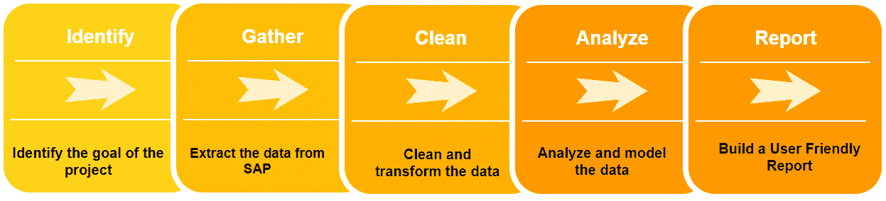

###### 图 7-1\. 用于分段客户数据的流程图

# 理解聚类和分段

在我们能够对客户进行分段之前，我们需要了解几种不同的聚类和分段技术。有许多不同的聚类技术，但我们将重点关注：

+   最近性、频率和货币价值（RFM）方法

+   *k*-均值聚类

+   *k*-中心或围绕中心（PAM）聚类

+   分层聚类

+   时间序列聚类

## RFM

RFM 是一种仅基于客户购买历史评估客户的聚类方法。情景非常直接。客户根据以下三个因素进行评估：

最近性

上次购买是什么时候？

频率

他们在给定时间段内购买了多少次？

货币价值

在这个时间段内的购买总金额是多少？

一旦这些问题得到解答，客户就会为每个因素分配一个值，通常是前 20%为 5 分，接下来的 20%为 4 分，依此类推。一旦他们在每个类别中得到了值，我们可以根据这些值对客户进行聚类。这些是个体的 RFM *值*。这些值被组合（连接）成 RFM *分数*。例如，如果客户的最近性为 5，频率为 4，货币价值为 3，他们的 RFM 分数将是 543。

然后将这些客户放入一个类别中，可以采取行动（即在分段过程中），如表 7-1 所示。这可以是非常细粒度或更一般化的方法；在[Putler 网站](https://www.putler.com/rfm-analysis)上有详细的选项列表。

表 7-1\. RFM 客户段特征

| 客户段 | 因素 | 特征 |
| --- | --- | --- |
| 冠军 | R - 高 | 最近购买 |
|  | F - 高 | 经常购买 |
|  | M - 高 | 花费最多 |
| 潜在冠军 | R - 高 | 最近购买 |
|  | F - 中等 | 不经常 |
|  | M - 高 | 花费很多 |
| 中等路线 | R - 中至高 | 较近期购买 |
|  | F - 中至高 | 有一定频率 |
|  | M - Medium | Spend a medium amount |
| Almost Inactive | R - Low to Medium | Haven’t bought in a while |
|  | F - Medium | Had some frequency |
|  | M - Low to Medium | Spent a medium to low amount |
| Inactive | R - Low | No recent activity |
|  | F - Low | Not much if any frequency |
|  | M - Low | Not spending much |
| One-Timers | R - Anything | Any time frame recently |
|  | F - Low | Not much if any frequency |
|  | M - Anything | Any monetary value |
| Penny Pinchers | R - Anything | Any time frame recently |
|  | F - Anything | Any type of frequency |
|  | M - Low | Low monetary value |

企业对于他们认为的*高*、*中*和*低*可能有不同的定义。对于我们的目的，我们将高定义为 4 到 5，中定义为 2 到 3，低定义为 1。

## 帕累托原则

许多最终用于客户分割的聚类和评估技术都基于*帕累托原则*，这在 图 7-2 中有所总结。


###### 图 7-2\. 帕累托原则

此原则表明，Big Bonanza Warehouse 的销售的 80%来自于仅有的 20%客户。对于我们的转换任务，这意味着我们要确保这些关键客户被转化为新系统。

## k-Means

*k*-means 是一种聚类算法，它将数值聚集在几何中心周围。使用 *k*-means 时，您需要定义要使用的聚类数。选择聚类数的过程既直观（您可能了解您的数据，并且知道您需要多少个聚类或组），也是实验性的。我们还将在本章后面探讨自动找到最优聚类的方法。现在，让我们选择三个聚类。该算法随机初始化三个称为质心的点。然后，它遍历每个数据点（也许是我们客户的 RFM 分数），并将它们分配给最近的质心。然后算法再次关注质心，并将它们移动到所有分配给它的点的平均距离处。这个过程重复进行，直到质心停止移动。如果质心较少，*k*-means 的计算速度很快。一个示例过程可能看起来像图 7-3 到图 7-6。

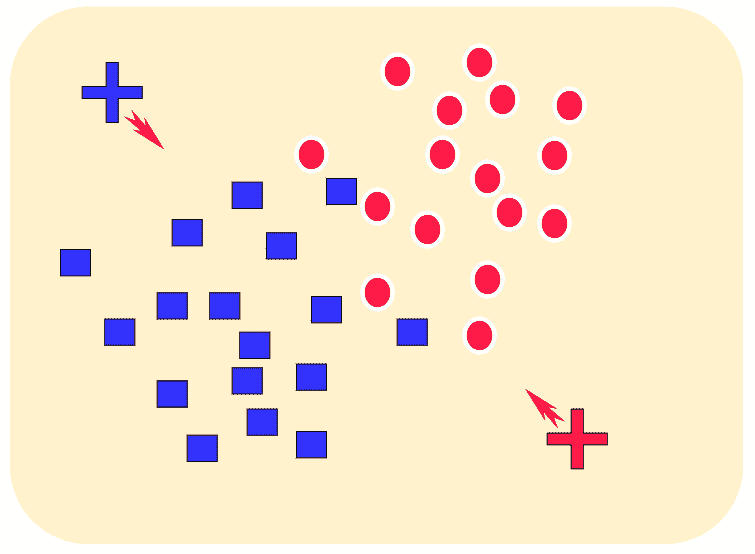

###### 图 7-3\. k-means 第 1 步 — 随机质心初始化

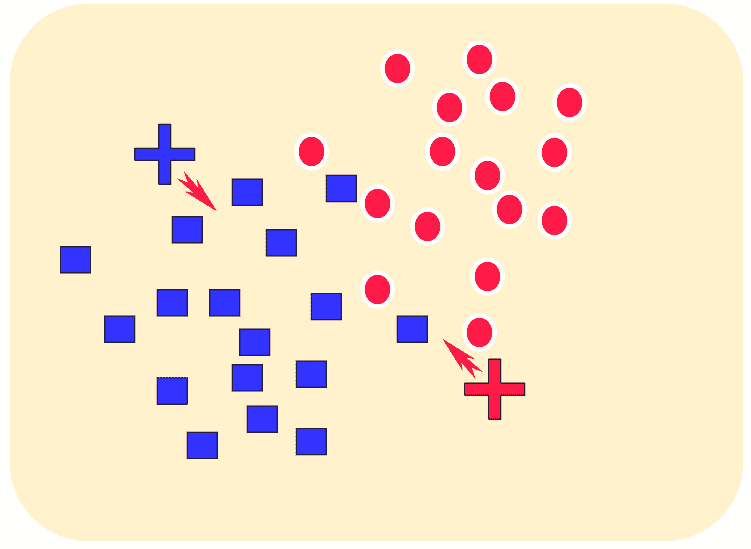

###### 图 7-4\. k-means 第 2 步 — 通过平均距离移动质心

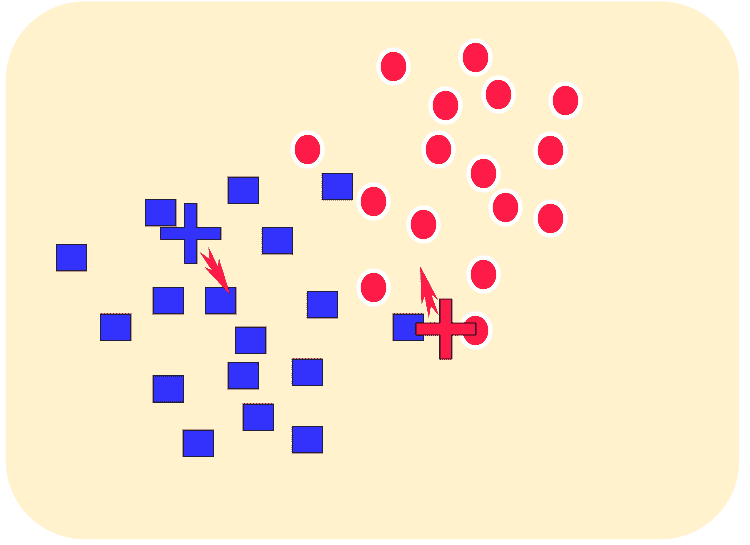

###### 图 7-5\. k-means 第 3 步 — 继续通过平均距离移动质心

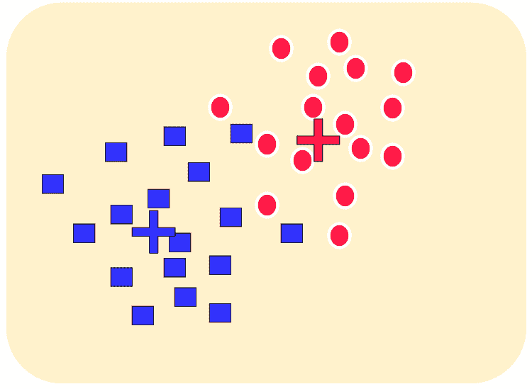

###### 图 7-6\. k-means 的最终位置 - 质心平均距离收敛

## k-Medoid

*k*-medoid 是一种数据分区算法，类似于 *k*-means，不同之处在于 *k*-means 最小化质心距离的总平方误差，而 *k*-medoid 最小化不相似性的总和。这使得它在处理噪声和离群值时比 *k*-means 更为健壮。*k*-m 的最常见实现是 PAM 算法。其步骤与上述 *k*-means 的步骤类似。

###### 小贴士

简单地说，*k*-means 使用平均值，而 *k*-medoid 使用中位数。

## 分层聚类

分层聚类使用一种从下至上构建层次结构的技术。它不需要预先指定簇的数量。分层聚类有两种类型：凝聚式和分裂式。我们在 第二章 中介绍了这些概念。简要回顾一下，凝聚式聚类首先将每个点放入自己的簇中。在我们的示例中，每个客户将是一个簇。然后它标识最接近的两个簇并将它们合并成一个。它重复此过程直到每个数据点都在一个簇中。分裂式聚类则相反。我们所有的客户都放入一个簇中。该簇递归地分裂，直到所有客户都在各自的单独簇中。

有不同的连接类型可用于确定数据点配对成簇的方式。最常见的两种是完全连接和平均连接：

完全连接

找到属于两个不同簇的两点之间的最大可能距离。

平均连接

找到属于两个不同簇的点的所有可能成对距离，然后取平均值。

随着类别向上移动，这些聚类区域变得更宽更可辨，如 图 7-7 所示。分层聚类的图称为 *树状图*。

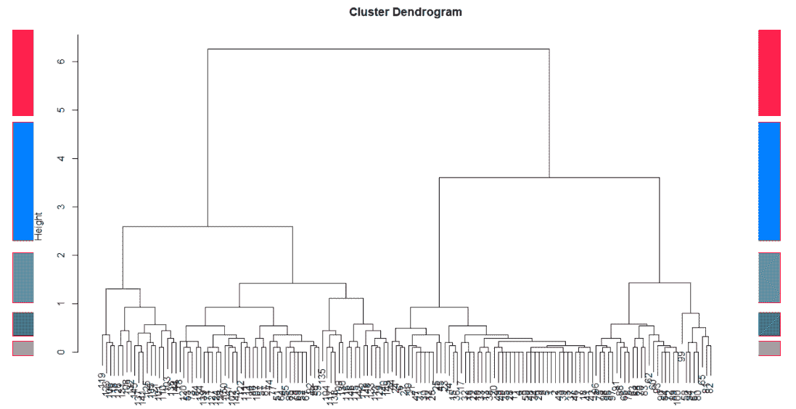

###### 图 7-7\. 聚类树状图（y 轴上的彩色条代表聚类的层级）

## 时间序列聚类

时间序列聚类不是我们进行客户分割的方法之一，因为它需要比常规聚类更多的计算能力和数据。然而，它是一种引人入胜的聚类类型，我们想提一下。时间序列聚类根据数据随时间变化的行为创建聚类。例如，考虑我们的情景，我们可能有一些客户在不活跃之前表现出特定的行为。他们过去的购买频率高，逐渐减少，货币价值也减少。也许我们有额外的数据，我们可以看到这些客户退货增加（因此感到沮丧）。通过对时间上的这种模式进行聚类，我们可以看到当前的客户，表现出相同的模式并属于同一聚类，尚未变得不活跃。特别是市场营销部门对了解这些客户以防止流失非常感兴趣。

###### 提示

有一个非常强大和出色的 R 包[*TSclust*](http://www.jstatsoft.org/v62/i01/paper)专门用于时间序列聚类。时间序列的层次聚类不仅有用，而且非常有趣。

# 第 1 步：收集数据

我们已经探索了多种从 SAP 中提取数据的方式。这次我们将使用核心数据服务（CDS）视图。在第三章中，我们详细介绍了为销售数据定义 CDS 视图的过程。这正是我们将在这里使用的确切 CDS 视图，所以确保熟悉第三章！

# 第 2 步：清理数据

一旦我们从 SAP 下载了数据，我们就需要清理它。到目前为止，我们已经为每一章节做到了这一点，你可能还记得在介绍中提到过 SAP 的数据是干净的！这里有一些看法：如果你是一名数据科学家，你会同意这份数据非常干净。数据科学家经常处理非常不干净的数据。例如，我们最近使用的来自[FDA 的橙皮书](http://bit.ly/2lSCKZm)的数据有一个特别有趣的“治疗类别”栏目。这些类别可以有多个类别。如果有多个类别，它们会被添加到字段中。你永远不知道一个字段中会有多少类别，有时可能是一个类别，有时可能是十几个类别。要从这一列中获取数据，你需要拆分、堆叠、整理一些正则表达式（regex）工作，但还不够。我们用这个作为一个例子，展示一个脏列看起来会是什么样子，这并不是每天清理数据的复杂例子。从这个角度来看，SAP 的数据确实是闪闪发光的。

尽管如此，我们闪闪发光的数据仍然需要一些光泽。首先让我们加载我们接下来需要用到的库：

```
library(tidyverse)
library(cluster)
library(factoextra)
library(DT)
library(ggplot2)
library(car)
library(rgl)
library(httr)
```

[`R 中的 httr 库`](http://bit.ly/2k0DsTW) 使直接从我们的 CDS 视图中提取数据变得容易。第一步是识别 URL（请参考 “Core Data Services” 进行复习）。

```
url <- 'http:/<host>:<port>/sap/opu/odata/sap/ZBD_DD_SALES_CDS/ZBD_DD_SALES'
```

下一步很简单，只需调用服务并使用您的 SAP 凭证进行身份验证：

```
r <- GET(`url`, authenticate("[YOUR_USER_ID]", "[PASSWORD]", "basic"))
```

`r` 对象是一个 *response* 对象。它包含有关 HTTP 响应的详细信息，包括内容。使用以下命令访问内容：

```
customers <- content(`r`)
```

`customers` 对象是一个大列表。在我们继续之前，我们需要将其转换为更友好的格式。首先，我们将以这种方式提取列表的结果：

```
customers <- customers$d$results
```

我们仍然有一个列表，但它只是我们调用的结果列表，不包括 HTTP 的详细信息。我们可以使用 [`do.call` 命令](http://bit.ly/2lxahIr) 将该列表转换为数据框架，并将所有行绑定在一起：

```
customers <- do.call(rbind, customers)
```

###### 小贴士

花点时间了解 [`do.call`](https://www.rdocumentation.org/packages/base/versions/3.6.0/topics/do.call)。这个简单而不起眼的命令将成为您数据科学家工具箱中的一个常用工具。

最后，我们将我们的对象转换为数据框架：

```
customers <- as.data.frame(customers)
```

让我们来看看它。这一次，我们不再单独使用混乱的 `head` 函数，而是利用 [`DT` 库](https://rstudio.github.io/DT/)。以下是我们需要运行的命令（结果显示在 图 7-8 中）：

```
datatable(`head`(`customers`))
```

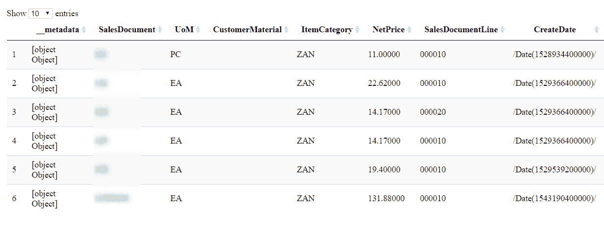

###### 图 7-8\. Datatables 视图（datatables 是来自 DT 库的格式化良好且可排序的数据框架）

正如我们已经做过几次一样，还有一些快速简单的清理工作要做 —— 摆脱一些额外的列、一些空白和一些我们不需要的列。我们还会删除 __metadata、CreateTime、CustomerMaterial、ItemCategory、DocumentType 和 DocumentCategory 列，因为它们对我们的分析没有必要：

```
customers$__metadata <- NULL
customers$CreateTime <- NULL
customers$Material <- trimws(tab$Material)
customers$DocumentType <- NULL
customers$CustomerMaterial <- NULL
customers$ItemCategory <- NULL
customers$DocumentCategory <- NULL
```

我们注意到日期以 Unix 格式传输。我们将以与我们在 第六章 中修复的方式修复它：

```
#Remove all nonnumeric from the date column
customers$CreateDate <- gsub("[⁰-9]", "", customers$CreateDate)

#Convert the unix time to a regular date time using the anytime library
library(anytime)

#First trim the whitespace
customers$CreateDate <- trimws(customers$CreateDate)

#Remove the final three numbers
customers$CreateDate <- gsub('.{3}$', '', customers$CreateDate)

#Convert the field to numeric
customers$CreateDate <- as.numeric(customers$CreateDate)

#Convert the unix time to a readable time
customers$CreateDate <- anydate(customers$CreateDate)

detach(package:anytime)
```

我们在预览数据时还注意到一些计量单位（UoM）为空白。计量单位是 SAP 中重要且复杂的主数据概念。如果我们的交易数据缺少 UoM，这表明我们不知道实际数量。例如，如果我们有 10 个数量但没有 UoM，那么我们是有 10 个每个还是 10 个箱子，每个箱子里有 12 个？如果缺少 UoM，则应排除这些条目：

```
customers <- customers[customers$UoM != '',]
```

让我们也确保字段类型适当：日期是日期，整数是整数，等等。我们还将清除出现在某些列中的空白：

```
#The price has commas - remove 'em
customers$NetPrice <- gsub(',', '', customers$NetPrice)

#The price should be converted to a numeric
customers$NetPrice <- as.numeric(customers$NetPrice)

#There are commas in the quantity, take them out.
customers$Quantity <- gsub(',', '', customers$Quantity)

#The quantity should also be numeric
customers$Quantity <- as.numeric(customers$Quantity)

#The date should be in a standard date format. It is currently MM/DD/YYYY.
customers$CreateDate<- as.Date(customers$Created.on, '%m/%d/%Y')

#trim the whitespace out of the unit of measure.
customers$UoM <- trimws(customers$UoM)
```

现在我们有了一个客户及其销售数据的数据框。让我们思考一下我们的任务。我们想要识别每位*客户*的特征，因此我们的数据框应该对每位客户有唯一的行。目前，我们拥有每位客户的所有销售数据。因此，我们的关键不是*客户*；而是*订单*。让我们更改这一点，并创建一个以每位客户的 RFM 值为基础的数据框，作为所有其他分析的依据。

首先，我们将处理最近性。为此，在数据框中创建一个新条目，表示自销售以来的天数：

```
#get the number of days since the last purchase
customers$last_purchase <- Sys.Date() - customers$CreateDate
```

记得那篇重要的统计论文，题为[“数据分析的分割-应用-组合策略”](http://bit.ly/2lvfPTO)，在第六章中引用过吗？我们将在这里使用相同的技术。我们想要一个客户的最近购买数据框。我们使用聚合函数并取最小值来实现这一点。我们正在*分割*主数据框以聚合它，并*应用*最小函数：

```
#create a dataframe of most recent orders by customer.
recent <- aggregate(last_purchase ~ Customer, data=customers, FUN=min, na.rm=TRUE)
```

以真正的*组合*方式将它们重新放在一起，这将创建一个按客户最近购买排序的列：

```
#Merge the recent back to the original
customers <- merge(customers, recent, by='Customer', all=TRUE, sort=TRUE)
names(customers)[names(customers)=="last_purchase.y"] <- "most_recent_order_days"
#What we have now is the most_recent_order_days in our original dataframe
```

接下来，我们将处理频率，按照与我们对最近性的处理相同的理论进行。创建一个通过按销售文档和客户聚合数据来计算订单数量的数据框。在 R 中进行计数是通过问“长度是多少？”来进行的。因为我们在单个订单上有多行，并且我们想要计算订单而不是行数，所以我们说“唯一长度是多少？”或者“订单上有多少行？”

```
#create a seperate dataframe of the count of orders for a customer
order_count <- aggregate(SalesDocument ~ Customer, data=customers, 
  function(x) length(unique(x)))
```

再次将新分割的数据框添加回原始数据，以留下分配给客户的订单计数列：

```
#Merge the order_count back
customers <- merge(customers, order_count, by='Customer', all=TRUE, sort=TRUE)

#Rename the field to be nice
names(customers)[names(customers)=='SalesDocument.y'] <- 'count_total_orders'
```

最后，我们将处理客户的货币价值。在我们的数据框中，有价格和数量的列。将它们相乘以获得每行的价值：

```
#calculate order values. Get per line then aggregate.
customers$order_value <- customers$Quantity * customers$NetPrice
```

再次以真正的*分割-应用-组合*方式，对每位客户的所有行进行聚合：

```
#Split off the aggregated value per customer.
total_value <- aggregate(order_value ~ Customer, data=customers, FUN=sum, 
                            na.rm = TRUE)
```

重复此过程，将新分割的数据框合并回原始数据。

```
`#Merge the total_value back`
customers <- merge(customers, total_value, by='Customer', all=TRUE)

`#nicify  the name`
names(customers)[names(customers)=='order_value.y'] <- 'total_purchase_value'
```

###### 提示

所有这些分割出来的数据框现在已经没有用了。为了保持工作区的整洁并释放一些内存，使用这个简单的命令将它们删除：

```
rm(recent, order_count, total_value)
```

在所有这些分割和组合之后，我们需要清理一下主数据框。我们要确保每一行都是唯一的。当比较所有字段时，不应该有重复的行。毕竟，没有订单号和行号应该是多行相同的：

```
customers <- customers[!duplicated(customers), ]
```

我们还要确保没有空白的客户值。我们正在识别客户及其 RFM 值，所以显然空白的客户没有用处。不应该有空白值，但是双重检查是个好习惯：

```
customers <- na.omit(customers)
```

我们需要的是一个包含四个关键值的数据框：`customer number`、`most_recent_order_days`、`count_total_orders` 和 `total_purchase_value`。使用 `colnames` 函数查看列名和位置。

```
colnames(customers)
 [1] "Sold.To.Pt"            "Sales.Doc..x"          "Created.on"            "Name.1"
 [5] "City"                  "Rg"                    "PostalCode"            "Material"
 [9] "Matl.Group"            "Order.Quantity"        "SU"                    "Net.Price"
[13] "Material.description"  "last_purchase.x"       "most_recent_order_days" "count_total_orders"
[17] "order_value.x"         "total_purchase_value"
```

我们只想要第 1、15、16 和 18 列。其他列现在不再需要，它们只是用来创建 RFM 值。我们只需按客户切片得到这些 RFM 值的数据框即可：

```
#slice off the required columns
customer <- customers[, c(1, 15, 16, 18)]
```

现在当我们查看数据框时，我们只看到了我们想要的列。但是，在这一点上我们也注意到我们有重复的行：

```
> head(customer)
 Sold.To.Pt most_recent_order_days count_total_orders total_purchase_value
1      1018                  153                  1            37734.08
2      1035                  138                  1               89.85
3      1082                  143                  1            36181.46
4      1082                  143                  1            36181.46
5      1082                  143                  1            36181.46
6      1082                  143                  1            36181.46
```

使用`!duplicated`命令删除重复的行：

```
#remove customer duplicates
customer <- customer[!duplicated(customer$Customer),]
```

如何才能按我们需要的方式对它们进行排名呢？这看起来像是一项艰巨的任务。不过，用 R 的话就简单了！我们只需从`customer`创建一个新的数据框。创建一个名为`R`的列，这是基于`most_recent_order_days`的变化值。该变化是基于 5 来创建百分比排名。也就是说，把前 20%放在 5 中，接下来的 20%放在 4 中，依此类推。对`count_total_orders`和`total_purchase_value`重复此过程。

```
#Now that we have a value for each of our customers, we can create an RFM
customer_rfm <- customer %>%
  mutate(R = ntile(desc(most_recent_order_days), 5),
         F = ntile(count_total_orders, 5),
         M = ntile(total_purchase_value, 5))
```

现在我们有了 R、F 和 M 值，我们可以把客户列转换为索引并清理我们的工作空间：

```
#make the customer the row names
row.names(customer_rfm) <- customer$Customer

#ditch customer because it is an index
customer_rfm$Customer <- NULL

#clean up the workspace and free memory
rm(customer, customers)
```

曾经有人抱怨他们因为电脑崩溃而丢失了所有工作吗？“我已经在那上面工作了四个小时，现在全都丢了！”嗯，我们也可能遇到这种情况，所以让我们创建一个可以轻松读取的小输出，如果需要从这一点继续工作：

```
#We now have a clean file with customers and their RFM values.
#(recency, frequency, monetary value)
#To save time in the future, we will write this to a csv.
write.csv(customer_rfm, 'D:/Data/customer_rfm.csv')
```

# 第三步：分析数据

经过这些简单的步骤，数据就准备好分析了。我们将使用六种不同的技术进行分析。这可能有些多余，但可以说明数据分析的不同方式。这些方法包括：

+   帕累托原理

+   *k*-means 聚类

+   *k*-medoid 聚类

+   分层聚类

+   手动聚类

## 重新审视帕累托原理

记住帕累托原理表明我们销售额的 80%由我们客户的 20%决定。我们的数据离这个原理有多接近？事实上，我们如何确定哪些客户贡献了 80%的销售额？让我们把这个概念分解成小组件：

1.  计算销售额 80%的截止点是多少。

1.  按最大货币值到最小货币值对数据框进行排序。

1.  创建一个列，其值为货币价值的累计和。也就是说，它会逐行相加。

1.  如果累计总和小于截止点，则将每个客户标记为“前 20”，如果大于截止点，则标记为“后 80”。

1.  计算每个组中客户的百分比。

1.  解释研究结果。

计算销售额的 80%非常简单：

```
#first question is what is 80% of the total sales?
p_80 <- 0.8 * sum(customer_rfm$total_purchase_value)
```

然后，我们将数据框按最大到最小的货币值排序：

```
#First step is to order the dataframe by monetary value.
customer_rfm <- customer_rfm[order(-customer_rfm$total_purchase_value),]
```

添加一个列到数据框中，该列是货币值的滚动总和：

```
customer_rfm$pareto <- cumsum(customer_rfm$total_purchase_value)
```

在截止点之前和之后标记客户：

```
customer_rfm$pareto_text <- ifelse(customer_rfm$pareto <= p_80,
                                   'Top 20', 'Bottom 80')
```

使用[`prop.table`](http://bit.ly/2ksaXhY)计算百分比。

```
prop.table(table(customer_rfm$pareto_text))*100
Bottom 80  Top 20
94.090016  5.909984
```

根据我们的计算，大约前 6% 的客户贡献了 80% 的销售额。这听起来与帕累托原理相差甚远，直到考虑到大宝狂购物广场有很多客户。然而，他们也有分销商和经销商。正是这些分销商和经销商驱动了绝大部分的销售。乍一看，数据中的这个特征似乎不是很有用。直到你仔细思考。大宝狂购物广场在美国各地都有商店和分销中心。分销商和经销商从分销中心而非商店获取产品。如果必须做出关闭分销中心或商店的决定，选择显而易见：关闭商店。

## 寻找最佳聚类

对于 *k*-means 和 *k*-medoid 聚类，我们需要手动选择最佳的聚类数。这个过程既是艺术也是科学。然而，有一些工具可以帮助我们选择最佳的聚类数。R 库 [`factoextra`](http://bit.ly/2lzUTuM) 提供了一个名为 `fviz_nbclust` 的方法，可以帮助找到并可视化最佳的聚类数。在我们开始 *k*-means 和 *k*-medoid 聚类之前，我们希望进行这个步骤。在这种方法中，有三个可能的选项：

肘部法

最小化聚类内平方和（wss）。wss 的总和衡量了聚类的紧凑程度。理论上，这应该尽可能小。它被称为“肘部法”，因为图表中有一个肘部，在这里增加聚类数不再对最小化 wss 有太大的贡献。

平均轮廓方法

评估每个点落入聚类的情况。较高的值表示良好的聚类效果。它通过测量聚类之间的平均距离来实现这一点。

间隙统计方法

评估总的聚类内变异。当间隙统计量被最大化时，进一步的聚类不会对值有太大的贡献。

我们将使用每一种方法，然后决定使用哪一种或哪些方法的组合。我们的数据框架有超过 25 万行数据，对于这些统计方法来说太多了。我们可以通过取足够数量的数据的代表性样本来处理这个问题，以确保分布类似。因为我们希望在采样中具有可重现性，所以我们需要设置一个种子。否则，每次运行此步骤时，随机性可能导致稍有不同的结果。我们也只希望对我们正在聚类的 RFM 值进行分析：

```
#Set a seed for reproducibility
set.seed(12345)
#Take only the R, F and M values from the dataframe, in columns 4,5,6
customer_rfm_sample <- customer_rfm[, c(4,5,6)]
#Take a sample using sample_n from dplyr library (in tidyverse)
customer_rfm_sample <- sample_n(customer_rfm_sample, 1000)
```

这些聚类算法在数据被归一化后运行效果更好。我们将对每个特征进行对数转换：

```
#Log transform the data
customer_rfm_sample$R <- log(customer_rfm_sample$R)
customer_rfm_sample$F <- log(customer_rfm_sample$F)
customer_rfm_sample$M <- log(customer_rfm_sample$M)
```

现在我们使用 `fviz_nbclust` 来优化和可视化我们的不同方法。首先将展示肘部法的图示（显示在 Figure 7-9 中）。

```
#Finding the optimal number of clusters
 fviz_nbclust(customer_rfm_sample, kmeans, method="wss")
```

其次是使用轮廓方法可视化最佳聚类数（结果显示在 Figure 7-10 中）：

```
fviz_nbclust(customer_rfm_sample, kmeans, method="silhouette")
```

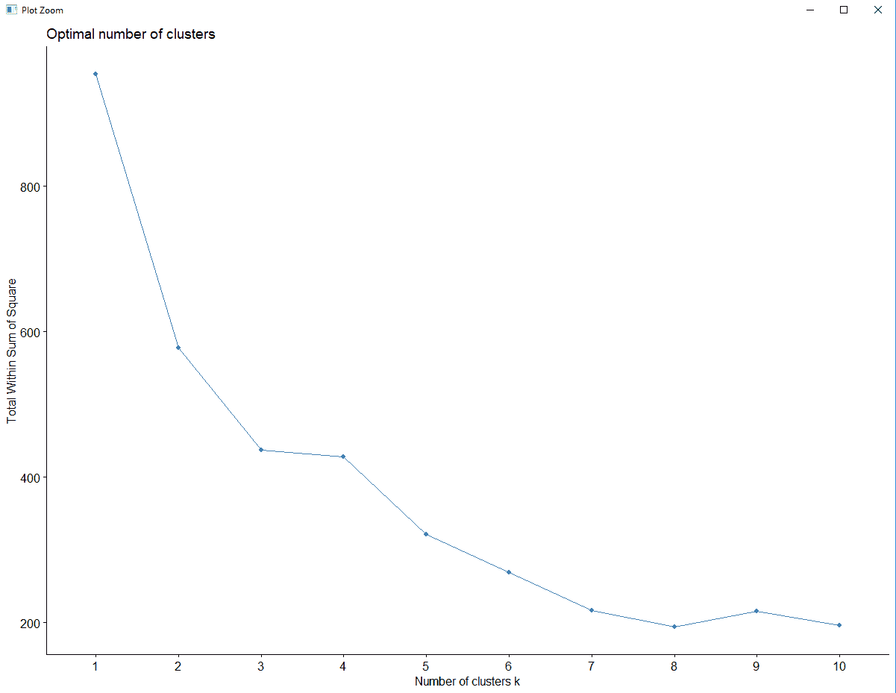

###### 图 7-9\. Elbow 方法的最佳聚类数

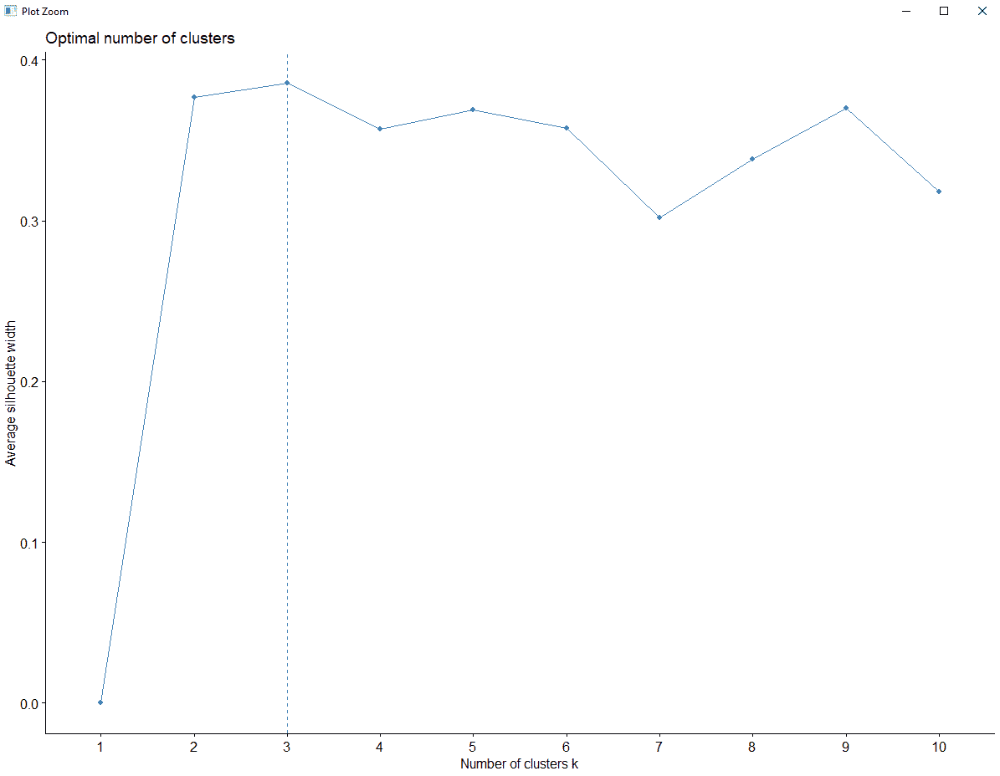

###### 图 7-10\. Silhouette 方法的最佳聚类数

最后，我们将使用间隔统计法（结果显示在图 7-11 中）：

```
fviz_nbclust(customer_rfm_sample, kmeans, method="gap_stat")
```

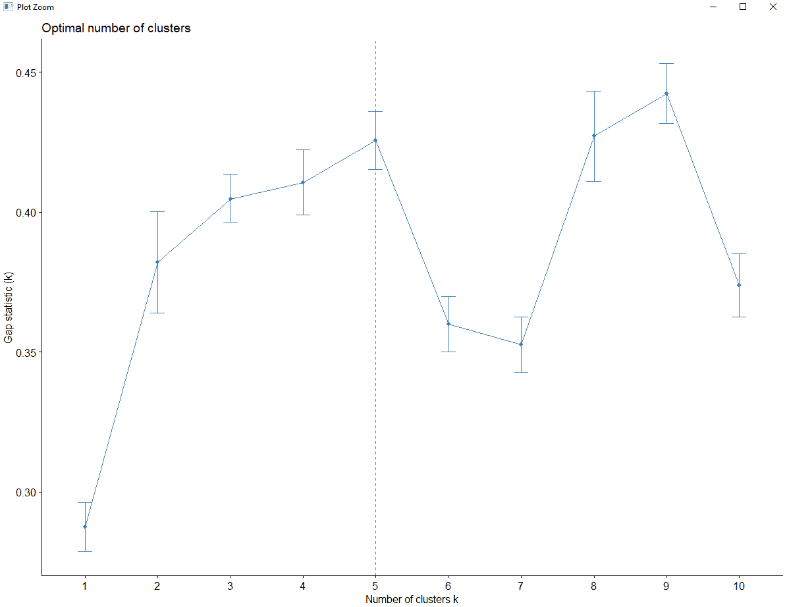

###### 图 7-11\. 使用间隔统计法确定的最佳聚类数

每种方法都有不同的结果。Elbow 方法的图表没有明显的“拐点”。当我们看它时，看起来拐点可能在 5、6 或 7 点。轮廓方法清楚地显示出聚类之间的平均距离在 3 点处达到峰值。间隔统计法也清楚地显示出最佳聚类数为 5。我们了解我们的数据，我们对五个聚类感到满意。我们觉得三个聚类太小了。五个聚类将与我们绘制的三种方法中的两种达成一致。

## K 均值聚类

一旦数据格式化并确定了聚类数，执行*k*-means 就很容易。第一步是设置聚类数目：

```
#Identify the number of clusters
 number_of_clusters <- 5
```

然后我们创建一个包含我们原始值的数据框（不是 RFM 值，而是来自客户的实际值）：

```
cust <- customer_rfm[, c(1,2,3)]
```

因为我们的数据不服从正态分布，所以我们希望对这些值进行标准化。如果不进行标准化，我们做的图表会被压缩，不够清晰。有许多不同的方法可以用来标准化数据（先前我们使用了最小-最大缩放）。在这个例子中，我们将使用[对数变换](http://bit.ly/2lxpPMj)：

```
cust$most_recent_order_days <- log(cust$most_recent_order_days)
cust$count_total_orders <- log(cust$count_total_orders)
cust$total_purchase_value <- log(cust$total_purchase_value)
```

现在我们简单地使用[`k-means`](http://bit.ly/2lszdkl)方法。我们输入我们创建的数据框、聚类数以及应该运行该过程的次数。默认情况下，`k-means`随机初始化其起始点（或初始位置）。因此，有时它的开始可能不佳，无法很好地进行聚类。有一种简单的方法可以克服这一问题。只需多次运行`k-means`。每次都开始得很糟糕是极不可能的。可以使用`nstart`参数来指定运行次数：

```
#Perform the kmeans calculation on our
km <- kmeans(cust, centers = number_of_clusters, nstart = 20)
```

`km`是一个带有聚类和其他与聚类相关的属性的结构，如图 7-12 所示。对于我们的目的，我们只对聚类属性感兴趣。

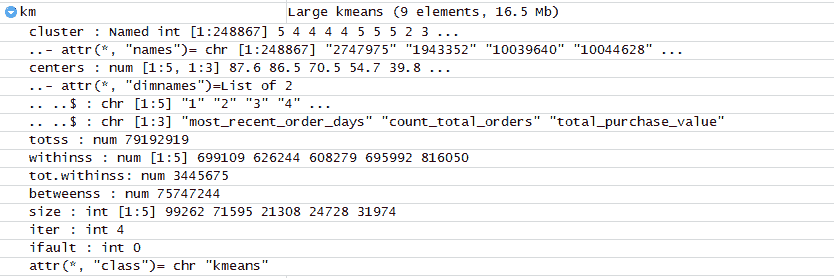

###### 图 7-12\. 大型 K 均值结构

我们希望创建一个包含客户详细信息和来自`km`的聚类的新数据框。这些聚类需要是因子：

```
viz <- data.frame(cust, cluster=factor(km$cluster))
```

现在我们准备绘制图表。我们的第一张图将是货币价值和最近性的简单`ggplot`图（结果显示在图 7-13 中）：

```
ggplot(viz, aes(x=most_recent
_order_days, y=total_purchase_value, 
color=cluster)) + geom_point()
```

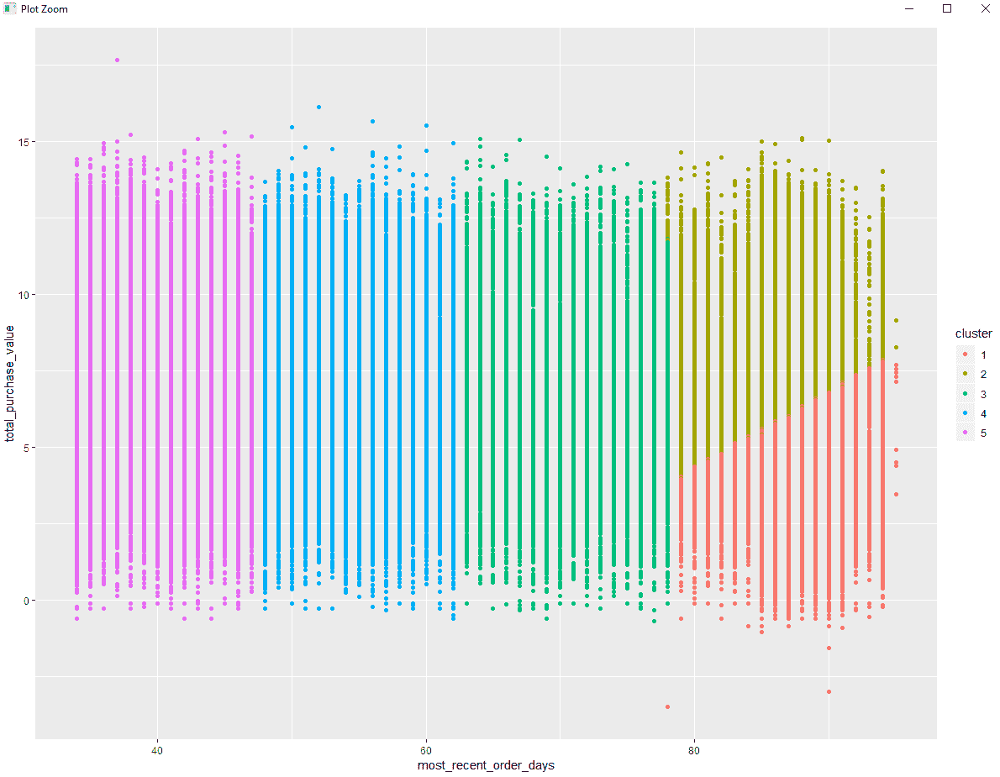

###### 图 7-13\. 按最近性和货币价值对客户数据进行的 K 均值聚类

这并不是对我们群集的一个很令人满意的表示。虽然我们可以看到按颜色清晰聚集的最近性和货币价值的值，但我们看不到它们与频率的关系。如果我们尝试更改此图表，绘制最近性和频率，然后按订单值大小调整点的大小，我们将对点应用 alpha 值，因为它们太多了，这样可以让我们看到它们何时混合在一起（结果显示在 图 7-14 中）：

```
ggplot(viz, aes(x=most_recent_order_days,
               y=count_total_orders,
               size=total_purchase_value,
               color=cluster)) +
geom_point(alpha=.05)
```

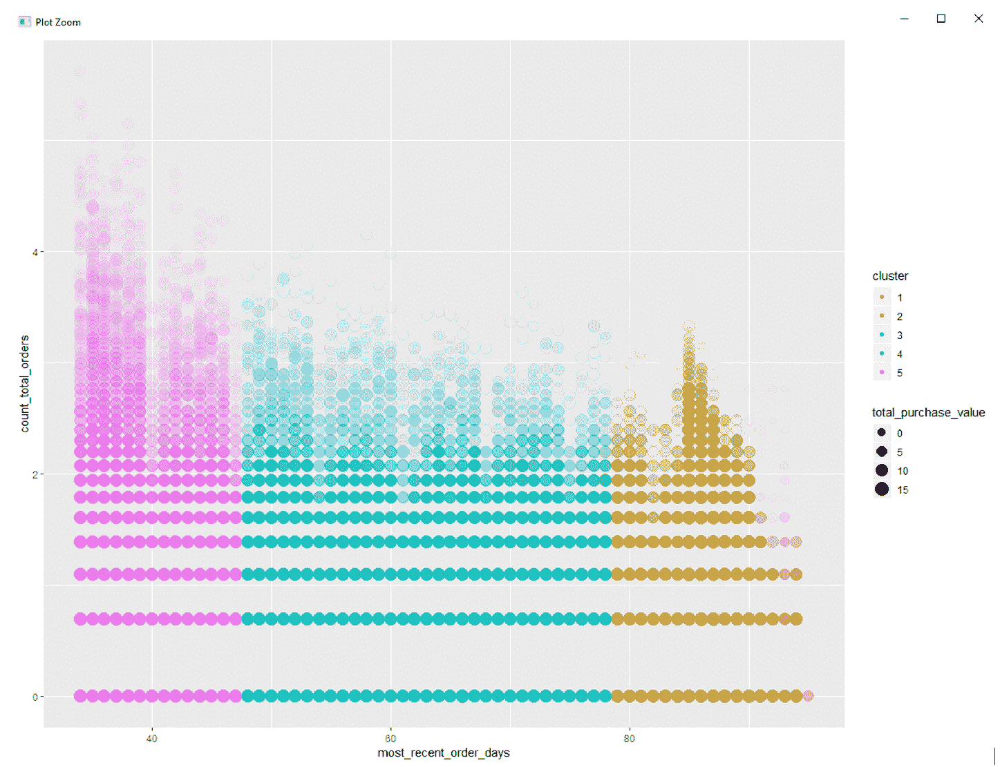

###### 图 7-14\. 客户数据的按最近性、频率和货币价值 k-means 聚类

再次，这并不是非常令人满意。当我们在二维平面上绘制超过两个变量时，结果可能令人失望。幸运的是，在 R 中有方法创建三维图表。我们将使用 [`car`](http://bit.ly/2kg2ChA) 和 `rgl` 库来实现这一点（结果显示在 图 7-15 中）：

```
#create a color scheme for our chart
 colors <- c('red', 'blue', 'orange', 'darkorchid4', 'pink1')

scatter3d(x = viz$count_total_orders,
          y = viz$total_purchase_value,
          z = viz$most_recent_order_days,
          groups = viz$cluster,
          xlab = "Log of Frequency",
          ylab = "Log of Monetary Value",
          zlab = "Log of Recency",
          surface.col = colors,
          axis.scales = FALSE,
          surface = TRUE,
          fit = "smooth",
          ellipsoid = TRUE,
          grid = TRUE,
          axis.col = c("black", "black", "black"))
```

###### 注意

你可能需要将 `difftime` 属性的最近值更改为数值。要执行此操作，请执行以下命令：

```
viz$most_recent_order_days <- as.numeric(viz$most_recent
_order_days)
```

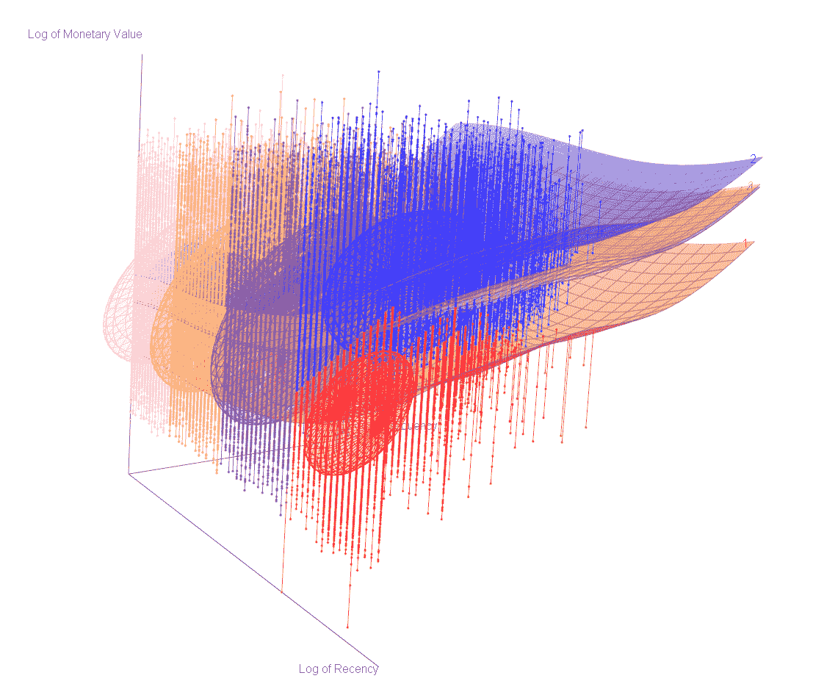

###### 图 7-15\. 客户数据的三维 k-means 聚类

这是对我们在 *k*-means 中群集的一个更令人满意的表示，并且给我们一个关于我们的客户如何分成五个群集的好主意。您可以看到图表的右上角有一组群集，代表我们最近、最频繁和最高货币价值的客户。同样，在图表的左下角，我们看到最不频繁、最不新鲜和最低货币价值的群集。

接下来，我们将使用 *k*-medoid 来以不同视角查看这些群集。

## k-Medoid 聚类

*k*-medoid 与 *k*-means 类似，但 *k*-means 使用平均距离创建群集，而 *k*-medoid 使用中位数。这使得 *k*-medoid 对噪声和异常值不太敏感。正如我们前面讨论的那样，最常见的 *k*-medoid 聚类方法是 PAM 算法。

在我们对 *k*-means 的工作中，我们有一个名为 `cust` 的数据框，其中包含 `most_recent_order_days`、`count_total_orders` 和 `total_purchase_value` 的标度化（对数）值。这也是 PAM 所需的格式。`pam` 函数本身限制为 65,536 条观测值，因此首先需要进行抽样（在估算群集数量时我们已经完成了这一步）：

```
cust_sample <- sample_n(`cust`, 10000)
```

使用以下命令执行 PAM 聚类算法：

```
#First identify the number of clusters
number_of_clusters <- 5
#Execute PAM with euclidean distance and stand set to
#false as we've already standardized our observations
pam <- pam(cust_sample,
           number_of_clusters,
           metric = "euclidean",
           stand = FALSE)
```

PAM 对象由 `medoids` 和 `clustering` 组件组成。要查看这些结果，请使用以下命令：

```
head(pam$medoids)
          most_recent_order_days count_total_orders total_purchase_value
 2126695                4.406719          0.6931472             7.799405
 10041958               4.442651          0.0000000             2.618125
 10040360               4.454347          0.0000000             4.245634
 10043047               4.330733          0.6931472             6.116488
 2911968                4.174387          1.0986123            10.480677

head(pam$clustering)
 2382503 3048698 2843476 10055962 10079604   490487
       1        2        1        1        3        4
```

使用 `fviz_cluster` 方法也很容易可视化群集（结果显示在 图 7-16 中）：

```
	fviz_cluster(pam, geom='point',
                 show.clust.cent = TRUE,
                 ellipse = TRUE)
```

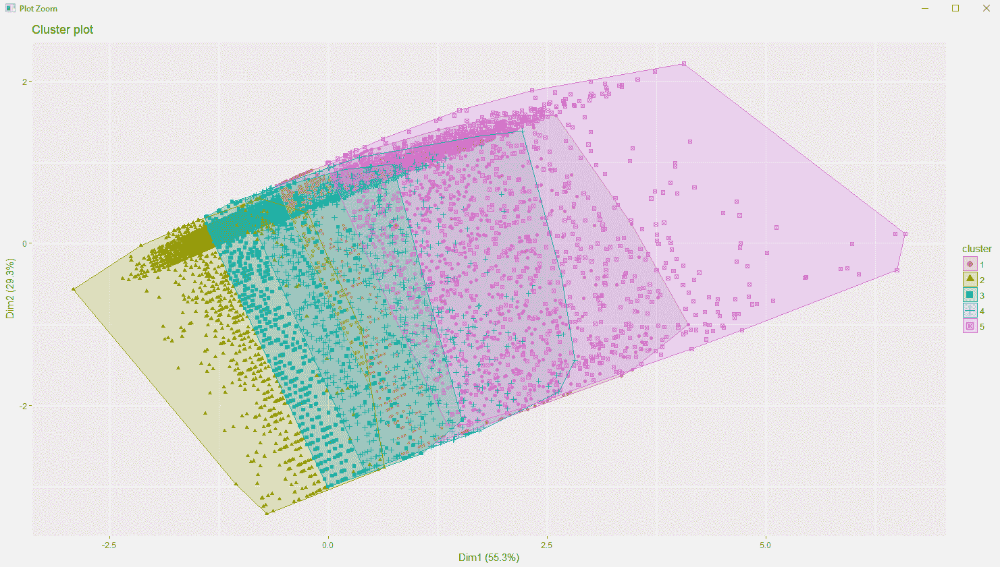

###### 图 7-16\. k-medoid PAM 聚类

###### 提示

`fpc`库中的`pamk()`是`pam`的一个包装器。它根据最优平均轮廓宽度打印建议的聚类数量。

五个聚类的*k*-中心点可视化给我们带来了对我们观察结果的新视角。在这种类型的聚类中存在大量重叠，这使我们认为使用该技术的最优聚类数量比我们选择的要少。作为一项调查，我们将尝试`pamk`函数，该函数可以为我们确定聚类的数量：²

```
	library(`fpc`)
    pamk <- pamk(`cust_sample`,
            metric = "euclidean",
            stand = FALSE)
```

接下来我们将再次使用三维可视化来查看 `pamk` 认为最优的聚类数（结果显示在 图 7-17 中）：

```
colors <- c('red',
           'blue',
           'orange',
           'darkorchid4',
           'pink1')

viz <- data.frame(cust_sample,
                  cluster=factor(pamk$pamobject$cluster))

scatter3d(x = viz$count_total_orders,
           y = viz$total_purchase_value,
           z = viz$most_recent_order_days,
           groups = viz$cluster,
           xlab = "Log of Frequency",
           ylab = "Log of Monetary Value",
           zlab = "Log of Recency",
           surface.col = colors,
           axis.scales = FALSE,
           surface = TRUE,
           fit = "smooth",
           ellipsoid = TRUE,
           grid = TRUE,
           axis.col = c("black", "black", "black"))
```

###### 注意

请记住，`pamk`函数使用轮廓方法确定最优的聚类数量。

这些结果非常有趣，应该值得停下来思考。使用最优平均轮廓法得出两个聚类。为什么？记得我们的客户群体中有分销商和经销商。早些时候，当我们应用帕累托法则时，我们看到很少一部分客户贡献了大部分销售额。我们推测这些是我们的分销商和经销商。在前面的图表中，上方的聚类很可能代表我们的分销商和经销商。下方的聚类很可能代表普通客户。SAP 业务分析师和数据科学家应该对这些结果提出质疑。这个可视化告诉了我们什么？我们认为这个可视化告诉我们，分销商和经销商正在扭曲聚类结果。我们可能希望重新开始这个过程，但这次排除分销商和经销商。

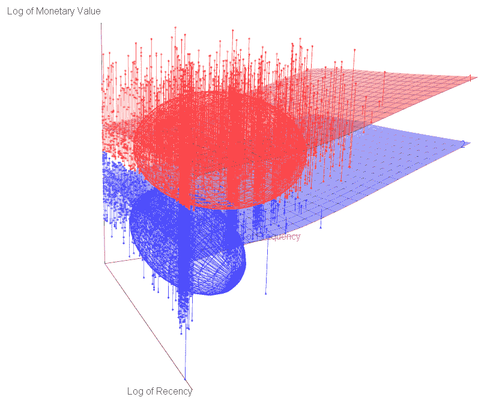

###### 图 7-17\. PAMK 聚类的可视化结果

###### 提示

如果你的 SAP 系统不区分分销商、经销商和普通客户，我们该如何排除分销商和经销商？我们使用`pamk`进行的聚类过程似乎做得相当好。保存下来自下层聚类的客户，然后重新对这个子集进行聚类过程。

接下来，我们将使用层次聚类来获得另一个视角。

## 层次聚类

正如我们讨论过的，层次聚类是识别观察结果中段的另一种方法。不像*k*-均值和*k*-中心点，它不要求确定聚类的数量。³

我们将执行每种类型的层次聚类中的一种。它们都有五个基本步骤：

+   将观察结果放入数据框中，其中每列是一个用于聚类的值。

+   缩放数据（我们将使用对数）。

+   计算出一个不相似性矩阵（距离）。

+   进行聚类。

+   显示结果。

我们的第一步是创建一个新的 RFM 数据框架。我们已经做过几次这个过程了：

```
cust <- customer_rfm[, c(4,5,6)]
```

现在我们将对我们的值应用对数：

```
cust$R <- log(cust$R)
cust$F <- log(cust$F)
cust$M <- log(cust$M)
```

像我们其他的机器学习聚类技术一样，我们限制了特定数量的观察结果，因此我们必须再次对我们的数据进行采样：

```
cust_sample <- sample_n(`cust`, 10000)
```

现在我们准备创建一个不相似度矩阵。我们将使用标准默认值应用它。`dist()`函数返回数据矩阵行之间计算出的距离。

```
d <- dist(`cust`)
```

###### 提示

要查看`dist`函数的参数和详细信息，请在控制台中输入`?dist`并按 Enter 键。文档将出现在 RStudio 的右侧面板中。如果这还不够，请尝试`??dist`以获得更多信息。

使用`hclust()`执行凝聚式分层聚类。或者，可以使用`agnes()`执行分裂式分层聚类。我们将在这里执行这两种方法：

```
#Agglomerative Hierarchical Clustering
hcl_a <- hclust(d)
#Divisive Hierarchical Clustering
hcl_d <- agnes(d)
```

使用`plot`命令可以轻松可视化我们的发现（凝聚式分层聚类的结果显示在图 7-18 中）：

```
#Plot Aggplomerative HC - hang the results a bit
#to line them up.
plot(hcl_a, cex = 0.6, hang = -1)
```

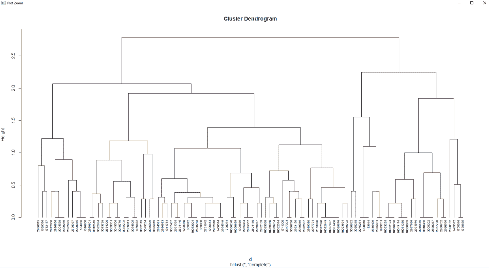

###### 图 7-18\. 凝聚式分层聚类图

对于分裂式分层聚类，我们也可以做同样的事情（结果显示在图 7-19 中）：

```
plot(hcl_d, hang = -1)
```

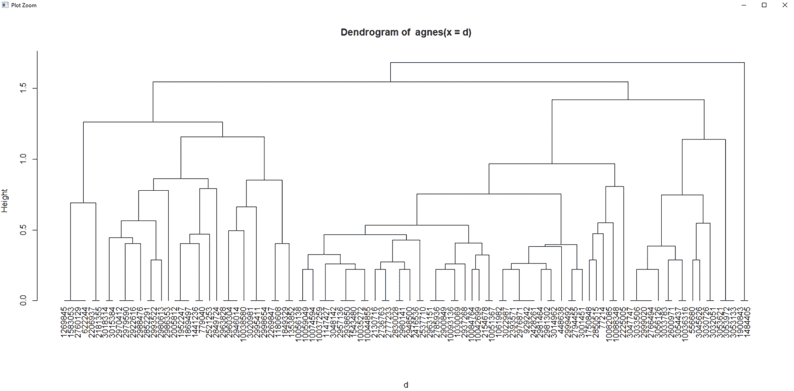

###### 图 7-19\. 分裂式分层聚类图

这两个树状图显示的都是相同的内容——基于他们的最近性、频率和货币价值对客户进行聚类。由于他们的技术不同，它们会形成略微不同的聚类。

就个人而言，我们认为我们的观察（客户）作为树状图的效果不佳。首先，为了获得准确和可读的可视化效果，我们不得不大幅度地进行采样，实际上可能太多，以至于无法维护我们的观察关系的完整性。然而，这里的目的是展示另一种类型的聚类。⁴

## 手动 RFM

对于我们的最终技术，我们将定义手动的桶，将我们的 RFM 分数划分到其中。这是一种手动对客户进行聚类的方法。这可能看起来很简单，但它确实有效，并且满足许多类型分析的要求。

###### 提示

有时最简单的工具是最好的。神经网络和机器学习算法的范围广泛且强大。诱人的是，我们会选择最耀眼的工具，试图让它适应我们的数据。特别是当涉及到受自然启发的算法时，我们会这样做。阅读出色的书籍[*Clever Algorithms*](http://bit.ly/2kpe2Q8)，你会尝试将蚁群优化应用于一切。我们现在发表这一评论，因为在这个练习中，我们只使用“if”语句……这可能是最不起眼的技术。

手动执行 RFM 的最困难部分是定义分类。什么构成*冠军*客户与*潜在冠军*客户的区别？Big Bonanza Warehouse 向个别客户提供大量产品，但他们也有分销商。与客户相比，分销商总是看起来像冠军。他们对 RFM 模型的定义将与没有分销商的公司的定义截然不同。这个业务过程需要您与营销和销售团队密切合作，以定义 RFM 分类。为了我们的目的，我们将完全按照表 7-1 中的定义来定义它们。代码是一个简单的`ifelse`语句嵌套：

```
#What about manual clustering? Why not? Don't overlook the simple for the #shiny. 
customer_rfm$segment <- ifelse(customer_rfm$R >= 4 &
                               customer_rfm$F >= 4 &
                               customer_rfm$M >= 4,
                               'Champion', '')
customer_rfm$segment <- ifelse(customer_rfm$segment == '',
                               ifelse(customer_rfm$R >= 4 &
                                      customer_rfm$F >= 2 &
                                      customer_rfm$F <= 3 &
                                      customer_rfm$M >= 4,
                                      'Potential Champion', ''),
                               customer_rfm$segment)
customer_rfm$segment <- ifelse(customer_rfm$segment == '',
                               ifelse(customer_rfm$R >= 2 &
                                      customer_rfm$R <= 5 &
                                      customer_rfm$F >= 2 &
                                      customer_rfm$F <= 5 &
                                      customer_rfm$M >= 2 &
                                      customer_rfm$M <= 3,
                                      'Middle Of The Road', ''),
                              customer_rfm$segment)
customer_rfm$segment <- ifelse(customer_rfm$segment == '',
                              ifelse(customer_rfm$R >= 1 &
                                     customer_rfm$R <= 3 &
                                     customer_rfm$F >= 2 &
                                     customer_rfm$F <= 3 &
                                     customer_rfm$M >= 1 &
                                     customer_rfm$M <= 3,
                                     'Almost Inactive', ''),
                              customer_rfm$segment)
customer_rfm$segment <- ifelse(customer_rfm$segment == '',
                               ifelse(customer_rfm$R == 1 &
                                      customer_rfm$F == 1 &
                                      customer_rfm$M == 1,
                                      'Inactive', ''),
                               customer_rfm$segment)
customer_rfm$segment <- ifelse(customer_rfm$segment == '',
                               ifelse(customer_rfm$F == 1,
                                      'One Timers', ''),
                               customer_rfm$segment)
customer_rfm$segment <- ifelse(customer_rfm$segment == '',
                               ifelse(customer_rfm$M == 1,
                                      'Penny Pinchers', ''),
                               customer_rfm$segment)
customer_rfm$segment <- ifelse(customer_rfm$segment == '',
                               'Unclassified', customer_rfm$segment)
```

代码完成后，我们可以通过`table`语句查看结果：

```
table(customer_rfm$segment)
Almost Inactive           Champion           Inactive
             28933              34264               5134
Middle Of The Road          One Timers     Penny Pinchers
             61326              44640              13839
Potential Champion       Unclassified
             11907              48824
```

[`ggplot2`包](https://ggplot2.tidyverse.org/)可以快速显示我们类的视觉分布（结果显示在图 7-20 中）：

```
ggplot(customer_rfm, aes(segment)) + geom_bar().
```

该图显示了一些有趣的发现。特别是，有大量客户未被分类（未分类）。大多数客户，毫不奇怪，都属于*中庸*类别。我们最初的目标是识别应该转换为新系统的客户。显然，*冠军*和*潜在冠军*应该入选。然而，是否将*中庸*和*未分类*纳入其中则由业务决定。我们的建议是谨慎行事并保留它们。然而，即使我们保留了这些大型群体，我们通过不包括*几乎不活跃，不活跃，一次性购买*和*节省一分钱*大大减少了我们的转换任务。

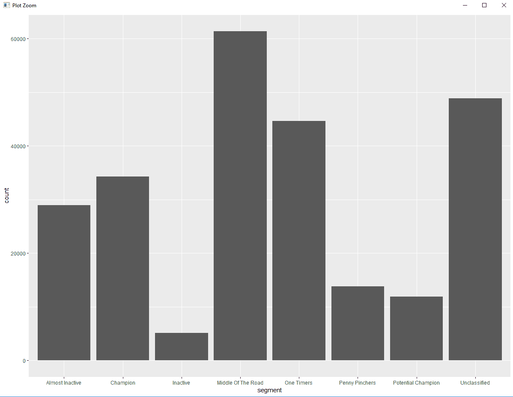

###### 图 7-20\. 手动分段客户的分布

# 第 4 步：报告发现

我们已经完成了分析并获得了一些有趣的发现。然而，现在我们希望向其他人报告这些发现。在会议上展示代码行并不太合适。我们将使用 R Markdown 生成一个独特的报告。首先我们将编写 R Markdown 文档。然后我们将[*knit*](http://bit.ly/2lScRcc)文档，以使其适合最终用户查看。在 R Studio 中，*Knitting*类似于发布。

要开始，请按照菜单路径文件 → R Markdown 在 RStudio 中开始一个新的 R Markdown 文档，如图 7-21 所示。


###### 图 7-21\. 在 RStudio 中创建 Markdown 文档的菜单路径

创建演示文稿的标题，并将您的名字作为作者添加（图 7-22）。

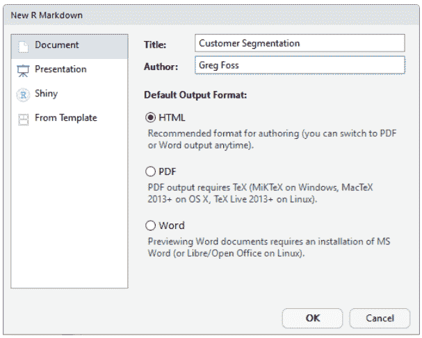

###### 图 7-22\. 创建 R Markdown 文档

让我们来看一下 R Markdown 文档的基本结构，如图 7-23 所示。

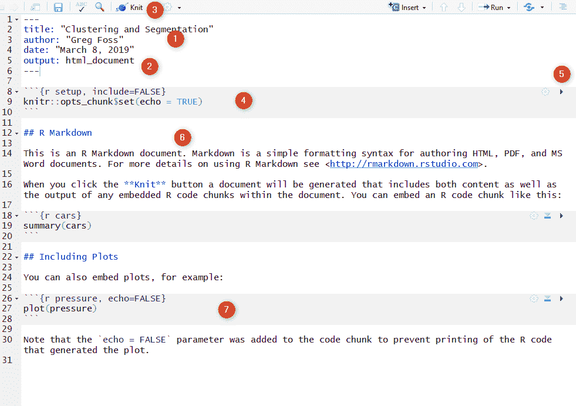

###### 图 7-23\. Markdown 文档的基本结构

您的文档的基本信息：

1.  您正在创建的文档类型。HTML 是默认选项，但您可以选择 PDF、Word 或 RTF 文档、GitHub 文件等。

1.  单击 Knit 按钮创建/渲染报告。

1.  在```{ } and ```部分之间编写代码。

1.  使用运行按钮测试特定部分的代码。

1.  使用文本描述和记录您的代码和发现。

1.  将图表放入文档中，并使用`echo=FALSE`命令隐藏运行它们的代码。

R Studio 提供了许多丰富的信息！请参考这张速查表之一：[R Studio](http://bit.ly/2jXi8i1)。

## R Markdown 代码

我们已经完成了分析，为了简洁起见，我们将使用 R Markdown 创建一个非常简单的报告作为示例。这是在 RStudio 中创建的代码：

```
---
title: "Customer Segmentation"
author: "Greg Foss"
date: "March 5, 2019"
output: html_document
---

```{r setup, include=FALSE}

knitr::opts_chunk$set(echo = TRUE)

knitr::opts_chunk$set(message = FALSE)

library(tidyverse)

library(ggplot2)

library(knitr)

library(kableExtra)

customer_rfm <- read.csv('D:/DataScience/Oreily/customer_rfm.csv',

stringsAsFactors = FALSE)

row.names(customer_rfm) <- customer_rfm$X

customer_rfm$X <- NULL

#RMarkedown 是显示发现的一种丰富而有益的方式。请参考

[R Markdown](https://rmarkdown.rstudio.com/index.html) 提供了丰富的信息。

```
## Simple Customer Segmentation

Our customers are important to us. Therefore we want to know as much about them as
possible. We collected sales data from our SAP system to analyze and investigate. 
In this document we will explore a small range of our customer data. If our findings 
prove fruitful, we may want to continue this adventure. One of the first things we 
should explain is the number of customers in our dataset.
<br><b>Number of Customers</b>
```{r range_of_order_dates, echo=FALSE}

count(customer_rfm)

```
Customers display a recency, a frequency and a monetary value. Below is displayed 
the distribution of these values for our customers and the overall average.
```{r median_recency, echo=FALSE, fig.height = 7, fig.width = 14}

#使用 mutate 函数限制数量。异常值将被分组到一个值中。

在这种情况下为 100。

customer_rfm %>%

mutate(mrod = ifelse(most_recent_order_days > 100, 100, most_recent_order_days))

%>% ggplot(aes(mrod)) +

geom_histogram(binwidth = .7,

col = "black",

fill = "blue") +

ylab('Count') +

xlab('最近订单天数') +

ggtitle('最近订单的直方图')

```
```{r median_recency_number, echo=FALSE}

wd <- mean(customer_rfm$most_recent_order_days)

print(paste0("平均最近订单：", wd))

```

```{r median_frequency, echo=FALSE, fig.height = 7, fig.width = 14}

customer_rfm %>%

mutate(cto = ifelse(count_total_orders > 20, 20, count_total_orders)) %>%

ggplot(aes(cto)) +

geom_histogram(binwidth = .7,

col = "black",

fill = "green") +

ylab('Count') +

xlab('订单数量或频率') +

ggtitle('订单频率的直方图')

```
```{r median_frequency_number, echo=FALSE}

wd <- mean(customer_rfm$count_total_orders)

print(paste0("平均订单频率：", wd))

```

```{r median_monetary_large, echo=FALSE, fig.height = 7, fig.width = 14}

#由于可能存在巨大的潜力，我们需要将货币价值分开。

#分销商和常规客户之间的差异

customer_rfm_big_players <-

customer_rfm[customer_rfm$total_purchase_value >= 100000 &

customer_rfm$total_purchase_value < 1000000,]

customer_rfm_big_players %>%

mutate(tpv = ifelse(total_purchase_value > 1000000,

1000000, total_purchase_value)) %>%

ggplot(aes(tpv)) +

geom_histogram(binwidth = .7,

col = "black",

fill = "orange") +

ylab('Count') +

xlab('总货币价值') +

ggtitle('客户货币价值的直方图（> 100,000）')

```

```

这只是用 R Markdown 进行报告的一个很小的例子。这只是冰山一角，希望它能激励你深入探索 R Markdown 的世界。我们将以这个简单的例子结束，因为坦率地说，我们可以单独为这个精彩的工具写一本完整的书。

## R Markdown Knit

显然，你不会用代码行来报告你的数据科学发现。R Markdown 允许你*编织*你的发现成为一份向业务分发的报告。在 RStudio 中点击 Knit 按钮，可以显示图 7-24 和图 7-25 的报告。

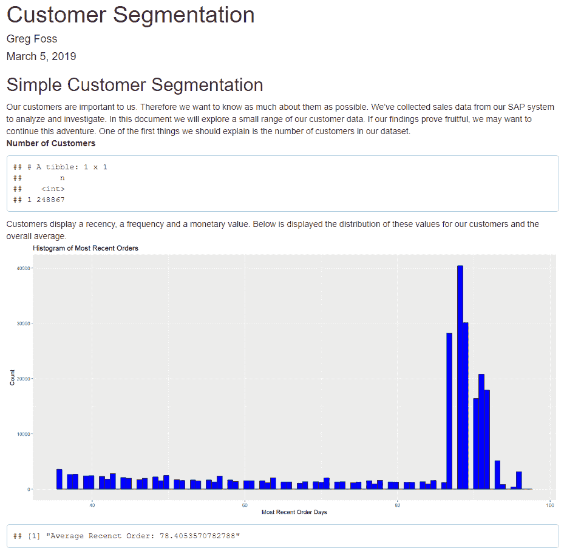

###### 图 7-24\. R Markdown 文档渲染

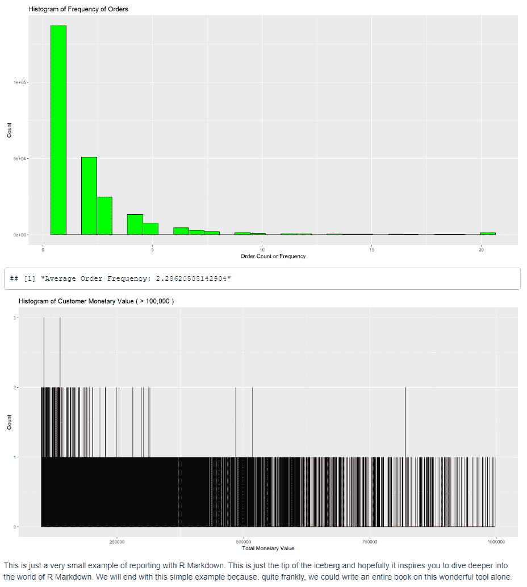

###### 图 7-25\. R Markdown 文档渲染（续）

# 摘要

我们在聚类和分割方面已经完成了相当的旅程，从概念开始，以报告形式展示给业务。请记住，我们最初的需求来自 Big Bonanza Warehouse 的 Rod。他想知道应该将哪些客户迁移到新系统，哪些客户应该留下。在数据探索中，我们对这个问题以及更多内容有了深入了解。对于新系统的迁移，我们将保留*冠军、潜在冠军、中庸*和*未分类*的客户。这将通过不转换成千上万个不必要的客户记录来减少转换时间、验证和成本。Duane 将这些发现带给主数据团队，为他们在 S/4HANA 转换中的工作做准备。

此外，结果帮助我们理解了我们客户基础中分销商的重要性，以及最近性、频率和货币价值的关键评估参数。除了 Rod 的项目，市场团队肯定也希望看到这些评估结果，以指导或验证他们的工作。

就像我们之前的所有探索一样，这只是个开始。了解你的客户是业务中一个有价值但经常被低估的方面。本章介绍的技术将帮助你深入了解你的 SAP 业务数据，并提出业务可能没有考虑到的问题。

¹ 你可以在[R Studio 网站](http://bit.ly/2lSzWLO)找到一个很棒的入门介绍和速查表。

² 如果你想知道，“为什么不简单地使用`pamk`来确定最佳的聚类数量呢？”这个过程可能计算开销很大，并且运行时间很长。

³ 在第二章中，我们讨论了层次聚类的两种类型：分裂型和凝聚型。请注意，层次聚类对异常值敏感。

⁴ 有许多方法可以显示树状图 — 搜索一下“美丽的树状图”来获取一些选项。我们喜欢的一些技术可以使用`ape#`包来实现。你可以在树状图中运用丰富的颜色和形状，创造出非常有创意的效果。这不仅仅是美学问题。可视化可以以更容易理解的方式展示数据。*《功能艺术：一种介绍》* 由阿尔贝托·开罗撰写，对于希望从他们的可视化中获得更多收获的人来说，是一本了不起的、富有洞察力的必读之作。
