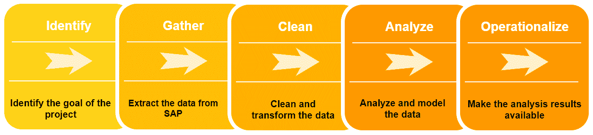
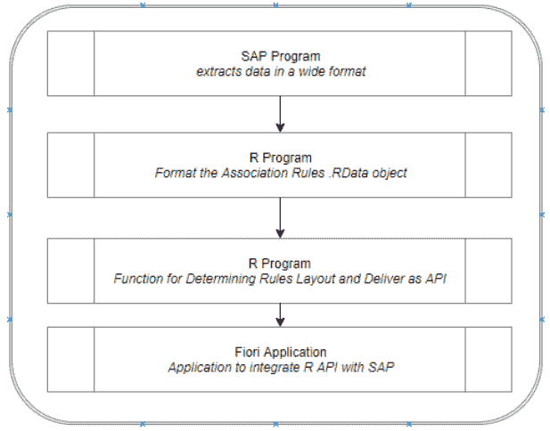
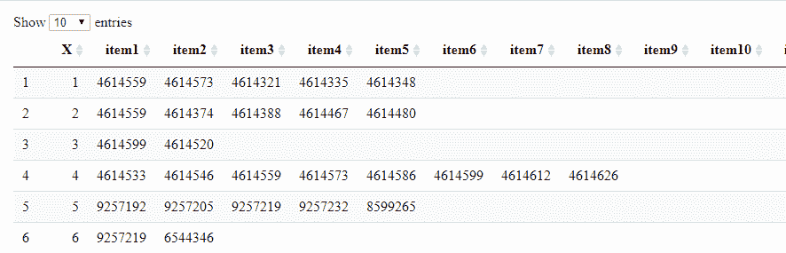

# 第八章：关联规则挖掘

Amir 是 Big Bonanza Warehouse 的销售副总裁。有天晚上，在亚马逊购物时，他收到了一条消息。“购买饼干的人也购买了饼干架。” “饼干架？太荒谬了。” 他想。但是他还是点开了这个项目。“饼干架只要一块钱，我试试。” 几分钟后他意识到，“我买了一件我本不打算购买的东西。我对购买和推荐感到满意。我怎样才能为我的销售和客户做到这一点？”

第二天在办公室，他叫来了 Duane，销售的 SAP 业务分析师。他解释了他的想法，并想知道他们如何做到。“我想为所有零售位置提供销售推荐。当客户购买产品时，我希望系统提供相关产品的推荐。” Duane 首先想到的是，“SAP 不做这个。”

和 Greg 以及 Paul 交谈后，Duane 得知 Amir 想要的可以通过一种称为关联规则挖掘的技术实现。我们打算从 SAP 接收销售订单并创建关联，或发现商品购买中的一般规则。我们想知道哪些产品经常一起购买。考虑杂货店：如果客户购买了面包和鸡蛋，他们购买牛奶的可能性有多大？

然而，如果你理解关联规则挖掘运用概率规则，你就会看到更多的应用：

实验室研究

基于之前的研究结果，结果的概率是多少？如果在一项研究中发生了 X 和 Y，那么发生 Z 的可能性是多少？在制药行业，恰当时机结束研究可能会带来重大的财务影响。

医疗诊断

诊断患者并不总是一个容易的过程。了解症状的共同出现有助于医疗提供者做出更准确的诊断。

班级时间表

理解学生可能选修的课程可以帮助一个组织准确利用资源，并避免排课瓶颈。

设备维护

预测制造线上的故障可以极大地提升生产力。如果一台设备经过 A、B 和 C 的维护，它出现故障的概率是多少？

客户订单帮助：作为直接升级的一个独特子集，考虑到某些产品通常因为某种原因一起购买。如果客户购买了数百块完美的方形瓷砖，他们很可能需要一些角落或奇形怪状的瓷砖来完成他们的项目。利用关联规则挖掘创建客户服务的方式，引导客户确保他们的互动第一次就能满足他们的需求。

在本章中，我们的目标是创建一个应用程序，在 SAP 中创建销售订单并为用户提供产品推荐。为此，我们使用 SAPUI5，这是一种标准的 SAP 前端技术。

现在基本的操作顺序应该很熟悉了。我们将沿用之前章节的大致操作流程，但这次我们将操作结果实施化（图 8-1）。数据科学的操作化是一个重要但常被忽视的步骤，这取决于您公司的基础设施。也许您的公司大量使用 Azure 或 Amazon Web Services。也许他们仅使用本地机器。在本章中，我们将在 R 中创建一个本地可访问的 Web 服务，但部署选项将根据您和您公司的基础设施和偏好而有所不同。



###### 图 8-1\. 用于在销售数据中查找关联的流程图

# 理解关联规则挖掘

关联规则挖掘（ARM）中的技术全都是关于将观察结果与规则关联起来，例如我们可以将数据中的观察 X 与规则 Y 关联起来。与序列挖掘不同，¹ ARM 不关心观察结果的顺序，只关心它们一起出现的事实。ARM 是一种成熟且著名的大数据集中发现关联的方法，特别适用于分类数据。ARM 中有四个主要概念，即支持度、置信度、提升度和 Apriori 算法。

## 支持度

支持度是集合在数据中出现的频率。例如，图 8-2 显示威士忌和啤酒的购买同时发生在总购买量的 10%中。这意味着支持度为 10/100 或 10%。

*支持度(X 到 Y) → 含有 X 和 Y 的交易数 / 总交易数*


###### 图 8-2\. 威士忌和啤酒购买之间的关联

## 置信度

置信度指示规则成立的频率。使用之前的例子，出于所有订单中，有 10 个包含威士忌和啤酒，15 个至少包含啤酒，80 个至少包含威士忌。因此，10 / (10 + 5) 是置信度值为 0.67。这是一个相当高的置信度值，表明这两种物品通常一起购买。然而，置信度可能会误导；仅仅是频繁出现的物品自然会有更高的置信度值。通过同时使用支持度、置信度和提升度等方法，可以克服这类限制。

*置信度(X 到 Y) → 含有 X 和 Y 的交易数 / 含有 X 的交易数*

## 提升度

Lift 是指在存在另一个物品的情况下某物品被购买的可能性，而不是独立购买的频率。换句话说，产品 A 如何提高产品 B 的购买可能性？使用我们的提升公式示例：lift = (10 / 10 + 5 ) / (80/100)。结果是 0.84。接近 1 的提升值表示一个物品对另一个物品没有影响。小于 1 的提升值表示可能存在替代（负提升）情况。尽管我们之前有很高的信心，但威士忌和啤酒之间没有提升的关系。事实上，提升值小于 1，表明威士忌可能是啤酒的替代品或反之亦然：

*提升（X 到 Y）→ 置信度（X 到 Y）/ （（没有 X 的 Y 的概率）/ 总交易数）*

## Apriori 算法

Apriori 算法由 R. Agrawal 和 R. Srikant 于 1994 年提出。它是在数据集中查找频繁项集的一种方法。它利用频繁项集属性的先验知识来实现这一点。在 R 的[`arules`](http://bit.ly/2ltQ3iX)库中，正是这个算法创建了关联规则。在本章后面分析数据时，我们将使用这个库。

# 运作化概述

在开始创建我们的应用程序之前，我们需要明确定义我们的编程目标。我们的过程架构并不复杂，但重要的是要理解这些过程中的组成部分，这些组成部分将实现我们的愿景。图 8-3 展示了从数据提取到在 SAP Fiori（SAPUI5）应用程序中显示的基本流程。



###### 图 8-3\. 程序和应用概述

SAP 将 SAPUI5 开发为基于 HTML5/JavaScript 的 Web 应用程序开发框架。SAP 还创建了一套名为 Fiori 的设计标准，SAPUI5 致力于帮助开发人员满足这些标准。原因是？标准的 SAP 用户界面，几十年历史的 SAP GUI，不受欢迎。

SAPUI5 帮助开发人员创建可以在从桌面大小的显示屏到移动手持屏幕上响应缩放的应用程序。采用 Fiori 设计原则的 SAPUI5 已经成为 SAP 最终用户的常见选择，包括 Big Bonanza 的销售人员。我们将详细介绍一种使用 SAPUI5 来增强销售体验并显示从我们的数据科学探险中生成的推荐内容的方法。数据科学家和 SAP 分析师请注意：就像我们在 ABAP 方面的其他简短尝试一样，本书并不旨在作为 SAPUI5 入门。

# 收集数据

此业务问题需要一个最终创建购买相关联规则的过程。这不是经常需要的事情，可能每季度进行一次。我们的计划是创建一个每季度更新一次的过程，并作为 API 到 SAP 应用程序的基础。

在 SAP 中很容易找到销售数据，在 VBAK 和 VBAP 表中。我们只想知道一起购买了哪些产品。最终，我们希望得到类似表格 8-1 的内容，其中每条记录都有单独的列来显示售出的各个项目。第一行表示一个销售了两个项目的订单，第二行表示销售了四个项目的订单，以此类推。

表格 8-1\. 展开的产品到订单映射

| item1 | item2 | item3 | item4 | item5 |
| --- | --- | --- | --- | --- |
| 产品 A | 产品 B |  |  |  |
| 产品 C | 产品 B | 产品 E | 产品 G |  |
| 产品 A | 产品 C |  |  |  |

然而，在从 SAP 表中选择数据时，我们得到的是表格 8-2。

表格 8-2\. 展开前的产品到订单映射

| 销售文档（VBAK） | 销售材料 |
| --- | --- |
| 10001 | 产品 A |
| 10001 | 产品 B |
| 10002 | 产品 C |
| 10002 | 产品 B |
| 10002 | 产品 E |
| 10002 | 产品 G |
| 10003 | 产品 Z |

这里有几件事情我们需要考虑：

+   我们不关心只有一个项目的订单；在这里没有任何关联。

+   我们希望我们的数据宽而不是长。记住，我们的目标是记录，每个记录都有列来标识订单中的各个项目，而不是每个项目在订单中单独记录。

+   我们不关心销售订单号；它只是用来分组材料。

+   转回异常检测概念，参见第五章，我们确定超过 25 行的任何订单都是异常的，简单地在 25 个项目处截断表格。

###### 注意

找到这个 25 行的截断简化了这一步骤。如果我们允许任意数量的行，我们将需要在 ABAP 中动态构建内部表，从而增加复杂性。

我们编写了一个简单的 ABAP 程序来满足我们的需求。它会读取指定日期范围内的所有销售订单项目，并创建一个符合我们要求格式的本地 CSV 文件。这将使我们的关联规则代码变得非常简单和直观。这是合并各种技术的一个很好的例子。我们可以使用 ABAP 格式化和提取 SAP 数据，然后简化 R 和 Python 的过程。通过深思熟虑地简化和设计从 SAP 提取的过程，我们将 R 过程简化为三行代码：

```
REPORT zgmf_sales_wide.
 ************************************************************************
 *Data Declarations
 ************************************************************************
 TABLES: vbak, vbap.
* ty_items is our limited-to-25-items column-per-record structure.
 TYPES: BEGIN OF ty_items,
          item1 TYPE matnr,
          item2 TYPE matnr,
          item3 TYPE matnr,
          item4 TYPE matnr,
          item5 TYPE matnr,
          item6 TYPE matnr,
          item7 TYPE matnr,
          item8 TYPE matnr,
          item9 TYPE matnr,
          item10 TYPE matnr,
          item11 TYPE matnr,
          item12 TYPE matnr,
          item13 TYPE matnr,
          item14 TYPE matnr,
          item15 TYPE matnr,
          item16 TYPE matnr,
          item17 TYPE matnr,
          item18 TYPE matnr,
          item19 TYPE matnr,
          item20 TYPE matnr,
          item21 TYPE matnr,
          item22 TYPE matnr,
          item23 TYPE matnr,
          item24 TYPE matnr,
          item25 TYPE matnr,
        END OF ty_items.
DATA: lt_items TYPE TABLE OF ty_items,
      wa_items LIKE LINE OF lt_items.
TYPES: BEGIN OF ty_base,
         vbeln TYPE vbeln,
         matnr TYPE matnr,
       END OF ty_base.
DATA: member   TYPE ty_base,
      members TYPE STANDARD TABLE OF ty_base WITH EMPTY KEY,
      position TYPE i,
      xout     TYPE string,
      iout     TYPE TABLE OF string,
      l_string TYPE string,
      t_csv    TYPE truxs_t_text_data,
      c_csv    TYPE truxs_t_text_data,
      h_csv    LIKE LINE OF t_csv.
FIELD-SYMBOLS: <fs_str> TYPE ty_items.
 ************************************************************************
*Selections               ₍ᐢ•ﻌ•ᐢ₎*･ﾟ｡
************************************************************************
SELECT-OPTIONS: s_auart FOR vbak-auart, "Sales Order Type
                s_erdat FOR vbak-erdat, "Sales Order Create Date
                s_pstyv FOR vbap-pstyv. "Sales Order Line Item Category
PARAMETERS: p_lnam TYPE char75 DEFAULT 'C:\temp\'. "Directory to save to
************************************************************************
*Start-of-Selection        ₍ᐢ•ﻌ•ᐢ₎*･ﾟ｡
************************************************************************
 PERFORM get_data.
 PERFORM write_file.
************************************************************************ 
* ROUTINES               ₍ᐢ•ﻌ•ᐢ₎*･ﾟ｡
************************************************************************
FORM get_data. 
* Select all order numbers and materials from VBAK and VBAP 
* based on the selection criteria on the first screen.
  SELECT vbak~vbeln, vbap~matnr
      INTO TABLE @DATA(lt_base)
      FROM vbak JOIN vbap ON vbak~vbeln = vbap~vbeln
      ##DB_FEATURE_MODE[TABLE_LEN_MAX1]
          WHERE vbak~auart IN @s_auart
            AND vbak~erdat IN @s_erdat
            AND vbap~pstyv IN @s_pstyv
            GROUP BY vbak~vbeln, vbap~matnr.

*Assign the work area structure to a field-symbol
  ASSIGN wa_items TO <fs_str>. 

*LOOP at the list of orders and materials and group this by order number
  LOOP AT lt_base INTO DATA(wa) GROUP BY wa-vbeln.
    CLEAR members. 

*LOOP at the group (single order number) and put it into the members  
*table.
    LOOP AT GROUP wa INTO member.
      members = VALUE #( BASE members ( member ) ).
    ENDLOOP. 

*How big is the members table? If it is not greater than  
*one line then skip it. There is no association for one line orders.
    DESCRIBE TABLE members LINES DATA(i).
     IF i > 1.
       CLEAR: position, <fs_str>.
       LOOP AT members ASSIGNING FIELD-SYMBOL(<member>). 

*We don't want to go over 25 lines on an order.
        IF position = 25.
          EXIT.
         ENDIF.
         position = position + 1\. 

*Create a variable for the item from item1 to item25.
        DATA(item_position) = `ITEM` && position. 

*Assign the item (let's say ITEM1) to the field-symbol.  
*This is like a pointer and if it is successful we can  
*move the value into our work area.
        ASSIGN COMPONENT item_position OF STRUCTURE <fs_str>
             TO FIELD-SYMBOL(<fs>).
        IF <fs> IS ASSIGNED.
           <fs> = <member>-matnr.
        ENDIF.
      ENDLOOP. 

*Append the work area to our table of items.
      APPEND <fs_str> TO lt_items.
    ENDIF.
  ENDLOOP.
ENDFORM.
************************************************************************
FORM write_file. 

*Create a header. This is not truly necessary, but it doesn't hurt
  h_csv = 'item1' && `,` && 'item2' && `,` && 'item3' && `,` && 'item4' &&
  `,` && 'item5' && `,` && 'item6' && `,` && 'item7' && `,` && 'item8' &&
  `,` && 'item9' && `,` && 'item10' && `,` && 'item11' && `,` && 'item12' &&
   `,` && 'item13' && `,` && 'item14' && `,` && 'item15' && `,` && 'item16' &&
 `,` && 'item17' && `,` && 'item18' && `,` && 'item19' && `,` && 'item20' &&
  `,` && 'item21' && `,` && 'item22' && `,` && 'item23' && `,` && 'item24' &&
   `,` && 'item25'.

*Loop at the table of items and write it to a work area separated by commas
  LOOP AT lt_items INTO DATA(items).
    CLEAR xout.
    DO.
       ASSIGN COMPONENT sy-index OF STRUCTURE items TO FIELD-SYMBOL(<csv>).
       IF sy-subrc <> 0.
         EXIT.
       ENDIF.
       IF sy-index = 1.
         xout = <csv>.
       ELSE.
         l_string = <csv>.
         xout = xout && `,` && l_string.
       ENDIF.
     ENDDO.
     APPEND xout TO iout.
   ENDLOOP.

*First append our header to the final csv output table 
*then append all the lines of the csv.
  APPEND h_csv TO t_csv.
  APPEND LINES OF iout TO t_csv.

*Use SAPs standard download method to create a file and download it locally
  CALL METHOD cl_gui_frontend_services=>gui_download
    EXPORTING
      filename = p_lnam && `sales_wide_` &&  
                 sy-datum && sy-uzeit+0(4) && '.csv '
    CHANGING
       data_tab = t_csv.
ENDFORM.
```

# 清洗数据

我们总是需要对从 SAP 获取的数据进行一些清理。但是，由于我们编写了自己的小型定制程序来提取数据，我们注意确保数据是干净的。重要的是不要对提取程序的效果作任何假设，因此我们将读取 CSV 文件到 R Studio 并查看它（结果显示在图 8-4 中）：

```
investigate <- read.csv("D:/DataScience/Data/mat.csv")
library(DT)
datatable(head(investigate))
```



###### 图 8-4\. 调查 SAP 销售数据的宽格式数据

事情看起来正如我们所希望的，只是 X 列是个例外。然而，这是我们的`read.csv`函数添加的内容。我们可以使用`row.names = NULL`参数来避免这个问题。当我们在下一步中以不同的方式加载数据时，我们将不会遇到这个问题。

# 分析数据

使用[`arules`包](http://bit.ly/2ltQ3iX)可以非常轻松地获得一些惊人的结果。因为我们已经使用 ABAP 格式化了我们的数据，所以可以使用以下代码将其转换为 R 中的[`transaction`对象](http://bit.ly/2lvlPMm)：

```
transactions <- read.transactions("D:/DataScience/Data/mat.csv",
                                  format = "basket",
                                  sep = ',',
                                  rm.duplicates=TRUE)
```

要基于加载的交易创建规则，请使用以下代码。这是先前提到的 Apriori 算法发挥作用的地方。我们将支持设置为最低 0.1%，置信度设置为 80%。由于数据集庞大且多样化，支持较低。我们有超过 50 万行的项目集。0.1%的支持仍然是 500 次出现。置信度为 0.8 意味着规则被认为是真实的 80%的时间。

###### 注意

数据科学是业务逻辑、艺术和实际机器学习知识的结合。适当设置支持和置信度值需要一定程度的试验和错误。

```
rules_transactions <- apriori(`transactions`,
                              parameter = list(`supp` = 0.001, conf = 0.8))
 rules_transactions <- sort(`rules_transactions`,
                           by="confidence",
                           decreasing=TRUE)
```

我们可以使用以下命令查看我们的结果与置信度、提升和支持。

```
inspect(head(rules_transactions))

     lhs          rhs     support     confidence lift     count
 [1] {4614440} => {79353} 0.001040583 1          2.426768 2    
 [2] {4360037} => {79353} 0.001040583 1          2.426768 2    
 [3] {8996481} => {79353} 0.001040583 1          2.426768 2    
 [4] {8709402} => {79353} 0.001040583 1          2.426768 2    
 [5] {8135285} => {79353} 0.001040583 1          2.426768 2    
 [6] {2911738} => {79353} 0.001040583 1          2.426768 2
```

Lhs 代表*左侧*；rhs 代表*右侧*。右侧的项目经常与左侧的项目一起购买，列出的支持、置信度和提升。虽然我们的支持值不是很高，但我们拥有的数据量足以提供顶级值之间的良好置信度和提升。例如，上面的第 1 行表明当购买项目 4614440 时，有 100%的置信度会购买项目 79353。此外，这种关系的提升为 2.4267。（请记住，接近 1 的提升值表示一个项目对另一个项目没有影响。）

我们已经创建了我们的关联规则；现在我们将它们保存为*transaction*对象，以便稍后在我们的操作化中使用：

```
save(`rules_transactions`,
     file = "D:/DataScience/Oreily/association_rules.RData")
```

###### 注意

我们首先将在本地层面进行操作化，然后再向更普遍的层面发展。

在我们操作化之前，我们想要测试如果分析一个简单的结果会发生什么。从一个数据框中创建一个简单的向量，其中包含顶部的结果：

```
dataset <- as.vector(t(c("8135285")))
```

现在将创建的规则与我们向量的结果进行匹配：

```
matchRules <- subset(`rules_transactions`, lhs %ain% dataset)
```

像我们之前用`inspect`函数一样检查这些规则。我们看到它返回了我们之前手动检查规则时得到的相同值：

```
inspect(matchRules)
      lhs          rhs     support     confidence lift     count
 [1] {8135285} => {79353} 0.001040583 1          2.426768 2
```

现在要创建一个简单的 API，我们需要首先从以下代码创建一个函数，其中*数据集*作为输入变量：

```
subset(rules_transactions, lhs %ain% <input_vector>)
```

您可以使用[`plumber`库](https://www.rplumber.io/)在 R Studio 中快速创建简单的 Web API。要使用我们将在此概述的某些功能，您需要在 R Studio 版本 > 1.2 上进行操作。创建 Web API 的第一步是使用菜单路径 文件 → 新建文件 → 管道 API 打开一个新的 plumber 文件，如图 8-5 所示。


###### 图 8-5\. 创建您的第一个管道 API

这将为`plumber`提供一个基本文件，并包含一些示例。我们将放弃这些示例，使用以下代码：

```
library(plumber)
#Load the association rules created in the load program
load(file = "D:/DataScience/Oreily/association_rules.RData")
#* Send back the confidence and lift
#* @param input Material Number
#* @get /arm
function(input) {
  #Convert the input value(s) into a vector. 
  dset <- as.vector(t(c(input)))
  #Create a subset of rules matching the input
  match_rules <- subset(rules_transactions, lhs %ain% dset)
  #Display/Return those values (by default JSON)
  inspect(match_rules)
}
```

这段代码的人类语言意思是，“接收输入并将其转换为向量，以便我们可以进行搜索。创建一个新对象，它是与 lhs（左手边）匹配的关联规则的子集。使用`inspect()`函数返回该结果。”

当从浏览器查询时，上述代码将以 JSON 格式呈现关联规则结果。在 R Studio 中使用 Plumber API 非常简单；只需点击窗口右上角的“运行 API”按钮即可。

将出现一个窗口，允许对 API 进行审查和测试。显示在图 8-6 中。


###### 图 8-6\. Swagger 和管道 API

点击“试一试”按钮并输入物料号。完成后，点击执行按钮，如图 8-7 所示。


###### 图 8-7\. 使用物料号测试管道 API

Web API 的结果显示在响应部分中，如图 8-8 所示。


###### 图 8-8\. 管道 API 调用的结果

API 的结果以 JSON 格式显示如下：

+   LHS (前提)

+   RHS (结果)

+   支持

+   置信度

+   Lift

这些数据都可以用于提供销售推荐的应用程序。我们成功创建了一个 Web API，但仅限于我们的本地计算机。有许多方式来托管和发布 API。这主要受您公司环境的管理。您的公司使用 Azure、Amazon Web Services、Digital Ocean 还是其他什么？也许根本没有云环境，而是部署在本地服务器上。选择太多，无法在这本小书中详细介绍。²

###### 注意

记住：我们这里不是在构建一个完整的移动应用程序。此场景假设 Big Bonanza 公司已有一个基于 SAPUI5 的 Fiori 应用程序，并且 Greg、Paul 和 Duane 只是添加了一些额外的逻辑。这里提出的所有更改都是虚构的例子，虽然需要了解 HTML、JavaScript 和 XML，但并不需要在其本地编程语言中开发完整功能的 iOS 或 Android 应用程序。

## Fiori

我们有一个操作性的、可通过网络访问的参考点，可以使用我们的 Plumber API。正如本章开头讨论的那样，Big Bonanza 使用基于 SAPUI5 的 Fiori³应用程序，允许现场销售人员通过智能手机输入销售订单。在深入进行有趣的数据科学场景之前，SAP 团队的 Duane 在设计销售订单录入应用程序时做了一些工作。他在移动设备上简化了通常在桌面 SAP GUI 中可能非常复杂的操作到几个屏幕上。

为了让现场销售人员真正推动那些小额额外销售，让我们为 Duane 的订单录入应用程序制定一个小增强计划。我们将添加一个屏幕，在销售人员确认新订单后弹出，列出通常与订单商品一起购买的附加材料。销售人员可以根据需要向客户推荐这些项目中的一个或多个，以便立即将其添加到订单中。

###### 注意

访问[*https://open.sap.com/*](https://open.sap.com/) 并搜索“SAPUI5”，了解更多关于为 Fiori 体验构建 SAPUI5 应用程序的信息。

SAPUI5 应用程序遵循一种常见的模型-视图-控制器⁴结构。“视图”文件定义了屏幕上元素的布局。“控制器”文件定义了行为和逻辑。在这两者中，都有关于“模型”的引用，它定义了如何在客户端设备上存储数据以供应用使用。对于我们的用例，我们将修改视图文件以创建一个小弹出屏幕，用于显示建议的新产品。我们将创建一个新的模型来保存关于建议产品的信息。最后，我们将修改控制器文件，确保弹出屏幕在正确的时间出现。

Big Bonanza 有一个非常简化的 UI，类似于图 8-9。在选择客户后，只需在最后一个屏幕上添加项目即可提交到 SAP 以创建订单。

我们将把我们的推荐流程放入销售人员点击“完成订单”的流程中。让我们从管理我们按钮的视图文件开始。

在主视图文件（*Table.view.xml*，管理此屏幕）中，SAPUI5 开发人员已经在页脚中定义了按钮。我们可以快速检查一下，看看我们可以在哪里连接我们的额外逻辑：

```
<!-- SNIP! Lots of other application view code -->
 <`footer`>
     <`OverflowToolbar`>
         <`ToolbarSpacer`/>
         <`Button` text="Add Product"/>
      <`Button` text="Complete Order" press="onOrderPress" type="Accept"/>
     </`OverflowToolbar`>
 </`footer`>
 <!-- SNIP! Lots of other application view code -->
```


###### 图 8-9\. 简化订单录入，能够添加其他产品或完成订单

“完成订单”按钮的`press`属性告诉我们，当用户点击该按钮时将执行什么功能（`onOrderPress`）。所以让我们进入那段代码，在*Table.controller.js*文件中：

```
// SNIP! Lots of other application controller code
 onOrderPress: `function` (oEvent) {
     // If the dialog box has never been opened, we initiate it
     `if` (!`this`._oDialog) {
         `var` oSuggestionsModel = `new` JSONModel();
         `this`.getView().setModel(oSuggestionsModel, "suggestions");
         `this`._oDialog = sap.ui.xmlfragment("Table.RecommendDialog", `this`);
         `this`._oDialog.setModel(oSuggestionsModel, "suggestions");
     }

     // Retrieve the product already entered on the screen,
     // build a query URL to the Big Bonanza ARM endpoint, 
     // then load that data into an intermediate placeholder, ARMModel. 
     var oModel = this.getView().getModel();
     `var` product = oModel.getProperty("/ProductCollection/0/ProductId");
     `var` bigBonanzaInternalUrl = "[FILL_IN_YOURS]";
     `var` oARMModel = `new` JSONModel();
     `var` endpoint = bigBonanzaInternalUrl + "/arm?input=" + product;
     oARMModel.loadData(endpoint, {}, `false`);

     // Based on results from the ARM retrieval, create a filter to retrieve
     // the full product information for the recommended products.
     `var` armData = oARMModel.getData();
     `var` aFilters = [];

     // The "Filter" object sets up the OData filter for SAPUI5
     `for` (`var` i = 0; i < armData.length; i++) {
         aFilters.push(`new` Filter("ProductId", "EQ", armData[i].rhs);
         `var` finalFilters = `new` Filter({
             filters: aFilters,
             and: `false`
         });
     }

     // The base OData model is the OData API that is serving out the rest
     // of the data points of this app. This is the API that houses the
     // "ProductCollection" endpoint, where we can retrieve more details
     // about the recommended data.
     `var` baseODataModel = `this`.getView().getModel();
     `var` that = `this`;
     baseODataModel.read("/ProductCollection", {
         filters: finalFilters,
         success: `function` (oData) {
             // In here, we assign the suggestions to that model and open
             // the dialog box. See the "Table.RecommendDialog" listing.
             `var` oSuggestionsModel = that.getView().getModel("suggestions");
             oSuggestionsModel.setData(oData.results);
             that._oDialog.open();
         }
     });
}
 // SNIP! Lots of other application controller code.
```

这个拼图还有一个碎片。在`onOrderPress`函数的顶部附近，我们调用了一个 XML 片段。该片段定义了按下“完成订单”后出现的弹出对话框的外观和感觉（图 8-10）。


###### 图 8-10\. 在手机上，建议列表显示在现有订单项目列表的顶部，并允许选择一个或多个项目添加到销售订单。

要设置建议列表对话框，请在您的 SAPUI5 项目中创建名为*RecommendDialog.fragment.xml*的文件，并添加以下 XML 内容：

```
<`core``:``FragmentDefinition`
    xmlns="sap.m"
    xmlns:core="sap.ui.core">
    <`SelectDialog`
         noDataText="No Products Found"
         title="Suggested Add-Ons"
         confirm="handleClose"
         cancel="handleClose"
         multiSelect="true"
         items="{
             path: 'suggestions>/'
         }" >
         <`StandardListItem`
                 title="{suggestions>Description}"
                 description="{suggestions>ProductId}"
                 type="Active" />
     </`SelectDialog`>
 </`core``:``FragmentDefinition`>
```

# 摘要

通过中间过程提示销售相关项目，Duane 为销售副总裁 Amir 提供了一个强大的工具，以促使其销售团队立即进行增值销售。我们使用了从 SAP 表中收集的销售数据，在一个 ABAP 程序中将其整理成一个 CSV 文件。使用 R，我们分析了这些数据，寻找了关联规则挖掘中的三个关键因素：支持度、置信度和提升度。

`arules`包为我们提供了快速分析这三个因素原始数据的方法。我们在其上层添加了一个函数，以便快速输入产品编号并输出具有强关联的 1 到*n*个产品。使用 R 中的`plumber`库，我们快速将该函数转换为可通过 Web 调用的 API。

考虑到销售团队成员在现场使用 SAP Fiori 应用程序在其手机上为客户录入销售订单，我们研究了如何快速调整 Fiori 应用程序的 SAPUI5 代码库，向用户展示“建议项目”提示。在提交订单之前，这为他们提供了一个最后的增值销售工具。并非每个客户都选择添加增值项目，但足够多的客户选择这样做，这对 Amir 的销售数字产生了积极的影响。

关联规则挖掘长期以来一直存在。将其交给 SAP 用户使用是成熟方法的新尝试；信息就在那里，可以随时获取！

¹ 序列挖掘是一种关联规则挖掘的一种类型，但此处未包括。有些事情就是无法被实现。

² 我们将在博客中提供有关使用 Digital Ocean 作为公共 API 平台的后续文章，并结合 R 和 plumber 进行介绍。

³ 还要记住，SAPUI5 是一个 Web 应用程序开发框架。在过去四到五年中，SAP 的用户体验能力有了很大的发展，而 SAPUI5 正是这些变化的领导者。

⁴ [模型-视图-控制器结构](https://zh.wikipedia.org/wiki/Model–view–controller)是软件开发中最古老、最常用的架构之一，特别适用于图形用户界面。
