# 第九章：使用 Google Cloud 自然语言 API 进行自然语言处理

> “消费者因为糟糕的服务经常会放弃公司吗？一直是。”
> 
> 哈佛商业评论，[“停止试图取悦您的客户”](http://bit.ly/2k4jYhh)

杰娜是大宝石仓储的客户服务高级总监。根据 CEO 的说法，这份工作很简单：“将愤怒的客户转变为满意的客户。”愤怒的客户有很大的力量来伤害公司，因为他们不仅可以停止交易，还可以通过社交媒体发表投诉来扩大其影响。大宝石（以及全世界的其他公司！）对客户在线上发表的言论非常敏感。

客户通过消费者面向的网上商店前端注册他们的投诉，使用设计用来收集问题描述的联系表单。大宝石直接将此联系表单连接到 SAP 客户关系管理（CRM）以捕获这些注释并创建可跟踪的投诉文档。CRM 投诉创建后，杰娜的团队介入。她的团队每天处理数百个投诉。他们尽最大努力快速反应并提供高质量的服务，但杰娜知道在每天的投诉堆中有些客户如果不能快速获得高质量的服务就会流失。

SAP 业务分析师杜安也对 CRM 有深入的了解。杰娜向他提出了一个有趣的想法：“我有预算可以给那些投诉的客户小礼物或者优惠。这不是一个很大的预算，所以我必须小心如何分配。我希望尽快识别出最不满意的客户，这样我可以把这个预算应用到他们身上。”她的假设是，在流程早期采取行动可以防止客户流失和不良的社交媒体消息，但要验证这个假设，她需要快速找到潜在的流失客户。

杜安从与格雷格和保罗的交谈中得知，数据科学在自然语言处理（NLP）领域不断取得显著进展。他问道：“如果我能从 CRM 中提取这些文本投诉，我们是否可以使用 NLP 快速识别可能流失的客户？”格雷格和保罗向杜安展示了利用公共可用云 API 有效地检查投诉情感的可能性，从而避免了其他大宝石 SAP 项目中需要使用建模和训练的过程。

在本章中，我们的目标是建立一个快速的时间分析流水线，从客户投诉中提取情感，以帮助杜安推荐特别支持珍娜团队关注的最佳候选人。为此，我们将使用 ABAP 从 SAP CRM 中提取客户投诉注释，然后利用 Google Cloud API 来发现每个投诉中的正面或负面人类情感。

###### 注意

这可能是本书所有章节中最实用的部分。这是有意为之的！我们希望你明白，有时候建模已经完成，你可以使用预先存在的工具专注于业务场景。其中一个最好的方法是使用来自亚马逊网络服务、微软 Azure、Google Cloud 等提供的云 AI 工具包。为了专注于场景，我们不得不选择一个工具包，所以我们选择了 Google。这并不是对其他工具的不敬。

# 理解自然语言处理

自然语言处理是人工智能的一个子领域，专注于使计算机理解人类语言。自然语言处理的两个最常见的领域是情感分析和翻译。

## 情感分析

常被称为意见挖掘，情感分析试图从文本中识别出意见。有两种基本的情感分析方法：基于规则的方法和基于机器学习的方法。有时还会有两者的混合方法。基于规则的方法使用一组手工制作的规则。想象一个包含诸如 *awesome, incredible, neat,* 和 *good* 等正面词汇的列表标记为 **正面情感**。另一个标记为 **负面情感** 的列表则包含诸如 *terrible, awful, sad,* 和 *depressing* 等词汇。简而言之，基于规则的方法计算这些词在句子、段落或整本书中的出现次数，并决定整体情感是 **正面** 还是 **负面**。机器学习方法更为现代化和复杂。在 R 和 Python 中都有成熟的库，如 [`topicmodels`](http://bit.ly/2m1rgTz) 和 [`NLTK`](https://www.nltk.org/)，使情感分析更简单。

这两种方法都使用了去除停用词、分词、词干提取和词形还原等技术，将人类语言转换成更易于分析的形式。

去除停用词就是简单地消除在意见或情感中几乎没有价值的单词，比如 *and, but, or,* 和 *the*。

分词是将一个单词序列分解成片段或标记的过程。在此过程中通常会丢弃诸如标点符号之类的烦人东西。图 9-1 是一个已经去除停用词并进行了分词的句子的示例。

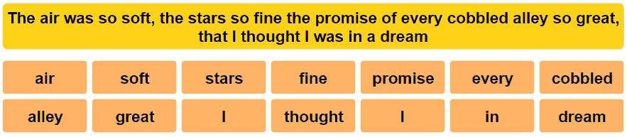

###### 图 9-1\. 去除停用词和对句子进行分词

词干提取和词形还原是去除词形变化的过程。词干提取简单地去除词尾以获得单词的“词干”，而词形还原则使用更复杂的方法找到单词的真正基础形式。这些是简单的过程，但没有示例很难解释清楚。图 9-2 展示了如何根据标准规则对一组词进行词干提取，而 图 9-3 展示了如何对一组词进行词形还原。¹

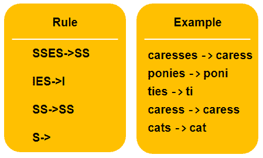

###### 图 9-2\. 根据波特算法的词干提取规则

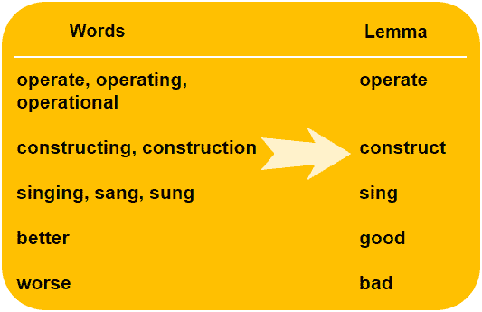

###### 图 9-3\. 词形还原

这是情感分析的基础。然而，在本章中，我们不会构建自己的情感分析器。相反，我们将使用公开可用的谷歌云 API 来为我们进行分析。

## 翻译

在 *银河系漫游指南* 中，道格拉斯·亚当斯向读者展示了“宇宙中最奇特的事物”：一只巴别鱼。这个小生物以脑电波为食，放入耳中后能翻译任何语言。有了机器学习翻译，这样的事情是可以预见的。现代机器学习翻译使用神经网络学习将一种语言翻译成另一种语言。（我们在 第二章 中介绍了神经网络。）机器学习翻译的准确性和可靠性已经达到（有人认为已经达到）人类水平的翻译能力。

# 准备云 API

有了对自然语言处理的基本理解，让我们开始帮助杜安和吉娜得到他们所需的东西。我们将通过谷歌云来运行这个例子，但读者应该注意，亚马逊 Web 服务 (AWS) 和微软 Azure 也提供类似的服务。

在一个充满公开可用人工智能服务的世界中，我们   在一个充满公开可用人工智能服务的世界中，我们喜欢谷歌建立他们的工具集的方式。他们的库质量高，简单且灵活。更重要的是，他们数十年的机器学习研究近在你的指尖。使用谷歌云 API 几乎可以说是轻而易举的事情。让我们通过设置谷歌云平台来处理这个场景开始吧。

要使用谷歌的云服务，你需要一个谷歌账号。如果你有 Gmail 账号，或者你的公司使用 Google for Work 或 GSuite，你已经准备就绪了。否则，请前往 [*https://accounts.google.com/signup*](https://accounts.google.com/signup) 注册一个账号。这与注册 Gmail 账号是一样的；在过程结束时你将拥有一个新的电子邮件地址。

有了那个 Google 账号，你已经准备好访问这些 API 了。前往 [*https://console.cloud.google.com/*](https://console.cloud.google.com/) 开始设置正确的访问权限。根据你的账户类型，可能需要设置一个计费账户。别担心：在本章的示例中，免费的服务层将足以让我们进行学习和进展。只有当你开始为成千上万个 API 请求使用这些服务时，才会开始计费，那时我们希望你能为你的业务提供如此多的价值，以至于这不再重要。

在 Google Cloud Platform 控制台中，你需要给自己授予访问我们将用于 Jeana 工作的 API 的权限。从 APIs & Services 部分开始，如 Figure 9-4 中所示。

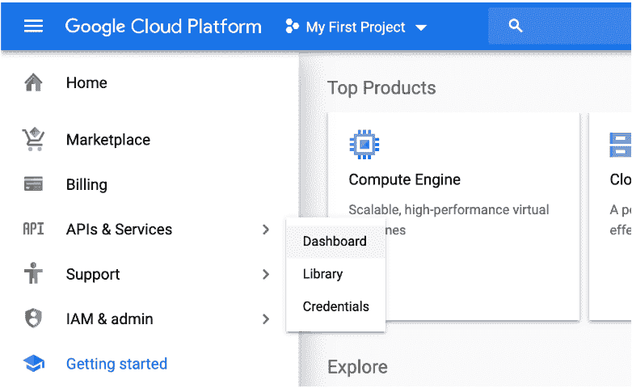

###### Figure 9-4\. 点击“APIs & Services”，然后点击 Dashboard 以控制 AI APIs

你将看到一个类似 Figure 9-5 的屏幕。只需点击屏幕顶部的“启用 API 和服务”。

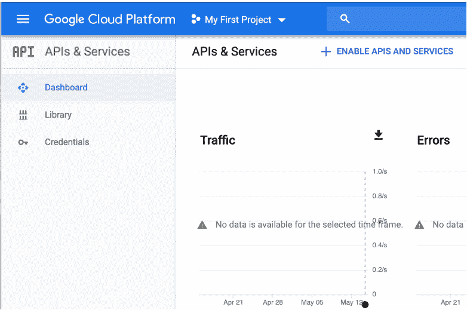

###### Figure 9-5\. 点击“启用 API 和服务”以进入搜索仪表板

你随后将进入主屏幕，可以搜索谷歌的数百个 API。对于 Jeana 的情况，我们将仅启用自然语言 API。在搜索栏中搜索“language”开始。你应该看到一个类似 Figure 9-6 的结果。点击“Natural Language API” 的结果。

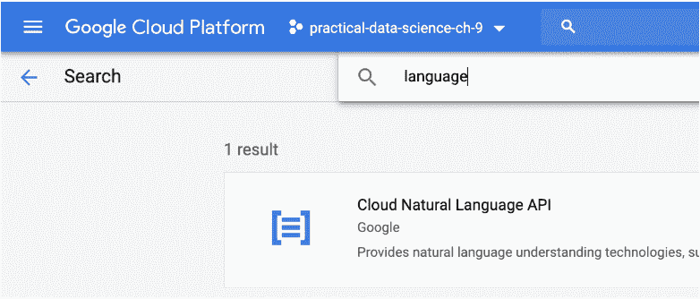

###### Figure 9-6\. 在 API 控制台搜索中搜索“language”

点击详细屏幕中的启用按钮，启用 Cloud 自然语言 API，如 Figure 9-7 中所示。

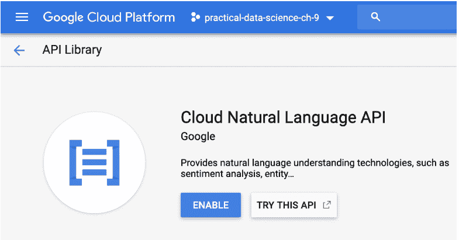

###### Figure 9-7\. 启用 Cloud 自然语言 API

一旦你点击了启用按钮，API 的开启就完成了。但在我们的准备工作中还有一个步骤。我们需要获取一个具有使用我们刚刚启用的 API 所需凭证的服务账号。从主 Google Cloud 控制台屏幕 ([*https://console.cloud.google.com*](https://console.cloud.google.com))，点击“IAM & Admin”，然后点击“Service accounts” 如 Figure 9-8 中所示。

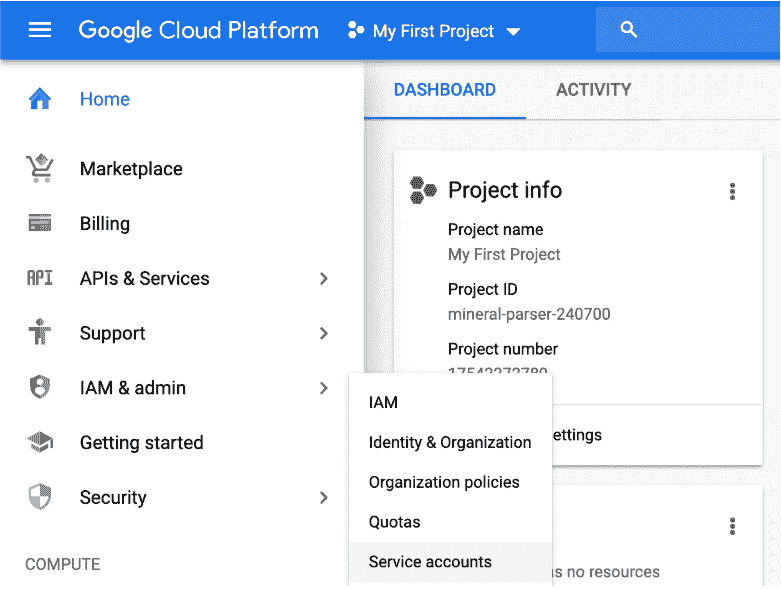

###### Figure 9-8\. 服务账号导航

在服务账户屏幕上，点击顶部的“创建服务账户”以进入服务账户创建向导。在向导的第一个屏幕上，填写类似于 图 9-9 的详细信息。确保编写一个良好的描述，以便在两年后返回此项目时，您可以记忆起每个用户执行何种角色的文档（相信我们，您可能需要重新了解！）。

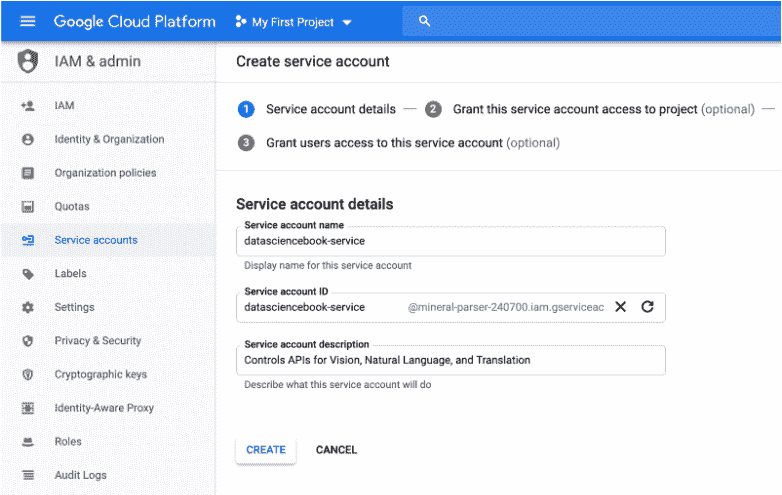

###### 图 9-9\. 服务账户详情

在底部点击“创建”并进入第二步。您希望该服务账户拥有我们正在处理的项目的完整所有权，因此请按照 图 9-10 中所示授予账户完整的项目所有权。

最后，在向导的最后一页上创建一个 JSON 私钥 图 9-11。这是一个文件，将允许您的计算机直接从 Python 命令行进行服务请求，使用与刚刚创建的服务用户相同的凭据。确保将该文件保存在您将创建 Python 脚本的地方。

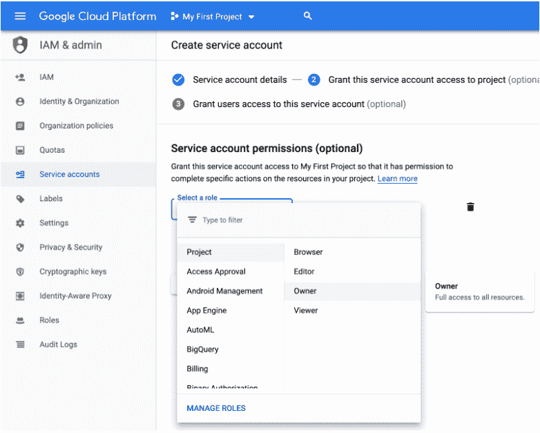

###### 图 9-10\. 授予服务账户完整的项目所有者权限

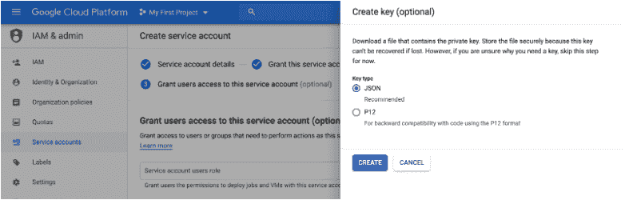

###### 图 9-11\. 创建一个 JSON 私钥文件

在一个快速的命令中，让我们设置好并准备使用 Google Python 客户端。在您喜爱的 Python 环境中，运行以下 pip 命令：

```
$ pip install --upgrade google-cloud-language
```

就这样！您已经设置好并准备使用 Google Cloud APIs 来解决像 Jeana 在 Big Bonanza 面对的问题一样的问题。

# 收集数据

就像在 第八章 中一样，最简单的路径是以 CSV 格式输出带有相关客户备注的投诉文档。我们创建了此处显示的 ABAP 程序以满足此需求：

```
REPORT zcomplaint_csv.

"We kept the variable declarations at the top to 
"increase readability of comments 
"with code below. 
DATA csv_line TYPE string. 
DATA csv_table TYPE TABLE OF string. 
DATA full_note TYPE string. 
DATA core TYPE REF TO cl_crm_bol_core. 
DATA header TYPE crmst_adminh_btil. 
DATA entity_up TYPE REF TO cl_crm_bol_entity. 
DATA query TYPE REF TO cl_crm_bol_dquery_service. 
DATA valid_from TYPE string. 
DATA valid_to TYPE string. 
DATA result TYPE REF TO if_bol_entity_col. 
DATA entity TYPE REF TO cl_crm_bol_entity. 
DATA entity_header TYPE REF TO cl_crm_bol_entity. 
DATA entity_textid TYPE REF TO cl_crm_bol_entity. 
DATA textid_col TYPE REF TO if_bol_entity_col. 
DATA bt_textid TYPE crmst_textid_btil. 

  "PARAMETERS sets up the SAP GUI screen to accept input, 
   PARAMETERS: p_from TYPE dats, 
              p_to   TYPE dats. 

   "CRM uses the Business Object Library to provide 
   "query services to access its data. 
   core = cl_crm_bol_core=>get_instance( ). 
   core->load_component_set( 'BTBP' ). 

   "Use t-code GENIL_BOL_BROWSER to find the right query, 
   query = cl_crm_bol_dquery_service=>get_instance( 
     iv_query_name = 'BTQCompl' ). 

   "Here and in the next block we limit the query to the two 
   "dates entered on the input screen. 
   valid_from = p_from. 
   query->add_selection_param( 
     EXPORTING 
       iv_attr_name = 'VALID_FROM' 
       iv_sign      = 'I' 
       iv_option    = 'EQ' 
       iv_low       = valid_from ). 

   valid_to = p_to. 
   query->add_selection_param( 
     EXPORTING 
       iv_attr_name = 'VALID_TO' 
       iv_sign      = 'I' 
       iv_option    = 'EQ' 
       iv_low       = valid_to ). 

   "get_query_result( ) invokes the query. 
   result = query->get_query_result( ). 

   "This WHILE loop moves through each query result 
   "one at a time. 
   entity ?= result->get_first( ). 
   WHILE entity IS BOUND. 
     "To get the text data from the complaint, we have to 
     "move through several BOL relations. Again see GENIL_BOL_BROWSER. 
     entity_up = entity->get_related_entity( 
       iv_relation_name = 'BTADVSCompl' ). 
     entity_header = entity_up->get_related_entity( 
       iv_relation_name = 'BTOrderHeader' ). 
     entity_textid = entity_header->get_related_entity( 
       iv_relation_name = 'BTHeaderTextIdSet' ). 
     textid_col = entity_textid->get_related_entities( 
       iv_relation_name = 'BTTextIdHAll' ). 

     "Retrieve header information to get the object ID - the 
     "number of the complaint document. 
     entity_header->if_bol_bo_property_access~get_properties( 
       IMPORTING 
         es_attributes = header ). 

     csv_line = header-object_id && ','. 

     "This WHILE block goes line by line through the text 
     "lines in the complaint to build one long string of text. 
     CLEAR full_note. 
     entity_textid ?= textid_col->get_first( ). 
     WHILE entity_textid IS BOUND. 
       entity_textid->if_bol_bo_property_access~get_properties( 
         IMPORTING 
           es_attributes = bt_textid ). 

       IF bt_textid-conc_lines IS NOT INITIAL. 
         CONCATENATE full_note bt_textid-conc_lines 
           INTO full_note RESPECTING BLANKS. 
       ENDIF. 

       entity_textid ?= textid_col->get_next( ). 
     ENDWHILE. 

     "Safety check - if there were no actual texts added 
     "don't send this to the .csv 
     IF full_note IS NOT INITIAL. 
       csv_line = csv_line && full_note. 
       APPEND csv_line TO csv_table. 
     ENDIF. 

    entity ?= result->get_next( ). 
  ENDWHILE. 

  "Document downloads to end user's computer. 
  cl_gui_frontend_services=>gui_download( 
    EXPORTING 
      filename = 'C:\Users\paul\Desktop\' && 
        sy-datum && sy-uzeit+0(4) && '_Complaints.csv' 
    CHANGING 
      data_tab = csv_table ).

```

###### 注意

这个 ABAP 程序在本书中与其他 ABAP 写作的程序不同，它不直接使用 SELECT 语句检索数据。SAP CRM 使用关系表，就像其他章节中的 ECC 系统一样，但它设计为通过 SAP 的业务对象层（BOL）技术访问。BOL 定义了业务对象之间的关系（例如，服务订单与其消耗的零件之间的关系），并允许程序员使用这些关系，而无需了解底层的表结构。

在 SAP GUI 屏幕上运行此程序将生成一个简单的用户界面，在 PARAMETERS 语句中询问两个边界日期，就像 图 9-12 中显示的那样。

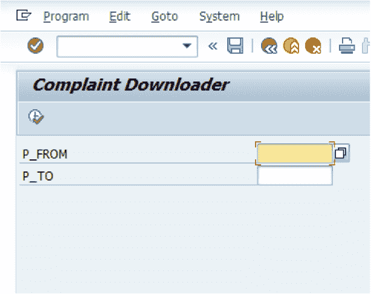

###### 图 9-12\. SAP ABAP 程序屏幕，用于下载投诉数据

该代码生成一个文件，其条目如下，包括文档 ID 和投诉的文本：

```
5507234,"When the order was delivered, I could see the box was clearly mis- handled. It is really up to you to make sure the product gets to me without 
being destroyed...I want a full shipping refund!"  
```

# 分析数据

Jeana 和她的客服团队希望经常性地对这些数据进行分析，因此我们将专注于一种分析方法，简单地为他们提供一个基于从文本中提取的情感排序的客户投诉优先级列表。我们将使用刚刚查看的程序收集当天的投诉，将它们存储在 CSV 文件中，然后使用 Python 逐个投诉进行循环，并请求 Google 的自然语言 API 进行情感分析。

首先确保您使用了从“准备云 API”下载的凭据：

```
$ export GOOGLE_APPLICATION_CREDENTIALS='[YOUR_PATH_TO_FILE]'
```

接下来，我们调用 API 为每个笔记提取情感值。情感分析返回两个值：情感和强度。情感分数从-1.0（完全负面情感）到+1.0（完全正面情感）不等。强度分数表示文本与该情感的强烈关联程度，范围从 0 到无穷大。

```
# Get the right Google Cloud stuff imported.
`from` google.cloud `import` language
`from` google.cloud.language `import` enums
`from` google.cloud.language `import` types
`import` pandas `as` pd

comp = pd.read_csv('example.csv', names=['document', 'complaint'])

# A LanguageServiceClient handles the interchange 
# between computer and Google services.
lsc = language.LanguageServiceClient()

# We are going to add the sentiment score and magnitude
# to the dataframe as we process them.
score = []
magnitude = []
`for` index, row `in` comp.iterrows():
    # Create a document for the request
    lsc_doc = types.Document(
        content=row['complaint'],
        type=enums.Document.Type.PLAIN_TEXT)

    # Send the document to be analyzed.
    sentiment = lsc.analyze_sentiment(document=lsc_doc).document_sentiment

    # Push the sentiment score and magnitude into lists for later.
    score.append(round(sentiment.score, 2))
    magnitude.append(round(sentiment.magnitude, 2))

# After we finish processing them all, add 'score' and
# 'magnitude' columns.
comp['score'] = score
comp['magnitude'] = magnitude
```

我们还没有完全完成。对于每个查询的文档，我们都有情感分数和强度，但在我们给 Jeana 提建议之前，让我们再深思一下。

考虑到在 Big Bonanza 网站上提出的这个投诉：“Big Bonanza 是有史以来最糟糕的公司。” Google 评估此声明的情感为-0.9：极其负面。但强度为 0.9——请记住，强度不是从-1 到+1 的范围，而是从 0 到无穷大！Jeana 可能不希望将预算的任何部分分配给特别关注此投诉，因为这并不具体。给此人星巴克礼品卡或其他形式的奖励可能是无用的。他们甚至可能没有订购任何产品。显然，强度影响了原始情感分数的总体有用性。

现在考虑这个投诉：“我认为这个电池驱动的咖啡杯应该改进，因为它不能正确加热我的饮料。我想退货。” Google 对其情感评分为-0.2，强度为 0.5。在这种情况下，评论者似乎没有高负面情绪，而小的强度指数表明文本中也有些积极因素。根据我们的阅读和评分，Jeana 可能不希望为此投诉分配任何预算以作激励，因为情感分数表明此人并没有非常生气。

针对这个：“我的迷你微波炉一插上电就停止工作了。在第一次加热后不知怎么地门脱落了，然后修理了铰链后再也无法启动。这个产品不好。我要全额退款，包括运费！” Google 给出的情感评分为-0.5，强度为 2.1。Jeana 可能应该考虑对此人进行奖励，因为他们的情感评分明显处于负面范围，并且强度高于其他投诉。这个人似乎感到不满，并且在评论中表达了一些支持。

Duane 设置了几个初始参数，让 Jeana 可以处理数据。根据他从这些示例数据中观察到的情况，他过滤掉了原始分数低于-2.5 的投诉，以及不具有至少 1.5 数量级的投诉。他将剩余的投诉分别按照原始分数和数量级排序，并显示给 Jeana 审阅：

```
# Create a dataframe that filters out the higher scores and
# lower magnitudes.
filtered = comp.loc[(comp['score'] < -0.25) & (comp['magnitude'] > 1.5)]

# Create separate dataframes that order differently.
sort_score = filtered.sort_values(by='score')
sort_magnitude = filtered.sort_values(by='magnitude', ascending=`False`)

# Print them both out for director review. 
print('Complaints weighing in as most heavily negative: ')
print(sort_score[['document', 'score', 'magnitude']].head())

print('Complaints with more total negative magnitude: ')
print(sort_magnitude[['document', 'score', 'magnitude']].head())
```

结果在打印输出中显示如下：

```
Complaints weighing in as most heavily negative: 
   document score magnitude
10 7093024   -0.9        1.9
31 7065438   -0.8        2.1
16 7034597   -0.8        2.3
75 7084738   -0.7        2.0
22 7071324   -0.7        3.1

Complaints with more total negative magnitude: 
   document score magnitude
52 7060923   -0.4        4.3
99 7092489   -0.5        4.1
77 7065486   -0.3        3.8
32 7098254   -0.5        3.6
44 7060766   -0.4        3.3
```

# 总结

自然语言处理（NLP）使计算机能够以前几年无法实现的方式处理人类语言。通过在大量人类语言数据集上训练模型，提供 NLP API 的云公司在 NLP 的通用方法上拥有独特优势。现在可以快速轻松地获得高质量的文本情感分析。

在这一章中，我们帮助了客户服务总监 Jeana，应用 NLP 来建议最具可操作性的客户投诉。我们通过使用 Google 的预训练、云启用的 API，快速分析个别投诉的人类情感，强调了交付速度。通过集中关注得分低的投诉，Jeana 可以在有限的福利预算上努力改善与可能流失的客户的关系，甚至避免其在社交媒体上损害 Big Bonanza。

我们特意选择了一个云 API 的例子，来向 SAP 分析师和数据科学家们强调：你们的工作并不总是要重新发明基础算法。在听取 Jeana 的需求后，Duane、Greg 和 Paul 一致认为在这里使用云 API 是最佳方案。Google Cloud Platform 没有“解决大收获问题的 API”，但当大收获的员工运用创造性思维、SAP 知识和数据科学时，他们无法被阻止！

¹ 示例取自 Porter 的算法：[*http://snowball.tartarus.org/algorithms/porter/stemmer.html*](http://snowball.tartarus.org/algorithms/porter/stemmer.html)。
