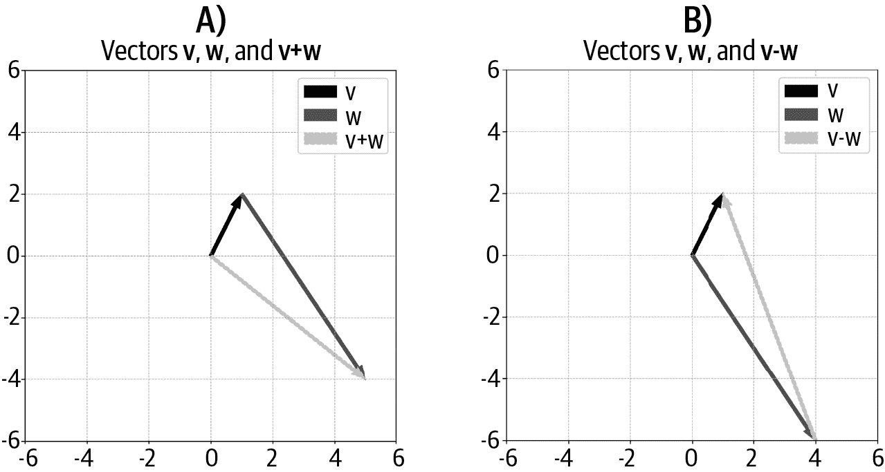

# 第二章：向量，第一部分

向量提供了构建线性代数（因此也是本书其余部分）的基础。

在本章结束时，你将了解关于向量的一切：它们是什么，它们的作用是什么，如何解释它们，以及如何在 Python 中创建和操作它们。你将理解最重要的作用于向量的操作，包括向量代数和点积。最后，你将学习向量分解，这是线性代数的主要目标之一。

# 在 NumPy 中创建和可视化向量

在线性代数中，*向量* 是一组有序的数字列表。（在抽象的线性代数中，向量可以包含其他数学对象，包括函数；但由于本书专注于应用，我们只考虑由数字组成的向量。）

向量具有几个重要特征。我们将从前两个开始：

维度

向量中的数字数量

方向

向量是在 *列方向*（竖直）或 *行方向*（水平）的情况下

维度常用一个看起来很复杂的 <math alttext="double-struck upper R Superscript upper N"><msup><mi>ℝ</mi> <mi>N</mi></msup></math> 表示，其中 <math alttext="double-struck upper R"><mi>ℝ</mi></math> 表示实数（对比 <math alttext="double-struck upper C"><mi>ℂ</mi></math> 表示复数），而 <math alttext="Superscript upper N"><msup><mi>N</mi></msup></math> 表示维度。例如，具有两个元素的向量称为 <math alttext="double-struck upper R squared"><msup><mi>ℝ</mi> <mn>2</mn></msup></math> 的成员。这个特殊的 <math alttext="double-struck upper R"><mi>ℝ</mi></math> 字符是使用 LaTeX 代码制作的，但你也可以写成 R²、R2 或者 R²。

方程 2-1 展示了几个向量的例子；请在阅读后续段落之前确定它们的维度和方向。

##### 方程 2-1。列向量和行向量的例子

<math display="block"><mrow><mi>𝐱</mi> <mo>=</mo> <mfenced close="]" open="["><mtable><mtr><mtd><mn>1</mn></mtd></mtr> <mtr><mtd><mn>4</mn></mtd></mtr> <mtr><mtd><mn>5</mn></mtd></mtr> <mtr><mtd><mn>6</mn></mtd></mtr></mtable></mfenced> <mo>,</mo> <mi>𝐲</mi> <mo>=</mo> <mfenced close="]" open="["><mtable><mtr><mtd><mrow><mn>.3</mn></mrow></mtd></mtr> <mtr><mtd><mrow><mo>-</mo> <mn>7</mn></mrow></mtd></mtr></mtable></mfenced> <mo>,</mo> <mi>𝐳</mi> <mo>=</mo> <mfenced close="]" open=""><mtable><mtr><mtd><mn>1</mn></mtd> <mtd><mn>4</mn></mtd> <mtd><mn>5</mn></mtd> <mtd><mn>6</mn></mtd></mtr></mtable></mfenced></mrow></math>

这里是答案：**x** 是一个 4 维列向量，**y** 是一个 2 维列向量，而 **z** 是一个 4 维行向量。你也可以写成，例如，<math alttext="bold x element-of double-struck upper R Superscript 4"><mrow><mi>𝐱</mi> <mo>∈</mo> <msup><mi>ℝ</mi> <mn>4</mn></msup></mrow></math>，其中 <math alttext="element-of"><mo>∈</mo></math> 符号表示“属于集合”。

**x** 和 **z** 是同一个向量吗？从技术上讲，它们是不同的，即使它们的元素顺序相同。详细讨论请参见 [“向量方向是否重要？”。

你将会在本书以及在整合数学和编程的冒险中学到，数学“在黑板上”的方式与在代码中实现的方式之间存在差异。有些差异微不足道，不重要，而其他则会导致混淆和错误。现在，让我向你介绍数学和编程之间术语上的差异。

我之前写道，向量的*维数*是向量中元素的数量。然而，在 Python 中，向量或矩阵的维数是用于打印数值对象的几何维度的数量。例如，上面显示的所有向量在 Python 中都被认为是“二维数组”，无论向量中包含的元素数量是多少（这是数学上的维数）。在 Python 中，没有特定方向的数字列表被认为是一维数组，无论元素数量如何（该数组将被打印为一行，但是，正如您稍后将看到的，它与行向量的处理方式不同）。在 Python 中，向量的数学维数——向量中的元素数量——称为向量的*长度*或*形状*。

这种不一致且有时冲突的术语可能会令人困惑。事实上，在不同学科（在本例中是数学和计算机科学）交汇处，术语通常是一个棘手的问题。但别担心，通过一些实践你会慢慢掌握。

当涉及到向量时，通常使用小写加粗的罗马字母，比如**v**表示“向量 v”。有些文本使用斜体（*v*）或在顶部打印一个箭头（ <math alttext="ModifyingAbove v With right-arrow"><mover accent="true"><mi>v</mi> <mo>→</mo></mover></math> ）。

线性代数的惯例是默认向量为列向量，除非另有说明。行向量写作 <math alttext="bold w Superscript upper T"><msup><mi>𝐰</mi> <mtext>T</mtext></msup></math> 。<math alttext="Superscript upper T"><msup><mtext>T</mtext></msup></math> 表示*转置操作*，您稍后会了解更多；现在只需知道转置操作将列向量转换为行向量。

# 向量的方向重要吗？

您真的需要担心向量是列向量还是行向量，或者是无方向的一维数组吗？有时是，有时不是。在使用向量存储数据时，方向通常并不重要。但是，如果方向错误，Python 中的某些操作可能会导致错误或意外结果。因此，理解向量的方向是很重要的，因为花费 30 分钟调试代码，最后发现一个行向量应该是一个列向量，肯定会让您头痛不已。

在 Python 中，向量可以用几种数据类型表示。`list` 类型可能看起来是表示向量最简单的方式，并且对于某些应用来说确实如此。但是，许多线性代数运算在 Python 列表上不起作用。因此，大多数时候最好将向量创建为 NumPy 数组。以下代码展示了创建向量的四种方式：

```
asList  = [1,2,3]
asArray = np.array([1,2,3]) # 1D array
rowVec  = np.array([ [1,2,3] ]) # row
colVec  = np.array([ [1],[2],[3] ]) # column
```

变量 `asArray` 是一个*无方向*数组，意味着它既不是行向量也不是列向量，只是 NumPy 中的一个一维数字列表。在 NumPy 中，方向由括号决定：最外层的括号将所有数字组合成一个对象。然后，每一组额外的括号表示一行：行向量（变量 `rowVec`）将所有数字放在一行中，而列向量（变量 `colVec`）有多行，每行包含一个数字。

我们可以通过检查变量的形状来探索这些方向（在编码时检查变量形状通常非常有用）：

```
print(f'asList: {np.shape(asList)}')
print(f'asArray: {asArray.shape}')
print(f'rowVec: {rowVec.shape}')
print(f'colVec: {colVec.shape}')
```

输出如下所示：

```
asList:  (3,)
asArray: (3,)
rowVec:  (1, 3)
colVec:  (3, 1)
```

输出显示一维数组 `asArray` 的大小为（`3`），而有方向的向量是二维数组，其大小为（`1,3`）或（`3,1`），具体取决于方向。维度总是按照（行数,列数）列出。

## 向量的几何

*有序数字列表* 是向量的代数解释；向量的几何解释是具有特定长度（也称为*大小*）和方向（也称为*角度*；相对于正 *x*-轴计算）。向量的两个点称为尾部（起始点）和头部（结束点）；头部通常带有箭头提示以区分尾部。

你可能认为向量编码了一个几何坐标，但向量和坐标实际上是不同的东西。然而，它们在向量从原点开始时是协调的。这被称为*标准位置*，并且在 图 2-1 中有所说明。


###### 图 2-1\. 所有箭头表示相同的向量。位于标准位置的向量其尾部位于原点，其头部位于协调的几何坐标。

无论是几何上还是代数上构想向量都有助于在不同应用中形成直觉，但这只是同一个问题的两面。例如，向量的几何解释在物理学和工程学中很有用（例如表示物理力量），而向量的代数解释在数据科学中很有用（例如存储随时间变化的销售数据）。通常，线性代数概念在二维图表中以几何方式学习，然后通过代数扩展到更高维度。

# 向量的操作

向量就像名词一样；它们是我们线性代数故事中的角色。线性代数的乐趣来自于动词——给这些角色注入生命的行动。这些行动称为*操作*。

一些线性代数操作简单直观，并且完全符合预期（例如加法），而其他一些操作则更复杂，需要整整几章来解释（例如奇异值分解）。让我们从简单的操作开始。

## 添加两个向量

要添加两个向量，只需将每个对应的元素相加。方程 2-2 展示了一个例子：

##### 方程 2-2\. 向量相加

<math alttext="Start 3 By 1 Matrix 1st Row  4 2nd Row  5 3rd Row  6 EndMatrix plus Start 3 By 1 Matrix 1st Row  10 2nd Row  20 3rd Row  30 EndMatrix equals Start 3 By 1 Matrix 1st Row  14 2nd Row  25 3rd Row  36 EndMatrix" display="block"><mrow><mfenced close="]" open="["><mtable><mtr><mtd><mn>4</mn></mtd></mtr> <mtr><mtd><mn>5</mn></mtd></mtr> <mtr><mtd><mn>6</mn></mtd></mtr></mtable></mfenced> <mo>+</mo> <mfenced close="]" open="["><mtable><mtr><mtd><mn>10</mn></mtd></mtr> <mtr><mtd><mn>20</mn></mtd></mtr> <mtr><mtd><mn>30</mn></mtd></mtr></mtable></mfenced> <mo>=</mo> <mfenced close="]" open="["><mtable><mtr><mtd><mn>14</mn></mtd></mtr> <mtr><mtd><mn>25</mn></mtd></mtr> <mtr><mtd><mn>36</mn></mtd></mtr></mtable></mfenced></mrow></math>

正如你可能猜到的那样，向量加法仅对具有相同维度的两个向量定义；例如，在 <math alttext="双划线上的 R 立方"><msup><mi>ℝ</mi> <mn>3</mn></msup></math> 中的向量和在 <math alttext="双划线上的 R 上标 5"><msup><mi>ℝ</mi> <mn>5</mn></msup></math> 中的向量不能相加。

向量减法也与预期相同：逐元素减去两个向量。方程 2-3 示范了一个例子：

##### 方程 2-3\. 向量相减

<math alttext="Start 3 By 1 Matrix 1st Row  4 2nd Row  5 3rd Row  6 EndMatrix minus Start 3 By 1 Matrix 1st Row  10 2nd Row  20 3rd Row  30 EndMatrix equals Start 3 By 1 Matrix 1st Row  negative 6 2nd Row  negative 15 3rd Row  negative 24 EndMatrix" display="block"><mrow><mfenced close="]" open="["><mtable><mtr><mtd><mn>4</mn></mtd></mtr> <mtr><mtd><mn>5</mn></mtd></mtr> <mtr><mtd><mn>6</mn></mtd></mtr></mtable></mfenced> <mo>-</mo> <mfenced close="]" open="["><mtable><mtr><mtd><mn>10</mn></mtd></mtr> <mtr><mtd><mn>20</mn></mtd></mtr> <mtr><mtd><mn>30</mn></mtd></mtr></mtable></mfenced> <mo>=</mo> <mfenced close="]" open="["><mtable><mtr><mtd><mrow><mo>-</mo> <mn>6</mn></mrow></mtd></mtr> <mtr><mtd><mrow><mo>-</mo> <mn>15</mn></mrow></mtd></mtr> <mtr><mtd><mrow><mo>-</mo> <mn>24</mn></mrow></mtd></mtr></mtable></mfenced></mrow></math>

在 Python 中，向量相加是直接的：

```
v = np.array([4,5,6])
w = np.array([10,20,30])
u = np.array([0,3,6,9])
vPlusW = v+w
uPlusW = u+w # error! dimensions mismatched!
```

向量加法是否受向量方向的影响？考虑方程 2-4：

##### 方程 2-4\. 你能将行向量加到列向量中吗？

<math alttext="Start 3 By 1 Matrix 1st Row  4 2nd Row  5 3rd Row  6 EndMatrix plus Start 1 By 3 Matrix 1st Row 1st Column 10 2nd Column 20 3rd Column 30 EndMatrix equals question-mark" display="block"><mrow><mfenced close="]" open="["><mtable><mtr><mtd><mn>4</mn></mtd></mtr> <mtr><mtd><mn>5</mn></mtd></mtr> <mtr><mtd><mn>6</mn></mtd></mtr></mtable></mfenced> <mo>+</mo> <mfenced close="]" open="["><mtable><mtr><mtd><mn>10</mn></mtd> <mtd><mn>20</mn></mtd> <mtd><mn>30</mn></mtd></mtr></mtable></mfenced> <mo>=</mo> <mo>?</mo></mrow></math>

您可能认为这个例子与之前显示的例子没有区别——毕竟，这两个向量都有三个元素。让我们看看 Python 做了什么：

```
v = np.array([[4,5,6]]) # row vector
w = np.array([[10,20,30]]).T # column vector
v+w

>> array([[14, 15, 16],
          [24, 25, 26],
          [34, 35, 36]])
```

结果可能看起来令人困惑，并且与前文所述的向量加法定义不一致。事实上，Python 正在执行一种称为*广播*的操作。您将在本章后面更多地了解广播，但我鼓励您花一点时间思考这个结果，并思考它是如何由添加行向量和列向量而来的。无论如何，这个例子表明方向确实很重要：*只有具有相同维度 **和** 相同方向的两个向量才能相加*。

## 向量加法与减法的几何性质

要在几何上添加两个向量，请将向量放置在一个向量的尾部位于另一个向量的头部的位置（图 A 参见图 2-2）。您可以将此过程扩展到对任意数量的向量求和：简单地将所有向量依次堆叠，然后和向量是从第一个尾到最后一个头的线。



###### 图 2-2\. 两个向量的和与差

几何上减去向量略有不同，但同样直接：将两个向量排列在一起，使它们的尾部位于相同的坐标（这可以通过将两个向量放在标准位置轻松实现）；差向量是从“负”向量的头到“正”向量的头的线（图 B 参见图 2-2）。

不要低估向量减法的几何性质的重要性：它是正交向量分解的基础，而正交向量分解又是线性最小二乘的基础，这是科学和工程中线性代数的最重要应用之一。

## 向量-标量乘法

线性代数中的*标量*是一个独立的数字，不嵌入在向量或矩阵中。标量通常用小写希腊字母表示，如α或λ。因此，向量-标量乘法表示为，例如，β**u**。

向量-标量乘法非常简单：将每个向量元素乘以标量。一个数值示例（方程 2-5）足以理解：

##### 方程 2-5\. 向量-标量乘法（或：标量-向量乘法）

<math alttext="lamda equals 4 comma bold w equals Start 3 By 1 Matrix 1st Row  9 2nd Row  4 3rd Row  1 EndMatrix comma lamda bold w equals Start 3 By 1 Matrix 1st Row  36 2nd Row  16 3rd Row  4 EndMatrix" display="block"><mrow><mi>λ</mi> <mo>=</mo> <mn>4</mn> <mo>,</mo> <mi>𝐰</mi> <mo>=</mo> <mfenced close="]" open="["><mtable><mtr><mtd><mn>9</mn></mtd></mtr> <mtr><mtd><mn>4</mn></mtd></mtr> <mtr><mtd><mn>1</mn></mtd></mtr></mtable></mfenced> <mo>,</mo> <mi>λ</mi> <mi>𝐰</mi> <mo>=</mo> <mfenced close="]" open="["><mtable><mtr><mtd><mn>36</mn></mtd></mtr> <mtr><mtd><mn>16</mn></mtd></mtr> <mtr><mtd><mn>4</mn></mtd></mtr></mtable></mfenced></mrow></math>

我之前提到，存储向量的变量的数据类型有时重要，有时不重要。向量-标量乘法就是一个数据类型重要的例子：

```
s = 2
a = [3,4,5] # as list
b = np.array(a) # as np array
print(a*s)
print(b*s)

>> [ 3, 4, 5, 3, 4, 5 ]
>> [ 6 8 10 ]
```

代码创建了一个标量（变量 `s`）和一个作为列表的向量（变量 `a`），然后将其转换为 NumPy 数组（变量 `b`）。在 Python 中，星号的行为取决于变量类型：标量乘以列表会重复列表 `s` 次（在本例中是两次），这显然*不是*标量-向量乘法的线性代数操作。然而，当向量存储为 NumPy 数组时，星号被解释为元素级乘法。（这里有个小练习：如果你设置 `s = 2.0`，会发生什么？为什么？¹）这两种操作（列表重复和向量-标量乘法）在实际编码中都有用到，所以要注意区别。

## 标量-向量加法

在线性代数中，向量加标量没有正式定义：它们是两种不同的数学对象，不能结合在一起。然而，像 Python 这样的数值处理程序允许将标量添加到向量中，操作类似于标量与向量的乘法：将标量添加到每个向量元素上。以下代码阐明了这个概念：

```
s = 2
v = np.array([3,6])
s+v
>> [5 8]
```

### 向量-标量乘法的几何学

为什么标量被称为“标量”？这源于几何解释。标量调整向量的大小而不改变其方向。标量与向量相乘有四种效果，这取决于标量是大于 1、在 0 和 1 之间、恰好为 0 还是负数。图 2-3 阐述了这个概念。


###### 图 2-3\. 相同向量（黑色箭头）乘以不同标量 <math alttext="sigma"><mi>σ</mi></math> （灰线；略有位移以便看清楚）

我之前写过，标量不会改变向量的方向。但图中显示，当标量为负数时向量方向会翻转（即其角度旋转 180°）。这似乎是个矛盾，但对向量的解释是沿着一个通过原点并且无限延伸到两个方向的无限长线的线（在下一章中，我将称其为“一维子空间”）。从这个意义上讲，“旋转”的向量仍然沿着同一条无限线指向，因此负标量不会改变其方向。这种解释对于矩阵空间、特征向量和奇异向量都很重要，这些概念将在后面的章节中介绍。

向量标量乘法与向量加法结合直接导致*向量平均*。对向量进行平均就像对数字进行平均一样：求和然后除以数字的数量。因此，要对两个向量进行平均，先将它们相加，然后乘以 0.5。一般来说，要对*N*个向量进行平均，将它们求和，然后将结果乘以*1/N*。

## 转置

您已经了解了转置操作：它将列向量转换为行向量，反之亦然。让我提供一个稍微更正式的定义，将推广到转置矩阵（这是第五章中的一个主题）。

矩阵有行和列；因此，每个矩阵元素都有一个(*行,列*)索引。转置操作简单地交换这些索引。这在方程 2-6 中得到了正式化：

##### 方程 2-6。转置操作

<math alttext="bold m Subscript i comma j Superscript upper T Baseline equals bold m Subscript j comma i" display="block"><mrow><msubsup><mi>𝐦</mi> <mrow><mi>i</mi><mo>,</mo><mi>j</mi></mrow> <mtext>T</mtext></msubsup> <mo>=</mo> <msub><mi>𝐦</mi> <mrow><mi>j</mi><mo>,</mo><mi>i</mi></mrow></msub></mrow></math>

向量的方向有一行或一列，这取决于它们的方向。例如，一个 6 维行向量有*i* = 1 和*j*从 1 到 6 的索引，而一个 6 维列向量有*i*从 1 到 6 的索引和*j* = 1。因此，交换*i,j*索引会交换行和列。

这里有一个重要的规则：两次转置将向量返回到其原始方向。换句话说，<math alttext="bold v Superscript TT Baseline equals bold v"><mrow><msup><mi>𝐯</mi> <mtext>TT</mtext></msup> <mo>=</mo> <mi>𝐯</mi></mrow></math> 。这可能看起来显而易见和琐碎，但它是数据科学和机器学习中几个重要证明的基石，包括创建对称协方差矩阵作为数据矩阵乘以其转置（这也是主成分分析将数据空间进行正交旋转的原因……别担心，这个句子以后在本书中会有更多解释！）。

## Python 中的向量广播

广播是一种仅存在于现代基于计算机的线性代数中的操作；这不是传统线性代数教科书中会找到的过程。

广播本质上意味着在一个向量和另一个向量的每个元素之间多次重复一个操作。考虑以下一系列方程：

<math alttext="StartLayout 1st Row  Start 1 By 2 Matrix 1st Row 1st Column 1 2nd Column 1 EndMatrix plus Start 1 By 2 Matrix 1st Row 1st Column 10 2nd Column 20 EndMatrix 2nd Row  Start 1 By 2 Matrix 1st Row 1st Column 2 2nd Column 2 EndMatrix plus Start 1 By 2 Matrix 1st Row 1st Column 10 2nd Column 20 EndMatrix 3rd Row  Start 1 By 2 Matrix 1st Row 1st Column 3 2nd Column 3 EndMatrix plus Start 1 By 2 Matrix 1st Row 1st Column 10 2nd Column 20 EndMatrix EndLayout" display="block"><mtable><mtr><mtd><mrow><mfenced close="]" open="["><mtable><mtr><mtd><mn>1</mn></mtd> <mtd><mn>1</mn></mtd></mtr></mtable></mfenced> <mo>+</mo> <mfenced close="]" open="["><mtable><mtr><mtd><mn>10</mn></mtd> <mtd><mn>20</mn></mtd></mtr></mtable></mfenced></mrow></mtd></mtr> <mtr><mtd><mrow><mfenced close="]" open="["><mtable><mtr><mtd><mn>2</mn></mtd> <mtd><mn>2</mn></mtd></mtr></mtable></mfenced> <mo>+</mo> <mfenced close="]" open="["><mtable><mtr><mtd><mn>10</mn></mtd> <mtd><mn>20</mn></mtd></mtr></mtable></mfenced></mrow></mtd></mtr> <mtr><mtd><mrow><mfenced close="]" open="["><mtable><mtr><mtd><mn>3</mn></mtd> <mtd><mn>3</mn></mtd></mtr></mtable></mfenced> <mo>+</mo> <mfenced close="]" open="["><mtable><mtr><mtd><mn>10</mn></mtd> <mtd><mn>20</mn></mtd></mtr></mtable></mfenced></mrow></mtd></mtr></mtable></math>

注意向量中的模式。我们可以将这组方程紧凑地实现为向量[1 2 3]和[10 20]，然后广播加法。以下是 Python 中的实现方式：

```
v = np.array([[1,2,3]]).T # col vector
w = np.array([[10,20]])   # row vector
v + w # addition with broadcasting

>> array([[11, 21],
          [12, 22],
          [13, 23]])
```

再次可以看到线性代数操作中方向的重要性：尝试运行上面的代码，将`v`变成一个行向量和`w`变成一个列向量。²

因为广播允许进行高效紧凑的计算，它经常在数值编码中使用。您将在本书中看到几个广播的例子，包括* k * -均值聚类部分（第四章）。

# 向量大小和单位向量

一个向量的*大小* —— 也称为*几何长度* 或 *范数* —— 是从向量的尾到头的距离，并且使用标准欧几里德距离公式计算：向量元素的平方和的平方根（见 方程 2-7）。向量大小用双竖线标示在向量周围：<math alttext="parallel-to bold v parallel-to"><mrow><mo>∥</mo> <mi>𝐯</mi> <mo>∥</mo></mrow></math> 。

##### 方程 2-7\. 矢量的范数

<math alttext="parallel-to bold v parallel-to equals StartRoot sigma-summation Underscript i equals 1 Overscript n Endscripts v Subscript i Superscript 2 Baseline EndRoot" display="block"><mrow><mrow><mo>∥</mo> <mi>𝐯</mi> <mo>∥</mo></mrow> <mo>=</mo> <msqrt><mrow><msubsup><mo>∑</mo> <mrow><mi>i</mi><mo>=</mo><mn>1</mn></mrow> <mi>n</mi></msubsup> <msubsup><mi>v</mi> <mi>i</mi> <mn>2</mn></msubsup></mrow></msqrt></mrow></math>

有些应用程序使用平方幅度（写成 ∥ 𝐯 ∥² ），在这种情况下，右侧的平方根项消失。

在展示 Python 代码之前，让我解释一些“黑板”线性代数与 Python 线性代数之间的术语差异。在数学中，向量的维数是该向量中元素的数量，而长度是几何距离；在 Python 中，函数 `len()`（其中 `len` 缩写为 *length*）返回数组的 *维数*，而函数 `np.norm()` 返回几何长度（大小）。在本书中，我将使用术语 *大小*（或 *几何长度*）代替 *长度*，以避免混淆：

```
v = np.array([1,2,3,7,8,9])
v_dim = len(v)  # math dimensionality
v_mag = np.linalg.norm(v) # math magnitude, length, or norm
```

有些应用程序需要一个几何长度为一的向量，这被称为*单位向量*。例如应用包括正交矩阵、旋转矩阵、特征向量和奇异向量。

单位向量被定义为 <math alttext="parallel-to bold v parallel-to equals 1"><mrow><mo>∥</mo> <mi>𝐯</mi> <mo>∥</mo> <mo>=</mo> <mn>1</mn></mrow></math> 。

毫无疑问，大量向量并非单位向量。（我很想写“大多数向量不是单位向量”，但是非单位向量和单位向量都有无穷多个，尽管非单位向量的集合大于单位向量的集合。）幸运的是，任何非单位向量都有一个相关联的单位向量。这意味着我们可以创建一个与非单位向量方向相同的单位向量。创建相关联的单位向量很容易；你只需乘以矢量范数的倒数（方程 2-8）：

##### 方程 2-8\. 创建单位向量

<math alttext="ModifyingAbove bold v With caret equals StartFraction 1 Over parallel-to bold v parallel-to EndFraction bold v" display="block"><mrow><mover accent="true"><mi>𝐯</mi> <mo>^</mo></mover> <mo>=</mo> <mfrac><mn>1</mn> <mrow><mo>∥</mo><mi>𝐯</mi><mo>∥</mo></mrow></mfrac> <mi>𝐯</mi></mrow></math>

你可以看到表示单位向量的常见约定（ <math alttext="ModifyingAbove bold v With caret"><mover accent="true"><mi>𝐯</mi> <mo>^</mo></mover></math> ）与其父向量 <math alttext="bold v"><mi>𝐯</mi></math> 在相同方向上的情况。图 2-4 阐明了这些情况。


###### 图 2-4\. 一个单位向量（灰色箭头）可以从一个非单位向量（黑色箭头）中制作出来；这两个向量有相同的角度但不同的大小。

实际上，“*任何* 非单位向量都有相关联的单位向量”这一说法并不完全正确。有一个矢量其长度为非单位长度，但没有相关联的单位向量。你能猜出这是哪个向量吗？³

这里不展示创建单位向量的 Python 代码，因为这是本章末尾的一个练习之一。

# 向量点积

*点积*（有时也称为*内积*）是线性代数中最重要的操作之一。它是许多操作和算法的基本计算模块，包括卷积、相关性、傅里叶变换、矩阵乘法、线性特征提取、信号过滤等。

有几种方法可以表示两个向量之间的点积。出于某些原因，在学习矩阵乘法后，我将主要使用常见的符号 <math alttext="bold a Superscript upper T Baseline bold b"><mrow><msup><mi>𝐚</mi> <mtext>T</mtext></msup> <mi>𝐛</mi></mrow></math> 。在其他情况下，您可能会看到 <math alttext="bold a dot bold b"><mrow><mi>𝐚</mi> <mo>·</mo> <mi>𝐛</mi></mrow></math> 或 <math alttext="mathematical left-angle bold a comma bold b mathematical right-angle"><mrow><mo>〈</mo> <mi>𝐚</mi> <mo>,</mo> <mi>𝐛</mi> <mo>〉</mo></mrow></math> 。

点积是一个单一的数字，提供关于两个向量之间关系的信息。让我们首先专注于计算点积的算法，然后我会讨论如何解释它。

要计算点积，您需要将两个向量的对应元素相乘，然后将所有单个乘积求和。换句话说：逐元素乘法和求和。在 方程式 2-9 中，**a** 和 **b** 是向量，a[i] 表示 **a** 的第 *i* 个元素。

##### 方程式 2-9\. 点积公式

<math alttext="delta equals sigma-summation Underscript i equals 1 Overscript n Endscripts a Subscript i Baseline b Subscript i" display="block"><mrow><mi>δ</mi> <mo>=</mo> <munderover><mo>∑</mo> <mrow><mi>i</mi><mo>=</mo><mn>1</mn></mrow> <mi>n</mi></munderover> <msub><mtext>a</mtext> <mi>i</mi></msub> <msub><mtext>b</mtext> <mi>i</mi></msub></mrow></math>

从公式可以看出，点积只在相同维度的两个向量之间有效。方程式 2-10 展示了一个数值示例：

##### 方程式 2-10\. 示例点积计算

<math alttext="StartLayout 1st Row 1st Column Start 1 By 4 Matrix 1st Row 1st Column 1 2nd Column 2 3rd Column 3 4th Column 4 EndMatrix dot Start 1 By 4 Matrix 1st Row 1st Column 5 2nd Column 6 3rd Column 7 4th Column 8 EndMatrix 2nd Column equals 1 times 5 plus 2 times 6 plus 3 times 7 plus 4 times 8 2nd Row 1st Column Blank 2nd Column equals 5 plus 12 plus 21 plus 32 3rd Row 1st Column Blank 2nd Column equals 70 EndLayout" display="block"><mtable displaystyle="true"><mtr><mtd columnalign="right"><mrow><mfenced close="]" open="["><mtable><mtr><mtd><mn>1</mn></mtd> <mtd><mn>2</mn></mtd> <mtd><mn>3</mn></mtd> <mtd><mn>4</mn></mtd></mtr></mtable></mfenced> <mo>·</mo> <mfenced close="]" open="["><mtable><mtr><mtd><mn>5</mn></mtd> <mtd><mn>6</mn></mtd> <mtd><mn>7</mn></mtd> <mtd><mn>8</mn></mtd></mtr></mtable></mfenced></mrow></mtd> <mtd columnalign="left"><mrow><mo>=</mo> <mn>1</mn> <mo>×</mo> <mn>5</mn> <mo>+</mo> <mn>2</mn> <mo>×</mo> <mn>6</mn> <mo>+</mo> <mn>3</mn> <mo>×</mo> <mn>7</mn> <mo>+</mo> <mn>4</mn> <mo>×</mo> <mn>8</mn></mrow></mtd></mtr> <mtr><mtd columnalign="left"><mrow><mo>=</mo> <mn>5</mn> <mo>+</mo> <mn>12</mn> <mo>+</mo> <mn>21</mn> <mo>+</mo> <mn>32</mn></mrow></mtd></mtr> <mtr><mtd columnalign="left"><mrow><mo>=</mo> <mn>70</mn></mrow></mtd></mtr></mtable></math>

# 索引的烦恼

标准数学表示法和一些数学导向的数值处理程序，如 MATLAB 和 Julia，从 1 开始索引，到 *N* 结束；而一些编程语言如 Python 和 Java 从 0 开始索引，到 *N* − 1 结束。我们不需要辩论每种约定的优缺点 — 虽然我有时会想知道这种不一致性引入了多少错误到人类文明中 — 但在将公式翻译为 Python 代码时注意这种差异是很重要的。

在 Python 中实现点积有多种方法；最直接的方法是使用 `np.dot()` 函数。

```
v = np.array([1,2,3,4])
w = np.array([5,6,7,8])
np.dot(v,w)
```

# 关于 np.dot() 的注意事项

函数`np.dot()`实际上并没有实现向量的点积；它实现的是矩阵乘法，而矩阵乘法是一组点积的集合。在学习矩阵乘法的规则和机制之后会更加清晰（第五章）。如果你想现在就探索这一点，可以修改之前的代码，给两个向量分别赋予方向（行向量对比列向量）。你会发现，只有在第一个输入是行向量，第二个输入是列向量时，输出才是点积。

点积的一个有趣属性是：标量乘以一个向量会按相同的比例扩展点积。我们可以通过扩展之前的代码来探索这一点：

```
s = 10
np.dot(s*v,w)
```

向量`v`和`w`的点积为 70，使用`s*v`进行的点积（在数学符号中可以写为<math alttext="sigma bold v Superscript upper T Baseline bold w"><mrow><mi>σ</mi> <msup><mi>𝐯</mi> <mtext>T</mtext></msup> <mi>𝐰</mi></mrow></math>）为 700。现在尝试一个负标量，例如`s = -1`。你会看到点积的大小保持不变，但符号被反转。当然，当`s = 0`时，点积为零。

现在你知道如何计算点积了。点积意味着什么，我们如何解释它？

点积可以被解释为两个向量之间的*相似性*或*映射*的度量。想象一下，你从 20 个人那里收集了身高和体重数据，并将这些数据存储在两个向量中。你肯定希望这些变量之间有关联（身高较高的人 tend to weigh more），因此你可以期望这两个向量之间的点积较大。然而，点积的大小取决于数据的比例，这意味着以克和厘米测量的数据之间的点积将大于以磅和英尺测量的数据之间的点积。然而，这种任意的缩放可以通过归一化因子来消除。事实上，两个变量的归一化点积被称为*皮尔逊相关系数*，它是数据科学中最重要的分析之一。更多信息请参见第四章！

## 点积具有分配性质

数学的分配性质是：<math alttext="a left-parenthesis b plus c right-parenthesis equals a b plus a c"><mrow><mi>a</mi> <mo>(</mo> <mi>b</mi> <mo>+</mo> <mi>c</mi> <mo>)</mo> <mo>=</mo> <mi>a</mi> <mi>b</mi> <mo>+</mo> <mi>a</mi> <mi>c</mi></mrow></math>。转化为向量和向量点积的术语，意味着：

<math alttext="bold a Superscript upper T Baseline left-parenthesis bold b plus bold c right-parenthesis equals bold a Superscript upper T Baseline bold b plus bold a Superscript upper T Baseline bold c" display="block"><mrow><msup><mi>𝐚</mi> <mtext>T</mtext></msup> <mrow><mo>(</mo> <mi>𝐛</mi> <mo>+</mo> <mi>𝐜</mi> <mo>)</mo></mrow> <mo>=</mo> <msup><mi>𝐚</mi> <mtext>T</mtext></msup> <mi>𝐛</mi> <mo>+</mo> <msup><mi>𝐚</mi> <mtext>T</mtext></msup> <mi>𝐜</mi></mrow></math>

换句话说，一个向量和的点积等于各个向量点积的和。

以下 Python 代码展示了分配性质：

```
a = np.array([ 0,1,2 ])
b = np.array([ 3,5,8 ])
c = np.array([ 13,21,34 ])

# the dot product is distributive
res1 = np.dot( a, b+c )
res2 = np.dot( a,b ) + np.dot( a,c )
```

两个结果 `res1` 和 `res2` 是相同的（对于这些向量，答案是 110），这说明了点积的分配性质。注意数学公式如何被转化为 Python 代码；将公式转化为代码是数学导向编程中的重要技能。

## 点积的几何性质

点积还有一个几何定义，即两个向量的大小乘积，乘以它们之间的余弦值（方程式 2-11）。

##### 方程式 2-11\. 向量点积的几何定义

<math alttext="alpha equals cosine left-parenthesis theta Subscript bold v comma bold w Baseline right-parenthesis parallel-to bold v parallel-to parallel-to bold w parallel-to" display="block"><mrow><mi>α</mi> <mo>=</mo> <mo form="prefix">cos</mo> <mo>(</mo> <msub><mi>θ</mi> <mrow><mi>𝐯</mi><mo>,</mo><mi>𝐰</mi></mrow></msub> <mo>)</mo> <mo>∥</mo> <mi>𝐯</mi> <mo>∥</mo> <mo>∥</mo> <mi>𝐰</mi> <mo>∥</mo></mrow></math>

方程式 2-9 和 方程式 2-11 在数学上是等价的，但表达形式不同。它们的等价性证明是数学分析中有趣的练习，但需要大约一页的文本，依赖于首先证明包括余弦定理在内的其他原理。这个证明对本书不相关，因此被省略。

注意向量的大小严格为正（除了零向量，其长度为 <math alttext="parallel-to bold 0 parallel-to equals 0"><mrow><mo>∥</mo> <mn mathvariant="bold">0</mn> <mo>∥</mo> <mo>=</mo> <mn>0</mn></mrow></math> ），而角的余弦值可以在 -1 到 +1 之间。这意味着点积的符号完全由两个向量之间的几何关系决定。图 2-5 展示了两个向量之间角度的五种点积符号情况（在二维中用于可视化，但原理适用于更高维度）。


###### 图 2-5\. 两个向量之间的点积符号显示了这些向量之间的几何关系

# 记住这个：正交向量的点积为零

一些数学老师坚持认为你不应该记忆公式和术语，而应该理解过程和证明。但让我们诚实地说：记忆是学习数学中重要且不可避免的一部分。幸运的是，线性代数并不需要过多的记忆负担，但有一些事情你必须简单地记住。

举个例子：正交向量的点积为零（反之亦然——当点积为零时，两个向量是正交的）。因此，以下陈述是等价的：两个向量是正交的；两个向量的点积为零；两个向量成 90°角。重复这种等价性，直到它永久地刻在你的大脑中。

# 其他向量乘法

点乘可能是最重要、也是最经常使用的一种向量乘法方式。但还有几种其他向量乘法方式。

## 哈达玛乘法

这只是一个元素级乘法的花哨术语。要实现哈达玛乘法，需要将两个向量中对应的每个元素相乘。乘积是与两个乘数相同维度的向量。例如：

<math display="block"><mrow><mfenced close="]" open="["><mtable><mtr><mtd><mn>5</mn></mtd></mtr> <mtr><mtd><mn>4</mn></mtd></mtr> <mtr><mtd><mn>8</mn></mtd></mtr> <mtr><mtd><mn>2</mn></mtd></mtr></mtable></mfenced> <mo>⊙</mo> <mfenced close="]" open="["><mtable><mtr><mtd><mrow><mphantom><mo>-</mo></mphantom> <mn>1</mn></mrow></mtd></mtr> <mtr><mtd><mrow><mphantom><mo>-</mo></mphantom> <mn>0</mn></mrow></mtd></mtr> <mtr><mtd><mrow><mphantom><mo>-</mo></mphantom> <mn>.5</mn></mrow></mtd></mtr> <mtr><mtd><mrow><mo>-</mo> <mn>1</mn></mrow></mtd></mtr></mtable></mfenced> <mo>=</mo> <mfenced close="]" open="["><mtable><mtr><mtd><mrow><mphantom><mo>-</mo></mphantom> <mn>5</mn></mrow></mtd></mtr> <mtr><mtd><mrow><mphantom><mo>-</mo></mphantom> <mn>0</mn></mrow></mtd></mtr> <mtr><mtd><mrow><mphantom><mo>-</mo></mphantom> <mn>4</mn></mrow></mtd></mtr> <mtr><mtd><mrow><mo>-</mo> <mn>2</mn></mrow></mtd></mtr></mtable></mfenced></mrow></math>

在 Python 中，星号表示两个向量或矩阵的逐元素乘法：

```
a = np.array([5,4,8,2])
b = np.array([1,0,.5])
a*b
```

尝试在 Python 中运行该代码然后……哎呀！Python 会报错。找到并修复了错误。从该错误中，你学到了什么关于哈达玛乘法？查看脚注获取答案。⁴

哈达玛乘积是组织多个标量乘法的便捷方式。例如，想象一下你有不同商店销售的小部件数量以及每个商店每件小部件的价格的数据。你可以将每个变量表示为向量，然后对这些向量进行哈达玛乘法以计算每个商店的小部件收入（这与跨所有商店的总收入不同，后者可以通过点积计算）。

## 外积

外积是通过一个列向量和一个行向量创建矩阵的一种方式。外积矩阵中的每一行是行向量与列向量中对应元素的标量乘积。我们也可以说外积矩阵中的每一列是列向量与行向量中对应元素的标量乘积。在第六章中，我将称之为“秩-1 矩阵”，但现在不要担心这个术语；而是要专注于下面示例中展示的模式：

<math alttext="Start 3 By 1 Matrix 1st Row  a 2nd Row  b 3rd Row  c EndMatrix Start 1 By 2 Matrix 1st Row 1st Column d 2nd Column e EndMatrix equals Start 3 By 2 Matrix 1st Row 1st Column a d 2nd Column a e 2nd Row 1st Column b d 2nd Column b e 3rd Row 1st Column c d 2nd Column c e EndMatrix" display="block"><mrow><mfenced close="]" open="["><mtable><mtr><mtd><mi>a</mi></mtd></mtr> <mtr><mtd><mi>b</mi></mtd></mtr> <mtr><mtd><mi>c</mi></mtd></mtr></mtable></mfenced> <mfenced close="]" open="["><mtable><mtr><mtd><mi>d</mi></mtd> <mtd><mi>e</mi></mtd></mtr></mtable></mfenced> <mo>=</mo> <mfenced close="]" open=""><mtable><mtr><mtd><mrow><mi>a</mi> <mi>d</mi></mrow></mtd> <mtd><mrow><mi>a</mi> <mi>e</mi></mrow></mtd></mtr> <mtr><mtd><mrow><mi>b</mi> <mi>d</mi></mrow></mtd> <mtd><mrow><mi>b</mi> <mi>e</mi></mrow></mtd></mtr> <mtr><mtd><mrow><mi>c</mi> <mi>d</mi></mrow></mtd> <mtd><mrow><mi>c</mi> <mi>e</mi></mrow></mtd></mtr></mtable></mfenced></mrow></math>

外积与点积有很大的不同：它产生一个矩阵而不是一个标量，并且外积中的两个向量可以具有不同的维度，而点积中的两个向量必须具有相同的维度。

外积表示为<math alttext="bold v bold w Superscript upper T"><mrow><mi>𝐯</mi> <msup><mi>𝐰</mi> <mtext>T</mtext></msup></mrow></math>（请记住我们假设向量是列向量，因此外积涉及将列乘以行）。注意点积（<math alttext="bold v Superscript upper T Baseline bold w"><mrow><msup><mi>𝐯</mi> <mtext>T</mtext></msup> <mi>𝐰</mi></mrow></math>）与外积（<math alttext="bold v bold w Superscript upper T"><mrow><mi>𝐯</mi> <msup><mi>𝐰</mi> <mtext>T</mtext></msup></mrow></math>）之间的微妙但重要的差异。现在这可能看起来奇怪和令人困惑，但我保证在学习第五章关于矩阵乘法后，这将变得非常清晰。

外积类似于广播，但它们并不相同：*广播*是一种通用的编码操作，用于在算术运算（如加法、乘法和除法）中扩展向量；*外积*是一种特定的数学过程，用于两个向量的乘法。

NumPy 可以通过函数`np.outer()`或函数`np.dot()`计算外积，如果两个输入向量分别是列向量和行向量。

## 交叉乘积和三重积

"还有其他几种向量乘法方法，如叉积或三重积。这些方法用于几何和物理学中，但在技术相关应用中很少出现，本书不会花时间介绍它们。我在这里提到它们只是让你对这些名词有所了解。"

# "正交向量分解"

"矩阵或向量的“分解”意味着将该矩阵分解为多个更简单的部分。分解用于揭示矩阵中“隐藏”的信息，使矩阵更易于处理，或用于数据压缩。可以毫不夸张地说，线性代数的很多内容（无论是抽象的还是实际的）都涉及矩阵分解。矩阵分解非常重要。"

"让我用两个简单的标量示例介绍分解的概念："

+   "我们可以将数字 42.01 分解为两部分：42 和.01。也许.01 是要忽略的噪音，或者目标是压缩数据（整数 42 比浮点数 42.01 需要更少的内存）。无论动机如何，分解涉及将一个数学对象表示为更简单对象的和（42 = 42 + .01）。"

+   "我们可以将数字 42 分解为质数 2、3 和 7 的乘积。这种分解称为*质因数分解*，在数值处理和密码学中有许多应用。这个例子涉及乘积而不是求和，但要点是相同的：将一个数学对象分解为更小、更简单的部分。"

"在本节中，我们将开始探讨一个简单但重要的分解方法，即将一个向量分解为两个分开的向量，其中一个与参考向量正交，另一个与该参考向量平行。正交向量分解直接导致了格拉姆-施密特过程和 QR 分解，这在解决统计学中的逆问题时经常使用。"

"让我们从一幅图开始，这样你可以看到分解的目标。图 2-6 说明了这种情况：我们有两个位于标准位置的向量 <math alttext="bold a"><mi>𝐚</mi></math> 和 <math alttext="bold b"><mi>𝐛</mi></math> ，我们的目标是找到 <math alttext="bold b"><mi>𝐛</mi></math> 头部最接近的 <math alttext="bold a"><mi>𝐚</mi></math> 点。我们还可以将其表达为一个优化问题：将向量 <math alttext="bold b"><mi>𝐛</mi></math> 投影到向量 <math alttext="bold a"><mi>𝐚</mi></math> 上，使得投影距离最小化。当然，在 <math alttext="bold a"><mi>𝐚</mi></math> 上的那一点将会是 <math alttext="beta bold a"><mrow><mi>β</mi> <mi>𝐚</mi></mrow></math> 的缩放版本。所以我们的目标是找到标量 <math alttext="beta"><mi>β</mi></math> 。（与正交向量分解的联系很快会变得清晰。）"

"![图片。"###### 图 2-6\. 投影 <math alttext="bold b"><mi>𝐛</mi></math> 头部的点到向量 <math alttext="bold a"><mi>𝐚</mi></math> 上，以获得最小距离，我们需要一个计算 <math alttext="beta"><mi>β</mi></math> 的公式，使投影向量 <math alttext="left-parenthesis bold b minus beta bold a right-parenthesis"><mrow><mo>(</mo> <mi>𝐛</mi> <mo>-</mo> <mi>β</mi> <mi>𝐚</mi> <mo>)</mo></mrow></math> 的长度最小化。重要的是，我们可以使用向量减法来定义从 <math alttext="bold b"><mi>𝐛</mi></math> 到 <math alttext="beta bold a"><mrow><mi>β</mi> <mi>𝐚</mi></mrow></math> 的直线。我们可以给这条线一个独立的字母，例如向量 <math alttext="bold c"><mi>𝐜</mi></math> ，但减法对于发现解决方案是必要的。导致解决此问题的关键见解是，距离 <math alttext="bold b"><mi>𝐛</mi></math> 头部最近的 <math alttext="bold a"><mi>𝐚</mi></math> 上的点是通过从 <math alttext="bold b"><mi>𝐛</mi></math> 到 <math alttext="beta bold a"><mrow><mi>β</mi> <mi>𝐚</mi></mrow></math> 画一条直线来找到的，该直线与 <math alttext="bold a"><mi>𝐚</mi></math> 垂直。这里的直觉是想象一个由原点、<math alttext="bold b"><mi>𝐛</mi></math> 头部和 <math alttext="beta bold a"><mrow><mi>β</mi> <mi>𝐚</mi></mrow></math> 组成的三角形；从 <math alttext="bold b"><mi>𝐛</mi></math> 到 <math alttext="beta bold a"><mrow><mi>β</mi> <mi>𝐚</mi></mrow></math> 的线段长度随角度 <math alttext="measured-angle beta bold a"><mrow><mi>∡</mi> <mi>β</mi> <mi>𝐚</mi></mrow></math> 小于 <math alttext="90 Superscript ring"><msup><mn>90</mn> <mo>∘</mo></msup></math> 或大于 <math alttext="90 Superscript ring"><msup><mn>90</mn> <mo>∘</mo></msup></math> 而变长。把这些放在一起，我们推断出 <math alttext="left-parenthesis bold b minus beta bold a right-parenthesis"><mrow><mo>(</mo> <mi>𝐛</mi> <mo>-</mo> <mi>β</mi> <mi>𝐚</mi> <mo>)</mo></mrow></math> 垂直于 <math alttext="beta bold a"><mrow><mi>β</mi> <mi>𝐚</mi></mrow></math> ，这意味着这些向量是垂直的。这意味着它们的点积必须为零。让我们把这些话语转化为一个方程：<math alttext="bold a Superscript upper T Baseline left-parenthesis bold b minus beta bold a right-parenthesis equals 0" display="block"><mrow><msup><mi>𝐚</mi> <mtext>T</mtext></msup> <mrow><mo>(</mo> <mi>𝐛</mi> <mo>-</mo> <mi>β</mi> <mi>𝐚</mi> <mo>)</mo></mrow> <mo>=</mo> <mn>0</mn></mrow></math>从这里，我们可以应用一些代数来解 <math alttext="beta"><mi>β</mi></math> 的问题（注意点积的分配性质的应用），如 方程式 2-12 所示：##### 方程式 2-12\. 解决正交投影问题<math alttext="StartLayout 1st Row 1st Column bold a Superscript upper T Baseline bold b minus beta bold a Superscript upper T Baseline bold a 2nd Column equals 0 2nd Row 1st Column beta bold a Superscript upper T Baseline bold a 2nd Column equals bold a Superscript upper T Baseline bold b 3rd Row 1st Column beta 2nd Column equals StartFraction bold a Superscript upper T Baseline bold b Over bold a Superscript upper T Baseline bold a EndFraction EndLayout" display="block"><mtable displaystyle="true"><mtr><mtd columnalign="right"><mrow><msup><mi>𝐚</mi> <mtext>T</mtext></msup> <mi>𝐛</mi> <mo>-</mo> <mi>β</mi> <msup><mi>𝐚</mi> <mtext>T</mtext></msup> <mi>𝐚</mi></mrow></mtd> <mtd columnalign="left"><mrow><mo>=</mo> <mn>0</mn></mrow></mtd></mtr> <mtr><mtd columnalign="right"><mrow><mi>β</mi> <msup><mi>𝐚</mi> <mtext>T</mtext></msup> <mi>𝐚</mi></mrow></mtd> <mtd columnalign="left"><mrow><mo>=</mo> <msup><mi>𝐚</mi> <mtext>T</mtext></msup> <mi>𝐛</mi></mrow></mtd></mtr> <mtr><mtd columnalign="right"><mi>β</mi></mtd> <mtd columnalign="left"><mrow><mo>=</mo> <mfrac><mrow><msup><mi>𝐚</mi> <mtext>T</mtext></msup> <mi>𝐛</mi></mrow> <mrow><msup><mi>𝐚</mi> <mtext>T</mtext></msup> <mi>𝐚</mi></mrow></mfrac></mrow></mtd></mtr></mtable></math>这真是太美妙了：我们从一个简单的几何图像开始，探索了几何图像的含义，将这些含义表达为一个公式，然后应用了一点代数。最终，我们发现了一个将点投影到具有最小距离的线上的公式。这被称为*正交投影*，它是统计学和机器学习中许多应用的基础，包括著名的最小二乘法公式（你将在第 9、10 和 11 章节中看到正交投影）。我可以想象你肯定非常想看看如何使用 Python 代码来实现这个公式。但你需要自己在本章末尾的 练习 2-8 中编写这段代码。如果你等不及想要先解决这个练习，然后继续学习正交分解。你可能会想知道这与正交向量分解，也就是本节标题有什么关系。最小距离投影是必要的基础，你现在已经准备好学习这种分解了。通常情况下，我们从设置和目标开始。我们有两个向量，我将它们称为“目标向量”和“参考向量”。我们的目标是将目标向量分解为另外两个向量，这两个向量的和等于目标向量，并且其中一个向量垂直于参考向量，另一个平行于参考向量。这种情况在 图 2-7 中有所说明。在进行数学推导之前，让我们先搞清楚术语：我将称目标向量为 <math alttext="bold t"><mi>𝐭</mi></math>，参考向量为 <math alttext="bold r"><mi>𝐫</mi></math>。然后，从目标向量形成的两个向量将被称为*垂直分量*，表示为 <math alttext="bold t Subscript up-tack bold r"><msub><mi>𝐭</mi> <mrow><mo>⊥</mo><mi>𝐫</mi></mrow></msub></math>，以及*平行分量*，表示为 <math alttext="bold t Subscript parallel-to bold r"><msub><mi>𝐭</mi> <mrow><mo>∥</mo><mi>𝐫</mi></mrow></msub></math>。

###### 图 2-7\. 正交向量分解的示例：将向量 <math alttext="bold t"><mi>𝐭</mi></math> 分解为与向量 <math alttext="bold r"><mi>𝐫</mi></math> 正交且平行的两个向量之和。

我们从定义平行分量开始。什么是与<math alttext="bold r"><mi>𝐫</mi></math>平行的向量？显然，任何<math alttext="bold r"><mi>𝐫</mi></math>的缩放版本都与<math alttext="bold r"><mi>𝐫</mi></math>平行。因此，我们通过刚刚发现的正交投影公式（Equation 2-13）来简单地找到<math alttext="bold t Subscript parallel-to bold r"><msub><mi>𝐭</mi> <mrow><mo>∥</mo><mi>𝐫</mi></mrow></msub></math>。

##### 方程式 2-13。计算**t**相对于**r**的平行分量

<math alttext="bold t Subscript parallel-to bold r Baseline equals bold r StartFraction bold t Superscript upper T Baseline bold r Over bold r Superscript upper T Baseline bold r EndFraction" display="block"><mrow><msub><mi>𝐭</mi> <mrow><mo>∥</mo><mi>𝐫</mi></mrow></msub> <mo>=</mo> <mi>𝐫</mi> <mfrac><mrow><msup><mi>𝐭</mi> <mtext>T</mtext></msup> <mi>𝐫</mi></mrow> <mrow><msup><mi>𝐫</mi> <mtext>T</mtext></msup> <mi>𝐫</mi></mrow></mfrac></mrow></math>

注意与 Equation 2-12 的微妙差别：那里我们只计算了标量<math alttext="beta"><mi>β</mi></math>；而这里我们要计算缩放向量<math alttext="beta bold r"><mrow><mi>β</mi> <mi>𝐫</mi></mrow></math>。

那就是平行分量。我们如何找到垂直分量呢？这更容易，因为我们已经知道这两个向量分量必须等于原始目标向量。因此：

<math alttext="StartLayout 1st Row 1st Column bold t 2nd Column equals bold t Subscript up-tack bold r Baseline plus bold t Subscript parallel-to bold r Baseline 2nd Row 1st Column bold t Subscript up-tack bold r 2nd Column equals bold t minus bold t Subscript parallel-to bold r EndLayout" display="block"><mtable displaystyle="true"><mtr><mtd columnalign="right"><mi>𝐭</mi></mtd> <mtd columnalign="left"><mrow><mo>=</mo> <msub><mi>𝐭</mi> <mrow><mo>⊥</mo><mi>𝐫</mi></mrow></msub> <mo>+</mo> <msub><mi>𝐭</mi> <mrow><mo>∥</mo><mi>𝐫</mi></mrow></msub></mrow></mtd></mtr> <mtr><mtd columnalign="right"><msub><mi>𝐭</mi> <mrow><mo>⊥</mo><mi>𝐫</mi></mrow></msub></mtd> <mtd columnalign="left"><mrow><mo>=</mo> <mi>𝐭</mi> <mo>-</mo> <msub><mi>𝐭</mi> <mrow><mo>∥</mo><mi>𝐫</mi></mrow></msub></mrow></mtd></mtr></mtable></math>

换句话说，我们从原始向量中减去平行分量，剩余部分即为我们的垂直分量。

但是那个垂直分量*真的*与参考向量正交吗？是的，它是！为了证明这一点，你可以展示垂直分量与参考向量的点积为零：

<math alttext="StartLayout 1st Row 1st Column left-parenthesis bold t Subscript up-tack bold r Baseline right-parenthesis Superscript upper T Baseline bold r 2nd Column equals 0 2nd Row 1st Column left-parenthesis bold t minus bold r StartFraction bold t Superscript upper T Baseline bold r Over bold r Superscript upper T Baseline bold r EndFraction right-parenthesis Superscript upper T Baseline bold r 2nd Column equals 0 EndLayout" display="block"><mtable displaystyle="true"><mtr><mtd columnalign="right"><mrow><msup><mrow><mo>(</mo><msub><mi>𝐭</mi> <mrow><mo>⊥</mo><mi>𝐫</mi></mrow></msub> <mo>)</mo></mrow> <mtext>T</mtext></msup> <mi>𝐫</mi></mrow></mtd> <mtd columnalign="left"><mrow><mo>=</mo> <mn>0</mn></mrow></mtd></mtr> <mtr><mtd columnalign="right"><mrow><msup><mrow><mo>(</mo><mi>𝐭</mi><mo>-</mo><mi>𝐫</mi><mfrac><mrow><msup><mi>𝐭</mi> <mtext>T</mtext></msup> <mi>𝐫</mi></mrow> <mrow><msup><mi>𝐫</mi> <mtext>T</mtext></msup> <mi>𝐫</mi></mrow></mfrac><mo>)</mo></mrow> <mtext>T</mtext></msup> <mi>𝐫</mi></mrow></mtd> <mtd columnalign="left"><mrow><mo>=</mo> <mn>0</mn></mrow></mtd></mtr></mtable></math>

完成这个证明的代数过程是直接但乏味的，所以我省略了它。相反，你将通过 Python 代码来建立直觉。

希望你喜欢学习正交向量分解。再次注意一般原则：我们将一个数学对象分解为其他对象的组合。分解的细节取决于我们的约束条件（在本例中为正交和平行于参考向量），这意味着不同的约束条件（即分析目标的不同）可以导致相同向量的不同分解。

# 总结

线性代数的美在于，即使是对矩阵进行最复杂和计算密集的操作，也可以分解为简单操作，其中大部分可以通过几何直觉来理解。不要低估对向量进行简单操作的重要性，因为你在本章学到的将构成本书以及你作为*应用线性代数学家*（如果你从事数据科学、机器学习、人工智能、深度学习、图像处理、计算视觉、统计等工作，这才是你真正的身份）职业生涯的基础。

这是本章最重要的要点：

+   向量是一个按顺序排列的数字列表，可以放置在列或行中。向量的元素数称为其维数，向量可以在几何空间中表示为具有与维数相等的轴数的线。

+   向量的几个算术运算（加法、减法和 Hadamard 乘法）按元素逐个操作。

+   点积是一个单一的数字，编码了两个相同维度向量之间的关系，计算方法是元素逐个相乘并求和。

+   对于正交向量，点积为零，几何上意味着向量在直角处相交。

+   正交向量分解涉及将一个向量分解为另外两个与参考向量正交且平行的向量之和。这种分解的公式可以从几何中重新推导出来，但你应该记住“映射到大小”的概念正是这个公式表达的概念。

# 代码练习

我希望你不要把这些练习看作是你需要完成的烦人工作。相反，这些练习是提升你的数学和编码技能的机会，确保你真正理解本章内容。

我也希望你把这些练习看作是使用 Python 继续探索线性代数的跳板。更改代码以使用不同的数字、不同的维度、不同的方向等。编写自己的代码来测试章节中提到的其他概念。最重要的是：享受学习过程，拥抱学习的体验。

作为提醒：所有练习的解答可以在[*https://github.com/mikexcohen/LA4DataScience*](https://github.com/mikexcohen/LA4DataScience)上查看或下载。

##### 练习 2-1。

在线代码库“丢失”了创建 Figure 2-2 的代码。（实际上并不是真的“丢失” — 我把它移到了这个练习的解决方案中。）因此，你的目标是编写自己的代码来生成 Figure 2-2。

##### 练习 2-2。

编写一个算法，通过将 Equation 2-7 翻译成代码来计算向量的范数。使用不同维度和方向的随机向量来确认，你得到的结果与`np.linalg.norm()`相同。这个练习旨在让你更多地练习索引 NumPy 数组和将公式转化为代码；实际上，使用`np.linalg.norm()`通常更容易。

##### 练习 2-3。

创建一个 Python 函数，将一个向量作为输入，并输出与之方向相同的单位向量。当你输入零向量时会发生什么？

##### 练习 2-4。

你知道如何创建*单位*向量；如果你想创建任意大小的向量怎么办？编写一个 Python 函数，它将接受一个向量和一个期望的大小作为输入，并返回一个方向相同但大小对应于第二个输入的向量。

##### 练习 2-5。

编写一个`for`循环，将行向量转置为列向量，而不使用如`np.transpose()`或`v.T`等内置函数或方法。这个练习将帮助你创建和索引具有方向性的向量。

##### 练习 2-6。

这里有一个有趣的事实：你可以计算向量的平方范数，就像将向量与自身的点积一样。回顾 方程 2-8 以确信这两者是等价的。然后使用 Python 来确认它。

##### 练习 2-7。

编写代码来证明点积是*可交换*的。可交换意味着 <math alttext="a times b equals b times a"><mrow><mi>a</mi> <mo>×</mo> <mi>b</mi> <mo>=</mo> <mi>b</mi> <mo>×</mo> <mi>a</mi></mrow></math> ，对于向量的点积来说，意味着 <math alttext="bold a Superscript upper T Baseline bold b equals bold b Superscript upper T Baseline bold a"><mrow><msup><mi>𝐚</mi> <mtext>T</mtext></msup> <mi>𝐛</mi> <mo>=</mo> <msup><mi>𝐛</mi> <mtext>T</mtext></msup> <mi>𝐚</mi></mrow></math> 。在用代码演示后，使用方程 方程 2-9 来理解点积为何是可交换的。

##### 练习 2-8。

编写代码生成 图 2-6。 (注意，你的解决方案不需要与图完全相同，只要关键元素存在即可。)

##### 练习 2-9。

实现正交向量分解。从两个随机数向量 <math alttext="bold t"><mi>𝐭</mi></math> 和 <math alttext="bold r"><mi>𝐫</mi></math> 开始，并重现 图 2-8（注意，由于随机数的原因，你的图看起来可能有所不同）。接下来，确认这两个分量的和是 <math alttext="bold t"><mi>𝐭</mi></math> ，并且 <math alttext="bold t Subscript up-tack bold r"><msub><mi>𝐭</mi> <mrow><mo>⊥</mo><mi>𝐫</mi></mrow></msub></math> 和 <math alttext="bold t Subscript parallel-to bold r"><msub><mi>𝐭</mi> <mrow><mo>∥</mo><mi>𝐫</mi></mrow></msub></math> 是正交的。


###### 图 2-8。练习 9。

##### 练习 2-10。

编程中的一个重要技能是查找错误。假设你的代码中有一个 bug，导致 方程 2-13 中的投影标量的分母是 <math alttext="bold t Superscript upper T Baseline bold t"><mrow><msup><mi>𝐭</mi> <mtext>T</mtext></msup> <mi>𝐭</mi></mrow></math> 而不是 <math alttext="bold r Superscript upper T Baseline bold r"><mrow><msup><mi>𝐫</mi> <mtext>T</mtext></msup> <mi>𝐫</mi></mrow></math> （这是我在写这一章节时个人经历的一个容易犯的错误！）。实现这个 bug 来检查它是否真的导致了代码偏离正确结果。你可以做什么来确认结果是正确的还是错误的？（在编程中，用已知结果来确认代码的正确性被称为*合理检查*。）

¹ `a*s` 抛出一个错误，因为列表重复只能使用整数；不可能将列表重复 2.72 次！

² Python 仍然进行广播，但结果是一个 3 × 2 的矩阵，而不是一个 2 × 3 的矩阵。

³ 零向量的长度为 0，但没有相关的单位向量，因为它没有方向，并且不可能将零向量缩放为非零长度。

⁴ 错误在于这两个向量的维度不同，这表明哈达玛乘积仅对维度相同的两个向量定义。你可以通过从`a`中移除一个数字或向`b`中添加一个数字来修复问题。
