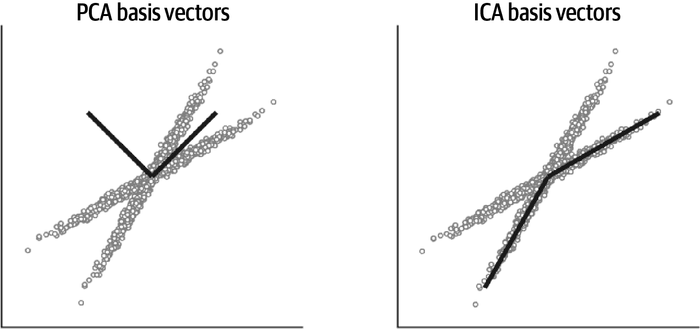
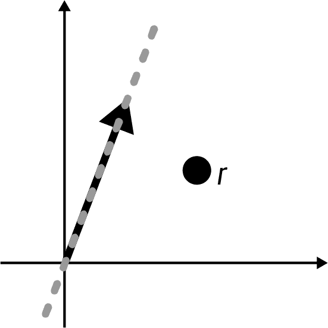
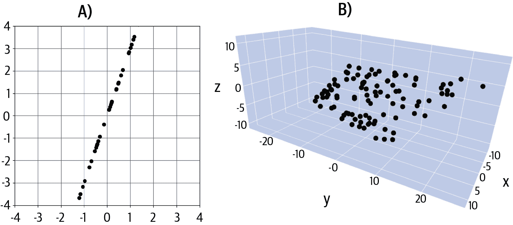

# 第三章：向量，第二部分

前一章为理解向量和作用在向量上的基本操作奠定了基础。现在你将通过学习一系列相互关联的概念扩展你的线性代数知识，包括线性独立性，子空间和基。这些主题对理解矩阵操作至关重要。

这里的一些主题可能看起来抽象，并且与应用无关，但它们之间有一条非常短的路径，例如，向量子空间和将统计模型拟合到数据中。数据科学中的应用稍后会介绍，所以请继续专注于基础知识，这样高级主题会更容易理解。

# 向量集

我们可以从一些简单的事情开始这一章：向量的集合称为*集合*。你可以想象把一堆向量放进袋子里携带。向量集使用大写斜体字母表示，如 *S* 或 *V*。数学上，我们可以描述集合如下：

<math alttext="upper V equals StartSet bold v bold 1 comma period period period comma bold v Subscript bold n Baseline EndSet" display="block"><mrow><mi>V</mi> <mo>=</mo> <mo>{</mo> <msub><mi>𝐯</mi> <mn mathvariant="bold">1</mn></msub> <mo>,</mo> <mo>.</mo> <mo>.</mo> <mo>.</mo> <mo>,</mo> <msub><mi>𝐯</mi> <mi>𝐧</mi></msub> <mo>}</mo></mrow></math>

想象一下，例如，一个包含一百个国家的 Covid-19 正确案例、住院和死亡数的数据集；你可以将每个国家的数据存储在一个三元素向量中，并创建一个包含一百个向量的向量集。

向量集可以包含有限数量或无限数量的向量。带有无限数量向量的向量集听起来可能像一个毫无用处的愚蠢抽象，但向量子空间是无限向量集，并对将统计模型拟合到数据中具有重要影响。

向量集也可以是空的，并且被表示为 *V* = {}。当你学习矩阵空间时，你会遇到空的向量集。

# 线性加权组合

*线性加权组合* 是一种混合多个变量信息的方法，其中一些变量的贡献大于其他变量。这种基本操作有时也称为*线性混合*或*加权组合*（*线性*部分被假定）。有时，术语*系数*也被用来代替*权重*。

线性加权组合简单地意味着标量与向量的乘法和加法：取一些向量集，将每个向量乘以一个标量，然后加起来得到一个单一的向量（方程式 3-1）。

##### 方程式 3-1。线性加权组合

<math alttext="bold w equals lamda 1 bold v 1 plus lamda 2 bold v 2 plus period period period plus lamda Subscript n Baseline bold v Subscript n Baseline" display="block"><mrow><mi>𝐰</mi> <mo>=</mo> <msub><mi>λ</mi> <mn>1</mn></msub> <msub><mi>𝐯</mi> <mn>1</mn></msub> <mo>+</mo> <msub><mi>λ</mi> <mn>2</mn></msub> <msub><mi>𝐯</mi> <mn>2</mn></msub> <mo>+</mo> <mo>.</mo> <mo>.</mo> <mo>.</mo> <mo>+</mo> <msub><mi>λ</mi> <mi>n</mi></msub> <msub><mi>𝐯</mi> <mi>n</mi></msub></mrow></math>

假设所有向量 <math alttext="bold v Subscript i"><msub><mi>𝐯</mi> <mi>i</mi></msub></math> 都具有相同的维度；否则，加法是无效的。 <math alttext="lamda"><mi>λ</mi></math> 可以是任意实数，包括零。

从技术上讲，你可以重新编写 方程式 3-1 来减去向量，但因为减法可以通过将 <math alttext="lamda Subscript i"><msub><mi>λ</mi> <mi>i</mi></msub></math> 设置为负数来处理，所以更容易通过求和来讨论线性加权组合。

方程式 3-2 展示了一个例子，以帮助更加具体：

##### 方程式 3-2。线性加权组合

<math display="block"><mrow><msub><mi>λ</mi> <mn>1</mn></msub> <mo>=</mo> <mn>1</mn> <mo>,</mo> <msub><mi>λ</mi> <mn>2</mn></msub> <mo>=</mo> <mn>2</mn> <mo>,</mo> <msub><mi>λ</mi> <mn>3</mn></msub> <mo>=</mo> <mo>-</mo> <mn>3</mn> <mo>,</mo> <msub><mi>𝐯</mi> <mn mathvariant="bold">1</mn></msub> <mo>=</mo> <mfenced close="]" open="["><mtable><mtr><mtd><mn>4</mn></mtd></mtr> <mtr><mtd><mn>5</mn></mtd></mtr> <mtr><mtd><mn>1</mn></mtd></mtr></mtable></mfenced> <mo>,</mo> <msub><mi>𝐯</mi> <mn mathvariant="bold">2</mn></msub> <mo>=</mo> <mfenced close="]" open="["><mtable><mtr><mtd><mrow><mo>-</mo> <mn>4</mn></mrow></mtd></mtr> <mtr><mtd><mrow><mphantom><mo>-</mo></mphantom> <mn>0</mn></mrow></mtd></mtr> <mtr><mtd><mrow><mo>-</mo> <mn>4</mn></mrow></mtd></mtr></mtable></mfenced> <mo>,</mo> <msub><mi>𝐯</mi> <mn mathvariant="bold">3</mn></msub> <mo>=</mo> <mfenced close="]" open="["><mtable><mtr><mtd><mn>1</mn></mtd></mtr> <mtr><mtd><mn>3</mn></mtd></mtr> <mtr><mtd><mn>2</mn></mtd></mtr></mtable></mfenced></mrow></math> <math display="block"><mpadded height="120%"><mrow><mi>𝐰</mi> <mo>=</mo> <msub><mi>λ</mi> <mn>1</mn></msub> <msub><mi>𝐯</mi> <mn mathvariant="bold">1</mn></msub> <mo>+</mo> <msub><mi>λ</mi> <mn>2</mn></msub> <msub><mi>𝐯</mi> <mn mathvariant="bold">2</mn></msub> <mo>+</mo> <msub><mi>λ</mi> <mn>3</mn></msub> <msub><mi>𝐯</mi> <mn mathvariant="bold">3</mn></msub> <mo>=</mo> <mfenced close="]" open=""><mtable><mtr><mtd><mrow><mo>-</mo> <mn>7</mn></mrow></mtd></mtr> <mtr><mtd><mrow><mo>-</mo> <mn>4</mn></mrow></mtd></mtr> <mtr><mtd><mrow><mo>-</mo> <mn>13</mn></mrow></mtd></mtr></mtable></mfenced></mrow></mpadded></math>

线性加权组合易于实现，如下面的代码所示。在 Python 中，数据类型很重要；测试当向量是列表而不是 NumPy 数组时会发生什么：^([1)

```
l1 = 1
l2 = 2
l3 = -3
v1 = np.array([4,5,1])
v2 = np.array([-4,0,-4])
v3 = np.array([1,3,2])
l1*v1 + l2*v2 + l3*v3
```

每个向量和每个系数作为单独的变量存储是繁琐的，并且不能扩展到更大的问题。因此，在实践中，线性加权组合是通过紧凑且可扩展的矩阵向量乘法方法来实现的，你将在第 Chapter 5 章学习到；目前，重点是概念和编码实现。

线性加权组合有多个应用场景。其中三个包括：

+   从统计模型中预测的数据是通过回归器（预测变量）和系数（标量）的线性加权组合创建的，这些系数是通过最小二乘算法计算得出的，你将在第十一章和第十二章学习到。

+   在主成分分析等降维过程中，每个成分（有时称为因子或模式）都是数据通道的线性加权组合，其中所选的权重（系数）被选择以最大化成分的方差（以及一些其他你将在第十五章中学到的约束条件）。

+   人工神经网络（支持深度学习的架构和算法）涉及两种操作：输入数据的线性加权组合，然后是非线性变换。权重通过最小化成本函数学习，通常是模型预测与真实目标变量之间的差异。

线性加权组合的概念是创建向量子空间和矩阵空间的机制，是线性独立性的核心。确实，线性加权组合和点积是许多高级线性代数计算的两个最重要的基本构建模块之一。

# 线性独立性

如果集合中至少有一个向量可以表示为该集合中其他向量的线性加权组合，则向量集合*线性相关*。因此，如果集合中没有向量可以表示为该集合中其他向量的线性加权组合，则向量集合*线性独立*。

以下是两组向量集合。在阅读文本之前，请尝试确定每组向量集合是依赖还是独立的。（术语*线性独立*有时在*线性*部分被隐含时缩写为*独立*。）

<math alttext="upper V equals StartSet StartBinomialOrMatrix 1 Choose 3 EndBinomialOrMatrix comma StartBinomialOrMatrix 2 Choose 7 EndBinomialOrMatrix EndSet upper S equals StartSet StartBinomialOrMatrix 1 Choose 3 EndBinomialOrMatrix comma StartBinomialOrMatrix 2 Choose 6 EndBinomialOrMatrix EndSet" display="block"><mrow><mi>V</mi> <mo>=</mo> <mfenced close="}" open="{" separators=""><mfenced close="]" open="["><mtable><mtr><mtd><mn>1</mn></mtd></mtr> <mtr><mtd><mn>3</mn></mtd></mtr></mtable></mfenced> <mo>,</mo> <mfenced close="]" open="["><mtable><mtr><mtd><mn>2</mn></mtd></mtr> <mtr><mtd><mn>7</mn></mtd></mtr></mtable></mfenced></mfenced> <mi>S</mi> <mo>=</mo> <mfenced close="}" open="{" separators=""><mfenced close="]" open="["><mtable><mtr><mtd><mn>1</mn></mtd></mtr> <mtr><mtd><mn>3</mn></mtd></mtr></mtable></mfenced> <mo>,</mo> <mfenced close="]" open="["><mtable><mtr><mtd><mn>2</mn></mtd></mtr> <mtr><mtd><mn>6</mn></mtd></mtr></mtable></mfenced></mfenced></mrow></math>

向量集合*V*是线性无关的：无法将集合中的一个向量表示为集合中其他向量的线性倍数。换句话说，如果我们将集合中的向量称为<math alttext="bold v 1"><msub><mi>𝐯</mi> <mn>1</mn></msub></math>和<math alttext="bold v 2"><msub><mi>𝐯</mi> <mn>2</mn></msub></math>，那么不存在可能的标量<math alttext="lamda"><mi>λ</mi></math>使得<math alttext="bold v 1 equals lamda bold v 2"><mrow><msub><mi>𝐯</mi> <mn>1</mn></msub> <mo>=</mo> <mi>λ</mi> <msub><mi>𝐯</mi> <mn>2</mn></msub></mrow></math>。

那么*S*集合呢？这个是相关的，因为我们可以使用集合中一些向量的线性加权组合来得到集合中的其他向量。这种组合有无数种，其中两种是**s**[1] = .5*s*[2]和**s**[2] = 2*s*[1]。

让我们再来看一个例子。同样，问题是*T*集合是线性独立还是线性相关：

<math alttext="upper T equals StartSet Start 4 By 1 Matrix 1st Row  8 2nd Row  negative 4 3rd Row  14 4th Row  6 EndMatrix comma Start 4 By 1 Matrix 1st Row  4 2nd Row  6 3rd Row  0 4th Row  3 EndMatrix comma Start 4 By 1 Matrix 1st Row  14 2nd Row  2 3rd Row  4 4th Row  7 EndMatrix comma Start 4 By 1 Matrix 1st Row  13 2nd Row  2 3rd Row  9 4th Row  8 EndMatrix EndSet" display="block"><mrow><mi>T</mi> <mo>=</mo> <mfenced close="}" open="{" separators=""><mfenced close="]" open="["><mtable><mtr><mtd><mrow><mphantom><mo>-</mo></mphantom> <mn>8</mn></mrow></mtd></mtr> <mtr><mtd><mrow><mo>-</mo> <mn>4</mn></mrow></mtd></mtr> <mtr><mtd><mn>14</mn></mtd></mtr> <mtr><mtd><mrow><mphantom><mo>-</mo></mphantom> <mn>6</mn></mrow></mtd></mtr></mtable></mfenced> <mo>,</mo> <mfenced close="]" open="["><mtable><mtr><mtd><mn>4</mn></mtd></mtr> <mtr><mtd><mn>6</mn></mtd></mtr> <mtr><mtd><mn>0</mn></mtd></mtr> <mtr><mtd><mn>3</mn></mtd></mtr></mtable></mfenced> <mo>,</mo> <mfenced close="]" open="["><mtable><mtr><mtd><mn>14</mn></mtd></mtr> <mtr><mtd><mn>2</mn></mtd></mtr> <mtr><mtd><mn>4</mn></mtd></mtr> <mtr><mtd><mn>7</mn></mtd></mtr></mtable></mfenced> <mo>,</mo> <mfenced close="]" open=""><mtable><mtr><mtd><mn>13</mn></mtd></mtr> <mtr><mtd><mn>2</mn></mtd></mtr> <mtr><mtd><mn>9</mn></mtd></mtr> <mtr><mtd><mn>8</mn></mtd></mtr></mtable></mfenced></mfenced></mrow></math>

哇，这个比前两个例子难多了。结果证明这是一个线性相关的集合（例如，前三个向量的和等于第四个向量的两倍）。但我不希望你仅凭视觉检查就能弄清楚。

那么在实践中如何确定线性独立性呢？确定线性独立性的方法是从向量集创建矩阵，计算矩阵的秩，并将秩与行或列的较小者进行比较。现在这句话可能对你来说没有意义，因为你还没有学习矩阵秩。因此，现在请将注意力集中在这个概念上：如果集合中至少有一个向量可以表示为其他向量的线性加权组合，则该向量集是线性相关的；如果没有向量可以表示为其他向量的组合，则向量集是线性独立的。

## 线性独立性的数学基础

现在你已经理解了这个概念，我想确保你也理解线性相关的正式数学定义，这在[方程 3-3 中表达出来。

##### 方程 3-3\. 线性相关²

<math alttext="bold 0 equals lamda 1 bold v 1 plus lamda 2 bold v 2 plus period period period plus lamda Subscript n Baseline bold v Subscript n Baseline comma lamda element-of double-struck upper R" display="block"><mrow><mn mathvariant="bold">0</mn> <mo>=</mo> <msub><mi>λ</mi> <mn>1</mn></msub> <msub><mi>𝐯</mi> <mn>1</mn></msub> <mo>+</mo> <msub><mi>λ</mi> <mn>2</mn></msub> <msub><mi>𝐯</mi> <mn>2</mn></msub> <mo>+</mo> <mo>.</mo> <mo>.</mo> <mo>.</mo> <mo>+</mo> <msub><mi>λ</mi> <mi>n</mi></msub> <msub><mi>𝐯</mi> <mi>n</mi></msub> <mo>,</mo> <mi>λ</mi> <mo>∈</mo> <mi>ℝ</mi></mrow></math>

这个方程表明，线性相关意味着我们可以定义一些向量集中的线性加权组合来生成零向量。如果你能找到一些<math alttext="lamda"><mi>λ</mi></math>使得这个方程成立，那么这个向量集是线性相关的。反之，如果没有可能的方式将向量线性组合为零向量，则集合是线性独立的。

这可能起初看起来不直观。为什么我们在问题是是否可以将集合中至少一个向量表达为其他向量的加权组合时要关心零向量？也许你更喜欢将线性相关的定义重写为以下内容：

<math alttext="lamda 1 bold v 1 equals lamda 2 bold v 2 plus period period period plus lamda Subscript n Baseline bold v Subscript n Baseline comma lamda element-of double-struck upper R" display="block"><mrow><msub><mi>λ</mi> <mn>1</mn></msub> <msub><mi>𝐯</mi> <mn>1</mn></msub> <mo>=</mo> <msub><mi>λ</mi> <mn>2</mn></msub> <msub><mi>𝐯</mi> <mn>2</mn></msub> <mo>+</mo> <mo>.</mo> <mo>.</mo> <mo>.</mo> <mo>+</mo> <msub><mi>λ</mi> <mi>n</mi></msub> <msub><mi>𝐯</mi> <mi>n</mi></msub> <mo>,</mo> <mi>λ</mi> <mo>∈</mo> <mi>ℝ</mi></mrow></math>

为什么不从这个方程开始，而不是将零向量放在左侧？将方程设置为零有助于强化这样一个原则：*整个集合*是相关还是独立的；没有一个单独的向量有特权地位成为“依赖向量”（参见“独立集合”）。换句话说，当涉及独立性时，向量集是纯粹平等的。

但请稍等。仔细检查方程 3-3，会发现一个平凡的解：将所有<math alttext="lamda"><mi>λ</mi></math>设为零，这个方程变成<math alttext="bold 0 equals bold 0"><mrow><mn mathvariant="bold">0</mn> <mo>=</mo> <mn mathvariant="bold">0</mn></mrow></math>，无论集合中的向量如何。但是，正如我在第二章中写道，涉及零的平凡解在线性代数中经常被忽略。因此，我们增加了至少一个<math alttext="lamda not-equals 0"><mrow><mi>λ</mi> <mo>≠</mo> <mn>0</mn></mrow></math>的约束。

通过将方程除以标量之一，可以将这种约束条件纳入方程中；请记住，<math alttext="bold v 1"><msub><mi>𝐯</mi> <mn>1</mn></msub></math> 和 <math alttext="lamda 1"><msub><mi>λ</mi> <mn>1</mn></msub></math> 可以指代集合中的任何向量/标量对：

<math alttext="bold 0 equals bold v 1 plus period period period plus StartFraction lamda Subscript n Baseline Over lamda 1 EndFraction bold v Subscript n Baseline comma lamda element-of double-struck upper R comma lamda 1 not-equals 0" display="block"><mrow><mn mathvariant="bold">0</mn> <mo>=</mo> <msub><mi>𝐯</mi> <mn>1</mn></msub> <mo>+</mo> <mo>.</mo> <mo>.</mo> <mo>.</mo> <mo>+</mo> <mfrac><msub><mi>λ</mi> <mi>n</mi></msub> <msub><mi>λ</mi> <mn>1</mn></msub></mfrac> <msub><mi>𝐯</mi> <mi>n</mi></msub> <mo>,</mo> <mi>λ</mi> <mo>∈</mo> <mrow><mi>ℝ</mi> <mo>,</mo> <msub><mi>λ</mi> <mn>1</mn></msub> <mo>≠</mo> <mn>0</mn></mrow></mrow></math>

## 独立性和零向量

简而言之，任何包含零向量的向量集都自动成为线性相关集。原因在于：零向量的任何标量倍数仍然是零向量，因此总是满足线性相关的定义。你可以在以下方程中看到这一点：

<math alttext="lamda 0 bold 0 equals 0 bold v 1 plus 0 bold v 2 plus 0 bold v Subscript n" display="block"><mrow><msub><mi>λ</mi> <mn>0</mn></msub> <mn mathvariant="bold">0</mn> <mo>=</mo> <mn>0</mn> <msub><mi>𝐯</mi> <mn>1</mn></msub> <mo>+</mo> <mn>0</mn> <msub><mi>𝐯</mi> <mn>2</mn></msub> <mo>+</mo> <mn>0</mn> <msub><mi>𝐯</mi> <mi>n</mi></msub></mrow></math>

只要<math alttext="lamda 0 not-equals 0"><mrow><msub><mi>λ</mi> <mn>0</mn></msub> <mo>≠</mo> <mn>0</mn></mrow></math>，我们就有一个非平凡解，且该集合符合线性相关的定义。

# 关于非线性独立性？

“但是迈克，”我想象你会反驳，“生命、宇宙和一切不都是*非*线性的吗？”我想这会是一个有趣的练习，统计宇宙中线性与非线性相互作用的总数，看看哪个总和更大。但是线性代数关注的是，嗯，*线性*操作。如果你能将一个向量表达为其他向量的非线性（但非线性）组合，那么这些向量仍然构成线性独立集合。线性约束的原因在于我们希望将变换表达为矩阵乘法，而这是一种线性操作。这并不是在贬低非线性操作——在我的想象对话中，你已经精辟地阐述了一个纯线性的宇宙将会相当乏味和可预测。但我们不需要用线性代数来解释整个宇宙；我们只需要用线性代数来处理其中的线性部分。（还值得一提的是，许多非线性系统可以很好地用线性函数来近似。）

# 子空间与张量

当我介绍线性加权组合时，我使用了具体的权重数值示例（例如，<math alttext="lamda 1 equals 1 comma lamda 3 equals negative 3"><mrow><msub><mi>λ</mi> <mn>1</mn></msub> <mo>=</mo> <mn>1</mn> <mo>,</mo> <msub><mi>λ</mi> <mn>3</mn></msub> <mo>=</mo> <mo>-</mo> <mn>3</mn></mrow></math>）。*子空间*是相同的概念，但使用了集合中向量的无限可能的线性组合方式。

即，对于某些（有限）向量集，通过使用相同的向量但不同的权重数值进行线性组合的无限方法，创建了一个*向量子空间*。结合所有可能的线性加权组合的机制被称为向量集合的*张量*。让我们通过几个例子来理解一下。我们从一个包含一个向量的简单例子开始：

<math alttext="upper V equals StartSet StartBinomialOrMatrix 1 Choose 3 EndBinomialOrMatrix EndSet" display="block"><mrow><mi>V</mi> <mo>=</mo> <mfenced close="}" open="{" separators=""><mfenced close="]" open=""><mtable><mtr><mtd><mn>1</mn></mtd></mtr> <mtr><mtd><mn>3</mn></mtd></mtr></mtable></mfenced></mfenced></mrow></math>

这个向量集的张成是由这些向量的线性组合形成的无穷向量集。对于只有一个向量的集合，这意味着所有可能的向量缩放版本。图 3-1 展示了向量及其所张成的子空间。注意，灰色虚线上的任何向量都可以表示为向量的某种缩放版本。

![span > spam

###### 图 3-1\. 一个向量（黑色）及其所张成的子空间（灰色）

我们的下一个例子是在<math alttext="double-struck upper R cubed"><msup><mi>ℝ</mi> <mn>3</mn></msup></math>中的两个向量集：

<math alttext="upper V equals StartSet Start 3 By 1 Matrix 1st Row  1 2nd Row  0 3rd Row  2 EndMatrix comma Start 3 By 1 Matrix 1st Row  negative 1 2nd Row  1 3rd Row  2 EndMatrix EndSet" display="block"><mrow><mi>V</mi> <mo>=</mo> <mfenced close="}" open="{" separators=""><mfenced close="]" open="["><mtable><mtr><mtd><mn>1</mn></mtd></mtr> <mtr><mtd><mn>0</mn></mtd></mtr> <mtr><mtd><mn>2</mn></mtd></mtr></mtable></mfenced> <mo>,</mo> <mfenced close="]" open=""><mtable><mtr><mtd><mrow><mo>-</mo> <mn>1</mn></mrow></mtd></mtr> <mtr><mtd><mn>1</mn></mtd></mtr> <mtr><mtd><mn>2</mn></mtd></mtr></mtable></mfenced></mfenced></mrow></math>

这些向量位于<math alttext="double-struck upper R cubed"><msup><mi>ℝ</mi> <mn>3</mn></msup></math>，因此在三维坐标系中图形化表示。但它们所张成的子空间是三维空间中的一个二维平面（参见图 3-2）。该平面通过原点，因为将这两个向量同时按零缩放将得到零向量。

![span > spam

###### 图 3-2\. 两个向量（黑色）及其张成的子空间（灰色）

第一个例子有一个向量，其张成的是一维子空间，第二个例子有两个向量，其张成的是一个二维子空间。看起来似乎有一种模式出现了，但外表可能会误导人。考虑下一个例子：

<math alttext="upper V equals StartSet Start 3 By 1 Matrix 1st Row  1 2nd Row  1 3rd Row  1 EndMatrix comma Start 3 By 1 Matrix 1st Row  2 2nd Row  2 3rd Row  2 EndMatrix EndSet" display="block"><mrow><mi>V</mi> <mo>=</mo> <mfenced close="}" open="{" separators=""><mfenced close="]" open="["><mtable><mtr><mtd><mn>1</mn></mtd></mtr> <mtr><mtd><mn>1</mn></mtd></mtr> <mtr><mtd><mn>1</mn></mtd></mtr></mtable></mfenced> <mo>,</mo> <mfenced close="]" open=""><mtable><mtr><mtd><mn>2</mn></mtd></mtr> <mtr><mtd><mn>2</mn></mtd></mtr> <mtr><mtd><mn>2</mn></mtd></mtr></mtable></mfenced></mfenced></mrow></math>

两个向量在<math alttext="double-struck upper R cubed"><msup><mi>ℝ</mi> <mn>3</mn></msup></math>中，但它们张成的子空间仍然只是一维子空间—一条直线（参见图 3-3）。为什么会这样？因为集合中的一个向量已经在另一个向量的张成空间中。因此，在张成方面，这两个向量中的一个是多余的。

![span > spam

###### 图 3-3\. 由两个向量（黑色）张成的一维子空间（灰色）

那么，所张成子空间的维度与向量集中的向量数量之间有什么关系？你可能猜到这与线性独立性有关。

由一组向量张成的子空间的维数是形成线性无关集的最小向量数量。如果一个向量集是线性无关的，则其张成的子空间的维数等于集合中的向量数。如果集合是相关的，则这些向量张成的子空间的维数必然小于集合中的向量数。到底小多少则是另一回事—要了解向量集中的向量数量与其张成子空间的维数之间的关系，您需要了解矩阵秩，在第六章中会详细讲解。

向量子空间的正式定义是空间中的一个包含原点并在加法和标量乘法下封闭的子集。这意味着子空间中向量的任何线性加权组合也必须在同一子空间中，包括将所有权重设置为零以在空间原点产生零向量。

请不要因为“封闭于加法和标量乘法”而失眠沉思；只需记住，向量子空间是由一组向量的所有可能线性组合创建的。

# 基础

阿姆斯特丹和特内里费有多远？大约 2000。那么“2000”是什么意思？只有在我们附加一个基本单位时，这个数字才有意义。基础就像是用来测量空间的尺子。

在这个例子中，单位是*英里*。因此，我们荷兰和西班牙之间的距离基础测量是 1 英里。当然，我们可以使用不同的测量单位，比如纳米或光年，但我认为我们可以同意，英里在这个尺度上是一个方便的距离基准。你的指甲在一天内增长了多少长度——我们仍然应该使用英里吗？从技术上讲，我们可以，但我认为我们可以同意*毫米*是一个更方便的基本单位。明确一点：在过去 24 小时内你的指甲增长的长度是相同的，无论你是用纳米、英里还是光年来衡量。但对于不同的问题，不同的单位更或者不太方便。

回到线性代数：*基础*是一组用来描述矩阵（例如数据）中信息的尺子。就像前面的例子一样，你可以用不同的尺子描述相同的数据，但某些尺子对解决特定问题更方便。

最常见的基础集是笛卡尔坐标系：你从小学就熟悉的 XY 平面。我们可以写出 2D 和 3D 笛卡尔图形的基础集如下：

<math alttext="upper S 2 equals StartSet StartBinomialOrMatrix 1 Choose 0 EndBinomialOrMatrix comma StartBinomialOrMatrix 0 Choose 1 EndBinomialOrMatrix EndSet upper S 3 equals StartSet Start 3 By 1 Matrix 1st Row  1 2nd Row  0 3rd Row  0 EndMatrix comma Start 3 By 1 Matrix 1st Row  0 2nd Row  1 3rd Row  0 EndMatrix comma Start 3 By 1 Matrix 1st Row  0 2nd Row  0 3rd Row  1 EndMatrix EndSet" display="block"><mrow><msub><mi>S</mi> <mn>2</mn></msub> <mo>=</mo> <mfenced close="}" open="{" separators=""><mfenced close="]" open="["><mtable><mtr><mtd><mn>1</mn></mtd></mtr> <mtr><mtd><mn>0</mn></mtd></mtr></mtable></mfenced> <mo>,</mo> <mfenced close="]" open="["><mtable><mtr><mtd><mn>0</mn></mtd></mtr> <mtr><mtd><mn>1</mn></mtd></mtr></mtable></mfenced></mfenced> <msub><mi>S</mi> <mn>3</mn></msub> <mo>=</mo> <mfenced close="}" open="{" separators=""><mfenced close="]" open="["><mtable><mtr><mtd><mn>1</mn></mtd></mtr> <mtr><mtd><mn>0</mn></mtd></mtr> <mtr><mtd><mn>0</mn></mtd></mtr></mtable></mfenced> <mo>,</mo> <mfenced close="]" open="["><mtable><mtr><mtd><mn>0</mn></mtd></mtr> <mtr><mtd><mn>1</mn></mtd></mtr> <mtr><mtd><mn>0</mn></mtd></mtr></mtable></mfenced> <mo>,</mo> <mfenced close="]" open="["><mtable><mtr><mtd><mn>0</mn></mtd></mtr> <mtr><mtd><mn>0</mn></mtd></mtr> <mtr><mtd><mn>1</mn></mtd></mtr></mtable></mfenced></mfenced></mrow></math>

注意，笛卡尔基础集包括相互正交且单位长度的向量。这些是非常好的特性，这就是为什么笛卡尔基础集如此普遍（实际上，它们被称为*标准基础集*）。

但这些并不是唯一的基础集。以下集合是<math alttext="double-struck upper R squared"><msup><mi>ℝ</mi> <mn>2</mn></msup></math>的另一个基础集。

<math alttext="upper T equals StartSet StartBinomialOrMatrix 3 Choose 1 EndBinomialOrMatrix comma StartBinomialOrMatrix negative 3 Choose 1 EndBinomialOrMatrix EndSet" display="block"><mrow><mi>T</mi> <mo>=</mo> <mfenced close="}" open="{" separators=""><mfenced close="]" open="["><mtable><mtr><mtd><mn>3</mn></mtd></mtr> <mtr><mtd><mn>1</mn></mtd></mtr></mtable></mfenced> <mo>,</mo> <mfenced close="]" open=""><mtable><mtr><mtd><mrow><mo>-</mo> <mn>3</mn></mrow></mtd></mtr> <mtr><mtd><mrow><mphantom><mo>-</mo></mphantom> <mn>1</mn></mrow></mtd></mtr></mtable></mfenced></mfenced></mrow></math>

基础集<math alttext="upper S 2"><msub><mi>S</mi> <mn>2</mn></msub></math>和*T*都跨越相同的子空间（<math alttext="double-struck upper R squared"><msup><mi>ℝ</mi> <mn>2</mn></msup></math>的全部）。为什么你会更喜欢*T*而不是*S*？想象一下，我们想要描述图 3-4 中的数据点*p*和*q*。我们可以描述这些数据点作为它们与原点的关系，即它们的坐标，使用基础*S*或基础*T*。

在基础 *S* 中，这两个坐标是 *p* = (3, 1) 和 *q* = (−6, 2)。在线性代数中，我们说这些点被表达为基础向量的线性组合。在这种情况下，该组合是 <math alttext="3 bold s 1 plus 1 bold s 2"><mrow><mn>3</mn> <msub><mi>𝐬</mi> <mn>1</mn></msub> <mo>+</mo> <mn>1</mn> <msub><mi>𝐬</mi> <mn>2</mn></msub></mrow></math> 对于点 *p*，和 <math alttext="minus 6 bold s 1 plus 2 bold s 2"><mrow><mo>-</mo> <mn>6</mn> <msub><mi>𝐬</mi> <mn>1</mn></msub> <mo>+</mo> <mn>2</mn> <msub><mi>𝐬</mi> <mn>2</mn></msub></mrow></math> 对于点 *q*。

现在让我们用基础 *T* 来描述这些点。作为坐标，我们有 *p* = (1, 0) 和 *q* = (0, 2)。在基础向量方面，我们有 <math alttext="1 bold t 1 plus 0 bold t 2"><mrow><mn>1</mn> <msub><mi>𝐭</mi> <mn>1</mn></msub> <mo>+</mo> <mn>0</mn> <msub><mi>𝐭</mi> <mn>2</mn></msub></mrow></math> 对于点 *p* 和 <math alttext="0 bold t 1 plus 2 bold t 2"><mrow><mn>0</mn> <msub><mi>𝐭</mi> <mn>1</mn></msub> <mo>+</mo> <mn>2</mn> <msub><mi>𝐭</mi> <mn>2</mn></msub></mrow></math> 对于点 *q*（换句话说，*p* = <math alttext="bold t 1"><msub><mi>𝐭</mi> <mn>1</mn></msub></math> 和 *q*= <math alttext="2 bold t 2"><mrow><mn>2</mn> <msub><mi>𝐭</mi> <mn>2</mn></msub></mrow></math>）。同样，数据点 *p* 和 *q* 无论基础集如何都是相同的，但 *T* 提供了一个简洁和正交的描述。

基础在数据科学和机器学习中非常重要。事实上，应用线性代数中的许多问题可以概念化为找到描述某些子空间的最佳基础向量集。你可能听说过以下术语：维度约简、特征提取、主成分分析、独立成分分析、因子分析、奇异值分解、线性判别分析、图像逼近、数据压缩。信不信由你，所有这些分析本质上都是为特定问题识别最优基础向量的方式。

![点和基础###### 图 3-4。相同的点（*p* 和 *q*）可以用基础集 *S*（黑色实线）或 *T*（黑色虚线）来描述。考虑图 3-5：这是一个包含两个变量的数据集（每个点表示一个数据点）。实际上，图中展示了三个不同的基：对应于 x = 0 和 y = 0 线的“标准基础集”，以及通过主成分分析（PCA；左图）和独立成分分析（ICA；右图）定义的基础集。哪种基础集提供了描述数据的“最佳”方式？你可能会倾向于说从 ICA 计算得到的基向量是最好的。事实更为复杂（通常是如此）：没有一种基础集本质上更好或更差；不同的基础集可以根据分析的目标、数据的特征、分析所施加的约束等情况对解决特定问题更有帮助或不那么有帮助。

###### 图 3-5\. 使用不同基向量（黑色线）的 2D 数据集

## 基的定义

一旦你理解了基和基组的概念，其形式化定义就变得很直接。事实上，基本上基本就是由生成和独立性组成的：如果一组向量（1）生成了该子空间并且（2）是一组独立的向量，则可以将其作为该子空间的基。

基需要生成一个子空间才能用作该子空间的基，因为你不能描述你无法测量的东西。³ 图 3-6 展示了一个在一维子空间外的点的示例。该子空间的基向量无法测量点 *r*。黑色向量仍然是所跨越子空间的有效基向量，但它不构成任何超出其跨越范围的子空间的基础。



###### Figure 3-6\. 一个基组只能测量其空间中包含的内容。

因此，基需要跨越其用于的空间。这很清楚。但是为什么基组需要线性独立呢？原因是子空间中的任何给定向量必须使用该基具有唯一的坐标。让我们想象使用以下向量集来描述来自图 3-4 的点 *p*：

<math alttext="upper U equals StartSet StartBinomialOrMatrix 0 Choose 1 EndBinomialOrMatrix comma StartBinomialOrMatrix 0 Choose 2 EndBinomialOrMatrix comma StartBinomialOrMatrix 1 Choose 0 EndBinomialOrMatrix EndSet" display="block"><mrow><mi>U</mi> <mo>=</mo> <mfenced close="}" open="{" separators=""><mfenced close="]" open="["><mtable><mtr><mtd><mn>0</mn></mtd></mtr> <mtr><mtd><mn>1</mn></mtd></mtr></mtable></mfenced> <mo>,</mo> <mfenced close="]" open="["><mtable><mtr><mtd><mn>0</mn></mtd></mtr> <mtr><mtd><mn>2</mn></mtd></mtr></mtable></mfenced> <mo>,</mo> <mfenced close="]" open=""><mtable><mtr><mtd><mn>1</mn></mtd></mtr> <mtr><mtd><mn>0</mn></mtd></mtr></mtable></mfenced></mfenced></mrow></math>

*U* 是一个完全有效的向量集，但显然*不*是一个基组。为什么不是呢？^([4)

在集合 *U* 中，什么线性加权组合描述了点 *p*？好吧，三个向量在 *U* 中的线性加权组合的系数可以是（3, 0, 1）或（0, 1.5, 1）或……还有无数其他可能性。这很令人困惑，因此数学家决定，向量在一个基组内必须具有*唯一*的坐标。线性独立性保证了唯一性。

明确一点，点 *p*（或任何其他点）可以用无限多个基组描述。因此，从可能的基组的角度来看，测量并不是唯一的。但是在一个基组内，一个点由一个线性加权组合精确定义。在本节开头的距离类比中，情况也是如此：我们可以使用许多不同的测量单位来测量从阿姆斯特丹到特内里费的距离，但该距离每个测量单位只有一个值。该距离不会同时为 3,200 英里和 2,000 英里，但却同时为 3,200 *公里*和 2,000 *英里*。（注：这里我做了近似，好吗？）

# 总结

恭喜你完成了另一章！（嗯，几乎完成了：还有编码练习要解决。）本章的重点是将你关于向量的基础知识带到下一个水平。以下是关键点列表，但请记住，所有这些点的底层是非常少量的基本原则，主要是向量的线性加权组合：

+   向量集是一组向量的集合。集合中可以有有限个或无限个向量。

+   线性加权组合指的是对集合中的向量进行标量乘法和加法运算。线性加权组合是线性代数中最重要的概念之一。

+   如果一个向量集中的某个向量可以被其他向量的线性加权组合表示，那么这个向量集是线性相关的。如果没有这样的线性加权组合，则集合是线性无关的。

+   子空间是一组向量的所有可能的线性加权组合的无限集。

+   基是空间的度量尺。如果一个向量集（1）张成了该子空间，并且（2）线性无关，那么它可以成为子空间的基。在数据科学中的一个主要目标是发现描述数据集或解决问题的最佳基础集。

# 代码练习

##### 练习 3-1。

重写线性加权组合的代码，但是将标量放入一个列表中，将向量作为 NumPy 数组的元素放入另一个列表中。然后使用`for`循环来执行线性加权组合操作。使用`np.zeros()`初始化输出向量。确认你得到了与之前代码相同的结果。

##### 练习 3-2。

尽管在前一个练习中通过列表循环的方法不如矩阵-向量乘法高效，但比没有`for`循环更具可扩展性。你可以通过将额外的标量和向量作为列表元素添加来探索这一点。如果新添加的向量在<math alttext="double-struck upper R Superscript 4"><msup><mi>ℝ</mi> <mn>4</mn></msup></math>而不是<math alttext="double-struck upper R cubed"><msup><mi>ℝ</mi> <mn>3</mn></msup></math>中会发生什么？如果标量比向量更多会发生什么？

##### 练习 3-3。

在这个练习中，你将在子空间中绘制随机点。这将有助于加强子空间由*所有*生成向量的线性加权组合组成的理念。定义一个包含一个向量 [1, 3] 的向量集。然后从均匀分布在 -4 到 +4 之间随机抽取 100 个数。这些就是你的随机标量。将随机标量乘以基向量，创建子空间中的 100 个随机点。绘制这些点。

接下来，重复这个过程，但在<math alttext="double-struck upper R cubed"><msup><mi>ℝ</mi> <mn>3</mn></msup></math>中使用两个向量：[3, 5, 1] 和 [0, 2, 2]。注意，你需要 100 × 2 个随机标量来得到 100 个点和两个向量。生成的随机点将位于一个平面上。图 3-7 展示了结果的样子（从图中不清楚这些点位于平面上，但当你在屏幕上拖动图表时你会看到）。

我推荐使用`plotly`库来绘制这些点，这样你可以在 3D 轴上点击拖动。以下是使其工作的提示：

```
import plotly.graph_objects as go
fig = go.Figure( data=[go.Scatter3d(
                     x=points[:,0], y=points[:,1], z=points[:,2],
                     mode='markers' )])
fig.show()
```

最后，重复 <math alttext="双击上 R 立方"><msup><mi>ℝ</mi> <mn>3</mn></msup></math> 的情况，但将第二个向量设为第一个的一半。



###### 图 3-7\. 练习 3-3

¹ 如第二章和第十六章所示，列表-整数乘法重复列表而不是对其进行标量乘法。

² 这个方程是线性加权组合的一个应用！

³ 这是科学中的一个普遍真理。

⁴ 因为它是一个线性相关的集合。
