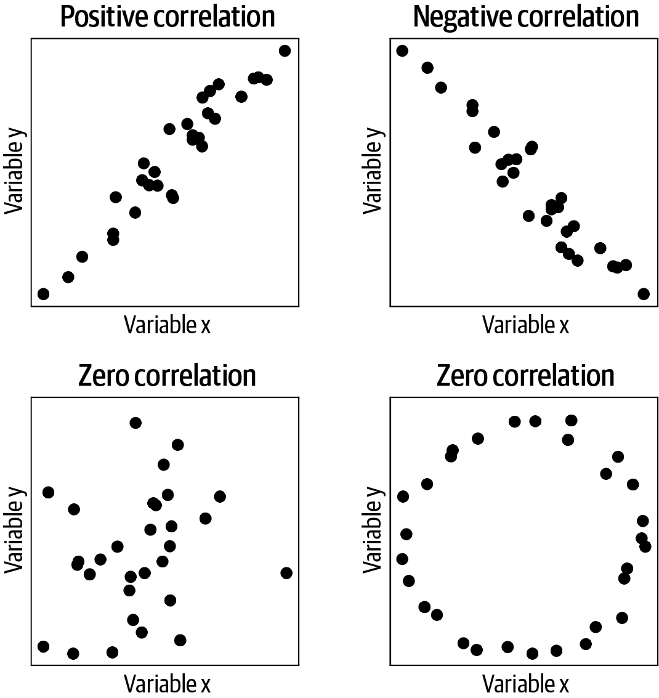

# 第四章：向量应用

在阅读前两章的过程中，你可能觉得其中一些内容过于深奥和抽象。也许你感到学习线性代数的挑战在理解数据科学和机器学习中的实际应用方面并没有多大帮助。

希望本章能消除你的这些疑虑。在本章中，你将学习向量及其操作如何在数据科学分析中使用。通过完成练习，你将能够扩展这些知识。

# 相关性和余弦相似度

相关性是统计学和机器学习中最基本和重要的分析方法之一。*相关系数*是一个单一数字，用于量化两个变量之间的线性关系。相关系数的范围从 −1 到 +1，其中 −1 表示完美的负相关，+1 表示完美的正相关，而 0 表示没有线性关系。图 4-1 展示了几对变量及其相关系数的示例。



###### 图 4-1。展示了表现出正相关、负相关和零相关的数据示例。右下方的面板说明了相关性是线性测量；即使变量之间的相关性为零，它们之间也可能存在非线性关系。

在第二章中，我提到点积涉及到相关系数，并且点积的大小与数据中数值的大小相关（记得我们讨论过使用克与磅来衡量重量）。因此，相关系数需要一些标准化以保持在预期范围内的 −1 到 +1 之间。这两种标准化方法是：

对每个变量进行均值中心化

*均值中心化*意味着从每个数据值中减去平均值。

将点积除以向量范数的乘积

这种除法式标准化取消了测量单位并将最大可能的相关性幅度缩放为|1|。

方程 4-1 展示了皮尔逊相关系数的完整公式。

##### 方程 4-1。皮尔逊相关系数的公式

<math alttext="rho equals StartFraction sigma-summation Underscript i equals 1 Overscript n Endscripts left-parenthesis x Subscript i Baseline minus x overbar right-parenthesis left-parenthesis y Subscript i Baseline minus y overbar right-parenthesis Over StartRoot sigma-summation Underscript i equals 1 Overscript n Endscripts left-parenthesis x Subscript i Baseline minus x overbar right-parenthesis squared EndRoot StartRoot sigma-summation Underscript i equals 1 Overscript n Endscripts left-parenthesis y Subscript i Baseline minus y overbar right-parenthesis squared EndRoot EndFraction" display="block"><mrow><mi>ρ</mi> <mo>=</mo> <mfrac><mrow><msubsup><mo>∑</mo> <mrow><mi>i</mi><mo>=</mo><mn>1</mn></mrow> <mi>n</mi></msubsup> <mrow><mo>(</mo><msub><mi>x</mi> <mi>i</mi></msub> <mo>-</mo><mover accent="true"><mi>x</mi> <mo>¯</mo></mover><mo>)</mo></mrow><mrow><mo>(</mo><msub><mi>y</mi> <mi>i</mi></msub> <mo>-</mo><mover accent="true"><mi>y</mi> <mo>¯</mo></mover><mo>)</mo></mrow></mrow> <mrow><msqrt><mrow><msubsup><mo>∑</mo> <mrow><mi>i</mi><mo>=</mo><mn>1</mn></mrow> <mi>n</mi></msubsup> <msup><mrow><mo>(</mo><msub><mi>x</mi> <mi>i</mi></msub> <mo>-</mo><mover accent="true"><mi>x</mi> <mo>¯</mo></mover><mo>)</mo></mrow> <mn>2</mn></msup></mrow></msqrt> <msqrt><mrow><msubsup><mo>∑</mo> <mrow><mi>i</mi><mo>=</mo><mn>1</mn></mrow> <mi>n</mi></msubsup> <msup><mrow><mo>(</mo><msub><mi>y</mi> <mi>i</mi></msub> <mo>-</mo><mover accent="true"><mi>y</mi> <mo>¯</mo></mover><mo>)</mo></mrow> <mn>2</mn></msup></mrow></msqrt></mrow></mfrac></mrow></math>

或许不太明显的是，相关性其实就是三个点积。方程 4-2 展示了使用线性代数点积符号重写的相同公式。在这个方程中，<math alttext="bold x overTilde"><mover accent="true"><mi>𝐱</mi> <mo>˜</mo></mover></math> 是<math alttext="bold x"><mi>𝐱</mi></math>的均值中心化版本（即应用了标准化方法#1 的变量<math alttext="bold x"><mi>𝐱</mi></math>）。

##### 方程 4-2。用线性代数术语表示的皮尔逊相关性

<math alttext="rho equals StartFraction bold x overTilde Superscript upper T Baseline bold y overTilde Over parallel-to bold x overTilde parallel-to parallel-to bold y overTilde parallel-to EndFraction" display="block"><mrow><mi>ρ</mi> <mo>=</mo> <mfrac><mrow><msup><mover accent="true"><mi>𝐱</mi> <mo>˜</mo></mover> <mtext>T</mtext></msup> <mover accent="true"><mi>𝐲</mi> <mo>˜</mo></mover></mrow> <mrow><mrow><mo>∥</mo></mrow><mover accent="true"><mi>𝐱</mi> <mo>˜</mo></mover><mrow><mo>∥</mo><mo>∥</mo></mrow><mover accent="true"><mi>𝐲</mi> <mo>˜</mo></mover><mrow><mo>∥</mo></mrow></mrow></mfrac></mrow></math>

所以，著名且广泛使用的 Pearson 相关系数简单地是两个变量之间的点积，由变量的大小归一化得到。（顺便说一句，您还可以从这个公式看出，如果变量被单位归一化，使得<math alttext="parallel-to bold x parallel-to equals parallel-to bold y parallel-to equals 1"><mrow><mo>∥</mo> <mi>𝐱</mi> <mo>∥</mo> <mo>=</mo> <mo>∥</mo> <mi>𝐲</mi> <mo>∥</mo> <mo>=</mo> <mn>1</mn></mrow></math>，则它们的相关性等于它们的点积。（回想一下，来自 Exercise 2-6，其中<math alttext="parallel-to bold x parallel-to equals StartRoot bold x Superscript upper T Baseline bold x EndRoot"><mrow><mrow><mo>∥</mo> <mi>𝐱</mi> <mo>∥</mo></mrow> <mo>=</mo> <msqrt><mrow><msup><mi>𝐱</mi> <mtext>T</mtext></msup> <mi>𝐱</mi></mrow></msqrt></mrow></math>。）

相关性不是评估两个变量相似性的唯一方法。另一种方法称为*余弦相似度*。余弦相似度的公式只是点积的几何形式（Equation 2-11），解出余弦项：

<math alttext="cosine left-parenthesis theta Subscript x comma y Baseline right-parenthesis equals StartFraction alpha Over parallel-to bold x parallel-to parallel-to bold y parallel-to EndFraction" display="block"><mrow><mo form="prefix">cos</mo> <mrow><mo>(</mo> <msub><mi>θ</mi> <mrow><mi>x</mi><mo>,</mo><mi>y</mi></mrow></msub> <mo>)</mo></mrow> <mo>=</mo> <mfrac><mi>α</mi> <mrow><mo>∥</mo><mi>𝐱</mi><mo>∥</mo><mo>∥</mo><mi>𝐲</mi><mo>∥</mo></mrow></mfrac></mrow></math>

其中<math alttext="alpha"><mi>α</mi></math>是<math alttext="bold x"><mi>𝐱</mi></math>和<math alttext="bold y"><mi>𝐲</mi></math>的点积。

看起来相关性和余弦相似性的公式完全相同。但请记住，Equation 4-1 是完整的公式，而 Equation 4-2 是在变量已经被均值中心化的假设下的简化。因此，余弦相似度不涉及第一个归一化因子。

从本节可以理解为什么 Pearson 相关系数和余弦相似度反映了两个变量之间的*线性*关系：它们基于点积，而点积是线性操作。

本节有四个编程练习，位于章节末尾。您可以选择在阅读下一节之前解决这些练习，或者继续阅读整章然后再解决这些练习。（我个人推荐选择前者，但您是线性代数命运的主宰！）

# 时间序列过滤和特征检测

点积还用于时间序列过滤。过滤本质上是一种特征检测方法，其中模板——在过滤术语中称为*核*——与时间序列信号的部分匹配，过滤的结果是另一个时间序列，指示信号特征与核特征匹配程度。核被精心构造以优化特定标准，如平滑波动、锐利边缘、特定波形形状等。

过滤的机制是计算核与时间序列信号之间的点积。但通常过滤需要*局部*特征检测，而核通常比整个时间序列要短得多。因此，我们计算核与与核长度相同的数据的一个短片段之间的点积。这个过程产生过滤信号中的一个时间点（图 4-2），然后将核向右移动一个时间步来计算与不同（重叠）信号段的点积。正式地说，这个过程称为卷积，涉及几个额外的步骤，我在这里省略以便专注于在信号处理中应用点积。


###### 图 4-2\. 时间序列滤波示例

时间滤波是科学和工程中的一个重要主题。事实上，没有时间滤波就不会有音乐、无线电、电信、卫星等。而支撑你的音乐播放的数学核心是向量点乘。

在本章末尾的练习中，你将了解到如何利用点乘来检测特征（边缘）和平滑时间序列数据。

# *k*-Means Clustering

*k-means clustering* 是一种无监督的方法，根据距离最小化原则，将多变量数据分成相对较少的几组或类别。

*k*-means clustering 是机器学习中重要的分析方法，有多种复杂的*k*-means clustering 变体。在这里，我们将实现一个简单版本的*k*-means，旨在了解向量（特别是：向量、向量范数和广播）在*k*-means 算法中的应用。

下面是我们将要编写的算法的简要描述：

1.  将*k*个质心初始化为数据空间中的随机点。每个质心都是一个*类*或*类别*，接下来的步骤将把每个数据观测值分配到每个类别中。（*质心*是通用化到任意维度的中心。）

1.  计算每个数据观测值与每个质心之间的欧氏距离。¹

1.  将每个数据观测值分配给最近质心所在的组。

1.  将每个质心更新为分配给该质心的所有数据观测值的平均值。

1.  重复步骤 2–4，直到满足收敛标准或进行*N*次迭代。

如果你对 Python 编码感到舒适，并希望实现这个算法，那么我鼓励你在继续之前这样做。接下来，我们将详细讲解每个步骤的数学和代码，特别是在 NumPy 中使用向量和广播的概念。我们还将使用随机生成的二维数据来测试算法，以确认我们的代码是正确的。

让我们从第 1 步开始：初始化*k*个随机聚类中心。*k*是*k*-均值聚类的一个参数；在真实数据中，确定最佳*k*是困难的，但在这里我们将*k*固定为 3。有几种初始化随机聚类中心的方法；为了简单起见，我将随机选择*k*个数据样本作为聚类中心。数据包含在变量`data`中（此变量为 150×2，对应 150 个观测和 2 个特征），并且在图 4-3 的左上方面板中进行了可视化（在线代码显示如何生成这些数据）：

```
k = 3
ridx = np.random.choice(range(len(data)),k,replace=False)
centroids = data[ridx,:] # data matrix is samples by features
```

现在到第 2 步：计算每个数据观测点与每个聚类中心之间的距离。在这里，我们使用了你在前几章学到的线性代数概念。

<math alttext="delta Subscript i comma j Baseline equals StartRoot left-parenthesis d Subscript i Superscript x Baseline minus c Subscript j Superscript x Baseline right-parenthesis squared plus left-parenthesis d Subscript i Superscript y Baseline minus c Subscript j Superscript y Baseline right-parenthesis squared EndRoot" display="block"><mrow><msub><mi>δ</mi> <mrow><mi>i</mi><mo>,</mo><mi>j</mi></mrow></msub> <mo>=</mo> <msqrt><mrow><msup><mrow><mo>(</mo><msubsup><mi>d</mi> <mi>i</mi> <mi>x</mi></msubsup> <mo>-</mo><msubsup><mi>c</mi> <mi>j</mi> <mi>x</mi></msubsup> <mo>)</mo></mrow> <mn>2</mn></msup> <mo>+</mo> <msup><mrow><mo>(</mo><msubsup><mi>d</mi> <mi>i</mi> <mi>y</mi></msubsup> <mo>-</mo><msubsup><mi>c</mi> <mi>j</mi> <mi>y</mi></msubsup> <mo>)</mo></mrow> <mn>2</mn></msup></mrow></msqrt></mrow></math>

其中<math alttext="delta Subscript i comma j"><msub><mi>δ</mi> <mrow><mi>i</mi><mo>,</mo><mi>j</mi></mrow></msub></math>表示数据观测*i*到聚类中心*j*的距离，*d*^x[i]是第*i*个数据观测的*x*特征，*c*^x[j]是聚类中心*j*的*x*轴坐标。

你可能认为这一步需要使用双重`for`循环来实现：一个循环用于*k*个聚类中心，第二个循环用于*N*个数据观测（你甚至可能考虑第三个`for`循环用于数据特征）。然而，我们可以使用向量和广播来使这个操作更加简洁和高效。这是线性代数在公式和代码中看起来不同的一个例子：

```
dists = np.zeros((data.shape[0],k))
for ci in range(k):
  dists[:,ci] = np.sum((data-centroids[ci,:])**2,axis=1)
```

让我们考虑这些变量的大小：`data`为 150×2（观测点乘特征），`centroids[ci,:]`为 1×2（聚类`ci`乘特征）。严格来说，不能从这两个向量中减去。然而，Python 将通过将聚类中心重复 150 次来实现广播，因此从每个数据观测中减去聚类中心。指数操作`**`是逐元素应用的，`axis=1`输入告诉 Python 在列上求和（每行分别）。因此，`np.sum()`的输出将是一个 150×1 的数组，编码每个点到聚类中心`ci`的欧几里德距离。

拿出一段时间来比较代码和距离公式。它们真的一样吗？事实上，它们并不一样：代码中缺少欧几里德距离中的平方根。所以代码错了吗？思考一下这个问题；我稍后会讨论答案。

第 3 步是将每个数据观测分配到最小距离的组中。这一步在 Python 中非常简洁，可以使用一个函数实现：

```
groupidx = np.argmin(dists,axis=1)
```

注意`np.min`和`np.argmin`之间的区别，前者返回最小*值*，而后者返回最小值出现的*索引*。

现在我们可以回到距离公式及其代码实现之间的不一致性。对于我们的*k*-means 算法，我们使用距离将每个数据点分配到其最近的质心。距离和平方距离是单调相关的，因此这两个度量给出相同的答案。增加平方根操作会增加代码复杂性和计算时间，而且对结果没有影响，因此可以简单地省略。

第 4 步是重新计算每个类中所有数据点的平均值作为质心。在这里，我们可以循环遍历*k*个聚类，并使用 Python 索引来找到分配给每个聚类的所有数据点：

```
for ki in range(k):
  centroids[ki,:] = [ np.mean(data[groupidx==ki,0]),
                      np.mean(data[groupidx==ki,1])  ]
```

最后，第 5 步是将前面的步骤放入循环中，直到获得良好的解决方案。在生产级*k*-means 算法中，迭代将继续进行，直到达到停止条件，例如集群质心不再移动。为了简单起见，这里我们将迭代三次（选择这个任意数量是为了使绘图视觉上平衡）。

图 4-3 中的四个面板显示了初始随机聚类质心（迭代 0），以及每次迭代后它们的更新位置。

如果您学习聚类算法，您将学习到用于质心初始化和停止条件的复杂方法，以及选择适当*k*参数的定量方法。尽管如此，所有*k*-means 方法本质上都是上述算法的扩展，而线性代数是它们实现的核心。


###### 图 4-3\. k-means

# 代码练习

## 相关性练习

##### 练习 4-1\. 

编写一个 Python 函数，该函数以两个向量作为输入并提供两个数字作为输出：皮尔逊相关系数和余弦相似度值。编写符合本章介绍的公式的代码；不要简单地调用`np.corrcoef`和`spatial.distance.cosine`。检查当变量已经均值中心化时，这两个输出值是否相同，当变量未均值中心化时是否不同。

##### 练习 4-2\. 

让我们继续探讨相关性和余弦相似度之间的差异。创建一个包含整数 0 到 3 的变量，以及一个等于第一个变量加上某些偏移量的第二个变量。然后，您将创建一个模拟，在该模拟中系统地改变该偏移量在−50 到+50 之间（即，模拟的第一次迭代将使第二个变量等于[−50, −49, −48, −47]）。在`for`循环中，计算两个变量之间的相关性和余弦相似度，并存储这些结果。然后制作一张线图，展示相关性和余弦相似度如何受平均偏移的影响。您应该能够重现图 4-4。


###### 图 4-4\. 练习 4-2 的结果

##### 练习 4-3\. 

Python 中有几个函数可以计算皮尔逊相关系数。其中一个叫做`pearsonr`，位于 SciPy 库的`stats`模块中。打开这个文件的源代码（提示：`??functionname`），确保你理解 Python 实现是如何映射到本章介绍的公式中的。

##### 练习 4-4\.

为什么在 Python 中已经存在函数的情况下，你仍然需要编写自己的函数？部分原因是编写自己的函数具有巨大的教育价值，因为你会看到（在本例中）相关性是一个简单的计算，而不是某种只有计算机科学博士才能理解的复杂黑盒算法。但另一个原因是，内置函数有时会更慢，因为需要进行大量的输入检查、处理额外的输入选项、数据类型转换等。这增加了可用性，但以计算时间为代价。

在这个练习中，你的目标是确定你自己编写的简单相关函数是否比 NumPy 的`corrcoef`函数更快。修改练习 4-2 中的函数，只计算相关系数。然后，在一个包含 1000 次迭代的`for`循环中，生成两个包含 500 个随机数的变量，并计算它们之间的相关性。计时这个`for`循环。然后重复，但使用`np.corrcoef`。在我的测试中，自定义函数比`np.corrcoef`快约 33%。在这些玩具示例中，差异以毫秒计，但如果你在大数据集上运行数十亿个相关性计算，这些毫秒的累积非常显著！（请注意，编写没有输入检查的自定义函数存在输入错误的风险，而这些错误在`np.corrcoef`中会被捕获。）（还要注意，对于较大的向量，速度优势会消失。试一试！）

## 过滤和特征检测练习

##### 练习 4-5\.

让我们构建一个边缘检测器。边缘检测器的核非常简单：[−1 +1]。该核与时间序列信号片段的点积在信号具有恒定值（例如，[10 10]）时为 0。但当信号有陡峭变化时（例如，[1 10]会产生点积为 9），该点积就会很大。我们将使用的信号是一个平台函数。图 A 和 B 在图 4-5 中展示了核和信号。这个练习的第一步是编写代码创建这两个时间序列。


###### 图 4-5\. 练习 4-5 的结果

接下来，在信号的时间点上编写一个`for`循环。在每个时间点，计算核与与核相同长度的时间序列数据段之间的点积。你应该生成一个看起来像图 C 在图 4-5 中的图的绘图结果。（更关注结果而不是美观度。）注意，我们的边缘检测器在信号平坦时返回 0，在信号跳变时返回 +1，在信号跳降时返回 −1。

随意继续探索这段代码。例如，如果用零（[0 −1 1 0]）填充核心会发生什么变化？如果将核心翻转为[1 −1]会怎样？如果核心是不对称的（[−1 2]）会发生什么变化？

##### 练习 4-6。

现在我们将重复相同的过程，但使用不同的信号和核函数。目标是平滑一个崎岖不平的时间序列。时间序列将是从高斯分布（也称为正态分布）生成的 100 个随机数。核函数将是一个钟形函数，近似于高斯函数，其定义为数字[0, .1, .3, .8, 1, .8, .3, .1, 0]，但缩放使得核的总和为 1。你的核应该与图 4-6 中的 A 图相匹配，尽管由于随机数的原因，你的信号看起来不会完全像 B 图。

复制并调整上一个练习中的代码，计算通过高斯核过滤的滑动时间序列的点积。警告：要注意`for`循环中的索引。图 4-6 中的 C 图显示了一个示例结果。你可以看到，经过滤波的信号是原始信号的平滑版本。这也被称为低通滤波。


###### 图 4-6。练习 4-6 的结果

##### 练习 4-7。

将核心中的 1 替换为-1 并对核心进行平均中心化。然后重新运行过滤和绘图代码。结果是什么？实际上，这会突显出尖锐的特征！事实上，这个核现在是一个高通滤波器，意味着它减弱了平滑（低频）特征并突出显示快速变化（高频）特征。

## *k*-均值聚类练习

##### 练习 4-8。

确定一个最优*k*的一种方法是多次重复聚类（每次使用随机初始化的聚类中心）并评估最终的聚类是否相同或不同。不生成新数据的情况下，使用*k* = 3 多次重新运行*k*-均值代码，看看最终的聚类分配是否通常看起来相似（这是基于视觉检查的定性评估）。即使聚类中心是随机选择的，最终的聚类分配是否通常看起来相似？

##### 练习 4-9。

使用*k* = 2 和*k* = 4 重复多次聚类。你觉得这些结果如何？

¹ 提示：欧氏距离是从数据观测到质心的平方距离之和的平方根。
