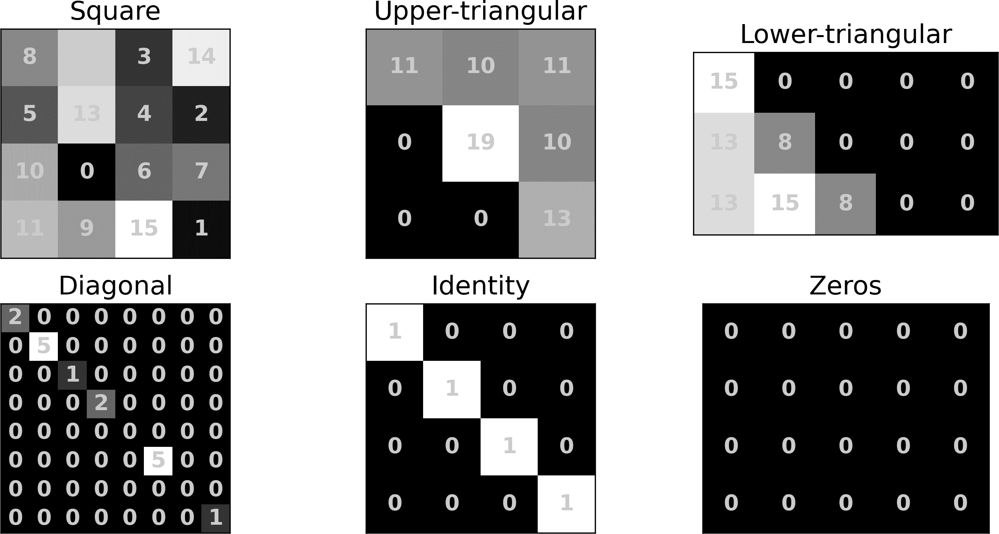
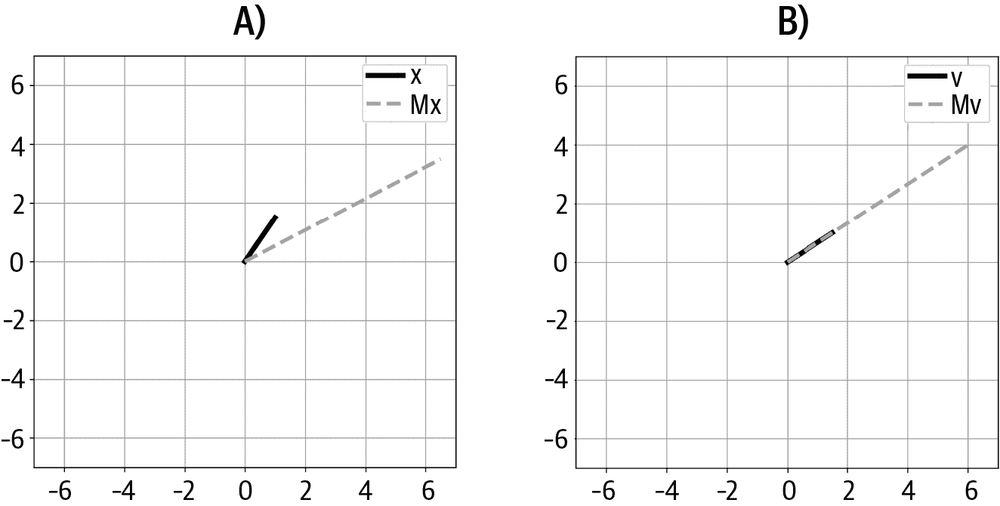
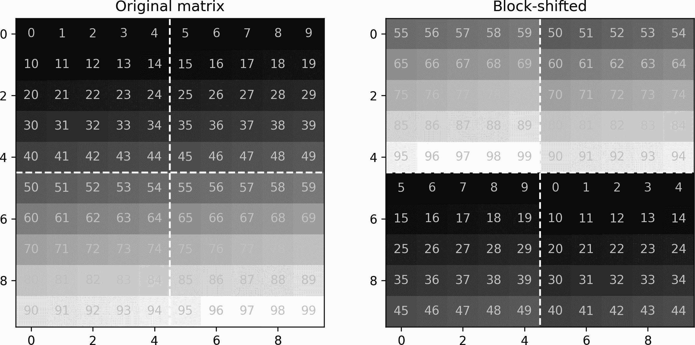

# 第五章：矩阵，第一部分

矩阵是向量的升级版。矩阵是非常多才多艺的数学对象。它们可以存储一组方程、几何变换、粒子随时间的位置、财务记录以及其他无数的东西。在数据科学中，矩阵有时被称为数据表，其中行对应观测（例如客户），列对应特征（例如购买）。

这章和接下来的两章将把你的线性代数知识提升到一个新的水平。来杯咖啡，戴上思考帽子。本章结束时你的大脑会更强大。

# 在 NumPy 中创建和可视化矩阵

根据上下文，矩阵可以被理解为一组列向量相邻堆叠在一起（例如，观测值-特征数据表），或者一组行向量叠加在一起（例如，多传感器数据，每行是来自不同通道的时间序列），或者作为有序的独立矩阵元素集合（例如，图像中每个矩阵元素编码像素强度值）。

## 可视化、索引和切片矩阵

小矩阵可以简单地完整打印出来，例如以下示例：

<math display="block"><mrow><mfenced close="]" open="["><mtable><mtr><mtd><mn>1</mn></mtd> <mtd><mn>2</mn></mtd></mtr> <mtr><mtd><mi>π</mi></mtd> <mtd><mn>4</mn></mtd></mtr> <mtr><mtd><mn>6</mn></mtd> <mtd><mn>7</mn></mtd></mtr></mtable></mfenced> <mo>,</mo> <mfenced close="]" open=""><mtable><mtr><mtd><mrow><mo>-</mo> <mn>6</mn></mrow></mtd> <mtd><mrow><mn>1/3</mn></mrow></mtd></mtr> <mtr><mtd><msup><mi>e</mi> <mrow><mn>4.3</mn></mrow></msup></mtd> <mtd><mrow><mo>-</mo> <mn>1.4</mn></mrow></mtd></mtr> <mtr><mtd><mrow><mn>6/5</mn></mrow></mtd> <mtd><mn>0</mn></mtd></mtr></mtable></mfenced></mrow></math>

但这不是可扩展的，实际工作中的矩阵可能很大，可能包含数十亿个元素。因此，较大的矩阵可以被视为图像。矩阵的每个元素的数值映射到图像中的颜色。在大多数情况下，这些映射是伪彩色的，因为数值到颜色的映射是任意的。Figure 5-1 展示了使用 Python 库`matplotlib`将矩阵可视化为图像的示例。

![矩阵作为图像的示例

###### 图 5-1。三个矩阵，被视为图像

矩阵使用粗体大写字母表示，例如矩阵<math alttext="bold upper A"><mi>𝐀</mi></math>或<math alttext="bold upper M"><mi>𝐌</mi></math>。矩阵的大小使用（行数，列数）约定表示。例如，以下矩阵是 3 × 5，因为它有三行五列：

<math alttext="Start 3 By 5 Matrix 1st Row 1st Column 1 2nd Column 3 3rd Column 5 4th Column 7 5th Column 9 2nd Row 1st Column 0 2nd Column 2 3rd Column 4 4th Column 6 5th Column 8 3rd Row 1st Column 1 2nd Column 4 3rd Column 7 4th Column 8 5th Column 9 EndMatrix" display="block"><mfenced close="]" open="["><mtable><mtr><mtd><mn>1</mn></mtd> <mtd><mn>3</mn></mtd> <mtd><mn>5</mn></mtd> <mtd><mn>7</mn></mtd> <mtd><mn>9</mn></mtd></mtr> <mtr><mtd><mn>0</mn></mtd> <mtd><mn>2</mn></mtd> <mtd><mn>4</mn></mtd> <mtd><mn>6</mn></mtd> <mtd><mn>8</mn></mtd></mtr> <mtr><mtd><mn>1</mn></mtd> <mtd><mn>4</mn></mtd> <mtd><mn>7</mn></mtd> <mtd><mn>8</mn></mtd> <mtd><mn>9</mn></mtd></mtr></mtable></mfenced></math>

你可以通过索引行和列位置来引用矩阵的特定元素：矩阵<math alttext="bold upper A"><mi>𝐀</mi></math> 中第 3 行第 4 列的元素表示为<math alttext="a Subscript 3 comma 4"><msub><mi>a</mi> <mrow><mn>3</mn><mo>,</mo><mn>4</mn></mrow></msub></math>（在前述示例矩阵中，<math alttext="a Subscript 3 comma 4 Baseline equals 8"><mrow><msub><mi>a</mi> <mrow><mn>3</mn><mo>,</mo><mn>4</mn></mrow></msub> <mo>=</mo> <mn>8</mn></mrow></math>）。*重要提示：* 数学中使用基于 1 的索引，而 Python 使用基于 0 的索引。因此，在 Python 中索引元素<math alttext="a Subscript 3 comma 4"><msub><mi>a</mi> <mrow><mn>3</mn><mo>,</mo><mn>4</mn></mrow></msub></math>为`A[2,3]`。

从矩阵中提取子集的行或列是通过切片来完成的。如果你不熟悉 Python，可以参考 Chapter 16 中关于切片列表和 NumPy 数组的介绍。要从矩阵中提取一个部分，你需要指定起始和结束的行和列，切片步长为 1。在线代码会引导你完成这个过程，以下代码展示了从较大矩阵的第 2 到第 4 行和第 1 到第 5 列提取子矩阵的示例：

```
A = np.arange(60).reshape(6,10)
sub = A[1:4:1,0:5:1]
```

这是完整和子矩阵的全貌：

```
Original matrix:
[[ 0  1  2  3  4  5  6  7  8  9]
 [10 11 12 13 14 15 16 17 18 19]
 [20 21 22 23 24 25 26 27 28 29]
 [30 31 32 33 34 35 36 37 38 39]
 [40 41 42 43 44 45 46 47 48 49]
 [50 51 52 53 54 55 56 57 58 59]]
```

```
Submatrix:
[[10 11 12 13 14]
 [20 21 22 23 24]
 [30 31 32 33 34]]
```

## 特殊矩阵

矩阵有无数种，因为有无数种方法可以将数字组织成矩阵。但可以使用相对较少的特征来描述矩阵，这些特征形成了矩阵的“家族”或类别。了解这些类别很重要，因为它们在特定操作中出现或具有某些有用的属性。

有些矩阵类别被如此频繁地使用，以至于它们有专门的 NumPy 函数来创建它们。以下是一些常见特殊矩阵的列表和用 Python 代码创建它们的方法；¹ 你可以在 Figure 5-2 中看到它们的外观：

随机数矩阵

这是一个包含从某个分布（通常是高斯，又称正态）随机抽取的数字的矩阵。随机数矩阵非常适合用代码探索线性代数，因为可以快速且轻松地创建任何大小和秩的矩阵（矩阵秩是一个你将在 Chapter 16 中学习的概念）。

NumPy 中创建随机矩阵有几种方式，具体取决于你希望从哪个分布中抽取数值。在本书中，我们主要使用高斯分布的数值：

```
Mrows = 4 # shape 0
Ncols = 6 # shape 1
A = np.random.randn(Mrows,Ncols)
```

方阵与非方阵

方阵的行数与列数相同；换句话说，该矩阵在 <math alttext="double-struck upper R Superscript upper N times upper N"><msup><mi>ℝ</mi> <mrow><mi>N</mi><mo>×</mo><mi>N</mi></mrow></msup></math> 中。非方阵，有时也称为矩形矩阵，其行数和列数不同。通过在先前代码中调整形状参数，你可以从随机数创建方阵和矩形矩阵。

如果矩阵的行数多于列数，则称其为*高*矩阵，如果列数多于行数，则称其为*宽*矩阵。

对角线

矩阵的*对角线*是从左上角到右下角的元素。*对角矩阵*在所有非对角线元素上都有零；对角线上的元素可能包含零，但这些元素是唯一可能包含非零值的元素。

NumPy 函数`np.diag()`根据输入的不同具有两种行为：输入一个矩阵，`np.diag`会将对角线元素作为向量返回；输入一个向量，`np.diag`会返回以该向量元素为对角线元素的矩阵。（注意：提取矩阵的对角线元素并不称为“对角化矩阵”；这是在第十三章中介绍的另一种操作。）

三角形

三角矩阵包含主对角线上方或下方的全部零元素。如果非零元素在对角线上方，则称为*上三角*矩阵；如果在对角线下方，则称为*下三角*矩阵。

NumPy 有专门的函数来提取矩阵的上三角（`np.triu()`）或下三角（`np.tril()`）。

单位矩阵

单位矩阵是最重要的特殊矩阵之一。它相当于数字 1，任何矩阵或向量乘以单位矩阵都是同样的矩阵或向量。单位矩阵是一个具有所有对角线元素值为 1 的方阵对角线矩阵。它用字母<math alttext="bold upper I"><mi>𝐈</mi></math>表示。你可能会看到一个下标来表示其大小（例如，<math alttext="bold upper I 5"><msub><mi>𝐈</mi><mn>5</mn></msub></math> 是<math alttext="5 times 5"><mrow><mn>5</mn><mo>×</mo><mn>5</mn></mrow></math>单位矩阵）；如果没有，你可以从上下文中推断大小（例如，为了使方程一致）。

在 Python 中，你可以使用`np.eye()`创建单位矩阵。

零矩阵

零矩阵类似于零向量：所有元素都是零的矩阵。像零向量一样，它用粗体零符号表示：<math alttext="bold 0"><mn mathvariant="bold">0</mn></math>。在数学和科学符号中，使用相同符号指代向量和矩阵可能有些混淆，但这种重载在数学和科学符号中很常见。

使用`np.zeros()`函数创建零矩阵。



###### 图 5-2\. 一些特殊矩阵。数字和灰度值表示每个元素的矩阵值。

# 矩阵数学：加法，标量乘法，哈达玛乘法

矩阵的数学运算分为两类：直观和不直观。通常，直观操作可以表达为逐元素的过程，而不直观的操作则需要更长的解释和一些实践才能理解。让我们从直观操作开始。

## 加法和减法

两个矩阵相加是通过相加它们对应元素实现的。这里是一个例子：

<math alttext="Start 2 By 3 Matrix 1st Row 1st Column 2 2nd Column 3 3rd Column 4 2nd Row 1st Column 1 2nd Column 2 3rd Column 4 EndMatrix plus Start 2 By 3 Matrix 1st Row 1st Column 0 2nd Column 3 3rd Column 1 2nd Row 1st Column negative 1 2nd Column negative 4 3rd Column 2 EndMatrix equals Start 2 By 3 Matrix 1st Row 1st Column left-parenthesis 2 plus 0 right-parenthesis 2nd Column left-parenthesis 3 plus 3 right-parenthesis 3rd Column left-parenthesis 4 plus 1 right-parenthesis 2nd Row 1st Column left-parenthesis 1 minus 1 right-parenthesis 2nd Column left-parenthesis 2 minus 4 right-parenthesis 3rd Column left-parenthesis 4 plus 2 right-parenthesis EndMatrix equals Start 2 By 3 Matrix 1st Row 1st Column 2 2nd Column 6 3rd Column 5 2nd Row 1st Column 0 2nd Column negative 2 3rd Column 6 EndMatrix" display="block"><mrow><mfenced close="]" open="["><mtable><mtr><mtd><mn>2</mn></mtd> <mtd><mn>3</mn></mtd> <mtd><mn>4</mn></mtd></mtr> <mtr><mtd><mn>1</mn></mtd> <mtd><mn>2</mn></mtd> <mtd><mn>4</mn></mtd></mtr></mtable></mfenced> <mo>+</mo> <mfenced close="]" open="["><mtable><mtr><mtd><mrow><mphantom><mo>-</mo></mphantom> <mn>0</mn></mrow></mtd> <mtd><mrow><mphantom><mo>-</mo></mphantom> <mn>3</mn></mrow></mtd> <mtd><mn>1</mn></mtd></mtr> <mtr><mtd><mrow><mo>-</mo> <mn>1</mn></mrow></mtd> <mtd><mrow><mo>-</mo> <mn>4</mn></mrow></mtd> <mtd><mn>2</mn></mtd></mtr></mtable></mfenced> <mo>=</mo> <mfenced close="]" open="["><mtable><mtr><mtd><mrow><mo>(</mo> <mn>2</mn> <mo>+</mo> <mn>0</mn> <mo>)</mo></mrow></mtd> <mtd><mrow><mo>(</mo> <mn>3</mn> <mo>+</mo> <mn>3</mn> <mo>)</mo></mrow></mtd> <mtd><mrow><mo>(</mo> <mn>4</mn> <mo>+</mo> <mn>1</mn> <mo>)</mo></mrow></mtd></mtr> <mtr><mtd><mrow><mo>(</mo> <mn>1</mn> <mo>-</mo> <mn>1</mn> <mo>)</mo></mrow></mtd> <mtd><mrow><mo>(</mo> <mn>2</mn> <mo>-</mo> <mn>4</mn> <mo>)</mo></mrow></mtd> <mtd><mrow><mo>(</mo> <mn>4</mn> <mo>+</mo> <mn>2</mn> <mo>)</mo></mrow></mtd></mtr></mtable></mfenced> <mo>=</mo> <mfenced close="]" open="["><mtable><mtr><mtd><mn>2</mn></mtd> <mtd><mrow><mphantom><mo>-</mo></mphantom> <mn>6</mn></mrow></mtd> <mtd><mn>5</mn></mtd></mtr> <mtr><mtd><mn>0</mn></mtd> <mtd><mrow><mo>-</mo> <mn>2</mn></mrow></mtd> <mtd><mn>6</mn></mtd></mtr></mtable></mfenced></mrow></math>

正如你从例子中所猜测的那样，矩阵加法仅在大小相同的两个矩阵之间定义。

## “平移”矩阵

与向量一样，正式而言不能像 <math alttext="lamda plus bold upper A"><mrow><mi>λ</mi> <mo>+</mo> <mi>𝐀</mi></mrow></math> 这样将标量添加到矩阵中。Python 允许这样的操作（例如 `3+np.eye(2)`），这涉及将标量广播添加到矩阵的每个元素中。这是一个方便的计算，但并不是正式的线性代数操作。

但是有一种线性代数的方法可以向方阵添加一个标量，那就是*移位*矩阵。它通过向对角线添加一个常数值来实现，这由添加一个标量乘以单位矩阵来实现：

<math alttext="bold upper A plus lamda bold upper I" display="block"><mrow><mi>𝐀</mi> <mo>+</mo> <mi>λ</mi> <mi>𝐈</mi></mrow></math>

这是一个数值例子：

<math alttext="Start 3 By 3 Matrix 1st Row 1st Column 4 2nd Column 5 3rd Column 1 2nd Row 1st Column 0 2nd Column 1 3rd Column 11 3rd Row 1st Column 4 2nd Column 9 3rd Column 7 EndMatrix plus 6 Start 3 By 3 Matrix 1st Row 1st Column 1 2nd Column 0 3rd Column 0 2nd Row 1st Column 0 2nd Column 1 3rd Column 0 3rd Row 1st Column 0 2nd Column 0 3rd Column 1 EndMatrix equals Start 3 By 3 Matrix 1st Row 1st Column 10 2nd Column 5 3rd Column 1 2nd Row 1st Column 0 2nd Column 7 3rd Column 11 3rd Row 1st Column 4 2nd Column 9 3rd Column 13 EndMatrix" display="block"><mrow><mfenced close="]" open="["><mtable><mtr><mtd><mn>4</mn></mtd> <mtd><mn>5</mn></mtd> <mtd><mn>1</mn></mtd></mtr> <mtr><mtd><mn>0</mn></mtd> <mtd><mn>1</mn></mtd> <mtd><mn>11</mn></mtd></mtr> <mtr><mtd><mn>4</mn></mtd> <mtd><mn>9</mn></mtd> <mtd><mn>7</mn></mtd></mtr></mtable></mfenced> <mo>+</mo> <mn>6</mn> <mfenced close="]" open="["><mtable><mtr><mtd><mn>1</mn></mtd> <mtd><mn>0</mn></mtd> <mtd><mn>0</mn></mtd></mtr> <mtr><mtd><mn>0</mn></mtd> <mtd><mn>1</mn></mtd> <mtd><mn>0</mn></mtd></mtr> <mtr><mtd><mn>0</mn></mtd> <mtd><mn>0</mn></mtd> <mtd><mn>1</mn></mtd></mtr></mtable></mfenced> <mo>=</mo> <mfenced close="]" open="["><mtable><mtr><mtd><mn>10</mn></mtd> <mtd><mn>5</mn></mtd> <mtd><mn>1</mn></mtd></mtr> <mtr><mtd><mn>0</mn></mtd> <mtd><mn>7</mn></mtd> <mtd><mn>11</mn></mtd></mtr> <mtr><mtd><mn>4</mn></mtd> <mtd><mn>9</mn></mtd> <mtd><mn>13</mn></mtd></mtr></mtable></mfenced></mrow></math>

在 Python 中进行移位是直接的：

```
A = np.array([ [4,5,1],[0,1,11],[4,9,7] ])
s = 6
A + s # NOT shifting!
A + s*np.eye(len(A)) # shifting
```

注意只有对角元素会改变；矩阵的其余部分不会受到移位的影响。在实践中，为了尽可能保留矩阵中的信息，同时受益于移位的效果，包括增加矩阵的数值稳定性（您将在本书后面学到为什么会发生这种情况）。

究竟需要移动多少是机器学习、统计学、深度学习、控制工程等多个领域正在进行研究的问题。例如，通过 <math alttext="lamda equals 6"><mrow><mi>λ</mi> <mo>=</mo> <mn>6</mn></mrow></math> 进行移动是多还是少？<math display="inline"><mrow><mi>λ</mi> <mo>=</mo> <mn>.001</mn></mrow></math> 呢？显然，这些数值相对于矩阵中的数值来说是“大”还是“小”。因此，在实践中，<math alttext="lamda"><mi>λ</mi></math> 通常被设置为矩阵定义的某个量，如范数或特征值的平均数的一部分。您将在后面的章节中进一步探讨这个问题。

“移位”矩阵有两个主要（非常重要！）的应用：它是找到矩阵特征值的机制，也是在将模型拟合到数据时正则化矩阵的机制。

## 标量和 Hadamard 乘法

这两种乘法对矩阵和向量的工作方式相同，也就是说，它们是逐元素的。

标量-矩阵乘法意味着将矩阵中的每个元素乘以相同的标量。以下是一个使用字母而不是数字的矩阵的示例：

<math alttext="gamma Start 2 By 2 Matrix 1st Row 1st Column a 2nd Column b 2nd Row 1st Column c 2nd Column d EndMatrix equals Start 2 By 2 Matrix 1st Row 1st Column gamma a 2nd Column gamma b 2nd Row 1st Column gamma c 2nd Column gamma d EndMatrix" display="block"><mrow><mi>γ</mi> <mfenced close="]" open="["><mtable><mtr><mtd><mi>a</mi></mtd> <mtd><mi>b</mi></mtd></mtr> <mtr><mtd><mi>c</mi></mtd> <mtd><mi>d</mi></mtd></mtr></mtable></mfenced> <mo>=</mo> <mfenced close="]" open="["><mtable><mtr><mtd><mrow><mi>γ</mi> <mi>a</mi></mrow></mtd> <mtd><mrow><mi>γ</mi> <mi>b</mi></mrow></mtd></mtr> <mtr><mtd><mrow><mi>γ</mi> <mi>c</mi></mrow></mtd> <mtd><mrow><mi>γ</mi> <mi>d</mi></mrow></mtd></mtr></mtable></mfenced></mrow></math>

同样，Hadamard 乘法涉及对两个矩阵进行逐元素乘法（因此也称为*逐元素乘法*）。这里有一个例子：

<math alttext="Start 2 By 2 Matrix 1st Row 1st Column 2 2nd Column 3 2nd Row 1st Column 4 2nd Column 5 EndMatrix circled-dot Start 2 By 2 Matrix 1st Row 1st Column a 2nd Column b 2nd Row 1st Column c 2nd Column d EndMatrix equals Start 2 By 2 Matrix 1st Row 1st Column 2 a 2nd Column 3 b 2nd Row 1st Column 4 c 2nd Column 5 d EndMatrix" display="block"><mrow><mfenced close="]" open="["><mtable><mtr><mtd><mn>2</mn></mtd> <mtd><mn>3</mn></mtd></mtr> <mtr><mtd><mn>4</mn></mtd> <mtd><mn>5</mn></mtd></mtr></mtable></mfenced> <mo>⊙</mo> <mfenced close="]" open="["><mtable><mtr><mtd><mi>a</mi></mtd> <mtd><mi>b</mi></mtd></mtr> <mtr><mtd><mi>c</mi></mtd> <mtd><mi>d</mi></mtd></mtr></mtable></mfenced> <mo>=</mo> <mfenced close="]" open=""><mtable><mtr><mtd><mrow><mn>2</mn> <mi>a</mi></mrow></mtd> <mtd><mrow><mn>3</mn> <mi>b</mi></mrow></mtd></mtr> <mtr><mtd><mrow><mn>4</mn> <mi>c</mi></mrow></mtd> <mtd><mrow><mn>5</mn> <mi>d</mi></mrow></mtd></mtr></mtable></mfenced></mrow></math>

在 NumPy 中，Hadamard 乘法可以使用 `np.multiply()` 函数实现。但通常更容易使用两个矩阵之间的星号 `A*B` 来实现。这可能会引起一些混淆，因为标准的矩阵乘法（下一节）使用 `@` 符号来表示。这是一个微妙但重要的区别！（这对于从 MATLAB 转到 Python 的读者尤其令人困惑，因为在 MATLAB 中，`*` 表示矩阵乘法。）

```
A = np.random.randn(3,4)
B = np.random.randn(3,4)

A*B # Hadamard multiplication
np.multiply(A,B) # also Hadamard
A@B # NOT Hadamard!
```

Hadamard 乘法在线性代数中确实有一些应用，例如在计算矩阵逆时。但是，它最常用于应用程序中，作为存储许多个体乘法的便捷方式。这与向量 Hadamard 乘法的常见用法相似，正如在第二章中讨论的那样。

# 标准矩阵乘法

现在我们来到了矩阵乘法的不直观方式。明确地说，标准矩阵乘法并不特别困难；它只是与你可能期望的不同。与其按元素操作，标准矩阵乘法是按行/列进行操作。事实上，标准矩阵乘法可以简化为一个矩阵的行与另一个矩阵的列之间的逐点乘积的系统收集。（这种形式的乘法正式称为*矩阵乘法*；我添加了术语*标准*以帮助消除与 Hadamard 和标量乘法的歧义。）

但在我详细讨论如何将两个矩阵相乘之前，我将首先解释如何确定两个矩阵是否可以相乘。正如你将了解到的，只有当两个矩阵的大小协调时，它们才能相乘。

## 矩阵乘法有效性规则

你知道矩阵大小是以<math alttext="上 M 乘以上 N"><mrow><mi>M</mi> <mo>×</mo> <mi>N</mi></mrow></math> —行乘列来写出的。两个相乘的矩阵可以有不同的大小，因此让我们将第二个矩阵的大小称为<math alttext="上 N 乘以上 K"><mrow><mi>N</mi> <mo>×</mo> <mi>K</mi></mrow></math> 。当我们将两个乘数矩阵写出并在其下方写出它们的大小时，我们可以引用“内”维度<math alttext="上 N"><mi>N</mi></math> 和“外”维度<math alttext="上 M"><mi>M</mi></math> 和<math alttext="上 K"><mi>K</mi></math> 。

这里的重要一点是：*矩阵乘法仅在“内”维度匹配且乘积矩阵的大小由“外”维度定义时有效*。参见图 5-3。

![矩阵乘法有效性的可视化

###### 图 5-3\. 矩阵乘法有效性的可视化。记住这张图片。

更正式地说，矩阵乘法在左矩阵的列数等于右矩阵的行数时有效，乘积矩阵的大小由左矩阵的行数和右矩阵的列数定义。我觉得“内/外”准则更容易记住。

您已经可以看到矩阵乘法不遵守交换律： <math alttext="bold upper A bold upper B"><mrow><mi>𝐀</mi> <mi>𝐁</mi></mrow></math> 可能有效，而 <math alttext="bold upper B bold upper A"><mrow><mi>𝐁</mi> <mi>𝐀</mi></mrow></math> 则无效。即使两种乘法都有效（例如，如果两个矩阵都是方阵），它们可能产生不同的结果。也就是说，如果 <math alttext="bold upper C bold equals bold upper A bold upper B"><mrow><mi>𝐂</mi> <mo>=</mo> <mi>𝐀</mi> <mi>𝐁</mi></mrow></math> 和 <math alttext="bold upper D bold equals bold upper B bold upper A"><mrow><mi>𝐃</mi> <mo>=</mo> <mi>𝐁</mi> <mi>𝐀</mi></mrow></math> ，那么一般情况下 <math alttext="bold upper C not-equals bold upper D"><mrow><mi>𝐂</mi> <mo>≠</mo> <mi>𝐃</mi></mrow></math> （它们在某些特殊情况下相等，但我们不能一般性地假设它们相等）。

请注意标记：Hadamard 乘法使用点圈示（ <math alttext="bold upper A circled-dot bold upper B"><mrow><mi>𝐀</mi> <mo>⊙</mo> <mi>𝐁</mi></mrow></math> ），而矩阵乘法则表示为两个矩阵并排放置，中间没有任何符号（ <math alttext="bold upper A bold upper B"><mrow><mi>𝐀</mi> <mi>𝐁</mi></mrow></math> ）。

现在是学习矩阵乘法的机制和解释的时候了。

## 矩阵乘法

矩阵乘法仅在左矩阵的列数与右矩阵的行数相匹配时才有效，这是因为乘积矩阵中的（*i,j*）元素是左矩阵第*i*行与右矩阵第*j*列的点积。

方程式 5-1 展示了矩阵乘法的示例，使用了与 Hadamard 乘法相同的两个矩阵。确保理解乘积矩阵中每个元素如何计算为左侧矩阵的相应行和右侧矩阵的列的点积。

##### 方程式 5-1\. 矩阵乘法的示例。添加括号以方便视觉分组。

<math alttext="Start 2 By 2 Matrix 1st Row 1st Column 2 2nd Column 3 2nd Row 1st Column 4 2nd Column 5 EndMatrix Start 2 By 2 Matrix 1st Row 1st Column a 2nd Column b 2nd Row 1st Column c 2nd Column d EndMatrix equals Start 2 By 2 Matrix 1st Row 1st Column left-parenthesis 2 a plus 3 c right-parenthesis 2nd Column left-parenthesis 2 b plus 3 d right-parenthesis 2nd Row 1st Column left-parenthesis 4 a plus 5 c right-parenthesis 2nd Column left-parenthesis 4 b plus 5 d right-parenthesis EndMatrix" display="block"><mrow><mfenced close="]" open="["><mtable><mtr><mtd><mn>2</mn></mtd> <mtd><mn>3</mn></mtd></mtr> <mtr><mtd><mn>4</mn></mtd> <mtd><mn>5</mn></mtd></mtr></mtable></mfenced> <mfenced close="]" open="["><mtable><mtr><mtd><mi>a</mi></mtd> <mtd><mi>b</mi></mtd></mtr> <mtr><mtd><mi>c</mi></mtd> <mtd><mi>d</mi></mtd></mtr></mtable></mfenced> <mo>=</mo> <mfenced close="]" open=""><mtable><mtr><mtd><mrow><mo>(</mo> <mn>2</mn> <mi>a</mi> <mo>+</mo> <mn>3</mn> <mi>c</mi> <mo>)</mo></mrow></mtd> <mtd><mrow><mo>(</mo> <mn>2</mn> <mi>b</mi> <mo>+</mo> <mn>3</mn> <mi>d</mi> <mo>)</mo></mrow></mtd></mtr> <mtr><mtd><mrow><mo>(</mo> <mn>4</mn> <mi>a</mi> <mo>+</mo> <mn>5</mn> <mi>c</mi> <mo>)</mo></mrow></mtd> <mtd><mrow><mo>(</mo> <mn>4</mn> <mi>b</mi> <mo>+</mo> <mn>5</mn> <mi>d</mi> <mo>)</mo></mrow></mtd></mtr></mtable></mfenced></mrow></math>

如果您难以记住矩阵乘法的工作原理，图 5-4 显示了一种用手指画出乘法的助记技巧。

![矩阵乘法的手指示意图

###### 图 5-4\. 矩阵乘法的手指动作

您如何解释矩阵乘法？请记住，点积是编码两个向量之间关系的数字。因此，矩阵乘法的结果是一个矩阵，存储了左矩阵行与右矩阵列之间的所有成对线性关系。这是一件美妙的事情，并且是计算协方差和相关矩阵、一般线性模型（用于包括 ANOVA 和回归在内的统计分析）以及无数其他应用的基础。

## 矩阵-向量乘法

从纯机械角度来看，矩阵向量乘法并不特别，不值得专门开辟小节来讨论：矩阵和向量的乘法就是一个“矩阵”是向量的矩阵乘法。

但是矩阵向量乘法在数据科学、机器学习和计算机图形学中有许多应用，因此值得花一些时间讨论。让我们从基础开始：

+   一个矩阵可以右乘一个列向量，但不能右乘一个行向量，也可以左乘一个行向量，但不能左乘一个列向量。换句话说，<math alttext="bold upper A bold v"><mrow><mi>𝐀</mi> <mi>𝐯</mi></mrow></math>和<math alttext="bold v Superscript upper T Baseline bold upper A"><mrow><msup><mi>𝐯</mi> <mtext>T</mtext></msup> <mi>𝐀</mi></mrow></math>是有效的，但<math alttext="bold upper A bold v Superscript upper T"><mrow><mi>𝐀</mi> <msup><mi>𝐯</mi> <mtext>T</mtext></msup></mrow></math>和<math alttext="bold v bold upper A"><mrow><mi>𝐯</mi> <mi>𝐀</mi></mrow></math>是无效的。

    从检查矩阵尺寸中可以看出：一个<math alttext="upper M times upper N"><mrow><mi>M</mi> <mo>×</mo> <mi>N</mi></mrow></math>矩阵可以通过一个<math alttext="1 times upper M"><mrow><mn>1</mn> <mo>×</mo> <mi>M</mi></mrow></math>矩阵（也称为行向量）左乘，或通过一个<math alttext="upper N times 1"><mrow><mi>N</mi> <mo>×</mo> <mn>1</mn></mrow></math>矩阵（也称为列向量）右乘。

+   矩阵向量乘法的结果总是一个向量，该向量的方向取决于乘法的向量：通过行向量左乘一个矩阵产生另一个行向量，而通过列向量右乘一个矩阵产生另一个列向量。再次强调，当你考虑矩阵尺寸时这是显而易见的，但值得指出的。

矩阵-向量乘法有几个应用。在统计学中，通过将设计矩阵乘以回归系数来获得模型预测的数据值，写为 <math alttext="bold upper X beta"><mrow><mi mathvariant="bold">X</mi> <mi mathvariant="bold">β</mi></mrow></math> 。在主成分分析中，确定了一组“特征重要性”权重向量，用于最大化数据集 <math alttext="bold upper Y"><mi>𝐘</mi></math> 的方差，并写为 <math alttext="left-parenthesis bold upper Y Superscript upper T Baseline bold upper Y right-parenthesis bold v"><mrow><mo>(</mo> <msup><mi>𝐘</mi> <mtext>T</mtext></msup> <mi>𝐘</mi> <mo>)</mo> <mi>𝐯</mi></mrow></math> （该特征重要性向量 <math alttext="bold v"><mi>𝐯</mi></math> 被称为特征向量）。在多变量信号处理中，通过将空间滤波器应用于多通道时间序列数据 <math alttext="bold upper S"><mi>𝐒</mi></math> ，获得了一个降维的组件，并写为 <math alttext="bold w Superscript upper T Baseline bold upper S"><mrow><msup><mi>𝐰</mi> <mtext>T</mtext></msup> <mi>𝐒</mi></mrow></math> 。在几何学和计算机图形学中，可以使用数学变换矩阵来变换一组图像坐标，并写为 <math alttext="bold upper T bold p"><mrow><mi>𝐓</mi> <mi>𝐩</mi></mrow></math> ，其中 <math alttext="bold upper T"><mi>𝐓</mi></math> 是变换矩阵，<math alttext="bold p"><mi>𝐩</mi></math> 是几何坐标集。

还有很多关于如何在应用线性代数中使用矩阵-向量乘法的例子，你将在本书的后面看到其中的几个。矩阵-向量乘法也是矩阵空间的基础，这是你将在下一章中学习的重要主题。

现在，我想集中讨论矩阵-向量乘法的两种具体解释：作为实现向量的线性加权组合的方法，以及作为实现几何变换的机制。

### 线性加权组合

在前一章中，我们通过分别使用标量和向量进行线性加权组合的计算，然后逐个进行乘法。但是现在你比前一章开始时聪明多了，所以你现在准备学习一种更好、更紧凑和更可扩展的计算线性加权组合的方法：将单独的向量放入矩阵中，并将权重放入向量的相应元素中。然后相乘。以下是一个数值示例：

<math alttext="4 Start 3 By 1 Matrix 1st Row  3 2nd Row  0 3rd Row  6 EndMatrix plus 3 Start 3 By 1 Matrix 1st Row  1 2nd Row  2 3rd Row  5 EndMatrix right double arrow Start 3 By 2 Matrix 1st Row 1st Column 3 2nd Column 1 2nd Row 1st Column 0 2nd Column 2 3rd Row 1st Column 6 2nd Column 5 EndMatrix StartBinomialOrMatrix 4 Choose 3 EndBinomialOrMatrix" display="block"><mrow><mn>4</mn> <mfenced close="]" open="["><mtable><mtr><mtd><mn>3</mn></mtd></mtr> <mtr><mtd><mn>0</mn></mtd></mtr> <mtr><mtd><mn>6</mn></mtd></mtr></mtable></mfenced> <mo>+</mo> <mn>3</mn> <mfenced close="]" open="["><mtable><mtr><mtd><mn>1</mn></mtd></mtr> <mtr><mtd><mn>2</mn></mtd></mtr> <mtr><mtd><mn>5</mn></mtd></mtr></mtable></mfenced> <mo>⇒</mo> <mfenced close="]" open="["><mtable><mtr><mtd><mn>3</mn></mtd> <mtd><mn>1</mn></mtd></mtr> <mtr><mtd><mn>0</mn></mtd> <mtd><mn>2</mn></mtd></mtr> <mtr><mtd><mn>6</mn></mtd> <mtd><mn>5</mn></mtd></mtr></mtable></mfenced> <mfenced close="]" open=""><mtable><mtr><mtd><mn>4</mn></mtd></mtr> <mtr><mtd><mn>3</mn></mtd></mtr></mtable></mfenced></mrow></math>

请花点时间通过乘法来理解如何将两个向量的线性加权组合实现为矩阵-向量乘法。关键的洞察力在于向量中的每个元素标量乘以相应的列矩阵，然后加权列向量求和以得到乘积。

这个例子涉及到列向量的线性加权组合；如果要计算行向量的线性加权组合，你会改变什么？^([2)

### 几何变换

当我们将向量看作几何线时，矩阵向量乘法成为旋转和缩放该向量的一种方法（记住，标量向量乘法可以缩放但不能旋转）。

让我们从 2D 情况开始，方便可视化。这里是我们的矩阵和向量：

```
M  = np.array([ [2,3],[2,1] ])
x  = np.array([ [1,1.5] ]).T
Mx = M@x
```

注意，我创建了 `x` 作为行向量，然后将其转置为列向量；这减少了需要输入的方括号数量。

图 A 在 图 5-5 中展示了这两个向量。你可以看到矩阵 <math alttext="bold upper M"><mi>𝐌</mi></math> 同时旋转和拉伸了原始向量。让我们尝试用同一矩阵来计算另一个向量。事实上，只是为了好玩，让我们使用同样的向量元素，但位置互换（因此，向量 `v = [1.5,1]`）。

现在，在图 B 中出现了一个奇怪的现象（图 5-5）：矩阵向量积不再将向量旋转到另一个方向。矩阵仍然缩放了向量，但其方向被保留了。换句话说，*矩阵*-向量乘法就像*标量*-向量乘法一样。这并不是偶然事件：事实上，向量 `v` 是矩阵 `M` 的特征向量，而 `M` 拉伸 `v` 的程度是其特征值。这是一个非常重要的现象，值得单独讨论（第十三章），但我现在就忍不住向你介绍这个概念。



###### 图 5-5\. 矩阵向量乘法示例

顺便提一下高级主题，这些演示的主要观点是，矩阵向量乘法的一个功能是让矩阵承载一个变换，当应用到一个向量上时，可以旋转和拉伸该向量。

# 矩阵操作：转置

你在 第二章 中学习了向量的转置操作。对于矩阵来说，原理是一样的：交换行和列。就像向量一样，转置用上标 <math alttext="Superscript upper T"><msup><mtext>T</mtext></msup></math> 表示（因此，<math alttext="bold upper C Superscript upper T"><msup><mi>𝐂</mi> <mtext>T</mtext></msup></math> 是矩阵 <math alttext="bold upper C"><mi>𝐂</mi></math> 的转置）。而且对一个矩阵进行两次转置会得到原始矩阵（ <math alttext="bold upper C Superscript TT Baseline equals bold upper C"><mrow><msup><mi>𝐂</mi> <mtext>TT</mtext></msup> <mo>=</mo> <mi>𝐂</mi></mrow></math> ）。

转置操作的正式数学定义打印在 方程式 5-2 中（基本上是从前一章重复的），但我认为记住*转置会交换行和列*也同样简单。

##### 方程式 5-2\. 转置操作的定义

<math alttext="a Subscript i comma j Superscript upper T Baseline equals a Subscript j comma i" display="block"><mrow><msubsup><mi>a</mi> <mrow><mi>i</mi><mo>,</mo><mi>j</mi></mrow> <mtext>T</mtext></msubsup> <mo>=</mo> <msub><mi>a</mi> <mrow><mi>j</mi><mo>,</mo><mi>i</mi></mrow></msub></mrow></math>

这里有一个例子：

<math alttext="Start 2 By 3 Matrix 1st Row 1st Column 3 2nd Column 0 3rd Column 4 2nd Row 1st Column 9 2nd Column 8 3rd Column 3 EndMatrix Superscript upper T Baseline equals Start 3 By 2 Matrix 1st Row 1st Column 3 2nd Column 9 2nd Row 1st Column 0 2nd Column 8 3rd Row 1st Column 4 2nd Column 3 EndMatrix" display="block"><mrow><msup><mfenced close="]" open="["><mtable><mtr><mtd><mn>3</mn></mtd><mtd><mn>0</mn></mtd><mtd><mn>4</mn></mtd></mtr><mtr><mtd><mn>9</mn></mtd><mtd><mn>8</mn></mtd><mtd><mn>3</mn></mtd></mtr></mtable></mfenced> <mtext>T</mtext></msup> <mo>=</mo> <mfenced close="]" open="["><mtable><mtr><mtd><mn>3</mn></mtd> <mtd><mn>9</mn></mtd></mtr> <mtr><mtd><mn>0</mn></mtd> <mtd><mn>8</mn></mtd></mtr> <mtr><mtd><mn>4</mn></mtd> <mtd><mn>3</mn></mtd></mtr></mtable></mfenced></mrow></math>

在 Python 中，有几种方式可以对矩阵进行转置，使用函数和作用于 NumPy 数组的方法：

```
A = np.array([ [3,4,5],[1,2,3] ])
A_T1 = A.T # as method
A_T2 = np.transpose(A) # as function
```

此示例中的矩阵使用 2D NumPy 数组；如果将作为 1D 数组编码的向量应用转置方法，你认为会发生什么？试一试并找出答案！³

## 点积和外积符号

现在你已经了解了转置操作以及矩阵乘法有效性规则，我们可以回顾一下向量点积的符号。对于两列向量 <math alttext="upper M times 1"><mrow><mi>M</mi> <mo>×</mo> <mn>1</mn></mrow></math> ，转置第一个向量而不转置第二个向量会得到尺寸为 <math alttext="1 times upper M"><mrow><mn>1</mn> <mo>×</mo> <mi>M</mi></mrow></math> 和 <math alttext="upper M times 1"><mrow><mi>M</mi> <mo>×</mo> <mn>1</mn></mrow></math> 的两个“矩阵”。“内部”尺寸匹配，而“外部”尺寸告诉我们乘积将是 <math alttext="1 times 1"><mrow><mn>1</mn> <mo>×</mo> <mn>1</mn></mrow></math> ，也就是一个标量。这就是为什么点积被表示为 <math alttext="bold a Superscript upper T Baseline bold b"><mrow><msup><mi>𝐚</mi> <mtext>T</mtext></msup> <mi>𝐛</mi></mrow></math> 的原因。

外积同理：将列向量乘以行向量尺寸为 <math alttext="upper M times 1"><mrow><mi>M</mi> <mo>×</mo> <mn>1</mn></mrow></math> 和 <math alttext="1 times upper N"><mrow><mn>1</mn> <mo>×</mo> <mi>N</mi></mrow></math> 。“内部”尺寸匹配，结果的尺寸将是 <math alttext="upper M times upper N"><mrow><mi>M</mi> <mo>×</mo> <mi>N</mi></mrow></math>。

# 矩阵运算：LIVE EVIL（运算顺序）

LIVE EVIL 是一个回文（回文是指前后读都一样的单词或短语），也是一个可爱的记忆法则，用于记忆转置如何影响乘积矩阵的顺序。基本上，规则是乘积矩阵的转置等同于单独转置并相乘的矩阵，但顺序相反。在 Equation 5-3 中，<math alttext="bold upper L"><mi>𝐋</mi></math>，<math alttext="bold upper I"><mi>𝐈</mi></math>，<math alttext="bold upper V"><mi>𝐕</mi></math>，和<math alttext="bold upper E"><mi>𝐄</mi></math> 都是矩阵，你可以假设它们的尺寸匹配以使乘法有效。

##### 方程式 5-3\. LIVE EVIL 规则示例

<math alttext="left-parenthesis bold upper L bold upper I bold upper V bold upper E right-parenthesis Superscript upper T Baseline equals bold upper E Superscript upper T Baseline bold upper V Superscript upper T Baseline bold upper I Superscript upper T Baseline bold upper L Superscript upper T" display="block"><mrow><msup><mrow><mo>(</mo><mi>𝐋</mi><mi>𝐈</mi><mi>𝐕</mi><mi>𝐄</mi><mo>)</mo></mrow> <mtext>T</mtext></msup> <mo>=</mo> <msup><mi>𝐄</mi> <mtext>T</mtext></msup> <msup><mi>𝐕</mi> <mtext>T</mtext></msup> <msup><mi>𝐈</mi> <mtext>T</mtext></msup> <msup><mi>𝐋</mi> <mtext>T</mtext></msup></mrow></math>

不用说，这条规则适用于任意数量的矩阵乘法，不仅仅是四个，并且不仅仅是这些“随机选择”的字母。

这似乎是个奇怪的规则，但这是使转置乘积矩阵起作用的唯一方法。你可以在本章末尾的 Exercise 5-7 中亲自测试这一点。如果愿意，你可以先跳到该练习再继续阅读。

# 对称矩阵

对称矩阵具有许多特殊属性，使它们很适合处理。它们通常数值稳定，因此对计算机算法很方便。在您阅读本书的过程中，您将了解对称矩阵的特殊属性；在此，我将重点介绍对称矩阵的定义及如何从非对称矩阵创建它们。

矩阵对称意味着什么？这意味着相应的行和列是相等的。这意味着当您交换行和列时，矩阵不变。这又意味着*对称矩阵等于其转置*。在数学术语中，矩阵<math alttext="bold upper A"><mi>𝐀</mi></math>是对称的，如果<math alttext="bold upper A Superscript upper T Baseline equals bold upper A"><mrow><msup><mi>𝐀</mi> <mtext>T</mtext></msup> <mo>=</mo> <mi>𝐀</mi></mrow></math>。

查看方程 5-4 中的对称矩阵。

##### 方程 5-4\. 一个对称矩阵；注意每行等于其对应的列

<math alttext="Start 4 By 4 Matrix 1st Row 1st Column a 2nd Column e 3rd Column f 4th Column g 2nd Row 1st Column e 2nd Column b 3rd Column h 4th Column i 3rd Row 1st Column f 2nd Column h 3rd Column c 4th Column j 4th Row 1st Column g 2nd Column i 3rd Column j 4th Column d EndMatrix" display="block"><mfenced close="]" open=""><mtable><mtr><mtd><mrow><mi>a</mi></mrow></mtd> <mtd><mrow><mi>e</mi></mrow></mtd> <mtd><mrow><mi>f</mi></mrow></mtd> <mtd><mrow><mi>g</mi></mrow></mtd></mtr> <mtr><mtd><mi>e</mi></mtd> <mtd><mi>b</mi></mtd> <mtd><mi>h</mi></mtd> <mtd><mi>i</mi></mtd></mtr> <mtr><mtd><mi>f</mi></mtd> <mtd><mi>h</mi></mtd> <mtd><mi>c</mi></mtd> <mtd><mi>j</mi></mtd></mtr> <mtr><mtd><mi>g</mi></mtd> <mtd><mi>i</mi></mtd> <mtd><mi>j</mi></mtd> <mtd><mi>d</mi></mtd></mtr></mtable></mfenced></math>

一个非方阵可以对称吗？不行！原因在于如果一个矩阵的大小是<math alttext="upper M times upper N"><mrow><mi>M</mi> <mo>×</mo> <mi>N</mi></mrow></math>，那么它的转置的大小是<math alttext="upper N times upper M"><mrow><mi>N</mi> <mo>×</mo> <mi>M</mi></mrow></math>。除非<math alttext="upper M equals upper N"><mrow><mi>M</mi> <mo>=</mo> <mi>N</mi></mrow></math>，否则这两个矩阵不可能相等，这意味着矩阵是方阵。

## 从非对称矩阵创建对称矩阵

最初这可能令人惊讶，但是乘以*任何*矩阵——甚至是非方阵和非对称矩阵——它的转置将产生一个方对称矩阵。换句话说，<math alttext="bold upper A Superscript upper T Baseline bold upper A"><mrow><msup><mi>𝐀</mi> <mtext>T</mtext></msup> <mi>𝐀</mi></mrow></math>是方对称的，以及<math alttext="bold upper A bold upper A Superscript upper T"><mrow><mi>𝐀</mi> <msup><mi>𝐀</mi> <mtext>T</mtext></msup></mrow></math>。 （如果您缺乏时间、耐心或键盘技能来格式化上标 ^T，您可以写成 AtA 和 AAt 或 A'A 和 AA'。）

在看到一个例子之前，让我们严格证明这个断言。一方面，我们实际上不需要单独证明<math alttext="bold upper A Superscript upper T Baseline bold upper A"><mrow><msup><mi>𝐀</mi> <mtext>T</mtext></msup> <mi>𝐀</mi></mrow></math>是方 *且* 对称，因为后者意味着前者。但证明方形是线性代数证明中的一个简单且良好的练习（通常比微积分证明更短且更容易）。

通过考虑矩阵的尺寸即可得到证明：如果 <math alttext="bold upper A"><mi>𝐀</mi></math> 是 <math alttext="upper M times upper N"><mrow><mi>M</mi> <mo>×</mo> <mi>N</mi></mrow></math> ，那么 <math alttext="bold upper A Superscript upper T Baseline bold upper A"><mrow><msup><mi>𝐀</mi> <mtext>T</mtext></msup> <mi>𝐀</mi></mrow></math> 是 <math alttext="left-parenthesis upper N times upper M right-parenthesis left-parenthesis upper M times upper N right-parenthesis"><mrow><mo>（</mo> <mi>N</mi> <mo>×</mo> <mi>M</mi> <mo>）</mo> <mo>（</mo> <mi>M</mi> <mo>×</mo> <mi>N</mi> <mo>）</mo></mrow></math> ，这意味着乘积矩阵的大小为 <math alttext="upper N times upper N"><mrow><mi>N</mi> <mo>×</mo> <mi>N</mi></mrow></math> 。您可以按照相同的逻辑处理 <math alttext="bold upper A bold upper A Superscript upper T"><mrow><mi>𝐀</mi> <msup><mi>𝐀</mi> <mtext>T</mtext></msup></mrow></math> 。

现在来证明对称性。回想一下，对称矩阵的定义是等于其转置。因此让我们转置 <math alttext="bold upper A Superscript upper T Baseline bold upper A"><mrow><msup><mi>𝐀</mi> <mtext>T</mtext></msup> <mi>𝐀</mi></mrow></math> ，进行一些代数运算，看看会发生什么。确保您能够跟进每一个步骤；证明依赖于“LIVE EVIL”规则：

<math alttext="left-parenthesis bold upper A Superscript upper T Baseline bold upper A right-parenthesis Superscript upper T Baseline equals bold upper A Superscript upper T Baseline bold upper A Superscript TT Baseline equals bold upper A Superscript upper T Baseline bold upper A" display="block"><mrow><msup><mrow><mo>(</mo><msup><mi>𝐀</mi> <mtext>T</mtext></msup> <mi>𝐀</mi><mo>)</mo></mrow> <mtext>T</mtext></msup> <mo>=</mo> <msup><mi>𝐀</mi> <mtext>T</mtext></msup> <msup><mi>𝐀</mi> <mtext>TT</mtext></msup> <mo>=</mo> <msup><mi>𝐀</mi> <mtext>T</mtext></msup> <mi>𝐀</mi></mrow></math>

取首末项，得到 <math alttext="left-parenthesis bold upper A Superscript upper T Baseline bold upper A right-parenthesis Superscript upper T Baseline equals left-parenthesis bold upper A Superscript upper T Baseline bold upper A right-parenthesis"><mrow><msup><mrow><mo>（</mo><msup><mi>𝐀</mi> <mtext>T</mtext></msup> <mi>𝐀</mi><mo>）</mo></mrow> <mtext>T</mtext></msup> <mo>=</mo> <mrow><mo>（</mo> <msup><mi>𝐀</mi> <mtext>T</mtext></msup> <mi>𝐀</mi> <mo>）</mo></mrow></mrow></math> 。矩阵等于其转置，因此它是对称的。

现在独自进行 <math alttext="bold upper A bold upper A Superscript upper T"><mrow><mi>𝐀</mi> <msup><mi>𝐀</mi> <mtext>T</mtext></msup></mrow></math> 的证明。剧透警告！您将得出相同的结论。但是书写证明将有助于您内化这个概念。

因此 <math alttext="bold upper A bold upper A Superscript upper T"><mrow><mi>𝐀</mi> <msup><mi>𝐀</mi> <mtext>T</mtext></msup></mrow></math> 和 <math alttext="bold upper A Superscript upper T Baseline bold upper A"><mrow><msup><mi>𝐀</mi> <mtext>T</mtext></msup> <mi>𝐀</mi></mrow></math> 都是方阵对称的。但它们不是同一个矩阵！实际上，如果 <math alttext="bold upper A"><mi>𝐀</mi></math> 是非方阵，则这两个矩阵乘积甚至不是相同大小。

<math alttext="粗体大写𝐀上标大写 T 基线粗体大写𝐀"><mrow><msup><mi>𝐀</mi> <mtext>T</mtext></msup> <mi>𝐀</mi></mrow></math> 被称为*乘法方法*来创建对称矩阵。还有*加法方法*，当矩阵是方阵但非对称时有效。这种方法有一些有趣的性质，但实际应用价值不高，所以我不会重点介绍它。练习 5-9 将带你逐步学习算法；如果你想挑战自己，可以在看练习之前尝试自己发现该算法。

# 摘要

本章是关于矩阵的三章系列中的第一章。在这里，你学会了所有矩阵操作的基础。总结：

+   矩阵就是数字的电子表格。在不同的应用中，将矩阵概念化为一组列向量、一组行向量或单个值的排列是有用的。不过，将矩阵视为图像通常是具洞察力的，或者至少看上去很愉快。

+   有几种特殊矩阵的分类。熟悉矩阵类型的性质将有助于理解矩阵方程和高级应用。

+   一些算术运算是逐元素完成的，比如加法、标量乘法和 Hadamard 乘法。

+   “平移”矩阵意味着向对角线元素添加常数（而不更改非对角线元素）。平移在机器学习中具有几种应用，主要用于查找特征值和正则化统计模型。

+   矩阵乘法涉及左矩阵的行与右矩阵的列的点积。乘积矩阵是行-列对之间的映射的有序集合。记住矩阵乘法有效性规则：<math alttext="左括号大写 M 乘大写 N 右括号左括号大写 N 乘大写 K 右括号等于左括号大写 M 乘大写 K 右括号"><mrow><mo>(</mo> <mi>M</mi> <mo>×</mo> <mi>N</mi> <mo>)</mo> <mo>(</mo> <mi>N</mi> <mo>×</mo> <mi>K</mi> <mo>)</mo> <mo>=</mo> <mo>(</mo> <mi>M</mi> <mo>×</mo> <mi>K</mi> <mo>)</mo></mrow></math> 。

+   LIVE EVIL:⁴ 相乘矩阵的转置等于各自矩阵的转置并且它们的顺序颠倒后相乘。

+   对称矩阵是沿对角线镜像的矩阵，这意味着每行等于其对应的列，并定义为<math alttext="粗体大写 A 等于粗体大写 A 上标大写 T"><mrow><mi>𝐀</mi> <mo>=</mo> <msup><mi>𝐀</mi> <mtext>T</mtext></msup></mrow></math>。对称矩阵有许多有趣和有用的性质，使其在应用中非常适用。

+   你可以通过将矩阵乘以其转置来从任何矩阵创建对称矩阵。结果矩阵 <math alttext="bold upper A Superscript upper T Baseline bold upper A"><mrow><msup><mi>𝐀</mi> <mtext>T</mtext></msup> <mi>𝐀</mi></mrow></math> 对于统计模型和奇异值分解非常重要。

# 代码练习

##### 练习 5-1。

这个练习将帮助你熟悉矩阵元素的索引。使用 `np.arange(12).reshape(3,4)` 创建一个<math alttext="3 times 4"><mrow><mn>3</mn> <mo>×</mo> <mn>4</mn></mrow></math>矩阵。然后编写 Python 代码提取第二行第四列的元素。使用软编码，以便可以选择不同的行/列索引。打印出如下消息：

`矩阵索引 (2,4) 处的元素为 7。`

##### 练习 5-2。

这个和接下来的练习专注于通过切片矩阵获取子矩阵。首先创建 图 5-6 中的矩阵 <math alttext="bold upper C"><mi>𝐂</mi></math>，并使用 Python 切片提取由前五行和五列组成的子矩阵。我们称这个矩阵为 <math alttext="bold upper C 1"><msub><mi>𝐂</mi> <mn>1</mn></msub></math> 。尝试重现 图 5-6，但如果你在 Python 可视化编码方面遇到困难，那么只需专注于正确提取子矩阵即可。



###### 图 5-7。Exercise 5-3 的可视化

##### 练习 5-4。

使用两个`for`循环逐元素实现矩阵的逐元素加法。当尝试将大小不匹配的两个矩阵相加时会发生什么？这个练习将帮助你思考如何将矩阵分解为行、列和单独的元素。

##### 练习 5-5。

矩阵加法和标量乘法遵守交换和分配的数学法则。这意味着以下方程给出相同的结果（假设矩阵 <math alttext="bold upper A"><mi>𝐀</mi></math> 和 <math alttext="bold upper B"><mi>𝐁</mi></math> 的大小相同，而 <math alttext="sigma"><mi>σ</mi></math> 是某个标量）：

<math alttext="sigma left-parenthesis bold upper A plus bold upper B right-parenthesis equals sigma bold upper A plus sigma bold upper B equals bold upper A sigma plus bold upper B sigma" display="block"><mrow><mi>σ</mi> <mo>(</mo> <mi>𝐀</mi> <mo>+</mo> <mi>𝐁</mi> <mo>)</mo> <mo>=</mo> <mi>σ</mi> <mi>𝐀</mi> <mo>+</mo> <mi>σ</mi> <mi>𝐁</mi> <mo>=</mo> <mi>𝐀</mi> <mi>σ</mi> <mo>+</mo> <mi>𝐁</mi> <mi>σ</mi></mrow></math>

与其通过数学方式证明这一点，不如通过编码来演示。在 Python 中，创建两个大小为 <math alttext="3 times 4"><mrow><mn>3</mn> <mo>×</mo> <mn>4</mn></mrow></math> 的随机数字矩阵和一个随机标量。然后实现前述方程式中的三个表达式。你需要找出一种方法来确认这三个结果是否相等。请记住，忽略在 <math alttext="10 Superscript negative 15"><msup><mn>10</mn> <mrow><mo>-</mo><mn>15</mn></mrow></msup></math> 范围内的微小计算机精度误差。

##### 练习 5-6。

使用`for`循环编写矩阵乘法代码。将结果与使用 numpy 的`@`操作符进行确认。这个练习将帮助你巩固对矩阵乘法的理解，但在实践中，最好使用`@`而不是编写双重`for`循环。

##### 练习 5-7。

确认使用以下五个步骤的 LIVE EVIL 规则：（1）创建四个随机数矩阵，设置大小分别为 <math alttext="bold upper L element-of double-struck upper R Superscript 2 times 6"><mrow><mi>𝐋</mi> <mo>∈</mo> <msup><mi>ℝ</mi> <mrow><mn>2</mn><mo>×</mo><mn>6</mn></mrow></msup></mrow></math> ，<math alttext="bold upper I element-of double-struck upper R Superscript 6 times 3"><mrow><mi>𝐈</mi> <mo>∈</mo> <msup><mi>ℝ</mi> <mrow><mn>6</mn><mo>×</mo><mn>3</mn></mrow></msup></mrow></math> ，<math alttext="bold upper V element-of double-struck upper R Superscript 3 times 5"><mrow><mi>𝐕</mi> <mo>∈</mo> <msup><mi>ℝ</mi> <mrow><mn>3</mn><mo>×</mo><mn>5</mn></mrow></msup></mrow></math> 和 <math alttext="bold upper E element-of double-struck upper R Superscript 5 times 2"><mrow><mi>𝐄</mi> <mo>∈</mo> <msup><mi>ℝ</mi> <mrow><mn>5</mn><mo>×</mo><mn>2</mn></mrow></msup></mrow></math> 。（2）将四个矩阵相乘并转置乘积。（3）分别转置每个矩阵并将它们相乘，*不反转它们的顺序*。（4）分别转置每个矩阵并将它们相乘，*按照 LIVE EVIL 规则反转它们的顺序*。检查步骤 2 的结果是否与步骤 3 和步骤 4 的结果相匹配。（5）重复前面的步骤，但使用所有方阵。

##### 练习 5-8。

在这个练习中，你将编写一个 Python 函数来检查一个矩阵是否对称。它应该接受一个矩阵作为输入，并且如果矩阵是对称的，则输出布尔值`True`，如果矩阵是非对称的，则输出布尔值`False`。请记住，由于计算机小的舍入/精度误差可能使“相等”的矩阵看起来不相等。因此，你需要测试一些合理的容差来判断是否相等。在对称和非对称矩阵上测试该函数。

##### 练习 5-9。

我提到了从非对称方阵创建对称矩阵的一种加法方法。这种方法非常简单：用矩阵与其转置的平均值。在 Python 中实现这个算法，并确认结果确实是对称的。（提示：你可以使用前一个练习中编写的函数！）

##### 练习 5-10\.

重复第二部分的 Exercise 3-3 （<math alttext="double-struck upper R cubed"><msup><mi>ℝ</mi> <mn>3</mn></msup></math> 中的两个向量），但使用矩阵-向量乘法代替向量-标量乘法。也就是说，计算 <math alttext="bold upper A bold s"><mrow><mi>𝐀</mi> <mi>𝐬</mi></mrow></math> 而不是 <math alttext="sigma 1 bold v 1 plus sigma 2 bold v 2"><mrow><msub><mi>σ</mi> <mn>1</mn></msub> <msub><mi>𝐯</mi> <mn>1</mn></msub> <mo>+</mo> <msub><mi>σ</mi> <mn>2</mn></msub> <msub><mi>𝐯</mi> <mn>2</mn></msub></mrow></math> 。

##### 练习 5-11\.

对角矩阵具有许多有趣的特性，使它们在工作中非常有用。在这个练习中，你将学习其中两个性质：

+   通过对角矩阵的预乘，可以将右矩阵的行按照对应的对角元素进行缩放。

+   后乘一个对角矩阵可以将左矩阵的列按照对应的对角元素进行缩放。

这个事实被用在多个应用中，包括计算相关矩阵（第 7 章）和矩阵对角化（第 13 和 14 章）。

让我们探讨这个属性的一个推论。首先创建三个 <math alttext="4 times 4"><mrow><mn>4</mn> <mo>×</mo> <mn>4</mn></mrow></math> 矩阵：一个全为 1 的矩阵（提示：`np.ones()`）；一个对角元素为 1, 4, 9 和 16 的对角矩阵；以及一个与前一个对角矩阵的平方根相等的对角矩阵。

接下来，打印出由第一个对角矩阵预乘和后乘的单位矩阵。你将得到以下结果：

```
# Pre-multiply by diagonal:
[[ 1.  1.  1.  1.]
 [ 4.  4.  4.  4.]
 [ 9.  9.  9.  9.]
 [16. 16. 16. 16.]]

# Post-multiply by diagonal:
[[ 1.  4.  9. 16.]
 [ 1.  4.  9. 16.]
 [ 1.  4.  9. 16.]
 [ 1.  4.  9. 16.]]
```

最后，通过对角矩阵的平方根进行预乘和后乘单位矩阵。你将得到以下结果：

```
# Pre- and post-multiply by sqrt-diagonal:
[[ 1.  2.  3.  4.]
 [ 2.  4.  6.  8.]
 [ 3.  6.  9. 12.]
 [ 4.  8. 12. 16.]]
```

注意，行和列都被缩放，以便矩阵中的（*i*,*j*）元素乘以第 *i* 和 *j* 对角元素的乘积。（实际上，我们创建了一个乘法表！）

##### 练习 5-12\.

另一个有趣的事实是：对于两个对角矩阵，矩阵乘法与哈达玛德乘积是相同的。使用纸和铅笔来理解为什么，然后用 Python 代码来说明。

¹ 书中还会介绍更多特殊矩阵，但这个列表足以帮助入门。

² 将系数放入行向量中，并进行预乘。

³ 什么也不做。NumPy 将返回相同的 1D 数组，不会对其进行修改，也不会给出警告或错误。

⁴ LIVE EVIL 是一个可爱的记忆法，而不是社会行为建议！
