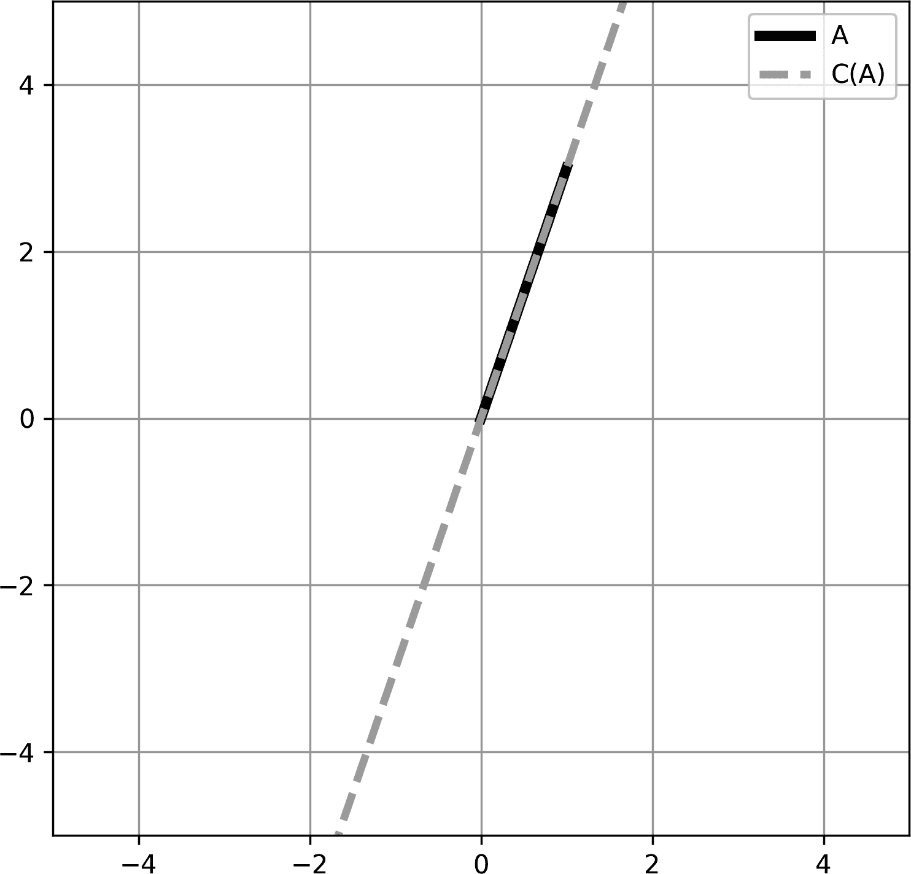
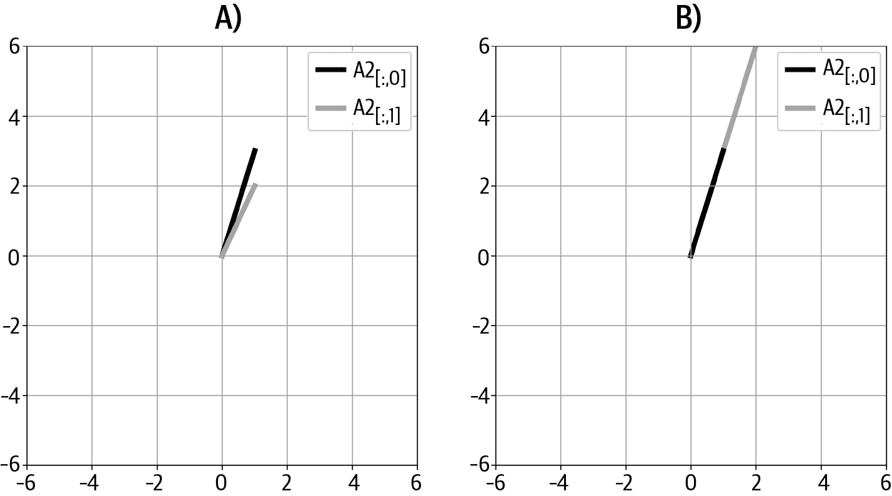
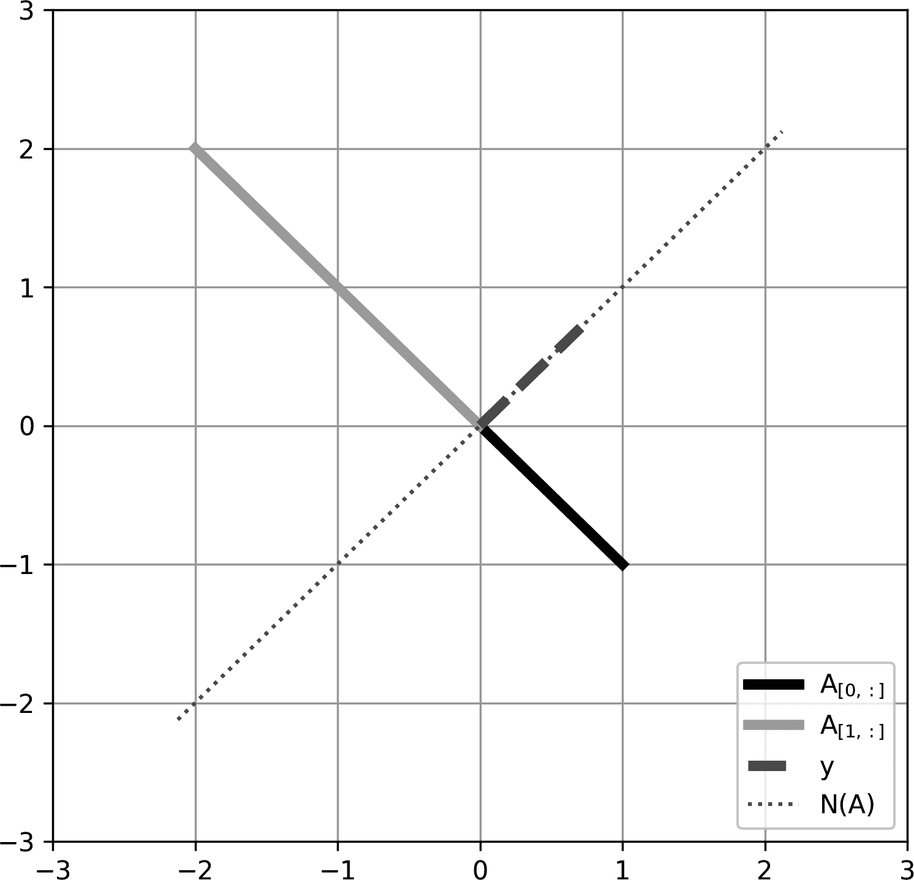
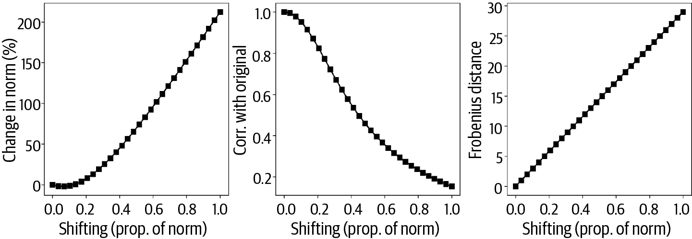
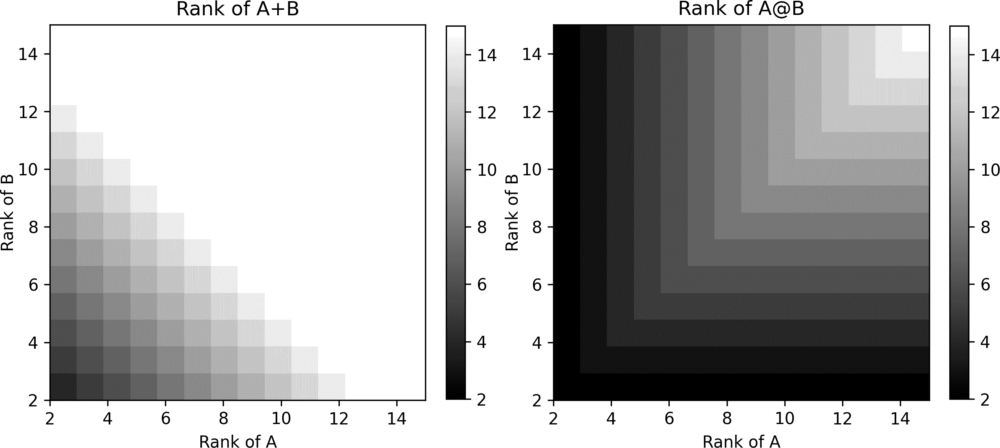
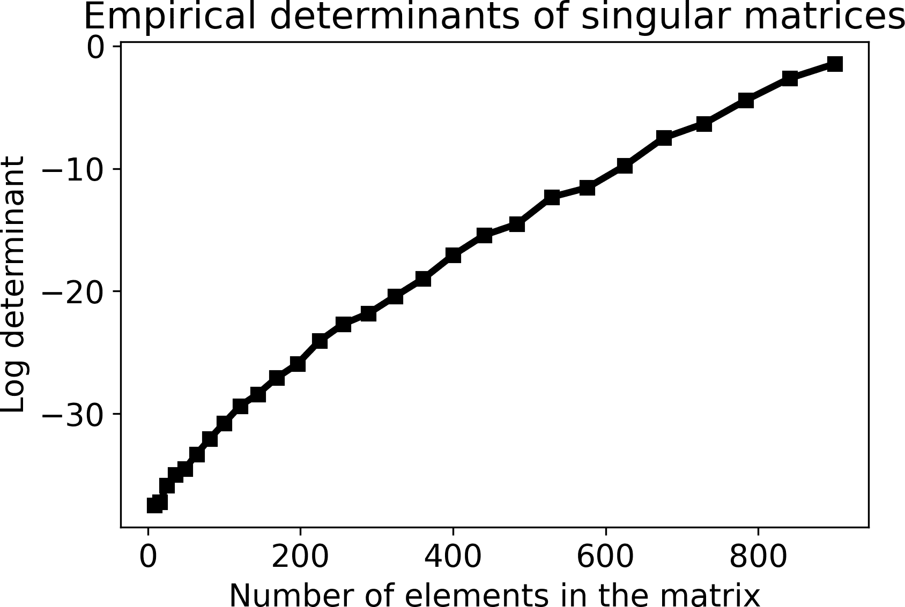

# 第六章：矩阵，第二部分

矩阵乘法是数学家赋予我们的最美妙的礼物之一。但要从基础线性代数进阶到理解并开发数据科学算法，您需要做的不仅仅是进行矩阵乘法。

我们从讨论矩阵范数和矩阵空间开始这一章。矩阵范数本质上是向量范数的延伸，而矩阵空间本质上是向量子空间的延伸（而向量子空间本质上仅仅是线性加权组合）。因此，您已经具备了本章所需的背景知识。

线性无关性、秩和行列式等概念将使您能够从理解转置和乘法等基本概念过渡到理解像逆、特征值和奇异值等高级主题。这些高级主题为数据科学中线性代数的应用开启了新的篇章。因此，本章是您从线性代数新手向线性代数专家转变的一个关键过程。¹

矩阵看起来像是简单的东西——只是一堆数字的电子表格。但是在前几章中您已经看到矩阵远不止表面那么简单。所以，请深呼吸，放松心情，然后投入其中。

# 矩阵范数

您在第二章(Chapter 2)学习了关于向量范数的知识：向量的范数是其欧几里得几何长度，计算方法是向量各元素平方和的平方根。

矩阵范数稍微复杂一些。首先，不存在“*the* 矩阵范数”；可以从矩阵计算多个不同的范数。矩阵范数与向量范数有些类似，每个范数提供一个数字来表征一个矩阵，使用双竖线表示，如矩阵 <math alttext="bold upper A"><mi>𝐀</mi></math> 的范数表示为 <math alttext="parallel-to bold upper A parallel-to"><mrow><mo>∥</mo> <mi>𝐀</mi> <mo>∥</mo></mrow></math>。

不同的矩阵范数具有不同的含义。矩阵范数的多样性可以大致分为两类：逐元素（有时也称为入口方式）和诱导方式。逐元素范数基于矩阵的各个元素计算，因此这些范数可以用来反映矩阵中各元素的大小。

诱导范数可以以下述方式解释：矩阵的一个功能是编码向量的变换；矩阵的诱导范数是衡量该变换对向量进行缩放（拉伸或收缩）的程度的指标。这种解释在第七章(Chapter 7)学习使用矩阵进行几何变换时会更加明了，在第十四章(Chapter 14)学习奇异值分解时也是如此。

在本章中，我将向您介绍逐元素范数。我将从欧几里德范数开始，它实际上是向量范数对矩阵的直接扩展。欧几里德范数也称为*Frobenius 范数*，计算方法是所有矩阵元素平方和的平方根（公式 6-1）。

##### 公式 6-1. Frobenius 范数

<math alttext="parallel-to bold upper A parallel-to equals StartRoot sigma-summation Underscript i equals 1 Overscript upper M Endscripts sigma-summation Underscript j equals 1 Overscript upper N Endscripts a Subscript i j Superscript 2 Baseline EndRoot" display="block"><mrow><msub><mrow><mo>∥</mo><mi>𝐀</mi><mo>∥</mo></mrow> <mtext>F</mtext></msub> <mo>=</mo> <msqrt><mrow><msubsup><mo>∑</mo> <mrow><mi>i</mi><mo>=</mo><mn>1</mn></mrow> <mi>M</mi></msubsup> <msubsup><mo>∑</mo> <mrow><mi>j</mi><mo>=</mo><mn>1</mn></mrow> <mi>N</mi></msubsup> <msubsup><mi>a</mi> <mrow><mi>i</mi><mi>j</mi></mrow> <mn>2</mn></msubsup></mrow></msqrt></mrow></math>

指标*i*和*j*对应于*M*行和*N*列。还请注意带下标的[F]表示 Frobenius 范数。

Frobenius 范数也被称为<math alttext="script l Baseline 2"><mrow><mi>ℓ</mi> <mn>2</mn></mrow></math>范数（<math alttext="script l"><mi>ℓ</mi></math>是一个看起来很漂亮的字母）。而<math alttext="script l Baseline 2"><mrow><mi>ℓ</mi> <mn>2</mn></mrow></math>范数的名称源自逐元素*p*-范数的一般公式（当*p*=2 时，得到 Frobenius 范数）。

<math alttext="parallel-to bold upper A parallel-to equals left-parenthesis sigma-summation Underscript i equals 1 Overscript upper M Endscripts sigma-summation Underscript j equals 1 Overscript upper N Endscripts StartAbsoluteValue a Subscript i j Baseline EndAbsoluteValue Superscript p Baseline right-parenthesis Superscript 1 slash p" display="block"><mrow><msub><mrow><mo>∥</mo><mi>𝐀</mi><mo>∥</mo></mrow> <mi>p</mi></msub> <mo>=</mo> <msup><mfenced close=")" open="(" separators=""><munderover><mo>∑</mo> <mrow><mi>i</mi><mo>=</mo><mn>1</mn></mrow> <mi>M</mi></munderover> <munderover><mo>∑</mo> <mrow><mi>j</mi><mo>=</mo><mn>1</mn></mrow> <mi>N</mi></munderover> <msup><mrow><mo>|</mo><msub><mi>a</mi> <mrow><mi>i</mi><mi>j</mi></mrow></msub> <mo>|</mo></mrow> <mi>p</mi></msup></mfenced> <mrow><mn>1</mn><mo>/</mo><mi>p</mi></mrow></msup></mrow></math>

矩阵范数在机器学习和统计分析中有多种应用。其中一个重要应用是正则化，旨在改善模型拟合并增强模型对未见数据的泛化能力（您将在本书后面看到这方面的例子）。正则化的基本思想是将矩阵范数作为最小化算法的代价函数之一。这种范数有助于防止模型参数过大（<math alttext="script l Baseline 2"><mrow><mi>ℓ</mi> <mn>2</mn></mrow></math>正则化，也称为*岭回归*）或鼓励稀疏解（<math alttext="script l Baseline 1"><mrow><mi>ℓ</mi> <mn>1</mn></mrow></math>正则化，也称为*Lasso 回归*）。事实上，现代深度学习架构依赖于矩阵范数来在解决计算机视觉问题时取得如此卓越的性能。

Frobenius 范数的另一个应用是计算“矩阵距离”的度量。矩阵与自身的距离为 0，而两个不同矩阵之间的距离随着这些矩阵中的数值越来越不相似而增加。Frobenius 矩阵距离的计算方法很简单，只需在公式 6-1 中将矩阵<math alttext="bold upper A"><mi>𝐀</mi></math>替换为矩阵<math alttext="bold upper C equals bold upper A minus bold upper B"><mrow><mi>𝐂</mi> <mo>=</mo> <mi>𝐀</mi> <mo>-</mo> <mi>𝐁</mi></mrow></math>。

这个距离可以作为机器学习算法中的优化准则，例如，在最小化减少图像数据存储大小的同时，尽量减少减少矩阵和原始矩阵之间的 Frobenius 距离。练习 6-2 将引导您完成一个简单的最小化示例。

## 矩阵迹和 Frobenius 范数

矩阵的*迹* 是其对角元素的和，表示为 <math alttext="t r left-parenthesis bold upper A right-parenthesis"><mrow><mi>t</mi> <mi>r</mi> <mo>(</mo> <mi>𝐀</mi> <mo>)</mo></mrow></math>，仅适用于方阵。以下两个矩阵的迹相同（14）：

<math alttext="Start 3 By 3 Matrix 1st Row 1st Column 4 2nd Column 5 3rd Column 6 2nd Row 1st Column 0 2nd Column 1 3rd Column 4 3rd Row 1st Column 9 2nd Column 9 3rd Column 9 EndMatrix comma Start 3 By 3 Matrix 1st Row 1st Column 0 2nd Column 0 3rd Column 0 2nd Row 1st Column 0 2nd Column 8 3rd Column 0 3rd Row 1st Column 1 2nd Column 2 3rd Column 6 EndMatrix" display="block"><mrow><mfenced close="]" open="["><mtable><mtr><mtd><mn>4</mn></mtd> <mtd><mn>5</mn></mtd> <mtd><mn>6</mn></mtd></mtr> <mtr><mtd><mn>0</mn></mtd> <mtd><mn>1</mn></mtd> <mtd><mn>4</mn></mtd></mtr> <mtr><mtd><mn>9</mn></mtd> <mtd><mn>9</mn></mtd> <mtd><mn>9</mn></mtd></mtr></mtable></mfenced> <mo>,</mo> <mfenced close="]" open=""><mtable><mtr><mtd><mn>0</mn></mtd> <mtd><mn>0</mn></mtd> <mtd><mn>0</mn></mtd></mtr> <mtr><mtd><mn>0</mn></mtd> <mtd><mn>8</mn></mtd> <mtd><mn>0</mn></mtd></mtr> <mtr><mtd><mn>1</mn></mtd> <mtd><mn>2</mn></mtd> <mtd><mn>6</mn></mtd></mtr></mtable></mfenced></mrow></math>

迹有一些有趣的属性。例如，矩阵的迹等于其特征值的和，因此是其特征空间“体积”的度量。迹的许多属性对数据科学应用不那么重要，但有一个有趣的例外：

<math alttext="parallel-to upper A parallel-to equals StartRoot sigma-summation Underscript i equals 1 Overscript upper M Endscripts sigma-summation Underscript j equals 1 Overscript upper N Endscripts a Subscript i j Superscript 2 Baseline EndRoot equals StartRoot t r left-parenthesis bold upper A Superscript upper T Baseline bold upper A right-parenthesis EndRoot" display="block"><mrow><msub><mrow><mo>∥</mo><mi>A</mi><mo>∥</mo></mrow> <mtext>F</mtext></msub> <mo>=</mo> <msqrt><mrow><msubsup><mo>∑</mo> <mrow><mi>i</mi><mo>=</mo><mn>1</mn></mrow> <mi>M</mi></msubsup> <msubsup><mo>∑</mo> <mrow><mi>j</mi><mo>=</mo><mn>1</mn></mrow> <mi>N</mi></msubsup> <msubsup><mi>a</mi> <mrow><mi>i</mi><mi>j</mi></mrow> <mn>2</mn></msubsup></mrow></msqrt> <mo>=</mo> <msqrt><mrow><mi>t</mi> <mi>r</mi> <mo>(</mo> <msup><mi>𝐀</mi> <mtext>T</mtext></msup> <mi>𝐀</mi> <mo>)</mo></mrow></msqrt></mrow></math>

换句话说，Frobenius 范数可以计算为矩阵与其转置的迹的平方根。这种方法有效的原因在于矩阵 <math alttext="bold upper A Superscript upper T Baseline bold upper A"><mrow><msup><mi>𝐀</mi> <mtext>T</mtext></msup> <mi>𝐀</mi></mrow></math> 的每个对角元素由每行与自身的点积定义。

[Exercise 6-3 将帮助您探索计算 Frobenius 范数的迹方法。

# 矩阵空间（列、行、零空间）

*矩阵空间* 的概念是抽象和应用线性代数中许多主题的核心。幸运的是，矩阵空间在概念上很直观，本质上只是矩阵不同特征的线性加权组合。

## 列空间

记住，向量的线性加权组合涉及标量乘法和一组向量的求和。对这个概念的两种修改将线性加权组合扩展到矩阵的列空间。首先，我们将矩阵概念化为一组列向量。其次，我们考虑无穷多的实数标量而不是使用特定的标量集合。无限数量的标量给出了组合一组向量的无限方式。由此产生的无限向量集称为*矩阵的列空间*。

让我们通过一些具体的数值示例来具体化这一点。我们从简单的开始——一个只有一列的矩阵（实际上与列向量相同）。它的列空间——所有可能的该列的线性加权组合——可以表示为：

<math alttext="upper C left-parenthesis StartBinomialOrMatrix 1 Choose 3 EndBinomialOrMatrix right-parenthesis equals lamda StartBinomialOrMatrix 1 Choose 3 EndBinomialOrMatrix comma lamda element-of double-struck upper R" display="block"><mrow><mi>C</mi> <mfenced close=")" open="("><mfenced close="]" open="["><mtable><mtr><mtd><mn>1</mn></mtd></mtr> <mtr><mtd><mn>3</mn></mtd></mtr></mtable></mfenced></mfenced> <mo>=</mo> <mi>λ</mi> <mfenced close="]" open="["><mtable><mtr><mtd><mn>1</mn></mtd></mtr> <mtr><mtd><mn>3</mn></mtd></mtr></mtable></mfenced> <mo>,</mo> <mi>λ</mi> <mo>∈</mo> <mi>ℝ</mi></mrow></math>

<math alttext="upper C left-parenthesis bold upper A right-parenthesis"><mrow><mi>C</mi> <mo>(</mo> <mi>𝐀</mi> <mo>)</mo></mrow></math> 表示矩阵 <math alttext="bold upper A"><mi>𝐀</mi></math> 的列空间，符号 <math alttext="element-of"><mo>∈</mo></math> 意味着“是”的成员或“包含于”。在这个上下文中，它意味着 <math alttext="lamda"><mi>λ</mi></math> 可以是任意可能的实数值。

这个数学表达式是什么意思？它意味着列空间是列向量[1 3]的所有可能比例版本的集合。让我们考虑几个具体的案例。向量[1 3]是否在矩阵的列空间中？是的，因为你可以将该向量表达为矩阵乘以<math alttext="lamda equals 1"><mrow><mi>λ</mi> <mo>=</mo> <mn>1</mn></mrow></math> 。那么[−2 −6]呢？也是，因为你可以将该向量表达为矩阵乘以<math alttext="lamda equals negative 2"><mrow><mi>λ</mi> <mo>=</mo> <mo>-</mo> <mn>2</mn></mrow></math> 。那么[1 4]呢？答案是否定的：向量[1 4] *不*在该矩阵的列空间中，因为没有任何标量可以使该矩阵乘以后得到该向量。

列空间是什么样的？对于一个只有一列的矩阵，列空间是通过原点、沿着列向量方向延伸至无穷远的一条直线。（严格来说，这条直线并不延伸至字面上的无穷远，因为无穷不是一个实数。但这条直线是任意长的——远远超出我们有限的人类思维可以理解的范围——因此在所有目的上，我们可以说这条直线是无限长的。）图 6-1 展示了这个矩阵的列空间的图片。



###### 图 6-1\. 单列矩阵的列空间可视化。这个列空间是一个一维子空间。

现在让我们考虑一个具有更多列的矩阵。我们将保持列的维度为两个，这样我们可以在二维图上进行可视化。这是我们的矩阵及其列空间：

<math alttext="upper C Start 2 By 2 Matrix 1st Row 1st Column 1 2nd Column 1 2nd Row 1st Column 3 2nd Column 2 EndMatrix equals lamda 1 StartBinomialOrMatrix 1 Choose 3 EndBinomialOrMatrix plus lamda 2 StartBinomialOrMatrix 1 Choose 2 EndBinomialOrMatrix comma lamda element-of double-struck upper R" display="block"><mrow><mi>C</mi> <mfenced close=")" open="("><mfenced close="]" open="["><mtable><mtr><mtd><mn>1</mn></mtd> <mtd><mn>1</mn></mtd></mtr> <mtr><mtd><mn>3</mn></mtd> <mtd><mn>2</mn></mtd></mtr></mtable></mfenced></mfenced> <mo>=</mo> <msub><mi>λ</mi> <mn>1</mn></msub> <mfenced close="]" open="["><mtable><mtr><mtd><mn>1</mn></mtd></mtr> <mtr><mtd><mn>3</mn></mtd></mtr></mtable></mfenced> <mo>+</mo> <msub><mi>λ</mi> <mn>2</mn></msub> <mfenced close="]" open="["><mtable><mtr><mtd><mn>1</mn></mtd></mtr> <mtr><mtd><mn>2</mn></mtd></mtr></mtable></mfenced> <mo>,</mo> <mi>λ</mi> <mo>∈</mo> <mi>ℝ</mi></mrow></math>

我们有两列，所以我们允许两个不同的<math alttext="lamda"><mi>λ</mi></math> s（它们都是实数，但可以彼此不同）。现在的问题是，所有可以通过这两个列向量的线性组合达到的向量的集合是什么？

答案是：所有在<math alttext="double-struck upper R squared"><msup><mi>ℝ</mi> <mn>2</mn></msup></math> 中的向量。例如，向量[−4 3]可以通过分别将这两列乘以 11 和−15 来获得。我是如何得出这些标量值的？我使用了最小二乘投影方法，你将在第十一章中学习到。现在，你可以专注于这两列可以适当加权以达到<math alttext="double-struck upper R squared"><msup><mi>ℝ</mi> <mn>2</mn></msup></math> 中任何点的概念。

图 A 在 图 6-2 中展示了这两个矩阵列。我没有画出矩阵的列空间，因为它是整个轴的空间。



###### 图 6-2\. 更多列空间的示例

在<math alttext="double-struck upper R squared"><msup><mi>ℝ</mi> <mn>2</mn></msup></math> 中的另一个例子。这是我们要考虑的新矩阵：

<math alttext="upper C Start 2 By 2 Matrix 1st Row 1st Column 1 2nd Column 2 2nd Row 1st Column 3 2nd Column 6 EndMatrix equals lamda 1 StartBinomialOrMatrix 1 Choose 3 EndBinomialOrMatrix plus lamda 2 StartBinomialOrMatrix 2 Choose 6 EndBinomialOrMatrix comma lamda element-of double-struck upper R" display="block"><mrow><mi>C</mi> <mfenced close=")" open="("><mfenced close="]" open="["><mtable><mtr><mtd><mn>1</mn></mtd> <mtd><mn>2</mn></mtd></mtr> <mtr><mtd><mn>3</mn></mtd> <mtd><mn>6</mn></mtd></mtr></mtable></mfenced></mfenced> <mo>=</mo> <msub><mi>λ</mi> <mn>1</mn></msub> <mfenced close="]" open="["><mtable><mtr><mtd><mn>1</mn></mtd></mtr> <mtr><mtd><mn>3</mn></mtd></mtr></mtable></mfenced> <mo>+</mo> <msub><mi>λ</mi> <mn>2</mn></msub> <mfenced close="]" open="["><mtable><mtr><mtd><mn>2</mn></mtd></mtr> <mtr><mtd><mn>6</mn></mtd></mtr></mtable></mfenced> <mo>,</mo> <mi>λ</mi> <mo>∈</mo> <mi>ℝ</mi></mrow></math>

其列空间的维数是多少？通过两列的某种线性加权组合是否可能到达 <math alttext="double-struck upper R squared"><msup><mi>ℝ</mi> <mn>2</mn></msup></math> 中的任意点？

对于第二个问题的答案是否定的。如果你不相信我，请试着找出产生向量 [3 5] 的两列的线性加权组合。这是不可能的。事实上，这两列是共线的（图 B 在 图 6-2 中），因为其中一列已经是另一列的缩放版本。这意味着这个 <math alttext="2 times 2"><mrow><mn>2</mn> <mo>×</mo> <mn>2</mn></mrow></math> 矩阵的列空间仍然只是一条线——一个一维子空间。

这里的核心信息是，在一个矩阵中有 *N* 列并不保证列空间将是 *N* 维的。列空间的维数仅等于列数，当且仅当这些列形成一个线性无关的集合时。（从第三章记得，线性无关意味着一个向量集合中的向量不能表示为该集合中其他向量的线性加权组合。）

最后一个列空间的例子，看看当我们进入三维空间时会发生什么。这是我们的矩阵及其列空间：

<math alttext="upper C Start 3 By 2 Matrix 1st Row 1st Column 3 2nd Column 0 2nd Row 1st Column 5 2nd Column 2 3rd Row 1st Column 1 2nd Column 2 EndMatrix equals lamda 1 Start 3 By 1 Matrix 1st Row  1 2nd Row  5 3rd Row  1 EndMatrix plus lamda 2 Start 3 By 1 Matrix 1st Row  0 2nd Row  2 3rd Row  2 EndMatrix comma lamda element-of double-struck upper R" display="block"><mrow><mi>C</mi> <mfenced close=")" open="("><mfenced close="]" open="["><mtable><mtr><mtd><mn>3</mn></mtd> <mtd><mn>0</mn></mtd></mtr> <mtr><mtd><mn>5</mn></mtd> <mtd><mn>2</mn></mtd></mtr> <mtr><mtd><mn>1</mn></mtd> <mtd><mn>2</mn></mtd></mtr></mtable></mfenced></mfenced> <mo>=</mo> <msub><mi>λ</mi> <mn>1</mn></msub> <mfenced close="]" open="["><mtable><mtr><mtd><mn>1</mn></mtd></mtr> <mtr><mtd><mn>5</mn></mtd></mtr> <mtr><mtd><mn>1</mn></mtd></mtr></mtable></mfenced> <mo>+</mo> <msub><mi>λ</mi> <mn>2</mn></msub> <mfenced close="]" open=""><mtable><mtr><mtd><mn>0</mn></mtd></mtr> <mtr><mtd><mn>2</mn></mtd></mtr> <mtr><mtd><mn>2</mn></mtd></mtr></mtable></mfenced> <mo>,</mo> <mi>λ</mi> <mo>∈</mo> <mi>ℝ</mi></mrow></math>

现在，在 <math alttext="double-struck upper R cubed"><msup><mi>ℝ</mi> <mn>3</mn></msup></math> 中有两列。这两列是线性无关的，意味着你无法将其中一列表示为另一列的缩放版本。因此，这个矩阵的列空间是二维的，但它是嵌入在 <math alttext="double-struck upper R cubed"><msup><mi>ℝ</mi> <mn>3</mn></msup></math> 中的一个平面（图 6-3）。

这个矩阵的列空间是一个无限的二维平面，但是这个平面仅仅是三维空间的一个无限小切片。你可以将其想象成一张无限薄的纸片，横跨整个宇宙。

![三维空间中的列空间

###### 图 6-3\. 嵌入在三维空间中的矩阵的二维列空间。两条粗线代表矩阵的两列。

在那个平面上有许多向量（即可以通过两个列向量的线性组合获得的向量），但是还有许多 *更多* 的向量不在这个平面上。换句话说，矩阵的列空间中有向量，也有不在矩阵列空间中的向量。

如何确定向量是否在矩阵的列空间中？这绝非一个微不足道的问题——事实上，这个问题是线性最小二乘法的基础，言语无法充分表达最小二乘法在应用数学和工程中的重要性。那么如何确定一个向量是否在列空间中呢？到目前为止的示例中，我们只是通过猜测、算术和可视化进行了一些操作。这种方法的目的在于培养直觉，但显然这些方法在更高维度和更复杂问题中是不可扩展的。

确定向量是否在矩阵的列空间内的定量方法依赖于矩阵秩的概念，这是你将在本章后面学习的内容。在那之前，专注于矩阵的列切出一个向量子空间的直觉，该子空间可能包括整个*M*维空间或较小维度的子空间；一个重要的问题是是否有其他向量在该子空间内（意味着该向量可以表示为矩阵列的线性加权组合）。

## 行空间

一旦你理解了矩阵的列空间，矩阵的行空间就非常容易理解了。事实上，矩阵的行空间与此概念完全相同，但我们考虑的是行的所有可能加权组合，而不是列。

行空间被表示为<math alttext="upper R left-parenthesis bold upper A right-parenthesis"><mrow><mi>R</mi> <mo>(</mo> <mi>𝐀</mi> <mo>)</mo></mrow></math>。由于转置操作交换了行和列，你也可以写成矩阵的行空间是其转置的列空间，换句话说，<math alttext="upper R left-parenthesis bold upper A right-parenthesis equals upper C left-parenthesis bold upper A Superscript upper T Baseline right-parenthesis"><mrow><mi>R</mi> <mrow><mo>(</mo> <mi>𝐀</mi> <mo>)</mo></mrow> <mo>=</mo> <mi>C</mi> <mrow><mo>(</mo> <msup><mi>𝐀</mi> <mtext>T</mtext></msup> <mo>)</mo></mrow></mrow></math>。矩阵行空间和列空间之间有一些差异；例如，行空间（但不是列空间）对行约化操作是不变的。但这超出了本章的范围。

因为行空间等于矩阵的转置的列空间，对于对称矩阵来说，这两个矩阵空间是相同的。

## 空间零子句

空间零子句与列空间微妙但重要的区别在于。列空间可以简洁地总结为以下方程：

<math alttext="bold upper A bold x equals bold b" display="block"><mrow><mi>𝐀</mi> <mi>𝐱</mi> <mo>=</mo> <mi>𝐛</mi></mrow></math>

这可以翻译成英文为“我们是否可以找到一些系数集在<math alttext="bold x"><mi>𝐱</mi></math>中，使得在<math alttext="bold upper A"><mi>𝐀</mi></math>的列的加权组合产生向量<math alttext="bold b"><mi>𝐛</mi></math>？”如果答案是肯定的，那么<math alttext="bold b element-of upper C left-parenthesis bold upper A right-parenthesis"><mrow><mi>𝐛</mi> <mo>∈</mo> <mi>C</mi> <mo>(</mo> <mi>𝐀</mi> <mo>)</mo></mrow></math>，并且向量<math alttext="bold x"><mi>𝐱</mi></math>告诉我们如何加权<math alttext="bold upper A"><mi>𝐀</mi></math>的列以获得<math alttext="bold b"><mi>𝐛</mi></math>。

相反，空间零子句可以简洁地总结为以下方程：

<math alttext="bold upper A bold y equals bold 0" display="block"><mrow><mi>𝐀</mi> <mi>𝐲</mi> <mo>=</mo> <mn mathvariant="bold">0</mn></mrow></math>

这可以翻译成英文为“我们能找到一些系数<math alttext="bold y"><mi>𝐲</mi></math>，使得<math alttext="bold upper A"><mi>𝐀</mi></math>中列的加权组合产生零向量<math alttext="bold 0"><mn mathvariant="bold">0</mn></math>吗？”

一瞬间的观察会揭示一个适用于任何可能的矩阵<math alttext="bold upper A"><mi>𝐀</mi></math>的答案：设置<math alttext="bold y equals bold 0"><mrow><mi>𝐲</mi> <mo>=</mo> <mn mathvariant="bold">0</mn></mrow></math>！显然，将所有列乘以 0 将得到零向量的和。但这是一个微不足道的解，我们排除它。因此，问题变成了“我们能找到一组权重——并非所有都是 0——来产生零向量吗？”任何能满足这个方程的向量<math alttext="bold y"><mi>𝐲</mi></math>都在<math alttext="bold upper A"><mi>𝐀</mi></math>的零空间中，我们将其写为<math alttext="upper N left-parenthesis bold upper A right-parenthesis"><mrow><mi>N</mi> <mo>(</mo> <mi>𝐀</mi> <mo>)</mo></mrow></math>。

让我们从一个简单的例子开始。在阅读以下文本之前，看看你能否找到这样一个向量<math alttext="bold y"><mi>𝐲</mi></math>：

<math alttext="Start 2 By 2 Matrix 1st Row 1st Column 1 2nd Column negative 1 2nd Row 1st Column negative 2 2nd Column 2 EndMatrix" display="block"><mfenced close="]" open="["><mtable><mtr><mtd><mrow><mphantom><mo>-</mo></mphantom> <mn>1</mn></mrow></mtd> <mtd><mrow><mo>-</mo> <mn>1</mn></mrow></mtd></mtr> <mtr><mtd><mrow><mo>-</mo> <mn>2</mn></mrow></mtd> <mtd><mrow><mphantom><mo>-</mo></mphantom> <mn>2</mn></mrow></mtd></mtr></mtable></mfenced></math>

你找到一个向量了吗？我的是[7.34, 7.34]。我敢打赌，你没有找到同样的向量。你可能找到了[1, 1]或者[-1, -1]。也许是[2, 2]？

我想你已经看出这个问题的方向了——对于特定矩阵<math alttext="bold upper A"><mi>𝐀</mi></math>，存在无限多个能满足<math alttext="bold upper A bold y equals bold 0"><mrow><mi>𝐀</mi> <mi>𝐲</mi> <mo>=</mo> <mn mathvariant="bold">0</mn></mrow></math>的向量<math alttext="bold y"><mi>𝐲</mi></math>。所有这些向量都可以表达为这些选择的某种比例版本。因此，这个矩阵的零空间可以表示为：

<math alttext="upper N left-parenthesis bold upper A right-parenthesis equals lamda StartBinomialOrMatrix 1 Choose 1 EndBinomialOrMatrix comma lamda element-of double-struck upper R" display="block"><mrow><mi>N</mi> <mrow><mo>(</mo> <mi>𝐀</mi> <mo>)</mo></mrow> <mo>=</mo> <mi>λ</mi> <mfenced close="]" open="["><mtable><mtr><mtd><mn>1</mn></mtd></mtr> <mtr><mtd><mn>1</mn></mtd></mtr></mtable></mfenced> <mo>,</mo> <mi>λ</mi> <mo>∈</mo> <mi>ℝ</mi></mrow></math>

这里有另一个示例矩阵。再次尝试找到一组系数，使得列的加权和产生零向量（也就是找到<math alttext="bold y"><mi>𝐲</mi></math>在<math alttext="bold upper A bold y equals bold 0"><mrow><mi>𝐀</mi> <mi>𝐲</mi> <mo>=</mo> <mn mathvariant="bold">0</mn></mrow></math>中）：

<math alttext="Start 2 By 2 Matrix 1st Row 1st Column 1 2nd Column negative 1 2nd Row 1st Column negative 2 2nd Column 3 EndMatrix" display="block"><mfenced close="]" open="["><mtable><mtr><mtd><mrow><mphantom><mo>-</mo></mphantom> <mn>1</mn></mrow></mtd> <mtd><mrow><mo>-</mo> <mn>1</mn></mrow></mtd></mtr> <mtr><mtd><mrow><mo>-</mo> <mn>2</mn></mrow></mtd> <mtd><mrow><mphantom><mo>-</mo></mphantom> <mn>3</mn></mrow></mtd></mtr></mtable></mfenced></math>

我敢打一个更大的赌注，你找不到这样的向量。但并不是因为我不相信你能找到（我对我的读者评价很高！）；而是因为这个矩阵没有零空间。正式地说，我们说这个矩阵的零空间是空集：<math alttext="upper N left-parenthesis bold upper A right-parenthesis equals StartSet EndSet"><mrow><mi>N</mi> <mo>(</mo> <mi>𝐀</mi> <mo>)</mo> <mo>=</mo> <mo>{</mo> <mo>}</mo></mrow></math>。

回顾本小节中的两个示例矩阵。你会注意到第一个矩阵包含可以形成其他列的缩放版本的列，而第二个矩阵包含形成独立集的列。这不是巧合：矩阵的列的线性无关性与零空间的维度有密切关系。这种关系的确切性质由秩-零度定理给出，你将在下一章学习。但关键点在于：当矩阵的列形成线性无关集时，零空间为空。

面对冗余，我将重申这一重要观点：满秩和列满秩矩阵具有空的零空间，而降秩矩阵具有非空（非平凡）的零空间。

Python SciPy 库包含一个计算矩阵零空间的函数。让我们使用代码确认我们的结果：

```
A = np.array([ [1,-1],[-2,2] ])
B = np.array([ [1,-1],[-2,3] ])

print( scipy.linalg.null_space(A) )
print( scipy.linalg.null_space(B) )
```

下面是输出：

```
[[0.70710678]
 [0.70710678]]

[]
```

第二个输出（`[]`）是空集。Python 为什么选择`0.70710678`作为矩阵`A`的零空间的数值？如果 Python 选择`1`会不会更容易阅读？考虑到可能的无限向量，Python 返回了一个*单位向量*（你可以心算该向量的范数，知道<math alttext="StartRoot 1 slash 2 EndRoot almost-equals .7071"><mrow><msqrt><mrow><mn>1</mn> <mo>/</mo> <mn>2</mn></mrow></msqrt> <mo>≈</mo> <mo>.</mo> <mn>7071</mn></mrow></math>）。单位向量便于处理，并具有数值稳定性等多种优良性质。因此，计算算法通常会返回单位向量作为子空间的基向量。在特征向量和奇异向量中，你将再次看到这一点。

零空间是什么样子？图 6-4 展示了矩阵`A`的行向量和零空间。

为什么我绘制了行向量而不是列向量？原来行空间与零空间正交。这不是因为某种奇怪的外行原因；相反，它是根据零空间的定义写成 <math alttext="bold upper A bold y equals bold 0"><mrow><mi>𝐀</mi> <mi>𝐲</mi> <mo>=</mo> <mn mathvariant="bold">0</mn></mrow></math> 的。为矩阵的每一行（<math alttext="a Subscript i"><msub><mi>a</mi> <mi>i</mi></msub></math> ）重写该方程得到表达式 <math alttext="a Subscript i Baseline bold y equals bold 0"><mrow><msub><mi>a</mi> <mi>i</mi></msub> <mi>𝐲</mi> <mo>=</mo> <mn mathvariant="bold">0</mn></mrow></math> ；换句话说，每行与零空间向量的点积为 0。



###### 图 6-4\. 矩阵零空间的可视化

为什么要如此关注零空间？关心能够使矩阵乘以零向量的向量似乎有些奇怪。但零空间是找到特征向量和奇异向量的基石，你将在第十三章学习到这一点。

本节的最后一点思考：每个矩阵都有四个相关子空间；你已经了解了其中三个（列、行、零空间）。第四个子空间称为*右零空间*，是行的零空间。它通常写为矩阵转置的零空间：<math alttext="upper N left-parenthesis bold upper A Superscript upper T Baseline right-parenthesis"><mrow><mi>N</mi> <mo>(</mo> <msup><mi>𝐀</mi> <mtext>T</mtext></msup> <mo>)</mo></mrow></math> 。传统的数学课程现在将花费数周探索这四个子空间的复杂性和关系。矩阵子空间因其迷人的美和完美性而值得研究，但我们不会深入到那个层次。

# 秩

*秩* 是与矩阵相关的一个数字。它与矩阵子空间的维度有关，并且对矩阵操作有重要影响，包括求逆矩阵和确定方程组解的数量。与本书中的其他主题一样，矩阵秩有丰富而详细的理论，但在这里我将侧重于数据科学及其相关应用中需要了解的内容。

我将首先列出秩的几个性质。没有特定的重要顺序：

+   秩是非负整数，因此矩阵的秩可以是 0、1、2、…，但不可以是−2 或 3.14。

+   每个矩阵有一个唯一的秩；一个矩阵不能同时具有多个不同的秩。（这也意味着秩是矩阵的特征，不是行或列的特征。）

+   矩阵的秩可以用 <math alttext="r left-parenthesis bold upper A right-parenthesis"><mrow><mi>r</mi> <mo>(</mo> <mi>𝐀</mi> <mo>)</mo></mrow></math> 或 <math alttext="r a n k left-parenthesis bold upper A right-parenthesis"><mrow><mi>r</mi> <mi>a</mi> <mi>n</mi> <mi>k</mi> <mo>(</mo> <mi>𝐀</mi> <mo>)</mo></mrow></math> 表示。也适用的是“ <math alttext="bold upper A"><mi>𝐀</mi></math> 是一个秩-*r* 矩阵。”

+   矩阵的最大可能秩是其行数或列数中较小的那个。换句话说，最大可能秩是 min{*M*,*N*}。

+   其最大可能秩的矩阵称为“满秩”。秩 *r* < min{*M*,*N*} 的矩阵被称为“降秩的”，“秩亏”，或“奇异的”。

+   标量乘法不影响矩阵的秩（0 除外，它将矩阵转换为秩为 0 的零矩阵）。

矩阵秩有几种等价的解释和定义，其中包括：

+   构成线性无关集合的最大列（或行）数。

+   列空间的维度（与行空间的维度相同）。

+   矩阵中包含信息的维度数。这与矩阵中的总列数或行数不同，因为可能存在线性依赖关系。

+   矩阵的非零奇异值的数量。

或许令人惊讶的是，排名的定义在列和行上是相同的：即使对于非方阵，列空间和行空间的维数确实是相同的吗？确实如此。有多种证明方法，其中许多方法要么非常复杂，要么依赖于奇异值分解，因此我不会在本章中包含正式的证明。² 但我会展示一个非方阵的行和列空间的例子作为说明。

这是我们的矩阵：

<math alttext="Start 2 By 3 Matrix 1st Row 1st Column 1 2nd Column 1 3rd Column negative 4 2nd Row 1st Column 2 2nd Column negative 2 3rd Column 2 EndMatrix" display="block"><mfenced close="]" open=""><mtable><mtr><mtd><mn>1</mn></mtd> <mtd><mrow><mphantom><mo>-</mo></mphantom> <mn>1</mn></mrow></mtd> <mtd><mrow><mo>-</mo> <mn>4</mn></mrow></mtd></mtr> <mtr><mtd><mn>2</mn></mtd> <mtd><mrow><mo>-</mo> <mn>2</mn></mrow></mtd> <mtd><mrow><mphantom><mo>-</mo></mphantom> <mn>2</mn></mrow></mtd></mtr></mtable></mfenced></math>

矩阵的列空间在<math alttext="双击上 R 平方"><msup><mi>ℝ</mi> <mn>2</mn></msup></math>中，而行空间在<math alttext="双击上 R 立方"><msup><mi>ℝ</mi> <mn>3</mn></msup></math>中，因此这两个空间需要在不同的图表中绘制（图 6-5）。这三列不构成线性独立集（任意一列可以描述为其他两列的线性组合），但它们确实张成了整个<math alttext="双击上 R 平方"><msup><mi>ℝ</mi> <mn>2</mn></msup></math>。因此，矩阵的列空间是 2 维的。这两行确实构成了线性独立集，它们张成的子空间是<math alttext="双击上 R 立方"><msup><mi>ℝ</mi> <mn>3</mn></msup></math>中的一个 2 维平面。

明确一下：矩阵的列空间和行空间是*不同*的。但是这些矩阵空间的*维数*是相同的。而这个维数就是矩阵的排名。因此，这个矩阵的排名是 2。

![矩阵的行和列空间。

###### 图 6-5。列空间和行空间有不同的张成但相同的维数

以下是一些矩阵。尽管我还没有教您如何计算排名，但请试着根据前面的描述猜测每个矩阵的排名。答案在脚注中。³

<math display="block"><mrow><mi>𝐀</mi> <mo>=</mo> <mfenced close="]" open="["><mtable><mtr><mtd><mn>1</mn></mtd></mtr> <mtr><mtd><mn>2</mn></mtd></mtr> <mtr><mtd><mn>4</mn></mtd></mtr></mtable></mfenced> <mo>,</mo> <mi>𝐁</mi> <mo>=</mo> <mfenced close="]" open="["><mtable><mtr><mtd><mn>1</mn></mtd> <mtd><mn>3</mn></mtd></mtr> <mtr><mtd><mn>2</mn></mtd> <mtd><mn>6</mn></mtd></mtr> <mtr><mtd><mn>4</mn></mtd> <mtd><mn>12</mn></mtd></mtr></mtable></mfenced> <mo>,</mo> <mi>𝐂</mi> <mo>=</mo> <mfenced close="]" open="["><mtable><mtr><mtd><mn>1</mn></mtd> <mtd><mrow><mn>3.1</mn></mrow></mtd></mtr> <mtr><mtd><mn>2</mn></mtd> <mtd><mn>6</mn></mtd></mtr> <mtr><mtd><mn>4</mn></mtd> <mtd><mn>12</mn></mtd></mtr></mtable></mfenced> <mo>,</mo> <mi>𝐃</mi> <mo>=</mo> <mfenced close="]" open="["><mtable><mtr><mtd><mn>1</mn></mtd> <mtd><mn>3</mn></mtd> <mtd><mn>2</mn></mtd></mtr> <mtr><mtd><mn>6</mn></mtd> <mtd><mn>6</mn></mtd> <mtd><mn>1</mn></mtd></mtr> <mtr><mtd><mn>4</mn></mtd> <mtd><mn>2</mn></mtd> <mtd><mn>0</mn></mtd></mtr></mtable></mfenced> <mo>,</mo> <mi>𝐄</mi> <mo>=</mo> <mfenced close="]" open="["><mtable><mtr><mtd><mn>1</mn></mtd> <mtd><mn>1</mn></mtd> <mtd><mn>1</mn></mtd></mtr> <mtr><mtd><mn>1</mn></mtd> <mtd><mn>1</mn></mtd> <mtd><mn>1</mn></mtd></mtr> <mtr><mtd><mn>1</mn></mtd> <mtd><mn>1</mn></mtd> <mtd><mn>1</mn></mtd></mtr></mtable></mfenced> <mo>,</mo> <mi>𝐅</mi> <mo>=</mo> <mfenced close="]" open=""><mtable><mtr><mtd><mn>0</mn></mtd> <mtd><mn>0</mn></mtd> <mtd><mn>0</mn></mtd></mtr> <mtr><mtd><mn>0</mn></mtd> <mtd><mn>0</mn></mtd> <mtd><mn>0</mn></mtd></mtr> <mtr><mtd><mn>0</mn></mtd> <mtd><mn>0</mn></mtd> <mtd><mn>0</mn></mtd></mtr></mtable></mfenced></mrow></math>

希望您已经设法弄清楚了排名，或者至少不会对脚注中的答案感到震惊。

毋庸置疑，视觉检查和直觉并不是实际计算排名的可扩展方法。有几种计算排名的方法。例如，在[第十章中，您将学习如何通过将矩阵行减少至梯形形式并计算主元的数量来计算排名。像 Python 这样的计算机程序通过计算矩阵的非零奇异值的数量来计算排名。您将在第十四章中了解更多相关信息。

现在，我希望您专注于这样一个观念：排名对应于可以形成线性独立集合的最大列数，这也对应于矩阵列空间的维数。（在前述句子中，您可以将“列”替换为“行”，其仍然是准确的。）

## 特殊矩阵的排名

一些特殊的矩阵有易于计算的或值得学习的排名：

向量

所有向量的秩都为 1。这是因为向量——定义上——只包含一列（或行）信息；它们所张成的子空间是一维的。唯一的例外是零向量。

零矩阵

任何大小的零矩阵（包括零向量）的秩为 0。

单位矩阵

单位矩阵的秩等于行数（也等于列数）。换句话说，<math alttext="r left-parenthesis bold upper I Subscript upper N Baseline right-parenthesis equals upper N"><mrow><mi>r</mi> <mo>(</mo> <msub><mi>𝐈</mi> <mi>N</mi></msub> <mo>)</mo> <mo>=</mo> <mi>N</mi></mrow></math> 。实际上，单位矩阵只是对角矩阵的一个特例。

对角矩阵

对角矩阵的秩等于非零对角元素的数量。这是因为每行最多包含一个非零元素，通过零的加权组合不可能创建非零数。在解方程组和解释奇异值分解时，这个属性变得非常有用。

三角矩阵

三角矩阵仅在所有对角元素中有非零值时具有满秩。具有至少一个对角零的三角矩阵将是降秩的（确切的秩取决于矩阵中的数值）。

随机矩阵

随机矩阵的秩是不可能事先知道的，因为它取决于从中提取矩阵元素的数字分布及每个数字提取的概率。例如，一个由 0 或 1 填充的<math alttext="2 times 2"><mrow><mn>2</mn> <mo>×</mo> <mn>2</mn></mrow></math>矩阵如果每个元素都等于 0，则其秩可能为 0。或者，例如如果选择了单位矩阵，则其秩可能为 2。

但是有一种方法可以创建具有保证最大可能秩的随机矩阵。这是通过随机抽取浮点数，例如从高斯或均匀分布中进行。64 位计算机可以表示<math alttext="2 Superscript 64"><msup><mn>2</mn> <mn>64</mn></msup></math>个数字。从该集合中抽取几十个或几百个放入矩阵中意味着矩阵列中的线性依赖性的可能性极其低。实际上，这种可能性如此之低，以至于可以驱动*Heart of Gold*上的无穷不可能驱动器。⁴

关键在于通过例如`np.random.randn()`创建的矩阵将具有可能的最大秩。这对使用 Python 学习线性代数非常有用，因为可以创建具有任意秩的矩阵（受前述约束的限制）。Exercise 6-5 将指导您完成这个过程。

秩为 1 的矩阵

一个秩-1 矩阵有——你猜对了——秩为 1。这意味着矩阵中实际上只有一列的信息（或者说只有一行的信息），而其他所有列（或行）都只是线性倍数。在本章的早些时候，你看到了一些秩-1 矩阵的例子。以下是一些更多的例子：

<math alttext="Start 3 By 3 Matrix 1st Row 1st Column negative 2 2nd Column negative 4 3rd Column negative 4 2nd Row 1st Column negative 1 2nd Column negative 2 3rd Column negative 2 3rd Row 1st Column 0 2nd Column 0 3rd Column 0 EndMatrix comma Start 4 By 2 Matrix 1st Row 1st Column 2 2nd Column 1 2nd Row 1st Column 0 2nd Column 0 3rd Row 1st Column 2 2nd Column 1 4th Row 1st Column 4 2nd Column 2 EndMatrix comma Start 3 By 5 Matrix 1st Row 1st Column 12 2nd Column 4 3rd Column 4 4th Column 12 5th Column 4 2nd Row 1st Column 6 2nd Column 2 3rd Column 2 4th Column 6 5th Column 2 3rd Row 1st Column 9 2nd Column 3 3rd Column 3 4th Column 9 5th Column 3 EndMatrix" display="block"><mrow><mfenced close="]" open="["><mtable><mtr><mtd><mrow><mo>-</mo> <mn>2</mn></mrow></mtd> <mtd><mrow><mo>-</mo> <mn>4</mn></mrow></mtd> <mtd><mrow><mo>-</mo> <mn>4</mn></mrow></mtd></mtr> <mtr><mtd><mrow><mo>-</mo> <mn>1</mn></mrow></mtd> <mtd><mrow><mo>-</mo> <mn>2</mn></mrow></mtd> <mtd><mrow><mo>-</mo> <mn>2</mn></mrow></mtd></mtr> <mtr><mtd><mrow><mphantom><mo>-</mo></mphantom> <mn>0</mn></mrow></mtd> <mtd><mrow><mphantom><mo>-</mo></mphantom> <mn>0</mn></mrow></mtd> <mtd><mrow><mphantom><mo>-</mo></mphantom> <mn>0</mn></mrow></mtd></mtr></mtable></mfenced> <mo>,</mo> <mfenced close="]" open="["><mtable><mtr><mtd><mn>2</mn></mtd> <mtd><mn>1</mn></mtd></mtr> <mtr><mtd><mn>0</mn></mtd> <mtd><mn>0</mn></mtd></mtr> <mtr><mtd><mn>2</mn></mtd> <mtd><mn>1</mn></mtd></mtr> <mtr><mtd><mn>4</mn></mtd> <mtd><mn>2</mn></mtd></mtr></mtable></mfenced> <mo>,</mo> <mfenced close="]" open=""><mtable><mtr><mtd><mn>12</mn></mtd> <mtd><mn>4</mn></mtd> <mtd><mn>4</mn></mtd> <mtd><mn>12</mn></mtd> <mtd><mn>4</mn></mtd></mtr> <mtr><mtd><mn>6</mn></mtd> <mtd><mn>2</mn></mtd> <mtd><mn>2</mn></mtd> <mtd><mn>6</mn></mtd> <mtd><mn>2</mn></mtd></mtr> <mtr><mtd><mn>9</mn></mtd> <mtd><mn>3</mn></mtd> <mtd><mn>3</mn></mtd> <mtd><mn>9</mn></mtd> <mtd><mn>3</mn></mtd></mtr></mtable></mfenced></mrow></math>

秩-1 矩阵可以是方阵、长方阵或宽方阵；无论尺寸如何，每列都是第一列的缩放副本（或每行是第一行的缩放副本）。

如何创建一个秩-1 矩阵？实际上，你在[第二章已经学过（尽管我只是简要提到了它；你原谅你忘记了）。答案是通过两个非零向量的外积。例如，上面的第三个矩阵是向量[4 2 3]<math alttext="Superscript upper T"><msup><mtext>T</mtext></msup></math>和[3 1 1 3 1]的外积。

秩-1 矩阵在特征分解和奇异值分解中很重要。在本书的后面章节和你在应用线性代数中的冒险中，你会遇到许多秩-1 矩阵。

## 添加和乘积矩阵的秩

如果你知道矩阵<math alttext="bold upper A"><mi>𝐀</mi></math>和<math alttext="bold upper B"><mi>𝐁</mi></math>的秩，你是否自动知道<math alttext="bold upper A plus bold upper B"><mrow><mi>𝐀</mi> <mo>+</mo> <mi>𝐁</mi></mrow></math>或<math alttext="bold upper A bold upper B"><mrow><mi>𝐀</mi> <mi>𝐁</mi></mrow></math>的秩？

答案是否定的，你不需要知道。但是，两个单独矩阵的秩提供了可能的最大秩的上限。以下是规则：

<math alttext="r a n k left-parenthesis bold upper A plus bold upper B right-parenthesis less-than-or-equal-to r a n k left-parenthesis bold upper A right-parenthesis plus r a n k left-parenthesis bold upper B right-parenthesis" display="block"><mrow><mi>r</mi> <mi>a</mi> <mi>n</mi> <mi>k</mi> <mo>(</mo> <mi>𝐀</mi> <mo>+</mo> <mi>𝐁</mi> <mo>)</mo> <mo>≤</mo> <mi>r</mi> <mi>a</mi> <mi>n</mi> <mi>k</mi> <mo>(</mo> <mi>𝐀</mi> <mo>)</mo> <mo>+</mo> <mi>r</mi> <mi>a</mi> <mi>n</mi> <mi>k</mi> <mo>(</mo> <mi>𝐁</mi> <mo>)</mo></mrow></math><math alttext="r a n k left-parenthesis bold upper A bold upper B right-parenthesis less-than-or-equal-to min left-brace r a n k left-parenthesis bold upper A right-parenthesis comma r a n k left-parenthesis bold upper B right-parenthesis right-brace" display="block"><mrow><mi>r</mi> <mi>a</mi> <mi>n</mi> <mi>k</mi> <mo>(</mo> <mi>𝐀</mi> <mi>𝐁</mi> <mo>)</mo> <mo>≤</mo> <mo form="prefix" movablelimits="true">min</mo> <mo>{</mo> <mi>r</mi> <mi>a</mi> <mi>n</mi> <mi>k</mi> <mo>(</mo> <mi>𝐀</mi> <mo>)</mo> <mo>,</mo> <mi>r</mi> <mi>a</mi> <mi>n</mi> <mi>k</mi> <mo>(</mo> <mi>𝐁</mi> <mo>)</mo> <mo>}</mo></mrow></math>

我不建议记忆这些规则。但我建议记忆以下内容：

+   你无法仅凭知道各个矩阵的秩来知道求和或乘积矩阵的确切秩（有少数例外，例如零矩阵）；相反，各个矩阵为求和或乘积矩阵的秩提供了上限。

+   一个求和矩阵的秩可能大于各个矩阵的秩。

+   乘积矩阵的秩不可能大于相乘矩阵中的最大秩⁵

在 练习 6-6 中，你将有机会使用不同秩的随机矩阵来说明这两条规则。

## 移位矩阵的秩

简而言之：移位矩阵具有全秩。事实上，移位方形矩阵的主要目标之一是将其秩从 *r* < *M* 增加到 *r* = *M*。

一个明显的例子是将零矩阵移位为单位矩阵。所得和的秩 <math alttext="bold 0 plus bold upper I"><mrow><mn mathvariant="bold">0</mn> <mo>+</mo> <mi>𝐈</mi></mrow></math> 是一个全秩矩阵。

下面是另一个稍微不那么明显的例子：

<math mode="display"><mrow><mfenced close="]" open="["><mtable><mtr><mtd><mn>1</mn></mtd> <mtd><mn>3</mn></mtd> <mtd><mn>2</mn></mtd></mtr> <mtr><mtd><mn>5</mn></mtd> <mtd><mn>7</mn></mtd> <mtd><mn>2</mn></mtd></mtr> <mtr><mtd><mn>2</mn></mtd> <mtd><mn>2</mn></mtd> <mtd><mn>0</mn></mtd></mtr></mtable></mfenced> <mo>+</mo> <mn>.01</mn> <mfenced close="]" open="["><mtable><mtr><mtd><mn>1</mn></mtd> <mtd><mn>0</mn></mtd> <mtd><mn>0</mn></mtd></mtr> <mtr><mtd><mn>0</mn></mtd> <mtd><mn>1</mn></mtd> <mtd><mn>0</mn></mtd></mtr> <mtr><mtd><mn>0</mn></mtd> <mtd><mn>0</mn></mtd> <mtd><mn>1</mn></mtd></mtr></mtable></mfenced> <mo>=</mo> <mfenced close="]" open=""><mtable><mtr><mtd><mrow><mn>1.01</mn></mrow></mtd> <mtd><mn>3</mn></mtd> <mtd><mn>2</mn></mtd></mtr> <mtr><mtd><mn>5</mn></mtd> <mtd><mrow><mn>7.01</mn></mrow></mtd> <mtd><mn>2</mn></mtd></mtr> <mtr><mtd><mn>2</mn></mtd> <mtd><mn>2</mn></mtd> <mtd><mrow><mn>.01</mn></mrow></mtd></mtr></mtable></mfenced></mrow></math>

最左边的矩阵的秩是 2；注意第三列等于第二列减去第一列。但是求和矩阵的秩是 3：第三列不再能由第一列和第二列的线性组合产生。然而，矩阵中的信息几乎没有改变；事实上，原始矩阵和移位后矩阵中元素的皮尔逊相关系数为 <math alttext="rho"><mi>ρ</mi></math> = 0.999997222233796。这具有重要的含义：例如，秩为 2 的矩阵无法求逆，而移位后的矩阵可以。（在 第八章 你将了解原因。）

## 理论与实践

# 在理解奇异值之前理解奇异值

无法以纯单调的方式学习数学，这意味着你在完全理解概念 *a* 之前就完全学习了概念 *b* 等等。完全理解矩阵秩需要了解奇异值分解（SVD），但在了解秩之前理解 SVD 是没有意义的。这有点像一个进退两难的局面。这也是数学学习的一部分令人沮丧之处。好消息是，在你阅读后，本书的页面仍然存在，所以如果以下讨论不完全合理，学习了 SVD 后再回来看也不迟。

简而言之：每个 <math alttext="upper M times upper N"><mrow><mi>M</mi> <mo>×</mo> <mi>N</mi></mrow></math> 矩阵具有一组编码矩阵列空间和行空间中不同方向“重要性”或“广阔性”的最小{*M*,*N*}个非负奇异值。奇异值为 0 的方向位于其中一个零空间中。

在抽象线性代数中，秩是一个非常坚实的概念。每个矩阵都恰好有一个秩，就是故事的结局。

然而，在实际操作中，计算矩阵秩涉及一定的不确定性。可以说，计算机甚至不是在*计算*秩；它们*估算*到了一个合理的精度程度。我之前写道，秩可以被计算为非零奇异值的数量。但 Python 并不是这么做的。以下是从 `np.linalg.matrix_rank()` 中摘录的两行关键内容（我省略了一些参数以便专注于主要内容）：

```
S = svd(M)
return count_nonzero(S > tol)
```

`M` 是所讨论的矩阵，`S` 是奇异值的向量，`tol` 是一个容差阈值。这意味着 NumPy 实际上并不是在计算*非零*奇异值；它在计算大于某个阈值的奇异值。确切的阈值取决于矩阵中的数值，但通常比矩阵元素小约 10 到 12 个数量级。

这意味着 NumPy 对哪些数字足够小以被视为“有效零”做出了决策。我当然不是在批评 NumPy —— 这是正确的做法！（其他数值处理程序如 MATLAB 和 Julia 也以同样的方式计算秩。）

但为什么要这样做？为什么不简单地计算非零奇异值的数量？答案是容差可以吸收由于计算机舍入误差而引起的小数值不准确性。容差还允许忽略可能污染数据采集传感器的微小噪声。这个思想被用于数据清理、压缩和降维。图 6-6 说明了这个概念。

![噪声可能导致秩的破坏。

###### 图 6-6\. 一个代表 2D 平面的 3 × 3 矩阵，在存在少量噪声时可能被视为秩为 3。最右边的图表显示了直接从平面表面观察的视角。

# 秩的应用

矩阵秩有许多应用。在这一节中，我将介绍其中的两个。

## 在列空间中吗？

在第四章中，你学习了矩阵的列空间，并且学到了线性代数中一个重要的问题是一个向量是否在矩阵的列空间内（这可以用数学方式表达为 <math alttext="bold v element-of upper C left-parenthesis bold upper A right-parenthesis question-mark"><mrow><mi>𝐯</mi> <mo>∈</mo> <mi>C</mi> <mo>(</mo> <mi>𝐀</mi> <mo>)</mo> <mo>?</mo></mrow></math> ）。我也写道，以严格且可扩展的方式回答这个问题取决于理解矩阵秩。

在告诉你确定向量是否在矩阵的列空间内的算法之前，我需要简要介绍一个叫做*增广*矩阵的过程。

增广矩阵意味着在矩阵的右侧添加额外的列。你从“基础” <math alttext="upper M times upper N"><mrow><mi>M</mi> <mo>×</mo> <mi>N</mi></mrow></math> 矩阵和“额外” <math alttext="upper M times upper K"><mrow><mi>M</mi> <mo>×</mo> <mi>K</mi></mrow></math> 矩阵开始。增广矩阵的大小为 <math alttext="upper M times left-parenthesis upper N plus upper K right-parenthesis"><mrow><mi>M</mi> <mo>×</mo> <mo>(</mo> <mi>N</mi> <mo>+</mo> <mi>K</mi> <mo>)</mo></mrow></math> 。只要它们具有相同的行数（可以具有不同的列数），增广两个矩阵就是有效的。你将在本节中看到增广矩阵的示例，并在第十章中解决方程组时再次看到它们。

下面是一个说明该过程的示例：

<math alttext="Start 3 By 3 Matrix 1st Row 1st Column 4 2nd Column 5 3rd Column 6 2nd Row 1st Column 0 2nd Column 1 3rd Column 2 3rd Row 1st Column 9 2nd Column 9 3rd Column 4 EndMatrix square-cup Start 3 By 1 Matrix 1st Row  1 2nd Row  2 3rd Row  3 EndMatrix equals Start 3 By 4 Matrix 1st Row 1st Column 4 2nd Column 5 3rd Column 6 4th Column 1 2nd Row 1st Column 0 2nd Column 1 3rd Column 2 4th Column 2 3rd Row 1st Column 9 2nd Column 9 3rd Column 4 4th Column 3 EndMatrix" display="block"><mrow><mfenced close="]" open="["><mtable><mtr><mtd><mn>4</mn></mtd> <mtd><mn>5</mn></mtd> <mtd><mn>6</mn></mtd></mtr> <mtr><mtd><mn>0</mn></mtd> <mtd><mn>1</mn></mtd> <mtd><mn>2</mn></mtd></mtr> <mtr><mtd><mn>9</mn></mtd> <mtd><mn>9</mn></mtd> <mtd><mn>4</mn></mtd></mtr></mtable></mfenced> <mo>⊔</mo> <mfenced close="]" open="["><mtable><mtr><mtd><mn>1</mn></mtd></mtr> <mtr><mtd><mn>2</mn></mtd></mtr> <mtr><mtd><mn>3</mn></mtd></mtr></mtable></mfenced> <mo>=</mo> <mfenced close="]" open=""><mtable><mtr><mtd><mn>4</mn></mtd> <mtd><mn>5</mn></mtd> <mtd><mn>6</mn></mtd> <mtd><mn>1</mn></mtd></mtr> <mtr><mtd><mn>0</mn></mtd> <mtd><mn>1</mn></mtd> <mtd><mn>2</mn></mtd> <mtd><mn>2</mn></mtd></mtr> <mtr><mtd><mn>9</mn></mtd> <mtd><mn>9</mn></mtd> <mtd><mn>4</mn></mtd> <mtd><mn>3</mn></mtd></mtr></mtable></mfenced></mrow></math>

在解决向量是否在矩阵列空间中的算法之前，先来介绍一个先决条件的切入点：

1.  **将向量增广到矩阵**。我们将原始矩阵称为 <math alttext="bold upper A"><mi>𝐀</mi></math>，增广矩阵称为 <math alttext="bold upper A overTilde"><mover accent="true"><mi>𝐀</mi> <mo>˜</mo></mover></math>。

1.  **计算这两个矩阵的秩**。

1.  **比较这两个秩**。可能有两种结果之一：

    1.  <math alttext="r a n k left-parenthesis bold upper A right-parenthesis equals r a n k left-parenthesis bold upper A overTilde right-parenthesis"><mrow><mi>r</mi> <mi>a</mi> <mi>n</mi> <mi>k</mi> <mrow><mo>(</mo> <mi>𝐀</mi> <mo>)</mo></mrow> <mo>=</mo> <mi>r</mi> <mi>a</mi> <mi>n</mi> <mi>k</mi> <mrow><mo>(</mo> <mover accent="true"><mi>𝐀</mi> <mo>˜</mo></mover> <mo>)</mo></mrow></mrow></math> 向量 <math alttext="bold v"><mi>𝐯</mi></math> 在矩阵 <math alttext="bold upper A"><mi>𝐀</mi></math> 的列空间中。

    1.  <math alttext="r a n k left-parenthesis bold upper A right-parenthesis less-than r a n k left-parenthesis bold upper A overTilde right-parenthesis"><mrow><mi>r</mi> <mi>a</mi> <mi>n</mi> <mi>k</mi> <mrow><mo>(</mo> <mi>𝐀</mi> <mo>)</mo></mrow> <mo><</mo> <mi>r</mi> <mi>a</mi> <mi>n</mi> <mi>k</mi> <mrow><mo>(</mo> <mover accent="true"><mi>𝐀</mi> <mo>˜</mo></mover> <mo>)</mo></mrow></mrow></math> 向量 <math alttext="bold v"><mi>𝐯</mi></math> **不在** 矩阵 <math alttext="bold upper A"><mi>𝐀</mi></math> 的列空间中。

这个测试背后的逻辑是什么？如果<math alttext="bold v element-of upper C left-parenthesis bold upper A right-parenthesis"><mrow><mi>𝐯</mi> <mo>∈</mo> <mi>C</mi> <mo>(</mo> <mi>𝐀</mi> <mo>)</mo></mrow></math> ，那么<math alttext="bold v"><mi>𝐯</mi></math> 可以被表示为<math alttext="bold upper A"><mi>𝐀</mi></math> 的列的某些线性加权组合（增广矩阵<math alttext="bold upper A overTilde"><mover accent="true"><mi>𝐀</mi> <mo>˜</mo></mover></math> 的列形成线性相关集）。在张成的意义上，向量<math alttext="bold v"><mi>𝐯</mi></math> 在<math alttext="bold upper A overTilde"><mover accent="true"><mi>𝐀</mi> <mo>˜</mo></mover></math> 中是冗余的。因此，秩保持不变。

相反地，如果<math alttext="bold v not-an-element-of upper C left-parenthesis bold upper A right-parenthesis"><mrow><mi>𝐯</mi> <mo>∉</mo> <mi>C</mi> <mo>(</mo> <mi>𝐀</mi> <mo>)</mo></mrow></math> ，则<math alttext="bold v"><mi>𝐯</mi></math> 不能被表示为<math alttext="bold upper A"><mi>𝐀</mi></math> 的列的线性加权组合，这意味着<math alttext="bold v"><mi>𝐯</mi></math> 在<math alttext="bold upper A overTilde"><mover accent="true"><mi>𝐀</mi> <mo>˜</mo></mover></math> 中添加了新信息。这意味着秩会增加 1。

确定向量是否在矩阵的列空间中不仅仅是一种学术上的习题；它是线性最小二乘建模背后的推理的一部分，该建模是方差分析（ANOVA）、回归和一般线性模型的数学基础。你将在第[10 章和第十一章学到更多内容，但基本思想是我们建立一个描述世界如何运作的模型，然后将该模型转换为一个矩阵，称为*设计矩阵*。我们从世界测量的数据存储在一个向量中。如果该数据向量在设计矩阵的列空间中，那么我们完美地模拟了世界。几乎所有情况下，数据向量不在列空间中，因此我们确定它是否足够接近以被认为是统计显著的。显然，我会在后面的章节中详细讨论，但我在这里预示以保持你对学习的热情。

## 向量集的线性独立性

现在你了解了矩阵秩，可以理解用于确定一组向量是否线性无关的算法。如果你想自己想出这样的算法，那么现在可以在阅读本节剩余部分之前自由地这样做。

算法很简单：将向量放入矩阵中，计算矩阵的秩，然后将该秩与该矩阵的最大可能秩（记住这是 min{*M*, *N*}；为了讨论方便，我假设我们有一个高矩阵）。可能的结果有：

+   *r* = *M*：向量集是线性无关的。

+   *r* < *M*：向量集合线性相关。

这个算法背后的推理应该是清楚的：如果秩小于列数，那么至少有一列可以被描述为其他列的线性组合，这就是线性相关的定义。如果秩等于列数，那么每一列对矩阵都提供独特的信息，这意味着没有一列可以被其他列的线性组合描述。

在这里我想要表达一个更一般的观点：线性代数中的许多操作和应用实际上非常简单而合理，但需要大量的背景知识才能理解。这是件好事：你掌握的线性代数知识越多，线性代数就变得越容易。

另一方面，这个说法并不是普遍适用的：线性代数中有些操作非常令人沮丧和复杂，以至于我无法在本书中详细描述它们。继续到下一节...

# 行列式

*行列式*是与方阵相关联的一个数。在抽象的线性代数中，行列式是几个操作中的关键量，包括矩阵的逆运算。但是对于大矩阵来说，计算行列式在实践中可能会因为下溢和上溢问题而不稳定。你将在练习中看到这一点。

尽管如此，你无法理解矩阵的逆或特征分解而不理解行列式。

行列式的两个最重要的性质——也是本节最重要的两个要点是（1）它只对方阵定义，以及（2）奇异（秩降低）矩阵的行列式为零。

行列式被标记为 <math alttext="d e t left-parenthesis bold upper A right-parenthesis"><mrow><mi>d</mi> <mi>e</mi> <mi>t</mi> <mo>(</mo> <mi>𝐀</mi> <mo>)</mo></mrow></math> 或 <math alttext="StartAbsoluteValue bold upper A EndAbsoluteValue"><mrow><mo>|</mo> <mi>𝐀</mi> <mo>|</mo></mrow></math>（注意单竖线代替双竖线，表示矩阵范数）。希腊大写 delta <math alttext="normal upper Delta"><mi>Δ</mi></math> 在你不需要指代特定矩阵时使用。

但是行列式究竟是什么？它意味着什么，我们如何解释它？行列式有一个几何解释，与矩阵向量乘法中向量被拉伸的程度有关（回忆前一章中矩阵向量乘法是将坐标表示为向量的几何变换机制）。负行列式意味着在变换过程中一个坐标轴被旋转。

然而，在与数据科学相关的应用中，行列式是用代数方式使用的；这些几何解释对于我们如何使用行列式来找到特征值或求逆数据协方差矩阵并不具有洞察力。因此，可以简单地说行列式是高级主题（如矩阵逆、特征分解和奇异值分解）中的一个关键步骤，你可能会因接受行列式是我们工具箱中的一个工具而省去一些压力和失眠的夜晚，而不必过多担心其含义。

## 计算行列式

计算行列式是耗时且乏味的。如果我活一千年，也永远不会手动计算五阶矩阵的行列式，我将会过上富有、充实和有意义的生活。话虽如此，计算二阶矩阵的行列式有一个快捷方法，显示在方程式 6-2 中。

##### 方程式 6-2。计算二阶矩阵的行列式

<math alttext="d e t Start 2 By 2 Matrix 1st Row 1st Column a 2nd Column b 2nd Row 1st Column c 2nd Column d EndMatrix equals Start 2 By 2 Determinant 1st Row a b 2nd Row c d EndDeterminant equals a d minus b c" display="block"><mrow><mi>d</mi> <mi>e</mi> <mi>t</mi> <mfenced close=")" open="("><mfenced close="]" open=""><mtable><mtr><mtd><mi>a</mi></mtd> <mtd><mi>b</mi></mtd></mtr> <mtr><mtd><mi>c</mi></mtd> <mtd><mi>d</mi></mtd></mtr></mtable></mfenced></mfenced> <mo>=</mo> <mfenced close="|" open="|"><mtable><mtr><mtd><mi>a</mi></mtd> <mtd><mi>b</mi></mtd></mtr> <mtr><mtd><mi>c</mi></mtd> <mtd><mi>d</mi></mtd></mtr></mtable></mfenced> <mo>=</mo> <mi>a</mi> <mi>d</mi> <mo>-</mo> <mi>b</mi> <mi>c</mi></mrow></math>

你可以从这个方程式看出，行列式不限于整数或正值。根据矩阵中的数值，行列式可以是−1223729358 或+0.00000002 或任何其他数。对于实值矩阵，行列式始终是一个实数。

计算行列式真的很简单，对吧？它只是对角线乘积减去非对角线乘积。对于许多矩阵，你可以在脑中计算行列式。对于一阶矩阵来说，行列式甚至更简单：它只是那个数的绝对值。

现在你可能怀疑我的说法行列式在数值上是不稳定的。

计算行列式的快捷方法并不适用于更大的矩阵。有一个“快捷”方法用于三阶矩阵，但实际上不是快捷方法；它是一种视觉记忆法。我不会在这里展示它，但我会写出总结：

<math alttext="Start 3 By 3 Determinant 1st Row a b c 2nd Row d e f 3rd Row g h i EndDeterminant equals a e i plus b f g plus c d h minus c e g minus b d i minus a f h" display="block"><mrow><mfenced close="|" open="|"><mtable><mtr><mtd><mi>a</mi></mtd> <mtd><mi>b</mi></mtd> <mtd><mi>c</mi></mtd></mtr> <mtr><mtd><mi>d</mi></mtd> <mtd><mi>e</mi></mtd> <mtd><mi>f</mi></mtd></mtr> <mtr><mtd><mi>g</mi></mtd> <mtd><mi>h</mi></mtd> <mtd><mi>i</mi></mtd></mtr></mtable></mfenced> <mo>=</mo> <mi>a</mi> <mi>e</mi> <mi>i</mi> <mo>+</mo> <mi>b</mi> <mi>f</mi> <mi>g</mi> <mo>+</mo> <mi>c</mi> <mi>d</mi> <mi>h</mi> <mo>-</mo> <mi>c</mi> <mi>e</mi> <mi>g</mi> <mo>-</mo> <mi>b</mi> <mi>d</mi> <mi>i</mi> <mo>-</mo> <mi>a</mi> <mi>f</mi> <mi>h</mi></mrow></math>

一旦你涉及到四阶矩阵，除非矩阵有许多精心放置的零，否则计算行列式将变得非常麻烦。但我知道你很好奇，所以[方程式 6-3 展示了四阶矩阵的行列式。

##### 方程式 6-3。嗯，祝你好运

<math alttext="Start 4 By 4 Determinant 1st Row a b c d 2nd Row e f g h 3rd Row i j k l 4th Row m n o p EndDeterminant equals StartLayout 1st Row  a f k p minus a f l o minus a g j p plus a g l n plus a h j o minus a h k n minus b e k p plus b e l o 2nd Row  plus b g i p minus b g l m minus b h i o plus b h k m plus c e j p minus c e l n minus c f i p plus c f l m 3rd Row  plus c h i n minus c h j m minus d e j o plus d e k n plus d f i o minus d f k m minus d g i n plus d g j m EndLayout" display="block"><mrow><mfenced close="|" open="|"><mtable><mtr><mtd><mi>a</mi></mtd> <mtd><mi>b</mi></mtd> <mtd><mi>c</mi></mtd> <mtd><mi>d</mi></mtd></mtr> <mtr><mtd><mi>e</mi></mtd> <mtd><mi>f</mi></mtd> <mtd><mi>g</mi></mtd> <mtd><mi>h</mi></mtd></mtr> <mtr><mtd><mi>i</mi></mtd> <mtd><mi>j</mi></mtd> <mtd><mi>k</mi></mtd> <mtd><mi>l</mi></mtd></mtr> <mtr><mtd><mi>m</mi></mtd> <mtd><mi>n</mi></mtd> <mtd><mi>o</mi></mtd> <mtd><mi>p</mi></mtd></mtr></mtable></mfenced> <mo>=</mo> <mtable><mtr><mtd><mrow><mi>a</mi> <mi>f</mi> <mi>k</mi> <mi>p</mi> <mo>-</mo> <mi>a</mi> <mi>f</mi> <mi>l</mi> <mi>o</mi> <mo>-</mo> <mi>a</mi> <mi>g</mi> <mi>j</mi> <mi>p</mi> <mo>+</mo> <mi>a</mi> <mi>g</mi> <mi>l</mi> <mi>n</mi> <mo>+</mo> <mi>a</mi> <mi>h</mi> <mi>j</mi> <mi>o</mi> <mo>-</mo> <mi>a</mi> <mi>h</mi> <mi>k</mi> <mi>n</mi> <mo>-</mo> <mi>b</mi> <mi>e</mi> <mi>k</mi> <mi>p</mi> <mo>+</mo> <mi>b</mi> <mi>e</mi> <mi>l</mi> <mi>o</mi></mrow></mtd></mtr> <mtr><mtd><mrow><mo>+</mo> <mi>b</mi> <mi>g</mi> <mi>i</mi> <mi>p</mi> <mo>-</mo> <mi>b</mi> <mi>g</mi> <mi>l</mi> <mi>m</mi> <mo>-</mo> <mi>b</mi> <mi>h</mi> <mi>i</mi> <mi>o</mi> <mo>+</mo> <mi>b</mi> <mi>h</mi> <mi>k</mi> <mi>m</mi> <mo>+</mo> <mi>c</mi> <mi>e</mi> <mi>j</mi> <mi>p</mi> <mo>-</mo> <mi>c</mi> <mi>e</mi> <mi>l</mi> <mi>n</mi> <mo>-</mo> <mi>c</mi> <mi>f</mi> <mi>i</mi> <mi>p</mi> <mo>+</mo> <mi>c</mi> <mi>f</mi> <mi>l</mi> <mi>m</mi></mrow></mtd></mtr> <mtr><mtd><mrow><mo>+</mo> <mi>c</mi> <mi>h</mi> <mi>i</mi> <mi>n</mi> <mo>-</mo> <mi>c</mi> <mi>h</mi> <mi>j</mi> <mi>m</mi> <mo>-</mo> <mi>d</mi> <mi>e</mi> <mi>j</mi> <mi>o</mi> <mo>+</mo> <mi>d</mi> <mi>e</mi> <mi>k</mi> <mi>n</mi> <mo>+</mo> <mi>d</mi> <mi>f</mi> <mi>i</mi> <mi>o</mi> <mo>-</mo> <mi>d</mi> <mi>f</mi> <mi>k</mi> <mi>m</mi> <mo>-</mo> <mi>d</mi> <mi>g</mi> <mi>i</mi> <mi>n</mi> <mo>+</mo> <mi>d</mi> <mi>g</mi> <mi>j</mi> <mi>m</mi></mrow></mtd></mtr></mtable></mrow></math>

我甚至不打算展示计算任意大小矩阵行列式的完整过程，因为，坦白说：你正在阅读这本书是因为你对应用线性代数感兴趣；重要的是理解如何使用行列式，而不是完整的计算公式。

总之，如果你需要计算行列式，可以使用`np.linalg.det()`或`scipy.linalg.det()`。

## 有线性依赖的行列式

关于行列式的第二个要点是，任何降秩矩阵的行列式都为零。我们可以通过一个<math alttext="2 times 2"><mrow><mn>2</mn> <mo>×</mo> <mn>2</mn></mrow></math>矩阵来探讨这一点。请记住，任何降秩矩阵至少有一列可以表示为其他列的线性组合：

<math alttext="Start 2 By 2 Determinant 1st Row 1st Column a 2nd Column lamda a 2nd Row 1st Column c 2nd Column lamda c EndDeterminant equals a c lamda minus a lamda c equals 0" display="block"><mrow><mfenced close="|" open="|"><mtable><mtr><mtd><mi>a</mi></mtd> <mtd><mrow><mi>λ</mi> <mi>a</mi></mrow></mtd></mtr> <mtr><mtd><mi>c</mi></mtd> <mtd><mrow><mi>λ</mi> <mi>c</mi></mrow></mtd></mtr></mtable></mfenced> <mo>=</mo> <mi>a</mi> <mi>c</mi> <mi>λ</mi> <mo>-</mo> <mi>a</mi> <mi>λ</mi> <mi>c</mi> <mo>=</mo> <mn>0</mn></mrow></math>

这是一个<math alttext="3 times 3"><mrow><mn>3</mn> <mo>×</mo> <mn>3</mn></mrow></math>奇异矩阵的行列式：

<math alttext="Start 3 By 3 Determinant 1st Row 1st Column a 2nd Column b 3rd Column lamda a 2nd Row 1st Column d 2nd Column e 3rd Column lamda d 3rd Row 1st Column g 2nd Column h 3rd Column lamda g EndDeterminant equals a e lamda g plus b lamda d g plus lamda a d h minus lamda a e g minus b d lamda g minus a lamda d h equals 0" display="block"><mrow><mfenced close="|" open="|"><mtable><mtr><mtd><mi>a</mi></mtd> <mtd><mi>b</mi></mtd> <mtd><mrow><mi>λ</mi> <mi>a</mi></mrow></mtd></mtr> <mtr><mtd><mi>d</mi></mtd> <mtd><mi>e</mi></mtd> <mtd><mrow><mi>λ</mi> <mi>d</mi></mrow></mtd></mtr> <mtr><mtd><mi>g</mi></mtd> <mtd><mi>h</mi></mtd> <mtd><mrow><mi>λ</mi> <mi>g</mi></mrow></mtd></mtr></mtable></mfenced> <mo>=</mo> <mi>a</mi> <mi>e</mi> <mi>λ</mi> <mi>g</mi> <mo>+</mo> <mi>b</mi> <mi>λ</mi> <mi>d</mi> <mi>g</mi> <mo>+</mo> <mi>λ</mi> <mi>a</mi> <mi>d</mi> <mi>h</mi> <mo>-</mo> <mi>λ</mi> <mi>a</mi> <mi>e</mi> <mi>g</mi> <mo>-</mo> <mi>b</mi> <mi>d</mi> <mi>λ</mi> <mi>g</mi> <mo>-</mo> <mi>a</mi> <mi>λ</mi> <mi>d</mi> <mi>h</mi> <mo>=</mo> <mn>0</mn></mrow></math>

这个概念推广到更大的矩阵。因此，所有降秩矩阵的行列式都为 0。实际的秩并不重要；如果*r* < *M*，那么<math alttext="normal upper Delta equals 0"><mrow><mi>Δ</mi> <mo>=</mo> <mn>0</mn></mrow></math>。所有满秩矩阵的行列式都不为零。

我已经写过，我认为行列式的几何解释在理解行列式在数据科学中的重要性方面的价值有限。但是<math alttext="normal upper Delta equals 0"><mrow><mi>Δ</mi> <mo>=</mo> <mn>0</mn></mrow></math>确实有一个很好的几何意义：具有<math alttext="normal upper Delta equals 0"><mrow><mi>Δ</mi> <mo>=</mo> <mn>0</mn></mrow></math>的矩阵是一个变换，其中至少一个维度被压扁以具有表面积但没有体积。你可以想象将球压扁成一个无限薄的圆盘。你将在下一章看到这种视觉示例（“通过矩阵-向量乘法进行几何变换”）。

## 特征多项式

<math alttext="2 times 2"><mrow><mn>2</mn> <mo>×</mo> <mn>2</mn></mrow></math> 矩阵行列式的方程包括五个量：矩阵中的四个元素和行列式的值。我们可以将它们写成方程：<math alttext="a d minus b c equals normal upper Delta"><mrow><mi>a</mi> <mi>d</mi> <mo>-</mo> <mi>b</mi> <mi>c</mi> <mo>=</mo> <mi>Δ</mi></mrow></math> 。方程的一个重要之处在于你可以移动量并解出不同的变量。考虑方程 6-4；假设*a*、*b*、*c*和<math alttext="normal upper Delta"><mi>Δ</mi></math>都是已知的，*λ*是某个未知量。

##### 方程 6-4\. 使用行列式找到缺失的矩阵元素

<math alttext="Start 2 By 2 Determinant 1st Row a b 2nd Row c lamda EndDeterminant right double arrow a lamda minus b c equals normal upper Delta" display="block"><mrow><mfenced close="|" open="|"><mtable><mtr><mtd><mi>a</mi></mtd> <mtd><mi>b</mi></mtd></mtr> <mtr><mtd><mi>c</mi></mtd> <mtd><mi>λ</mi></mtd></mtr></mtable></mfenced> <mo>⇒</mo> <mi>a</mi> <mi>λ</mi> <mo>-</mo> <mi>b</mi> <mi>c</mi> <mo>=</mo> <mi>Δ</mi></mrow></math>

一点初中代数就能让你解出<math alttext="lamda"><mi>λ</mi></math>与其他量的关系。解本身并不重要；重要的是*如果我们知道一个矩阵的行列式，我们可以解出矩阵内的未知变量*。

下面是一个数值示例：

<math alttext="Start 2 By 2 Determinant 1st Row 2 7 2nd Row 4 lamda EndDeterminant equals 4 right double arrow 2 lamda minus 28 equals 4 right double arrow 2 lamda equals 32 right double arrow lamda equals 16" display="block"><mrow><mfenced close="|" open="|"><mtable><mtr><mtd><mn>2</mn></mtd> <mtd><mn>7</mn></mtd></mtr> <mtr><mtd><mn>4</mn></mtd> <mtd><mi>λ</mi></mtd></mtr></mtable></mfenced> <mo>=</mo> <mn>4</mn> <mo>⇒</mo> <mn>2</mn> <mi>λ</mi> <mo>-</mo> <mn>28</mn> <mo>=</mo> <mn>4</mn> <mo>⇒</mo> <mn>2</mn> <mi>λ</mi> <mo>=</mo> <mn>32</mn> <mo>⇒</mo> <mi>λ</mi> <mo>=</mo> <mn>16</mn></mrow></math>

现在让我们再进一步：

<math alttext="Start 2 By 2 Determinant 1st Row lamda 1 2nd Row 3 lamda EndDeterminant equals 1 right double arrow lamda squared minus 3 equals 1 right double arrow lamda squared equals 4 right double arrow lamda equals plus-or-minus 2" display="block"><mrow><mfenced close="|" open="|"><mtable><mtr><mtd><mi>λ</mi></mtd> <mtd><mn>1</mn></mtd></mtr> <mtr><mtd><mn>3</mn></mtd> <mtd><mi>λ</mi></mtd></mtr></mtable></mfenced> <mo>=</mo> <mn>1</mn> <mo>⇒</mo> <msup><mi>λ</mi> <mn>2</mn></msup> <mo>-</mo> <mn>3</mn> <mo>=</mo> <mn>1</mn> <mo>⇒</mo> <msup><mi>λ</mi> <mn>2</mn></msup> <mo>=</mo> <mn>4</mn> <mo>⇒</mo> <mi>λ</mi> <mo>=</mo> <mo>±</mo> <mn>2</mn></mrow></math>

对角线上同一个未知数<math alttext="lamda"><mi>λ</mi></math>产生了一个二阶多项式方程，从而产生了两个解。这不是巧合：代数基本定理告诉我们，一个*n*次多项式恰好有*n*个根（尽管有些可能是复数值）。

这是我正在努力达成的关键点：将矩阵移位与行列式结合起来称为矩阵的*特征多项式*，如方程式 6-5 所示。

##### 方程式 6-5\. 矩阵的特征多项式

<math alttext="d e t left-parenthesis bold upper A minus lamda bold upper I right-parenthesis equals normal upper Delta" display="block"><mrow><mi>d</mi> <mi>e</mi> <mi>t</mi> <mo>(</mo> <mi>𝐀</mi> <mo>-</mo> <mi>λ</mi> <mi>𝐈</mi> <mo>)</mo> <mo>=</mo> <mi>Δ</mi></mrow></math>

为什么它被称为多项式？因为移位的<math alttext="upper M times upper M"><mrow><mi>M</mi> <mo>×</mo> <mi>M</mi></mrow></math>矩阵具有一个<math alttext="lamda Superscript upper M"><msup><mi>λ</mi> <mi>M</mi></msup></math>项，因此有<math alttext="upper M"><mi>M</mi></math>个解。这是<math alttext="2 times 2"><mrow><mn>2</mn> <mo>×</mo> <mn>2</mn></mrow></math>和<math alttext="3 times 3"><mrow><mn>3</mn> <mo>×</mo> <mn>3</mn></mrow></math>矩阵的情况：

<math alttext="Start 2 By 2 Determinant 1st Row 1st Column a minus lamda 2nd Column b 2nd Row 1st Column c 2nd Column d minus lamda EndDeterminant equals 0 right double arrow lamda squared minus left-parenthesis a plus d right-parenthesis lamda plus left-parenthesis a d minus b c right-parenthesis equals 0" display="block"><mrow><mfenced close="|" open="|"><mtable><mtr><mtd><mrow><mi>a</mi> <mo>-</mo> <mi>λ</mi></mrow></mtd> <mtd><mi>b</mi></mtd></mtr> <mtr><mtd><mi>c</mi></mtd> <mtd><mrow><mi>d</mi> <mo>-</mo> <mi>λ</mi></mrow></mtd></mtr></mtable></mfenced> <mo>=</mo> <mn>0</mn> <mo>⇒</mo> <msup><mi>λ</mi> <mn>2</mn></msup> <mo>-</mo> <mrow><mo>(</mo> <mi>a</mi> <mo>+</mo> <mi>d</mi> <mo>)</mo></mrow> <mi>λ</mi> <mo>+</mo> <mrow><mo>(</mo> <mi>a</mi> <mi>d</mi> <mo>-</mo> <mi>b</mi> <mi>c</mi> <mo>)</mo></mrow> <mo>=</mo> <mn>0</mn></mrow></math><math alttext="Start 3 By 3 Determinant 1st Row 1st Column a minus lamda 2nd Column b 3rd Column c 2nd Row 1st Column d 2nd Column e minus lamda 3rd Column f 3rd Row 1st Column g 2nd Column h 3rd Column i minus lamda EndDeterminant equals 0 right double arrow StartLayout 1st Row  minus lamda cubed plus left-parenthesis a plus e plus i right-parenthesis lamda squared 2nd Row  plus left-parenthesis minus a e plus b d minus a i plus c g minus e i plus f h right-parenthesis lamda 3rd Row  plus a e i minus a f h minus b d i plus b f g plus c d h minus c e g equals 0 EndLayout" display="block"><mrow><mfenced close="|" open="|"><mtable><mtr><mtd><mrow><mi>a</mi> <mo>-</mo> <mi>λ</mi></mrow></mtd> <mtd><mi>b</mi></mtd> <mtd><mi>c</mi></mtd></mtr> <mtr><mtd><mi>d</mi></mtd> <mtd><mrow><mi>e</mi> <mo>-</mo> <mi>λ</mi></mrow></mtd> <mtd><mi>f</mi></mtd></mtr> <mtr><mtd><mi>g</mi></mtd> <mtd><mi>h</mi></mtd> <mtd><mrow><mi>i</mi> <mo>-</mo> <mi>λ</mi></mrow></mtd></mtr></mtable></mfenced> <mo>=</mo> <mn>0</mn> <mo>⇒</mo> <mtable><mtr><mtd><mrow><mo>-</mo> <msup><mi>λ</mi> <mn>3</mn></msup> <mo>+</mo> <mrow><mo>(</mo> <mi>a</mi> <mo>+</mo> <mi>e</mi> <mo>+</mo> <mi>i</mi> <mo>)</mo></mrow> <msup><mi>λ</mi> <mn>2</mn></msup></mrow></mtd></mtr> <mtr><mtd><mrow><mo>+</mo> <mo>(</mo> <mo>-</mo> <mi>a</mi> <mi>e</mi> <mo>+</mo> <mi>b</mi> <mi>d</mi> <mo>-</mo> <mi>a</mi> <mi>i</mi> <mo>+</mo> <mi>c</mi> <mi>g</mi> <mo>-</mo> <mi>e</mi> <mi>i</mi> <mo>+</mo> <mi>f</mi> <mi>h</mi> <mo>)</mo> <mi>λ</mi></mrow></mtd></mtr> <mtr><mtd><mrow><mo>+</mo> <mi>a</mi> <mi>e</mi> <mi>i</mi> <mo>-</mo> <mi>a</mi> <mi>f</mi> <mi>h</mi> <mo>-</mo> <mi>b</mi> <mi>d</mi> <mi>i</mi> <mo>+</mo> <mi>b</mi> <mi>f</mi> <mi>g</mi> <mo>+</mo> <mi>c</mi> <mi>d</mi> <mi>h</mi> <mo>-</mo> <mi>c</mi> <mi>e</mi> <mi>g</mi> <mo>=</mo> <mn>0</mn></mrow></mtd></mtr></mtable></mrow></math>

请不要让我展示一个<math alttext="4 times 4"><mrow><mn>4</mn> <mo>×</mo> <mn>4</mn></mrow></math>矩阵的特征多项式。相信我，它将会有一个<math alttext="lamda"><mi>λ</mi></math>⁴项。

让我们回到<math alttext="2 times 2"><mrow><mn>2</mn> <mo>×</mo> <mn>2</mn></mrow></math>的情况，这次使用数字而不是字母。下面的矩阵是满秩的，意味着其行列式不为 0（为<math alttext="normal upper Delta equals negative 8"><mrow><mi>Δ</mi><mo>=</mo><mrow><mo>-</mo><mn>8</mn></mrow></mrow></math>），但我假设它在被某个标量<math alttext="lamda"><mi>λ</mi></math>移位后其行列式为 0；问题是，什么值的<math alttext="lamda"><mi>λ</mi></math>会使得这个矩阵降秩？让我们使用特征多项式来找出答案：

<math alttext="d e t left-parenthesis Start 2 By 2 Matrix 1st Row 1st Column 1 2nd Column 3 2nd Row 1st Column 3 2nd Column 1 EndMatrix minus lamda bold upper I right-parenthesis equals 0" display="block"><mrow><mi>d</mi> <mi>e</mi> <mi>t</mi> <mfenced close=")" open="(" separators=""><mfenced close="]" open="["><mtable><mtr><mtd><mn>1</mn></mtd> <mtd><mn>3</mn></mtd></mtr> <mtr><mtd><mn>3</mn></mtd> <mtd><mn>1</mn></mtd></mtr></mtable></mfenced> <mo>-</mo> <mi>λ</mi> <mi>𝐈</mi></mfenced> <mo>=</mo> <mn>0</mn></mrow></math><math alttext="Start 2 By 2 Determinant 1st Row 1st Column 1 minus lamda 2nd Column 3 2nd Row 1st Column 3 2nd Column 1 minus lamda EndDeterminant equals 0 right double arrow left-parenthesis 1 minus lamda right-parenthesis squared minus 9 equals 0" display="block"><mrow><mfenced close="|" open="|"><mtable><mtr><mtd><mrow><mn>1</mn> <mo>-</mo> <mi>λ</mi></mrow></mtd> <mtd><mn>3</mn></mtd></mtr> <mtr><mtd><mn>3</mn></mtd> <mtd><mrow><mn>1</mn> <mo>-</mo> <mi>λ</mi></mrow></mtd></mtr></mtable></mfenced> <mo>=</mo> <mn>0</mn> <mo>⇒</mo> <msup><mrow><mo>(</mo><mn>1</mn><mo>-</mo><mi>λ</mi><mo>)</mo></mrow> <mn>2</mn></msup> <mo>-</mo> <mn>9</mn> <mo>=</mo> <mn>0</mn></mrow></math>

经过一些代数运算（我鼓励你自己计算），得到两个解为<math alttext="lamda equals negative 2 comma 4"><mrow><mi>λ</mi><mo>=</mo><mrow><mo>-</mo><mn>2</mn></mrow><mo>,</mo><mn>4</mn></mrow></math>。这些数字代表什么？为了弄清楚，让我们把它们代回到移位后的矩阵中：

<math alttext="lamda equals negative 2 right double arrow Start 2 By 2 Matrix 1st Row 1st Column 3 2nd Column 3 2nd Row 1st Column 3 2nd Column 3 EndMatrix" display="block"><mrow><mi>λ</mi> <mo>=</mo> <mrow><mo>-</mo> <mn>2</mn></mrow> <mo>⇒</mo> <mfenced close="]" open="["><mtable><mtr><mtd><mn>3</mn></mtd> <mtd><mn>3</mn></mtd></mtr> <mtr><mtd><mn>3</mn></mtd> <mtd><mn>3</mn></mtd></mtr></mtable></mfenced></mrow></math><math alttext="lamda equals 4 right double arrow Start 2 By 2 Matrix 1st Row 1st Column negative 3 2nd Column 3 2nd Row 1st Column 3 2nd Column negative 3 EndMatrix" display="block"><mrow><mi>λ</mi> <mo>=</mo> <mn>4</mn> <mo>⇒</mo> <mfenced close="]" open=""><mtable><mtr><mtd><mrow><mo>-</mo> <mn>3</mn></mrow></mtd> <mtd><mrow><mphantom><mo>-</mo></mphantom> <mn>3</mn></mrow></mtd></mtr> <mtr><mtd><mrow><mphantom><mo>-</mo></mphantom> <mn>3</mn></mrow></mtd> <mtd><mrow><mo>-</mo> <mn>3</mn></mrow></mtd></mtr></mtable></mfenced></mrow></math>

显然，这两个矩阵都是秩为 1 的。此外，这两个矩阵都有非平凡的零空间，意味着你可以找到某些非零向量<math alttext="bold y"><mi>𝐲</mi></math>，使得<math alttext="left-parenthesis bold upper A minus lamda bold upper I right-parenthesis bold y equals bold 0"><mrow><mo>(</mo> <mi>𝐀</mi> <mo>-</mo> <mi>λ</mi> <mi>𝐈</mi> <mo>)</mo> <mi>𝐲</mi> <mo>=</mo> <mn mathvariant="bold">0</mn></mrow></math>。我相信你可以自己找到每个<math alttext="lamda"><mi>λ</mi></math>对应的向量！但是如果你想确认你的正确答案，检查一下脚注。^(6)

特征多项式，用一个技术术语来说，非常棒。首先，它提供了这样一个深刻的洞见，即每个方阵都可以表示为一个方程。而且不仅仅是任何方程——一个直接将矩阵与代数基本定理联系起来的方程。如果这还不够酷，那么将特征多项式设为<math alttext="normal upper Delta equals 0"><mrow><mi>Δ</mi> <mo>=</mo> <mn>0</mn></mrow></math>的解就是矩阵的特征值（就是我们上面找到的<math alttext="lamda"><mi>λ</mi></math>）。我知道你得等到第十三章才能理解什么是特征值以及它们为什么重要，但是今天你学会了如何发现矩阵的特征值，你今晚可以安心睡觉了。

# Summary

本章的目标是扩展你对矩阵的知识，包括几个重要概念：范数、空间、秩和行列式。如果这是一本抽象线性代数的书，这一章很容易就可以超过一百页。但我试图把讨论重点放在你在数据科学和人工智能中所需了解的内容上。你将在后续章节中了解更多关于矩阵空间的内容（特别是在第十一章中的最小二乘拟合和第十四章中的奇异值分解）。与此同时，这里列出了本章的最重要要点：

+   矩阵的范数有许多种类，可以大致分为*逐元素*和*诱导*两类。前者反映矩阵元素的大小，而后者反映矩阵对向量的几何变换效果。

+   最常用的逐元素范数被称为弗罗贝尼乌斯范数（也称为欧几里得范数或<math alttext="script l Baseline 2"><mrow><mi>ℓ</mi> <mn>2</mn></mrow></math>范数），计算方法是元素平方和的平方根。

+   矩阵的迹是对角线元素的总和。

+   矩阵有四个空间（列空间、行空间、零空间、左零空间），它们被定义为矩阵不同特征的线性加权组合的集合。

+   矩阵的列空间包括矩阵列的所有线性加权组合，并写成<math alttext="upper C left-parenthesis bold upper A right-parenthesis"><mrow><mi>C</mi> <mo>(</mo> <mi>𝐀</mi> <mo>)</mo></mrow></math>。

+   在线性代数中一个重要的问题是某个向量<math alttext="bold b"><mi>𝐛</mi></math>是否在矩阵的列空间中；如果是，那么存在某个向量<math alttext="bold x"><mi>𝐱</mi></math>使得<math alttext="bold upper A bold x equals bold b"><mrow><mi>𝐀</mi> <mi>𝐱</mi> <mo>=</mo> <mi>𝐛</mi></mrow></math>。回答这个问题是许多统计模型拟合算法的基础。

+   矩阵的行空间是矩阵行的线性加权组合的集合，表示为<math alttext="upper R left-parenthesis bold upper A right-parenthesis"><mrow><mi>R</mi> <mo>(</mo> <mi>𝐀</mi> <mo>)</mo></mrow></math>或<math alttext="upper C left-parenthesis bold upper A Superscript upper T Baseline right-parenthesis"><mrow><mi>C</mi> <mo>(</mo> <msup><mi>𝐀</mi> <mtext>T</mtext></msup> <mo>)</mo></mrow></math>。

+   矩阵的零空间是线性组合列以生成零向量的向量集合——换句话说，任何解决方程 <math alttext="bold y"><mi>𝐲</mi></math> 的向量 <math alttext="bold upper A bold y equals bold 0"><mrow><mi>𝐀</mi> <mi>𝐲</mi> <mo>=</mo> <mn mathvariant="bold">0</mn></mrow></math> 。排除 <math alttext="bold y equals bold 0"><mrow><mi>𝐲</mi> <mo>=</mo> <mn mathvariant="bold">0</mn></mrow></math> 的平凡解。零空间对于找到特征向量等应用非常重要。

+   秩是与矩阵相关的非负整数。秩反映可以形成线性无关集的最大列（或行）数。秩小于最大可能秩的矩阵称为降秩或奇异矩阵。

+   通过在对角线上加上常数来平移方阵确保其完全秩。

+   排名的一个（众多）应用是确定向量是否在矩阵的列空间中，这通过比较矩阵的秩和向量增广矩阵的秩来实现。

+   行列式是与方阵相关的一个数（矩形矩阵没有行列式）。计算起来很乏味，但关于行列式最重要的事情是，对于所有降秩矩阵，它都是零；对于所有满秩矩阵，它都是非零的。

+   特征多项式将一个方阵，平移 <math alttext="lamda"><mi>λ</mi></math> ，转换为等于行列式的方程。了解行列式允许你解出 <math alttext="lamda"><mi>λ</mi></math> 。我只是简单地暗示了为什么这很重要，但请相信我：这很重要（或者不要相信我，自己去看看 第十三章）。

# 代码练习

##### 练习 6-1\.

矩阵的范数与矩阵中数值的尺度有关。在这个练习中，你将创建一个实验来证明这一点。在每次的 10 个实验迭代中，创建一个 <math alttext="10 times 10"><mrow><mn>10</mn> <mo>×</mo> <mn>10</mn></mrow></math> 的随机数矩阵，并计算其弗罗贝尼乌斯范数。然后重复这个实验 40 次，每次将矩阵乘以不同的标量，范围在 0 到 50 之间。实验的结果将是一个 <math alttext="40 times 10"><mrow><mn>40</mn> <mo>×</mo> <mn>10</mn></mrow></math> 的范数矩阵。 图 6-7 展示了在 10 次实验迭代中求得的范数的平均值。这个实验还说明了矩阵范数的另外两个特性：它们严格非负，且只有在零矩阵的情况下才可能等于 0。

![hello###### 图 6-7\. 练习 6-1 的解答##### 练习 6-2\.在这个练习中，您将编写一个算法，找到一个标量，使得两个矩阵之间的 Frobenius 距离为 1。首先编写一个 Python 函数，该函数接受两个相同大小的矩阵作为输入，并返回它们之间的 Frobenius 距离。然后创建两个<math alttext="upper N times upper N"><mrow><mi>N</mi> <mo>×</mo> <mi>N</mi></mrow></math>随机数矩阵（在解决方案代码中我使用了<math alttext="upper N equals 7"><mrow><mi>N</mi> <mo>=</mo> <mn>7</mn></mrow></math>，但您可以使用其他任何大小）。创建一个变量`s = 1`，将其标量乘以两个矩阵。计算缩放后的矩阵之间的 Frobenius 距离。只要距离保持在 1 以上，将标量设置为其自身的 0.9 倍，并重新计算缩放后的矩阵之间的距离。这应在一个`while`循环中完成。当 Frobenius 距离低于 1 时，退出`while`循环，并报告迭代次数（即标量`s`乘以 0.9 的次数）和标量值。##### 练习 6-3\.演示迹方法和欧几里得公式产生相同结果（Frobenius 范数）。迹公式仅适用于<math alttext="bold upper A Superscript upper T Baseline bold upper A"><mrow><msup><mi>𝐀</mi> <mtext>T</mtext></msup> <mi>𝐀</mi></mrow></math>，还是对于<math alttext="bold upper A bold upper A Superscript upper T"><mrow><mi>𝐀</mi> <msup><mi>𝐀</mi> <mtext>T</mtext></msup></mrow></math>也得到相同结果？##### 练习 6-4\.这将是一个有趣的练习⁷，因为您将能够结合本章和前几章的材料。您将探讨将矩阵移动到其范数的影响。首先创建一个<math alttext="10 times 10"><mrow><mn>10</mn> <mo>×</mo> <mn>10</mn></mrow></math>随机矩阵，并计算其 Frobenius 范数。然后在一个`for`循环中编写以下步骤：(1) 将矩阵移动到范数的一部分，(2) 计算从原始矩阵到移动后矩阵的范数的百分比变化，(3) 计算移动后矩阵与原始矩阵之间的 Frobenius 距离，以及(4) 计算矩阵元素之间的相关系数（提示：使用`np.flatten()`对向量化的矩阵进行相关）。应该在每次循环迭代中使用原始矩阵，而不是前一次迭代中的移动矩阵。您应该得到一个类似于 Figure 6-8 的图形。

###### 图 6-8\. 练习 6-4 的解答

##### 练习 6-5\.

现在我将向你展示如何创建具有任意秩的随机矩阵（受矩阵大小等约束）。要创建一个秩为 *r* 的 <math alttext="上 M 乘以 上 N"><mrow><mi>M</mi> <mo>×</mo> <mi>N</mi></mrow></math> 矩阵，将一个随机的 <math alttext="上 M 乘以 r"><mrow><mi>M</mi> <mo>×</mo> <mi>r</mi></mrow></math> 矩阵与一个 <math alttext="r 乘以 上 N"><mrow><mi>r</mi> <mo>×</mo> <mi>N</mi></mrow></math> 矩阵相乘。在 Python 中实现这一点，并确认秩确实是 *r*。如果设置 *r* > min{*M,N*} 会发生什么，为什么会这样？

##### 练习 6-6\.

通过创建三对秩为 1 的矩阵来演示矩阵秩的加法规则（*r*(**A** + **B**) ≤ *r*(**A**) + *r*(**B**)），这些矩阵的和具有 (1) 秩 0、(2) 秩 1 和 (3) 秩 2。然后，使用矩阵乘法而不是加法重复此练习。

##### 练习 6-7\.

将来自 练习 6-5 的代码放入一个 Python 函数中，该函数以 *M* 和 *r* 作为输入参数，并提供一个随机的 <math alttext="上 M 乘以 上 M"><mrow><mi>M</mi> <mo>×</mo> <mi>M</mi></mrow></math> 秩为 *r* 的矩阵作为输出。在双重 `for` 循环中，创建一对对 <math alttext="20 乘以 20"><mrow><mn>20</mn> <mo>×</mo> <mn>20</mn></mrow></math> 矩阵，其各自的秩从 2 变化到 15\. 将这些矩阵相加并相乘，将这些结果矩阵的秩存储起来。这些秩可以组织成一个矩阵，并按照各自矩阵的秩的函数进行可视化（图 6-9）。



###### 图 6-9\. 练习 6-7 的结果

##### 练习 6-8\.

有趣的是，矩阵 <math alttext="粗体上 A"><mi>𝐀</mi></math>，<math alttext="粗体上 A 上标 上 T"><msup><mi>𝐀</mi> <mtext>T</mtext></msup></math>，<math alttext="粗体上 A 上标 上 T 上标线 粗体上 A"><mrow><msup><mi>𝐀</mi> <mtext>T</mtext></msup> <mi>𝐀</mi></mrow></math> 和 <math alttext="粗体上 A 粗体上 A 上标 上 T"><mrow><mi>𝐀</mi> <msup><mi>𝐀</mi> <mtext>T</mtext></msup></mrow></math> 的秩都相同。编写代码来演示这一点，使用各种大小、形状（方形、高、宽）和秩的随机矩阵。

##### 练习 6-9\.

这项练习的目标是回答问题 <math alttext="粗体 𝐯 ∈ 斜体 C ( 粗体 𝐀 )"><mrow><mi>𝐯</mi> <mo>∈</mo> <mi>C</mi> <mo>(</mo> <mi>𝐀</mi> <mo>)</mo></mrow></math>？创建一个秩为 3 的矩阵 <math alttext="粗体 𝐀 ∈ 双黑体 R 上标 4 乘 3"><mrow><mi>𝐀</mi> <mo>∈</mo> <msup><mi>ℝ</mi> <mrow><mn>4</mn><mo>×</mo><mn>3</mn></mrow></msup></mrow></math> 和向量 <math alttext="粗体 𝐯 ∈ 双黑体 R 上标 4"><mrow><mi>𝐯</mi> <mo>∈</mo> <msup><mi>ℝ</mi> <mn>4</mn></msup></mrow></math>，使用从正态分布随机抽取的数字。按照早期描述的算法确定向量是否在矩阵的列空间中。多次重新运行代码以查看是否找到一致的模式。接下来，使用一个秩为 4 的 <math alttext="粗体 𝐀 ∈ 双黑体 R 上标 4 乘 4"><mrow><mi>𝐀</mi> <mo>∈</mo> <msup><mi>ℝ</mi> <mrow><mn>4</mn><mo>×</mo><mn>4</mn></mrow></msup></mrow></math> 矩阵。我愿意打赌一百万比特币⁸，你 *总是* 发现当 <math alttext="粗体 𝐀"><mi>𝐀</mi></math> 是一个 <math alttext="4 times 4"><mrow><mn>4</mn> <mo>×</mo> <mn>4</mn></mrow></math> 随机矩阵时（假设没有编码错误），<math alttext="粗体 𝐯 ∈ 斜体 C ( 粗体 𝐀 )"><mrow><mi>𝐯</mi> <mo>∈</mo> <mi>C</mi> <mo>(</mo> <mi>𝐀</mi> <mo>)</mo></mrow></math>。是什么让我对你的答案充满信心？⁹

对于额外的挑战，将这段代码放入一个函数中，根据测试结果返回 `True` 或 `False`，并在向量的大小与矩阵增广的尺寸不匹配时引发异常（即有用的错误消息）。

##### 练习 6-10\.

记住，降秩矩阵的行列式在理论上是零。在这个练习中，你将测试这一理论。实施以下步骤：（1）创建一个方形随机矩阵。 （2）降低矩阵的秩。之前你已经通过乘以矩形矩阵来实现这一点；在这里，将一个列设置为另一个列的倍数。 （3）计算行列式并存储其绝对值。

在双重`for`循环中运行这三个步骤：一个循环遍历矩阵大小从<math alttext="3 times 3"><mrow><mn>3</mn> <mo>×</mo> <mn>3</mn></mrow></math>到<math alttext="30 times 30"><mrow><mn>30</mn> <mo>×</mo> <mn>30</mn></mrow></math>，另一个循环重复这三步一百次（在模拟噪声数据时重复实验是有用的）。最后，将平均过的行列式绘制成线图，作为矩阵元素数量的函数。线性代数理论预测，所有降秩矩阵的行列式都为零，无论矩阵大小如何。图 6-10 显示相反，反映了准确计算行列式的计算困难。我对数据进行了对数变换以增加可见性；你应该使用对数缩放和线性缩放检查图表。



###### 图 6-10\. 练习 6-10 的结果

¹ 互联网声称这是一个真正的词；让我们看看我能否让它通过 O’Reilly 编辑的审查。

² 如果你已经熟悉奇异值分解（SVD），那么简短的版本是，奇异值分解（SVD）的<math alttext="bold upper A"><mi>𝐀</mi></math>和<math alttext="bold upper A Superscript upper T"><msup><mi>𝐀</mi> <mtext>T</mtext></msup></math>交换了行和列空间，但非零奇异值的数量保持不变。

³ r(**A**) = 1, r(**B**) = 1, r(**C**) = 2, r(**D**) = 3, r(**E**) = 1, r(**F**) = 0

⁴ 无限不可能驱动器是一种技术，允许*金心号*飞船在太空中穿越不可能的距离。如果你不知道我在说什么，那么你还没有阅读道格拉斯·亚当斯的《银河系漫游指南》。如果你还没有读过那本书，那么你真的错过了 20 世纪最伟大、最发人深省和最有趣的智力成就之一。

⁵ 这个规则解释了为什么外积总是产生一个秩为 1 的矩阵。

⁶ 任何[1 −1]和[1 1]的缩放版本。

⁷ *所有*这些练习都很有趣，但有些比其他的更有趣。

⁸ *n.b.* 我没有那么多比特币，¯\_(ツ)_/¯。

⁹ 因为全秩矩阵的列空间跨越了<math alttext="double-struck upper R Superscript upper M"><msup><mi>ℝ</mi> <mi>M</mi></msup></math> 的全部，因此*所有*<math alttext="double-struck upper R Superscript upper M"><msup><mi>ℝ</mi> <mi>M</mi></msup></math>中的向量必然位于列空间中。
