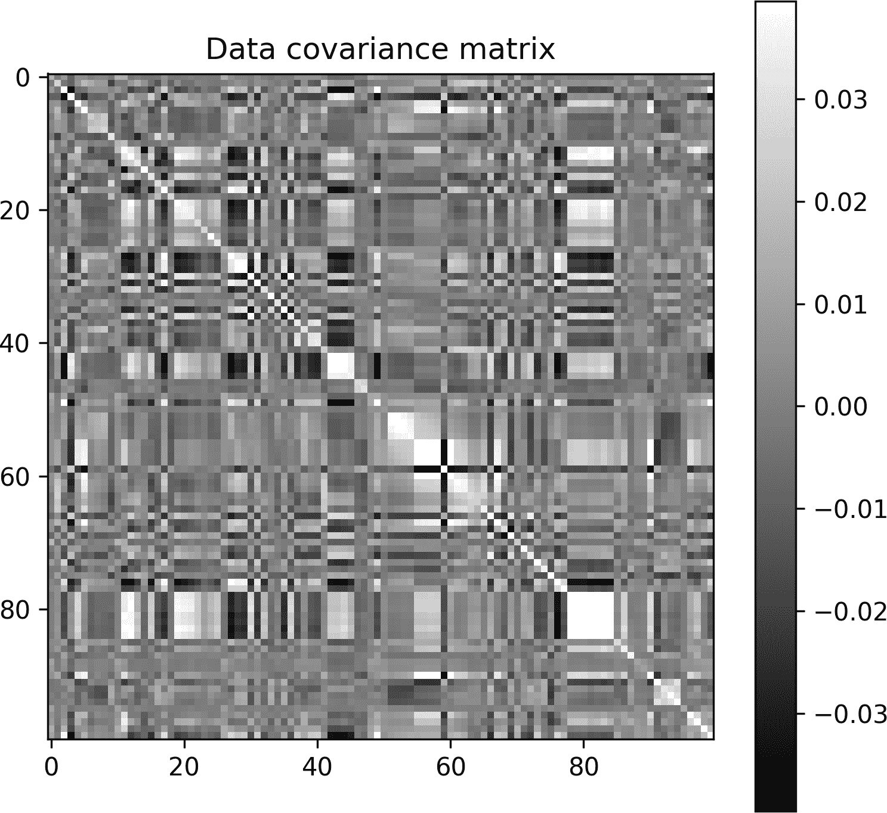
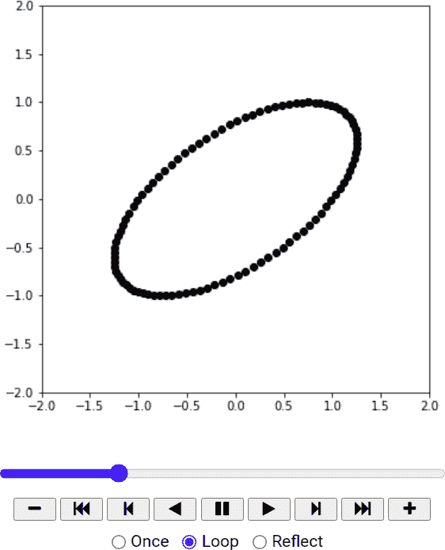
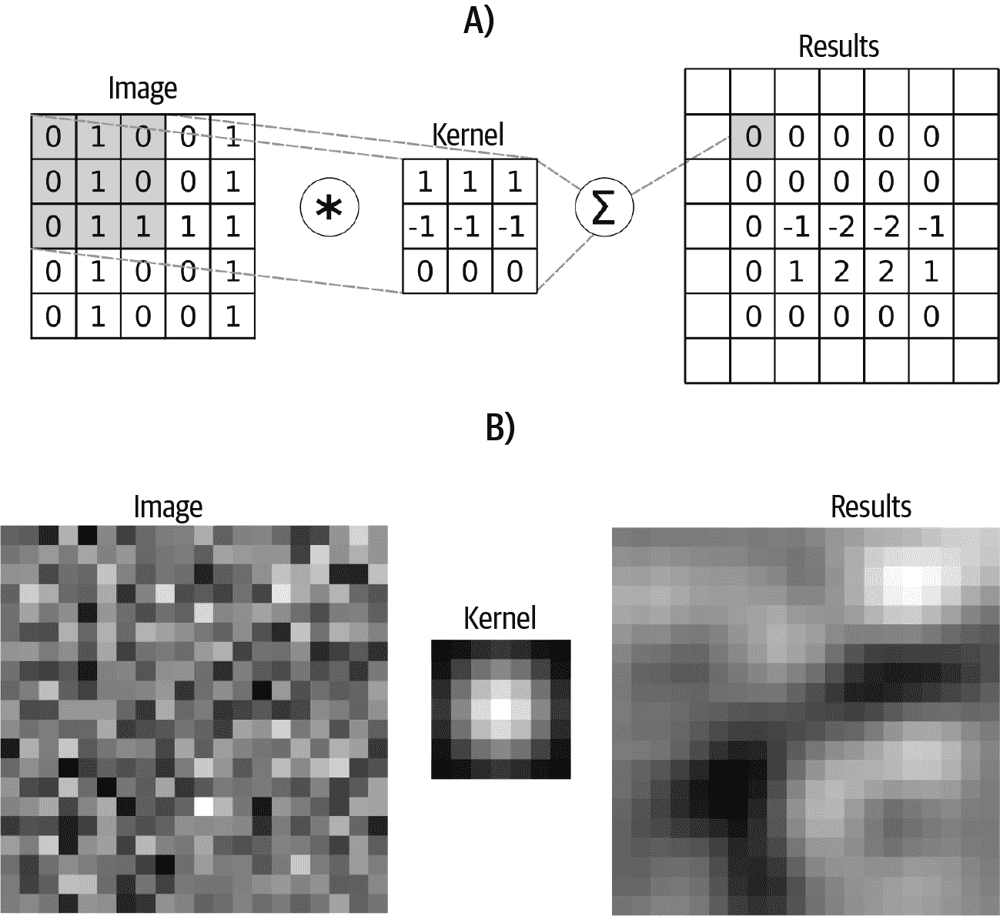
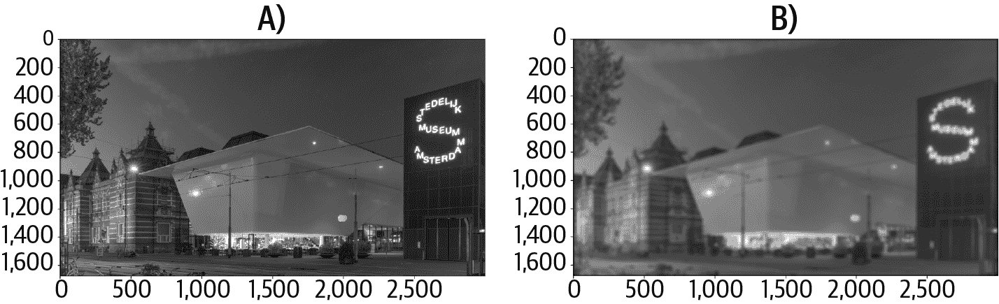
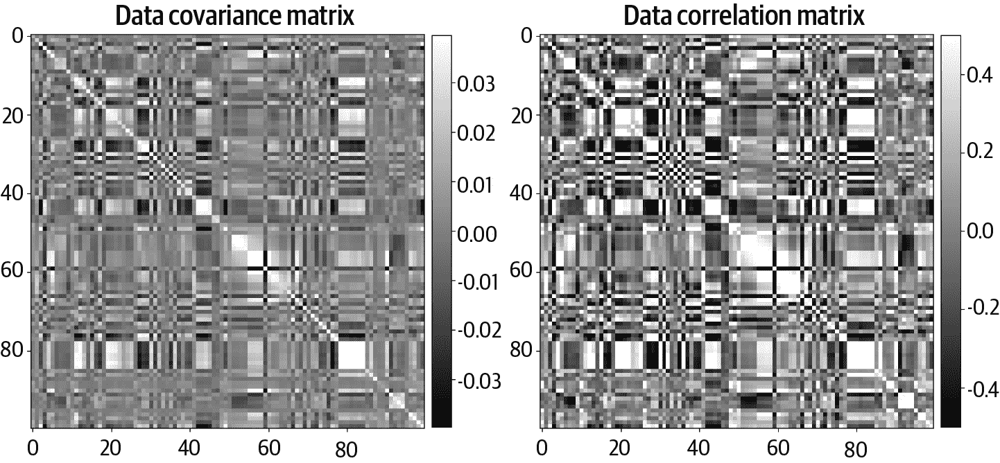
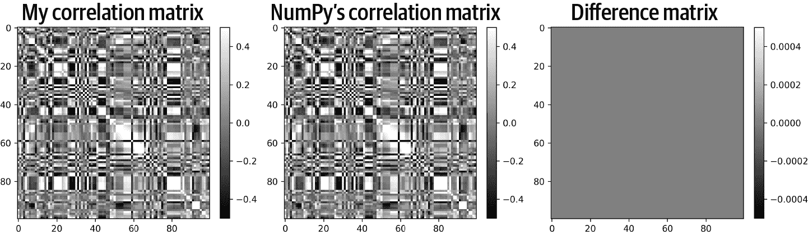
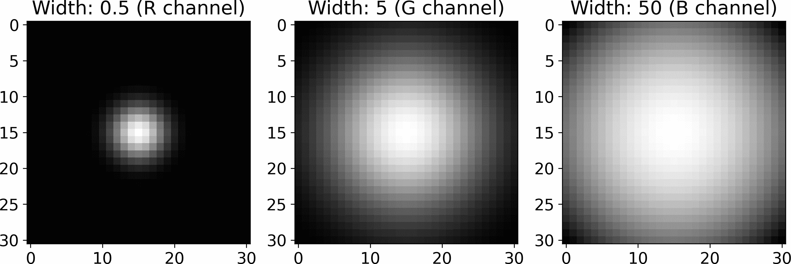
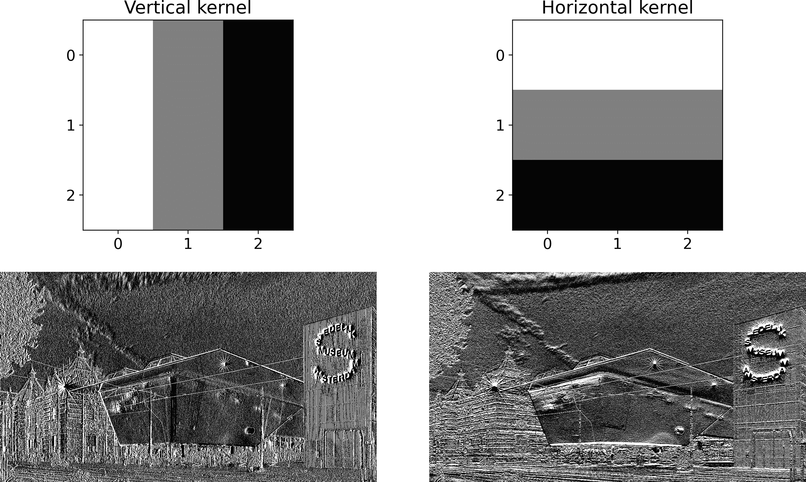

# 第七章：矩阵应用

我希望现在，在过去两个理论密集的章节之后，你感觉就像刚刚完成了一次健身房的剧烈锻炼：疲惫但充满活力。这一章应该感觉就像在乡村小路上骑自行车：有时费力但提供了新鲜且令人振奋的视角。

本章的应用松散地基于第四章的内容。我这样做是为了在向量和矩阵的章节中保持一些共同的主题线索。因为我希望你看到，尽管随着线性代数的深入，概念和应用变得更加复杂，但其基础仍建立在诸如线性加权组合和点积等简单原理上。

# 多元数据协方差矩阵

在第四章中，你学会了如何计算 Pearson 相关系数，即两个数据变量之间的向量点积，除以向量范数的乘积。那个公式是用于两个变量（例如身高和体重）的；如果你有多个变量（例如身高、体重、年龄、每周运动……）呢？

你可以想象在所有变量上写一个双重`for`循环，并将双变量相关性公式应用于所有变量对。但那样既笨重又不优雅，与线性代数精神相违背。本节的目的是向你展示如何从多变量数据集中计算协方差和相关性*矩阵*。

让我们从*协方差*开始。协方差简单来说是相关方程的分子部分，换句话说，是两个均值中心化变量的点积。协方差的解释与相关性相同（变量同向移动时为正，反向移动时为负，无线性关系时为零），但协方差保留了数据的尺度，因此不受±1 的限制。

协方差还有一个*（n-1）*的归一化因子，其中*n*是数据点的数量。这种归一化防止了随着数据值的累加协方差变得越来越大（类似于通过*N*来将总和转换为平均值）。以下是协方差的方程式：

<math alttext="c Subscript a comma b Baseline equals left-parenthesis n minus 1 right-parenthesis Superscript negative 1 Baseline sigma-summation Underscript i equals 1 Overscript n Endscripts left-parenthesis x Subscript i Baseline minus x overbar right-parenthesis left-parenthesis y Subscript i Baseline minus y overbar right-parenthesis" display="block"><mrow><msub><mi>c</mi> <mrow><mi>a</mi><mo>,</mo><mi>b</mi></mrow></msub> <mo>=</mo> <msup><mrow><mo>(</mo><mi>n</mi><mo>-</mo><mn>1</mn><mo>)</mo></mrow> <mrow><mo>-</mo><mn>1</mn></mrow></msup> <munderover><mo>∑</mo> <mrow><mi>i</mi><mo>=</mo><mn>1</mn></mrow> <mi>n</mi></munderover> <mrow><mo>(</mo> <msub><mi>x</mi> <mi>i</mi></msub> <mo>-</mo> <mover accent="true"><mi>x</mi> <mo>¯</mo></mover> <mo>)</mo></mrow> <mrow><mo>(</mo> <msub><mi>y</mi> <mi>i</mi></msub> <mo>-</mo> <mover accent="true"><mi>y</mi> <mo>¯</mo></mover> <mo>)</mo></mrow></mrow></math>

正如第四章中所述，如果我们称<mover accent="true"><mi>𝐱</mi> <mo>˜</mo></mover>为均值中心化变量<mover accent="true"><mi>𝐱</mi></mover>，那么协方差就是简单的<mover accent="true"><mi>𝐱</mi> <mo>˜</mo></mover><mtext><msup><mi>T</mi></msup></mtext> <mover accent="true"><mi>𝐲</mi> <mo>˜</mo></mover> /（n-1）。

实现此多变量公式的关键见解是矩阵乘法是左矩阵行和右矩阵列的点积的组织集合。

因此，我们做的是：创建一个矩阵，其中每一列对应一个变量（变量是数据特征）。让我们称这个矩阵为<math alttext="bold upper X"><mi>𝐗</mi></math>。现在，乘积<math alttext="bold upper X bold upper X"><mrow><mi>𝐗</mi> <mi>𝐗</mi></mrow></math>是不合理的（甚至可能无效，因为数据矩阵往往是高的，因此*M* > *N*)。但是如果我们转置第一个矩阵，那么<math alttext="bold upper X Superscript upper T"><msup><mi>𝐗</mi> <mtext>T</mtext></msup></math>的*行*对应于<math alttext="bold upper X"><mi>𝐗</mi></math>的*列*。因此，矩阵乘积<math alttext="bold upper X Superscript upper T Baseline bold upper X"><mrow><msup><mi>𝐗</mi> <mtext>T</mtext></msup> <mi>𝐗</mi></mrow></math>编码了所有成对协方差（假设列是均值居中的，并且在除以*n* - 1 时）。换句话说，协方差矩阵中的(*i,j*)元素是数据特征*i*和*j*的点积。

协方差矩阵的矩阵方程非常优雅且紧凑：

<math alttext="bold upper C equals bold upper X Superscript upper T Baseline bold upper X StartFraction 1 Over n minus 1 EndFraction" display="block"><mrow><mi>𝐂</mi> <mo>=</mo> <msup><mi>𝐗</mi> <mtext>T</mtext></msup> <mi>𝐗</mi> <mfrac><mn>1</mn> <mrow><mi>n</mi><mo>-</mo><mn>1</mn></mrow></mfrac></mrow></math>

矩阵<math alttext="bold upper C"><mi>𝐂</mi></math>是对称的。这来自于第五章中证明的任何矩阵乘以其转置都是方阵对称的，但从统计学上讲也是有道理的：协方差和相关性是对称的，意味着例如身高和体重之间的相关性与体重和身高之间的相关性相同。

对于<math alttext="bold upper C"><mi>𝐂</mi></math>的对角元素是什么？这些元素包含每个变量与自身的协方差，在统计学中称为*方差*，用来量化围绕均值的离散程度（方差是标准差的平方）。

在在线代码示例中，使用公开可用的犯罪统计数据集创建了一个协方差矩阵。该数据集包括有关美国各社区社会、经济、教育和住房信息的一百多个特征¹。该数据集的目标是利用这些特征来预测犯罪水平，但在这里我们将用它来检查协方差和相关矩阵。

导入并进行一些轻微的数据处理后（在在线代码中有解释），我们有一个名为`dataMat`的数据矩阵。以下代码显示如何计算协方差矩阵：

```
datamean = np.mean(dataMat,axis=0) # vector of feature means
dataMatM = dataMat - datamean      # mean-center using broadcasting
covMat   = dataMatM.T @ dataMatM   # data matrix times its transpose
covMat  /= (dataMatM.shape[0]-1)   # divide by N-1
```

图 7-1 显示了协方差矩阵的图像。首先：看起来整洁，不是吗？我在“日常工作”中是一名神经科学教授，经常研究多变量数据集，并且仰慕协方差矩阵从未让我失望过。

在这个矩阵中，浅色表示正相关的变量（例如，离婚男性的百分比与贫困人口数），深色表示负相关的变量（例如，离婚男性的百分比与中位收入），灰色表示彼此无关的变量。

正如你在第四章中学到的，从协方差计算相关性仅涉及向量的范数缩放。这可以转化为一个矩阵方程，让你能够计算数据相关矩阵而无需使用`for`循环。练习 7-1 和 练习 7-2 将引导你完成这一过程。正如我在第四章中所写，我鼓励你在继续下一节之前先完成这些练习。



###### 图 7-1\. 数据协方差矩阵

最后注意：NumPy 有用于计算协方差和相关矩阵的函数（分别是`np.cov()`和`np.corrcoef()`）。在实践中，使用这些函数比自己编写代码更方便。但是——正如本书始终如一地强调的——我希望你理解这些函数实现的数学和机制。因此，在这些练习中，你应该将协方差实现为直接的公式翻译，而不是调用 NumPy 函数。

# 几何变换通过矩阵-向量乘法实现

我在第五章中提到，矩阵-向量乘法的一个目的是对一组坐标应用几何变换。在本节中，你将在二维静态图像和动画中看到这一点。顺便说一句，你将了解纯旋转矩阵以及如何在 Python 中创建数据动画。

“纯旋转矩阵”旋转一个向量同时保持其长度不变。你可以将其类比为模拟时钟的指针：随着时间的推移，指针旋转但长度不变。一个二维旋转矩阵可以表示为：

<math alttext="bold upper T equals Start 2 By 2 Matrix 1st Row 1st Column cosine left-parenthesis theta right-parenthesis 2nd Column sine left-parenthesis theta right-parenthesis 2nd Row 1st Column minus sine left-parenthesis theta right-parenthesis 2nd Column cosine left-parenthesis theta right-parenthesis EndMatrix" display="block"><mrow><mi>𝐓</mi> <mo>=</mo> <mfenced close="]" open=""><mtable><mtr><mtd><mrow><mo form="prefix">cos</mo> <mo>(</mo> <mi>θ</mi> <mo>)</mo></mrow></mtd> <mtd><mrow><mo form="prefix">sin</mo> <mo>(</mo> <mi>θ</mi> <mo>)</mo></mrow></mtd></mtr> <mtr><mtd><mrow><mo form="prefix">-sin</mo> <mo>(</mo> <mi>θ</mi> <mo>)</mo></mrow></mtd> <mtd><mrow><mo form="prefix">cos</mo> <mo>(</mo> <mi>θ</mi> <mo>)</mo></mrow></mtd></mtr></mtable></mfenced></mrow></math>

纯旋转矩阵是*正交矩阵*的一个示例。我将在下一章更多地讨论正交矩阵，但我想指出<math alttext="bold upper T"><mi>𝐓</mi></math>的列是正交的（它们的点积是 cos(*θ*)sin(*θ*) − sin(*θ*)cos(*θ*)）并且是单位向量（回忆三角恒等式 cos²(*θ*) + sin²(*θ*) = 1）。

要使用此变换矩阵，将<math alttext="theta"><mi>θ</mi></math>设置为某个顺时针旋转的角度，然后将矩阵<math alttext="bold upper T"><mi>𝐓</mi></math>乘以一个<math alttext="2 times upper N"><mrow><mn>2</mn> <mo>×</mo> <mi>N</mi></mrow></math>几何点矩阵，该矩阵中每一列包含*N*个数据点的(X,Y)坐标。例如，设置<math alttext="theta equals 0"><mrow><mi>θ</mi> <mo>=</mo> <mn>0</mn></mrow></math>不会改变点的位置（这是因为<math alttext="theta equals 0"><mrow><mi>θ</mi> <mo>=</mo> <mn>0</mn></mrow></math>意味着<math alttext="bold upper T equals bold upper I"><mrow><mi>𝐓</mi> <mo>=</mo> <mi>𝐈</mi></mrow></math>）；设置<math alttext="theta equals pi slash 2"><mrow><mi>θ</mi> <mo>=</mo> <mi>π</mi> <mo>/</mo> <mn>2</mn></mrow></math>会使点围绕原点逆时针旋转<math alttext="90 Superscript ring"><msup><mn>90</mn> <mo>∘</mo></msup></math>。

举个简单的例子，考虑一组垂直排列的点集以及通过<math alttext="bold upper T"><mi>𝐓</mi></math>乘以这些坐标的效果。在图 7-2 中，我设置了<math alttext="theta equals pi slash 5"><mrow><mi>θ</mi> <mo>=</mo> <mi>π</mi> <mo>/</mo> <mn>5</mn></mrow></math>。

![纯旋转

###### 图 7-2. 围绕原点通过纯旋转矩阵旋转点

在继续本节之前，请检查生成此图的在线代码。确保您理解我上面写的数学如何转化为代码，并花些时间尝试不同的旋转角度。您也可以尝试弄清楚如何使旋转逆时针而不是顺时针；答案在脚注中。²

让我们通过使用“不纯”的旋转（即拉伸和旋转，而不仅仅是旋转），并通过动画变换来使我们对旋转的调查更加精彩。特别是，我们将在电影的每一帧平滑调整变换矩阵。

在 Python 中创建动画有几种方法；我将在这里使用的方法涉及定义一个 Python 函数，在每个电影帧上创建图形内容，然后调用`matplotlib`例程在每次迭代中运行该函数。

我称这部电影为*摇摆的圆*。圆由一组<math alttext="cosine left-parenthesis theta right-parenthesis"><mrow><mo form="prefix">cos</mo> <mo>(</mo> <mi>θ</mi> <mo>)</mo></mrow></math>和<math alttext="sine left-parenthesis theta right-parenthesis"><mrow><mo form="prefix">sin</mo> <mo>(</mo> <mi>θ</mi> <mo>)</mo></mrow></math>点定义，向量<math alttext="theta"><mi>θ</mi></math>角从 0 到<math alttext="2 pi"><mrow><mn>2</mn> <mi>π</mi></mrow></math>。

我设置了以下的变换矩阵：

<math alttext="bold upper T equals Start 2 By 2 Matrix 1st Row 1st Column 1 2nd Column 1 minus phi 2nd Row 1st Column 0 2nd Column 1 EndMatrix" display="block"><mrow><mi>𝐓</mi> <mo>=</mo> <mfenced close="]" open="["><mtable><mtr><mtd><mn>1</mn></mtd> <mtd><mrow><mn>1</mn> <mo>-</mo> <mi>φ</mi></mrow></mtd></mtr> <mtr><mtd><mn>0</mn></mtd> <mtd><mn>1</mn></mtd></mtr></mtable></mfenced></mrow></math>

我为什么选择这些具体值，您如何解释变换矩阵？一般来说，对角元素缩放*x*-轴和*y*-轴坐标，而非对角元素则拉伸两个轴。上述矩阵中的确切值是通过尝试不同的数字直到我找到看起来不错的结果而选择的。稍后，在练习中，您将有机会探索更改变换矩阵的效果。

在电影的过程中，<math alttext="phi"><mi>φ</mi></math> 的值将平稳过渡从 1 到 0，然后再到 1，遵循公式 <math alttext="phi equals x squared comma negative 1 less-than-or-equal-to x less-than-or-equal-to 1"><mrow><mi>φ</mi><mo>=</mo><msup><mi>x</mi> <mn>2</mn></msup> <mo>,</mo><mrow><mo>-</mo><mn>1</mn></mrow><mo>≤</mo><mi>x</mi><mo>≤</mo><mn>1</mn></mrow>。注意，当 <math alttext="phi equals 1"><mrow><mi>φ</mi> <mo>=</mo> <mn>1</mn></mrow> 时，<math alttext="bold upper T equals bold upper I"><mrow><mi>𝐓</mi> <mo>=</mo> <mi>𝐈</mi></mrow></math>。

数据动画的 Python 代码可以分为三个部分。第一部分是设置图形：

```
theta  = np.linspace(0,2*np.pi,100)
points = np.vstack((np.sin(theta),np.cos(theta)))

fig,ax = plt.subplots(1,figsize=(12,6))
plth,  = ax.plot(np.cos(x),np.sin(x),'ko')
```

`ax.plot` 的输出是变量 `plth`，它是一个*句柄*或指针，指向绘图对象。这个句柄允许我们更新点的位置，而不是在每一帧上从头开始重绘图形。

第二部分是定义在每一帧更新坐标轴的函数：

```
def aframe(ph):

  # create and apply the transform matrix
  T = np.array([ [1,1-ph],[0,1] ])
  P = T@points

  # update the dots' location
  plth.set_xdata(P[0,:])
  plth.set_ydata(P[1,:])

  return plth
```

最后，我们定义我们的变换参数 <math alttext="phi"><mi>φ</mi></math> 并调用创建动画的 `matplotlib` 函数：

```
phi = np.linspace(-1,1-1/40,40)**2
animation.FuncAnimation(fig, aframe, phi,
                interval=100, repeat=True)
```

图 7-3 展示了电影的一个帧，您可以通过运行代码观看整个视频。诚然，这部电影不太可能赢得任何奖项，但它确实展示了在动画中如何使用矩阵乘法。CGI 电影和视频游戏中的图形稍微复杂一些，因为它们使用称为四元数的数学对象，这些四元数是在 <math alttext="double-struck upper R Superscript 4"><msup><mi>ℝ</mi> <mn>4</mn></msup></math> 中的向量，允许在 3D 中进行旋转和平移。但原理——通过变换矩阵乘以几何坐标的矩阵——完全相同。



###### 图 7-3\. 电影《摇晃的圆》的一个帧

在处理本节的练习之前，我鼓励您花些时间尝试本节的代码。特别是，通过将对角元素之一设置为 0.5 或 2，更改左下角的非对角元素而不是（或者除此之外还）右上角的非对角元素，将其中一个对角元素参数化而不是非对角元素等。并且这里有个问题：您能想出如何让圆向左而不是向右摇摆吗？答案在脚注中。³

# 图像特征检测

在本节中，我将介绍图像滤波，这是图像特征检测的一种机制。图像滤波实际上是时间序列滤波的一个延伸，所以在这里通过第四章会对你有利。回想一下，在时间序列信号中进行特征过滤或检测时，你设计一个核，然后创建核与信号重叠段的点乘时间序列。

图像滤波的工作方式与 1D 相同，只是在 2D 中。我们设计一个 2D 核，然后创建一个新图像，其中包含核与图像重叠窗口之间的“点乘”。

我在引号中写了“点乘”，因为这里的操作与向量点乘并不完全相同。计算方式相同——逐元素相乘和求和——但是操作发生在两个矩阵之间，因此实现是 Hadamard 乘积并对所有矩阵元素求和。图 A 在图 7-4 中说明了该过程。还有卷积的额外细节——例如，填充图像以使结果大小相同——你可以在图像处理书籍中了解。在这里，我希望你专注于线性代数方面，特别是点积量化了两个向量（或矩阵）之间的关系，这可以用于滤波和特征检测。



###### 图 7-4. 图像卷积机制

在进行分析之前，我将简要解释如何创建一个 2D 高斯核。2D 高斯由以下方程给出：

<math alttext="upper G equals exp left-parenthesis minus left-parenthesis upper X squared plus upper Y squared right-parenthesis slash sigma right-parenthesis" display="block"><mrow><mi>G</mi> <mo>=</mo> <mo form="prefix">exp</mo> <mo>(</mo> <mo>-</mo> <mrow><mo>(</mo> <msup><mi>X</mi> <mn>2</mn></msup> <mo>+</mo> <msup><mi>Y</mi> <mn>2</mn></msup> <mo>)</mo></mrow> <mo>/</mo> <mi>σ</mi> <mo>)</mo></mrow></math>

关于该方程的一些说明：*exp*代表自然指数（常数*e* = 2.71828…），当指数项较长时，使用 exp(x)而不是*e*^x。*X*和*Y*是 2D 坐标网格，用于评估函数。最后，<math alttext="sigma"><mi>σ</mi></math>是函数的一个参数，通常称为“形状”或“宽度”：较小的值使高斯变窄，而较大的值使高斯变宽。现在，我将该参数固定为某些值，你将有机会探索改变该参数的影响在练习 7-6 中。

这里是如何将该公式转化为代码：

```
Y,X    = np.meshgrid(np.linspace(-3,3,21),np.linspace(-3,3,21))
kernel = np.exp( -(X**2+Y**2) / 20 )
kernel = kernel / np.sum(kernel) # normalize
```

*X*和*Y*网格从-3 到+3，步长为 21 步。宽度参数硬编码为 20。第三行对核中的值进行归一化，使整个核的总和为 1。这保持了数据的原始比例。当正确归一化时，每一步卷积——因此，过滤后图像中的每个像素——都成为周围像素的加权平均值，权重由高斯定义。

回到手头的任务：我们将平滑一个随机数矩阵，类似于我们在第四章中平滑随机数时间序列的方式。你可以在图 7-4 中看到随机数矩阵、高斯核以及卷积结果。

以下 Python 代码展示了如何实现图像卷积。再次回想一下第四章中的时间序列卷积，你会发现其思想相同，只是多了一个维度，需要额外的`for`循环：

```
for rowi in range(halfKr,imgN-halfKr):   # loop over rows
  for coli in range(halfKr,imgN-halfKr): # loop over cols

    # cut out a piece of the image
    pieceOfImg = imagePad[ rowi-halfKr:rowi+halfKr+1:1,
                           coli-halfKr:coli+halfKr+1:1 ]

    # dot product: Hadamard multiply and sum
    dotprod = np.sum( pieceOfImg*kernel )

    # store the result for this pixel
    convoutput[rowi,coli] = dotprod
```

将卷积实现为双重`for`循环实际上计算效率低下。事实证明，在频域中可以更快速地实现卷积，并且代码更少。这要归功于卷积定理，该定理指出时间（或空间）域中的卷积等于频率域中的乘法。对卷积定理的全面阐述超出了本书的范围；我在此提到它是为了建议你使用 SciPy 的`convolve2d`函数而不是双重`for`循环实现，尤其是对于大图像。

让我们尝试平滑一张真实的图片。我们将使用阿姆斯特丹斯特德利克博物馆的图片，我爱称它为“外太空的浴缸”。这张图片是一个 3D 矩阵，因为它具有行、列和深度——深度包含了来自红、绿和蓝色通道的像素强度值。这张图片存储为一个矩阵在<math alttext="double-struck upper R Superscript 1675 times 3000 times 3"><msup><mi>ℝ</mi> <mrow><mn>1675</mn><mo>×</mo><mn>3000</mn><mo>×</mo><mn>3</mn></mrow></msup></math> 。严格来说，这被称为一个*张量*，因为它是一个立方体，而不是一个数字表格。

目前，我们将通过转换为灰度来将其减少为 2D 矩阵。这简化了计算，尽管并非必要。在练习 7-5 中，您将了解如何平滑 3D 图像。图 7-5 展示了应用高斯平滑核前后的灰度图像。



###### 图 7-5\. 浴缸博物馆的图片，在进行了适当平滑前后

这两个示例都使用了高斯核。还有多少其他核可用？无限多个！在练习 7-7 中，您将测试另外两个用于识别垂直和水平线的核。这些特征检测器在图像处理中很常见（并且被用于您大脑中用于检测光模式中边缘的神经元）。

图像卷积核在计算机视觉中是一个重要的主题。事实上，卷积神经网络（专为计算机视觉优化的深度学习架构）的惊人性能完全归因于网络通过学习来制作最佳的滤波器核。

# 摘要

让我简单解释一下：重要且复杂的数据科学和机器学习方法又一次是建立在简单的线性代数原理上。

# 代码练习

## 协方差和相关矩阵练习

##### Exercise 7-1\.

在这个练习中，你将把协方差矩阵转换为相关矩阵。该过程涉及将每个矩阵元素（即每对变量之间的协方差）除以这两个变量的方差的乘积。

这是通过将协方差矩阵分别预乘和后乘一个包含每个变量标准差的对角矩阵（标准差是方差的平方根）来实现的。标准差被倒置，因为我们需要*除以*方差，尽管我们将*乘以*矩阵。预乘和后乘标准差的原因是预乘和后乘对角矩阵的特殊性质，这在 Exercise 5-11 中已经解释过了。

Equation 7-1 显示了公式。

##### Equation 7-1\. 从协方差到相关的公式

<math alttext="bold upper R equals bold upper S bold upper C bold upper S" display="block"><mrow><mi>𝐑</mi> <mo>=</mo> <mi>𝐒</mi> <mi>𝐂</mi> <mi>𝐒</mi></mrow></math>

<math alttext="bold upper C"><mi>𝐂</mi></math>是协方差矩阵，<math alttext="bold upper S"><mi>𝐒</mi></math>是每个变量的倒数标准差的对角矩阵（即第*i*个对角线是<math alttext="1 slash sigma Subscript i"><mrow><mn>1</mn> <mo>/</mo> <msub><mi>σ</mi> <mi>i</mi></msub></mrow></math>，其中<math alttext="sigma Subscript i"><msub><mi>σ</mi> <mi>i</mi></msub></math>是第*i*个变量的标准差）。

在这个练习中，你的目标是通过将 Equation 7-1 翻译成 Python 代码，从协方差矩阵计算相关矩阵。然后，你可以重现 Figure 7-6。



###### Figure 7-6\. Exercise 7-1 的解答

##### Exercise 7-2\.

NumPy 有一个函数`np.corrcoef()`，给定输入数据矩阵，返回一个相关矩阵。使用这个函数重现你在上一个练习中创建的相关矩阵。在类似 Figure 7-7 的图中展示这两个矩阵及它们的差异，以确认它们是相同的。



###### Figure 7-7\. Exercise 7-2 的解答。注意颜色比例的差异。

接下来，通过评估`??np.corrcoef()`来检查`np.corrcoef()`的源代码。NumPy 使用了一种稍微不同的实现，通过标准偏差的广播除法而不是预乘和后乘一个倒置标准偏差的对角矩阵，但你应该能够理解它们的代码实现如何与你在前一个练习中编写的数学和 Python 代码相匹配。

## 几何变换练习

##### Exercise 7-3\.

本练习的目标是展示应用变换前后的圆内点，类似于我在图 7-2 中展示线段前后旋转的方式。使用以下变换矩阵，然后创建一个类似图 7-8 的图形：

<math alttext="加粗的大写 T 等于开始 2 乘 2 矩阵第一行第一列 1 第二列.5 第二行第一列 0 第二列.5 结束矩阵" display="block"><mrow><mi>𝐓</mi> <mo>=</mo> <mfenced close="]" open=""><mtable><mtr><mtd><mn>1</mn></mtd> <mtd><mrow><mn>.5</mn></mrow></mtd></mtr> <mtr><mtd><mn>0</mn></mtd> <mtd><mrow><mn>.5</mn></mrow></mtd></mtr></mtable></mfenced></mrow></math>![一个圆形，经过变换

###### 图 7-8\. 练习 7-3 的解答

##### 练习 7-4。

现在看另一个电影。我称其为*螺旋的 DNA*。图 7-9 展示了电影的一个镜头。步骤与*摇摆的圆形*相同——设置一个图表，创建一个将变换矩阵应用于坐标矩阵的 Python 函数，并告诉`matplotlib`使用该函数创建动画。使用以下变换矩阵：

<math display="block"><mtable displaystyle="true"><mtr><mtd columnalign="right"><mi>𝐓</mi></mtd> <mtd columnalign="left"><mrow><mo>=</mo> <mfenced close="]" open=""><mtable><mtr><mtd><mrow><mo>(</mo> <mn>1</mn> <mo>-</mo> <mi>φ</mi> <mo>/</mo> <mn>3</mn> <mo>)</mo></mrow></mtd> <mtd><mn>0</mn></mtd></mtr> <mtr><mtd><mn>0</mn></mtd> <mtd><mi>φ</mi></mtd></mtr></mtable></mfenced></mrow></mtd></mtr> <mtr><mtd columnalign="right"><mrow><mn>-1</mn> <mo>≤</mo></mrow></mtd> <mtd columnalign="left"><mrow><mi>φ</mi> <mo>≤</mo> <mn>1</mn></mrow></mtd></mtr></mtable></math>![弹跳的 DNA###### 图 7-9\. 练习 7-4 的解答## 图像特征检测练习##### 练习 7-5。平滑 3D 浴缸图片（如果需要提示，请查看脚注⁴）。`convolve2d` 函数的输出数据类型为 `float64`（您可以通过输入 `variableName.dtype` 自行查看）。然而，`plt.imshow` 将会警告有关裁剪数值的问题，图片无法正常渲染。因此，您需要将卷积结果转换为 `uint8`。##### 练习 7-6。不需要为每个颜色通道使用相同的核。根据图 7-10 中显示的值，为每个通道更改高斯的宽度参数。对图像的影响微妙，但不同颜色的模糊使其具有一种稍微立体的外观，就像您没有戴眼镜看红蓝立体照片一样。

###### 图 7-10\. 练习 7-6 中每个颜色通道使用的核

##### 练习 7-7。

从技术上讲，图像平滑是特征提取的一种，因为它涉及提取信号的平滑特征，同时抑制尖锐特征。在这里，我们将改变滤波器核以解决其他图像特征检测问题：识别水平和垂直线条。

这两个卷积核如同图 7-11 中所示，它们对图像的影响也被展示了出来。您可以根据它们的视觉外观手工制作这两个卷积核；它们是<math alttext="3 times 3"><mrow><mn>3</mn> <mo>×</mo> <mn>3</mn></mrow></math>的矩阵，只包含数字 −1、0 和 +1\. 将这些卷积核与 2D 灰度图像卷积，以创建图 7-11 中显示的特征图。



###### 图 7-11\. 练习 7-7 的结果

¹ M. A. Redmond 和 A. Baveja，《A Data-Driven Software Tool for Enabling Cooperative Information Sharing Among Police Departments》，《European Journal of Operational Research》141（2002）：660–678。

² 将正弦函数中的负号互换。

³ 将右下角的元素设为 −1。

⁴ 提示：分别平滑每个颜色通道。
