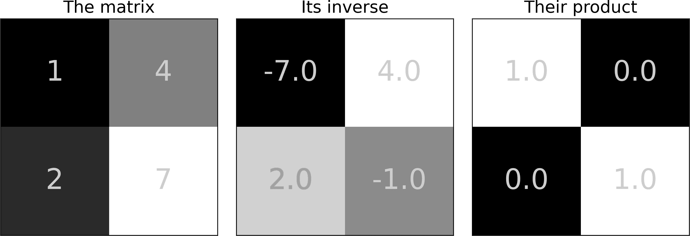
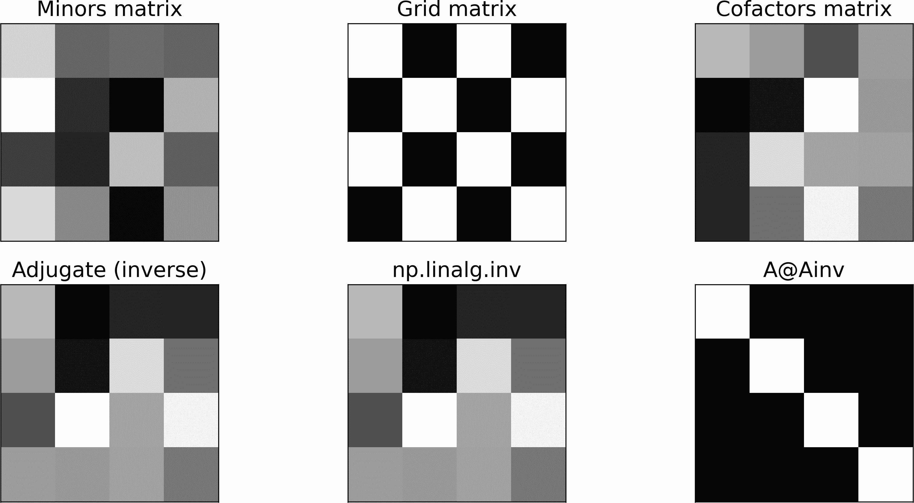
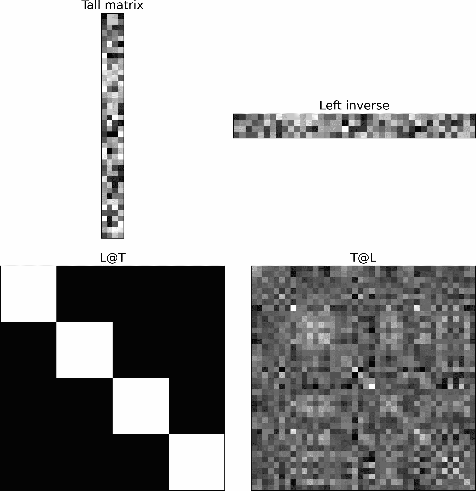
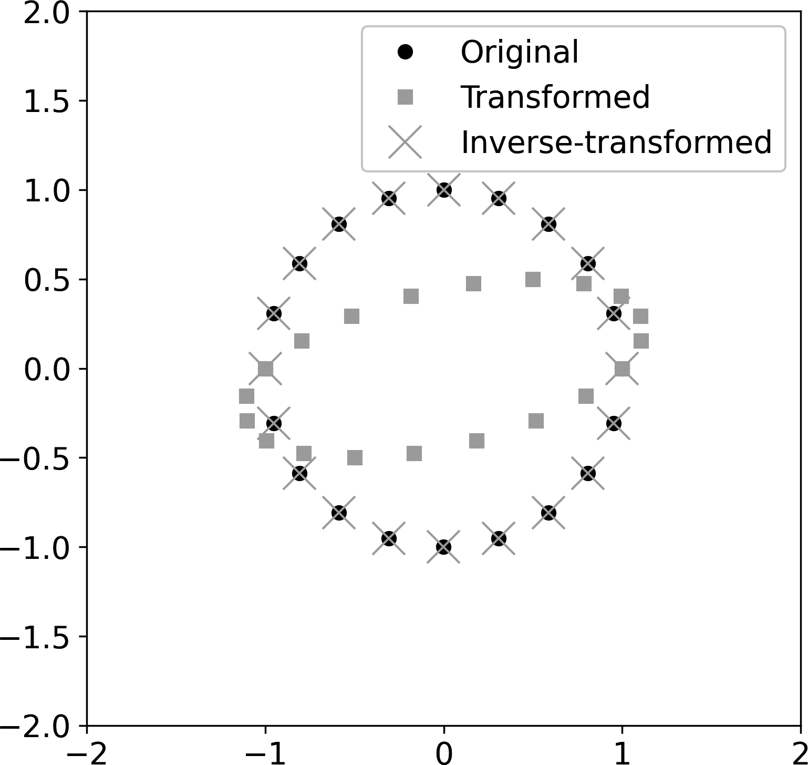
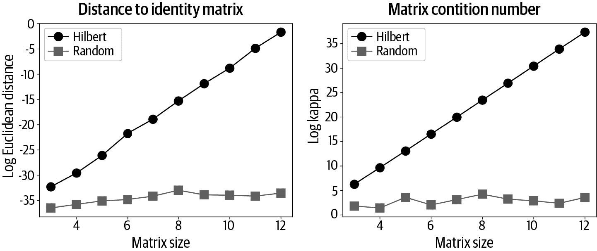

# 第八章：矩阵的逆

我们正在向解决矩阵方程迈进。矩阵方程类似于普通方程（例如，在 4*x* = 8 中解出 *x*），但是……它们包含矩阵。到了书的这一部分，你已经清楚，当涉及到矩阵时，事情变得复杂。尽管如此，我们必须接受这种复杂性，因为解矩阵方程是数据科学的重要组成部分。

矩阵的逆在实际应用中解决矩阵方程中至关重要，包括将统计模型拟合到数据（想想一般线性模型和回归）。在本章末尾，您将了解什么是矩阵的逆，何时可以和不能计算它，如何计算它以及如何解释它。

# 矩阵的逆

矩阵 <math alttext="bold upper A"><mi>𝐀</mi></math> 的逆是另一个矩阵 <math alttext="bold upper A Superscript negative 1"><msup><mi>𝐀</mi> <mrow><mo>-</mo><mn>1</mn></mrow></msup></math>（发音为“A 的逆”），它乘以 <math alttext="bold upper A"><mi>𝐀</mi></math> 以产生单位矩阵。换句话说，<math alttext="bold upper A Superscript negative 1 Baseline bold upper A equals bold upper I"><mrow><msup><mi>𝐀</mi> <mrow><mo>-</mo><mn>1</mn></mrow></msup> <mi>𝐀</mi> <mo>=</mo> <mi>𝐈</mi></mrow></math> 。这就是你如何“取消”一个矩阵。另一个概念是，我们希望将一个矩阵线性变换成单位矩阵；矩阵的逆包含了这种线性变换，并且矩阵乘法是应用该变换到矩阵的机制。

但是为什么我们需要求矩阵的逆？我们需要“取消”一个矩阵，以便解决可以表示为 <math alttext="bold upper A bold x equals bold b"><mrow><mi>𝐀</mi> <mi>𝐱</mi> <mo>=</mo> <mi>𝐛</mi></mrow></math> 形式的问题，其中 <math alttext="bold upper A"><mi>𝐀</mi></math> 和 <math alttext="bold b"><mi>𝐛</mi></math> 是已知量，我们想求解 <math alttext="bold x"><mi>𝐱</mi></math> 。解的一般形式如下：

<math alttext="StartLayout 1st Row 1st Column bold upper A bold x 2nd Column equals bold b 2nd Row 1st Column bold upper A Superscript negative 1 Baseline bold upper A bold x 2nd Column equals bold upper A Superscript negative 1 Baseline bold b 3rd Row 1st Column bold upper I bold x 2nd Column equals bold upper A Superscript negative 1 Baseline bold b 4th Row 1st Column bold x 2nd Column equals bold upper A Superscript negative 1 Baseline bold b EndLayout" display="block"><mtable displaystyle="true"><mtr><mtd columnalign="right"><mrow><mi>𝐀</mi> <mi>𝐱</mi></mrow></mtd> <mtd columnalign="left"><mrow><mo>=</mo> <mi>𝐛</mi></mrow></mtd></mtr> <mtr><mtd columnalign="right"><mrow><msup><mi>𝐀</mi> <mrow><mo>-</mo><mn>1</mn></mrow></msup> <mi>𝐀</mi> <mi>𝐱</mi></mrow></mtd> <mtd columnalign="left"><mrow><mo>=</mo> <msup><mi>𝐀</mi> <mrow><mo>-</mo><mn>1</mn></mrow></msup> <mi>𝐛</mi></mrow></mtd></mtr> <mtr><mtd columnalign="right"><mrow><mi>𝐈</mi> <mi>𝐱</mi></mrow></mtd> <mtd columnalign="left"><mrow><mo>=</mo> <msup><mi>𝐀</mi> <mrow><mo>-</mo><mn>1</mn></mrow></msup> <mi>𝐛</mi></mrow></mtd></mtr> <mtr><mtd columnalign="right"><mi>𝐱</mi></mtd> <mtd columnalign="left"><mrow><mo>=</mo> <msup><mi>𝐀</mi> <mrow><mo>-</mo><mn>1</mn></mrow></msup> <mi>𝐛</mi></mrow></mtd></mtr></mtable></math>

这看起来非常直接，但计算逆是非常棘手的，你很快会了解到。

# 逆的类型和可逆性条件

“求矩阵的逆”听起来好像应该总是可行。谁不愿意在方便时求一个矩阵的逆？不幸的是，生活并非总是如此简单：并非所有的矩阵都可以求逆。

这里介绍了三种不同类型的逆，具有不同的可逆条件。它们在此处介绍；详细信息在后续章节中。

完全逆

这意味着 <math alttext="粗体大写 A 上标负一 上标线 粗体大写 A 等于 粗体大写 A 粗体大写 A 上标负一 上标线 等于 粗体大写 I"><mrow><msup><mi>𝐀</mi><mrow><mo>-</mo><mn>1</mn></mrow></msup><mi>𝐀</mi><mo>=</mo><mi>𝐀</mi><msup><mi>𝐀</mi><mrow><mo>-</mo><mn>1</mn></mrow></msup><mo>=</mo><mi>𝐈</mi></mrow></math> 。矩阵具有全逆的两个条件是：（1）方阵和（2）满秩。每个方阵满秩矩阵都有一个逆矩阵，并且具有全逆的每个矩阵都是方阵和满秩的。顺便说一下，在这里我使用术语*全逆*来区分它与下面两种可能性；通常你会简单地称全逆为*逆*。

单边逆

单边逆可以将一个矩形矩阵转换为单位矩阵，但它只对一个乘法顺序有效。特别地，一个高瘦矩阵 <math alttext="粗体大写 T"><mi>𝐓</mi></math> 可以有一个*左逆*，意味着 <math alttext="粗体大写 L 粗体大写 T 等于 粗体大写 I"><mrow><mi>𝐋</mi><mi>𝐓</mi><mo>=</mo><mi>𝐈</mi></mrow></math> 但 <math alttext="粗体大写 T 粗体大写 L 不等于 粗体大写 I"><mrow><mi>𝐓</mi><mi>𝐋</mi><mo>≠</mo><mi>𝐈</mi></mrow></math> 。而一个宽矮矩阵 <math alttext="粗体大写 W"><mi>𝐖</mi></math> 可以有一个*右逆*，意味着 <math alttext="粗体大写 W 粗体大写 R 等于 粗体大写 I"><mrow><mi>𝐖</mi><mi>𝐑</mi><mo>=</mo><mi>𝐈</mi></mrow></math> 但 <math alttext="粗体大写 R 粗体大写 W 不等于 粗体大写 I"><mrow><mi>𝐑</mi><mi>𝐖</mi><mo>≠</mo><mi>𝐈</mi></mrow></math> 。

如果一个非方阵矩阵具有最大可能的秩，则仅有一边逆。也就是说，高瘦矩阵具有左逆，如果它是秩-*N*（完全列秩），而宽矮矩阵具有右逆，如果它是秩-*M*（完全行秩）。

广义逆

每个矩阵都有一个广义逆，不论其形状和秩。如果矩阵是方阵且满秩，那么它的广义逆等于其完全逆。同样地，如果矩阵是非方阵且具有其最大可能的秩，那么广义逆等于其左逆（对于高瘦矩阵）或右逆（对于宽矮矩阵）。但是，一个降秩矩阵仍然有一个广义逆，这种情况下，广义逆将奇异矩阵转换为另一个接近但不等于单位矩阵的矩阵。

没有全逆或单边逆的矩阵被称为*奇异*或*不可逆*。这与标记矩阵为*降秩*或*秩不足*是一回事。

# 计算逆矩阵

矩阵的逆听起来很棒！我们如何计算呢？让我们先思考如何计算*标量*的倒数：简单地取（求）数的倒数。例如，数 3 的倒数是 1/3，这与 3^(−1)是一样的。然后，<math alttext="3 times 3 Superscript negative 1 Baseline equals 1"><mrow><mn>3</mn> <mo>×</mo> <msup><mn>3</mn> <mrow><mo>-</mo><mn>1</mn></mrow></msup> <mo>=</mo> <mn>1</mn></mrow></math>。

基于这种推理，你可能会猜测矩阵的逆工作方式相同：倒置每个矩阵元素。我们来试试：

<math alttext="Start 2 By 2 Matrix 1st Row 1st Column a 2nd Column b 2nd Row 1st Column c 2nd Column d EndMatrix Superscript negative 1 Baseline equals Start 2 By 2 Matrix 1st Row 1st Column 1 slash a 2nd Column 1 slash b 2nd Row 1st Column 1 slash c 2nd Column 1 slash d EndMatrix" display="block"><mrow><msup><mfenced close="]" open="["><mtable><mtr><mtd><mi>a</mi></mtd><mtd><mi>b</mi></mtd></mtr><mtr><mtd><mi>c</mi></mtd><mtd><mi>d</mi></mtd></mtr></mtable></mfenced> <mrow><mo>-</mo><mn>1</mn></mrow></msup> <mo>=</mo> <mfenced close="]" open="["><mtable><mtr><mtd><mrow><mn>1</mn> <mo>/</mo> <mi>a</mi></mrow></mtd> <mtd><mrow><mn>1</mn> <mo>/</mo> <mi>b</mi></mrow></mtd></mtr> <mtr><mtd><mrow><mn>1</mn> <mo>/</mo> <mi>c</mi></mrow></mtd> <mtd><mrow><mn>1</mn> <mo>/</mo> <mi>d</mi></mrow></mtd></mtr></mtable></mfenced></mrow></math>

不幸的是，这并没有产生预期的结果，这可以通过将原始矩阵乘以逐个倒置元素的矩阵来轻易地证明：

<math alttext="Start 2 By 2 Matrix 1st Row 1st Column a 2nd Column b 2nd Row 1st Column c 2nd Column d EndMatrix Start 2 By 2 Matrix 1st Row 1st Column 1 slash a 2nd Column 1 slash b 2nd Row 1st Column 1 slash c 2nd Column 1 slash d EndMatrix equals Start 2 By 2 Matrix 1st Row 1st Column 1 plus b slash c 2nd Column a slash b plus b slash d 2nd Row 1st Column c slash a plus d slash c 2nd Column 1 plus c slash b EndMatrix" display="block"><mrow><mfenced close="]" open="["><mtable><mtr><mtd><mi>a</mi></mtd> <mtd><mi>b</mi></mtd></mtr> <mtr><mtd><mi>c</mi></mtd> <mtd><mi>d</mi></mtd></mtr></mtable></mfenced> <mfenced close="]" open="["><mtable><mtr><mtd><mrow><mn>1</mn> <mo>/</mo> <mi>a</mi></mrow></mtd> <mtd><mrow><mn>1</mn> <mo>/</mo> <mi>b</mi></mrow></mtd></mtr> <mtr><mtd><mrow><mn>1</mn> <mo>/</mo> <mi>c</mi></mrow></mtd> <mtd><mrow><mn>1</mn> <mo>/</mo> <mi>d</mi></mrow></mtd></mtr></mtable></mfenced> <mo>=</mo> <mfenced close="]" open="["><mtable><mtr><mtd><mrow><mn>1</mn> <mo>+</mo> <mi>b</mi> <mo>/</mo> <mi>c</mi></mrow></mtd> <mtd><mrow><mi>a</mi> <mo>/</mo> <mi>b</mi> <mo>+</mo> <mi>b</mi> <mo>/</mo> <mi>d</mi></mrow></mtd></mtr> <mtr><mtd><mrow><mi>c</mi> <mo>/</mo> <mi>a</mi> <mo>+</mo> <mi>d</mi> <mo>/</mo> <mi>c</mi></mrow></mtd> <mtd><mrow><mn>1</mn> <mo>+</mo> <mi>c</mi> <mo>/</mo> <mi>b</mi></mrow></mtd></mtr></mtable></mfenced></mrow></math>

这是一个有效的乘法，但它*不*生成单位矩阵，这意味着逐个元素倒置的矩阵*不*是矩阵的逆。

有一个算法可以计算任何可逆矩阵的矩阵。这是一个冗长乏味的过程（这就是为什么我们让计算机来为我们进行数值运算的原因！），但对于特殊矩阵，有一些捷径。

## 2 × 2 矩阵的逆

要求一个<math alttext="2 times 2"><mrow><mn>2</mn> <mo>×</mo> <mn>2</mn></mrow></math>矩阵的逆，交换对角元素，将非对角元素乘以−1，再除以行列式。该算法将生成一个将原始矩阵转换为单位矩阵的矩阵。

观察：

<math display="block"><mtable displaystyle="true"><mtr><mtd columnalign="right"><mi>𝐀</mi></mtd> <mtd columnalign="left"><mrow><mo>=</mo> <mfenced close="]" open="["><mtable><mtr><mtd><mi>a</mi></mtd> <mtd><mi>b</mi></mtd></mtr> <mtr><mtd><mi>c</mi></mtd> <mtd><mi>d</mi></mtd></mtr></mtable></mfenced></mrow></mtd></mtr> <mtr><mtd columnalign="right"><msup><mi>𝐀</mi> <mrow><mo>-</mo><mn>1</mn></mrow></msup></mtd> <mtd columnalign="left"><mrow><mo>=</mo> <mfrac><mn>1</mn> <mrow><mi>a</mi><mi>d</mi><mo>-</mo><mi>b</mi><mi>c</mi></mrow></mfrac> <mfenced close="]" open="["><mtable><mtr><mtd><mrow><mphantom><mo>-</mo></mphantom> <mi>d</mi></mrow></mtd> <mtd><mrow><mo>-</mo> <mi>b</mi></mrow></mtd></mtr> <mtr><mtd><mrow><mo>-</mo> <mi>c</mi></mrow></mtd> <mtd><mrow><mphantom><mo>-</mo></mphantom> <mi>a</mi></mrow></mtd></mtr></mtable></mfenced></mrow></mtd></mtr> <mtr><mtd columnalign="right"><mrow><mi>𝐀</mi> <msup><mi>𝐀</mi> <mrow><mo>-</mo><mn>1</mn></mrow></msup></mrow></mtd> <mtd columnalign="left"><mrow><mo>=</mo> <mfenced close="]" open="["><mtable><mtr><mtd><mi>a</mi></mtd> <mtd><mi>b</mi></mtd></mtr> <mtr><mtd><mi>c</mi></mtd> <mtd><mi>d</mi></mtd></mtr></mtable></mfenced> <mfrac><mn>1</mn> <mrow><mi>a</mi><mi>d</mi><mo>-</mo><mi>b</mi><mi>c</mi></mrow></mfrac> <mfenced close="]" open="["><mtable><mtr><mtd><mrow><mphantom><mo>-</mo></mphantom> <mi>d</mi></mrow></mtd> <mtd><mrow><mo>-</mo> <mi>b</mi></mrow></mtd></mtr> <mtr><mtd><mrow><mo>-</mo> <mi>c</mi></mrow></mtd> <mtd><mrow><mphantom><mo>-</mo></mphantom> <mi>a</mi></mrow></mtd></mtr></mtable></mfenced></mrow></mtd></mtr> <mtr><mtd columnalign="left"><mrow><mo>=</mo> <mfrac><mn>1</mn> <mrow><mi>a</mi><mi>d</mi><mo>-</mo><mi>b</mi><mi>c</mi></mrow></mfrac> <mfenced close="]" open="["><mtable><mtr><mtd><mrow><mi>a</mi> <mi>d</mi> <mo>-</mo> <mi>b</mi> <mi>c</mi></mrow></mtd> <mtd><mn>0</mn></mtd></mtr> <mtr><mtd><mn>0</mn></mtd> <mtd><mrow><mi>a</mi> <mi>d</mi> <mo>-</mo> <mi>b</mi> <mi>c</mi></mrow></mtd></mtr></mtable></mfenced></mrow></mtd></mtr> <mtr><mtd columnalign="left"><mrow><mo>=</mo> <mfenced close="]" open="["><mtable><mtr><mtd><mn>1</mn></mtd> <mtd><mn>0</mn></mtd></mtr> <mtr><mtd><mn>0</mn></mtd> <mtd><mn>1</mn></mtd></mtr></mtable></mfenced></mrow></mtd></mtr></mtable></math>

让我们通过一个数值示例来进行详细说明：

<math alttext="Start 2 By 2 Matrix 1st Row 1st Column 1 2nd Column 4 2nd Row 1st Column 2 2nd Column 7 EndMatrix Start 2 By 2 Matrix 1st Row 1st Column 7 2nd Column negative 4 2nd Row 1st Column negative 2 2nd Column 1 EndMatrix StartFraction 1 Over 7 minus 8 EndFraction equals Start 2 By 2 Matrix 1st Row 1st Column left-parenthesis 7 minus 8 right-parenthesis 2nd Column left-parenthesis negative 4 plus 4 right-parenthesis 2nd Row 1st Column left-parenthesis 14 minus 14 right-parenthesis 2nd Column left-parenthesis negative 8 plus 7 right-parenthesis EndMatrix StartFraction 1 Over negative 1 EndFraction equals Start 2 By 2 Matrix 1st Row 1st Column 1 2nd Column 0 2nd Row 1st Column 0 2nd Column 1 EndMatrix" display="block"><mrow><mfenced close="]" open="["><mtable><mtr><mtd><mn>1</mn></mtd> <mtd><mn>4</mn></mtd></mtr> <mtr><mtd><mn>2</mn></mtd> <mtd><mn>7</mn></mtd></mtr></mtable></mfenced> <mfenced close="]" open="["><mtable><mtr><mtd><mrow><mphantom><mo>-</mo></mphantom> <mn>7</mn></mrow></mtd> <mtd><mrow><mo>-</mo> <mn>4</mn></mrow></mtd></mtr> <mtr><mtd><mrow><mo>-</mo> <mn>2</mn></mrow></mtd> <mtd><mrow><mphantom><mo>-</mo></mphantom> <mn>1</mn></mrow></mtd></mtr></mtable></mfenced> <mfrac><mn>1</mn> <mrow><mn>7</mn><mo>-</mo><mn>8</mn></mrow></mfrac> <mo>=</mo> <mfenced close="]" open="["><mtable><mtr><mtd><mrow><mo>(</mo> <mn>7</mn> <mo>-</mo> <mn>8</mn> <mo>)</mo></mrow></mtd> <mtd><mrow><mo>(</mo> <mrow><mo>-</mo> <mn>4</mn></mrow> <mo>+</mo> <mn>4</mn> <mo>)</mo></mrow></mtd></mtr> <mtr><mtd><mrow><mo>(</mo> <mn>14</mn> <mo>-</mo> <mn>14</mn> <mo>)</mo></mrow></mtd> <mtd><mrow><mo>(</mo> <mrow><mo>-</mo> <mn>8</mn></mrow> <mo>+</mo> <mn>7</mn> <mo>)</mo></mrow></mtd></mtr></mtable></mfenced> <mfrac><mn>1</mn> <mrow><mo>-</mo><mn>1</mn></mrow></mfrac> <mo>=</mo> <mfenced close="]" open="["><mtable><mtr><mtd><mn>1</mn></mtd> <mtd><mn>0</mn></mtd></mtr> <mtr><mtd><mn>0</mn></mtd> <mtd><mn>1</mn></mtd></mtr></mtable></mfenced></mrow></math>

那个运行得很顺利。

在 Python 中计算逆矩阵很容易：

```
A = np.array([ [1,4],[2,7] ])
Ainv = np.linalg.inv(A)
A@Ainv
```

你可以确认`A@Ainv`得到单位矩阵，`Ainv@A`也是如此。当然，`A*Ainv`并不会得到单位矩阵，因为`*`是指 Hadamard（逐元素）乘法。

矩阵及其逆矩阵的乘积在图 8-1 中可视化。



###### 图 8-1\. 2 × 2 矩阵的逆

让我们尝试另一个例子：

<math alttext="Start 2 By 2 Matrix 1st Row 1st Column 1 2nd Column 4 2nd Row 1st Column 2 2nd Column 8 EndMatrix Start 2 By 2 Matrix 1st Row 1st Column 8 2nd Column negative 4 2nd Row 1st Column negative 2 2nd Column 1 EndMatrix StartFraction 1 Over 0 EndFraction equals Start 2 By 2 Matrix 1st Row 1st Column left-parenthesis 8 minus 8 right-parenthesis 2nd Column left-parenthesis negative 4 plus 4 right-parenthesis 2nd Row 1st Column left-parenthesis 16 minus 16 right-parenthesis 2nd Column left-parenthesis negative 8 plus 8 right-parenthesis EndMatrix StartFraction 1 Over 0 EndFraction equals question-mark question-mark question-mark" display="block"><mrow><mfenced close="]" open="["><mtable><mtr><mtd><mn>1</mn></mtd> <mtd><mn>4</mn></mtd></mtr> <mtr><mtd><mn>2</mn></mtd> <mtd><mn>8</mn></mtd></mtr></mtable></mfenced> <mfenced close="]" open="["><mtable><mtr><mtd><mrow><mphantom><mo>-</mo></mphantom> <mn>8</mn></mrow></mtd> <mtd><mrow><mo>-</mo> <mn>4</mn></mrow></mtd></mtr> <mtr><mtd><mrow><mo>-</mo> <mn>2</mn></mrow></mtd> <mtd><mrow><mphantom><mo>-</mo></mphantom> <mn>1</mn></mrow></mtd></mtr></mtable></mfenced> <mfrac><mn>1</mn> <mn>0</mn></mfrac> <mo>=</mo> <mfenced close="]" open="["><mtable><mtr><mtd><mrow><mo>(</mo> <mn>8</mn> <mo>-</mo> <mn>8</mn> <mo>)</mo></mrow></mtd> <mtd><mrow><mo>(</mo> <mrow><mo>-</mo> <mn>4</mn></mrow> <mo>+</mo> <mn>4</mn> <mo>)</mo></mrow></mtd></mtr> <mtr><mtd><mrow><mo>(</mo> <mn>16</mn> <mo>-</mo> <mn>16</mn> <mo>)</mo></mrow></mtd> <mtd><mrow><mo>(</mo> <mrow><mo>-</mo> <mn>8</mn></mrow> <mo>+</mo> <mn>8</mn> <mo>)</mo></mrow></mtd></mtr></mtable></mfenced> <mfrac><mn>1</mn> <mn>0</mn></mfrac> <mo>=</mo> <mo>?</mo> <mo>?</mo> <mo>?</mo></mrow></math>

这个例子有几个问题。矩阵乘法给出了<math alttext="bold 0"><mn mathvariant="bold">0</mn></math>而不是<math alttext="normal upper Delta bold upper I"><mrow><mi>Δ</mi> <mi>𝐈</mi></mrow></math>。但更大的问题是行列式为零！数学家们长期以来一直在警告我们不能除以零。现在不要开始这样做了。

第二个例子有何不同？它是一个降秩矩阵（秩 = 1）。这显示了一个数值示例，降秩矩阵不可逆。

在这种情况下，Python 会做什么？让我们来看看：

```
A = np.array([ [1,4],[2,8] ])
Ainv = np.linalg.inv(A)
A@Ainv
```

Python 甚至不会像我这样尝试计算结果。相反，它给出了以下消息的错误：

`LinAlgError: Singular matrix`

降秩矩阵没有逆矩阵，像 Python 这样的程序甚至不会尝试计算。但是，该矩阵确实有一个伪逆。我将在几节后回到这个问题。

## 对角矩阵的逆

计算方阵的逆还有一种快捷方式。导致这种快捷方式的洞察是两个对角矩阵的乘积只是对角元素的标量乘积（在练习 5-12 中发现）。考虑下面的例子；在继续文本之前，请尝试找出对角矩阵逆的快捷方式：

<math alttext="Start 3 By 3 Matrix 1st Row 1st Column 2 2nd Column 0 3rd Column 0 2nd Row 1st Column 0 2nd Column 3 3rd Column 0 3rd Row 1st Column 0 2nd Column 0 3rd Column 4 EndMatrix Start 3 By 3 Matrix 1st Row 1st Column b 2nd Column 0 3rd Column 0 2nd Row 1st Column 0 2nd Column c 3rd Column 0 3rd Row 1st Column 0 2nd Column 0 3rd Column d EndMatrix equals Start 3 By 3 Matrix 1st Row 1st Column 2 b 2nd Column 0 3rd Column 0 2nd Row 1st Column 0 2nd Column 3 c 3rd Column 0 3rd Row 1st Column 0 2nd Column 0 3rd Column 4 d EndMatrix" display="block"><mrow><mfenced close="]" open="["><mtable><mtr><mtd><mn>2</mn></mtd> <mtd><mn>0</mn></mtd> <mtd><mn>0</mn></mtd></mtr> <mtr><mtd><mn>0</mn></mtd> <mtd><mn>3</mn></mtd> <mtd><mn>0</mn></mtd></mtr> <mtr><mtd><mn>0</mn></mtd> <mtd><mn>0</mn></mtd> <mtd><mn>4</mn></mtd></mtr></mtable></mfenced> <mfenced close="]" open="["><mtable><mtr><mtd><mi>b</mi></mtd> <mtd><mn>0</mn></mtd> <mtd><mn>0</mn></mtd></mtr> <mtr><mtd><mn>0</mn></mtd> <mtd><mi>c</mi></mtd> <mtd><mn>0</mn></mtd></mtr> <mtr><mtd><mn>0</mn></mtd> <mtd><mn>0</mn></mtd> <mtd><mi>d</mi></mtd></mtr></mtable></mfenced> <mo>=</mo> <mfenced close="]" open=""><mtable><mtr><mtd><mrow><mn>2</mn> <mi>b</mi></mrow></mtd> <mtd><mn>0</mn></mtd> <mtd><mn>0</mn></mtd></mtr> <mtr><mtd><mn>0</mn></mtd> <mtd><mrow><mn>3</mn> <mi>c</mi></mrow></mtd> <mtd><mn>0</mn></mtd></mtr> <mtr><mtd><mn>0</mn></mtd> <mtd><mn>0</mn></mtd> <mtd><mrow><mn>4</mn> <mi>d</mi></mrow></mtd></mtr></mtable></mfenced></mrow></math>

你找到计算对角矩阵的逆的窍门了吗？窍门就是你只需求每个对角元素的倒数，而忽略非对角线上的零。这在前面的例子中很明显，通过设置 <math alttext="b equals 1 slash 2"><mrow><mi>b</mi> <mo>=</mo> <mn>1</mn> <mo>/</mo> <mn>2</mn></mrow></math>， <math alttext="c equals 1 slash 3"><mrow><mi>c</mi> <mo>=</mo> <mn>1</mn> <mo>/</mo> <mn>3</mn></mrow></math> 和 <math alttext="d equals 1 slash 4"><mrow><mi>d</mi> <mo>=</mo> <mn>1</mn> <mo>/</mo> <mn>4</mn></mrow></math>。

当你拥有一个对角矩阵，且对角线上有一个零时会发生什么？你无法对这个元素求逆，因为你会得到 1/0\. 因此，对角线上至少有一个零的对角矩阵没有逆矩阵。（另外请回想第六章，对角矩阵只有当所有对角元素都非零时才是满秩的。）

对角矩阵的逆是重要的，因为它直接导致计算伪逆的公式。稍后详细讨论。

## 反转任意方阵满秩矩阵

老实说，我在考虑是否包含这一部分时犹豫了。反转可逆矩阵的完整算法冗长且乏味，你在应用中永远不会需要使用它（相反，你会使用 `np.linalg.inv` 或其他调用 `inv` 的函数）。

另一方面，用 Python 实现该算法是练习将算法描述为方程式和英文的良好机会。因此，我会在这里解释算法的工作原理，而不显示任何代码。我鼓励你在阅读本节时编写 Python 中的算法，并可以在在线代码的练习 8-2 中与我的解决方案进行对比。

计算逆矩阵的算法涉及四个中间矩阵，称为*子式*、*格子*、*余子式*和*伴随矩阵*：

子式矩阵

这个矩阵包含子矩阵的行列式。每个元素 <math alttext="m Subscript i comma j"><msub><mi>m</mi> <mrow><mi>i</mi><mo>,</mo><mi>j</mi></mrow></msub></math> 是排除第 *i* 行和第 *j* 列创建的子矩阵的行列式。图 8-2 展示了一个 <math alttext="3 times 3"><mrow><mn>3</mn> <mo>×</mo> <mn>3</mn></mrow></math> 矩阵的过程概述。

![子式矩阵。###### 图 8-2\. 计算子式矩阵（灰色阴影区域被移除以创建每个子矩阵）格子矩阵网格矩阵是一个交替+1 和-1 的棋盘格。它是用以下公式计算的：<math alttext="g Subscript i comma j Baseline equals minus 1 Superscript i plus j" display="block"><mrow><msub><mi>g</mi> <mrow><mi>i</mi><mo>,</mo><mi>j</mi></mrow></msub> <mo>=</mo> <mo>-</mo> <msup><mn>1</mn> <mrow><mi>i</mi><mo>+</mo><mi>j</mi></mrow></msup></mrow></math>在 Python 中实现该公式时，对索引和指数进行仔细检查。你应该仔细检查矩阵，确保它是一个交替符号的棋盘格，顶部左侧元素为+1。余子式矩阵余子式矩阵是由子矩阵与网格矩阵进行哈达玛乘积得到的。伴随矩阵这是余子式矩阵的转置，乘以原始矩阵行列式的倒数（计算逆矩阵的那个矩阵，而不是余子式矩阵）。伴随矩阵是原始矩阵的逆矩阵。图 8-3 展示了四个中间矩阵，由`np.linalg.inv`返回的逆矩阵，以及由乘以先前描述的程序计算得到的原始矩阵与其逆矩阵相乘后得到的单位矩阵。原始矩阵是一个随机数矩阵。

###### 图 8-3\. 随机数矩阵生成逆矩阵的可视化

## 单侧逆

高瘦矩阵没有完整的逆矩阵。也就是说，对于尺寸为*M* > *N*的矩阵<math alttext="bold upper T"><mi>𝐓</mi></math>，不存在这样一个高瘦矩阵<math alttext="bold upper T Superscript negative 1"><msup><mi>𝐓</mi> <mrow><mo>-</mo><mn>1</mn></mrow></msup></math>，使得<math alttext="bold upper T bold upper T Superscript negative 1 Baseline equals bold upper T Superscript negative 1 Baseline bold upper T equals bold upper I"><mrow><mi>𝐓</mi> <msup><mi>𝐓</mi> <mrow><mo>-</mo><mn>1</mn></mrow></msup> <mo>=</mo> <msup><mi>𝐓</mi> <mrow><mo>-</mo><mn>1</mn></mrow></msup> <mi>𝐓</mi> <mo>=</mo> <mi>𝐈</mi></mrow></math>。

但是存在一个矩阵<math alttext="bold upper L"><mi>𝐋</mi></math>，满足<math alttext="bold upper L bold upper T equals bold upper I"><mrow><mi>𝐋</mi> <mi>𝐓</mi> <mo>=</mo> <mi>𝐈</mi></mrow></math>。我们的目标是找到这个矩阵。我们首先将矩阵<math alttext="bold upper T"><mi>𝐓</mi></math>转为方阵。如何将非方阵转为方阵？当然你知道答案——我们将其与其转置相乘。

接下来的问题是：我们应该计算 <math alttext="bold upper T Superscript upper T Baseline bold upper T"><mrow><msup><mi>𝐓</mi> <mtext>T</mtext></msup> <mi>𝐓</mi></mrow></math> 还是 <math alttext="bold upper T bold upper T Superscript upper T"><mrow><mi>𝐓</mi> <msup><mi>𝐓</mi> <mtext>T</mtext></msup></mrow></math> ？两者都是方阵……但是如果 <math alttext="bold upper T"><mi>𝐓</mi></math> 是满列秩，那么 <math alttext="bold upper T Superscript upper T Baseline bold upper T"><mrow><msup><mi>𝐓</mi> <mtext>T</mtext></msup> <mi>𝐓</mi></mrow></math> 是全秩的。这为什么重要？你猜对了——所有方阵的全秩矩阵都有逆矩阵。在介绍左逆的推导之前，让我们在 Python 中演示一个高矩阵乘以其转置具有完整逆的事实：

```
T = np.random.randint(-10,11,size=(40,4))
TtT = T.T @ T
TtT_inv = np.linalg.inv(TtT)
TtT_inv @ TtT
```

您可以在代码中确认最后一行产生了单位矩阵（在机器精度误差范围内）。

让我将那段 Python 代码翻译成一个数学方程式：

<math alttext="left-parenthesis bold upper T Superscript upper T Baseline bold upper T right-parenthesis Superscript negative 1 Baseline left-parenthesis bold upper T Superscript upper T Baseline bold upper T right-parenthesis equals bold upper I" display="block"><mrow><msup><mrow><mo>(</mo><msup><mi>𝐓</mi> <mtext>T</mtext></msup> <mi>𝐓</mi><mo>)</mo></mrow> <mrow><mo>-</mo><mn>1</mn></mrow></msup> <mrow><mo>(</mo> <msup><mi>𝐓</mi> <mtext>T</mtext></msup> <mi>𝐓</mi> <mo>)</mo></mrow> <mo>=</mo> <mi>𝐈</mi></mrow></math>

从代码和公式可以看出，因为 <math alttext="bold upper T Superscript upper T Baseline bold upper T"><mrow><msup><mi>𝐓</mi> <mtext>T</mtext></msup> <mi>𝐓</mi></mrow></math> 不等于 <math alttext="bold upper T"><mi>𝐓</mi></math> ，所以 <math alttext="left-parenthesis bold upper T Superscript upper T Baseline bold upper T right-parenthesis Superscript negative 1"><msup><mrow><mo>(</mo><msup><mi>𝐓</mi> <mtext>T</mtext></msup> <mi>𝐓</mi><mo>)</mo></mrow> <mrow><mo>-</mo><mn>1</mn></mrow></msup></math> *不*是 <math alttext="bold upper T"><mi>𝐓</mi></math> 的逆。

但是——这是关键——我们寻找的是一个左乘矩阵 <math alttext="bold upper T"><mi>𝐓</mi></math> 后得到单位矩阵的矩阵；我们实际上不关心其他矩阵需要乘以哪些矩阵来得到那个矩阵。因此，让我们拆分和重新组合矩阵乘法：

<math alttext="StartLayout 1st Row 1st Column bold upper L 2nd Column equals left-parenthesis bold upper T Superscript upper T Baseline bold upper T right-parenthesis Superscript negative 1 Baseline bold upper T Superscript upper T Baseline 2nd Row 1st Column bold upper L bold upper T 2nd Column equals bold upper I EndLayout" display="block"><mtable displaystyle="true"><mtr><mtd columnalign="right"><mi>𝐋</mi></mtd> <mtd columnalign="left"><mrow><mo>=</mo> <msup><mrow><mo>(</mo><msup><mi>𝐓</mi> <mtext>T</mtext></msup> <mi>𝐓</mi><mo>)</mo></mrow> <mrow><mo>-</mo><mn>1</mn></mrow></msup> <msup><mi>𝐓</mi> <mtext>T</mtext></msup></mrow></mtd></mtr> <mtr><mtd columnalign="right"><mrow><mi>𝐋</mi> <mi>𝐓</mi></mrow></mtd> <mtd columnalign="left"><mrow><mo>=</mo> <mi>𝐈</mi></mrow></mtd></mtr></mtable></math>

矩阵 <math alttext="bold upper L"><mi>𝐋</mi></math> 是矩阵 <math alttext="bold upper T"><mi>𝐓</mi></math> 的*左逆*。

现在我们可以完成 Python 代码以计算左逆并确认它符合我们的规格。左乘原始高矩阵以生成单位矩阵：

```
L = TtT_inv @ T.T # the left-inverse
L@T # produces the identity matrix
```

你也可以在 Python 中确认 <math alttext="bold upper T bold upper L"><mrow><mi>𝐓</mi> <mi>𝐋</mi></mrow></math>（即*右*-乘左逆）*不*是单位矩阵。这就是左逆是单侧逆的原因。

图 8-4 描述了一个高矩阵、它的左逆以及左逆乘以矩阵的两种方式。注意左逆不是方阵，并且左逆后乘以它会得到明显不是单位矩阵的结果。



###### 图 8-4\. 左逆，可视化

左逆是非常重要的。实际上，一旦你了解了如何将统计模型拟合到数据和最小二乘解，你就会发现左逆随处可见。毫不夸张地说，左逆是线性代数对现代人类文明最重要的贡献之一。

对于只有完整列秩的高矩阵来说，左逆是有定义的，这一点在讨论中是隐含的。对于尺寸为 *M* > *N* 且秩 *r* < *N* 的矩阵来说，它没有左逆。为什么呢？答案在脚注中。¹

现在你知道如何计算左逆了。那右逆呢？我拒绝教你如何计算它！这并不是因为它是我对你保密的秘密知识，当然也不是因为我不喜欢你。相反，我希望你挑战自己去推导右逆的数学，并用 Python 代码演示它。如果需要的话，Exercise 8-4 提供了一些提示，或者你可以在继续下一节之前尝试自己找出答案。

# 逆矩阵是唯一的

矩阵的逆是唯一的，这意味着如果一个矩阵有逆，它就有且只有一个逆。不能有两个矩阵 <math alttext="bold upper B"><mi>𝐁</mi></math> 和 <math alttext="bold upper C"><mi>𝐂</mi></math> 满足 <math alttext="bold upper A bold upper B equals bold upper I"><mrow><mi>𝐀</mi> <mi>𝐁</mi> <mo>=</mo> <mi>𝐈</mi></mrow></math> 和 <math alttext="bold upper A bold upper C equals bold upper I"><mrow><mi>𝐀</mi> <mi>𝐂</mi> <mo>=</mo> <mi>𝐈</mi></mrow></math> 同时 <math alttext="bold upper B not-equals bold upper C"><mrow><mi>𝐁</mi> <mo>≠</mo> <mi>𝐂</mi></mrow></math> 。

这个主张有几个证明。我将展示一个依赖于“否定证明”的技术的证明。这意味着我们试图但未能证明一个错误的主张，从而证明了正确的主张。在这种情况下，我们从三个假设开始：(1) 矩阵 **A** 可逆，(2) 矩阵 **B** 和 **C** 是 **A** 的逆，(3) 矩阵 **B** 和 **C** 是不同的，即 **B** <math alttext="not-equals"><mo>≠</mo></math> **C**。从左到右跟随每个表达式，并注意每个后续表达式是基于添加或删除单位矩阵，表达为矩阵乘以其逆：

<math alttext="bold upper C equals bold upper C bold upper I equals bold upper C bold upper A bold upper B equals bold upper I bold upper B equals bold upper B" display="block"><mrow><mi>𝐂</mi> <mo>=</mo> <mi>𝐂</mi> <mi>𝐈</mi> <mo>=</mo> <mi>𝐂</mi> <mi>𝐀</mi> <mi>𝐁</mi> <mo>=</mo> <mi>𝐈</mi> <mi>𝐁</mi> <mo>=</mo> <mi>𝐁</mi></mrow></math>

所有声明都是相等的，这意味着第一个和最后一个表达式是相等的，这意味着我们假设 **B** <math alttext="not-equals"><mo>≠</mo></math> **C** 是错误的。结论是任何两个声称是同一矩阵逆的矩阵都是相等的。换句话说，可逆矩阵有且仅有一个逆。

# Moore-Penrose 伪逆

正如我之前所写的，通过矩阵乘法将降秩矩阵转换为单位矩阵是完全不可能的。这意味着降秩矩阵没有完全的或单侧的逆矩阵。但奇异矩阵确实有伪逆。伪逆是将一个矩阵接近单位矩阵的转换矩阵。

复数*伪逆*不是笔误：尽管完全的矩阵逆是唯一的，但伪逆并非唯一。降秩矩阵有无限多个伪逆。但有些伪逆比其他的好，实际上只有一个值得讨论的伪逆，因为这很可能是你唯一会使用的。

这被称为*Moore-Penrose 伪逆*，有时缩写为 MP 伪逆。但因为这是迄今为止最常用的伪逆，你可以总是假设术语*伪逆*指的是 Moore-Penrose 伪逆。

下面的矩阵是本章前面看到的奇异矩阵的伪逆。第一行显示了矩阵的伪逆，第二行显示了矩阵及其伪逆的乘积：

<math alttext="StartLayout 1st Row 1st Column Start 2 By 2 Matrix 1st Row 1st Column 1 2nd Column 4 2nd Row 1st Column 2 2nd Column 8 EndMatrix Superscript dagger 2nd Column equals one-eighty-fifth Start 2 By 2 Matrix 1st Row 1st Column 1 2nd Column 2 2nd Row 1st Column 4 2nd Column 8 EndMatrix 2nd Row 1st Column Start 2 By 2 Matrix 1st Row 1st Column 1 2nd Column 4 2nd Row 1st Column 2 2nd Column 8 EndMatrix one-eighty-fifth Start 2 By 2 Matrix 1st Row 1st Column 1 2nd Column 2 2nd Row 1st Column 4 2nd Column 8 EndMatrix 2nd Column equals Start 2 By 2 Matrix 1st Row 1st Column .2 2nd Column .4 2nd Row 1st Column .4 2nd Column .8 EndMatrix EndLayout" display="block"><mtable displaystyle="true"><mtr><mtd columnalign="right"><msup><mfenced close="]" open="["><mtable><mtr><mtd><mn>1</mn></mtd><mtd><mn>4</mn></mtd></mtr><mtr><mtd><mn>2</mn></mtd><mtd><mn>8</mn></mtd></mtr></mtable></mfenced> <mo>†</mo></msup></mtd> <mtd columnalign="left"><mrow><mo>=</mo> <mfrac><mn>1</mn> <mn>85</mn></mfrac> <mfenced close="]" open="["><mtable><mtr><mtd><mn>1</mn></mtd> <mtd><mn>2</mn></mtd></mtr> <mtr><mtd><mn>4</mn></mtd> <mtd><mn>8</mn></mtd></mtr></mtable></mfenced></mrow></mtd></mtr> <mtr><mtd columnalign="right"><mrow><mfenced close="]" open="["><mtable><mtr><mtd><mn>1</mn></mtd> <mtd><mn>4</mn></mtd></mtr> <mtr><mtd><mn>2</mn></mtd> <mtd><mn>8</mn></mtd></mtr></mtable></mfenced> <mfrac><mn>1</mn> <mn>85</mn></mfrac> <mfenced close="]" open="["><mtable><mtr><mtd><mn>1</mn></mtd> <mtd><mn>2</mn></mtd></mtr> <mtr><mtd><mn>4</mn></mtd> <mtd><mn>8</mn></mtd></mtr></mtable></mfenced></mrow></mtd> <mtd columnalign="left"><mrow><mo>=</mo> <mfenced close="]" open="["><mtable><mtr><mtd><mrow><mn>.2</mn></mrow></mtd> <mtd><mrow><mn>.4</mn></mrow></mtd></mtr> <mtr><mtd><mrow><mn>.4</mn></mrow></mtd> <mtd><mrow><mn>.8</mn></mrow></mtd></mtr></mtable></mfenced></mrow></mtd></mtr></mtable></math>

（缩放因子 85 是提取出来用于视觉检查矩阵。）

伪逆在上标中使用一个†、加号或星号来表示：<math alttext="bold upper A Superscript dagger"><msup><mi>𝐀</mi> <mo>†</mo></msup></math>，<math alttext="bold upper A Superscript plus"><msup><mi>𝐀</mi> <mo>+</mo></msup></math>，或<math alttext="bold upper A Superscript asterisk"><msup><mi>𝐀</mi> <mo>*</mo></msup></math>。

在 Python 中，使用函数`np.linalg.pinv`来实现伪逆。下面的代码计算了一个奇异矩阵的伪逆，而`np.linalg.inv`则产生了一个错误消息：

```
A = np.array([ [1,4],[2,8] ])
Apinv = np.linalg.pinv(A)
A@Apinv
```

伪逆是如何计算的？算法要么令人难以理解，要么直观易懂，这取决于你是否理解奇异值分解。我会简要解释伪逆的计算，但如果你不理解，那就不要担心：我保证到第十三章结束时，你会觉得这很直观。要计算伪逆，需要对矩阵进行奇异值分解，倒转非零奇异值而不改变奇异向量，然后通过乘以<math alttext="bold upper U bold upper Sigma Superscript plus Baseline bold upper V Superscript upper T"><mrow><mi mathvariant="bold">U</mi><msup><mi mathvariant="bold">Σ</mi> <mo>+</mo></msup> <msup><mi mathvariant="bold">V</mi> <mtext>T</mtext></msup></mrow></math>来重构矩阵。

# 逆的数值稳定性

计算矩阵的逆涉及大量的 FLOPs（浮点运算），包括许多行列式。您在第六章中学到，矩阵的行列式可能在数值上不稳定，因此计算*许多*行列式可能导致数值不准确，这些误差可能会积累并在处理大型矩阵时造成显著问题。

因此，实现数值计算的低级库（例如，LAPACK）通常在可能时避免显式求逆矩阵，或者将矩阵分解为更为数值稳定的其他矩阵的乘积（例如 QR 分解，在第九章中将会学习）。

数值在大致相同范围内的矩阵往往更加稳定（虽然这并不保证），这就是为什么随机数矩阵易于处理的原因。但是数值范围较大的矩阵存在高风险的数值不稳定性。“数值范围”更正式地捕捉为矩阵的*条件数*，即最大奇异值与最小奇异值的比率。您将在第十四章中更多地了解条件数；目前，可以说条件数是矩阵数值分布的度量。

一个数值上不稳定的矩阵的例子是希尔伯特矩阵。希尔伯特矩阵中的每个元素都由方程式 8-1 中显示的简单公式定义。

##### 方程式 8-1\. 创建希尔伯特矩阵的公式。*i* 和 *j* 是行和列的索引。

<math alttext="h Subscript i comma j Baseline equals StartFraction 1 Over i plus j minus 1 EndFraction" display="block"><mrow><msub><mi>h</mi> <mrow><mi>i</mi><mo>,</mo><mi>j</mi></mrow></msub> <mo>=</mo> <mfrac><mn>1</mn> <mrow><mi>i</mi><mo>+</mo><mi>j</mi><mo>-</mo><mn>1</mn></mrow></mfrac></mrow></math>

这是一个<math alttext="3 times 3"><mrow><mn>3</mn> <mo>×</mo> <mn>3</mn></mrow></math>希尔伯特矩阵的示例：

<math alttext="Start 3 By 3 Matrix 1st Row 1st Column 1 2nd Column 1 slash 2 3rd Column 1 slash 3 2nd Row 1st Column 1 slash 2 2nd Column 1 slash 3 3rd Column 1 slash 4 3rd Row 1st Column 1 slash 3 2nd Column 1 slash 4 3rd Column 1 slash 5 EndMatrix" display="block"><mfenced close="]" open=""><mtable><mtr><mtd><mn>1</mn></mtd> <mtd><mrow><mn>1</mn> <mo>/</mo> <mn>2</mn></mrow></mtd> <mtd><mrow><mn>1</mn> <mo>/</mo> <mn>3</mn></mrow></mtd></mtr> <mtr><mtd><mrow><mn>1</mn> <mo>/</mo> <mn>2</mn></mrow></mtd> <mtd><mrow><mn>1</mn> <mo>/</mo> <mn>3</mn></mrow></mtd> <mtd><mrow><mn>1</mn> <mo>/</mo> <mn>4</mn></mrow></mtd></mtr> <mtr><mtd><mrow><mn>1</mn> <mo>/</mo> <mn>3</mn></mrow></mtd> <mtd><mrow><mn>1</mn> <mo>/</mo> <mn>4</mn></mrow></mtd> <mtd><mrow><mn>1</mn> <mo>/</mo> <mn>5</mn></mrow></mtd></mtr></mtable></mfenced></math>

随着矩阵变得更大，数值范围增加。因此，计算机计算的希尔伯特矩阵很快变为秩不足。即使全秩的希尔伯特矩阵其逆矩阵也在非常不同的数值范围内。这在图 8-5 中有所说明，该图展示了一个<math alttext="5 times 5"><mrow><mn>5</mn> <mo>×</mo> <mn>5</mn></mrow></math>希尔伯特矩阵及其逆矩阵及它们的乘积。



###### 图 8-6。矩阵逆取消了几何变换。生成此图的代码是 Exercise 8-8 的一部分。

当检查数学时，这种几何效果并不奇怪。在下面的方程中，<math alttext="bold upper P"><mi>𝐏</mi></math> 是原始几何坐标的<math alttext="2 times upper N"><mrow><mn>2</mn> <mo>×</mo> <mi>N</mi></mrow></math>矩阵，<math alttext="bold upper T"><mi>𝐓</mi></math> 是变换矩阵，<math alttext="bold upper Q"><mi>𝐐</mi></math> 是变换后坐标的矩阵，<math alttext="bold upper U"><mi>𝐔</mi></math> 是反变换后坐标的矩阵：

<math alttext="StartLayout 1st Row 1st Column bold upper Q 2nd Column equals bold upper T bold upper P 2nd Row 1st Column bold upper U 2nd Column equals bold upper T Superscript negative 1 Baseline bold upper Q 3rd Row 1st Column bold upper U 2nd Column equals bold upper T Superscript negative 1 Baseline bold upper T bold upper P EndLayout" display="block"><mtable displaystyle="true"><mtr><mtd columnalign="right"><mi>𝐐</mi></mtd> <mtd columnalign="left"><mrow><mo>=</mo> <mi>𝐓</mi> <mi>𝐏</mi></mrow></mtd></mtr> <mtr><mtd columnalign="right"><mi>𝐔</mi></mtd> <mtd columnalign="left"><mrow><mo>=</mo> <msup><mi>𝐓</mi> <mrow><mo>-</mo><mn>1</mn></mrow></msup> <mi>𝐐</mi></mrow></mtd></mtr> <mtr><mtd columnalign="right"><mi>𝐔</mi></mtd> <mtd columnalign="left"><mrow><mo>=</mo> <msup><mi>𝐓</mi> <mrow><mo>-</mo><mn>1</mn></mrow></msup> <mi>𝐓</mi> <mi>𝐏</mi></mrow></mtd></mtr></mtable></math>

虽然这不是一个令人惊讶的结果，但我希望它有助于建立一些关于矩阵逆的几何直觉：通过矩阵施加的变换“撤销”。当你学习通过特征分解对矩阵进行对角化时，这种解释会很有用。

这种几何解释也为为何降秩矩阵没有逆的直观理解提供了一些启示：通过奇异矩阵变换的几何效果是至少有一个维度被压扁。一旦一个维度被压扁，它就无法恢复，就像你不能在面对镜子时看到自己的背面一样。²

# 总结

我非常喜欢写这一章，也希望你们从中学到了东西。以下是关键的要点总结：

+   矩阵逆是一个矩阵，通过矩阵乘法将最大秩矩阵转换为单位矩阵。逆具有多种用途，包括在方程中移动矩阵（例如，解**Ax** = **b**中的**x**）。

+   一个正方形全秩矩阵有一个完全逆，一个高且全列秩矩阵有一个左逆，而宽且全行秩矩阵有一个右逆。降秩矩阵不能被线性变换为单位矩阵，但它们确实有一个伪逆，可以将矩阵变换为另一个更接近单位矩阵的矩阵。

+   逆是唯一的——如果一个矩阵可以线性变换为单位矩阵，那么只有一种方法可以做到。

+   有一些技巧可以计算某些类型矩阵的逆，包括 2×2 和对角矩阵。这些快捷方式是计算矩阵逆的完整公式的简化。

+   由于数值精度误差的风险，生产级算法尝试避免显式求逆矩阵，或将矩阵分解为其他可以更稳定地求逆的矩阵。

# 代码练习

##### 练习 8-1。

逆的逆是原始矩阵；换句话说，<math alttext="left-parenthesis bold upper A Superscript negative 1 Baseline right-parenthesis Superscript negative 1 Baseline equals bold upper A"><mrow><msup><mrow><mo>(</mo><msup><mi>𝐀</mi> <mrow><mo>-</mo><mn>1</mn></mrow></msup> <mo>)</mo></mrow> <mrow><mo>-</mo><mn>1</mn></mrow></msup> <mo>=</mo> <mi>𝐀</mi></mrow></math>。这类似于 <math alttext="1 slash left-parenthesis 1 slash a right-parenthesis equals a"><mrow><mn>1</mn> <mo>/</mo> <mo>(</mo> <mn>1</mn> <mo>/</mo> <mi>a</mi> <mo>)</mo> <mo>=</mo> <mi>a</mi></mrow></math>。用 Python 进行说明。

##### 练习 8-2。

实现 “求逆任意方阵” 中描述的完整算法，并复制 Figure 8-3。当然，你的矩阵由于随机数而不同，尽管网格和单位矩阵将相同。

##### 练习 8-3。

手动为一个 2 × 2 矩阵使用矩阵元素 *a*, *b*, *c*, 和 *d* 实现完全逆算法。我通常不会在这本书中分配手工解决的问题，但这个练习将向你展示快捷方式的来源。请记住，标量的行列式是它的绝对值。

##### 练习 8-4。

通过追随发现左逆的逻辑来推导宽矩阵的右逆。然后为一个宽矩阵复制 Figure 8-4。（提示：从左逆的代码开始，并根据需要进行调整。）

##### 练习 8-5。

用 Python 示范伪逆（通过 `np.linalg.pinv`）等于完全逆（通过 `np.linalg.inv`）的可逆矩阵。接下来，用一个高列满秩矩阵展示伪逆等于左逆，以及用一个宽行满秩矩阵展示伪逆等于右逆。

##### 练习 8-6。

LIVE EVIL 规则适用于相乘矩阵的逆。通过创建两个方阵全秩矩阵 <math alttext="bold upper A"><mi>𝐀</mi></math> 和 <math alttext="bold upper B"><mi>𝐁</mi></math> ，然后使用欧几里得距离比较以下三种情况的结果：(1) <math alttext="left-parenthesis bold upper A bold upper B right-parenthesis Superscript negative 1"><msup><mrow><mo>(</mo><mi>𝐀</mi><mi>𝐁</mi><mo>)</mo></mrow> <mrow><mo>-</mo><mn>1</mn></mrow></msup></math>，(2) <math alttext="bold upper A Superscript negative 1 Baseline bold upper B Superscript negative 1"><mrow><msup><mi>𝐀</mi> <mrow><mo>-</mo><mn>1</mn></mrow></msup> <msup><mi>𝐁</mi> <mrow><mo>-</mo><mn>1</mn></mrow></msup></mrow></math>，以及(3) <math alttext="bold upper B Superscript negative 1 Baseline bold upper A Superscript negative 1"><mrow><msup><mi>𝐁</mi> <mrow><mo>-</mo><mn>1</mn></mrow></msup> <msup><mi>𝐀</mi> <mrow><mo>-</mo><mn>1</mn></mrow></msup></mrow></math>。开始编写代码之前，预测哪些结果将相等。使用类似以下格式的输出打印您的结果（我省略了我的结果，以免您受到影响！）：

```
Distance between (AB)^-1 and (A^-1)(B^-1) is ___
Distance between (AB)^-1 and (B^-1)(A^-1) is ___
```

作为额外挑战，您可以确认 LIVE EVIL 规则适用于更长的矩阵串联，例如四个矩阵而不是两个。

##### 练习 8-7。

LIVE EVIL 规则是否也适用于单侧逆矩阵？也就是说，是否 <math alttext="left-parenthesis bold upper T Superscript upper T Baseline bold upper T right-parenthesis Superscript negative 1 Baseline equals bold upper T Superscript hyphen upper T Baseline bold upper T Superscript negative 1"><mrow><msup><mrow><mo>(</mo><msup><mi>𝐓</mi> <mtext>T</mtext></msup> <mi>𝐓</mi><mo>)</mo></mrow> <mrow><mo>-</mo><mn>1</mn></mrow></msup> <mo>=</mo> <msup><mi>𝐓</mi> <mtext>-T</mtext></msup> <msup><mi>𝐓</mi> <mrow><mo>-</mo><mn>1</mn></mrow></msup></mrow></math>？与前一个练习一样，先做出预测，然后在 Python 中进行测试。

##### 练习 8-8。

编写代码以再现 Figure 8-6。首先从 Exercise 7-3 复制代码。在复制图表后，通过将左下角元素设置为`1`使变换矩阵不可逆。代码中还需要更改什么以防止错误发生？

##### 练习 8-9。

这个和下一个练习将帮助您探索矩阵的逆及其数值不稳定性，使用希尔伯特矩阵。首先创建一个希尔伯特矩阵。编写一个 Python 函数，该函数以整数作为输入并生成一个希尔伯特矩阵作为输出，遵循 Equation 8-1。然后再现 Figure 8-5。

我建议编写您的 Python 函数，使用双重`for`循环遍历行和列（*i*和*j*矩阵索引），按照数学公式操作。确认函数准确无误后，您可以选择性地挑战自己，尝试在没有任何`for`循环的情况下重写函数（提示：外积）。您可以通过将其与`scipy.linalg`库中的`hilbert`函数进行比较来确认函数的准确性。

##### 练习 8-10\.

使用您的希尔伯特矩阵函数，创建一个希尔伯特矩阵，然后使用`np.linalg.inv`计算其逆，并计算这两个矩阵的乘积。该乘积应等于单位矩阵，这意味着该乘积与由`np.eye`生成的真实单位矩阵之间的欧几里德距离应为 0（在计算机舍入误差内）。计算该欧几里德距离。

将此代码放入一个从<math alttext="3 times 3"><mrow><mn>3</mn> <mo>×</mo> <mn>3</mn></mrow></math>到<math alttext="12 times 12"><mrow><mn>12</mn> <mo>×</mo> <mn>12</mn></mrow></math>的矩阵尺寸范围的`for`循环中。对于每个矩阵尺寸，存储希尔伯特矩阵的欧几里德距离和条件数。如前所述，条件数是矩阵中数值分布的一种度量，可以使用函数`np.linalg.cond`提取。

接下来，重复前述代码，但使用高斯随机数矩阵代替希尔伯特矩阵。

最后，按照图 8-7 中所示，绘制所有结果。我将距离和条件数绘制在对数刻度上，以便进行视觉解释。



###### 图 8-7\. 练习 8-10 的结果

请继续探索线性代数，感受灵感吧！尝试绘制希尔伯特矩阵乘以其逆矩阵（考虑调整颜色缩放），使用更大的矩阵或不同的特殊矩阵，提取矩阵的其他属性，如秩或范数等。您正在探索线性代数的奇妙世界，而 Python 则是带您穿越这片风景的魔毯。

¹ 因为**T^TT**是降秩的，因此不能被反转。

² 在这里有一个与*Flatland*的机智类比，我无法准确表达。重点是：阅读书籍*Flatland*。
