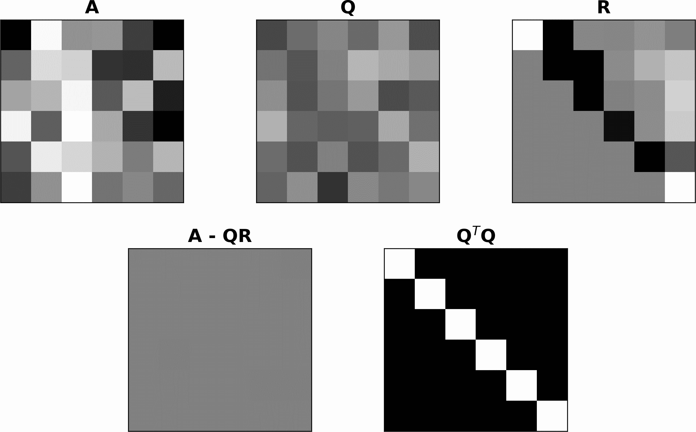
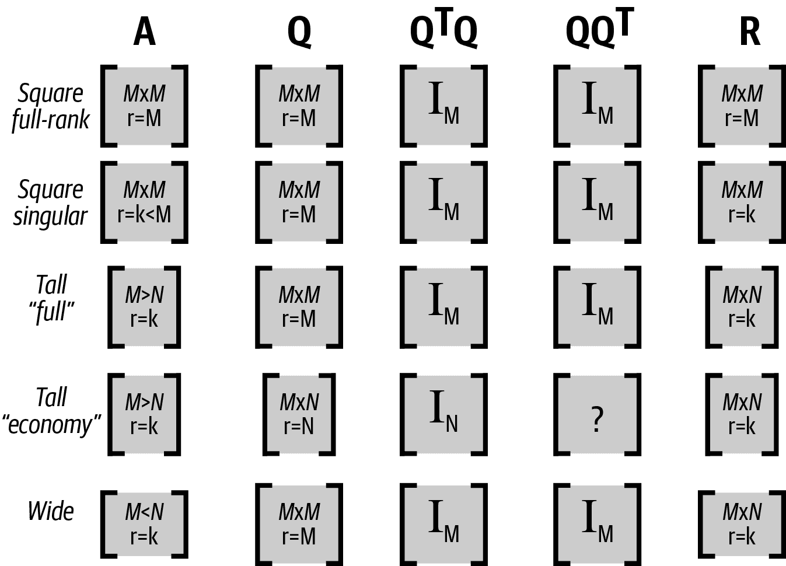
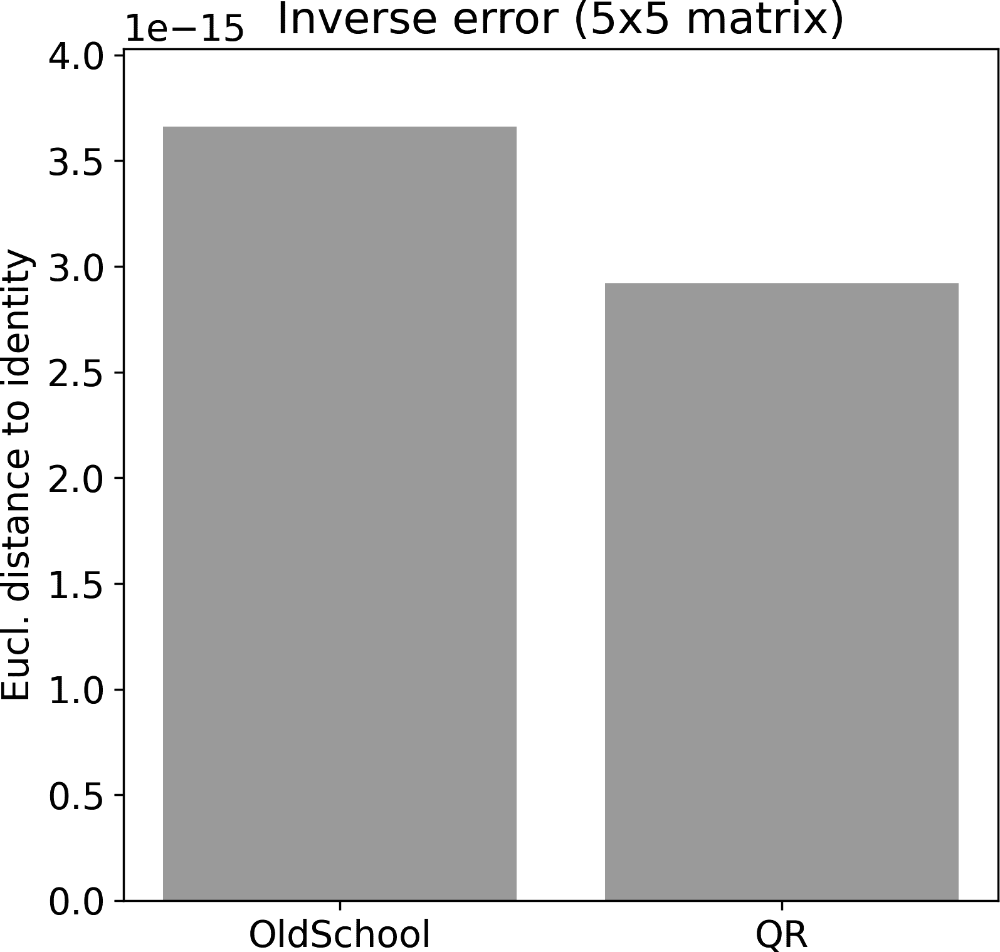
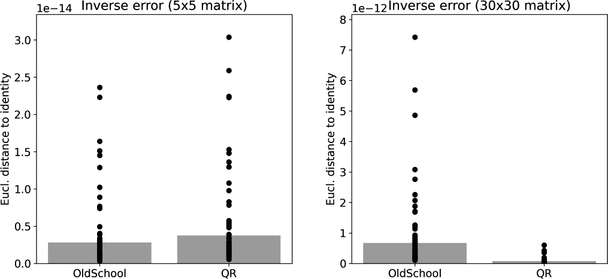

# 第九章：正交矩阵和 QR 分解

您将在本书中学习五种主要的分解：正交向量分解、QR 分解、LU 分解、特征分解和奇异值分解。这些不是线性代数中唯一的分解，但它们是数据科学和机器学习中最重要的分解方法之一。

在本章中，您将学习 QR。并且在此过程中，您将学习一种新的特殊类型的矩阵（正交矩阵）。QR 分解是许多应用的基础，包括矩阵求逆、最小二乘模型拟合和特征分解。因此，理解和熟悉 QR 分解将帮助您提升线性代数技能。

# 正交矩阵

我将首先介绍正交矩阵给您。*正交矩阵*是一种特殊的矩阵，对于多种分解（包括 QR 分解、特征分解和奇异值分解）至关重要。字母<math alttext="bold upper Q"><mi>𝐐</mi></math>通常用来表示正交矩阵。正交矩阵具有两个特性：

正交列

所有列都是两两正交的。

单位范数列

每列的范数（几何长度）恰好为 1。

我们可以将这两个特性翻译成数学表达式（请记住<math alttext="mathematical left-angle bold a comma bold b mathematical right-angle"><mrow><mo>〈</mo> <mi>𝐚</mi> <mo>,</mo> <mi>𝐛</mi> <mo>〉</mo></mrow></math>是点积的另一种表示方法）：

<math alttext="mathematical left-angle bold q Subscript i Baseline comma bold q Subscript j Baseline mathematical right-angle equals StartLayout Enlarged left-brace 1st Row  0 comma if i not-equals j 2nd Row  1 comma if i equals j EndLayout" display="block"><mrow><mrow><mo>〈</mo> <msub><mi>𝐪</mi> <mi>i</mi></msub> <mo>,</mo> <msub><mi>𝐪</mi> <mi>j</mi></msub> <mo>〉</mo></mrow> <mo>=</mo> <mfenced close="" open="{" separators=""><mtable><mtr><mtd columnalign="left"><mrow><mn>0</mn> <mo>,</mo> <mtext>if</mtext> <mi>i</mi> <mo>≠</mo> <mi>j</mi></mrow></mtd></mtr> <mtr><mtd columnalign="left"><mrow><mn>1</mn> <mo>,</mo> <mtext>if</mtext> <mi>i</mi> <mo>=</mo> <mi>j</mi></mrow></mtd></mtr></mtable></mfenced></mrow></math>

这是什么意思？这意味着列与自身的点积为 1，而列与任何其他列的点积为 0。这是许多点积，只有两种可能的结果。我们可以通过将矩阵与其转置的乘积前置来组织所有列对之间的点积。请记住，矩阵乘法定义为左矩阵的所有行与右矩阵的所有列的点积；因此，<math alttext="bold upper Q Superscript upper T"><msup><mi>𝐐</mi> <mtext>T</mtext></msup></math>的行是<math alttext="bold upper Q"><mi>𝐐</mi></math>的列。

表达两个正交矩阵关键属性的矩阵方程式简直是奇妙的：

<math alttext="bold upper Q Superscript upper T Baseline bold upper Q equals bold upper I" display="block"><mrow><msup><mi>𝐐</mi> <mtext>T</mtext></msup> <mi>𝐐</mi> <mo>=</mo> <mi>𝐈</mi></mrow></math>

表达式<math alttext="bold upper Q Superscript upper T Baseline bold upper Q equals bold upper I"><mrow><msup><mi>𝐐</mi> <mtext>T</mtext></msup> <mi>𝐐</mi> <mo>=</mo> <mi>𝐈</mi></mrow></math>令人惊叹。真的，这是一件大事。

为什么这很重要？因为<math alttext="bold upper Q Superscript upper T"><msup><mi>𝐐</mi> <mtext>T</mtext></msup></math>是一个将<math alttext="bold upper Q"><mi>𝐐</mi></math>乘以产生单位矩阵的矩阵。这与矩阵的逆矩阵的确切定义相同。因此，正交矩阵的逆矩阵是其转置矩阵。这非常酷，因为矩阵的逆矩阵复杂且容易出现数值不准确，而矩阵的转置矩阵则快速且准确。

这样的矩阵真的存在吗，还是只是数据科学家想象中的产物？是的，它们确实存在。事实上，单位矩阵就是正交矩阵的一个例子。以下是另外两个例子：

<math alttext="StartFraction 1 Over StartRoot 2 EndRoot EndFraction Start 2 By 2 Matrix 1st Row 1st Column 1 2nd Column negative 1 2nd Row 1st Column 1 2nd Column 1 EndMatrix comma one-third Start 3 By 3 Matrix 1st Row 1st Column 1 2nd Column 2 3rd Column 2 2nd Row 1st Column 2 2nd Column 1 3rd Column negative 2 3rd Row 1st Column negative 2 2nd Column 2 3rd Column negative 1 EndMatrix" display="block"><mrow><mfrac><mn>1</mn> <msqrt><mn>2</mn></msqrt></mfrac> <mfenced close="]" open="["><mtable><mtr><mtd><mn>1</mn></mtd> <mtd><mrow><mo>-</mo> <mn>1</mn></mrow></mtd></mtr> <mtr><mtd><mn>1</mn></mtd> <mtd><mrow><mphantom><mo>-</mo></mphantom> <mn>1</mn></mrow></mtd></mtr></mtable></mfenced> <mo>,</mo> <mfrac><mn>1</mn> <mn>3</mn></mfrac> <mfenced close="]" open="["><mtable><mtr><mtd><mrow><mphantom><mo>-</mo></mphantom> <mn>1</mn></mrow></mtd> <mtd><mrow><mphantom><mo>-</mo></mphantom> <mn>2</mn></mrow></mtd> <mtd><mrow><mphantom><mo>-</mo></mphantom> <mn>2</mn></mrow></mtd></mtr> <mtr><mtd><mrow><mphantom><mo>-</mo></mphantom> <mn>2</mn></mrow></mtd> <mtd><mrow><mphantom><mo>-</mo></mphantom> <mn>1</mn></mrow></mtd> <mtd><mrow><mo>-</mo> <mn>2</mn></mrow></mtd></mtr> <mtr><mtd><mrow><mo>-</mo> <mn>2</mn></mrow></mtd> <mtd><mrow><mphantom><mo>-</mo></mphantom> <mn>2</mn></mrow></mtd> <mtd><mrow><mo>-</mo> <mn>1</mn></mrow></mtd></mtr></mtable></mfenced></mrow></math>

请花一点时间确认每一列的长度为单位长度，并且与其他列正交。然后我们可以在 Python 中确认：

```
Q1 = np.array([ [1,-1],[1,1] ]) / np.sqrt(2)
Q2 = np.array([ [1,2,2],[2,1,-2],[-2,2,-1] ]) / 3

print( Q1.T @ Q1 )
print( Q2.T @ Q2 )
```

两个输出都是单位矩阵（在约为 10^(-15)的舍入误差内）。如果计算<math alttext="bold upper Q bold upper Q Superscript upper T"><mrow><mi>𝐐</mi> <msup><mi>𝐐</mi> <mtext>T</mtext></msup></mrow></math>会发生什么？那仍然是单位矩阵吗？试试看！¹

另一个正交矩阵的例子是你在第七章中学到的纯旋转矩阵。你可以回顾那段代码，并确认变换矩阵乘以其转置矩阵为单位矩阵，无论旋转角度如何（只要所有矩阵元素使用相同的旋转角度）。排列矩阵也是正交的。排列矩阵用于交换矩阵的行；在下一章中，你将学习关于 LU 分解的讨论。

如何创建这样宏伟的数学奇迹？正交矩阵可以通过 QR 分解从非正交矩阵中计算得到，这基本上是 Gram-Schmidt 的复杂版本。Gram-Schmidt 是如何工作的？这基本上是你在第二章中学到的正交向量分解。

# Gram-Schmidt

Gram-Schmidt 过程是将非正交矩阵转换为正交矩阵的方法。Gram-Schmidt 具有很高的教育价值，但非常遗憾的是应用价值很小。原因在于，正如你之前已经读过的那样，由于许多除法和乘法操作中涉及到的小数，导致数值不稳定。幸运的是，还有更复杂和数值稳定的 QR 分解方法，例如 Householder 反射。这些算法的细节超出了本书的范围，但由 Python 调用的低级数值计算库处理。

尽管如此，我将描述 Gram-Schmidt 过程（有时缩写为 GS 或 G-S），因为它展示了正交向量分解的应用，因为你将基于以下数学和描述在 Python 中编程该算法，并且因为 GS 是理解 QR 分解如何工作的正确方式，即使低级实现略有不同。

由列 <math alttext="bold v 1"><msub><mi>𝐯</mi> <mn>1</mn></msub></math> 到 <math alttext="bold v Subscript n"><msub><mi>𝐯</mi> <mi>n</mi></msub></math> 组成的矩阵 <math alttext="bold upper V"><mi>𝐕</mi></math> 被转换为一个具有列 <math alttext="bold q Subscript k"><msub><mi>𝐪</mi> <mi>k</mi></msub></math> 的正交矩阵 <math alttext="bold upper Q"><mi>𝐐</mi></math> ，根据以下算法。

对于矩阵 <math alttext="bold upper V"><mi>𝐕</mi></math> 中从第一列（最左边）开始系统地移动到最后一列（最右边）的所有列向量：

1.  使用正交向量分解将 <math alttext="bold v Subscript k"><msub><mi>𝐯</mi> <mi>k</mi></msub></math> 正交化到矩阵 <math alttext="bold upper Q"><mi>𝐐</mi></math> 中所有之前的列。也就是说，计算 <math alttext="bold v Subscript k"><msub><mi>𝐯</mi> <mi>k</mi></msub></math> 在 <math alttext="bold q Subscript k minus 1"><msub><mi>𝐪</mi> <mrow><mi>k</mi><mo>-</mo><mn>1</mn></mrow></msub></math> ， <math alttext="bold q Subscript k minus 2"><msub><mi>𝐪</mi> <mrow><mi>k</mi><mo>-</mo><mn>2</mn></mrow></msub></math> 直至 <math alttext="bold q 1"><msub><mi>𝐪</mi> <mn>1</mn></msub></math> 的垂直分量。正交化后的向量称为 <math alttext="bold v Subscript k Superscript asterisk"><msubsup><mi>𝐯</mi> <mi>k</mi> <mo>*</mo></msubsup></math> 。²

1.  将 <math alttext="bold v Subscript k Superscript asterisk"><msubsup><mi>𝐯</mi> <mi>k</mi> <mo>*</mo></msubsup></math> 归一化为单位长度。现在这是 <math alttext="bold q Subscript k"><msub><mi>𝐪</mi> <mi>k</mi></msub></math> ，矩阵 <math alttext="bold upper Q"><mi>𝐐</mi></math> 中的第 *k* 列。

听起来很简单，不是吗？在代码中实现这个算法可能会有些棘手，因为需要重复进行正交化。但只要有些坚持，你就能搞明白（习题 9-2）。

# QR 分解

GS 过程将一个矩阵转换为正交矩阵 <math alttext="bold upper Q"><mi>𝐐</mi></math> 。（正如我在前一节中所述，实际上通过一系列称为 Householder 变换的向量平面反射来获得 <math alttext="bold upper Q"><mi>𝐐</mi></math> ，但这是由于数值问题；GS 是理解 QR 分解形成的一个很好的方式。）

# 声音中有什么？

“QR”分解中的“QR”发音为“queue are”。在我看来，这真是一个错失的机会；如果我们把它发音为“QweRty decomposition”，学习线性代数可能会更有趣。或者，我们可以将其发音为“core decomposition”，以吸引健身人群。但是，无论好坏，现代惯例都受历史先例的影响。

显然，<math alttext="bold upper Q"><mi>𝐐</mi></math>与原始矩阵不同（假设原始矩阵不是正交的）。因此，我们失去了关于该矩阵的信息。幸运的是，这些“丢失”的信息可以轻松地恢复并存储在另一个矩阵<math alttext="bold upper R"><mi>𝐑</mi></math>中，该矩阵乘以<math alttext="bold upper Q"><mi>𝐐</mi></math>。³ 这就引出了我们如何创建<math alttext="bold upper R"><mi>𝐑</mi></math>的问题。事实上，创建<math alttext="bold upper R"><mi>𝐑</mi></math>是直截了当的，并直接来自 QR 的定义：

<math alttext="StartLayout 1st Row 1st Column bold upper A 2nd Column equals bold upper Q bold upper R 2nd Row 1st Column bold upper Q Superscript upper T Baseline bold upper A 2nd Column equals bold upper Q Superscript upper T Baseline bold upper Q bold upper R 3rd Row 1st Column bold upper Q Superscript upper T Baseline bold upper A 2nd Column equals bold upper R EndLayout" display="block"><mtable displaystyle="true"><mtr><mtd columnalign="right"><mi>𝐀</mi></mtd> <mtd columnalign="left"><mrow><mo>=</mo> <mi>𝐐</mi> <mi>𝐑</mi></mrow></mtd></mtr> <mtr><mtd columnalign="right"><mrow><msup><mi>𝐐</mi> <mtext>T</mtext></msup> <mi>𝐀</mi></mrow></mtd> <mtd columnalign="left"><mrow><mo>=</mo> <msup><mi>𝐐</mi> <mtext>T</mtext></msup> <mi>𝐐</mi> <mi>𝐑</mi></mrow></mtd></mtr> <mtr><mtd columnalign="right"><mrow><msup><mi>𝐐</mi> <mtext>T</mtext></msup> <mi>𝐀</mi></mrow></mtd> <mtd columnalign="left"><mrow><mo>=</mo> <mi>𝐑</mi></mrow></mtd></mtr></mtable></math>

在这里，您可以看到正交矩阵的美妙之处：我们可以解决矩阵方程，而不必担心计算逆矩阵。

以下 Python 代码展示了如何计算方阵的 QR 分解，图 9-1 说明了这三个矩阵：

```
A = np.random.randn(6,6)
Q,R = np.linalg.qr(A)
```



###### 图 9-1。随机数矩阵的 QR 分解

QR 分解的几个重要特征在图 9-1 中可见，包括<math alttext="bold upper A equals bold upper Q bold upper R"><mrow><mi>𝐀</mi> <mo>=</mo> <mi>𝐐</mi> <mi>𝐑</mi></mrow></math>（它们的差异是零矩阵）以及<math alttext="bold upper Q"><mi>𝐐</mi></math>乘以其转置矩阵得到单位矩阵。

检查<math alttext="bold upper R"><mi>𝐑</mi></math>矩阵：它是上三角矩阵（对角线以下的所有元素都为零）。考虑到我们从一个随机矩阵开始，这似乎不可能是偶然发生的。事实上，<math alttext="bold upper R"><mi>𝐑</mi></math>矩阵总是上三角的。要理解其中的原因，您需要思考 GS 算法和矩阵乘法中点积的组织方式。在下一节中，我将解释为什么<math alttext="bold upper R"><mi>𝐑</mi></math>是上三角的；在那之前，我希望您能想出一个答案。

## Q 和 R 的尺寸

<math alttext="bold upper Q"><mi>𝐐</mi></math>和<math alttext="bold upper R"><mi>𝐑</mi></math>的尺寸取决于待分解矩阵<math alttext="bold upper A"><mi>𝐀</mi></math>的大小，以及 QR 分解是“经济”（也称为“减少”）还是“完全”（也称为“完整”）。图 9-2 显示了所有可能尺寸的概述。

经济与完整的 QR 分解仅适用于高矩阵。问题在于对于一个高矩阵（*M* > *N*），我们是创建一个具有*N*列还是*M*列的<math alttext="bold upper Q"><mi>𝐐</mi></math>矩阵？前者选项称为*经济*或*减少*，给出一个高<math alttext="bold upper Q"><mi>𝐐</mi></math>；后者选项称为*完整*或*完全*，给出一个方形<math alttext="bold upper Q"><mi>𝐐</mi></math>。



###### 图 9-2。**Q**和**R**的大小取决于**A**的大小。“?”表示矩阵元素取决于**A**中的值，即它不是单位矩阵。

当<math alttext="bold upper A"><mi>𝐀</mi></math>高时（换句话说，<math alttext="bold upper Q"><mi>𝐐</mi></math>可以比<math alttext="bold upper A"><mi>𝐀</mi></math>列更多），<math alttext="bold upper Q"><mi>𝐐</mi></math>可以是方形的事实，额外的列来自哪里？事实上，可以“凭空”制作正交向量。考虑以下 Python 示例：

```
A = np.array([ [1,-1] ]).T
Q,R = np.linalg.qr(A,'complete')
Q*np.sqrt(2) # scaled by sqrt(2) to get integers

>> array([[-1.,  1.],
          [ 1.,  1.]])
```

注意可选的第二个输入`'complete'`，它会产生完整的 QR 分解。将其设置为`'reduced'`（默认情况），则会得到经济模式的 QR 分解，其中<math alttext="bold upper Q"><mi>𝐐</mi></math>的大小与<math alttext="bold upper A"><mi>𝐀</mi></math>相同。

因为可以从具有*N*列的矩阵中制作多于*M* > *N*个正交向量，所以<math alttext="bold upper Q"><mi>𝐐</mi></math>的秩总是可能的最大秩，对于所有方形<math alttext="bold upper Q"><mi>𝐐</mi></math>矩阵为*M*，对于经济<math alttext="bold upper Q"><mi>𝐐</mi></math>为*N*。<math alttext="bold upper R"><mi>𝐑</mi></math>的秩与<math alttext="bold upper A"><mi>𝐀</mi></math>的秩相同。

由正交化引起的<math alttext="bold upper Q"><mi>𝐐</mi></math>和<math alttext="bold upper A"><mi>𝐀</mi></math>秩的差异意味着<math alttext="bold upper Q"><mi>𝐐</mi></math>跨越了所有<math alttext="double-struck upper R Superscript upper M"><msup><mi>ℝ</mi> <mi>M</mi></msup></math>，即使<math alttext="bold upper A"><mi>𝐀</mi></math>的列空间仅是<math alttext="double-struck upper R Superscript upper M"><msup><mi>ℝ</mi> <mi>M</mi></msup></math>的低维子空间。这个事实是为什么奇异值分解对于揭示矩阵的性质，包括其秩和零空间，非常有用的中心原因。期待在第十四章学习 SVD 的另一个原因！

关于唯一性的注意事项：QR 分解对于所有矩阵大小和秩都不是唯一的。这意味着可能会得到 <math alttext="bold upper A equals bold upper Q 1 bold upper R 1"><mrow><mi>𝐀</mi> <mo>=</mo> <msub><mi>𝐐</mi> <mn>1</mn></msub> <msub><mi>𝐑</mi> <mn>1</mn></msub></mrow></math> 和 <math alttext="bold upper A equals bold upper Q 2 bold upper R 2"><mrow><mi>𝐀</mi> <mo>=</mo> <msub><mi>𝐐</mi> <mn>2</mn></msub> <msub><mi>𝐑</mi> <mn>2</mn></msub></mrow></math>，其中 <math alttext="bold upper Q 1 not-equals bold upper Q 2"><mrow><msub><mi>𝐐</mi> <mn>1</mn></msub> <mo>≠</mo> <msub><mi>𝐐</mi> <mn>2</mn></msub></mrow></math> 。然而，所有 QR 分解结果在本节中描述的属性上都是相同的。通过附加约束（例如，<math alttext="bold upper R"><mi>𝐑</mi></math> 的对角线上的正值），可以使 QR 分解唯一化，尽管在大多数情况下这并不是必需的，并且在 Python 或 MATLAB 中也没有实现。在 Exercise 9-2 中比较 GS 和 QR 时，你会看到这种非唯一性。

### 为什么 <math alttext="bold upper R"><mi>𝐑</mi></math> 是上三角形的

希望您认真考虑了这个问题。这是关于 QR 分解的一个棘手点，如果您自己无法弄清楚，请阅读接下来的几段文字，然后远离书本/屏幕，重新推导出这个论点。

我将首先提醒您三个事实：

+   <math alttext="bold upper R"><mi>𝐑</mi></math> 来自公式 <math alttext="bold upper Q Superscript upper T Baseline bold upper A equals bold upper R"><mrow><msup><mi>𝐐</mi> <mtext>T</mtext></msup> <mi>𝐀</mi> <mo>=</mo> <mi>𝐑</mi></mrow></math> 。

+   一个乘积矩阵的下三角由左矩阵的*后续*行和右矩阵的*先前*列的点积组成。

+   <math alttext="bold upper Q Superscript upper T"><msup><mi>𝐐</mi> <mtext>T</mtext></msup></math> 的行是 <math alttext="bold upper Q"><mi>𝐐</mi></math> 的列。

将它们放在一起：因为正交化是从左到右逐列进行的，<math alttext="bold upper Q"><mi>𝐐</mi></math> 中的*后续*列被正交化为<math alttext="bold upper A"><mi>𝐀</mi></math> 中的*先前*列。因此，<math alttext="bold upper R"><mi>𝐑</mi></math> 的下三角来自已经正交化的向量对。相反，<math alttext="bold upper Q"><mi>𝐐</mi></math> 中的*先前*列未被正交化为<math alttext="bold upper A"><mi>𝐀</mi></math> 中的*后续*列，因此我们不会期望它们的点积为零。

最后评论：如果 <math alttext="bold upper A"><mi>𝐀</mi></math> 的第 *i* 列和第 *j* 列已经正交，则 <math alttext="bold upper R"><mi>𝐑</mi></math> 的对应 (*i,j*) 元素将为零。事实上，如果你计算一个正交矩阵的 QR 分解，那么 <math alttext="bold upper R"><mi>𝐑</mi></math> 将是一个对角矩阵，其对角线元素是 <math alttext="bold upper A"><mi>𝐀</mi></math> 每列的范数。这意味着如果 <math alttext="bold upper A equals bold upper Q"><mrow><mi>𝐀</mi> <mo>=</mo> <mi>𝐐</mi></mrow></math> ，那么 <math alttext="bold upper R equals bold upper I"><mrow><mi>𝐑</mi> <mo>=</mo> <mi>𝐈</mi></mrow></math> ，这从求解 <math alttext="bold upper R"><mi>𝐑</mi></math> 的方程式中显而易见。你将在 练习 9-3 中深入探讨这一点。

## QR 和逆矩阵

QR 分解提供了一种计算矩阵逆的更为数值稳定的方式。

让我们首先写出 QR 分解公式，并倒转方程的两侧（注意应用 LIVE EVIL 规则）：

<math alttext="StartLayout 1st Row 1st Column bold upper A 2nd Column equals bold upper Q bold upper R 2nd Row 1st Column bold upper A Superscript negative 1 2nd Column equals left-parenthesis bold upper Q bold upper R right-parenthesis Superscript negative 1 Baseline 3rd Row 1st Column bold upper A Superscript negative 1 2nd Column equals bold upper R Superscript negative 1 Baseline bold upper Q Superscript negative 1 Baseline 4th Row 1st Column bold upper A Superscript negative 1 2nd Column equals bold upper R Superscript negative 1 Baseline bold upper Q Superscript upper T EndLayout" display="block"><mtable displaystyle="true"><mtr><mtd columnalign="right"><mi>𝐀</mi></mtd> <mtd columnalign="left"><mrow><mo>=</mo> <mi>𝐐</mi> <mi>𝐑</mi></mrow></mtd></mtr> <mtr><mtd columnalign="right"><msup><mi>𝐀</mi> <mrow><mo>-</mo><mn>1</mn></mrow></msup></mtd> <mtd columnalign="left"><mrow><mo>=</mo> <msup><mrow><mo>(</mo><mi>𝐐</mi><mi>𝐑</mi><mo>)</mo></mrow> <mrow><mo>-</mo><mn>1</mn></mrow></msup></mrow></mtd></mtr> <mtr><mtd columnalign="right"><msup><mi>𝐀</mi> <mrow><mo>-</mo><mn>1</mn></mrow></msup></mtd> <mtd columnalign="left"><mrow><mo>=</mo> <msup><mi>𝐑</mi> <mrow><mo>-</mo><mn>1</mn></mrow></msup> <msup><mi>𝐐</mi> <mrow><mo>-</mo><mn>1</mn></mrow></msup></mrow></mtd></mtr> <mtr><mtd columnalign="right"><msup><mi>𝐀</mi> <mrow><mo>-</mo><mn>1</mn></mrow></msup></mtd> <mtd columnalign="left"><mrow><mo>=</mo> <msup><mi>𝐑</mi> <mrow><mo>-</mo><mn>1</mn></mrow></msup> <msup><mi>𝐐</mi> <mtext>T</mtext></msup></mrow></mtd></mtr></mtable></math>

因此，我们可以将 <math alttext="bold upper A"><mi>𝐀</mi></math> 的逆矩阵表示为 <math alttext="bold upper R"><mi>𝐑</mi></math> 的逆乘以 <math alttext="bold upper Q"><mi>𝐐</mi></math> 的转置。由于 Householder 反射算法，<math alttext="bold upper Q"><mi>𝐐</mi></math> 是数值稳定的，而由矩阵乘法得到的 <math alttext="bold upper R"><mi>𝐑</mi></math> 也是数值稳定的。

现在，我们仍然需要明确地求解 <math alttext="bold upper R"><mi>𝐑</mi></math> 的逆，但通过称为回代的过程来求解上三角矩阵在数值上是高度稳定的。你将在下一章节中了解更多，但关键点在于：QR 分解的一个重要应用是提供一种比前一章节介绍的算法更为数值稳定的方式来求逆矩阵。

另一方面，请记住，理论上可逆但接近奇异的矩阵仍然非常难以求逆；QR 分解可能比前一章节介绍的传统算法*更*数值稳定，但这并不保证高质量的逆矩阵。浸在蜂蜜中的烂苹果仍然是烂的。

# 总结

QR 分解非常棒。它绝对是线性代数中前五个最棒的矩阵分解之一。以下是本章的主要要点：

+   正交矩阵具有两两正交且范数为 1 的列。正交矩阵是几种矩阵分解的关键，包括 QR 分解、特征分解和奇异值分解。在几何学和计算机图形学中（如纯旋转矩阵），正交矩阵也非常重要。

+   您可以通过 Gram-Schmidt 过程将非正交矩阵转换为正交矩阵，该过程涉及应用正交向量分解来隔离每一列中与所有前一列正交的分量（“前一列”指从左到右）。

+   QR 分解是 Gram-Schmidt 的结果（严格来说，它是通过更稳定的算法实现的，但 GS 仍是理解它的正确方式）。

# 代码练习

##### 练习 9-1\.

一个方阵<math alttext="bold upper Q"><mi>𝐐</mi></math>具有以下等式：

<math alttext="bold upper Q Superscript upper T Baseline bold upper Q equals bold upper Q bold upper Q Superscript upper T Baseline equals bold upper Q Superscript hyphen 1 Baseline bold upper Q equals bold upper Q bold upper Q Superscript hyphen 1 Baseline equals bold upper I" display="block"><mrow><msup><mi>𝐐</mi> <mtext>T</mtext></msup> <mi>𝐐</mi> <mo>=</mo> <mi>𝐐</mi> <msup><mi>𝐐</mi> <mtext>T</mtext></msup> <mo>=</mo> <msup><mi>𝐐</mi> <mtext>-1</mtext></msup> <mi>𝐐</mi> <mo>=</mo> <mi>𝐐</mi> <msup><mi>𝐐</mi> <mtext>-1</mtext></msup> <mo>=</mo> <mi>𝐈</mi></mrow></math>

通过从随机数矩阵计算<math alttext="bold upper Q"><mi>𝐐</mi></math>来在代码中演示这一点，然后计算<math alttext="bold upper Q Superscript upper T"><msup><mi>𝐐</mi> <mtext>T</mtext></msup></math>和<math alttext="bold upper Q Superscript negative 1"><msup><mi>𝐐</mi> <mrow><mo>-</mo><mn>1</mn></mrow></msup></math>。然后展示这四个表达式都产生单位矩阵。

##### 练习 9-2\.

按照前述步骤实现 Gram-Schmidt 过程。使用一个<math alttext="4 times 4"><mrow><mn>4</mn> <mo>×</mo> <mn>4</mn></mrow></math>随机数矩阵。检查您的答案是否与`np.linalg.qr`中的<math alttext="bold upper Q"><mi>𝐐</mi></math>一致。

**重要提示**：在像 Householder 反射这样的变换中存在根本性的符号不确定性。这意味着向量可以根据算法和实现的细微差异“翻转”（乘以-1）。这种特性存在于许多矩阵分解中，包括特征向量。我在第十三章中对此进行了更长更深入的讨论。暂且而言，要点是这样的：从 Python 的<math alttext="bold upper Q"><mi>𝐐</mi></math>中*减去*您的<math alttext="bold upper Q"><mi>𝐐</mi></math>，并*加上*您的<math alttext="bold upper Q"><mi>𝐐</mi></math>和 Python 的<math alttext="bold upper Q"><mi>𝐐</mi></math>。其中一个中的非零列将在另一个中为零列。

##### 练习 9-3\.

在这个练习中，您将了解在将几乎正交的矩阵应用 QR 分解时会发生什么。首先，从一个<math alttext="6 times 6"><mrow><mn>6</mn> <mo>×</mo> <mn>6</mn></mrow></math>随机数矩阵的 QR 分解创建一个称为<math alttext="bold upper U"><mi>𝐔</mi></math>的正交矩阵。计算<math alttext="bold upper U"><mi>𝐔</mi></math>的 QR 分解，并确认<math alttext="bold upper R equals bold upper I"><mrow><mi>𝐑</mi> <mo>=</mo> <mi>𝐈</mi></mrow></math>（并确保您理解为什么！）。

其次，修改每列 <math alttext="bold upper U"><mi>𝐔</mi></math> 的范数。将列 1–6 的范数设置为 10–15（即，<math alttext="bold upper U"><mi>𝐔</mi></math> 的第一列应该有一个范数为 10，第二列应该有一个范数为 11，依此类推）。将调整后的 <math alttext="bold upper U"><mi>𝐔</mi></math> 矩阵通过 QR 分解，并确认其 <math alttext="bold upper R"><mi>𝐑</mi></math> 是对角矩阵，对角线元素等于 10–15\. 对于这个矩阵，<math alttext="bold upper Q Superscript upper T Baseline bold upper Q"><mrow><msup><mi>𝐐</mi> <mtext>T</mtext></msup> <mi>𝐐</mi></mrow></math> 是什么？

第三步，通过设置元素 <math alttext="u Subscript 1 comma 4 Baseline equals 0"><mrow><msub><mi>u</mi> <mrow><mn>1</mn><mo>,</mo><mn>4</mn></mrow></msub> <mo>=</mo> <mn>0</mn></mrow></math> 来打破 <math alttext="bold upper U"><mi>𝐔</mi></math> 的正交性。 <math alttext="bold upper R"><mi>𝐑</mi></math> 会发生什么？为什么？

##### 练习 9-4\.

这个练习的目的是比较使用前一章学到的“老派”逆方法与基于 QR 的逆方法的数值误差。我们将使用随机数矩阵，注意它们倾向于是数值稳定的，因此具有准确的逆矩阵。

这是该做的事情：将代码从 Exercise 8-2 复制到一个 Python 函数中，该函数以矩阵作为输入，并输出其逆矩阵。（您还可以包含一个检查输入矩阵是否为方阵和满秩的检查。）我将这个函数称为 `oldSchoolInv`。接下来，创建一个 <math alttext="5 times 5"><mrow><mn>5</mn> <mo>×</mo> <mn>5</mn></mrow></math> 的随机数矩阵。使用上一章介绍的“老派方法”和本章介绍的 QR 分解方法计算其逆矩阵（您可以使用您的“老派方法”计算 <math alttext="bold upper R Superscript negative 1"><msup><mi>𝐑</mi> <mrow><mo>-</mo><mn>1</mn></mrow></msup></math> ）。将矩阵乘以其逆矩阵，并计算到真实单位矩阵 `np.eye` 的欧氏距离作为逆估计误差。制作一个条形图显示结果，将两种方法显示在 *x* 轴上，误差（到 <math alttext="bold upper I"><mi>𝐈</mi></math> 的欧氏距离）显示在 *y* 轴上，就像 Figure 9-3 中所示。



###### 图 9-3\. 练习 9-4 的结果

多次运行代码并检查条形图。您会发现有时候“老派”方法更好，而其他时候 QR 方法更好（较小的数字更好；理论上，条应该高度为零）。尝试使用 <math alttext="30 times 30"><mrow><mn>30</mn> <mo>×</mo> <mn>30</mn></mrow></math> 矩阵再次尝试。结果更一致了吗？实际上，每次运行结果都有很大差异。这意味着我们应该进行一项实验，多次重复比较。这就是下一个练习。

##### 练习 9-5\.

将前一个练习中的代码放入一个`for`循环中，重复 100 次实验，每次使用不同的随机数矩阵。存储每次迭代的误差（欧几里得距离），并制作像图 9-4 那样的图表，显示所有实验运行的平均值（灰色条）和所有单个误差（黑色点）。运行<math alttext="5 times 5"><mrow><mn>5</mn> <mo>×</mo> <mn>5</mn></mrow></math>和<math alttext="30 times 30"><mrow><mn>30</mn> <mo>×</mo> <mn>30</mn></mrow></math>矩阵的实验。

你也可以尝试使用`np.linalg.inv`来反转<math alttext="bold upper R"><mi>𝐑</mi></math>，而不是传统的方法，看看是否有影响。



###### 图 9-4\. 练习 9-5 的结果。请注意左右面板在 y 轴缩放上的差异。

##### 练习 9-6.

方阵正交矩阵的一个有趣特性是它们的所有奇异值（及其特征值）都是 1。这意味着它们有一个诱导 2-范数为 1（诱导范数是最大奇异值），并且它们有一个 Frobenius 范数为*M*。后者的结果是因为 Frobenius 范数等于所有奇异值的平方和的平方根。在这个练习中，你将确认这些特性。

创建一个<math alttext="upper M times upper M"><mrow><mi>M</mi> <mo>×</mo> <mi>M</mi></mrow></math>正交矩阵作为一个随机矩阵的 QR 分解。使用`np.linalg.norm`计算其诱导 2-范数，并使用你在第 6 章学到的公式计算其 Frobenius 范数，除以*M*的平方根。确认这两个量约为 1（考虑到四舍五入误差的合理容差）。使用几个不同的*M*值进行检查。

接下来，通过矩阵-向量乘法探索诱导范数的含义。创建一个随机的*M*元素列向量<math alttext="bold v"><mi>𝐯</mi></math>。然后计算<math alttext="bold v"><mi>𝐯</mi></math>和<math alttext="bold upper Q bold v"><mrow><mi>𝐐</mi> <mi>𝐯</mi></mrow></math>的范数。这些范数应该相等（尽管你不会期望它们等于 1）。

最后，拿一张纸，发展一个证明这个经验演示的证明。这个证明在下一段打印出来，所以不要往下看！但如果你需要提示，可以查看脚注⁵。

我真诚地希望你读这篇文章是为了检查你的推理能力，而不是作弊！不管怎样，证明是向量范数 <math alttext="parallel-to bold v parallel-to"><mrow><mo>∥</mo> <mi>𝐯</mi> <mo>∥</mo></mrow></math> 可以计算为 <math alttext="bold v Superscript upper T Baseline bold v"><mrow><msup><mi>𝐯</mi> <mtext>T</mtext></msup> <mi>𝐯</mi></mrow></math> ；因此，向量范数 <math alttext="parallel-to bold upper Q bold v parallel-to"><mrow><mo>∥</mo> <mi>𝐐</mi> <mi>𝐯</mi> <mo>∥</mo></mrow></math> 计算为 <math alttext="left-parenthesis bold upper Q bold v right-parenthesis Superscript upper T Baseline bold upper Q bold v equals bold v Superscript upper T Baseline bold upper Q Superscript upper T Baseline bold upper Q bold v"><mrow><msup><mrow><mo>(</mo><mi>𝐐</mi><mi>𝐯</mi><mo>)</mo></mrow> <mtext>T</mtext></msup> <mi>𝐐</mi> <mi>𝐯</mi> <mo>=</mo> <msup><mi>𝐯</mi> <mtext>T</mtext></msup> <msup><mi>𝐐</mi> <mtext>T</mtext></msup> <mi>𝐐</mi> <mi>𝐯</mi></mrow></math> 。<math alttext="bold upper Q Superscript upper T Baseline bold upper Q"><mrow><msup><mi>𝐐</mi> <mtext>T</mtext></msup> <mi>𝐐</mi></mrow></math> 取消以得到单位矩阵，留下向量与自身的点积。结论是正交矩阵可以旋转但不会缩放向量。

##### 练习 9-7。

这个练习将突出 <math alttext="bold upper R"><mi>𝐑</mi></math> 矩阵的一个特点，这个特点对于理解如何使用 QR 分解来实现最小二乘法（第十二章）非常重要：当 <math alttext="bold upper A"><mi>𝐀</mi></math> 高且满列秩时，<math alttext="bold upper R"><mi>𝐑</mi></math> 的前 *N* 行是上三角的，而第 *N* + 1 行到 *M* 行是零。在 Python 中使用一个随机的 <math alttext="10 times 4"><mrow><mn>10</mn> <mo>×</mo> <mn>4</mn></mrow></math> 矩阵进行确认。确保使用完全（全）QR 分解，而不是经济（紧凑）分解。

当然，<math alttext="bold upper R"><mi>𝐑</mi></math> 是不可逆的，因为它不是方阵。但是（1）当<math alttext="bold upper A"><mi>𝐀</mi></math>是满列秩时，第一 *N* 行构成的子矩阵是方阵且满秩，因此具有完全的逆；（2）高瘦的 <math alttext="bold upper R"><mi>𝐑</mi></math> 具有伪逆。计算这两个逆，并确认 <math alttext="bold upper R"><mi>𝐑</mi></math> 的第一 *N* 行的完全逆等于高瘦 <math alttext="bold upper R"><mi>𝐑</mi></math> 的伪逆的第一 *N* 列。

¹ 这在 Exercise 9-1 中进一步探讨。

² 第一列向量不是正交的，因为没有前面的向量；因此，你从以下的标准化步骤开始。

³ 通过矩阵乘法恢复**R**是可能的，因为 GS 是一系列线性变换。

⁴ 在这个练习中花些时间，它相当具有挑战性。

⁵ 提示：写出向量范数的点积公式。
